# Introduction to

# Mathematical Statistics

Eighth Edition

Hogg

McKean

Craig

This page intentionally left blank

# Introduction to Mathematical Statistics

Eighth Edition

Robert V. Hogg

University of Iowa

Joseph W. McKean  
Western Michigan University

Allen T. Craig  
Late Professor of Statistics  
University of Iowa

Director, Portfolio Management: Deirdre Lynch  
Courseware Portfolio Manager: Patrick Barbera  
Portfolio Management Assistant: Morgan Danna  
Content Producer: Lauren Morse  
Managing Producer: Scott Disanno  
Product Marketing Manager: Yvonne Vannatta  
Field Marketing Manager: Evan St. Cyr  
Marketing Assistant: Jon Bryant  
Senior Author Support/Technology Specialist: Jo  
Manager, Rights and Permissions: Gina Cheselka  
Manufacturing Buyer: Carol Melville, LSC Comm  
Art Director: Barbara Atkinson  
Production Coordination and Illustrations: Integ  
Cover Design: Studio Montage  
Cover Image: Aleksandarvelasevic/Digital Vision

Copyright ©2019, 2013, 2005 by Pearson Education, Inc. All Rights Reserved. Printed in the United States of America. This publication is protected by copyright, and permission should be obtained from the publisher prior to any prohibited reproduction, storage in a retrieval system, or transmission in any form or by any means, electronic, mechanical, photocopying, recording, or otherwise. For information regarding permissions, request forms and the appropriate contacts within the Pearson Education Global Rights & Permissions department, please visit www.pearsoned.com/permissions/.

PEARSON and ALWAYS LEARNING are exclusive trademarks owned by Pearson Education, Inc. or its affiliates in the U.S. and/or other countries. Unless otherwise indicated herein, any third-party trademarks that may appear in this work are the property of their respective owners and any references to third-party trademarks, logos or other trade dress are for demonstrative or descriptive purposes only. Such references are not intended to imply any sponsorship, endorsement, authorization, or promotion of Pearson's products by the owners of such marks, or any relationship between the owner and Pearson Education, Inc. or its affiliates, authors, licensees or distributors.

# Library of Congress Cataloging-in-Publications Data

Names: Hogg, Robert V., author. | McKean, Joseph W., 1944- author. | Craig, Allen T. (Allen Thornton), 1905- author.

Title: Introduction to mathematical statistics / Robert V. Hogg, Late Professor of Statistics, University of Iowa, Joseph W. McKean, Western Michigan University, Allen T. Craig, Late Professor of Statistics, University of Iowa.

Description: Eighth edition. | Boston : Pearson, [2019] | Includes bibliographical references and index.

Identifiers: LCCN 2017033015| ISBN 9780134686998 | ISBN 0134686993

Subjects: LCSH: Mathematical statistics.

Classification: LCC QA276 .H59 2019 | DDC 519.5-dc23 LC record available at

https://lccn.loc.gov/2017033015

ISBN 13:978-0-13-468699-8

Dedicated to my wife Marge and to the memory of Bob Hogg

This page intentionally left blank

# Contents

# Preface xi

# 1 Probability and Distributions 1

1.1 Introduction 1   
1.2 Sets 3

1.2.1 Review of Set Theory 4   
1.2.2 Set Functions 7

1.3 The Probability Set Function 12

1.3.1 Counting Rules 16   
1.3.2 Additional Properties of Probability 18

1.4 Conditional Probability and Independence 23

1.4.1 Independence 28   
1.4.2 Simulations 31

1.5 Random Variables 37   
1.6 Discrete Random Variables 45

1.6.1 Transformations 47

1.7 Continuous Random Variables 49

1.7.1 Quantiles 51   
1.7.2 Transformations 53   
1.7.3 Mixtures of Discrete and Continuous Type Distributions 56

1.8 Expectation of a Random Variable 60   
1.8.1 R Computation for an Estimation of the Expected Gain 65

1.9 Some Special Expectations 68   
1.10 Important Inequalities 78

# 2 Multivariate Distributions 85

2.1Distributions of Two Random Variables 85

2.1.1 Marginal Distributions 89   
2.1.2 Expectation 93

2.2 Transformations: Bivariate Random Variables 100   
2.3 Conditional Distributions and Expectations 109   
2.4 Independent Random Variables 117   
2.5 The Correlation Coefficient 125   
2.6 Extension to Several Random Variables 134

2.6.1 *Multivariate Variance-Covariance Matrix 140

2.7 Transformations for Several Random Variables 143   
2.8 Linear Combinations of Random Variables 151

# 3 Some Special Distributions 155

3.1 The Binomial and Related Distributions 155

3.1.1 Negative Binomial and Geometric Distributions 159   
3.1.2 Multinomial Distribution 160   
3.1.3 Hypergeometric Distribution 162

3.2 The Poisson Distribution 167   
3.3 The $\Gamma, \chi^2$ , and $\beta$ Distributions 173

3.3.1 The $\chi^2$ -Distribution 178   
3.3.2 The $\beta$ -Distribution 180

3.4 The Normal Distribution 186

3.4.1 \*Contaminated Normals 193

3.5 The Multivariate Normal Distribution 198

3.5.1 Bivariate Normal Distribution 198   
3.5.2 *Multivariate Normal Distribution, General Case 199   
3.5.3 \*Applications 206

3.6 $t$ - and $F$ -Distributions 210

3.6.1 The $t$ -distribution 210   
3.6.2 The $F$ -distribution 212   
3.6.3 Student's Theorem 214

3.7 *Mixture Distributions 218

# 4 Some Elementary Statistical Inferences 225

4.1 Sampling and Statistics 225

4.1.1 Point Estimators 226   
4.1.2 Histogram Estimates of pmfs and pdfs 230

4.2 Confidence Intervals 238

4.2.1 Confidence Intervals for Difference in Means 241   
4.2.2 Confidence Interval for Difference in Proportions 243

4.3 \*Confidence Intervals for Parameters of Discrete Distributions 248   
4.4 Order Statistics 253

4.4.1 Quantiles 257   
4.4.2 Confidence Intervals for Quantiles 261

4.5 Introduction to Hypothesis Testing 267   
4.6 Additional Comments About Statistical Tests 275

4.6.1 Observed Significance Level, $p$ -value 279

4.7 Chi-Square Tests 283   
4.8 The Method of Monte Carlo 292

4.8.1 Accept-Reject Generation Algorithm 298

4.9 Bootstrap Procedures 303

4.9.1 Percentile Bootstrap Confidence Intervals 303   
4.9.2 Bootstrap Testing Procedures 308

4.10 \*Tolerance Limits for Distributions 315

# 5 Consistency and Limiting Distributions 321

5.1 Convergence in Probability 321   
5.1.1 Sampling and Statistics 324   
5.2 Convergence in Distribution 327   
5.2.1 Bounded in Probability 333   
5.2.2 $\Delta$ -Method 334   
5.2.3 Moment Generating Function Technique 336   
5.3 Central Limit Theorem 341   
5.4 *Extensions to Multivariate Distributions 348

# 6 Maximum Likelihood Methods 355

6.1 Maximum Likelihood Estimation 355   
6.2 Rao-Cramér Lower Bound and Efficiency 362   
6.3 Maximum Likelihood Tests 376   
6.4 Multiparameter Case: Estimation 386   
6.5 Multiparameter Case: Testing 395   
6.6 The EM Algorithm 404

# 7 Sufficiency 413

7.1 Measures of Quality of Estimators 413   
7.2 A Sufficient Statistic for a Parameter 419   
7.3 Properties of a Sufficient Statistic 426   
7.4 Completeness and Uniqueness 430   
7.5 The Exponential Class of Distributions 435   
7.6 Functions of a Parameter 440

7.6.1 Bootstrap Standard Errors 444

7.7 The Case of Several Parameters 447   
7.8 Minimal Sufficiency and Ancillary Statistics 454   
7.9 Sufficiency, Completeness, and Independence 461

# 8 Optimal Tests of Hypotheses 469

8.1 Most Powerful Tests 469   
8.2 Uniformly Most Powerful Tests 479   
8.3 Likelihood Ratio Tests 487

8.3.1 Likelihood Ratio Tests for Testing Means of Normal Distributions 488   
8.3.2 Likelihood Ratio Tests for Testing Variances of Normal Distributions 495

8.4 \*The Sequential Probability Ratio Test 500   
8.5 \*Minimax and Classification Procedures 507

8.5.1 Minimax Procedures 507   
8.5.2 Classification 510

# 9 Inferences About Normal Linear Models 515

9.1 Introduction 515   
9.2 One-Way ANOVA 516   
9.3 Noncentral $\chi^2$ and $F$ -Distributions 522   
9.4 Multiple Comparisons 525   
9.5 Two-Way ANOVA 531

9.5.1 Interaction between Factors 534

9.6 A Regression Problem 539

9.6.1 Maximum Likelihood Estimates 540   
9.6.2 \*Geometry of the Least Squares Fit 546

9.7 A Test of Independence 551   
9.8 The Distributions of Certain Quadratic Forms 555   
9.9 The Independence of Certain Quadratic Forms 562

# 10 Nonparametric and Robust Statistics 569

10.1 Location Models 569   
10.2 Sample Median and the Sign Test 572

10.2.1 Asymptotic Relative Efficiency 577   
10.2.2 Estimating Equations Based on the Sign Test 582   
10.2.3 Confidence Interval for the Median 584

10.3 Signed-Rank Wilcoxon 586

10.3.1 Asymptotic Relative Efficiency 591   
10.3.2 Estimating Equations Based on Signed-Rank Wilcoxon 593   
10.3.3 Confidence Interval for the Median 594   
10.3.4 Monte Carlo Investigation 595

10.4 Mann-Whitney-Wilcoxon Procedure 598

10.4.1 Asymptotic Relative Efficiency 602   
10.4.2 Estimating Equations Based on the Mann-Whitney-Wilcoxon 604   
10.4.3 Confidence Interval for the Shift Parameter $\Delta$ 604   
10.4.4 Monte Carlo Investigation of Power 605

10.5 *General Rank Scores 607

10.5.1 Efficacy 610   
10.5.2 Estimating Equations Based on General Scores 612   
10.5.3 Optimization: Best Estimates 612

10.6 \*Adaptive Procedures 619   
10.7 Simple Linear Model 625

10.8 Measures of Association 631

10.8.1 Kendall's $\tau$ 631   
10.8.2 Spearman's Rho 634

10.9 Robust Concepts 638

10.9.1 Location Model 638   
10.9.2 Linear Model 645

# 11 Bayesian Statistics 655

11.1 Bayesian Procedures 655

11.1.1 Prior and Posterior Distributions 656   
11.1.2 Bayesian Point Estimation 658   
11.1.3 Bayesian Interval Estimation 662   
11.1.4 Bayesian Testing Procedures 663   
11.1.5 Bayesian Sequential Procedures 664

11.2 More Bayesian Terminology and Ideas 666   
11.3 Gibbs Sampler 672   
11.4 Modern Bayesian Methods 679

11.4.1 Empirical Bayes 682

# A Mathematical Comments 687

A.1 Regularity Conditions 687   
A.2 Sequences 688

# B R Primer 693

B.1 Basics 693   
B.2 Probability Distributions 696   
B.3 R Functions 698   
B.4 Loops 699   
B.5 Input and Output 700   
B.6 Packages 700

# C Lists of Common Distributions 703

# D Tables of Distributions 707

# E References 715

# F Answers to Selected Exercises 721

# Index 733

This page intentionally left blank

# Preface

We have made substantial changes in this edition of Introduction to Mathematical Statistics. Some of these changes help students appreciate the connection between statistical theory and statistical practice while other changes enhance the development and discussion of the statistical theory presented in this book.

Many of the changes in this edition reflect comments made by our readers. One of these comments concerned the small number of real data sets in the previous editions. In this edition, we have included more real data sets, using them to illustrate statistical methods or to compare methods. Further, we have made these data sets accessible to students by including them in the free R package hmcpkg. They can also be individually downloaded in an R session at the url listed below. In general, the R code for the analyses on these data sets is given in the text.

We have also expanded the use of the statistical software R. We selected R because it is a powerful statistical language that is free and runs on all three main platforms (Windows, Mac, and Linux). Instructors, though, can select another statistical package. We have also expanded our use of R functions to compute analyses and simulation studies, including several games. We have kept the level of coding for these functions straightforward. Our goal is to show students that with a few simple lines of code they can perform significant computations. Appendix B contains a brief R primer, which suffices for the understanding of the R used in the text. As with the data sets, these R functions can be sourced individually at the cited url; however, they are also included in the package hmcpkgg.

We have supplemented the mathematical review material in Appendix A, placing it in the document Mathematical Primer for Introduction to Mathematical Statistics. It is freely available for students to download at the listed url. Besides sequences, this supplement reviews the topics of infinite series, differentiation, and integration (univariate and bivariate). We have also expanded the discussion of iterated integrals in the text. We have added figures to clarify discussion.

We have retained the order of elementary statistical inferences (Chapter 4) and asymptotic theory (Chapter 5). In Chapters 5 and 6, we have written brief reviews of the material in Chapter 4, so that Chapters 4 and 5 are essentially independent of one another and, hence, can be interchanged. In Chapter 3, we now begin the section on the multivariate normal distribution with a subsection on the bivariate normal distribution. Several important topics have been added. This includes Tukey's multiple comparison procedure in Chapter 9 and confidence intervals for the correlation coefficients found in Chapters 9 and 10. Chapter 7 now contains a

discussion on standard errors for estimates obtained by bootstrapping the sample. Several topics that were discussed in the Exercises are now discussed in the text. Examples include quantiles, Section 1.7.1, and hazard functions, Section 3.3. In general, we have made more use of subsections to break up some of the discussion. Also, several more sections are now indicated by * as being optional.

# Content and Course Planning

Chapters 1 and 2 develop probability models for univariate and multivariate variables while Chapter 3 discusses many of the most widely used probability models. Chapter 4 discusses statistical theory for much of the inference found in a standard statistical methods course. Chapter 5 presents asymptotic theory, concluding with the Central Limit Theorem. Chapter 6 provides a complete inference (estimation and testing) based on maximum likelihood theory. The EM algorithm is also discussed. Chapters 7-8 contain optimal estimation procedures and tests of statistical hypotheses. The final three chapters provide theory for three important topics in statistics. Chapter 9 contains inference for normal theory methods for basic analysis of variance, univariate regression, and correlation models. Chapter 10 presents nonparametric methods (estimation and testing) for location and univariate regression models. It also includes discussion on the robust concepts of efficiency, influence, and breakdown. Chapter 11 offers an introduction to Bayesian methods. This includes traditional Bayesian procedures as well as Markov Chain Monte Carlo techniques.

Several courses can be designed using our book. The basic two-semester course in mathematical statistics covers most of the material in Chapters 1-8 with topics selected from the remaining chapters. For such a course, the instructor would have the option of interchanging the order of Chapters 4 and 5, thus beginning the second semester with an introduction to statistical theory (Chapter 4). A one-semester course could consist of Chapters 1-4 with a selection of topics from Chapter 5. Under this option, the student sees much of the statistical theory for the methods discussed in a non-theoretical course in methods. On the other hand, as with the two-semester sequence, after covering Chapters 1-3, the instructor can elect to cover Chapter 5 and finish the course with a selection of topics from Chapter 4.

The data sets and R functions used in this book and the R package hmcpkg can be downloaded at the site:

https://media.pearsoncmg.com/cmg/pmmg_mml_shared/mathstatsresources/home/index.html

# Acknowledgements

Bob Hogg passed away in 2014, so he did not work on this edition of the book. Often, though, when I was trying to decide whether or not to make a change in the manuscript, I found myself thinking of what Bob would do. In his memory, I have retained the order of the authors for this edition.

As with earlier editions, comments from readers are always welcomed and appreciated. We would like to thank these reviewers of the previous edition: James Baldone, Virginia College; Steven Culpepper, University of Illinois at Urbana-Champaign; Yuichiro Kakihara, California State University; Jaechoul Lee, Boise State University; Michael Levine, Purdue University; Tingni Sun, University of Maryland, College Park; and Daniel Weiner, Boston University. We appreciated and took into consideration their comments for this revision. We appreciate the helpful comments of Thomas Hettmansperger of Penn State University, Ash Abebe of Auburn University, and Professor Ioannis Kalogridis of the University of Leuven. A special thanks to Patrick Barbera (Portfolio Manager, Statistics), Lauren Morse (Content Producer, Math/Stats), Yvonne Vannatta (Product Marketing Manager), and the rest of the staff at Pearson for their help in putting this edition together. Thanks also to Richard Ponticelli, North Shore Community College, who accuracy checked the page proofs. Also, a special thanks to my wife Marge for her unwavering support and encouragement of my efforts in writing this edition.

Joe McKean

This page intentionally left blank

# Chapter 1

# Probability and Distributions

# 1.1 Introduction

In this section, we intuitively discuss the concepts of a probability model which we formalize in Section 1.3. Many kinds of investigations may be characterized in part by the fact that repeated experimentation, under essentially the same conditions, is more or less standard procedure. For instance, in medical research, interest may center on the effect of a drug that is to be administered; or an economist may be concerned with the prices of three specified commodities at various time intervals; or an agronomist may wish to study the effect that a chemical fertilizer has on the yield of a cereal grain. The only way in which an investigator can elicit information about any such phenomenon is to perform the experiment. Each experiment terminates with an outcome. But it is characteristic of these experiments that the outcome cannot be predicted with certainty prior to the experiment.

Suppose that we have such an experiment, but the experiment is of such a nature that a collection of every possible outcome can be described prior to its performance. If this kind of experiment can be repeated under the same conditions, it is called a random experiment, and the collection of every possible outcome is called the experimental space or the sample space. We denote the sample space by $\mathcal{C}$ .

Example 1.1.1. In the toss of a coin, let the outcome tails be denoted by $T$ and let the outcome heads be denoted by $H$ . If we assume that the coin may be repeatedly tossed under the same conditions, then the toss of this coin is an example of a random experiment in which the outcome is one of the two symbols $T$ or $H$ ; that is, the sample space is the collection of these two symbols. For this example, then, $\mathcal{C} = \{H, T\}$ .

Example 1.1.2. In the cast of one red die and one white die, let the outcome be the ordered pair (number of spots up on the red die, number of spots up on the white die). If we assume that these two dice may be repeatedly cast under the same conditions, then the cast of this pair of dice is a random experiment. The sample space consists of the 36 ordered pairs: $\mathcal{C} = \{(1,1),\ldots ,(1,6),(2,1),\ldots ,(2,6),\ldots ,(6,6)\}$

We generally use small Roman letters for the elements of $\mathcal{C}$ such as $a, b$ , or $c$ . Often for an experiment, we are interested in the chances of certain subsets of elements of the sample space occurring. Subsets of $\mathcal{C}$ are often called events and are generally denoted by capitol Roman letters such as $A, B$ , or $C$ . If the experiment results in an element in an event $A$ , we say the event $A$ has occurred. We are interested in the chances that an event occurs. For instance, in Example 1.1.1 we may be interested in the chances of getting heads; i.e., the chances of the event $A = \{H\}$ occurring. In the second example, we may be interested in the occurrence of the sum of the upfaces of the dice being "7" or "11;" that is, in the occurrence of the event $A = \{(1, 6), (2, 5), (3, 4), (4, 3), (5, 2), (6, 1), (5, 6), (6, 5)\}$ .

Now conceive of our having made $N$ repeated performances of the random experiment. Then we can count the number $f$ of times (the frequency) that the event $A$ actually occurred throughout the $N$ performances. The ratio $f / N$ is called the relative frequency of the event $A$ in these $N$ experiments. A relative frequency is usually quite erratic for small values of $N$ , as you can discover by tossing a coin. But as $N$ increases, experience indicates that we associate with the event $A$ a number, say $p$ , that is equal or approximately equal to that number about which the relative frequency seems to stabilize. If we do this, then the number $p$ can be interpreted as that number which, in future performances of the experiment, the relative frequency of the event $A$ will either equal or approximate. Thus, although we cannot predict the outcome of a random experiment, we can, for a large value of $N$ , predict approximately the relative frequency with which the outcome will be in $A$ . The number $p$ associated with the event $A$ is given various names. Sometimes it is called the probability that the outcome of the random experiment is in $A$ ; sometimes it is called the probability of the event $A$ ; and sometimes it is called the probability measure of $A$ . The context usually suggests an appropriate choice of terminology.

Example 1.1.3. Let $\mathcal{C}$ denote the sample space of Example 1.1.2 and let $B$ be the collection of every ordered pair of $\mathcal{C}$ for which the sum of the pair is equal to seven. Thus $B = \{(1,6),(2,5),(3,4),(4,3),(5,2)(6,1)\}$ . Suppose that the dice are cast $N = 400$ times and let $f$ denote the frequency of a sum of seven. Suppose that 400 casts result in $f = 60$ . Then the relative frequency with which the outcome was in $B$ is $f / N = \frac{60}{400} = 0.15$ . Thus we might associate with $B$ a number $p$ that is close to 0.15, and $p$ would be called the probability of the event $B$ .

Remark 1.1.1. The preceding interpretation of probability is sometimes referred to as the relative frequency approach, and it obviously depends upon the fact that an experiment can be repeated under essentially identical conditions. However, many persons extend probability to other situations by treating it as a rational measure of belief. For example, the statement $p = \frac{2}{5}$ for an event $A$ would mean to them that their personal or subjective probability of the event $A$ is equal to $\frac{2}{5}$ . Hence, if they are not opposed to gambling, this could be interpreted as a willingness on their part to bet on the outcome of $A$ so that the two possible payoffs are in the ratio $p / (1 - p) = \frac{2}{5} / \frac{3}{5} = \frac{2}{3}$ . Moreover, if they truly believe that $p = \frac{2}{5}$ is correct, they would be willing to accept either side of the bet: (a) win 3 units if $A$ occurs and lose 2 if it does not occur, or (b) win 2 units if $A$ does not occur and lose 3 if

it does. However, since the mathematical properties of probability given in Section 1.3 are consistent with either of these interpretations, the subsequent mathematical development does not depend upon which approach is used.

The primary purpose of having a mathematical theory of statistics is to provide mathematical models for random experiments. Once a model for such an experiment has been provided and the theory worked out in detail, the statistician may, within this framework, make inferences (that is, draw conclusions) about the random experiment. The construction of such a model requires a theory of probability. One of the more logically satisfying theories of probability is that based on the concepts of sets and functions of sets. These concepts are introduced in Section 1.2.

# 1.2 Sets

The concept of a set or a collection of objects is usually left undefined. However, a particular set can be described so that there is no misunderstanding as to what collection of objects is under consideration. For example, the set of the first 10 positive integers is sufficiently well described to make clear that the numbers $\frac{3}{4}$ and 14 are not in the set, while the number 3 is in the set. If an object belongs to a set, it is said to be an element of the set. For example, if $C$ denotes the set of real numbers $x$ for which $0 \leq x \leq 1$ , then $\frac{3}{4}$ is an element of the set $C$ . The fact that $\frac{3}{4}$ is an element of the set $C$ is indicated by writing $\frac{3}{4} \in C$ . More generally, $c \in C$ means that $c$ is an element of the set $C$ .

The sets that concern us are frequently sets of numbers. However, the language of sets of points proves somewhat more convenient than that of sets of numbers. Accordingly, we briefly indicate how we use this terminology. In analytic geometry considerable emphasis is placed on the fact that to each point on a line (on which an origin and a unit point have been selected) there corresponds one and only one number, say $x$ ; and that to each number $x$ there corresponds one and only one point on the line. This one-to-one correspondence between the numbers and points on a line enables us to speak, without misunderstanding, of the "point $x$ " instead of the "number $x$ ." Furthermore, with a plane rectangular coordinate system and with $x$ and $y$ numbers, to each symbol $(x, y)$ there corresponds one and only one point in the plane; and to each point in the plane there corresponds but one such symbol. Here again, we may speak of the "point $(x, y)$ ," meaning the "ordered number pair $x$ and $y$ ." This convenient language can be used when we have a rectangular coordinate system in a space of three or more dimensions. Thus the "point $(x_1, x_2, \ldots, x_n)$ " means the numbers $x_1, x_2, \ldots, x_n$ in the order stated. Accordingly, in describing our sets, we frequently speak of a set of points (a set whose elements are points), being careful, of course, to describe the set so as to avoid any ambiguity. The notation $C = \{x : 0 \leq x \leq 1\}$ is read " $C$ is the one-dimensional set of points $x$ for which $0 \leq x \leq 1$ ". Similarly, $C = \{(x, y) : 0 \leq x \leq 1, 0 \leq y \leq 1\}$ can be read " $C$ is the two-dimensional set of points $(x, y)$ that are interior to, or on the boundary of, a square with opposite vertices at $(0, 0)$ and $(1, 1)$ ".

We say a set $C$ is countable if $C$ is finite or has as many elements as there are positive integers. For example, the sets $C_1 = \{1, 2, \ldots, 100\}$ and $C_2 = \{1, 3, 5, 7, \ldots\}$

are countable sets. The interval of real numbers $(0,1]$ , though, is not countable.

# 1.2.1 Review of Set Theory

As in Section 1.1, let $\mathcal{C}$ denote the sample space for the experiment. Recall that events are subsets of $\mathcal{C}$ . We use the words event and subset interchangeably in this section. An elementary algebra of sets will prove quite useful for our purposes. We now review this algebra below along with illustrative examples. For illustration, we also make use of Venn diagrams. Consider the collection of Venn diagrams in Figure 1.2.1. The interior of the rectangle in each plot represents the sample space C. The shaded region in Panel (a) represents the event $A$ .

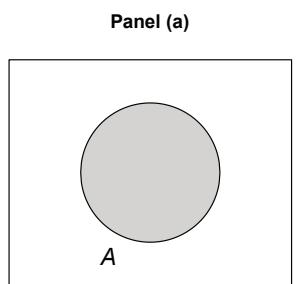  
A

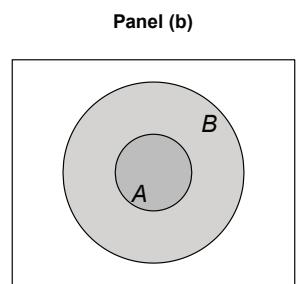  
$A\subset B$

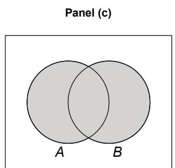  
AUB

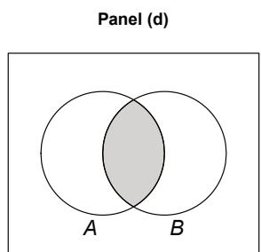  
$A\cap B$   
Figure 1.2.1: A series of Venn diagrams. The sample space $\mathbf{C}$ is represented by the interior of the rectangle in each plot. Panel (a) depicts the event $A$ ; Panel (b) depicts $A \subset B$ ; Panel (c) depicts $A \cup B$ ; and Panel (d) depicts $A \cap B$ .

We first define the complement of an event $A$ .

Definition 1.2.1. The complement of an event $A$ is the set of all elements in $C$ which are not in $A$ . We denote the complement of $A$ by $A^c$ . That is, $A^c = \{x \in C : x \notin A\}$ .

# 1.2. Sets

The complement of $A$ is represented by the white space in the Venn diagram in Panel (a) of Figure 1.2.1.

The empty set is the event with no elements in it. It is denoted by $\phi$ . Note that $\mathcal{C}^c = \phi$ and $\phi^c = \mathcal{C}$ . The next definition defines when one event is a subset of another.

Definition 1.2.2. If each element of a set $A$ is also an element of set $B$ , the set $A$ is called a subset of the set $B$ . This is indicated by writing $A \subset B$ . If $A \subset B$ and also $B \subset A$ , the two sets have the same elements, and this is indicated by writing $A = B$ .

Panel (b) of Figure 1.2.1 depicts $A \subset B$ .

The event $A$ or $B$ is defined as follows:

Definition 1.2.3. Let $A$ and $B$ be events. Then the union of $A$ and $B$ is the set of all elements that are in $A$ or in $B$ or in both $A$ and $B$ . The union of $A$ and $B$ is denoted by $A \cup B$

Panel (c) of Figure 1.2.1 shows $A \cup B$ .

The event that both $A$ and $B$ occur is defined by,

Definition 1.2.4. Let $A$ and $B$ be events. Then the intersection of $A$ and $B$ is the set of all elements that are in both $A$ and $B$ . The intersection of $A$ and $B$ is denoted by $A \cap B$

Panel (d) of Figure 1.2.1 illustrates $A \cap B$ .

Two events are disjoint if they have no elements in common. More formally we define

Definition 1.2.5. Let $A$ and $B$ be events. Then $A$ and $B$ are disjoint if $A \cap B = \phi$ .

If $A$ and $B$ are disjoint, then we say $A \cup B$ forms a disjoint union. The next two examples illustrate these concepts.

Example 1.2.1. Suppose we have a spinner with the numbers 1 through 10 on it. The experiment is to spin the spinner and record the number spun. Then $\mathcal{C} = \{1,2,\ldots ,10\}$ . Define the events $A,B$ , and $C$ by $A = \{1,2\}$ , $B = \{2,3,4\}$ , and $C = \{3,4,5,6\}$ , respectively.

$$
\begin{array}{l} A ^ {c} = \{3, 4, \dots , 1 0 \}; \quad A \cup B = \{1, 2, 3, 4 \}; \quad A \cap B = \{2 \} \\ A \cap C = \phi ; \quad B \cap C = \{3, 4 \}; \quad B \cap C \subset B; \quad B \cap C \subset C \\ A \cup (B \cap C) = \{1, 2 \} \cup \{3, 4 \} = \{1, 2, 3, 4 \} (1.2.1) \\ (A \cup B) \cap (A \cup C) = \{1, 2, 3, 4 \} \cap \{1, 2, 3, 4, 5, 6 \} = \{1, 2, 3, 4 \} (1.2.2) \\ \end{array}
$$

The reader should verify these results.

Example 1.2.2. For this example, suppose the experiment is to select a real number in the open interval $(0,5)$ ; hence, the sample space is $\mathcal{C} = (0,5)$ . Let $A = (1,3)$ ,

$B = (2,4)$ , and $C = [3,4.5)$

$$
A \cup B = (1, 4); \quad A \cap B = (2, 3); \quad B \cap C = [ 3, 4)
$$

$$
A \cap (B \cup C) = (1, 3) \cap (2, 4. 5) = (2, 3) \tag {1.2.3}
$$

$$
(A \cap B) \cup (A \cap C) = (2, 3) \cup \phi = (2, 3) \tag {1.2.4}
$$

A sketch of the real number line between 0 and 5 helps to verify these results.

Expressions (1.2.1)-(1.2.2) and (1.2.3)-(1.2.4) are illustrations of general distributive laws. For any sets $A$ , $B$ , and $C$ ,

$$
A \cap (B \cup C) = (A \cap B) \cup (A \cap C)
$$

$$
A \cup (B \cap C) = (A \cup B) \cap (A \cup C). \tag {1.2.5}
$$

These follow directly from set theory. To verify each identity, sketch Venn diagrams of both sides.

The next two identities are collectively known as DeMorgan's Laws. For any sets $A$ and $B$ ,

$$
(A \cap B) ^ {c} = A ^ {c} \cup B ^ {c} \tag {1.2.6}
$$

$$
(A \cup B) ^ {c} = A ^ {c} \cap B ^ {c}. \tag {1.2.7}
$$

For instance, in Example 1.2.1,

$$
(A \cup B) ^ {c} = \{1, 2, 3, 4 \} ^ {c} = \{5, 6, \dots , 1 0 \} = \{3, 4, \dots , 1 0 \} \cap \{\{1, 5, 6, \dots , 1 0 \} = A ^ {c} \cap B ^ {c};
$$

while, from Example 1.2.2,

$$
(A \cap B) ^ {c} = (2, 3) ^ {c} = (0, 2 ] \cup [ 3, 5) = [ (0, 1 ] \cup [ 3, 5) ] \cup [ (0, 2 ] \cup [ 4, 5) ] = A ^ {c} \cup B ^ {c}.
$$

As the last expression suggests, it is easy to extend unions and intersections to more than two sets. If $A_1, A_2, \ldots, A_n$ are any sets, we define

$$
A _ {1} \cup A _ {2} \cup \dots \cup A _ {n} = \{x: x \in A _ {i}, \text {f o r s o m e} i = 1, 2, \dots , n \} \tag {1.2.8}
$$

$$
A _ {1} \cap A _ {2} \cap \dots \cap A _ {n} = \{x: x \in A _ {i}, \text {f o r a l l} i = 1, 2, \dots , n \}. \tag {1.2.9}
$$

We often abbreviative these by $\cup_{i=1}^{n} A_i$ and $\cap_{i=1}^{n} A_i$ , respectively. Expressions for countable unions and intersections follow directly; that is, if $A_1, A_2, \ldots, A_n \ldots$ is a sequence of sets then

$$
A _ {1} \cup A _ {2} \cup \dots = \{x: x \in A _ {n}, \text {f o r s o m e} n = 1, 2, \dots \} = \cup_ {n = 1} ^ {\infty} A _ {n} \tag {1.2.10}
$$

$$
A _ {1} \cap A _ {2} \cap \dots = \{x: x \in A _ {n}, \text {f o r a l l} n = 1, 2, \dots \} = \cap_ {n = 1} ^ {\infty} A _ {n}. \tag {1.2.11}
$$

The next two examples illustrate these ideas.

Example 1.2.3. Suppose $\mathcal{C} = \{1,2,3,\ldots\}$ . If $A_{n} = \{1,3,\dots,2n - 1\}$ and $B_{n} = \{n,n + 1,\dots\}$ , for $n = 1,2,3,\ldots$ , then

$$
\cup_ {n = 1} ^ {\infty} A _ {n} = \{1, 3, 5, \dots \}; \quad \cap_ {n = 1} ^ {\infty} A _ {n} = \{1 \}; \tag {1.2.12}
$$

$$
\cup_ {n = 1} ^ {\infty} B _ {n} = \mathcal {C}; \quad \cap_ {n = 1} ^ {\infty} B _ {n} = \phi . \quad \blacksquare \tag {1.2.13}
$$

# 1.2. Sets

Example 1.2.4. Suppose $\mathcal{C}$ is the interval of real numbers $(0,5)$ . Suppose $C_n = (1 - n^{-1},2 + n^{-1})$ and $D_{n} = (n^{-1},3 - n^{-1})$ , for $n = 1,2,3,\ldots$ . Then

$$
\cup_ {n = 1} ^ {\infty} C _ {n} = (0, 3); \quad \cap_ {n = 1} ^ {\infty} C _ {n} = [ 1, 2 ] \tag {1.2.14}
$$

$$
\cup_ {n = 1} ^ {\infty} D _ {n} = (0, 3); \cap_ {n = 1} ^ {\infty} D _ {n} = (1, 2). \quad \tag {1.2.15}
$$

We occasionally have sequences of sets that are monotone. They are of two types. We say a sequence of sets $\{A_n\}$ is nondecreasing, (nested upward), if $A_{n} \subset A_{n+1}$ for $n = 1, 2, 3, \ldots$ . For such a sequence, we define

$$
\lim  _ {n \rightarrow \infty} A _ {n} = \cup_ {n = 1} ^ {\infty} A _ {n}. \tag {1.2.16}
$$

The sequence of sets $A_{n} = \{1,3,\ldots ,2n - 1\}$ of Example 1.2.3 is such a sequence. So in this case, we write $\lim_{n\to \infty}A_n = \{1,3,5,\dots \}$ . The sequence of sets $\{D_n\}$ of Example 1.2.4 is also a nondecreasing sequence of sets.

The second type of monotone sets consists of the nonincreasing, (nested downward) sequences. A sequence of sets $\{A_n\}$ is nonincreasing, if $A_n \supset A_{n+1}$ for $n = 1, 2, 3, \ldots$ . In this case, we define

$$
\lim  _ {n \rightarrow \infty} A _ {n} = \cap_ {n = 1} ^ {\infty} A _ {n}. \tag {1.2.17}
$$

The sequences of sets $\{B_n\}$ and $\{C_n\}$ of Examples 1.2.3 and 1.2.4, respectively, are examples of nonincreasing sequences of sets.

# 1.2.2 Set Functions

Many of the functions used in calculus and in this book are functions that map real numbers into real numbers. We are concerned also with functions that map sets into real numbers. Such functions are naturally called functions of a set or, more simply, set functions. Next we give some examples of set functions and evaluate them for certain simple sets.

Example 1.2.5. Let $\mathcal{C} = R$ , the set of real numbers. For a subset $A$ in $\mathcal{C}$ , let $Q(A)$ be equal to the number of points in $A$ that correspond to positive integers. Then $Q(A)$ is a set function of the set $A$ . Thus, if $A = \{x : 0 < x < 5\}$ , then $Q(A) = 4$ ; if $A = \{-2, -1\}$ , then $Q(A) = 0$ ; and if $A = \{x : -\infty < x < 6\}$ , then $Q(A) = 5$ .

Example 1.2.6. Let $\mathcal{C} = R^2$ . For a subset $A$ of $\mathcal{C}$ , let $Q(A)$ be the area of $A$ if $A$ has a finite area; otherwise, let $Q(A)$ be undefined. Thus, if $A = \{(x,y): x^2 + y^2 \leq 1\}$ , then $Q(A) = \pi$ ; if $A = \{(0,0), (1,1), (0,1)\}$ , then $Q(A) = 0$ ; and if $A = \{(x,y): 0 \leq x, 0 \leq y, x + y \leq 1\}$ , then $Q(A) = \frac{1}{2}$ .

Often our set functions are defined in terms of sums or integrals. With this in mind, we introduce the following notation. The symbol

$$
\int_ {A} f (x) d x
$$

means the ordinary (Riemann) integral of $f(x)$ over a prescribed one-dimensional set $A$ and the symbol

$$
\iint_ {A} g (x, y) d x d y
$$

means the Riemann integral of $g(x,y)$ over a prescribed two-dimensional set $A$ . This notation can be extended to integrals over $n$ dimensions. To be sure, unless these sets $A$ and these functions $f(x)$ and $g(x,y)$ are chosen with care, the integrals frequently fail to exist. Similarly, the symbol

$$
\sum_ {A} f (x)
$$

means the sum extended over all $x \in A$ and the symbol

$$
\sum_ {A} \sum_ {g (x, y)}
$$

means the sum extended over all $(x,y) \in A$ . As with integration, this notation extends to sums over $n$ dimensions.

The first example is for a set function defined on sums involving a geometric series. As pointed out in Example 2.3.1 of Mathematical Comments, if $|a| < 1$ , then the following series converges to $1 / (1 - a)$ :

$$
\sum_ {n = 0} ^ {\infty} a ^ {n} = \frac {1}{1 - a}, \quad \text {i f} | a | <   1. \tag {1.2.18}
$$

Example 1.2.7. Let $\mathcal{C}$ be the set of all nonnegative integers and let $A$ be a subset of $\mathcal{C}$ . Define the set function $Q$ by

$$
Q (A) = \sum_ {n \in A} \left(\frac {2}{3}\right) ^ {n}. \tag {1.2.19}
$$

It follows from (1.2.18) that $Q(\mathcal{C}) = 3$ . If $A = \{1,2,3\}$ then $Q(A) = 38 / 27$ . Suppose $B = \{1,3,5,\ldots\}$ is the set of all odd positive integers. The computation of $Q(B)$ is given next. This derivation consists of rewriting the series so that (1.2.18) can be applied. Frequently, we perform such derivations in this book.

$$
\begin{array}{l} Q (B) = \sum_ {n \in B} \left(\frac {2}{3}\right) ^ {n} = \sum_ {n = 0} ^ {\infty} \left(\frac {2}{3}\right) ^ {2 n + 1} \\ = \frac {2}{3} \sum_ {n = 0} ^ {\infty} \left[ \left(\frac {2}{3}\right) ^ {2} \right] ^ {n} = \frac {2}{3} \frac {1}{1 - (4 / 9)} = \frac {6}{5} \\ \end{array}
$$

In the next example, the set function is defined in terms of an integral involving the exponential function $f(x) = e^{-x}$ .

Example 1.2.8. Let $\mathcal{C}$ be the interval of positive real numbers, i.e., $\mathcal{C} = (0,\infty)$ . Let $A$ be a subset of $\mathcal{C}$ . Define the set function $Q$ by

$$
Q (A) = \int_ {A} e ^ {- x} d x, \tag {1.2.20}
$$

provided the integral exists. The reader should work through the following integrations:

$$
Q \left[ (1, 3) \right] = \int_ {1} ^ {3} e ^ {- x} d x = - e ^ {- x} \Bigg | _ {1} ^ {3} = e ^ {- 1} - e ^ {- 3} \dot {=} 0. 3 1 8
$$

$$
Q \left[ (5, \infty) \right] = \int_ {1} ^ {3} e ^ {- x} d x = - e ^ {- x} \Bigg | _ {5} ^ {\infty} = e ^ {- 5} \dot {=} 0. 0 0 7
$$

$$
Q \left[ (1, 3) \cup [ 3, 5) \right] = \int_ {1} ^ {5} e ^ {- x} d x = \int_ {1} ^ {3} e ^ {- x} d x + \int_ {3} ^ {5} e ^ {- x} d x = Q \left[ (1, 3) \right] + Q \left([ 3, 5) \right]
$$

$$
Q (\mathcal {C}) = \int_ {0} ^ {\infty} e ^ {- x} d x = 1.
$$

Our final example, involves an $n$ dimensional integral.

Example 1.2.9. Let $\mathcal{C} = R^n$ . For $A$ in $\mathcal{C}$ define the set function

$$
Q (A) = \int_ {A} \dots \int d x _ {1} d x _ {2} \dots d x _ {n},
$$

provided the integral exists. For example, if $A = \{(x_1, x_2, \ldots, x_n) : 0 \leq x_1 \leq x_2, 0 \leq x_i \leq 1, \text{ for } 1 = 3, 4, \ldots, n\}$ , then upon expressing the multiple integral as an iterated integral<sup>3</sup> we obtain

$$
\begin{array}{l} Q (A) = \int_ {0} ^ {1} \left[ \int_ {0} ^ {x _ {2}} d x _ {1} \right] d x _ {2} \cdot \prod_ {i = 3} ^ {n} \left[ \int_ {0} ^ {1} d x _ {i} \right] \\ = \left. \frac {x _ {2} ^ {2}}{2} \right| _ {0} ^ {1} \bullet 1 = \frac {1}{2}. \\ \end{array}
$$

If $B = \{(x_{1},x_{2},\ldots ,x_{n}):0\leq x_{1}\leq x_{2}\leq \dots \leq x_{n}\leq 1\}$ , then

$$
\begin{array}{l} Q (B) = \int_ {0} ^ {1} \left[ \int_ {0} ^ {x _ {n}} \dots \left[ \int_ {0} ^ {x _ {3}} \left[ \int_ {0} ^ {x _ {2}} d x _ {1} \right] d x _ {2} \right] \dots d x _ {n - 1} \right] d x _ {n} \\ = \frac {1}{n !}, \\ \end{array}
$$

where $n! = n(n - 1)\dots 3\cdot 2\cdot 1$

# EXERCISES

1.2.1. Find the union $C_1 \cup C_2$ and the intersection $C_1 \cap C_2$ of the two sets $C_1$ and $C_2$ , where

(a) $C_1 = \{0, 1, 2, \}$ , $C_2 = \{2, 3, 4\}$ .   
(b) $C_1 = \{x:0 <   x <   2\}$ $C_2 = \{x:1\leq x <   3\}$   
(c) $C_1 = \{(x,y):0 <   x <   2,1 <   y <   2\} ,C_2 = \{(x,y):1 <   x <   3,1 <   y <   3\} .$

1.2.2. Find the complement $C^c$ of the set $C$ with respect to the space $\mathcal{C}$ if

(a) $\mathcal{C} = \{x:0 <   x <   1\}$ $C = \{x:\frac{5}{8} <  x <   1\}$   
(b) $\mathcal{C} = \{(x,y,z):x^2 +y^2 +z^2\leq 1\}$ $C = \{(x,y,z):x^{2} + y^{2} + z^{2} = 1\}$   
(c) $\mathcal{C} = \{(x,y):|x| + |y|\leq 2\}$ $C = \{(x,y):x^2 +y^2 <  2\}$

1.2.3. List all possible arrangements of the four letters $m, a, r$ , and $y$ . Let $C_1$ be the collection of the arrangements in which $y$ is in the last position. Let $C_2$ be the collection of the arrangements in which $m$ is in the first position. Find the union and the intersection of $C_1$ and $C_2$ .

1.2.4. Concerning DeMorgan's Laws (1.2.6) and (1.2.7):

(a) Use Venn diagrams to verify the laws.   
(b) Show that the laws are true.   
(c) Generalize the laws to countable unions and intersections.

1.2.5. By the use of Venn diagrams, in which the space $\mathcal{C}$ is the set of points enclosed by a rectangle containing the circles $C_1, C_2$ , and $C_3$ , compare the following sets. These laws are called the distributive laws.

(a) $C_1 \cap (C_2 \cup C_3)$ and $(C_1 \cap C_2) \cup (C_1 \cap C_3)$ .   
(b) $C_1 \cup (C_2 \cap C_3)$ and $(C_1 \cup C_2) \cap (C_1 \cup C_3)$ .

1.2.6. Show that the following sequences of sets, $\{C_k\}$ , are nondecreasing, (1.2.16), then find $\lim_{k\to \infty}C_k$

(a) $C_k = \{x:1 / k\leq x\leq 3 - 1 / k\}$ $k = 1,2,3,\ldots$   
(b) $C_k = \{(x,y):1 / k\leq x^2 +y^2\leq 4 - 1 / k\} ,k = 1,2,3,\ldots .$

1.2.7. Show that the following sequences of sets, $\{C_k\}$ , are nonincreasing, (1.2.17), then find $\lim_{k\to \infty}C_k$ .

(a) $C_k = \{x:2 - 1 / k <   x\leq 2\} ,k = 1,2,3,\ldots .$   
(b) $C_k = \{x:2 <   x\leq 2 + 1 / k\} ,k = 1,2,3,\ldots .$

# 1.2. Sets

(c) $C_k = \{(x,y):0\leq x^2 +y^2\leq 1 / k\}$ $k = 1,2,3,\ldots$

1.2.8. For every one-dimensional set $C$ , define the function $Q(C) = \sum_{C} f(x)$ where $f(x) = \left(\frac{2}{3}\right)\left(\frac{1}{3}\right)^x$ , $x = 0, 1, 2, \ldots$ , zero elsewhere. If $C_1 = \{x : x = 0, 1, 2, 3\}$ and $C_2 = \{x : x = 0, 1, 2, \ldots\}$ , find $Q(C_1)$ and $Q(C_2)$ .

Hint: Recall that $S_{n} = a + ar + \dots + ar^{n - 1} = a(1 - r^{n}) / (1 - r)$ and, hence, it follows that $\lim_{n\to \infty}S_n = a / (1 - r)$ provided that $|r| < 1$ .

1.2.9. For every one-dimensional set $C$ for which the integral exists, let $Q(C) = \int_{C} f(x) \, dx$ , where $f(x) = 6x(1 - x)$ , $0 < x < 1$ , zero elsewhere; otherwise, let $Q(C)$ be undefined. If $C_1 = \{x : \frac{1}{4} < x < \frac{3}{4}\}$ , $C_2 = \{\frac{1}{2}\}$ , and $C_3 = \{x : 0 < x < 10\}$ , find $Q(C_1), Q(C_2)$ , and $Q(C_3)$ .

1.2.10. For every two-dimensional set $C$ contained in $R^2$ for which the integral exists, let $Q(C) = \int \int_{C}(x^{2} + y^{2})dxdy$ . If $C_1 = \{(x,y): -1\leq x\leq 1, - 1\leq y\leq 1\}$ , $C_2 = \{(x,y): - 1\leq x = y\leq 1\}$ , and $C_3 = \{(x,y):x^2 +y^2\leq 1\}$ , find $Q(C_{1}),Q(C_{2})$ , and $Q(C_{3})$ .

1.2.11. Let $\mathcal{C}$ denote the set of points that are interior to, or on the boundary of, a square with opposite vertices at the points $(0,0)$ and $(1,1)$ . Let $Q(C) = \int \int_{C} dy dx$ .

(a) If $C\subset \mathcal{C}$ is the set $\{(x,y):0 <   x <   y <   1\}$ , compute $Q(C)$   
(b) If $C\subset \mathcal{C}$ is the set $\{(x,y):0 <   x = y <   1\}$ , compute $Q(C)$   
(c) If $C\subset \mathcal{C}$ is the set $\{(x,y):0 < x / 2\leq y\leq 3x / 2 < 1\}$ , compute $Q(C)$ .

1.2.12. Let $\mathcal{C}$ be the set of points interior to or on the boundary of a cube with edge of length 1. Moreover, say that the cube is in the first octant with one vertex at the point $(0,0,0)$ and an opposite vertex at the point $(1,1,1)$ . Let $Q(C) = \iint_{C} dxdydz$ .

(a) If $C\subset \mathcal{C}$ is the set $\{(x,y,z):0 <   x <   y <   z <   1\}$ , compute $Q(C)$   
(b) If $C$ is the subset $\{(x,y,z):0 < x = y = z < 1\}$ , compute $Q(C)$ .

1.2.13. Let $C$ denote the set $\{(x, y, z) : x^2 + y^2 + z^2 \leq 1\}$ . Using spherical coordinates, evaluate

$$
Q (C) = \int \int \int_ {C} \sqrt {x ^ {2} + y ^ {2} + z ^ {2}} d x d y d z.
$$

1.2.14. To join a certain club, a person must be either a statistician or a mathematician or both. Of the 25 members in this club, 19 are statisticians and 16 are mathematicians. How many persons in the club are both a statistician and a mathematician?

1.2.15. After a hard-fought football game, it was reported that, of the 11 starting players, 8 hurt a hip, 6 hurt an arm, 5 hurt a knee, 3 hurt both a hip and an arm, 2 hurt both a hip and a knee, 1 hurt both an arm and a knee, and no one hurt all three. Comment on the accuracy of the report.

# 1.3 The Probability Set Function

Given an experiment, let $\mathcal{C}$ denote the sample space of all possible outcomes. As discussed in Section 1.1, we are interested in assigning probabilities to events, i.e., subsets of $\mathcal{C}$ . What should be our collection of events? If $\mathcal{C}$ is a finite set, then we could take the set of all subsets as this collection. For infinite sample spaces, though, with assignment of probabilities in mind, this poses mathematical technicalities that are better left to a course in probability theory. We assume that in all cases, the collection of events is sufficiently rich to include all possible events of interest and is closed under complements and countable unions of these events. Using DeMorgan's Laws, (1.2.6)-(1.2.7), the collection is then also closed under countable intersections. We denote this collection of events by $\mathcal{B}$ . Technically, such a collection of events is called a $\sigma$ -field of subsets.

Now that we have a sample space, $\mathcal{C}$ , and our collection of events, $\mathcal{B}$ , we can define the third component in our probability space, namely a probability set function. In order to motivate its definition, we consider the relative frequency approach to probability.

Remark 1.3.1. The definition of probability consists of three axioms which we motivate by the following three intuitive properties of relative frequency. Let $\mathcal{C}$ be a sample space and let $A\subset \mathcal{C}$ . Suppose we repeat the experiment $N$ times. Then the relative frequency of $A$ is $f_{A} = \# \{A\} /N$ , where $\# \{A\}$ denotes the number of times $A$ occurred in the $N$ repetitions. Note that $f_{A}\geq 0$ and $f_{\mathcal{C}} = 1$ . These are the first two properties. For the third, suppose that $A_{1}$ and $A_{2}$ are disjoint events. Then $f_{A_1\cup A_2} = f_{A_1} + f_{A_2}$ . These three properties of relative frequencies form the axioms of a probability, except that the third axiom is in terms of countable unions. As with the axioms of probability, the readers should check that the theorems we prove below about probabilities agree with their intuition of relative frequency.

Definition 1.3.1 (Probability). Let $\mathcal{C}$ be a sample space and let $\mathcal{B}$ be the set of events. Let $P$ be a real-valued function defined on $\mathcal{B}$ . Then $P$ is a probability set function if $P$ satisfies the following three conditions:

1. $P(A)\geq 0$ , for all $A\in \mathcal{B}$

2. $P(\mathcal{C}) = 1$

3. If $\{A_n\}$ is a sequence of events in $\mathcal{B}$ and $A_m \cap A_n = \phi$ for all $m \neq n$ , then

$$
P \left(\bigcup_ {n = 1} ^ {\infty} A _ {n}\right) = \sum_ {n = 1} ^ {\infty} P (A _ {n}).
$$

A collection of events whose members are pairwise disjoint, as in (3), is said to be a mutually exclusive collection and its union is often referred to as a disjoint union. The collection is further said to be exhaustive if the union of its events is the sample space, in which case $\sum_{n=1}^{\infty} P(A_n) = 1$ . We often say that a mutually exclusive and exhaustive collection of events forms a partition of $\mathcal{C}$ .

A probability set function tells us how the probability is distributed over the set of events, $\mathcal{B}$ . In this sense we speak of a distribution of probability. We often drop the word "set" and refer to $P$ as a probability function.

The following theorems give us some other properties of a probability set function. In the statement of each of these theorems, $P(A)$ is taken, tacitly, to be a probability set function defined on the collection of events $\mathcal{B}$ of a sample space $\mathcal{C}$ .

Theorem 1.3.1. For each event $A \in \mathcal{B}$ , $P(A) = 1 - P(A^c)$ .

Proof: We have $\mathcal{C} = A\cup A^c$ and $A\cap A^{c} = \phi$ . Thus, from (2) and (3) of Definition 1.3.1, it follows that

$$
1 = P (A) + P (A ^ {c}),
$$

which is the desired result.

Theorem 1.3.2. The probability of the null set is zero; that is, $P(\phi) = 0$ .

Proof: In Theorem 1.3.1, take $A = \phi$ so that $A^c = \mathcal{C}$ . Accordingly, we have

$$
P (\phi) = 1 - P (\mathcal {C}) = 1 - 1 = 0
$$

and the theorem is proved.

Theorem 1.3.3. If $A$ and $B$ are events such that $A \subset B$ , then $P(A) \leq P(B)$ .

Proof: Now $B = A \cup (A^c \cap B)$ and $A \cap (A^c \cap B) = \phi$ . Hence, from (3) of Definition 1.3.1,

$$
P (B) = P (A) + P \left(A ^ {c} \cap B\right).
$$

From (1) of Definition 1.3.1, $P(A^c \cap B) \geq 0$ . Hence, $P(B) \geq P(A)$ .

Theorem 1.3.4. For each $A \in \mathcal{B}$ , $0 \leq P(A) \leq 1$ .

Proof: Since $\phi \subset A\subset \mathcal{C}$ , we have by Theorem 1.3.3 that

$$
P (\phi) \leq P (A) \leq P (\mathcal {C}) \quad \text {o r} \quad 0 \leq P (A) \leq 1,
$$

the desired result.

Part (3) of the definition of probability says that $P(A \cup B) = P(A) + P(B)$ if $A$ and $B$ are disjoint, i.e., $A \cap B = \phi$ . The next theorem gives the rule for any two events regardless if they are disjoint or not.

Theorem 1.3.5. If $A$ and $B$ are events in $\mathcal{C}$ , then

$$
P (A \cup B) = P (A) + P (B) - P (A \cap B).
$$

Proof: Each of the sets $A \cup B$ and $B$ can be represented, respectively, as a union of nonintersecting sets as follows:

$$
A \cup B = A \cup \left(A ^ {c} \cap B\right) \quad \text {a n d} \quad B = \left(A \cap B\right) \cup \left(A ^ {c} \cap B\right). \tag {1.3.1}
$$

That these identities hold for all sets $A$ and $B$ follows from set theory. Also, the Venn diagrams of Figure 1.3.1 offer a verification of them.

Thus, from (3) of Definition 1.3.1,

$$
P (A \cup B) = P (A) + P (A ^ {c} \cap B)
$$

and

$$
P (B) = P (A \cap B) + P (A ^ {c} \cap B).
$$

If the second of these equations is solved for $P(A^c \cap B)$ and this result is substituted in the first equation, we obtain

$$
P (A \cup B) = P (A) + P (B) - P (A \cap B).
$$

This completes the proof.

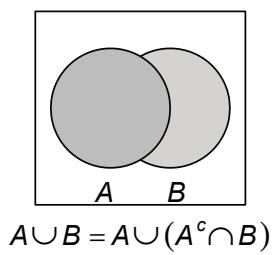  
Panel (a)

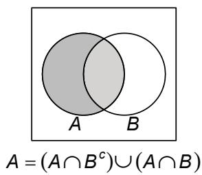  
Panel (b)   
Figure 1.3.1: Venn diagrams depicting the two disjoint unions given in expression (1.3.1). Panel (a) depicts the first disjoint union while Panel (b) shows the second disjoint union.

Example 1.3.1. Let $\mathcal{C}$ denote the sample space of Example 1.1.2. Let the probability set function assign a probability of $\frac{1}{36}$ to each of the 36 points in $\mathcal{C}$ ; that is, the dice are fair. If $C_1 = \{(1,1),(2,1),(3,1),(4,1),(5,1)\}$ and $C_2 = \{(1,2),(2,2),(3,2)\}$ , then $P(C_1) = \frac{5}{36}$ , $P(C_2) = \frac{3}{36}$ , $P(C_1 \cup C_2) = \frac{8}{36}$ , and $P(C_1 \cap C_2) = 0$ .

Example 1.3.2. Two coins are to be tossed and the outcome is the ordered pair (face on the first coin, face on the second coin). Thus the sample space may be represented as $\mathcal{C} = \{(H,H),(H,T),(T,H),(T,T)\}$ . Let the probability set function assign a probability of $\frac{1}{4}$ to each element of $\mathcal{C}$ . Let $C_1 = \{(H,H),(H,T)\}$ and $C_2 = \{(H,H),(T,H)\}$ . Then $P(C_1) = P(C_2) = \frac{1}{2}$ , $P(C_1 \cap C_2) = \frac{1}{4}$ , and, in accordance with Theorem 1.3.5, $P(C_1 \cup C_2) = \frac{1}{2} + \frac{1}{2} - \frac{1}{4} = \frac{3}{4}$ .

For a finite sample space, we can generate probabilities as follows. Let $\mathcal{C} = \{x_1, x_2, \ldots, x_m\}$ be a finite set of $m$ elements. Let $p_1, p_2, \ldots, p_m$ be fractions such that

$$
0 \leq p _ {i} \leq 1 \text {f o r} i = 1, 2, \dots , m \text {a n d} \sum_ {i = 1} ^ {m} p _ {i} = 1. \tag {1.3.2}
$$

Suppose we define $P$ by

$$
P (A) = \sum_ {x _ {i} \in A} p _ {i}, \quad \text {f o r a l l s u b s e t s} A \text {o f} \mathcal {C}. \tag {1.3.3}
$$

Then $P(A) \geq 0$ and $P(\mathcal{C}) = 1$ . Further, it follows that $P(A \cup B) = P(A) + P(B)$ when $A \cap B = \phi$ . Therefore, $P$ is a probability on $\mathcal{C}$ . For illustration, each of the following four assignments forms a probability on $\mathcal{C} = \{1,2,\ldots,6\}$ . For each, we also compute $P(A)$ for the event $A = \{1,6\}$ .

$$
\begin{array}{l} p _ {1} = p _ {2} = \dots = p _ {6} = \frac {1}{6}; \quad P (A) = \frac {1}{3}. \tag {1.3.4} \\ p _ {1} = p _ {2} = 0. 1, p _ {3} = p _ {4} = p _ {5} = p _ {6} = 0. 2; \quad P (A) = 0. 3. \\ p _ {i} = \frac {i}{2 1}, \quad i = 1, 2, \ldots , 6; \quad P (A) = \frac {7}{2 1}. \\ p _ {1} = \frac {3}{\pi}, p _ {2} = 1 - \frac {3}{\pi}, p _ {3} = p _ {4} = p _ {5} = p _ {6} = 0. 0; \quad P (A) = \frac {3}{\pi}. \\ \end{array}
$$

Note that the individual probabilities for the first probability set function, (1.3.4), are the same. This is an example of the equilikely case which we now formally define.

Definition 1.3.2 (Equilikely Case). Let $\mathcal{C} = \{x_1, x_2, \ldots, x_m\}$ be a finite sample space. Let $p_i = 1/m$ for all $i = 1, 2, \ldots, m$ and for all subsets $A$ of $\mathcal{C}$ define

$$
P (A) = \sum_ {x _ {i} \in A} \frac {1}{m} = \frac {\# (A)}{m},
$$

where $\# (A)$ denotes the number of elements in $A$ . Then $P$ is a probability on $\mathcal{C}$ and it is referred to as the equillikely case.

Equilibrated cases are frequently probability models of interest. Examples include: the flip of a fair coin; five cards drawn from a well shuffled deck of 52 cards; a spin of a fair spinner with the numbers 1 through 36 on it; and the upfaces of the roll of a pair of balanced dice. For each of these experiments, as stated in the definition, we only need to know the number of elements in an event to compute the probability of that event. For example, a card player may be interested in the probability of getting a pair (two of a kind) in a hand of five cards dealt from a well shuffled deck of 52 cards. To compute this probability, we need to know the number of five card hands and the number of such hands which contain a pair. Because the equilibrated case is often of interest, we next develop some counting rules which can be used to compute the probabilities of events of interest.

# 1.3.1 Counting Rules

We discuss three counting rules that are usually discussed in an elementary algebra course.

The first rule is called the mn-rule ( $m$ times $n$ -rule), which is also called the multiplication rule. Let $A = \{x_{1}, x_{2}, \ldots, x_{m}\}$ be a set of $m$ elements and let $B = \{y_{1}, y_{2}, \ldots, y_{n}\}$ be a set of $n$ elements. Then there are $mn$ ordered pairs, $(x_{i}, y_{j})$ , $i = 1, 2, \ldots, m$ and $j = 1, 2, \ldots, n$ , of elements, the first from $A$ and the second from $B$ . Informally, we often speak of ways, here. For example there are five roads (ways) between cities I and II and there are ten roads (ways) between cities II and III. Hence, there are $5 * 10 = 50$ ways to get from city I to city III by going from city I to city II and then from city II to city III. This rule extends immediately to more than two sets. For instance, suppose in a certain state that driver license plates have the pattern of three letters followed by three numbers. Then there are $26^{3} * 10^{3}$ possible license plates in this state.

Next, let $A$ be a set with $n$ elements. Suppose we are interested in $k$ -tuples whose components are elements of $A$ . Then by the extended mn rule, there are $n \cdot n \cdots n = n^k$ such $k$ -tuples whose components are elements of $A$ . Next, suppose $k \leq n$ and we are interested in $k$ -tuples whose components are distinct (no repeats) elements of $A$ . There are $n$ elements from which to choose for the first component, $n - 1$ for the second component, ..., $n - (k - 1)$ for the $k$ th. Hence, by the mn rule, there are $n(n - 1) \cdots (n - (k - 1))$ such $k$ -tuples with distinct elements. We call each such $k$ -tuple a permutation and use the symbol $P_k^n$ to denote the number of $k$ permutations taken from a set of $n$ elements. This number of permutations, $P_k^n$ is our second counting rule. We can rewrite it as

$$
P _ {k} ^ {n} = n (n - 1) \dots (n - (k - 1)) = \frac {n !}{(n - k) !}. \tag {1.3.5}
$$

Example 1.3.3 (Birthday Problem). Suppose there are $n$ people in a room. Assume that $n < 365$ and that the people are unrelated in any way. Find the probability of the event $A$ that at least 2 people have the same birthday. For convenience, assign the numbers 1 though $n$ to the people in the room. Then use $n$ -tuples to denote the birthdays of the first person through the $nth$ person in the room. Using the $mn$ -rule, there are $365^n$ possible birthday $n$ -tuples for these $n$ people. This is the number of elements in the sample space. Now assume that birthdays are equilibrated to occur on any of the 365 days. Hence, each of these $n$ -tuples has probability $365^{-n}$ . Notice that the complement of $A$ is the event that all the birthdays in the room are distinct; that is, the number of $n$ -tuples in $A^c$ is $P_n^{365}$ . Thus, the probability of $A$ is

$$
P (A) = 1 - \frac {P _ {n} ^ {3 6 5}}{3 6 5 ^ {n}}.
$$

For instance, if $n = 2$ then $P(A) = 1 - (365 * 364) / (365^2) = 0.0027$ . This formula is not easy to compute by hand. The following R function<sup>4</sup> computes the $P(A)$ for the input $n$ and it can be downloaded at the sites mentioned in the Preface.

```txt
bday = function(n){ bday = 1; nm1 = n - 1  
for(j in 1:nm1){bday = bday * ((365-j)/365)}  
bday <- 1 - bday; return(bday)} 
```

Assuming that the file bday.R contains this function, here is the R segment computing $P(A)$ for $n = 10$ :

```txt
> source("bday.R")  
> bday(10)  
[1] 0.1169482 
```

For our last counting rule, as with permutations, we are drawing from a set $A$ of $n$ elements. Now, suppose order is not important, so instead of counting the number of permutations we want to count the number of subsets of $k$ elements taken from $A$ . We use the symbol $\binom{n}{k}$ to denote the total number of these subsets. Consider a subset of $k$ elements from $A$ . By the permutation rule it generates $P_k^k = k(k-1)\cdots 1 = k!$ permutations. Furthermore, all these permutations are distinct from the permutations generated by other subsets of $k$ elements from $A$ . Finally, each permutation of $k$ distinct elements drawn from $A$ must be generated by one of these subsets. Hence, we have shown that $P_k^n = \binom{n}{k}k!$ ; that is,

$$
\binom {n} {k} = \frac {n !}{k ! (n - k) !}. \tag {1.3.6}
$$

We often use the terminology combinations instead of subsets. So we say that there are $\binom{n}{k}$ combinations of $k$ things taken from a set of $n$ things. Another common symbol for $\binom{n}{k}$ is $C_k^n$ .

It is interesting to note that if we expand the binomial series,

$$
(a + b) ^ {n} = (a + b) (a + b) \dots (a + b),
$$

we get

$$
(a + b) ^ {n} = \sum_ {k = 0} ^ {n} \binom {n} {k} a ^ {k} b ^ {n - k}, \tag {1.3.7}
$$

because we can select the $k$ factors from which to take $a$ in $\binom{n}{k}$ ways. So $\binom{n}{k}$ is also referred to as a binomial coefficient.

Example 1.3.4 (Poker Hands). Let a card be drawn at random from an ordinary deck of 52 playing cards that has been well shuffled. The sample space $\mathcal{C}$ consists of 52 elements, each element represents one and only one of the 52 cards. Because the deck has been well shuffled, it is reasonable to assume that each of these outcomes has the same probability $\frac{1}{52}$ . Accordingly, if $E_1$ is the set of outcomes that are spades, $P(E_1) = \frac{13}{52} = \frac{1}{4}$ because there are 13 spades in the deck; that is, $\frac{1}{4}$ is the probability of drawing a card that is a spade. If $E_2$ is the set of outcomes that are kings, $P(E_2) = \frac{4}{52} = \frac{1}{13}$ because there are 4 kings in the deck; that is, $\frac{1}{13}$ is the probability of drawing a card that is a king. These computations are very easy

because there are no difficulties in the determination of the number of elements in each event.

However, instead of drawing only one card, suppose that five cards are taken, at random and without replacement, from this deck; i.e., a five card poker hand. In this instance, order is not important. So a hand is a subset of five elements drawn from a set of 52 elements. Hence, by (1.3.6) there are $\binom{52}{5}$ poker hands. If the deck is well shuffled, each hand should be equilibrated; i.e., each hand has probability $1/\binom{52}{5}$ . We can now compute the probabilities of some interesting poker hands. Let $E_{1}$ be the event of a flush, all five cards of the same suit. There are $\binom{4}{1} = 4$ suits to choose for the flush and in each suit there are $\binom{13}{5}$ possible hands; hence, using the multiplication rule, the probability of getting a flush is

$$
P (E _ {1}) = \frac {\binom {4} {1} \binom {1 3} {5}}{\binom {5 2} {5}} = \frac {4 \cdot 1 2 8 7}{2 5 9 8 9 6 0} = 0. 0 0 1 9 8.
$$

Real poker players note that this includes the probability of obtaining a straight flush.

Next, consider the probability of the event $E_{2}$ of getting exactly three of a kind, (the other two cards are distinct and are of different kinds). Choose the kind for the three, in $\binom{13}{1}$ ways; choose the three, in $\binom{4}{3}$ ways; choose the other two kinds, in $\binom{12}{2}$ ways; and choose one card from each of these last two kinds, in $\binom{4}{1} \binom{4}{1}$ ways. Hence the probability of exactly three of a kind is

$$
P (E _ {2}) = \frac {\binom {1 3} {1} \binom {4} {3} \binom {1 2} {2} \binom {4} {1} ^ {2}}{\binom {5 2} {5}} = 0. 0 2 1 1.
$$

Now suppose that $E_{3}$ is the set of outcomes in which exactly three cards are kings and exactly two cards are queens. Select the kings, in $\binom{4}{3}$ ways, and select the queens, in $\binom{4}{2}$ ways. Hence, the probability of $E_{3}$ is

$$
P (E _ {3}) = \binom {4} {3} \binom {4} {2} / \binom {5 2} {5} = 0. 0 0 0 0 0 9 3.
$$

The event $E_{3}$ is an example of a full house: three of one kind and two of another kind. Exercise 1.3.19 asks for the determination of the probability of a full house.

# 1.3.2 Additional Properties of Probability

We end this section with several additional properties of probability which prove useful in the sequel. Recall in Exercise 1.2.6 we said that a sequence of events $\{C_n\}$ is a nondecreasing sequence if $C_n \subset C_{n+1}$ , for all $n$ , in which case we wrote $\lim_{n \to \infty} C_n = \cup_{n=1}^{\infty} C_n$ . Consider $\lim_{n \to \infty} P(C_n)$ . The question is: can we legitimately interchange the limit and $P$ ? As the following theorem shows, the answer is yes. The result also holds for a decreasing sequence of events. Because of this interchange, this theorem is sometimes referred to as the continuity theorem of probability.

Theorem 1.3.6. Let $\{C_n\}$ be a nondecreasing sequence of events. Then

$$
\lim  _ {n \rightarrow \infty} P \left(C _ {n}\right) = P \left(\lim  _ {n \rightarrow \infty} C _ {n}\right) = P \left(\bigcup_ {n = 1} ^ {\infty} C _ {n}\right). \tag {1.3.8}
$$

Let $\{C_n\}$ be a decreasing sequence of events. Then

$$
\lim  _ {n \rightarrow \infty} P \left(C _ {n}\right) = P \left(\lim  _ {n \rightarrow \infty} C _ {n}\right) = P \left(\bigcap_ {n = 1} ^ {\infty} C _ {n}\right). \tag {1.3.9}
$$

Proof. We prove the result (1.3.8) and leave the second result as Exercise 1.3.20. Define the sets, called rings, as $R_{1} = C_{1}$ and, for $n > 1$ , $R_{n} = C_{n} \cap C_{n - 1}^{c}$ . It follows that $\bigcup_{n = 1}^{\infty}C_n = \bigcup_{n = 1}^{\infty}R_n$ and that $R_{m}\cap R_{n} = \phi$ , for $m\neq n$ . Also, $P(R_{n}) = P(C_{n}) - P(C_{n - 1})$ . Applying the third axiom of probability yields the following string of equalities:

$$
\begin{array}{l} P \left[ \lim  _ {n \rightarrow \infty} C _ {n} \right] = P \left(\bigcup_ {n = 1} ^ {\infty} C _ {n}\right) = P \left(\bigcup_ {n = 1} ^ {\infty} R _ {n}\right) = \sum_ {n = 1} ^ {\infty} P (R _ {n}) = \lim  _ {n \rightarrow \infty} \sum_ {j = 1} ^ {n} P (R _ {j}) \\ = \lim  _ {n \rightarrow \infty} \left\{P \left(C _ {1}\right) + \sum_ {j = 2} ^ {n} \left[ P \left(C _ {j}\right) - P \left(C _ {j - 1}\right)\right]\right\} = \lim  _ {n \rightarrow \infty} P \left(C _ {n}\right). (1. 3. 1 0) \\ \end{array}
$$

This is the desired result.

Another useful result for arbitrary unions is given by

Theorem 1.3.7 (Boole's Inequality). Let $\{C_n\}$ be an arbitrary sequence of events. Then

$$
P \left(\bigcup_ {n = 1} ^ {\infty} C _ {n}\right) \leq \sum_ {n = 1} ^ {\infty} P \left(C _ {n}\right). \tag {1.3.11}
$$

Proof: Let $D_{n} = \bigcup_{i=1}^{n} C_{i}$ . Then $\{D_{n}\}$ is an increasing sequence of events that go up to $\bigcup_{n=1}^{\infty} C_{n}$ . Also, for all $j$ , $D_{j} = D_{j-1} \cup C_{j}$ . Hence, by Theorem 1.3.5,

$$
P (D _ {j}) \leq P (D _ {j - 1}) + P (C _ {j}),
$$

that is,

$$
P \left(D _ {j}\right) - P \left(D _ {j - 1}\right) \leq P \left(C _ {j}\right).
$$

In this case, the $C_i$ s are replaced by the $D_i$ s in expression (1.3.10). Hence, using the above inequality in this expression and the fact that $P(C_1) = P(D_1)$ , we have

$$
\begin{array}{l} P \left(\bigcup_ {n = 1} ^ {\infty} C _ {n}\right) = P \left(\bigcup_ {n = 1} ^ {\infty} D _ {n}\right) = \lim  _ {n \rightarrow \infty} \left\{P \left(D _ {1}\right) + \sum_ {j = 2} ^ {n} \left[ P \left(D _ {j}\right) - P \left(D _ {j - 1}\right)\right]\right\} \\ \leq \lim  _ {n \rightarrow \infty} \sum_ {j = 1} ^ {n} P (C _ {j}) = \sum_ {n = 1} ^ {\infty} P (C _ {n}). \\ \end{array}
$$

Theorem 1.3.5 gave a general additive law of probability for the union of two events. As the next remark shows, this can be extended to an additive law for an arbitrary union.

Remark 1.3.2 (Inclusion Exclusion Formula). It is easy to show (Exercise 1.3.9) that

$$
P \left(C _ {1} \cup C _ {2} \cup C _ {3}\right) = p _ {1} - p _ {2} + p _ {3},
$$

where

$$
\begin{array}{l} p _ {1} = P \left(C _ {1}\right) + P \left(C _ {2}\right) + P \left(C _ {3}\right) \\ p _ {2} = P \left(C _ {1} \cap C _ {2}\right) + P \left(C _ {1} \cap C _ {3}\right) + P \left(C _ {2} \cap C _ {3}\right) \\ p _ {3} = P \left(C _ {1} \cap C _ {2} \cap C _ {3}\right). \tag {1.3.12} \\ \end{array}
$$

This can be generalized to the inclusion exclusion formula:

$$
P \left(C _ {1} \cup C _ {2} \cup \dots \cup C _ {k}\right) = p _ {1} - p _ {2} + p _ {3} - \dots + (- 1) ^ {k + 1} p _ {k}, \tag {1.3.13}
$$

where $p_i$ equals the sum of the probabilities of all possible intersections involving $i$ sets.

When $k = 3$ , it follows that $p_1 \geq p_2 \geq p_3$ , but more generally $p_1 \geq p_2 \geq \dots \geq p_k$ . As shown in Theorem 1.3.7,

$$
p _ {1} = P \left(C _ {1}\right) + P \left(C _ {2}\right) + \dots + P \left(C _ {k}\right) \geq P \left(C _ {1} \cup C _ {2} \cup \dots \cup C _ {k}\right).
$$

For $k = 2$ , we have

$$
1 \geq P \left(C _ {1} \cup C _ {2}\right) = P \left(C _ {1}\right) + P \left(C _ {2}\right) - P \left(C _ {1} \cap C _ {2}\right),
$$

which gives Bonferroni's inequality,

$$
P \left(C _ {1} \cap C _ {2}\right) \geq P \left(C _ {1}\right) + P \left(C _ {2}\right) - 1, \tag {1.3.14}
$$

that is only useful when $P(C_1)$ and $P(C_2)$ are large. The inclusion exclusion formula provides other inequalities that are useful, such as

$$
p _ {1} \geq P \left(C _ {1} \cup C _ {2} \cup \dots \cup C _ {k}\right) \geq p _ {1} - p _ {2}
$$

and

$$
p _ {1} - p _ {2} + p _ {3} \geq P \left(C _ {1} \cup C _ {2} \cup \dots \cup C _ {k}\right) \geq p _ {1} - p _ {2} + p _ {3} - p _ {4}.
$$

# EXERCISES

1.3.1. A positive integer from one to six is to be chosen by casting a die. Thus the elements $c$ of the sample space $\mathcal{C}$ are $1,2,3,4,5,6$ . Suppose $C_1 = \{1,2,3,4\}$ and $C_2 = \{3,4,5,6\}$ . If the probability set function $P$ assigns a probability of $\frac{1}{6}$ to each of the elements of $\mathcal{C}$ , compute $P(C_1), P(C_2), P(C_1 \cap C_2)$ , and $P(C_1 \cup C_2)$ .

1.3.2. A random experiment consists of drawing a card from an ordinary deck of 52 playing cards. Let the probability set function $P$ assign a probability of $\frac{1}{52}$ to each of the 52 possible outcomes. Let $C_1$ denote the collection of the 13 hearts and let $C_2$ denote the collection of the 4 kings. Compute $P(C_1), P(C_2), P(C_1 \cap C_2)$ , and $P(C_1 \cup C_2)$ .

1.3.3. A coin is to be tossed as many times as necessary to turn up one head. Thus the elements $c$ of the sample space $\mathcal{C}$ are $H, TH, TTH, TTTH$ , and so forth. Let the probability set function $P$ assign to these elements the respective probabilities $\frac{1}{2}, \frac{1}{4}, \frac{1}{8}, \frac{1}{16}$ , and so forth. Show that $P(\mathcal{C}) = 1$ . Let $C_1 = \{c : c \text{ is } H, TH, TTH, TTTH, \text{ or } TTTH\}$ . Compute $P(C_1)$ . Next, suppose that $C_2 = \{c : c \text{ is } TTTH \text{ or } TTTT\}$ . Compute $P(C_2)$ , $P(C_1 \cap C_2)$ , and $P(C_1 \cup C_2)$ .

1.3.4. If the sample space is $\mathcal{C} = C_1 \cup C_2$ and if $P(C_1) = 0.8$ and $P(C_2) = 0.5$ , find $P(C_1 \cap C_2)$ .

1.3.5. Let the sample space be $\mathcal{C} = \{c:0 < c < \infty\}$ . Let $C\subset \mathcal{C}$ be defined by $C = \{c:4 < c < \infty\}$ and take $P(C) = \int_{C}e^{-x}dx$ . Show that $P(\mathcal{C}) = 1$ . Evaluate $P(C), P(C^{c})$ , and $P(C\cup C^{c})$ .

1.3.6. If the sample space is $\mathcal{C} = \{c: -\infty < c < \infty\}$ and if $C \subset \mathcal{C}$ is a set for which the integral $\int_{C} e^{-|x|} dx$ exists, show that this set function is not a probability set function. What constant do we multiply the integrand by to make it a probability set function?

1.3.7. If $C_1$ and $C_2$ are subsets of the sample space $\mathcal{C}$ , show that

$$
P \left(C _ {1} \cap C _ {2}\right) \leq P \left(C _ {1}\right) \leq P \left(C _ {1} \cup C _ {2}\right) \leq P \left(C _ {1}\right) + P \left(C _ {2}\right).
$$

1.3.8. Let $C_1, C_2$ , and $C_3$ be three mutually disjoint subsets of the sample space $\mathcal{C}$ . Find $P[(C_1 \cup C_2) \cap C_3]$ and $P(C_1^c \cup C_2^c)$ .

1.3.9. Consider Remark 1.3.2.

(a) If $C_1, C_2$ , and $C_3$ are subsets of $\mathcal{C}$ , show that

$$
\begin{array}{l} P \left(C _ {1} \cup C _ {2} \cup C _ {3}\right) = P \left(C _ {1}\right) + P \left(C _ {2}\right) + P \left(C _ {3}\right) - P \left(C _ {1} \cap C _ {2}\right) \\ - P \left(C _ {1} \cap C _ {3}\right) - P \left(C _ {2} \cap C _ {3}\right) + P \left(C _ {1} \cap C _ {2} \cap C _ {3}\right). \\ \end{array}
$$

(b) Now prove the general inclusion exclusion formula given by the expression (1.3.13).

Remark 1.3.3. In order to solve Exercises (1.3.10)-(1.3.19), certain reasonable assumptions must be made.

1.3.10. A bowl contains 16 chips, of which 6 are red, 7 are white, and 3 are blue. If four chips are taken at random and without replacement, find the probability that: (a) each of the four chips is red; (b) none of the four chips is red; (c) there is at least one chip of each color.

1.3.11. A person has purchased 10 of 1000 tickets sold in a certain raffle. To determine the five prize winners, five tickets are to be drawn at random and without replacement. Compute the probability that this person wins at least one prize. Hint: First compute the probability that the person does not win a prize.

1.3.12. Compute the probability of being dealt at random and without replacement a 13-card bridge hand consisting of: (a) 6 spades, 4 hearts, 2 diamonds, and 1 club; (b) 13 cards of the same suit.

1.3.13. Three distinct integers are chosen at random from the first 20 positive integers. Compute the probability that: (a) their sum is even; (b) their product is even.

1.3.14. There are five red chips and three blue chips in a bowl. The red chips are numbered 1, 2, 3, 4, 5, respectively, and the blue chips are numbered 1, 2, 3, respectively. If two chips are to be drawn at random and without replacement, find the probability that these chips have either the same number or the same color.

1.3.15. In a lot of 50 light bulbs, there are 2 bad bulbs. An inspector examines five bulbs, which are selected at random and without replacement.

(a) Find the probability of at least one defective bulb among the five.   
(b) How many bulbs should be examined so that the probability of finding at least one bad bulb exceeds $\frac{1}{2}$ ?

1.3.16. For the birthday problem, Example 1.3.3, use the given R function bday to determine the value of $n$ so that $p(n) \geq 0.5$ and $p(n - 1) < 0.5$ , where $p(n)$ is the probability that at least two people in the room of $n$ people have the same birthday.

1.3.17. If $C_1, \ldots, C_k$ are $k$ events in the sample space $\mathcal{C}$ , show that the probability that at least one of the events occurs is one minus the probability that none of them occur; i.e.,

$$
P \left(C _ {1} \cup \dots \cup C _ {k}\right) = 1 - P \left(C _ {1} ^ {c} \cap \dots \cap C _ {k} ^ {c}\right). \tag {1.3.15}
$$

1.3.18. A secretary types three letters and the three corresponding envelopes. In a hurry, he places at random one letter in each envelope. What is the probability that at least one letter is in the correct envelope? Hint: Let $C_i$ be the event that the $i$ th letter is in the correct envelope. Expand $P(C_1 \cup C_2 \cup C_3)$ to determine the probability.

1.3.19. Consider poker hands drawn from a well-shuffled deck as described in Example 1.3.4. Determine the probability of a full house, i.e., three of one kind and two of another.

1.3.20. Prove expression (1.3.9).

1.3.21. Suppose the experiment is to choose a real number at random in the interval $(0,1)$ . For any subinterval $(a,b) \subset (0,1)$ , it seems reasonable to assign the probability $P[(a,b)] = b - a$ ; i.e., the probability of selecting the point from a subinterval is directly proportional to the length of the subinterval. If this is the case, choose an appropriate sequence of subintervals and use expression (1.3.9) to show that $P[\{a\}] = 0$ , for all $a \in (0,1)$ .

1.3.22. Consider the events $C_1, C_2, C_3$ .

(a) Suppose $C_1, C_2, C_3$ are mutually exclusive events. If $P(C_i) = p_i$ , $i = 1, 2, 3$ , what is the restriction on the sum $p_1 + p_2 + p_3$ ?   
(b) In the notation of part (a), if $p_1 = 4/10$ , $p_2 = 3/10$ , and $p_3 = 5/10$ , are $C_1, C_2, C_3$ mutually exclusive?

For the last two exercises it is assumed that the reader is familiar with $\sigma$ -fields.

1.3.23. Suppose $\mathcal{D}$ is a nonempty collection of subsets of $\mathcal{C}$ . Consider the collection of events

$$
\mathcal {B} = \cap \{\mathcal {E}: \mathcal {D} \subset \mathcal {E} \text {a n d} \mathcal {E} \text {i s a} \sigma \text {- f i e l d} \}.
$$

Note that $\phi \in \mathcal{B}$ because it is in each $\sigma$ -field, and, hence, in particular, it is in each $\sigma$ -field $\mathcal{E} \supset \mathcal{D}$ . Continue in this way to show that $\mathcal{B}$ is a $\sigma$ -field.

1.3.24. Let $\mathcal{C} = R$ , where $R$ is the set of all real numbers. Let $\mathcal{I}$ be the set of all open intervals in $R$ . The Borel $\sigma$ -field on the real line is given by

$$
\mathcal {B} _ {0} = \cap \{\mathcal {E}: \mathcal {I} \subset \mathcal {E} \text {a n d} \mathcal {E} \text {i s a} \sigma \text {- f i e l d} \}.
$$

By definition, $\mathcal{B}_0$ contains the open intervals. Because $[a,\infty) = (-\infty ,a)^c$ and $\mathcal{B}_0$ is closed under complements, it contains all intervals of the form $[a,\infty)$ , for $a\in R$ . Continue in this way and show that $\mathcal{B}_0$ contains all the closed and half-open intervals of real numbers.

# 1.4 Conditional Probability and Independence

In some random experiments, we are interested only in those outcomes that are elements of a subset $A$ of the sample space $\mathcal{C}$ . This means, for our purposes, that the sample space is effectively the subset $A$ . We are now confronted with the problem of defining a probability set function with $A$ as the "new" sample space.

Let the probability set function $P(A)$ be defined on the sample space $\mathcal{C}$ and let $A$ be a subset of $\mathcal{C}$ such that $P(A) > 0$ . We agree to consider only those outcomes of the random experiment that are elements of $A$ ; in essence, then, we take $A$ to be a sample space. Let $B$ be another subset of $\mathcal{C}$ . How, relative to the new sample space $A$ , do we want to define the probability of the event $B$ ? Once defined, this probability is called the conditional probability of the event $B$ , relative to the hypothesis of the event $A$ , or, more briefly, the conditional probability of $B$ , given $A$ . Such a conditional probability is denoted by the symbol $P(B|A)$ . The "|" in this symbol is usually read as "given." We now return to the question that was raised about the definition of this symbol. Since $A$ is now the sample space, the only elements of $B$ that concern us are those, if any, that are also elements of $A$ , that is, the elements of $A \cap B$ . It seems desirable, then, to define the symbol $P(B|A)$ in such a way that

$$
P (A | A) = 1 \quad \text {a n d} \quad P (B | A) = P (A \cap B | A).
$$

Moreover, from a relative frequency point of view, it would seem logically inconsistent if we did not require that the ratio of the probabilities of the events $A \cap B$ and $A$ , relative to the space $A$ , be the same as the ratio of the probabilities of these events relative to the space $\mathcal{C}$ ; that is, we should have

$$
\frac {P (A \cap B | A)}{P (A | A)} = \frac {P (A \cap B)}{P (A)}.
$$

These three desirable conditions imply that the relation conditional probability is reasonably defined as

Definition 1.4.1 (Conditional Probability). Let $B$ and $A$ be events with $P(A) > 0$ . Then we defined the conditional probability of $B$ given $A$ as

$$
P (B | A) = \frac {P (A \cap B)}{P (A)}. \quad \blacksquare \tag {1.4.1}
$$

Moreover, we have

1. $P(B|A)\geq 0$   
2. $P(A|A) = 1$   
3. $P(\cup_{n = 1}^{\infty}B_n|A) = \sum_{n = 1}^{\infty}P(B_n|A)$ , provided that $B_{1}, B_{2}, \ldots$ are mutually exclusive events.

Properties (1) and (2) are evident. For Property (3), suppose the sequence of events $B_{1}, B_{2}, \ldots$ is mutually exclusive. It follows that also $(B_{n} \cap A) \cap (B_{m} \cap A) = \phi$ , $n \neq m$ . Using this and the first of the distributive laws (1.2.5) for countable unions, we have

$$
\begin{array}{l} P \left(\cup_ {n = 1} ^ {\infty} B _ {n} \mid A\right) = \frac {P \left[ \cup_ {n = 1} ^ {\infty} \left(B _ {n} \cap A\right) \right]}{P (A)} \\ = \sum_ {n = 1} ^ {\infty} \frac {P \left[ B _ {n} \cap A \right]}{P (A)} \\ = \sum_ {n = 1} ^ {\infty} P \left[ B _ {n} | A \right]. \\ \end{array}
$$

Properties (1)-(3) are precisely the conditions that a probability set function must satisfy. Accordingly, $P(B|A)$ is a probability set function, defined for subsets of $A$ . It may be called the conditional probability set function, relative to the hypothesis $A$ , or the conditional probability set function, given $A$ . It should be noted that this conditional probability set function, given $A$ , is defined at this time only when $P(A) > 0$ .

Example 1.4.1. A hand of five cards is to be dealt at random without replacement from an ordinary deck of 52 playing cards. The conditional probability of an all-spade hand $(B)$ , relative to the hypothesis that there are at least four spades in the

hand $(A)$ , is, since $A \cap B = B$ ,

$$
\begin{array}{l} P (B | A) = \frac {P (B)}{P (A)} = \frac {\binom {1 3} {5} / \binom {5 2} {5}}{\left[ \binom {1 3} {4} \binom {3 9} {1} + \binom {1 3} {5} \right] / \binom {5 2} {5}} \\ = \frac {\binom {1 3} {5}}{\binom {1 3} {4} \binom {3 9} {1} + \binom {1 3} {5}} = 0. 0 4 4 1. \\ \end{array}
$$

Note that this is not the same as drawing for a spade to complete a flush in draw poker; see Exercise 1.4.3.

From the definition of the conditional probability set function, we observe that

$$
P (A \cap B) = P (A) P (B | A).
$$

This relation is frequently called the multiplication rule for probabilities. Sometimes, after considering the nature of the random experiment, it is possible to make reasonable assumptions so that both $P(A)$ and $P(B|A)$ can be assigned. Then $P(A \cap B)$ can be computed under these assumptions. This is illustrated in Examples 1.4.2 and 1.4.3.

Example 1.4.2. A bowl contains eight chips. Three of the chips are red and the remaining five are blue. Two chips are to be drawn successively, at random and without replacement. We want to compute the probability that the first draw results in a red chip $(A)$ and that the second draw results in a blue chip $(B)$ . It is reasonable to assign the following probabilities:

$$
P (A) = \frac {3}{8} \quad \mathrm {a n d} \quad P (B | A) = \frac {5}{7}.
$$

Thus, under these assignments, we have $P(A \cap B) = \left(\frac{3}{8}\right)\left(\frac{5}{7}\right) = \frac{15}{56} = 0.2679$ .

Example 1.4.3. From an ordinary deck of playing cards, cards are to be drawn successively, at random and without replacement. The probability that the third spade appears on the sixth draw is computed as follows. Let $A$ be the event of two spades in the first five draws and let $B$ be the event of a spade on the sixth draw. Thus the probability that we wish to compute is $P(A \cap B)$ . It is reasonable to take

$$
P (A) = \frac {\binom {1 3} {2} \binom {3 9} {3}}{\binom {5 2} {5}} = 0. 2 7 4 3 \quad \text {a n d} \quad P (B | A) = \frac {1 1}{4 7} = 0. 2 3 4 0.
$$

The desired probability $P(A \cap B)$ is then the product of these two numbers, which to four places is 0.0642.

The multiplication rule can be extended to three or more events. In the case of three events, we have, by using the multiplication rule for two events,

$$
\begin{array}{l} P (A \cap B \cap C) = P [ (A \cap B) \cap C ] \\ = P (A \cap B) P (C | A \cap B). \\ \end{array}
$$

But $P(A \cap B) = P(A)P(B|A)$ . Hence, provided $P(A \cap B) > 0$ ,

$$
P (A \cap B \cap C) = P (A) P (B | A) P (C | A \cap B).
$$

This procedure can be used to extend the multiplication rule to four or more events. The general formula for $k$ events can be proved by mathematical induction.

Example 1.4.4. Four cards are to be dealt successively, at random and without replacement, from an ordinary deck of playing cards. The probability of receiving a spade, a heart, a diamond, and a club, in that order, is $(\frac{13}{52})(\frac{13}{51})(\frac{13}{50})(\frac{13}{49}) = 0.0044$ . This follows from the extension of the multiplication rule.

Consider $k$ mutually exclusive and exhaustive events $A_{1}, A_{2}, \ldots, A_{k}$ such that $P(A_{i}) > 0, i = 1, 2, \ldots, k$ ; i.e., $A_{1}, A_{2}, \ldots, A_{k}$ form a partition of $\mathcal{C}$ . Here the events $A_{1}, A_{2}, \ldots, A_{k}$ do not need to be equally likely. Let $B$ be another event such that $P(B) > 0$ . Thus $B$ occurs with one and only one of the events $A_{1}, A_{2}, \ldots, A_{k}$ ; that is,

$$
\begin{array}{l} B = B \cap \left(A _ {1} \cup A _ {2} \cup \dots A _ {k}\right) \\ = \left(B \cap A _ {1}\right) \cup \left(B \cap A _ {2}\right) \cup \dots \cup \left(B \cap A _ {k}\right). \\ \end{array}
$$

Since $B\cap A_{i}$ $i = 1,2,\ldots ,k$ , are mutually exclusive, we have

$$
P (B) = P \left(B \cap A _ {1}\right) + P \left(B \cap A _ {2}\right) + \dots + P \left(B \cap A _ {k}\right).
$$

However, $P(B \cap A_i) = P(A_i)P(B|A_i), i = 1,2,\ldots,k$ ; so

$$
\begin{array}{l} P (B) = P \left(A _ {1}\right) P \left(B \mid A _ {1}\right) + P \left(A _ {2}\right) P \left(B \mid A _ {2}\right) + \dots + P \left(A _ {k}\right) P \left(B \mid A _ {k}\right) \\ = \sum_ {i = 1} ^ {k} P \left(A _ {i}\right) P \left(B \mid A _ {i}\right). \tag {1.4.2} \\ \end{array}
$$

This result is sometimes called the law of total probability and it leads to the following important theorem.

Theorem 1.4.1 (Bayes). Let $A_1, A_2, \ldots, A_k$ be events such that $P(A_i) > 0$ , $i = 1, 2, \ldots, k$ . Assume further that $A_1, A_2, \ldots, A_k$ form a partition of the sample space $\mathcal{C}$ . Let $B$ be any event. Then

$$
P \left(A _ {j} \mid B\right) = \frac {P \left(A _ {j}\right) P \left(B \mid A _ {j}\right)}{\sum_ {i = 1} ^ {k} P \left(A _ {i}\right) P \left(B \mid A _ {i}\right)}, \tag {1.4.3}
$$

Proof: Based on the definition of conditional probability, we have

$$
P (A _ {j} | B) = \frac {P (B \cap A _ {j})}{P (B)} = \frac {P (A _ {j}) P (B | A _ {j})}{P (B)}.
$$

The result then follows by the law of total probability, (1.4.2).

This theorem is the well-known Bayes' Theorem. This permits us to calculate the conditional probability of $A_{j}$ , given $B$ , from the probabilities of $A_{1}, A_{2}, \ldots, A_{k}$ and the conditional probabilities of $B$ , given $A_{i}$ , $i = 1, 2, \ldots, k$ . The next three examples illustrate the usefulness of Bayes Theorem to determine probabilities.

Example 1.4.5. Say it is known that bowl $A_{1}$ contains three red and seven blue chips and bowl $A_{2}$ contains eight red and two blue chips. All chips are identical in size and shape. A die is cast and bowl $A_{1}$ is selected if five or six spots show on the side that is up; otherwise, bowl $A_{2}$ is selected. For this situation, it seems reasonable to assign $P(A_{1}) = \frac{2}{6}$ and $P(A_{2}) = \frac{4}{6}$ . The selected bowl is handed to another person and one chip is taken at random. Say that this chip is red, an event which we denote by $B$ . By considering the contents of the bowls, it is reasonable to assign the conditional probabilities $P(B|A_{1}) = \frac{3}{10}$ and $P(B|A_{2}) = \frac{8}{10}$ . Thus the conditional probability of bowl $A_{1}$ , given that a red chip is drawn, is

$$
\begin{array}{l} P \left(A _ {1} | B\right) = \frac {P \left(A _ {1}\right) P \left(B \mid A _ {1}\right)}{P \left(A _ {1}\right) P \left(B \mid A _ {1}\right) + P \left(A _ {2}\right) P \left(B \mid A _ {2}\right)} \\ = \frac {\left(\frac {2}{6}\right) \left(\frac {3}{1 0}\right)}{\left(\frac {2}{6}\right) \left(\frac {3}{1 0}\right) + \left(\frac {4}{6}\right) \left(\frac {8}{1 0}\right)} = \frac {3}{1 9}. \\ \end{array}
$$

In a similar manner, we have $P(A_{2}|B) = \frac{16}{19}$ .

In Example 1.4.5, the probabilities $P(A_1) = \frac{2}{6}$ and $P(A_2) = \frac{4}{6}$ are called prior probabilities of $A_1$ and $A_2$ , respectively, because they are known to be due to the random mechanism used to select the bowls. After the chip is taken and is observed to be red, the conditional probabilities $P(A_1|B) = \frac{3}{19}$ and $P(A_2|B) = \frac{16}{19}$ are called posterior probabilities. Since $A_2$ has a larger proportion of red chips than does $A_1$ , it appeals to one's intuition that $P(A_2|B)$ should be larger than $P(A_2)$ and, of course, $P(A_1|B)$ should be smaller than $P(A_1)$ . That is, intuitively the chances of having bowl $A_2$ are better once that a red chip is observed than before a chip is taken. Bayes' theorem provides a method of determining exactly what those probabilities are.

Example 1.4.6. Three plants, $A_{1}$ , $A_{2}$ , and $A_{3}$ , produce respectively, $10\%$ , $50\%$ , and $40\%$ of a company's output. Although plant $A_{1}$ is a small plant, its manager believes in high quality and only $1\%$ of its products are defective. The other two, $A_{2}$ and $A_{3}$ , are worse and produce items that are $3\%$ and $4\%$ defective, respectively. All products are sent to a central warehouse. One item is selected at random and observed to be defective, say event $B$ . The conditional probability that it comes from plant $A_{1}$ is found as follows. It is natural to assign the respective prior probabilities of getting an item from the plants as $P(A_{1}) = 0.1$ , $P(A_{2}) = 0.5$ , and $P(A_{3}) = 0.4$ , while the conditional probabilities of defective items are $P(B|A_{1}) = 0.01$ , $P(B|A_{2}) = 0.03$ , and $P(B|A_{3}) = 0.04$ . Thus the posterior probability of $A_{1}$ , given a defective, is

$$
P (A _ {1} | B) = \frac {P (A _ {1} \cap B)}{P (B)} = \frac {(0 . 1 0) (0 . 0 1)}{(0 . 1) (0 . 0 1) + (0 . 5) (0 . 0 3) + (0 . 4) (0 . 0 4)} = \frac {1}{3 2}.
$$

This is much smaller than the prior probability $P(A_{1}) = \frac{1}{10}$ . This is as it should be because the fact that the item is defective decreases the chances that it comes from the high-quality plant $A_{1}$ .

Example 1.4.7. Suppose we want to investigate the percentage of abused children in a certain population. The events of interest are: a child is abused $(A)$ and its complement a child is not abused $(N = A^c)$ . For the purposes of this example, we assume that $P(A) = 0.01$ and, hence, $P(N) = 0.99$ . The classification as to whether a child is abused or not is based upon a doctor's examination. Because doctors are not perfect, they sometimes classify an abused child $(A)$ as one that is not abused $(N_D$ , where $N_D$ means classified as not abused by a doctor). On the other hand, doctors sometimes classify a nonabused child $(N)$ as abused $(A_D)$ . Suppose these error rates of misclassification are $P(N_D|A) = 0.04$ and $P(A_D|N) = 0.05$ ; thus the probabilities of correct decisions are $P(A_D|A) = 0.96$ and $P(N_D|N) = 0.95$ . Let us compute the probability that a child taken at random is classified as abused by a doctor. Because this can happen in two ways, $A \cap A_D$ or $N \cap A_D$ , we have

$$
P \left(A _ {D}\right) = P \left(A _ {D} \mid A\right) P (A) + P \left(A _ {D} \mid N\right) P (N) = (0. 9 6) (0. 0 1) + (0. 0 5) (0. 9 9) = 0. 0 5 9 1,
$$

which is quite high relative to the probability of an abused child, 0.01. Further, the probability that a child is abused when the doctor classified the child as abused is

$$
P (A \mid A _ {D}) = \frac {P (A \cap A _ {D})}{P (A _ {D})} = \frac {(0 . 9 6) (0 . 0 1)}{0 . 0 5 9 1} = 0. 1 6 2 4,
$$

which is quite low. In the same way, the probability that a child is not abused when the doctor classified the child as abused is 0.8376, which is quite high. The reason that these probabilities are so poor at recording the true situation is that the doctors' error rates are so high relative to the fraction 0.01 of the population that is abused. An investigation such as this would, hopefully, lead to better training of doctors for classifying abused children. See also Exercise 1.4.17.

# 1.4.1 Independence

Sometimes it happens that the occurrence of event $A$ does not change the probability of event $B$ ; that is, when $P(A) > 0$ ,

$$
P (B | A) = P (B).
$$

In this case, we say that the events $A$ and $B$ are independent. Moreover, the multiplication rule becomes

$$
P (A \cap B) = P (A) P (B | A) = P (A) P (B). \tag {1.4.4}
$$

This, in turn, implies, when $P(B) > 0$ , that

$$
P (A | B) = \frac {P (A \cap B)}{P (B)} = \frac {P (A) P (B)}{P (B)} = P (A).
$$

Note that if $P(A) > 0$ and $P(B) > 0$ , then by the above discussion, independence is equivalent to

$$
P (A \cap B) = P (A) P (B). \tag {1.4.5}
$$

What if either $P(A) = 0$ or $P(B) = 0$ ? In either case, the right side of (1.4.5) is 0. However, the left side is 0 also because $A \cap B \subset A$ and $A \cap B \subset B$ . Hence, we take Equation (1.4.5) as our formal definition of independence; that is,

Definition 1.4.2. Let $A$ and $B$ be two events. We say that $A$ and $B$ are independent if $P(A \cap B) = P(A)P(B)$ .

Suppose $A$ and $B$ are independent events. Then the following three pairs of events are independent: $A^c$ and $B$ , $A$ and $B^c$ , and $A^c$ and $B^c$ . We show the first and leave the other two to the exercises; see Exercise 1.4.11. Using the disjoint union, $B = (A^c \cap B) \cup (A \cap B)$ , we have

$$
P \left(A ^ {c} \cap B\right) = P (B) - P (A \cap B) = P (B) - P (A) P (B) = [ 1 - P (A) ] P (B) = P \left(A ^ {c}\right) P (B). \tag {1.4.6}
$$

Hence, $A^c$ and $B$ are also independent.

Remark 1.4.1. Events that are independent are sometimes called statistically independent, stochastically independent, or independent in a probability sense. In most instances, we use independent without a modifier if there is no possibility of misunderstanding.

Example 1.4.8. A red die and a white die are cast in such a way that the numbers of spots on the two sides that are up are independent events. If $A$ represents a four on the red die and $B$ represents a three on the white die, with an equally likely assumption for each side, we assign $P(A) = \frac{1}{6}$ and $P(B) = \frac{1}{6}$ . Thus, from independence, the probability of the ordered pair (red = 4, white = 3) is

$$
P [ (4, 3) ] = (\frac {1}{6}) (\frac {1}{6}) = \frac {1}{3 6}.
$$

The probability that the sum of the up spots of the two dice equals seven is

$$
\begin{array}{l} P \left[ (1, 6), (2, 5), (3, 4), (4, 3), (5, 2), (6, 1) \right] \\ = \left(\frac {1}{6}\right) \left(\frac {1}{6}\right) + \left(\frac {1}{6}\right) \left(\frac {1}{6}\right) + \left(\frac {1}{6}\right) \left(\frac {1}{6}\right) + \left(\frac {1}{6}\right) \left(\frac {1}{6}\right) + \left(\frac {1}{6}\right) \left(\frac {1}{6}\right) + \left(\frac {1}{2}\right) \left(\frac {1}{6}\right) = \frac {6}{3 6}. \\ \end{array}
$$

In a similar manner, it is easy to show that the probabilities of the sums of the upfaces 2, 3, 4, 5, 6, 7, 8, 9, 10, 11, 12 are, respectively,

$$
\frac {1}{3 6}, \frac {2}{3 6}, \frac {3}{3 6}, \frac {4}{3 6}, \frac {5}{3 6}, \frac {6}{3 6}, \frac {5}{3 6}, \frac {4}{3 6}, \frac {3}{3 6}, \frac {2}{3 6}.
$$

Suppose now that we have three events, $A_{1}$ , $A_{2}$ , and $A_{3}$ . We say that they are mutually independent if and only if they are pairwise independent:

$$
\begin{array}{l} P \left(A _ {1} \cap A _ {3}\right) = P \left(A _ {1}\right) P \left(A _ {3}\right), \quad P \left(A _ {1} \cap A _ {2}\right) = P \left(A _ {1}\right) P \left(A _ {2}\right), \\ P \left(A _ {2} \cap A _ {3}\right) = P \left(A _ {2}\right) P \left(A _ {3}\right), \\ \end{array}
$$

and

$$
P \left(A _ {1} \cap A _ {2} \cap A _ {3}\right) = P \left(A _ {1}\right) P \left(A _ {2}\right) P \left(A _ {3}\right).
$$

More generally, the $n$ events $A_{1}, A_{2}, \ldots, A_{n}$ are mutually independent if and only if for every collection of $k$ of these events, $2 \leq k \leq n$ , and for every permutation $d_{1}, d_{2}, \ldots, d_{k}$ of $1, 2, \ldots, k$ ,

$$
P (A _ {d _ {1}} \cap A _ {d _ {2}} \cap \dots \cap A _ {d _ {k}}) = P (A _ {d _ {1}}) P (A _ {d _ {2}}) \dots P (A _ {d _ {k}}).
$$

In particular, if $A_{1}, A_{2}, \ldots, A_{n}$ are mutually independent, then

$$
P \left(A _ {1} \cap A _ {2} \cap \dots \cap A _ {n}\right) = P \left(A _ {1}\right) P \left(A _ {2}\right) \dots P \left(A _ {n}\right).
$$

Also, as with two sets, many combinations of these events and their complements are independent, such as

1. The events $A_1^c$ and $A_{2}\cup A_{3}^{c}\cup A_{4}$ are independent,   
2. The events $A_{1} \cup A_{2}^{c}$ , $A_{3}^{c}$ and $A_{4} \cap A_{5}^{c}$ are mutually independent.

If there is no possibility of misunderstanding, independent is often used without the modifier mutually when considering more than two events.

Example 1.4.9. Pairwise independence does not imply mutual independence. As an example, suppose we twice spin a fair spinner with the numbers 1, 2, 3, and 4. Let $A_{1}$ be the event that the sum of the numbers spun is 5, let $A_{2}$ be the event that the first number spun is a 1, and let $A_{3}$ be the event that the second number spun is a 4. Then $P(A_{i}) = 1/4$ , $i = 1, 2, 3$ , and for $i \neq j$ , $P(A_{i} \cap A_{j}) = 1/16$ . So the three events are pairwise independent. But $A_{1} \cap A_{2} \cap A_{3}$ is the event that (1,4) is spun, which has probability $1/16 \neq 1/64 = P(A_{1})P(A_{2})P(A_{3})$ . Hence the events $A_{1}, A_{2}$ , and $A_{3}$ are not mutually independent.

We often perform a sequence of random experiments in such a way that the events associated with one of them are independent of the events associated with the others. For convenience, we refer to these events as as outcomes of independent experiments, meaning that the respective events are independent. Thus we often refer to independent flips of a coin or independent casts of a die or, more generally, independent trials of some given random experiment.

Example 1.4.10. A coin is flipped independently several times. Let the event $A_{i}$ represent a head (H) on the $i$ th toss; thus $A_{i}^{c}$ represents a tail (T). Assume that $A_{i}$ and $A_{i}^{c}$ are equally likely; that is, $P(A_{i}) = P(A_{i}^{c}) = \frac{1}{2}$ . Thus the probability of an ordered sequence like HHTH is, from independence,

$$
P (A _ {1} \cap A _ {2} \cap A _ {3} ^ {c} \cap A _ {4}) = P (A _ {1}) P (A _ {2}) P (A _ {3} ^ {c}) P (A _ {4}) = (\frac {1}{2}) ^ {4} = \frac {1}{1 6}.
$$

Similarly, the probability of observing the first head on the third flip is

$$
P (A _ {1} ^ {c} \cap A _ {2} ^ {c} \cap A _ {3}) = P (A _ {1} ^ {c}) P (A _ {2} ^ {c}) P (A _ {3}) = (\frac {1}{2}) ^ {3} = \frac {1}{8}.
$$

Also, the probability of getting at least one head on four flips is

$$
\begin{array}{l} P \left(A _ {1} \cup A _ {2} \cup A _ {3} \cup A _ {4}\right) = 1 - P \left[ \left(A _ {1} \cup A _ {2} \cup A _ {3} \cup A _ {4}\right) ^ {c} \right] \\ = 1 - P \left(A _ {1} ^ {c} \cap A _ {2} ^ {c} \cap A _ {3} ^ {c} \cap A _ {4} ^ {c}\right), \\ = \quad 1 - \left(\frac {1}{2}\right) ^ {4} = \frac {1 5}{1 6}. \\ \end{array}
$$

See Exercise 1.4.13 to justify this last probability.

Example 1.4.11. A computer system is built so that if component $K_{1}$ fails, it is bypassed and $K_{2}$ is used. If $K_{2}$ fails, then $K_{3}$ is used. Suppose that the probability that $K_{1}$ fails is 0.01, that $K_{2}$ fails is 0.03, and that $K_{3}$ fails is 0.08. Moreover, we can assume that the failures are mutually independent events. Then the probability of failure of the system is

$$
(0. 0 1) (0. 0 3) (0. 0 8) = 0. 0 0 0 0 2 4,
$$

as all three components would have to fail. Hence, the probability that the system does not fail is $1 - 0.000024 = 0.999976$ .

# 1.4.2 Simulations

Many of the exercises at the end of this section are designed to aid the reader in his/her understanding of the concepts of conditional probability and independence. With diligence and patience, the reader will derive the exact answer. Many real life problems, though, are too complicated to allow for exact derivation. In such cases, scientists often turn to computer simulations to estimate the answer. As an example, suppose for an experiment, we want to obtain $P(A)$ for some event $A$ . A program is written that performs one trial (one simulation) of the experiment and it records whether or not $A$ occurs. We then obtain $n$ independent simulations (runs) of the program. Denote by $\hat{p}_n$ the proportion of these $n$ simulations in which $A$ occurred. Then $\hat{p}_n$ is our estimate of the $P(A)$ . Besides the estimation of $P(A)$ , we also obtain an error of estimation given by $1.96 * \sqrt{\hat{p}_n(1 - \hat{p}_n) / n}$ . As we discuss theoretically in Chapter 4, we are $95\%$ confident that $P(A)$ lies in the interval

$$
\hat {p} _ {n} \pm 1. 9 6 \sqrt {\frac {\hat {p} _ {n} \left(1 - \hat {p} _ {n}\right)}{n}}. \tag {1.4.7}
$$

In Chapter 4, we call this interval a $95\%$ confidence interval for $P(A)$ . For now, we make use of this confidence interval for our simulations.

Example 1.4.12. As an example, consider the game:

Person $A$ tosses a coin and then person $B$ rolls a die. This is repeated independently until a head or one of the numbers 1, 2, 3, 4 appears, at which time the game is stopped. Person $A$ wins with the head and $B$ wins with one of the numbers 1, 2, 3, 4. Compute the probability $P(A)$ that person $A$ wins the game.

For an exact derivation, notice that it is implicit in the statement $A$ wins the game that the game is completed. Using abbreviated notation, the game is completed if $H$ or $T\{1,\ldots ,4\}$ occurs. Using independence, the probability that $A$ wins is thus the conditional probability $(1 / 2) / [(1 / 2) + (1 / 2)(4 / 6)] = 3 / 5$ .

The following R function, abgame, simulates the problem. This function can be downloaded and sourced at the site discussed in the Preface. The first line of the program sets up the draws for persons $A$ and $B$ , respectively. The second line sets up a flag for the while loop and the returning values, Awin and Bwin are initialized

at 0. The command sample(rngA,1,pr=pA) draws a sample of size 1 from rngA with pmf pA. Each execution of the while loop returns one complete game. Further, the executions are independent of one another.

```r
abgame <- function(){
rngA <- c(0,1); pA <- rep(1/2,2);rngB <- 1:6; pB <- rep(1/6,6)
ic <- 0; Awin <- 0; Bwin <- 0
while(ic == 0){
    x <- sample(rngA,1,pr=pA)
    if(x==1){
        ic <- 1; Awin <- 1
    } else {
        y <- sample(rngB,1,pr=pB)
        if(y <= 4){ic <- 1; Bwin <- 1}
    }
}
return(c(Awin,Bwin)) 
```

Notice that one and only one of Awin or Bwin receives the value 1 depending on whether or not $A$ or $B$ wins. The next R segment simulates the game 10,000 times and computes the estimate that $A$ wins along with the error of estimation.

```txt
ind <- 0; nsims <- 10000  
for(i in 1:nsims) {  
    seeA <- abgame()  
    if(seeA[1] == 1){ind <- ind + 1}  
}  
estpA <- ind/nsims  
err <- 1.96 * sqrt(estpA * (1 - estpA) / nsims)  
estpA; err 
```

An execution of this code resulted in `estpA = 0.6001` and `err = 0.0096`. As noted above the probability that $A$ wins is 0.6 which is in the interval $0.6001 \pm 0.0096$ . As discussed in Chapter 4, we expect this to occur 95% of the time when using such a confidence interval.

# EXERCISES

1.4.1. If $P(A_{1}) > 0$ and if $A_{2}, A_{3}, A_{4}, \ldots$ are mutually disjoint sets, show that

$$
P \left(A _ {2} \cup A _ {3} \cup \dots | A _ {1}\right) = P \left(A _ {2} | A _ {1}\right) + P \left(A _ {3} | A _ {1}\right) + \dots .
$$

1.4.2. Assume that $P(A_{1} \cap A_{2} \cap A_{3}) > 0$ . Prove that

$$
P \left(A _ {1} \cap A _ {2} \cap A _ {3} \cap A _ {4}\right) = P \left(A _ {1}\right) P \left(A _ {2} \mid A _ {1}\right) P \left(A _ {3} \mid A _ {1} \cap A _ {2}\right) P \left(A _ {4} \mid A _ {1} \cap A _ {2} \cap A _ {3}\right).
$$

1.4.3. Suppose we are playing draw poker. We are dealt (from a well-shuffled deck) five cards, which contain four spades and another card of a different suit. We decide to discard the card of a different suit and draw one card from the remaining cards to complete a flush in spades (all five cards spades). Determine the probability of completing the flush.

1.4.4. From a well-shuffled deck of ordinary playing cards, four cards are turned over one at a time without replacement. What is the probability that the spades and red cards alternate?

1.4.5. A hand of 13 cards is to be dealt at random and without replacement from an ordinary deck of playing cards. Find the conditional probability that there are at least three kings in the hand given that the hand contains at least two kings.

1.4.6. A drawer contains eight different pairs of socks. If six socks are taken at random and without replacement, compute the probability that there is at least one matching pair among these six socks. Hint: Compute the probability that there is not a matching pair.

1.4.7. A pair of dice is cast until either the sum of seven or eight appears.

(a) Show that the probability of a seven before an eight is 6/11.   
(b) Next, this pair of dice is cast until a seven appears twice or until each of a six and eight has appeared at least once. Show that the probability of the six and eight occurring before two sevens is 0.546.

1.4.8. In a certain factory, machines I, II, and III are all producing springs of the same length. Machines I, II, and III produce $1\%$ , $4\%$ , and $2\%$ defective springs, respectively. Of the total production of springs in the factory, Machine I produces $30\%$ , Machine II produces $25\%$ , and Machine III produces $45\%$ .

(a) If one spring is selected at random from the total springs produced in a given day, determine the probability that it is defective.   
(b) Given that the selected spring is defective, find the conditional probability that it was produced by Machine II.

1.4.9. Bowl I contains six red chips and four blue chips. Five of these 10 chips are selected at random and without replacement and put in bowl II, which was originally empty. One chip is then drawn at random from bowl II. Given that this chip is blue, find the conditional probability that two red chips and three blue chips are transferred from bowl I to bowl II.

1.4.10. In an office there are two boxes of thumb drives: Box $A_{1}$ contains seven 100 GB drives and three 500 GB drives, and box $A_{2}$ contains two 100 GB drives and eight 500 GB drives. A person is handed a box at random with prior probabilities $P(A_{1}) = \frac{2}{3}$ and $P(A_{2}) = \frac{1}{3}$ , possibly due to the boxes' respective locations. A drive is then selected at random and the event $B$ occurs if it is a 500 GB drive. Using an equally likely assumption for each drive in the selected box, compute $P(A_{1}|B)$ and $P(A_{2}|B)$ .

1.4.11. Suppose $A$ and $B$ are independent events. In expression (1.4.6) we showed that $A^c$ and $B$ are independent events. Show similarly that the following pairs of events are also independent: (a) $A$ and $B^c$ and (b) $A^c$ and $B^c$ .

1.4.12. Let $C_1$ and $C_2$ be independent events with $P(C_1) = 0.6$ and $P(C_2) = 0.3$ . Compute (a) $P(C_1 \cap C_2)$ , (b) $P(C_1 \cup C_2)$ , and (c) $P(C_1 \cup C_2^c)$ .

1.4.13. Generalize Exercise 1.2.5 to obtain

$$
\left(C _ {1} \cup C _ {2} \cup \dots \cup C _ {k}\right) ^ {c} = C _ {1} ^ {c} \cap C _ {2} ^ {c} \cap \dots \cap C _ {k} ^ {c}.
$$

Say that $C_1, C_2, \ldots, C_k$ are independent events that have respective probabilities $p_1, p_2, \ldots, p_k$ . Argue that the probability of at least one of $C_1, C_2, \ldots, C_k$ is equal to

$$
1 - (1 - p _ {1}) (1 - p _ {2}) \dots (1 - p _ {k}).
$$

1.4.14. Each of four persons fires one shot at a target. Let $C_k$ denote the event that the target is hit by person $k$ , $k = 1,2,3,4$ . If $C_1,C_2,C_3,C_4$ are independent and if $P(C_1) = P(C_2) = 0.7$ , $P(C_3) = 0.9$ , and $P(C_4) = 0.4$ , compute the probability that (a) all of them hit the target; (b) exactly one hits the target; (c) no one hits the target; (d) at least one hits the target.

1.4.15. A bowl contains three red (R) balls and seven white (W) balls of exactly the same size and shape. Select balls successively at random and with replacement so that the events of white on the first trial, white on the second, and so on, can be assumed to be independent. In four trials, make certain assumptions and compute the probabilities of the following ordered sequences: (a) WWRW; (b) RWWW; (c) WWWRR; and (d) WRWW. Compute the probability of exactly one red ball in the four trials.

1.4.16. A coin is tossed two independent times, each resulting in a tail (T) or a head (H). The sample space consists of four ordered pairs: TT, TH, HT, HH. Making certain assumptions, compute the probability of each of these ordered pairs. What is the probability of at least one head?

1.4.17. For Example 1.4.7, obtain the following probabilities. Explain what they mean in terms of the problem.

(a) $P(N_{D})$   
(b) $P(N|A_D)$   
(c) $P(A\mid N_D)$   
(d) $P(N\mid N_D)$

1.4.18. A die is cast independently until the first 6 appears. If the casting stops on an odd number of times, Bob wins; otherwise, Joe wins.

(a) Assuming the die is fair, what is the probability that Bob wins?

(b) Let $p$ denote the probability of a 6. Show that the game favors Bob, for all $p$ , $0 < p < 1$ .

1.4.19. Cards are drawn at random and with replacement from an ordinary deck of 52 cards until a spade appears.

(a) What is the probability that at least four draws are necessary?   
(b) Same as part (a), except the cards are drawn without replacement.

1.4.20. A person answers each of two multiple choice questions at random. If there are four possible choices on each question, what is the conditional probability that both answers are correct given that at least one is correct?

1.4.21. Suppose a fair 6-sided die is rolled six independent times. A match occurs if side $i$ is observed on the $i$ th trial, $i = 1, \ldots, 6$ .

(a) What is the probability of at least one match on the six rolls? Hint: Let $C_i$ be the event of a match on the $i$ th trial and use Exercise 1.4.13 to determine the desired probability.   
(b) Extend part (a) to a fair $n$ -sided die with $n$ independent rolls. Then determine the limit of the probability as $n \to \infty$ .

1.4.22. Players $A$ and $B$ play a sequence of independent games. Player $A$ throws a die first and wins on a "six." If he fails, $B$ throws and wins on a "five" or "six." If he fails, $A$ throws and wins on a "four," "five," or "six." And so on. Find the probability of each player winning the sequence.

1.4.23. Let $C_1, C_2, C_3$ be independent events with probabilities $\frac{1}{2}, \frac{1}{3}, \frac{1}{4}$ , respectively. Compute $P(C_1 \cup C_2 \cup C_3)$ .

1.4.24. From a bowl containing five red, three white, and seven blue chips, select four at random and without replacement. Compute the conditional probability of one red, zero white, and three blue chips, given that there are at least three blue chips in this sample of four chips.

1.4.25. Let the three mutually independent events $C_1$ , $C_2$ , and $C_3$ be such that $P(C_1) = P(C_2) = P(C_3) = \frac{1}{4}$ . Find $P[(C_1^c \cap C_2^c) \cup C_3]$ .

1.4.26. Each bag in a large box contains 25 tulip bulbs. It is known that $60\%$ of the bags contain bulbs for 5 red and 20 yellow tulips, while the remaining $40\%$ of the bags contain bulbs for 15 red and 10 yellow tulips. A bag is selected at random and a bulb taken at random from this bag is planted.

(a) What is the probability that it will be a yellow tulip?   
(b) Given that it is yellow, what is the conditional probability it comes from a bag that contained 5 red and 20 yellow bulbs?

1.4.27. The following game is played. The player randomly draws from the set of integers $\{1, 2, \ldots, 20\}$ . Let $x$ denote the number drawn. Next the player draws at random from the set $\{x, \ldots, 25\}$ . If on this second draw, he draws a number greater than 21 he wins; otherwise, he loses.

(a) Determine the sum that gives the probability that the player wins.   
(b) Write and run a line of R code that computes the probability that the player wins.   
(c) Write an R function that simulates the game and returns whether or not the player wins.   
(d) Do 10,000 simulations of your program in Part (c). Obtain the estimate and confidence interval, (1.4.7), for the probability that the player wins. Does your interval trap the true probability?

1.4.28. A bowl contains 10 chips numbered $1, 2, \ldots, 10$ , respectively. Five chips are drawn at random, one at a time, and without replacement. What is the probability that two even-numbered chips are drawn and they occur on even-numbered draws?   
1.4.29. A person bets 1 dollar to $b$ dollars that he can draw two cards from an ordinary deck of cards without replacement and that they will be of the same suit. Find $b$ so that the bet is fair.   
1.4.30 (Monte Hall Problem). Suppose there are three curtains. Behind one curtain there is a nice prize, while behind the other two there are worthless prizes. A contestant selects one curtain at random, and then Monte Hall opens one of the other two curtains to reveal a worthless prize. Hall then expresses the willingness to trade the curtain that the contestant has chosen for the other curtain that has not been opened. Should the contestant switch curtains or stick with the one that she has? To answer the question, determine the probability that she wins the prize if she switches.   
1.4.31. A French nobleman, Chevalier de Méré, had asked a famous mathematician, Pascal, to explain why the following two probabilities were different (the difference had been noted from playing the game many times): (1) at least one six in four independent casts of a six-sided die; (2) at least a pair of sixes in 24 independent casts of a pair of dice. From proportions it seemed to de Méré that the probabilities should be the same. Compute the probabilities of (1) and (2).   
1.4.32. Hunters A and B shoot at a target; the probabilities of hitting the target are $p_1$ and $p_2$ , respectively. Assuming independence, can $p_1$ and $p_2$ be selected so that

$$
P (\text {z e r o h i t s}) = P (\text {o n e h i t}) = P (\text {t w o h i t s})?
$$

1.4.33. At the beginning of a study of individuals, $15\%$ were classified as heavy smokers, $30\%$ were classified as light smokers, and $55\%$ were classified as nonsmokers. In the five-year study, it was determined that the death rates of the heavy and

light smokers were five and three times that of the nonsmokers, respectively. A randomly selected participant died over the five-year period: calculate the probability that the participant was a nonsmoker.

1.4.34. A chemist wishes to detect an impurity in a certain compound that she is making. There is a test that detects an impurity with probability 0.90; however, this test indicates that an impurity is there when it is not about $5\%$ of the time. The chemist produces compounds with the impurity about $20\%$ of the time. A compound is selected at random from the chemist's output. The test indicates that an impurity is present. What is the conditional probability that the compound actually has the impurity?

# 1.5 Random Variables

The reader perceives that a sample space $\mathcal{C}$ may be tedious to describe if the elements of $\mathcal{C}$ are not numbers. We now discuss how we may formulate a rule, or a set of rules, by which the elements $c$ of $\mathcal{C}$ may be represented by numbers. We begin the discussion with a very simple example. Let the random experiment be the toss of a coin and let the sample space associated with the experiment be $\mathcal{C} = \{H,T\}$ , where $H$ and $T$ represent heads and tails, respectively. Let $X$ be a function such that $X(T) = 0$ and $X(H) = 1$ . Thus $X$ is a real-valued function defined on the sample space $\mathcal{C}$ which takes us from the sample space $\mathcal{C}$ to a space of real numbers $\mathcal{D} = \{0,1\}$ . We now formulate the definition of a random variable and its space.

Definition 1.5.1. Consider a random experiment with a sample space $\mathcal{C}$ . A function $X$ , which assigns to each element $c \in \mathcal{C}$ one and only one number $X(c) = x$ , is called a random variable. The space or range of $X$ is the set of real numbers $\mathcal{D} = \{x : x = X(c), c \in \mathcal{C}\}$ .

In this text, $\mathcal{D}$ generally is a countable set or an interval of real numbers. We call random variables of the first type discrete random variables, while we call those of the second type continuous random variables. In this section, we present examples of discrete and continuous random variables and then in the next two sections we discuss them separately.

Given a random variable $X$ , its range $\mathcal{D}$ becomes the sample space of interest. Besides inducing the sample space $\mathcal{D}$ , $X$ also induces a probability which we call the distribution of $X$ .

Consider first the case where $X$ is a discrete random variable with a finite space $\mathcal{D} = \{d_1, \ldots, d_m\}$ . The only events of interest in the new sample space $\mathcal{D}$ are subsets of $\mathcal{D}$ . The induced probability distribution of $X$ is also clear. Define the function $p_X(d_i)$ on $\mathcal{D}$ by

$$
p _ {X} \left(d _ {i}\right) = P \left[ \left\{c: X (c) = d _ {i} \right\} \right], \quad \text {f o r} i = 1, \dots , m. \tag {1.5.1}
$$

In the next section, we formally define $p_X(d_i)$ as the probability mass function (pmf) of $X$ . Then the induced probability distribution, $P_X(\cdot)$ , of $X$ is

$$
P _ {X} (D) = \sum_ {d _ {i} \in D} p _ {X} (d _ {i}), \quad D \subset \mathcal {D}.
$$

As Exercise 1.5.11 shows, $P_X(D)$ is a probability on $\mathcal{D}$ . An example is helpful here.

Example 1.5.1 (First Roll in the Game of Craps). Let $X$ be the sum of the upfaces on a roll of a pair of fair 6-sided dice, each with the numbers 1 through 6 on it. The sample space is $\mathcal{C} = \{(i,j): 1 \leq i,j \leq 6\}$ . Because the dice are fair, $P[\{(i,j)\}] = 1/36$ . The random variable $X$ is $X(i,j) = i + j$ . The space of $X$ is $\mathcal{D} = \{2,\ldots,12\}$ . By enumeration, the pmf of $X$ is given by

<table><tr><td colspan="2">Range value x</td><td>2</td><td>3</td><td>4</td><td>5</td><td>6</td><td>7</td><td>8</td><td>9</td><td>10</td><td>11</td><td>12</td></tr><tr><td>Probability</td><td>px(x)</td><td>1/36</td><td>2/36</td><td>3/36</td><td>4/36</td><td>5/36</td><td>6/36</td><td>5/36</td><td>4/36</td><td>3/36</td><td>2/36</td><td>1/36</td></tr></table>

To illustrate the computation of probabilities concerning $X$ , suppose $B_{1} = \{x : x = 7, 11\}$ and $B_{2} = \{x : x = 2, 3, 12\}$ . Then, using the values of $p_{X}(x)$ given in the table,

$$
\begin{array}{l} P _ {X} (B _ {1}) = \sum_ {x \in B _ {1}} p _ {X} (x) = \frac {6}{3 6} + \frac {2}{3 6} = \frac {8}{3 6} \\ P _ {X} \left(B _ {2}\right) = \sum_ {x \in B _ {2}} p _ {X} (x) = \frac {1}{3 6} + \frac {2}{3 6} + \frac {1}{3 6} = \frac {4}{3 6}. \\ \end{array}
$$

The second case is when $X$ is a continuous random variable. In this case, $\mathcal{D}$ is an interval of real numbers. In practice, continuous random variables are often measurements. For example, the weight of an adult is modeled by a continuous random variable. Here we would not be interested in the probability that a person weighs exactly 200 pounds, but we may be interested in the probability that a person weighs over 200 pounds. Generally, for the continuous random variables, the simple events of interest are intervals. We can usually determine a nonnegative function $f_{X}(x)$ such that for any interval of real numbers $(a,b) \in \mathcal{D}$ , the induced probability distribution of $X$ , $P_{X}(\cdot)$ , is defined as

$$
P _ {X} [ (a, b) ] = P [ \{c \in \mathcal {C}: a <   X (c) <   b \} ] = \int_ {a} ^ {b} f _ {X} (x) d x; \tag {1.5.2}
$$

that is, the probability that $X$ falls between $a$ and $b$ is the area under the curve $y = f_{X}(x)$ between $a$ and $b$ . Besides $f_{X}(x) \geq 0$ , we also require that $P_{X}(\mathcal{D}) = \int_{\mathcal{D}} f_{X}(x) dx = 1$ (total area under the curve over the sample space of $X$ is 1). There are some technical issues in defining events in general for the space $\mathcal{D}$ ; however, it can be shown that $P_{X}(D)$ is a probability on $\mathcal{D}$ ; see Exercise 1.5.11. The function $f_{X}$ is formally defined as the probability density function (pdf) of $X$ in Section 1.7. An example is in order.

Example 1.5.2. For an example of a continuous random variable, consider the following simple experiment: choose a real number at random from the interval $(0,1)$ . Let $X$ be the number chosen. In this case the space of $X$ is $\mathcal{D} = (0,1)$ . It is not obvious as it was in the last example what the induced probability $P_{X}$ is. But

there are some intuitive probabilities. For instance, because the number is chosen at random, it is reasonable to assign

$$
P _ {X} [ (a, b) ] = b - a, \text {f o r} 0 <   a <   b <   1. \tag {1.5.3}
$$

It follows that the pdf of $X$ is

$$
f _ {X} (x) = \left\{ \begin{array}{l l} 1 & 0 <   x <   1 \\ 0 & \text {e l s e w h e r e .} \end{array} \right. \tag {1.5.4}
$$

For example, the probability that $X$ is less than an eighth or greater than seven eighths is

$$
P \left[ \left\{X <   \frac {1}{8} \right\} \cup \left\{X > \frac {7}{8} \right\} \right] = \int_ {0} ^ {\frac {1}{8}} d x + \int_ {\frac {7}{8}} ^ {1} d x = \frac {1}{4}.
$$

Notice that a discrete probability model is not a possibility for this experiment. For any point $a$ , $0 < a < 1$ , we can choose $n_0$ so large such that $0 < a - n_0^{-1} < a < a + n_0^{-1} < 1$ , i.e., $\{a\} \subset (a - n_0^{-1}, a + n_0^{-1})$ . Hence,

$$
P (X = a) \leq P \left(a - \frac {1}{n} <   X <   a + \frac {1}{n}\right) = \frac {2}{n}, \text {f o r a l l} n \geq n _ {0}. \tag {1.5.5}
$$

Since $2 / n \to 0$ as $n \to \infty$ and $a$ is arbitrary, we conclude that $P(X = a) = 0$ for all $a \in (0,1)$ . Hence, the reasonable pdf, (1.5.4), for this model excludes a discrete probability model.

Remark 1.5.1. In equations (1.5.1) and (1.5.2), the subscript $X$ on $p_X$ and $f_X$ identifies the pmf and pdf, respectively, with the random variable. We often use this notation, especially when there are several random variables in the discussion. On the other hand, if the identity of the random variable is clear, then we often suppress the subscripts.

The pmf of a discrete random variable and the pdf of a continuous random variable are quite different entities. The distribution function, though, uniquely determines the probability distribution of a random variable. It is defined by:

Definition 1.5.2 (Cumulative Distribution Function). Let $X$ be a random variable. Then its cumulative distribution function (cdf) is defined by $F_{X}(x)$ , where

$$
F _ {X} (x) = P _ {X} \left(\left(- \infty , x \right]\right) = P \left(\left\{c \in \mathcal {C}: X (c) \leq x \right\}\right). \tag {1.5.6}
$$

As above, we shorten $P(\{c \in \mathcal{C} : X(c) \leq x\})$ to $P(X \leq x)$ . Also, $F_{X}(x)$ is often called simply the distribution function (df). However, in this text, we use the modifier cumulative as $F_{X}(x)$ accumulates the probabilities less than or equal to $x$ .

The next example discusses a cdf for a discrete random variable.

Example 1.5.3. Suppose we roll a fair die with the numbers 1 through 6 on it. Let $X$ be the upface of the roll. Then the space of $X$ is $\{1,2,\ldots,6\}$ and its pmf is $p_X(i) = 1/6$ , for $i = 1,2,\ldots,6$ . If $x < 1$ , then $F_X(x) = 0$ . If $1 \leq x < 2$ , then $F_X(x) = 1/6$ . Continuing this way, we see that the cdf of $X$ is an increasing step function which steps up by $p_X(i)$ at each $i$ in the space of $X$ . The graph of $F_X$ is given by Figure 1.5.1. Note that if we are given the cdf, then we can determine the pmf of $X$ .

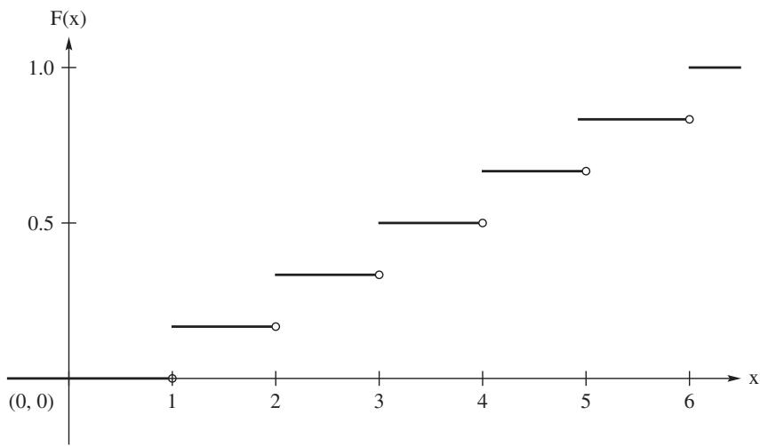  
Figure 1.5.1: Distribution function for Example 1.5.3.

The following example discusses the cdf for the continuous random variable discussed in Example 1.5.2.

Example 1.5.4 (Continuation of Example 1.5.2). Recall that $X$ denotes a real number chosen at random between 0 and 1. We now obtain the cdf of $X$ . First, if $x < 0$ , then $P(X \leq x) = 0$ . Next, if $x \geq 1$ , then $P(X \leq x) = 1$ . Finally, if $0 < x < 1$ , it follows from expression (1.5.3) that $P(X \leq x) = P(0 < X \leq x) = x - 0 = x$ . Hence the cdf of $X$ is

$$
F _ {X} (x) = \left\{ \begin{array}{l l} 0 & \text {i f} x <   0 \\ x & \text {i f} 0 \leq x <   1 \\ 1 & \text {i f} x \geq 1. \end{array} \right. \tag {1.5.7}
$$

A sketch of the cdf of $X$ is given in Figure 1.5.2. Note, however, the connection between $F_{X}(x)$ and the pdf for this experiment $f_{X}(x)$ , given in Example 1.5.2, is

$$
F _ {X} (x) = \int_ {- \infty} ^ {x} f _ {X} (t) d t, \mathrm {f o r a l l} x \in R,
$$

and $\frac{d}{dx} F_X(x) = f_X(x)$ , for all $x \in R$ , except for $x = 0$ and $x = 1$ .

Let $X$ and $Y$ be two random variables. We say that $X$ and $Y$ are equal in distribution and write $X \stackrel{D}{=} Y$ if and only if $F_{X}(x) = F_{Y}(x)$ , for all $x \in R$ . It is important to note while $X$ and $Y$ may be equal in distribution, they may be quite different. For instance, in the last example define the random variable $Y$ as $Y = 1 - X$ . Then $Y \neq X$ . But the space of $Y$ is the interval $(0, 1)$ , the same as $X$ . Further, the cdf of $Y$ is 0 for $y < 0$ ; 1 for $y \geq 1$ ; and for $0 \leq y < 1$ , it is

$$
F _ {Y} (y) = P (Y \leq y) = P (1 - X \leq y) = P (X \geq 1 - y) = 1 - (1 - y) = y.
$$

Hence, $Y$ has the same cdf as $X$ , i.e., $Y \stackrel{D}{=} X$ , but $Y \neq X$ .

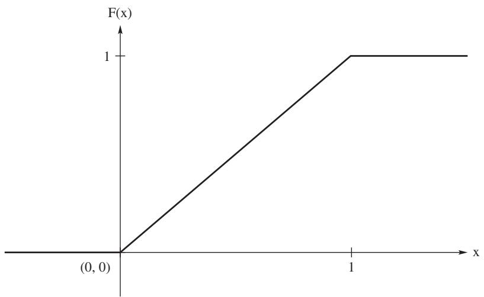  
Figure 1.5.2: Distribution function for Example 1.5.4.

The cdfs displayed in Figures 1.5.1 and 1.5.2 show increasing functions with lower limits 0 and upper limits 1. In both figures, the cdfs are at least right continuous. As the next theorem proves, these properties are true in general for cdfs.

Theorem 1.5.1. Let $X$ be a random variable with cumulative distribution function $F(x)$ . Then

(a) For all $a$ and $b$ , if $a < b$ , then $F(a) \leq F(b)$ ( $F$ is nondecreasing).   
(b) $\lim_{x\to -\infty}F(x) = 0$ (the lower limit of $F$ is 0).   
(c) $\lim_{x\to \infty}F(x) = 1$ (the upper limit of $F$ is 1).   
(d) $\lim_{x\downarrow x_0}F(x) = F(x_0)$ (F is right continuous).

Proof: We prove parts (a) and (d) and leave parts (b) and (c) for Exercise 1.5.10. Part (a): Because $a < b$ , we have $\{X \leq a\} \subset \{X \leq b\}$ . The result then follows from the monotonicity of $P$ ; see Theorem 1.3.3.

Part (d): Let $\{x_{n}\}$ be any sequence of real numbers such that $x_{n} \downarrow x_{0}$ . Let $C_{n} = \{X \leq x_{n}\}$ . Then the sequence of sets $\{C_{n}\}$ is decreasing and $\cap_{n=1}^{\infty} C_{n} = \{X \leq x_{0}\}$ . Hence, by Theorem 1.3.6,

$$
\lim  _ {n \to \infty} F (x _ {n}) = P \left(\bigcap_ {n = 1} ^ {\infty} C _ {n}\right) = F (x _ {0}),
$$

which is the desired result.

The next theorem is helpful in evaluating probabilities using cdfs.

Theorem 1.5.2. Let $X$ be a random variable with the cdf $F_{X}$ . Then for $a < b$ , $P[a < X \leq b] = F_{X}(b) - F_{X}(a)$ .

Proof: Note that

$$
\{- \infty <   X \leq b \} = \{- \infty <   X \leq a \} \cup \{a <   X \leq b \}.
$$

The proof of the result follows immediately because the union on the right side of this equation is a disjoint union.

Example 1.5.5. Let $X$ be the lifetime in years of a mechanical part. Assume that $X$ has the cdf

$$
F _ {X} (x) = \left\{ \begin{array}{l l} 0 & x <   0 \\ 1 - e ^ {- x} & 0 \leq x. \end{array} \right.
$$

The pdf of $X$ , $\frac{d}{dx} F_X(x)$ , is

$$
f _ {X} (x) = \left\{ \begin{array}{l l} e ^ {- x} & 0 <   x <   \infty \\ 0 & \text {e l s e w h e r e .} \end{array} \right.
$$

Actually the derivative does not exist at $x = 0$ , but in the continuous case the next theorem (1.5.3) shows that $P(X = 0) = 0$ and we can assign $f_{X}(0) = 0$ without changing the probabilities concerning $X$ . The probability that a part has a lifetime between one and three years is given by

$$
P (1 <   X \leq 3) = F _ {X} (3) - F _ {X} (1) = \int_ {1} ^ {3} e ^ {- x} d x.
$$

That is, the probability can be found by $F_{X}(3) - F_{X}(1)$ or evaluating the integral. In either case, it equals $e^{-1} - e^{-3} = 0.318$ .

Theorem 1.5.1 shows that cdfs are right continuous and monotone. Such functions can be shown to have only a countable number of discontinuities. As the next theorem shows, the discontinuities of a cdf have mass; that is, if $x$ is a point of discontinuity of $F_{X}$ , then we have $P(X = x) > 0$ .

Theorem 1.5.3. For any random variable,

$$
P [ X = x ] = F _ {X} (x) - F _ {X} (x -), \tag {1.5.8}
$$

for all $x\in R$ , where $F_{X}(x - ) = \lim_{z\uparrow x}F_{X}(z)$

Proof: For any $x \in R$ , we have

$$
\{x \} = \bigcap_ {n = 1} ^ {\infty} \left(x - \frac {1}{n}, x \right];
$$

that is, $\{x\}$ is the limit of a decreasing sequence of sets. Hence, by Theorem 1.3.6,

$$
\begin{array}{l} P [ X = x ] = P \left[ \bigcap_ {n = 1} ^ {\infty} \left\{x - \frac {1}{n} <   X \leq x \right\} \right] \\ = \lim  _ {n \rightarrow \infty} P \left[ x - \frac {1}{n} <   X \leq x \right] \\ = \lim  _ {n \rightarrow \infty} [ F _ {X} (x) - F _ {X} (x - (1 / n)) ] \\ = F _ {X} (x) - F _ {X} (x -), \\ \end{array}
$$

which is the desired result.

Example 1.5.6. Let $X$ have the discontinuous cdf

$$
F _ {X} (x) = \left\{ \begin{array}{l l} 0 & x <   0 \\ x / 2 & 0 \leq x <   1 \\ 1 & 1 \leq x. \end{array} \right.
$$

Then

$$
P (- 1 <   X \leq 1 / 2) = F _ {X} (1 / 2) - F _ {X} (- 1) = \frac {1}{4} - 0 = \frac {1}{4}
$$

and

$$
P (X = 1) = F _ {X} (1) - F _ {X} (1 -) = 1 - \frac {1}{2} = \frac {1}{2}.
$$

The value $1 / 2$ equals the value of the step of $F_{X}$ at $x = 1$ .

Since the total probability associated with a random variable $X$ of the discrete type with pmf $p_X(x)$ or of the continuous type with pdf $f_{X}(x)$ is 1, then it must be true that

$$
\sum_ {x \in \mathcal {D}} p _ {X} (x) = 1 \text {a n d} \int_ {\mathcal {D}} f _ {X} (x) d x = 1,
$$

where $\mathcal{D}$ is the space of $X$ . As the next two examples show, we can use this property to determine the pmf or pdf if we know the pmf or pdf down to a constant of proportionality.

Example 1.5.7. Suppose $X$ has the pmf

$$
p _ {X} (x) = \left\{ \begin{array}{l l} c x & x = 1, 2, \ldots , 1 0 \\ 0 & \text {e l s e w h e r e}, \end{array} \right.
$$

for an appropriate constant $c$ . Then

$$
1 = \sum_ {x = 1} ^ {1 0} p _ {X} (x) = \sum_ {x = 1} ^ {1 0} c x = c (1 + 2 + \dots + 1 0) = 5 5 c,
$$

and, hence, $c = 1 / 55$

Example 1.5.8. Suppose $X$ has the pdf

$$
f _ {X} (x) = \left\{ \begin{array}{l l} c x ^ {3} & 0 <   x <   2 \\ 0 & \text {e l s e w h e r e ,} \end{array} \right.
$$

for a constant $c$ . Then

$$
1 = \int_ {0} ^ {2} c x ^ {3} d x = c \left[ \frac {x ^ {4}}{4} \right] _ {0} ^ {2} = 4 c,
$$

and, hence, $c = 1/4$ . For illustration of the computation of a probability involving $X$ , we have

$$
P \left(\frac {1}{4} <   X <   1\right) = \int_ {1 / 4} ^ {1} \frac {x ^ {3}}{4} d x = \frac {2 5 5}{4 0 9 6} = 0. 0 6 2 2 6.
$$

# EXERCISES

1.5.1. Let a card be selected from an ordinary deck of playing cards. The outcome $c$ is one of these 52 cards. Let $X(c) = 4$ if $c$ is an ace, let $X(c) = 3$ if $c$ is a king, let $X(c) = 2$ if $c$ is a queen, let $X(c) = 1$ if $c$ is a jack, and let $X(c) = 0$ otherwise. Suppose that $P$ assigns a probability of $\frac{1}{52}$ to each outcome $c$ . Describe the induced probability $P_{X}(D)$ on the space $\mathcal{D} = \{0, 1, 2, 3, 4\}$ of the random variable $X$ .

1.5.2. For each of the following, find the constant $c$ so that $p(x)$ satisfies the condition of being a pmf of one random variable $X$ .

(a) $p(x) = c(\frac{2}{3})^x$ $x = 1,2,3,\ldots$ , zero elsewhere.   
(b) $p(x) = cx$ $x = 1,2,3,4,5,6$ zero elsewhere.

1.5.3. Let $p_X(x) = x / 15$ , $x = 1,2,3,4,5$ , zero elsewhere, be the pmf of $X$ . Find $P(X = 1 \text{ or } 2)$ , $P\left(\frac{1}{2} < X < \frac{5}{2}\right)$ , and $P(1 \leq X \leq 2)$ .

1.5.4. Let $p_X(x)$ be the pmf of a random variable $X$ . Find the cdf $F(x)$ of $X$ and sketch its graph along with that of $p_X(x)$ if:

(a) $p_X(x) = 1$ , $x = 0$ , zero elsewhere.   
(b) $p_X(x) = \frac{1}{3}, x = -1, 0, 1$ , zero elsewhere.   
(c) $p_X(x) = x / 15$ , $x = 1,2,3,4,5$ , zero elsewhere.

1.5.5. Let us select five cards at random and without replacement from an ordinary deck of playing cards.

(a) Find the pmf of $X$ , the number of hearts in the five cards.   
(b) Determine $P(X\leq 1)$

1.5.6. Let the probability set function of the random variable $X$ be $P_X(D) = \int_D f(x) \, dx$ , where $f(x) = 2x / 9$ , for $x \in \mathcal{D} = \{x : 0 < x < 3\}$ . Define the events $D_1 = \{x : 0 < x < 1\}$ and $D_2 = \{x : 2 < x < 3\}$ . Compute $P_X(D_1)$ , $P_X(D_2)$ , and $P_X(D_1 \cup D_2)$ .

1.5.7. Let the space of the random variable $X$ be $\mathcal{D} = \{x : 0 < x < 1\}$ . If $D_1 = \{x : 0 < x < \frac{1}{2}\}$ and $D_2 = \{x : \frac{1}{2} \leq x < 1\}$ , find $P_X(D_2)$ if $P_X(D_1) = \frac{1}{4}$ .

1.5.8. Suppose the random variable $X$ has the cdf

$$
F (x) = \left\{ \begin{array}{l l} 0 & x <   - 1 \\ \frac {x + 2}{4} & - 1 \leq x <   1 \\ 1 & 1 \leq x. \end{array} \right.
$$

Write an R function to sketch the graph of $F(x)$ . Use your graph to obtain the probabilities: (a) $P\left(-\frac{1}{2} < X \leq \frac{1}{2}\right)$ ; (b) $P(X = 0)$ ; (c) $P(X = 1)$ ; (d) $P(2 < X \leq 3)$ .

1.5.9. Consider an urn that contains slips of paper each with one of the numbers $1, 2, \ldots, 100$ on it. Suppose there are $i$ slips with the number $i$ on it for $i = 1, 2, \ldots, 100$ . For example, there are 25 slips of paper with the number 25. Assume that the slips are identical except for the numbers. Suppose one slip is drawn at random. Let $X$ be the number on the slip.

(a) Show that $X$ has the pmf $p(x) = x / 5050, x = 1,2,3,\ldots,100$ , zero elsewhere.   
(b) Compute $P(X\leq 50)$   
(c) Show that the cdf of $X$ is $F(x) = [x]([x] + 1)/10100$ , for $1 \leq x \leq 100$ , where $[x]$ is the greatest integer in $x$ .

1.5.10. Prove parts (b) and (c) of Theorem 1.5.1.

1.5.11. Let $X$ be a random variable with space $\mathcal{D}$ . For $D \subset \mathcal{D}$ , recall that the probability induced by $X$ is $P_X(D) = P[\{c : X(c) \in D\}]$ . Show that $P_X(D)$ is a probability by showing the following:

(a) $P_{X}(\mathcal{D}) = 1$   
(b) $P_{X}(D)\geq 0$   
(c) For a sequence of sets $\{D_n\}$ in $\mathcal{D}$ , show that

$$
\{c: X (c) \in \cup_ {n} D _ {n} \} = \cup_ {n} \{c: X (c) \in D _ {n} \}.
$$

(d) Use part (c) to show that if $\{D_n\}$ is sequence of mutually exclusive events, then

$$
P _ {X} \left(\cup_ {n = 1} ^ {\infty} D _ {n}\right) = \sum_ {n = 1} ^ {\infty} P _ {X} (D _ {n}).
$$

Remark 1.5.2. In a probability theory course, we would show that the $\sigma$ -field (collection of events) for $\mathcal{D}$ is the smallest $\sigma$ -field which contains all the open intervals of real numbers; see Exercise 1.3.24. Such a collection of events is sufficiently rich for discrete and continuous random variables.

# 1.6 Discrete Random Variables

The first example of a random variable encountered in the last section was an example of a discrete random variable, which is defined next.

Definition 1.6.1 (Discrete Random Variable). We say a random variable is a discrete random variable if its space is either finite or countable.

Example 1.6.1. Consider a sequence of independent flips of a coin, each resulting in a head (H) or a tail (T). Moreover, on each flip, we assume that H and T are equally likely; that is, $P(H) = P(T) = \frac{1}{2}$ . The sample space $\mathcal{C}$ consists of sequences like THTHTHT... Let the random variable $X$ equal the number of flips needed

to obtain the first head. Hence, $X(\mathrm{TTHHTHT}\dots) = 3$ . Clearly, the space of $X$ is $\mathcal{D} = \{1,2,3,4,\ldots\}$ . We see that $X = 1$ when the sequence begins with an H and thus $P(X = 1) = \frac{1}{2}$ . Likewise, $X = 2$ when the sequence begins with TH, which has probability $P(X = 2) = (\frac{1}{2})(\frac{1}{2}) = \frac{1}{4}$ from the independence. More generally, if $X = x$ , where $x = 1,2,3,4,\ldots$ , there must be a string of $x - 1$ tails followed by a head; that is, TT··TH, where there are $x - 1$ tails in TT··T. Thus, from independence, we have a geometric sequence of probabilities, namely,

$$
P (X = x) = \left(\frac {1}{2}\right) ^ {x - 1} \left(\frac {1}{2}\right) = \left(\frac {1}{2}\right) ^ {x}, \quad x = 1, 2, 3, \dots , \tag {1.6.1}
$$

the space of which is countable. An interesting event is that the first head appears on an odd number of flips; i.e., $X \in \{1, 3, 5, \ldots\}$ . The probability of this event is

$$
P [ X \in \{1, 3, 5, \dots \} ] = \sum_ {x = 1} ^ {\infty} \left(\frac {1}{2}\right) ^ {2 x - 1} = \frac {1}{2} \sum_ {x = 1} ^ {\infty} \left(\frac {1}{4}\right) ^ {x - 1} = \frac {1 / 2}{1 - (1 / 4)} = \frac {2}{3}.
$$

As the last example suggests, probabilities concerning a discrete random variable can be obtained in terms of the probabilities $P(X = x)$ , for $x \in \mathcal{D}$ . These probabilities determine an important function, which we define as

Definition 1.6.2 (Probability Mass Function (pmf)). Let $X$ be a discrete random variable with space $\mathcal{D}$ . The probability mass function (pmf) of $X$ is given by

$$
p _ {X} (x) = P [ X = x ], \quad f o r x \in \mathcal {D}. \tag {1.6.2}
$$

Note that pmfs satisfy the following two properties:

$$
\left. \text {(i)} 0 \leq p _ {X} (x) \leq 1, x \in \mathcal {D}, \text {a n d (i i)} \sum_ {x \in \mathcal {D}} p _ {X} (x) = 1. \right. \tag {1.6.3}
$$

In a more advanced class it can be shown that if a function satisfies properties (i) and (ii) for a discrete set $\mathcal{D}$ , then this function uniquely determines the distribution of a random variable.

Let $X$ be a discrete random variable with space $\mathcal{D}$ . As Theorem 1.5.3 shows, discontinuities of $F_{X}(x)$ define a mass; that is, if $x$ is a point of discontinuity of $F_{X}$ , then $P(X = x) > 0$ . We now make a distinction between the space of a discrete random variable and these points of positive probability. We define the support of a discrete random variable $X$ to be the points in the space of $X$ which have positive probability. We often use $\mathcal{S}$ to denote the support of $X$ . Note that $\mathcal{S} \subset \mathcal{D}$ , but it may be that $\mathcal{S} = \mathcal{D}$ .

Also, we can use Theorem 1.5.3 to obtain a relationship between the pmf and cdf of a discrete random variable. If $x \in S$ , then $p_X(x)$ is equal to the size of the discontinuity of $F_{X}$ at $x$ . If $x \notin S$ then $P[X = x] = 0$ and, hence, $F_{X}$ is continuous at this $x$ .

Example 1.6.2. A lot, consisting of 100 fuses, is inspected by the following procedure. Five of these fuses are chosen at random and tested; if all five "blow" at the

correct amperage, the lot is accepted. If, in fact, there are 20 defective fuses in the lot, the probability of accepting the lot is, under appropriate assumptions,

$$
\frac {\binom {8 0} {5}}{\binom {1 0 0} {5}} = 0. 3 1 9 3 1.
$$

More generally, let the random variable $X$ be the number of defective fuses among the five that are inspected. The pmf of $X$ is given by

$$
p _ {X} (x) = \left\{ \begin{array}{l l} \frac {\binom {2 0} {x} \binom {8 0} {5 - x}}{\binom {1 0 0} {5}} & \text {f o r} x = 0, 1, 2, 3, 4, 5 \\ 0 & \text {e l s e w h e r e .} \end{array} \right. \tag {1.6.4}
$$

Clearly, the space of $X$ is $\mathcal{D} = \{0, 1, 2, 3, 4, 5\}$ , which is also its support. This is an example of a random variable of the discrete type whose distribution is an illustration of a hypergeometric distribution, which is formally defined in Chapter 3. Based on the above discussion, it is easy to graph the cdf of $X$ ; see Exercise 1.6.5.

# 1.6.1 Transformations

A problem often encountered in statistics is the following. We have a random variable $X$ and we know its distribution. We are interested, though, in a random variable $Y$ which is some transformation of $X$ , say, $Y = g(X)$ . In particular, we want to determine the distribution of $Y$ . Assume $X$ is discrete with space $\mathcal{D}_X$ . Then the space of $Y$ is $\mathcal{D}_Y = \{g(x): x \in \mathcal{D}_X\}$ . We consider two cases.

In the first case, $g$ is one-to-one. Then, clearly, the pmf of $Y$ is obtained as

$$
p _ {Y} (y) = P [ Y = y ] = P [ g (X) = y ] = P [ X = g ^ {- 1} (y) ] = p _ {X} \left(g ^ {- 1} (y)\right). \tag {1.6.5}
$$

Example 1.6.3. Consider the random variable $X$ of Example 1.6.1. Recall that $X$ was the flip number on which the first head appeared. Let $Y$ be the number of flips before the first head. Then $Y = X - 1$ . In this case, the function $g$ is $g(x) = x - 1$ , whose inverse is given by $g^{-1}(y) = y + 1$ . The space of $Y$ is $D_Y = \{0, 1, 2, \ldots\}$ . The pmf of $X$ is given by (1.6.1); hence, based on expression (1.6.5), the pmf of $Y$ is

$$
p _ {Y} (y) = p _ {X} (y + 1) = \left(\frac {1}{2}\right) ^ {y + 1}, \quad \text {f o r} y = 0, 1, 2, \dots .
$$

Example 1.6.4. Let $X$ have the pmf

$$
p _ {X} (x) = \left\{ \begin{array}{l l} \frac {3 !}{x ! (3 - x) !} \left(\frac {2}{3}\right) ^ {x} \left(\frac {1}{3}\right) ^ {3 - x} & x = 0, 1, 2, 3 \\ 0 & \text {e l s e w h e r e .} \end{array} \right.
$$

We seek the pmf $p_{Y}(y)$ of the random variable $Y = X^{2}$ . The transformation $y = g(x) = x^{2}$ maps $\mathcal{D}_X = \{x : x = 0, 1, 2, 3\}$ onto $\mathcal{D}_Y = \{y : y = 0, 1, 4, 9\}$ . In general, $y = x^{2}$ does not define a one-to-one transformation; here, however, it does,

for there are no negative values of $x$ in $\mathcal{D}_X = \{x : x = 0, 1, 2, 3\}$ . That is, we have the single-valued inverse function $x = g^{-1}(y) = \sqrt{y}$ (not $-\sqrt{y}$ ), and so

$$
p _ {Y} (y) = p _ {X} (\sqrt {y}) = \frac {3 !}{(\sqrt {y}) ! (3 - \sqrt {y}) !} \left(\frac {2}{3}\right) ^ {\sqrt {y}} \left(\frac {1}{3}\right) ^ {3 - \sqrt {y}}, y = 0, 1, 4, 9.
$$

The second case is where the transformation, $g(x)$ , is not one-to-one. Instead of developing an overall rule, for most applications involving discrete random variables the pmf of $Y$ can be obtained in a straightforward manner. We offer two examples as illustrations.

Consider the geometric random variable in Example 1.6.3. Suppose we are playing a game against the "house" (say, a gambling casino). If the first head appears on an odd number of flips, we pay the house one dollar, while if it appears on an even number of flips, we win one dollar from the house. Let $Y$ denote our net gain. Then the space of $Y$ is $\{-1,1\}$ . In Example 1.6.1, we showed that the probability that $X$ is odd is $\frac{2}{3}$ . Hence, the distribution of $Y$ is given by $p_{Y}(-1) = 2/3$ and $p_{Y}(1) = 1/3$ .

As a second illustration, let $Z = (X - 2)^{2}$ , where $X$ is the geometric random variable of Example 1.6.1. Then the space of $Z$ is $\mathcal{D}_Z = \{0, 1, 4, 9, 16, \ldots\}$ . Note that $Z = 0$ if and only if $X = 2$ ; $Z = 1$ if and only if $X = 1$ or $X = 3$ ; while for the other values of the space there is a one-to-one correspondence given by $x = \sqrt{z} + 2$ for $z \in \{4, 9, 16, \ldots\}$ . Hence, the pmf of $Z$ is

$$
p _ {Z} (z) = \left\{ \begin{array}{l l} p _ {X} (2) = \frac {1}{4} & \text {f o r} z = 0 \\ p _ {X} (1) + p _ {X} (3) = \frac {5}{8} & \text {f o r} z = 1 \\ p _ {X} (\sqrt {z} + 2) = \frac {1}{4} \left(\frac {1}{2}\right) ^ {\sqrt {z}} & \text {f o r} z = 4, 9, 1 6, \dots . \end{array} \right. \tag {1.6.6}
$$

For verification, the reader is asked to show in Exercise 1.6.11 that the pmf of $Z$ sums to 1 over its space.

# EXERCISES

1.6.1. Let $X$ equal the number of heads in four independent flips of a coin. Using certain assumptions, determine the pmf of $X$ and compute the probability that $X$ is equal to an odd number.

1.6.2. Let a bowl contain 10 chips of the same size and shape. One and only one of these chips is red. Continue to draw chips from the bowl, one at a time and at random and without replacement, until the red chip is drawn.

(a) Find the pmf of $X$ , the number of trials needed to draw the red chip.   
(b) Compute $P(X\leq 4)$

1.6.3. Cast a die a number of independent times until a six appears on the up side of the die.

(a) Find the pmf $p(x)$ of $X$ , the number of casts needed to obtain that first six.

(b) Show that $\sum_{x = 1}^{\infty}p(x) = 1$   
(c) Determine $P(X = 1,3,5,7,\ldots)$ .   
(d) Find the cdf $F(x) = P(X \leq x)$ .

1.6.4. Cast a die two independent times and let $X$ equal the absolute value of the difference of the two resulting values (the numbers on the up sides). Find the pmf of $X$ . Hint: It is not necessary to find a formula for the pmf.

1.6.5. For the random variable $X$ defined in Example 1.6.2:

(a) Write an R function that returns the pmf. Note that in R, choose $(\mathfrak{m},\mathfrak{k})$ computes $\binom{m}{k}$ .   
(b) Write an R function that returns the graph of the cdf.

1.6.6. For the random variable $X$ defined in Example 1.6.1, graph the cdf of $X$ .   
1.6.7. Let $X$ have a pmf $p(x) = \frac{1}{3}$ , $x = 1,2,3$ , zero elsewhere. Find the pmf of $Y = 2X + 1$ .   
1.6.8. Let $X$ have the pmf $p(x) = (\frac{1}{2})^x$ , $x = 1, 2, 3, \ldots$ , zero elsewhere. Find the pmf of $Y = X^3$ .   
1.6.9. Let $X$ have the pmf $p(x) = 1/3, x = -1,0,1$ . Find the pmf of $Y = X^2$ .   
1.6.10. Let $X$ have the pmf

$$
p (x) = \left(\frac {1}{2}\right) ^ {| x |}, \quad x = - 1, - 2, - 3, \dots .
$$

Find the pmf of $Y = X^4$ .

1.6.11. Show that the function given in expression (1.6.6) is a pmf.

# 1.7 Continuous Random Variables

In the last section, we discussed discrete random variables. Another class of random variables important in statistical applications is the class of continuous random variables, which we define next.

Definition 1.7.1 (Continuous Random Variables). We say a random variable is a continuous random variable if its cumulative distribution function $F_{X}(x)$ is a continuous function for all $x \in R$ .

Recall from Theorem 1.5.3 that $P(X = x) = F_X(x) - F_X(x-)$ , for any random variable $X$ . Hence, for a continuous random variable $X$ , there are no points of discrete mass; i.e., if $X$ is continuous, then $P(X = x) = 0$ for all $x \in R$ . Most continuous random variables are absolutely continuous; that is,

$$
F _ {X} (x) = \int_ {- \infty} ^ {x} f _ {X} (t) d t, \tag {1.7.1}
$$

for some function $f_{X}(t)$ . The function $f_{X}(t)$ is called a probability density function (pdf) of $X$ . If $f_{X}(x)$ is also continuous, then the Fundamental Theorem of Calculus implies that

$$
\frac {d}{d x} F _ {X} (x) = f _ {X} (x). \tag {1.7.2}
$$

The support of a continuous random variable $X$ consists of all points $x$ such that $f_{X}(x) > 0$ . As in the discrete case, we often denote the support of $X$ by $S$ .

If $X$ is a continuous random variable, then probabilities can be obtained by integration; i.e.,

$$
P (a <   X \leq b) = F _ {X} (b) - F _ {X} (a) = \int_ {a} ^ {b} f _ {X} (t) d t.
$$

Also, for continuous random variables,

$$
P (a <   X \leq b) = P (a \leq X \leq b) = P (a \leq X <   b) = P (a <   X <   b).
$$

From the definition (1.7.2), note that pdfs satisfy the two properties

$$
\left(\mathrm {i}\right) f _ {X} (x) \geq 0 \text {a n d (i i)} \int_ {- \infty} ^ {\infty} f _ {X} (t) d t = 1. \tag {1.7.3}
$$

The second property, of course, follows from $F_{X}(\infty) = 1$ . In an advanced course in probability, it is shown that if a function satisfies the above two properties, then it is a pdf for a continuous random variable; see, for example, Tucker (1967).

Recall in Example 1.5.2 the simple experiment where a number was chosen at random from the interval $(0,1)$ . The number chosen, $X$ , is an example of a continuous random variable. Recall that the cdf of $X$ is $F_{X}(x) = x$ , for $0 < x < 1$ . Hence, the pdf of $X$ is given by

$$
f _ {X} (x) = \left\{ \begin{array}{l l} 1 & 0 <   x <   1 \\ 0 & \text {e l s e w h e r e .} \end{array} \right. \tag {1.7.4}
$$

Any continuous or discrete random variable $X$ whose pdf or pmf is constant on the support of $X$ is said to have a uniform distribution; see Chapter 3 for a more formal definition.

Example 1.7.1 (Point Chosen at Random Within the Unit Circle). Suppose we select a point at random in the interior of a circle of radius 1. Let $X$ be the distance of the selected point from the origin. The sample space for the experiment is $\mathcal{C} = \{(w, y) : w^2 + y^2 < 1\}$ . Because the point is chosen at random, it seems that subsets of $\mathcal{C}$ which have equal area are equilibrated. Hence, the probability of the selected point lying in a set $A \subset \mathcal{C}$ is proportional to the area of $A$ ; i.e.,

$$
P (A) = \frac {\mathrm {a r e a o f} A}{\pi}.
$$

For $0 < x < 1$ , the event $\{X \leq x\}$ is equivalent to the point lying in a circle of radius $x$ . By this probability rule, $P(X \leq x) = \pi x^2 / \pi = x^2$ ; hence, the cdf of $X$ is

$$
F _ {X} (x) = \left\{ \begin{array}{l l} 0 & x <   0 \\ x ^ {2} & 0 \leq x <   1 \\ 1 & 1 \leq x. \end{array} \right. \tag {1.7.5}
$$

Taking the derivative of $F_{X}(x)$ , we obtain the pdf of $X$ :

$$
f _ {X} (x) = \left\{ \begin{array}{l l} 2 x & 0 \leq x <   1 \\ 0 & \text {e l s e w h e r e .} \end{array} \right. \tag {1.7.6}
$$

For illustration, the probability that the selected point falls in the ring with radii $1/4$ and $1/2$ is given by

$$
P \left(\frac {1}{4} <   X \leq \frac {1}{2}\right) = \int_ {\frac {1}{4}} ^ {\frac {1}{2}} 2 w d w = w ^ {2} \bigg | _ {\frac {1}{4}} ^ {\frac {1}{2}} = \frac {3}{1 6}.
$$

Example 1.7.2. Let the random variable be the time in seconds between incoming telephone calls at a busy switchboard. Suppose that a reasonable probability model for $X$ is given by the pdf

$$
f _ {X} (x) = \left\{ \begin{array}{l l} \frac {1}{4} e ^ {- x / 4} & 0 <   x <   \infty \\ 0 & \text {e l s e w h e r e .} \end{array} \right.
$$

Note that $f_{X}$ satisfies the two properties of a pdf, namely, (i) $f(x) \geq 0$ and (ii)

$$
\int_ {0} ^ {\infty} \frac {1}{4} e ^ {- x / 4} d x = - e ^ {- x / 4} \Big | _ {0} ^ {\infty} = 1.
$$

For illustration, the probability that the time between successive phone calls exceeds 4 seconds is given by

$$
P (X > 4) = \int_ {4} ^ {\infty} \frac {1}{4} e ^ {- x / 4} d x = e ^ {- 1} = 0. 3 6 7 9.
$$

The pdf and the probability of interest are depicted in Figure 1.7.1. From the figure, the pdf has a long right tail and no left tail. We say that this distribution is skewed right or positively skewed. This is an example of a gamma distribution which is discussed in detail in Chapter 3.

# 1.7.1 Quantiles

Quantiles (percentiles) are easily interpretable characteristics of a distribution.

Definition 1.7.2 (Quantile). Let $0 < p < 1$ . The quantile of order $p$ of the distribution of a random variable $X$ is a value $\xi_{p}$ such that $P(X < \xi_p)\leq p$ and $P(X\leq \xi_p)\geq p$ . It is also known as the $(100p)$ th percentile of $X$ .

Examples include the median which is the quantile $\xi_{1/2}$ . The median is also called the second quartile. It is a point in the domain of $X$ that divides the mass of the pdf into its lower and upper halves. The first and third quartiles divide each of these halves into quarters. They are, respectively $\xi_{1/4}$ and $\xi_{3/4}$ . We label these quartiles as $q_1, q_2$ and $q_3$ , respectively. The difference $\mathrm{iq} = q_3 - q_1$ is called the

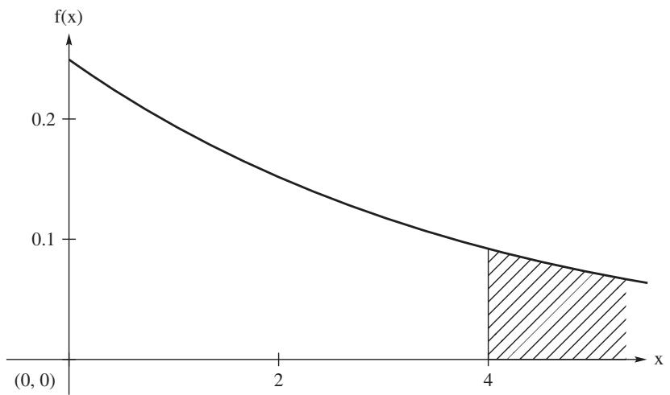  
Figure 1.7.1: In Example 1.7.2, the area under the pdf to the right of 4 is $P(X > 4)$ .

interquartile range of $X$ . The median is often used as a measure of center of the distribution of $X$ , while the interquartile range is used as a measure of spread or dispersion of the distribution of $X$ .

Quantiles need not be unique even for continuous random variables with pdfs. For example, any point in the interval $(2,3)$ serves as a median for the following pdf:

$$
f (x) = \left\{ \begin{array}{l l} 3 (1 - x) (x - 2) & 1 <   x <   2 \\ 3 (3 - x) (x - 4) & 3 <   x <   4 \\ 0 & \text {e l s e w h e r e .} \end{array} \right. \tag {1.7.7}
$$

If, however, a quantile, say $\xi_p$ , is in the support of an absolutely continuous random variable $X$ with cdf $F_X(x)$ then $\xi_p$ is the unique solution to the equation:

$$
\xi_ {p} = F _ {X} ^ {- 1} (p), \tag {1.7.8}
$$

where $F_{X}^{-1}(u)$ is the inverse function of $F_{X}(x)$ . The next example serves as an illustration.

Example 1.7.3. Let $X$ be a continuous random variable with pdf

$$
f (x) = \frac {e ^ {x}}{\left(1 + 5 e ^ {x}\right) ^ {1 . 2}}, - \infty <   x <   \infty . \tag {1.7.9}
$$

This pdf is a member of the log $F$ -family of distributions which is often used in the modeling of the log of lifetime data. Note that $X$ has the support space $(-\infty, \infty)$ . The cdf of $X$ is

$$
F (x) = 1 - \left(1 + 5 e ^ {- x}\right) ^ {-. 2}, \quad - \infty <   x <   \infty ,
$$

which is confirmed immediately by showing that $F'(x) = f(x)$ . For the inverse of the cdf, set $u = F(x)$ and solve for $u$ . A few steps of algebra lead to

$$
F ^ {- 1} (u) = \log \left\{. 2 \left[ (1 - u) ^ {- 5} - 1 \right] \right\}, \quad 0 <   u <   1.
$$

Thus, $\xi_p = F_X^{-1}(p) = \log \left\{ .2 \left[ (1 - p)^{-5} - 1 \right] \right\}$ . The following three R functions can be used to compute the pdf, cdf, and inverse cdf of $F$ , respectively. These can be downloaded at the site listed in the Preface.

$$
\begin{array}{l} \operatorname {d l o g F} <   - \text {f u n c t i o n} (\mathrm {x}) \{\exp (\mathrm {x}) / (1 + 5 * \exp (\mathrm {x})) ^ {\wedge} (1. 2) \} \\ \operatorname {p l o g F} <   - \text {f u n c t i o n} (\mathrm {x}) \{1 - (1 + 5 * \exp (\mathrm {x})) ^ {\wedge} (-. 2) \} \\ \operatorname {q l o g F} <   - \text {f u n c t i o n} (\mathrm {x}) \{\log (. 2 * ((1 - \mathrm {x}) ^ {\wedge} (- 5) - 1)) \} \\ \end{array}
$$

Once the R function qlogF is sourced, it can be used to compute quantiles. The following is an R script which results in the computation of the three quartiles of $X$ :

$$
\begin{array}{l} \operatorname {q l o g F} (. 2 5); \operatorname {q l o g F} (. 5 0); \operatorname {q l o g F} (. 7 5) \\ - 0. 4 4 1 9 2 4 2; 1. 8 2 4 5 4 9; 5. 3 2 1 0 5 7 \\ \end{array}
$$

Figure 1.7.2 displays a plot of this pdf and its quartiles. Notice that this is another example of a skewed-right distribution; i.e., the right-tail is much longer than left-tail. In terms of the log-l lifetime of mechanical parts having this distribution, it follows that $50\%$ of the parts survive beyond 1.83 log-units and $25\%$ of the parts live longer than 5.32 log-units. With the long-right tail, some parts attain a long life.

# 1.7.2 Transformations

Let $X$ be a continuous random variable with a known pdf $f_{X}$ . As in the discrete case, we are often interested in the distribution of a random variable $Y$ which is some transformation of $X$ , say, $Y = g(X)$ . Often we can obtain the pdf of $Y$ by first obtaining its cdf. We illustrate this with two examples.

Example 1.7.4. Let $X$ be the random variable in Example 1.7.1. Recall that $X$ was the distance from the origin to the random point selected in the unit circle. Suppose instead that we are interested in the square of the distance; that is, let $Y = X^2$ . The support of $Y$ is the same as that of $X$ , namely, $S_Y = (0,1)$ . What is the cdf of $Y$ ? By expression (1.7.5), the cdf of $X$ is

$$
F _ {X} (x) = \left\{ \begin{array}{l l} 0 & x <   0 \\ x ^ {2} & 0 \leq x <   1 \\ 1 & 1 \leq x. \end{array} \right. \tag {1.7.10}
$$

Let $y$ be in the support of $Y$ ; i.e., $0 < y < 1$ . Then, using expression (1.7.10) and the fact that the support of $X$ contains only positive numbers, the cdf of $Y$ is

$$
F _ {Y} (y) = P (Y \leq y) = P (X ^ {2} \leq y) = P (X \leq \sqrt {y}) = F _ {X} (\sqrt {y}) = \sqrt {y} ^ {2} = y.
$$

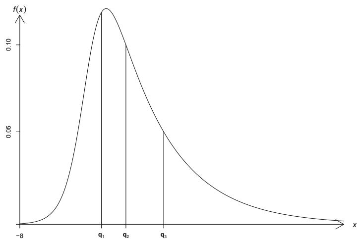  
Figure 1.7.2: A graph of the pdf (1.7.9) showing the three quartiles, $q_{1}, q_{2}$ , and $q_{3}$ , of the distribution. The probability mass in each of the four sections is $1/4$ .

It follows that the pdf of $Y$ is

$$
f _ {Y} (y) = \left\{ \begin{array}{l l} 1 & 0 <   y <   1 \\ 0 & \text {e l s e w h e r e .} \end{array} \right.
$$

Example 1.7.5. Let $f_{X}(x) = \frac{1}{2}$ , $-1 < x < 1$ , zero elsewhere, be the pdf of a random variable $X$ . Note that $X$ has a uniform distribution with the interval of support $(-1, 1)$ . Define the random variable $Y$ by $Y = X^2$ . We wish to find the pdf of $Y$ . If $y \geq 0$ , the probability $P(Y \leq y)$ is equivalent to

$$
P (X ^ {2} \leq y) = P (- \sqrt {y} \leq X \leq \sqrt {y}).
$$

Accordingly, the cdf of $Y$ , $F_{Y}(y) = P(Y \leq y)$ , is given by

$$
F _ {Y} (y) = \left\{ \begin{array}{l l} 0 & y <   0 \\ \int_ {- \sqrt {y}} ^ {\sqrt {y}} \frac {1}{2} d x = \sqrt {y} & 0 \leq y <   1 \\ 1 & 1 \leq y. \end{array} \right.
$$

Hence, the pdf of $Y$ is given by

$$
f _ {Y} (y) = \left\{ \begin{array}{l l} \frac {1}{2 \sqrt {y}} & 0 <   y <   1 \\ 0 & \text {e l s e w h e r e .} \end{array} \right.
$$

These examples illustrate the cumulative distribution function technique. The transformation in Example 1.7.4 is one-to-one, and in such cases we can obtain

a simple formula for the pdf of $Y$ in terms of the pdf of $X$ , which we record in the next theorem.

Theorem 1.7.1. Let $X$ be a continuous random variable with pdf $f_{X}(x)$ and support $S_{X}$ . Let $Y = g(X)$ , where $g(x)$ is a one-to-one differentiable function, on the support of $X$ , $S_{X}$ . Denote the inverse of $g$ by $x = g^{-1}(y)$ and let $dx / dy = d[g^{-1}(y)] / dy$ . Then the pdf of $Y$ is given by

$$
f _ {Y} (y) = f _ {X} \left(g ^ {- 1} (y)\right) \left| \frac {d x}{d y} \right|, \quad f o r y \in \mathcal {S} _ {Y}, \tag {1.7.11}
$$

where the support of $Y$ is the set $S_{Y} = \{y = g(x):x\in S_{X}\}$ .

Proof: Since $g(x)$ is one-to-one and continuous, it is either strictly monotonically increasing or decreasing. Assume that it is strictly monotonically increasing, for now. The cdf of $Y$ is given by

$$
F _ {Y} (y) = P [ Y \leq y ] = P [ g (X) \leq y ] = P [ X \leq g ^ {- 1} (y) ] = F _ {X} \left(g ^ {- 1} (y)\right). \tag {1.7.12}
$$

Hence, the pdf of $Y$ is

$$
f _ {Y} (y) = \frac {d}{d y} F _ {Y} (y) = f _ {X} \left(g ^ {- 1} (y)\right) \frac {d x}{d y}, \tag {1.7.13}
$$

where $dx / dy$ is the derivative of the function $x = g^{-1}(y)$ . In this case, because $g$ is increasing, $dx / dy > 0$ . Hence, we can write $dx / dy = |dx / dy|$ .

Suppose $g(x)$ is strictly monotonically decreasing. Then (1.7.12) becomes $F_{Y}(y) = 1 - F_{X}(g^{-1}(y))$ . Hence, the pdf of $Y$ is $f_{Y}(y) = f_{X}(g^{-1}(y))(-dx / dy)$ . But since $g$ is decreasing, $dx / dy < 0$ and, hence, $-dx / dy = |dx / dy|$ . Thus Equation (1.7.11) is true in both cases.

Henceforth, we refer to $dx / dy = (d / dy)g^{-1}(y)$ as the Jacobian (denoted by $J$ ) of the transformation. In most mathematical areas, $J = dx / dy$ is referred to as the Jacobian of the inverse transformation $x = g^{-1}(y)$ , but in this book it is called the Jacobian of the transformation, simply for convenience.

We summarize Theorem 1.7.1 in a simple algorithm which we illustrate in the next example. Assuming that the transformation $Y = g(X)$ is one-to-one, the following steps lead to the pdf of $Y$ :

1. Find the support of $Y$ .   
2. Solve for the inverse of the transformation; i.e., solve for $x$ in terms of $y$ in $y = g(x)$ , thereby obtaining $x = g^{-1}(y)$ .   
3. Obtain $\frac{dx}{dy}$ .   
4. The pdf of $Y$ is $f_{Y}(y) = f_{X}(g^{-1}(y))\left|\frac{dx}{dy}\right|$ .

Example 1.7.6. Let $X$ have the pdf

$$
f (x) = \left\{ \begin{array}{l l} 4 x ^ {3} & 0 <   x <   1 \\ 0 & \text {e l s e w h e r e .} \end{array} \right.
$$

Consider the random variable $Y = -\log X$ . Here are the steps of the above algorithm:

1. The support of $Y = -\log X$ is $(0, \infty)$ .   
2. If $y = -\log x$ then $x = e^{-y}$ .   
3. $\frac{dx}{dy} = -e^{-y}$   
4. Thus the pdf of $Y$ is:

$$
f _ {Y} (y) = f _ {X} \left(e ^ {- y}\right) | - e ^ {- y} | = 4 \left(e ^ {- y}\right) ^ {3} e ^ {- y} = 4 e ^ {- 4 y}.
$$

# 1.7.3 Mixtures of Discrete and Continuous Type Distributions

We close this section by two examples of distributions that are not of the discrete or the continuous type.

Example 1.7.7. Let a distribution function be given by

$$
F (x) = \left\{ \begin{array}{l l} 0 & x <   0 \\ \frac {x + 1}{2} & 0 \leq x <   1 \\ 1 & 1 \leq x. \end{array} \right.
$$

Then, for instance,

$$
P \left(- 3 <   X \leq \frac {1}{2}\right) = F \left(\frac {1}{2}\right) - F (- 3) = \frac {3}{4} - 0 = \frac {3}{4}
$$

and

$$
P (X = 0) = F (0) - F (0 -) = \frac {1}{2} - 0 = \frac {1}{2}.
$$

The graph of $F(x)$ is shown in Figure 1.7.3. We see that $F(x)$ is not always continuous, nor is it a step function. Accordingly, the corresponding distribution is neither of the continuous type nor of the discrete type. It may be described as a mixture of those types.

Distributions that are mixtures of the continuous and discrete type do, in fact, occur frequently in practice. For illustration, in life testing, suppose we know that the length of life, say $X$ , exceeds the number $b$ , but the exact value of $X$ is unknown. This is called censoring. For instance, this can happen when a subject in a cancer study simply disappears; the investigator knows that the subject has lived a certain number of months, but the exact length of life is unknown. Or it might happen when an investigator does not have enough time in an investigation to observe the moments of deaths of all the animals, say rats, in some study. Censoring can also occur in the insurance industry; in particular, consider a loss with a limited-pay policy in which the top amount is exceeded but it is not known by how much.

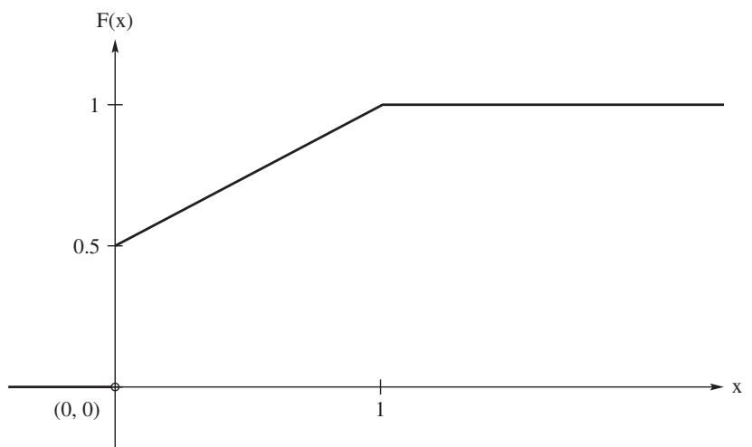  
Figure 1.7.3: Graph of the cdf of Example 1.7.7.

Example 1.7.8. Reinsurance companies are concerned with large losses because they might agree, for illustration, to cover losses due to wind damages that are between $2,000,000 and$ 10,000,000. Say that $X$ equals the size of a wind loss in millions of dollars, and suppose it has the cdf

$$
F _ {X} (x) = \left\{ \begin{array}{l l} 0 & - \infty <   x <   0 \\ 1 - \left(\frac {1 0}{1 0 + x}\right) ^ {3} & 0 \leq x <   \infty . \end{array} \right.
$$

If losses beyond \(10,000,000 are reported only as 10, then the cdf of this censored distribution is

$$
F _ {Y} (y) = \left\{ \begin{array}{l l} 0 & - \infty <   y <   0 \\ 1 - \left(\frac {1 0}{1 0 + y}\right) ^ {3} & 0 \leq y <   1 0, \\ 1 & 1 0 \leq y <   \infty , \end{array} \right.
$$

which has a jump of $[10 / (10 + 10)]^3 = \frac{1}{8}$ at $y = 10$ .

# EXERCISES

1.7.1. Let a point be selected from the sample space $\mathcal{C} = \{c:0 < c < 10\}$ . Let $C\subset \mathcal{C}$ and let the probability set function be $P(C) = \int_{C}\frac{1}{10} dz$ . Define the random variable $X$ to be $X(c) = c^2$ . Find the cdf and the pdf of $X$ .   
1.7.2. Let the space of the random variable $X$ be $\mathcal{C} = \{x : 0 < x < 10\}$ and let $P_X(C_1) = \frac{3}{8}$ , where $C_1 = \{x : 1 < x < 5\}$ . Show that $P_X(C_2) \leq \frac{5}{8}$ , where $C_2 = \{x : 5 \leq x < 10\}$ .   
1.7.3. Let the subsets $C_1 = \{\frac{1}{4} < x < \frac{1}{2}\}$ and $C_2 = \{\frac{1}{2} \leq x < 1\}$ of the space $\mathcal{C} = \{x : 0 < x < 1\}$ of the random variable $X$ be such that $P_X(C_1) = \frac{1}{8}$ and $P_X(C_2) = \frac{1}{2}$ . Find $P_X(C_1 \cup C_2)$ , $P_X(C_1^c)$ , and $P_X(C_1^c \cap C_2^c)$ .

1.7.4. Given $\int_{C}[1 / \pi (1 + x^2)]dx$ , where $C\subset \mathcal{C} = \{x: - \infty < x < \infty \}$ . Show that the integral could serve as a probability set function of a random variable $X$ whose space is $\mathcal{C}$ .

1.7.5. Let the probability set function of the random variable $X$ be

$$
P _ {X} (C) = \int_ {C} e ^ {- x} d x, \quad \text {w h e r e} \mathcal {C} = \{x: 0 <   x <   \infty \}.
$$

Let $C_k = \{x : 2 - 1/k < x \leq 3\}$ , $k = 1, 2, 3, \ldots$ . Find the limits $\lim_{k \to \infty} C_k$ and $P_X(\lim_{k \to \infty} C_k)$ . Find $P_X(C_k)$ and show that $\lim_{k \to \infty} P_X(C_k) = P_X(\lim_{k \to \infty} C_k)$ .

1.7.6. For each of the following pdfs of $X$ , find $P(|X| < 1)$ and $P(X^2 < 9)$ .

(a) $f(x) = x^{2} / 18, -3 <   x <   3$ , zero elsewhere.   
(b) $f(x) = (x + 2) / 18, - 2 <   x <   4$ , zero elsewhere.

1.7.7. Let $f(x) = 1 / x^2$ , $1 < x < \infty$ , zero elsewhere, be the pdf of $X$ . If $C_1 = \{x : 1 < x < 2\}$ and $C_2 = \{x : 4 < x < 5\}$ , find $P_X(C_1 \cup C_2)$ and $P_X(C_1 \cap C_2)$ .

1.7.8. A mode of the distribution of a random variable $X$ is a value of $x$ that maximizes the pdf or pmf. If there is only one such $x$ , it is called the mode of the distribution. Find the mode of each of the following distributions:

(a) $p(x) = (\frac{1}{2})^x$ $x = 1,2,3,\ldots$ , zero elsewhere.   
(b) $f(x) = 12x^{2}(1 - x)$ $0 <   x <   1$ , zero elsewhere.   
(c) $f(x) = \left(\frac{1}{2}\right)x^{2}e^{-x}, 0 < x < \infty, \text{ zero elsewhere.}$

1.7.9. The median and quantiles, in general, are discussed in Section 1.7.1. Find the median of each of the following distributions:

(a) $p(x) = \frac{4!}{x!(4 - x)!} (\frac{1}{4})^x (\frac{3}{4})^{4 - x},x = 0,1,2,3,4,$ zero elsewhere.   
(b) $f(x) = 3x^{2}$ $0 <   x <   1$ , zero elsewhere.   
(c) $f(x) = \frac{1}{\pi(1 + x^2)}$ $-\infty <  x <   \infty$

1.7.10. Let $0 < p < 1$ . Find the 0.20 quantile (20th percentile) of the distribution that has pdf $f(x) = 4x^3$ , $0 < x < 1$ , zero elsewhere.

1.7.11. For each of the following cdfs $F(x)$ , find the pdf $f(x)$ [pmf in part (d)], the first quartile, and the 0.60 quantile. Also, sketch the graphs of $f(x)$ and $F(x)$ . May use R to obtain the graphs. For Part(a) the code is provided.

(a) $F(x) = \frac{1}{2} +\frac{1}{\pi}\tan^{-1}(x), - \infty <  x <   \infty .$ $\mathbf{x} <   - \mathrm{seq}(-5,5,.01);\mathrm{y} <   -.5 + \mathrm{atan}(\mathrm{x}) / \mathrm{pi};\mathrm{y}2 <   - 1 / (\mathrm{pi}*(1 + \mathrm{x}^{\wedge}2))$ par(mfrow=c(1,2));plot(y~x);plot(y2~x)

(b) $F(x) = \exp \left\{-e^{-x}\right\} , - \infty <  x <   \infty .$   
(c) $F(x) = (1 + e^{-x})^{-1}, - \infty <  x <   \infty .$   
(d) $F(x) = \sum_{j=1}^{x}\left(\frac{1}{2}\right)^{j}$ .

1.7.12. Find the cdf $F(x)$ associated with each of the following probability density functions. Sketch the graphs of $f(x)$ and $F(x)$ .

(a) $f(x) = 3(1 - x)^2$ , $0 < x < 1$ , zero elsewhere.   
(b) $f(x) = 1 / x^2$ $1 <   x <   \infty$ , zero elsewhere.   
(c) $f(x) = \frac{1}{3}, 0 < x < 1$ or $2 < x < 4$ , zero elsewhere.

Also, find the median and the 25th percentile of each of these distributions.

1.7.13. Consider the cdf $F(x) = 1 - e^{-x} - xe^{-x}$ , $0 \leq x < \infty$ , zero elsewhere. Find the pdf, the mode, and the median (by numerical methods) of this distribution.   
1.7.14. Let $X$ have the pdf $f(x) = 2x$ , $0 < x < 1$ , zero elsewhere. Compute the probability that $X$ is at least $\frac{3}{4}$ given that $X$ is at least $\frac{1}{2}$ .   
1.7.15. The random variable $X$ is said to be stochastically larger than the random variable $Y$ if

$$
P (X > z) \geq P (Y > z), \tag {1.7.14}
$$

for all real $z$ , with strict inequality holding for at least one $z$ value. Show that this requires that the cdfs enjoy the following property:

$$
F _ {X} (z) \leq F _ {Y} (z),
$$

for all real $z$ , with strict inequality holding for at least one $z$ value.

1.7.16. Let $X$ be a continuous random variable with support $(-\infty, \infty)$ . Consider the random variable $Y = X + \Delta$ , where $\Delta > 0$ . Using the definition in Exercise 1.7.15, show that $Y$ is stochastically larger than $X$ .

1.7.17. Divide a line segment into two parts by selecting a point at random. Find the probability that the length of the larger segment is at least three times the length of the shorter segment. Assume a uniform distribution.

1.7.18. Let $X$ be the number of gallons of ice cream that is requested at a certain store on a hot summer day. Assume that $f(x) = 12x(1000 - x)^{2} / 10^{12}$ , $0 < x < 1000$ , zero elsewhere, is the pdf of $X$ . How many gallons of ice cream should the store have on hand each of these days, so that the probability of exhausting its supply on a particular day is 0.05?

1.7.19. Find the 25th percentile of the distribution having pdf $f(x) = |x| / 4$ , where $-2 < x < 2$ and zero elsewhere.

1.7.20. The distribution of the random variable $X$ in Example 1.7.3 is often used to model the log of the lifetime of a mechanical or electrical part. What about the lifetime itself? Let $Y = \exp \{X\}$ .

(a) Determine the range of $Y$ .   
(b) Use the transformation technique to find the pdf of $Y$ .   
(c) Write an R function to compute this pdf and use it to obtain a graph of the pdf. Discuss the plot.   
(d) Determine the 90th percentile of $Y$ .

1.7.21. The distribution of the random variable $X$ in Example 1.7.3 is a member of the log- $F$ family. Another member has the cdf

$$
F (x) = \left[ 1 + \frac {2}{3} e ^ {- x} \right] ^ {- 5 / 2}, - \infty <   x <   \infty .
$$

(a) Determine the corresponding pdf.   
(b) Write an R function that computes this cdf. Plot the function and obtain approximations of the quartiles and median by inspection of the plot.   
(c) Obtain the inverse of the cdf and confirm the percentiles in Part (b).

1.7.22. Let $X$ have the pdf $f(x) = x^{2} / 9$ , $0 < x < 3$ , zero elsewhere. Find the pdf of $Y = X^3$ .   
1.7.23. If the pdf of $X$ is $f(x) = 2xe^{-x^2}$ , $0 < x < \infty$ , zero elsewhere, determine the pdf of $Y = X^2$ .   
1.7.24. Let $X$ have the uniform pdf $f_{X}(x) = \frac{1}{\pi}$ , for $-\frac{\pi}{2} < x < \frac{\pi}{2}$ . Find the pdf of $Y = \tan X$ . This is the pdf of a Cauchy distribution.   
1.7.25. Let $X$ have the pdf $f(x) = 4x^3$ , $0 < x < 1$ , zero elsewhere. Find the cdf and the pdf of $Y = -\ln X^4$ .   
1.7.26. Let $f(x) = \frac{1}{3}$ , $-1 < x < 2$ , zero elsewhere, be the pdf of $X$ . Find the cdf and the pdf of $Y = X^2$ .

Hint: Consider $P(X^2 \leq y)$ for two cases: $0 \leq y < 1$ and $1 \leq y < 4$ .

# 1.8 Expectation of a Random Variable

In this section we introduce the expectation operator, which we use throughout the remainder of the text. For the definition, recall from calculus that absolute convergence of sums or integrals implies their convergence.

Definition 1.8.1 (Expectation). Let $X$ be a random variable. If $X$ is a continuous random variable with pdf $f(x)$ and

$$
\int_ {- \infty} ^ {\infty} | x | f (x) d x <   \infty ,
$$

then the expectation of $X$ is

$$
E (X) = \int_ {- \infty} ^ {\infty} x f (x) d x.
$$

If $X$ is a discrete random variable with pmf $p(x)$ and

$$
\sum_ {x} | x | p (x) <   \infty ,
$$

then the expectation of $X$ is

$$
E (X) = \sum_ {x} x p (x).
$$

Sometimes the expectation $E(X)$ is called the mathematical expectation of $X$ , the expected value of $X$ , or the mean of $X$ . When the mean designation is used, we often denote the $E(X)$ by $\mu$ ; i.e., $\mu = E(X)$ .

Example 1.8.1 (Expectation of a Constant). Consider a constant random variable, that is, a random variable with all its mass at a constant $k$ . This is a discrete random variable with pmf $p(k) = 1$ . We have by definition that

$$
E (k) = k p (k) = k. \quad \blacksquare \tag {1.8.1}
$$

Example 1.8.2. Let the random variable $X$ of the discrete type have the pmf given by the table

<table><tr><td>x</td><td>1</td><td>2</td><td>3</td><td>4</td></tr><tr><td>p(x)</td><td>4/10</td><td>1/10</td><td>3/10</td><td>2/10</td></tr></table>

Here $p(x) = 0$ if $x$ is not equal to one of the first four positive integers. This illustrates the fact that there is no need to have a formula to describe a pmf. We have

$$
E (X) = (1) \left(\frac {4}{1 0}\right) + (2) \left(\frac {1}{1 0}\right) + (3) \left(\frac {3}{1 0}\right) + (4) \left(\frac {2}{1 0}\right) = \frac {2 3}{1 0} = 2. 3.
$$

Example 1.8.3. Let the continuous random variable $X$ have the pdf

$$
f (x) = \left\{ \begin{array}{l l} 4 x ^ {3} & 0 <   x <   1 \\ 0 & \text {e l s e w h e r e .} \end{array} \right.
$$

Then

$$
E (X) = \int_ {0} ^ {1} x (4 x ^ {3}) d x = \int_ {0} ^ {1} 4 x ^ {4} d x = \left. \frac {4 x ^ {5}}{5} \right| _ {0} ^ {1} = \frac {4}{5}.
$$

Remark 1.8.1. The terminology of expectation or expected value has its origin in games of chance. For example, consider a game involving a spinner with the numbers 1, 2, 3 and 4 on it. Suppose the corresponding probabilities of spinning these numbers are 0.20, 0.30, 0.35, and 0.15. To begin a game, a player pays $5 to the "house" to play. The spinner is then spun and the player "wins" the amount in the second line of the table:

<table><tr><td>Number spun x</td><td>1</td><td>2</td><td>3</td><td>4</td></tr><tr><td>”Wins”</td><td>$2</td><td>$3</td><td>$4</td><td>$12</td></tr><tr><td>G = Gain</td><td>-$3</td><td>-$2</td><td>-$1</td><td>$7</td></tr><tr><td>pG(x)</td><td>0.20</td><td>0.30</td><td>0.35</td><td>0.15</td></tr></table>

"Wins" is in quotes, since the player must pay $5 to play. Of course, the random variable of interest is the gain to the player; i.e., G with the range as given in the third row of the table. Notice that 20% of the time the player gains -$3; 30% of the time the player gains -$2; 35% of the time the player gains -$1; and 15% of the time the player gains $7. In mathematics this sentence is expressed as

$$
(- 3) \times 0. 2 0 + (- 2) \times 0. 3 0 + (- 1) \times 0. 3 5 + 7 \times 0. 1 5 = - 0. 5 0,
$$

which, of course, is \( E(G) \). That is, the expected gain to the player in this game is -\\(0.50. So the player expects to lose 50 cents per play. We say a game is a fair game, if the expected gain is 0. So this spinner game is not a fair game. ■

Let us consider a function of a random variable $X$ . Call this function $Y = g(X)$ . Because $Y$ is a random variable, we could obtain its expectation by first finding the distribution of $Y$ . However, as the following theorem states, we can use the distribution of $X$ to determine the expectation of $Y$ .

Theorem 1.8.1. Let $X$ be a random variable and let $Y = g(X)$ for some function $g$ .

(a) Suppose $X$ is continuous with pdf $f_{X}(x)$ . If $\int_{-\infty}^{\infty}|g(x)|f_X(x)dx < \infty$ , then the expectation of $Y$ exists and it is given by

$$
E (Y) = \int_ {- \infty} ^ {\infty} g (x) f _ {X} (x) d x. \tag {1.8.2}
$$

(b) Suppose $X$ is discrete with pmf $p_X(x)$ . Suppose the support of $X$ is denoted by $S_X$ . If $\sum_{x \in S_X} |g(x)| p_X(x) < \infty$ , then the expectation of $Y$ exists and it is given by

$$
E (Y) = \sum_ {x \in \mathcal {S} _ {X}} g (x) p _ {X} (x). \tag {1.8.3}
$$

Proof: We give the proof in the discrete case. The proof for the continuous case requires some advanced results in analysis; see, also, Exercise 1.8.1.

Because $\sum_{x\in S_X}|g(x)|p_X(x)$ converges, it follows by a theorem in calculus<sup>6</sup> that any rearrangement of the terms of the series converges to the same limit. Thus we have,

$$
\begin{array}{l} \sum_ {x \in \mathcal {S} _ {X}} | g (x) | p _ {X} (x) = \sum_ {y \in \mathcal {S} _ {Y}} \sum_ {\{x \in \mathcal {S} _ {X}: g (x) = y \}} | g (x) | p _ {X} (x) (1.8.4) \\ = \sum_ {y \in \mathcal {S} _ {Y}} | y | \sum_ {\{x \in \mathcal {S} _ {X}: g (x) = y \}} p _ {X} (x) (1.8.5) \\ = \sum_ {y \in \mathcal {S} _ {Y}} | y | p _ {Y} (y), (1.8.6) \\ \end{array}
$$

where $\mathcal{S}_Y$ denotes the support of $Y$ . So $E(Y)$ exists; i.e., $\sum_{x \in \mathcal{S}_X} g(x)p_X(x)$ converges. Because $\sum_{x \in \mathcal{S}_X} g(x)p_X(x)$ converges and also converges absolutely, the same theorem from calculus can be used to show that the above equations (1.8.4)-(1.8.6) hold without the absolute values. Hence, $E(Y) = \sum_{x \in \mathcal{S}_X} g(x)p_X(x)$ , which is the desired result.

The following two examples illustrate this theorem.

Example 1.8.4. Let $Y$ be the discrete random variable discussed in Example 1.6.3 and let $Z = e^{-Y}$ . Since $(2e)^{-1} < 1$ , we have by Theorem 1.8.1 that

$$
\begin{array}{l} E [ Z ] = E \left[ e ^ {- Y} \right] = \sum_ {y = 0} ^ {\infty} e ^ {- y} \left(\frac {1}{2}\right) ^ {y + 1} \\ = e \sum_ {y = 0} ^ {\infty} \left(\frac {1}{2} e ^ {- 1}\right) ^ {y + 1} = \frac {e}{1 - (1 / (2 e))} = \frac {2 e ^ {2}}{2 e - 1}. \\ \end{array}
$$

Example 1.8.5. Let $X$ be a continuous random variable with the pdf $f(x) = 2x$ which has support on the interval $(0,1)$ . Suppose $Y = 1 / (1 + X)$ . Then by Theorem 1.8.1, we have

$$
E (Y) = \int_ {0} ^ {1} \frac {2 x}{1 + x} d x = \int_ {1} ^ {2} \frac {2 u - 2}{u} d u = 2 (1 - \log 2),
$$

where we have used the change in variable $u = 1 + x$ in the second integral.

Theorem 1.8.2 shows that the expectation operator $E$ is a linear operator.

Theorem 1.8.2. Let $g_{1}(X)$ and $g_{2}(X)$ be functions of a random variable $X$ . Suppose the expectations of $g_{1}(X)$ and $g_{2}(X)$ exist. Then for any constants $k_{1}$ and $k_{2}$ , the expectation of $k_{1}g_{1}(X) + k_{2}g_{2}(X)$ exists and it is given by

$$
E \left[ k _ {1} g _ {1} (X) + k _ {2} g _ {2} (X) \right] = k _ {1} E \left[ g _ {1} (X) \right] + k _ {2} E \left[ g _ {2} (X) \right]. \tag {1.8.7}
$$

Proof: For the continuous case, existence follows from the hypothesis, the triangle inequality, and the linearity of the integral; i.e.,

$$
\begin{array}{l} \int_ {- \infty} ^ {\infty} | k _ {1} g _ {1} (x) + k _ {2} g _ {2} (x) | f _ {X} (x) d x \leq | k _ {1} | \int_ {- \infty} ^ {\infty} | g _ {1} (x) | f _ {X} (x) d x \\ + \left| k _ {2} \right| \int_ {- \infty} ^ {\infty} \left| g _ {2} (x) \right| f _ {X} (x) d x <   \infty . \\ \end{array}
$$

The result (1.8.7) follows similarly using the linearity of the integral. The proof for the discrete case follows likewise using the linearity of sums. $\blacksquare$

The following examples illustrate these theorems.

Example 1.8.6. Let $X$ have the pdf

$$
f (x) = \left\{ \begin{array}{l l} 2 (1 - x) & 0 <   x <   1 \\ 0 & \text {e l s e w h e r e .} \end{array} \right.
$$

Then

$$
\begin{array}{l} E (X) = \int_ {- \infty} ^ {\infty} x f (x) d x = \int_ {0} ^ {1} (x) 2 (1 - x) d x = \frac {1}{3}, \\ E (X ^ {2}) = \int_ {- \infty} ^ {\infty} x ^ {2} f (x) d x = \int_ {0} ^ {1} (x ^ {2}) 2 (1 - x) d x = \frac {1}{6}, \\ \end{array}
$$

and, of course,

$$
E (6 X + 3 X ^ {2}) = 6 \left(\frac {1}{3}\right) + 3 \left(\frac {1}{6}\right) = \frac {5}{2}.
$$

Example 1.8.7. Let $X$ have the pmf

$$
p (x) = \left\{ \begin{array}{l l} \frac {x}{6} & x = 1, 2, 3 \\ 0 & \text {e l s e w h e r e .} \end{array} \right.
$$

Then

$$
E (6 X ^ {3} + X) = 6 E (X ^ {3}) + E (X) = 6 \sum_ {x = 1} ^ {3} x ^ {3} p (x) + \sum_ {x = 1} ^ {3} x p (x) = \frac {3 0 1}{3}.
$$

Example 1.8.8. Let us divide, at random, a horizontal line segment of length 5 into two parts. If $X$ is the length of the left-hand part, it is reasonable to assume that $X$ has the pdf

$$
f (x) = \left\{ \begin{array}{l l} \frac {1}{5} & 0 <   x <   5 \\ 0 & \text {e l s e w h e r e .} \end{array} \right.
$$

The expected value of the length of $X$ is $E(X) = \frac{5}{2}$ and the expected value of the length $5 - x$ is $E(5 - x) = \frac{5}{2}$ . But the expected value of the product of the two lengths is equal to

$$
E [ X (5 - X) ] = \int_ {0} ^ {5} x (5 - x) (\frac {1}{5}) d x = \frac {2 5}{6} \neq (\frac {5}{2}) ^ {2}.
$$

That is, in general, the expected value of a product is not equal to the product of the expected values.

# 1.8.1 R Computation for an Estimation of the Expected Gain

In the following example, we use an R function to estimate the expected gain in a simple game.

Example 1.8.9. Consider the following game. A player pays $p_0$ to play. He then rolls a fair 6-sided die with the numbers 1 through 6 on it. If the upface is a 1 or a 2, then the game is over. Otherwise, he flips a fair coin. If the coin toss results in a tail, he receives $1 and the game is over. If, on the other hand, the coin toss results in a head, he draws 2 cards without replacement from a standard deck of 52 cards. If none of the cards is an ace, he receives$ 2, while he receives $10 or $50 if gets 1 or 2 aces, respectively. In both cases, the game is over. Let G denote the player's gain. To determine the expected gain, we need the distribution of G. The support of G is the set \{ -p_0, 1 - p_0, 2 - p_0, 10 - p_0, 50 - p_0 \}. For the associated probabilities we need the distribution of X, where X is the number of aces in a draw of 2 cards from a standard deck of 52 cards without replacement. This is another example of the hypergeometric distribution discussed in Example 1.6.2. For our situation, the distribution is

$$
P (X = x) = \frac {\binom {4} {x} \binom {4 8} {2 - x}}{\binom {5 2} {2}}, \quad x = 0, 1, 2.
$$

Using this formula, the probabilities of $X$ , to 4 places, are 0.8507, 0.1448, and 0.0045 for $x$ equal to 0, 1, and 2, respectively. Using these probabilities and independence, the distribution and expected value of $G$ can be determined; see Exercise 1.8.13. Suppose, however, a person does not have this expertise. Such a person would observe the game a number of times and then use the average of the observed gains as his/her estimate of $E(G)$ . We will show in Chapter 2 that this estimate, in a probability sense, is close to $E(G)$ , as the number of times the game is played increases. To compute this estimation, we use the following R function, simplegame, which plays the game and returns the gain. This function can be downloaded at the site given in the Preface. The argument of the function is the amount the player pays to play. Also, the third line of the function computes the distribution of the above random variable $X$ . To draw from a discrete distribution, the code makes use of the R function sample which was discussed previously in Example 1.4.12.

```r
simplegame <- function(amtpaid){ gain <- -amtpaid x <- 0:2; pace <- (choose(4,x)*choose(48,2-x))/choose(52,2) x <- sample(1:6,1,prob=rep(1/6,6)) if(x > 2){ y <- sample(0:1,1,prob=rep(1/2,2)) if(y==0){ gain <- gain + 1 } else { z <- sample(0:2,1,prob=pace) if(z==0){gain <- gain + 2} if(z==1){gain <- gain + 10} if(z==2){gain <- gain + 50} 
```

```javascript
} } return(gain) 1 
```

The following R script obtains the average gain for a sample of 10,000 games. For the example, we set the amount the player pays at $5.

```txt
amtpaid<-5; numtimes<-10000; gains<-c() for(i in 1:numtimes){gains<-c(gains,simplegame(amtpaid))} mean(gains) 
```

When we ran this script, we obtained $-3.5446$ as our estimate of $E(G)$ . Exercise 1.8.13 shows that $E(G) = -3.54$ .

# EXERCISES

1.8.1. Our proof of Theorem 1.8.1 was for the discrete case. The proof for the continuous case requires some advanced results in analysis. If, in addition, though, the function $g(x)$ is one-to-one, show that the result is true for the continuous case. Hint: First assume that $y = g(x)$ is strictly increasing. Then use the change-of-variable technique with Jacobian $dx / dy$ on the integral $\int_{x\in S_X}g(x)f_X(x)dx$ .   
1.8.2. Consider the random variable $X$ in Example 1.8.5. As in the example, let $Y = 1 / (1 + X)$ . In the example we found the $E(Y)$ by using Theorem 1.8.1. Verify this result by finding the pdf of $Y$ and use it to obtain the $E(Y)$ .   
1.8.3. Let $X$ have the pdf $f(x) = (x + 2) / 18$ , $-2 < x < 4$ , zero elsewhere. Find $E(X)$ , $E[(X + 2)^{3}]$ , and $E[6X - 2(X + 2)^{3}]$ .   
1.8.4. Suppose that $p(x) = \frac{1}{5}$ , $x = 1,2,3,4,5$ , zero elsewhere, is the pmf of the discrete-type random variable $X$ . Compute $E(X)$ and $E(X^2)$ . Use these two results to find $E[(X + 2)^2]$ by writing $(X + 2)^2 = X^2 + 4X + 4$ .   
1.8.5. Let $X$ be a number selected at random from a set of numbers $\{51, 52, \ldots, 100\}$ . Approximate $E(1 / X)$ .

Hint: Find reasonable upper and lower bounds by finding integrals bounding $E(1 / X)$ .

1.8.6. Let the pmf $p(x)$ be positive at $x = -1, 0, 1$ and zero elsewhere.

(a) If $p(0) = \frac{1}{4}$ , find $E(X^2)$ .   
(b) If $p(0) = \frac{1}{4}$ and if $E(X) = \frac{1}{4}$ , determine $p(-1)$ and $p(1)$ .

1.8.7. Let $X$ have the pdf $f(x) = 3x^{2}$ , $0 < x < 1$ , zero elsewhere. Consider a random rectangle whose sides are $X$ and $(1 - X)$ . Determine the expected value of the area of the rectangle.

1.8.8. A bowl contains 10 chips, of which 8 are marked $2 each and 2 are marked $5 each. Let a person choose, at random and without replacement, three chips from this bowl. If the person is to receive the sum of the resulting amounts, find his expectation.

1.8.9. Let $f(x) = 2x$ , $0 < x < 1$ , zero elsewhere, be the pdf of $X$ .

(a) Compute $E(1 / X)$ .   
(b) Find the cdf and the pdf of $Y = 1 / X$ .   
(c) Compute $E(Y)$ and compare this result with the answer obtained in part (a).

1.8.10. Two distinct integers are chosen at random and without replacement from the first six positive integers. Compute the expected value of the absolute value of the difference of these two numbers.

1.8.11. Let $X$ have a Cauchy distribution which has the pdf

$$
f (x) = \frac {1}{\pi} \frac {1}{x ^ {2} + 1}, - \infty <   x <   \infty . \tag {1.8.8}
$$

Then $X$ is symmetrically distributed about 0 (why?). Why isn't $E(X) = 0$ ?

1.8.12. Let $X$ have the pdf $f(x) = 3x^{2}$ , $0 < x < 1$ , zero elsewhere.

(a) Compute $E(X^3)$ .   
(b) Show that $Y = X^3$ has a uniform(0,1) distribution.   
(c) Compute $E(Y)$ and compare this result with the answer obtained in part (a).

1.8.13. Using the probabilities discussed in Example 1.8.9 and independence, determine the distribution of the random variable G, the gain to a player of the game when he pays p0 dollars to play. Show that E(G) = -$3.54 if the player pays $5 to play.

1.8.14. A bowl contains five chips, which cannot be distinguished by a sense of touch alone. Three of the chips are marked $1 each and the remaining two are marked $4 each. A player is blindfolded and draws, at random and without replacement, two chips from the bowl. The player is paid an amount equal to the sum of the values of the two chips that he draws and the game is over. Suppose it costs p0 dollars to play the game. Let the random variable G be the gain to a player of the game. Determine the distribution of G and the E(G). Determine p0 so that the game is fair. The R code sample(c(1,1,1,4,4),2) computes a sample for this game. Expand this into an R function that simulates the game.

# 1.9 Some Special Expectations

Certain expectations, if they exist, have special names and symbols to represent them. First, let $X$ be a random variable of the discrete type with pmf $p(x)$ . Then

$$
E (X) = \sum_ {x} x p (x).
$$

If the support of $X$ is $\{a_1, a_2, a_3, \ldots\}$ , it follows that

$$
E (X) = a _ {1} p \left(a _ {1}\right) + a _ {2} p \left(a _ {2}\right) + a _ {3} p \left(a _ {3}\right) + \dots .
$$

This sum of products is seen to be a "weighted average" of the values of $a_1, a_2, a_3, \ldots$ , the "weight" associated with each $a_i$ being $p(a_i)$ . This suggests that we call $E(X)$ the arithmetic mean of the values of $X$ , or, more simply, the mean value of $X$ (or the mean value of the distribution).

Definition 1.9.1 (Mean). Let $X$ be a random variable whose expectation exists. The mean value $\mu$ of $X$ is defined to be $\mu = E(X)$ .

The mean is the first moment (about 0) of a random variable. Another special expectation involves the second moment. Let $X$ be a discrete random variable with support $\{a_1, a_2, \ldots\}$ and with pmf $p(x)$ , then

$$
\begin{array}{l} E \left[ (X - \mu) ^ {2} \right] = \sum_ {x} (x - \mu) ^ {2} p (x) \\ = \left(a _ {1} - \mu\right) ^ {2} p \left(a _ {1}\right) + \left(a _ {2} - \mu\right) ^ {2} p \left(a _ {2}\right) + \dots . \\ \end{array}
$$

This sum of products may be interpreted as a "weighted average" of the squares of the deviations of the numbers $a_1, a_2, \ldots$ from the mean value $\mu$ of those numbers where the "weight" associated with each $(a_i - \mu)^2$ is $p(a_i)$ . It can also be thought of as the second moment of $X$ about $\mu$ . This is an important expectation for all types of random variables, and we usually refer to it as the variance of $X$ .

Definition 1.9.2 (Variance). Let $X$ be a random variable with finite mean $\mu$ and such that $E[(X - \mu)^2]$ is finite. Then the variance of $X$ is defined to be $E[(X - \mu)^2]$ . It is usually denoted by $\sigma^2$ or by $\operatorname{Var}(X)$ .

It is worthwhile to observe that $\operatorname{Var}(X)$ equals

$$
\sigma^ {2} = E [ (X - \mu) ^ {2} ] = E (X ^ {2} - 2 \mu X + \mu^ {2}).
$$

Because $E$ is a linear operator it then follows that

$$
\begin{array}{l} \sigma^ {2} = E (X ^ {2}) - 2 \mu E (X) + \mu^ {2} \\ = E \left(X ^ {2}\right) - 2 \mu^ {2} + \mu^ {2} \\ = E \left(X ^ {2}\right) - \mu^ {2}. \\ \end{array}
$$

This frequently affords an easier way of computing the variance of $X$ .

It is customary to call $\sigma$ (the positive square root of the variance) the standard deviation of $X$ (or the standard deviation of the distribution). The number $\sigma$ is sometimes interpreted as a measure of the dispersion of the points of the space relative to the mean value $\mu$ . If the space contains only one point $k$ for which $p(k) > 0$ , then $p(k) = 1$ , $\mu = k$ , and $\sigma = 0$ .

While the variance is not a linear operator, it does satisfy the following result:

Theorem 1.9.1. Let $X$ be a random rariable with finite mean $\mu$ and variance $\sigma^2$ . Then for all constants $a$ and $b$ ,

$$
\operatorname {V a r} (a X + b) = a ^ {2} \operatorname {V a r} (X). \tag {1.9.1}
$$

Proof. Because $E$ is linear, $E(aX + b) = a\mu + b$ . Hence, by definition

$$
\operatorname {V a r} (a X + b) = E \left\{\left[ (a X + b) - (a \mu + b) \right] ^ {2} \right\} = E \left\{a ^ {2} [ X - \mu ] ^ {2} \right\} = a ^ {2} \operatorname {V a r} (X).
$$

Based on this theorem, for standard deviations, $\sigma_{aX + b} = |a|\sigma_X$ . The following example illustrates these points.

Example 1.9.1. Suppose the random variable $X$ has a uniform distribution, (1.7.4), with pdf $f_{X}(x) = 1 / (2a), -a < x < a$ , zero elsewhere. Then the mean and variance of $X$ are:

$$
\begin{array}{l} \mu = \int_ {- a} ^ {a} x \frac {1}{2 a} d x = \frac {1}{2 a} \left. \frac {x ^ {2}}{2} \right| _ {- a} ^ {a} = 0, \\ \sigma^ {2} = \int_ {- a} ^ {a} x ^ {2} = \frac {1}{2 a} \left. \frac {x ^ {3}}{3} \right| _ {- a} ^ {a} = \frac {a ^ {2}}{3}. \\ \end{array}
$$

so that $\sigma_{X} = a / \sqrt{3}$ is the standard deviation of the distribution of $X$ . Consider the transformation $Y = 2X$ . Because the inverse transformation is $x = y / 2$ and $dx / dy = 1 / 2$ , it follows from Theorem 1.7.1 that the pdf of $Y$ is $f_{Y}(y) = 1 / 4a$ , $-2a < y < 2a$ , zero elsewhere. Based on the above discussion, $\sigma_{Y} = (2a) / \sqrt{3}$ . Hence, the standard deviation of $Y$ is twice that of $X$ , reflecting the fact that the probability for $Y$ is spread out twice as much (relative to the mean zero) as the probability for $X$ .

Example 1.9.2. Let $X$ have the pdf

$$
f (x) = \left\{ \begin{array}{l l} \frac {1}{2} (x + 1) & - 1 <   x <   1 \\ 0 & \text {e l s e w h e r e .} \end{array} \right.
$$

Then the mean value of $X$ is

$$
\mu = \int_ {- \infty} ^ {\infty} x f (x) d x = \int_ {- 1} ^ {1} x \frac {x + 1}{2} d x = \frac {1}{3},
$$

while the variance of $X$ is

$$
\sigma^ {2} = \int_ {- \infty} ^ {\infty} x ^ {2} f (x) d x - \mu^ {2} = \int_ {- 1} ^ {1} x ^ {2} \frac {x + 1}{2} d x - \left(\frac {1}{3}\right) ^ {2} = \frac {2}{9}.
$$

Example 1.9.3. If $X$ has the pdf

$$
f (x) = \left\{ \begin{array}{l l} \frac {1}{x ^ {2}} & 1 <   x <   \infty \\ 0 & \text {e l s e w h e r e ,} \end{array} \right.
$$

then the mean value of $X$ does not exist, because

$$
\int_ {1} ^ {\infty} | x | \frac {1}{x ^ {2}} d x = \lim _ {b \to \infty} \int_ {1} ^ {b} \frac {1}{x} d x = \lim _ {b \to \infty} (\log b - \log 1) = \infty ,
$$

which is not finite.

We next define a third special expectation.

Definition 1.9.3 (Moment Generating Function). Let $X$ be a random variable such that for some $h > 0$ , the expectation of $e^{tX}$ exists for $-h < t < h$ . The moment generating function of $X$ is defined to be the function $M(t) = E(e^{tX})$ for $-h < t < h$ . We use the abbreviation mgf to denote the moment generating function of a random variable.

Actually, all that is needed is that the mgf exists in an open neighborhood of 0. Such an interval, of course, includes an interval of the form $(-h,h)$ for some $h > 0$ . Further, it is evident that if we set $t = 0$ , we have $M(0) = 1$ . But note that for an mgf to exist, it must exist in an open interval about 0.

Example 1.9.4. Suppose we have a fair spinner with the numbers 1, 2, and 3 on it. Let $X$ be the number of spins until the first 3 occurs. Assuming that the spins are independent, the pmf of $X$ is

$$
p (x) = \frac {1}{3} \left(\frac {2}{3}\right) ^ {x - 1}, \quad x = 1, 2, 3, \dots .
$$

Then, using the geometric series, the mgf of $X$ is

$$
M (t) = E (e ^ {t X}) = \sum_ {x = 1} ^ {\infty} e ^ {t x} \frac {1}{3} \left(\frac {2}{3}\right) ^ {x - 1} = \frac {1}{3} e ^ {t} \sum_ {x = 1} ^ {\infty} \left(e ^ {t} \frac {2}{3}\right) ^ {x - 1} = \frac {1}{3} e ^ {t} \left(1 - e ^ {t} \frac {2}{3}\right) ^ {- 1},
$$

provided that $e^t (2 / 3) < 1$ ; i.e., $t < \log (3 / 2)$ . This last interval is an open interval of 0; hence, the mgf of $X$ exists and is given in the final line of the above derivation.

If we are discussing several random variables, it is often useful to subscript $M$ as $M_X$ to denote that this is the mgf of $X$ .

Let $X$ and $Y$ be two random variables with mgfs. If $X$ and $Y$ have the same distribution, i.e., $F_{X}(z) = F_{Y}(z)$ for all $z$ , then certainly $M_X(t) = M_Y(t)$ in a neighborhood of 0. But one of the most important properties of mgfs is that the converse of this statement is true too. That is, mgfs uniquely identify distributions. We state this as a theorem. The proof of this converse, though, is beyond the scope of this text; see Chung (1974). We verify it for a discrete situation.

Theorem 1.9.2. Let $X$ and $Y$ be random variables with moment generating functions $M_X$ and $M_Y$ , respectively, existing in open intervals about 0. Then $F_X(z) = F_Y(z)$ for all $z \in R$ if and only if $M_X(t) = M_Y(t)$ for all $t \in (-h,h)$ for some $h > 0$ .

Because of the importance of this theorem, it does seem desirable to try to make the assertion plausible. This can be done if the random variable is of the discrete type. For example, let it be given that

$$
M (t) = \frac {1}{1 0} e ^ {t} + \frac {2}{1 0} e ^ {2 t} + \frac {3}{1 0} e ^ {3 t} + \frac {4}{1 0} e ^ {4 t}
$$

is, for all real values of $t$ , the mgf of a random variable $X$ of the discrete type. If we let $p(x)$ be the pmf of $X$ with support $\{a_1, a_2, a_3, \ldots\}$ , then because

$$
M (t) = \sum_ {x} e ^ {t x} p (x),
$$

we have

$$
\frac {1}{1 0} e ^ {t} + \frac {2}{1 0} e ^ {2 t} + \frac {3}{1 0} e ^ {3 t} + \frac {4}{1 0} e ^ {4 t} = p (a _ {1}) e ^ {a _ {1} t} + p (a _ {2}) e ^ {a _ {2} t} + \dots .
$$

Because this is an identity for all real values of $t$ , it seems that the right-hand member should consist of but four terms and that each of the four should be equal, respectively, to one of those in the left-hand member; hence we may take $a_1 = 1$ , $p(a_1) = \frac{1}{10}$ ; $a_2 = 2$ , $p(a_2) = \frac{2}{10}$ ; $a_3 = 3$ , $p(a_3) = \frac{3}{10}$ ; $a_4 = 4$ , $p(a_4) = \frac{4}{10}$ . Or, more simply, the pmf of $X$ is

$$
p (x) = \left\{ \begin{array}{l l} \frac {x}{1 0} & x = 1, 2, 3, 4 \\ 0 & \text {e l s e w h e r e .} \end{array} \right.
$$

On the other hand, suppose $X$ is a random variable of the continuous type. Let it be given that

$$
M (t) = \frac {1}{1 - t}, \quad t <   1,
$$

is the mgf of $X$ . That is, we are given

$$
\frac {1}{1 - t} = \int_ {- \infty} ^ {\infty} e ^ {t x} f (x) d x, \quad t <   1.
$$

It is not at all obvious how $f(x)$ is found. However, it is easy to see that a distribution with pdf

$$
f (x) = \left\{ \begin{array}{l l} e ^ {- x} & 0 <   x <   \infty \\ 0 & \text {e l s e w h e r e} \end{array} \right.
$$

has the mgf $M(t) = (1 - t)^{-1}$ , $t < 1$ . Thus the random variable $X$ has a distribution with this pdf in accordance with the assertion of the uniqueness of the mgf.

Since a distribution that has an mgf $M(t)$ is completely determined by $M(t)$ , it would not be surprising if we could obtain some properties of the distribution directly from $M(t)$ . For example, the existence of $M(t)$ for $-h < t < h$ implies that derivatives of $M(t)$ of all orders exist at $t = 0$ . Also, a theorem in analysis allows

us to interchange the order of differentiation and integration (or summation in the discrete case). That is, if $X$ is continuous,

$$
M ^ {\prime} (t) = \frac {d M (t)}{d t} = \frac {d}{d t} \int_ {- \infty} ^ {\infty} e ^ {t x} f (x) d x = \int_ {- \infty} ^ {\infty} \frac {d}{d t} e ^ {t x} f (x) d x = \int_ {- \infty} ^ {\infty} x e ^ {t x} f (x) d x.
$$

Likewise, if $X$ is a discrete random variable,

$$
M ^ {\prime} (t) = \frac {d M (t)}{d t} = \sum_ {x} x e ^ {t x} p (x).
$$

Upon setting $t = 0$ , we have in either case

$$
M ^ {\prime} (0) = E (X) = \mu .
$$

The second derivative of $M(t)$ is

$$
M ^ {\prime \prime} (t) = \int_ {- \infty} ^ {\infty} x ^ {2} e ^ {t x} f (x) d x \quad \text {o r} \quad \sum_ {x} x ^ {2} e ^ {t x} p (x),
$$

so that $M''(0) = E(X^2)$ . Accordingly, $\operatorname{Var}(X)$ equals

$$
\sigma^ {2} = E (X ^ {2}) - \mu^ {2} = M ^ {\prime \prime} (0) - [ M ^ {\prime} (0) ] ^ {2}.
$$

For example, if $M(t) = (1 - t)^{-1}$ , $t < 1$ , as in the illustration above, then

$$
M ^ {\prime} (t) = (1 - t) ^ {- 2} \quad \text {a n d} \quad M ^ {\prime \prime} (t) = 2 (1 - t) ^ {- 3}.
$$

Hence

$$
\mu = M ^ {\prime} (0) = 1
$$

and

$$
\sigma^ {2} = M ^ {\prime \prime} (0) - \mu^ {2} = 2 - 1 = 1.
$$

Of course, we could have computed $\mu$ and $\sigma^2$ from the pdf by

$$
\mu = \int_ {- \infty} ^ {\infty} x f (x) d x \quad \text {a n d} \quad \sigma^ {2} = \int_ {- \infty} ^ {\infty} x ^ {2} f (x) d x - \mu^ {2},
$$

respectively. Sometimes one way is easier than the other.

In general, if $m$ is a positive integer and if $M^{(m)}(t)$ means the $m$ th derivative of $M(t)$ , we have, by repeated differentiation with respect to $t$ ,

$$
M ^ {(m)} (0) = E (X ^ {m}).
$$

Now

$$
E (X ^ {m}) = \int_ {- \infty} ^ {\infty} x ^ {m} f (x) d x \quad \mathrm {o r} \quad \sum_ {x} x ^ {m} p (x),
$$

and the integrals (or sums) of this sort are, in mechanics, called moments. Since $M(t)$ generates the values of $E(X^m)$ , $m = 1,2,3,\ldots$ , it is called the moment-generating function (mgf). In fact, we sometimes call $E(X^m)$ the mth moment of the distribution, or the $m$ th moment of $X$ .

The next two examples concern random variables whose distributions do not have mgfs.

Example 1.9.5. It is known that the series

$$
\frac {1}{1 ^ {2}} + \frac {1}{2 ^ {2}} + \frac {1}{3 ^ {2}} + \dots
$$

converges to $\pi^2 /6$ . Then

$$
p (x) = \left\{ \begin{array}{l l} \frac {6}{\pi^ {2} x ^ {2}} & x = 1, 2, 3, \ldots \\ 0 & \text {e l s e w h e r e} \end{array} \right.
$$

is the pmf of a discrete type of random variable $X$ . The mgf of this distribution, if it exists, is given by

$$
\begin{array}{l} { M ( t ) } { = } { E ( e ^ { t X } ) = \sum _ { x } e ^ { t x } p ( x ) } \\ = \sum_ {x = 1} ^ {\infty} \frac {6 e ^ {t x}}{\pi^ {2} x ^ {2}}. \\ \end{array}
$$

The ratio test of calculus<sup>7</sup> may be used to show that this series diverges if $t > 0$ . Thus there does not exist a positive number $h$ such that $M(t)$ exists for $-h < t < h$ . Accordingly, the distribution has the pmf $p(x)$ of this example and does not have an mgf.

Example 1.9.6. Let $X$ be a continuous random variable with pdf

$$
f (x) = \frac {1}{\pi} \frac {1}{x ^ {2} + 1}, - \infty <   x <   \infty . \tag {1.9.2}
$$

This is of course the Cauchy pdf which was introduced in Exercise 1.7.24. Let $t > 0$ be given. If $x > 0$ , then by the mean value theorem, for some $0 < \xi_0 < tx$ ,

$$
\frac {e ^ {t x} - 1}{t x} = e ^ {\xi_ {0}} \geq 1.
$$

Hence, $e^{tx} \geq 1 + tx \geq tx$ . This leads to the second inequality in the following derivation:

$$
\begin{array}{l} \int_ {- \infty} ^ {\infty} e ^ {t x} \frac {1}{\pi} \frac {1}{x ^ {2} + 1} d x \geq \int_ {0} ^ {\infty} e ^ {t x} \frac {1}{\pi} \frac {1}{x ^ {2} + 1} d x \\ \geq \int_ {0} ^ {\infty} \frac {1}{\pi} \frac {t x}{x ^ {2} + 1} d x = \infty . \\ \end{array}
$$

Because $t$ was arbitrary, the integral does not exist in an open interval of 0. Hence, the mgf of the Cauchy distribution does not exist.

Example 1.9.7. Let $X$ have the mgf $M(t) = e^{t^2 /2}$ , $-\infty < t < \infty$ . As discussed in Chapter 3, this is the mgf of a standard normal distribution. We can differentiate $M(t)$ any number of times to find the moments of $X$ . However, it is instructive to

consider this alternative method. The function $M(t)$ is represented by the following Maclaurin's series:

$$
\begin{array}{l} e ^ {t ^ {2} / 2} = 1 + \frac {1}{1 !} \left(\frac {t ^ {2}}{2}\right) + \frac {1}{2 !} \left(\frac {t ^ {2}}{2}\right) ^ {2} + \dots + \frac {1}{k !} \left(\frac {t ^ {2}}{2}\right) ^ {k} + \dots \\ = 1 + \frac {1}{2 !} t ^ {2} + \frac {(3) (1)}{4 !} t ^ {4} + \dots + \frac {(2 k - 1) \cdots (3) (1)}{(2 k) !} t ^ {2 k} + \dots . \\ \end{array}
$$

In general, though, from calculus the Maclaurin's series for $M(t)$ is

$$
\begin{array}{l} M (t) = M (0) + \frac {M ^ {\prime} (0)}{1 !} t + \frac {M ^ {\prime \prime} (0)}{2 !} t ^ {2} + \dots + \frac {M ^ {(m)} (0)}{m !} t ^ {m} + \dots \\ = 1 + \frac {E (X)}{1 !} t + \frac {E \left(X ^ {2}\right)}{2 !} t ^ {2} + \dots + \frac {E \left(X ^ {m}\right)}{m !} t ^ {m} + \dots . \\ \end{array}
$$

Thus the coefficient of $(t^m / m!)$ in the Maclaurin's series representation of $M(t)$ is $E(X^m)$ . So, for our particular $M(t)$ , we have

$$
\begin{array}{l} E \left(X ^ {2 k}\right) = (2 k - 1) (2 k - 3) \dots (3) (1) = \frac {(2 k) !}{2 ^ {k} k !}, \quad k = 1, 2, 3, \dots (1.9.3) \\ E \left(X ^ {2 k - 1}\right) = 0, k = 1, 2, 3, \dots . (1.9.4) \\ \end{array}
$$

We make use of this result in Section 3.4.

Remark 1.9.1. As Examples 1.9.5 and 1.9.6 show, distributions may not have moment-generating functions. In a more advanced course, we would let $i$ denote the imaginary unit, $t$ an arbitrary real, and we would define $\varphi(t) = E(e^{itX})$ . This expectation exists for every distribution and it is called the characteristic function of the distribution. To see why $\varphi(t)$ exists for all real $t$ , we note, in the continuous case, that its absolute value

$$
| \varphi (t) | = \left| \int_ {- \infty} ^ {\infty} e ^ {i t x} f (x) d x \right| \leq \int_ {- \infty} ^ {\infty} \left| e ^ {i t x} f (x) \right| d x.
$$

However, $|f(x)| = f(x)$ since $f(x)$ is nonnegative and

$$
\left| e ^ {i t x} \right| = \left| \cos t x + i \sin t x \right| = \sqrt {\cos^ {2} t x + \sin^ {2} t x} = 1.
$$

Thus

$$
| \varphi (t) | \leq \int_ {- \infty} ^ {\infty} f (x) d x = 1.
$$

Accordingly, the integral for $\varphi(t)$ exists for all real values of $t$ . In the discrete case, a summation would replace the integral. In reference to Example 1.9.6, it can be shown that the characteristic function of the Cauchy distribution is given by $\varphi(t) = \exp\{-|t|\}$ , $-\infty < t < \infty$ .

Every distribution has a unique characteristic function; and to each characteristic function there corresponds a unique distribution of probability. If $X$ has a distribution with characteristic function $\varphi(t)$ , then, for instance, if $E(X)$ and $E(X^2)$ exist, they are given, respectively, by $iE(X) = \varphi'(0)$ and $i^2E(X^2) = \varphi''(0)$ . Readers who are familiar with complex-valued functions may write $\varphi(t) = M(it)$ and, throughout this book, may prove certain theorems in complete generality.

Those who have studied Laplace and Fourier transforms note a similarity between these transforms and $M(t)$ and $\varphi(t)$ ; it is the uniqueness of these transforms that allows us to assert the uniqueness of each of the moment-generating and characteristic functions.

# EXERCISES

1.9.1. Find the mean and variance, if they exist, of each of the following distributions.

(a) $p(x) = \frac{3!}{x!(3 - x)!} (\frac{1}{2})^3$ $x = 0,1,2,3$ , zero elsewhere.   
(b) $f(x) = 6x(1 - x)$ $0 <   x <   1$ , zero elsewhere.   
(c) $f(x) = 2 / x^3$ $1 <   x <   \infty$ , zero elsewhere.

1.9.2. Let $p(x) = \left(\frac{1}{2}\right)^x$ , $x = 1, 2, 3, \ldots$ , zero elsewhere, be the pmf of the random variable $X$ . Find the mgf, the mean, and the variance of $X$ .

1.9.3. For each of the following distributions, compute $P(\mu - 2\sigma < X < \mu + 2\sigma)$ .

(a) $f(x) = 6x(1 - x)$ $0 <   x <   1$ , zero elsewhere.   
(b) $p(x) = (\frac{1}{2})^x$ $x = 1,2,3,\ldots$ , zero elsewhere.

1.9.4. If the variance of the random variable $X$ exists, show that

$$
E (X ^ {2}) \geq [ E (X) ] ^ {2}.
$$

1.9.5. Let a random variable $X$ of the continuous type have a pdf $f(x)$ whose graph is symmetric with respect to $x = c$ . If the mean value of $X$ exists, show that $E(X) = c$ .

Hint: Show that $E(X - c)$ equals zero by writing $E(X - c)$ as the sum of two integrals: one from $-\infty$ to $c$ and the other from $c$ to $\infty$ . In the first, let $y = c - x$ ; and, in the second, $z = x - c$ . Finally, use the symmetry condition $f(c - y) = f(c + y)$ in the first.

1.9.6. Let the random variable $X$ have mean $\mu$ , standard deviation $\sigma$ , and mgf $M(t)$ , $-h < t < h$ . Show that

$$
E \left(\frac {X - \mu}{\sigma}\right) = 0, E \left[ \left(\frac {X - \mu}{\sigma}\right) ^ {2} \right] = 1,
$$

and

$$
E \left\{\exp \left[ t \left(\frac {X - \mu}{\sigma}\right) \right] \right\} = e ^ {- \mu t / \sigma} M \left(\frac {t}{\sigma}\right), - h \sigma <   t <   h \sigma .
$$

1.9.7. Show that the moment generating function of the random variable $X$ having the pdf $f(x) = \frac{1}{3}$ , $-1 < x < 2$ , zero elsewhere, is

$$
M (t) = \left\{ \begin{array}{l l} \frac {e ^ {2 t} - e ^ {- t}}{3 t} & t \neq 0 \\ 1 & t = 0. \end{array} \right.
$$

1.9.8. Let $X$ be a random variable such that $E[(X - b)^2]$ exists for all real $b$ . Show that $E[(X - b)^2]$ is a minimum when $b = E(X)$ .

1.9.9. Let $X$ be a random variable of the continuous type that has pdf $f(x)$ . If $m$ is the unique median of the distribution of $X$ and $b$ is a real constant, show that

$$
E (| X - b |) = E (| X - m |) + 2 \int_ {m} ^ {b} (b - x) f (x) d x,
$$

provided that the expectations exist. For what value of $b$ is $E(|X - b|)$ a minimum?

1.9.10. Let $X$ denote a random variable for which $E[(X - a)^2]$ exists. Give an example of a distribution of a discrete type such that this expectation is zero. Such a distribution is called a degenerate distribution.

1.9.11. Let $X$ denote a random variable such that $K(t) = E(t^{X})$ exists for all real values of $t$ in a certain open interval that includes the point $t = 1$ . Show that $K^{(m)}(1)$ is equal to the $m$ th factorial moment $E[X(X - 1)\dots (X - m + 1)]$ .

1.9.12. Let $X$ be a random variable. If $m$ is a positive integer, the expectation $E[(X - b)^m]$ , if it exists, is called the $m$ th moment of the distribution about the point $b$ . Let the first, second, and third moments of the distribution about the point 7 be 3, 11, and 15, respectively. Determine the mean $\mu$ of $X$ , and then find the first, second, and third moments of the distribution about the point $\mu$ .

1.9.13. Let $X$ be a random variable such that $R(t) = E(e^{t(X - b)})$ exists for $t$ such that $-h < t < h$ . If $m$ is a positive integer, show that $R^{(m)}(0)$ is equal to the $m$ th moment of the distribution about the point $b$ .

1.9.14. Let $X$ be a random variable with mean $\mu$ and variance $\sigma^2$ such that the third moment $E[(X - \mu)^3]$ about the vertical line through $\mu$ exists. The value of the ratio $E[(X - \mu)^3] / \sigma^3$ is often used as a measure of skewness. Graph each of the following probability density functions and show that this measure is negative, zero, and positive for these respective distributions (which are said to be skewed to the left, not skewed, and skewed to the right, respectively).

(a) $f(x) = (x + 1) / 2, - 1 <   x <   1$ , zero elsewhere.   
(b) $f(x) = \frac{1}{2}, - 1 <   x <   1$ , zero elsewhere.   
(c) $f(x) = (1 - x) / 2, - 1 <   x <   1$ , zero elsewhere.

1.9.15. Let $X$ be a random variable with mean $\mu$ and variance $\sigma^2$ such that the fourth moment $E[(X - \mu)^4]$ exists. The value of the ratio $E[(X - \mu)^4] / \sigma^4$ is often used as a measure of kurtosis. Graph each of the following probability density functions and show that this measure is smaller for the first distribution.

(a) $f(x) = \frac{1}{2}, - 1 <   x <   1$ , zero elsewhere.

(b) $f(x) = 3(1 - x^{2}) / 4, - 1 <   x <   1$ , zero elsewhere.

1.9.16. Let the random variable $X$ have pmf

$$
p (x) = \left\{ \begin{array}{l l} p & x = - 1, 1 \\ 1 - 2 p & x = 0 \\ 0 & \text {e l s e w h e r e ,} \end{array} \right.
$$

where $0 < p < \frac{1}{2}$ . Find the measure of kurtosis as a function of $p$ . Determine its value when $p = \frac{1}{3}$ , $p = \frac{1}{5}$ , $p = \frac{1}{10}$ , and $p = \frac{1}{100}$ . Note that the kurtosis increases as $p$ decreases.

1.9.17. Let $\psi(t) = \log M(t)$ , where $M(t)$ is the mgf of a distribution. Prove that $\psi'(0) = \mu$ and $\psi''(0) = \sigma^2$ . The function $\psi(t)$ is called the cumulant generating function.

1.9.18. Find the mean and the variance of the distribution that has the cdf

$$
F (x) = \left\{ \begin{array}{l l} 0 & x <   0 \\ \frac {x}{8} & 0 \leq x <   2 \\ \frac {x ^ {2}}{1 6} & 2 \leq x <   4 \\ 1 & 4 \leq x. \end{array} \right.
$$

1.9.19. Find the moments of the distribution that has mgf $M(t) = (1 - t)^{-3}$ , $t < 1$ . Hint: Find the Maclaurin series for $M(t)$ .

1.9.20. We say that $X$ has a Laplace distribution if its pdf is

$$
f (t) = \frac {1}{2} e ^ {- | t |}, - \infty <   t <   \infty . \tag {1.9.5}
$$

(a) Show that the mgf of $X$ is $M(t) = (1 - t^2)^{-1}$ for $|t| < 1$ .   
(b) Expand $M(t)$ into a Maclaurin series and use it to find all the moments of $X$ .

1.9.21. Let $X$ be a random variable of the continuous type with pdf $f(x)$ , which is positive provided $0 < x < b < \infty$ , and is equal to zero elsewhere. Show that

$$
E (X) = \int_ {0} ^ {b} [ 1 - F (x) ] d x,
$$

where $F(x)$ is the cdf of $X$ .

1.9.22. Let $X$ be a random variable of the discrete type with pmf $p(x)$ that is positive on the nonnegative integers and is equal to zero elsewhere. Show that

$$
E (X) = \sum_ {x = 0} ^ {\infty} [ 1 - F (x) ],
$$

where $F(x)$ is the cdf of $X$ .

1.9.23. Let $X$ have the pmf $p(x) = 1 / k$ , $x = 1, 2, 3, \ldots, k$ , zero elsewhere. Show that the mgf is

$$
M (t) = \left\{ \begin{array}{l l} \frac {e ^ {t} (1 - e ^ {k t})}{k (1 - e ^ {t})} & t \neq 0 \\ 1 & t = 0. \end{array} \right.
$$

1.9.24. Let $X$ have the cdf $F(x)$ that is a mixture of the continuous and discrete types, namely

$$
F (x) = \left\{ \begin{array}{l l} 0 & x <   0 \\ \frac {x + 1}{4} & 0 \leq x <   1 \\ 1 & 1 \leq x. \end{array} \right.
$$

Determine reasonable definitions of $\mu = E(X)$ and $\sigma^2 = \operatorname{var}(X)$ and compute each. Hint: Determine the parts of the pmf and the pdf associated with each of the discrete and continuous parts, and then sum for the discrete part and integrate for the continuous part.

1.9.25. Consider $k$ continuous-type distributions with the following characteristics: pdf $f_{i}(x)$ , mean $\mu_{i}$ , and variance $\sigma_i^2$ , $i = 1,2,\ldots ,k$ . If $c_{i}\geq 0$ , $i = 1,2,\dots ,k$ , and $c_{1} + c_{2} + \dots +c_{k} = 1$ , show that the mean and the variance of the distribution having pdf $c_{1}f_{1}(x) + \dots +c_{k}f_{k}(x)$ are $\mu = \sum_{i = 1}^{k}c_{i}\mu_{i}$ and $\sigma^2 = \sum_{i = 1}^{k}c_{i}[\sigma_{i}^{2} + (\mu_{i} - \mu)^{2}]$ , respectively.

1.9.26. Let $X$ be a random variable with a pdf $f(x)$ and mgf $M(t)$ . Suppose $f$ is symmetric about 0; i.e., $f(-x) = f(x)$ . Show that $M(-t) = M(t)$ .

1.9.27. Let $X$ have the exponential pdf, $f(x) = \beta^{-1}\exp \{-x / \beta \}$ , $0 < x < \infty$ , zero elsewhere. Find the mgf, the mean, and the variance of $X$ .

# 1.10 Important Inequalities

In this section, we discuss some famous inequalities involving expectations. We make use of these inequalities in the remainder of the text. We begin with a useful result.

Theorem 1.10.1. Let $X$ be a random variable and let $m$ be a positive integer. Suppose $E[X^m]$ exists. If $k$ is a positive integer and $k \leq m$ , then $E[X^k]$ exists.

Proof: We prove it for the continuous case; but the proof is similar for the discrete case if we replace integrals by sums. Let $f(x)$ be the pdf of $X$ . Then

$$
\begin{array}{l} \int_ {- \infty} ^ {\infty} | x | ^ {k} f (x) d x = \int_ {| x | \leq 1} | x | ^ {k} f (x) d x + \int_ {| x | > 1} | x | ^ {k} f (x) d x \\ \leq \int_ {| x | \leq 1} f (x) d x + \int_ {| x | > 1} | x | ^ {m} f (x) d x \\ \leq \int_ {- \infty} ^ {\infty} f (x) d x + \int_ {- \infty} ^ {\infty} | x | ^ {m} f (x) d x \\ \leq 1 + E \left[ | X | ^ {m} \right] <   \infty , \tag {1.10.1} \\ \end{array}
$$

which is the desired result.

Theorem 1.10.2 (Markov's Inequality). Let $u(X)$ be a nonnegative function of the random variable $X$ . If $E[u(X)]$ exists, then for every positive constant $c$ ,

$$
P [ u (X) \geq c ] \leq \frac {E [ u (X) ]}{c}.
$$

Proof. The proof is given when the random variable $X$ is of the continuous type; but the proof can be adapted to the discrete case if we replace integrals by sums. Let $A = \{x : u(x) \geq c\}$ and let $f(x)$ denote the pdf of $X$ . Then

$$
E [ u (X) ] = \int_ {- \infty} ^ {\infty} u (x) f (x) d x = \int_ {A} u (x) f (x) d x + \int_ {A ^ {c}} u (x) f (x) d x.
$$

Since each of the integrals in the extreme right-hand member of the preceding equation is nonnegative, the left-hand member is greater than or equal to either of them. In particular,

$$
E [ u (X) ] \geq \int_ {A} u (x) f (x) d x.
$$

However, if $x \in A$ , then $u(x) \geq c$ ; accordingly, the right-hand member of the preceding inequality is not increased if we replace $u(x)$ by $c$ . Thus

$$
E [ u (X) ] \geq c \int_ {A} f (x) d x.
$$

Since

$$
\int_ {A} f (x) d x = P (X \in A) = P [ u (X) \geq c ],
$$

it follows that

$$
E [ u (X) ] \geq c P [ u (X) \geq c ],
$$

which is the desired result.

The preceding theorem is a generalization of an inequality that is often called Chebyshev's Inequality. This inequality we now establish.

Theorem 1.10.3 (Chebyshev's Inequality). Let $X$ be a random variable with finite variance $\sigma^2$ (by Theorem 1.10.1, this implies that the mean $\mu = E(X)$ exists). Then for every $k > 0$ ,

$$
P (| X - \mu | \geq k \sigma) \leq \frac {1}{k ^ {2}}, \tag {1.10.2}
$$

or, equivalently,

$$
P (| X - \mu | <   k \sigma) \geq 1 - \frac {1}{k ^ {2}}.
$$

Proof. In Theorem 1.10.2 take $u(X) = (X - \mu)^2$ and $c = k^2\sigma^2$ . Then we have

$$
P [ (X - \mu) ^ {2} \geq k ^ {2} \sigma^ {2} ] \leq \frac {E [ (X - \mu) ^ {2} ]}{k ^ {2} \sigma^ {2}}.
$$

Since the numerator of the right-hand member of the preceding inequality is $\sigma^2$ , the inequality may be written

$$
P (| X - \mu | \geq k \sigma) \leq \frac {1}{k ^ {2}},
$$

which is the desired result. Naturally, we would take the positive number $k$ to be greater than 1 to have an inequality of interest.

Hence, the number $1 / k^2$ is an upper bound for the probability $P(|X - \mu |\geq k\sigma)$ . In the following example this upper bound and the exact value of the probability are compared in special instances.

Example 1.10.1. Let $X$ have the uniform pdf

$$
f (x) = \left\{ \begin{array}{l l} \frac {1}{2 \sqrt {3}} & - \sqrt {3} <   x <   \sqrt {3} \\ 0 & \text {e l s e w h e r e .} \end{array} \right.
$$

Based on Example 1.9.1, for this uniform distribution, we have $\mu = 0$ and $\sigma^2 = 1$ . If $k = \frac{3}{2}$ , we have the exact probability

$$
P (| X - \mu | \geq k \sigma) = P \left(| X | \geq \frac {3}{2}\right) = 1 - \int_ {- 3 / 2} ^ {3 / 2} \frac {1}{2 \sqrt {3}} d x = 1 - \frac {\sqrt {3}}{2}.
$$

By Chebyshev's inequality, this probability has the upper bound $1 / k^2 = \frac{4}{9}$ . Since $1 - \sqrt{3} / 2 = 0.134$ , approximately, the exact probability in this case is considerably less than the upper bound $\frac{4}{9}$ . If we take $k = 2$ , we have the exact probability $P(|X - \mu| \geq 2\sigma) = P(|X| \geq 2) = 0$ . This again is considerably less than the upper bound $1 / k^2 = \frac{1}{4}$ provided by Chebyshev's inequality.

In each of the instances in Example 1.10.1, the probability $P(|X - \mu| \geq k\sigma)$ and its upper bound $1 / k^2$ differ considerably. This suggests that this inequality might be made sharper. However, if we want an inequality that holds for every $k > 0$ and holds for all random variables having a finite variance, such an improvement is impossible, as is shown by the following example.

Example 1.10.2. Let the random variable $X$ of the discrete type have probabilities $\frac{1}{8}, \frac{6}{8}, \frac{1}{8}$ at the points $x = -1, 0, 1$ , respectively. Here $\mu = 0$ and $\sigma^2 = \frac{1}{4}$ . If $k = 2$ , then $1 / k^2 = \frac{1}{4}$ and $P(|X - \mu| \geq k\sigma) = P(|X| \geq 1) = \frac{1}{4}$ . That is, the probability $P(|X - \mu| \geq k\sigma)$ here attains the upper bound $1 / k^2 = \frac{1}{4}$ . Hence the inequality cannot be improved without further assumptions about the distribution of $X$ .

A convenient form of Chebyshev's Inequality is found by taking $k\sigma = \epsilon$ for $\epsilon > 0$ . Then Equation (1.10.2) becomes

$$
P (| X - \mu | \geq \epsilon) \leq \frac {\sigma^ {2}}{\epsilon^ {2}}, \quad \text {f o r a l l} \epsilon > 0. \tag {1.10.3}
$$

The second inequality of this section involves convex functions.

Definition 1.10.1. A function $\phi$ defined on an interval $(a,b)$ , $-\infty \leq a < b \leq \infty$ , is said to be a convex function if for all $x,y$ in $(a,b)$ and for all $0 < \gamma < 1$ ,

$$
\phi [ \gamma x + (1 - \gamma) y ] \leq \gamma \phi (x) + (1 - \gamma) \phi (y). \tag {1.10.4}
$$

We say $\phi$ is strictly convex if the above inequality is strict.

Depending on the existence of first or second derivatives of $\phi$ , the following theorem can be proved.

Theorem 1.10.4. If $\phi$ is differentiable on $(a,b)$ , then

(a) $\phi$ is convex if and only if $\phi'(x) \leq \phi'(y)$ , for all $a < x < y < b$ ,   
(b) $\phi$ is strictly convex if and only if $\phi'(x) < \phi'(y)$ , for all $a < x < y < b$ .

If $\phi$ is twice differentiable on $(a,b)$ , then

(a) $\phi$ is convex if and only if $\phi''(x) \geq 0$ , for all $a < x < b$ ,   
(b) $\phi$ is strictly convex if $\phi''(x) > 0$ , for all $a < x < b$ .

Of course, the second part of this theorem follows immediately from the first part. While the first part appeals to one's intuition, the proof of it can be found in most analysis books; see, for instance, Hewitt and Stromberg (1965). A very useful probability inequality follows from convexity.

Theorem 1.10.5 (Jensen's Inequality). If $\phi$ is convex on an open interval $I$ and $X$ is a random variable whose support is contained in $I$ and has finite expectation, then

$$
\phi [ E (X) ] \leq E [ \phi (X) ]. \tag {1.10.5}
$$

If $\phi$ is strictly convex, then the inequality is strict unless $X$ is a constant random variable.

Proof: For our proof we assume that $\phi$ has a second derivative, but in general only convexity is required. Expand $\phi(x)$ into a Taylor series about $\mu = E[X]$ of order 2:

$$
\phi (x) = \phi (\mu) + \phi^ {\prime} (\mu) (x - \mu) + \frac {\phi^ {\prime \prime} (\zeta) (x - \mu) ^ {2}}{2},
$$

where $\zeta$ is between $x$ and $\mu$ .<sup>9</sup> Because the last term on the right side of the above equation is nonnegative, we have

$$
\phi (x) \geq \phi (\mu) + \phi^ {\prime} (\mu) (x - \mu).
$$

Taking expectations of both sides leads to the result. The inequality is strict if $\phi''(x) > 0$ , for all $x \in (a, b)$ , provided $X$ is not a constant.

Example 1.10.3. Let $X$ be a nondegenerate random variable with mean $\mu$ and a finite second moment. Then $\mu^2 < E(X^2)$ . This is obtained by Jensen's inequality using the strictly convex function $\phi(t) = t^2$ .

The last inequality concerns different means of finite sets of positive numbers.

Example 1.10.4 (Harmonic and Geometric Means). Let $\{a_1, \ldots, a_n\}$ be a set of positive numbers. Create a distribution for a random variable $X$ by placing weight $1/n$ on each of the numbers $a_1, \ldots, a_n$ . Then the mean of $X$ is the arithmetic mean, (AM), $E(X) = n^{-1} \sum_{i=1}^{n} a_i$ . Then, since $-\log x$ is a convex function, we have by Jensen's inequality that

$$
- \log \left(\frac {1}{n} \sum_ {i = 1} ^ {n} a _ {i}\right) \leq E (- \log X) = - \frac {1}{n} \sum_ {i = 1} ^ {n} \log a _ {i} = - \log (a _ {1} a _ {2} \dots a _ {n}) ^ {1 / n}
$$

or, equivalently,

$$
\log \left(\frac {1}{n} \sum_ {i = 1} ^ {n} a _ {i}\right) \geq \log \left(a _ {1} a _ {2} \dots a _ {n}\right) ^ {1 / n},
$$

and, hence,

$$
(a _ {1} a _ {2} \dots a _ {n}) ^ {1 / n} \leq \frac {1}{n} \sum_ {i = 1} ^ {n} a _ {i}. \tag {1.10.6}
$$

The quantity on the left side of this inequality is called the geometric mean (GM). So (1.10.6) is equivalent to saying that $\mathrm{GM} \leq \mathrm{AM}$ for any finite set of positive numbers.

Now in (1.10.6) replace $a_i$ by $1 / a_i$ (which is also positive). We then obtain

$$
\frac {1}{n} \sum_ {i = 1} ^ {n} \frac {1}{a _ {i}} \geq \left(\frac {1}{a _ {1}} \frac {1}{a _ {2}} \dots \frac {1}{a _ {n}}\right) ^ {1 / n}
$$

or, equivalently,

$$
\frac {1}{\frac {1}{n} \sum_ {i = 1} ^ {n} \frac {1}{a _ {i}}} \leq \left(a _ {1} a _ {2} \dots a _ {n}\right) ^ {1 / n}. \tag {1.10.7}
$$

The left member of this inequality is called the harmonic mean (HM). Putting (1.10.6) and (1.10.7) together, we have shown the relationship

$$
\mathrm {H M} \leq \mathrm {G M} \leq \mathrm {A M}, \tag {1.10.8}
$$

for any finite set of positive numbers.

# EXERCISES

1.10.1. Let $X$ be a random variable with mean $\mu$ and let $E[(X - \mu)^{2k}]$ exist. Show, with $d > 0$ , that $P(|X - \mu| \geq d) \leq E[(X - \mu)^{2k}] / d^{2k}$ . This is essentially Chebyshev's inequality when $k = 1$ . The fact that this holds for all $k = 1, 2, 3, \ldots$ , when those $(2k)$ th moments exist, usually provides a much smaller upper bound for $P(|X - \mu| \geq d)$ than does Chebyshev's result.

1.10.2. Let $X$ be a random variable such that $P(X \leq 0) = 0$ and let $\mu = E(X)$ exist. Show that $P(X \geq 2\mu) \leq \frac{1}{2}$ .

1.10.3. If $X$ is a random variable such that $E(X) = 3$ and $E(X^2) = 13$ , use Chebyshev's inequality to determine a lower bound for the probability $P(-2 < X < 8)$ .

1.10.4. Suppose $X$ has a Laplace distribution with pdf (1.9.20). Show that the mean and variance of $X$ are 0 and 2, respectively. Using Chebyshev's inequality determine the upper bound for $P(|X| \geq 5)$ and then compare it with the exact probability.

1.10.5. Let $X$ be a random variable with mgf $M(t), -h < t < h$ . Prove that

$$
P (X \geq a) \leq e ^ {- a t} M (t), \quad 0 <   t <   h,
$$

and that

$$
P (X \leq a) \leq e ^ {- a t} M (t), \quad - h <   t <   0.
$$

Hint: Let $u(x) = e^{tx}$ and $c = e^{ta}$ in Theorem 1.10.2. Note: These results imply that $P(X \geq a)$ and $P(X \leq a)$ are less than or equal to their respective least upper bounds for $e^{-at}M(t)$ when $0 < t < h$ and when $-h < t < 0$ .

1.10.6. The mgf of $X$ exists for all real values of $t$ and is given by

$$
M (t) = \frac {e ^ {t} - e ^ {- t}}{2 t}, \quad t \neq 0, \quad M (0) = 1.
$$

Use the results of the preceding exercise to show that $P(X \geq 1) = 0$ and $P(X \leq -1) = 0$ . Note that here $h$ is infinite.

1.10.7. Let $X$ be a positive random variable; i.e., $P(X \leq 0) = 0$ . Argue that

(a) $E(1 / X)\geq 1 / E(X)$   
(b) $E[-\log X]\geq -\log [E(X)]$   
(c) $E[\log (1 / X)]\geq \log [1 / E(X)]$   
(d) $E[X^3 ]\geq [E(X)]^3$

This page intentionally left blank

# Chapter 2

# Multivariate Distributions

# 2.1 Distributions of Two Random Variables

We begin the discussion of a pair of random variables with the following example. A coin is tossed three times and our interest is in the ordered number pair (number of H's on first two tosses, number of H's on all three tosses), where H and T represent, respectively, heads and tails. Let $\mathcal{C} = \{TTT,TTH,THT,HTT,THH,HTH,HHT,$ $HHH\}$ denote the sample space. Let $X_{1}$ denote the number of H's on the first two tosses and $X_{2}$ denote the number of H's on all three flips. Then our interest can be represented by the pair of random variables $(X_{1},X_{2})$ . For example, $(X_{1}(HTH),X_{2}(HTH))$ represents the outcome $(1,2)$ . Continuing in this way, $X_{1}$ and $X_{2}$ are real-valued functions defined on the sample space $\mathcal{C}$ , which take us from the sample space to the space of ordered number pairs.

$$
\mathcal {D} = \{(0, 0), (0, 1), (1, 1), (1, 2), (2, 2), (2, 3) \}.
$$

Thus $X_{1}$ and $X_{2}$ are two random variables defined on the space $\mathcal{C}$ , and, in this example, the space of these random variables is the two-dimensional set $\mathcal{D}$ , which is a subset of two-dimensional Euclidean space $R^2$ . Hence $(X_{1}, X_{2})$ is a vector function from $\mathcal{C}$ to $\mathcal{D}$ . We now formulate the definition of a random vector.

Definition 2.1.1 (Random Vector). Given a random experiment with a sample space $\mathcal{C}$ , consider two random variables $X_{1}$ and $X_{2}$ , which assign to each element $c$ of $\mathcal{C}$ one and only one ordered pair of numbers $X_{1}(c) = x_{1}$ , $X_{2}(c) = x_{2}$ . Then we say that $(X_{1}, X_{2})$ is a random vector. The space of $(X_{1}, X_{2})$ is the set of ordered pairs $\mathcal{D} = \{(x_{1}, x_{2}) : x_{1} = X_{1}(c), x_{2} = X_{2}(c), c \in \mathcal{C}\}$ .

We often denote random vectors using vector notation $\mathbf{X} = (X_{1},X_{2})^{\prime}$ , where the ' denotes the transpose of the row vector $(X_{1},X_{2})$ . Also, we often use $(X,Y)$ to denote random vectors.

Let $\mathcal{D}$ be the space associated with the random vector $(X_1, X_2)$ . Let $A$ be a subset of $\mathcal{D}$ . As in the case of one random variable, we speak of the event $A$ . We wish to define the probability of the event $A$ , which we denote by $P_{X_1, X_2}[A]$ . As

with random variables in Section 1.5 we can uniquely define $P_{X_1,X_2}$ in terms of the cumulative distribution function (cdf), which is given by

$$
F _ {X _ {1}, X _ {2}} \left(x _ {1}, x _ {2}\right) = P \left[ \left\{X _ {1} \leq x _ {1} \right\} \cap \left\{X _ {2} \leq x _ {2} \right\} \right], \tag {2.1.1}
$$

for all $(x_{1},x_{2})\in R^{2}$ . Because $X_{1}$ and $X_{2}$ are random variables, each of the events in the above intersection and the intersection of the events are events in the original sample space $\mathcal{C}$ . Thus the expression is well defined. As with random variables, we write $P[\{X_1\leq x_1\} \cap \{X_2\leq x_2\} ]$ as $P[X_{1}\leq x_{1},X_{2}\leq x_{2}]$ . As Exercise 2.1.3 shows,

$$
\begin{array}{l} P \left[ a _ {1} <   X _ {1} \leq b _ {1}, a _ {2} <   X _ {2} \leq b _ {2} \right] = F _ {X _ {1}, X _ {2}} \left(b _ {1}, b _ {2}\right) - F _ {X _ {1}, X _ {2}} \left(a _ {1}, b _ {2}\right) \\ - F _ {X _ {1}, X _ {2}} \left(b _ {1}, a _ {2}\right) + F _ {X _ {1}, X _ {2}} \left(a _ {1}, a _ {2}\right). \tag {2.1.2} \\ \end{array}
$$

Hence, all induced probabilities of sets of the form $(a_{1},b_{1}]\times (a_{2},b_{2}]$ can be formulated in terms of the cdf. We often call this cdf the joint cumulative distribution function of $(X_{1},X_{2})$ .

As with random variables, we are mainly concerned with two types of random vectors, namely discrete and continuous. We first discuss the discrete type.

A random vector $(X_{1},X_{2})$ is a discrete random vector if its space $\mathcal{D}$ is finite or countable. Hence, $X_{1}$ and $X_{2}$ are both discrete also. The joint probability mass function (pmf) of $(X_{1},X_{2})$ is defined by

$$
p _ {X _ {1}, X _ {2}} \left(x _ {1}, x _ {2}\right) = P \left[ X _ {1} = x _ {1}, X _ {2} = x _ {2} \right], \tag {2.1.3}
$$

for all $(x_{1},x_{2})\in \mathcal{D}$ . As with random variables, the pmf uniquely defines the cdf. It also is characterized by the two properties

$$
\left(\mathrm {i}\right) 0 \leq p _ {X _ {1}, X _ {2}} \left(x _ {1}, x _ {2}\right) \leq 1 \text {a n d (i i)} \sum_ {\mathcal {D}} \sum_ {p _ {X _ {1}, X _ {2}}} \left(x _ {1}, x _ {2}\right) = 1. \tag {2.1.4}
$$

For an event $B\in \mathcal{D}$ , we have

$$
P \left[ \left(X _ {1}, X _ {2}\right) \in B \right] = \sum_ {B} \sum_ {B} p _ {X _ {1}, X _ {2}} \left(x _ {1}, x _ {2}\right).
$$

Example 2.1.1. Consider the example at the beginning of this section where a fair coin is flipped three times and $X_{1}$ and $X_{2}$ are the number of heads on the first two flips and all 3 flips, respectively. We can conveniently table the pmf of $(X_{1}, X_{2})$ as

<table><tr><td colspan="5">Support of X2</td></tr><tr><td></td><td>0</td><td>1</td><td>2</td><td>3</td></tr><tr><td>0</td><td>1/8</td><td>1/8</td><td>0</td><td>0</td></tr><tr><td>1</td><td>0</td><td>2/8</td><td>2/8</td><td>0</td></tr><tr><td>2</td><td>0</td><td>0</td><td>1/8</td><td>1/8</td></tr></table>

For instance, $P(X_{1} \geq 2, X_{2} \geq 2) = p(2, 2) + p(2, 3) = 2/8$ .

At times it is convenient to speak of the support of a discrete random vector $(X_{1},X_{2})$ . These are all the points $(x_{1},x_{2})$ in the space of $(X_{1},X_{2})$ such that $p(x_1,x_2) > 0$ . In the last example the support consists of the six points $\{(0,0),(0,1),(1,1),(1,2),(2,2),(2,3)\}$ .

We say a random vector $(X_{1},X_{2})$ with space $\mathcal{D}$ is of the continuous type if its cdf $F_{X_1,X_2}(x_1,x_2)$ is continuous. For the most part, the continuous random vectors in this book have cdfs that can be represented as integrals of nonnegative functions. That is, $F_{X_1,X_2}(x_1,x_2)$ can be expressed as

$$
F _ {X _ {1}, X _ {2}} \left(x _ {1}, x _ {2}\right) = \int_ {- \infty} ^ {x _ {1}} \int_ {- \infty} ^ {x _ {2}} f _ {X _ {1}, X _ {2}} \left(w _ {1}, w _ {2}\right) d w _ {1} d w _ {2}, \tag {2.1.5}
$$

for all $(x_{1},x_{2})\in R^{2}$ . We call the integrand the joint probability density function (pdf) of $(X_{1},X_{2})$ . Then

$$
\frac {\partial^ {2} F _ {X _ {1} , X _ {2}} (x _ {1} , x _ {2})}{\partial x _ {1} \partial x _ {2}} = f _ {X _ {1}, X _ {2}} (x _ {1}, x _ {2}),
$$

except possibly on events that have probability zero. A pdf is essentially characterized by the two properties

$$
\left(\mathrm {i}\right) f _ {X _ {1}, X _ {2}} \left(x _ {1}, x _ {2}\right) \geq 0 \text {a n d} \left(\mathrm {i i}\right) \int \int_ {\mathcal {D}} f _ {X _ {1}, X _ {2}} \left(x _ {1}, x _ {2}\right) d x _ {1} d x _ {2} = 1. \tag {2.1.6}
$$

For the reader's benefit, Section 4.2 of the accompanying resource Mathematical Comments<sup>1</sup> offers a short review of double integration. For an event $A \in \mathcal{D}$ , we have

$$
P \left[ \left(X _ {1}, X _ {2}\right) \in A \right] = \int \int_ {A} f _ {X _ {1}, X _ {2}} \left(x _ {1}, x _ {2}\right) d x _ {1} d x _ {2}.
$$

Note that the $P[(X_1, X_2) \in A]$ is just the volume under the surface $z = f_{X_1, X_2}(x_1, x_2)$ over the set $A$ .

Remark 2.1.1. As with univariate random variables, we often drop the subscript $(X_{1},X_{2})$ from joint cdfs, pdfs, and pmfs, when it is clear from the context. We also use notation such as $f_{12}$ instead of $f_{X_1,X_2}$ . Besides $(X_{1},X_{2})$ , we often use $(X,Y)$ to express random vectors.

We next present two examples of jointly continuous random variables.

Example 2.1.2. Consider a continuous random vector $(X,Y)$ which is uniformly distributed over the unit circle in $R^2$ . Since the area of the unit circle is $\pi$ , the joint pdf is

$$
f (x, y) = \left\{ \begin{array}{l l} \frac {1}{\pi} & - 1 <   y <   1, - \sqrt {1 - y ^ {2}} <   x <   \sqrt {1 - y ^ {2}} \\ 0 & \text {e l s e w h e r e .} \end{array} \right.
$$

Probabilities of certain events follow immediately from geometry. For instance, let $A$ be the interior of the circle with radius $1/2$ . Then $P[(X,Y) \in A] = \pi(1/2)^2/\pi = 1/4$ . Next, let $B$ be the ring formed by the concentric circles with the respective radii of $1/2$ and $\sqrt{2}/2$ . Then $P[(X,Y) \in B] = \pi[(\sqrt{2}/2)^2 - (1/2)^2]/\pi = 1/4$ . The regions $A$ and $B$ have the same area and hence for this uniform pdf are equilibrated.

In the next example, we use the general fact that double integrals can be expressed as iterated univariate integrals. Thus double integrations can be carried out using iterated univariate integrations. This is discussed in some detail with examples in Section 4.2 of the accompanying resource Mathematical Comments. The aid of a simple sketch of the region of integration is valuable in setting up the upper and lower limits of integration for each of the iterated integrals.

Example 2.1.3. Suppose an electrical component has two batteries. Let $X$ and $Y$ denote the lifetimes in standard units of the respective batteries. Assume that the pdf of $(X, Y)$ is

$$
f (x, y) = \left\{ \begin{array}{l l} 4 x y e ^ {- (x ^ {2} + y ^ {2})} & x > 0, y > 0 \\ 0 & \mathrm {e l s e w h e r e .} \end{array} \right.
$$

The surface $z = f(x,y)$ is sketched in Figure 2.1.1 where the grid squares are 0.1 by 0.1. From the figure, the pdf peaks at about $(x,y) = (0.7,0.7)$ . Solving the equations $\partial f / \partial x = 0$ and $\partial f / \partial y = 0$ simultaneously shows that actually the maximum of $f(x,y)$ occurs at $(x,y) = (\sqrt{2}/2, \sqrt{2}/2)$ . The batteries are more likely to die in regions near the peak. The surface tapers to 0 as $x$ and $y$ get large in any direction. For instance, the probability that both batteries survive beyond $\sqrt{2}/2$ units is given by

$$
\begin{array}{l} P \left(X > \frac {\sqrt {2}}{2}, Y > \frac {\sqrt {2}}{2}\right) = \int_ {\sqrt {2} / 2} ^ {\infty} \int_ {\sqrt {2} / 2} ^ {\infty} 4 x y e ^ {- \left(x ^ {2} + y ^ {2}\right)} d x d y \\ = \int_ {\sqrt {2} / 2} ^ {\infty} 2 x e ^ {- x ^ {2}} \left[ \int_ {\sqrt {2} / 2} ^ {\infty} 2 y e ^ {- y ^ {2}} d y \right] d x \\ = \int_ {1 / 2} ^ {\infty} e ^ {- z} \left[ \int_ {1 / 2} ^ {\infty} e ^ {- w} d w \right] d z = \left(e ^ {- 1 / 2}\right) ^ {2} \approx 0. 3 6 7 9, \\ \end{array}
$$

where we made use of the change-in-variables $z = x^2$ and $w = y^2$ . In contrast to the last example, consider the regions $A = \{(x,y):|x - (1 / 2)| < 0.3, |y - (1 / 2)| < 0.3\}$ and $B = \{(x,y):|x - 2| < 0.3, |y - 2| < 0.3\}$ . The reader should locate these regions on Figure 2.1.1. The areas of $A$ and $B$ are the same, but it is clear from the figure that $P[(X,Y)\in A]$ is much larger than $P[(X,Y)\in B]$ . Exercise 2.1.6 confirms this by showing that $P[(X,Y)\in A] = 0.1879$ while $P[(X,Y)\in B] = 0.0026$ .

For a continuous random vector $(X_{1},X_{2})$ , the support of $(X_{1},X_{2})$ contains all points $(x_{1},x_{2})$ for which $f(x_{1},x_{2}) > 0$ . We denote the support of a random vector by $\mathcal{S}$ . As in the univariate case, $\mathcal{S} \subset \mathcal{D}$ .

As in the last two examples, we extend the definition of a pdf $f_{X_1,X_2}(x_1,x_2)$ over $R^2$ by using zero elsewhere. We do this consistently so that tedious, repetitious references to the space $\mathcal{D}$ can be avoided. Once this is done, we replace

$$
\int \int_ {\mathcal {D}} f _ {X _ {1}, X _ {2}} (x _ {1}, x _ {2}) d x _ {1} d x _ {2} \quad \text {b y} \quad \int_ {- \infty} ^ {\infty} \int_ {- \infty} ^ {\infty} f (x _ {1}, x _ {2}) d x _ {1} d x _ {2}.
$$

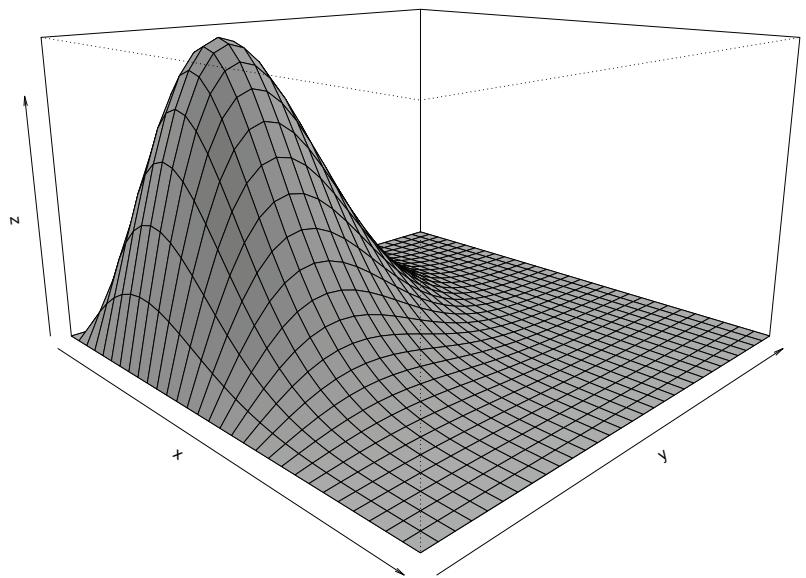  
Figure 2.1.1: A sketch of the surface of the joint pdf discussed in Example 2.1.3. On the figure, the origin is located at the intersection of the $x$ and $z$ axes and the grid squares are 0.1 by 0.1, so points are easily located. As discussed in the text, the peak of the pdf occurs at the point $(\sqrt{2}/2, \sqrt{2}/2)$ .

Likewise we may extend the pmf $p_{X_1, X_2}(x_1, x_2)$ over a convenient set by using zero elsewhere. Hence, we replace

$$
\sum_ {\mathcal {D}} \sum_ {p _ {X _ {1}, X _ {2}} (x _ {1}, x _ {2})} \quad \mathrm {b y} \quad \sum_ {x _ {2}} \sum_ {x _ {1}} p (x _ {1}, x _ {2}).
$$

# 2.1.1 Marginal Distributions

Let $(X_{1},X_{2})$ be a random vector. Then both $X_{1}$ and $X_{2}$ are random variables. We can obtain their distributions in terms of the joint distribution of $(X_{1},X_{2})$ as follows. Recall that the event which defined the cdf of $X_{1}$ at $x_{1}$ is $\{X_1\leq x_1\}$ . However,

$$
\left\{X _ {1} \leq x _ {1} \right\} = \left\{X _ {1} \leq x _ {1} \right\} \cap \left\{- \infty <   X _ {2} <   \infty \right\} = \left\{X _ {1} \leq x _ {1}, - \infty <   X _ {2} <   \infty \right\}.
$$

Taking probabilities, we have

$$
F _ {X _ {1}} (x _ {1}) = P [ X _ {1} \leq x _ {1}, - \infty <   X _ {2} <   \infty ], \tag {2.1.7}
$$

Table 2.1.1: Joint and Marginal Distributions for the discrete random vector $(X_{1},X_{2})$ of Example 2.1.1.   

<table><tr><td colspan="6">Support of X2</td></tr><tr><td></td><td></td><td>0</td><td>1</td><td>2</td><td>3</td></tr><tr><td rowspan="3">Support of X1</td><td>0</td><td>1/8</td><td>1/8</td><td>0</td><td>0</td></tr><tr><td>1</td><td>0</td><td>2/8</td><td>2/8</td><td>0</td></tr><tr><td>2</td><td>0</td><td>0</td><td>1/8</td><td>1/8</td></tr><tr><td></td><td>pX2(x2)</td><td>1/8</td><td>3/8</td><td>3/8</td><td>1/8</td></tr></table>

for all $x_1 \in R$ . By Theorem 1.3.6 we can write this equation as $F_{X_1}(x_1) = \lim_{x_2 \uparrow \infty} F(x_1, x_2)$ . Thus we have a relationship between the cdfs, which we can extend to either the pmf or pdf depending on whether $(X_1, X_2)$ is discrete or continuous.

First consider the discrete case. Let $\mathcal{D}_{X_1}$ be the support of $X_{1}$ . For $x_{1} \in \mathcal{D}_{X_{1}}$ , Equation (2.1.7) is equivalent to

$$
F _ {X _ {1}} (x _ {1}) = \sum_ {w _ {1} \leq x _ {1}, - \infty <   x _ {2} <   \infty} p _ {X _ {1}, X _ {2}} (w _ {1}, x _ {2}) = \sum_ {w _ {1} \leq x _ {1}} \left\{\sum_ {x _ {2} <   \infty} p _ {X _ {1}, X _ {2}} (w _ {1}, x _ {2}) \right\}.
$$

By the uniqueness of cdfs, the quantity in braces must be the pmf of $X_{1}$ evaluated at $w_{1}$ ; that is,

$$
p _ {X _ {1}} \left(x _ {1}\right) = \sum_ {x _ {2} <   \infty} p _ {X _ {1}, X _ {2}} \left(x _ {1}, x _ {2}\right), \tag {2.1.8}
$$

for all $x_{1} \in \mathcal{D}_{X_{1}}$ . Hence, to find the probability that $X_{1}$ is $x_{1}$ , keep $x_{1}$ fixed and sum $p_{X_1,X_2}$ over all of $x_{2}$ . In terms of a tabled joint pmf with rows comprised of $X_{1}$ support values and columns comprised of $X_{2}$ support values, this says that the distribution of $X_{1}$ can be obtained by the marginal sums of the rows. Likewise, the pmf of $X_{2}$ can be obtained by marginal sums of the columns.

Consider the joint discrete distribution of the random vector $(X_{1},X_{2})$ as presented in Example 2.1.1. In Table 2.1.1, we have added these marginal sums. The final row of this table is the pmf of $X_{2}$ , while the final column is the pmf of $X_{1}$ . In general, because these distributions are recorded in the margins of the table, we often refer to them as marginal pmfs.

Example 2.1.4. Consider a random experiment that consists of drawing at random one chip from a bowl containing 10 chips of the same shape and size. Each chip has an ordered pair of numbers on it: one with (1,1), one with (2,1), two with (3,1), one with (1,2), two with (2,2), and three with (3,2). Let the random variables $X_{1}$ and $X_{2}$ be defined as the respective first and second values of the ordered pair. Thus the joint pmf $p(x_{1},x_{2})$ of $X_{1}$ and $X_{2}$ can be given by the following table, with $p(x_{1},x_{2})$ equal to zero elsewhere.

<table><tr><td></td><td colspan="2">x2</td><td></td></tr><tr><td>x1</td><td>1</td><td>2</td><td>p1(x1)</td></tr><tr><td>1</td><td>1/10</td><td>1/10</td><td>2/10</td></tr><tr><td>2</td><td>1/10</td><td>2/10</td><td>3/10</td></tr><tr><td>3</td><td>2/10</td><td>3/10</td><td>5/10</td></tr><tr><td>p2(x2)</td><td>4/10</td><td>6/10</td><td></td></tr></table>

The joint probabilities have been summed in each row and each column and these sums recorded in the margins to give the marginal probability mass functions of $X_{1}$ and $X_{2}$ , respectively. Note that it is not necessary to have a formula for $p(x_{1},x_{2})$ to do this.

We next consider the continuous case. Let $\mathcal{D}_{X_1}$ be the support of $X_{1}$ . For $x_{1} \in \mathcal{D}_{X_{1}}$ , Equation (2.1.7) is equivalent to

$$
F _ {X _ {1}} (x _ {1}) = \int_ {- \infty} ^ {x _ {1}} \int_ {- \infty} ^ {\infty} f _ {X _ {1}, X _ {2}} (w _ {1}, x _ {2}) d x _ {2} d w _ {1} = \int_ {- \infty} ^ {x _ {1}} \left\{\int_ {- \infty} ^ {\infty} f _ {X _ {1}, X _ {2}} (w _ {1}, x _ {2}) d x _ {2} \right\} d w _ {1}.
$$

By the uniqueness of cdfs, the quantity in braces must be the pdf of $X_{1}$ , evaluated at $w_{1}$ ; that is,

$$
f _ {X _ {1}} \left(x _ {1}\right) = \int_ {- \infty} ^ {\infty} f _ {X _ {1}, X _ {2}} \left(x _ {1}, x _ {2}\right) d x _ {2} \tag {2.1.9}
$$

for all $x_{1} \in \mathcal{D}_{X_{1}}$ . Hence, in the continuous case the marginal pdf of $X_{1}$ is found by integrating out $x_{2}$ . Similarly, the marginal pdf of $X_{2}$ is found by integrating out $x_{1}$ .

Example 2.1.5 (Example 2.1.2, continued). Consider the vector of continuous random variables $(X,Y)$ discussed in Example 2.1.2. The space of the random vector is the unit circle with center at $(0,0)$ as shown in Figure 2.1.2. To find the marginal distribution of $X$ , fix $x$ between $-1$ and $1$ and then integrate out $y$ from $-\sqrt{1 - x^2}$ to $\sqrt{1 - x^2}$ as the arrow shows on Figure 2.1.2. Hence, the marginal pdf of $X$ is

$$
f _ {X} (x) = \int_ {- \sqrt {1 - x ^ {2}}} ^ {\sqrt {1 - x ^ {2}}} \frac {1}{\pi} d y = \frac {2}{\pi} \sqrt {1 - x ^ {2}}, - 1 <   x <   1.
$$

Although $(X,Y)$ has a joint uniform distribution, the distribution of $X$ is unimodal with peak at 0. This is not surprising. Since the joint distribution is uniform, from Figure 2.1.2 $X$ is more likely to be near 0 than at either extreme $-1$ or 1. Because the joint pdf is symmetric in $x$ and $y$ , the marginal pdf of $Y$ is the same as that of $X$ .

Example 2.1.6. Let $X_{1}$ and $X_{2}$ have the joint pdf

$$
f (x _ {1}, x _ {2}) = \left\{ \begin{array}{l l} x _ {1} + x _ {2} & 0 <   x _ {1} <   1, 0 <   x _ {2} <   1 \\ 0 & \text {e l s e w h e r e .} \end{array} \right.
$$

# Region of Integration for Example A.3.1.

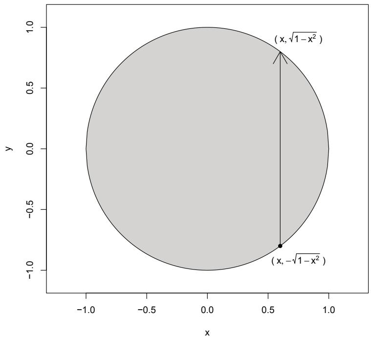  
Figure 2.1.2: Region of integration for Example 2.1.5. It depicts the integration with respect to $y$ at a fixed but arbitrary $x$ .

Notice the space of the random vector is the interior of the square with vertices $(0,0),(1,0),(1,1)$ and $(0,1)$ . The marginal pdf of $X_{1}$ is

$$
f _ {1} (x _ {1}) = \int_ {0} ^ {1} (x _ {1} + x _ {2}) d x _ {2} = x _ {1} + \frac {1}{2}, 0 <   x _ {1} <   1,
$$

zero elsewhere, and the marginal pdf of $X_{2}$ is

$$
f _ {2} (x _ {2}) = \int_ {0} ^ {1} (x _ {1} + x _ {2}) d x _ {1} = \frac {1}{2} + x _ {2}, 0 <   x _ {2} <   1,
$$

zero elsewhere. A probability like $P(X_1 \leq \frac{1}{2})$ can be computed from either $f_1(x_1)$ or $f(x_1, x_2)$ because

$$
\int_ {0} ^ {1 / 2} \int_ {0} ^ {1} f (x _ {1}, x _ {2}) d x _ {2} d x _ {1} = \int_ {0} ^ {1 / 2} f _ {1} (x _ {1}) d x _ {1} = \frac {3}{8}.
$$

Suppose, though, we want to find the probability $P(X_{1} + X_{2} \leq 1)$ . Notice that the region of integration is the interior of the triangle with vertices $(0,0)$ , $(1,0)$ and

(0,1). The reader should sketch this region on the space of $(X_{1},X_{2})$ . Fixing $x_{1}$ and integrating with respect to $x_{2}$ , we have

$$
\begin{array}{l} P \left(X _ {1} + X _ {2} \leq 1\right) = \int_ {0} ^ {1} \left[ \int_ {0} ^ {1 - x _ {1}} \left(x _ {1} + x _ {2}\right) d x _ {2} \right] d x _ {1} \\ = \int_ {0} ^ {1} \left[ x _ {1} (1 - x _ {1}) + \frac {(1 - x _ {1}) ^ {2}}{2} \right] d x _ {1} \\ = \int_ {0} ^ {1} \left(\frac {1}{2} - \frac {1}{2} x _ {1} ^ {2}\right) d x _ {1} = \frac {1}{3}. \\ \end{array}
$$

This latter probability is the volume under the surface $f(x_{1},x_{2}) = x_{1} + x_{2}$ above the set $\{(x_1,x_2):0 < x_1, x_1 + x_2 \leq 1\}$ .

Example 2.1.7 (Example 2.1.3, Continued). Recall that the random variables $X$ and $Y$ of Example 2.1.3 were the lifetimes of two batteries installed in an electrical component. The joint pdf of $(X,Y)$ is sketched in Figure 2.1.1. Its space is the positive quadrant of $R^2$ so there are no constraints involving both $x$ and $y$ . Using the change-in-variable $w = y^2$ , the marginal pdf of $X$ is

$$
f _ {X} (x) = \int_ {0} ^ {\infty} 4 x y e ^ {- (x ^ {2} + y ^ {2})} d y = 2 x e ^ {- x ^ {2}} \int_ {0} ^ {\infty} e ^ {- w} d w = 2 x e ^ {- x ^ {2}},
$$

for $x > 0$ . By the symmetry of $x$ and $y$ in the model, the pdf of $Y$ is the same as that of $X$ . To determine the median lifetime, $\theta$ , of these batteries, we need to solve

$$
\frac {1}{2} = \int_ {0} ^ {\theta} 2 x e ^ {- x ^ {2}} d x = 1 - e ^ {- \theta^ {2}},
$$

where again we have made use of the change-in-variables $z = x^2$ . Solving this equation, we obtain $\theta = \sqrt{\log 2} \approx 0.8326$ . So $50\%$ of the batteries have lifetimes exceeding 0.83 units.

# 2.1.2 Expectation

The concept of expectation extends in a straightforward manner. Let $(X_{1},X_{2})$ be a random vector and let $Y = g(X_{1},X_{2})$ for some real-valued function; i.e., $g:R^2\to R$ . Then $Y$ is a random variable and we could determine its expectation by obtaining the distribution of $Y$ . But Theorem 1.8.1 is true for random vectors also. Note the proof we gave for this theorem involved the discrete case, and Exercise 2.1.12 shows its extension to the random vector case.

Suppose $(X_{1},X_{2})$ is of the continuous type. Then $E(Y)$ exists if

$$
\int_ {- \infty} ^ {\infty} \int_ {- \infty} ^ {\infty} | g (x _ {1}, x _ {2}) | f _ {X _ {1}, X _ {2}} (x _ {1}, x _ {2}) d x _ {1} d x _ {2} <   \infty .
$$

Then

$$
E (Y) = \int_ {- \infty} ^ {\infty} \int_ {- \infty} ^ {\infty} g \left(x _ {1}, x _ {2}\right) f _ {X _ {1}, X _ {2}} \left(x _ {1}, x _ {2}\right) d x _ {1} d x _ {2}. \tag {2.1.10}
$$

Likewise if $(X_{1},X_{2})$ is discrete, then $E(Y)$ exists if

$$
\sum_ {x _ {1}} \sum_ {x _ {2}} | g (x _ {1}, x _ {2}) | p _ {X _ {1}, X _ {2}} (x _ {1}, x _ {2}) <   \infty .
$$

Then

$$
E (Y) = \sum_ {x _ {1}} \sum_ {x _ {2}} g \left(x _ {1}, x _ {2}\right) p _ {X _ {1}, X _ {2}} \left(x _ {1}, x _ {2}\right). \tag {2.1.11}
$$

We can now show that $E$ is a linear operator.

Theorem 2.1.1. Let $(X_{1},X_{2})$ be a random vector. Let $Y_{1} = g_{1}(X_{1},X_{2})$ and $Y_{2} = g_{2}(X_{1},X_{2})$ be random variables whose expectations exist. Then for all real numbers $k_{1}$ and $k_{2}$ ,

$$
E \left(k _ {1} Y _ {1} + k _ {2} Y _ {2}\right) = k _ {1} E \left(Y _ {1}\right) + k _ {2} E \left(Y _ {2}\right). \tag {2.1.12}
$$

Proof: We prove it for the continuous case. The existence of the expected value of $k_{1}Y_{1} + k_{2}Y_{2}$ follows directly from the triangle inequality and linearity of integrals; i.e.,

$$
\begin{array}{l} \int_ {- \infty} ^ {\infty} \int_ {- \infty} ^ {\infty} | k _ {1} g _ {1} (x _ {1}, x _ {2}) + k _ {2} g _ {1} (x _ {1}, x _ {2}) | f _ {X _ {1}, X _ {2}} (x _ {1}, x _ {2}) d x _ {1} d x _ {2} \\ \leq | k _ {1} | \int_ {- \infty} ^ {\infty} \int_ {- \infty} ^ {\infty} | g _ {1} (x _ {1}, x _ {2}) | f _ {X _ {1}, X _ {2}} (x _ {1}, x _ {2}) d x _ {1} d x _ {2} \\ + \left| k _ {2} \right| \int_ {- \infty} ^ {\infty} \int_ {- \infty} ^ {\infty} \left| g _ {2} \left(x _ {1}, x _ {2}\right) \right| f _ {X _ {1}, X _ {2}} \left(x _ {1}, x _ {2}\right) d x _ {1} d x _ {2} <   \infty . \\ \end{array}
$$

By once again using linearity of the integral, we have

$$
\begin{array}{l} E \left(k _ {1} Y _ {1} + k _ {2} Y _ {2}\right) = \int_ {- \infty} ^ {\infty} \int_ {- \infty} ^ {\infty} \left[ k _ {1} g _ {1} \left(x _ {1}, x _ {2}\right) + k _ {2} g _ {2} \left(x _ {1}, x _ {2}\right) \right] f _ {X _ {1}, X _ {2}} \left(x _ {1}, x _ {2}\right) d x _ {1} d x _ {2} \\ = k _ {1} \int_ {- \infty} ^ {\infty} \int_ {- \infty} ^ {\infty} g _ {1} \left(x _ {1}, x _ {2}\right) f _ {X _ {1}, X _ {2}} \left(x _ {1}, x _ {2}\right) d x _ {1} d x _ {2} \\ + k _ {2} \int_ {- \infty} ^ {\infty} \int_ {- \infty} ^ {\infty} g _ {2} \left(x _ {1}, x _ {2}\right) f _ {X _ {1}, X _ {2}} \left(x _ {1}, x _ {2}\right) d x _ {1} d x _ {2} \\ = k _ {1} E \left(Y _ {1}\right) + k _ {2} E \left(Y _ {2}\right), \\ \end{array}
$$

i.e., the desired result.

We also note that the expected value of any function $g(X_2)$ of $X_2$ can be found in two ways:

$$
E (g (X _ {2})) = \int_ {- \infty} ^ {\infty} \int_ {- \infty} ^ {\infty} g (x _ {2}) f (x _ {1}, x _ {2}) d x _ {1} d x _ {2} = \int_ {- \infty} ^ {\infty} g (x _ {2}) f _ {X _ {2}} (x _ {2}) d x _ {2},
$$

the latter single integral being obtained from the double integral by integrating on $x_{1}$ first. The following example illustrates these ideas.

Example 2.1.8. Let $X_{1}$ and $X_{2}$ have the pdf

$$
f (x _ {1}, x _ {2}) = \left\{ \begin{array}{l l} 8 x _ {1} x _ {2} & 0 <   x _ {1} <   x _ {2} <   1 \\ 0 & \text {e l s e w h e r e .} \end{array} \right.
$$

Figure 2.1.3 shows the space for $(X_{1},X_{2})$ . Then

$$
E \left(X _ {1} X _ {2} ^ {2}\right) = \int_ {- \infty} ^ {\infty} \int_ {- \infty} ^ {\infty} x _ {1} x _ {2} ^ {2} f \left(x _ {1}, x _ {2}\right) d x _ {1} d x _ {2}.
$$

To compute the integration, as shown by the arrow on Figure 2.1.3, we fix $x_{2}$ and then integrate $x_{1}$ from 0 to $x_{2}$ . We then integrate out $x_{2}$ from 0 to 1. Hence,

$$
\int_ {- \infty} ^ {\infty} \int_ {- \infty} ^ {\infty} x _ {1} x _ {2} ^ {2} f (x _ {1}, x _ {2}) = \int_ {0} ^ {1} \left[ \int_ {0} ^ {x _ {2}} 8 x _ {1} ^ {2} x _ {2} ^ {3} d x _ {1} \right] d x _ {2} = \int_ {0} ^ {1} \frac {8}{3} x _ {2} ^ {6} d x _ {2} = \frac {8}{2 1}.
$$

In addition,

$$
E (X _ {2}) = \int_ {0} ^ {1} \left[ \int_ {0} ^ {x _ {2}} x _ {2} \left(8 x _ {1} x _ {2}\right) d x _ {1} \right] d x _ {2} = \frac {4}{5}.
$$

Since $X_{2}$ has the pdf $f_{2}(x_{2}) = 4x_{2}^{3}$ , $0 < x_{2} < 1$ , zero elsewhere, the latter expectation can also be found by

$$
E (X _ {2}) = \int_ {0} ^ {1} x _ {2} \left(4 x _ {2} ^ {3}\right) d x _ {2} = \frac {4}{5}.
$$

Using Theorem 2.1.1,

$$
\begin{array}{l} E \left(7 X _ {1} X _ {2} ^ {2} + 5 X _ {2}\right) = 7 E \left(X _ {1} X _ {2} ^ {2}\right) + 5 E \left(X _ {2}\right) \\ = (7) \left(\frac {8}{2 1}\right) + (5) \left(\frac {4}{5}\right) = \frac {2 0}{3}. \\ \end{array}
$$

Example 2.1.9. Continuing with Example 2.1.8, suppose the random variable $Y$ is defined by $Y = X_{1} / X_{2}$ . We determine $E(Y)$ in two ways. The first way is by definition; i.e., find the distribution of $Y$ and then determine its expectation. The cdf of $Y$ , for $0 < y \leq 1$ , is

$$
\begin{array}{l} F _ {Y} (y) = P (Y \leq y) = P \left(X _ {1} \leq y X _ {2}\right) = \int_ {0} ^ {1} \left[ \int_ {0} ^ {y x _ {2}} 8 x _ {1} x _ {2} d x _ {1} \right] d x _ {2} \\ = \int_ {0} ^ {1} 4 y ^ {2} x _ {2} ^ {3} d x _ {2} = y ^ {2}. \\ \end{array}
$$

Hence, the pdf of $Y$ is

$$
f _ {Y} (y) = F _ {Y} ^ {\prime} (y) = \left\{ \begin{array}{l l} 2 y & 0 <   y <   1 \\ 0 & \text {e l s e w h e r e ,} \end{array} \right.
$$

which leads to

$$
E (Y) = \int_ {0} ^ {1} y (2 y) d y = \frac {2}{3}.
$$

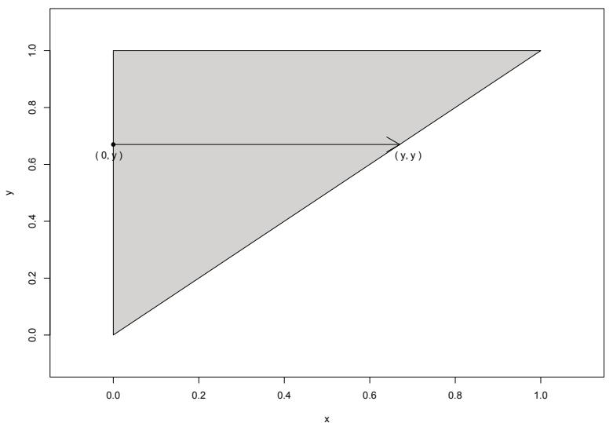  
Figure 2.1.3: Region of integration for Example 2.1.8. The arrow depicts the integration with respect to $x_{1}$ at a fixed but arbitrary $x_{2}$ .

For the second way, we make use of expression (2.1.10) and find $E(Y)$ directly by

$$
\begin{array}{l} { E ( Y ) } { = } { E \left( \frac { X _ { 1 } } { X _ { 2 } } \right) = \int _ { 0 } ^ { 1 } \left\{ \int _ { 0 } ^ { x _ { 2 } } \left( \frac { x _ { 1 } } { x _ { 2 } } \right) 8 x _ { 1 } x _ { 2 } d x _ { 1 } \right\} d x _ { 2 } } \\ = \int_ {0} ^ {1} \frac {8}{3} x _ {2} ^ {3} d x _ {2} = \frac {2}{3}. \\ \end{array}
$$

We next define the moment generating function of a random vector.

Definition 2.1.2 (Moment Generating Function of a Random Vector). Let $\mathbf{X} = (X_1, X_2)'$ be a random vector. If $E(e^{t_1X_1 + t_2X_2})$ exists for $|t_1| < h_1$ and $|t_2| < h_2$ , where $h_1$ and $h_2$ are positive, it is denoted by $M_{X_1,X_2}(t_1,t_2)$ and is called the moment generating function (mgf) of $\mathbf{X}$ .

As in the one-variable case, if it exists, the mgf of a random vector uniquely determines the distribution of the random vector.

Let $\mathbf{t} = (t_1, t_2)'$ . Then we can write the mgf of $\mathbf{X}$ as

$$
M _ {X _ {1}, X _ {2}} (\mathbf {t}) = E \left[ e ^ {\mathbf {t} ^ {\prime} \mathbf {X}} \right], \tag {2.1.13}
$$

so it is quite similar to the mgf of a random variable. Also, the mgfs of $X_{1}$ and $X_{2}$ are immediately seen to be $M_{X_1,X_2}(t_1,0)$ and $M_{X_1,X_2}(0,t_2)$ , respectively. If there is no confusion, we often drop the subscripts on $M$ .

Example 2.1.10. Let the continuous-type random variables $X$ and $Y$ have the joint pdf

$$
f (x, y) = \left\{ \begin{array}{l l} e ^ {- y} & 0 <   x <   y <   \infty \\ 0 & \text {e l s e w h e r e .} \end{array} \right.
$$

The reader should sketch the space of $(X,Y)$ . The mgf of this joint distribution is

$$
\begin{array}{l} M \left(t _ {1}, t _ {2}\right) = \int_ {0} ^ {\infty} \left[ \int_ {x} ^ {\infty} \exp \left(t _ {1} x + t _ {2} y - y\right) d y \right] d x \\ = \frac {1}{(1 - t _ {1} - t _ {2}) (1 - t _ {2})}, \\ \end{array}
$$

provided that $t_1 + t_2 < 1$ and $t_2 < 1$ . Furthermore, the moment-generating functions of the marginal distributions of $X$ and $Y$ are, respectively,

$$
\begin{array}{l} M (t _ {1}, 0) = \frac {1}{1 - t _ {1}}, t _ {1} <   1 \\ M (0, t _ {2}) = \frac {1}{(1 - t _ {2}) ^ {2}}, t _ {2} <   1. \\ \end{array}
$$

These moment-generating functions are, of course, respectively, those of the marginal probability density functions,

$$
f _ {1} (x) = \int_ {x} ^ {\infty} e ^ {- y} d y = e ^ {- x}, 0 <   x <   \infty ,
$$

zero elsewhere, and

$$
f _ {2} (y) = e ^ {- y} \int_ {0} ^ {y} d x = y e ^ {- y}, 0 <   y <   \infty ,
$$

zero elsewhere.

We also need to define the expected value of the random vector itself, but this is not a new concept because it is defined in terms of componentwise expectation:

Definition 2.1.3 (Expected Value of a Random Vector). Let $\mathbf{X} = (X_1, X_2)'$ be a random vector. Then the expected value of $\mathbf{X}$ exists if the expectations of $X_1$ and $X_2$ exist. If it exists, then the expected value is given by

$$
E [ \mathbf {X} ] = \left[ \begin{array}{c} E (X _ {1}) \\ E (X _ {2}) \end{array} \right]. \tag {2.1.14}
$$

# EXERCISES

2.1.1. Let $f(x_{1},x_{2}) = 4x_{1}x_{2}$ , $0 < x_{1} < 1$ , $0 < x_{2} < 1$ , zero elsewhere, be the pdf of $X_{1}$ and $X_{2}$ . Find $P(0 < X_{1} < \frac{1}{2},\frac{1}{4} < X_{2} < 1)$ , $P(X_{1} = X_{2})$ , $P(X_{1} < X_{2})$ , and $P(X_{1}\leq X_{2})$ .

Hint: Recall that $P(X_{1} = X_{2})$ would be the volume under the surface $f(x_{1},x_{2}) = 4x_{1}x_{2}$ and above the line segment $0 < x_{1} = x_{2} < 1$ in the $x_{1}x_{2}$ -plane.

2.1.2. Let $A_{1} = \{(x,y): x \leq 2, y \leq 4\}$ , $A_{2} = \{(x,y): x \leq 2, y \leq 1\}$ , $A_{3} = \{(x,y): x \leq 0, y \leq 4\}$ , and $A_{4} = \{(x,y): x \leq 0, y \leq 1\}$ be subsets of the space $\mathcal{A}$ of two random variables $X$ and $Y$ , which is the entire two-dimensional plane. If $P(A_{1}) = \frac{7}{8}$ , $P(A_{2}) = \frac{4}{8}$ , $P(A_{3}) = \frac{3}{8}$ , and $P(A_{4}) = \frac{2}{8}$ , find $P(A_{5})$ , where $A_{5} = \{(x,y): 0 < x \leq 2, 1 < y \leq 4\}$ .

2.1.3. Let $F(x, y)$ be the distribution function of $X$ and $Y$ . For all real constants $a < b$ , $c < d$ , show that $P(a < X \leq b, c < Y \leq d) = F(b, d) - F(b, c) - F(a, d) + F(a, c)$ .

2.1.4. Show that the function $F(x,y)$ that is equal to 1 provided that $x + 2y \geq 1$ , and that is equal to zero provided that $x + 2y < 1$ , cannot be a distribution function of two random variables.

Hint: Find four numbers $a < b$ , $c < d$ , so that

$$
F (b, d) - F (a, d) - F (b, c) + F (a, c)
$$

is less than zero.

2.1.5. Given that the nonnegative function $g(x)$ has the property that

$$
\int_ {0} ^ {\infty} g (x) d x = 1,
$$

show that

$$
f (x _ {1}, x _ {2}) = \frac {2 g (\sqrt {x _ {1} ^ {2} + x _ {2} ^ {2}})}{\pi \sqrt {x _ {1} ^ {2} + x _ {2} ^ {2}}}, 0 <   x _ {1} <   \infty , 0 <   x _ {2} <   \infty ,
$$

zero elsewhere, satisfies the conditions for a pdf of two continuous-type random variables $X_{1}$ and $X_{2}$ .

Hint: Use polar coordinates.

2.1.6. Consider Example 2.1.3.

(a) Show that $P(a < X < b, c < Y < d) = (\exp \{-a^2\} - \exp \{-b^2\})(\exp \{-c^2\} - \exp \{-d^2\})$ .   
(b) Using Part (a) and the notation in Example 2.1.3, show that $P[(X,Y) \in A] = 0.1879$ while $P[(X,Y) \in B] = 0.0026$ .   
(c) Show that the following R program computes $P(a < X < b, c < Y < d)$ . Then use it to compute the probabilities in Part (b).

$$
p l i f e t i m e <   - f u n c t i o n (a, b, c, d)
$$

$$
\left. \left\{\left(\exp (- a ^ {\wedge} 2) - \exp (- b ^ {\wedge} 2)\right) * \left(\exp (- c ^ {\wedge} 2) - \exp (- d ^ {\wedge} 2)\right) \right\} \right.
$$

2.1.7. Let $f(x,y) = e^{-x - y}$ , $0 < x < \infty$ , $0 < y < \infty$ , zero elsewhere, be the pdf of $X$ and $Y$ . Then if $Z = X + Y$ , compute $P(Z \leq 0)$ , $P(Z \leq 6)$ , and, more generally, $P(Z \leq z)$ , for $0 < z < \infty$ . What is the pdf of $Z$ ?

2.1.8. Let $X$ and $Y$ have the pdf $f(x,y) = 1$ , $0 < x < 1$ , $0 < y < 1$ , zero elsewhere. Find the cdf and pdf of the product $Z = XY$ .

2.1.9. Let 13 cards be taken, at random and without replacement, from an ordinary deck of playing cards. If $X$ is the number of spades in these 13 cards, find the pmf of $X$ . If, in addition, $Y$ is the number of hearts in these 13 cards, find the probability $P(X = 2, Y = 5)$ . What is the joint pmf of $X$ and $Y$ ?

2.1.10. Let the random variables $X_{1}$ and $X_{2}$ have the joint pmf described as follows:

<table><tr><td>(x1,x2)</td><td>(0,0)</td><td>(0,1)</td><td>(0,2)</td><td>(1,0)</td><td>(1,1)</td><td>(1,2)</td></tr><tr><td>p(x1,x2)</td><td>2/12</td><td>3/12</td><td>2/12</td><td>2/12</td><td>2/12</td><td>1/12</td></tr></table>

and $p(x_{1},x_{2})$ is equal to zero elsewhere.

(a) Write these probabilities in a rectangular array as in Example 2.1.4, recording each marginal pdf in the "margins."   
(b) What is $P(X_{1} + X_{2} = 1)$ ?

2.1.11. Let $X_{1}$ and $X_{2}$ have the joint pdf $f(x_{1},x_{2}) = 15x_{1}^{2}x_{2}$ , $0 < x_{1} < x_{2} < 1$ , zero elsewhere. Find the marginal pdfs and compute $P(X_{1} + X_{2}\leq 1)$ .

Hint: Graph the space $X_{1}$ and $X_{2}$ and carefully choose the limits of integration in determining each marginal pdf.

2.1.12. Let $X_{1}, X_{2}$ be two random variables with the joint pmf $p(x_{1}, x_{2})$ , $(x_{1}, x_{2}) \in S$ , where $S$ is the support of $X_{1}, X_{2}$ . Let $Y = g(X_{1}, X_{2})$ be a function such that

$$
\sum_ {(x _ {1}, x _ {2}) \in \mathcal {S}} | g (x _ {1}, x _ {2}) | p (x _ {1}, x _ {2}) <   \infty .
$$

By following the proof of Theorem 1.8.1, show that

$$
E (Y) = \sum_ {(x _ {1}, x _ {2}) \in \mathcal {S}} g (x _ {1}, x _ {2}) p (x _ {1}, x _ {2}).
$$

2.1.13. Let $X_{1}, X_{2}$ be two random variables with the joint pmf $p(x_{1}, x_{2}) = (x_{1} + x_{2}) / 12$ , for $x_{1} = 1, 2$ , $x_{2} = 1, 2$ , zero elsewhere. Compute $E(X_{1}), E(X_{1}^{2}), E(X_{2}), E(X_{2}^{2})$ , and $E(X_{1}X_{2})$ . Is $E(X_{1}X_{2}) = E(X_{1})E(X_{2})$ ? Find $E(2X_{1} - 6X_{2}^{2} + 7X_{1}X_{2})$ .   
2.1.14. Let $X_1, X_2$ be two random variables with joint pdf $f(x_1, x_2) = 4x_1x_2$ , $0 < x_1 < 1$ , $0 < x_2 < 1$ , zero elsewhere. Compute $E(X_1), E(X_1^2), E(X_2), E(X_2^2)$ , and $E(X_1X_2)$ . Is $E(X_1X_2) = E(X_1)E(X_2)$ ? Find $E(3X_2 - 2X_1^2 + 6X_1X_2)$ .   
2.1.15. Let $X_{1}, X_{2}$ be two random variables with joint pmf $p(x_{1}, x_{2}) = (1/2)^{x_{1} + x_{2}}$ , for $1 \leq x_{i} < \infty, i = 1, 2$ , where $x_{1}$ and $x_{2}$ are integers, zero elsewhere. Determine the joint mgf of $X_{1}, X_{2}$ . Show that $M(t_{1}, t_{2}) = M(t_{1}, 0)M(0, t_{2})$ .   
2.1.16. Let $X_{1}, X_{2}$ be two random variables with joint pdf $f(x_{1}, x_{2}) = x_{1} \exp\{-x_{2}\}$ , for $0 < x_{1} < x_{2} < \infty$ , zero elsewhere. Determine the joint mgf of $X_{1}, X_{2}$ . Does $M(t_{1}, t_{2}) = M(t_{1}, 0)M(0, t_{2})$ ?   
2.1.17. Let $X$ and $Y$ have the joint pdf $f(x,y) = 6(1 - x - y)$ , $x + y < 1$ , $0 < x$ , $0 < y$ , zero elsewhere. Compute $P(2X + 3Y < 1)$ and $E(XY + 2X^2)$ .

# 2.2 Transformations: Bivariate Random Variables

Let $(X_{1},X_{2})$ be a random vector. Suppose we know the joint distribution of $(X_{1},X_{2})$ and we seek the distribution of a transformation of $(X_{1},X_{2})$ , say, $Y = g(X_{1},X_{2})$ . We may be able to obtain the cdf of $Y$ . Another way is to use a transformation as we did for univariate random variables in Sections 1.6 and 1.7. In this section, we extend this theory to random vectors. It is best to discuss the discrete and continuous cases separately. We begin with the discrete case.

There are no essential difficulties involved in a problem like the following. Let $p_{X_1,X_2}(x_1,x_2)$ be the joint pmf of two discrete-type random variables $X_{1}$ and $X_{2}$ with $\mathcal{S}$ the (two-dimensional) set of points at which $p_{X_1,X_2}(x_1,x_2) > 0$ ; i.e., $\mathcal{S}$ is the support of $(X_{1},X_{2})$ . Let $y_{1} = u_{1}(x_{1},x_{2})$ and $y_{2} = u_{2}(x_{1},x_{2})$ define a one-to-one transformation that maps $\mathcal{S}$ onto $\mathcal{T}$ . The joint pmf of the two new random variables $Y_{1} = u_{1}(X_{1},X_{2})$ and $Y_{2} = u_{2}(X_{1},X_{2})$ is given by

$$
p _ {Y _ {1}, Y _ {2}} (y _ {1}, y _ {2}) = \left\{ \begin{array}{l l} p _ {X _ {1}, X _ {2}} [ w _ {1} (y _ {1}, y _ {2}), w _ {2} (y _ {1}, y _ {2}) ] & (y _ {1}, y _ {2}) \in \mathcal {T} \\ 0 & \text {e l s e w h e r e ,} \end{array} \right.
$$

where $x_{1} = w_{1}(y_{1},y_{2})$ , $x_{2} = w_{2}(y_{1},y_{2})$ is the single-valued inverse of $y_{1} = u_{1}(x_{1},x_{2})$ , $y_{2} = u_{2}(x_{1},x_{2})$ . From this joint pmf $p_{Y_1,Y_2}(y_1,y_2)$ we may obtain the marginal pmf of $Y_{1}$ by summing on $y_{2}$ or the marginal pmf of $Y_{2}$ by summing on $y_{1}$ .

In using this change of variable technique, it should be emphasized that we need two "new" variables to replace the two "old" variables. An example helps explain this technique.

Example 2.2.1. In a large metropolitan area during flu season, suppose that two strains of flu, A and B, are occurring. For a given week, let $X_{1}$ and $X_{2}$ be the respective number of reported cases of strains A and B with the joint pmf

$$
p _ {X _ {1}, X _ {2}} (x _ {1}, x _ {2}) = \frac {\mu_ {1} ^ {x _ {1}} \mu_ {2} ^ {x _ {2}} e ^ {- \mu_ {1}} e ^ {- \mu_ {2}}}{x _ {1} ! x _ {2} !}, \quad x _ {1} = 0, 1, 2, 3, \ldots , \quad x _ {2} = 0, 1, 2, 3, \ldots ,
$$

and is zero elsewhere, where the parameters $\mu_{1}$ and $\mu_{2}$ are positive real numbers. Thus the space $\mathcal{S}$ is the set of points $(x_{1},x_{2})$ , where each of $x_{1}$ and $x_{2}$ is a nonnegative integer. Further, repeatedly using the Maclaurin series for the exponential function, $^3$ we have

$$
\begin{array}{l} E (X _ {1}) = e ^ {- \mu_ {1}} \sum_ {x _ {1} = 0} ^ {\infty} x _ {1} \frac {\mu_ {1} ^ {x _ {1}}}{x _ {1} !} e ^ {- \mu_ {2}} \sum_ {x _ {2} = 0} ^ {\infty} \frac {\mu_ {2} ^ {x _ {2}}}{x _ {2} !} \\ = e ^ {- \mu_ {1}} \sum_ {x _ {1} = 1} ^ {\infty} x _ {1} \mu_ {1} \frac {\mu_ {1} ^ {x _ {1} - 1}}{(x _ {1} - 1) !} \cdot 1 = \mu_ {1}. \\ \end{array}
$$

Thus $\mu_{1}$ is the mean number of cases of Strain A flu reported during a week. Likewise, $\mu_{2}$ is the mean number of cases of Strain B flu reported during a week.

A random variable of interest is $Y_{1} = X_{1} + X_{2}$ ; i.e., the total number of reported cases of A and B flu during a week. By Theorem 2.1.1, we know $E(Y_{1}) = \mu_{1} + \mu_{2}$ ; however, we wish to determine the distribution of $Y_{1}$ . If we use the change of variable technique, we need to define a second random variable $Y_{2}$ . Because $Y_{2}$ is of no interest to us, let us choose it in such a way that we have a simple one-to-one transformation. For this example, we take $Y_{2} = X_{2}$ . Then $y_{1} = x_{1} + x_{2}$ and $y_{2} = x_{2}$ represent a one-to-one transformation that maps $S$ onto

$$
\mathcal {T} = \left\{\left(y _ {1}, y _ {2}\right): y _ {2} = 0, 1, \dots , y _ {1} \quad \text {a n d} \quad y _ {1} = 0, 1, 2, \dots \right\}.
$$

Note that if $(y_{1},y_{2})\in \mathcal{T}$ , then $0\leq y_{2}\leq y_{1}$ . The inverse functions are given by $x_{1} = y_{1} - y_{2}$ and $x_{2} = y_{2}$ . Thus the joint pmf of $Y_{1}$ and $Y_{2}$ is

$$
p _ {Y _ {1}, Y _ {2}} \left(y _ {1}, y _ {2}\right) = \frac {\mu_ {1} ^ {y _ {1} - y _ {2}} \mu_ {2} ^ {y _ {2}} e ^ {- \mu_ {1} - \mu_ {2}}}{\left(y _ {1} - y _ {2}\right) ! y _ {2} !}, \quad \left(y _ {1}, y _ {2}\right) \in \mathcal {T},
$$

and is zero elsewhere. Consequently, the marginal pmf of $Y_{1}$ is given by

$$
\begin{array}{l} p _ {Y _ {1}} (y _ {1}) = \sum_ {y _ {2} = 0} ^ {y _ {1}} p _ {Y _ {1}, Y _ {2}} (y _ {1}, y _ {2}) \\ = \frac {e ^ {- \mu_ {1} - \mu_ {2}}}{y _ {1} !} \sum_ {y _ {2} = 0} ^ {y _ {1}} \frac {y _ {1} !}{(y _ {1} - y _ {2}) ! y _ {2} !} \mu_ {1} ^ {y _ {1} - y _ {2}} \mu_ {2} ^ {y _ {2}} \\ = \frac {(\mu_ {1} + \mu_ {2}) ^ {y _ {1}} e ^ {- \mu_ {1} - \mu_ {2}}}{y _ {1} !}, y _ {1} = 0, 1, 2, \dots , \\ \end{array}
$$

and is zero elsewhere, where the third equality follows from the binomial expansion.

For the continuous case we begin with an example that illustrates the cdf technique.

Example 2.2.2. Consider an experiment in which a person chooses at random a point $(X_1, X_2)$ from the unit square $S = \{(x_1, x_2) : 0 < x_1 < 1, 0 < x_2 < 1\}$ . Suppose that our interest is not in $X_1$ or in $X_2$ but in $Z = X_1 + X_2$ . Once a suitable probability model has been adopted, we shall see how to find the pdf of $Z$ . To be specific, let the nature of the random experiment be such that it is reasonable to assume that the distribution of probability over the unit square is uniform. Then the pdf of $X_1$ and $X_2$ may be written

$$
f _ {X _ {1}, X _ {2}} \left(x _ {1}, x _ {2}\right) = \left\{ \begin{array}{l l} 1 & 0 <   x _ {1} <   1, 0 <   x _ {2} <   1 \\ 0 & \text {e l s e w h e r e ,} \end{array} \right. \tag {2.2.1}
$$

and this describes the probability model. Now let the cdf of $Z$ be denoted by $F_Z(z) = P(X_1 + X_2 \leq z)$ . Then

$$
F _ {Z} (z) = \left\{ \begin{array}{l l} 0 & z <   0 \\ \int_ {0} ^ {z} \int_ {0} ^ {z - x _ {1}} d x _ {2} d x _ {1} = \frac {z ^ {2}}{2} & 0 \leq z <   1 \\ 1 - \int_ {z - 1} ^ {1} \int_ {z - x _ {1}} ^ {1} d x _ {2} d x _ {1} = 1 - \frac {(2 - z) ^ {2}}{2} & 1 \leq z <   2 \\ 1 & 2 \leq z. \end{array} \right.
$$

Since $F_Z'(z)$ exists for all values of $z$ , the pmf of $Z$ may then be written

$$
f _ {Z} (z) = \left\{ \begin{array}{l l} z & 0 <   z <   1 \\ 2 - z & 1 \leq z <   2 \\ 0 & \text {e l s e w h e r e .} \end{array} \right. \tag {2.2.2}
$$

In the last example, we used the cdf technique to find the distribution of the transformed random vector. Recall in Chapter 1, Theorem 1.7.1 gave a transformation technique to directly determine the pdf of the transformed random variable for one-to-one transformations. As discussed in Section 4.1 of the accompanying resource Mathematical Comments, this is based on the change-in-variable technique for univariate integration. Further Section 4.2 of this resource shows that a similar change-in-variable technique exists for multiple integration. We now discuss in general the transformation technique for the continuous case based on this theory.

Let $(X_{1},X_{2})$ have a jointly continuous distribution with pdf $f_{X_1,X_2}(x_1,x_2)$ and support set $\mathcal{S}$ . Consider the transformed random vector $(Y_{1},Y_{2}) = T(X_{1},X_{2})$ where $T$ is a one-to-one continuous transformation. Let $\mathcal{T} = T(\mathcal{S})$ denote the support of $(Y_{1},Y_{2})$ . The transformation is depicted in Figure 2.2.1. Rewrite the transformation in terms of its components as $(Y_{1},Y_{2}) = T(X_{1},X_{2}) = (u_{1}(X_{1},X_{2}),u_{2}(X_{1},X_{2}))$ , where the functions $y_{1} = u_{1}(x_{1},x_{2})$ and $y_{2} = u_{2}(x_{1},x_{2})$ define $T$ . Since the transformation is one-to-one, the inverse transformation $T^{-1}$ exists. We write it as $x_{1} = w_{1}(y_{1},y_{2})$ , $x_{2} = w_{2}(y_{1},y_{2})$ . Finally, we need the Jacobian of the transformation which is the determinant of order 2 given by

$$
J = \left| \begin{array}{c c} \frac {\partial x _ {1}}{\partial y _ {1}} & \frac {\partial x _ {1}}{\partial y _ {2}} \\ \frac {\partial x _ {2}}{\partial y _ {1}} & \frac {\partial x _ {2}}{\partial y _ {2}} \end{array} \right|.
$$

Note that $J$ plays the role of $dx / dy$ in the univariate case. We assume that these first-order partial derivatives are continuous and that the Jacobian $J$ is not identically equal to zero in $\mathcal{T}$ .

Let $B$ be any region<sup>5</sup> in $\mathcal{T}$ and let $A = T^{-1}(B)$ as shown in Figure 2.2.1. Because the transformation $T$ is one-to-one, $P[(X_1, X_2) \in A] = P[T(X_1, X_2) \in T(A)] = P[(Y_1, Y_2) \in B]$ . Then based on the change-in-variable technique, cited above, we have

$$
\begin{array}{l} P \left[ \left(X _ {1}, X _ {2}\right) \in A \right] = \iint_ {A} f _ {X _ {1}, X _ {2}} \left(x _ {1}, x _ {2}\right) d x _ {1} d y _ {2} \\ = \iint_ {T (A)} f _ {X _ {1}, X _ {2}} \left[ T ^ {- 1} \left(y _ {1}, y _ {2}\right) \right] | J | d y _ {1} d y _ {2} \\ = \iint_ {B} f _ {X _ {1}, X _ {2}} \left[ w _ {1} \left(y _ {1}, y _ {2}\right), w _ {2} \left(y _ {1}, y _ {2}\right) \right] | J | d y _ {1} d y _ {2}. \\ \end{array}
$$

Since $B$ is arbitrary, the last integrand must be the joint pdf of $(Y_1, Y_2)$ . That is the pdf of $(Y_1, Y_2)$ is

$$
f _ {Y _ {1}, Y _ {2}} \left(y _ {1}, y _ {2}\right) = \left\{ \begin{array}{l l} f _ {X _ {1}, X _ {2}} \left[ w _ {1} \left(y _ {1}, y _ {2}\right), w _ {2} \left(y _ {1}, y _ {2}\right) \right] | J | & \left(y _ {1}, y _ {2}\right) \in \mathcal {T} \\ 0 & \text {e l s e w h e r e .} \end{array} \right. \tag {2.2.3}
$$

Several examples of this result are given next.

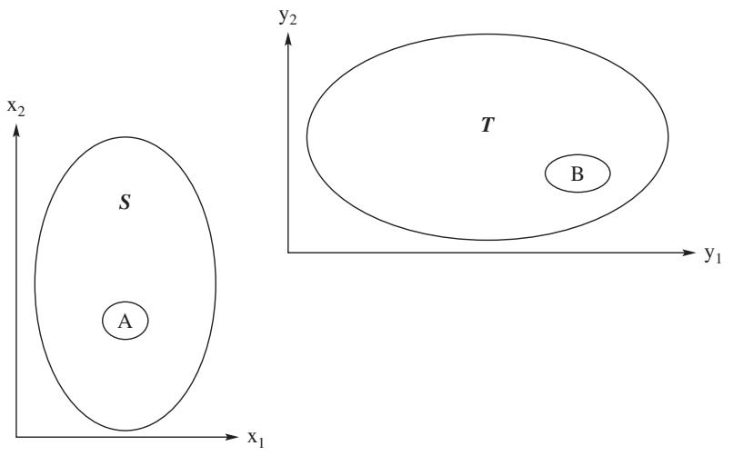  
Figure 2.2.1: A general sketch of the supports of $(X_{1},X_{2})$ , $(S)$ , and $(Y_{1},Y_{2})$ , $(T)$ .

Example 2.2.3. Reconsider Example 2.2.2, where $(X_{1},X_{2})$ have the uniform distribution over the unit square with the pdf given in expression (2.2.1). The support of $(X_{1},X_{2})$ is the set $\mathcal{S} = \{(x_1,x_2):0 < x_1 < 1,0 < x_2 < 1\}$ as depicted in Figure 2.2.2.

Suppose $Y_{1} = X_{1} + X_{2}$ and $Y_{2} = X_{1} - X_{2}$ . The transformation is given by

$$
y _ {1} = u _ {1} \left(x _ {1}, x _ {2}\right) = x _ {1} + x _ {2}
$$

$$
y _ {2} = u _ {2} \left(x _ {1}, x _ {2}\right) = x _ {1} - x _ {2}.
$$

This transformation is one-to-one. We first determine the set $\mathcal{T}$ in the $y_{1}y_{2}$ -plane that is the mapping of $\mathcal{S}$ under this transformation. Now

$$
x _ {1} = w _ {1} \left(y _ {1}, y _ {2}\right) = \frac {1}{2} \left(y _ {1} + y _ {2}\right)
$$

$$
x _ {2} = w _ {2} \left(y _ {1}, y _ {2}\right) = \frac {1}{2} \left(y _ {1} - y _ {2}\right).
$$

To determine the set $S$ in the $y_{1}y_{2}$ -plane onto which $\mathcal{T}$ is mapped under the transformation, note that the boundaries of $S$ are transformed as follows into the boundaries

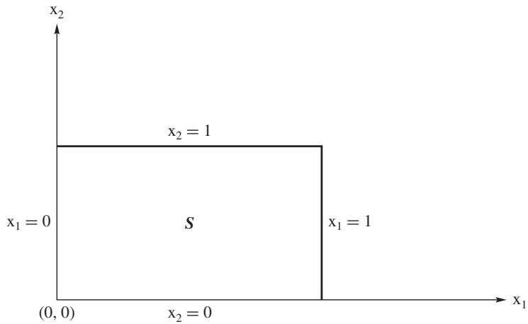  
Figure 2.2.2: The support of $(X_{1},X_{2})$ of Example 2.2.3.

of $\mathcal{T}$

$$
\begin{array}{l} x _ {1} = 0 \quad \text {i n t o} \quad 0 = \frac {1}{2} (y _ {1} + y _ {2}) \\ x _ {1} = 1 \quad \text {i n t o} \quad 1 = \frac {1}{2} \left(y _ {1} + y _ {2}\right) \\ x _ {2} = 0 \quad \text {i n t o} \quad 0 = \frac {1}{2} (y _ {1} - y _ {2}) \\ x _ {2} = 1 \quad \text {i n t o} \quad 1 = \frac {1}{2} (y _ {1} - y _ {2}). \\ \end{array}
$$

Accordingly, $T$ is shown in Figure 2.2.3. Next, the Jacobian is given by

$$
J = \left| \begin{array}{c c} {\frac {\partial x _ {1}}{\partial y _ {1}}} & {\frac {\partial x _ {1}}{\partial y _ {2}}} \\ {\frac {\partial x _ {2}}{\partial y _ {1}}} & {\frac {\partial x _ {2}}{\partial y _ {2}}} \end{array} \right| = \left| \begin{array}{c c} {\frac {1}{2}} & {\frac {1}{2}} \\ {\frac {1}{2}} & {- \frac {1}{2}} \end{array} \right| = - \frac {1}{2}.
$$

Although we suggest transforming the boundaries of $\mathcal{S}$ , others might want to use the inequalities

$$
0 <   x _ {1} <   1 \quad \text {a n d} \quad 0 <   x _ {2} <   1
$$

directly. These four inequalities become

$$
0 <   \frac {1}{2} (y _ {1} + y _ {2}) <   1 \quad \text {a n d} \quad 0 <   \frac {1}{2} (y _ {1} - y _ {2}) <   1.
$$

It is easy to see that these are equivalent to

$$
- y _ {1} <   y _ {2}, \quad y _ {2} <   2 - y _ {1}, \quad y _ {2} <   y _ {1} \quad y _ {1} - 2 <   y _ {2};
$$

and they define the set $\mathcal{T}$

Hence, the joint pdf of $(Y_{1},Y_{2})$ is given by

$$
f_{Y_{1},Y_{2}}(y_{1},y_{2}) = \left\{ \begin{array}{ll}f_{X_{1},X_{2}}[\frac{1}{2} (y_{1} + y_{2}),\frac{1}{2} (y_{1} - y_{2})]|J| = \frac{1}{2} & (y_{1},y_{2})\in \mathcal{T}\\ 0 & \text{elsewhere.} \end{array} \right.
$$

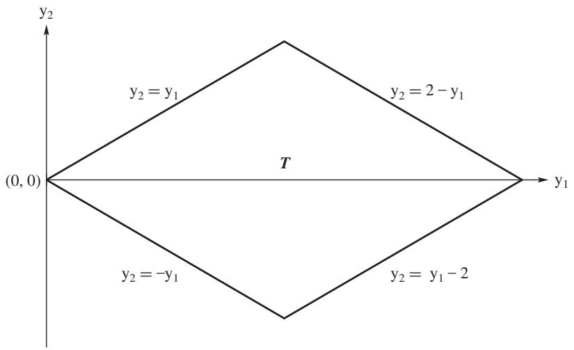  
Figure 2.2.3: The support of $(Y_{1},Y_{2})$ of Example 2.2.3.

The marginal pdf of $Y_{1}$ is given by

$$
f _ {Y _ {1}} (y _ {1}) = \int_ {- \infty} ^ {\infty} f _ {Y _ {1}, Y _ {2}} (y _ {1}, y _ {2}) d y _ {2}.
$$

If we refer to Figure 2.2.3, we can see that

$$
f _ {Y _ {1}} (y _ {1}) = \left\{ \begin{array}{l l} \int_ {- y _ {1}} ^ {y _ {1}} \frac {1}{2} d y _ {2} = y _ {1} & 0 <   y _ {1} \leq 1 \\ \int_ {y _ {1} - 2} ^ {2 - y _ {1}} \frac {1}{2} d y _ {2} = 2 - y _ {1} & 1 <   y _ {1} <   2 \\ 0 & \text {e l s e w h e r e ,} \end{array} \right.
$$

which agrees with expression (2.2.2) of Example 2.2.2. In a similar manner, the marginal pdf $f_{Y_2}(y_2)$ is given by

$$
f _ {Y _ {2}} (y _ {2}) = \left\{ \begin{array}{l l} \int_ {- y _ {2}} ^ {y _ {2} + 2} \frac {1}{2} d y _ {1} = y _ {2} + 1 & - 1 <   y _ {2} \leq 0 \\ \int_ {y _ {2}} ^ {2 - y _ {2}} \frac {1}{2} d y _ {1} = 1 - y _ {2} & 0 <   y _ {2} <   1 \\ 0 & \text {e l s e w h e r e .} \end{array} \right.
$$

Example 2.2.4. Let $Y_{1} = \frac{1}{2}(X_{1} - X_{2})$ , where $X_{1}$ and $X_{2}$ have the joint pdf

$$
f _ {X _ {1}, X _ {2}} (x _ {1}, x _ {2}) = \left\{ \begin{array}{l l} \frac {1}{4} \exp \left(- \frac {x _ {1} + x _ {2}}{2}\right) & 0 <   x _ {1} <   \infty , 0 <   x _ {2} <   \infty \\ 0 & \text {e l s e w h e r e .} \end{array} \right.
$$

Let $Y_{2} = X_{2}$ so that $y_{1} = \frac{1}{2}(x_{1} - x_{2})$ , $y_{2} = x_{2}$ or, equivalently, $x_{1} = 2y_{1} + y_{2}$ , $x_{2} = y_{2}$ , define a one-to-one transformation from $S = \{(x_{1}, x_{2}) : 0 < x_{1} < \infty, 0 < x_{2} < \infty\}$ onto $\mathcal{T} = \{(y_{1}, y_{2}) : -2y_{1} < y_{2} \text{ and } 0 < y_{2} < \infty, -\infty < y_{1} < \infty\}$ . The Jacobian of the transformation is

$$
J = \left| \begin{array}{c c} 2 & 1 \\ 0 & 1 \end{array} \right| = 2;
$$

hence the joint pdf of $Y_{1}$ and $Y_{2}$ is

$$
f _ {Y _ {1}, Y _ {2}} (y _ {1}, y _ {2}) = \left\{ \begin{array}{l l} \frac {| 2 |}{4}   e ^ {- y _ {1} - y _ {2}} & (y _ {1}, y _ {2}) \in \mathcal {T} \\ 0 & \text {e l s e w h e r e .} \end{array} \right.
$$

Thus the pdf of $Y_{1}$ is given by

$$
f _ {Y _ {1}} (y _ {1}) = \left\{ \begin{array}{l l} \int_ {- 2 y _ {1}} ^ {\infty} \frac {1}{2} e ^ {- y _ {1} - y _ {2}}   d y _ {2} = \frac {1}{2}   e ^ {y _ {1}} & - \infty <   y _ {1} <   0 \\ \int_ {0} ^ {\infty} \frac {1}{2}   e ^ {- y _ {1} - y _ {2}}   d y _ {2} = \frac {1}{2}   e ^ {- y _ {1}} & 0 \leq y _ {1} <   \infty , \end{array} \right.
$$

or

$$
f _ {Y _ {1}} \left(y _ {1}\right) = \frac {1}{2} e ^ {- \left| y _ {1} \right|}, - \infty <   y _ {1} <   \infty . \tag {2.2.4}
$$

Recall from expression (1.9.20) of Chapter 1 that $Y_{1}$ has the Laplace distribution. This pdf is also frequently called the double exponential pdf.

Example 2.2.5. Let $X_{1}$ and $X_{2}$ have the joint pdf

$$
f _ {X _ {1}, X _ {2}} (x _ {1}, x _ {2}) = \left\{ \begin{array}{l l} 1 0 x _ {1} x _ {2} ^ {2} & 0 <   x _ {1} <   x _ {2} <   1 \\ 0 & \text {e l s e w h e r e .} \end{array} \right.
$$

Suppose $Y_{1} = X_{1} / X_{2}$ and $Y_{2} = X_{2}$ . Hence, the inverse transformation is $x_{1} = y_{1}y_{2}$ and $x_{2} = y_{2}$ , which has the Jacobian

$$
J = \left| \begin{array}{c c} y _ {2} & y _ {1} \\ 0 & 1 \end{array} \right| = y _ {2}.
$$

The inequalities defining the support $S$ of $(X_{1},X_{2})$ become

$$
0 <   y _ {1} y _ {2}, y _ {1} y _ {2} <   y _ {2}, \text {a n d} y _ {2} <   1.
$$

These inequalities are equivalent to

$$
0 <   y _ {1} <   1 \text {a n d} 0 <   y _ {2} <   1,
$$

which defines the support set $\mathcal{T}$ of $(Y_1, Y_2)$ . Hence, the joint pdf of $(Y_1, Y_2)$ is

$$
f _ {Y _ {1}, Y _ {2}} (y _ {1}, y _ {2}) = 1 0 y _ {1} y _ {2} y _ {2} ^ {2} | y _ {2} | = 1 0 y _ {1} y _ {2} ^ {4}, \quad (y _ {1}, y _ {2}) \in \mathcal {T}.
$$

The marginal pdfs are

$$
f _ {Y _ {1}} (y _ {1}) = \int_ {0} ^ {1} 1 0 y _ {1} y _ {2} ^ {4} d y _ {2} = 2 y _ {1}, 0 <   y _ {1} <   1,
$$

zero elsewhere, and

$$
f _ {Y _ {2}} (y _ {2}) = \int_ {0} ^ {1} 1 0 y _ {1} y _ {2} ^ {4} d y _ {1} = 5 y _ {2} ^ {4}, \quad 0 <   y _ {1} <   1,
$$

zero elsewhere.

In addition to the change-of-variable and cdf techniques for finding distributions of functions of random variables, there is another method, called the moment generating function (mgf) technique, which works well for linear functions of random variables. In Subsection 2.1.2, we pointed out that if $Y = g(X_{1},X_{2})$ , then $E(Y)$ , if it exists, could be found by

$$
E (Y) = \int_ {- \infty} ^ {\infty} \int_ {- \infty} ^ {\infty} g \left(x _ {1}, x _ {2}\right) f _ {X _ {1}, X _ {2}} \left(x _ {1}, x _ {2}\right) d x _ {1} d x _ {2}
$$

in the continuous case, with summations replacing integrals in the discrete case. Certainly, that function $g(X_1, X_2)$ could be $\exp \{tu(X_1, X_2)\}$ , so that in reality we would be finding the mgf of the function $Z = u(X_1, X_2)$ . If we could then recognize this mgf as belonging to a certain distribution, then $Z$ would have that distribution. We give two illustrations that demonstrate the power of this technique by reconsidering Examples 2.2.1 and 2.2.4.

Example 2.2.6 (Continuation of Example 2.2.1). Here $X_{1}$ and $X_{2}$ have the joint pmf

$$
p _ {X _ {1}, X _ {2}} (x _ {1}, x _ {2}) = \left\{ \begin{array}{l l} \frac {\mu_ {1} ^ {x _ {1}} \mu_ {2} ^ {x _ {2}} e ^ {- \mu_ {1}} e ^ {- \mu_ {2}}}{x _ {1} ! x _ {2} !} & x _ {1} = 0, 1, 2, 3, \ldots , x _ {2} = 0, 1, 2, 3, \ldots \\ 0 & \text {e l s e w h e r e ,} \end{array} \right.
$$

where $\mu_{1}$ and $\mu_{2}$ are fixed positive real numbers. Let $Y = X_{1} + X_{2}$ and consider

$$
\begin{array}{l} E \left(e ^ {t Y}\right) = \sum_ {x _ {1} = 0} ^ {\infty} \sum_ {x _ {2} = 0} ^ {\infty} e ^ {t \left(x _ {1} + x _ {2}\right)} p _ {X _ {1}, X _ {2}} \left(x _ {1}, x _ {2}\right) \\ = \sum_ {x _ {1} = 0} ^ {\infty} e ^ {t x _ {1}} \frac {\mu^ {x _ {1}} e ^ {- \mu_ {1}}}{x _ {1} !} \sum_ {x _ {2} = 0} ^ {\infty} e ^ {t x _ {2}} \frac {\mu^ {x _ {2}} e ^ {- \mu_ {2}}}{x _ {2} !} \\ = \left[ e ^ {- \mu_ {1}} \sum_ {x _ {1} = 0} ^ {\infty} \frac {\left(e ^ {t} \mu_ {1}\right) ^ {x _ {1}}}{x _ {1} !} \right] \left[ e ^ {- \mu_ {2}} \sum_ {x _ {2} = 0} ^ {\infty} \frac {\left(e ^ {t} \mu_ {2}\right) ^ {x _ {2}}}{x _ {2} !} \right] \\ = \left[ e ^ {\mu_ {1} (e ^ {t} - 1)} \right] \left[ e ^ {\mu_ {2} (e ^ {t} - 1)} \right] \\ = e ^ {(\mu_ {1} + \mu_ {2}) (e ^ {t} - 1)}. \\ \end{array}
$$

Notice that the factors in the brackets in the next-to-last equality are the mgfs of $X_{1}$ and $X_{2}$ , respectively. Hence, the mgf of $Y$ is the same as that of $X_{1}$ except $\mu_{1}$ has been replaced by $\mu_{1} + \mu_{2}$ . Therefore, by the uniqueness of mgfs, the pmf of $Y$ must be

$$
p _ {Y} (y) = e ^ {- (\mu_ {1} + \mu_ {2})} \frac {(\mu_ {1} + \mu_ {2}) ^ {y}}{y !}, \quad y = 0, 1, 2, \dots ,
$$

which is the same pmf that was obtained in Example 2.2.1.

Example 2.2.7 (Continuation of Example 2.2.4). Here $X_{1}$ and $X_{2}$ have the joint pdf

$$
f _ {X _ {1}, X _ {2}} (x _ {1}, x _ {2}) = \left\{ \begin{array}{l l} \frac {1}{4} \exp \left(- \frac {x _ {1} + x _ {2}}{2}\right) & 0 <   x _ {1} <   \infty , 0 <   x _ {2} <   \infty \\ 0 & \text {e l s e w h e r e .} \end{array} \right.
$$

So the mgf of $Y = (1/2)(X_1 - X_2)$ is given by

$$
\begin{array}{l} E \left(e ^ {t Y}\right) = \int_ {0} ^ {\infty} \int_ {0} ^ {\infty} e ^ {t \left(x _ {1} - x _ {2}\right) / 2} \frac {1}{4} e ^ {- \left(x _ {1} + x _ {2}\right) / 2} d x _ {1} d x _ {2} \\ = \left[ \int_ {0} ^ {\infty} \frac {1}{2} e ^ {- x _ {1} (1 - t) / 2} d x _ {1} \right] \left[ \int_ {0} ^ {\infty} \frac {1}{2} e ^ {- x _ {2} (1 + t) / 2} d x _ {2} \right] \\ = \left[ \frac {1}{1 - t} \right] \left[ \frac {1}{1 + t} \right] = \frac {1}{1 - t ^ {2}} \\ \end{array}
$$

provided that $1 - t > 0$ and $1 + t > 0$ ; i.e., $-1 < t < 1$ . However, the mgf of a Laplace distribution with pdf (1.9.20) is

$$
\begin{array}{l} \int_ {- \infty} ^ {\infty} e ^ {t x} \frac {e ^ {- | x |}}{2} d x = \int_ {- \infty} ^ {0} \frac {e ^ {(1 + t) x}}{2} d x + \int_ {0} ^ {\infty} \frac {e ^ {(t - 1) x}}{2} d x \\ = \frac {1}{2 (1 + t)} + \frac {1}{2 (1 - t)} = \frac {1}{1 - t ^ {2}}, \\ \end{array}
$$

provided $-1 < t < 1$ . Thus, by the uniqueness of mgfs, $Y$ has a Laplace distribution with pdf (1.9.20).

# EXERCISES

2.2.1. If $p(x_1, x_2) = \left(\frac{2}{3}\right)^{x_1 + x_2} \left(\frac{1}{3}\right)^{2 - x_1 - x_2}$ , $(x_1, x_2) = (0, 0)$ , $(0, 1)$ , $(1, 0)$ , $(1, 1)$ , zero elsewhere, is the joint pmf of $X_1$ and $X_2$ , find the joint pmf of $Y_1 = X_1 - X_2$ and $Y_2 = X_1 + X_2$ .   
2.2.2. Let $X_{1}$ and $X_{2}$ have the joint pmf $p(x_{1},x_{2}) = x_{1}x_{2} / 36$ , $x_{1} = 1,2,3$ and $x_{2} = 1,2,3$ , zero elsewhere. Find first the joint pmf of $Y_{1} = X_{1}X_{2}$ and $Y_{2} = X_{2}$ , and then find the marginal pmf of $Y_{1}$ .   
2.2.3. Let $X_{1}$ and $X_{2}$ have the joint pdf $h(x_{1},x_{2}) = 2e^{-x_{1} - x_{2}}$ , $0 < x_{1} < x_{2} < \infty$ , zero elsewhere. Find the joint pdf of $Y_{1} = 2X_{1}$ and $Y_{2} = X_{2} - X_{1}$ .   
2.2.4. Let $X_{1}$ and $X_{2}$ have the joint pdf $h(x_{1},x_{2}) = 8x_{1}x_{2}$ , $0 < x_{1} < x_{2} < 1$ , zero elsewhere. Find the joint pdf of $Y_{1} = X_{1} / X_{2}$ and $Y_{2} = X_{2}$ .

Hint: Use the inequalities $0 < y_{1}y_{2} < y_{2} < 1$ in considering the mapping from $S$ onto $\mathcal{T}$ .

2.2.5. Let $X_{1}$ and $X_{2}$ be continuous random variables with the joint probability density function $f_{X_1,X_2}(x_1,x_2), -\infty < x_i < \infty, i = 1,2$ . Let $Y_{1} = X_{1} + X_{2}$ and $Y_{2} = X_{2}$ .

(a) Find the joint pdf $f_{Y_1,Y_2}$ .   
(b) Show that

$$
f _ {Y _ {1}} \left(y _ {1}\right) = \int_ {- \infty} ^ {\infty} f _ {X _ {1}, X _ {2}} \left(y _ {1} - y _ {2}, y _ {2}\right) d y _ {2}, \tag {2.2.5}
$$

which is sometimes called the convolution formula.

2.2.6. Suppose $X_{1}$ and $X_{2}$ have the joint pdf $f_{X_1,X_2}(x_1,x_2) = e^{-(x_1 + x_2)}$ , $0 < x_{i} < \infty$ , $i = 1,2$ , zero elsewhere.

(a) Use formula (2.2.5) to find the pdf of $Y_{1} = X_{1} + X_{2}$ .   
(b) Find the mgf of $Y_{1}$

2.2.7. Use the formula (2.2.5) to find the pdf of $Y_{1} = X_{1} + X_{2}$ , where $X_{1}$ and $X_{2}$ have the joint pdf $f_{X_1,X_2}(x_1,x_2) = 2e^{-(x_1 + x_2)}$ , $0 < x_{1} < x_{2} < \infty$ , zero elsewhere.

2.2.8. Suppose $X_{1}$ and $X_{2}$ have the joint pdf

$$
f (x _ {1}, x _ {2}) = \left\{ \begin{array}{l l} e ^ {- x _ {1}} e ^ {- x _ {2}} & x _ {1} > 0, x _ {2} > 0 \\ 0 & \text {e l s e w h e r e .} \end{array} \right.
$$

For constants $w_{1} > 0$ and $w_{2} > 0$ , let $W = w_{1}X_{1} + w_{2}X_{2}$ .

(a) Show that the pdf of $W$ is

$$
f _ {W} (w) = \left\{ \begin{array}{l l} \frac {1}{w _ {1} - w _ {2}} (e ^ {- w / w _ {1}} - e ^ {- w / w _ {2}}) & w > 0 \\ 0 & \text {e l s e w h e r e .} \end{array} \right.
$$

(b) Verify that $f_{W}(w) > 0$ for $w > 0$ .

(c) Note that the pdf $f_{W}(w)$ has an indeterminate form when $w_{1} = w_{2}$ . Rewrite $f_{W}(w)$ using $h$ defined as $w_{1} - w_{2} = h$ . Then use l'Hôpital's rule to show that when $w_{1} = w_{2}$ , the pdf is given by $f_{W}(w) = (w / w_{1}^{2})\exp \{-w / w_{1}\}$ for $w > 0$ and zero elsewhere.

# 2.3 Conditional Distributions and Expectations

In Section 2.1 we introduced the joint probability distribution of a pair of random variables. We also showed how to recover the individual (marginal) distributions for the random variables from the joint distribution. In this section, we discuss conditional distributions, i.e., the distribution of one of the random variables when the other has assumed a specific value. We discuss this first for the discrete case, which follows easily from the concept of conditional probability presented in Section 1.4.

Let $X_{1}$ and $X_{2}$ denote random variables of the discrete type, which have the joint pmf $p_{X_1,X_2}(x_1,x_2)$ that is positive on the support set $S$ and is zero elsewhere. Let $p_{X_1}(x_1)$ and $p_{X_2}(x_2)$ denote, respectively, the marginal probability mass functions of $X_{1}$ and $X_{2}$ . Let $x_{1}$ be a point in the support of $X_{1}$ ; hence, $p_{X_1}(x_1) > 0$ . Using the definition of conditional probability, we have

$$
P (X _ {2} = x _ {2} | X _ {1} = x _ {1}) = \frac {P (X _ {1} = x _ {1} , X _ {2} = x _ {2})}{P (X _ {1} = x _ {1})} = \frac {p _ {X _ {1} , X _ {2}} (x _ {1} , x _ {2})}{p _ {X _ {1}} (x _ {1})}
$$

for all $x_{2}$ in the support $\mathcal{S}_{X_2}$ of $X_{2}$ . Define this function as

$$
p _ {X _ {2} \mid X _ {1}} \left(x _ {2} \mid x _ {1}\right) = \frac {p _ {X _ {1} , X _ {2}} \left(x _ {1} , x _ {2}\right)}{p _ {X _ {1}} \left(x _ {1}\right)}, \quad x _ {2} \in S _ {X _ {2}}. \tag {2.3.1}
$$

For any fixed $x_{1}$ with $p_{X_1}(x_1) > 0$ , this function $p_{X_2|X_1}(x_2|x_1)$ satisfies the conditions of being a pmf of the discrete type because $p_{X_2|X_1}(x_2|x_1)$ is nonnegative and

$$
\begin{array}{l} \sum_ {x _ {2}} p _ {X _ {2} \mid X _ {1}} \left(x _ {2} \mid x _ {1}\right) = \sum_ {x _ {2}} \frac {p _ {X _ {1} , X _ {2}} \left(x _ {1} , x _ {2}\right)}{p _ {X _ {1}} \left(x _ {1}\right)} \\ = \frac {1}{p _ {X _ {1}} (x _ {1})} \sum_ {x _ {2}} p _ {X _ {1}, X _ {2}} (x _ {1}, x _ {2}) = \frac {p _ {X _ {1}} (x _ {1})}{p _ {X _ {1}} (x _ {1})} = 1. \\ \end{array}
$$

We call $p_{X_2|X_1}(x_2|x_1)$ the conditional pmf of the discrete type of random variable $X_2$ , given that the discrete type of random variable $X_1 = x_1$ . In a similar manner, provided $x_2 \in S_{X_2}$ , we define the symbol $p_{X_1|X_2}(x_1|x_2)$ by the relation

$$
p _ {X _ {1} | X _ {2}} (x _ {1} | x _ {2}) = \frac {p _ {X _ {1} , X _ {2}} (x _ {1} , x _ {2})}{p _ {X _ {2}} (x _ {2})}, x _ {1} \in S _ {X _ {1}},
$$

and we call $p_{X_1|X_2}(x_1|x_2)$ the conditional pmf of the discrete type of random variable $X_1$ , given that the discrete type of random variable $X_2 = x_2$ . We often abbreviate $p_{X_1|X_2}(x_1|x_2)$ by $p_{1|2}(x_1|x_2)$ and $p_{X_2|X_1}(x_2|x_1)$ by $p_{2|1}(x_2|x_1)$ . Similarly, $p_1(x_1)$ and $p_2(x_2)$ are used to denote the respective marginal pmfs.

Now let $X_{1}$ and $X_{2}$ denote random variables of the continuous type and have the joint pdf $f_{X_1,X_2}(x_1,x_2)$ and the marginal probability density functions $f_{X_1}(x_1)$ and $f_{X_2}(x_2)$ , respectively. We use the results of the preceding paragraph to motivate a definition of a conditional pdf of a continuous type of random variable. When $f_{X_1}(x_1) > 0$ , we define the symbol $f_{X_2|X_1}(x_2|x_1)$ by the relation

$$
f _ {X _ {2} \mid X _ {1}} \left(x _ {2} \mid x _ {1}\right) = \frac {f _ {X _ {1} , X _ {2}} \left(x _ {1} , x _ {2}\right)}{f _ {X _ {1}} \left(x _ {1}\right)}. \tag {2.3.2}
$$

In this relation, $x_{1}$ is to be thought of as having a fixed (but any fixed) value for which $f_{X_1}(x_1) > 0$ . It is evident that $f_{X_2|X_1}(x_2|x_1)$ is nonnegative and that

$$
\begin{array}{l} \int_ {- \infty} ^ {\infty} f _ {X _ {2} | X _ {1}} \left(x _ {2} | x _ {1}\right) d x _ {2} = \int_ {- \infty} ^ {\infty} \frac {f _ {X _ {1} , X _ {2}} \left(x _ {1} , x _ {2}\right)}{f _ {X _ {1}} \left(x _ {1}\right)} d x _ {2} \\ = \frac {1}{f _ {X _ {1}} (x _ {1})} \int_ {- \infty} ^ {\infty} f _ {X _ {1}, X _ {2}} (x _ {1}, x _ {2}) d x _ {2} \\ = \frac {1}{f _ {X _ {1}} (x _ {1})} f _ {X _ {1}} (x _ {1}) = 1. \\ \end{array}
$$

That is, $f_{X_2|X_1}(x_2|x_1)$ has the properties of a pdf of one continuous type of random variable. It is called the conditional pdf of the continuous type of random variable $X_2$ , given that the continuous type of random variable $X_1$ has the value $x_1$ . When $f_{X_2}(x_2) > 0$ , the conditional pdf of the continuous random variable $X_1$ , given that the continuous type of random variable $X_2$ has the value $x_2$ , is defined by

$$
f _ {X _ {1} | X _ {2}} (x _ {1} | x _ {2}) = \frac {f _ {X _ {1} , X _ {2}} (x _ {1} , x _ {2})}{f _ {X _ {2}} (x _ {2})}, \quad f _ {X _ {2}} (x _ {2}) > 0.
$$

We often abbreviate these conditional pdfs by $f_{1|2}(x_1|x_2)$ and $f_{2|1}(x_2|x_1)$ , respectively. Similarly, $f_{1}(x_{1})$ and $f_{2}(x_{2})$ are used to denote the respective marginal pdfs.

Since each of $f_{2|1}(x_2|x_1)$ and $f_{1|2}(x_1|x_2)$ is a pdf of one random variable, each has all the properties of such a pdf. Thus we can compute probabilities and mathematical expectations. If the random variables are of the continuous type, the probability

$$
P (a <   X _ {2} <   b | X _ {1} = x _ {1}) = \int_ {a} ^ {b} f _ {2 | 1} (x _ {2} | x _ {1}) d x _ {2}
$$

is called "the conditional probability that $a < X_2 < b$ , given that $X_1 = x_1$ ." If there is no ambiguity, this may be written in the form $P(a < X_2 < b|x_1)$ . Similarly, the conditional probability that $c < X_1 < d$ , given $X_2 = x_2$ , is

$$
P (c <   X _ {1} <   d | X _ {2} = x _ {2}) = \int_ {c} ^ {d} f _ {1 | 2} (x _ {1} | x _ {2}) d x _ {1}.
$$

If $u(X_2)$ is a function of $X_2$ , the conditional expectation of $u(X_2)$ , given that $X_1 = x_1$ , if it exists, is given by

$$
E [ u (X _ {2}) | x _ {1} ] = \int_ {- \infty} ^ {\infty} u (x _ {2}) f _ {2 | 1} (x _ {2} | x _ {1}) d x _ {2}.
$$

Note that $E[u(X_2)|x_1]$ is a function of $x_{1}$ . If they do exist, then $E(X_{2}|x_{1})$ is the mean and $E\{[X_2 - E(X_2|x_1)]^2 |x_1\}$ is the conditional variance of the conditional distribution of $X_{2}$ , given $X_{1} = x_{1}$ , which can be written more simply as $\operatorname{Var}(X_2|x_1)$ . It is convenient to refer to these as the "conditional mean" and the "conditional variance" of $X_{2}$ , given $X_{1} = x_{1}$ . Of course, we have

$$
\operatorname {V a r} \left(X _ {2} | x _ {1}\right) = E \left(X _ {2} ^ {2} | x _ {1}\right) - \left[ E \left(X _ {2} | x _ {1}\right) \right] ^ {2}
$$

from an earlier result. In a like manner, the conditional expectation of $u(X_1)$ , given $X_2 = x_2$ , if it exists, is given by

$$
E [ u (X _ {1}) | x _ {2} ] = \int_ {- \infty} ^ {\infty} u (x _ {1}) f _ {1 | 2} (x _ {1} | x _ {2}) d x _ {1}.
$$

With random variables of the discrete type, these conditional probabilities and conditional expectations are computed by using summation instead of integration. An illustrative example follows.

Example 2.3.1. Let $X_{1}$ and $X_{2}$ have the joint pdf

$$
f (x _ {1}, x _ {2}) = \left\{ \begin{array}{l l} 2 & 0 <   x _ {1} <   x _ {2} <   1 \\ 0 & \text {e l s e w h e r e .} \end{array} \right.
$$

Then the marginal probability density functions are, respectively,

$$
f _ {1} (x _ {1}) = \left\{ \begin{array}{l l} \int_ {x _ {1}} ^ {1} 2   d x _ {2} = 2 (1 - x _ {1}) & 0 <   x _ {1} <   1 \\ 0 & \text {e l s e w h e r e ,} \end{array} \right.
$$

and

$$
f _ {2} (x _ {2}) = \left\{ \begin{array}{l l} \int_ {0} ^ {x _ {2}} 2   d x _ {1} = 2 x _ {2} & 0 <   x _ {2} <   1 \\ 0 & \text {e l s e w h e r e .} \end{array} \right.
$$

The conditional pdf of $X_{1}$ , given $X_{2} = x_{2}$ , $0 < x_{2} < 1$ , is

$$
f _ {1 | 2} (x _ {1} | x _ {2}) = \left\{ \begin{array}{l l} \frac {2}{2 x _ {2}} = \frac {1}{x _ {2}} & 0 <   x _ {1} <   x _ {2} <   1 \\ 0 & \text {e l s e w h e r e .} \end{array} \right.
$$

Here the conditional mean and the conditional variance of $X_{1}$ , given $X_{2} = x_{2}$ , are respectively,

$$
\begin{array}{l} E \left(X _ {1} \mid x _ {2}\right) = \int_ {- \infty} ^ {\infty} x _ {1} f _ {1 | 2} \left(x _ {1} \mid x _ {2}\right) d x _ {1} \\ = \int_ {0} ^ {x _ {2}} x _ {1} \left(\frac {1}{x _ {2}}\right) d x _ {1} \\ = \frac {x _ {2}}{2}, \quad 0 <   x _ {2} <   1, \\ \end{array}
$$

and

$$
\begin{array}{l} \operatorname {V a r} \left(X _ {1} \mid x _ {2}\right) = \int_ {0} ^ {x _ {2}} \left(x _ {1} - \frac {x _ {2}}{2}\right) ^ {2} \left(\frac {1}{x _ {2}}\right) d x _ {1} \\ = \begin{array}{c} \frac {x _ {2} ^ {2}}{1 2}, \quad 0 <   x _ {2} <   1. \end{array} \\ \end{array}
$$

Finally, we compare the values of

$$
P \left(0 <   X _ {1} <   \frac {1}{2} \mid X _ {2} = \frac {3}{4}\right) \quad \text {a n d} P \left(0 <   X _ {1} <   \frac {1}{2}\right).
$$

We have

$$
P (0 <   X _ {1} <   \frac {1}{2} | X _ {2} = \frac {3}{4}) = \int_ {0} ^ {1 / 2} f _ {1 | 2} (x _ {1} | \frac {3}{4}) d x _ {1} = \int_ {0} ^ {1 / 2} (\frac {4}{3}) d x _ {1} = \frac {2}{3},
$$

but

$$
P \left(0 <   X _ {1} <   \frac {1}{2}\right) = \int_ {0} ^ {1 / 2} f _ {1} \left(x _ {1}\right) d x _ {1} = \int_ {0} ^ {1 / 2} 2 \left(1 - x _ {1}\right) d x _ {1} = \frac {3}{4}.
$$

Since $E(X_{2}|x_{1})$ is a function of $x_{1}$ , then $E(X_{2}|X_{1})$ is a random variable with its own distribution, mean, and variance. Let us consider the following illustration of this.

Example 2.3.2. Let $X_{1}$ and $X_{2}$ have the joint pdf

$$
f (x _ {1}, x _ {2}) = \left\{ \begin{array}{l l} 6 x _ {2} & 0 <   x _ {2} <   x _ {1} <   1 \\ 0 & \text {e l s e w h e r e .} \end{array} \right.
$$

Then the marginal pdf of $X_{1}$ is

$$
f _ {1} (x _ {1}) = \int_ {0} ^ {x _ {1}} 6 x _ {2} d x _ {2} = 3 x _ {1} ^ {2}, \quad 0 <   x _ {1} <   1,
$$

zero elsewhere. The conditional pdf of $X_{2}$ , given $X_{1} = x_{1}$ , is

$$
f _ {2 | 1} (x _ {2} | x _ {1}) = \frac {6 x _ {2}}{3 x _ {1} ^ {2}} = \frac {2 x _ {2}}{x _ {1} ^ {2}}, 0 <   x _ {2} <   x _ {1},
$$

zero elsewhere, where $0 < x_{1} < 1$ . The conditional mean of $X_{2}$ , given $X_{1} = x_{1}$ , is

$$
E \left(X _ {2} \mid x _ {1}\right) = \int_ {0} ^ {x _ {1}} x _ {2} \left(\frac {2 x _ {2}}{x _ {1} ^ {2}}\right) d x _ {2} = \frac {2}{3} x _ {1}, \quad 0 <   x _ {1} <   1.
$$

Now $E(X_{2}|X_{1}) = 2X_{1} / 3$ is a random variable, say $Y$ . The cdf of $Y = 2X_{1} / 3$ is

$$
G (y) = P (Y \leq y) = P \left(X _ {1} \leq \frac {3 y}{2}\right), \quad 0 \leq y <   \frac {2}{3}.
$$

From the pdf $f_{1}(x_{1})$ , we have

$$
G (y) = \int_ {0} ^ {3 y / 2} 3 x _ {1} ^ {2} d x _ {1} = \frac {2 7 y ^ {3}}{8}, \quad 0 \leq y <   \frac {2}{3}.
$$

Of course, $G(y) = 0$ if $y < 0$ , and $G(y) = 1$ if $\frac{2}{3} < y$ . The pdf, mean, and variance of $Y = 2X_{1}/3$ are

$$
g (y) = \frac {8 1 y ^ {2}}{8}, \quad 0 \leq y <   \frac {2}{3},
$$

zero elsewhere,

$$
E (Y) = \int_ {0} ^ {2 / 3} y \left(\frac {8 1 y ^ {2}}{8}\right) d y = \frac {1}{2},
$$

and

$$
\operatorname {V a r} (Y) = \int_ {0} ^ {2 / 3} y ^ {2} \left(\frac {8 1 y ^ {2}}{8}\right) d y - \frac {1}{4} = \frac {1}{6 0}.
$$

Since the marginal pdf of $X_{2}$ is

$$
f _ {2} (x _ {2}) = \int_ {x _ {2}} ^ {1} 6 x _ {2} d x _ {1} = 6 x _ {2} (1 - x _ {2}), \quad 0 <   x _ {2} <   1,
$$

zero elsewhere, it is easy to show that $E(X_2) = \frac{1}{2}$ and $\operatorname{Var}(X_2) = \frac{1}{20}$ . That is, here

$$
E (Y) = E \left[ E \left(X _ {2} \mid X _ {1}\right) \right] = E \left(X _ {2}\right)
$$

and

$$
\operatorname {V a r} (Y) = \operatorname {V a r} [ E (X _ {2} | X _ {1}) ] \leq \operatorname {V a r} (X _ {2}).
$$

Example 2.3.2 is excellent, as it provides us with the opportunity to apply many of these new definitions as well as review the cdf technique for finding the distribution of a function of a random variable, namely $Y = 2X_{1} / 3$ . Moreover, the two observations at the end of this example are no accident because they are true in general.

Theorem 2.3.1. Let $(X_{1},X_{2})$ be a random vector such that the variance of $X_{2}$ is finite. Then,

(a) $E[E(X_2|X_1)] = E(X_2)$   
(b) $Var[E(X_2|X_1)] \leq Var(X_2)$ .

Proof: The proof is for the continuous case. To obtain it for the discrete case, exchange summations for integrals. We first prove (a). Note that

$$
\begin{array}{l} E (X _ {2}) = \int_ {- \infty} ^ {\infty} \int_ {- \infty} ^ {\infty} x _ {2} f (x _ {1}, x _ {2}) d x _ {2} d x _ {1} \\ = \int_ {- \infty} ^ {\infty} \left[ \int_ {- \infty} ^ {\infty} x _ {2} \frac {f \left(x _ {1} , x _ {2}\right)}{f _ {1} \left(x _ {1}\right)} d x _ {2} \right] f _ {1} \left(x _ {1}\right) d x _ {1} \\ = \int_ {- \infty} ^ {\infty} E \left(X _ {2} \mid x _ {1}\right) f _ {1} \left(x _ {1}\right) d x _ {1} \\ = E \left[ E \left(X _ {2} \mid X _ {1}\right) \right], \\ \end{array}
$$

which is the first result.

Next we show (b). Consider with $\mu_{2} = E(X_{2})$

$$
\begin{array}{l} \operatorname {V a r} \left(X _ {2}\right) = E \left[ \left(X _ {2} - \mu_ {2}\right) ^ {2} \right] \\ = E \left\{\left[ X _ {2} - E \left(X _ {2} \mid X _ {1}\right) + E \left(X _ {2} \mid X _ {1}\right) - \mu_ {2} \right] ^ {2} \right\} \\ = E \left\{\left[ X _ {2} - E \left(X _ {2} \mid X _ {1}\right) \right] ^ {2} \right\} + E \left\{\left[ E \left(X _ {2} \mid X _ {1}\right) - \mu_ {2} \right] ^ {2} \right\} \\ + 2 E \left\{\left[ X _ {2} - E \left(X _ {2} \mid X _ {1}\right) \right] \left[ E \left(X _ {2} \mid X _ {1}\right) - \mu_ {2} \right] \right\}. \\ \end{array}
$$

We show that the last term of the right-hand member of the immediately preceding equation is zero. It is equal to

$$
\begin{array}{l} 2 \int_ {- \infty} ^ {\infty} \int_ {- \infty} ^ {\infty} [ x _ {2} - E (X _ {2} | x _ {1}) ] [ E (X _ {2} | x _ {1}) - \mu_ {2} ] f (x _ {1}, x _ {2}) d x _ {2} d x _ {1} \\ = 2 \int_ {- \infty} ^ {\infty} [ E (X _ {2} | x _ {1}) - \mu_ {2} ] \left\{\int_ {- \infty} ^ {\infty} [ x _ {2} - E (X _ {2} | x _ {1}) ] \frac {f (x _ {1} , x _ {2})}{f _ {1} (x _ {1})} d x _ {2} \right\} f _ {1} (x _ {1}) d x _ {1}. \\ \end{array}
$$

But $E(X_{2}|x_{1})$ is the conditional mean of $X_{2}$ , given $X_{1} = x_{1}$ . Since the expression in the inner braces is equal to

$$
E \left(X _ {2} \mid x _ {1}\right) - E \left(X _ {2} \mid x _ {1}\right) = 0,
$$

the double integral is equal to zero. Accordingly, we have

$$
\operatorname {V a r} (X _ {2}) = E \{[ X _ {2} - E (X _ {2} | X _ {1}) ] ^ {2} \} + E \{[ E (X _ {2} | X _ {1}) - \mu_ {2} ] ^ {2} \}.
$$

The first term in the right-hand member of this equation is nonnegative because it is the expected value of a nonnegative function, namely $[X_2 - E(X_2|X_1)]^2$ . Since $E[E(X_2|X_1)] = \mu_2$ , the second term is $\mathrm{Var}[E(X_2|X_1)]$ . Hence we have

$$
\operatorname {V a r} \left(X _ {2}\right) \geq \operatorname {V a r} \left[ E \left(X _ {2} \mid X _ {1}\right) \right],
$$

which completes the proof.

Intuitively, this result could have this useful interpretation. Both the random variables $X_{2}$ and $E(X_{2}|X_{1})$ have the same mean $\mu_{2}$ . If we did not know $\mu_{2}$ , we could use either of the two random variables to guess at the unknown $\mu_{2}$ . Since, however, $\operatorname{Var}(X_2) \geq \operatorname{Var}[E(X_2|X_1)]$ , we would put more reliance on $E(X_{2}|X_{1})$ as a guess. That is, if we observe the pair $(X_{1}, X_{2})$ to be $(x_{1}, x_{2})$ , we could prefer to use $E(X_{2}|x_{1})$ to $x_{2}$ as a guess at the unknown $\mu_{2}$ . When studying the use of sufficient statistics in estimation in Chapter 7, we make use of this famous result, attributed to C. R. Rao and David Blackwell.

We finish this section with an example illustrating Theorem 2.3.1.

Example 2.3.3. Let $X_{1}$ and $X_{2}$ be discrete random variables. Suppose the conditional pmf of $X_{1}$ given $X_{2}$ and the marginal distribution of $X_{2}$ are given by

$$
\begin{array}{l} p (x _ {1} | x _ {2}) = \left( \begin{array}{c} x _ {2} \\ x _ {1} \end{array} \right) \left(\frac {1}{2}\right) ^ {x _ {2}}, \quad x _ {1} = 0, 1, \ldots , x _ {2} \\ p \left(x _ {2}\right) = \frac {2}{3} \left(\frac {1}{3}\right) ^ {x _ {2} - 1}, x _ {2} = 1, 2, 3 \dots . \\ \end{array}
$$

Let us determine the mgf of $X_{1}$ . For fixed $x_{2}$ , by the binomial theorem,

$$
\begin{array}{l} E \left(e ^ {t X _ {1}} | x _ {2}\right) = \sum_ {x _ {1} = 0} ^ {x _ {2}} \binom {x _ {2}} {x _ {1}} e ^ {t x _ {1}} \left(\frac {1}{2}\right) ^ {x _ {2} - x _ {1}} \left(\frac {1}{2}\right) ^ {x _ {1}} \\ = \left(\frac {1}{2} + \frac {1}{2} e ^ {t}\right) ^ {x _ {2}}. \\ \end{array}
$$

Hence, by the geometric series and Theorem 2.3.1,

$$
\begin{array}{l} E \left(e ^ {t X _ {1}}\right) = E \left[ E \left(e ^ {t X _ {1}} \mid X _ {2} \right] \right. \\ = \sum_ {x _ {2} = 1} ^ {\infty} \left(\frac {1}{2} + \frac {1}{2} e ^ {t}\right) ^ {x _ {2}} \frac {2}{3} \left(\frac {1}{3}\right) ^ {x _ {2} - 1} \\ = \frac {2}{3} \left(\frac {1}{2} + \frac {1}{2} e ^ {t}\right) \sum_ {x _ {2} = 1} ^ {\infty} \left(\frac {1}{6} + \frac {1}{6} e ^ {t}\right) ^ {x _ {2} - 1} \\ = \frac {2}{3} \left(\frac {1}{2} + \frac {1}{2} e ^ {t}\right) \frac {1}{1 - \lceil (1 / 6) + (1 / 6) e ^ {t} \rceil}, \\ \end{array}
$$

provided $(1 / 6) + (1 / 6)e^{t} < 1$ or $t < \log 5$ (which includes $t = 0$ ).

# EXERCISES

2.3.1. Let $X_{1}$ and $X_{2}$ have the joint pdf $f(x_{1},x_{2}) = x_{1} + x_{2}$ , $0 < x_{1} < 1$ , $0 < x_{2} < 1$ , zero elsewhere. Find the conditional mean and variance of $X_{2}$ , given $X_{1} = x_{1}$ , $0 < x_{1} < 1$ .

2.3.2. Let $f_{1|2}(x_1|x_2) = c_1x_1 / x_2^2$ , $0 < x_{1} < x_{2}$ , $0 < x_{2} < 1$ , zero elsewhere, and $f_{2}(x_{2}) = c_{2}x_{2}^{4}$ , $0 < x_{2} < 1$ , zero elsewhere, denote, respectively, the conditional pdf of $X_{1}$ , given $X_{2} = x_{2}$ , and the marginal pdf of $X_{2}$ . Determine:

(a) The constants $c_{1}$ and $c_{2}$ .   
(b) The joint pdf of $X_{1}$ and $X_{2}$ .   
(c) $P(\frac{1}{4} < X_1 < \frac{1}{2}|X_2 = \frac{5}{8})$   
(d) $P(\frac{1}{4} < X_1 < \frac{1}{2})$ .

2.3.3. Let $f(x_{1},x_{2}) = 21x_{1}^{2}x_{2}^{3}$ , $0 < x_{1} < x_{2} < 1$ , zero elsewhere, be the joint pdf of $X_{1}$ and $X_{2}$ .

(a) Find the conditional mean and variance of $X_{1}$ , given $X_{2} = x_{2}$ , $0 < x_{2} < 1$ .   
(b) Find the distribution of $Y = E(X_{1}|X_{2})$ .   
(c) Determine $E(Y)$ and $\operatorname{Var}(Y)$ and compare these to $E(X_1)$ and $\operatorname{Var}(X_1)$ , respectively.

2.3.4. Suppose $X_{1}$ and $X_{2}$ are random variables of the discrete type that have the joint pmf $p(x_{1},x_{2}) = (x_{1} + 2x_{2}) / 18$ , $(x_{1},x_{2}) = (1,1)$ , $(1,2)$ , $(2,1)$ , $(2,2)$ , zero elsewhere. Determine the conditional mean and variance of $X_{2}$ , given $X_{1} = x_{1}$ , for $x_{1} = 1$ or 2. Also, compute $E(3X_{1} - 2X_{2})$ .

2.3.5. Let $X_{1}$ and $X_{2}$ be two random variables such that the conditional distributions and means exist. Show that:

(a) $E(X_{1} + X_{2}|X_{2}) = E(X_{1}|X_{2}) + X_{2},$   
(b) $E(u(X_2)\mid X_2) = u(X_2).$

2.3.6. Let the joint pdf of $X$ and $Y$ be given by

$$
f (x, y) = \left\{ \begin{array}{l l} \frac {2}{(1 + x + y) ^ {3}} & 0 <   x <   \infty , 0 <   y <   \infty \\ 0 & \text {e l s e w h e r e .} \end{array} \right.
$$

(a) Compute the marginal pdf of $X$ and the conditional pdf of $Y$ , given $X = x$ .   
(b) For a fixed $X = x$ , compute $E(1 + x + Y|x)$ and use the result to compute $E(Y|x)$ .

2.3.7. Suppose $X_{1}$ and $X_{2}$ are discrete random variables which have the joint pmf $p(x_{1},x_{2}) = (3x_{1} + x_{2}) / 24$ , $(x_{1},x_{2}) = (1,1)$ , $(1,2)$ , $(2,1)$ , $(2,2)$ , zero elsewhere. Find the conditional mean $E(X_{2}|x_{1})$ , when $x_{1} = 1$ .

2.3.8. Let $X$ and $Y$ have the joint pdf $f(x,y) = 2\exp \{-(x + y)\}$ , $0 < x < y < \infty$ , zero elsewhere. Find the conditional mean $E(Y|x)$ of $Y$ , given $X = x$ .

2.3.9. Five cards are drawn at random and without replacement from an ordinary deck of cards. Let $X_{1}$ and $X_{2}$ denote, respectively, the number of spades and the number of hearts that appear in the five cards.

(a) Determine the joint pmf of $X_{1}$ and $X_{2}$ .   
(b) Find the two marginal pmfs.   
(c) What is the conditional pmf of $X_{2}$ , given $X_{1} = x_{1}$ ?

2.3.10. Let $X_{1}$ and $X_{2}$ have the joint pmf $p(x_{1},x_{2})$ described as follows:

<table><tr><td>(x1,x2)</td><td>(0,0)</td><td>(0,1)</td><td>(1,0)</td><td>(1,1)</td><td>(2,0)</td><td>(2,1)</td></tr><tr><td>p(x1,x2)</td><td>1/18</td><td>3/18</td><td>4/18</td><td>3/18</td><td>6/18</td><td>1/18</td></tr></table>

and $p(x_1, x_2)$ is equal to zero elsewhere. Find the two marginal probability mass functions and the two conditional means.

Hint: Write the probabilities in a rectangular array.

2.3.11. Let us choose at random a point from the interval $(0, 1)$ and let the random variable $X_{1}$ be equal to the number that corresponds to that point. Then choose a point at random from the interval $(0, x_{1})$ , where $x_{1}$ is the experimental value of $X_{1}$ ; and let the random variable $X_{2}$ be equal to the number that corresponds to this point.

(a) Make assumptions about the marginal pdf $f_{1}(x_{1})$ and the conditional pdf $f_{2|1}(x_2|x_1)$ .   
(b) Compute $P(X_{1} + X_{2}\geq 1)$   
(c) Find the conditional mean $E(X_{1}|x_{2})$ .

2.3.12. Let $f(x)$ and $F(x)$ denote, respectively, the pdf and the cdf of the random variable $X$ . The conditional pdf of $X$ , given $X > x_0$ , $x_0$ a fixed number, is defined by $f(x|X > x_0) = f(x) / [1 - F(x_0)]$ , $x_0 < x$ , zero elsewhere. This kind of conditional pdf finds application in a problem of time until death, given survival until time $x_0$ .

(a) Show that $f(x|X > x_0)$ is a pdf.   
(b) Let $f(x) = e^{-x}$ , $0 < x < \infty$ , and zero elsewhere. Compute $P(X > 2|X > 1)$ .

# 2.4 Independent Random Variables

Let $X_{1}$ and $X_{2}$ denote the random variables of the continuous type that have the joint pdf $f(x_{1},x_{2})$ and marginal probability density functions $f_{1}(x_{1})$ and $f_{2}(x_{2})$ , respectively. In accordance with the definition of the conditional pdf $f_{2|1}(x_2|x_1)$ , we may write the joint pdf $f(x_{1},x_{2})$ as

$$
f (x _ {1}, x _ {2}) = f _ {2 | 1} (x _ {2} | x _ {1}) f _ {1} (x _ {1}).
$$

Suppose that we have an instance where $f_{2|1}(x_2|x_1)$ does not depend upon $x_1$ . Then the marginal pdf of $X_2$ is, for random variables of the continuous type,

$$
\begin{array}{l} f _ {2} (x _ {2}) = \int_ {- \infty} ^ {\infty} f _ {2 | 1} (x _ {2} | x _ {1}) f _ {1} (x _ {1}) d x _ {1} \\ = f _ {2 | 1} \left(x _ {2} \mid x _ {1}\right) \int_ {- \infty} ^ {\infty} f _ {1} \left(x _ {1}\right) d x _ {1} \\ = f _ {2 | 1} \left(x _ {2} \mid x _ {1}\right). \\ \end{array}
$$

Accordingly,

$$
f _ {2} (x _ {2}) = f _ {2 | 1} (x _ {2} | x _ {1}) \quad \text {a n d} \quad f (x _ {1}, x _ {2}) = f _ {1} (x _ {1}) f _ {2} (x _ {2}),
$$

when $f_{2|1}(x_2|x_1)$ does not depend upon $x_1$ . That is, if the conditional distribution of $X_2$ , given $X_1 = x_1$ , is independent of any assumption about $x_1$ , then $f(x_1,x_2) = f_1(x_1)f_2(x_2)$ .

The same discussion applies to the discrete case too, which we summarize in parentheses in the following definition.

Definition 2.4.1 (Independence). Let the random variables $X_{1}$ and $X_{2}$ have the joint pdf $f(x_{1},x_{2})$ [joint pmf $p(x_{1},x_{2})$ ] and the marginal pdfs [pmfs] $f_{1}(x_{1})$ [p1(x1)] and $f_{2}(x_{2})$ [p2(x2)], respectively. The random variables $X_{1}$ and $X_{2}$ are said to be independent if, and only if, $f(x_{1},x_{2})\equiv f_{1}(x_{1})f_{2}(x_{2})$ [p(x1,x2) ≡ p1(x1)p2(x2)]. Random variables that are not independent are said to be dependent.

Remark 2.4.1. Two comments should be made about the preceding definition. First, the product of two positive functions $f_{1}(x_{1})f_{2}(x_{2})$ means a function that is positive on the product space. That is, if $f_{1}(x_{1})$ and $f_{2}(x_{2})$ are positive on, and only on, the respective spaces $S_{1}$ and $S_{2}$ , then the product of $f_{1}(x_{1})$ and $f_{2}(x_{2})$ is positive on, and only on, the product space $S = \{(x_{1}, x_{2}) : x_{1} \in S_{1}, x_{2} \in S_{2}\}$ . For instance, if $S_{1} = \{x_{1} : 0 < x_{1} < 1\}$ and $S_{2} = \{x_{2} : 0 < x_{2} < 3\}$ , then $S = \{(x_{1}, x_{2}) : 0 < x_{1} < 1, 0 < x_{2} < 3\}$ . The second remark pertains to the identity. The identity in Definition 2.4.1 should be interpreted as follows. There may be certain points $(x_{1}, x_{2}) \in S$ at which $f(x_{1}, x_{2}) \neq f_{1}(x_{1})f_{2}(x_{2})$ . However, if $A$ is the set of points $(x_{1}, x_{2})$ at which the equality does not hold, then $P(A) = 0$ . In subsequent theorems and the subsequent generalizations, a product of nonnegative functions and an identity should be interpreted in an analogous manner.

Example 2.4.1. Suppose an urn contains 10 blue, 8 red, and 7 yellow balls that are the same except for color. Suppose 4 balls are drawn without replacement. Let $X$ and $Y$ be the number of red and blue balls drawn, respectively. The joint pmf of $(X, Y)$ is

$$
p (x, y) = \frac {\binom {1 0} {x} \binom {8} {y} \binom {7} {4 - x - y}}{\binom {2 5} {4}}, \quad 0 \leq x, y \leq 4; x + y \leq 4.
$$

Since $X + Y \leq 4$ , it would seem that $X$ and $Y$ are dependent. To see that this is true by definition, we first find the marginal pmf's which are:

$$
p _ {X} (x) = \frac {\binom {1 0} {x} \binom {1 5} {4 - x}}{\binom {2 5} {4}}, \quad 0 \leq x \leq 4;
$$

$$
p _ {Y} (y) = \frac {\binom {8} {y} \binom {1 7} {4 - y}}{\binom {2 5} {4}}, \quad 0 \leq y \leq 4.
$$

To show dependence, we need to find only one point in the support of $(X_{1},X_{2})$ where the joint pmf does not factor into the product of the marginal pmf's. Suppose we select the point $x = 1$ and $y = 1$ . Then, using R for calculation, we compute (to 4 places):

$$
p (1, 1) = 1 0 \cdot 8 \cdot \binom {7} {2} / \binom {2 5} {4} = 0. 1 3 2 8
$$

$$
p _ {X} (1) = 1 0 \binom {1 5} {3} / \binom {2 5} {4} = 0. 3 5 9 7
$$

$$
p _ {Y} (1) = 8 \binom {1 7} {3} / \binom {2 5} {4} = 0. 4 3 0 0.
$$

Since $0.1328 \neq 0.1547 = 0.3597 \cdot 0.4300$ , $X$ and $Y$ are dependent random variables.

Example 2.4.2. Let the joint pdf of $X_{1}$ and $X_{2}$ be

$$
f (x _ {1}, x _ {2}) = \left\{ \begin{array}{l l} x _ {1} + x _ {2} & 0 <   x _ {1} <   1, 0 <   x _ {2} <   1 \\ 0 & \text {e l s e w h e r e .} \end{array} \right.
$$

We show that $X_{1}$ and $X_{2}$ are dependent. Here the marginal probability density functions are

$$
f _ {1} (x _ {1}) = \left\{ \begin{array}{l l} \int_ {- \infty} ^ {\infty} f (x _ {1}, x _ {2})   d x _ {2} = \int_ {0} ^ {1} (x _ {1} + x _ {2})   d x _ {2} = x _ {1} + \frac {1}{2} & 0 <   x _ {1} <   1 \\ 0 & \text {e l s e w h e r e ,} \end{array} \right.
$$

and

$$
f _ {2} (x _ {2}) = \left\{ \begin{array}{l l} \int_ {- \infty} ^ {\infty} f (x _ {1}, x _ {2})   d x _ {1} = \int_ {0} ^ {1} (x _ {1} + x _ {2})   d x _ {1} = \frac {1}{2} + x _ {2} & 0 <   x _ {2} <   1 \\ 0 & \text {e l s e w h e r e .} \end{array} \right.
$$

Since $f(x_{1},x_{2})\neq f_{1}(x_{1})f_{2}(x_{2})$ , the random variables $X_{1}$ and $X_{2}$ are dependent.

The following theorem makes it possible to assert that the random variables $X_{1}$ and $X_{2}$ of Example 2.4.2 are dependent, without computing the marginal probability density functions.

Theorem 2.4.1. Let the random variables $X_{1}$ and $X_{2}$ have supports $S_{1}$ and $S_{2}$ , respectively, and have the joint pdf $f(x_{1},x_{2})$ . Then $X_{1}$ and $X_{2}$ are independent if

and only if $f(x_{1},x_{2})$ can be written as a product of a nonnegative function of $x_{1}$ and a nonnegative function of $x_{2}$ . That is,

$$
f (x _ {1}, x _ {2}) \equiv g (x _ {1}) h (x _ {2}),
$$

where $g(x_{1}) > 0$ , $x_{1} \in S_{1}$ , zero elsewhere, and $h(x_{2}) > 0$ , $x_{2} \in S_{2}$ , zero elsewhere.

Proof. If $X_{1}$ and $X_{2}$ are independent, then $f(x_{1},x_{2})\equiv f_{1}(x_{1})f_{2}(x_{2})$ , where $f_{1}(x_{1})$ and $f_{2}(x_{2})$ are the marginal probability density functions of $X_{1}$ and $X_{2}$ , respectively. Thus the condition $f(x_{1},x_{2})\equiv g(x_{1})h(x_{2})$ is fulfilled.

Conversely, if $f(x_{1},x_{2})\equiv g(x_{1})h(x_{2})$ , then, for random variables of the continuous type, we have

$$
f _ {1} (x _ {1}) = \int_ {- \infty} ^ {\infty} g (x _ {1}) h (x _ {2}) d x _ {2} = g (x _ {1}) \int_ {- \infty} ^ {\infty} h (x _ {2}) d x _ {2} = c _ {1} g (x _ {1})
$$

and

$$
f _ {2} (x _ {2}) = \int_ {- \infty} ^ {\infty} g (x _ {1}) h (x _ {2}) d x _ {1} = h (x _ {2}) \int_ {- \infty} ^ {\infty} g (x _ {1}) d x _ {1} = c _ {2} h (x _ {2}),
$$

where $c_{1}$ and $c_{2}$ are constants, not functions of $x_{1}$ or $x_{2}$ . Moreover, $c_{1}c_{2} = 1$ because

$$
1 = \int_ {- \infty} ^ {\infty} \int_ {- \infty} ^ {\infty} g (x _ {1}) h (x _ {2}) d x _ {1} d x _ {2} = \left[ \int_ {- \infty} ^ {\infty} g (x _ {1}) d x _ {1} \right] \left[ \int_ {- \infty} ^ {\infty} h (x _ {2}) d x _ {2} \right] = c _ {2} c _ {1}.
$$

These results imply that

$$
f \left(x _ {1}, x _ {2}\right) \equiv g \left(x _ {1}\right) h \left(x _ {2}\right) \equiv c _ {1} g \left(x _ {1}\right) c _ {2} h \left(x _ {2}\right) \equiv f _ {1} \left(x _ {1}\right) f _ {2} \left(x _ {2}\right).
$$

Accordingly, $X_{1}$ and $X_{2}$ are independent.

This theorem is true for the discrete case also. Simply replace the joint pdf by the joint pmf. For instance, the discrete random variables $X$ and $Y$ of Example 2.4.1 are immediately seen to be dependent because the support of $(X,Y)$ is not a product space.

Next, consider the joint distribution of the continuous random vector $(X,Y)$ given in Example 2.1.3. The joint pdf is

$$
f (x, y) = 4 x e ^ {- x ^ {2}} y e ^ {- y ^ {2}}, \quad x > 0, y > 0.
$$

which is a product of a nonnegative function of $x$ and a nonnegative function of $y$ . Further, the joint support is a product space. Hence, $X$ and $Y$ are independent random variables.

Example 2.4.3. Let the pdf of the random variable $X_{1}$ and $X_{2}$ be $f(x_{1},x_{2}) = 8x_{1}x_{2}$ , $0 < x_{1} < x_{2} < 1$ , zero elsewhere. The formula $8x_{1}x_{2}$ might suggest to some that $X_{1}$ and $X_{2}$ are independent. However, if we consider the space $S = \{(x_1,x_2):0 < x_1 < x_2 < 1\}$ , we see that it is not a product space. This should make it clear that, in general, $X_{1}$ and $X_{2}$ must be dependent if the space of positive probability density of $X_{1}$ and $X_{2}$ is bounded by a curve that is neither a horizontal nor a vertical line.

Instead of working with pdfs (or pmfs) we could have presented independence in terms of cumulative distribution functions. The following theorem shows the equivalence.

Theorem 2.4.2. Let $(X_{1},X_{2})$ have the joint cdf $F(x_{1},x_{2})$ and let $X_{1}$ and $X_{2}$ have the marginal cdfs $F_{1}(x_{1})$ and $F_{2}(x_{2})$ , respectively. Then $X_{1}$ and $X_{2}$ are independent if and only if

$$
F \left(x _ {1}, x _ {2}\right) = F _ {1} \left(x _ {1}\right) F _ {2} \left(x _ {2}\right) \quad f o r a l l \left(x _ {1}, x _ {2}\right) \in R ^ {2}. \tag {2.4.1}
$$

Proof: We give the proof for the continuous case. Suppose expression (2.4.1) holds. Then the mixed second partial is

$$
\frac {\partial^ {2}}{\partial x _ {1} \partial x _ {2}} F (x _ {1}, x _ {2}) = f _ {1} (x _ {1}) f _ {2} (x _ {2}).
$$

Hence, $X_{1}$ and $X_{2}$ are independent. Conversely, suppose $X_{1}$ and $X_{2}$ are independent. Then by the definition of the joint cdf,

$$
\begin{array}{l} F (x _ {1}, x _ {2}) = \int_ {- \infty} ^ {x _ {1}} \int_ {- \infty} ^ {x _ {2}} f _ {1} (w _ {1}) f _ {2} (w _ {2}) d w _ {2} d w _ {1} \\ = \int_ {- \infty} ^ {x _ {1}} f _ {1} (w _ {1}) d w _ {1} \cdot \int_ {- \infty} ^ {x _ {2}} f _ {2} (w _ {2}) d w _ {2} = F _ {1} (x _ {1}) F _ {2} (x _ {2}). \\ \end{array}
$$

Hence, condition (2.4.1) is true.

We now give a theorem that frequently simplifies the calculations of probabilities of events that involves independent variables.

Theorem 2.4.3. The random variables $X_{1}$ and $X_{2}$ are independent random variables if and only if the following condition holds,

$$
P (a <   X _ {1} \leq b, c <   X _ {2} \leq d) = P (a <   X _ {1} \leq b) P (c <   X _ {2} \leq d) \tag {2.4.2}
$$

for every $a < b$ and $c < d$ , where $a, b, c$ , and $d$ are constants.

Proof: If $X_{1}$ and $X_{2}$ are independent, then an application of the last theorem and expression (2.1.2) shows that

$$
\begin{array}{l} P (a <   X _ {1} \leq b, c <   X _ {2} \leq d) = F (b, d) - F (a, d) - F (b, c) + F (a, c) \\ = F _ {1} (b) F _ {2} (d) - F _ {1} (a) F _ {2} (d) - F _ {1} (b) F _ {2} (c) \\ + F _ {1} (a) F _ {2} (c) \\ = \left[ F _ {1} (b) - F _ {1} (a) \right] \left[ F _ {2} (d) - F _ {2} (c) \right], \\ \end{array}
$$

which is the right side of expression (2.4.2). Conversely, condition (2.4.2) implies that the joint cdf of $(X_{1},X_{2})$ factors into a product of the marginal cdfs, which in turn by Theorem 2.4.2 implies that $X_{1}$ and $X_{2}$ are independent.

Example 2.4.4 (Example 2.4.2, Continued). Independence is necessary for condition (2.4.2). For example, consider the dependent variables $X_{1}$ and $X_{2}$ of Example 2.4.2. For these random variables, we have

$$
P (0 <   X _ {1} <   \frac {1}{2}, 0 <   X _ {2} <   \frac {1}{2}) = \int_ {0} ^ {1 / 2} \int_ {0} ^ {1 / 2} (x _ {1} + x _ {2}) d x _ {1} d x _ {2} = \frac {1}{8},
$$

whereas

$$
P (0 <   X _ {1} <   \frac {1}{2}) = \int_ {0} ^ {1 / 2} (x _ {1} + \frac {1}{2}) d x _ {1} = \frac {3}{8}
$$

and

$$
P (0 <   X _ {2} <   \frac {1}{2}) = \int_ {0} ^ {1 / 2} (\frac {1}{2} + x _ {1}) d x _ {2} = \frac {3}{8}.
$$

Hence, condition (2.4.2) does not hold.

Not merely are calculations of some probabilities usually simpler when we have independent random variables, but many expectations, including certain moment generating functions, have comparably simpler computations. The following result proves so useful that we state it in the form of a theorem.

Theorem 2.4.4. Suppose $X_{1}$ and $X_{2}$ are independent and that $E(u(X_1))$ and $E(v(X_2))$ exist. Then

$$
E [ u (X _ {1}) v (X _ {2}) ] = E [ u (X _ {1}) ] E [ v (X _ {2}) ].
$$

Proof. We give the proof in the continuous case. The independence of $X_{1}$ and $X_{2}$ implies that the joint pdf of $X_{1}$ and $X_{2}$ is $f_{1}(x_{1})f_{2}(x_{2})$ . Thus we have, by definition of expectation,

$$
\begin{array}{l} E [ u (X _ {1}) v (X _ {2}) ] = \int_ {- \infty} ^ {\infty} \int_ {- \infty} ^ {\infty} u (x _ {1}) v (x _ {2}) f _ {1} (x _ {1}) f _ {2} (x _ {2}) d x _ {1} d x _ {2} \\ = \left[ \int_ {- \infty} ^ {\infty} u \left(x _ {1}\right) f _ {1} \left(x _ {1}\right) d x _ {1} \right] \left[ \int_ {- \infty} ^ {\infty} v \left(x _ {2}\right) f _ {2} \left(x _ {2}\right) d x _ {2} \right] \\ = E [ u (X _ {1}) ] E [ v (X _ {2}) ]. \\ \end{array}
$$

Hence, the result is true.

Upon taking the functions $u(\cdot)$ and $v(\cdot)$ to be the identity functions in Theorem 2.4.4, we have that for independent random variables $X_{1}$ and $X_{2}$ ,

$$
E \left(X _ {1} X _ {2}\right) = E \left(X _ {1}\right) E \left(X _ {2}\right). \tag {2.4.3}
$$

We next prove a very useful theorem about independent random variables. The proof of the theorem relies heavily upon our assertion that an mgf, when it exists, is unique and that it uniquely determines the distribution of probability.

Theorem 2.4.5. Suppose the joint mgf, $M(t_{1},t_{2})$ , exists for the random variables $X_{1}$ and $X_{2}$ . Then $X_{1}$ and $X_{2}$ are independent if and only if

$$
M (t _ {1}, t _ {2}) = M (t _ {1}, 0) M (0, t _ {2});
$$

that is, the joint mgf is identically equal to the product of the marginal mgfs.

Proof. If $X_{1}$ and $X_{2}$ are independent, then

$$
\begin{array}{l} M \left(t _ {1}, t _ {2}\right) = E \left(e ^ {t _ {1} X _ {1} + t _ {2} X _ {2}}\right) \\ = E \left(e ^ {t _ {1} X _ {1}} e ^ {t _ {2} X _ {2}}\right) \\ = E \left(e ^ {t _ {1} X _ {1}}\right) E \left(e ^ {t _ {2} X _ {2}}\right) \\ = M (t _ {1}, 0) M (0, t _ {2}). \\ \end{array}
$$

Thus the independence of $X_{1}$ and $X_{2}$ implies that the mgf of the joint distribution factors into the product of the moment-generating functions of the two marginal distributions.

Suppose next that the mgf of the joint distribution of $X_{1}$ and $X_{2}$ is given by $M(t_{1},t_{2}) = M(t_{1},0)M(0,t_{2})$ . Now $X_{1}$ has the unique mgf, which, in the continuous case, is given by

$$
M (t _ {1}, 0) = \int_ {- \infty} ^ {\infty} e ^ {t _ {1} x _ {1}} f _ {1} (x _ {1}) d x _ {1}.
$$

Similarly, the unique mgf of $X_{2}$ , in the continuous case, is given by

$$
M (0, t _ {2}) = \int_ {- \infty} ^ {\infty} e ^ {t _ {2} x _ {2}} f _ {2} (x _ {2}) d x _ {2}.
$$

Thus we have

$$
\begin{array}{l} M \left(t _ {1}, 0\right) M \left(0, t _ {2}\right) = \left[ \int_ {- \infty} ^ {\infty} e ^ {t _ {1} x _ {1}} f _ {1} \left(x _ {1}\right) d x _ {1} \right] \left[ \int_ {- \infty} ^ {\infty} e ^ {t _ {2} x _ {2}} f _ {2} \left(x _ {2}\right) d x _ {2} \right] \\ = \int_ {- \infty} ^ {\infty} \int_ {- \infty} ^ {\infty} e ^ {t _ {1} x _ {1} + t _ {2} x _ {2}} f _ {1} (x _ {1}) f _ {2} (x _ {2}) d x _ {1} d x _ {2}. \\ \end{array}
$$

We are given that $M(t_{1},t_{2}) = M(t_{1},0)M(0,t_{2})$ ; so

$$
M (t _ {1}, t _ {2}) = \int_ {- \infty} ^ {\infty} \int_ {- \infty} ^ {\infty} e ^ {t _ {1} x _ {1} + t _ {2} x _ {2}} f _ {1} (x _ {1}) f _ {2} (x _ {2}) d x _ {1} d x _ {2}.
$$

But $M(t_{1}, t_{2})$ is the mgf of $X_{1}$ and $X_{2}$ . Thus

$$
M (t _ {1}, t _ {2}) = \int_ {- \infty} ^ {\infty} \int_ {- \infty} ^ {\infty} e ^ {t _ {1} x _ {1} + t _ {2} x _ {2}} f (x _ {1}, x _ {2}) d x _ {1} d x _ {2}.
$$

The uniqueness of the mgf implies that the two distributions of probability that are described by $f_{1}(x_{1})f_{2}(x_{2})$ and $f(x_{1},x_{2})$ are the same. Thus

$$
f (x _ {1}, x _ {2}) \equiv f _ {1} (x _ {1}) f _ {2} (x _ {2}).
$$

That is, if $M(t_{1},t_{2}) = M(t_{1},0)M(0,t_{2})$ , then $X_{1}$ and $X_{2}$ are independent. This completes the proof when the random variables are of the continuous type. With random variables of the discrete type, the proof is made by using summation instead of integration.

Example 2.4.5 (Example 2.1.10, Continued). Let $(X,Y)$ be a pair of random variables with the joint pdf

$$
f (x, y) = \left\{ \begin{array}{l l} e ^ {- y} & 0 <   x <   y <   \infty \\ 0 & \text {e l s e w h e r e .} \end{array} \right.
$$

In Example 2.1.10, we showed that the mgf of $(X,Y)$ is

$$
\begin{array}{l} M \left(t _ {1}, t _ {2}\right) = \int_ {0} ^ {\infty} \int_ {x} ^ {\infty} \exp \left(t _ {1} x + t _ {2} y - y\right) d y d x \\ { = } { \frac { 1 } { ( 1 - t _ { 1 } - t _ { 2 } ) ( 1 - t _ { 2 } ) } , } \\ \end{array}
$$

provided that $t_1 + t_2 < 1$ and $t_2 < 1$ . Because $M(t_1, t_2) \neq M(t_1, 0)M(t_1, 0)$ , the random variables are dependent.

Example 2.4.6 (Exercise 2.1.15, Continued). For the random variable $X_{1}$ and $X_{2}$ defined in Exercise 2.1.15, we showed that the joint mgf is

$$
M (t _ {1}, t _ {2}) = \left[ \frac {\exp \{t _ {1} \}}{2 - \exp \{t _ {1} \}} \right] \left[ \frac {\exp \{t _ {2} \}}{2 - \exp \{t _ {2} \}} \right], t _ {i} <   \log 2, i = 1, 2.
$$

We showed further that $M(t_{1},t_{2}) = M(t_{1},0)M(0,t_{2})$ . Hence, $X_{1}$ and $X_{2}$ are independent random variables.

# EXERCISES

2.4.1. Show that the random variables $X_{1}$ and $X_{2}$ with joint pdf

$$
f (x _ {1}, x _ {2}) = \left\{ \begin{array}{l l} 1 2 x _ {1} x _ {2} (1 - x _ {2}) & 0 <   x _ {1} <   1, 0 <   x _ {2} <   1 \\ 0 & \text {e l s e w h e r e} \end{array} \right.
$$

are independent.

2.4.2. If the random variables $X_{1}$ and $X_{2}$ have the joint pdf $f(x_{1},x_{2}) = 2e^{-x_{1} - x_{2}}$ , $0 < x_{1} < x_{2}$ , $0 < x_{2} < \infty$ , zero elsewhere, show that $X_{1}$ and $X_{2}$ are dependent.

2.4.3. Let $p(x_1, x_2) = \frac{1}{16}$ , $x_1 = 1, 2, 3, 4$ , and $x_2 = 1, 2, 3, 4$ , zero elsewhere, be the joint pmf of $X_1$ and $X_2$ . Show that $X_1$ and $X_2$ are independent.

2.4.4. Find $P(0 < X_1 < \frac{1}{3}, 0 < X_2 < \frac{1}{3})$ if the random variables $X_1$ and $X_2$ have the joint pdf $f(x_1, x_2) = 4x_1(1 - x_2)$ , $0 < x_1 < 1$ , $0 < x_2 < 1$ , zero elsewhere.

2.4.5. Find the probability of the union of the events $a < X_1 < b$ , $-\infty < X_2 < \infty$ , and $-\infty < X_1 < \infty$ , $c < X_2 < d$ if $X_1$ and $X_2$ are two independent variables with $P(a < X_1 < b) = \frac{2}{3}$ and $P(c < X_2 < d) = \frac{5}{8}$ .

2.4.6. If $f(x_{1},x_{2}) = e^{-x_{1} - x_{2}}$ , $0 < x_{1} < \infty$ , $0 < x_{2} < \infty$ , zero elsewhere, is the joint pdf of the random variables $X_{1}$ and $X_{2}$ , show that $X_{1}$ and $X_{2}$ are independent and that $M(t_{1},t_{2}) = (1 - t_{1})^{-1}(1 - t_{2})^{-1}$ , $t_2 < 1$ , $t_1 < 1$ . Also show that

$$
E \left(e ^ {t \left(X _ {1} + X _ {2}\right)}\right) = (1 - t) ^ {- 2}, \quad t <   1.
$$

Accordingly, find the mean and the variance of $Y = X_{1} + X_{2}$ .

2.4.7. Let the random variables $X_{1}$ and $X_{2}$ have the joint pdf $f(x_{1},x_{2}) = 1 / \pi$ , for $(x_{1} - 1)^{2} + (x_{2} + 2)^{2} < 1$ , zero elsewhere. Find $f_{1}(x_{1})$ and $f_{2}(x_{2})$ . Are $X_{1}$ and $X_{2}$ independent?

2.4.8. Let $X$ and $Y$ have the joint pdf $f(x, y) = 3x$ , $0 < y < x < 1$ , zero elsewhere. Are $X$ and $Y$ independent? If not, find $E(X|y)$ .

2.4.9. Suppose that a man leaves for work between 8:00 a.m. and 8:30 a.m. and takes between 40 and 50 minutes to get to the office. Let $X$ denote the time of departure and let $Y$ denote the time of travel. If we assume that these random variables are independent and uniformly distributed, find the probability that he arrives at the office before 9:00 a.m.

2.4.10. Let $X$ and $Y$ be random variables with the space consisting of the four points $(0,0), (1,1), (1,0), (1,-1)$ . Assign positive probabilities to these four points so that the correlation coefficient is equal to zero. Are $X$ and $Y$ independent?

2.4.11. Two line segments, each of length two units, are placed along the $x$ -axis. The midpoint of the first is between $x = 0$ and $x = 14$ and that of the second is between $x = 6$ and $x = 20$ . Assuming independence and uniform distributions for these midpoints, find the probability that the line segments overlap.

2.4.12. Cast a fair die and let $X = 0$ if 1, 2, or 3 spots appear, let $X = 1$ if 4 or 5 spots appear, and let $X = 2$ if 6 spots appear. Do this two independent times, obtaining $X_{1}$ and $X_{2}$ . Calculate $P(|X_1 - X_2| = 1)$ .

2.4.13. For $X_{1}$ and $X_{2}$ in Example 2.4.6, show that the mgf of $Y = X_{1} + X_{2}$ is $e^{2t} / (2 - e^t)^2$ , $t < \log 2$ , and then compute the mean and variance of $Y$ .

# 2.5 The Correlation Coefficient

Let $(X,Y)$ denote a random vector. In the last section, we discussed the concept of independence between $X$ and $Y$ . What if, though, $X$ and $Y$ are dependent and, if so, how are they related? There are many measures of dependence. In this section, we introduce a parameter $\rho$ of the joint distribution of $(X,Y)$ which measures linearity between $X$ and $Y$ . In this section, we assume the existence of all expectations under discussion.

Definition 2.5.1. Let $(X,Y)$ have a joint distribution. Denote the means of $X$ and $Y$ respectively by $\mu_{1}$ and $\mu_{2}$ and their respective variances by $\sigma_1^2$ and $\sigma_2^2$ . The covariance of $(X,Y)$ is denoted by $\operatorname{cov}(X,Y)$ and is defined by the expectation

$$
c o v (X, Y) = E \left[ \left(X - \mu_ {1}\right) \left(Y - \mu_ {2}\right) \right]. \tag {2.5.1}
$$

It follows by the linearity of expectation, Theorem 2.1.1, that the covariance of $X$ and $Y$ can also be expressed as

$$
\begin{array}{l} \operatorname {c o v} (X, Y) = E \left(X Y - \mu_ {2} X - \mu_ {1} Y + \mu_ {1} \mu_ {2}\right) \\ = E (X Y) - \mu_ {2} E (X) - \mu_ {1} E (Y) + \mu_ {1} \mu_ {2} \\ = E (X Y) - \mu_ {1} \mu_ {2}, \tag {2.5.2} \\ \end{array}
$$

which is often easier to compute than using the definition, (2.5.1).

The measure that we seek is a standardized (unitless) version of the covariance.

Definition 2.5.2. If each of $\sigma_{1}$ and $\sigma_{2}$ is positive, then the correlation coefficient between $X$ and $Y$ is defined by

$$
\rho = \frac {E \left[ \left(X - \mu_ {1}\right) \left(Y - \mu_ {2}\right) \right]}{\sigma_ {1} \sigma_ {2}} = \frac {\operatorname {c o v} (X , Y)}{\sigma_ {1} \sigma_ {2}}. \tag {2.5.3}
$$

It should be noted that the expected value of the product of two random variables is equal to the product of their expectations plus their covariance; that is, $E(XY) = \mu_1\mu_2 + \operatorname{cov}(X,Y) = \mu_1\mu_2 + \rho \sigma_1\sigma_2$ .

As illustrations, we present two examples. The first is for a discrete model while the second concerns a continuous model.

Example 2.5.1. Reconsider the random vector $(X_{1},X_{2})$ of Example 2.1.1 where a fair coin is flipped three times and $X_{1}$ is the number of heads on the first two flips while $X_{2}$ is the number of heads on all three flips. Recall that Table 2.1.1 contains the marginal distributions of $X_{1}$ and $X_{2}$ . By symmetry of these pmfs, we have $E(X_{1}) = 1$ and $E(X_{2}) = 3 / 2$ . To compute the correlation coefficient of $(X_{1},X_{2})$ , we next sketch the computation of the required moments:

$$
E \left(X _ {1} ^ {2}\right) = \frac {1}{2} + 2 ^ {2} \cdot \frac {1}{4} = \frac {3}{2} \Rightarrow \sigma_ {1} ^ {2} = \frac {3}{2} - 1 ^ {2} = \frac {1}{2};
$$

$$
E \left(X _ {2} ^ {2}\right) = \frac {3}{8} + 4 \cdot \frac {3}{8} + 9 \cdot \frac {1}{8} = 3 \Rightarrow \sigma_ {2} ^ {2} = 3 - \left(\frac {3}{2}\right) ^ {2} 1 ^ {2} = \frac {1}{2};
$$

$$
E \left(X _ {1} X _ {2}\right) = \frac {2}{8} + 1 \cdot 2 \cdot \frac {2}{8} + 2 \cdot 2 \cdot \frac {1}{8} + 2 \cdot 3 \cdot \frac {1}{8} = 2 \Rightarrow \operatorname {c o v} \left(X _ {1}, X _ {2}\right) = 2 - 1 \cdot \frac {3}{2} = \frac {1}{2}
$$

From which it follows that $\rho = (1 / 2) / (\sqrt{(1 / 2)}\sqrt{3 / 4}) = 0.816$

Example 2.5.2. Let the random variables $X$ and $Y$ have the joint pdf

$$
f (x, y) = \left\{ \begin{array}{l l} x + y & 0 <   x <   1, 0 <   y <   1 \\ 0 & \text {e l s e w h e r e .} \end{array} \right.
$$

We next compute the correlation coefficient $\rho$ of $X$ and $Y$ . Now

$$
\mu_ {1} = E (X) = \int_ {0} ^ {1} \int_ {0} ^ {1} x (x + y) d x d y = \frac {7}{1 2}
$$

and

$$
\sigma_ {1} ^ {2} = E (X ^ {2}) - \mu_ {1} ^ {2} = \int_ {0} ^ {1} \int_ {0} ^ {1} x ^ {2} (x + y) d x d y - \left(\frac {7}{1 2}\right) ^ {2} = \frac {1 1}{1 4 4}.
$$

Similarly,

$$
\mu_ {2} = E (Y) = \frac {7}{1 2} \quad \text {a n d} \quad \sigma_ {2} ^ {2} = E (Y ^ {2}) - \mu_ {2} ^ {2} = \frac {1 1}{1 4 4}.
$$

The covariance of $X$ and $Y$ is

$$
E (X Y) - \mu_ {1} \mu_ {2} = \int_ {0} ^ {1} \int_ {0} ^ {1} x y (x + y) d x d y - \left(\frac {7}{1 2}\right) ^ {2} = - \frac {1}{1 4 4}.
$$

Accordingly, the correlation coefficient of $X$ and $Y$ is

$$
\rho = \frac {- \frac {1}{1 4 4}}{\sqrt {\left(\frac {1 1}{1 4 4}\right) \left(\frac {1 1}{1 4 4}\right)}} = - \frac {1}{1 1}.
$$

We next establish that, in general, $|\rho |\leq 1$

Theorem 2.5.1. For all jointly distributed random variables $(X,Y)$ whose correlation coefficient $\rho$ exists, $-1\leq \rho \leq 1$ .

Proof: Consider the polynomial in $v$ given by

$$
h (v) = E \left\{\left[ \left(X - \mu_ {1}\right) + v \left(Y - \mu_ {2}\right) \right] ^ {2} \right\}.
$$

Then $h(v) \geq 0$ , for all $v$ . Hence, the discriminant of $h(v)$ is less than or equal to 0. To obtain the discriminant, we expand $h(v)$ as

$$
h (v) = \sigma_ {1} ^ {2} + 2 v \rho \sigma_ {1} \sigma_ {2} + v ^ {2} \sigma_ {2} ^ {2}.
$$

Hence, the discriminant of $h(v)$ is $4\rho^2\sigma_1^2\sigma_2^2 - 4\sigma_2^2\sigma_1^2$ . Since this is less than or equal to 0, we have

$$
4 \rho^ {2} \sigma_ {1} ^ {2} \sigma_ {2} ^ {2} \leq 4 \sigma_ {2} ^ {2} \sigma_ {1} ^ {2} \text {o r} \rho^ {2} \leq 1,
$$

which is the result sought.

Theorem 2.5.2. If $X$ and $Y$ are independent random variables then $\operatorname{cov}(X, Y) = 0$ and, hence, $\rho = 0$ .

Proof: Because $X$ and $Y$ are independent, it follows from expression (2.4.3) that $E(XY) = E(X)E(Y)$ . Hence, by (2.5.2) the covariance of $X$ and $Y$ is 0; i.e., $\rho = 0$ .

As the following example shows, the converse of this theorem is not true:

Example 2.5.3. Let $X$ and $Y$ be jointly discrete random variables whose distribution has mass $1/4$ at each of the four points $(-1,0), (0,-1), (1,0)$ and $(0,1)$ . It follows that both $X$ and $Y$ have the same marginal distribution with range $\{-1,0,1\}$ and respective probabilities $1/4, 1/2$ , and $1/4$ . Hence, $\mu_1 = \mu_2 = 0$ and a quick calculation shows that $E(XY) = 0$ . Thus, $\rho = 0$ . However, $P(X = 0, Y = 0) = 0$ while $P(X = 0)P(Y = 0) = (1/2)(1/2) = 1/4$ . Thus, $X$ and $Y$ are dependent but the correlation coefficient of $X$ and $Y$ is 0.

Although the converse of Theorem 2.5.2 is not true, the contrapositive is; i.e., if $\rho \neq 0$ then $X$ and $Y$ are dependent. For instance, in Example 2.5.1, since $\rho = 0.816$ , we know that the random variables $X_{1}$ and $X_{2}$ discussed in this example are dependent. As discussed in Section 10.8, this contrapositive is often used in Statistics.

Exercise 2.5.7 points out that in the proof of Theorem 2.5.1, the discriminant of the polynomial $h(v)$ is 0 if and only if $\rho = \pm 1$ . In that case $X$ and $Y$ are linear functions of one another with probability one; although, as shown, the relationship is degenerate. This suggests the following interesting question: When $\rho$ does not have one of its extreme values, is there a line in the $xy$ -plane such that the probability for $X$ and $Y$ tends to be concentrated in a band about this line? Under certain restrictive conditions this is, in fact, the case, and under those conditions we can look upon $\rho$ as a measure of the intensity of the concentration of the probability for $X$ and $Y$ about that line.

We summarize these thoughts in the next theorem. For notation, let $f(x,y)$ denote the joint pdf of two random variables $X$ and $Y$ and let $f_{1}(x)$ denote the marginal pdf of $X$ . Recall from Section 2.3 that the conditional pdf of $Y$ , given $X = x$ , is

$$
f _ {2 | 1} (y | x) = \frac {f (x , y)}{f _ {1} (x)}
$$

at points where $f_{1}(x) > 0$ , and the conditional mean of $Y$ , given $X = x$ , is given by

$$
E (Y | x) = \int_ {- \infty} ^ {\infty} y f _ {2 | 1} (y | x) d y = \frac {\int_ {- \infty} ^ {\infty} y f (x , y) d y}{f _ {1} (x)},
$$

when dealing with random variables of the continuous type. This conditional mean of $Y$ , given $X = x$ , is, of course, a function of $x$ , say $u(x)$ . In a like vein, the conditional mean of $X$ , given $Y = y$ , is a function of $y$ , say $v(y)$ .

In case $u(x)$ is a linear function of $x$ , say $u(x) = a + bx$ , we say the conditional mean of $Y$ is linear in $x$ ; or that $Y$ has a linear conditional mean. When $u(x) = a + bx$ , the constants $a$ and $b$ have simple values which we show in the following theorem.

Theorem 2.5.3. Suppose $(X,Y)$ have a joint distribution with the variances of $X$ and $Y$ finite and positive. Denote the means and variances of $X$ and $Y$ by $\mu_1, \mu_2$ and $\sigma_1^2, \sigma_2^2$ , respectively, and let $\rho$ be the correlation coefficient between $X$ and $Y$ . If $E(Y|X)$ is linear in $X$ then

$$
E (Y | X) = \mu_ {2} + \rho \frac {\sigma_ {2}}{\sigma_ {1}} (X - \mu_ {1}) \tag {2.5.4}
$$

and

$$
E (V a r (Y | X)) = \sigma_ {2} ^ {2} \left(1 - \rho^ {2}\right). \tag {2.5.5}
$$

Proof: The proof is given in the continuous case. The discrete case follows similarly.

by changing integrals to sums. Let $E(Y|x) = a + bx$ . From

$$
E (Y | x) = \frac {\int_ {- \infty} ^ {\infty} y f (x , y) d y}{f _ {1} (x)} = a + b x,
$$

we have

$$
\int_ {- \infty} ^ {\infty} y f (x, y) d y = (a + b x) f _ {1} (x). \tag {2.5.6}
$$

If both members of Equation (2.5.6) are integrated on $x$ , it is seen that

$$
E (Y) = a + b E (X)
$$

or

$$
\mu_ {2} = a + b \mu_ {1}, \tag {2.5.7}
$$

where $\mu_1 = E(X)$ and $\mu_2 = E(Y)$ . If both members of Equation (2.5.6) are first multiplied by $x$ and then integrated on $x$ , we have

$$
E (X Y) = a E (X) + b E \left(X ^ {2}\right),
$$

or

$$
\rho \sigma_ {1} \sigma_ {2} + \mu_ {1} \mu_ {2} = a \mu_ {1} + b \left(\sigma_ {1} ^ {2} + \mu_ {1} ^ {2}\right), \tag {2.5.8}
$$

where $\rho \sigma_{1}\sigma_{2}$ is the covariance of $X$ and $Y$ . The simultaneous solution of equations (2.5.7) and (2.5.8) yields

$$
a = \mu_ {2} - \rho \frac {\sigma_ {2}}{\sigma_ {1}} \mu_ {1} \quad \text {a n d} \quad b = \rho \frac {\sigma_ {2}}{\sigma_ {1}}.
$$

These values give the first result (2.5.4).

Next, the conditional variance of $Y$ is given by

$$
\begin{array}{l} \operatorname {V a r} (Y | x) = \int_ {- \infty} ^ {\infty} \left[ y - \mu_ {2} - \rho \frac {\sigma_ {2}}{\sigma_ {1}} (x - \mu_ {1}) \right] ^ {2} f _ {2 | 1} (y | x) d y \\ = \frac {\int_ {- \infty} ^ {\infty} \left[ (y - \mu_ {2}) - \rho \frac {\sigma_ {2}}{\sigma_ {1}} (x - \mu_ {1}) \right] ^ {2} f (x , y) d y}{f _ {1} (x)}. \tag {2.5.9} \\ \end{array}
$$

This variance is nonnegative and is at most a function of $x$ alone. If it is multiplied by $f_{1}(x)$ and integrated on $x$ , the result obtained is nonnegative. This result is

$$
\begin{array}{l} \int_ {- \infty} ^ {\infty} \int_ {- \infty} ^ {\infty} \left[ (y - \mu_ {2}) - \rho \frac {\sigma_ {2}}{\sigma_ {1}} (x - \mu_ {1}) \right] ^ {2} f (x, y) d y d x \\ = \int_ {- \infty} ^ {\infty} \int_ {- \infty} ^ {\infty} \left[ (y - \mu_ {2}) ^ {2} - 2 \rho \frac {\sigma_ {2}}{\sigma_ {1}} (y - \mu_ {2}) (x - \mu_ {1}) + \rho^ {2} \frac {\sigma_ {2} ^ {2}}{\sigma_ {1} ^ {2}} (x - \mu_ {1}) ^ {2} \right] f (x, y) d y d x \\ = E \left[ (Y - \mu_ {2}) ^ {2} \right] - 2 \rho \frac {\sigma_ {2}}{\sigma_ {1}} E \left[ (X - \mu_ {1}) (Y - \mu_ {2}) \right] + \rho^ {2} \frac {\sigma_ {2} ^ {2}}{\sigma_ {1} ^ {2}} E \left[ (X - \mu_ {1}) ^ {2} \right] \\ { = } { \sigma _ { 2 } ^ { 2 } - 2 \rho \frac { \sigma _ { 2 } } { \sigma _ { 1 } } \rho \sigma _ { 1 } \sigma _ { 2 } + \rho ^ { 2 } \frac { \sigma _ { 2 } ^ { 2 } } { \sigma _ { 1 } ^ { 2 } } \sigma _ { 1 } ^ { 2 } } \\ = \sigma_ {2} ^ {2} - 2 \rho^ {2} \sigma_ {2} ^ {2} + \rho^ {2} \sigma_ {2} ^ {2} = \sigma_ {2} ^ {2} (1 - \rho^ {2}), \\ \end{array}
$$

which is the desired result.

Note that if the variance, Equation (2.5.9), is denoted by $k(x)$ , then $E[k(X)] = \sigma_2^2 (1 - \rho^2)\geq 0$ . Accordingly, $\rho^2\leq 1$ , or $-1\leq \rho \leq 1$ . This verifies Theorem 2.5.1 for the special case of linear conditional means.

As a corollary to Theorem 2.5.3, suppose that the variance, Equation (2.5.9), is positive but not a function of $x$ ; that is, the variance is a constant $k > 0$ . Now if $k$ is multiplied by $f_{1}(x)$ and integrated on $x$ , the result is $k$ , so that $k = \sigma_2^2 (1 - \rho^2)$ . Thus, in this case, the variance of each conditional distribution of $Y$ , given $X = x$ , is $\sigma_2^2 (1 - \rho^2)$ . If $\rho = 0$ , the variance of each conditional distribution of $Y$ , given $X = x$ , is $\sigma_2^2$ , the variance of the marginal distribution of $Y$ . On the other hand, if $\rho^2$ is near 1, the variance of each conditional distribution of $Y$ , given $X = x$ , is relatively small, and there is a high concentration of the probability for this conditional distribution near the mean $E(Y|x) = \mu_2 + \rho (\sigma_2 / \sigma_1)(x - \mu_1)$ . Similar comments can be made about $E(X|y)$ if it is linear. In particular, $E(X|y) = \mu_1 + \rho (\sigma_1 / \sigma_2)(y - \mu_2)$ and $E[\mathrm{Var}(X|Y)] = \sigma_1^2 (1 - \rho^2)$ .

Example 2.5.4. Let the random variables $X$ and $Y$ have the linear conditional means $E(Y|x) = 4x + 3$ and $E(X|y) = \frac{1}{16} y - 3$ . In accordance with the general formulas for the linear conditional means, we see that $E(Y|x) = \mu_2$ if $x = \mu_1$ and $E(X|y) = \mu_1$ if $y = \mu_2$ . Accordingly, in this special case, we have $\mu_2 = 4\mu_1 + 3$ and $\mu_1 = \frac{1}{16}\mu_2 - 3$ so that $\mu_1 = -\frac{15}{4}$ and $\mu_2 = -12$ . The general formulas for the linear conditional means also show that the product of the coefficients of $x$ and $y$ , respectively, is equal to $\rho^2$ and that the quotient of these coefficients is equal to $\sigma_2^2 / \sigma_1^2$ . Here $\rho^2 = 4(\frac{1}{16}) = \frac{1}{4}$ with $\rho = \frac{1}{2}$ (not $-\frac{1}{2}$ ), and $\sigma_2^2 / \sigma_1^2 = 64$ . Thus, from the two linear conditional means, we are able to find the values of $\mu_1, \mu_2, \rho$ , and $\sigma_2 / \sigma_1$ , but not the values of $\sigma_1$ and $\sigma_2$ .

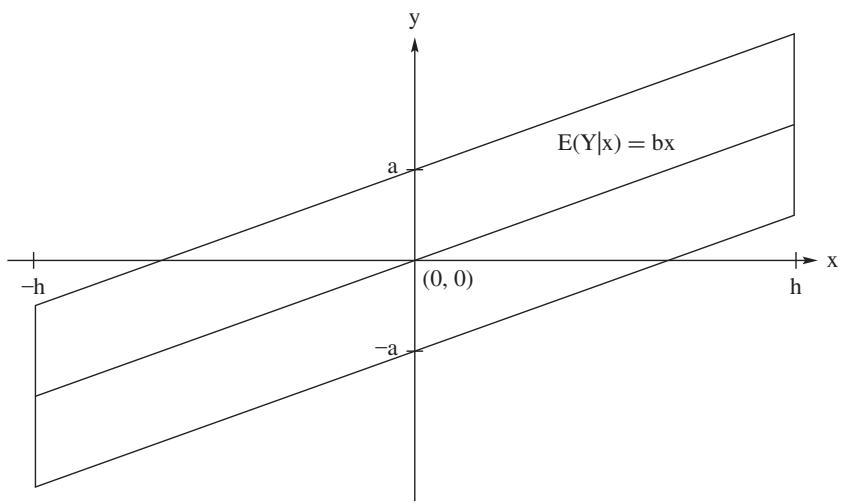  
Figure 2.5.1: Illustration for Example 2.5.5.

Example 2.5.5. To illustrate how the correlation coefficient measures the intensity of the concentration of the probability for $X$ and $Y$ about a line, let these random variables have a distribution that is uniform over the area depicted in Figure 2.5.1. That is, the joint pdf of $X$ and $Y$ is

$$
f (x, y) = \left\{ \begin{array}{l l} \frac {1}{4 a h} & - a + b x <   y <   a + b x, - h <   x <   h \\ 0 & \text {e l s e w h e r e .} \end{array} \right.
$$

We assume here that $b \geq 0$ , but the argument can be modified for $b \leq 0$ . It is easy to show that the pdf of $X$ is uniform, namely

$$
f _ {1} (x) = \left\{ \begin{array}{l l} \int_ {- a + b x} ^ {a + b x} \frac {1}{4 a h}   d y = \frac {1}{2 h} & - h <   x <   h \\ 0 & \text {e l s e w h e r e .} \end{array} \right.
$$

The conditional mean and variance are

$$
E (Y | x) = b x \quad \text {a n d} \quad \operatorname {v a r} (Y | x) = \frac {a ^ {2}}{3}.
$$

From the general expressions for those characteristics we know that

$$
b = \rho \frac {\sigma_ {2}}{\sigma_ {1}} \mathrm {a n d} \frac {a ^ {2}}{3} = \sigma_ {2} ^ {2} (1 - \rho^ {2}).
$$

Additionally, we know that $\sigma_1^2 = h^2 /3$ . If we solve these three equations, we obtain an expression for the correlation coefficient, namely

$$
\rho = \frac {b h}{\sqrt {a ^ {2} + b ^ {2} h ^ {2}}}.
$$

Referring to Figure 2.5.1, we note

1. As $a$ gets small (large), the straight-line effect is more (less) intense and $\rho$ is closer to 1 (0).   
2. As $h$ gets large (small), the straight-line effect is more (less) intense and $\rho$ is closer to 1 (0).   
3. As $b$ gets large (small), the straight-line effect is more (less) intense and $\rho$ is closer to 1 (0).

Recall that in Section 2.1 we introduced the mgf for the random vector $(X,Y)$ . As for random variables, the joint mgf also gives explicit formulas for certain moments. In the case of random variables of the continuous type,

$$
\frac {\partial^ {k + m} M (t _ {1} , t _ {2})}{\partial t _ {1} ^ {k} \partial t _ {2} ^ {m}} = \int_ {- \infty} ^ {\infty} \int_ {- \infty} ^ {\infty} x ^ {k} y ^ {m} e ^ {t _ {1} x + t _ {2} y} f (x, y) d x d y,
$$

so that

$$
\frac {\partial^ {k + m} M (t _ {1} , t _ {2})}{\partial t _ {1} ^ {k} \partial t _ {2} ^ {m}} \Bigg | _ {t _ {1} = t _ {2} = 0} = \int_ {- \infty} ^ {\infty} \int_ {- \infty} ^ {\infty} x ^ {k} y ^ {m} f (x, y) d x d y = E (X ^ {k} Y ^ {m}).
$$

For instance, in a simplified notation that appears to be clear,

$$
\mu_ {1} = E (X) = \frac {\partial M (0 , 0)}{\partial t _ {1}}
$$

$$
\mu_ {2} = E (Y) = \frac {\partial M (0 , 0)}{\partial t _ {2}}
$$

$$
\sigma_ {1} ^ {2} = E (X ^ {2}) - \mu_ {1} ^ {2} = \frac {\partial^ {2} M (0 , 0)}{\partial t _ {1} ^ {2}} - \mu_ {1} ^ {2}
$$

$$
\sigma_ {2} ^ {2} = E (Y ^ {2}) - \mu_ {2} ^ {2} = \frac {\partial^ {2} M (0 , 0)}{\partial t _ {2} ^ {2}} - \mu_ {2} ^ {2}
$$

$$
E \left[ \left(X - \mu_ {1}\right) \left(Y - \mu_ {2}\right) \right] = \frac {\partial^ {2} M (0 , 0)}{\partial t _ {1} \partial t _ {2}} - \mu_ {1} \mu_ {2}, \tag {2.5.10}
$$

and from these we can compute the correlation coefficient $\rho$ .

It is fairly obvious that the results of equations (2.5.10) hold if $X$ and $Y$ are random variables of the discrete type. Thus the correlation coefficients may be computed by using the mgf of the joint distribution if that function is readily available. An illustrative example follows.

Example 2.5.6 (Example 2.1.10, Continued). In Example 2.1.10, we considered the joint density

$$
f (x, y) = \left\{ \begin{array}{l l} e ^ {- y} & 0 <   x <   y <   \infty \\ 0 & \text {e l s e w h e r e ,} \end{array} \right.
$$

and showed that the mgf was

$$
M (t _ {1}, t _ {2}) = \frac {1}{(1 - t _ {1} - t _ {2}) (1 - t _ {2})},
$$

for $t_1 + t_2 < 1$ and $t_2 < 1$ . For this distribution, equations (2.5.10) become

$$
\mu_ {1} = 1, \quad \mu_ {2} = 2
$$

$$
\sigma_ {1} ^ {2} = 1, \quad \sigma_ {2} ^ {2} = 2 \tag {2.5.11}
$$

$$
E \left[ \left(X - \mu_ {1}\right) \left(Y - \mu_ {2}\right) \right] = 1.
$$

Verification of (2.5.11) is left as an exercise; see Exercise 2.5.5. If, momentarily, we accept these results, the correlation coefficient of $X$ and $Y$ is $\rho = 1 / \sqrt{2}$ .

# EXERCISES

2.5.1. Let the random variables $X$ and $Y$ have the joint pmf

(a) $p(x,y) = \frac{1}{3}$ , $(x,y) = (0,0)$ , $(1,1)$ , $(2,2)$ , zero elsewhere.   
(b) $p(x,y) = \frac{1}{3}$ , $(x,y) = (0,2)$ , $(1,1)$ , $(2,0)$ , zero elsewhere.   
(c) $p(x,y) = \frac{1}{3}$ , $(x,y) = (0,0)$ , $(1,1)$ , $(2,0)$ , zero elsewhere.

In each case compute the correlation coefficient of $X$ and $Y$ .

2.5.2. Let $X$ and $Y$ have the joint pmf described as follows:

<table><tr><td>(x,y)</td><td>(1,1)</td><td>(1,2)</td><td>(1,3)</td><td>(2,1)</td><td>(2,2)</td><td>(2,3)</td></tr><tr><td>p(x,y)</td><td>2/15</td><td>4/15</td><td>3/15</td><td>1/15</td><td>1/15</td><td>4/15</td></tr></table>

and $p(x,y)$ is equal to zero elsewhere.

(a) Find the means $\mu_{1}$ and $\mu_{2}$ , the variances $\sigma_1^2$ and $\sigma_2^2$ , and the correlation coefficient $\rho$ .   
(b) Compute $E(Y|X = 1)$ , $E(Y|X = 2)$ , and the line $\mu_2 + \rho(\sigma_2 / \sigma_1)(x - \mu_1)$ . Do the points $[k, E(Y|X = k)]$ , $k = 1, 2$ , lie on this line?

2.5.3. Let $f(x,y) = 2$ , $0 < x < y$ , $0 < y < 1$ , zero elsewhere, be the joint pdf of $X$ and $Y$ . Show that the conditional means are, respectively, $(1 + x) / 2$ , $0 < x < 1$ , and $y / 2$ , $0 < y < 1$ . Show that the correlation coefficient of $X$ and $Y$ is $\rho = \frac{1}{2}$ .   
2.5.4. Show that the variance of the conditional distribution of $Y$ , given $X = x$ , in Exercise 2.5.3, is $(1 - x)^{2} / 12$ , $0 < x < 1$ , and that the variance of the conditional distribution of $X$ , given $Y = y$ , is $y^{2} / 12$ , $0 < y < 1$ .   
2.5.5. Verify the results of equations (2.5.11) of this section.   
2.5.6. Let $X$ and $Y$ have the joint pdf $f(x, y) = 1$ , $-x < y < x$ , $0 < x < 1$ , zero elsewhere. Show that, on the set of positive probability density, the graph of $E(Y|x)$ is a straight line, whereas that of $E(X|y)$ is not a straight line.   
2.5.7. In the proof of Theorem 2.5.1, consider the case when the discriminant of the polynomial $h(v)$ is 0. Show that this is equivalent to $\rho = \pm 1$ . Consider the case when $\rho = 1$ . Find the unique root of $h(v)$ and then use the fact that $h(v)$ is 0 at this root to show that $Y$ is a linear function of $X$ with probability 1.   
2.5.8. Let $\psi(t_1, t_2) = \log M(t_1, t_2)$ , where $M(t_1, t_2)$ is the mgf of $X$ and $Y$ . Show that

$$
\frac {\partial \psi (0 , 0)}{\partial t _ {i}}, \quad \frac {\partial^ {2} \psi (0 , 0)}{\partial t _ {i} ^ {2}}, \quad i = 1, 2,
$$

and

$$
\frac {\partial^ {2} \psi (0 , 0)}{\partial t _ {1} \partial t _ {2}}
$$

yield the means, the variances, and the covariance of the two random variables. Use this result to find the means, the variances, and the covariance of $X$ and $Y$ of Example 2.5.6.

2.5.9. Let $X$ and $Y$ have the joint pmf $p(x,y) = \frac{1}{7}$ , $(0,0)$ , $(1,0)$ , $(0,1)$ , $(1,1)$ , $(2,1)$ , $(1,2)$ , $(2,2)$ , zero elsewhere. Find the correlation coefficient $\rho$ .   
2.5.10. Let $X_{1}$ and $X_{2}$ have the joint pmf described by the following table:

<table><tr><td>(x1,x2)</td><td>(0,0)</td><td>(0,1)</td><td>(0,2)</td><td>(1,1)</td><td>(1,2)</td><td>(2,2)</td></tr><tr><td>p(x1,x2)</td><td>1/12</td><td>2/12</td><td>1/12</td><td>3/12</td><td>4/12</td><td>1/12</td></tr></table>

Find $p_1(x_1), p_2(x_2), \mu_1, \mu_2, \sigma_1^2, \sigma_2^2$ , and $\rho$ .

2.5.11. Let $\sigma_1^2 = \sigma_2^2 = \sigma^2$ be the common variance of $X_{1}$ and $X_{2}$ and let $\rho$ be the correlation coefficient of $X_{1}$ and $X_{2}$ . Show for $k > 0$ that

$$
P [ | (X _ {1} - \mu_ {1}) + (X _ {2} - \mu_ {2}) | \geq k \sigma ] \leq \frac {2 (1 + \rho)}{k ^ {2}}.
$$

# 2.6 Extension to Several Random Variables

The notions about two random variables can be extended immediately to $n$ random variables. We make the following definition of the space of $n$ random variables.

Definition 2.6.1. Consider a random experiment with the sample space $\mathcal{C}$ . Let the random variable $X_{i}$ assign to each element $c\in \mathcal{C}$ one and only one real number $X_{i}(c) = x_{i}$ , $i = 1,2,\ldots ,n$ . We say that $(X_{1},\dots,X_{n})$ is an $n$ -dimensional random vector. The space of this random vector is the set of ordered $n$ -tuples $\mathcal{D} = \{(x_1,x_2,\ldots ,x_n):x_1 = X_1(c),\ldots ,x_n = X_n(c),c\in \mathcal{C}\}$ . Furthermore, let $A$ be a subset of the space $\mathcal{D}$ . Then $P[(X_1,\ldots ,X_n)\in A] = P(C)$ , where $C = \{c:c\in \mathcal{C}$ and $(X_{1}(c),X_{2}(c),\ldots ,X_{n}(c))\in A\}$ .

In this section, we often use vector notation. We denote $(X_{1},\ldots ,X_{n})^{\prime}$ by the $n$ -dimensional column vector $\mathbf{X}$ and the observed values $(x_{1},\dots,x_{n})^{\prime}$ of the random variables by $\mathbf{x}$ . The joint cdf is defined to be

$$
F _ {\mathbf {X}} (\mathbf {x}) = P \left[ X _ {1} \leq x _ {1}, \dots , X _ {n} \leq x _ {n} \right]. \tag {2.6.1}
$$

We say that the $n$ random variables $X_{1}, X_{2}, \ldots, X_{n}$ are of the discrete type or of the continuous type and have a distribution of that type according to whether the joint cdf can be expressed as

$$
F _ {\mathbf {X}} (\mathbf {x}) = \sum_ {w _ {1} \leq x _ {1}, \dots , w _ {n} \leq x _ {n}} \dots \sum p (w _ {1}, \dots , w _ {n}),
$$

or as

$$
F _ {\mathbf {X}} (\mathbf {x}) = \int_ {- \infty} ^ {x _ {1}} \int_ {- \infty} ^ {x _ {2}} \dots \int_ {- \infty} ^ {x _ {n}} f (w _ {1}, \dots , w _ {n}) d w _ {n} \dots d w _ {1}.
$$

For the continuous case,

$$
\frac {\partial^ {n}}{\partial x _ {1} \cdots \partial x _ {n}} F _ {\mathbf {X}} (\mathbf {x}) = f (\mathbf {x}), \tag {2.6.2}
$$

except possibly on points that have probability zero.

In accordance with the convention of extending the definition of a joint pdf, it is seen that a continuous function $f$ essentially satisfies the conditions of being a pdf if (a) $f$ is defined and is nonnegative for all real values of its argument(s)

and (b) its integral over all real values of its argument(s) is 1. Likewise, a point function $p$ essentially satisfies the conditions of being a joint pmf if (a) $p$ is defined and is nonnegative for all real values of its argument(s) and (b) its sum over all real values of its argument(s) is 1. As in previous sections, it is sometimes convenient to speak of the support set of a random vector. For the discrete case, this would be all points in $\mathcal{D}$ that have positive mass, while for the continuous case these would be all points in $\mathcal{D}$ that can be embedded in an open set of positive probability. We use $S$ to denote support sets.

Example 2.6.1. Let

$$
f (x, y, z) = \left\{ \begin{array}{l l} e ^ {- (x + y + z)} & 0 <   x, y, z <   \infty \\ 0 & \text {e l s e w h e r e} \end{array} \right.
$$

be the pdf of the random variables $X, Y$ , and $Z$ . Then the distribution function of $X, Y$ , and $Z$ is given by

$$
\begin{array}{l} F (x, y, z) = P (X \leq x, Y \leq y, Z \leq z) \\ = \int_ {0} ^ {z} \int_ {0} ^ {y} \int_ {0} ^ {x} e ^ {- u - v - w} d u d v d w \\ = (1 - e ^ {- x}) \left(1 - e ^ {- y}\right) \left(1 - e ^ {- z}\right), \quad 0 \leq x, y, z <   \infty , \\ \end{array}
$$

and is equal to zero elsewhere. The relationship (2.6.2) can easily be verified.

Let $(X_{1},X_{2},\ldots ,X_{n})$ be a random vector and let $Y = u(X_{1},X_{2},\ldots ,X_{n})$ for some function $u$ . As in the bivariate case, the expected value of the random variable exists if the $n$ -fold integral

$$
\int_ {- \infty} ^ {\infty} \dots \int_ {- \infty} ^ {\infty} | u (x _ {1}, x _ {2}, \dots , x _ {n}) | f (x _ {1}, x _ {2}, \dots , x _ {n}) d x _ {1} d x _ {2} \dots d x _ {n}
$$

exists when the random variables are of the continuous type, or if the $n$ -fold sum

$$
\sum_ {x _ {n}} \dots \sum_ {x _ {1}} | u (x _ {1}, x _ {2}, \dots , x _ {n}) | p (x _ {1}, x _ {2}, \dots , x _ {n})
$$

exists when the random variables are of the discrete type. If the expected value of $Y$ exists, then its expectation is given by

$$
E (Y) = \int_ {- \infty} ^ {\infty} \dots \int_ {- \infty} ^ {\infty} u \left(x _ {1}, x _ {2}, \dots , x _ {n}\right) f \left(x _ {1}, x _ {2}, \dots , x _ {n}\right) d x _ {1} d x _ {2} \dots d x _ {n} \tag {2.6.3}
$$

for the continuous case, and by

$$
E (Y) = \sum_ {x _ {n}} \dots \sum_ {x _ {1}} u \left(x _ {1}, x _ {2}, \dots , x _ {n}\right) p \left(x _ {1}, x _ {2}, \dots , x _ {n}\right) \tag {2.6.4}
$$

for the discrete case. The properties of expectation discussed in Section 2.1 hold for the $n$ -dimensional case also. In particular, $E$ is a linear operator. That is, if

$Y_{j} = u_{j}(X_{1},\ldots ,X_{n})$ for $j = 1,\dots ,m$ and each $E(Y_{i})$ exists, then

$$
E \left[ \sum_ {j = 1} ^ {m} k _ {j} Y _ {j} \right] = \sum_ {j = 1} ^ {m} k _ {j} E \left[ Y _ {j} \right], \tag {2.6.5}
$$

where $k_{1},\ldots ,k_{m}$ are constants.

We next discuss the notions of marginal and conditional probability density functions from the point of view of $n$ random variables. All of the preceding definitions can be directly generalized to the case of $n$ variables in the following manner. Let the random variables $X_{1}, X_{2}, \ldots, X_{n}$ be of the continuous type with the joint pdf $f(x_{1}, x_{2}, \ldots, x_{n})$ . By an argument similar to the two-variable case, we have for every $b$ ,

$$
F _ {X _ {1}} (b) = P (X _ {1} \leq b) = \int_ {- \infty} ^ {b} f _ {1} (x _ {1}) d x _ {1},
$$

where $f_{1}(x_{1})$ is defined by the $(n - 1)$ -fold integral

$$
f _ {1} (x _ {1}) = \int_ {- \infty} ^ {\infty} \dots \int_ {- \infty} ^ {\infty} f (x _ {1}, x _ {2}, \dots , x _ {n}) d x _ {2} \dots d x _ {n}.
$$

Therefore, $f_{1}(x_{1})$ is the pdf of the random variable $X_{1}$ and $f_{1}(x_{1})$ is called the marginal pdf of $X_{1}$ . The marginal probability density functions $f_{2}(x_{2}),\ldots ,f_{n}(x_{n})$ of $X_{2},\ldots ,X_{n}$ , respectively, are similar $(n - 1)$ -fold integrals.

Up to this point, each marginal pdf has been a pdf of one random variable. It is convenient to extend this terminology to joint probability density functions, which we do now. Let $f(x_{1},x_{2},\ldots ,x_{n})$ be the joint pdf of the $n$ random variables $X_{1},X_{2},\ldots ,X_{n}$ , just as before. Now, however, take any group of $k < n$ of these random variables and find the joint pdf of them. This joint pdf is called the marginal pdf of this particular group of $k$ variables. To fix the ideas, take $n = 6$ , $k = 3$ , and let us select the group $X_{2},X_{4},X_{5}$ . Then the marginal pdf of $X_{2},X_{4},X_{5}$ is the joint pdf of this particular group of three variables, namely,

$$
\int_ {- \infty} ^ {\infty} \int_ {- \infty} ^ {\infty} \int_ {- \infty} ^ {\infty} f (x _ {1}, x _ {2}, x _ {3}, x _ {4}, x _ {5}, x _ {6}) d x _ {1} d x _ {3} d x _ {6},
$$

if the random variables are of the continuous type.

Next we extend the definition of a conditional pdf. Suppose $f_{1}(x_{1}) > 0$ . Then we define the symbol $f_{2,\dots,n|1}(x_2,\ldots ,x_n|x_1)$ by the relation

$$
f _ {2, \dots , n | 1} (x _ {2}, \dots , x _ {n} | x _ {1}) = \frac {f (x _ {1} , x _ {2} , \dots , x _ {n})}{f _ {1} (x _ {1})},
$$

and $f_{2,\ldots,n|1}(x_2,\ldots,x_n|x_1)$ is called the joint conditional pdf of $X_2,\ldots,X_n$ , given $X_1 = x_1$ . The joint conditional pdf of any $n-1$ random variables, say $X_1,\ldots,X_{i-1},X_{i+1},\ldots,X_n$ , given $X_i = x_i$ , is defined as the joint pdf of $X_1,\ldots,X_n$ divided by the marginal pdf $f_i(x_i)$ , provided that $f_i(x_i) > 0$ . More generally, the joint conditional pdf of $n-k$ of the random variables, for given values of the remaining $k$ variables, is defined as the joint pdf of the $n$ variables divided by the marginal

pdf of the particular group of $k$ variables, provided that the latter pdf is positive. We remark that there are many other conditional probability density functions; for instance, see Exercise 2.3.12.

Because a conditional pdf is the pdf of a certain number of random variables, the expectation of a function of these random variables has been defined. To emphasize the fact that a conditional pdf is under consideration, such expectations are called conditional expectations. For instance, the conditional expectation of $u(X_2, \ldots, X_n)$ , given $X_1 = x_1$ , is, for random variables of the continuous type, given by

$$
E [ u (X _ {2}, \dots , X _ {n}) | x _ {1} ] = \int_ {- \infty} ^ {\infty} \dots \int_ {- \infty} ^ {\infty} u (x _ {2}, \dots , x _ {n}) f _ {2, \dots , n | 1} (x _ {2}, \dots , x _ {n} | x _ {1}) d x _ {2} \dots d x _ {n}
$$

provided $f_{1}(x_{1}) > 0$ and the integral converges (absolutely). A useful random variable is given by $h(X_1) = E[u(X_2,\ldots ,X_n)|X_1])$ .

The above discussion of marginal and conditional distributions generalizes to random variables of the discrete type by using pmfs and summations instead of integrals.

Let the random variables $X_{1}, X_{2}, \ldots, X_{n}$ have the joint pdf $f(x_{1}, x_{2}, \ldots, x_{n})$ and the marginal probability density functions $f_{1}(x_{1}), f_{2}(x_{2}), \ldots, f_{n}(x_{n})$ , respectively. The definition of the independence of $X_{1}$ and $X_{2}$ is generalized to the mutual independence of $X_{1}, X_{2}, \ldots, X_{n}$ as follows: The random variables $X_{1}, X_{2}, \ldots, X_{n}$ are said to be mutually independent if and only if

$$
f (x _ {1}, x _ {2}, \dots , x _ {n}) \equiv f _ {1} (x _ {1}) f _ {2} (x _ {2}) \dots f _ {n} (x _ {n}),
$$

for the continuous case. In the discrete case, $X_{1}, X_{2}, \ldots, X_{n}$ are said to be mutually independent if and only if

$$
p (x _ {1}, x _ {2}, \dots , x _ {n}) \equiv p _ {1} (x _ {1}) p _ {2} (x _ {2}) \dots p _ {n} (x _ {n}).
$$

Suppose $X_{1},X_{2},\ldots ,X_{n}$ are mutually independent. Then

$$
\begin{array}{l} P \left(a _ {1} <   X _ {1} <   b _ {1}, a _ {2} <   X _ {2} <   b _ {2}, \dots , a _ {n} <   X _ {n} <   b _ {n}\right) \\ = P \left(a _ {1} <   X _ {1} <   b _ {1}\right) P \left(a _ {2} <   X _ {2} <   b _ {2}\right) \dots P \left(a _ {n} <   X _ {n} <   b _ {n}\right) \\ = \prod_ {i = 1} ^ {n} P \left(a _ {i} <   X _ {i} <   b _ {i}\right), \\ \end{array}
$$

where the symbol $\prod_{i=1}^{n} \varphi(i)$ is defined to be

$$
\prod_ {i = 1} ^ {n} \varphi (i) = \varphi (1) \varphi (2) \dots \varphi (n).
$$

The theorem that

$$
E [ u (X _ {1}) v (X _ {2}) ] = E [ u (X _ {1}) ] E [ v (X _ {2}) ]
$$

for independent random variables $X_{1}$ and $X_{2}$ becomes, for mutually independent random variables $X_{1}, X_{2}, \ldots, X_{n}$ ,

$$
E \left[ u _ {1} \left(X _ {1}\right) u _ {2} \left(X _ {2}\right) \dots u _ {n} \left(X _ {n}\right) \right] = E \left[ u _ {1} \left(X _ {1}\right) \right] E \left[ u _ {2} \left(X _ {2}\right) \right] \dots E \left[ u _ {n} \left(X _ {n}\right) \right],
$$

or

$$
E \left[ \prod_ {i = 1} ^ {n} u _ {i} \left(X _ {i}\right) \right] = \prod_ {i = 1} ^ {n} E \left[ u _ {i} \left(X _ {i}\right) \right].
$$

The moment-generating function (mgf) of the joint distribution of $n$ random variables $X_{1},X_{2},\ldots ,X_{n}$ is defined as follows. Suppose that

$$
E \left[ \exp \left(t _ {1} X _ {1} + t _ {2} X _ {2} + \dots + t _ {n} X _ {n}\right) \right]
$$

exists for $-h_i < t_i < h_i$ , $i = 1,2,\ldots,n$ , where each $h_i$ is positive. This expectation is denoted by $M(t_1,t_2,\dots,t_n)$ and it is called the mgf of the joint distribution of $X_1,\ldots,X_n$ (or simply the mgf of $X_1,\ldots,X_n$ ). As in the cases of one and two variables, this mgf is unique and uniquely determines the joint distribution of the $n$ variables (and hence all marginal distributions). For example, the mgf of the marginal distributions of $X_i$ is $M(0,\ldots,0,t_i,0,\ldots,0)$ , $i = 1,2,\ldots,n$ ; that of the marginal distribution of $X_i$ and $X_j$ is $M(0,\ldots,0,t_i,0,\ldots,0,t_j,0,\ldots,0)$ ; and so on. Theorem 2.4.5 of this chapter can be generalized, and the factorization

$$
M \left(t _ {1}, t _ {2}, \dots , t _ {n}\right) = \prod_ {i = 1} ^ {n} M (0, \dots , 0, t _ {i}, 0, \dots , 0) \tag {2.6.6}
$$

is a necessary and sufficient condition for the mutual independence of $X_{1}, X_{2}, \ldots, X_{n}$ . Note that we can write the joint mgf in vector notation as

$$
M (\mathbf {t}) = E [ \exp (\mathbf {t} ^ {\prime} \mathbf {X}) ], \quad \text {f o r} \mathbf {t} \in B \subset R ^ {n},
$$

where $B = \{\mathbf{t}: -h_i < t_i < h_i, i = 1, \dots, n\}$ .

The following is a theorem that proves useful in the sequel. It gives the mgf of a linear combination of independent random variables.

Theorem 2.6.1. Suppose $X_{1},X_{2},\ldots ,X_{n}$ are $n$ mutually independent random variables. Suppose, for all $i = 1,2,\dots ,n$ , $X_{i}$ has mgf $M_{i}(t)$ , for $-h_i < t < h_i$ , where $h_i > 0$ . Let $T = \sum_{i = 1}^{n}k_{i}X_{i}$ , where $k_{1},k_{2},\ldots ,k_{n}$ are constants. Then $T$ has the mgf given by

$$
M _ {T} (t) = \prod_ {i = 1} ^ {n} M _ {i} \left(k _ {i} t\right), \quad - \min  _ {i} \left\{h _ {i} \right\} <   t <   \min  _ {i} \left\{h _ {i} \right\}. \tag {2.6.7}
$$

Proof. Assume $t$ is in the interval $(-\min_i\{h_i\}, \min_i\{h_i\})$ . Then, by independence,

$$
\begin{array}{l} M _ {T} (t) = E \left[ e ^ {\sum_ {i = 1} ^ {n} t k _ {i} X _ {i}} \right] = E \left[ \prod_ {i = 1} ^ {n} e ^ {(t k _ {i}) X _ {i}} \right] \\ = \prod_ {i = 1} ^ {n} E \left[ e ^ {t k _ {i} X _ {i}} \right] = \prod_ {i = 1} ^ {n} M _ {i} (k _ {i} t), \\ \end{array}
$$

which completes the proof.

Example 2.6.2. Let $X_{1}, X_{2}$ , and $X_{3}$ be three mutually independent random variables and let each have the pdf

$$
f (x) = \left\{ \begin{array}{l l} 2 x & 0 <   x <   1 \\ 0 & \text {e l s e w h e r e .} \end{array} \right. \tag {2.6.8}
$$

The joint pdf of $X_{1}, X_{2}, X_{3}$ is $f(x_{1})f(x_{2})f(x_{3}) = 8x_{1}x_{2}x_{3}$ , $0 < x_{i} < 1$ , $i = 1, 2, 3$ , zero elsewhere. Then, for illustration, the expected value of $5X_{1}X_{2}^{3} + 3X_{2}X_{3}^{4}$ is

$$
\int_ {0} ^ {1} \int_ {0} ^ {1} \int_ {0} ^ {1} (5 x _ {1} x _ {2} ^ {3} + 3 x _ {2} x _ {3} ^ {4}) 8 x _ {1} x _ {2} x _ {3} d x _ {1} d x _ {2} d x _ {3} = 2.
$$

Let $Y$ be the maximum of $X_{1}, X_{2}$ , and $X_{3}$ . Then, for instance, we have

$$
\begin{array}{l} P (Y \leq \frac {1}{2}) = P (X _ {1} \leq \frac {1}{2}, X _ {2} \leq \frac {1}{2}, X _ {3} \leq \frac {1}{2}) \\ = \int_ {0} ^ {1 / 2} \int_ {0} ^ {1 / 2} \int_ {0} ^ {1 / 2} 8 x _ {1} x _ {2} x _ {3} d x _ {1} d x _ {2} d x _ {3} \\ = \left(\frac {1}{2}\right) ^ {6} = \frac {1}{6 4}. \\ \end{array}
$$

In a similar manner, we find that the cdf of $Y$ is

$$
G (y) = P (Y \leq y) = \left\{ \begin{array}{l l} 0 & y <   0 \\ y ^ {6} & 0 \leq y <   1 \\ 1 & 1 \leq y. \end{array} \right.
$$

Accordingly, the pdf of $Y$ is

$$
g (y) = \left\{ \begin{array}{l l} 6 y ^ {5} & 0 <   y <   1 \\ 0 & \text {e l s e w h e r e .} \end{array} \right.
$$

Remark 2.6.1. If $X_{1}, X_{2}$ , and $X_{3}$ are mutually independent, they are pairwise independent (that is, $X_{i}$ and $X_{j}$ , $i \neq j$ , where $i, j = 1, 2, 3$ , are independent). However, the following example, attributed to S. Bernstein, shows that pairwise independence does not necessarily imply mutual independence. Let $X_{1}, X_{2}$ , and $X_{3}$ have the joint pmf

$$
p (x _ {1}, x _ {2}, x _ {3}) = \left\{ \begin{array}{l l} \frac {1}{4} & (x _ {1}, x _ {2}, x _ {3}) \in \{(1, 0, 0), (0, 1, 0), (0, 0, 1), (1, 1, 1) \} \\ 0 & \text {e l s e w h e r e .} \end{array} \right.
$$

The joint pmf of $X_{i}$ and $X_{j}$ , $i \neq j$ , is

$$
p _ {i j} (x _ {i}, x _ {j}) = \left\{ \begin{array}{l l} \frac {1}{4} & (x _ {i}, x _ {j}) \in \{(0, 0), (1, 0), (0, 1), (1, 1) \} \\ 0 & \text {e l s e w h e r e ,} \end{array} \right.
$$

whereas the marginal pmf of $X_{i}$ is

$$
p _ {i} (x _ {i}) = \left\{ \begin{array}{l l} \frac {1}{2} & x _ {i} = 0, 1 \\ 0 & \mathrm {e l s e w h e r e .} \end{array} \right.
$$

Obviously, if $i \neq j$ , we have

$$
p _ {i j} \left(x _ {i}, x _ {j}\right) \equiv p _ {i} \left(x _ {i}\right) p _ {j} \left(x _ {j}\right),
$$

and thus $X_{i}$ and $X_{j}$ are independent. However,

$$
p (x _ {1}, x _ {2}, x _ {3}) \not \equiv p _ {1} (x _ {1}) p _ {2} (x _ {2}) p _ {3} (x _ {3}).
$$

Thus $X_{1},X_{2}$ , and $X_{3}$ are not mutually independent.

Unless there is a possible misunderstanding between mutual and pairwise independence, we usually drop the modifier mutual. Accordingly, using this practice in Example 2.6.2, we say that $X_{1}, X_{2}, X_{3}$ are independent random variables, meaning that they are mutually independent. Occasionally, for emphasis, we use mutually independent so that the reader is reminded that this is different from pairwise independence.

In addition, if several random variables are mutually independent and have the same distribution, we say that they are independent and identically distributed, which we abbreviate as iid. So the random variables in Example 2.6.2 are iid with the common pdf given in expression (2.6.8).

The following is a useful corollary to Theorem 2.6.1 for iid random variables. Its proof is asked for in Exercise 2.6.7.

Corollary 2.6.1. Suppose $X_1, X_2, \ldots, X_n$ are iid random variables with the common mgf $M(t)$ , for $-h < t < h$ , where $h > 0$ . Let $T = \sum_{i=1}^{n} X_i$ . Then $T$ has the mgf given by

$$
M _ {T} (t) = [ M (t) ] ^ {n}, \quad - h <   t <   h. \tag {2.6.9}
$$

# 2.6.1 *Multivariate Variance-Covariance Matrix

This section makes explicit use of matrix algebra and it is considered as an optional section.

In Section 2.5 we discussed the covariance between two random variables. In this section we want to extend this discussion to the $n$ -variate case. Let $\mathbf{X} = (X_1, \ldots, X_n)'$ be an $n$ -dimensional random vector. Recall that we defined $E(\mathbf{X}) = (E(X_1), \ldots, E(X_n))'$ , that is, the expectation of a random vector is just the vector of the expectations of its components. Now suppose $\mathbf{W}$ is an $m \times n$ matrix of random variables, say, $\mathbf{W} = [W_{ij}]$ for the random variables $W_{ij}$ , $1 \leq i \leq m$ and $1 \leq j \leq n$ . Note that we can always string out the matrix into an $mn \times 1$ random vector. Hence, we define the expectation of a random matrix

$$
E [ \mathbf {W} ] = [ E (W _ {i j}) ]. \tag {2.6.10}
$$

As the following theorem shows, the linearity of the expectation operator easily follows from this definition:

Theorem 2.6.2. Let $\mathbf{W}_1$ and $\mathbf{W}_2$ be $m \times n$ matrices of random variables, let $\mathbf{A}_1$ and $\mathbf{A}_2$ be $k \times m$ matrices of constants, and let $\mathbf{B}$ be an $n \times l$ matrix of constants.

Then

$$
E \left[ \mathbf {A} _ {1} \mathbf {W} _ {1} + \mathbf {A} _ {2} \mathbf {W} _ {2} \right] = \mathbf {A} _ {1} E \left[ \mathbf {W} _ {1} \right] + \mathbf {A} _ {2} E \left[ \mathbf {W} _ {2} \right] \tag {2.6.11}
$$

$$
E [ \mathbf {A} _ {1} \mathbf {W} _ {1} \mathbf {B} ] = \mathbf {A} _ {1} E [ \mathbf {W} _ {1} ] \mathbf {B}. \tag {2.6.12}
$$

Proof: Because of the linearity of the operator $E$ on random variables, we have for the $(i,j)$ th components of expression (2.6.11) that

$$
E \left[ \sum_ {s = 1} ^ {m} a _ {1 i s} W _ {1 s j} + \sum_ {s = 1} ^ {m} a _ {2 i s} W _ {2 s j} \right] = \sum_ {s = 1} ^ {m} a _ {1 i s} E [ W _ {1 s j} ] + \sum_ {s = 1} ^ {m} a _ {2 i s} E [ W _ {2 s j} ].
$$

Hence by (2.6.10), expression (2.6.11) is true. The derivation of expression (2.6.12) follows in the same manner.

Let $\mathbf{X} = (X_{1},\ldots ,X_{n})^{\prime}$ be an $n$ -dimensional random vector, such that $\sigma_i^2 = \mathrm{Var}(X_i) < \infty$ . The mean of $\mathbf{X}$ is $\pmb {\mu} = E[\mathbf{X}]$ and we define its variance-covariance matrix as

$$
\operatorname {C o v} (\mathbf {X}) = E \left[ (\mathbf {X} - \boldsymbol {\mu}) (\mathbf {X} - \boldsymbol {\mu}) ^ {\prime} \right] = \left[ \sigma_ {i j} \right], \tag {2.6.13}
$$

where $\sigma_{ii}$ denotes $\sigma_i^2$ . As Exercise 2.6.8 shows, the $i$ th diagonal entry of $\operatorname{Cov}(\mathbf{X})$ is $\sigma_i^2 = \operatorname{Var}(X_i)$ and the $(i,j)$ th off-diagonal entry is $\operatorname{Cov}(X_i,X_j)$ .

Example 2.6.3 (Example 2.5.6, Continued). In Example 2.5.6, we considered the joint pdf

$$
f (x, y) = \left\{ \begin{array}{l l} e ^ {- y} & 0 <   x <   y <   \infty \\ 0 & \text {e l s e w h e r e ,} \end{array} \right.
$$

and showed that the first two moments are

$$
\mu_ {1} = 1, \quad \mu_ {2} = 2
$$

$$
\sigma_ {1} ^ {2} = 1, \quad \sigma_ {2} ^ {2} = 2 \tag {2.6.14}
$$

$$
E \left[ \left(X - \mu_ {1}\right) \left(Y - \mu_ {2}\right) \right] = 1.
$$

Let $\mathbf{Z} = (X,Y)'$ . Then using the present notation, we have

$$
E [ \mathbf {Z} ] = \left[ \begin{array}{c} 1 \\ 2 \end{array} \right] \text {a n d} \operatorname {C o v} (\mathbf {Z}) = \left[ \begin{array}{c c} 1 & 1 \\ 1 & 2 \end{array} \right].
$$

Two properties of $\operatorname{Cov}(X_i, X_j)$ needed later are summarized in the following theorem:

Theorem 2.6.3. Let $\mathbf{X} = (X_1, \ldots, X_n)'$ be an $n$ -dimensional random vector, such that $\sigma_i^2 = \sigma_{ii} = \operatorname{Var}(X_i) < \infty$ . Let $\mathbf{A}$ be an $m \times n$ matrix of constants. Then

$$
C o v (\mathbf {X}) = E \left[ \mathbf {X} \mathbf {X} ^ {\prime} \right] - \boldsymbol {\mu} \boldsymbol {\mu} ^ {\prime} \tag {2.6.15}
$$

$$
C o v (\mathbf {A X}) = \mathbf {A} C o v (\mathbf {X}) \mathbf {A} ^ {\prime}. \tag {2.6.16}
$$

Proof: Use Theorem 2.6.2 to derive (2.6.15); i.e.,

$$
\begin{array}{l} \operatorname {C o v} (\mathbf {X}) = E \left[ (\mathbf {X} - \boldsymbol {\mu}) (\mathbf {X} - \boldsymbol {\mu}) ^ {\prime} \right] \\ = E \left[ \mathbf {X} \mathbf {X} ^ {\prime} - \mu \mathbf {X} ^ {\prime} - \mathbf {X} \mu^ {\prime} + \mu \mu^ {\prime} \right] \\ = E \left[ \mathbf {X} \mathbf {X} ^ {\prime} \right] - \mu E \left[ \mathbf {X} ^ {\prime} \right] - E [ \mathbf {X} ] \boldsymbol {\mu} ^ {\prime} + \mu \boldsymbol {\mu} ^ {\prime}, \\ \end{array}
$$

which is the desired result. The proof of (2.6.16) is left as an exercise.

All variance-covariance matrices are positive semi-definite matrices; that is, $\mathbf{a}'\mathrm{Cov}(\mathbf{X})\mathbf{a}\geq 0$ , for all vectors $\mathbf{a}\in R^n$ . To see this let $\mathbf{X}$ be a random vector and let $\mathbf{a}$ be any $n\times 1$ vector of constants. Then $Y = \mathbf{a}'\mathbf{X}$ is a random variable and, hence, has nonnegative variance; i.e.,

$$
0 \leq \operatorname {V a r} (Y) = \operatorname {V a r} \left(\mathbf {a} ^ {\prime} \mathbf {X}\right) = \mathbf {a} ^ {\prime} \operatorname {C o v} (\mathbf {X}) \mathbf {a}; \tag {2.6.17}
$$

hence, $\operatorname {Cov}(\mathbf{X})$ is positive semi-definite.

# EXERCISES

2.6.1. Let $X, Y, Z$ have joint pdf $f(x, y, z) = 2(x + y + z) / 3$ , $0 < x < 1$ , $0 < y < 1$ , $0 < z < 1$ , zero elsewhere.

(a) Find the marginal probability density functions of $X, Y$ , and $Z$ .   
(b) Compute $P(0 < X < \frac{1}{2}, 0 < Y < \frac{1}{2}, 0 < Z < \frac{1}{2})$ and $P(0 < X < \frac{1}{2}) = P(0 < Y < \frac{1}{2}) = P(0 < Z < \frac{1}{2})$ .   
(c) Are $X, Y$ , and $Z$ independent?   
(d) Calculate $E(X^{2}YZ + 3XY^{4}Z^{2})$ .   
(e) Determine the cdf of $X, Y$ , and $Z$ .   
(f) Find the conditional distribution of $X$ and $Y$ , given $Z = z$ , and evaluate $E(X + Y|z)$ .   
(g) Determine the conditional distribution of $X$ , given $Y = y$ and $Z = z$ , and compute $E(X|y,z)$ .

2.6.2. Let $f(x_{1},x_{2},x_{3}) = \exp [-(x_{1} + x_{2} + x_{3})]$ , $0 < x_{1} < \infty$ , $0 < x_{2} < \infty$ , $0 < x_{3} < \infty$ , zero elsewhere, be the joint pdf of $X_{1}$ , $X_{2}$ , $X_{3}$ .

(a) Compute $P(X_{1} < X_{2} < X_{3})$ and $P(X_{1} = X_{2} < X_{3})$ .   
(b) Determine the joint mgf of $X_{1}, X_{2}$ , and $X_{3}$ . Are these random variables independent?

2.6.3. Let $X_{1}, X_{2}, X_{3}$ , and $X_{4}$ be four independent random variables, each with pdf $f(x) = 3(1 - x)^{2}$ , $0 < x < 1$ , zero elsewhere. If $Y$ is the minimum of these four variables, find the cdf and the pdf of $Y$ .

Hint: $P(Y > y) = P(X_{i} > y, i = 1, \dots, 4)$ .

2.6.4. A fair die is cast at random three independent times. Let the random variable $X_{i}$ be equal to the number of spots that appear on the $i$ th trial, $i = 1, 2, 3$ . Let the random variable $Y$ be equal to $\max(X_{i})$ . Find the cdf and the pmf of $Y$ .

Hint: $P(Y \leq y) = P(X_{i} \leq y, i = 1,2,3)$ .

2.6.5. Let $M(t_{1}, t_{2}, t_{3})$ be the mgf of the random variables $X_{1}, X_{2}$ , and $X_{3}$ of Bernstein's example, described in the remark following Example 2.6.2. Show that

$$
M \left(t _ {1}, t _ {2}, 0\right) = M \left(t _ {1}, 0, 0\right) M \left(0, t _ {2}, 0\right), M \left(t _ {1}, 0, t _ {3}\right) = M \left(t _ {1}, 0, 0\right) M \left(0, 0, t _ {3}\right),
$$

and

$$
M (0, t _ {2}, t _ {3}) = M (0, t _ {2}, 0) M (0, 0, t _ {3})
$$

are true, but that

$$
M (t _ {1}, t _ {2}, t _ {3}) \neq M (t _ {1}, 0, 0) M (0, t _ {2}, 0) M (0, 0, t _ {3}).
$$

Thus $X_{1}, X_{2}, X_{3}$ are pairwise independent but not mutually independent.

2.6.6. Let $X_{1}, X_{2}$ , and $X_{3}$ be three random variables with means, variances, and correlation coefficients, denoted by $\mu_{1}, \mu_{2}, \mu_{3}; \sigma_{1}^{2}, \sigma_{2}^{2}, \sigma_{3}^{2}$ ; and $\rho_{12}, \rho_{13}, \rho_{23}$ , respectively. For constants $b_{2}$ and $b_{3}$ , suppose $E(X_{1} - \mu_{1}|x_{2}, x_{3}) = b_{2}(x_{2} - \mu_{2}) + b_{3}(x_{3} - \mu_{3})$ . Determine $b_{2}$ and $b_{3}$ in terms of the variances and the correlation coefficients.

2.6.7. Prove Corollary 2.6.1.

2.6.8. Let $\mathbf{X} = (X_1, \ldots, X_n)'$ be an $n$ -dimensional random vector, with the variance-covariance matrix given in display (2.6.13). Show that the $i$ th diagonal entry of $\operatorname{Cov}(\mathbf{X})$ is $\sigma_i^2 = \operatorname{Var}(X_i)$ and that the $(i,j)$ th off-diagonal entry is $\operatorname{Cov}(X_i, X_j)$ .

2.6.9. Let $X_{1}, X_{2}, X_{3}$ be iid with common pdf $f(x) = \exp(-x)$ , $0 < x < \infty$ , zero elsewhere. Evaluate:

(a) $P(X_{1} < X_{2}|X_{1} < 2X_{2})$   
(b) $P(X_{1} < X_{2} < X_{3}|X_{3} < 1)$

# 2.7 Transformations for Several Random Variables

In Section 2.2 it was seen that the determination of the joint pdf of two functions of two random variables of the continuous type was essentially a corollary to a theorem in analysis having to do with the change of variables in a twofold integral. This theorem has a natural extension to $n$ -fold integrals. This extension is as follows. Consider an integral of the form

$$
\int \dots \int_ {A} f (x _ {1}, x _ {2}, \dots , x _ {n}) d x _ {1} d x _ {2} \dots d x _ {n}
$$

taken over a subset $A$ of an $n$ -dimensional space $\mathcal{S}$ . Let

$$
y _ {1} = u _ {1} \left(x _ {1}, x _ {2}, \dots , x _ {n}\right), \quad y _ {2} = u _ {2} \left(x _ {1}, x _ {2}, \dots , x _ {n}\right), \dots , y _ {n} = u _ {n} \left(x _ {1}, x _ {2}, \dots , x _ {n}\right),
$$

together with the inverse functions

$$
x _ {1} = w _ {1} (y _ {1}, y _ {2}, \ldots , y _ {n}), \quad x _ {2} = w _ {2} (y _ {1}, y _ {2}, \ldots , y _ {n}), \ldots , x _ {n} = w _ {n} (y _ {1}, y _ {2}, \ldots , y _ {n})
$$

define a one-to-one transformation that maps $\mathcal{S}$ onto $\mathcal{T}$ in the $y_{1}, y_{2}, \ldots, y_{n}$ space and, hence, maps the subset $A$ of $\mathcal{S}$ onto a subset $B$ of $\mathcal{T}$ . Let the first partial derivatives of the inverse functions be continuous and let the $n$ by $n$ determinant (called the Jacobian)

$$
J = \left| \begin{array}{c c c c} \frac {\partial x _ {1}}{\partial y _ {1}} & \frac {\partial x _ {1}}{\partial y _ {2}} & \dots & \frac {\partial x _ {1}}{\partial y _ {n}} \\ \frac {\partial x _ {2}}{\partial y _ {1}} & \frac {\partial x _ {2}}{\partial y _ {2}} & \dots & \frac {\partial x _ {2}}{\partial y _ {n}} \\ \vdots & \vdots & & \vdots \\ \frac {\partial x _ {n}}{\partial y _ {1}} & \frac {\partial x _ {n}}{\partial y _ {2}} & \dots & \frac {\partial x _ {n}}{\partial y _ {n}} \end{array} \right|
$$

not be identically zero in $\mathcal{T}$ . Then

$$
\begin{array}{l} \int \dots \int_ {A} f (x _ {1}, x _ {2}, \dots , x _ {n}) d x _ {1} d x _ {2} \dots d x _ {n} \\ = \int \dots \int_ {B} f \left[ w _ {1} \left(y _ {1}, \dots , y _ {n}\right), w _ {2} \left(y _ {1}, \dots , y _ {n}\right), \dots , w _ {n} \left(y _ {1}, \dots , y _ {n}\right) \right] | J | d y _ {1} d y _ {2} \dots d y _ {n}. \\ \end{array}
$$

Whenever the conditions of this theorem are satisfied, we can determine the joint pdf of $n$ functions of $n$ random variables. Appropriate changes of notation in Section 2.2 (to indicate $n$ -space as opposed to 2-space) are all that are needed to show that the joint pdf of the random variables $Y_{1} = u_{1}(X_{1},X_{2},\ldots ,X_{n})$ , ..., $Y_{n} = u_{n}(X_{1},X_{2},\ldots ,X_{n})$ , where the joint pdf of $X_{1},\ldots ,X_{n}$ is $f(x_{1},\ldots ,x_{n})$ , is given by

$$
g \left(y _ {1}, y _ {2}, \dots , y _ {n}\right) = f \left[ w _ {1} \left(y _ {1}, \dots , y _ {n}\right), \dots , w _ {n} \left(y _ {1}, \dots , y _ {n}\right) \right] | J |,
$$

where $(y_{1},y_{2},\ldots ,y_{n})\in T$ , and is zero elsewhere.

Example 2.7.1. Let $X_{1}, X_{2}, X_{3}$ have the joint pdf

$$
f \left(x _ {1}, x _ {2}, x _ {3}\right) = \left\{ \begin{array}{l l} 4 8 x _ {1} x _ {2} x _ {3} & 0 <   x _ {1} <   x _ {2} <   x _ {3} <   1 \\ 0 & \text {e l s e w h e r e .} \end{array} \right. \tag {2.7.1}
$$

If $Y_{1} = X_{1} / X_{2}$ , $Y_{2} = X_{2} / X_{3}$ , and $Y_{3} = X_{3}$ , then the inverse transformation is given by

$$
x _ {1} = y _ {1} y _ {2} y _ {3}, x _ {2} = y _ {2} y _ {3}, \text {a n d} x _ {3} = y _ {3}.
$$

The Jacobian is given by

$$
J = \left| \begin{array}{c c c} y _ {2} y _ {3} & y _ {1} y _ {3} & y _ {1} y _ {2} \\ 0 & y _ {3} & y _ {2} \\ 0 & 0 & 1 \end{array} \right| = y _ {2} y _ {3} ^ {2}.
$$

Moreover, inequalities defining the support are equivalent to

$$
0 <   y _ {1} y _ {2} y _ {3}, y _ {1} y _ {2} y _ {3} <   y _ {2} y _ {3}, y _ {2} y _ {3} <   y _ {3}, \text {a n d} y _ {3} <   1,
$$

which reduces to the support $\mathcal{T}$ of $Y_{1}, Y_{2}, Y_{3}$ of

$$
\mathcal {T} = \left\{\left(y _ {1}, y _ {2}, y _ {3}\right): 0 <   y _ {i} <   1, i = 1, 2, 3 \right\}.
$$

Hence the joint pdf of $Y_{1}, Y_{2}, Y_{3}$ is

$$
\begin{array}{l} g \left(y _ {1}, y _ {2}, y _ {3}\right) = 4 8 \left(y _ {1} y _ {2} y _ {3}\right) \left(y _ {2} y _ {3}\right) y _ {3} \left| y _ {2} y _ {3} ^ {2} \right| \\ = \left\{ \begin{array}{l l} 4 8 y _ {1} y _ {2} ^ {3} y _ {3} ^ {5} & 0 <   y _ {i} <   1, i = 1, 2, 3 \\ 0 & \text {e l s e w h e r e .} \end{array} \right. \tag {2.7.2} \\ \end{array}
$$

The marginal pdfs are

$$
\begin{array}{l} g _ {1} \left(y _ {1}\right) = 2 y _ {1}, 0 <   y _ {1} <   1, \text {z e r o e l s e w h e r e} \\ g _ {2} (y _ {2}) = 4 y _ {2} ^ {3}, 0 <   y _ {2} <   1, \text {z e r o e l s e w h e r e} \\ g _ {3} (y _ {3}) = 6 y _ {3} ^ {5}, 0 <   y _ {3} <   1, \text {z e r o e l s e w h e r e}. \\ \end{array}
$$

Because $g(y_{1},y_{2},y_{3}) = g_{1}(y_{1})g_{2}(y_{2})g_{3}(y_{3})$ , the random variables $Y_{1},Y_{2},Y_{3}$ are mutually independent.

Example 2.7.2. Let $X_{1}, X_{2}, X_{3}$ be iid with common pdf

$$
f (x) = \left\{ \begin{array}{l l} e ^ {- x} & 0 <   x <   \infty \\ 0 & \text {e l s e w h e r e .} \end{array} \right.
$$

Consequently, the joint pdf of $X_{1},X_{2},X_{3}$ is

$$
f _ {X _ {1}, X _ {2}, X _ {3}} (x _ {1}, x _ {2}, x _ {3}) = \left\{ \begin{array}{l l} e ^ {- \sum_ {i = 1} ^ {3} x _ {i}} & 0 <   x _ {i} <   \infty , i = 1, 2, 3 \\ 0 & \text {e l s e w h e r e .} \end{array} \right.
$$

Consider the random variables $Y_{1}, Y_{2}, Y_{3}$ defined by

$$
Y _ {1} = \frac {X _ {1}}{X _ {1} + X _ {2} + X _ {3}}, Y _ {2} = \frac {X _ {2}}{X _ {1} + X _ {2} + X _ {3}}, \text {a n d} Y _ {3} = X _ {1} + X _ {2} + X _ {3}.
$$

Hence, the inverse transformation is given by

$$
x _ {1} = y _ {1} y _ {3}, x _ {2} = y _ {2} y _ {3}, \text {a n d} x _ {3} = y _ {3} - y _ {1} y _ {3} - y _ {2} y _ {3},
$$

with the Jacobian

$$
J = \left| \begin{array}{c c c} y _ {3} & 0 & y _ {1} \\ 0 & y _ {3} & y _ {2} \\ - y _ {3} & - y _ {3} & 1 - y _ {1} - y _ {2} \end{array} \right| = y _ {3} ^ {2}.
$$

The support of $X_{1},X_{2},X_{3}$ maps onto

$$
0 <   y _ {1} y _ {3} <   \infty , 0 <   y _ {2} y _ {3} <   \infty , \text {a n d} 0 <   y _ {3} (1 - y _ {1} - y _ {2}) <   \infty ,
$$

which is equivalent to the support $\mathcal{T}$ given by

$$
\mathcal {T} = \left\{\left(y _ {1}, y _ {2}, y _ {3}\right): 0 <   y _ {1}, 0 <   y _ {2}, 0 <   1 - y _ {1} - y _ {2}, 0 <   y _ {3} <   \infty \right\}.
$$

Hence the joint pdf of $Y_{1}, Y_{2}, Y_{3}$ is

$$
g \left(y _ {1}, y _ {2}, y _ {3}\right) = y _ {3} ^ {2} e ^ {- y _ {3}}, \quad \left(y _ {1}, y _ {2}, y _ {3}\right) \in \mathcal {T}.
$$

The marginal pdf of $Y_{1}$ is

$$
g _ {1} \left(y _ {1}\right) = \int_ {0} ^ {1 - y _ {1}} \int_ {0} ^ {\infty} y _ {3} ^ {2} e ^ {- y _ {3}} d y _ {3} d y _ {2} = 2 \left(1 - y _ {1}\right), \quad 0 <   y _ {1} <   1,
$$

zero elsewhere. Likewise the marginal pdf of $Y_{2}$ is

$$
g _ {2} (y _ {2}) = 2 (1 - y _ {2}), \quad 0 <   y _ {2} <   1,
$$

zero elsewhere, while the pdf of $Y_{3}$ is

$$
g _ {3} \left(y _ {3}\right) = \int_ {0} ^ {1} \int_ {0} ^ {1 - y _ {1}} y _ {3} ^ {2} e ^ {- y _ {3}} d y _ {2} d y _ {1} = \frac {1}{2} y _ {3} ^ {2} e ^ {- y _ {3}}, 0 <   y _ {3} <   \infty ,
$$

zero elsewhere. Because $g(y_{1},y_{2},y_{3})\neq g_{1}(y_{1})g_{2}(y_{2})g_{3}(y_{3}),Y_{1},Y_{2},Y_{3}$ are dependent random variables.

Note, however, that the joint pdf of $Y_{1}$ and $Y_{3}$ is

$$
g _ {1 3} (y _ {1}, y _ {3}) = \int_ {0} ^ {1 - y _ {1}} y _ {3} ^ {2} e ^ {- y _ {3}} d y _ {2} = (1 - y _ {1}) y _ {3} ^ {2} e ^ {- y _ {3}}, \quad 0 <   y _ {1} <   1, 0 <   y _ {3} <   \infty ,
$$

zero elsewhere. Hence $Y_{1}$ and $Y_{3}$ are independent. In a similar manner, $Y_{2}$ and $Y_{3}$ are also independent. Because the joint pdf of $Y_{1}$ and $Y_{2}$ is

$$
g _ {1 2} (y _ {1}, y _ {2}) = \int_ {0} ^ {\infty} y _ {3} ^ {2} e ^ {- y _ {3}} d y _ {3} = 2, \quad 0 <   y _ {1}, 0 <   y _ {2}, y _ {1} + y _ {2} <   1,
$$

zero elsewhere, $Y_{1}$ and $Y_{2}$ are seen to be dependent.

We now consider some other problems that are encountered when transforming variables. Let $X$ have the Cauchy pdf

$$
f (x) = \frac {1}{\pi (1 + x ^ {2})}, - \infty <   x <   \infty ,
$$

and let $Y = X^2$ . We seek the pdf $g(y)$ of $Y$ . Consider the transformation $y = x^2$ . This transformation maps the space of $X$ , namely $S = \{x : -\infty < x < \infty\}$ , onto $\mathcal{T} = \{y : 0 \leq y < \infty\}$ . However, the transformation is not one-to-one. To each $y \in \mathcal{T}$ , with the exception of $y = 0$ , there correspond two points $x \in S$ . For example, if $y = 4$ , we may have either $x = 2$ or $x = -2$ . In such an instance, we represent $S$ as the union of two disjoint sets $A_1$ and $A_2$ such that $y = x^2$ defines a one-to-one transformation that maps each of $A_1$ and $A_2$ onto $\mathcal{T}$ . If we take $A_1$ to be $\{x : -\infty < x < 0\}$ and $A_2$ to be $\{x : 0 \leq x < \infty\}$ , we see that $A_1$ is mapped onto $\{y : 0 < y < \infty\}$ , whereas $A_2$ is mapped onto $\{y : 0 \leq y < \infty\}$ , and these sets are not the same. Our difficulty is caused by the fact that $x = 0$ is an element of $S$ . Why, then, do we not return to the Cauchy pdf and take

$f(0) = 0$ ? Then our new $\mathcal{S}$ is $\mathcal{S} = \{-\infty < x < \infty \text{ but } x \neq 0\}$ . We then take $A_1 = \{x : -\infty < x < 0\}$ and $A_2 = \{x : 0 < x < \infty\}$ . Thus $y = x^2$ , with the inverse $x = -\sqrt{y}$ , maps $A_1$ onto $\mathcal{T} = \{y : 0 < y < \infty\}$ and the transformation is one-to-one. Moreover, the transformation $y = x^2$ , with inverse $x = \sqrt{y}$ , maps $A_2$ onto $\mathcal{T} = \{y : 0 < y < \infty\}$ and the transformation is one-to-one. Consider the probability $P(Y \in B)$ , where $B \subset \mathcal{T}$ . Let $A_3 = \{x : x = -\sqrt{y}, y \in B\} \subset A_1$ and let $A_4 = \{x : x = \sqrt{y}, y \in B\} \subset A_2$ . Then $Y \in B$ when and only when $X \in A_3$ or $X \in A_4$ . Thus we have

$$
\begin{array}{l} P (Y \in B) = P (X \in A _ {3}) + P (X \in A _ {4}) \\ = \int_ {A _ {3}} f (x) d x + \int_ {A _ {4}} f (x) d x. \\ \end{array}
$$

In the first of these integrals, let $x = -\sqrt{y}$ . Thus the Jacobian, say $J_{1}$ , is $-1 / 2\sqrt{y}$ ; furthermore, the set $A_{3}$ is mapped onto $B$ . In the second integral let $x = \sqrt{y}$ . Thus the Jacobian, say $J_{2}$ , is $1 / 2\sqrt{y}$ ; furthermore, the set $A_{4}$ is also mapped onto $B$ . Finally,

$$
\begin{array}{l} P (Y \in B) = \int_ {B} f (- \sqrt {y}) \left| - \frac {1}{2 \sqrt {y}} \right| d y + \int_ {B} f (\sqrt {y}) \frac {1}{2 \sqrt {y}} d y \\ = \int_ {B} [ f (- \sqrt {y}) + f (\sqrt {y}) ] \frac {1}{2 \sqrt {y}} d y. \\ \end{array}
$$

Hence the pdf of $Y$ is given by

$$
g (y) = \frac {1}{2 \sqrt {y}} [ f (- \sqrt {y}) + f (\sqrt {y}) ], \quad y \in \mathcal {T}.
$$

With $f(x)$ the Cauchy pdf we have

$$
g (y) = \left\{ \begin{array}{l l} \frac {1}{\pi (1 + y) \sqrt {y}} & 0 <   y <   \infty \\ 0 & \text {e l s e w h e r e .} \end{array} \right.
$$

In the preceding discussion of a random variable of the continuous type, we had two inverse functions, $x = -\sqrt{y}$ and $x = \sqrt{y}$ . That is why we sought to partition $S$ (or a modification of $S$ ) into two disjoint subsets such that the transformation $y = x^2$ maps each onto the same $T$ . Had there been three inverse functions, we would have sought to partition $S$ (or a modified form of $S$ ) into three disjoint subsets, and so on. It is hoped that this detailed discussion makes the following paragraph easier to read.

Let $f(x_{1},x_{2},\ldots ,x_{n})$ be the joint pdf of $X_{1},X_{2},\ldots ,X_{n}$ , which are random variables of the continuous type. Let $S$ denote the $n$ -dimensional space where this joint pdf $f(x_{1},x_{2},\ldots ,x_{n}) > 0$ , and consider the transformation $y_{1} = u_{1}(x_{1},x_{2},\ldots ,x_{n})$ , $\dots ,y_{n} = u_{n}(x_{1},x_{2},\ldots ,x_{n})$ , which maps $S$ onto $T$ in the $y_{1},y_{2},\ldots ,y_{n}$ space. To each point of $S$ there corresponds, of course, only one point in $T$ ; but to a point in $T$ there may correspond more than one point in $S$ . That is, the transformation

may not be one-to-one. Suppose, however, that we can represent $\mathcal{S}$ as the union of a finite number, say $k$ , of mutually disjoint sets $A_{1}, A_{2}, \ldots, A_{k}$ so that

$$
y _ {1} = u _ {1} \left(x _ {1}, x _ {2}, \dots , x _ {n}\right), \dots , y _ {n} = u _ {n} \left(x _ {1}, x _ {2}, \dots , x _ {n}\right)
$$

define a one-to-one transformation of each $A_{i}$ onto $\mathcal{T}$ . Thus to each point in $\mathcal{T}$ there corresponds exactly one point in each of $A_{1}, A_{2}, \ldots, A_{k}$ . For $i = 1, \ldots, k$ , let

$$
x _ {1} = w _ {1 i} \left(y _ {1}, y _ {2}, \dots , y _ {n}\right), x _ {2} = w _ {2 i} \left(y _ {1}, y _ {2}, \dots , y _ {n}\right), \dots , x _ {n} = w _ {n i} \left(y _ {1}, y _ {2}, \dots , y _ {n}\right),
$$

denote the $k$ groups of $n$ inverse functions, one group for each of these $k$ transformations. Let the first partial derivatives be continuous and let each

$$
J _ {i} = \left| \begin{array}{c c c c} \frac {\partial w _ {1 i}}{\partial y _ {1}} & \frac {\partial w _ {1 i}}{\partial y _ {2}} & \dots & \frac {\partial w _ {1 i}}{\partial y _ {n}} \\ \frac {\partial w _ {2 i}}{\partial y _ {1}} & \frac {\partial w _ {2 i}}{\partial y _ {2}} & \dots & \frac {\partial w _ {2 i}}{\partial y _ {n}} \\ \vdots & \vdots & & \vdots \\ \frac {\partial w _ {n i}}{\partial y _ {1}} & \frac {\partial w _ {n i}}{\partial y _ {2}} & \dots & \frac {\partial w _ {n i}}{\partial y _ {n}} \end{array} \right|, \quad i = 1, 2, \ldots , k,
$$

be not identically equal to zero in $\mathcal{T}$ . Considering the probability of the union of $k$ mutually exclusive events and by applying the change-of-variable technique to the probability of each of these events, it can be seen that the joint pdf of $Y_{1} = u_{1}(X_{1},X_{2},\ldots ,X_{n})$ , $Y_{2} = u_{2}(X_{1},X_{2},\ldots ,X_{n}),\ldots ,Y_{n} = u_{n}(X_{1},X_{2},\ldots ,X_{n})$ , is given by

$$
g \left(y _ {1}, y _ {2}, \dots , y _ {n}\right) = \sum_ {i = 1} ^ {k} f \left[ w _ {1 i} \left(y _ {1}, \dots , y _ {n}\right), \dots , w _ {n i} \left(y _ {1}, \dots , y _ {n}\right) \right] \left| J _ {i} \right|,
$$

provided that $(y_{1},y_{2},\ldots ,y_{n})\in \mathcal{T}$ , and equals zero elsewhere. The pdf of any $Y_{i}$ say $Y_{1}$ , is then

$$
g _ {1} (y _ {1}) = \int_ {- \infty} ^ {\infty} \dots \int_ {- \infty} ^ {\infty} g (y _ {1}, y _ {2}, \dots , y _ {n}) d y _ {2} \dots d y _ {n}.
$$

Example 2.7.3. Let $X_{1}$ and $X_{2}$ have the joint pdf defined over the unit circle given by

$$
f (x _ {1}, x _ {2}) = \left\{ \begin{array}{l l} \frac {1}{\pi} & 0 <   x _ {1} ^ {2} + x _ {2} ^ {2} <   1 \\ 0 & \mathrm {e l s e w h e r e .} \end{array} \right.
$$

Let $Y_{1} = X_{1}^{2} + X_{2}^{2}$ and $Y_{2} = X_{1}^{2} / (X_{1}^{2} + X_{2}^{2})$ . Thus $y_{1}y_{2} = x_{1}^{2}$ and $x_{2}^{2} = y_{1}(1 - y_{2})$ . The support $\mathcal{S}$ maps onto $\mathcal{T} = \{(y_1,y_2):0 < y_i < 1,i = 1,2\}$ . For each ordered pair $(y_{1},y_{2})\in \mathcal{T}$ , there are four points in $\mathcal{S}$ , given by

$$
\begin{array}{l} \left(x _ {1}, x _ {2}\right) \quad \text {s u c h} \quad x _ {1} = \sqrt {y _ {1} y _ {2}} \text {a n d} x _ {2} = \sqrt {y _ {1} (1 - y _ {2})} \\ \left(x _ {1}, x _ {2}\right) \quad \text {s u c h} \quad \text {t h a t} \quad x _ {1} = \sqrt {y _ {1} y _ {2}} \text {a n d} x _ {2} = - \sqrt {y _ {1} (1 - y _ {2})} \\ \left(x _ {1}, x _ {2}\right) \quad \text {s u c h} \quad x _ {1} = - \sqrt {y _ {1} y _ {2}} \text {a n d} x _ {2} = \sqrt {y _ {1} (1 - y _ {2})} \\ \end{array}
$$

and $(x_{1},x_{2})$ such that $x_{1} = -\sqrt{y_{1}y_{2}}$ and $x_{2} = -\sqrt{y_{1}(1 - y_{2})}$

The value of the first Jacobian is

$$
\begin{array}{l} J _ {1} = \left| \begin{array}{c c} \frac {1}{2} \sqrt {y _ {2} / y _ {1}} & \frac {1}{2} \sqrt {y _ {1} / y _ {2}} \\ \frac {1}{2} \sqrt {(1 - y _ {2}) / y _ {1}} & - \frac {1}{2} \sqrt {y _ {1} / (1 - y _ {2})} \end{array} \right| \\ = \frac {1}{4} \left\{- \sqrt {\frac {1 - y _ {2}}{y _ {2}}} - \sqrt {\frac {y _ {2}}{1 - y _ {2}}} \right\} = - \frac {1}{4} \frac {1}{\sqrt {y _ {2} (1 - y _ {2})}}. \\ \end{array}
$$

It is easy to see that the absolute value of each of the four Jacobians equals $1 / 4\sqrt{y_2(1 - y_2)}$ . Hence, the joint pdf of $Y_{1}$ and $Y_{2}$ is the sum of four terms and can be written as

$$
g \left(y _ {1}, y _ {2}\right) = 4 \frac {1}{\pi} \frac {1}{4 \sqrt {y _ {2} \left(1 - y _ {2}\right)}} = \frac {1}{\pi \sqrt {y _ {2} \left(1 - y _ {2}\right)}}, \quad \left(y _ {1}, y _ {2}\right) \in \mathcal {T}.
$$

Thus $Y_{1}$ and $Y_{2}$ are independent random variables by Theorem 2.4.1.

Of course, as in the bivariate case, we can use the mgf technique by noting that if $Y = g(X_{1},X_{2},\ldots ,X_{n})$ is a function of the random variables, then the mgf of $Y$ is given by

$$
E \left(e ^ {t Y}\right) = \int_ {- \infty} ^ {\infty} \int_ {- \infty} ^ {\infty} \dots \int_ {- \infty} ^ {\infty} e ^ {t g (x _ {1}, x _ {2}, \ldots , x _ {n})} f (x _ {1}, x _ {2}, \ldots , x _ {n}) d x _ {1} d x _ {2} \dots d x _ {n},
$$

in the continuous case, where $f(x_{1},x_{2},\ldots ,x_{n})$ is the joint pdf. In the discrete case, summations replace the integrals. This procedure is particularly useful in cases in which we are dealing with linear functions of independent random variables.

Example 2.7.4 (Extension of Example 2.2.6). Let $X_{1}, X_{2}, X_{3}$ be independent random variables with joint pmf

$$
p (x _ {1}, x _ {2}, x _ {3}) = \left\{ \begin{array}{l l} \frac {\mu_ {1} ^ {x _ {1}} \mu_ {2} ^ {x _ {2}} \mu_ {3} ^ {x _ {3}} e ^ {- \mu_ {1} - \mu_ {2} - \mu_ {3}}}{x _ {1} ! x _ {2} ! x _ {3} !} & x _ {i} = 0, 1, 2, \ldots , i = 1, 2, 3 \\ 0 & \text {e l s e w h e r e .} \end{array} \right.
$$

If $Y = X_{1} + X_{2} + X_{3}$ , the mgf of $Y$ is

$$
\begin{array}{l} E \left(e ^ {t Y}\right) = E \left(e ^ {t \left(X _ {1} + X _ {2} + X _ {3}\right)}\right) \\ = E \left(e ^ {t X _ {1}} e ^ {t X _ {2}} e ^ {t X _ {3}}\right) \\ = E \left(e ^ {t X _ {1}}\right) E \left(e ^ {t X _ {2}}\right) E \left(e ^ {t X _ {3}}\right), \\ \end{array}
$$

because of the independence of $X_{1},X_{2},X_{3}$ . In Example 2.2.6, we found that

$$
E \left(e ^ {t X _ {i}}\right) = \exp \left\{\mu_ {i} \left(e ^ {t} - 1\right) \right\}, \quad i = 1, 2, 3.
$$

Hence,

$$
E \left(e ^ {t Y}\right) = \exp \left\{\left(\mu_ {1} + \mu_ {2} + \mu_ {3}\right) \left(e ^ {t} - 1\right) \right\}.
$$

This, however, is the mgf of the pmf

$$
p _ {Y} (y) = \left\{ \begin{array}{l l} \frac {(\mu_ {1} + \mu_ {2} + \mu_ {3}) ^ {y} e ^ {- (\mu_ {1} + \mu_ {2} + \mu_ {3})}}{y !} & y = 0, 1, 2 \ldots \\ 0 & \text {e l s e w h e r e ,} \end{array} \right.
$$

so $Y = X_{1} + X_{2} + X_{3}$ has this distribution.

Example 2.7.5. Let $X_{1}, X_{2}, X_{3}, X_{4}$ be independent random variables with common pdf

$$
f (x) = \left\{ \begin{array}{l l} e ^ {- x} & x > 0 \\ 0 & \text {e l s e w h e r e .} \end{array} \right.
$$

If $Y = X_{1} + X_{2} + X_{3} + X_{4}$ , then similar to the argument in the last example, the independence of $X_{1}, X_{2}, X_{3}, X_{4}$ implies that

$$
E \left(e ^ {t Y}\right) = E \left(e ^ {t X _ {1}}\right) E \left(e ^ {t X _ {2}}\right) E \left(e ^ {t X _ {3}}\right) E \left(e ^ {t X _ {4}}\right).
$$

In Section 1.9, we saw that

$$
E \left(e ^ {t X _ {i}}\right) = (1 - t) ^ {- 1}, \quad t <   1, i = 1, 2, 3, 4.
$$

Hence,

$$
E \left(e ^ {t Y}\right) = (1 - t) ^ {- 4}.
$$

In Section 3.3, we find that this is the mgf of a distribution with pdf

$$
f _ {Y} (y) = \left\{ \begin{array}{l l} \frac {1}{3 !} y ^ {3} e ^ {- y} & 0 <   y <   \infty \\ 0 & \text {e l s e w h e r e .} \end{array} \right.
$$

Accordingly, $Y$ has this distribution.

# EXERCISES

2.7.1. Let $X_{1}, X_{2}, X_{3}$ be iid, each with the distribution having pdf $f(x) = e^{-x}$ , $0 < x < \infty$ , zero elsewhere. Show that

$$
Y _ {1} = \frac {X _ {1}}{X _ {1} + X _ {2}}, Y _ {2} = \frac {X _ {1} + X _ {2}}{X _ {1} + X _ {2} + X _ {3}}, Y _ {3} = X _ {1} + X _ {2} + X _ {3}
$$

are mutually independent.

2.7.2. If $f(x) = \frac{1}{2}, -1 < x < 1$ , zero elsewhere, is the pdf of the random variable $X$ , find the pdf of $Y = X^2$ .   
2.7.3. If $X$ has the pdf of $f(x) = \frac{1}{4}$ , $-1 < x < 3$ , zero elsewhere, find the pdf of $Y = X^2$ .

Hint: Here $\mathcal{T} = \{y : 0 \leq y < 9\}$ and the event $Y \in B$ is the union of two mutually exclusive events if $B = \{y : 0 < y < 1\}$ .

2.7.4. Let $X_{1}, X_{2}, X_{3}$ be iid with common pdf $f(x) = e^{-x}$ , $x > 0$ , 0 elsewhere. Find the joint pdf of $Y_{1} = X_{1}$ , $Y_{2} = X_{1} + X_{2}$ , and $Y_{3} = X_{1} + X_{2} + X_{3}$ .

2.7.5. Let $X_{1}, X_{2}, X_{3}$ be iid with common pdf $f(x) = e^{-x}$ , $x > 0$ , 0 elsewhere. Find the joint pdf of $Y_{1} = X_{1} / X_{2}$ , $Y_{2} = X_{3} / (X_{1} + X_{2})$ , and $Y_{3} = X_{1} + X_{2}$ . Are $Y_{1}, Y_{2}, Y_{3}$ mutually independent?

2.7.6. Let $X_1, X_2$ have the joint pdf $f(x_1, x_2) = 1 / \pi$ , $0 < x_1^2 + x_2^2 < 1$ . Let $Y_1 = X_1^2 + X_2^2$ and $Y_2 = X_2$ . Find the joint pdf of $Y_1$ and $Y_2$ .

2.7.7. Let $X_{1}, X_{2}, X_{3}, X_{4}$ have the joint pdf $f(x_{1}, x_{2}, x_{3}, x_{4}) = 24$ , $0 < x_{1} < x_{2} < x_{3} < x_{4} < 1$ , 0 elsewhere. Find the joint pdf of $Y_{1} = X_{1} / X_{2}$ , $Y_{2} = X_{2} / X_{3}$ , $Y_{3} = X_{3} / X_{4}$ , $Y_{4} = X_{4}$ and show that they are mutually independent.

2.7.8. Let $X_{1}, X_{2}, X_{3}$ be iid with common mgf $M(t) = ((3/4) + (1/4)e^{t})^{2}$ , for all $t \in R$ .

(a) Determine the probabilities, $P(X_{1} = k), k = 0, 1, 2$ .   
(b) Find the mgf of $Y = X_{1} + X_{2} + X_{3}$ and then determine the probabilities, $P(Y = k), k = 0, 1, 2, \ldots, 6$ .

# 2.8 Linear Combinations of Random Variables

In this section, we summarize some results on linear combinations of random variables that follow from Section 2.6. These results will prove to be quite useful in Chapter 3 as well as in succeeding chapters.

Let $(X_{1},\ldots ,X_{n})^{\prime}$ denote a random vector. In this section, we consider linear combinations of these variables, writing them, generally, as

$$
T = \sum_ {i = 1} ^ {n} a _ {i} X _ {i}, \tag {2.8.1}
$$

for specified constants $a_1, \ldots, a_n$ . We obtain expressions for the mean and variance of $T$ .

The mean of $T$ follows immediately from linearity of expectation. For reference, we state it formally as a theorem.

Theorem 2.8.1. Suppose $T$ is given by expression (2.8.1). Suppose $E(X_{i}) - \mu_{i}$ , for $i = 1, \ldots, n$ . Then

$$
E (T) = \sum_ {i = 1} ^ {n} a _ {i} \mu_ {i}. \tag {2.8.2}
$$

In order to obtain the variance of $T$ , we first state a general result on covariances.

Theorem 2.8.2. Suppose $T$ is the linear combination (2.8.1) and that $W$ is another linear combination given by $W = \sum_{i=1}^{m} b_i Y_i$ , for random variables $Y_1, \ldots, Y_m$ and specified constants $b_1, \ldots, b_m$ . Let $T = \sum_{i=1}^{n} a_i X_i$ and let $W = \sum_{i=1}^{m} b_i Y_i$ . If $E[X_i^2] < \infty$ , and $E[Y_j^2] < \infty$ for $i = 1, \ldots, n$ and $j = 1, \ldots, m$ , then

$$
C o v (T, W) = \sum_ {i = 1} ^ {n} \sum_ {j = 1} ^ {m} a _ {i} b _ {j} C o v \left(X _ {i}, Y _ {j}\right). \tag {2.8.3}
$$

Proof: Using the definition of the covariance and Theorem 2.8.1, we have the first equality below, while the second equality follows from the linearity of $E$ :

$$
\begin{array}{l} \operatorname {C o v} (T, W) = E \left[ \sum_ {i = 1} ^ {n} \sum_ {j = 1} ^ {m} \left(a _ {i} X _ {i} - a _ {i} E \left(X _ {i}\right)\right) \left(b _ {j} Y _ {j} - b _ {j} E \left(Y _ {j}\right)\right) \right] \\ = \sum_ {i = 1} ^ {n} \sum_ {j = 1} ^ {m} a _ {i} b _ {j} E \left[ \left(X _ {i} - E \left(X _ {i}\right)\right) \left(Y _ {j} - E \left(Y _ {j}\right)\right) \right], \\ \end{array}
$$

which is the desired result.

To obtain the variance of $T$ , simply replace $W$ by $T$ in expression (2.8.3). We state the result as a corollary:

Corollary 2.8.1. Let $T = \sum_{i=1}^{n} a_i X_i$ . Provided $E[X_i^2] < \infty$ , for $i = 1, \ldots, n$

$$
\operatorname {V a r} (T) = \operatorname {C o v} (T, T) = \sum_ {i = 1} ^ {n} a _ {i} ^ {2} \operatorname {V a r} \left(X _ {i}\right) + 2 \sum_ {i <   j} a _ {i} a _ {j} \operatorname {C o v} \left(X _ {i}, X _ {j}\right). \tag {2.8.4}
$$

Note that if $X_{1},\ldots ,X_{n}$ are independent random variables, then by Theorem 2.5.2 all the pairwise covariances are 0; i.e., $\operatorname {Cov}(X_i,X_j) = 0$ for all $i\neq j$ . This leads to a simplification of (2.8.4), which we record in the following corollary.

Corollary 2.8.2. If $X_{1},\ldots ,X_{n}$ are independent random variables and $Var(X_{i}) = \sigma_{i}^{2}$ , for $i = 1,\dots ,n$ , then

$$
\operatorname {V a r} (T) = \sum_ {i = 1} ^ {n} a _ {i} ^ {2} \sigma_ {i} ^ {2}. \tag {2.8.5}
$$

Note that we need only $X_{i}$ and $X_{j}$ to be uncorrelated for all $i \neq j$ to obtain this result.

Next, in addition to independence, we assume that the random variables have the same distribution. We call such a collection of random variables a random sample which we now state in a formal definition.

Definition 2.8.1. If the random variables $X_{1}, X_{2}, \ldots, X_{n}$ are independent and identically distributed, i.e., each $X_{i}$ has the same distribution, then we say that these random variables constitute a random sample of size $n$ from that common distribution. We abbreviate independent and identically distributed by iid.

In the next two examples, we find some properties of two functions of a random sample, namely the sample mean and variance.

Example 2.8.1 (Sample Mean). Let $X_{1},\ldots ,X_{n}$ be independent and identically distributed random variables with common mean $\mu$ and variance $\sigma^2$ . The sample mean is defined by $\overline{X} = n^{-1}\sum_{i = 1}^{n}X_{i}$ . This is a linear combination of the sample observations with $a_{i}\equiv n^{-1}$ ; hence, by Theorem 2.8.1 and Corollary 2.8.2, we have

$$
E (\bar {X}) = \mu \text {a n d} \operatorname {V a r} (\bar {X}) = \frac {\sigma^ {2}}{n}. \tag {2.8.6}
$$

Because $E(\overline{X}) = \mu$ , we often say that $\overline{X}$ is unbiased for $\mu$ .

Example 2.8.2 (Sample Variance). Define the sample variance by

$$
S ^ {2} = (n - 1) ^ {- 1} \sum_ {i = 1} ^ {n} \left(X _ {i} - \bar {X}\right) ^ {2} = (n - 1) ^ {- 1} \left(\sum_ {i = 1} ^ {n} X _ {i} ^ {2} - n \bar {X} ^ {2}\right), \tag {2.8.7}
$$

where the second equality follows after some algebra; see Exercise 2.8.1.

In the average that defines the sample variance $S^2$ , the division is by $n - 1$ instead of $n$ . One reason for this is that it makes $S^2$ unbiased for $\sigma^2$ , as next shown. Using the above theorems, the results of the last example, and the facts that $E(X^2) = \sigma^2 + \mu^2$ and $E(\overline{X}^2) = (\sigma^2 / n) + \mu^2$ , we have the following:

$$
\begin{array}{l} E (S ^ {2}) = (n - 1) ^ {- 1} \left(\sum_ {i = 1} ^ {n} E \left(X _ {i} ^ {2}\right) - n E \left(\overline {{X}} ^ {2}\right)\right) \\ = (n - 1) ^ {- 1} \left\{n \sigma^ {2} + n \mu^ {2} - n \left[ \left(\sigma^ {2} / n\right) + \mu^ {2} \right] \right\} \\ = \sigma^ {2}. \tag {2.8.8} \\ \end{array}
$$

Hence, $S^2$ is unbiased for $\sigma^2$ .

# EXERCISES

2.8.1. Derive the second equality in expression (2.8.7).   
2.8.2. Let $X_{1}, X_{2}, X_{3}, X_{4}$ be four iid random variables having the same pdf $f(x) = 2x$ , $0 < x < 1$ , zero elsewhere. Find the mean and variance of the sum $Y$ of these four random variables.   
2.8.3. Let $X_{1}$ and $X_{2}$ be two independent random variables so that the variances of $X_{1}$ and $X_{2}$ are $\sigma_1^2 = k$ and $\sigma_2^2 = 2$ , respectively. Given that the variance of $Y = 3X_{2} - X_{1}$ is 25, find $k$ .   
2.8.4. If the independent variables $X_{1}$ and $X_{2}$ have means $\mu_{1}$ , $\mu_{2}$ and variances $\sigma_1^2$ , $\sigma_2^2$ , respectively, show that the mean and variance of the product $Y = X_{1}X_{2}$ are $\mu_{1}\mu_{2}$ and $\sigma_1^2\sigma_2^2 +\mu_1^2\sigma_2^2 +\mu_2^2\sigma_1^2$ , respectively.   
2.8.5. Find the mean and variance of the sum $Y = \sum_{i=1}^{5} X_i$ , where $X_1, \ldots, X_5$ are iid, having pdf $f(x) = 6x(1 - x)$ , $0 < x < 1$ , zero elsewhere.   
2.8.6. Determine the mean and variance of the sample mean $\overline{X} = 5^{-1}\sum_{i=1}^{5} X_i$ , where $X_1, \ldots, X_5$ is a random sample from a distribution having pdf $f(x) = 4x^3$ , $0 < x < 1$ , zero elsewhere.   
2.8.7. Let $X$ and $Y$ be random variables with $\mu_1 = 1$ , $\mu_2 = 4$ , $\sigma_1^2 = 4$ , $\sigma_2^2 = 6$ , $\rho = \frac{1}{2}$ . Find the mean and variance of the random variable $Z = 3X - 2Y$ .   
2.8.8. Let $X$ and $Y$ be independent random variables with means $\mu_1, \mu_2$ and variances $\sigma_1^2, \sigma_2^2$ . Determine the correlation coefficient of $X$ and $Z = X - Y$ in terms of $\mu_1, \mu_2, \sigma_1^2, \sigma_2^2$ .

2.8.9. Let $\mu$ and $\sigma^2$ denote the mean and variance of the random variable $X$ . Let $Y = c + bX$ , where $b$ and $c$ are real constants. Show that the mean and variance of $Y$ are, respectively, $c + b\mu$ and $b^2\sigma^2$ .

2.8.10. Determine the correlation coefficient of the random variables $X$ and $Y$ if $\operatorname{var}(X) = 4$ , $\operatorname{var}(Y) = 2$ , and $\operatorname{var}(X + 2Y) = 15$ .

2.8.11. Let $X$ and $Y$ be random variables with means $\mu_1, \mu_2$ ; variances $\sigma_1^2, \sigma_2^2$ ; and correlation coefficient $\rho$ . Show that the correlation coefficient of $W = aX + b$ , $a > 0$ , and $Z = cY + d$ , $c > 0$ , is $\rho$ .

2.8.12. A person rolls a die, tosses a coin, and draws a card from an ordinary deck. He receives $3 for each point up on the die, $10 for a head and $0 for a tail, and $1 for each spot on the card (jack = 11, queen = 12, king = 13). If we assume that the three random variables involved are independent and uniformly distributed, compute the mean and variance of the amount to be received.

2.8.13. Let $X_{1}$ and $X_{2}$ be independent random variables with nonzero variances. Find the correlation coefficient of $Y = X_{1}X_{2}$ and $X_{1}$ in terms of the means and variances of $X_{1}$ and $X_{2}$ .

2.8.14. Let $X_{1}$ and $X_{2}$ have a joint distribution with parameters $\mu_{1}, \mu_{2}, \sigma_{1}^{2}, \sigma_{2}^{2}$ , and $\rho$ . Find the correlation coefficient of the linear functions of $Y = a_{1}X_{1} + a_{2}X_{2}$ and $Z = b_{1}X_{1} + b_{2}X_{2}$ in terms of the real constants $a_{1}, a_{2}, b_{1}, b_{2}$ , and the parameters of the distribution.

2.8.15. Let $X_{1}, X_{2}$ , and $X_{3}$ be random variables with equal variances but with correlation coefficients $\rho_{12} = 0.3$ , $\rho_{13} = 0.5$ , and $\rho_{23} = 0.2$ . Find the correlation coefficient of the linear functions $Y = X_{1} + X_{2}$ and $Z = X_{2} + X_{3}$ .

2.8.16. Find the variance of the sum of 10 random variables if each has variance 5 and if each pair has correlation coefficient 0.5.

2.8.17. Let $X$ and $Y$ have the parameters $\mu_1, \mu_2, \sigma_1^2, \sigma_2^2$ , and $\rho$ . Show that the correlation coefficient of $X$ and $[Y - \rho (\sigma_2 / \sigma_1)X]$ is zero.

2.8.18. Let $S^2$ be the sample variance of a random sample from a distribution with variance $\sigma^2 > 0$ . Since $E(S^2) = \sigma^2$ , why isn't $E(S) = \sigma$ ?

Hint: Use Jensen's inequality to show that $E(S) < \sigma$ .

# Chapter 3

# Some Special Distributions

# 3.1 The Binomial and Related Distributions

In Chapter 1 we introduced the uniform distribution and the hypergeometric distribution. In this chapter we discuss some other important distributions of random variables frequently used in statistics. We begin with the binomial and related distributions.

A Bernoulli experiment is a random experiment, the outcome of which can be classified in but one of two mutually exclusive and exhaustive ways, for instance, success or failure (e.g., female or male, life or death, nondefective or defective). A sequence of Bernoulli trials occurs when a Bernoulli experiment is performed several independent times so that the probability of success, say $p$ , remains the same from trial to trial. That is, in such a sequence, we let $p$ denote the probability of success on each trial.

Let $X$ be a random variable associated with a Bernoulli trial by defining it as follows:

$$
X (\text {s u c c e s s}) = 1 \text {a n d} X (\text {f a i l u r e}) = 0.
$$

That is, the two outcomes, success and failure, are denoted by one and zero, respectively. The pmf of $X$ can be written as

$$
p (x) = p ^ {x} (1 - p) ^ {1 - x}, \quad x = 0, 1, \tag {3.1.1}
$$

and we say that $X$ has a Bernoulli distribution. The expected value of $X$ is

$$
\mu = E (X) = (0) (1 - p) + (1) (p) = p,
$$

and the variance of $X$ is

$$
\sigma^ {2} = \operatorname {v a r} (X) = p ^ {2} (1 - p) + (1 - p) ^ {2} p = p (1 - p).
$$

It follows that the standard deviation of $X$ is $\sigma = \sqrt{p(1 - p)}$ .

In a sequence of $n$ independent Bernoulli trials, where the probability of success remains constant, let $X_{i}$ denote the Bernoulli random variable associated with the

ith trial. An observed sequence of $n$ Bernoulli trials is then an $n$ -tuple of zeros and ones. In such a sequence of Bernoulli trials, we are often interested in the total number of successes and not in the order of their occurrence. If we let the random variable $X$ equal the number of observed successes in $n$ Bernoulli trials, the possible values of $X$ are $0, 1, 2, \ldots, n$ . If $x$ successes occur, where $x = 0, 1, 2, \ldots, n$ , then $n - x$ failures occur. The number of ways of selecting the $x$ positions for the $x$ successes in the $n$ trials is

$$
\left( \begin{array}{c} n \\ x \end{array} \right) = \frac {n !}{x ! (n - x) !}.
$$

Since the trials are independent and the probabilities of success and failure on each trial are, respectively, $p$ and $1 - p$ , the probability of each of these ways is $p^x (1 - p)^{n - x}$ . Thus the pmf of $X$ , say $p(x)$ , is the sum of the probabilities of these $\binom{n}{x}$ mutually exclusive events; that is,

$$
p (x) = \left\{ \begin{array}{l l} {\binom {n} {x}} p ^ {x} (1 - p) ^ {n - x} & x = 0, 1, 2, \dots , n \\ 0 & \text {e l s e w h e r e .} \end{array} \right. \tag {3.1.2}
$$

It is clear that $p(x) \geq 0$ . To verify that $p(x)$ sums to 1 over its range, recall the binomial series, expression (1.3.7) of Chapter 1, which is:

$$
(a + b) ^ {n} = \sum_ {x = 0} ^ {n} {\binom {n} {x}} b ^ {x} a ^ {n - x},
$$

for $n$ a positive integer. Thus,

$$
\begin{array}{l} \sum_ {x} p (x) = \sum_ {x = 0} ^ {n} \binom {n} {x} p ^ {x} (1 - p) ^ {n - x} \\ = \left[ (1 - p) + p \right] ^ {n} = 1. \\ \end{array}
$$

Therefore, $p(x)$ satisfies the conditions of being a pmf of a random variable $X$ of the discrete type. A random variable $X$ that has a pmf of the form of $p(x)$ is said to have a binomial distribution, and any such $p(x)$ is called a binomial pmf. A binomial distribution is denoted by the symbol $b(n,p)$ . The constants $n$ and $p$ are called the parameters of the binomial distribution.

Example 3.1.1 (Computation of Binomial Probabilities). Suppose we roll a fair six-sided die 3 times. What is the probability of getting exactly 2 sixes? For our notation, let $X$ be the number of sixes obtained in the 3 rolls. Then $X$ has a binomial distribution with $n = 3$ and $p = 1/6$ . Hence,

$$
P (X = 2) = p (2) = \binom {3} {2} \left(\frac {1}{6}\right) ^ {2} \left(\frac {5}{6}\right) ^ {1} = 0. 0 6 9 4 4.
$$

We can do this calculation with a hand calculator. Suppose, though, we want to determine the probability of at least 16 sixes in 60 rolls. Let $Y$ be the number of sixes in 60 rolls. Then our desired probability is given by the series

$$
P (Y \geq 1 6) = \sum_ {j = 1 6} ^ {6 0} \binom {6 0} {j} \left(\frac {1}{6}\right) ^ {j} \left(\frac {5}{6}\right) ^ {6 0 - j},
$$

which is not a simple calculation. Most statistical packages provide procedures to calculate binomial probabilities. In R, if $Y$ is $b(n,p)$ then the cdf of $Y$ is computed as $P(Y \leq y) = \text{pbinom}(y, n, p)$ . Hence, for our example, using R we compute the $P(Y \geq 16)$ as

$$
P (Y \geq 1 6) = 1 - P (Y \leq 1 5) = 1 - \operatorname {p b i n o m} (1 5, 6 0, 1 / 6) = 0. 0 3 3 8.
$$

The R function `dbinom` computes the pmf of a binomial distribution. For instance, to compute the probability that $Y = 11$ , we use the R code: `dbinom(11,60,1/6)`, which computes to 0.1246.

The mgf of a binomial distribution is easily obtained as follows:

$$
\begin{array}{l} M (t) = \sum_ {x} e ^ {t x} p (x) = \sum_ {x = 0} ^ {n} e ^ {t x} \binom {n} {x} p ^ {x} (1 - p) ^ {n - x} \\ = \sum_ {x = 0} ^ {n} \binom {n} {x} (p e ^ {t}) ^ {x} (1 - p) ^ {n - x} \\ = \left[ (1 - p) + p e ^ {t} \right] ^ {n} \\ \end{array}
$$

for all real values of $t$ . The mean $\mu$ and the variance $\sigma^2$ of $X$ may be computed from $M(t)$ . Since

$$
M ^ {\prime} (t) = n [ (1 - p) + p e ^ {t} ] ^ {n - 1} \left(p e ^ {t}\right)
$$

and

$$
M ^ {\prime \prime} (t) = n [ (1 - p) + p e ^ {t} ] ^ {n - 1} (p e ^ {t}) + n (n - 1) [ (1 - p) + p e ^ {t} ] ^ {n - 2} (p e ^ {t}) ^ {2},
$$

if follows that

$$
\mu = M ^ {\prime} (0) = n p
$$

and

$$
\sigma^ {2} = M ^ {\prime \prime} (0) - \mu^ {2} = n p + n (n - 1) p ^ {2} - (n p) ^ {2} = n p (1 - p).
$$

Suppose $Y$ has the $b(60,1/6)$ distribution as discussed in Example 3.1.1. Then $E(Y) = 60(1/6) = 10$ and $\operatorname{Var}(Y) = 60(1/6)(5/6) = 8.33$

Example 3.1.2. If the mgf of a random variable $X$ is

$$
M (t) = (\frac {2}{3} + \frac {1}{3} e ^ {t}) ^ {5},
$$

then $X$ has a binomial distribution with $n = 5$ and $p = \frac{1}{3}$ ; that is, the pmf of $X$ is

$$
p (x) = \left\{ \begin{array}{l l} {\binom {5} {x}}   \left(\frac {1}{3}\right) ^ {x}   \left(\frac {2}{3}\right) ^ {5 - x} & x = 0, 1, 2, \ldots , 5 \\ 0 & \text {e l s e w h e r e .} \end{array} \right.
$$

Here $\mu = np = \frac{5}{3}$ and $\sigma^2 = np(1 - p) = \frac{10}{9}$ .

Example 3.1.3. If $Y$ is $b(n, \frac{1}{3})$ , then $P(Y \geq 1) = 1 - P(Y = 0) = 1 - (\frac{2}{3})^n$ . Suppose that we wish to find the smallest value of $n$ that yields $P(Y \geq 1) > 0.80$ . We have $1 - (\frac{2}{3})^n > 0.80$ and $0.20 > (\frac{2}{3})^n$ . Either by inspection or by use of logarithms, we see that $n = 4$ is the solution. That is, the probability of at least one success throughout $n = 4$ independent repetitions of a random experiment with probability of success $p = \frac{1}{3}$ is greater than 0.80.

Example 3.1.4. Let the random variable $Y$ be equal to the number of successes throughout $n$ independent repetitions of a random experiment with probability $p$ of success. That is, $Y$ is $b(n,p)$ . The ratio $Y / n$ is called the relative frequency of success. Recall expression (1.10.3), the second version of Chebyshev's inequality (Theorem 1.10.3). Applying this result, we have for all $\epsilon > 0$ that

$$
P \left(\left| \frac {Y}{n} - p \right| \geq \epsilon\right) \leq \frac {\operatorname {V a r} (Y / n)}{\epsilon^ {2}} = \frac {p (1 - p)}{n \epsilon^ {2}}
$$

[Exercise 3.1.3 asks for the determination of $\operatorname{Var}(Y / n)$ ]. Now, for every fixed $\epsilon > 0$ , the right-hand member of the preceding inequality is close to zero for sufficiently large $n$ . That is,

$$
\lim _ {n \to \infty} P \left(\left| \frac {Y}{n} - p \right| \geq \epsilon\right) = 0
$$

and

$$
\lim  _ {n \rightarrow \infty} P \left(\left| \frac {Y}{n} - p \right| <   \epsilon\right) = 1.
$$

Since this is true for every fixed $\epsilon > 0$ , we see, in a certain sense, that the relative frequency of success is for large values of $n$ , close to the probability of $p$ of success. This result is one form of the Weak Law of Large Numbers. It was alluded to in the initial discussion of probability in Chapter 1 and is considered again, along with related concepts, in Chapter 5.

Example 3.1.5. Let the independent random variables $X_{1}, X_{2}, X_{3}$ have the same cdf $F(x)$ . Let $Y$ be the middle value of $X_{1}, X_{2}, X_{3}$ . To determine the cdf of $Y$ , say $F_{Y}(y) = P(Y \leq y)$ , we note that $Y \leq y$ if and only if at least two of the random variables $X_{1}, X_{2}, X_{3}$ are less than or equal to $y$ . Let us say that the $i$ th "trial" is a success if $X_{i} \leq y$ , $i = 1, 2, 3$ ; here each "trial" has the probability of success $F(y)$ . In this terminology, $F_{Y}(y) = P(Y \leq y)$ is then the probability of at least two successes in three independent trials. Thus

$$
F _ {Y} (y) = \left( \begin{array}{c} 3 \\ 2 \end{array} \right) [ F (y) ] ^ {2} [ 1 - F (y) ] + [ F (y) ] ^ {3}.
$$

If $F(x)$ is a continuous cdf so that the pdf of $X$ is $F'(x) = f(x)$ , then the pdf of $Y$ is

$$
f _ {Y} (y) = F _ {Y} ^ {\prime} (y) = 6 [ F (y) ] [ 1 - F (y) ] f (y).
$$

Suppose we have several independent binomial distributions with the same probability of success. Then it makes sense that the sum of these random variables is binomial, as shown in the following theorem.

Theorem 3.1.1. Let $X_{1}, X_{2}, \ldots, X_{m}$ be independent random variables such that $X_{i}$ has binomial $b(n_{i}, p)$ distribution, for $i = 1, 2, \ldots, m$ . Let $Y = \sum_{i=1}^{m} X_{i}$ . Then $Y$ has a binomial $b(\sum_{i=1}^{m} n_{i}, p)$ distribution.

Proof: The mgf of $X_{i}$ is $M_{X_i}(t) = (1 - p + pe^t)^{n_i}$ . By independence it follows from Theorem 2.6.1 that

$$
M _ {Y} (t) = \prod_ {i = 1} ^ {m} (1 - p + p e ^ {t}) ^ {n _ {i}} = (1 - p + p e ^ {t}) ^ {\sum_ {i = 1} ^ {m} n _ {i}}.
$$

Hence, $Y$ has a binomial $b(\sum_{i=1}^{m} n_i, p)$ distribution.

For the remainder of this section, we discuss some important distributions that are related to the binomial distribution.

# 3.1.1 Negative Binomial and Geometric Distributions

Consider a sequence of independent Bernoulli trials with constant probability $p$ of success. Let the random variable $Y$ denote the total number of failures in this sequence before the $r$ th success, that is, $Y + r$ is equal to the number of trials necessary to produce exactly $r$ successes with the last trial as a success. Here $r$ is a fixed positive integer. To determine the pmf of $Y$ , let $y$ be an element of $\{y : y = 0,1,2,\ldots\}$ . Then, since the trials are independent, $P(Y = y)$ is equal to the product of the probability of obtaining exactly $r - 1$ successes in the first $y + r - 1$ trials times the probability $p$ of a success on the $(y + r)$ th trial. Thus the pmf of $Y$ is

$$
p _ {Y} (y) = \left\{ \begin{array}{l l} {\binom {y + r - 1} {r - 1}} p ^ {r} (1 - p) ^ {y} & y = 0, 1, 2, \dots \\ 0 & \text {e l s e w h e r e .} \end{array} \right. \tag {3.1.3}
$$

A distribution with a pmf of the form $p_{Y}(y)$ is called a negative binomial distribution and any such $p_{Y}(y)$ is called a negative binomial pmf. The distribution derives its name from the fact that $p_{Y}(y)$ is a general term in the expansion of $p^r [1 - (1 - p)]^{-r}$ . It is left as an exercise to show that the mgf of this distribution is $M(t) = p^{r}[1 - (1 - p)e^{t}]^{-r}$ , for $t < -\log (1 - p)$ . The R call to compute $P(y \leq y)$ is $\mathsf{pnbinom}(y, r, p)$ .

Example 3.1.6. Suppose the probability that a person has blood type B is 0.12. In order to conduct a study concerning people with blood type B, patients are sampled independently of one another until 10 are obtained who have blood type B. Determine the probability that at most 30 patients have to have their blood type determined. Let $Y$ have a negative binomial distribution with $p = 0.12$ and $r = 10$ . Then, the desired probability is

$$
P (Y \leq 2 0) = \sum_ {j = 0} ^ {2 0} \binom {j + 9} {9} 0. 1 2 ^ {1 0} 0. 8 8 ^ {j}.
$$

Its computation in R is pnbinom(20,10,0.12) = 0.0019.

If $r = 1$ , then $Y$ has the pmf

$$
p _ {Y} (y) = p (1 - p) ^ {y}, \quad y = 0, 1, 2, \dots , \tag {3.1.4}
$$

zero elsewhere, and the mgf $M(t) = p[1 - (1 - p)e^{t}]^{-1}$ . In this special case, $r = 1$ , we say that $Y$ has a geometric distribution. In terms of Bernoulli trials, $Y$ is the number of failures until the first success. The geometric distribution was first discussed in Example 1.6.3 of Chapter 1. For the last example, the probability that exactly 11 patients have to have their blood type determined before the first patient with type B blood is found is given by $.88^{11}0.12$ . This is computed in R by dgeom(11,0.12) = 0.0294.

# 3.1.2 Multinomial Distribution

The binomial distribution is generalized to the multinomial distribution as follows. Let a random experiment be repeated $n$ independent times. On each repetition, there is one and only one outcome from one of $k$ categories. Call the categories $C_1, C_2, \ldots, C_k$ . For example, the upface of a roll of a six-sided die. Then the categories are $C_i = \{i\}$ , $i = 1, 2, \ldots, 6$ . For $i = 1, \ldots, k$ , let $p_i$ be the probability that the outcome is an element of $C_i$ and assume that $p_i$ remains constant throughout the $n$ independent repetitions. Define the random variable $X_i$ to be equal to the number of outcomes that are elements of $C_i$ , $i = 1, 2, \ldots, k - 1$ . Because $X_k = n - X_1 - \cdots - X_{k-1}$ , $X_k$ is determined by the other $X_i$ 's. Hence, for the joint distribution of interest we need only consider $X_1, X_2, \ldots, X_{k-1}$ .

The joint pmf of $(X_{1},X_{2},\ldots ,X_{k - 1})$ is

$$
P \left(X _ {1} = x, X _ {2} = x _ {2}, \dots , X _ {k - 1} = x _ {k - 1}\right) = \frac {n !}{x _ {1} ! \cdots x _ {k - 1} ! x _ {k} !} p _ {1} ^ {x _ {1}} \dots p _ {k - 1} ^ {x _ {k - 1}} p _ {k} ^ {x _ {k}}, \tag {3.1.5}
$$

for all $x_{1}, x_{2}, \ldots, x_{k-1}$ that are nonnegative integers and such that $x_{1} + x_{2} + \cdots + x_{k-1} \leq n$ , where $x_{k} = n - x_{1} - \cdots - x_{k-1}$ and $p_{k} = 1 - \sum_{j=1}^{k-1} p_{j}$ . We next show that expression (3.1.5) is correct. The number of distinguishable arrangements of $x_{1} C_{1}\mathrm{s}, x_{2} C_{2}\mathrm{s}, \ldots, x_{k} C_{k}\mathrm{s}$ is

$$
\left( \begin{array}{c} n \\ x _ {1} \end{array} \right) \left( \begin{array}{c} n - x _ {1} \\ x _ {2} \end{array} \right) \dots \left( \begin{array}{c} n - x _ {1} - \dots - x _ {k - 2} \\ x _ {k - 1} \end{array} \right) = \frac {n !}{x _ {1} ! x _ {2} ! \cdots x _ {k} !}
$$

and the probability of each of these distinguishable arrangements is

$$
p _ {1} ^ {x _ {1}} p _ {2} ^ {x _ {2}} \dots p _ {k} ^ {x _ {k}}.
$$

Hence the product of these two latter expressions gives the correct probability, which is in agreement with expression (3.1.5).

We say that $(X_{1},X_{2},\ldots ,X_{k - 1})$ has a multinomial distribution with parameters $n$ and $p_1,\dots ,p_{k - 1}$ . The joint mgf of $(X_{1},X_{2},\ldots ,X_{k - 1})$ is $M(t_{1},\ldots ,t_{k - 1}) = E(\exp \{\sum_{i = 1}^{k - 1}t_{i}X_{i}\})$ , i.e.,

$$
M (t _ {1}, \ldots , t _ {k - 1}) = \sum \dots \sum \frac {n !}{x _ {1} ! \cdots x _ {k - 1} ! x _ {k} !} (p _ {1} e ^ {t _ {1}}) ^ {x _ {1}} \dots (p _ {k - 1} e ^ {t _ {k - 1}}) ^ {x _ {k - 1}} p _ {k} ^ {x _ {k}},
$$

where the multiple sum is taken over all nonnegative integers and such that $x_{1} + x_{2} + \dots + x_{k - 1} \leq n$ . Let $m = \sum_{i = 1}^{k - 1} p_i e^{t_i} + p_{k - 1}$ . Recall that $x_{k} = n - \sum_{i = 1}^{k - 1} x_{i}$ . Then since $m > 0$ , we have

$$
\begin{array}{l} M \left(t _ {1}, \dots , t _ {k - 1}\right) = m ^ {n} \sum \dots \sum \frac {n !}{x _ {1} ! \cdots x _ {k - 1} ! x _ {k} !} \\ \times \left(\frac {p _ {1} e ^ {t _ {1}}}{m}\right) ^ {x _ {1}} \dots \left(\frac {p _ {k - 1} e ^ {t _ {k - 1}}}{m}\right) ^ {x _ {k - 1}} \left(\frac {p _ {k}}{m}\right) ^ {x _ {k}} \\ = m ^ {n} \times 1 = \left(\sum_ {i = 1} ^ {k - 1} p _ {i} e ^ {t _ {i}} + p _ {k - 1}\right) ^ {n}, \tag {3.1.6} \\ \end{array}
$$

where we have used the property that sum of a pmf over its support is 1.

We can use the joint mgf to determine marginal distributions. The mgf of $X_{i}$ is

$$
M (0, \dots , 0, t _ {i}, 0, \dots , 0) = \left(p _ {i} e ^ {t _ {i}} + (1 - p _ {i})\right) ^ {n};
$$

hence, $X_{i}$ is binomial with parameters $n$ and $p_i$ . The mgf of $(X_{i},X_{j})$ , $i < j$ , is

$$
M (0, \dots , 0, t _ {i}, 0, \dots , 0, t _ {j}, 0, \dots , 0) = \left(p _ {i} e ^ {t _ {i}} + p _ {j} e ^ {t _ {j}} + (1 - p _ {i} - p _ {j})\right) ^ {n};
$$

so that $(X_{i},X_{j})$ has a multinomial distribution with parameters $n$ , $p_i$ , and $p_j$ . At times, we say that $(X_{1},X_{2})$ has a trinomial distribution.

Another distribution of interest is the conditional distribution of $X_{i}$ given $X_{j}$ . For convenience, we select $i = 2$ and $j = 1$ . We know that $(X_{1}, X_{2})$ is multinomial with parameters $n$ and $p_{1}$ and $p_{2}$ and that $X_{1}$ is binomial with parameters $n$ and $p_{1}$ . Thus, the conditional pmf is,

$$
\begin{array}{l} p _ {X _ {2} | X _ {1}} \left(x _ {2} \mid x _ {1}\right) = \frac {p _ {X _ {1} , X _ {2}} \left(x _ {1} , x _ {2}\right)}{p _ {X _ {1}} \left(x _ {1}\right)} \\ = \frac {x _ {1} ! (n - x _ {1}) !}{n ! p _ {1} ^ {x _ {1}} [ 1 - p _ {1} ] ^ {n - x _ {1}}} \frac {n ! p _ {1} ^ {x _ {1}} p _ {2} ^ {x _ {2}} [ 1 - (p _ {1} + p _ {2}) ] ^ {n - (x _ {1} + x _ {2})}}{x _ {1} ! x _ {2} ! [ n - (x _ {1} + x _ {2}) ] !} \\ = \left( \begin{array}{c} n - x _ {1} \\ x _ {2} \end{array} \right) \frac {p _ {2} ^ {x _ {2}}}{(1 - p _ {1}) ^ {x _ {2}}} \frac {[ (1 - p _ {1}) - p _ {2} ] ^ {n - x _ {1} - x _ {2}}}{(1 - p _ {1}) ^ {n - x _ {1} - x _ {2}}} \\ = \left( \begin{array}{c} n - x _ {1} \\ x _ {2} \end{array} \right) \left(\frac {p _ {2}}{1 - p _ {1}}\right) ^ {x _ {2}} \left(1 - \frac {p _ {2}}{1 - p _ {1}}\right) ^ {n - x _ {1} - x _ {2}}, \\ \end{array}
$$

for $0 \leq x_{2} \leq n - x_{1}$ . Note that $p_{2} < 1 - p_{1}$ . Thus, the conditional distribution of $X_{2}$ given $X_{1} = x_{1}$ is binomial with parameters $n - x_{1}$ and $p_{2} / (1 - p_{1})$ .

Based on the conditional distribution of $X_{2}$ given $X_{1}$ , we have $E(X_{2}|X_{1}) = (n - X_{1})p_{2} / (1 - p_{1})$ . Let $\rho_{12}$ be the correlation coefficient between $X_{1}$ and $X_{2}$ . Since the conditional mean is linear with slope $-p_{2} / (1 - p_{1})$ , $\sigma_{2} = \sqrt{np_{2}(1 - p_{2})}$ and $\sigma_{1} = \sqrt{np_{1}(1 - p_{1})}$ , it follows from expression (2.5.4) that

$$
\rho_ {1 2} = - \frac {p _ {2}}{1 - p _ {1}} \frac {\sigma_ {1}}{\sigma_ {2}} = - \sqrt {\frac {p _ {1} p _ {2}}{(1 - p _ {1}) (1 - p _ {2})}}.
$$

Because the support of $X_{1}$ and $X_{2}$ has the constraint $x_{1} + x_{2} \leq n$ , the negative correlation is not surprising.

# 3.1.3 Hypergeometric Distribution

In Chapter 1, for a particular problem, we introduced the hypergeometric distribution; see expression (1.6.4). We now formally define it. Suppose we have a lot of $N$ items of which $D$ are defective. Let $X$ denote the number of defective items in a sample of size $n$ . If the sampling is done with replacement and the items are chosen at random, then $X$ has a binomial distribution with parameters $n$ and $D / N$ . In this case the mean and variance of $X$ are $n(D / N)$ and $n(D / N)[(N - D) / N]$ , respectively. Suppose, however, that the sampling is without replacement, which is often the case in practice. The pmf of $X$ follows by noting in this case that each of the $\binom{N}{n}$ samples are equilibrated and that there are $\binom{N-D}{n-x}\binom{D}{x}$ samples that have $x$ defective items. Hence, the pmf of $X$ is

$$
p (x) = \frac {\binom {N - D} {n - x} \binom {D} {x}}{\binom {N} {n}}, \quad x = 0, 1, \dots , n, \tag {3.1.7}
$$

where, as usual, a binomial coefficient is taken to be 0 when the top value is less than the bottom value. We say that $X$ has a hypergeometric distribution with parameters $(N, D, n)$ .

The mean of $X$ is

$$
\begin{array}{l} E (X) = \sum_ {x = 0} ^ {n} x p (x) = \sum_ {x = 1} ^ {n} x \frac {\binom {N - D} {n - x} [ D (D - 1) ! ] / [ x (x - 1) ! (D - x) ! ]}{[ N (N - 1) ! ] / [ (N - n) ! n (n - 1) ! ]} \\ = n \frac {D}{N} \sum_ {x = 1} ^ {n} \binom {(N - 1) - (D - 1)} {(n - 1) - (x - 1)} \binom {D - 1} {x - 1} \binom {N - 1} {n - 1} ^ {- 1} = n \frac {D}{N}. \\ \end{array}
$$

In the next-to-last step, we used the fact that the probabilities of a hypergeometric $(N - 1, D - 1, n - 1)$ distribution summed over its entire range is 1. So the means for both types of sampling (with and without replacement) are the same. The variances, though, differ. As Exercise 3.1.31 shows, the variance of a hypergeometric $(N, D, n)$ is

$$
\operatorname {V a r} (X) = n \frac {D}{N} \frac {N - D}{N} \frac {N - n}{N - 1}. \tag {3.1.8}
$$

The last term is often thought of as the correction term when sampling without replacement. Note that it is close to 1 if $N$ is much larger than $n$ .

The pmf (3.1.7) can be computed in R with the code dhyper(x, D, N-D, n). Suppose we draw 2 cards from a well shuffled standard deck of 52 cards and record the number of aces. The next R segment shows the probabilities over the range $\{0,1,2\}$ for sampling with and without replacement, respectively:

$$
\begin{array}{l} \operatorname {r n g} <   - 0: 2; \quad \operatorname {d b i n o m} (\operatorname {r n g}, 2, 1 / 1 3); \quad \operatorname {d h y p e r} (\operatorname {r n g}, 4, 4 8, 2) \\ [ 1 ] \quad 0. 8 5 2 0 7 1 0 1 \quad 0. 1 4 2 0 1 1 8 3 \quad 0. 0 0 5 9 1 7 1 6 \\ [ 1 ] \quad 0. 8 5 0 6 7 8 7 3 3 0. 1 4 4 7 9 6 3 8 0 0. 0 0 4 5 2 4 8 8 7 \\ \end{array}
$$

Notice how close the probabilities are.

# EXERCISES

3.1.1. If the mgf of a random variable $X$ is $\left(\frac{1}{3} + \frac{2}{3} e^t\right)^5$ , find $P(X = 2 \text{ or } 3)$ . Verify using the R function dbinom.

3.1.2. The mgf of a random variable $X$ is $(\frac{2}{3} + \frac{1}{3} e^t)^9$ .

(a) Show that

$$
P (\mu - 2 \sigma <   X <   \mu + 2 \sigma) = \sum_ {x = 1} ^ {5} \binom {9} {x} \left(\frac {1}{3}\right) ^ {x} \left(\frac {2}{3}\right) ^ {9 - x}.
$$

(b) Use R to compute the probability in Part (a).

3.1.3. If $X$ is $b(n,p)$ , show that

$$
E \left(\frac {X}{n}\right) = p \quad \mathrm {a n d} \quad E \left[ \left(\frac {X}{n} - p\right) ^ {2} \right] = \frac {p (1 - p)}{n}.
$$

3.1.4. Let the independent random variables $X_{1}, X_{2}, \ldots, X_{40}$ be iid with the common pdf $f(x) = 3x^{2}$ , $0 < x < 1$ , zero elsewhere. Find the probability that at least 35 of the $X_{i}$ 's exceed $\frac{1}{2}$ .

3.1.5. Over the years, the percentage of candidates passing an entrance exam to a prestigious law school is $20\%$ . At one of the testing centers, a group of 50 candidates take the exam and 20 pass. Is this odd? Answer on the basis that $X \geq 20$ where $X$ is the number that pass in a group of 50 when the probability of a pass is 0.2.

3.1.6. Let $Y$ be the number of successes throughout $n$ independent repetitions of a random experiment with probability of success $p = \frac{1}{4}$ . Determine the smallest value of $n$ so that $P(1 \leq Y) \geq 0.70$ .

3.1.7. Let the independent random variables $X_{1}$ and $X_{2}$ have binomial distribution with parameters $n_1 = 3$ , $p = \frac{2}{3}$ and $n_2 = 4$ , $p = \frac{1}{2}$ , respectively. Compute $P(X_{1} = X_{2})$ .

Hint: List the four mutually exclusive ways that $X_{1} = X_{2}$ and compute the probability of each.

3.1.8. For this exercise, the reader must have access to a statistical package that obtains the binomial distribution. Hints are given for R code, but other packages can be used too.

(a) Obtain the plot of the pmf for the $b(15,0.2)$ distribution. Using R, the following commands return the plot:

$$
x <   - 0: 1 5; \text {p l o t} (\text {d b i n o m} (x, 1 5,.. 2) ^ {\sim} x)
$$

(b) Repeat part (a) for the binomial distributions with $n = 15$ and with $p = 0.10, 0.20, \ldots, 0.90$ . Comment on the shapes of the pmf's as $p$ increases. Use the following R segment:

$\mathrm{x} <   - 0:15$ par(mfrow=c(3,3));p<-1:9/10 for(j in p){plot(dbinom(x,15,j)\~x);title(paste("p="，j))}

(c) Let $Y = \frac{X}{n}$ , where $X$ has a $b(n, 0.05)$ distribution. Obtain the plots of the pmfs of $Y$ for $n = 10, 20, 50, 200$ . Comment on the plots (what do the plots seem to be converging to as $n$ gets large?).

3.1.9. If $x = r$ is the unique mode of a distribution that is $b(n,p)$ , show that

$$
(n + 1) p - 1 <   r <   (n + 1) p.
$$

This substantiates the comments made in Part (b) of Exercise 3.1.8.

Hint: Determine the values of $x$ for which $p(x + 1) / p(x) > 1$ .

3.1.10. Suppose $X$ is $b(n,p)$ . Then by definition the pmf is symmetric if and only if $p(x) = p(n - x)$ , for $x = 0, \ldots, n$ . Show that the pmf is symmetric if and only if $p = 1/2$ .

3.1.11. Toss two nickels and three dimes at random. Make appropriate assumptions and compute the probability that there are more heads showing on the nickels than on the dimes.

3.1.12. Let $X_{1}, X_{2}, \ldots, X_{k-1}$ have a multinomial distribution.

(a) Find the mgf of $X_{2},X_{3},\ldots ,X_{k - 1}$   
(b) What is the pmf of $X_{2},X_{3},\ldots ,X_{k - 1}$   
(c) Determine the conditional pmf of $X_{1}$ given that $X_{2} = x_{2},\ldots ,X_{k - 1} = x_{k - 1}$   
(d) What is the conditional expectation $E(X_{1}|x_{2},\ldots ,x_{k - 1})$ ?

3.1.13. Let $X$ be $b(2,p)$ and let $Y$ be $b(4,p)$ . If $P(X \geq 1) = \frac{5}{9}$ , find $P(Y \geq 1)$ .

3.1.14. Let $X$ have a binomial distribution with parameters $n$ and $p = \frac{1}{3}$ . Determine the smallest integer $n$ can be such that $P(X \geq 1) \geq 0.85$ .   
3.1.15. Let $X$ have the pmf $p(x) = \left(\frac{1}{3}\right)\left(\frac{2}{3}\right)^x$ , $x = 0, 1, 2, 3, \ldots$ , zero elsewhere. Find the conditional pmf of $X$ given that $X \geq 3$ .   
3.1.16. One of the numbers $1,2,\ldots ,6$ is to be chosen by casting an unbiased die. Let this random experiment be repeated five independent times. Let the random variable $X_{1}$ be the number of terminations in the set $\{x:x = 1,2,3\}$ and let the random variable $X_{2}$ be the number of terminations in the set $\{x:x = 4,5\}$ . Compute $P(X_{1} = 2,X_{2} = 1)$ .   
3.1.17. Show that the moment generating function of the negative binomial distribution is $M(t) = p^{r}[1 - (1 - p)e^{t}]^{-r}$ . Find the mean and the variance of this distribution.

Hint: In the summation representing $M(t)$ , make use of the negative binomial series.

3.1.18. One way of estimating the number of fish in a lake is the following capture-recapture sampling scheme. Suppose there are $N$ fish in the lake where $N$ is unknown. A specified number of fish $T$ are captured, tagged, and released back to the lake. Then at a specified time and for a specified positive integer $r$ , fish are captured until the $r$ th tagged fish is caught. The random variable of interest is $Y$ the number of nontagged fish caught.

(a) What is the distribution of $Y$ ? Identify all parameters.   
(b) What is $E(Y)$ and the $\operatorname{Var}(Y)$ ?   
(c) The method of moment estimate of $N$ is to set $Y$ equal to the expression for $E(Y)$ and solve this equation for $N$ . Call the solution $\hat{N}$ . Determine $\hat{N}$ .   
(d) Determine the mean and variance of $\hat{N}$ .

3.1.19. Consider a multinomial trial with outcomes $1, 2, \ldots, k$ and respective probabilities $p_1, p_2, \ldots, p_k$ . Let $\mathbf{ps}$ denote the R vector for $(p_1, p_2, \ldots, p_k)$ . Then a single random trial of this multinomial is computed with the command multitrial(ps), where the required R functions are:

```r
psum <- function(v) {
    p <- 0; psum <- c()
    for(j in 1:length(v)) {p <- p + v[j]; psum <- c(psum, p)}
    return(psum)}
multitrial <- function(p) {
    pr <- c(0, psum(p))
    r <- runif(1); ic <- 0; j <- 1
    while(ic == 0) {if((r > pr[j]) && (r <= pr[j+1])) {multitrial <- j; ic <- 1; j <- j+1}
    return(multitrial)} 
```

(a) Compute 10 random trials if $\mathsf{ps} = \mathsf{c}(.3, .2, .2, .2, .1)$ .   
(b) Compute 10,000 random trials for ps as in (a). Check to see how close the estimates of $p_i$ are with $p_i$ .

3.1.20. Using the experiment in part (a) of Exercise 3.1.19, consider a game when a person pays $5 to play. If the trial results in a 1 or 2, she receives nothing; if a 3, she receives $1; if a 4, she receives $2; and if a 5, she receives $20. Let G be her gain.

(a) Determine $E(G)$   
(b) Write R code that simulates the gain. Then simulate it 10,000 times, collecting the gains. Compute the average of these 10,000 gains and compare it with $E(G)$ .

3.1.21. Let $X_{1}$ and $X_{2}$ have a trinomial distribution. Differentiate the moment-generating function to show that their covariance is $-np_{1}p_{2}$ .

3.1.22. If a fair coin is tossed at random five independent times, find the conditional probability of five heads given that there are at least four heads.

3.1.23. Let an unbiased die be cast at random seven independent times. Compute the conditional probability that each side appears at least once given that side 1 appears exactly twice.

3.1.24. Compute the measures of skewness and kurtosis of the binomial distribution $b(n,p)$ .

3.1.25. Let

$$
p (x _ {1}, x _ {2}) = \left( \begin{array}{c} x _ {1} \\ x _ {2} \end{array} \right) \left(\frac {1}{2}\right) ^ {x _ {1}} \left(\frac {x _ {1}}{1 5}\right), \quad \begin{array}{c} x _ {2} = 0, 1, \ldots , x _ {1} \\ x _ {1} = 1, 2, 3, 4, 5, \end{array}
$$

zero elsewhere, be the joint pmf of $X_{1}$ and $X_{2}$ . Determine

(a) $E(X_{2})$   
(b) $u(x_{1}) = E(X_{2}|x_{1}).$   
(c) $E[u(X_1)]$

Compare the answers of parts (a) and (c).

Hint: Note that $E(X_2) = \sum_{x_1=1}^{5} \sum_{x_2=0}^{x_1} x_2 p(x_1, x_2)$ .

3.1.26. Three fair dice are cast. In 10 independent casts, let $X$ be the number of times all three faces are alike and let $Y$ be the number of times only two faces are alike. Find the joint pmf of $X$ and $Y$ and compute $E(6XY)$ .

3.1.27. Let $X$ have a geometric distribution. Show that

$$
P (X \geq k + j \mid X \geq k) = P (X \geq j), \tag {3.1.9}
$$

where $k$ and $j$ are nonnegative integers. Note that we sometimes say in this situation that $X$ is memoryless.

3.1.28. Let $X$ equal the number of independent tosses of a fair coin that are required to observe heads on consecutive tosses. Let $u_{n}$ equal the $n$ th Fibonacci number, where $u_{1} = u_{2} = 1$ and $u_{n} = u_{n - 1} + u_{n - 2}$ , $n = 3, 4, 5, \ldots$ .

(a) Show that the pmf of $X$ is

$$
p (x) = \frac {u _ {x - 1}}{2 ^ {x}}, \quad x = 2, 3, 4, \dots .
$$

(b) Use the fact that

$$
u _ {n} = \frac {1}{\sqrt {5}} \left[ \left(\frac {1 + \sqrt {5}}{2}\right) ^ {n} - \left(\frac {1 - \sqrt {5}}{2}\right) ^ {n} \right]
$$

to show that $\sum_{x=2}^{\infty} p(x) = 1$ .

3.1.29. Let the independent random variables $X_{1}$ and $X_{2}$ have binomial distributions with parameters $n_1$ , $p_1 = \frac{1}{2}$ and $n_2$ , $p_2 = \frac{1}{2}$ , respectively. Show that $Y = X_{1} - X_{2} + n_{2}$ has a binomial distribution with parameters $n = n_1 + n_2$ , $p = \frac{1}{2}$ .

3.1.30. Consider a shipment of 1000 items into a factory. Suppose the factory can tolerate about $5\%$ defective items. Let $X$ be the number of defective items in a sample without replacement of size $n = 10$ . Suppose the factory returns the shipment if $X \geq 2$ .

(a) Obtain the probability that the factory returns a shipment of items that has $5\%$ defective items.   
(b) Suppose the shipment has $10\%$ defective items. Obtain the probability that the factory returns such a shipment.   
(c) Obtain approximations to the probabilities in parts (a) and (b) using appropriate binomial distributions.

Note: If you do not have access to a computer package with a hypergeometric command, obtain the answer to (c) only. This is what would have been done in practice 20 years ago. If you have access to R, then the command dhyper(x,D,N-D,n) returns the probability in expression (3.1.7).

3.1.31. Show that the variance of a hypergeometric $(N, D, n)$ distribution is given by expression (3.1.8).

Hint: First obtain $E[X(X - 1)]$ by proceeding in the same way as the derivation of the mean given in Section 3.1.3.

# 3.2 The Poisson Distribution

Recall that the following series expansion holds for all real numbers $z$ :

$$
1 + z + \frac {z ^ {2}}{2 !} + \frac {z ^ {3}}{3 !} + \dots = \sum_ {x = 0} ^ {\infty} \frac {z ^ {x}}{x !} = e ^ {z}.
$$

Consider the function $p(x)$ defined by

$$
p (x) = \left\{ \begin{array}{l l} \frac {\lambda^ {x} e ^ {- \lambda}}{x !} & x = 0, 1, 2, \dots \\ 0 & \text {e l s e w h e r e ,} \end{array} \right. \tag {3.2.1}
$$

where $\lambda > 0$ . Since $\lambda > 0$ , then $p(x) \geq 0$ and

$$
\sum_ {x = 0} ^ {\infty} p (x) = \sum_ {x = 0} ^ {\infty} \frac {\lambda^ {x} e ^ {- \lambda}}{x !} = e ^ {- \lambda} \sum_ {x = 0} ^ {\infty} \frac {\lambda^ {x}}{x !} = e ^ {- \lambda} e ^ {\lambda} = 1;
$$

that is, $p(x)$ satisfies the conditions of being a pmf of a discrete type of random variable. A random variable that has a pmf of the form $p(x)$ is said to have a Poisson distribution with parameter $\lambda$ , and any such $p(x)$ is called a Poisson pmf with parameter $\lambda$ .

As the following remark shows, Poisson distributions occur in many areas of applications.

Remark 3.2.1. Consider a process that counts the number of certain events occurring over an interval of time; for example, the number of tornados that touch down in Michigan per year, the number of cars entering a parking lot between 8:00 and 12:00 on a weekday, the number of car accidents at a busy intersection per week, the number of typographical errors per page of a manuscript, and the number of blemishes on a manufactured car door. As in the third and fourth examples, the occurrences need not be over time. It is convenient, though, to use the time representation in the following derivation. Let $X_{t}$ denote the number of occurrences of such a process over the interval $(0,t]$ . The range of $X_{t}$ is the set of nonnegative integers $\{0,1,2,\ldots\}$ . For a nonnegative integer $k$ and a real number $t > 0$ , denote the pmf of $X_{t}$ by $P(X_{t} = k) = g(k,t)$ . Under the following three axioms, we next show that $X_{t}$ has a Poisson distribution.

1. $g(1,h) = \lambda h + o(h)$ , for a constant $\lambda > 0$ .   
2. $\sum_{t = 2}^{\infty}g(t,h) = o(h)$   
3. The number of occurrences in nonoverlapping intervals are independent of one another.

Here the $o(h)$ notation means that $o(h) / h \to 0$ as $h \to 0$ . For instance, $h^2 = o(h)$ and $o(h) + o(h) = o(h)$ . Note that the first two axioms imply that in a small interval of time $h$ , either one or no events occur and that the probability of one event occurring is proportional to $h$ .

By the method of induction, we now show that the distribution of $X_{t}$ is Poisson with parameter $\lambda t$ . First, we obtain $g(k,t)$ for $k = 0$ . Note that the boundary condition $g(0,0) = 1$ is reasonable. No events occur in time $(0,t + h]$ if and only if no events occur in $(0,t]$ and no events occur in $(t,t + h]$ . By Axioms (1) and (2), the probability that no events occur in the interval $(0,h]$ is $1 - \lambda h + o(h)$ . Further, the intervals $(0,t]$ and $(t,t + h]$ do not overlap. Hence, by Axiom (3) we have

$$
g (0, t + h) = g (0, t) [ 1 - \lambda h + o (h) ]. \tag {3.2.2}
$$

That is,

$$
\frac {g (0 , t + h) - g (0 , t)}{h} = - \lambda g (0, t) + \frac {g (0 , t) o (h)}{h} \rightarrow - \lambda g (0, t), \mathrm {a s} h \rightarrow 0.
$$

Thus, $g(0,t)$ satisfies the differential equation

$$
\frac {d _ {t} g (0 , t)}{g (0 , t)} = - \lambda
$$

Integrating both side with respect to $t$ , we have for some constant $c$ that

$$
\log g (0, t) = - \lambda t + c \text {o r} g (0, t) = e ^ {- \lambda t} e ^ {c}.
$$

Finally, using the boundary condition $g(0,0) = 1$ , we have $e^c = 1$ . Hence,

$$
g (0, t) = e ^ {- \lambda t}. \tag {3.2.3}
$$

So the result holds for $k = 0$ .

For the remainder of the proof, assume that, for $k$ a nonnegative integer, $g(k,t) = e^{-\lambda t}(\lambda t)^k /k!$ . By induction, the proof follows if we can show that the result holds for $g(k + 1,t)$ . Another reasonable boundary condition is $g(k + 1,0) = 0$ . Consider $g(k + 1,t + h)$ . In order to have $k + 1$ occurrences in $(0,t + h]$ either there are $k + 1$ occurrences in $(0,t]$ and no occurrences in $(t,t + h]$ or there are $k$ occurrences in $(0,t]$ and one occurrence in $(t,t + h]$ . Because these events are disjoint we have by the independence of Axiom 3 that

$$
g (k + 1, t + h) = g (k + 1, t) [ 1 - \lambda h + o (h) ] + g (k, t) [ \lambda h + o (h) ],
$$

that is,

$$
\frac {g (k + 1 , t + h) - g (k + 1 , t)}{h} = - \lambda g (k + 1, t) + g (k, t) \lambda + [ g (k + 1, t) + g (k, t) ] \frac {o (h)}{h}.
$$

Letting $h \to 0$ and using the value of $g(k, t)$ , we obtain the differential equation

$$
\frac {d}{d t} g (k + 1, t) = - \lambda g (k + 1, t) + \lambda e ^ {- \lambda t} [ (\lambda t) ^ {k} / k! ].
$$

This is a linear differential equation of first order. Appealing to a theorem in differential equations, its solution is

$$
e ^ {\int \lambda d t} g (k + 1, t) = \int e ^ {\int \lambda d t} \lambda e ^ {- \lambda t} [ (\lambda t) ^ {k} / k! ] d t + c.
$$

Using the boundary condition $g(k + 1,0) = 0$ and carrying out the integration, we obtain

$$
g (k + 1, t) = e ^ {- \lambda t} [ (\lambda t) ^ {k + 1} / (k + 1)! ]
$$

Therefore, $X_{t}$ has a Poisson distribution with parameter $\lambda t$ .

Let $X$ have a Poisson distribution with parameter $\lambda$ . The mgf of $X$ is given by

$$
\begin{array}{l} M (t) = \sum_ {x = 0} ^ {\infty} e ^ {t x} p (x) = \sum_ {x = 0} ^ {\infty} e ^ {t x} \frac {\lambda^ {x} e ^ {- \lambda}}{x !} \\ = e ^ {- \lambda} \sum_ {x = 0} ^ {\infty} \frac {\left(\lambda e ^ {t}\right) ^ {x}}{x !} \\ = e ^ {- \lambda} e ^ {\lambda e ^ {t}} = e ^ {\lambda (e ^ {t} - 1)} \\ \end{array}
$$

for all real values of $t$ . Since

$$
M ^ {\prime} (t) = e ^ {\lambda \left(e ^ {t} - 1\right)} (\lambda e ^ {t})
$$

and

$$
M ^ {\prime \prime} (t) = e ^ {\lambda (e ^ {t} - 1)} \lambda e ^ {t} \lambda e ^ {t} + e ^ {\lambda (e ^ {t} - 1)} \lambda e ^ {t}
$$

then

$$
\mu = M ^ {\prime} (0) = \lambda
$$

and

$$
\sigma^ {2} = M ^ {\prime \prime} (0) - \mu^ {2} = \lambda^ {2} + \lambda - \lambda^ {2} = \lambda .
$$

That is, a Poisson distribution has $\mu = \sigma^2 = \lambda > 0$ .

If $X$ has a Poisson distribution with parameter $\lambda$ , then $P(X = k)$ is computed by the R command dpois(k, lambda) and the cumulative probability $P(X \leq k)$ is calculated by ppois(k, lambda).

Example 3.2.1. Let $X$ be the number of automobile accidents at a busy intersection per week. Suppose that $X$ has a Poisson distribution with $\lambda = 2$ . Then the expected number of accidents per week is 2 and the standard deviation of the number of accidents is $\sqrt{2}$ . The probability of at least one accident in a week is

$$
P (X \geq 1) = 1 - P (X = 0) = 1 - e ^ {- 2} = 1 - \mathrm {d p o i s} (0, 2) = 0. 8 6 4 7
$$

and the probability that there are between 3 and 8 (inclusive) accidents is

$$
P (3 \leq X \leq 8) = P (X \leq 8) - P (X \leq 2) = \text {p p o i s} (8, 2) - \text {p p o i s} (2, 2) = 0. 3 2 3 1.
$$

Suppose we want to determine the probability that there are exactly 16 accidents in a 4 week period. By Remark 3.2.1, the number of accidents over a 4 week period has a Poisson distribution with parameter $2 \times 4 = 8$ . So the desired probability is $\text{dpois}(16,8) = 0.0045$ . The following R code computes a spiked plot of the pmf of $X$ over $\{0,1,\ldots,7\}$ , a subset of the range of $X$ .

$$
\begin{array}{l} \text {r n g = 0 : 7 ; y = d p o i s (r n g , 2) ; p l o t (y ^ {\sim} r n g , t y p e = " h " , y l a b = " p m f " , x l a b = " R n g ")}; \\ \text {p o i n t s (y ^ {\sim} r n g , p c h = 1 6 , c e x = 2)} \end{array}
$$

Example 3.2.2. Let the probability of exactly one blemish in 1 foot of wire be about $\frac{1}{1000}$ and let the probability of two or more blemishes in that length be, for all practical purposes, zero. Let the random variable $X$ be the number of blemishes in 3000 feet of wire. If we assume the independence of the number of blemishes in nonoverlapping intervals, then by Remark 3.2.1 the postulates of the Poisson process are approximated, with $\lambda = \frac{1}{1000}$ and $t = 3000$ . Thus $X$ has an approximate Poisson distribution with mean $3000\left(\frac{1}{1000}\right) = 3$ . For example, the probability that there are five or more blemishes in 3000 feet of wire is

$$
P (X \geq 5) = \sum_ {k = 5} ^ {\infty} \frac {3 ^ {k} e ^ {- 3}}{k !} = 1 - \mathrm {p p o i s} (4, 3) = 0. 1 8 4 7.
$$

The Poisson distribution satisfies the following important additive property.

Theorem 3.2.1. Suppose $X_{1},\ldots ,X_{n}$ are independent random variables and suppose $X_{i}$ has a Poisson distribution with parameter $\lambda_{i}$ . Then $Y = \sum_{i = 1}^{n}X_{i}$ has a Poisson distribution with parameter $\sum_{i = 1}^{n}\lambda_{i}$ .

Proof: We obtain the result by determining the mgf of $Y$ , which by Theorem 2.6.1 is given by

$$
M _ {Y} (t) = E \left(e ^ {t Y}\right) = \prod_ {i = 1} ^ {n} e ^ {\lambda_ {i} (e ^ {t} - 1)} = e ^ {\sum_ {i = 1} ^ {n} \lambda_ {i} (e ^ {t} - 1)}.
$$

By the uniqueness of mgfs, we conclude that $Y$ has a Poisson distribution with parameter $\sum_{i=1}^{n} \lambda_i$ .

Example 3.2.3 (Example 3.2.2, Continued). Suppose, as in Example 3.2.2, that a bail of wire consists of 3000 feet. Based on the information in the example, we expect three blemishes in a bail of wire, and the probability of five or more blemishes is 0.1847. Suppose in a sampling plan, three tails of wire are selected at random and we compute the mean number of blemishes in the wire. Now suppose we want to determine the probability that the mean of the three observations has five or more blemishes. Let $X_{i}$ be the number of blemishes in the $i$ th bail of wire for $i = 1, 2, 3$ . Then $X_{i}$ has a Poisson distribution with parameter 3. The mean of $X_{1}, X_{2}$ , and $X_{3}$ is $\overline{X} = 3^{-1}\sum_{i=1}^{3}X_{i}$ , which can also be expressed as $Y/3$ , where $Y = \sum_{i=1}^{3}X_{i}$ . By the last theorem, because the tails are independent of one another, $Y$ has a Poisson distribution with parameter $\sum_{i=1}^{3}3 = 9$ . Hence, the desired probability is

$$
P (\bar {X} \geq 5) = P (Y \geq 1 5) = 1 - \text {p p o i s} (1 4, 9) = 0. 0 4 1 5.
$$

Hence, while it is not too odd that a bail has five or more blemishes (probability is 0.1847), it is unusual (probability is 0.0415) that three independent bails of wire average five or more blemishes.

# EXERCISES

3.2.1. If the random variable $X$ has a Poisson distribution such that $P(X = 1) = P(X = 2)$ , find $P(X = 4)$ .

3.2.2. The mgf of a random variable $X$ is $e^{4(e^t - 1)}$ . Show that $P(\mu - 2\sigma < X < \mu + 2\sigma) = 0.931$ .

3.2.3. In a lengthy manuscript, it is discovered that only 13.5 percent of the pages contain no typing errors. If we assume that the number of errors per page is a random variable with a Poisson distribution, find the percentage of pages that have exactly one error.

3.2.4. Let the pmf $p(x)$ be positive on and only on the nonnegative integers. Given that $p(x) = (4/x)p(x - 1)$ , $x = 1, 2, 3, \ldots$ , find the formula for $p(x)$ .

Hint: Note that $p(1) = 4p(0)$ , $p(2) = (4^2 / 2!)p(0)$ , and so on. That is, find each $p(x)$ in terms of $p(0)$ and then determine $p(0)$ from

$$
1 = p (0) + p (1) + p (2) + \dots .
$$

3.2.5. Let $X$ have a Poisson distribution with $\mu = 100$ . Use Chebyshev's inequality to determine a lower bound for $P(75 < X < 125)$ . Next, calculate the probability using R. Is the approximation by Chebyshev's inequality accurate?

3.2.6. The following R code segment computes a page of plots for Poisson pmfs with means 2, 4, 6, ..., 18. Run this code and comment on the the shapes and modes of the distributions.

par(mfrow=c(3,3)); x=0:35; lam=seq(2,18,2);

for(y in lam){plot(dpois(x,y)~x); title(paste("Mean is ",y))}

3.2.7. By Exercise 3.2.6 it seems that the Poisson pmf peaks at its mean $\lambda$ . Show that this is the case by solving the inequalities $[p(x + 1) / p(x)] > 1$ and $[p(x + 1) / p(x)] < 1$ , where $p(x)$ is the pmf of a Poisson distribution with parameter $\lambda$ .

3.2.8. Using the computer, obtain an overlay plot of the pmfs of the following two distributions:

(a) Poisson distribution with $\lambda = 2$   
(b) Binomial distribution with $n = 100$ and $p = 0.02$ .

Why would these distributions be approximately the same? Discuss.

3.2.9. Continuing with Exercise 3.2.8, make a page of four overlay plots for the following 4 Poisson and binomial combinations: $\lambda = 2, p = 0.02$ ; $\lambda = 10, p = 0.10$ ; $\lambda = 30, p = 0.30$ ; $\lambda = 50, p = 0.50$ . Use $n = 100$ in each situation. Plot the subset of the binomial range that is between $np \pm \sqrt{np(1 - p)}$ . For each situation, comment on the goodness of the Poisson approximation to the binomial.

3.2.10. The approximation discussed in Exercise 3.2.8 can be made precise in the following way. Suppose $X_{n}$ is binomial with the parameters $n$ and $p = \lambda / n$ , for a given $\lambda > 0$ . Let $Y$ be Poisson with mean $\lambda$ . Show that $P(X_{n} = k) \to P(Y = k)$ , as $n \to \infty$ , for an arbitrary but fixed value of $k$ .

Hint: First show that:

$$
P (X _ {n} = k) = \frac {\lambda^ {k}}{k !} \left[ \frac {n (n - 1) \cdots (n - k + 1)}{n ^ {k}} \left(1 - \frac {\lambda}{n}\right) ^ {- k} \right] \left(1 - \frac {\lambda}{n}\right) ^ {n}.
$$

3.2.11. Let the number of chocolate chips in a certain type of cookie have a Poisson distribution. We want the probability that a cookie of this type contains at least two chocolate chips to be greater than 0.99. Find the smallest value of the mean that the distribution can take.

3.2.12. Compute the measures of skewness and kurtosis of the Poisson distribution with mean $\mu$ .

3.2.13. On the average, a grocer sells three of a certain article per week. How many of these should he have in stock so that the chance of his running out within a week is less than 0.01? Assume a Poisson distribution.

3.2.14. Let $X$ have a Poisson distribution. If $P(X = 1) = P(X = 3)$ , find the mode of the distribution.

3.2.15. Let $X$ have a Poisson distribution with mean 1. Compute, if it exists, the expected value $E(X!)$ .

3.2.16. Let $X$ and $Y$ have the joint pmf $p(x, y) = e^{-2} / [x!(y - x)!]$ , $y = 0, 1, 2, \ldots, x = 0, 1, \ldots, y$ , zero elsewhere.

(a) Find the mgf $M(t_{1}, t_{2})$ of this joint distribution.   
(b) Compute the means, the variances, and the correlation coefficient of $X$ and $Y$ .   
(c) Determine the conditional mean $E(X|y)$ .

Hint: Note that

$$
\sum_ {x = 0} ^ {y} [ \exp (t _ {1} x) ] y! / [ x! (y - x)! ] = [ 1 + \exp (t _ {1}) ] ^ {y}.
$$

Why?

3.2.17. Let $X_{1}$ and $X_{2}$ be two independent random variables. Suppose that $X_{1}$ and $Y = X_{1} + X_{2}$ have Poisson distributions with means $\mu_{1}$ and $\mu > \mu_{1}$ , respectively. Find the distribution of $X_{2}$ .

# 3.3 The $\Gamma, \chi^2$ , and $\beta$ Distributions

In this section we introduce the continuous gamma $\Gamma$ -distribution and several associated distributions. The support for the $\Gamma$ -distribution is the set of positive real numbers. This distribution and its associated distributions are rich in applications in all areas of science and business. These applications include their use in modeling lifetimes, failure times, service times, and waiting times.

The definition of the $\Gamma$ -distribution requires the $\Gamma$ function from calculus. It is proved in calculus that the integral

$$
\int_ {0} ^ {\infty} y ^ {\alpha - 1} e ^ {- y} d y
$$

exists for $\alpha > 0$ and that the value of the integral is a positive number. The integral is called the gamma function of $\alpha$ , and we write

$$
\Gamma (\alpha) = \int_ {0} ^ {\infty} y ^ {\alpha - 1} e ^ {- y} d y.
$$

If $\alpha = 1$ , clearly

$$
\Gamma (1) = \int_ {0} ^ {\infty} e ^ {- y} d y = 1.
$$

If $\alpha > 1$ , an integration by parts shows that

$$
\Gamma (\alpha) = (\alpha - 1) \int_ {0} ^ {\infty} y ^ {\alpha - 2} e ^ {- y} d y = (\alpha - 1) \Gamma (\alpha - 1). \tag {3.3.1}
$$

Accordingly, if $\alpha$ is a positive integer greater than 1,

$$
\Gamma (\alpha) = (\alpha - 1) (\alpha - 2) \dots (3) (2) (1) \Gamma (1) = (\alpha - 1)!
$$

Since $\Gamma(1) = 1$ , this suggests we take $0! = 1$ , as we have done. The $\Gamma$ function is sometimes called the factorial function.

We say that the continuous random variable $X$ has a $\Gamma$ -distribution with parameters $\alpha > 0$ and $\beta > 0$ , if its pdf is

$$
f (x) = \left\{ \begin{array}{l l} \frac {1}{\Gamma (\alpha) \beta^ {\alpha}} x ^ {\alpha - 1} e ^ {- x / \beta} & 0 <   x <   \infty \\ 0 & \text {e l s e w h e r e .} \end{array} \right. \tag {3.3.2}
$$

In which case, we often write that $X$ has $\Gamma (\alpha ,\beta)$ distribution.

To verify that $f(x)$ is a pdf, note first that $f(x) > 0$ , for all $x > 0$ . To show that it integrates to 1 over its support, we use the change-of-variable $z = x / \beta$ , $dz = (1 / \beta) dx$ in the following derivation:

$$
\begin{array}{l} \int_ {0} ^ {\infty} \frac {1}{\Gamma (\alpha) \beta^ {\alpha}} x ^ {\alpha - 1} e ^ {- x / \beta} d x = \frac {1}{\Gamma (\alpha) \beta^ {\alpha}} \int_ {0} ^ {\infty} (\beta z) ^ {\alpha - 1} e ^ {- z} \beta d z \\ = \frac {1}{\Gamma (\alpha) \beta^ {\alpha}} \beta^ {\alpha} \Gamma (\alpha) = 1; \\ \end{array}
$$

hence, $f(x)$ is a pdf. This change-of-variable used is worth remembering. We use a similar change-of-variable in the following derivation of $X$ 's mgf:

$$
\begin{array}{l} M (t) = \int_ {0} ^ {\infty} e ^ {t x} \frac {1}{\Gamma (\alpha) \beta^ {\alpha}} x ^ {\alpha - 1} e ^ {- x / \beta} d x \\ { = } { \int _ { 0 } ^ { \infty } \frac { 1 } { \Gamma ( \alpha ) \beta ^ { \alpha } } x ^ { \alpha - 1 } e ^ { - x ( 1 - \beta t ) / \beta } d x . } \\ \end{array}
$$

Next, use the change-of-variable $y = x(1 - \beta t) / \beta$ , $t < 1 / \beta$ , or $x = \beta y / (1 - \beta t)$ , to obtain

$$
M (t) = \int_ {0} ^ {\infty} \frac {\beta / (1 - \beta t)}{\Gamma (\alpha) \beta^ {\alpha}} \left(\frac {\beta y}{1 - \beta t}\right) ^ {\alpha - 1} e ^ {- y} d y.
$$

That is,

$$
\begin{array}{l} { M ( t ) } { = } { \left( \frac { 1 } { 1 - \beta t } \right) ^ { \alpha } \int _ { 0 } ^ { \infty } \frac { 1 } { \Gamma ( \alpha ) } y ^ { \alpha - 1 } e ^ { - y } d y } \\ = \frac {1}{(1 - \beta t) ^ {\alpha}}, \quad t <   \frac {1}{\beta}. \\ \end{array}
$$

Now

$$
M ^ {\prime} (t) = (- \alpha) (1 - \beta t) ^ {- \alpha - 1} (- \beta)
$$

and

$$
M ^ {\prime \prime} (t) = (- \alpha) (- \alpha - 1) (1 - \beta t) ^ {- \alpha - 2} (- \beta) ^ {2}.
$$

Hence, for a gamma distribution, we have

$$
\mu = M ^ {\prime} (0) = \alpha \beta
$$

and

$$
\sigma^ {2} = M ^ {\prime \prime} (0) - \mu^ {2} = \alpha (\alpha + 1) \beta^ {2} - \alpha^ {2} \beta^ {2} = \alpha \beta^ {2}.
$$

Suppose $X$ has a $\Gamma(\alpha, \beta)$ distribution. To calculate probabilities for this distribution in $\mathbf{R}$ , let $a = \alpha$ and $b = \beta$ . Then the command pgamma(x, shape=a, scale=b) returns $P(X \leq x)$ , while the value of the pdf of $X$ at $x$ is returned by the command dgamma(x, shape=a, scale=b).

Example 3.3.1. Let $X$ be the lifetime in hours of a certain battery used under extremely cold conditions. Suppose $X$ has a $\Gamma(5,4)$ distribution. Then the mean lifetime of the battery is 20 hours with standard deviation $\sqrt{5 \times 16} = 8.94$ hours. The probability that battery lasts at least 50 hours is 1-pgamma(50, shape=5, scale=4) = 0.0053. The median lifetime of the battery is qgamma(.5, shape=5, scale=4) = 18.68 hours. The probability that the lifetime is within one standard deviation of its mean lifetime is

$$
p g a m m a (2 0 + 8. 9 4, s h a p e = 5, s c a l e = 4) - p g a m m a (2 0 - 8. 9 4, s h a p e = 5, s c a l e = 4) = . 7 0 0.
$$

Finally, this line of R code presents a plot of the pdf:

$$
x = \operatorname {s e q} (. 1, 5 0,.. 1); \text {p l o t} (\operatorname {d g a m m a} (x, \text {s h a p e} = 5, \text {s c a l e} = 4) \sim x).
$$

On this plot, the reader should locate the above probabilities and the mean and median lifetimes of the battery.

The main reason for the appeal of the $\Gamma$ -distribution in applications is the variety of shapes of the distribution for different values of $\alpha$ and $\beta$ . This is apparent in Figure 3.3.1 which depicts six $\Gamma$ -pdfs. $^4$

Suppose $X$ denotes the failure time of a device with pdf $f(x)$ and cdf $F(x)$ . In practice, the pdf of $X$ is often unknown. If a large sample of failure times of these devices is at hand then estimates of the pdf can be obtained as discussed in Chapter 4. Another function that helps in identifying the pdf of $X$ is the hazard function of $X$ . Let $x$ be in the support of $X$ . Suppose the device has not failed at time $x$ , i.e., $X > x$ . What is the probability that the device fails in the next instance? We answer this question in terms of the rate of failure at $x$ , which is:

$$
\begin{array}{l} r (x) = \lim  _ {\Delta \rightarrow 0} \frac {P (x \leq X <   x + \Delta \mid X \geq x)}{\Delta} = \frac {1}{1 - F (x)} \lim  _ {\Delta \rightarrow 0} \frac {P (x \leq X <   x + \Delta)}{\Delta} \\ = \frac {f (x)}{1 - F (x)}. \tag {3.3.3} \\ \end{array}
$$

The rate of failure at time $x$ , $r(x)$ , is defined as the hazard function of $X$ at $x$ .

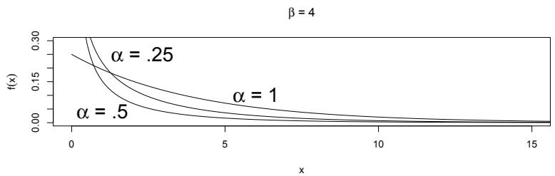

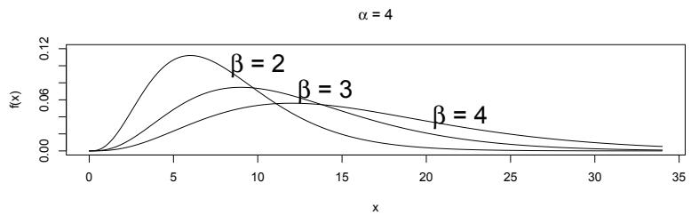  
Figure 3.3.1: Several gamma densities

Note that the hazard function $r(x)$ satisfies $-(d / dx)\log [1 - F(x)]$ ; that is,

$$
1 - F (x) = e ^ {- \int r (x) d x + c}, \tag {3.3.4}
$$

for a constant $c$ . When the support of $X$ is $(0, \infty)$ , $F(0) = 0$ serves as a boundary condition to solve for $c$ . In practice, often the scientist can describe the hazard rate and, hence, $F(x)$ can be determined from expression (3.3.4). For example, suppose the hazard rate of $X$ is constant; i.e., $r(x) = 1 / \beta$ for some $\beta > 0$ . Then

$$
1 - F (x) = e ^ {- \int (1 / \beta) d x + c} = e ^ {- x / \beta} e ^ {c}.
$$

Since $F(0) = 0$ , $e^c = 1$ . So the pdf of $X$ is

$$
f (x) = \left\{ \begin{array}{l l} \frac {1}{\beta} e ^ {- x / \beta} & x > 0 \\ 0 & \text {e l s e w h e r e .} \end{array} \right. \tag {3.3.5}
$$

Of course, this is a $\Gamma(1,\beta)$ distribution, but it is also called the exponential distribution with parameter $1/\beta$ . An important property of this distribution is given in Exercise 3.3.25.

Using R, hazard functions can be quickly plotted. Here is the code for an overlay plot of the hazard functions of the exponential distribution with $\beta = 8$ and the $\Gamma(4,2)$ -distribution.

$$
x = \operatorname {s e q} (. 1, 1 5,.. 1); t = d g a m m a (x, s h a p e = 4, s c a l e = 2)
$$

$$
b = (1 - p g a m m a (x, s h a p e = 4, s c a l e = 2)); y 1 = t / b; p l o t (y 1 ^ {\sim} x); a b l i n e (h = 1 / 8)
$$

Note that the hazard function of this $\Gamma$ -distribution is an increasing function of $x$ ; i.e., the rate of failure increases as time progresses. Other examples of hazard functions are given in Exercise 3.3.26.

One of the most important properties of the gamma distribution is its additive property.

Theorem 3.3.1. Let $X_{1},\ldots ,X_{n}$ be independent random variables. Suppose, for $i = 1,\dots ,n$ , that $X_{i}$ has a $\Gamma (\alpha_i,\beta)$ distribution. Let $Y = \sum_{i = 1}^{n}X_{i}$ . Then $Y$ has a $\Gamma (\sum_{i = 1}^{n}\alpha_{i},\beta)$ distribution.

Proof: Using the assumed independence and the mgf of a gamma distribution, we have by Theorem 2.6.1 that for $t < 1 / \beta$ ,

$$
M _ {Y} (t) = \prod_ {i = 1} ^ {n} (1 - \beta t) ^ {- \alpha_ {i}} = (1 - \beta t) ^ {- \sum_ {i = 1} ^ {n} \alpha_ {i}},
$$

which is the mgf of a $\Gamma (\sum_{i = 1}^{n}\alpha_{i},\beta)$ distribution.

$\Gamma$ -distributions naturally occur in the Poisson process, also.

Remark 3.3.1 (Poisson Processes). For $t > 0$ , let $X_{t}$ denote the number of events of interest that occur in the interval $(0, t]$ . Assume $X_{t}$ satisfies the three assumptions of a Poisson process. Let $k$ be a fixed positive integer and define the continuous random variable $W_{k}$ to be the waiting time until the $k$ th event occurs. Then the range of $W_{k}$ is $(0, \infty)$ . Note that for $w > 0$ , $W_{k} > w$ if and only if $X_{w} \leq k - 1$ . Hence,

$$
P (W _ {k} > w) = P (X _ {w} \leq k - 1) = \sum_ {x = 0} ^ {k - 1} P (X _ {w} = x) = \sum_ {x = 0} ^ {k - 1} \frac {(\lambda w) ^ {x} e ^ {- \lambda w}}{x !}.
$$

In Exercise 3.3.5, the reader is asked to prove that

$$
\int_ {\lambda w} ^ {\infty} \frac {z ^ {k - 1} e ^ {- z}}{(k - 1) !} d z = \sum_ {x = 0} ^ {k - 1} \frac {(\lambda w) ^ {x} e ^ {- \lambda w}}{x !}.
$$

Accepting this result, we have, for $w > 0$ , that the cdf of $W_{k}$ satisfies

$$
F _ {W _ {k}} (w) = 1 - \int_ {\lambda w} ^ {\infty} \frac {z ^ {k - 1} e ^ {- z}}{\Gamma (k)} d z = \int_ {0} ^ {\lambda w} \frac {z ^ {k - 1} e ^ {- z}}{\Gamma (k)} d z,
$$

and for $w \leq 0$ , $F_{W_k}(w) = 0$ . If we change the variable of integration in the integral that defines $F_{W_k}(w)$ by writing $z = \lambda y$ , then

$$
F _ {W _ {k}} (w) = \int_ {0} ^ {w} \frac {\lambda^ {k} y ^ {k - 1} e ^ {- \lambda y}}{\Gamma (k)} d y, w > 0,
$$

and $F_{W_k}(w) = 0$ for $w \leq 0$ . Accordingly, the pdf of $W_k$ is

$$
f _ {W _ {k}} (w) = F _ {W} ^ {\prime} (w) = \left\{ \begin{array}{l l} \frac {\lambda^ {k} w ^ {k - 1} e ^ {- \lambda w}}{\Gamma (k)} & 0 <   w <   \infty \\ 0 & \text {e l s e w h e r e .} \end{array} \right.
$$

That is, the waiting time until the $k$ th event, $W_{k}$ , has the gamma distribution with $\alpha = k$ and $\beta = 1 / \lambda$ . Let $T_{1}$ be the waiting time until the first event occurs, i.e., $k = 1$ . Then the pdf of $T_{1}$ is

$$
f _ {T _ {1}} (w) = \left\{ \begin{array}{l l} \lambda e ^ {- \lambda w} & 0 <   w <   \infty \\ 0 & \text {e l s e w h e r e .} \end{array} \right. \tag {3.3.6}
$$

Hence, $T_{1}$ has the $\Gamma(1,1/\lambda)$ -distribution. The mean of $T_{1} = 1/\lambda$ , while the mean of $X_{1}$ is $\lambda$ . Thus, we expect $\lambda$ events to occur in a unit of time and we expect the first event to occur at time $1/\lambda$ .

Continuing in this way, for $i \geq 1$ , let $T_{i}$ denote the interarrival time of the $i$ th event; i.e., $T_{i}$ is the time between the occurrence of event $(i - 1)$ and event $i$ . As shown $T_{1}$ has the $\Gamma(1,1/\lambda)$ . Note that Axioms (1) and (2) of the Poisson process only depend on $\lambda$ and the length of the interval; in particular, they do not depend on the endpoints of the interval. Further, occurrences in nonoverlapping intervals are independent of one another. Hence, using the same reasoning as above, $T_{j}, j \geq 2$ , also has the $\Gamma(1,1/\lambda)$ -distribution. Furthermore, $T_{1}, T_{2}, T_{3}, \ldots$ are independent. Note the waiting time until the $k$ th event satisfies $W_{k} = T_{1} + \dots + T_{k}$ . Thus by Theorem 3.3.1, $W_{k}$ has a $\Gamma(k,1/\lambda)$ distribution, confirming the derivation above. Although this discussion has been intuitive, it can be made rigorous; see, for example, Parzen (1962).

# 3.3.1 The $\chi^2$ -Distribution

Let us now consider a special case of the gamma distribution in which $\alpha = r / 2$ , where $r$ is a positive integer, and $\beta = 2$ . A random variable $X$ of the continuous type that has the pdf

$$
f (x) = \left\{ \begin{array}{l l} \frac {1}{\Gamma \left(r / 2\right) 2 ^ {r / 2}} x ^ {r / 2 - 1} e ^ {- x / 2} & 0 <   x <   \infty \\ 0 & \text {e l s e w h e r e ,} \end{array} \right. \tag {3.3.7}
$$

and the mgf

$$
M (t) = (1 - 2 t) ^ {- r / 2}, \quad t <   \frac {1}{2},
$$

is said to have a chi-square distribution ( $\chi^2$ -distribution), and any $f(x)$ of this form is called a chi-square pdf. The mean and the variance of a chi-square distribution are $\mu = \alpha \beta = (r/2)2 = r$ and $\sigma^2 = \alpha \beta^2 = (r/2)2^2 = 2r$ , respectively. We call the parameter $r$ the number of degrees of freedom of the chi-square distribution (or of the chi-square pdf). Because the chi-square distribution has an important role in statistics and occurs so frequently, we write, for brevity, that $X$ is $\chi^2(r)$ to mean that the random variable $X$ has a chi-square distribution with $r$ degrees of freedom. The R function pchisq(x,r) returns $P(X \leq x)$ and the command dchisq(x,r) returns the value of the pdf of $X$ at $x$ when $X$ has a chi-squared distribution with $r$ degrees of freedom.

Example 3.3.2. Suppose $X$ has a $\chi^2$ -distribution with 10 degrees of freedom. Then the mean of $X$ is 10 and its standard deviation is $\sqrt{20} = 4.47$ . Using R, its median and quartiles are qchisq(c(.25,.5,.75), 10) = (6.74, 9.34, 12.55). The following

command plots the density function over the interval $(0,24)$ :

$$
x = \operatorname {s e q} (0, 2 4,.. 1); \operatorname {p l o t} (\operatorname {d c h i s q} (x, 1 0) ^ {\sim} x).
$$

Compute this line of code and locate the mean, quartiles, and median of $X$ on the plot.

Example 3.3.3. The quantiles of the $\chi^2$ -distribution are frequently used in statistics. Before the advent of modern computation, tables of these quantiles were compiled. Table I in Appendix D offers a typical $\chi^2$ -table of the quantiles for the probabilities 0.01, 0.025, 0.05, 0.1, 0.9, 0.95, 0.975, 0.99 and degrees of freedom 1, 2, ..., 30. As discussed, the R function qchisq easily computes these quantiles. Actually, the following two lines of R code performs the computation of Table I.

$$
\begin{array}{l} \mathrm {r s} = 1: 3 0; \mathrm {p s} = \mathrm {c} (. 0 1,.. 0 2 5,.. 0 5,.. 1,.. 9,.. 9 5,.. 9 7 5,.. 9 9); \\ f o r (r \text {i n} r s) \{p r i n t (c (r, \text {r o u n d} (q c h i s q (p s, r), d i g i t s = 3))) \} \\ \end{array}
$$

Note that the code rounds the critical values to 3 places.

The following result is used several times in the sequel; hence, we record it as a theorem.

Theorem 3.3.2. Let $X$ have a $\chi^2(r)$ distribution. If $k > -r/2$ , then $E(X^k)$ exists and it is given by

$$
E \left(X ^ {k}\right) = \frac {2 ^ {k} \Gamma \left(\frac {r}{2} + k\right)}{\Gamma \left(\frac {r}{2}\right)}, \quad i f k > - r / 2. \tag {3.3.8}
$$

Proof: Note that

$$
E (X ^ {k}) = \int_ {0} ^ {\infty} \frac {1}{\Gamma \left(\frac {r}{2}\right) 2 ^ {r / 2}} x ^ {(r / 2) + k - 1} e ^ {- x / 2} d x.
$$

Make the change of variable $u = x / 2$ in the above integral. This results in

$$
E (X ^ {k}) = \int_ {0} ^ {\infty} \frac {1}{\Gamma \left(\frac {r}{2}\right) 2 ^ {(r / 2) - 1}} 2 ^ {(r / 2) + k - 1} u ^ {(r / 2) + k - 1} e ^ {- u} d u.
$$

This simplifies to the desired result provided that $k > -(r / 2)$ .

Notice that if $k$ is a nonnegative integer, then $k > -(r / 2)$ is always true. Hence, all moments of a $\chi^2$ distribution exist and the $k$ th moment is given by (3.3.8).

Example 3.3.4. Let $X$ have a gamma distribution with $\alpha = r / 2$ , where $r$ is a positive integer, and $\beta > 0$ . Define the random variable $Y = 2X / \beta$ . We seek the pdf of $Y$ . Now the mgf of $Y$ is

$$
\begin{array}{l} M _ {Y} (t) = E \left(e ^ {t Y}\right) = E \left[ e ^ {(2 t / \beta) X} \right] \\ = \left[ 1 - \frac {2 t}{\beta} \beta \right] ^ {- r / 2} = [ 1 - 2 t ] ^ {- r / 2}, \\ \end{array}
$$

which is the mgf of a $\chi^2$ -distribution with $r$ degrees of freedom. That is, $Y$ is $\chi^2(r)$ .

Because the $\chi^2$ -distributions are a subfamily of the $\Gamma$ -distributions, the additivity property for $\Gamma$ -distributions given by Theorem 3.3.1 holds for $\chi^2$ -distributions, also. Since we often make use of this property, we state it as a corollary for easy reference.

Corollary 3.3.1. Let $X_{1},\ldots ,X_{n}$ be independent random variables. Suppose, for $i = 1,\dots ,n$ , that $X_{i}$ has a $\chi^2 (r_i)$ distribution. Let $Y = \sum_{i = 1}^{n}X_{i}$ . Then $Y$ has a $\chi^2 (\sum_{i = 1}^{n}r_{i})$ distribution.

# 3.3.2 The $\beta$ -Distribution

As we have discussed, in terms of modeling, the $\Gamma$ -distributions offer a wide variety of shapes for skewed distributions with support $(0,\infty)$ . In the exercises and later chapters, we offer other such families of distributions. How about continuous distributions whose support is a bounded interval in $R$ ? For example suppose the support of $X$ is $(a,b)$ where $-\infty < a < b < \infty$ and $a$ and $b$ are known. Without loss of generality, for discussion, we can assume that $a = 0$ and $b = 1$ , since, if not, we could consider the random variable $Y = (X - a) / (b - a)$ . In this section, we discuss the $\beta$ -distribution whose family offers a wide variety of shapes for distributions with support on bounded intervals.

One way of defining the $\beta$ -family of distributions is to derive it from a pair of independent $\Gamma$ random variables. Let $X_{1}$ and $X_{2}$ be two independent random variables that have $\Gamma$ distributions and the joint pdf

$$
h (x _ {1}, x _ {2}) = \frac {1}{\Gamma (\alpha) \Gamma (\beta)} x _ {1} ^ {\alpha - 1} x _ {2} ^ {\beta - 1} e ^ {- x _ {1} - x _ {2}}, 0 <   x _ {1} <   \infty , 0 <   x _ {2} <   \infty ,
$$

zero elsewhere, where $\alpha > 0$ , $\beta > 0$ . Let $Y_{1} = X_{1} + X_{2}$ and $Y_{2} = X_{1} / (X_{1} + X_{2})$ . We next show that $Y_{1}$ and $Y_{2}$ are independent.

The space $\mathcal{S}$ is, exclusive of the points on the coordinate axes, the first quadrant of the $x_{1}, x_{2}$ -plane. Now

$$
y _ {1} = u _ {1} \left(x _ {1}, x _ {2}\right) = x _ {1} + x _ {2}
$$

$$
y _ {2} = u _ {2} (x _ {1}, x _ {2}) = \frac {x _ {1}}{x _ {1} + x _ {2}}
$$

may be written $x_{1} = y_{1}y_{2}$ , $x_{2} = y_{1}(1 - y_{2})$ , so

$$
J = \left| \begin{array}{c c} y _ {2} & y _ {1} \\ 1 - y _ {2} & - y _ {1} \end{array} \right| = - y _ {1} \not \equiv 0.
$$

The transformation is one-to-one, and it maps $S$ onto $\mathcal{T} = \{(y_1,y_2):0 < y_1 < \infty, 0 < y_2 < 1\}$ in the $y_{1}y_{2}$ -plane. The joint pdf of $Y_{1}$ and $Y_{2}$ on its support is

$$
\begin{array}{l} g (y _ {1}, y _ {2}) = (y _ {1}) \frac {1}{\Gamma (\alpha) \Gamma (\beta)} (y _ {1} y _ {2}) ^ {\alpha - 1} [ y _ {1} (1 - y _ {2}) ] ^ {\beta - 1} e ^ {- y _ {1}} \\ = \left\{ \begin{array}{l l} \frac {y _ {2} ^ {\alpha - 1} (1 - y _ {2}) ^ {\beta - 1}}{\Gamma (\alpha) \Gamma (\beta)} y _ {1} ^ {\alpha + \beta - 1} e ^ {- y _ {1}} & 0 <   y _ {1} <   \infty , \quad 0 <   y _ {2} <   1 \\ 0 & \text {e l s e w h e r e .} \end{array} \right. \\ \end{array}
$$

In accordance with Theorem 2.4.1 the random variables are independent. The marginal pdf of $Y_{2}$ is

$$
\begin{array}{l} {g _ {2} (y _ {2})} = {\frac {y _ {2} ^ {\alpha - 1} (1 - y _ {2}) ^ {\beta - 1}}{\Gamma (\alpha) \Gamma (\beta)} \int_ {0} ^ {\infty} y _ {1} ^ {\alpha + \beta - 1} e ^ {- y _ {1}} d y _ {1}} \\ = \left\{ \begin{array}{l l} \frac {\Gamma (\alpha + \beta)}{\Gamma (\alpha) \Gamma (\beta)} y _ {2} ^ {\alpha - 1} (1 - y _ {2}) ^ {\beta - 1} & 0 <   y _ {2} <   1 \\ 0 & \text {e l s e w h e r e .} \end{array} \right. \tag {3.3.9} \\ \end{array}
$$

This pdf is that of the beta distribution with parameters $\alpha$ and $\beta$ . Since $g(y_1, y_2) \equiv g_1(y_1)g_2(y_2)$ , it must be that the pdf of $Y_1$ is

$$
g _ {1} (y _ {1}) = \left\{ \begin{array}{l l} \frac {1}{\Gamma (\alpha + \beta)} y _ {1} ^ {\alpha + \beta - 1} e ^ {- y _ {1}} & 0 <   y _ {1} <   \infty \\ 0 & \text {e l s e w h e r e ,} \end{array} \right.
$$

which is that of a gamma distribution with parameter values of $\alpha +\beta$ and 1.

It is an easy exercise to show that the mean and the variance of $Y_{2}$ , which has a beta distribution with parameters $\alpha$ and $\beta$ , are, respectively,

$$
\mu = \frac {\alpha}{\alpha + \beta}, \sigma^ {2} = \frac {\alpha \beta}{(\alpha + \beta + 1) (\alpha + \beta) ^ {2}}.
$$

The package R calculates probabilities for the beta distribution. If $X$ has a beta distribution with parameters $\alpha = a$ and $\beta = b$ , then the command pbeta(x,a,b) returns $P(X \leq x)$ and the command dbeta(x,a,b) returns the value of the pdf of $X$ at $x$ .

Example 3.3.5 (Shapes of $\beta$ -Distributions). The following 3 lines of R code<sup>5</sup>, will obtain a $4 \times 4$ page of plots of $\beta$ pdfs for all combinations of integer values of $\alpha$ and $\beta$ between 2 and 5. Those distributions on the main diagonal of the page of plots are symmetric, those below the main diagonal are left-skewed, and those above the main diagonal are right-skewed.

```javascript
par(mfrow=c(4,4));r1=2:5;r2=2:5;x=seq(.01,.99,.01) for(a in r1){for(b in r2){plot(dbeta(x,a,b)\~x); title(paste("alpha = ",a,"beta = ",b))}\} 
```

Note that if $\alpha = \beta = 1$ , then the $\beta$ -distribution is the uniform distribution with support $(0,1)$ .

We close this section with another example of a random variable whose distribution is derived from a transformation of gamma random variables.

Example 3.3.6 (Dirichlet Distribution). Let $X_{1}, X_{2}, \ldots, X_{k + 1}$ be independent random variables, each having a gamma distribution with $\beta = 1$ . The joint pdf of these variables may be written as

$$
h (x _ {1}, x _ {2}, \ldots , x _ {k + 1}) = \left\{ \begin{array}{l l} \prod_ {i = 1} ^ {k + 1} \frac {1}{\Gamma (\alpha_ {i})} x _ {i} ^ {\alpha_ {i} - 1} e ^ {- x _ {i}} & 0 <   x _ {i} <   \infty \\ 0 & \text {e l s e w h e r e .} \end{array} \right.
$$

Let

$$
Y _ {i} = \frac {X _ {i}}{X _ {1} + X _ {2} + \cdots + X _ {k + 1}}, \quad i = 1, 2, \ldots , k,
$$

and $Y_{k + 1} = X_1 + X_2 + \dots + X_{k + 1}$ denote $k + 1$ new random variables. The associated transformation maps $\mathcal{A} = \{(x_1, \ldots, x_{k + 1}) : 0 < x_i < \infty, i = 1, \ldots, k + 1\}$ onto the space:

$$
\mathcal {B} = \left\{\left(y _ {1}, \dots , y _ {k}, y _ {k + 1}\right): 0 <   y _ {i}, i = 1, \dots , k, y _ {1} + \dots + y _ {k} <   1, 0 <   y _ {k + 1} <   \infty \right\}.
$$

The single-valued inverse functions are $x_{1} = y_{1}y_{k + 1},\ldots ,x_{k} = y_{k}y_{k + 1},x_{k + 1} = y_{k + 1}(1 - y_1 - \dots -y_k)$ , so that the Jacobian is

$$
J = \left| \begin{array}{c c c c c} y _ {k + 1} & 0 & \dots & 0 & y _ {1} \\ 0 & y _ {k + 1} & \dots & 0 & y _ {2} \\ \vdots & \vdots & & \vdots & \vdots \\ 0 & 0 & \dots & y _ {k + 1} & y _ {k} \\ - y _ {k + 1} & - y _ {k + 1} & \dots & - y _ {k + 1} & (1 - y _ {1} - \dots - y _ {k}) \end{array} \right| = y _ {k + 1} ^ {k}.
$$

Hence the joint pdf of $Y_{1},\ldots ,Y_{k},Y_{k + 1}$ is given by

$$
\frac {y _ {k + 1} ^ {\alpha_ {1} + \cdots + \alpha_ {k + 1} - 1} y _ {1} ^ {\alpha_ {1} - 1} \cdots y _ {k} ^ {\alpha_ {k} - 1} (1 - y _ {1} - \cdots - y _ {k}) ^ {\alpha_ {k + 1} - 1} e ^ {- y _ {k + 1}}}{\Gamma (\alpha_ {1}) \cdots \Gamma (\alpha_ {k}) \Gamma (\alpha_ {k + 1})},
$$

provided that $(y_{1},\ldots ,y_{k},y_{k + 1})\in \mathcal{B}$ and is equal to zero elsewhere. By integrating out $y_{k + 1}$ , the joint pdf of $Y_{1},\ldots ,Y_{k}$ is seen to be

$$
g \left(y _ {1}, \dots , y _ {k}\right) = \frac {\Gamma \left(\alpha_ {1} + \cdots + \alpha_ {k + 1}\right)}{\Gamma \left(\alpha_ {1}\right) \cdots \Gamma \left(\alpha_ {k + 1}\right)} y _ {1} ^ {\alpha_ {1} - 1} \dots y _ {k} ^ {\alpha_ {k} - 1} \left(1 - y _ {1} - \dots - y _ {k}\right) ^ {\alpha_ {k + 1} - 1}, \tag {3.3.10}
$$

when $0 < y_{i}$ , $i = 1, \ldots, k$ , $y_{1} + \dots + y_{k} < 1$ , while the function $g$ is equal to zero elsewhere. Random variables $Y_{1}, \ldots, Y_{k}$ that have a joint pdf of this form are said to have a Dirichlet pdf. It is seen, in the special case of $k = 1$ , that the Dirichlet pdf becomes a beta pdf. Moreover, it is also clear from the joint pdf of $Y_{1}, \ldots, Y_{k}, Y_{k+1}$ that $Y_{k+1}$ has a gamma distribution with parameters $\alpha_{1} + \dots + \alpha_{k} + \alpha_{k+1}$ and $\beta = 1$ and that $Y_{k+1}$ is independent of $Y_{1}, Y_{2}, \ldots, Y_{k}$ .

# EXERCISES

3.3.1. Suppose $(1 - 2t)^{-6}$ , $t < \frac{1}{2}$ is the mgf of the random variable $X$ .

(a) Use R to compute $P(X < 5.23)$ .   
(b) Find the mean $\mu$ and variance $\sigma^2$ of $X$ . Use R to compute $P(|X - \mu| < 2\sigma)$ .

3.3.2. If $X$ is $\chi^2(5)$ , determine the constants $c$ and $d$ so that $P(c < X < d) = 0.95$ and $P(X < c) = 0.025$ .

3.3.3. Suppose the lifetime in months of an engine, working under hazardous conditions, has a $\Gamma$ distribution with a mean of 10 months and a variance of 20 months squared.

(a) Determine the median lifetime of an engine.   
(b) Suppose such an engine is termed successful if its lifetime exceeds 15 months. In a sample of 10 engines, determine the probability of at least 3 successful engines.

3.3.4. Let $X$ be a random variable such that $E(X^m) = (m + 1)!2^m$ , $m = 1, 2, 3, \ldots$ . Determine the mgf and the distribution of $X$ .

Hint: Write out the Taylor series of the mgf.

3.3.5. Show that

$$
\int_ {\mu} ^ {\infty} \frac {1}{\Gamma (k)} z ^ {k - 1} e ^ {- z} d z = \sum_ {x = 0} ^ {k - 1} \frac {\mu^ {x} e ^ {- \mu}}{x !}, k = 1, 2, 3, \dots .
$$

This demonstrates the relationship between the cdfs of the gamma and Poisson distributions.

Hint: Either integrate by parts $k - 1$ times or obtain the "antiderivative" by showing that

$$
\frac {d}{d z} \left[ - e ^ {- z} \sum_ {j = 0} ^ {k - 1} \frac {\Gamma (k)}{(k - j - 1) !} z ^ {k - j - 1} \right] = z ^ {k - 1} e ^ {- z}.
$$

3.3.6. Let $X_{1}$ , $X_{2}$ , and $X_{3}$ be iid random variables, each with pdf $f(x) = e^{-x}$ , $0 < x < \infty$ , zero elsewhere.

(a) Find the distribution of $Y = \mathrm{minimum}(X_1, X_2, X_3)$ .

$$
\text {H i n t :} P (Y \leq y) = 1 - P (Y > y) = 1 - P \left(X _ {i} > y, i = 1, 2, 3\right).
$$

(b) Find the distribution of $Y = \mathrm{maximum}(X_1, X_2, X_3)$ .

3.3.7. Let $X$ have a gamma distribution with pdf

$$
f (x) = \frac {1}{\beta^ {2}} x e ^ {- x / \beta}, 0 <   x <   \infty ,
$$

zero elsewhere. If $x = 2$ is the unique mode of the distribution, find the parameter $\beta$ and $P(X < 9.49)$ .

3.3.8. Compute the measures of skewness and kurtosis of a gamma distribution that has parameters $\alpha$ and $\beta$ .

3.3.9. Let $X$ have a gamma distribution with parameters $\alpha$ and $\beta$ . Show that $P(X \geq 2\alpha \beta) \leq (2 / e)^{\alpha}$ .

Hint: Use the result of Exercise 1.10.5.

3.3.10. Give a reasonable definition of a chi-square distribution with zero degrees of freedom.

Hint: Work with the mgf of a distribution that is $\chi^2 (r)$ and let $r = 0$

3.3.11. Using the computer, obtain plots of the pdfs of chi-squared distributions with degrees of freedom $r = 1,2,5,10,20$ . Comment on the plots.

3.3.12. Using the computer, plot the cdf of a $\Gamma(5,4)$ distribution and use it to guess the median. Confirm it with a computer command that returns the median [In R, use the command qgamma(.5, shape=5, scale=4)].

3.3.13. Using the computer, obtain plots of beta pdfs for $\alpha = 1,5,10$ and $\beta = 1,2,5,10,20$ .

3.3.14. In a warehouse of parts for a large mill, the average time between requests for parts is about 10 minutes.

(a) Find the probability that in an hour there will be at least 10 requests for parts.   
(b) Find the probability that the 10th request in the morning requires at least 2 hours of waiting time.

3.3.15. Let $X$ have a Poisson distribution with parameter $m$ . If $m$ is an experimental value of a random variable having a gamma distribution with $\alpha = 2$ and $\beta = 1$ , compute $P(X = 0, 1, 2)$ .   
Hint: Find an expression that represents the joint distribution of $X$ and $m$ . Then integrate out $m$ to find the marginal distribution of $X$ .   
3.3.16. Let $X$ have the uniform distribution with pdf $f(x) = 1$ , $0 < x < 1$ , zero elsewhere. Find the cdf of $Y = -2\log X$ . What is the pdf of $Y$ ?   
3.3.17. Find the uniform distribution of the continuous type on the interval $(b, c)$ that has the same mean and the same variance as those of a chi-square distribution with 8 degrees of freedom. That is, find $b$ and $c$ .   
3.3.18. Find the mean and variance of the $\beta$ distribution.

Hint: From the pdf, we know that

$$
\int_ {0} ^ {1} y ^ {\alpha - 1} (1 - y) ^ {\beta - 1} d y = \frac {\Gamma (\alpha) \Gamma (\beta)}{\Gamma (\alpha + \beta)}
$$

for all $\alpha > 0$ , $\beta > 0$ .

3.3.19. Determine the constant $c$ in each of the following so that each $f(x)$ is a $\beta$ pdf:

(a) $f(x) = cx(1 - x)^3$ $0 <   x <   1$ , zero elsewhere.   
(b) $f(x) = cx^4 (1 - x)^5$ , $0 < x < 1$ , zero elsewhere.   
(c) $f(x) = cx^{2}(1 - x)^{8}$ , $0 < x < 1$ , zero elsewhere.

3.3.20. Determine the constant $c$ so that $f(x) = cx(3 - x)^4$ , $0 < x < 3$ , zero elsewhere, is a pdf.

3.3.21. Show that the graph of the $\beta$ pdf is symmetric about the vertical line through $x = \frac{1}{2}$ if $\alpha = \beta$ .

3.3.22. Show, for $k = 1,2,\ldots ,n$ , that

$$
\int_ {p} ^ {1} \frac {n !}{(k - 1) ! (n - k) !} z ^ {k - 1} (1 - z) ^ {n - k} d z = \sum_ {x = 0} ^ {k - 1} {\binom {n} {x}} p ^ {x} (1 - p) ^ {n - x}.
$$

This demonstrates the relationship between the cdfs of the $\beta$ and binomial distributions.

3.3.23. Let $X_{1}$ and $X_{2}$ be independent random variables. Let $X_{1}$ and $Y = X_{1} + X_{2}$ have chi-square distributions with $r_{1}$ and $r$ degrees of freedom, respectively. Here $r_{1} < r$ . Show that $X_{2}$ has a chi-square distribution with $r - r_{1}$ degrees of freedom. Hint: Write $M(t) = E(e^{t(X_1 + X_2)})$ and make use of the independence of $X_{1}$ and $X_{2}$ .

3.3.24. Let $X_{1}, X_{2}$ be two independent random variables having gamma distributions with parameters $\alpha_{1} = 3$ , $\beta_{1} = 3$ and $\alpha_{2} = 5$ , $\beta_{2} = 1$ , respectively.

(a) Find the mgf of $Y = 2X_{1} + 6X_{2}$ .   
(b) What is the distribution of $Y$ ?

3.3.25. Let $X$ have an exponential distribution.

(a) For $x > 0$ and $y > 0$ , show that

$$
P (X > x + y \mid X > x) = P (X > y). \tag {3.3.11}
$$

Hence, the exponential distribution has the memoryless property. Recall from Exercise 3.1.9 that the discrete geometric distribution has a similar property.

(b) Let $F(x)$ be the cdf of a continuous random variable $Y$ . Assume that $F(0) = 0$ and $0 < F(y) < 1$ for $y > 0$ . Suppose property (3.3.11) holds for $Y$ . Show that $F_{Y}(y) = 1 - e^{-\lambda y}$ for $y > 0$ .

Hint: Show that $g(y) = 1 - F_{Y}(y)$ satisfies the equation

$$
g (y + z) = g (y) g (z),
$$

3.3.26. Let $X$ denote time until failure of a device and let $r(x)$ denote the hazard function of $X$ .

(a) If $r(x) = cx^b$ ; where $c$ and $b$ are positive constants, show that $X$ has a Weibull distribution; i.e.,

$$
f (x) = \left\{ \begin{array}{l l} c x ^ {b} \exp \left\{- \frac {c x ^ {b + 1}}{b + 1} \right\} & 0 <   x <   \infty \\ 0 & \text {e l s e w h e r e .} \end{array} \right. \tag {3.3.12}
$$

(b) If $r(x) = ce^{bx}$ , where $c$ and $b$ are positive constants, show that $X$ has a Gompertz cdf given by

$$
F (x) = \left\{ \begin{array}{l l} 1 - \exp \left\{\frac {c}{b} \left(1 - e ^ {b x}\right) \right\} & 0 <   x <   \infty \\ 0 & \text {e l s e w h e r e .} \end{array} \right. \tag {3.3.13}
$$

This is frequently used by actuaries as a distribution of the length of human life.

(c) If $r(x) = bx$ , linear hazard rate, show that the pdf of $X$ is

$$
f (x) = \left\{ \begin{array}{l l} b x e ^ {- b x ^ {2} / 2} & 0 <   x <   \infty \\ 0 & \text {e l s e w h e r e .} \end{array} \right. \tag {3.3.14}
$$

This pdf is called the Rayleigh pdf.

3.3.27. Write an R function that returns the value $f(x)$ for a specified $x$ when $f(x)$ is the Weibull pdf given in expression (3.3.12). Next write an R function that returns the associated hazard function $r(x)$ . Obtain side-by-side plots of the pdf and hazard function for the three cases: $c = 5$ and $b = 0.5$ ; $c = 5$ and $b = 1.0$ ; and $c = 5$ and $b = 1.5$ .

3.3.28. In Example 3.3.5, a page of plots of $\beta$ pdfs was discussed. All of these pdfs are mound shaped. Obtain a page of plots for all combinations of $\alpha$ and $\beta$ drawn from the set $\{ .25, .75, 1, 1.25 \}$ . Comment on these shapes.

3.3.29. Let $Y_{1},\ldots ,Y_{k}$ have a Dirichlet distribution with parameters $\alpha_{1},\dots,\alpha_{k},\alpha_{k + 1}$ .

(a) Show that $Y_{1}$ has a beta distribution with parameters $\alpha = \alpha_{1}$ and $\beta = \alpha_{2} + \dots + \alpha_{k+1}$ .   
(b) Show that $Y_{1} + \dots + Y_{r}$ , $r \leq k$ , has a beta distribution with parameters $\alpha = \alpha_{1} + \dots + \alpha_{r}$ and $\beta = \alpha_{r+1} + \dots + \alpha_{k+1}$ .   
(c) Show that $Y_{1} + Y_{2}, Y_{3} + Y_{4}, Y_{5}, \ldots, Y_{k}, k \geq 5$ , have a Dirichlet distribution with parameters $\alpha_{1} + \alpha_{2}, \alpha_{3} + \alpha_{4}, \alpha_{5}, \ldots, \alpha_{k}, \alpha_{k+1}$ .

Hint: Recall the definition of $Y_{i}$ in Example 3.3.6 and use the fact that the sum of several independent gamma variables with $\beta = 1$ is a gamma variable.

# 3.4 The Normal Distribution

Motivation for the normal distribution is found in the Central Limit Theorem, which is presented in Section 5.3. This theorem shows that normal distributions provide an important family of distributions for applications and for statistical inference, in general. We proceed by first introducing the standard normal distribution and through it the general normal distribution.

Consider the integral

$$
I = \int_ {- \infty} ^ {\infty} \frac {1}{\sqrt {2 \pi}} \exp \left(\frac {- z ^ {2}}{2}\right) d z. \tag {3.4.1}
$$

This integral exists because the integrand is a positive continuous function that is bounded by an integrable function; that is,

$$
0 <   \exp \left(\frac {- z ^ {2}}{2}\right) <   \exp (- | z | + 1), - \infty <   z <   \infty ,
$$

and

$$
\int_ {- \infty} ^ {\infty} \exp (- | z | + 1) d z = 2 e.
$$

To evaluate the integral $I$ , we note that $I > 0$ and that $I^2$ may be written

$$
I ^ {2} = \frac {1}{2 \pi} \int_ {- \infty} ^ {\infty} \int_ {- \infty} ^ {\infty} \exp \left(- \frac {z ^ {2} + w ^ {2}}{2}\right) d z d w.
$$

This iterated integral can be evaluated by changing to polar coordinates. If we set $z = r\cos \theta$ and $w = r\sin \theta$ , we have

$$
\begin{array}{l} I ^ {2} = \frac {1}{2 \pi} \int_ {0} ^ {2 \pi} \int_ {0} ^ {\infty} e ^ {- r ^ {2} / 2} r d r d \theta \\ = \frac {1}{2 \pi} \int_ {0} ^ {2 \pi} d \theta = 1. \\ \end{array}
$$

Because the integrand of display (3.4.1) is positive on $R$ and integrates to 1 over $R$ , it is a pdf of a continuous random variable with support $R$ . We denote this random variable by $Z$ . In summary, $Z$ has the pdf

$$
f (z) = \frac {1}{\sqrt {2 \pi}} \exp \left(\frac {- z ^ {2}}{2}\right), - \infty <   z <   \infty . \tag {3.4.2}
$$

For $t \in R$ , the mgf of $Z$ can be derived by a completion of a square as follows:

$$
\begin{array}{l} E [ \exp \{t Z \} ] = \int_ {- \infty} ^ {\infty} \exp \{t z \} \frac {1}{\sqrt {2 \pi}} \exp \left\{- \frac {1}{2} z ^ {2} \right\} d z \\ = \exp \left\{\frac {1}{2} t ^ {2} \right\} \int_ {- \infty} ^ {\infty} \frac {1}{\sqrt {2 \pi}} \exp \left\{- \frac {1}{2} (z - t) ^ {2} \right\} d z \\ = \exp \left\{\frac {1}{2} t ^ {2} \right\} \int_ {- \infty} ^ {\infty} \frac {1}{\sqrt {2 \pi}} \exp \left\{- \frac {1}{2} w ^ {2} \right\} d w, \tag {3.4.3} \\ \end{array}
$$

where for the last integral we made the one-to-one change of variable $w = z - t$ . By the identity (3.4.2), the integral in expression (3.4.3) has value 1. Thus the mgf of $Z$ is

$$
M _ {Z} (t) = \exp \left\{\frac {1}{2} t ^ {2} \right\}, \quad \text {f o r} - \infty <   t <   \infty . \tag {3.4.4}
$$

The first two derivatives of $M_Z(t)$ are easily shown to be

$$
\begin{array}{l} M _ {Z} ^ {\prime} (t) = t \exp \left\{\frac {1}{2} t ^ {2} \right\} \\ M _ {Z} ^ {\prime \prime} (t) = \exp \left\{\frac {1}{2} t ^ {2} \right\} + t ^ {2} \exp \left\{\frac {1}{2} t ^ {2} \right\}. \\ \end{array}
$$

Upon evaluating these derivatives at $t = 0$ , the mean and variance of $Z$ are

$$
E (Z) = 0 \text {a n d} \operatorname {V a r} (Z) = 1. \tag {3.4.5}
$$

Next, define the continuous random variable $X$ by

$$
X = b Z + a,
$$

for $b > 0$ . This is a one-to-one transformation. To derive the pdf of $X$ , note that the inverse of the transformation and the Jacobian are $z = b^{-1}(x - a)$ and $J = b^{-1}$ , respectively. Because $b > 0$ , it follows from (3.4.2) that the pdf of $X$ is

$$
f _ {X} (x) = \frac {1}{\sqrt {2 \pi b}} \exp \left\{- \frac {1}{2} \left(\frac {x - a}{b}\right) ^ {2} \right\}, - \infty <   x <   \infty .
$$

By (3.4.5), we immediately have $E(X) = a$ and $\operatorname{Var}(X) = b^2$ . Hence, in the expression for the pdf of $X$ , we can replace $a$ by $\mu = E(X)$ and $b^2$ by $\sigma^2 = \operatorname{Var}(X)$ . We make this formal in the following:

Definition 3.4.1 (Normal Distribution). We say a random variable $X$ has a normal distribution if its pdf is

$$
f (x) = \frac {1}{\sqrt {2 \pi} \sigma} \exp \left\{- \frac {1}{2} \left(\frac {x - \mu}{\sigma}\right) ^ {2} \right\}, \quad f o r - \infty <   x <   \infty . \tag {3.4.6}
$$

The parameters $\mu$ and $\sigma^2$ are the mean and variance of $X$ , respectively. We often write that $X$ has a $N(\mu, \sigma^2)$ distribution.

In this notation, the random variable $Z$ with pdf (3.4.2) has a $N(0,1)$ distribution. We call $Z$ a standard normal random variable.

For the mgf of $X$ , use the relationship $X = \sigma Z + \mu$ and the mgf for $Z$ , (3.4.4), to obtain

$$
\begin{array}{l} E \left[ \exp \{t X \} \right] = E \left[ \exp \{t (\sigma Z + \mu) \} \right] = \exp \{\mu t \} E \left[ \exp \{t \sigma Z \} \right] \\ = \exp \left\{\mu t \right\} \exp \left\{\frac {1}{2} \sigma^ {2} t ^ {2} \right\} = \exp \left\{\mu t + \frac {1}{2} \sigma^ {2} t ^ {2} \right\}, \tag {3.4.7} \\ \end{array}
$$

for $-\infty <  t <   \infty$

We summarize the above discussion, by noting the relationship between $Z$ and $X$ :

$X$ has a $N(\mu, \sigma^2)$ distribution if and only if $Z = \frac{X - \mu}{\sigma}$ has a $N(0,1)$ distribution. (3.4.8)

Let $X$ have a $N(\mu, \sigma^2)$ distribution. The graph of the pdf of $X$ is seen in Figure 3.4.1 to have the following characteristics: (1) symmetry about a vertical axis through $x = \mu$ ; (2) having its maximum of $1 / (\sigma \sqrt{2\pi})$ at $x = \mu$ ; and (3) having the $x$ -axis as a horizontal asymptote. It should also be verified that (4) there are

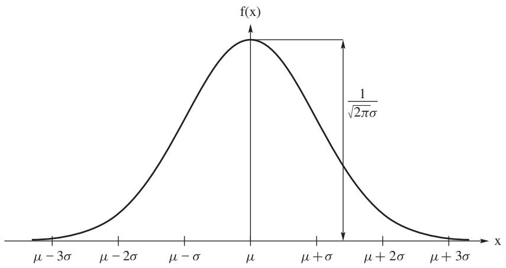  
Figure 3.4.1: The normal density $f(x)$ , (3.4.6).

points of inflection at $x = \mu \pm \sigma$ ; see Exercise 3.4.7. By the symmetry about $\mu$ , it follows that the median of a normal distribution is equal to its mean.

If we want to determine $P(X \leq x)$ , then the following integration is required:

$$
P (X \leq x) = \int_ {- \infty} ^ {x} \frac {1}{\sqrt {2 \pi} \sigma} e ^ {- (t - \mu) ^ {2} / (2 \sigma^ {2})} d t.
$$

From calculus we know that the integrand does not have an antiderivative; hence, the integration must be carried out by numerical integration procedures. The R software uses such a procedure for its function $\mathsf{pnorm}$ . If $X$ has a $N(\mu, \sigma^2)$ distribution, then the R call $\mathsf{pnorm}(x, \mu, \sigma)$ computes $P(X \leq x)$ , while $\mathsf{q} = \mathsf{qnorm}(p, \mu, \sigma)$ gives the $p$ th quantile of $X$ ; i.e., $q$ solves the equation $P(X \leq q) = p$ . We illustrate this computation in the next example.

Example 3.4.1. Suppose the height in inches of an adult male is normally distributed with mean $\mu = 70$ inches and standard deviation $\sigma = 4$ inches. As a graph of the pdf of $X$ use Figure 3.4.1 replacing $\mu$ by 70 and $\sigma$ by 4. Suppose we want to compute the probability that a man exceeds six feet (72 inches) in height. Locate 72 on the figure. The desired probability is the area under the curve over the interval $(72, \infty)$ which is computed in R by 1-pnorm(72,70,4) = 0.3085; hence, $31\%$ of males exceed six feet in height. The 95th percentile in height is qnorm(0.95,70,4) = 76.6 inches. What percentage of males have heights within one standard deviation of the mean? Answer: pnorm(74,70,4) - pnorm(66,70,4) = 0.6827.

Before the age of modern computing tables of probabilities for normal distributions were formulated. Due to the fact (3.4.8), only tables for the standard normal distribution are required. Let $Z$ have the standard normal distribution. A graph of

its pdf is displayed in Figure 3.4.2. Common notation for the cdf of $Z$ is

$$
P (Z \leq z) = \Phi (z) = \mathrm {d f n} \int_ {0} ^ {z} \frac {1}{\sqrt {2 \pi}} e ^ {- t ^ {2} / 2} d t, - \infty <   z <   \infty . \tag {3.4.9}
$$

Table II of Appendix D displays a table for $\Phi(z)$ for specified values of $z > 0$ . To compute $\Phi(-z)$ , where $z > 0$ , use the identity

$$
\Phi (- z) = 1 - \Phi (z). \tag {3.4.10}
$$

This identity follows because the pdf of $Z$ is symmetric about 0. It is apparent in Figure 3.4.2 and the reader is asked to show it in Exercise 3.4.1.

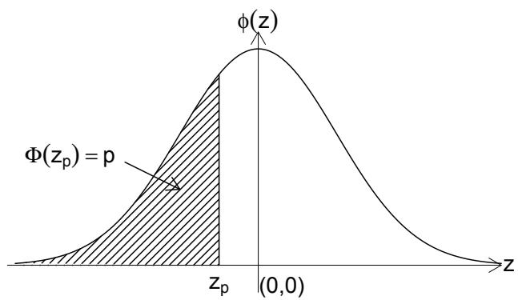  
Figure 3.4.2: The standard normal density: $p = \Phi(z_p)$ is the area under the curve to the left of $z_p$ .

As an illustration of the use of Table II, suppose in Example 3.4.1 that we want to determine the probability that the height of an adult male is between 67 and 71 inches. This is calculated as

$$
\begin{array}{l} P (6 7 <   X <   7 1) = P (X <   7 1) - P (X <   6 7) \\ = P \left(\frac {X - 7 0}{4} <   \frac {7 1 - 7 0}{4}\right) - P \left(\frac {X - 7 0}{4} <   \frac {6 7 - 7 0}{4}\right) \\ = P (Z <   0. 2 5) - P (Z <   - 0. 7 5) = \Phi (0. 2 5) - 1 + \Phi (0. 7 5) \\ = 0. 5 9 8 7 - 1 + 0. 7 7 3 4 = 0. 3 7 2 1 (3.4.11) \\ = \operatorname {p n o r m} (7 1, 7 0, 4) - \operatorname {p n o r m} (6 7, 7 0, 4) = 0. 3 7 2 0 7 9. (3.4.12) \\ \end{array}
$$

Expression (3.4.11) is the calculation by using Table II, while the last line is the calculation by using the R function pnorm. More examples are offered in the exercises. As a final note on Table II, it is generated by the R function:

```r
normtab <- function() { za <- seq(0.00, 3.59, .01); pz <- t(column(round(pnorm(za), digits=4), nrow=10)) colnames(pz) <- seq(0, .09, .01) rownames(pz) <- seq(0.0, 3.5, .1); return(pz)} 
```

The function normtab can be downloaded at the site mentioned in the Preface.

Example 3.4.2 (Empirical Rule). Let $X$ be $N(\mu, \sigma^2)$ . Then, by Table II or R,

$$
\begin{array}{l} P (\mu - 2 \sigma <   X <   \mu + 2 \sigma) = \Phi \left(\frac {\mu + 2 \sigma - \mu}{\sigma}\right) - \Phi \left(\frac {\mu - 2 \sigma - \mu}{\sigma}\right) \\ = \Phi (2) - \Phi (- 2) \\ = 0. 9 7 7 - (1 - 0. 9 7 7) = 0. 9 5 4. \\ \end{array}
$$

Similarly, $P(\mu - \sigma < X < \mu + \sigma) = 0.6827$ and $P(\mu - 3\sigma < X < \mu + 3\sigma) = 0.9973$ . Sometimes these three intervals and their corresponding probabilities are referred to as the empirical rule. Note that we can use Chebyshev's Theorem (Theorem 1.10.3), to obtain lower bounds for these probabilities. While the empirical rule is much more precise, it also requires the assumption of a normal distribution. On the other hand, Chebyshev's theorem requires only the assumption of a finite variance.

Example 3.4.3. Suppose that $10\%$ of the probability for a certain distribution that is $N(\mu, \sigma^2)$ is below 60 and that $5\%$ is above 90. What are the values of $\mu$ and $\sigma$ ? We are given that the random variable $X$ is $N(\mu, \sigma^2)$ and that $P(X \leq 60) = 0.10$ and $P(X \leq 90) = 0.95$ . Thus $\Phi[(60 - \mu) / \sigma] = 0.10$ and $\Phi[(90 - \mu) / \sigma] = 0.95$ . From Table II we have

$$
\frac {6 0 - \mu}{\sigma} = - 1. 2 8, \quad \frac {9 0 - \mu}{\sigma} = 1. 6 4.
$$

These conditions require that $\mu = 73.1$ and $\sigma = 10.2$ approximately.

Remark 3.4.1. In this chapter we have illustrated three types of parameters associated with distributions. The mean $\mu$ of $N(\mu, \sigma^2)$ is called a location parameter because changing its value simply changes the location of the middle of the normal pdf; that is, the graph of the pdf looks exactly the same except for a shift in location. The standard deviation $\sigma$ of $N(\mu, \sigma^2)$ is called a scale parameter because changing its value changes the spread of the distribution. That is, a small value of $\sigma$ requires the graph of the normal pdf to be tall and narrow, while a large value of $\sigma$ requires it to spread out and not be so tall. No matter what the values of $\mu$ and $\sigma$ , however, the graph of the normal pdf is that familiar "bell shape." Incidentally, the $\beta$ of the gamma distribution is also a scale parameter. On the other hand, the $\alpha$ of the gamma distribution is called a shape parameter, as changing its value modifies the shape of the graph of the pdf, as can be seen by referring to Figure 3.3.1. The parameters $p$ and $\mu$ of the binomial and Poisson distributions, respectively, are also shape parameters.

Continuing with the first part of Remark 3.4.1, if $X$ is $N(\mu, \sigma^2)$ then we say that $X$ follows the location model which we write as

$$
X = \mu + e, \tag {3.4.13}
$$

where $e$ is a random variable (often called random error) with a $N(0, \sigma^2)$ distribution. Conversely, it follows immediately that if $X$ satisfies expression (3.4.13) with $e$ distributed $N(0, \sigma^2)$ then $X$ has a $N(\mu, \sigma^2)$ distribution.

We close this part of the section with three important results.

Example 3.4.4 (All the Moments of a Normal Distribution). Recall that in Example 1.9.7, we derived all the moments of a standard normal random variable by using its moment generating function. We can use this to obtain all the moments of $X$ , where $X$ has a $N(\mu, \sigma^2)$ distribution. From expression (3.4.13), we can write $X = \sigma Z + \mu$ , where $Z$ has a $N(0,1)$ distribution. Hence, for all nonnegative integers $k$ a simple application of the binomial theorem yields

$$
E \left(X ^ {k}\right) = E \left[ (\sigma Z + \mu) ^ {k} \right] = \sum_ {j = 0} ^ {k} \binom {k} {j} \sigma^ {j} E \left(Z ^ {j}\right) \mu^ {k - j}. \tag {3.4.14}
$$

Recall from Example 1.9.7 that all the odd moments of $Z$ are 0, while all the even moments are given by expression (1.9.3). These can be substituted into expression (3.4.14) to derive the moments of $X$ .

Theorem 3.4.1. If the random variable $X$ is $N(\mu, \sigma^2)$ , $\sigma^2 > 0$ , then the random variable $V = (X - \mu)^2 / \sigma^2$ is $\chi^2(1)$ .

Proof. Because $V = W^2$ , where $W = (X - \mu) / \sigma$ is $N(0,1)$ , the cdf $G(v)$ for $V$ is, for $v \geq 0$ ,

$$
G (v) = P \left(W ^ {2} \leq v\right) = P (- \sqrt {v} \leq W \leq \sqrt {v}).
$$

That is,

$$
G (v) = 2 \int_ {0} ^ {\sqrt {v}} \frac {1}{\sqrt {2 \pi}} e ^ {- w ^ {2} / 2} d w, \quad 0 \leq v,
$$

and

$$
G (v) = 0, \quad v <   0.
$$

If we change the variable of integration by writing $w = \sqrt{y}$ , then

$$
G (v) = \int_ {0} ^ {v} \frac {1}{\sqrt {2 \pi} \sqrt {y}} e ^ {- y / 2} d y, \quad 0 \leq v.
$$

Hence the pdf $g(v) = G'(v)$ of the continuous-type random variable $V$ is

$$
g (v) = \left\{ \begin{array}{l l} \frac {1}{\sqrt {\pi \sqrt {2}}} v ^ {1 / 2 - 1} e ^ {- v / 2} & 0 <   v <   \infty \\ 0 & \text {e l s e w h e r e .} \end{array} \right.
$$

Since $g(v)$ is a pdf

$$
\int_ {0} ^ {\infty} g (v) d v = 1;
$$

hence, it must be that $\Gamma (\frac{1}{2}) = \sqrt{\pi}$ and thus $V$ is $\chi^2 (1)$ .

One of the most important properties of the normal distribution is its additivity under independence.

Theorem 3.4.2. Let $X_{1},\ldots ,X_{n}$ be independent random variables such that, for $i = 1,\dots ,n$ $X_{i}$ has a $N(\mu_i,\sigma_i^2)$ distribution. Let $Y = \sum_{i = 1}^{n}a_{i}X_{i}$ , where $a_1,\ldots ,a_n$ are constants. Then the distribution of $Y$ is $N(\sum_{i = 1}^{n}a_{i}\mu_{i},\sum_{i = 1}^{n}a_{i}^{2}\sigma_{i}^{2})$ .

Proof: By Theorem 2.6.1, for $t \in R$ , the mgf of $Y$ is

$$
\begin{array}{l} M _ {Y} (t) = \prod_ {i = 1} ^ {n} \exp \left\{t a _ {i} \mu_ {i} + (1 / 2) t ^ {2} a _ {i} ^ {2} \sigma_ {i} ^ {2} \right\} \\ = \exp \left\{t \sum_ {i = 1} ^ {n} a _ {i} \mu_ {i} + (1 / 2) t ^ {2} \sum_ {i = 1} ^ {n} a _ {i} ^ {2} \sigma_ {i} ^ {2} \right\}, \\ \end{array}
$$

which is the mgf of a $N(\sum_{i=1}^{n}a_{i}\mu_{i},\sum_{i=1}^{n}a_{i}^{2}\sigma_{i}^{2})$ distribution.

A simple corollary to this result gives the distribution of the sample mean $\overline{X} = n^{-1}\sum_{i=1}^{n} X_i$ when $X_1, X_2, \ldots, X_n$ represents a random sample from a $N(\mu, \sigma^2)$ .

Corollary 3.4.1. Let $X_{1},\ldots ,X_{n}$ be iid random variables with a common $N(\mu ,\sigma^2)$ distribution. Let $\overline{X} = n^{-1}\sum_{i = 1}^{n}X_{i}$ . Then $\overline{X}$ has a $N(\mu ,\sigma^2 /n)$ distribution.

To prove this corollary, simply take $a_i = (1/n)$ , $\mu_i = \mu$ , and $\sigma_i^2 = \sigma^2$ , for $i = 1, 2, \ldots, n$ , in Theorem 3.4.2.

# 3.4.1 *Contaminated Normals

We next discuss a random variable whose distribution is a mixture of normals. As with the normal, we begin with a standardized random variable.

Suppose we are observing a random variable that most of the time follows a standard normal distribution but occasionally follows a normal distribution with a larger variance. In applications, we might say that most of the data are "good" but that there are occasional outliers. To make this precise let $Z$ have a $N(0,1)$ distribution; let $I_{1 - \epsilon}$ be a discrete random variable defined by

$$
I _ {1 - \epsilon} = \left\{ \begin{array}{l l} 1 & \text {w i t h p r o b a b i l i t y} 1 - \epsilon \\ 0 & \text {w i t h p r o b a b i l i t y} \epsilon , \end{array} \right.
$$

and assume that $Z$ and $I_{1 - \epsilon}$ are independent. Let $W = ZI_{1 - \epsilon} + \sigma_cZ(1 - I_{1 - \epsilon})$ . Then $W$ is the random variable of interest.

The independence of $Z$ and $I_{1 - \epsilon}$ imply that the cdf of $W$ is

$$
\begin{array}{l} F _ {W} (w) = P [ W \leq w ] = P [ W \leq w, I _ {1 - \epsilon} = 1 ] + P [ W \leq w, I _ {1 - \epsilon} = 0 ] \\ = P [ W \leq w \mid I _ {1 - \epsilon} = 1 ] P [ I _ {1 - \epsilon} = 1 ] \\ + P \left[ W \leq w \mid I _ {1 - \epsilon} = 0 \right] P \left[ I _ {1 - \epsilon} = 0 \right] \\ = P [ Z \leq w ] (1 - \epsilon) + P [ Z \leq w / \sigma_ {c} ] \epsilon . \\ = \Phi (w) (1 - \epsilon) + \Phi (w / \sigma_ {c}) \epsilon \tag {3.4.15} \\ \end{array}
$$

Therefore, we have shown that the distribution of $W$ is a mixture of normals. Further, because $W = ZI_{1 - \epsilon} + \sigma_cZ(1 - I_{1 - \epsilon})$ , we have

$$
E (W) = 0 \text {a n d} \operatorname {V a r} (W) = 1 + \epsilon \left(\sigma_ {c} ^ {2} - 1\right); \tag {3.4.16}
$$

see Exercise 3.4.24. Upon differentiating (3.4.15), the pdf of $W$ is

$$
f _ {W} (w) = \phi (w) (1 - \epsilon) + \phi \left(w / \sigma_ {c}\right) \frac {\epsilon}{\sigma_ {c}}, \tag {3.4.17}
$$

where $\phi$ is the pdf of a standard normal.

Suppose, in general, that the random variable of interest is $X = a + bW$ , where $b > 0$ . Based on (3.4.16), the mean and variance of $X$ are

$$
E (X) = a \text {a n d} \operatorname {V a r} (X) = b ^ {2} \left(1 + \epsilon \left(\sigma_ {c} ^ {2} - 1\right)\right). \tag {3.4.18}
$$

From expression (3.4.15), the cdf of $X$ is

$$
F _ {X} (x) = \Phi \left(\frac {x - a}{b}\right) (1 - \epsilon) + \Phi \left(\frac {x - a}{b \sigma_ {c}}\right) \epsilon , \tag {3.4.19}
$$

which is a mixture of normal cdfs.

Based on expression (3.4.19) it is easy to obtain probabilities for contaminated normal distributions using R. For example, suppose, as above, $W$ has cdf (3.4.15). Then $P(W \leq w)$ is obtained by the R command $(1 - \mathrm{eps}) * \mathrm{pnorm}(\mathsf{w}) + \mathrm{eps} * \mathrm{pnorm}(\mathsf{w} / \mathrm{sigc})$ , where $\mathrm{eps}$ and $\mathrm{sigc}$ denote $\epsilon$ and $\sigma_c$ , respectively. Similarly, the pdf of $W$ at $w$ is returned by $(1 - \mathrm{eps}) * \mathrm{dnorm}(\mathsf{w}) + \mathrm{eps} * \mathrm{dnorm}(\mathsf{w} / \mathrm{sigc}) / \mathrm{sigc}$ . The functions $\mathrm{pcn}$ and $\mathrm{dcn}^7$ compute the cdf and pdf of the contaminated normal, respectively. In Section 3.7, we explore mixture distributions in general.

# EXERCISES

3.4.1. If

$$
\Phi (z) = \int_ {- \infty} ^ {z} \frac {1}{\sqrt {2 \pi}} e ^ {- w ^ {2} / 2} d w,
$$

show that $\Phi (-z) = 1 - \Phi (z)$

3.4.2. If $X$ is $N(75, 100)$ , find $P(X < 60)$ and $P(70 < X < 100)$ by using either Table II or the R command pnorm.

3.4.3. If $X$ is $N(\mu, \sigma^2)$ , find $b$ so that $P[-b < (X - \mu) / \sigma < b] = 0.90$ , by using either Table II of Appendix D or the R command qnorm.

3.4.4. Let $X$ be $N(\mu, \sigma^2)$ so that $P(X < 89) = 0.90$ and $P(X < 94) = 0.95$ . Find $\mu$ and $\sigma^2$ .

3.4.5. Show that the constant $c$ can be selected so that $f(x) = c2^{-x^2}$ , $-\infty < x < \infty$ , satisfies the conditions of a normal pdf.

Hint: Write $2 = e^{\log 2}$ .

3.4.6. If $X$ is $N(\mu, \sigma^2)$ , show that $E(|X - \mu|) = \sigma \sqrt{2/\pi}$ .

3.4.7. Show that the graph of a pdf $N(\mu, \sigma^2)$ has points of inflection at $x = \mu - \sigma$ and $x = \mu + \sigma$ .

3.4.8. Evaluate $\int_2^3\exp [-2(x - 3)^2 ]dx$

3.4.9. Determine the 90th percentile of the distribution, which is $N(65,25)$ .

3.4.10. If $e^{3t + 8t^2}$ is the mgf of the random variable $X$ , find $P(-1 < X < 9)$ .

3.4.11. Let the random variable $X$ have the pdf

$$
f (x) = \frac {2}{\sqrt {2 \pi}} e ^ {- x ^ {2} / 2}, \quad 0 <   x <   \infty , \quad \text {z e r o e l s e w h e r e}.
$$

(a) Find the mean and the variance of $X$   
(b) Find the cdf and hazard function of $X$

Hint for (a): Compute $E(X)$ directly and $E(X^2)$ by comparing the integral with the integral representing the variance of a random variable that is $N(0,1)$ .

3.4.12. Let $X$ be $N(5, 10)$ . Find $P[0.04 < (X - 5)^2 < 38.4]$ .   
3.4.13. If $X$ is $N(1, 4)$ , compute the probability $P(1 < X^2 < 9)$ .   
3.4.14. If $X$ is $N(75,25)$ , find the conditional probability that $X$ is greater than 80 given that $X$ is greater than 77. See Exercise 2.3.12.   
3.4.15. Let $X$ be a random variable such that $E(X^{2m}) = (2m)! / (2^m m!)$ , $m = 1, 2, 3, \ldots$ and $E(X^{2m-1}) = 0$ , $m = 1, 2, 3, \ldots$ . Find the mgf and the pdf of $X$ .   
3.4.16. Let the mutually independent random variables $X_{1}$ , $X_{2}$ , and $X_{3}$ be $N(0,1)$ , $N(2,4)$ , and $N(-1,1)$ , respectively. Compute the probability that exactly two of these three variables are less than zero.   
3.4.17. Compute the measures of skewness and kurtosis of a distribution which is $N(\mu, \sigma^2)$ . See Exercises 1.9.14 and 1.9.15 for the definitions of skewness and kurtosis, respectively.   
3.4.18. Let the random variable $X$ have a distribution that is $N(\mu, \sigma^2)$ .

(a) Does the random variable $Y = X^2$ also have a normal distribution?   
(b) Would the random variable $Y = aX + b$ , $a$ and $b$ nonzero constants have a normal distribution?

Hint: In each case, first determine $P(Y \leq y)$ .

3.4.19. Let the random variable $X$ be $N(\mu, \sigma^2)$ . What would this distribution be if $\sigma^2 = 0$ ?

Hint: Look at the mgf of $X$ for $\sigma^2 > 0$ and investigate its limit as $\sigma^2 \to 0$ .

3.4.20. Let $Y$ have a truncated distribution with pdf $g(y) = \phi(y) / [\Phi(b) - \Phi(a)]$ , for $a < y < b$ , zero elsewhere, where $\phi(x)$ and $\Phi(x)$ are, respectively, the pdf and distribution function of a standard normal distribution. Show then that $E(Y)$ is equal to $[\phi(a) - \phi(b)] / [\Phi(b) - \Phi(a)]$ .

3.4.21. Let $f(x)$ and $F(x)$ be the pdf and the cdf, respectively, of a distribution of the continuous type such that $f'(x)$ exists for all $x$ . Let the mean of the truncated distribution that has pdf $g(y) = f(y) / F(b)$ , $-\infty < y < b$ , zero elsewhere, be equal to $-f(b) / F(b)$ for all real $b$ . Prove that $f(x)$ is a pdf of a standard normal distribution.

3.4.22. Let $X$ and $Y$ be independent random variables, each with a distribution that is $N(0,1)$ . Let $Z = X + Y$ . Find the integral that represents the cdf $G(z) = P(X + Y \leq z)$ of $Z$ . Determine the pdf of $Z$ .

Hint: We have that $G(z) = \int_{-\infty}^{\infty} H(x, z) \, dx$ , where

$$
H (x, z) = \int_ {- \infty} ^ {z - x} \frac {1}{2 \pi} \exp [ - (x ^ {2} + y ^ {2}) / 2 ] d y.
$$

Find $G'(z)$ by evaluating $\int_{-\infty}^{\infty} [\partial H(x, z) / \partial z] dx$ .

3.4.23. Suppose $X$ is a random variable with the pdf $f(x)$ which is symmetric about 0; i.e., $f(-x) = f(x)$ . Show that $F(-x) = 1 - F(x)$ , for all $x$ in the support of $X$ .

3.4.24. Derive the mean and variance of a contaminated normal random variable. They are given in expression (3.4.16).

3.4.25. Investigate the probabilities of an "outlier" for a contaminated normal random variable and a normal random variable. Specifically, determine the probability of observing the event $\{|X| \geq 2\}$ for the following random variables (use the R function pcn for the contaminated normals):

(a) $X$ has a standard normal distribution.   
(b) $X$ has a contaminated normal distribution with cdf (3.4.15), where $\epsilon = 0.15$ and $\sigma_c = 10$ .   
(c) $X$ has a contaminated normal distribution with cdf (3.4.15), where $\epsilon = 0.15$ and $\sigma_c = 20$ .   
(d) $X$ has a contaminated normal distribution with cdf (3.4.15), where $\epsilon = 0.25$ and $\sigma_c = 20$ .

3.4.26. Plot the pdfs of the random variables defined in parts (a)-(d) of the last exercise. Obtain an overlay plot of all four pdfs also. In R the domain values of the pdfs can easily be obtained by using the seq command. For instance, the command $x <- \text{seq}(-6, 6, .1)$ returns a vector of values between -6 and 6 in jumps of 0.1. Then use the R function dcn for the contaminated normal pdfs.

3.4.27. Consider the family of pdfs indexed by the parameter $\alpha$ , $-\infty < \alpha < \infty$ , given by

$$
f (x; \alpha) = 2 \phi (x) \Phi (\alpha x), - \infty <   x <   \infty , \tag {3.4.20}
$$

where $\phi (x)$ and $\Phi (x)$ are respectively the pdf and cdf of a standard normal distribution.

(a) Clearly $f(x; \alpha) > 0$ for all $x$ . Show that the pdf integrates to 1 over $(-\infty, \infty)$ . Hint: Start with

$$
\int_ {- \infty} ^ {\infty} f (x; \alpha) d x = 2 \int_ {- \infty} ^ {\infty} \phi (x) \int_ {- \infty} ^ {\alpha x} \phi (t) d t.
$$

Next sketch the region of integration and then combine the integrands and use the polar coordinate transformation we used after expression (3.4.1).

(b) Note that $f(x; \alpha)$ is the $N(0,1)$ pdf for $\alpha = 0$ . The pdfs are left skewed for $\alpha < 0$ and right skewed for $\alpha > 0$ . Using R, verify this by plotting the pdfs for $\alpha = -3, -2, -1, 1, 2, 3$ . Here's the code for $\alpha = -3$ :

$$
x = \operatorname {s e q} (- 5, 5,. 0 1); a l p = - 3; y = 2 * d n o r m (x) * p n o r m (a l p * x); p l o t (y ^ {\sim} x)
$$

This family is called the skewed normal family; see Azzalini (1985).

3.4.28. For $Z$ distributed $N(0,1)$ , it can be shown that

$$
E [ \Phi (h Z + k) ] = \Phi [ k / \sqrt {1 + h ^ {2}} ];
$$

see Azzalini (1985). Use this fact to obtain the mgf of the pdf (3.4.20). Next obtain the mean of this pdf.

3.4.29. Let $X_{1}$ and $X_{2}$ be independent with normal distributions $N(6,1)$ and $N(7,1)$ , respectively. Find $P(X_{1} > X_{2})$ .

Hint: Write $P(X_{1} > X_{2}) = P(X_{1} - X_{2} > 0)$ and determine the distribution of $X_{1} - X_{2}$ .

3.4.30. Compute $P(X_{1} + 2X_{2} - 2X_{3} > 7)$ if $X_{1}, X_{2}, X_{3}$ are iid with common distribution $N(1,4)$ .

3.4.31. A certain job is completed in three steps in series. The means and standard deviations for the steps are (in minutes)

<table><tr><td>Step</td><td>Mean</td><td>Standard Deviation</td></tr><tr><td>1</td><td>17</td><td>2</td></tr><tr><td>2</td><td>13</td><td>1</td></tr><tr><td>3</td><td>13</td><td>2</td></tr></table>

Assuming independent steps and normal distributions, compute the probability that the job takes less than 40 minutes to complete.

3.4.32. Let $X$ be $N(0,1)$ . Use the moment generating function technique to show that $Y = X^2$ is $\chi^2(1)$ .

Hint: Evaluate the integral that represents $E(e^{tX^2})$ by writing $w = x\sqrt{1 - 2t}$ , $t < \frac{1}{2}$ .

3.4.33. Suppose $X_{1}$ , $X_{2}$ are iid with a common standard normal distribution. Find the joint pdf of $Y_{1} = X_{1}^{2} + X_{2}^{2}$ and $Y_{2} = X_{2}$ and the marginal pdf of $Y_{1}$ .

Hint: Note that the space of $Y_{1}$ and $Y_{2}$ is given by $-\sqrt{y_1} < y_2 < \sqrt{y_1}, 0 < y_1 < \infty$ .

# 3.5 The Multivariate Normal Distribution

In this section we present the multivariate normal distribution. In the first part of the section, we introduce the bivariate normal distribution, leaving most of the proofs to the later section, Section 3.5.2.

# 3.5.1 Bivariate Normal Distribution

We say that $(X,Y)$ follows a bivariate normal distribution if its pdf is given by

$$
f (x, y) = \frac {1}{2 \pi \sigma_ {1} \sigma_ {2} \sqrt {1 - \rho^ {2}}} e ^ {- q / 2}, \quad - \infty <   x <   \infty , \quad - \infty <   y <   \infty , \tag {3.5.1}
$$

where

$$
q = \frac {1}{1 - \rho^ {2}} \left[ \left(\frac {x - \mu_ {1}}{\sigma_ {1}}\right) ^ {2} - 2 \rho \left(\frac {x - \mu_ {1}}{\sigma_ {1}}\right) \left(\frac {y - \mu_ {2}}{\sigma_ {2}}\right) + \left(\frac {y - \mu_ {2}}{\sigma_ {2}}\right) ^ {2} \right], \tag {3.5.2}
$$

and $-\infty < \mu_i < \infty$ , $\sigma_i > 0$ , for $i = 1,2$ , and $\rho$ satisfies $\rho^2 < 1$ . Clearly, this function is positive everywhere in $R^2$ . As we show in Section 3.5.2, it is a pdf with the mgf given by:

$$
M _ {(X, Y)} \left(t _ {1}, t _ {2}\right) = \exp \left\{t _ {1} \mu_ {1} + t _ {2} \mu_ {2} + \frac {1}{2} \left(t _ {1} ^ {2} \sigma_ {1} ^ {2} + 2 t _ {1} t _ {2} \rho \sigma_ {1} \sigma_ {2} + t _ {2} ^ {2} \sigma_ {2} ^ {2}\right) \right\}. \tag {3.5.3}
$$

Thus, the mgf of $X$ is

$$
M _ {X} (t _ {1}) = M _ {(X, Y)} (t _ {1}, 0) = \exp \left\{t _ {1} \mu_ {1} + \frac {1}{2} t _ {1} ^ {2} \sigma_ {1} ^ {2} \right\};
$$

hence, $X$ has a $N(\mu_1, \sigma_1^2)$ distribution. In the same way, $Y$ has a $N(\mu_2, \sigma_2^2)$ distribution. Thus $\mu_1$ and $\mu_2$ are the respective means of $X$ and $Y$ and $\sigma_1^2$ and $\sigma_2^2$ are the respective variances of $X$ and $Y$ . For the parameter $\rho$ , Exercise 3.5.3 shows that

$$
E (X Y) = \frac {\partial^ {2} M _ {(X , Y)}}{\partial t _ {1} \partial t _ {2}} (0, 0) = \rho \sigma_ {1} \sigma_ {2} + \mu_ {1} \mu_ {2}. \tag {3.5.4}
$$

Hence, $\operatorname{cov}(X,Y) = \rho \sigma_1\sigma_2$ and thus, as the notation suggests, $\rho$ is the correlation coefficient between $X$ and $Y$ . We know by Theorem 2.5.2 that if $X$ and $Y$ are independent then $\rho = 0$ . Further, from expression (3.5.3), if $\rho = 0$ then the joint mgf of $(X,Y)$ factors into the product of the marginal mgfs and, hence, $X$ and $Y$ are independent random variables. Thus if $(X,Y)$ has a bivariate normal distribution, then $X$ and $Y$ are independent if and only if they are uncorrelated.

The bivariate normal pdf, (3.5.1), is a mound-shaped over $R^2$ and peaks at its mean $(\mu_1,\mu_2)$ ; see Exercise 3.5.4. For a given $c > 0$ , the points of equal probability (or density) are given by $\{(x,y):f(x,y) = c\}$ . It follows with some algebra that these sets are ellipses. In general for multivariate distributions, we call these sets contours of the pdfs. Hence, the contours of bivariate normal distributions are

elliptical. If $X$ and $Y$ are independent then these contours are circular. The interested reader can consult a book on multivariate statistics for discussions on the geometry of the ellipses. For example, if $\sigma_1 = \sigma_2$ and $\rho > 0$ , the main axis of the ellipse goes through the mean at a $45^{\mathrm{O}}$ angle; see Johnson and Wichern (2008) for discussion.

Figure 3.5.1 displays a three-dimensional plot of the bivariate normal pdf with $(\mu_1,\mu_2) = (0,0)$ , $\sigma_{1} = \sigma_{2} = 1$ , and $\rho = 0.5$ . For location, the peak is at $(\mu_1,\mu_2) = (0,0)$ . The elliptical contours are apparent. Locate the main axis. For a region $A$ in the plane, $P[(X,Y)\in A]$ is the volume under the surface over $A$ . In general such probabilities are calculated by numerical integration methods.

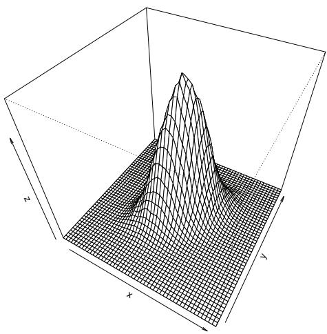  
Figure 3.5.1: A sketch of the surface of a bivariate normal distribution with mean $(0,0)$ , $\sigma_{1} = \sigma_{2} = 1$ , and $\rho = 0.5$ .

In the next section, we extend the discussion to the general multivariate case; however, Remark 3.5.1, below, returns to the bivariate case and can be read with minor knowledge of vector and matrices.

# 3.5.2 *Multivariate Normal Distribution, General Case

In this section we generalize the bivariate normal distribution to the $n$ -dimensional multivariate normal distribution. As with Section 3.4 on the normal distribution, the derivation of the distribution is simplified by first discussing the standardized variable case and then proceeding to the general case. Also, in this section, vector and matrix notation are used.

Consider the random vector $\mathbf{Z} = (Z_1, \ldots, Z_n)'$ , where $Z_1, \ldots, Z_n$ are iid $N(0, 1)$ random variables. Then the density of $\mathbf{Z}$ is

$$
\begin{array}{l} f _ {\mathbf {Z}} (\mathbf {z}) = \prod_ {i = 1} ^ {n} \frac {1}{\sqrt {2 \pi}} \exp \left\{- \frac {1}{2} z _ {i} ^ {2} \right\} = \left(\frac {1}{2 \pi}\right) ^ {n / 2} \exp \left\{- \frac {1}{2} \sum_ {i = 1} ^ {n} z _ {i} ^ {2} \right\} \\ = \left(\frac {1}{2 \pi}\right) ^ {n / 2} \exp \left\{- \frac {1}{2} \mathbf {z} ^ {\prime} \mathbf {z} \right\}, \tag {3.5.5} \\ \end{array}
$$

for $\mathbf{z} \in R^n$ . Because the $Z_i$ s have mean 0, have variance 1, and are uncorrelated, the mean and covariance matrix of $\mathbf{Z}$ are

$$
E [ \mathbf {Z} ] = \mathbf {0} \text {a n d} \operatorname {C o v} [ \mathbf {Z} ] = \mathbf {I} _ {n}, \tag {3.5.6}
$$

where $\mathbf{I}_n$ denotes the identity matrix of order $n$ . Recall that the mgf of $Z_{i}$ evaluated at $t_i$ is $\exp \{t_i^2 /2\}$ . Hence, because the $Z_{i}$ s are independent, the mgf of $\mathbf{Z}$ is

$$
\begin{array}{l} M _ {\mathbf {Z}} (\mathbf {t}) = E \left[ \exp \left\{\mathbf {t} ^ {\prime} \mathbf {Z} \right\} \right] = E \left[ \prod_ {i = 1} ^ {n} \exp \left\{t _ {i} Z _ {i} \right\} \right] = \prod_ {i = 1} ^ {n} E \left[ \exp \left\{t _ {i} Z _ {i} \right\} \right] \\ = \exp \left\{\frac {1}{2} \sum_ {i = 1} ^ {n} t _ {i} ^ {2} \right\} = \exp \left\{\frac {1}{2} \mathbf {t} ^ {\prime} \mathbf {t} \right\}, \tag {3.5.7} \\ \end{array}
$$

for all $\mathbf{t} \in R^n$ . We say that $\mathbf{Z}$ has a multivariate normal distribution with mean vector $\mathbf{0}$ and covariance matrix $\mathbf{I}_n$ . We abbreviate this by saying that $\mathbf{Z}$ has an $N_n(\mathbf{0}, \mathbf{I}_n)$ distribution.

For the general case, suppose $\pmb{\Sigma}$ is an $n\times n$ , symmetric, and positive semi-definite matrix. Then from linear algebra, we can always decompose $\pmb{\Sigma}$ as

$$
\Sigma = \Gamma^ {\prime} \Lambda \Gamma , \tag {3.5.8}
$$

where $\Lambda$ is the diagonal matrix $\Lambda = \mathrm{diag}(\lambda_1, \lambda_2, \dots, \lambda_n)$ , $\lambda_1 \geq \lambda_2 \geq \dots \geq \lambda_n \geq 0$ are the eigenvalues of $\pmb{\Sigma}$ , and the columns of $\Gamma'$ , $\mathbf{v}_1$ , $\mathbf{v}_2$ , ..., $\mathbf{v}_n$ , are the corresponding eigenvectors. This decomposition is called the spectral decomposition of $\pmb{\Sigma}$ . The matrix $\Gamma$ is orthogonal, i.e., $\Gamma^{-1} = \Gamma'$ , and, hence, $\Gamma\Gamma' = \mathbf{I}$ . As Exercise 3.5.19 shows, we can write the spectral decomposition in another way, as

$$
\boldsymbol {\Sigma} = \Gamma^ {\prime} \Lambda \boldsymbol {\Gamma} = \sum_ {i = 1} ^ {n} \lambda_ {i} \mathbf {v} _ {i} \mathbf {v} _ {i} ^ {\prime}. \tag {3.5.9}
$$

Because the $\lambda_{i}$ s are nonnegative, we can define the diagonal matrix $\Lambda^{1 / 2} =$ diag $\{\sqrt{\lambda_1},\ldots ,\sqrt{\lambda_n}\}$ . Then the orthogonality of $\Gamma$ implies

$$
\boldsymbol {\Sigma} = [ \Gamma^ {\prime} \boldsymbol {\Lambda} ^ {1 / 2} \boldsymbol {\Gamma} ] [ \Gamma^ {\prime} \boldsymbol {\Lambda} ^ {1 / 2} \boldsymbol {\Gamma} ].
$$

We define the matrix product in brackets as the square root of the positive semi-definite matrix $\pmb{\Sigma}$ and write it as

$$
\boldsymbol {\Sigma} ^ {1 / 2} = \Gamma^ {\prime} \boldsymbol {\Lambda} ^ {1 / 2} \boldsymbol {\Gamma}. \tag {3.5.10}
$$

Note that $\Sigma^{1/2}$ is symmetric and positive semi-definite. Suppose $\Sigma$ is positive definite; that is, all of its eigenvalues are strictly positive. Based on this, it is then easy to show that

$$
\left(\boldsymbol {\Sigma} ^ {1 / 2}\right) ^ {- 1} = \boldsymbol {\Gamma} ^ {\prime} \boldsymbol {\Lambda} ^ {- 1 / 2} \boldsymbol {\Gamma}; \tag {3.5.11}
$$

see Exercise 3.5.13. We write the left side of this equation as $\pmb{\Sigma}^{-1/2}$ . These matrices enjoy many additional properties of the law of exponents for numbers; see, for example, Arnold (1981). Here, though, all we need are the properties given above.

Suppose $\mathbf{Z}$ has a $N_{n}(\mathbf{0},\mathbf{I}_{n})$ distribution. Let $\pmb{\Sigma}$ be a positive semi-definite, symmetric matrix and let $\pmb{\mu}$ be an $n\times 1$ vector of constants. Define the random vector $\mathbf{X}$ by

$$
\mathbf {X} = \boldsymbol {\Sigma} ^ {1 / 2} \mathbf {Z} + \boldsymbol {\mu}. \tag {3.5.12}
$$

By (3.5.6) and Theorem 2.6.3, we immediately have

$$
E [ \mathbf {X} ] = \boldsymbol {\mu} \text {a n d} \operatorname {C o v} [ \mathbf {X} ] = \boldsymbol {\Sigma} ^ {1 / 2} \boldsymbol {\Sigma} ^ {1 / 2} = \boldsymbol {\Sigma}. \tag {3.5.13}
$$

Further, the mgf of $\mathbf{X}$ is given by

$$
\begin{array}{l} M _ {\mathbf {X}} (\mathbf {t}) = E \left[ \exp \left\{\mathbf {t} ^ {\prime} \mathbf {X} \right\} \right] = E \left[ \exp \left\{\mathbf {t} ^ {\prime} \boldsymbol {\Sigma} ^ {1 / 2} \mathbf {Z} + \mathbf {t} ^ {\prime} \boldsymbol {\mu} \right\} \right] \\ = \exp \left\{\mathbf {t} ^ {\prime} \boldsymbol {\mu} \right\} E \left[ \exp \left\{\left(\boldsymbol {\Sigma} ^ {1 / 2} \mathbf {t}\right) ^ {\prime} \mathbf {Z} \right\} \right] \\ = \exp \left\{\mathbf {t} ^ {\prime} \boldsymbol {\mu} \right\} \exp \left\{(1 / 2) \left(\boldsymbol {\Sigma} ^ {1 / 2} \mathbf {t}\right) ^ {\prime} \boldsymbol {\Sigma} ^ {1 / 2} \mathbf {t} \right\} \\ = \exp \left\{\mathbf {t} ^ {\prime} \boldsymbol {\mu} \right\} \exp \{(1 / 2) \mathbf {t} ^ {\prime} \boldsymbol {\Sigma} \mathbf {t} \}. \tag {3.5.14} \\ \end{array}
$$

This leads to the following definition:

Definition 3.5.1 (Multivariate Normal). We say an $n$ -dimensional random vector $\mathbf{X}$ has a multivariate normal distribution if its mgf is

$$
M _ {\mathbf {X}} (\mathbf {t}) = \exp \left\{\mathbf {t} ^ {\prime} \boldsymbol {\mu} + (1 / 2) \mathbf {t} ^ {\prime} \boldsymbol {\Sigma} \mathbf {t} \right\}, f o r a l l \mathbf {t} \in R ^ {n}. \tag {3.5.15}
$$

where $\pmb{\Sigma}$ is a symmetric, positive semi-definite matrix and $\pmb{\mu} \in R^n$ . We abbreviate this by saying that $\mathbf{X}$ has a $N_{n}(\pmb{\mu}, \pmb{\Sigma})$ distribution.

Note that our definition is for positive semi-definite matrices $\pmb{\Sigma}$ . Usually $\pmb{\Sigma}$ is positive definite, in which case we can further obtain the density of $\mathbf{X}$ . If $\pmb{\Sigma}$ is positive definite, then so is $\pmb{\Sigma}^{1/2}$ and, as discussed above, its inverse is given by expression (3.5.11). Thus the transformation between $\mathbf{X}$ and $\mathbf{Z}$ , (3.5.12), is one-to-one with the inverse transformation

$$
\mathbf {Z} = \boldsymbol {\Sigma} ^ {- 1 / 2} (\mathbf {X} - \boldsymbol {\mu})
$$

and the Jacobian $|\boldsymbol{\Sigma}^{-1/2}| = |\boldsymbol{\Sigma}|^{-1/2}$ . Hence, upon simplification, the pdf of $\mathbf{X}$ is given by

$$
f _ {\mathbf {X}} (\mathbf {x}) = \frac {1}{(2 \pi) ^ {n / 2} | \boldsymbol {\Sigma} | ^ {1 / 2}} \exp \left\{- \frac {1}{2} (\mathbf {x} - \boldsymbol {\mu}) ^ {\prime} \boldsymbol {\Sigma} ^ {- 1} (\mathbf {x} - \boldsymbol {\mu}) \right\}, \quad \text {f o r} \mathbf {x} \in R ^ {n}. \tag {3.5.16}
$$

In Section 3.5.1, we discussed the contours of the bivariate normal distribution. We now extend that discussion to the general case, adding probabilities to the contours. Let $\mathbf{X}$ have a $N_{n}(\boldsymbol{\mu},\boldsymbol{\Sigma})$ distribution. In the $n$ -dimensional case, the contours of constant probability for the pdf of $\mathbf{X}$ , (3.5.16), are the ellipsoids

$$
\left(\mathbf {x} - \boldsymbol {\mu}\right) ^ {\prime} \boldsymbol {\Sigma} ^ {- 1} \left(\mathbf {x} - \boldsymbol {\mu}\right) = c ^ {2},
$$

for $c > 0$ . Define the random variable $Y = (\mathbf{X} - \boldsymbol{\mu})'\boldsymbol{\Sigma}^{-1}(\mathbf{X} - \boldsymbol{\mu})$ . Then using expression (3.5.12), we have

$$
Y = \mathbf {Z} ^ {\prime} \boldsymbol {\Sigma} ^ {1 / 2} \boldsymbol {\Sigma} ^ {- 1} \boldsymbol {\Sigma} ^ {1 / 2} \mathbf {Z} = \mathbf {Z} ^ {\prime} \mathbf {Z} = \sum_ {i = 1} ^ {n} Z _ {i} ^ {2}.
$$

Since $Z_{1},\ldots ,Z_{n}$ are iid $N(0,1)$ , $Y$ has $\chi^2$ -distribution with $n$ degrees of freedom. Denote the cdf of $Y$ by $F_{\chi_n^2}$ . Then we have

$$
P \left[ \left(\mathbf {X} - \boldsymbol {\mu}\right) ^ {\prime} \boldsymbol {\Sigma} ^ {- 1} (\mathbf {X} - \boldsymbol {\mu}) \leq c ^ {2} \right] = P (Y \leq c ^ {2}) = F _ {\chi_ {n} ^ {2}} \left(c ^ {2}\right). \tag {3.5.17}
$$

These probabilities are often used to label the contour plots; see Exercise 3.5.5. For reference, we summarize the above proof in the following theorem. Note that this theorem is a generalization of the univariate result given in Theorem 3.4.1.

Theorem 3.5.1. Suppose $\mathbf{X}$ has a $N_{n}(\boldsymbol{\mu},\boldsymbol{\Sigma})$ distribution, where $\boldsymbol{\Sigma}$ is positive definite. Then the random variable $Y = (\mathbf{X} - \boldsymbol{\mu})^{\prime}\boldsymbol{\Sigma}^{-1}(\mathbf{X} - \boldsymbol{\mu})$ has a $\chi^{2}(n)$ distribution.

The following two theorems are very useful. The first says that a linear transformation of a multivariate normal random vector has a multivariate normal distribution.

Theorem 3.5.2. Suppose $\mathbf{X}$ has a $N_{n}(\boldsymbol{\mu},\boldsymbol{\Sigma})$ distribution. Let $\mathbf{Y} = \mathbf{A}\mathbf{X} + \mathbf{b}$ , where $\mathbf{A}$ is an $m\times n$ matrix and $\mathbf{b}\in R^{m}$ . Then $\mathbf{Y}$ has a $N_{m}(\mathbf{A}\boldsymbol{\mu} + \mathbf{b},\mathbf{A}\boldsymbol{\Sigma}\mathbf{A}^{\prime})$ distribution.

Proof: From (3.5.15), for $\mathbf{t} \in R^{m}$ , the mgf of $\mathbf{Y}$ is

$$
\begin{array}{l} M _ {\mathbf {Y}} (\mathbf {t}) = E \left[ \exp \left\{\mathbf {t} ^ {\prime} \mathbf {Y} \right\} \right] \\ = E \left[ \exp \left\{\mathbf {t} ^ {\prime} (\mathbf {A X} + \mathbf {b}) \right\} \right] \\ = \exp \left\{\mathbf {t} ^ {\prime} \mathbf {b} \right\} E \left[ \exp \left\{\left(\mathbf {A} ^ {\prime} \mathbf {t}\right) ^ {\prime} \mathbf {X} \right\} \right] \\ = \exp \left\{\mathbf {t} ^ {\prime} \mathbf {b} \right\} \exp \left\{\left(\mathbf {A} ^ {\prime} \mathbf {t}\right) ^ {\prime} \boldsymbol {\mu} + (1 / 2) \left(\mathbf {A} ^ {\prime} \mathbf {t}\right) ^ {\prime} \boldsymbol {\Sigma} \left(\mathbf {A} ^ {\prime} \mathbf {t}\right) \right\} \\ = \exp \left\{\mathbf {t} ^ {\prime} (\mathbf {A} \boldsymbol {\mu} + \mathbf {b}) + (1 / 2) \mathbf {t} ^ {\prime} \mathbf {A} \boldsymbol {\Sigma} \mathbf {A} ^ {\prime} \mathbf {t} \right\}, \\ \end{array}
$$

which is the mgf of an $N_{m}(\mathbf{A}\pmb {\mu} + \mathbf{b},\mathbf{A}\pmb{\Sigma}\mathbf{A}^{\prime})$ distribution.

A simple corollary to this theorem gives marginal distributions of a multivariate normal random variable. Let $\mathbf{X}_1$ be any subvector of $\mathbf{X}$ , say of dimension $m < n$ . Because we can always rearrange means and correlations, there is no loss in generality in writing $\mathbf{X}$ as

$$
\mathbf {X} = \left[ \begin{array}{l} \mathbf {X} _ {1} \\ \mathbf {X} _ {2} \end{array} \right], \tag {3.5.18}
$$

where $\mathbf{X}_2$ is of dimension $p = n - m$ . In the same way, partition the mean and covariance matrix of $\mathbf{X}$ ; that is,

$$
\boldsymbol {\mu} = \left[ \begin{array}{l} \boldsymbol {\mu} _ {1} \\ \boldsymbol {\mu} _ {2} \end{array} \right] \text {a n d} \boldsymbol {\Sigma} = \left[ \begin{array}{l l} \boldsymbol {\Sigma} _ {1 1} & \boldsymbol {\Sigma} _ {1 2} \\ \boldsymbol {\Sigma} _ {2 1} & \boldsymbol {\Sigma} _ {2 2} \end{array} \right] \tag {3.5.19}
$$

with the same dimensions as in expression (3.5.18). Note, for instance, that $\pmb{\Sigma}_{11}$ is the covariance matrix of $\mathbf{X}_1$ and $\pmb{\Sigma}_{12}$ contains all the covariances between the components of $\mathbf{X}_1$ and $\mathbf{X}_2$ . Now define $\mathbf{A}$ to be the matrix

$$
\mathbf {A} = [ \mathbf {I} _ {m} \stackrel {.} {:} \mathbf {O} _ {m p} ],
$$

where $\mathbf{O}_{mp}$ is an $m\times p$ matrix of zeroes. Then $\mathbf{X}_1 = \mathbf{A}\mathbf{X}$ . Hence, applying Theorem 3.5.2 to this transformation, along with some matrix algebra, we have the following corollary:

Corollary 3.5.1. Suppose $\mathbf{X}$ has a $N_{n}(\pmb{\mu},\pmb{\Sigma})$ distribution, partitioned as in expressions (3.5.18) and (3.5.19). Then $\mathbf{X}_1$ has a $N_{m}(\pmb{\mu}_{1},\pmb{\Sigma}_{11})$ distribution.

This is a useful result because it says that any marginal distribution of $\mathbf{X}$ is also normal and, further, its mean and covariance matrix are those associated with that partial vector.

Recall in Section 2.5, Theorem 2.5.2, that if two random variables are independent then their covariance is 0. In general, the converse is not true. However, as the following theorem shows, it is true for the multivariate normal distribution.

Theorem 3.5.3. Suppose $\mathbf{X}$ has a $N_{n}(\boldsymbol{\mu},\boldsymbol{\Sigma})$ distribution, partitioned as in the expressions (3.5.18) and (3.5.19). Then $\mathbf{X}_1$ and $\mathbf{X}_2$ are independent if and only if $\boldsymbol{\Sigma}_{12} = \mathbf{0}$ .

Proof: First note that $\pmb{\Sigma}_{21} = \pmb{\Sigma}_{12}^{\prime}$ . The joint mgf of $\mathbf{X}_1$ and $\mathbf{X}_2$ is given by

$$
M _ {\mathbf {X} _ {1}, \mathbf {X} _ {2}} \left(\mathbf {t} _ {1}, \mathbf {t} _ {2}\right) = \exp \left\{\mathbf {t} _ {1} ^ {\prime} \boldsymbol {\mu} _ {1} + \mathbf {t} _ {2} ^ {\prime} \boldsymbol {\mu} _ {2} + \frac {1}{2} \left(\mathbf {t} _ {1} ^ {\prime} \boldsymbol {\Sigma} _ {1 1} \mathbf {t} _ {1} + \mathbf {t} _ {2} ^ {\prime} \boldsymbol {\Sigma} _ {2 2} \mathbf {t} _ {2} + \mathbf {t} _ {2} ^ {\prime} \boldsymbol {\Sigma} _ {2 1} \mathbf {t} _ {1} + \mathbf {t} _ {1} ^ {\prime} \boldsymbol {\Sigma} _ {1 2} \mathbf {t} _ {2}\right) \right\} \tag {3.5.20}
$$

where $\mathbf{t}' = (\mathbf{t}_1',\mathbf{t}_2')$ is partitioned the same as $\pmb{\mu}$ . By Corollary 3.5.1, $\mathbf{X}_1$ has a $N_{m}(\pmb{\mu}_{1},\pmb{\Sigma}_{11})$ distribution and $\mathbf{X}_2$ has a $N_{p}(\pmb{\mu}_{2},\pmb{\Sigma}_{22})$ distribution. Hence, the product of their marginal mgfs is

$$
M _ {\mathbf {X} _ {1}} \left(\mathbf {t} _ {1}\right) M _ {\mathbf {X} _ {2}} \left(\mathbf {t} _ {2}\right) = \exp \left\{\mathbf {t} _ {1} ^ {\prime} \boldsymbol {\mu} _ {1} + \mathbf {t} _ {2} ^ {\prime} \boldsymbol {\mu} _ {2} + \frac {1}{2} \left(\mathbf {t} _ {1} ^ {\prime} \boldsymbol {\Sigma} _ {1 1} \mathbf {t} _ {1} + \mathbf {t} _ {2} ^ {\prime} \boldsymbol {\Sigma} _ {2 2} \mathbf {t} _ {2}\right) \right\}. \tag {3.5.21}
$$

By (2.6.6) of Section 2.6, $\mathbf{X}_1$ and $\mathbf{X}_2$ are independent if and only if the expressions (3.5.20) and (3.5.21) are the same. If $\boldsymbol{\Sigma}_{12} = \mathbf{O}'$ and, hence, $\boldsymbol{\Sigma}_{21} = \mathbf{O}$ , then the expressions are the same and $\mathbf{X}_1$ and $\mathbf{X}_2$ are independent. If $\mathbf{X}_1$ and $\mathbf{X}_2$ are independent, then the covariances between their components are all 0; i.e., $\boldsymbol{\Sigma}_{12} = \mathbf{O}'$ and $\boldsymbol{\Sigma}_{21} = \mathbf{O}$ .

Corollary 3.5.1 showed that the marginal distributions of a multivariate normal are themselves normal. This is true for conditional distributions, too. As the

following proof shows, we can combine the results of Theorems 3.5.2 and 3.5.3 to obtain the following theorem.

Theorem 3.5.4. Suppose $\mathbf{X}$ has a $N_{n}(\boldsymbol{\mu},\boldsymbol{\Sigma})$ distribution, which is partitioned as in expressions (3.5.18) and (3.5.19). Assume that $\boldsymbol{\Sigma}$ is positive definite. Then the conditional distribution of $\mathbf{X}_1\mid \mathbf{X}_2$ is

$$
N _ {m} \left(\boldsymbol {\mu} _ {1} + \boldsymbol {\Sigma} _ {1 2} \boldsymbol {\Sigma} _ {2 2} ^ {- 1} \left(\mathbf {X} _ {2} - \boldsymbol {\mu} _ {2}\right), \boldsymbol {\Sigma} _ {1 1} - \boldsymbol {\Sigma} _ {1 2} \boldsymbol {\Sigma} _ {2 2} ^ {- 1} \boldsymbol {\Sigma} _ {2 1}\right). \tag {3.5.22}
$$

Proof: Consider first the joint distribution of the random vector $\mathbf{W} = \mathbf{X}_1 - \pmb{\Sigma}_{12}\pmb{\Sigma}_{22}^{-1}\mathbf{X}_2$ and $\mathbf{X}_2$ . This distribution is obtained from the transformation

$$
\left[ \begin{array}{c} \mathbf {W} \\ \mathbf {X} _ {2} \end{array} \right] = \left[ \begin{array}{c c} \mathbf {I} _ {m} & - \boldsymbol {\Sigma} _ {1 2} \boldsymbol {\Sigma} _ {2 2} ^ {- 1} \\ \mathbf {O} & \mathbf {I} _ {p} \end{array} \right] \left[ \begin{array}{c} \mathbf {X} _ {1} \\ \mathbf {X} _ {2} \end{array} \right].
$$

Because this is a linear transformation, it follows from Theorem 3.5.2 that the joint distribution is multivariate normal, with $E[\mathbf{W}] = \pmb{\mu}_1 - \pmb{\Sigma}_{12}\pmb{\Sigma}_{22}^{-1}\pmb{\mu}_2$ , $E[\mathbf{X}_2] = \pmb{\mu}_2$ and covariance matrix

$$
\begin{array}{l} \left[ \begin{array}{c c} \mathbf {I} _ {m} & - \boldsymbol {\Sigma} _ {1 2} \boldsymbol {\Sigma} _ {2 2} ^ {- 1} \\ \mathbf {O} & \mathbf {I} _ {p} \end{array} \right] \left[ \begin{array}{c c} \boldsymbol {\Sigma} _ {1 1} & \boldsymbol {\Sigma} _ {1 2} \\ \boldsymbol {\Sigma} _ {2 1} & \boldsymbol {\Sigma} _ {2 2} \end{array} \right] \left[ \begin{array}{c c} \mathbf {I} _ {m} & \mathbf {O} ^ {\prime} \\ - \boldsymbol {\Sigma} _ {2 2} ^ {- 1} \boldsymbol {\Sigma} _ {2 1} & \mathbf {I} _ {p} \end{array} \right] = \\ \left[ \begin{array}{c c} \boldsymbol {\Sigma} _ {1 1} - \boldsymbol {\Sigma} _ {1 2} \boldsymbol {\Sigma} _ {2 2} ^ {- 1} \boldsymbol {\Sigma} _ {2 1} & \boldsymbol {O} ^ {\prime} \\ \boldsymbol {O} & \boldsymbol {\Sigma} _ {2 2} \end{array} \right]. \\ \end{array}
$$

Hence, by Theorem 3.5.3 the random vectors $\mathbf{W}$ and $\mathbf{X}_2$ are independent. Thus the conditional distribution of $\mathbf{W}|\mathbf{X}_2$ is the same as the marginal distribution of $\mathbf{W}$ ; that is,

$$
\mathbf {W} \mid \mathbf {X} _ {2} \text {i s} N _ {m} \left(\boldsymbol {\mu} _ {1} - \boldsymbol {\Sigma} _ {1 2} \boldsymbol {\Sigma} _ {2 2} ^ {- 1} \boldsymbol {\mu} _ {2}, \boldsymbol {\Sigma} _ {1 1} - \boldsymbol {\Sigma} _ {1 2} \boldsymbol {\Sigma} _ {2 2} ^ {- 1} \boldsymbol {\Sigma} _ {2 1}\right).
$$

Further, because of this independence, $\mathbf{W} + \pmb{\Sigma}_{12}\pmb{\Sigma}_{22}^{-1}\mathbf{X}_2$ given $\mathbf{X}_2$ is distributed as

$$
N _ {m} \left(\boldsymbol {\mu} _ {1} - \boldsymbol {\Sigma} _ {1 2} \boldsymbol {\Sigma} _ {2 2} ^ {- 1} \boldsymbol {\mu} _ {2} + \boldsymbol {\Sigma} _ {1 2} \boldsymbol {\Sigma} _ {2 2} ^ {- 1} \mathbf {X} _ {2}, \boldsymbol {\Sigma} _ {1 1} - \boldsymbol {\Sigma} _ {1 2} \boldsymbol {\Sigma} _ {2 2} ^ {- 1} \boldsymbol {\Sigma} _ {2 1}\right), \tag {3.5.23}
$$

which is the desired result.

In the following remark, we return to the bivariate normal using the above general notation.

Remark 3.5.1 (Continuation of the Bivariate Normal). Suppose $(X,Y)$ has a $N_{2}(\pmb{\mu},\pmb{\Sigma})$ distribution, where

$$
\boldsymbol {\mu} = \left[ \begin{array}{l} \mu_ {1} \\ \mu_ {2} \end{array} \right] \text {a n d} \boldsymbol {\Sigma} = \left[ \begin{array}{c c} \sigma_ {1} ^ {2} & \sigma_ {1 2} \\ \sigma_ {1 2} & \sigma_ {2} ^ {2} \end{array} \right]. \tag {3.5.24}
$$

Substituting $\rho \sigma_{1}\sigma_{2}$ for $\sigma_{12}$ in $\pmb{\Sigma}$ , it is easy to see that the determinant of $\pmb{\Sigma}$ is $\sigma_1^2\sigma_2^2 (1 - \rho^2)$ . Recall that $\rho^2\leq 1$ . For the remainder of this remark, assume that $\rho^2 < 1$ . In this case, $\pmb{\Sigma}$ is invertible (it is also positive definite). Further, since $\pmb{\Sigma}$ is a $2\times 2$ matrix, its inverse can easily be determined to be

$$
\boldsymbol {\Sigma} ^ {- 1} = \frac {1}{\sigma_ {1} ^ {2} \sigma_ {2} ^ {2} (1 - \rho^ {2})} \left[ \begin{array}{c c} \sigma_ {2} ^ {2} & - \rho \sigma_ {1} \sigma_ {2} \\ - \rho \sigma_ {1} \sigma_ {2} & \sigma_ {1} ^ {2} \end{array} \right]. \tag {3.5.25}
$$

This shows the equivalence of the bivariate normal pdf notation, (3.5.1), and the general multivariate normal distribution with $n = 2$ pdf notation, (3.5.16).

To simplify the conditional normal distribution (3.5.22) for the bivariate case, consider once more the bivariate normal distribution that was given in Section 3.5.1. For this case, reversing the roles so that $Y = X_{1}$ and $X = X_{2}$ , expression (3.5.22) shows that the conditional distribution of $Y$ given $X = x$ is

$$
N \left[ \mu_ {2} + \rho \frac {\sigma_ {2}}{\sigma_ {1}} \left(x - \mu_ {1}\right), \sigma_ {2} ^ {2} \left(1 - \rho^ {2}\right) \right]. \tag {3.5.26}
$$

Thus, with a bivariate normal distribution, the conditional mean of $Y$ , given that $X = x$ , is linear in $x$ and is given by

$$
E (Y | x) = \mu_ {2} + \rho \frac {\sigma_ {2}}{\sigma_ {1}} (x - \mu_ {1}).
$$

Although the mean of the conditional distribution of $Y$ , given $X = x$ , depends upon $x$ (unless $\rho = 0$ ), the variance $\sigma_2^2 (1 - \rho^2)$ is the same for all real values of $x$ . Thus, by way of example, given that $X = x$ , the conditional probability that $Y$ is within $(2.576)\sigma_2\sqrt{1 - \rho^2}$ units of the conditional mean is 0.99, whatever the value of $x$ may be. In this sense, most of the probability for the distribution of $X$ and $Y$ lies in the band

$$
\mu_ {2} + \rho \frac {\sigma_ {2}}{\sigma_ {1}} (x - \mu_ {1}) \pm 2. 5 7 6 \sigma_ {2} \sqrt {1 - \rho^ {2}}
$$

about the graph of the linear conditional mean. For every fixed positive $\sigma_{2}$ , the width of this band depends upon $\rho$ . Because the band is narrow when $\rho^2$ is nearly 1, we see that $\rho$ does measure the intensity of the concentration of the probability for $X$ and $Y$ about the linear conditional mean. We alluded to this fact in the remark of Section 2.5.

In a similar manner we can show that the conditional distribution of $X$ , given $Y = y$ , is the normal distribution

$$
N \left[ \mu_ {1} + \rho \frac {\sigma_ {1}}{\sigma_ {2}} (y - \mu_ {2}), \sigma_ {1} ^ {2} (1 - \rho^ {2}) \right].
$$

Example 3.5.1. Let us assume that in a certain population of married couples the height $X_{1}$ of the husband and the height $X_{2}$ of the wife have a bivariate normal distribution with parameters $\mu_{1} = 5.8$ feet, $\mu_{2} = 5.3$ feet, $\sigma_{1} = \sigma_{2} = 0.2$ foot, and $\rho = 0.6$ . The conditional pdf of $X_{2}$ , given $X_{1} = 6.3$ , is normal, with mean $5.3 + (0.6)(6.3 - 5.8) = 5.6$ and standard deviation $(0.2)\sqrt{(1 - 0.36)} = 0.16$ . Accordingly, given that the height of the husband is 6.3 feet, the probability that his wife has a height between 5.28 and 5.92 feet is

$$
P (5. 2 8 <   X _ {2} <   5. 9 2 | X _ {1} = 6. 3) = \Phi (2) - \Phi (- 2) = 0. 9 5 4.
$$

The interval (5.28, 5.92) could be thought of as a $95.4\%$ prediction interval for the wife's height, given $X_{1} = 6.3$ .

# 3.5.3 *Applications

In this section, we consider several applications of the multivariate normal distribution. These the reader may have already encountered in an applied course in statistics. The first is principal components, which results in a linear function of a multivariate normal random vector that has independent components and preserves the "total" variation in the problem.

Let the random vector $\mathbf{X}$ have the multivariate normal distribution $N_{n}(\boldsymbol{\mu},\boldsymbol{\Sigma})$ where $\boldsymbol{\Sigma}$ is positive definite. As in (3.5.8), write the spectral decomposition of $\boldsymbol{\Sigma}$ as $\boldsymbol{\Sigma} = \boldsymbol{\Gamma}'\boldsymbol{\Lambda}\boldsymbol{\Gamma}$ . Recall that the columns, $\mathbf{v}_1,\mathbf{v}_2,\ldots ,\mathbf{v}_n$ , of $\boldsymbol{\Gamma}'$ are the eigenvectors corresponding to the eigenvalues $\lambda_1,\lambda_2,\dots,\lambda_n$ that form the main diagonal of the matrix $\boldsymbol{\Lambda}$ . Assume without loss of generality that the eigenvalues are decreasing; i.e., $\lambda_{1}\geq \lambda_{2}\geq \dots \geq \lambda_{n} > 0$ . Define the random vector $\mathbf{Y} = \mathbf{\Gamma}(\mathbf{X} - \boldsymbol {\mu})$ . Since $\boldsymbol{\Gamma}\boldsymbol{\Sigma}\boldsymbol{\Gamma}' = \boldsymbol{\Lambda}$ , by Theorem 3.5.2 $\mathbf{Y}$ has a $N_{n}(0,\boldsymbol{\Lambda})$ distribution. Hence the components $Y_{1},Y_{2},\ldots ,Y_{n}$ are independent random variables and, for $i = 1,2,\ldots ,n$ , $Y_{i}$ has a $N(0,\lambda_i)$ distribution. The random vector $\mathbf{Y}$ is called the vector of principal components.

We say the total variation, (TV), of a random vector is the sum of the variances of its components. For the random vector $\mathbf{X}$ , because $\Gamma$ is an orthogonal matrix

$$
\operatorname {T V} (\mathbf {X}) = \sum_ {i = 1} ^ {n} \sigma_ {i} ^ {2} = \operatorname {t r} \mathbf {\Sigma} = \operatorname {t r} \boldsymbol {\Gamma} ^ {\prime} \boldsymbol {\Lambda} \mathbf {\Gamma} = \operatorname {t r} \boldsymbol {\Lambda} \boldsymbol {\Gamma} \boldsymbol {\Gamma} ^ {\prime} = \sum_ {i = 1} ^ {n} \lambda_ {i} = \operatorname {T V} (\mathbf {Y}).
$$

Hence, $\mathbf{X}$ and $\mathbf{Y}$ have the same total variation.

Next, consider the first component of $\mathbf{Y}$ , which is given by $Y_{1} = \mathbf{v}_{1}^{\prime}(\mathbf{X} - \boldsymbol{\mu})$ . This is a linear combination of the components of $\mathbf{X} - \boldsymbol{\mu}$ with the property $\| \mathbf{v}_1\|^2 = \sum_{j=1}^{n} v_{1j}^2 = 1$ , because $\mathbf{I}'$ is orthogonal. Consider any other linear combination of $(\mathbf{X} - \boldsymbol{\mu})$ , say $\mathbf{a}'(\mathbf{X} - \boldsymbol{\mu})$ such that $\| \mathbf{a}\|^2 = 1$ . Because $\mathbf{a} \in R^n$ and $\{\mathbf{v}_1, \ldots, \mathbf{v}_n\}$ forms a basis for $R^n$ , we must have $\mathbf{a} = \sum_{j=1}^{n} a_j \mathbf{v}_j$ for some set of scalars $a_1, \ldots, a_n$ . Furthermore, because the basis $\{\mathbf{v}_1, \ldots, \mathbf{v}_n\}$ is orthonormal

$$
\mathbf {a} ^ {\prime} \mathbf {v} _ {i} = \left(\sum_ {j = 1} ^ {n} a _ {j} \mathbf {v} _ {j}\right) ^ {\prime} \mathbf {v} _ {i} = \sum_ {j = 1} ^ {n} a _ {j} \mathbf {v} _ {j} ^ {\prime} \mathbf {v} _ {i} = a _ {i}.
$$

Using (3.5.9) and the fact that $\lambda_{i} > 0$ , we have the inequality

$$
\begin{array}{l} \operatorname {V a r} (\mathbf {a} ^ {\prime} \mathbf {X}) = \mathbf {a} ^ {\prime} \boldsymbol {\Sigma} \mathbf {a} \\ = \sum_ {i = 1} ^ {n} \lambda_ {i} \left(\mathbf {a} ^ {\prime} \mathbf {v} _ {i}\right) ^ {2} \\ = \sum_ {i = 1} ^ {n} \lambda_ {i} a _ {i} ^ {2} \leq \lambda_ {1} \sum_ {i = 1} ^ {n} a _ {i} ^ {2} = \lambda_ {1} = \operatorname {V a r} \left(Y _ {1}\right). \tag {3.5.27} \\ \end{array}
$$

Hence, $Y_{1}$ has the maximum variance of any linear combination $\mathbf{a}'(\mathbf{X} - \boldsymbol{\mu})$ , such that $\| \mathbf{a} \| = 1$ . For this reason, $Y_{1}$ is called the first principal component of $\mathbf{X}$ .

What about the other components, $Y_{2}, \ldots, Y_{n}$ ? As the following theorem shows, they share a similar property relative to the order of their associated eigenvalue. For this reason, they are called the second, third, through the $n$ th principal components, respectively.

Theorem 3.5.5. Consider the situation described above. For $j = 2, \ldots, n$ and $i = 1, 2, \ldots, j - 1$ , $Var[\mathbf{a}'\mathbf{X}] \leq \lambda_j = Var(Y_j)$ , for all vectors $\mathbf{a}$ such that $\mathbf{a} \perp \mathbf{v}_i$ and $\| \mathbf{a} \| = 1$ .

The proof of this theorem is similar to that for the first principal component and is left as Exercise 3.5.20. A second application concerning linear regression is offered in Exercise 3.5.22.

# EXERCISES

3.5.1. Let $X$ and $Y$ have a bivariate normal distribution with respective parameters $\mu_{x} = 2.8$ , $\mu_{y} = 110$ , $\sigma_{x}^{2} = 0.16$ , $\sigma_{y}^{2} = 100$ , and $\rho = 0.6$ . Using R, compute:

(a) $P(106 < Y < 124)$ .   
(b) $P(106 < Y < 124|X = 3.2)$ .

3.5.2. Let $X$ and $Y$ have a bivariate normal distribution with parameters $\mu_1 = 3$ , $\mu_2 = 1$ , $\sigma_1^2 = 16$ , $\sigma_2^2 = 25$ , and $\rho = \frac{3}{5}$ . Using R, determine the following probabilities:

(a) $P(3 <   Y <   8)$   
(b) $P(3 < Y < 8|X = 7)$ .   
(c) $P(-3 < X < 3)$ .   
(d) $P(-3 < X < 3|Y = -4)$ .

3.5.3. Show that expression (3.5.4) is true.

3.5.4. Let $f(x,y)$ be the bivariate normal pdf in expression (3.5.1).

(a) Show that $f(x,y)$ has an unique maximum at $(\mu_1,\mu_2)$ .   
(b) For a given $c > 0$ , show that the points $\{(x,y):f(x,y) = c\}$ of equal probability form an ellipse.

3.5.5. Let $\mathbf{X}$ be $N_{2}(\pmb{\mu},\pmb{\Sigma})$ . Recall expression (3.5.17) which gives the probability of an elliptical contour region for $\mathbf{X}$ . The R function<sup>8</sup> ellipmake plots the elliptical contour regions. To graph the elliptical $95\%$ contour for a multivariate normal distribution with $\pmb{\mu} = (5,2)^{\prime}$ and $\pmb{\Sigma}$ with variances 1 and covariance 0.75, use the code

$$
e l l i p m a k e (p = . 9 5, b = \text {m a t r i x} (c (1,.. 7 5,.. 7 5, 1), n r o w = 2), \mathrm {m u} = c (5, 2)).
$$

This R function can be found at the site listed in the Preface.

(a) Run the above code.   
(b) Change the code so the probability is 0.50.   
(c) Change the code to obtain an overlay plot of the 0.50 and 0.95 regions.   
(d) Using a loop, obtain the overlay plot for a vector of probabilities.

3.5.6. Let $U$ and $V$ be independent random variables, each having a standard normal distribution. Show that the mgf $E(e^{t(UV)})$ of the random variable $UV$ is $(1 - t^2)^{-1/2}$ , $-1 < t < 1$ .

Hint: Compare $E(e^{tUV})$ with the integral of a bivariate normal pdf that has means equal to zero.

3.5.7. Let $X$ and $Y$ have a bivariate normal distribution with parameters $\mu_1 = 5$ , $\mu_2 = 10$ , $\sigma_1^2 = 1$ , $\sigma_2^2 = 25$ , and $\rho > 0$ . If $P(4 < Y < 16|X = 5) = 0.954$ , determine $\rho$ .

3.5.8. Let $X$ and $Y$ have a bivariate normal distribution with parameters $\mu_1 = 20$ , $\mu_2 = 40$ , $\sigma_1^2 = 9$ , $\sigma_2^2 = 4$ , and $\rho = 0.6$ . Find the shortest interval for which 0.90 is the conditional probability that $Y$ is in the interval, given that $X = 22$ .

3.5.9. Say the correlation coefficient between the heights of husbands and wives is 0.70 and the mean male height is 5 feet 10 inches with standard deviation 2 inches, and the mean female height is 5 feet 4 inches with standard deviation $1\frac{1}{2}$ inches. Assuming a bivariate normal distribution, what is the best guess of the height of a woman whose husband's height is 6 feet? Find a $95\%$ prediction interval for her height.

# 3.5.10. Let

$$
f (x, y) = (1 / 2 \pi) \exp \left[ - \frac {1}{2} (x ^ {2} + y ^ {2}) \right] \left\{1 + x y \exp \left[ - \frac {1}{2} (x ^ {2} + y ^ {2} - 2) \right] \right\},
$$

where $-\infty < x < \infty, -\infty < y < \infty$ . If $f(x,y)$ is a joint pdf, it is not a normal bivariate pdf. Show that $f(x,y)$ actually is a joint pdf and that each marginal pdf is normal. Thus the fact that each marginal pdf is normal does not imply that the joint pdf is bivariate normal.

3.5.11. Let $X, Y$ , and $Z$ have the joint pdf

$$
\left(\frac {1}{2 \pi}\right) ^ {3 / 2} \exp \left(- \frac {x ^ {2} + y ^ {2} + z ^ {2}}{2}\right) \left[ 1 + x y z \exp \left(- \frac {x ^ {2} + y ^ {2} + z ^ {2}}{2}\right) \right],
$$

where $-\infty < x < \infty$ , $-\infty < y < \infty$ , and $-\infty < z < \infty$ . While $X$ , $Y$ , and $Z$ are obviously dependent, show that $X$ , $Y$ , and $Z$ are pairwise independent and that each pair has a bivariate normal distribution.

3.5.12. Let $X$ and $Y$ have a bivariate normal distribution with parameters $\mu_1 = \mu_2 = 0$ , $\sigma_1^2 = \sigma_2^2 = 1$ , and correlation coefficient $\rho$ . Find the distribution of the random variable $Z = aX + bY$ in which $a$ and $b$ are nonzero constants.

3.5.13. Establish formula (3.5.11) by a direct multiplication.

3.5.14. Let $\mathbf{X} = (X_{1},X_{2},X_{3})$ have a multivariate normal distribution with mean vector $\mathbf{0}$ and variance-covariance matrix

$$
\boldsymbol {\Sigma} = \left[ \begin{array}{c c c} 1 & 0 & 0 \\ 0 & 2 & 1 \\ 0 & 1 & 2 \end{array} \right].
$$

Find $P(X_{1} > X_{2} + X_{3} + 2)$

Hint: Find the vector $\mathbf{a}$ so that $\mathbf{aX} = X_1 - X_2 - X_3$ and make use of Theorem 3.5.2.

3.5.15. Suppose $\mathbf{X}$ is distributed $N_{n}(\pmb {\mu},\pmb {\Sigma})$ . Let $\overline{X} = n^{-1}\sum_{i = 1}^{n}X_{i}$

(a) Write $\overline{X}$ as aX for an appropriate vector a and apply Theorem 3.5.2 to find the distribution of $\overline{X}$ .   
(b) Determine the distribution of $\overline{X}$ if all of its component random variables $X_{i}$ have the same mean $\mu$ .

3.5.16. Suppose $\mathbf{X}$ is distributed $N_{2}(\boldsymbol{\mu},\boldsymbol{\Sigma})$ . Determine the distribution of the random vector $(X_{1} + X_{2},X_{1} - X_{2})$ . Show that $X_{1} + X_{2}$ and $X_{1} - X_{2}$ are independent if $\operatorname{Var}(X_1) = \operatorname{Var}(X_2)$ .

3.5.17. Suppose $\mathbf{X}$ is distributed $N_{3}(\mathbf{0},\Sigma)$ , where

$$
\boldsymbol {\Sigma} = \left[ \begin{array}{c c c} 3 & 2 & 1 \\ 2 & 2 & 1 \\ 1 & 1 & 3 \end{array} \right].
$$

Find $P((X_1 - 2X_2 + X_3)^2 > 15.36)$ .

3.5.18. Let $X_{1}$ , $X_{2}$ , $X_{3}$ be iid random variables each having a standard normal distribution. Let the random variables $Y_{1}$ , $Y_{2}$ , $Y_{3}$ be defined by

$$
X _ {1} = Y _ {1} \cos Y _ {2} \sin Y _ {3}, \quad X _ {2} = Y _ {1} \sin Y _ {2} \sin Y _ {3}, \quad X _ {3} = Y _ {1} \cos Y _ {3},
$$

where $0 \leq Y_1 < \infty$ , $0 \leq Y_2 < 2\pi$ , $0 \leq Y_3 \leq \pi$ . Show that $Y_1, Y_2, Y_3$ are mutually independent.

3.5.19. Show that expression (3.5.9) is true.

3.5.20. Prove Theorem 3.5.5.

3.5.21. Suppose $\mathbf{X}$ has a multivariate normal distribution with mean 0 and covariance matrix

$$
\boldsymbol {\Sigma} = \left[ \begin{array}{c c c c} 2 8 3 & 2 1 5 & 2 7 7 & 2 0 8 \\ 2 1 5 & 2 1 3 & 2 1 7 & 1 5 3 \\ 2 7 7 & 2 1 7 & 3 3 6 & 2 3 6 \\ 2 0 8 & 1 5 3 & 2 3 6 & 1 9 4 \end{array} \right].
$$

(a) Find the total variation of $\mathbf{X}$ .   
(b) Find the principal component vector $\mathbf{Y}$ .   
(c) Show that the first principal component accounts for $90\%$ of the total variation.   
(d) Show that the first principal component $Y_{1}$ is essentially a rescaled $\overline{X}$ . Determine the variance of $(1/2)\overline{X}$ and compare it to that of $Y_{1}$ .

Note that the R command `\text{eigen}(\text{amat})\) obtains the spectral decomposition of the matrix `\text{amat}\).

3.5.22. Readers may have encountered the multiple regression model in a previous course in statistics. We can briefly write it as follows. Suppose we have a vector of $n$ observations $\mathbf{Y}$ which has the distribution $N_{n}(\mathbf{X}\boldsymbol{\beta},\sigma^{2}\mathbf{I})$ , where $\mathbf{X}$ is an $n \times p$ matrix of known values, which has full column rank $p$ , and $\boldsymbol{\beta}$ is a $p \times 1$ vector of unknown parameters. The least squares estimator of $\boldsymbol{\beta}$ is

$$
\widehat {\boldsymbol {\beta}} = (\mathbf {X} ^ {\prime} \mathbf {X}) ^ {- 1} \mathbf {X} ^ {\prime} \mathbf {Y}.
$$

(a) Determine the distribution of $\widehat{\beta}$ .   
(b) Let $\widehat{\mathbf{Y}} = \mathbf{X}\widehat{\boldsymbol{\beta}}$ . Determine the distribution of $\widehat{\mathbf{Y}}$ .   
(c) Let $\widehat{\mathbf{e}} = \mathbf{Y} - \widehat{\mathbf{Y}}$ . Determine the distribution of $\widehat{\mathbf{e}}$ .   
(d) By writing the random vector $(\widehat{\mathbf{Y}}', \widehat{\mathbf{e}}')'$ as a linear function of $\mathbf{Y}$ , show that the random vectors $\widehat{\mathbf{Y}}$ and $\widehat{\mathbf{e}}$ are independent.   
(e) Show that $\hat{\beta}$ solves the least squares problem; that is,

$$
\| \mathbf {Y} - \mathbf {X} \widehat {\boldsymbol {\beta}} \| ^ {2} = \min  _ {\mathbf {b} \in R ^ {p}} \| \mathbf {Y} - \mathbf {X b} \| ^ {2}.
$$

# 3.6 $t$ - and $F$ -Distributions

It is the purpose of this section to define two additional distributions that are quite useful in certain problems of statistical inference. These are called, respectively, the (Student's) $t$ -distribution and the $F$ -distribution.

# 3.6.1 The $t$ -distribution

Let $W$ denote a random variable that is $N(0,1)$ ; let $V$ denote a random variable that is $\chi^2(r)$ ; and let $W$ and $V$ be independent. Then the joint pdf of $W$ and $V$ , say $h(w,v)$ , is the product of the pdf of $W$ and that of $V$ or

$$
h (w, v) = \left\{ \begin{array}{l l} \frac {1}{\sqrt {2 \pi}} e ^ {- w ^ {2} / 2} \frac {1}{\Gamma (r / 2) 2 ^ {r / 2}} v ^ {r / 2 - 1} e ^ {- v / 2} & - \infty <   w <   \infty , 0 <   v <   \infty \\ 0 & \text {e l s e w h e r e .} \end{array} \right.
$$

Define a new random variable $T$ by writing

$$
T = \frac {W}{\sqrt {V / r}}. \tag {3.6.1}
$$

The transformation technique is used to obtain the pdf $g_{1}(t)$ of $T$ . The equations

$$
t = \frac {w}{\sqrt {v / r}} \quad \text {a n d} \quad u = v
$$

define a transformation that maps $\mathcal{S} = \{(w,v): -\infty < w < \infty, 0 < v < \infty\}$ one-to-one and onto $\mathcal{T} = \{(t,u): -\infty < t < \infty, 0 < u < \infty\}$ . Since $w = t\sqrt{u} / \sqrt{r}$ , $v = u$ , the absolute value of the Jacobian of the transformation is $|J| = \sqrt{u} / \sqrt{r}$ . Accordingly, the joint pdf of $T$ and $U = V$ is given by

$$
\begin{array}{l} g (t, u) = h \left(\frac {t \sqrt {u}}{\sqrt {r}}, u\right) | J | \\ = \left\{ \begin{array}{l l} \frac {1}{\sqrt {2 \pi} \Gamma (r / 2) 2 ^ {r / 2}} u ^ {r / 2 - 1} \exp \left[ - \frac {u}{2} \left(1 + \frac {t ^ {2}}{r}\right) \right] \frac {\sqrt {u}}{\sqrt {r}} & | t | <   \infty , 0 <   u <   \infty \\ 0 & \text {e l s e w h e r e .} \end{array} \right. \\ \end{array}
$$

The marginal pdf of $T$ is then

$$
\begin{array}{l} g _ {1} (t) = \int_ {- \infty} ^ {\infty} g (t, u) d u \\ = \int_ {0} ^ {\infty} \frac {1}{\sqrt {2 \pi r} \Gamma (r / 2) 2 ^ {r / 2}} u ^ {(r + 1) / 2 - 1} \exp \left[ - \frac {u}{2} \left(1 + \frac {t ^ {2}}{r}\right) \right] d u. \\ \end{array}
$$

In this integral let $z = u[1 + (t^2 /r)] / 2$ , and it is seen that

$$
\begin{array}{l} g _ {1} (t) = \int_ {0} ^ {\infty} \frac {1}{\sqrt {2 \pi r} \Gamma (r / 2) 2 ^ {r / 2}} \left(\frac {2 z}{1 + t ^ {2} / r}\right) ^ {(r + 1) / 2 - 1} e ^ {- z} \left(\frac {2}{1 + t ^ {2} / r}\right) d z \\ = \frac {\Gamma [ (r + 1) / 2 ]}{\sqrt {\pi r} \Gamma (r / 2)} \frac {1}{(1 + t ^ {2} / r) ^ {(r + 1) / 2}}, - \infty <   t <   \infty . \tag {3.6.2} \\ \end{array}
$$

Thus, if $W$ is $N(0,1)$ , $V$ is $\chi^2(r)$ , and $W$ and $V$ are independent, then $T = W / \sqrt{V / r}$ has the pdf $g_1(t)$ , (3.6.2). The distribution of the random variable $T$ is usually called a $t$ -distribution. It should be observed that a $t$ -distribution is completely determined by the parameter $r$ , the number of degrees of freedom of the random variable that has the chi-square distribution.

The pdf $g_{1}(t)$ satisfies $g_{1}(-t) = g_{1}(t)$ ; hence, the pdf of $T$ is symmetric about 0. Thus, the median of $T$ is 0. Upon differentiating $g_{1}(t)$ , it follows that the unique maximum of the pdf occurs at 0 and that the derivative is continuous. So, the pdf is mound shaped. As the degrees of freedom approach $\infty$ , the $t$ -distribution converges to the $N(0,1)$ distribution; see Example 5.2.3 of Chapter 5.

The R command $\mathfrak{pt}(\mathfrak{t},\mathfrak{r})$ computes the probability $P(T\leq t)$ when $T$ has a $t$ -distribution with $r$ degrees of freedom. For instance, the probability that a $t$ -distributed random variable with 15 degrees of freedom is less than 2.0 is computed

as pt(2.0,15), while the command qt(.975,15) returns the 97.5th percentile of this distribution. The R code t=seq(-4,4,.01) followed by plot(dt(t,3)^t) yields a plot of the $t$ -pdf with 3 degrees of freedom.

Before the age of modern computing, tables of the distribution of $T$ were used. Because the pdf of $T$ does depend on its degrees of freedom $r$ , the usual $t$ -table gives selected quantiles versus degrees of freedom. Table III in Appendix D is such a table. The following three lines of R code, however, produce this table.

$$
p s = c (. 9,.. 9 2 5,.. 9 5 0,.. 9 7 5,.. 9 9,.. 9 9 5,.. 9 9 9); d f = 1: 3 0; t a b = c ()
$$

$$
f o r (r i n d f) \{t a b = r b i n d (t a b, q t (p s, r)) \}; d f = c (d f, I n f); n q = q n o r m (p s)
$$

$$
\text {t a b} = \text {r b i n d} (\text {t a b}, \text {n q}); \text {t a b} = \text {c b i n d} (\text {d f}, \text {t a b})
$$

This code is the body of the R function ttable found at the site listed in the Preface. Due to the fact that $t$ -distribution converges to the $N(0,1)$ distribution, only the degrees of freedom from 1 to 30 are used in such tables. This is, also, the reason that the last line in the table are the standard normal quantiles.

Remark 3.6.1. The $t$ -distribution was first discovered by W. S. Gosset when he was working for an Irish brewery. Gosset published under the pseudonym Student. Thus this distribution is often known as Student's $t$ -distribution.

Example 3.6.1 (Mean and Variance of the $t$ -Distribution). Let the random variable $T$ have a $t$ -distribution with $r$ degrees of freedom. Then, as in (3.6.1), we can write $T = W(V / r)^{-1 / 2}$ , where $W$ has a $N(0,1)$ distribution, $V$ has a $\chi^2(r)$ distribution, and $W$ and $V$ are independent random variables. Independence of $W$ and $V$ and expression (3.3.8), provided $(r / 2) - (k / 2) > 0$ (i.e., $k < r$ ), implies the following:

$$
\begin{array}{l} E \left(T ^ {k}\right) = E \left[ W ^ {k} \left(\frac {V}{r}\right) ^ {- k / 2} \right] = E \left(W ^ {k}\right) E \left[ \left(\frac {V}{r}\right) ^ {- k / 2} \right] (3.6.3) \\ = E \left(W ^ {k}\right) \frac {2 ^ {- k / 2} \Gamma \left(\frac {r}{2} - \frac {k}{2}\right)}{\Gamma \left(\frac {r}{2}\right) r ^ {- k / 2}} \text {i f} k <   r. (3.6.4) \\ \end{array}
$$

Because $E(W) = 0$ , the mean of $T$ is 0, as long as the degrees of freedom of $T$ exceed 1. For the variance, use $k = 2$ in expression (3.6.4). In this case the condition $r > k$ becomes $r > 2$ . Since $E(W^2) = 1$ , by expression (3.6.4), the variance of $T$ is given by

$$
\operatorname {V a r} (T) = E \left(T ^ {2}\right) = \frac {r}{r - 2}. \tag {3.6.5}
$$

Therefore, a $t$ -distribution with $r > 2$ degrees of freedom has a mean of 0 and a variance of $r / (r - 2)$ .

# 3.6.2 The $F$ -distribution

Next consider two independent chi-square random variables $U$ and $V$ having $r_1$ and $r_2$ degrees of freedom, respectively. The joint pdf $h(u,v)$ of $U$ and $V$ is then

$$
h (u, v) = \left\{ \begin{array}{l l} \frac {1}{\Gamma (r _ {1} / 2) \Gamma (r _ {2} / 2) 2 ^ {(r _ {1} + r _ {2}) / 2}} u ^ {r _ {1} / 2 - 1} v ^ {r _ {2} / 2 - 1} e ^ {- (u + v) / 2} & 0 <   u, v <   \infty \\ 0 & \text {e l s e w h e r e .} \end{array} \right.
$$

We define the new random variable

$$
W = \frac {U / r _ {1}}{V / r _ {2}}
$$

and we propose finding the pdf $g_{1}(w)$ of $W$ . The equations

$$
w = \frac {u / r _ {1}}{v / r _ {2}}, z = v,
$$

define a one-to-one transformation that maps the set $\mathcal{S} = \{(u,v):0 < u < \infty, 0 < v < \infty\}$ onto the set $\mathcal{T} = \{(w,z):0 < w < \infty, 0 < z < \infty\}$ . Since $u = (r_1 / r_2)zw$ , $v = z$ , the absolute value of the Jacobian of the transformation is $|J| = (r_1 / r_2)z$ . The joint pdf $g(w,z)$ of the random variables $W$ and $Z = V$ is then

$$
g (w, z) = \frac {1}{\Gamma (r _ {1} / 2) \Gamma (r _ {2} / 2) 2 ^ {(r _ {1} + r _ {2}) / 2}} \left(\frac {r _ {1} z w}{r _ {2}}\right) ^ {\frac {r _ {1} - 2}{2}} z ^ {\frac {r _ {2} - 2}{2}} \exp \left[ - \frac {z}{2} \left(\frac {r _ {1} w}{r _ {2}} + 1\right) \right] \frac {r _ {1} z}{r _ {2}},
$$

provided that $(w,z)\in \mathcal{T}$ , and zero elsewhere. The marginal pdf $g_{1}(w)$ of $W$ is then

$$
\begin{array}{l} g _ {1} (w) = \int_ {- \infty} ^ {\infty} g (w, z) d z \\ = \int_ {0} ^ {\infty} \frac {(r _ {1} / r _ {2}) ^ {r _ {1} / 2} (w) ^ {r _ {1} / 2 - 1}}{\Gamma (r _ {1} / 2) \Gamma (r _ {2} / 2) 2 ^ {(r _ {1} + r _ {2}) / 2}} z ^ {(r _ {1} + r _ {2}) / 2 - 1} \exp \left[ - \frac {z}{2} \left(\frac {r _ {1} w}{r _ {2}} + 1\right) \right] d z. \\ \end{array}
$$

If we change the variable of integration by writing

$$
y = \frac {z}{2} \left(\frac {r _ {1} w}{r _ {2}} + 1\right),
$$

it can be seen that

$$
\begin{array}{l} g _ {1} (w) = \int_ {0} ^ {\infty} \frac {\left(r _ {1} / r _ {2}\right) ^ {r _ {1} / 2} (w) ^ {r _ {1} / 2 - 1}}{\Gamma \left(r _ {1} / 2\right) \Gamma \left(r _ {2} / 2\right) 2 ^ {\left(r _ {1} + r _ {2}\right) / 2}} \left(\frac {2 y}{r _ {1} w / r _ {2} + 1}\right) ^ {\left(r _ {1} + r _ {2}\right) / 2 - 1} e ^ {- y} \\ \times \left(\frac {2}{r _ {1} w / r _ {2} + 1}\right) d y \\ = \left\{ \begin{array}{l l} \frac {\Gamma [ (r _ {1} + r _ {2}) / 2 ] \left(r _ {1} / r _ {2}\right) ^ {r _ {1} / 2}}{\Gamma (r _ {1} / 2) \Gamma (r _ {2} / 2)} \frac {w ^ {r _ {1} / 2 - 1}}{(1 + r _ {1} w / r _ {2}) ^ {(r _ {1} + r _ {2}) / 2}} & 0 <   w <   \infty \\ 0 & \text {e l s e w h e r e .} \end{array} \right. \tag {3.6.6} \\ \end{array}
$$

Accordingly, if $U$ and $V$ are independent chi-square variables with $r_1$ and $r_2$ degrees of freedom, respectively, then $W = (U / r_1) / (V / r_2)$ has the pdf $g_1(w)$ , (3.6.6). The distribution of this random variable is usually called an $F$ -distribution; and we often call the ratio, which we have denoted by $W$ , $F$ . That is,

$$
F = \frac {U / r _ {1}}{V / r _ {2}}. \tag {3.6.7}
$$

It should be observed that an $F$ -distribution is completely determined by the two parameters $r_1$ and $r_2$ .

In terms of R computation, the command pf(2.50,3,8) computes to the value 0.8665 which is the probability $P(F \leq 2.50)$ when $F$ has the $F$ -distribution with 3 and 8 degrees of freedom. The 95th percentile of $F$ is qf(.95,3,8) = 4.066 and the code x=seq(.01,5,.01); plot(df(x,3,8)^x) draws a plot of the pdf of this $F$ random variable. Note that the pdf is right-skewed. Before the age of modern computation, tables of the quantiles of $F$ -distributions for selected probabilities and degrees of freedom were used. Table IV in Appendix D displays the 95th and 99th quantiles for selected degrees of freedom. Besides its use in statistics, the $F$ -distribution is used to model lifetime data; see Exercise 3.6.13.

Example 3.6.2 (Moments of $F$ -Distributions). Let $F$ have an $F$ -distribution with $r_1$ and $r_2$ degrees of freedom. Then, as in expression (3.6.7), we can write $F = (r_2 / r_1)(U / V)$ , where $U$ and $V$ are independent $\chi^2$ random variables with $r_1$ and $r_2$ degrees of freedom, respectively. Hence, for the $k$ th moment of $F$ , by independence we have

$$
E \left(F ^ {k}\right) = \left(\frac {r _ {2}}{r _ {1}}\right) ^ {k} E \left(U ^ {k}\right) E \left(V ^ {- k}\right),
$$

provided, of course, that both expectations on the right side exist. By Theorem 3.3.2, because $k > -(r_1 / 2)$ is always true, the first expectation always exists. The second expectation, however, exists if $r_2 > 2k$ ; i.e., the denominator degrees of freedom must exceed twice $k$ . Assuming this is true, it follows from (3.3.8) that the mean of $F$ is given by

$$
E (F) = \frac {r _ {2}}{r _ {1}} r _ {1} \frac {2 ^ {- 1} \Gamma \left(\frac {r _ {2}}{2} - 1\right)}{\Gamma \left(\frac {r _ {2}}{2}\right)} = \frac {r _ {2}}{r _ {2} - 2}. \tag {3.6.8}
$$

If $r_2$ is large, then $E(F)$ is about 1. In Exercise 3.6.7, a general expression for $E(F^k)$ is derived.

# 3.6.3 Student's Theorem

Our final note in this section concerns an important result for the later chapters on inference for normal random variables. It is a corollary to the $t$ -distribution derived above and is often referred to as Student's Theorem.

Theorem 3.6.1. Let $X_1, \ldots, X_n$ be iid random variables each having a normal distribution with mean $\mu$ and variance $\sigma^2$ . Define the random variables

$$
\overline {{X}} = \frac {1}{n} \sum_ {i = 1} ^ {n} X _ {i} a n d S ^ {2} = \frac {1}{n - 1} \sum_ {i = 1} ^ {n} (X _ {i} - \overline {{X}}) ^ {2}.
$$

Then

(a) $\overline{X}$ has a $N\left(\mu ,\frac{\sigma^2}{n}\right)$ distribution.   
(b) $\overline{X}$ and $S^2$ are independent.   
(c) $(n - 1)S^2 /\sigma^2$ has a $\chi^2 (n - 1)$ distribution.

(d) The random variable

$$
T = \frac {\bar {X} - \mu}{S / \sqrt {n}} \tag {3.6.9}
$$

has a Student $t$ -distribution with $n - 1$ degrees of freedom.

Proof: Note that we have proved part (a) in Corollary 3.4.1. Let $\mathbf{X} = (X_1, \ldots, X_n)'$ . Because $X_1, \ldots, X_n$ are iid $N(\mu, \sigma^2)$ random variables, $\mathbf{X}$ has a multivariate normal distribution $N(\mu \mathbf{1}, \sigma^2 \mathbf{I})$ , where $\mathbf{1}$ denotes a vector whose components are all 1. Let $\mathbf{v}' = (1/n, \ldots, 1/n) = (1/n) \mathbf{1}'$ . Note that $\overline{X} = \mathbf{v}' \mathbf{X}$ . Define the random vector $\mathbf{Y}$ by $\mathbf{Y} = (X_1 - \overline{X}, \ldots, X_n - \overline{X})'$ . Consider the following transformation:

$$
\mathbf {W} = \left[ \begin{array}{c} \overline {{X}} \\ \mathbf {Y} \end{array} \right] = \left[ \begin{array}{c} \mathbf {v} ^ {\prime} \\ \mathbf {I} - \mathbf {1 v} ^ {\prime} \end{array} \right] \mathbf {X}. \tag {3.6.10}
$$

Because $\mathbf{W}$ is a linear transformation of multivariate normal random vector, by Theorem 3.5.2 it has a multivariate normal distribution with mean

$$
E \left[ \mathbf {W} \right] = \left[ \begin{array}{c} \mathbf {v} ^ {\prime} \\ \mathbf {I} - \mathbf {1 v} ^ {\prime} \end{array} \right] \mu \mathbf {1} = \left[ \begin{array}{c} \mu \\ \mathbf {0} _ {n} \end{array} \right], \tag {3.6.11}
$$

where $\mathbf{0}_n$ denotes a vector whose components are all 0, and covariance matrix

$$
\begin{array}{l} \Sigma = \left[ \begin{array}{c} \mathbf {v} ^ {\prime} \\ \mathbf {I} - \mathbf {1 v} ^ {\prime} \end{array} \right] \sigma^ {2} \mathbf {I} \left[ \begin{array}{c} \mathbf {v} ^ {\prime} \\ \mathbf {I} - \mathbf {1 v} ^ {\prime} \end{array} \right] ^ {\prime} \\ = \sigma^ {2} \left[ \begin{array}{c c} \frac {1}{n} & \mathbf {0} _ {n} ^ {\prime} \\ \mathbf {0} _ {n} & \mathbf {I} - \mathbf {1 v} ^ {\prime} \end{array} \right]. \tag {3.6.12} \\ \end{array}
$$

Because $\overline{X}$ is the first component of $\mathbf{W}$ , we can also obtain part (a) by Theorem 3.5.1. Next, because the covariances are 0, $\overline{X}$ is independent of $\mathbf{Y}$ . But $S^2 = (n - 1)^{-1}\mathbf{Y}'\mathbf{Y}$ . Hence, $\overline{X}$ is independent of $S^2$ , also. Thus part (b) is true.

Consider the random variable

$$
V = \sum_ {i = 1} ^ {n} \left(\frac {X _ {i} - \mu}{\sigma}\right) ^ {2}.
$$

Each term in this sum is the square of a $N(0,1)$ random variable and, hence, has a $\chi^2 (1)$ distribution (Theorem 3.4.1). Because the summands are independent, it follows from Corollary 3.3.1 that $V$ is a $\chi^2 (n)$ random variable. Note the following identity:

$$
\begin{array}{l} V = \sum_ {i = 1} ^ {n} \left(\frac {\left(X _ {i} - \bar {X}\right) + (\bar {X} - \mu)}{\sigma}\right) ^ {2} \\ = \sum_ {i = 1} ^ {n} \left(\frac {X _ {i} - \bar {X}}{\sigma}\right) ^ {2} + \left(\frac {\bar {X} - \mu}{\sigma / \sqrt {n}}\right) ^ {2} \\ = \frac {(n - 1) S ^ {2}}{\sigma^ {2}} + \left(\frac {\bar {X} - \mu}{\sigma / \sqrt {n}}\right) ^ {2}. \tag {3.6.13} \\ \end{array}
$$

By part (b), the two terms on the right side of the last equation are independent. Further, the second term is the square of a standard normal random variable and, hence, has a $\chi^2(1)$ distribution. Taking mgfs of both sides, we have

$$
(1 - 2 t) ^ {- n / 2} = E \left[ \exp \{t (n - 1) S ^ {2} / \sigma^ {2} \} \right] (1 - 2 t) ^ {- 1 / 2}. \tag {3.6.14}
$$

Solving for the mgf of $(n - 1)S^2 /\sigma^2$ on the right side we obtain part (c). Finally, part (d) follows immediately from parts (a)-(c) upon writing $T$ , (3.6.9), as

$$
T = \frac {(\bar {X} - \mu) / (\sigma / \sqrt {n})}{\sqrt {(n - 1) S ^ {2} / (\sigma^ {2} (n - 1))}}.
$$

# EXERCISES

3.6.1. Let $T$ have a $t$ -distribution with 10 degrees of freedom. Find $P(|T| > 2.228)$ from either Table III or by using R.

3.6.2. Let $T$ have a $t$ -distribution with 14 degrees of freedom. Determine $b$ so that $P(-b < T < b) = 0.90$ . Use either Table III or by using R.

3.6.3. Let $T$ have a $t$ -distribution with $r > 4$ degrees of freedom. Use expression (3.6.4) to determine the kurtosis of $T$ . See Exercise 1.9.15 for the definition of kurtosis.

3.6.4. Using R, plot the pdfs of the random variables defined in parts (a)-(e) below. Obtain an overlay plot of all five pdfs, also.

(a) $X$ has a standard normal distribution. Use this code: $\mathbf{x} = \operatorname{seq}(-6, 6, .01)$ ; plot(dnorm(x)~x).   
(b) $X$ has a $t$ -distribution with 1 degree of freedom. Use the code: lines $(\mathrm{dt}(\mathbf{x},1)\sim \mathbf{x},1\mathrm{ty} = 2)$ .   
(c) $X$ has a $t$ -distribution with 3 degrees of freedom.   
(d) $X$ has a $t$ -distribution with 10 degrees of freedom.   
(e) $X$ has a $t$ -distribution with 30 degrees of freedom.

3.6.5. Using R, investigate the probabilities of an "outlier" for a $t$ -random variable and a normal random variable. Specifically, determine the probability of observing the event $\{|X| \geq 2\}$ for the following random variables:

(a) $X$ has a standard normal distribution.   
(b) $X$ has a $t$ -distribution with 1 degree of freedom.   
(c) $X$ has a $t$ -distribution with 3 degrees of freedom.   
(d) $X$ has a $t$ -distribution with 10 degrees of freedom.

(e) $X$ has a $t$ -distribution with 30 degrees of freedom.

3.6.6. In expression (3.4.13), the normal location model was presented. Often real data, though, have more outliers than the normal distribution allows. Based on Exercise 3.6.5, outliers are more probable for $t$ -distributions with small degrees of freedom. Consider a location model of the form

$$
X = \mu + e,
$$

where $e$ has a $t$ -distribution with 3 degrees of freedom. Determine the standard deviation $\sigma$ of $X$ and then find $P(|X - \mu| \geq \sigma)$ .

3.6.7. Let $F$ have an $F$ -distribution with parameters $r_1$ and $r_2$ . Assuming that $r_2 > 2k$ , continue with Example 3.6.2 and derive the $E(F^k)$ .   
3.6.8. Let $F$ have an $F$ -distribution with parameters $r_1$ and $r_2$ . Using the results of the last exercise, determine the kurtosis of $F$ , assuming that $r_2 > 8$ .   
3.6.9. Let $F$ have an $F$ -distribution with parameters $r_1$ and $r_2$ . Argue that $1 / F$ has an $F$ -distribution with parameters $r_2$ and $r_1$ .   
3.6.10. Suppose $F$ has an $F$ -distribution with parameters $r_1 = 5$ and $r_2 = 10$ . Using only 95th percentiles of $F$ -distributions, find $a$ and $b$ so that $P(F \leq a) = 0.05$ and $P(F \leq b) = 0.95$ , and, accordingly, $P(a < F < b) = 0.90$ .

Hint: Write $P(F \leq a) = P(1 / F \geq 1 / a) = 1 - P(1 / F \leq 1 / a)$ , and use the result of Exercise 3.6.9 and R.

3.6.11. Let $T = W / \sqrt{V / r}$ , where the independent variables $W$ and $V$ are, respectively, normal with mean zero and variance 1 and chi-square with $r$ degrees of freedom. Show that $T^2$ has an $F$ -distribution with parameters $r_1 = 1$ and $r_2 = r$ . Hint: What is the distribution of the numerator of $T^2$ ?

3.6.12. Show that the $t$ -distribution with $r = 1$ degree of freedom and the Cauchy distribution are the same.

3.6.13. Let $F$ have an $F$ -distribution with $2r$ and $2s$ degrees of freedom. Since the support of $F$ is $(0, \infty)$ , the $F$ -distribution is often used to model time until failure (lifetime). In this case, $Y = \log F$ is used to model the log of lifetime. The log $F$ family is a rich family of distributions consisting of left- and right-skewed distributions as well as symmetric distributions; see, for example, Chapter 4 of Hettmansperger and McKean (2011). In this exercise, consider the subfamily where $Y = \log F$ and $F$ has 2 and $2s$ degrees of freedom.

(a) Obtain the pdf and cdf of $Y$ .   
(b) Using R, obtain a page of plots of these distributions for $s = .4, .6, 1.0, 2.0, 4.0, 8$ . Comment on the shape of each pdf.   
(c) For $s = 1$ , this distribution is called the logistic distribution. Show that the pdf is symmetric about 0.

# 3.6.14. Show that

$$
Y = \frac {1}{1 + (r _ {1} / r _ {2}) W},
$$

where $W$ has an $F$ -distribution with parameters $r_1$ and $r_2$ , has a beta distribution.

3.6.15. Let $X_{1}$ , $X_{2}$ be iid with common distribution having the pdf $f(x) = e^{-x}$ , $0 < x < \infty$ , zero elsewhere. Show that $Z = X_{1} / X_{2}$ has an $F$ -distribution.

3.6.16. Let $X_{1}$ , $X_{2}$ , and $X_{3}$ be three independent chi-square variables with $r_{1}$ , $r_{2}$ , and $r_{3}$ degrees of freedom, respectively.

(a) Show that $Y_{1} = X_{1} / X_{2}$ and $Y_{2} = X_{1} + X_{2}$ are independent and that $Y_{2}$ is $\chi^2 (r_1 + r_2)$ .

(b) Deduce that

$$
\frac {X _ {1} / r _ {1}}{X _ {2} / r _ {2}} \quad \text {a n d} \quad \frac {X _ {3} / r _ {3}}{(X _ {1} + X _ {2}) / (r _ {1} + r _ {2})}
$$

are independent $F$ -variables.

# 3.7 *Mixture Distributions

Recall the discussion on the contaminated normal distribution given in Section 3.4.1. This was an example of a mixture of normal distributions. In this section, we extend this to mixtures of distributions in general. Generally, we use continuous-type notation for the discussion, but discrete pmfs can be handled the same way.

Suppose that we have $k$ distributions with respective pdfs $f_{1}(x), f_{2}(x), \ldots, f_{k}(x)$ with supports $\mathcal{S}_1, \mathcal{S}_2, \ldots, \mathcal{S}_k$ , means $\mu_1, \mu_2, \ldots, \mu_k$ , and variances $\sigma_1^2, \sigma_2^2, \ldots, \sigma_k^2$ , with positive mixing probabilities $p_1, p_2, \ldots, p_k$ , where $p_1 + p_2 + \dots + p_k = 1$ . Let $\mathcal{S} = \cup_{i=1}^{k} \mathcal{S}_i$ and consider the function

$$
f (x) = p _ {1} f _ {1} (x) + p _ {2} f _ {2} (x) + \dots + p _ {k} f _ {k} (x) = \sum_ {i = 1} ^ {k} p _ {i} f _ {i} (x), \quad x \in \mathcal {S}. \tag {3.7.1}
$$

Note that $f(x)$ is nonnegative and it is easy to see that it integrates to one over $(-\infty, \infty)$ ; hence, $f(x)$ is a pdf for some continuous-type random variable $X$ . Integrating term-by-term, it follows that the cdf of $X$ is:

$$
F (x) = \sum_ {i = 1} ^ {k} p _ {i} F _ {i} (x), \quad x \in \mathcal {S}, \tag {3.7.2}
$$

where $F_{i}(x)$ is the cdf corresponding to the pdf $f_{i}(x)$ . The mean of $X$ is given by

$$
E (X) = \sum_ {i = 1} ^ {k} p _ {i} \int_ {- \infty} ^ {\infty} x f _ {i} (x) d x = \sum_ {i = 1} ^ {k} p _ {i} \mu_ {i} = \bar {\mu}, \tag {3.7.3}
$$

a weighted average of $\mu_1, \mu_2, \ldots, \mu_k$ , and the variance equals

$$
\begin{array}{l} \operatorname {v a r} (X) = \sum_ {i = 1} ^ {k} p _ {i} \int_ {- \infty} ^ {\infty} (x - \bar {\mu}) ^ {2} f _ {i} (x) d x \\ = \sum_ {i = 1} ^ {k} p _ {i} \int_ {- \infty} ^ {\infty} [ (x - \mu_ {i}) + (\mu_ {i} - \bar {\mu}) ] ^ {2} f _ {i} (x) d x \\ = \sum_ {i = 1} ^ {k} p _ {i} \int_ {- \infty} ^ {\infty} (x - \mu_ {i}) ^ {2} f _ {i} (x) d x + \sum_ {i = 1} ^ {k} p _ {i} (\mu_ {i} - \bar {\mu}) ^ {2} \int_ {- \infty} ^ {\infty} f _ {i} (x) d x, \\ \end{array}
$$

because the cross-product terms integrate to zero. That is,

$$
\operatorname {v a r} (X) = \sum_ {i = 1} ^ {k} p _ {i} \sigma_ {i} ^ {2} + \sum_ {i = 1} ^ {k} p _ {i} \left(\mu_ {i} - \bar {\mu}\right) ^ {2}. \tag {3.7.4}
$$

Note that the variance is not simply the weighted average of the $k$ variances, but it also includes a positive term involving the weighted variance of the means.

Remark 3.7.1. It is extremely important to note these characteristics are associated with a mixture of $k$ distributions and have nothing to do with a linear combination, say $\sum a_{i}X_{i}$ , of $k$ random variables.

For the next example, we need the following distribution. We say that $X$ has a loggamma pdf with parameters $\alpha > 0$ and $\beta > 0$ if it has pdf

$$
f _ {1} (x) = \left\{ \begin{array}{l l} \frac {1}{\Gamma (\alpha) \beta^ {\alpha}} x ^ {- (1 + \beta) / \beta} (\log x) ^ {\alpha - 1} & x > 1 \\ 0 & \text {e l s e w h e r e .} \end{array} \right. \tag {3.7.5}
$$

The derivation of this pdf is given in Exercise 3.7.1, where its mean and variance are also derived. We denote this distribution of $X$ by $\log \Gamma (\alpha ,\beta)$

Example 3.7.1. Actuaries have found that a mixture of the loggamma and gamma distributions is an important model for claim distributions. Suppose, then, that $X_{1}$ is $\log \Gamma(\alpha_{1},\beta_{1})$ , $X_{2}$ is $\Gamma(\alpha_{2},\beta_{2})$ , and the mixing probabilities are $p$ and $(1 - p)$ . Then the pdf of the mixture distribution is

$$
f (x) = \left\{ \begin{array}{l l} \frac {1 - p}{\beta_ {2} ^ {\alpha_ {2}} \Gamma (\alpha_ {2})} x ^ {\alpha_ {2} - 1} e ^ {- x / \beta_ {2}} & 0 <   x \leq 1 \\ \frac {p}{\beta_ {1} ^ {\alpha_ {1}} \Gamma (\alpha_ {1})} (\log x) ^ {\alpha_ {1} - 1} x ^ {- (\beta_ {1} + 1) / \beta_ {1}} + \frac {1 - p}{\beta_ {2} ^ {\alpha_ {2}} \Gamma (\alpha_ {2})} x ^ {\alpha_ {2} - 1} e ^ {- x / \beta_ {2}} & 1 <   x \\ 0 & \text {e l s e w h e r e .} \end{array} \right. \tag {3.7.6}
$$

Provided $\beta_{1} < 2^{-1}$ , the mean and the variance of this mixture distribution are

$$
\mu = p \left(1 - \beta_ {1}\right) ^ {- \alpha_ {1}} + (1 - p) \alpha_ {2} \beta_ {2} \tag {3.7.7}
$$

$$
\begin{array}{l} \sigma^ {2} = p \left[ (1 - 2 \beta_ {1}) ^ {- \alpha_ {1}} - (1 - \beta_ {1}) ^ {- 2 \alpha_ {1}} \right] \\ + (1 - p) \alpha_ {2} \beta_ {2} ^ {2} + p (1 - p) \left[ \left(1 - \beta_ {1}\right) ^ {- \alpha_ {1}} - \alpha_ {2} \beta_ {2} \right] ^ {2}; \tag {3.7.8} \\ \end{array}
$$

see Exercise 3.7.3.

The mixture of distributions is sometimes called compounding. Moreover, it does not need to be restricted to a finite number of distributions. As demonstrated in the following example, a continuous weighting function, which is of course a pdf, can replace $p_1, p_2, \ldots, p_k$ ; i.e., integration replaces summation.

Example 3.7.2. Let $X_{\theta}$ be a Poisson random variable with parameter $\theta$ . We want to mix an infinite number of Poisson distributions, each with a different value of $\theta$ . We let the weighting function be a pdf of $\theta$ , namely, a gamma with parameters $\alpha$ and $\beta$ . For $x = 0,1,2,\ldots$ , the pmf of the compound distribution is

$$
\begin{array}{l} p (x) = \int_ {0} ^ {\infty} \left[ \frac {1}{\beta^ {\alpha} \Gamma (\alpha)} \theta^ {\alpha - 1} e ^ {- \theta / \beta} \right] \left[ \frac {\theta^ {x} e ^ {- \theta}}{x !} \right] d \theta \\ = \frac {1}{\Gamma (\alpha) \beta^ {\alpha} x !} \int_ {0} ^ {\infty} \theta^ {\alpha + x - 1} e ^ {- \theta (1 + \beta) / \beta} d \theta \\ = \frac {\Gamma (\alpha + x) \beta^ {x}}{\Gamma (\alpha) x ! (1 + \beta) ^ {\alpha + x}}, \\ \end{array}
$$

where the third line follows from the change of variable $t = \theta (1 + \beta) / \beta$ to solve the integral of the second line.

An interesting case of this compound occurs when $\alpha = r$ , a positive integer, and $\beta = (1 - p) / p$ , where $0 < p < 1$ . In this case the pmf becomes

$$
p (x) = \frac {(r + x - 1) !}{(r - 1) !} \frac {p ^ {r} (1 - p) ^ {x}}{x !}, \quad x = 0, 1, 2, \dots .
$$

That is, this compound distribution is the same as that of the number of excess trials needed to obtain $r$ successes in a sequence of independent trials, each with probability $p$ of success; this is one form of the negative binomial distribution. The negative binomial distribution has been used successfully as a model for the number of accidents (see Weber, 1971).

In compounding, we can think of the original distribution of $X$ as being a conditional distribution given $\theta$ , whose pdf is denoted by $f(x|\theta)$ . Then the weighting function is treated as a pdf for $\theta$ , say $g(\theta)$ . Accordingly, the joint pdf is $f(x|\theta)g(\theta)$ , and the compound pdf can be thought of as the marginal (unconditional) pdf of $X$ ,

$$
h (x) = \int_ {\theta} g (\theta) f (x | \theta) d \theta ,
$$

where a summation replaces integration in case $\theta$ has a discrete distribution. For illustration, suppose we know that the mean of the normal distribution is zero but the variance $\sigma^2$ equals $1 / \theta > 0$ , where $\theta$ has been selected from some random model. For convenience, say this latter is a gamma distribution with parameters $\alpha$ and $\beta$ . Thus, given that $\theta$ , $X$ is conditionally $N(0,1 / \theta)$ so that the joint distribution of $X$ and $\theta$ is

$$
f (x | \theta) g (\theta) = \left[ \frac {\sqrt {\theta}}{\sqrt {2 \pi}} \exp \left(\frac {- \theta x ^ {2}}{2}\right) \right] \left[ \frac {1}{\beta^ {\alpha} \Gamma (\alpha)} \theta^ {\alpha - 1} \exp (- \theta / \beta) \right],
$$

for $-\infty < x < \infty$ , $0 < \theta < \infty$ . Therefore, the marginal (unconditional) pdf $h(x)$ of $X$ is found by integrating out $\theta$ ; that is,

$$
h (x) = \int_ {0} ^ {\infty} \frac {\theta^ {\alpha + 1 / 2 - 1}}{\beta^ {\alpha} \sqrt {2 \pi} \Gamma (\alpha)} \exp \left[ - \theta \left(\frac {x ^ {2}}{2} + \frac {1}{\beta}\right) \right] d \theta .
$$

By comparing this integrand with a gamma pdf with parameters $\alpha +\frac{1}{2}$ and $[(1 / \beta) + (x^2 /2)]^{-1}$ , we see that the integral equals

$$
h (x) = \frac {\Gamma (\alpha + \frac {1}{2})}{\beta^ {\alpha} \sqrt {2 \pi} \Gamma (\alpha)} \left(\frac {2 \beta}{2 + \beta x ^ {2}}\right) ^ {\alpha + 1 / 2}, - \infty <   x <   \infty .
$$

It is interesting to note that if $\alpha = r / 2$ and $\beta = 2 / r$ , where $r$ is a positive integer, then $X$ has an unconditional distribution, which is Student's $t$ , with $r$ degrees of freedom. That is, we have developed a generalization of Student's distribution through this type of mixing or compounding. We note that the resulting distribution (a generalization of Student's $t$ ) has much thicker tails than those of the conditional normal with which we started.

The next two examples offer two additional illustrations of this type of compounding.

Example 3.7.3. Suppose that we have a binomial distribution, but we are not certain about the probability $p$ of success on a given trial. Suppose $p$ has been selected first by some random process that has a beta pdf with parameters $\alpha$ and $\beta$ . Thus $X$ , the number of successes on $n$ independent trials, has a conditional binomial distribution so that the joint pdf of $X$ and $p$ is

$$
p (x | p) g (p) = \frac {n !}{x ! (n - x) !} p ^ {x} (1 - p) ^ {n - x} \frac {\Gamma (\alpha + \beta)}{\Gamma (\alpha) \Gamma (\beta)} p ^ {\alpha - 1} (1 - p) ^ {\beta - 1},
$$

for $x = 0,1,\ldots ,n$ , $0 < p < 1$ . Therefore, the unconditional pmf of $X$ is given by the integral

$$
\begin{array}{l} h (x) = \int_ {0} ^ {1} \frac {n ! \Gamma (\alpha + \beta)}{x ! (n - x) ! \Gamma (\alpha) \Gamma (\beta)} p ^ {x + \alpha - 1} (1 - p) ^ {n - x + \beta - 1} d p \\ = \frac {n ! \Gamma (\alpha + \beta) \Gamma (x + \alpha) \Gamma (n - x + \beta)}{x ! (n - x) ! \Gamma (\alpha) \Gamma (\beta) \Gamma (n + \alpha + \beta)}, \quad x = 0, 1, 2, \dots , n. \\ \end{array}
$$

Now suppose $\alpha$ and $\beta$ are positive integers; since $\Gamma(k) = (k - 1)!$ , this unconditional (marginal or compound) pdf can be written

$$
h (x) = \frac {n ! (\alpha + \beta - 1) ! (x + \alpha - 1) ! (n - x + \beta - 1) !}{x ! (n - x) ! (\alpha - 1) ! (\beta - 1) ! (n + \alpha + \beta - 1) !}, \quad x = 0, 1, 2, \dots , n.
$$

Because the conditional mean $E(X|p) = np$ , the unconditional mean is $n\alpha / (\alpha + \beta)$ since $E(p)$ equals the mean $\alpha / (\alpha + \beta)$ of the beta distribution.

Example 3.7.4. In this example, we develop by compounding a heavy-tailed skewed distribution. Assume $X$ has a conditional gamma pdf with parameters $k$ and $\theta^{-1}$ . The weighting function for $\theta$ is a gamma pdf with parameters $\alpha$ and $\beta$ . Thus the unconditional (marginal or compounded) pdf of $X$ is

$$
\begin{array}{l} { h ( x ) } { = } { \int _ { 0 } ^ { \infty } \left[ \frac { \theta ^ { \alpha - 1 } e ^ { - \theta / \beta } } { \beta ^ { \alpha } \Gamma ( \alpha ) } \right] \left[ \frac { \theta ^ { k } x ^ { k - 1 } e ^ { - \theta x } } { \Gamma ( k ) } \right] d \theta } \\ = \int_ {0} ^ {\infty} \frac {x ^ {k - 1} \theta^ {\alpha + k - 1}}{\beta^ {\alpha} \Gamma (\alpha) \Gamma (k)} e ^ {- \theta (1 + \beta x) / \beta} d \theta . \\ \end{array}
$$

Comparing this integrand to the gamma pdf with parameters $\alpha + k$ and $\beta / (1 + \beta x)$ , we see that

$$
h (x) = \frac {\Gamma (\alpha + k) \beta^ {k} x ^ {k - 1}}{\Gamma (\alpha) \Gamma (k) (1 + \beta x) ^ {\alpha + k}}, 0 <   x <   \infty ,
$$

which is the pdf of the generalized Pareto distribution (and a generalization of the $F$ distribution). Of course, when $k = 1$ (so that $X$ has a conditional exponential distribution), the pdf is

$$
h (x) = \alpha \beta (1 + \beta x) ^ {- (\alpha + 1)}, \quad 0 <   x <   \infty ,
$$

which is the Pareto pdf. Both of these compound pdfs have thicker tails than the original (conditional) gamma distribution.

While the cdf of the generalized Pareto distribution cannot be expressed in a simple closed form, that of the Pareto distribution is

$$
H (x) = \int_ {0} ^ {x} \alpha \beta (1 + \beta t) ^ {- (\alpha + 1)} d t = 1 - (1 + \beta x) ^ {- \alpha}, 0 \leq x <   \infty .
$$

From this, we can create another useful long-tailed distribution by letting $X = Y^{\tau}$ , $0 < \tau$ . Thus $Y$ has the cdf

$$
G (y) = P (Y \leq y) = P \left[ X ^ {1 / \tau} \leq y \right] = P \left[ X \leq y ^ {\tau} \right].
$$

Hence, this probability is equal to

$$
G (y) = H \left(y ^ {\tau}\right) = 1 - \left(1 + \beta y ^ {\tau}\right) ^ {- \alpha}, \quad 0 <   y <   \infty ,
$$

with corresponding pdf

$$
G ^ {\prime} (y) = g (y) = \frac {\alpha \beta \tau y ^ {\tau - 1}}{(1 + \beta y ^ {\tau}) ^ {\alpha + 1}}, 0 <   y <   \infty .
$$

We call the associated distribution the transformed Pareto distribution or the Burr distribution (Burr, 1942), and it has proved to be a useful one in modeling thicker-tailed distributions.

# EXERCISES

3.7.1. Suppose $Y$ has a $\Gamma(\alpha, \beta)$ distribution. Let $X = e^{Y}$ . Show that the pdf of $X$ is given by expression (3.7.5). Determine the cdf of $X$ in terms of the cdf of a $\Gamma$ -distribution. Derive the mean and variance of $X$ .   
3.7.2. Write R functions for the pdf and cdf of the random variable in Exercise 3.7.1.   
3.7.3. In Example 3.7.1, derive the pdf of the mixture distribution given in expression (3.7.6), then obtain its mean and variance as given in expressions (3.7.7) and (3.7.8).   
3.7.4. Using the R function for the pdf in Exercise 3.7.2 and dgamma, write an R function for the mixture pdf (3.7.6). For $\alpha = \beta = 2$ , obtain a page of plots of this density for $p = 0.05, 0.10, 0.15$ and 0.20.   
3.7.5. Consider the mixture distribution $(9 / 10)N(0,1) + (1 / 10)N(0,9)$ . Show that its kurtosis is 8.34.   
3.7.6. Let $X$ have the conditional geometric pmf $\theta (1 - \theta)^{x - 1}$ , $x = 1,2,\ldots$ , where $\theta$ is a value of a random variable having a beta pdf with parameters $\alpha$ and $\beta$ . Show that the marginal (unconditional) pmf of $X$ is

$$
\frac {\Gamma (\alpha + \beta) \Gamma (\alpha + 1) \Gamma (\beta + x - 1)}{\Gamma (\alpha) \Gamma (\beta) \Gamma (\alpha + \beta + x)}, \quad x = 1, 2, \dots .
$$

If $\alpha = 1$ , we obtain

$$
\frac {\beta}{(\beta + x) (\beta + x - 1)}, \quad x = 1, 2, \ldots ,
$$

which is one form of Zipf's law.

3.7.7. Repeat Exercise 3.7.6, letting $X$ have a conditional negative binomial distribution instead of the geometric one.   
3.7.8. Let $X$ have a generalized Pareto distribution with parameters $k$ , $\alpha$ , and $\beta$ . Show, by change of variables, that $Y = \beta X / (1 + \beta X)$ has a beta distribution.   
3.7.9. Show that the failure rate (hazard function) of the Pareto distribution is

$$
\frac {h (x)}{1 - H (x)} = \frac {\alpha}{\beta^ {- 1} + x}.
$$

Find the failure rate (hazard function) of the Burr distribution with cdf

$$
G (y) = 1 - \left(\frac {1}{1 + \beta y ^ {\tau}}\right) ^ {\alpha}, \quad 0 \leq y <   \infty .
$$

In each of these two failure rates, note what happens as the value of the variable increases.

3.7.10. For the Burr distribution, show that

$$
E (X ^ {k}) = \frac {1}{\beta^ {k / \tau}} \left. \Gamma \left(\alpha - \frac {k}{\tau}\right) \Gamma \left(\frac {k}{\tau} + 1\right) \right/ \Gamma (\alpha),
$$

provided $k <   \alpha \tau$

3.7.11. Let the number $X$ of accidents have a Poisson distribution with mean $\lambda \theta$ . Suppose $\lambda$ , the liability to have an accident, has, given $\theta$ , a gamma pdf with parameters $\alpha = h$ and $\beta = h^{-1}$ ; and $\theta$ , an accident proneness factor, has a generalized Pareto pdf with parameters $\alpha$ , $\lambda = h$ , and $k$ . Show that the unconditional pdf of $X$ is

$$
\begin{array}{l} \frac {\Gamma (\alpha + k) \Gamma (\alpha + h) \Gamma (\alpha + h + k) \Gamma (h + k) \Gamma (k + x)}{\Gamma (\alpha) \Gamma (\alpha + k + h) \Gamma (h) \Gamma (k) \Gamma (\alpha + h + k + x) x !}, \quad x = 0, 1, 2, \dots , \end{array}
$$

sometimes called the generalized Waring pmf.

3.7.12. Let $X$ have a conditional Burr distribution with fixed parameters $\beta$ and $\tau$ , given parameter $\alpha$ .

(a) If $\alpha$ has the geometric pmf $p(1 - p)^{\alpha}$ , $\alpha = 0,1,2,\ldots$ , show that the unconditional distribution of $X$ is a Burr distribution.   
(b) If $\alpha$ has the exponential pdf $\beta^{-1}e^{-\alpha/\beta}$ , $\alpha > 0$ , find the unconditional pdf of $X$ .

3.7.13. Let $X$ have the conditional Weibull pdf

$$
f (x | \theta) = \theta \tau x ^ {\tau - 1} e ^ {- \theta x ^ {\tau}}, \quad 0 <   x <   \infty ,
$$

and let the pdf (weighting function) $g(\theta)$ be gamma with parameters $\alpha$ and $\beta$ . Show that the compound (marginal) pdf of $X$ is that of Burr.

3.7.14. If $X$ has a Pareto distribution with parameters $\alpha$ and $\beta$ and if $c$ is a positive constant, show that $Y = cX$ has a Pareto distribution with parameters $\alpha$ and $\beta / c$ .

# Chapter 4

# Some Elementary Statistical Inferences

# 4.1 Sampling and Statistics

In Chapter 2, we introduced the concepts of samples and statistics. We continue with this development in this chapter while introducing the main tools of inference: confidence intervals and tests of hypotheses.

In a typical statistical problem, we have a random variable $X$ of interest, but its pdf $f(x)$ or pmf $p(x)$ is not known. Our ignorance about $f(x)$ or $p(x)$ can roughly be classified in one of two ways:

1. $f(x)$ or $p(x)$ is completely unknown.   
2. The form of $f(x)$ or $p(x)$ is known down to a parameter $\theta$ , where $\theta$ may be a vector.

For now, we consider the second classification, although some of our discussion pertains to the first classification also. Some examples are the following:

(a) $X$ has an exponential distribution, $\mathrm{Exp}(\theta)$ , (3.3.6), where $\theta$ is unknown.   
(b) $X$ has a binomial distribution $b(n,p)$ , (3.1.2), where $n$ is known but $p$ is unknown.   
(c) $X$ has a gamma distribution $\Gamma (\alpha ,\beta)$ , (3.3.2), where both $\alpha$ and $\beta$ are unknown.   
(d) $X$ has a normal distribution $N(\mu, \sigma^2)$ , (3.4.6), where both the mean $\mu$ and the variance $\sigma^2$ of $X$ are unknown.

We often denote this problem by saying that the random variable $X$ has a density or mass function of the form $f(x; \theta)$ or $p(x; \theta)$ , where $\theta \in \Omega$ for a specified set $\Omega$ . For example, in (a) above, $\Omega = \{\theta | \theta > 0\}$ . We call $\theta$ a parameter of the distribution. Because $\theta$ is unknown, we want to estimate it.

In this process, our information about the unknown distribution of $X$ or the unknown parameters of the distribution of $X$ comes from a sample on $X$ . The sample observations have the same distribution as $X$ , and we denote them as the random variables $X_{1},X_{2},\ldots ,X_{n}$ , where $n$ denotes the sample size. When the sample is actually drawn, we use lower case letters $x_{1},x_{2},\ldots ,x_{n}$ as the values or realizations of the sample. Often we assume that the sample observations $X_{1},X_{2},\ldots ,X_{n}$ are also mutually independent, in which case we call the sample a random sample, which we now formally define:

Definition 4.1.1. If the random variables $X_{1}, X_{2}, \ldots, X_{n}$ are independent and identically distributed (iid), then these random variables constitute a random sample of size $n$ from the common distribution.

Often, functions of the sample are used to summarize the information in a sample. These are called statistics, which we define as:

Definition 4.1.2. Let $X_1, X_2, \ldots, X_n$ denote a sample on a random variable $X$ . Let $T = T(X_1, X_2, \ldots, X_n)$ be a function of the sample. Then $T$ is called a statistic.

Once the sample is drawn, then $t$ is called the realization of $T$ , where $t = T(x_1, x_2, \ldots, x_n)$ and $x_1, x_2, \ldots, x_n$ is the realization of the sample.

# 4.1.1 Point Estimators

Using the above terminology, the problem we discuss in this chapter is phrased as: Let $X_{1}, X_{2}, \ldots, X_{n}$ denote a random sample on a random variable $X$ with a density or mass function of the form $f(x; \theta)$ or $p(x; \theta)$ , where $\theta \in \Omega$ for a specified set $\Omega$ . In this situation, it makes sense to consider a statistic $T$ , which is an estimator of $\theta$ . More formally, $T$ is called a point estimator of $\theta$ . While we call $T$ an estimator of $\theta$ , we call its realization $t$ an estimate of $\theta$ .

There are several properties of point estimators that we discuss in this book. We begin with a simple one, unbiasedness.

Definition 4.1.3 (Unbiasedness). Let $X_{1}, X_{2}, \ldots, X_{n}$ denote a sample on a random variable $X$ with pdf $f(x; \theta)$ , $\theta \in \Omega$ . Let $T = T(X_{1}, X_{2}, \ldots, X_{n})$ be a statistic. We say that $T$ is an unbiased estimator of $\theta$ if $E(T) = \theta$ .

In Chapters 6 and 7, we discuss several theories of estimation in general. The purpose of this chapter, though, is an introduction to inference, so we briefly discuss the maximum likelihood estimator (MLE) and then use it to obtain point estimators for some of the examples cited above. We expand on this theory in Chapter 6. Our discussion is for the continuous case. For the discrete case, simply replace the pdf with the pmf.

In our problem, the information in the sample and the parameter $\theta$ are involved in the joint distribution of the random sample; i.e., $\prod_{i=1}^{n} f(x_i; \theta)$ . We want to view this as a function of $\theta$ , so we write it as

$$
L (\theta) = L \left(\theta ; x _ {1}, x _ {2}, \dots , x _ {n}\right) = \prod_ {i = 1} ^ {n} f \left(x _ {i}; \theta\right). \tag {4.1.1}
$$

This is called the likelihood function of the random sample. As an estimate of $\theta$ , a measure of the center of $L(\theta)$ seems appropriate. An often-used estimate is the value of $\theta$ that provides a maximum of $L(\theta)$ . If it is unique, this is called the maximum likelihood estimator (MLE), and we denote it as $\widehat{\theta}$ ; i.e.,

$$
\widehat {\theta} = \operatorname {A r g m a x} L (\theta). \tag {4.1.2}
$$

In practice, it is often much easier to work with the log of the likelihood, that is, the function $l(\theta) = \log L(\theta)$ . Because the log is a strictly increasing function, the value that maximizes $l(\theta)$ is the same as the value that maximizes $L(\theta)$ . Furthermore, for most of the models discussed in this book, the pdf (or pmf) is a differentiable function of $\theta$ , and frequently $\widehat{\theta}$ solves the equation

$$
\frac {\partial l (\theta)}{\partial \theta} = 0. \tag {4.1.3}
$$

If $\theta$ is a vector of parameters, this results in a system of equations to be solved simultaneously; see Example 4.1.3. These equations are often referred to as the mle estimating equations, (EE).

As we show in Chapter 6, under general conditions, mles have some good properties. One property that we need at the moment concerns the situation where, besides the parameter $\theta$ , we are also interested in the parameter $\eta = g(\theta)$ for a specified function $g$ . Then, as Theorem 6.1.2 of Chapter 6 shows, the mle of $\eta$ is $\widehat{\eta} = g(\widehat{\theta})$ , where $\widehat{\theta}$ is the mle of $\theta$ . We now proceed with some examples, including data realizations.

Example 4.1.1 (Exponential Distribution). Suppose the common pdf of the random sample $X_{1},X_{2},\ldots ,X_{n}$ is the $\Gamma (1,\theta)$ density $f(x) = \theta^{-1}\exp \{-x / \theta \}$ with support $0 < x < \infty$ ; see expression (3.3.2). This gamma distribution is often called the exponential distribution. The log of the likelihood function is given by

$$
l (\theta) = \log \prod_ {i = 1} ^ {n} \frac {1}{\theta} e ^ {- x _ {i} / \theta} = - n \log \theta - \theta^ {- 1} \sum_ {i = 1} ^ {n} x _ {i}.
$$

The first partial of the log-likelihood with respect to $\theta$ is

$$
\frac {\partial l (\theta)}{\partial \theta} = - n \theta^ {- 1} + \theta^ {- 2} \sum_ {i = 1} ^ {n} x _ {i}.
$$

Setting this partial to 0 and solving for $\theta$ , we obtain the solution $\overline{x}$ . There is only one critical value and, furthermore, the second partial of the log-likelihood evaluated at $\overline{x}$ is strictly negative, verifying that it provides a maximum. Hence, for this example, the statistic $\widehat{\theta} = \overline{X}$ is the mle of $\theta$ . Because $E(X) = \theta$ , we have that $E(\overline{X}) = \theta$ and, hence, $\widehat{\theta}$ is an unbiased estimator of $\theta$ .

Rasmussen (1992), page 92, presents a data set where the variable of interest $X$ is the number of operating hours until the first failure of air-conditioning units for Boeing 720 airplanes. A random sample of size $n = 13$ was obtained and its

realized values are:

359 413 25 130 90 50 50 487 102 194 55 74 97

For instance, 359 hours is the realization of the random variable $X_{1}$ . The data range from 25 to 487 hours. Assuming an exponential model, the point estimate of $\theta$ discussed above is the arithmetic average of this data. Assuming that the data set is stored in the R vector ophrs, this average is computed in R by

mean(ophrs); 163.5385

Hence our point estimate of $\theta$ , the mean of $X$ , is 163.54 hours. How close is 163.54 hours to the true $\theta$ ? We provide an answer to this question in the next section.

Example 4.1.2 (Binomial Distribution). Let $X$ be one or zero if, respectively, the outcome of a Bernoulli experiment is success or failure. Let $\theta$ , $0 < \theta < 1$ , denote the probability of success. Then by (3.1.1), the pmf of $X$ is

$$
p (x; \theta) = \theta^ {x} (1 - \theta) ^ {1 - x}, \quad x = 0 \text {o r} 1.
$$

If $X_{1}, X_{2}, \ldots, X_{n}$ is a random sample on $X$ , then the likelihood function is

$$
L (\theta) = \prod_ {i = 1} ^ {n} p (x _ {i}; \theta) = \theta^ {\sum_ {i = 1} ^ {n} x _ {i}} (1 - \theta) ^ {n - \sum_ {i = 1} ^ {n} x _ {i}}, x _ {i} = 0 \mathrm {o r} 1.
$$

Taking logs, we have

$$
l (\theta) = \sum_ {i = 1} ^ {n} x _ {i} \log \theta + \left(n - \sum_ {i = 1} ^ {n} x _ {i}\right) \log (1 - \theta), \quad x _ {i} = 0 \text {o r} 1.
$$

The partial derivative of $l(\theta)$ is

$$
\frac {\partial l (\theta)}{\partial \theta} = \frac {\sum_ {i = 1} ^ {n} x _ {i}}{\theta} - \frac {n - \sum_ {i = 1} ^ {n} x _ {i}}{1 - \theta}.
$$

Setting this to 0 and solving for $\theta$ , we obtain $\widehat{\theta} = n^{-1}\sum_{i=1}^{n}X_{i} = \overline{X}$ ; i.e., the mle is the proportion of successes in the $n$ trials. Because $E(X) = \theta$ , $\widehat{\theta}$ is an unbiased estimator of $\theta$ .

Devore (2012) discusses a study involving ceramic hip replacements which for some patients can be squeaky; see, also, page 30 of Kloke and McKean (2014). In this study, 28 out of 143 hip replacements squeaked. In terms of the above discussion, we have a realization of a sample of size $n = 143$ from a binomial distribution where success is a hip replacement that squeaks and failure is one that does not squeak. Let $\theta$ denote the probability of success. Then our estimate of $\theta$ based on this sample is $\widehat{\theta} = 28 / 143 = 0.1958$ . This is straightforward to calculate but, for later use, the R code prop.test(28,143) calculates this proportion.

Example 4.1.3 (Normal Distribution). Let $X$ have a $N(\mu, \sigma^2)$ distribution with the pdf given in expression (3.4.6). In this case, $\pmb{\theta}$ is the vector $\pmb{\theta} = (\mu, \sigma)$ . If $X_1, X_2, \ldots, X_n$ is a random sample on $X$ , then the log of the likelihood function simplifies to

$$
l (\mu , \sigma) = - \frac {n}{2} \log 2 \pi - n \log \sigma - \frac {1}{2} \sum_ {i = 1} ^ {n} \left(\frac {x _ {i} - \mu}{\sigma}\right) ^ {2}. \tag {4.1.4}
$$

The two partial derivatives simplify to

$$
\frac {\partial l (\mu , \sigma)}{\partial \mu} = - \sum_ {i = 1} ^ {n} \left(\frac {x _ {i} - \mu}{\sigma}\right) \left(- \frac {1}{\sigma}\right) \tag {4.1.5}
$$

$$
\frac {\partial l (\mu , \sigma)}{\partial \sigma} = - \frac {n}{\sigma} + \frac {1}{\sigma^ {3}} \sum_ {i = 1} ^ {n} (x _ {i} - \mu) ^ {2}. \tag {4.1.6}
$$

Setting these to 0 and solving simultaneously, we see that the mles are

$$
\widehat {\mu} = \bar {X} \tag {4.1.7}
$$

$$
\widehat {\sigma} ^ {2} = n ^ {- 1} \sum_ {i = 1} ^ {n} \left(X _ {i} - \bar {X}\right) ^ {2}. \tag {4.1.8}
$$

Notice that we have used the property that the mle of $\hat{\sigma}^2$ is the mle of $\sigma$ squared. As we have shown in Chapter 2, (2.8.6), the estimator $\overline{X}$ is an unbiased estimator for $\mu$ . Further, from Example 2.8.7 of Section 2.8 we know that the following statistic

$$
S ^ {2} = \frac {1}{n - 1} \sum_ {i = 1} ^ {n} \left(X _ {i} - \bar {X}\right) ^ {2} \tag {4.1.9}
$$

is an unbiased estimator of $\sigma^2$ . Thus for the mle of $\sigma^2$ , $E(\hat{\sigma}^2) = [n / (n - 1)]\sigma^2$ . Hence, the mle is a biased estimator of $\sigma^2$ . Note, though, that the bias of $\hat{\sigma}^2$ is $E(\hat{\sigma}^2 - \sigma^2) = -\sigma^2 / n$ , which converges to 0 as $n \to \infty$ . In practice, however, $S^2$ is the preferred estimator of $\sigma^2$ .

Rasmussen (1991), page 65, discusses a study to measure the concentration of sulfur dioxide in a damaged Bavarian forest. The following data set is the realization of a random sample of size $n = 24$ measurements (micro grams per cubic meter) of this sulfur dioxide concentration:

33.4 38.6 41.7 43.9 44.4 45.3 46.1 47.6 50.0 52.4 52.7 53.9

54.3 55.1 56.4 56.5 60.7 61.8 62.2 63.4 65.5 66.6 70.0 71.5.

These data are also in the R data file sulfurdio.rda at the site listed in the Preface. Assuming these data are in the R vector sulfurdioxide, the following R segment obtains the estimates of the true mean and variance (both $s^2$ and $\widehat{\sigma}^2$ are computed):

mean(sulfur dioxide);var(sulfur dioxide);(23/24)*var(sulfur dioxide) 53.91667 101.4797 97.25139.

Hence, we estimate the true mean concentration of sulfur dioxide in this damaged Bavarian forest to be 53.92 micro grams per cubic meter. The realization of the statistic $S^2$ is $s^2 = 101.48$ , while the biased estimate of $\sigma^2$ is 97.25. Rasmussen notes that the average concentration of sulfur dioxide in undamaged areas of Bavaria is 20 micro grams per cubic meter. This value appears to be quite distant from the sample values. This will be discussed statistically in later sections.

In all three of these examples, standard differential calculus methods led us to the solution. For the next example, the support of the random variable involves $\theta$ and, hence, it is not surprising that for this case differential calculus is not useful.

Example 4.1.4 (Uniform Distribution). Let $X_{1}, \ldots, X_{n}$ be iid with the uniform $(0, \theta)$ density; i.e., $f(x) = 1 / \theta$ for $0 < x < \theta$ , 0 elsewhere. Because $\theta$ is in the support, differentiation is not helpful here. The likelihood function can be written as

$$
L (\theta) = \theta^ {- n} I (\max  \{x _ {i} \}, \theta),
$$

where $I(a, b)$ is 1 or 0 if $a \leq b$ or $a > b$ , respectively. The function $L(\theta)$ is a decreasing function of $\theta$ for all $\theta \geq \max\{x_i\}$ and is 0 otherwise [sketch the graph of $L(\theta)$ ]. So the maximum occurs at the smallest value that $\theta$ can assume; i.e., the mle is $\widehat{\theta} = \max\{X_i\}$ .

# 4.1.2 Histogram Estimates of pmfs and pdfs

Let $X_{1}, \ldots, X_{n}$ be a random sample on a random variable $X$ with cdf $F(x)$ . In this section, we briefly discuss a histogram of the sample, which is an estimate of the pmf, $p(x)$ , or the pdf, $f(x)$ , of $X$ depending on whether $X$ is discrete or continuous. Other than $X$ being a discrete or continuous random variable, we make no assumptions on the form of the distribution of $X$ . In particular, we do not assume a parametric form of the distribution as we did for the above discussion on maximum likelihood estimates; hence, the histogram that we present is often called a nonparametric estimator. See Chapter 10 for a general discussion of nonparametric inference. We discuss the discrete situation first.

# The Distribution of $X$ Is Discrete

Assume that $X$ is a discrete random variable with pmf $p(x)$ . Let $X_{1},\ldots ,X_{n}$ be a random sample on $X$ . First, suppose that the space of $X$ is finite, say, $\mathcal{D} = \{a_1,\dots ,a_m\}$ . An intuitive estimate of $p(a_j)$ is the relative frequency of $a_{j}$ in the sample. We express this more formally as follows. For $j = 1,2,\ldots ,m$ , define the statistics

$$
I _ {j} (X _ {i}) = \left\{ \begin{array}{l l} 1 & X _ {i} = a _ {j} \\ 0 & X _ {i} \neq a _ {j}. \end{array} \right.
$$

Then our intuitive estimate of $p(a_{j})$ can be expressed by the sample average

$$
\widehat {p} \left(a _ {j}\right) = \frac {1}{n} \sum_ {i = 1} ^ {n} I _ {j} \left(X _ {i}\right). \tag {4.1.10}
$$

These estimators $\{\widehat{p}(a_1), \ldots, \widehat{p}(a_m)\}$ constitute the nonparametric estimate of the pmf $p(x)$ . Note that $I_j(X_i)$ has a Bernoulli distribution with probability of success $p(a_j)$ . Because

$$
E [ \widehat {p} (a _ {j}) ] = \frac {1}{n} \sum_ {i = 1} ^ {n} E [ I _ {j} (X _ {i}) ] = \frac {1}{n} \sum_ {i = 1} ^ {n} p (a _ {j}) = p (a _ {j}), \tag {4.1.11}
$$

$\widehat{p}(a_j)$ is an unbiased estimator of $p(a_j)$ .

Next, suppose that the space of $X$ is infinite, say, $\mathcal{D} = \{a_1, a_2, \ldots\}$ . In practice, we select a value, say, $a_m$ , and make the groupings

$$
\left\{a _ {1} \right\}, \left\{a _ {2} \right\}, \dots , \left\{a _ {m} \right\}, \tilde {a} _ {m + 1} = \left\{a _ {m + 1}, a _ {m + 2}, \dots \right\}. \tag {4.1.12}
$$

Let $\widehat{p}(\tilde{a}_{m+1})$ be the proportion of sample items that are greater than or equal to $a_{m+1}$ . Then the estimates $\{\widehat{p}(a_1), \ldots, \widehat{p}(a_m), \widehat{p}(\tilde{a}_{m+1})\}$ form our estimate of $p(x)$ . For the merging of groups, a rule of thumb is to select $m$ so that the frequency of the category $a_m$ exceeds twice the combined frequencies of the categories $a_{m+1}, a_{m+2}, \ldots$ .

A histogram is a barplot of $\widehat{p}(a_j)$ versus $a_j$ . There are two cases to consider. For the first case, suppose the values $a_j$ represent qualitative categories, for example, hair colors of a population of people. In this case, there is no ordinal information in the $a_j$ s. The usual histogram for such data consists of nonabutting bars with heights $\widehat{p}(a_j)$ that are plotted in decreasing order of the $\widehat{p}(a_1)$ s. Such histograms are usually called bar charts. An example is helpful here.

Example 4.1.5 (Hair Color of Scottish School Children). Kendall and Sturat (1979) present data on the eye and hair color of Scottish schoolchildren in the early 1900s. The data are also in the file scotteyehair.rda at the site listed in the Preface. In this example, we consider hair color. The discrete random variable is the hair color of a Scottish child with categories fair, red, medium, dark, and black. The results that Kendall and Sturat present are based on a sample of $n = 22,361$ Scottish school children. The frequency distribution of this sample and the estimate of the pmf are

<table><tr><td></td><td>Fair</td><td>Red</td><td>Medium</td><td>Dark</td><td>Black</td></tr><tr><td>Count</td><td>5789</td><td>1319</td><td>9418</td><td>5678</td><td>157</td></tr><tr><td>p(aj)</td><td>0.259</td><td>0.059</td><td>0.421</td><td>0.254</td><td>0.007</td></tr></table>

The bar chart of this sample is shown in Figure 4.1.1. Assume that the counts (second row of the table) are in the R vector vec. Then the following R segment computes this bar chart:

n=sum( vec); vecs = sort vec, decreasing=T)/n

nms = c("Medium","Fair","Dark","Red","Black")

barplot(vecs, beside = TRUE, names(arg=nms, ylab="", xlab="Haircolor")

For the second case, assume that the values in the space $\mathcal{D}$ are ordinal in nature; i.e., the natural ordering of the $a_{j}$ s is numerically meaningful. In this case, the usual histogram is an abutting bar chart with heights $\widehat{p}(a_j)$ that are plotted in the natural order of the $a_{j}$ s, as in the following example.

Example 4.1.6 (Simulated Poisson variates). The following 30 data points are simulated values drawn from a Poisson distribution with mean $\lambda = 2$ ; see Example 4.8.2 for the generation of Poisson variates.

<table><tr><td>2</td><td>1</td><td>1</td><td>1</td><td>1</td><td>5</td><td>1</td><td>1</td><td>3</td><td>0</td><td>2</td><td>1</td><td>1</td><td>3</td><td>4</td></tr><tr><td>2</td><td>1</td><td>2</td><td>2</td><td>6</td><td>5</td><td>2</td><td>3</td><td>2</td><td>4</td><td>1</td><td>3</td><td>1</td><td>3</td><td>0</td></tr></table>

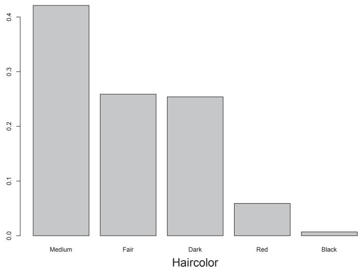  
Bar Chart of Haircolor of Scottish Schoolchildren   
Figure 4.1.1: Bar chart of the Scottish hair color data discussed in Example 4.1.5.

The nonparametric estimate of the pmf is

<table><tr><td>j</td><td>0</td><td>1</td><td>2</td><td>3</td><td>4</td><td>5</td><td>≥6</td></tr><tr><td>p(j)</td><td>0.067</td><td>0.367</td><td>0.233</td><td>0.167</td><td>0.067</td><td>0.067</td><td>0.033</td></tr></table>

The histogram for this data set is given in Figure 4.1.2. Note that counts are used for the vertical axis. If the R vector $\mathbf{x}$ contains the 30 data points, then the following R code computes this histogram:

brs=seq(-.5,6.5,1); hist(x,breaks=brs,xlab="Number of events",ylab="")

# The Distribution of $X$ Is Continuous

For this section, assume that the random sample $X_{1},\ldots ,X_{n}$ is from a continuous random variable $X$ with continuous pdf $f(t)$ . We first sketch an estimate for this pdf at a specified value of $x$ . Then we use this estimate to develop a histogram estimate of the pdf. For an arbitrary but fixed point $x$ and a given $h > 0$ , consider the interval $(x - h,x + h)$ . By the mean value theorem for integrals, we have for some $\xi$ , $|x - \xi | < h$ , that

$$
P (x - h <   X <   x + h) = \int_ {x - h} ^ {x + h} f (t) d t = f (\xi) 2 h \approx f (x) 2 h.
$$

The nonparametric estimate of the leftside is the proportion of the sample items that fall in the interval $(x - h, x + h)$ . This suggests the following nonparametric

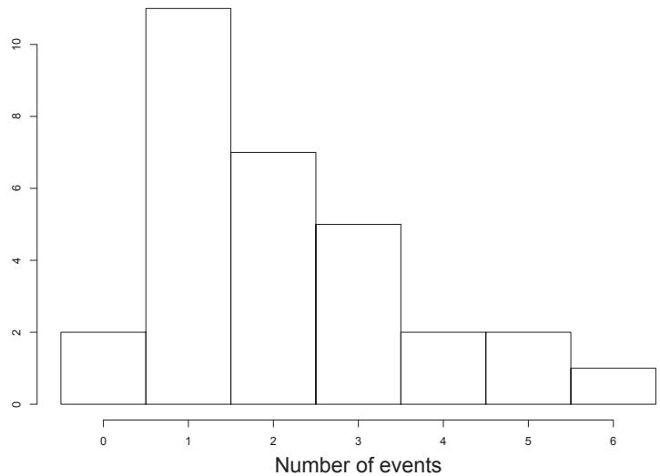  
Histogram of Poisson variates   
Figure 4.1.2: Histogram of the Poisson variates of Example 4.1.6.

estimate of $f(x)$ at a given $x$ :

$$
\widehat {f} (x) = \frac {\# \left\{x - h <   X _ {i} <   x + h \right\}}{2 h n}. \tag {4.1.13}
$$

To write this more formally, consider the indicator statistic

$$
I _ {i} (x) = \left\{ \begin{array}{l l} 1 & x - h <   X _ {i} <   x + h \\ 0 & \text {o t h e r w i s e ,} \end{array} \right. \quad i = 1, \ldots , n.
$$

Then a nonparametric estimator of $f(x)$ is

$$
\widehat {f} (x) = \frac {1}{2 h n} \sum_ {i = 1} ^ {n} I _ {i} (x). \tag {4.1.14}
$$

Since the sample items are identically distributed,

$$
E [ \widehat {f} (x) ] = \frac {1}{2 h n} n f (\xi) 2 h = f (\xi) \rightarrow f (x),
$$

as $h \to 0$ . Hence $\widehat{f}(x)$ is approximately an unbiased estimator of the density $f(x)$ . In density estimation terminology, the indicator function $I_{i}$ is called a rectangular kernel with bandwidth $2h$ . See Sheather and Jones (1991) and Chapter 6 of Lehmann (1999) for discussions of density estimation. The R function density provides a density estimator with several options. For the examples in the text, we use the default option as in Example 4.1.7.

The histogram provides a somewhat crude but often used estimator of the pdf, so a few remarks on it are pertinent. Let $x_{1},\ldots ,x_{n}$ be the realized values of the random sample on a continuous random variable $X$ with pdf $f(x)$ . Our histogram estimate of $f(x)$ is obtained as follows. While for the discrete case, there are natural classes for the histogram, for the continuous case these classes must be chosen. One way of doing this is to select a positive integer $m$ , an $h > 0$ , and a value $a$ such that $a < \min x_{i}$ , so that the $m$ intervals

$$
(a - h, a + h ], (a + h, a + 3 h ], (a + 3 h, a + 5 h ], \dots , (a + (2 m - 3) h, a + (2 m - 1) h ] \tag {4.1.15}
$$

cover the range of the sample $[\min x_i, \max x_i]$ . These intervals form our classes. Let $A_j = (a + (2j - 3)h, a + (2j - 1)h]$ for $j = 1, \ldots, m$ .

Let $\widehat{f}_h(x)$ denote our histogram estimate. If $x \leq a - h$ or $x > a + (2m - 1)h$ then define $\widehat{f}_h(x) = 0$ . For $a - h < x \leq a + (2m - 1)h$ , $x$ is in one, and only one, $A_j$ . For $x \in A_j$ , define $\widehat{f}_h(x)$ to be:

$$
\widehat {f} _ {h} (x) = \frac {\# \left\{x _ {i} \in A _ {j} \right\}}{2 h n}. \tag {4.1.16}
$$

Note that $\widehat{f}_h(x) \geq 0$ and that

$$
\begin{array}{l} \int_ {- \infty} ^ {\infty} \widehat {f} _ {h} (x) d x = \int_ {a - h} ^ {a + (2 m - 1) h} \widehat {f} _ {h} (x) d x = \sum_ {j = 1} ^ {m} \int_ {A _ {j}} \frac {\# \{x _ {i} \in A _ {j} \}}{2 h n} d x \\ = \frac {1}{2 h n} \sum_ {j = 1} ^ {m} \# \left\{x _ {i} \in A _ {j} \right\} [ h (2 j - 1 - 2 j + 3) ] = \frac {2 h}{2 h n} n = 1; \\ \end{array}
$$

so, $\widehat{f}_h(x)$ satisfies the properties of a pdf.

For the discrete case, except when classes are merged, the histogram is unique. For the continuous case, though, the histogram depends on the classes chosen. The resulting picture can be quite different if the classes are changed. Unless there is a compelling reason for the class selection, we recommend using the default classes selected by the computational algorithm. The histogram algorithms in most statistical packages such as R are current on recent research for selection of classes. The histogram in the following example is based on default classes.

Example 4.1.7. In Example 4.1.3, we presented a data set involving sulfur dioxide concentrations in a damaged Bavarian forest. The histogram of this data set is found in Figure 4.1.3. There are only 24 data points in the sample which are far too few for density estimation. With this in mind, although the distribution of data is mound shaped, the center appears to be too flat for normality. We have overlaid the histogram with the default R density estimate (solid line) which confirms some caution on normality. Recall that sample mean and standard deviations for this data are 53.91667 and 10.07371, respectively. So we also plotted the normal pdf with this mean and standard deviation (dashed line). The R code assumes that the data are in the R vector sulfurdioxide.

hist(sulfur dioxide,xlab="Sulfur dioxide",ylab=" ",pr=T,ylim=c(0,.04))

lines(density(sulfur dioxide))

y=dnorm(sulfur dioxide,53.91667,10.07371);lines(y~sulfur dioxide,lty=2)

The normal density plot seems to be a poor fit.

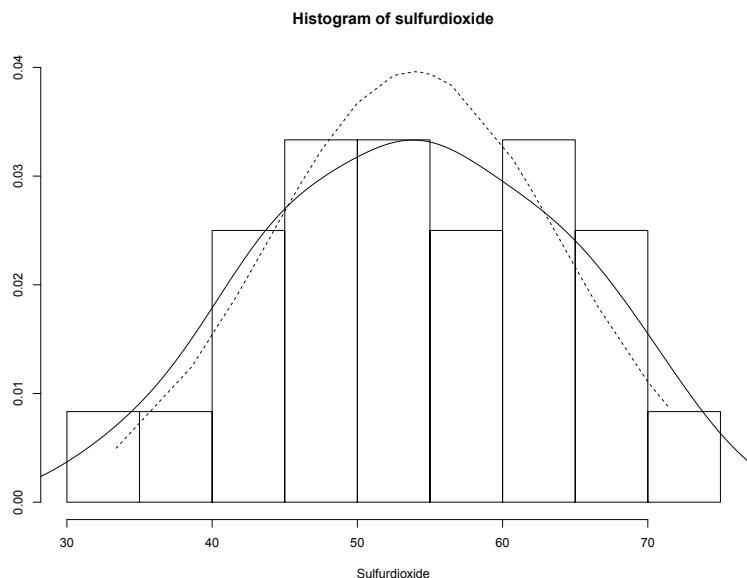  
Figure 4.1.3: Histogram of the sulfur dioxide concentrations in a damaged Bavarian forest overlaid with a density estimate (solid line) and a normal pdf (dashed line) with mean and variance replaced by the sample mean and standard deviations, respectively. Data are given in Example 4.1.3.

# EXERCISES

4.1.1. Twenty motors were put on test under a high-temperature setting. The lifetimes in hours of the motors under these conditions are given below. Also, the data are in the file lifelongemotor.rda at the site listed in the Preface. Suppose we assume that the lifetime of a motor under these conditions, $X$ , has a $\Gamma(1,\theta)$ distribution.

<table><tr><td>1</td><td>4</td><td>5</td><td>21</td><td>22</td><td>28</td><td>40</td><td>42</td><td>51</td><td>53</td></tr><tr><td>58</td><td>67</td><td>95</td><td>124</td><td>124</td><td>160</td><td>202</td><td>260</td><td>303</td><td>363</td></tr></table>

(a) Obtain a histogram of the data and overlay it with a density estimate, using the code hist(x,pr=T); lines(density(x)) where the R vector x contains the data. Based on this plot, do you think that the $\Gamma(1,\theta)$ model is credible?   
(b) Assuming a $\Gamma(1, \theta)$ model, obtain the maximum likelihood estimate $\widehat{\theta}$ of $\theta$ and locate it on your histogram. Next overlay the pdf of a $\Gamma(1, \widehat{\theta})$ distribution on

the histogram. Use the R function dgamma(x, shape=1, scale=0) to evaluate the pdf.

(c) Obtain the sample median of the data, which is an estimate of the median lifetime of a motor. What parameter is it estimating (i.e., determine the median of $X$ )?   
(d) Based on the mle, what is another estimate of the median of $X$ ?

4.1.2. Here are the weights of 26 professional baseball pitchers; [see page 76 of Hettmansperger and McKean (2011) for the complete data set]. The data are in R file bb.rda. Suppose we assume that the weight of a professional baseball pitcher is normally distributed with mean $\mu$ and variance $\sigma^2$ .

<table><tr><td>160</td><td>175</td><td>180</td><td>185</td><td>185</td><td>185</td><td>190</td><td>190</td><td>195</td><td>195</td><td>195</td><td>200</td><td>200</td></tr><tr><td>200</td><td>200</td><td>205</td><td>205</td><td>210</td><td>210</td><td>218</td><td>219</td><td>220</td><td>222</td><td>225</td><td>225</td><td>232</td></tr></table>

(a) Obtain a histogram of the data. Based on this plot, is a normal probability model credible?   
(b) Obtain the maximum likelihood estimates of $\mu$ , $\sigma^2$ , $\sigma$ , and $\mu/\sigma$ . Locate your estimate of $\mu$ on your plot in part (a). Then overlay the normal pdf with these estimates on your histogram in Part (a).   
(c) Using the binomial model, obtain the maximum likelihood estimate of the proportion $p$ of professional baseball pitchers who weigh over 215 pounds.   
(d) Determine the mle of $p$ assuming that the weight of a professional baseball player follows the normal probability model $N(\mu, \sigma^2)$ with $\mu$ and $\sigma$ unknown.

4.1.3. Suppose the number of customers $X$ that enter a store between the hours 9:00 a.m. and 10:00 a.m. follows a Poisson distribution with parameter $\theta$ . Suppose a random sample of the number of customers that enter the store between 9:00 a.m. and 10:00 a.m. for 10 days results in the values

<table><tr><td>9</td><td>7</td><td>9</td><td>15</td><td>10</td><td>13</td><td>11</td><td>7</td><td>2</td><td>12</td></tr></table>

(a) Determine the maximum likelihood estimate of $\theta$ . Show that it is an unbiased estimator.   
(b) Based on these data, obtain the realization of your estimator in part (a). Explain the meaning of this estimate in terms of the number of customers.

4.1.4. For Example 4.1.3, verify equations (4.1.4)-(4.1.8).   
4.1.5. Let $X_{1}, X_{2}, \ldots, X_{n}$ be a random sample from a continuous-type distribution.   
(a) Find $P(X_{1}\leq X_{2}),P(X_{1}\leq X_{2},X_{1}\leq X_{3}),\ldots ,P(X_{1}\leq X_{i},i = 2,3,\ldots ,n).$

(b) Suppose the sampling continues until $X_{1}$ is no longer the smallest observation (i.e., $X_{j} < X_{1} \leq X_{i}, i = 2,3,\ldots ,j - 1$ ). Let $Y$ equal the number of trials, not including $X_{1}$ , until $X_{1}$ is no longer the smallest observation (i.e., $Y = j - 1$ ). Show that the distribution of $Y$ is

$$
P (Y = y) = \frac {1}{y (y + 1)}, \quad y = 1, 2, 3, \dots .
$$

(c) Compute the mean and variance of $Y$ if they exist.

4.1.6. Consider the estimator of the pmf in expression (4.1.10). In equation (4.1.11), we showed that this estimator is unbiased. Find the variance of the estimator and its mgf.

4.1.7. The data set on Scottish schoolchildren discussed in Example 4.1.5 included the eye colors of the children also. The frequencies of their eye colors are

<table><tr><td>Blue</td><td>Light</td><td>Medium</td><td>Dark</td></tr><tr><td>2978</td><td>6697</td><td>7511</td><td>5175</td></tr></table>

Use these frequencies to obtain a bar chart and an estimate of the associated pmf.

4.1.8. Recall that for the parameter $\eta = g(\theta)$ , the mle of $\eta$ is $g(\widehat{\theta})$ , where $\widehat{\theta}$ is the mle of $\theta$ . Assuming that the data in Example 4.1.6 were drawn from a Poisson distribution with mean $\lambda$ , obtain the mle of $\lambda$ and then use it to obtain the mle of the pmf. Compare the mle of the pmf to the nonparametric estimate. Note: For the domain value 6, obtain the mle of $P(X \geq 6)$ .

4.1.9. Consider the nonparametric estimator, (4.1.14), of a pdf.

(a) Obtain its mean and determine the bias of the estimator.   
(b) Obtain the variance of the estimator.

4.1.10. This data set was downloaded from the site http://lib.stat.cmu.edu/DASL/ at Carnegie-Melon university. The original source is Willerman et al. (1991). The data consist of a sample of brain information recorded on 40 college students. The variables include gender, height, weight, three IQ measurements, and Magnetic Resonance Imaging (MRI) counts, as a determination of brain size. The data are in the rda file braindata.rda at the sites referenced in the Preface. For this exercise, consider the MRI counts.

(a) Load the rda file braindata.rda and print the MRI data, using the code:  
[ \text{mri} < -\text{braindata}[7]; \text{print}(\text{mri}) ]   
(b) Obtain a histogram of the data, hist(mri,pr=T). Comment on the shape.   
(c) Overlay the default density estimator, lines(density(mri)). Comment on the shape.

(d) Obtain the sample mean and standard deviation and on the histogram overlay the normal pdf with these estimates as parameters, using mris = sort(mri) and lines(dnorm(mris, mean(mris), sd(mris)) ~ mris, lty=2). Comment on the fit.   
(e) Determine the proportions of the data within 1 and 2 standard deviations of the sample mean and compare these with the empirical rule.

4.1.11. This is a famous data set on the speed of light recorded by the scientist Simon Newcomb. The data set was obtained at the Carnegie Melon site given in Exercise 4.1.10 and it can also be found in the rda file speedlight.rda at the sites referenced in the Preface. Stigler (1977) presents an informative discussion of this data set.

(a) Load the rda file and type the command print(speed). As Stigler notes, the data values $\times 10^{-3} + 24.8$ are Newcomb's data values; hence, negative items can occur. Also, in the unit of the data the "true value" is 33.02. Discuss the data.   
(b) Obtain a histogram of the data. Comment on the shape.   
(c) On the histogram overlay the default density estimator. Comment on the shape.   
(d) Obtain the sample mean and standard deviation and on the histogram overlay the normal pdf with these estimates as parameters. Comment on the fit.   
(e) Determine the proportions of the data within 1 and 2 standard deviations of the sample mean and compare these with the empirical rule.

# 4.2 Confidence Intervals

Let us continue with the statistical problem that we were discussing in Section 4.1. Recall that the random variable of interest $X$ has density $f(x; \theta), \theta \in \Omega$ , where $\theta$ is unknown. In that section, we discussed estimating $\theta$ by a statistic $\widehat{\theta} = \widehat{\theta}(X_1, \ldots, X_n)$ , where $X_1, \ldots, X_n$ is a sample from the distribution of $X$ . When the sample is drawn, it is unlikely that the value of $\widehat{\theta}$ is the true value of the parameter. In fact, if $\widehat{\theta}$ has a continuous distribution, then $P_{\theta}(\widehat{\theta} = \theta) = 0$ , where the notation $P_{\theta}$ denotes that the probability is computed when $\theta$ is the true parameter. What is needed is an estimate of the error of the estimation; i.e., by how much did $\widehat{\theta}$ miss $\theta$ ? In this section, we embody this estimate of error in terms of a confidence interval, which we now formally define:

Definition 4.2.1 (Confidence Interval). Let $X_{1}, X_{2}, \ldots, X_{n}$ be a sample on a random variable $X$ , where $X$ has pdf $f(x; \theta)$ , $\theta \in \Omega$ . Let $0 < \alpha < 1$ be specified. Let $L = L(X_{1}, X_{2}, \ldots, X_{n})$ and $U = U(X_{1}, X_{2}, \ldots, X_{n})$ be two statistics. We say that the interval $(L, U)$ is a $(1 - \alpha)100\%$ confidence interval for $\theta$ if

$$
1 - \alpha = P _ {\theta} [ \theta \in (L, U) ]. \tag {4.2.1}
$$

That is, the probability that the interval includes $\theta$ is $1 - \alpha$ , which is called the confidence coefficient or the confidence level of the interval.

Once the sample is drawn, the realized value of the confidence interval is $(l,u)$ , an interval of real numbers. Either the interval $(l,u)$ traps $\theta$ or it does not. One way of thinking of a confidence interval is in terms of a Bernoulli trial with probability of success $1 - \alpha$ . If one makes, say, $M$ independent $(1 - \alpha)100\%$ confidence intervals over a period of time, then one would expect to have $(1 - \alpha)M$ successful confidence intervals (those that trap $\theta$ ) over this period of time. Hence one feels $(1 - \alpha)100\%$ confident that the true value of $\theta$ lies in the interval $(l,u)$ .

A measure of efficiency based on a confidence interval is its expected length. Suppose $(L_1, U_1)$ and $(L_2, U_2)$ are two confidence intervals for $\theta$ that have the same confidence coefficient. Then we say that $(L_1, U_1)$ is more efficient than $(L_2, U_2)$ if $E_{\theta}(U_1 - L_1) \leq E_{\theta}(U_2 - L_2)$ for all $\theta \in \Omega$ .

There are several procedures for obtaining confidence intervals. We explore one of them in this section. It is based on a pivot random variable. The pivot is usually a function of an estimator of $\theta$ and the parameter and, further, the distribution of the pivot is known. Using this information, an algebraic derivation can often be used to obtain a confidence interval. The next several examples illustrate the pivot method. A second way to obtain a confidence interval involves distribution free techniques, as used in Section 4.4.2 to determine confidence intervals for quantiles.

Example 4.2.1 (Confidence Interval for $\mu$ Under Normality). Suppose the random variables $X_{1},\ldots ,X_{n}$ are a random sample from a $N(\mu ,\sigma^2)$ distribution. Let $\overline{X}$ and $S^2$ denote the sample mean and sample variance, respectively. Recall from the last section that $\overline{X}$ is the mle of $\mu$ and $[(n - 1) / n]S^2$ is the mle of $\sigma^2$ . By part (d) of Theorem 3.6.1, the random variable $T = (\overline{X} -\mu) / (S / \sqrt{n})$ has a $t$ -distribution with $n - 1$ degrees of freedom. The random variable $T$ is our pivot variable.

For $0 < \alpha < 1$ , define $t_{\alpha /2,n - 1}$ to be the upper $\alpha /2$ critical point of a $t$ -distribution with $n - 1$ degrees of freedom; i.e., $\alpha /2 = P(T > t_{\alpha /2,n - 1})$ . Using a simple algebraic derivation, we obtain

$$
\begin{array}{l} 1 - \alpha = P (- t _ {\alpha / 2, n - 1} <   T <   t _ {\alpha / 2, n - 1}) \\ = P _ {\mu} \left(- t _ {\alpha / 2, n - 1} <   \frac {\bar {X} - \mu}{S / \sqrt {n}} <   t _ {\alpha / 2, n - 1}\right) \\ = P _ {\mu} \left(- t _ {\alpha / 2, n - 1} \frac {S}{\sqrt {n}} <   \bar {X} - \mu <   t _ {\alpha / 2, n - 1} \frac {S}{\sqrt {n}}\right) \\ = P _ {\mu} \left(\bar {X} - t _ {\alpha / 2, n - 1} \frac {S}{\sqrt {n}} <   \mu <   \bar {X} + t _ {\alpha / 2, n - 1} \frac {S}{\sqrt {n}}\right). \tag {4.2.2} \\ \end{array}
$$

Once the sample is drawn, let $\overline{x}$ and $s$ denote the realized values of the statistics $\overline{X}$ and $S$ , respectively. Then a $(1 - \alpha)100\%$ confidence interval for $\mu$ is given by

$$
\left(\bar {x} - t _ {\alpha / 2, n - 1} s / \sqrt {n}, \bar {x} + t _ {\alpha / 2, n - 1} s / \sqrt {n}\right). \tag {4.2.3}
$$

This interval is often referred to as the $(1 - \alpha)100\%$ $t$ -interval for $\mu$ . The estimate of the standard deviation of $\overline{X}$ , $s / \sqrt{n}$ , is referred to as the standard error of $\overline{X}$ .

In Example 4.1.3, we presented a data set on sulfur dioxide concentrations in a damaged Bavarian forest. Let $\mu$ denote the true mean sulfur dioxide concentration. Recall, based on the data, that our estimate of $\mu$ is $\overline{x} = 53.92$ with sample standard deviation $s = \sqrt{101.48} = 10.07$ . Since the sample size is $n = 24$ , for a $99\%$ confidence interval the $t$ -critical value is $t_{0.005,23} = \mathrm{qt}(.995,23) = 2.807$ . Based on these values, the confidence interval in expression (4.2.3) can be calculated. Assuming that the R vector sulfurdioxide contains the sample, the R code to compute this interval is t.test(sulfurdioxide, conf.level=0.99), which results in the $99\%$ confidence interval (48.14, 59.69). Many scientists write this interval as $53.92 \pm 5.78$ . In this way, we can see our estimate of $\mu$ and the margin of error.

The distribution of the pivot random variable $T = (\overline{X} - \mu) / (s / \sqrt{n})$ of the last example depends on the normality of the sampled items; however, this is approximately true even if the sampled items are not drawn from a normal distribution. The Central Limit Theorem (CLT) shows that the distribution of $T$ is approximately $N(0,1)$ . In order to use this result now, we state the CLT now, leaving its proof to Chapter 5; see Theorem 5.3.1.

Theorem 4.2.1 (Central Limit Theorem). Let $X_{1}, X_{2}, \ldots, X_{n}$ denote the observations of a random sample from a distribution that has mean $\mu$ and finite variance $\sigma^2$ . Then the distribution function of the random variable $W_{n} = (\overline{X} - \mu) / (\sigma / \sqrt{n})$ converges to $\Phi$ , the distribution function of the $N(0,1)$ distribution, as $n \to \infty$ .

As we further show in Chapter 5, the result stays the same if we replace $\sigma$ by the sample standard deviation $S$ ; that is, under the assumptions of Theorem 4.2.1, the distribution of

$$
Z _ {n} = \frac {\bar {X} - \mu}{S / \sqrt {n}} \tag {4.2.4}
$$

is approximately $N(0,1)$ . For the nonnormal case, as the next example shows, with this result we can obtain an approximate confidence interval for $\mu$ .

Example 4.2.2 (Large Sample Confidence Interval for the Mean $\mu$ ). Suppose $X_{1}, X_{2}, \ldots, X_{n}$ is a random sample on a random variable $X$ with mean $\mu$ and variance $\sigma^2$ , but, unlike the last example, the distribution of $X$ is not normal. However, from the above discussion we know that the distribution of $Z_{n}$ , (4.2.4), is approximately $N(0,1)$ . Hence

$$
1 - \alpha \approx P _ {\mu} \left(- z _ {\alpha / 2} <   \frac {\overline {{X}} - \mu}{S / \sqrt {n}} <   z _ {\alpha / 2}\right).
$$

Using the same algebraic derivation as in the last example, we obtain

$$
1 - \alpha \approx P _ {\mu} \left(\bar {X} - z _ {\alpha / 2} \frac {S}{\sqrt {n}} <   \mu <   \bar {X} + z _ {\alpha / 2} \frac {S}{\sqrt {n}}\right). \tag {4.2.5}
$$

Again, letting $\overline{x}$ and $s$ denote the realized values of the statistics $\overline{X}$ and $S$ , respectively, after the sample is drawn, an approximate $(1 - \alpha)100\%$ confidence interval for $\mu$ is given by

$$
\left(\bar {x} - z _ {\alpha / 2} s / \sqrt {n}, \bar {x} + z _ {\alpha / 2} s / \sqrt {n}\right). \tag {4.2.6}
$$

This is called a large sample confidence interval for $\mu$ .

In practice, we often do not know if the population is normal. Which confidence interval should we use? Generally, for the same $\alpha$ , the intervals based on $t_{\alpha / 2, n - 1}$ are larger than those based on $z_{\alpha / 2}$ . Hence the interval (4.2.3) is generally more conservative than the interval (4.2.6). So in practice, statisticians generally prefer the interval (4.2.3).

Occasionally in practice, the standard deviation $\sigma$ is assumed known. In this case, the confidence interval generally used for $\mu$ is (4.2.6) with $s$ replaced by $\sigma$ .

Example 4.2.3 (Large Sample Confidence Interval for $p$ ). Let $X$ be a Bernoulli random variable with probability of success $p$ , where $X$ is 1 or 0 if the outcome is success or failure, respectively. Suppose $X_1, \ldots, X_n$ is a random sample from the distribution of $X$ . Let $\widehat{p} = \overline{X}$ be the sample proportion of successes. Note that $\widehat{p} = n^{-1} \sum_{i=1}^{n} X_i$ is a sample average and that $\operatorname{Var}(\widehat{p}) = p(1 - p)/n$ . It follows immediately from the CLT that the distribution of $Z = (\widehat{p} - p) / \sqrt{p(1 - p)/n}$ is approximately $N(0,1)$ . Referring to Example 5.1.1 of Chapter 5, we replace $p(1 - p)$ with its estimate $\widehat{p}(1 - \widehat{p})$ . Then proceeding as in the last example, an approximate $(1 - \alpha) 100\%$ confidence interval for $p$ is given by

$$
(\widehat {p} - z _ {\alpha / 2} \sqrt {\widehat {p} (1 - \widehat {p}) / n}, \widehat {p} + z _ {\alpha / 2} \sqrt {\widehat {p} (1 - \widehat {p}) / n}), \tag {4.2.7}
$$

where $\sqrt{\widehat{p}(1 - \widehat{p}) / n}$ is called the standard error of $\widehat{p}$ .

In Example 4.1.2 we discussed a data set involving hip replacements, some of which were squeaky. The outcomes of a hip replacement were squeaky and non-squeaky which we labeled as success or failure, respectively. In the sample there were 28 successes out of 143 replacements. Using R, the $99\%$ confidence interval for $p$ , the probability of a squeaky hip replacement, is computed by prop.test(28,143,conf.level=.99), which results in the interval (0.122, 0.298). So with $99\%$ confidence, we estimate the probability of a squeaky hip replacement to be between 0.122 and 0.298.

# 4.2.1 Confidence Intervals for Difference in Means

A practical problem of interest is the comparison of two distributions, that is, comparing the distributions of two random variables, say $X$ and $Y$ . In this section, we compare the means of $X$ and $Y$ . Denote the means of $X$ and $Y$ by $\mu_1$ and $\mu_2$ , respectively. In particular, we obtain confidence intervals for the difference $\Delta = \mu_1 - \mu_2$ . Assume that the variances of $X$ and $Y$ are finite and denote them as $\sigma_1^2 = \operatorname{Var}(X)$ and $\sigma_2^2 = \operatorname{Var}(Y)$ . Let $X_1, \ldots, X_{n_1}$ be a random sample from the distribution of $X$ and let $Y_1, \ldots, Y_{n_2}$ be a random sample from the distribution of $Y$ . Assume that the samples were gathered independently of one another. Let $\overline{X} = n_1^{-1}\sum_{i=1}^{n_1}X_i$ and $\overline{Y} = n_2^{-1}\sum_{i=1}^{n_2}Y_i$ be the sample means. Let $\widehat{\Delta} = \overline{X} - \overline{Y}$ . The statistic $\widehat{\Delta}$ is an unbiased estimator of $\Delta$ . This difference, $\widehat{\Delta} - \Delta$ , is the numerator of the pivot random variable. By independence of the samples,

$$
\mathrm {V a r} (\widehat {\Delta}) = \frac {\sigma_ {1} ^ {2}}{n _ {1}} + \frac {\sigma_ {2} ^ {2}}{n _ {2}}.
$$

Let $S_1^2 = (n_1 - 1)^{-1}\sum_{i=1}^{n_1}(X_i - \overline{X})^2$ and $S_2^2 = (n_2 - 1)^{-1}\sum_{i=1}^{n_2}(Y_i - \overline{Y})^2$ be the sample variances. Then estimating the variances by the sample variances, consider the random variable

$$
Z = \frac {\widehat {\Delta} - \Delta}{\sqrt {\frac {S _ {1} ^ {2}}{n _ {1}} + \frac {S _ {2} ^ {2}}{n _ {2}}}}. \tag {4.2.8}
$$

By the independence of the samples and Theorem 4.2.1, this pivot variable has an approximate $N(0,1)$ distribution. This leads to the approximate $(1 - \alpha)100\%$ confidence interval for $\Delta = \mu_1 - \mu_2$ given by

$$
\left(\left(\bar {x} - \bar {y}\right) - z _ {\alpha / 2} \sqrt {\frac {s _ {1} ^ {2}}{n _ {1}} + \frac {s _ {2} ^ {2}}{n _ {2}}}, \left(\bar {x} - \bar {y}\right) + z _ {\alpha / 2} \sqrt {\frac {s _ {1} ^ {2}}{n _ {1}} + \frac {s _ {2} ^ {2}}{n _ {2}}}\right), \tag {4.2.9}
$$

where $\sqrt{(s_1^2 / n_1) + (s_2^2 / n_2)}$ is the standard error of $\overline{X} -\overline{Y}$ . This is a large sample $(1 - \alpha)100\%$ confidence interval for $\mu_{1} - \mu_{2}$ .

The above confidence interval is approximate. In this situation we can obtain exact confidence intervals if we assume that the distributions of $X$ and $Y$ are normal with the same variance; i.e., $\sigma_1^2 = \sigma_2^2$ . Thus the distributions can differ only in location, i.e., a location model. Assume then that $X$ is distributed $N(\mu_1, \sigma^2)$ and $Y$ is distributed $N(\mu_2, \sigma^2)$ , where $\sigma^2$ is the common variance of $X$ and $Y$ . As above, let $X_1, \ldots, X_{n_1}$ be a random sample from the distribution of $X$ , let $Y_1, \ldots, Y_{n_2}$ be a random sample from the distribution of $Y$ , and assume that the samples are independent of one another. Let $n = n_1 + n_2$ be the total sample size. Our estimator of $\Delta$ is $\overline{X} - \overline{Y}$ . Our goal is to show that a pivot random variable, defined below, has a $t$ -distribution, which is defined in Section 3.6.

Because $\overline{X}$ is distributed $N(\mu_1, \sigma^2 / n_1)$ , $\overline{Y}$ is distributed $N(\mu_2, \sigma^2 / n_2)$ , and $\overline{X}$ and $\overline{Y}$ are independent, we have the result

$$
\frac {(\bar {X} - \bar {Y}) - \left(\mu_ {1} - \mu_ {2}\right)}{\sigma \sqrt {\frac {1}{n _ {1}} + \frac {1}{n _ {2}}}} \text {h a s a} N (0, 1) \tag {4.2.10}
$$

This serves as the numerator of our $T$ -statistic.

Let

$$
S _ {p} ^ {2} = \frac {\left(n _ {1} - 1\right) S _ {1} ^ {2} + \left(n _ {2} - 1\right) S _ {2} ^ {2}}{n _ {1} + n _ {2} - 2}. \tag {4.2.11}
$$

Note that $S_{p}^{2}$ is a weighted average of $S_{1}^{2}$ and $S_{2}^{2}$ . It is easy to see that $S_{p}^{2}$ is an unbiased estimator of $\sigma^2$ . It is called the pooled estimator of $\sigma^2$ . Also, because $(n_{1} - 1)S_{1}^{2} / \sigma^{2}$ has a $\chi^2 (n_1 - 1)$ distribution, $(n_{2} - 1)S_{2}^{2} / \sigma^{2}$ has a $\chi^2 (n_2 - 1)$ distribution, and $S_{1}^{2}$ and $S_{2}^{2}$ are independent, we have that $(n - 2)S_p^2 /\sigma^2$ has a $\chi^2 (n - 2)$ distribution; see Corollary 3.3.1. Finally, because $S_{1}^{2}$ is independent of $\overline{X}$ and $S_{2}^{2}$ is independent of $\overline{Y}$ , and the random samples are independent of each other, it follows that $S_{p}^{2}$ is independent of expression (4.2.10). Therefore, from the

result of Section 3.6.1 concerning Student's $t$ -distribution, we have that

$$
\begin{array}{l} T = \frac {[ (\overline {{X}} - \overline {{Y}}) - (\mu_ {1} - \mu_ {2}) ] / \sigma \sqrt {n _ {1} ^ {- 1} + n _ {2} ^ {- 1}}}{\sqrt {(n - 2) S _ {p} ^ {2} / (n - 2) \sigma^ {2}}} \\ = \frac {(\bar {X} - \bar {Y}) - \left(\mu_ {1} - \mu_ {2}\right)}{S _ {p} \sqrt {\frac {1}{n _ {1}} + \frac {1}{n _ {2}}}} \tag {4.2.12} \\ \end{array}
$$

has a $t$ -distribution with $n - 2$ degrees of freedom. From this last result, it is easy to see that the following interval is an exact $(1 - \alpha)100\%$ confidence interval for $\Delta = \mu_1 - \mu_2$ :

$$
\left(\left(\bar {x} - \bar {y}\right) - t _ {\left(\alpha / 2, n - 2\right)} s _ {p} \sqrt {\frac {1}{n _ {1}} + \frac {1}{n _ {2}}}, \left(\bar {x} - \bar {y}\right) + t _ {\left(\alpha / 2, n - 2\right)} s _ {p} \sqrt {\frac {1}{n _ {1}} + \frac {1}{n _ {2}}}\right). \tag {4.2.13}
$$

A consideration of the difficulty encountered when the unknown variances of the two normal distributions are not equal is assigned to one of the exercises.

Example 4.2.4. To illustrate the pooled $t$ -confidence interval, consider the baseball data presented in Hettmansperger and McKean (2011). It consists of 6 variables recorded on 59 professional baseball players of which 33 are hitters and 26 are pitchers. The data can be found in the file bb.rda located at the site listed in Chapter 1. The height in inches of a player is one of these measurements and in this example we consider the difference in heights between pitchers and hitters. Denote the true mean heights of the pitchers and hitters by $\mu_p$ and $\mu_h$ , respectively, and let $\Delta = \mu_p - \mu_h$ . The sample averages of the heights are 75.19 and 72.67 inches for the pitchers and hitters, respectively. Hence, our point estimate of $\Delta$ is 2.53 inches. Assuming the file bb.rda has been loaded in R, the following R segment computes the 95% confidence interval for $\Delta$ :

```c
hitht=height[hitpitind==1]; pitht=height[hitpitind==0]

t.test(pitht,hihht,var.equal=T)

The confidence interval computes to (1.42, 3.63). Note that all values in the confidence interval are positive, indicating that on the average pitchers are taller than hitters.

Remark 4.2.1. Suppose $X$ and $Y$ are not normally distributed but that their distributions differ only in location. As we show in Chapter 5, the above interval, (4.2.13), is then approximate and not exact.

# 4.2.2 Confidence Interval for Difference in Proportions

Let $X$ and $Y$ be two independent random variables with Bernoulli distributions $b(1, p_1)$ and $b(1, p_2)$ , respectively. Let us now turn to the problem of finding a confidence interval for the difference $p_1 - p_2$ . Let $X_1, \ldots, X_{n_1}$ be a random sample from the distribution of $X$ and let $Y_1, \ldots, Y_{n_2}$ be a random sample from the distribution of $Y$ . As above, assume that the samples are independent of one another and let

$n = n_1 + n_2$ be the total sample size. Our estimator of $p_1 - p_2$ is the difference in sample proportions, which, of course, is given by $\overline{X} -\overline{Y}$ . We use the traditional notation and write $\hat{p}_1$ and $\hat{p}_2$ instead of $\overline{X}$ and $\overline{Y}$ , respectively. Hence, from the above discussion, an interval such as (4.2.9) serves as an approximate confidence interval for $p_1 - p_2$ . Here, $\sigma_1^2 = p_1(1 - p_1)$ and $\sigma_2^2 = p_2(1 - p_2)$ . In the interval, we estimate these by $\hat{p}_1(1 - \hat{p}_1)$ and $\hat{p}_2(1 - \hat{p}_2)$ , respectively. Thus our approximate $(1 - \alpha)100\%$ confidence interval for $p_1 - p_2$ is

$$
\hat {p} _ {1} - \hat {p} _ {2} \pm z _ {\alpha / 2} \sqrt {\frac {\hat {p} _ {1} (1 - \hat {p} _ {1})}{n _ {1}} + \frac {\hat {p} _ {2} (1 - \hat {p} _ {2})}{n _ {2}}}. \tag {4.2.14}
$$

Example 4.2.5. Kloke and McKean (2014), page 33, discuss a data set from the original clinical study of the Salk polio vaccine in 1954. At random, one group of children (Treated) received the vaccine while the other group (Control) received a placebo. Let $p_c$ and $p_T$ denote the true proportions of polio cases for control and treated populations, respectively. The tabled results are:

<table><tr><td>Group</td><td>No. Children</td><td>No. Polio Cases</td><td>Sample Proportion</td></tr><tr><td>Treated</td><td>200,745</td><td>57</td><td>0.000284</td></tr><tr><td>Control</td><td>201,229</td><td>199</td><td>0.000706</td></tr></table>

Note that $\hat{p}_C > \hat{p}_T$ . The following R segment computes the $95\%$ confidence interval for $p_c - p_T$ :

prop.test(c(199,57),c(201229,200745))

The confidence interval is (0.00054, 0.00087). All values in this interval are positive, indicating that the vaccine is effective in reducing the incidence of polio.

# EXERCISES

4.2.1. Let the observed value of the mean $\overline{X}$ and of the sample variance of a random sample of size 20 from a distribution that is $N(\mu, \sigma^2)$ be 81.2 and 26.5, respectively. Find respectively $90\%$ , $95\%$ and $99\%$ confidence intervals for $\mu$ . Note how the lengths of the confidence intervals increase as the confidence increases.

4.2.2. Consider the data on the lifetimes of motors given in Exercise 4.1.1. Obtain a large sample $95\%$ confidence interval for the mean lifetime of a motor.

4.2.3. Suppose we assume that $X_{1}, X_{2}, \ldots, X_{n}$ is a random sample from a $\Gamma(1, \theta)$ distribution.

(a) Show that the random variable $(2 / \theta)\sum_{i = 1}^{n}X_{i}$ has a $\chi^2$ -distribution with $2n$ degrees of freedom.   
(b) Using the random variable in part (a) as a pivot random variable, find a $(1 - \alpha)100\%$ confidence interval for $\theta$ .   
(c) Obtain the confidence interval in part (b) for the data of Exercise 4.1.1 and compare it with the interval you obtained in Exercise 4.2.2.

4.2.4. In Example 4.2.4, for the baseball data, we found a confidence interval for the mean difference in heights between the pitchers and hitters. In this exercise, find the pooled $t95\%$ confidence interval for the mean difference in weights between the pitchers and hitters.

4.2.5. In the baseball data set discussed in the last exercise, it was found that out of the 59 baseball players, 15 were left-handed. Is this odd, since the proportion of left-handed males in America is about $11\%$ ? Answer by using (4.2.7) to construct a $95\%$ approximate confidence interval for $p$ , the proportion of left-handed professional baseball players.

4.2.6. Let $\overline{X}$ be the mean of a random sample of size $n$ from a distribution that is $N(\mu, 9)$ . Find $n$ such that $P(\overline{X} - 1 < \mu < \overline{X} + 1) = 0.90$ , approximately.

4.2.7. Let a random sample of size 17 from the normal distribution $N(\mu, \sigma^2)$ yield $\overline{x} = 4.7$ and $s^2 = 5.76$ . Determine a 90% confidence interval for $\mu$ .

4.2.8. Let $\overline{X}$ denote the mean of a random sample of size $n$ from a distribution that has mean $\mu$ and variance $\sigma^2 = 10$ . Find $n$ so that the probability is approximately 0.954 that the random interval $(\overline{X} - \frac{1}{2}, \overline{X} + \frac{1}{2})$ includes $\mu$ .

4.2.9. Let $X_{1}, X_{2}, \ldots, X_{9}$ be a random sample of size 9 from a distribution that is $N(\mu, \sigma^2)$ .

(a) If $\sigma$ is known, find the length of a $95\%$ confidence interval for $\mu$ if this interval is based on the random variable $\sqrt{9} (\overline{X} -\mu) / \sigma$   
(b) If $\sigma$ is unknown, find the expected value of the length of a $95\%$ confidence interval for $\mu$ if this interval is based on the random variable $\sqrt{9} (\overline{X} -\mu) / S$ . Hint: Write $E(S) = (\sigma /\sqrt{n - 1})E[(n - 1)S^2 /\sigma^2)^{1 / 2}]$ .   
(c) Compare these two answers.

4.2.10. Let $X_{1}, X_{2}, \ldots, X_{n}, X_{n+1}$ be a random sample of size $n + 1$ , $n > 1$ , from a distribution that is $N(\mu, \sigma^2)$ . Let $\overline{X} = \sum_{1}^{n} X_i / n$ and $S^2 = \sum_{1}^{n} (X_i - \overline{X})^2 / (n - 1)$ . Find the constant $c$ so that the statistic $c(\overline{X} - X_{n+1}) / S$ has a $t$ -distribution. If $n = 8$ , determine $k$ such that $P(\overline{X} - kS < X_9 < \overline{X} + kS) = 0.80$ . The observed interval $(\overline{x} - ks, \overline{x} + ks)$ is often called an $80\%$ prediction interval for $X_9$ .

4.2.11. Let $X_{1},\ldots ,X_{n}$ be a random sample from a $N(0,1)$ distribution. Then the probability that the random interval $\overline{X}\pm t_{\alpha /2,n - 1}(s / \sqrt{n})$ traps $\mu = 0$ is $(1 - \alpha)$ . To verify this empirically, in this exercise, we simulate $m$ such intervals and calculate the proportion that trap 0, which should be "close" to $(1 - \alpha)$ .

(a) Set $n = 10$ and $m = 50$ . Run the R code mat = matrix(rnorm(m*n), ncol=n) which generates $m$ samples of size $n$ from the $N(0,1)$ distribution. Each row of the matrix mat contains a sample. For this matrix of samples, the function below computes the $(1 - \alpha)100\%$ confidence intervals, returning them in a $m \times 2$ matrix. Run this function on your generated matrix mat. What is the proportion of successful confidence intervals?

```txt
getcis <- function(mat, cc = .90) {
numb <- length(mat[,1]); ci <- c()
for(j in 1: numb)
{ci <- rbind(ci, t.test(mat[j], conf.level = cc), $conf.int)}
return(ci)}
This function is also at the site discussed in Section 1.1. 
```

(b) Run the following code which plots the intervals. Label the successful intervals. Comment on the variability of the lengths of the confidence intervals. cis<-getcis(mat); $x<-1:m$ plot(c(cis[,1],cis[,2])~c(x,x),pch="",xlab="Sample",ylab="CI") points(cis[,1]~x,pch="L");points(cis[,2]~x,pch="U");abline(h=0)

4.2.12. In Exercise 4.2.11, the sampling was from the $N(0,1)$ distribution. Show, however, that setting $\mu = 0$ and $\sigma = 1$ is without loss of generality.

Hint: First, $X_{1},\ldots ,X_{n}$ is a random sample from the $N(\mu ,\sigma^2)$ if and only if $Z_{1},\ldots ,Z_{n}$ is a random sample from the $N(0,1)$ , where $Z_{i} = (X_{i} - \mu) / \sigma$ . Then show the confidence interval based on the $Z_{i}$ 's contains 0 if and only if the confidence interval based on the $X_{i}$ 's contains $\mu$ .

4.2.13. Change the code in the R function getcis so that it also returns the vector, ind, where ind[i] = 1 if the $i$ th confidence interval is successful and 0 otherwise. Show that the empirical confidence level is mean(ind).

(a) Run 10,000 simulations for the normal setup in Exercise 4.2.11 and compute the empirical confidence level.   
(b) Run 10,000 simulations when the sampling is from the Cauchy distribution, (1.8.8), and compute the empirical confidence level. Does it differ from (a)? Note that the R code rcauchy(k) returns a sample of size $k$ from this Cauchy distribution.   
(c) Note that these empirical confidence levels are proportions from samples that are independent. Hence, use the $95\%$ confidence interval given in expression (4.2.14) to statistically investigate whether or not the true confidence levels differ. Comment.

4.2.14. Let $\overline{X}$ denote the mean of a random sample of size 25 from a gamma-type distribution with $\alpha = 4$ and $\beta >0$ . Use the Central Limit Theorem to find an approximate 0.954 confidence interval for $\mu$ , the mean of the gamma distribution. Hint: Use the random variable $(\overline{X} -4\beta) / (4\beta^{2} / 25)^{1 / 2} = 5\overline{X} /2\beta -10$   
4.2.15. Let $\overline{x}$ be the observed mean of a random sample of size $n$ from a distribution having mean $\mu$ and known variance $\sigma^2$ . Find $n$ so that $\overline{x} - \sigma / 4$ to $\overline{x} + \sigma / 4$ is an approximate $95\%$ confidence interval for $\mu$ .   
4.2.16. Assume a binomial model for a certain random variable. If we desire a $90\%$ confidence interval for $p$ that is at most 0.02 in length, find $n$ .

Hint: Note that $\sqrt{(y / n)(1 - y / n)}\leq \sqrt{(\frac{1}{2})(1 - \frac{1}{2})}.$

4.2.17. It is known that a random variable $X$ has a Poisson distribution with parameter $\mu$ . A sample of 200 observations from this distribution has a mean equal to 3.4. Construct an approximate $90\%$ confidence interval for $\mu$ .

4.2.18. Let $X_{1}, X_{2}, \ldots, X_{n}$ be a random sample from $N(\mu, \sigma^2)$ , where both parameters $\mu$ and $\sigma^2$ are unknown. A confidence interval for $\sigma^2$ can be found as follows. We know that $(n - 1)S^2 / \sigma^2$ is a random variable with a $\chi^2(n - 1)$ distribution. Thus we can find constants $a$ and $b$ so that $P((n - 1)S^2 / \sigma^2 < b) = 0.975$ and $P(a < (n - 1)S^2 / \sigma^2 < b) = 0.95$ . In R, $b = q\mathrm{chisq}(0.975, n-1)$ , while $a = q\mathrm{chisq}(0.025, n-1)$ .

(a) Show that this second probability statement can be written as

$$
P ((n - 1) S ^ {2} / b <   \sigma^ {2} <   (n - 1) S ^ {2} / a) = 0. 9 5.
$$

(b) If $n = 9$ and $s^2 = 7.93$ , find a $95\%$ confidence interval for $\sigma^2$ .

(c) If $\mu$ is known, how would you modify the preceding procedure for finding a confidence interval for $\sigma^2$ ?

4.2.19. Let $X_{1}, X_{2}, \ldots, X_{n}$ be a random sample from a gamma distribution with known parameter $\alpha = 3$ and unknown $\beta > 0$ . In Exercise 4.2.14, we obtained an approximate confidence interval for $\beta$ based on the Central Limit Theorem. In this exercise, we obtain an exact confidence interval by first obtaining the distribution of $2\sum_{1}^{n}X_{i} / \beta$ .

Hint: Follow the procedure outlined in Exercise 4.2.18.

4.2.20. When 100 tacks were thrown on a table, 60 of them landed point up. Obtain a $95\%$ confidence interval for the probability that a tack of this type lands point up. Assume independence.

4.2.21. Let two independent random samples, each of size 10, from two normal distributions $N(\mu_1, \sigma^2)$ and $N(\mu_2, \sigma^2)$ yield $\overline{x} = 4.8$ , $s_1^2 = 8.64$ , $\overline{y} = 5.6$ , $s_2^2 = 7.88$ . Find a 95% confidence interval for $\mu_1 - \mu_2$ .

4.2.22. Let two independent random variables, $Y_{1}$ and $Y_{2}$ , with binomial distributions that have parameters $n_{1} = n_{2} = 100$ , $p_{1}$ , and $p_{2}$ , respectively, be observed to be equal to $y_{1} = 50$ and $y_{2} = 40$ . Determine an approximate 90% confidence interval for $p_{1} - p_{2}$ .

4.2.23. Discuss the problem of finding a confidence interval for the difference $\mu_1 - \mu_2$ between the two means of two normal distributions if the variances $\sigma_1^2$ and $\sigma_2^2$ are known but not necessarily equal.

4.2.24. Discuss Exercise 4.2.23 when it is assumed that the variances are unknown and unequal. This is a very difficult problem, and the discussion should point out exactly where the difficulty lies. If, however, the variances are unknown but their ratio $\sigma_1^2 / \sigma_2^2$ is a known constant $k$ , then a statistic that is a $T$ random variable can again be used. Why?

4.2.25. To illustrate Exercise 4.2.24, let $X_{1}, X_{2}, \ldots, X_{9}$ and $Y_{1}, Y_{2}, \ldots, Y_{12}$ represent two independent random samples from the respective normal distributions $N(\mu_{1}, \sigma_{1}^{2})$ and $N(\mu_{2}, \sigma_{2}^{2})$ . It is given that $\sigma_{1}^{2} = 3\sigma_{2}^{2}$ , but $\sigma_{2}^{2}$ is unknown. Define a random variable that has a $t$ -distribution that can be used to find a 95% confidence interval for $\mu_{1} - \mu_{2}$ .

4.2.26. Let $\overline{X}$ and $\overline{Y}$ be the means of two independent random samples, each of size $n$ , from the respective distributions $N(\mu_1, \sigma^2)$ and $N(\mu_2, \sigma^2)$ , where the common variance is known. Find $n$ such that

$$
P (\overline {{X}} - \overline {{Y}} - \sigma / 5 <   \mu_ {1} - \mu_ {2} <   \overline {{X}} - \overline {{Y}} + \sigma / 5) = 0. 9 0.
$$

4.2.27. Let $X_{1}, X_{2}, \ldots, X_{n}$ and $Y_{1}, Y_{2}, \ldots, Y_{m}$ be two independent random samples from the respective normal distributions $N(\mu_1, \sigma_1^2)$ and $N(\mu_2, \sigma_2^2)$ , where the four parameters are unknown. To construct a confidence interval for the ratio, $\sigma_1^2 / \sigma_2^2$ , of the variances, form the quotient of the two independent $\chi^2$ variables, each divided by its degrees of freedom, namely,

$$
F = \frac {\frac {(m - 1) S _ {2} ^ {2}}{\sigma_ {2} ^ {2}} / (m - 1)}{\frac {(n - 1) S _ {1} ^ {2}}{\sigma_ {1} ^ {2}} / (n - 1)} = \frac {S _ {2} ^ {2} / \sigma_ {2} ^ {2}}{S _ {1} ^ {2} / \sigma_ {1} ^ {2}},
$$

where $S_1^2$ and $S_2^2$ are the respective sample variances.

(a) What kind of distribution does $F$ have?   
(b) Critical values $a$ and $b$ can be found so that $P(F < b) = 0.975$ and $P(a < F < b) = 0.95$ . In R, $b = \mathrm{qf}(0.975, \mathrm{m - 1}, \mathrm{n - 1})$ , while $a = \mathrm{qf}(0.025, \mathrm{m - 1}, \mathrm{n - 1})$ .   
(c) Rewrite the second probability statement as

$$
P \left[ a \frac {S _ {1} ^ {2}}{S _ {2} ^ {2}} <   \frac {\sigma_ {1} ^ {2}}{\sigma_ {2} ^ {2}} <   b \frac {S _ {1} ^ {2}}{S _ {2} ^ {2}} \right] = 0. 9 5.
$$

The observed values, $s_1^2$ and $s_2^2$ , can be inserted in these inequalities to provide a 95% confidence interval for $\sigma_1^2 / \sigma_2^2$ .

We caution the reader on the use of this confidence interval. This interval does depend on the normality of the distributions. If the distributions of $X$ and $Y$ are not normal then the true confidence coefficient may be far from the nominal confidence coefficient; see, for example, page 142 of Hettmansperger and McKean (2011) for discussion.

# 4.3 *Confidence Intervals for Parameters of Discrete Distributions

In this section, we outline a procedure that can be used to obtain exact confidence intervals for the parameters of discrete random variables. Let $X_{1},X_{2},\ldots ,X_{n}$ be a

random sample on a discrete random variable $X$ with pmf $p(x;\theta)$ , $\theta \in \Omega$ , where $\Omega$ is an interval of real numbers. Let $T = T(X_1, X_2, \ldots, X_n)$ be an estimator of $\theta$ with cdf $F_T(t; \theta)$ . Assume that $F_T(t; \theta)$ is a nonincreasing and continuous function of $\theta$ for every $t$ in the support of $T$ . For a given realization of the sample, let $t$ be the realized value of the statistic $T$ . Let $\alpha_1 > 0$ and $\alpha_2 > 0$ be given such that $\alpha = \alpha_1 + \alpha_2 < 0.50$ . Let $\underline{\theta}$ and $\overline{\theta}$ be the solutions of the equations

$$
F _ {T} (t -; \underline {{\theta}}) = 1 - \alpha_ {2} \text {a n d} F _ {T} (t; \bar {\theta}) = \alpha_ {1}, \tag {4.3.1}
$$

where $T-$ is the statistic whose support lags by one value of $T$ 's support. For instance, if $t_i < t_{i+1}$ are consecutive support values of $T$ , then $T = t_{i+1}$ if and only if $T- = t_i$ . Under these conditions, the interval $(\underline{\theta}, \overline{\theta})$ is a confidence interval for $\theta$ with confidence coefficient of at least $1 - \alpha$ . We sketch a proof of this at the end of this section.

Before proceeding with discrete examples, we provide an example in the continuous case where the solution of equations (4.3.1) produces a familiar confidence interval.

Example 4.3.1. Assume $X_{1},\ldots ,X_{n}$ is a random sample from a $N(\theta ,\sigma^2)$ distribution, where $\sigma^2$ is known. Let $\overline{X}$ be the sample mean and let $\overline{x}$ be its value for a given realization of the sample. Recall, from expression (4.2.6), that $\overline{x}\pm z_{\alpha /2}(\sigma /\sqrt{n})$ is a $(1 - \alpha)100\%$ confidence interval for $\theta$ . Assuming $\theta$ is the true mean, the cdf of $\overline{X}$ is $F_{\overline{X};\theta}(t) = \Phi [(t - \theta) / (\sigma /\sqrt{n})]$ , where $\Phi (z)$ is the cdf of a standard normal distribution. Note for the continuous case that $\overline{X} -$ has the same distribution as $\overline{X}$ . Then the first equation of (4.3.1) yields

$$
\Phi [ (\overline {{x}} - \theta) / (\sigma / \sqrt {n}) ] = 1 - (\alpha / 2);
$$

i.e.,

$$
(\overline {{x}} - \theta) / (\sigma / \sqrt {n}) = \Phi^ {- 1} [ 1 - (\alpha / 2) ] = z _ {\alpha / 2}.
$$

Solving for $\theta$ , we obtain the lower bound of the confidence interval $\overline{x} - z_{\alpha/2}(\sigma/\sqrt{n})$ . Similarly, the solution of the second equation is the upper bound of the confidence interval.

For the discrete case, generally iterative algorithms are used to solve equations (4.3.1). In practice, the function $F_{T}(T;\overline{\theta})$ is often strictly decreasing and continuous in $\theta$ , so a simple algorithm often suffices. We illustrate the examples below by using the simple bisection algorithm, which we now briefly discuss.

Remark 4.3.1 (Bisection Algorithm). Suppose we want to solve the equation $g(x) = d$ , where $g(x)$ is strictly decreasing. Assume on a given step of the algorithm that $a < b$ bracket the solution; i.e., $g(a) > d > g(b)$ . Let $c = (a + b)/2$ . Then on the next step of the algorithm, the new bracket values $a$ and $b$ are determined by

$$
\text {i f} (g (c) > d) \quad \text {t h e n} \quad \{a \leftarrow c \text {a n d} b \leftarrow b \}
$$

$$
\text {i f} (g (c) <   d) \quad \text {t h e n} \quad \{a \leftarrow a \text {a n d} b \leftarrow c \}.
$$

The algorithm continues until $|a - b| < \epsilon$ , where $\epsilon > 0$ is a specified tolerance.

Example 4.3.2 (Confidence Interval for a Bernoulli Proportion). Let $X$ have a Bernoulli distribution with $\theta$ as the probability of success. Let $\Omega = (0,1)$ . Suppose $X_{1}, X_{2}, \ldots, X_{n}$ is a random sample on $X$ . As our point estimator of $\theta$ , we consider $\overline{X}$ , which is the sample proportion of successes. The cdf of $n\overline{X}$ is binomial $(n,\theta)$ . Thus

$$
\begin{array}{l} F _ {\overline {{X}}} (\bar {x}; \theta) = P (n \bar {X} \leq n \bar {x}) \\ = \sum_ {j = 0} ^ {n \overline {{x}}} \binom {n} {j} \theta^ {j} (1 - \theta) ^ {n - j} \\ = \quad 1 - \sum_ {j = n \bar {x} + 1} ^ {n} \binom {n} {j} \theta^ {j} (1 - \theta) ^ {n - j} \\ = 1 - \int_ {0} ^ {\theta} \frac {n !}{(n \bar {x}) ! [ n - (n \bar {x} + 1) !} z ^ {n \bar {x}} (1 - z) ^ {n - (n \bar {x} + 1)} d z, \tag {4.3.2} \\ \end{array}
$$

where the last equality, involving the incomplete $\beta$ -function, follows from Exercise 4.3.6. By the fundamental theorem of calculus and expression (4.3.2),

$$
\frac {d}{d \theta} F _ {\overline {{X}}} (\overline {{x}}; \theta) = - \frac {n !}{(n \overline {{x}}) ! [ n - (n \overline {{x}} + 1 ] !} \theta^ {n \overline {{x}}} (1 - \theta) ^ {n - (n \overline {{x}} + 1)} <   0;
$$

hence, $F_{\overline{X}}(\overline{x}; \theta)$ is a strictly decreasing function of $\theta$ , for each $\overline{x}$ . Next, let $\alpha_1, \alpha_2 > 0$ be specified constants such that $\alpha_1 + \alpha_2 < 1/2$ and let $\underline{\theta}$ and $\overline{\theta}$ solve the equations

$$
F _ {\bar {X}} (\bar {x} -; \underline {{\theta}}) = 1 - \alpha_ {2} \text {a n d} F _ {\bar {x}} (\bar {X}; \bar {\theta}) = \alpha_ {1}. \tag {4.3.3}
$$

Then $(\underline{\theta},\overline{\theta})$ is a confidence interval for $\theta$ with confidence coefficient at least $1 - \alpha$ , where $\alpha = \alpha_{1} + \alpha_{2}$ . These equations can be solved iteratively, as discussed in the following numerical illustration.

Numerical Illustration. Suppose $n = 30$ and the realization of the sample mean is $\overline{x} = 0.60$ , i.e., the sample produced $n\overline{x} = 18$ successes. Take $\alpha_{1} = \alpha_{2} = 0.05$ . Because the support of the binomial consists of integers and $n\overline{x} = 18$ , we can write equations (4.3.3) as

$$
\sum_ {j = 0} ^ {1 7} \binom {n} {j} \underline {{\theta}} ^ {j} (1 - \underline {{\theta}}) ^ {n - j} = 0. 9 5 \text {a n d} \sum_ {j = 0} ^ {1 8} \binom {n} {j} \bar {\theta} ^ {j} (1 - \bar {\theta}) ^ {n - j} = 0. 0 5. \tag {4.3.4}
$$

Let $bin(n,p)$ denote a random variable with binomial distribution with parameters $n$ and $p$ . Because $P(bin(30,0.4) \leq 17) = \mathrm{pbinom}(17,30,.4) = 0.9787$ and because $P.bin(30,0.45) \leq 17) = \mathrm{pbinom}(17,30,.45) = 0.9286$ , the values 0.4 and 0.45 bracket the solution to the first equation. We use these bracket values as input to the R function<sup>1</sup> binomci.r which iteratively solves the equation. The call and its output are:

$$
> \text {b i n o m c i} (1 7, 3 0,.. 4,.. 4 5,.. 9 5); \quad \mathbb {s o l u t i o n} \quad 0. 4 3 3 9 4 1 7
$$

So the solution to the first equation is $\underline{\theta} = 0.434$ . In the same way, because $P(\text{bin}(30, 0.7) \leq 18) = 0.1593$ and $P(\text{bin}(30, 0.8) \leq 18) = 0.0094$ , the values 0.7 and 0.8 bracket the solution to the second equation. The R segment for the solution is:

$$
> \text {b i n o m c i} (1 8, 3 0,.. 7,. 8,. 0 5); \quad \$ \text {s o l u t i o n} \quad 0. 7 5 0 4 7
$$

Thus the confidence interval is (0.434, 0.750), with a confidence of at least $90\%$ . For comparison, the asymptotic $90\%$ confidence interval of expression (4.2.7) is (0.453, 0.747); see Exercise 4.3.2.

Example 4.3.3 (Confidence Interval for the Mean of a Poisson Distribution). Let $X_{1}, X_{2}, \ldots, X_{n}$ be a random sample on a random variable $X$ that has a Poisson distribution with mean $\theta$ . Let $\overline{X} = n^{-1} \sum_{i=1}^{n} X_{i}$ be our point estimator of $\theta$ . As with the Bernoulli confidence interval in the last example, we can work with $n\overline{X}$ , which, in this case, has a Poisson distribution with mean $n\theta$ . The cdf of $\overline{X}$ is

$$
\begin{array}{l} F _ {\overline {{X}}} (\overline {{x}}; \theta) = \sum_ {j = 0} ^ {n \overline {{x}}} e ^ {- n \theta} \frac {(n \theta) ^ {j}}{j !} \\ = \frac {1}{\Gamma (n \overline {{x}} + 1)} \int_ {n \theta} ^ {\infty} x ^ {n \overline {{x}}} e ^ {- x} d x, \tag {4.3.5} \\ \end{array}
$$

where the integral equation is obtained in Exercise 4.3.7. From expression (4.3.5), we immediately have

$$
\frac {d}{d \theta} F _ {\overline {{X}}} (\overline {{x}}; \theta) = \frac {- n}{\Gamma (n \overline {{x}} + 1)} (n \theta) ^ {n \overline {{x}}} e ^ {- n \theta} <   0.
$$

Therefore, $F_{\overline{X}}(\overline{x}; \theta)$ is a strictly decreasing function of $\theta$ for every fixed $\overline{x}$ . For a given sample, let $\overline{x}$ be the realization of the statistic $\overline{X}$ . Hence, as discussed above, for $\alpha_1, \alpha_2 > 0$ such that $\alpha_1 + \alpha_2 < 1/2$ , the confidence interval is given by $(\underline{\theta}, \overline{\theta})$ , where

$$
\sum_ {j = 0} ^ {n \bar {x} - 1} e ^ {- n \underline {{\theta}}} \frac {(n \underline {{\theta}}) ^ {j}}{j !} = 1 - \alpha_ {2} \text {a n d} \sum_ {j = 0} ^ {n \bar {x}} e ^ {- n \bar {\theta}} \frac {(n \bar {\theta}) ^ {j}}{j !} = \alpha_ {1}. \tag {4.3.6}
$$

The confidence coefficient of the interval $(\underline{\theta},\overline{\theta})$ is at least $1 - \alpha = 1 - (\alpha_{1} + \alpha_{2})$ . As with the Bernoulli proportion, these equations can be solved iteratively.

Numerical Illustration. Suppose $n = 25$ and the realized value of $\overline{X}$ is $\overline{x} = 5$ ; hence, $n\overline{x} = 125$ events have occurred. We select $\alpha_{1} = \alpha_{2} = 0.05$ . Then, by (4.3.7), our confidence interval solves the equations

$$
\sum_ {j = 0} ^ {1 2 4} e ^ {- n \theta} \frac {(n \theta) ^ {j}}{j !} = 0. 9 5 \text {a n d} \sum_ {j = 0} ^ {1 2 5} e ^ {- n \overline {{\theta}}} \frac {(n \overline {{\theta}}) ^ {j}}{j !} = 0. 0 5. \tag {4.3.7}
$$

Our R function<sup>2</sup> poissonci.r uses the bisection algorithm to solve these equations. Since ppois(124, 25 * 4) = 0.9932 and ppois(124, 25 * 4.4) = 0.9145, for the first equation, 4.0 and 4.4 bracket the solution. Here is the call to poissonci.r along with the solution (the lower bound of the confidence interval):

> poissonci(124,25,4,4.4,.95); $solution 4.287836

Since $\text{ppois}(125, 25 * 5.5) = 0.1528$ and $\text{ppois}(125, 25 * 6.0) = 0.0204$ , for the second equation, 5.5 and 6.0 bracket the solution. Hence, the computation of the lower bound of the confidence interval is:

> poissonci(125,25,5.5,6,.05); $solution 5.800575

So the confidence interval is (4.287, 5.8), with confidence at least $90\%$ . Note that the confidence interval is right-skewed, similar to the Poisson distribution.

A brief sketch of the theory behind this confidence interval follows. Consider the general setup in the first paragraph of this section, where $T$ is an estimator of the unknown parameter $\theta$ and $F_{T}(t;\theta)$ is the cdf of $T$ . Define

$$
\bar {\theta} = \sup  \left\{\theta : F _ {T} (T; \theta) \geq \alpha_ {1} \right\} \tag {4.3.8}
$$

$$
\underline {{\theta}} = \inf  \left\{\theta : F _ {T} (T -; \theta) \leq 1 - \alpha_ {2} \right\}. \tag {4.3.9}
$$

Hence, we have

$$
\theta > \bar {\theta} \Rightarrow F _ {T} (T; \theta) \leq \alpha_ {1}
$$

$$
\theta <   \underline {{\theta}} \Rightarrow F _ {T} (T -; \theta) \geq 1 - \alpha_ {2}.
$$

These implications lead to

$$
\begin{array}{l} P [ \underline {{\theta}} <   \theta <   \overline {{\theta}} ] = 1 - P [ \{\theta <   \underline {{\theta}} \} \cup \{\theta > \overline {{\theta}} \} ] \\ = 1 - P [ \theta <   \underline {{\theta}} ] - P [ \theta > \overline {{\theta}} ] \\ \geq 1 - P \left[ F _ {T} (T -; \theta) \geq 1 - \alpha_ {2} \right] - P \left[ F _ {T} (T; \theta) \leq \alpha_ {1} \right] \\ \geq 1 - \alpha_ {1} - \alpha_ {2}, \\ \end{array}
$$

where the last inequality is evident from equations (4.3.8) and (4.3.9). A rigorous proof can be based on Exercise 4.8.13; see page 425 of Shao (1998) for details.

# EXERCISES

4.3.1. Recall For the baseball data (bb.rda), 15 out of 59 ballplayers are left-handed. Let $p$ be the probability that a professional baseball player is left-handed. Determine an exact $90\%$ confidence interval for $p$ . Show first that the equations to be solved are:

$$
\sum_ {j = 0} ^ {1 4} \binom {n} {j} \underline {{\theta}} ^ {j} (1 - \underline {{\theta}}) ^ {n - j} = 0. 9 5 \text {a n d} \sum_ {j = 0} ^ {1 5} \binom {n} {j} \overline {{\theta}} ^ {j} (1 - \overline {{\theta}}) ^ {n - j} = 0. 0 5  .
$$

Then do the following steps to obtain the confidence interval.

(a) Show that 0.10 and 0.17 bracket the solution to the first equation.   
(b) Show that 0.34 and 0.38 bracket the solution to the second equation.   
(c) Then use the R function binomci.r to solve the equations.

4.3.2. In Example 4.3.2, verify the result for the asymptotic confidence interval for $\theta$ .

4.3.3. In Exercise 4.2.20, the large sample confidence interval was obtained for the probability that a tack tossed on a table lands point up. Find the discrete exact confidence interval for this proportion.

4.3.4. Suppose $X_{1}, X_{2}, \ldots, X_{10}$ is a random sample on a random variable $X$ that has a Poisson distribution with mean $\theta$ . Suppose the realized value of the sample mean is 0.5; i.e., $n\overline{x} = 5$ events occurred. Suppose we want to compute the exact $90\%$ confidence interval for $\theta$ , as determined by equations (4.3.7).

(a) Show that 0.19 and 0.20 bracket the solution to the first equation.   
(b) Show that 1.0 and 1.1 bracket the solution to the second equation.   
(c) Then use the R function poissonci.r to solve the equations.

4.3.5. Consider the same setup as in Example 4.3.1 except now assume that $\sigma^2$ is unknown. Using the distribution of $(\overline{X} - \theta) / (S / \sqrt{n})$ , where $S$ is the sample standard deviation, set up the equations and derive the $t$ -interval, (4.2.3), for $\theta$ .

4.3.6. Using Exercise 3.3.22, show that

$$
\int_ {0} ^ {p} \frac {n !}{(k - 1) ! (n - k) !} z ^ {k - 1} (1 - z) ^ {n - k} d z = \sum_ {w = k} ^ {n} {\binom {n} {w}} p ^ {w} (1 - p) ^ {n - w},
$$

where $0 < p < 1$ , and $k$ and $n$ are positive integers such that $k \leq n$ .

Hint: Differentiate both sides with respect to $p$ . The derivative of the right side is a sum of differences. Show it simplifies to the derivative of the left side. Hence, the sides differ by a constant. Finally, show that the constant is 0.

4.3.7. This exercise obtains a useful identity for the cdf of a Poisson cdf.

(a) Use Exercise 3.3.5 to show that this identity is true:

$$
\frac {\lambda^ {n}}{\Gamma (n)} \int_ {1} ^ {\infty} x ^ {n - 1} e ^ {- x \lambda} d x = \sum_ {j = 0} ^ {n - 1} e ^ {- \lambda} \frac {\lambda^ {j}}{j !},
$$

for $\lambda > 0$ and $n$ a positive integer.

Hint: Just consider a Poisson process on the unit interval with mean $\lambda$ . Let $W_{n}$ be the waiting time until the nth event. Then the left side is $P(W_{n} > 1)$ . Why?

(b) Obtain the identity used in Example 4.3.3, by making the transformation $z = \lambda x$ in the above integral.

# 4.4 Order Statistics

In this section the notion of an order statistic is defined and some of its simple properties are investigated. These statistics have in recent times come to play an

important role in statistical inference partly because some of their properties do not depend upon the distribution from which the random sample is obtained.

Let $X_{1}, X_{2}, \ldots, X_{n}$ denote a random sample from a distribution of the continuous type having a pdf $f(x)$ that has support $S = (a, b)$ , where $-\infty \leq a < b \leq \infty$ . Let $Y_{1}$ be the smallest of these $X_{i}$ , $Y_{2}$ the next $X_{i}$ in order of magnitude, ..., and $Y_{n}$ the largest of $X_{i}$ . That is, $Y_{1} < Y_{2} < \dots < Y_{n}$ represent $X_{1}, X_{2}, \ldots, X_{n}$ when the latter are arranged in ascending order of magnitude. We call $Y_{i}$ , $i = 1, 2, \ldots, n$ , the $i$ th order statistic of the random sample $X_{1}, X_{2}, \ldots, X_{n}$ . Then the joint pdf of $Y_{1}, Y_{2}, \ldots, Y_{n}$ is given in the following theorem.

Theorem 4.4.1. Using the above notation, let $Y_{1} < Y_{2} < \dots < Y_{n}$ denote the $n$ th order statistics based on the random sample $X_{1}, X_{2}, \ldots, X_{n}$ from a continuous distribution with pdf $f(x)$ and support $(a, b)$ . Then the joint pdf of $Y_{1}, Y_{2}, \ldots, Y_{n}$ is given by

$$
g \left(y _ {1}, y _ {2}, \dots , y _ {n}\right) = \left\{ \begin{array}{l l} n! f \left(y _ {1}\right) f \left(y _ {2}\right) \dots f \left(y _ {n}\right) & a <   y _ {1} <   y _ {2} <   \dots <   y _ {n} <   b \\ 0 & e l s e w h e r e. \end{array} \right. \tag {4.4.1}
$$

Proof: Note that the support of $X_{1}, X_{2}, \ldots, X_{n}$ can be partitioned into $n!$ mutually disjoint sets that map onto the support of $Y_{1}, Y_{2}, \ldots, Y_{n}$ , namely, $\{(y_{1}, y_{2}, \ldots, y_{n}) : a < y_{1} < y_{2} < \dots < y_{n} < b\}$ . One of these $n!$ sets is $a < x_{1} < x_{2} < \dots < x_{n} < b$ , and the others can be found by permuting the $n$ xs in all possible ways. The transformation associated with the one listed is $x_{1} = y_{1}, x_{2} = y_{2}, \ldots, x_{n} = y_{n}$ , which has a Jacobian equal to 1. However, the Jacobian of each of the other transformations is either $\pm 1$ . Thus

$$
\begin{array}{l} g \left(y _ {1}, y _ {2}, \dots , y _ {n}\right) = \sum_ {i = 1} ^ {n!} \left| J _ {i} \right| f \left(y _ {1}\right) f \left(y _ {2}\right) \dots f \left(y _ {n}\right) \\ = \left\{ \begin{array}{l l} n! f (y _ {1}) f (y _ {2}) \dots f (y _ {n}) & a <   y _ {1} <   y _ {2} <   \dots <   y _ {n} <   b \\ 0 & \text {e l s e w h e r e ,} \end{array} \right. \\ \end{array}
$$

as was to be proved.

Example 4.4.1. Let $X$ denote a random variable of the continuous type with a pdf $f(x)$ that is positive and continuous, with support $S = (a,b), -\infty \leq a < b \leq \infty$ . The distribution function $F(x)$ of $X$ may be written

$$
F (x) = \int_ {a} ^ {x} f (w) d w, \quad a <   x <   b.
$$

If $x \leq a$ , $F(x) = 0$ ; and if $b \leq x$ , $F(x) = 1$ . Thus there is a unique median $m$ of the distribution with $F(m) = \frac{1}{2}$ . Let $X_{1}, X_{2}, X_{3}$ denote a random sample from this distribution and let $Y_{1} < Y_{2} < Y_{3}$ denote the order statistics of the sample. Note that $Y_{2}$ is the sample median. We compute the probability that $Y_{2} \leq m$ . The joint pdf of the three order statistics is

$$
g (y _ {1}, y _ {2}, y _ {3}) = \left\{ \begin{array}{l l} 6 f (y _ {1}) f (y _ {2}) f (y _ {3}) & a <   y _ {1} <   y _ {2} <   y _ {3} <   b \\ 0 & \text {e l s e w h e r e .} \end{array} \right.
$$

The pdf of $Y_{2}$ is then

$$
\begin{array}{l} h \left(y _ {2}\right) = 6 f \left(y _ {2}\right) \int_ {y _ {2}} ^ {b} \int_ {a} ^ {y _ {2}} f \left(y _ {1}\right) f \left(y _ {3}\right) d y _ {1} d y _ {3} \\ = \left\{ \begin{array}{l l} 6 f (y _ {2}) F (y _ {2}) [ 1 - F (y _ {2}) ] & a <   y _ {2} <   b \\ 0 & \text {e l s e w h e r e .} \end{array} \right. \\ \end{array}
$$

Accordingly,

$$
\begin{array}{l} P \left(Y _ {2} \leq m\right) = 6 \int_ {a} ^ {m} \left\{F \left(y _ {2}\right) f \left(y _ {2}\right) - \left[ F \left(y _ {2}\right) \right] ^ {2} f \left(y _ {2}\right) \right\} d y _ {2} \\ = 6 \left\{\frac {[ F (y _ {2}) ] ^ {2}}{2} - \frac {[ F (y _ {2}) ] ^ {3}}{3} \right\} _ {a} ^ {m} = \frac {1}{2}. \\ \end{array}
$$

Hence, for this situation, the median of the sample median $Y_{2}$ is the population median $m$ .

Once it is observed that

$$
\int_ {a} ^ {x} [ F (w) ] ^ {\alpha - 1} f (w) d w = \frac {[ F (x) ] ^ {\alpha}}{\alpha}, \quad \alpha > 0,
$$

and that

$$
\int_ {y} ^ {b} [ 1 - F (w) ] ^ {\beta - 1} f (w) d w = \frac {[ 1 - F (y) ] ^ {\beta}}{\beta}, \quad \beta > 0,
$$

it is easy to express the marginal pdf of any order statistic, say $Y_{k}$ , in terms of $F(x)$ and $f(x)$ . This is done by evaluating the integral

$$
g _ {k} (y _ {k}) = \int_ {a} ^ {y _ {k}} \dots \int_ {a} ^ {y _ {2}} \int_ {y _ {k}} ^ {b} \dots \int_ {y _ {n - 1}} ^ {b} n! f (y _ {1}) f (y _ {2}) \dots f (y _ {n}) d y _ {n} \dots d y _ {k + 1} d y _ {1} \dots d y _ {k - 1}.
$$

The result is

$$
g _ {k} \left(y _ {k}\right) = \left\{ \begin{array}{l l} \frac {n !}{(k - 1) ! (n - k) !} \left[ F \left(y _ {k}\right) \right] ^ {k - 1} \left[ 1 - F \left(y _ {k}\right) \right] ^ {n - k} f \left(y _ {k}\right) & a <   y _ {k} <   b \\ 0 & \text {e l s e w h e r e .} \end{array} \right. \tag {4.4.2}
$$

Example 4.4.2. Let $Y_{1} < Y_{2} < Y_{3} < Y_{4}$ denote the order statistics of a random sample of size 4 from a distribution having pdf

$$
f (x) = \left\{ \begin{array}{l l} 2 x & 0 <   x <   1 \\ 0 & \text {e l s e w h e r e .} \end{array} \right.
$$

We express the pdf of $Y_{3}$ in terms of $f(x)$ and $F(x)$ and then compute $P\left(\frac{1}{2} < Y_{3}\right)$ . Here $F(x) = x^{2}$ , provided that $0 < x < 1$ , so that

$$
g _ {3} (y _ {3}) = \left\{ \begin{array}{l l} \frac {4 !}{2 !   1 !} (y _ {3} ^ {2}) ^ {2} (1 - y _ {3} ^ {2}) (2 y _ {3}) & 0 <   y _ {3} <   1 \\ 0 & \text {e l s e w h e r e .} \end{array} \right.
$$

Thus

$$
\begin{array}{l} P \left(\frac {1}{2} <   Y _ {3}\right) = \int_ {1 / 2} ^ {\infty} g _ {3} \left(y _ {3}\right) d y _ {3} \\ = \int_ {1 / 2} ^ {1} 2 4 \left(y _ {3} ^ {5} - y _ {3} ^ {7}\right) d y _ {3} = \frac {2 4 3}{2 5 6}. \\ \end{array}
$$

Finally, the joint pdf of any two order statistics, say $Y_{i} < Y_{j}$ , is easily expressed in terms of $F(x)$ and $f(x)$ . We have

$$
\begin{array}{l} g _ {i j} \left(y _ {i}, y _ {j}\right) = \int_ {a} ^ {y _ {i}} \dots \int_ {a} ^ {y _ {2}} \int_ {y _ {i}} ^ {y _ {j}} \dots \int_ {y _ {j - 2}} ^ {y _ {j}} \int_ {y _ {j}} ^ {b} \dots \int_ {y _ {n - 1}} ^ {b} n! f \left(y _ {1}\right) \times \dots \\ \times f (y _ {n}) d y _ {n} \dots d y _ {j + 1} d y _ {j - 1} \dots d y _ {i + 1} d y _ {1} \dots d y _ {i - 1}. \\ \end{array}
$$

Since, for $\gamma > 0$ ,

$$
\begin{array}{l} \int_ {x} ^ {y} [ F (y) - F (w) ] ^ {\gamma - 1} f (w) d w = - \frac {[ F (y) - F (w) ] ^ {\gamma}}{\gamma} \Big | _ {x} ^ {y} \\ = \frac {[ F (y) - F (x) ] ^ {\gamma}}{\gamma}, \\ \end{array}
$$

it is found that

$$
g _ {i j} \left(y _ {i}, y _ {j}\right) = \left\{ \begin{array}{l l} \frac {n !}{(i - 1) ! (j - i - 1) ! (n - j) !} \left[ F \left(y _ {i}\right) \right] ^ {i - 1} \left[ F \left(y _ {j}\right) - F \left(y _ {i}\right) \right] ^ {j - i - 1} \\ \times \left[ 1 - F \left(y _ {j}\right) \right] ^ {n - j} f \left(y _ {i}\right) f \left(y _ {j}\right) & a <   y _ {i} <   y _ {j} <   b \\ 0 & \text {e l s e w h e r e .} \end{array} \right. \tag {4.4.3}
$$

Remark 4.4.1 (Heuristic Derivation). There is an easy method of remembering the pdf of a vector of order statistics such as the one given in formula (4.4.3). The probability $P(y_{i} < Y_{i} < y_{i} + \Delta_{i}, y_{j} < Y_{j} < y_{j} + \Delta_{j})$ , where $\Delta_{i}$ and $\Delta_{j}$ are small, can be approximated by the following multinomial probability. In $n$ independent trials, $i - 1$ outcomes must be less than $y_{i}$ [an event that has probability $p_{1} = F(y_{i})$ on each trial]; $j - i - 1$ outcomes must be between $y_{i} + \Delta_{i}$ and $y_{j}$ [an event with approximate probability $p_{2} = F(y_{j}) - F(y_{i})$ on each trial]; $n - j$ outcomes must be greater than $y_{j} + \Delta_{j}$ [an event with approximate probability $p_{3} = 1 - F(y_{j})$ on each trial]; one outcome must be between $y_{i}$ and $y_{i} + \Delta_{i}$ [an event with approximate probability $p_{4} = f(y_{i})\Delta_{i}$ on each trial]; and, finally, one outcome must be between $y_{j}$ and $y_{j} + \Delta_{j}$ [an event with approximate probability $p_{5} = f(y_{j})\Delta_{j}$ on each trial]. This multinomial probability is

$$
\frac {n !}{(i - 1) ! (j - i - 1) ! (n - j) ! 1 ! 1 !} p _ {1} ^ {i - 1} p _ {2} ^ {j - i - 1} p _ {3} ^ {n - j} p _ {4} p _ {5},
$$

which is $g_{i,j}(y_i,y_j)\Delta_i\Delta_j$ , where $g_{i,j}(y_i,y_j)$ is given in expression (4.4.3).

Certain functions of the order statistics $Y_{1}, Y_{2}, \ldots, Y_{n}$ are important statistics themselves. The sample range of the random sample is given by $Y_{n} - Y_{1}$ and the sample midrange is given by $(Y_{1} + Y_{n}) / 2$ , which is called the midrange of the random sample. The sample median of the random sample is defined by

$$
Q _ {2} = \left\{ \begin{array}{l l} Y _ {(n + 1) / 2} & \text {i f n i s o d d} \\ \left(Y _ {n / 2} + Y _ {(n / 2) + 1}\right) / 2 & \text {i f n i s e v e n .} \end{array} \right. \tag {4.4.4}
$$

Example 4.4.3. Let $Y_{1}$ , $Y_{2}$ , $Y_{3}$ be the order statistics of a random sample of size 3 from a distribution having pdf

$$
f (x) = \left\{ \begin{array}{l l} 1 & 0 <   x <   1 \\ 0 & \text {e l s e w h e r e .} \end{array} \right.
$$

We seek the pdf of the sample range $Z_{1} = Y_{3} - Y_{1}$ . Since $F(x) = x$ , $0 < x < 1$ , the joint pdf of $Y_{1}$ and $Y_{3}$ is

$$
g _ {1 3} (y _ {1}, y _ {3}) = \left\{ \begin{array}{l l} 6 (y _ {3} - y _ {1}) & 0 <   y _ {1} <   y _ {3} <   1 \\ 0 & \text {e l s e w h e r e .} \end{array} \right.
$$

In addition to $Z_{1} = Y_{3} - Y_{1}$ , let $Z_{2} = Y_{3}$ . The functions $z_{1} = y_{3} - y_{1}$ , $z_{2} = y_{3}$ have respective inverses $y_{1} = z_{2} - z_{1}$ , $y_{3} = z_{2}$ , so that the corresponding Jacobian of the one-to-one transformation is

$$
J = \left| \begin{array}{c c} \frac {\partial y _ {1}}{\partial z _ {1}} & \frac {\partial y _ {1}}{\partial z _ {2}} \\ \frac {\partial y _ {3}}{\partial z _ {1}} & \frac {\partial y _ {3}}{\partial z _ {2}} \end{array} \right| = \left| \begin{array}{c c} - 1 & 1 \\ 0 & 1 \end{array} \right| = - 1.
$$

Thus the joint pdf of $Z_{1}$ and $Z_{2}$ is

$$
h (z _ {1}, z _ {2}) = \left\{ \begin{array}{l l} | - 1 | 6 z _ {1} = 6 z _ {1} & 0 <   z _ {1} <   z _ {2} <   1 \\ 0 & \text {e l s e w h e r e .} \end{array} \right.
$$

Accordingly, the pdf of the range $Z_{1} = Y_{3} - Y_{1}$ of the random sample of size 3 is

$$
h _ {1} (z _ {1}) = \left\{ \begin{array}{l l} \int_ {z _ {1}} ^ {1} 6 z _ {1}   d z _ {2} = 6 z _ {1} (1 - z _ {1}) & 0 <   z _ {1} <   1 \\ 0 & \text {e l s e w h e r e .} \end{array} \right.
$$

# 4.4.1 Quantiles

Let $X$ be a random variable with a continuous cdf $F(x)$ . For $0 < p < 1$ , define the $p$ th quantile of $X$ to be $\xi_p = F^{-1}(p)$ . For example, $\xi_{0.5}$ , the median of $X$ , is the 0.5 quantile. Let $X_1, X_2, \ldots, X_n$ be a random sample from the distribution of $X$ and let $Y_1 < Y_2 < \dots < Y_n$ be the corresponding order statistics. Let $k$ be the greatest integer less than or equal to $[p(n + 1)]$ . We next define an estimator of $\xi_p$ after making the following observation. The area under the pdf $f(x)$ to the left of $Y_k$ is $F(Y_k)$ . The expected value of this area is

$$
E (F (Y _ {k})) = \int_ {a} ^ {b} F (y _ {k}) g _ {k} (y _ {k}) d y _ {k},
$$

where $g_{k}(y_{k})$ is the pdf of $Y_{k}$ given in expression (4.4.2). If, in this integral, we make a change of variables through the transformation $z = F(y_{k})$ , we have

$$
E (F (Y _ {k})) = \int_ {0} ^ {1} \frac {n !}{(k - 1) ! (n - k) !} z ^ {k} (1 - z) ^ {n - k} d z.
$$

Comparing this to the integral of a beta pdf, we see that it is equal to

$$
E (F (Y _ {k})) = \frac {n ! k ! (n - k) !}{(k - 1) ! (n - k) ! (n + 1) !} = \frac {k}{n + 1}.
$$

On the average, there is $k / (n + 1)$ of the total area to the left of $Y_{k}$ . Because $p \doteq k / (n + 1)$ , it seems reasonable to take $Y_{k}$ as an estimator of the quantile $\xi_{p}$ . Hence, we call $Y_{k}$ the $p$ th sample quantile. It is also called the 100th percentile of the sample.

Remark 4.4.2. Some statisticians define sample quantiles slightly differently from what we have. For one modification with $1 / (n + 1) < p < n / (n + 1)$ , if $(n + 1) / p$ is not equal to an integer, then the $p$ th quantile of the sample may be defined as follows. Write $(n + 1)p = k + r$ , where $k = [(n + 1)p]$ and $r$ is a proper fraction, using the weighted average. Then the $p$ th quantile of the sample is the weighted average

$$
(1 - r) Y _ {k} + r Y _ {k + 1}, \tag {4.4.5}
$$

which is an estimator of the $p$ th quantile. As $n$ becomes large, however, all these modified definitions are essentially the same. For $\mathbf{R}$ code, let the $\mathbf{R}$ vector $\mathbf{x}$ contain the realization of the sample. Then the call quantile(x,p) computes a $p$ th quantile of form (4.4.5).

Sample quantiles are useful descriptive statistics. For instance, if $y_{k}$ is the $p$ th quantile of the realized sample, then we know that approximately $p100\%$ of the data are less than or equal to $y_{k}$ and approximately $(1 - p)100\%$ of the data are greater than or equal to $y_{k}$ . Next we discuss two statistical applications of quantiles.

A five-number summary of the data consists of the following five sample quantiles: the minimum $(Y_{1})$ , the first quartile $(Y_{25(n + 1)})$ , the median defined in expression (4.4.4), the third quartile $(Y_{75(n + 1)})$ , and the maximum $(Y_{n})$ . For this section, we use the notation $Q_{1}$ , $Q_{2}$ , and $Q_{3}$ to denote, respectively, the first quartile, median, and third quartile of the sample.

The five-number summary divides the data into their quartiles, offering a simple and easily interpretable description of the data. Five-number summaries were made popular by the work of the late Professor John Tukey [see Tukey (1977) and Mosteller and Tukey (1977)]. Tukey used the median of the lower half of the data (from minimum to median) and the median of the upper half of the data instead of the first and third quartiles. He referred to these quantities as the hinges of the data. The R function `fivenum(x)` returns the hinges along with the minimum, median, and maximum of the data.

Example 4.4.4. The following data are the ordered realizations of a random sample of size 15 on a random variable $X$ .

<table><tr><td>56</td><td>70</td><td>89</td><td>94</td><td>96</td><td>101</td><td>102</td><td>102</td></tr><tr><td>102</td><td>105</td><td>106</td><td>108</td><td>110</td><td>113</td><td>116</td><td></td></tr></table>

For these data, since $n + 1 = 16$ , the realizations of the five-number summary are $y_{1} = 56$ , $Q_{1} = y_{4} = 94$ , $Q_{2} = y_{8} = 102$ , $Q_{3} = y_{12} = 108$ , and $y_{15} = 116$ . Hence, based on the five-number summary, the data range from 56 to 116; the middle $50\%$ of the data range from 94 to 108; and the middle of the data occurred at 102. The data are in the file eg4.4.data.rda.

The five-number summary is the basis for a useful and quick plot of the data. This is called a boxplot of the data. The box encloses the middle $50\%$ of the data and a line segment is usually used to indicate the median. The extreme order statistics, however, are very sensitive to outlying points. So care must be used in placing these on the plot. We make use of the box and whisker plots defined by John Tukey. In order to define this plot, we need to define a potential outlier. Let $h = 1.5(Q_3 - Q_1)$ and define the lower fence $(LF)$ and the upper fence $(UF)$ by

$$
L F = Q _ {1} - h \text {a n d} U F = Q _ {3} + h. \tag {4.4.6}
$$

Points that lie outside the fences, i.e., outside the interval $(LF, UF)$ , are called potential outliers and they are denoted by the symbol "0" on the boxplot. The whiskers then protrude from the sides of the box to what are called the adjacent points, which are the points within the fences but closest to the fences. Exercise 4.4.2 shows that the probability of an observation from a normal distribution being a potential outlier is 0.006977.

Example 4.4.5 (Example 4.4.4, Continued). Consider the data given in Example 4.4.4. For these data, $h = 1.5(108 - 94) = 21$ , $LF = 73$ , and $UF = 129$ . Hence the observations 56 and 70 are potential outliers. There are no outliers on the high side of the data. The lower adjacent point is 89. The boxplot of the data set is given in Panel A of Figure 4.4.1, which was computed by the R segment boxplot(x) where the R vector x contains the data.

Note that the point 56 is over $2h$ from $Q_{1}$ . Some statisticians call such a point an "outlier" and label it with a symbol other than "O," but we do not make this distinction.

In practice, we often assume that the data follow a certain distribution. For example, we may assume that $X_{1},\ldots ,X_{n}$ are a random sample from a normal distribution with unknown mean and variance. Thus the form of the distribution of $X$ is known, but the specific parameters are not. Such an assumption needs to be checked and there are many statistical tests which do so; see D'Agostino and Stephens (1986) for a thorough discussion of such tests. As our second statistical application of quantiles, we discuss one such diagnostic plot in this regard.

We consider the location and scale family. Suppose $X$ is a random variable with cdf $F((x - a) / b)$ , where $F(x)$ is known but $a$ and $b > 0$ may not be. Let $Z = (X - a) / b$ ; then $Z$ has cdf $F(z)$ . Let $0 < p < 1$ and let $\xi_{X,p}$ be the $p$ th quantile of $X$ . Let $\xi_{Z,p}$ be the $p$ th quantile of $Z = (X - a) / b$ . Because $F(z)$ is known, $\xi_{Z,p}$ is known. But

$$
p = P [ X \leq \xi_ {X, p} ] = P \left[ Z \leq \frac {\xi_ {X , p} - a}{b} \right],
$$

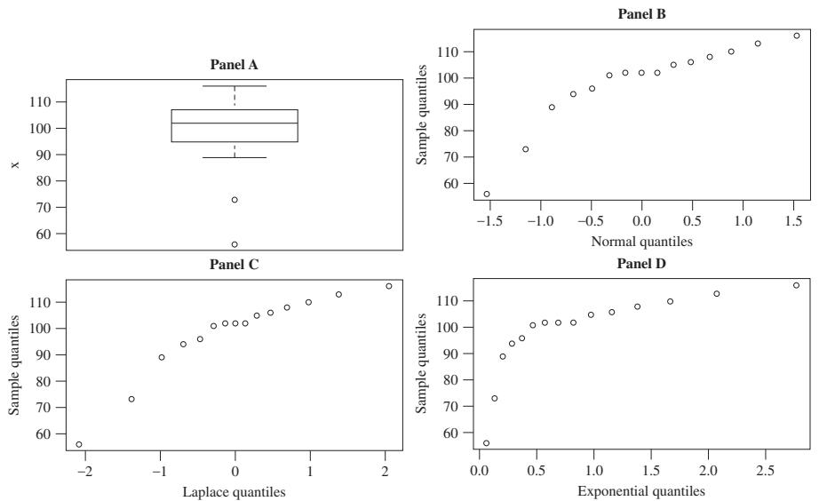  
Figure 4.4.1: Boxplot and quantile plots for the data of Example 4.4.4.

from which we have the linear relationship

$$
\xi_ {X, p} = b \xi_ {Z, p} + a. \tag {4.4.7}
$$

Thus, if $X$ has a cdf of the form of $F((x - a) / b)$ , then the quantiles of $X$ are linearly related to the quantiles of $Z$ . Of course, in practice, we do not know the quantiles of $X$ , but we can estimate them. Let $X_{1},\ldots ,X_{n}$ be a random sample from the distribution of $X$ and let $Y_{1} < \dots < Y_{n}$ be the order statistics. For $k = 1,\dots ,n$ , let $p_k = k / (n + 1)$ . Then $Y_{k}$ is an estimator of $\xi_{X,p_k}$ . Denote the corresponding quantiles of the cdf $F(z)$ by $\xi_{Z,p_k} = F^{-1}(p_k)$ . Let $y_{k}$ denote the realized value of $Y_{k}$ . The plot of $y_{k}$ versus $\xi_{Z,p_k}$ is called a $\mathbf{q} - \mathbf{q}$ plot, as it plots one set of quantiles from the sample against another set from the theoretical cdf $F(z)$ . Based on the above discussion, the linearity of such a plot indicates that the cdf of $X$ is of the form $F((x - a) / b)$ .

Example 4.4.6 (Example 4.4.5, Continued). Panels B, C, and D of Figure 4.4.1 contain $q - q$ plots of the data of Example 4.4.4 for three different distributions. The quantiles of a standard normal random variable are used for the plot in Panel B. Hence, as described above, this is the plot of $y_{k}$ versus $\Phi^{-1}(k / (n + 1))$ , for $k = 1,2,\ldots ,n$ . For Panel C, the population quantiles of the standard Laplace distribution are used; that is, the density of $Z$ is $f(z) = (1 / 2)e^{-|z|}$ , $-\infty < z < \infty$ . For Panel D, the quantiles were generated from an exponential distribution with density $f(z) = e^{-z}$ , $0 < z < \infty$ , zero elsewhere. The generation of these quantiles is discussed in Exercise 4.4.1.

The plot farthest from linearity is that of Panel D. Note that this plot gives an indication of a more correct distribution. For the points to lie on a line, the

lower quantiles of $Z$ must be spread out as are the higher quantiles; i.e., symmetric distributions may be more appropriate. The plots in Panels B and C are more linear than that of Panel D, but they still contain some curvature. Of the two, Panel C appears to be more linear. Actually, the data were generated from a Laplace distribution, so one would expect that Panel C would be the most linear of the three plots.

Many computer packages have commands to obtain the population quantiles used in this example. The R function qqplotc4s2.r, at the site listed in Chapter 1, obtains the normal, Laplace, and exponential quantiles used for Figure 4.4.1 and the plot. The call is qqplotc4s2(x) where the R vector $\mathbf{x}$ contains the data.

The $q - q$ plot using normal quantiles is often called a normal $q - q$ plot. If the data are in the R vector $\mathbf{x}$ , the plot is obtained by the call qqnorm(x).

# 4.4.2 Confidence Intervals for Quantiles

Let $X$ be a continuous random variable with cdf $F(x)$ . For $0 < p < 1$ , define the 100th distribution percentile to be $\xi_p$ , where $F(\xi_p) = p$ . For a sample of size $n$ on $X$ , let $Y_1 < Y_2 < \dots < Y_n$ be the order statistics. Let $k = [(n + 1)p]$ . Then the 100th sample percentile $Y_k$ is a point estimate of $\xi_p$ .

We now derive a distribution free confidence interval for $\xi_p$ , meaning it is a confidence interval for $\xi_p$ which is free of any assumptions about $F(x)$ other than it is of the continuous type. Let $i < [(n + 1)p] < j$ , and consider the order statistics $Y_i < Y_j$ and the event $Y_i < \xi_p < Y_j$ . For the $i$ th order statistic $Y_i$ to be less than $\xi_p$ , it must be true that at least $i$ of the $X$ values are less than $\xi_p$ . Moreover, for the $j$ th order statistic to be greater than $\xi_p$ , fewer than $j$ of the $X$ values are less than $\xi_p$ . To put this in the context of a binomial distribution, the probability of success is $P(X < \xi_p) = F(\xi_p) = p$ . Further, the event $Y_i < \xi_p < Y_j$ is equivalent to obtaining between $i$ (inclusive) and $j$ (exclusive) successes in $n$ independent trials. Thus, taking probabilities, we have

$$
P \left(Y _ {i} <   \xi_ {p} <   Y _ {j}\right) = \sum_ {w = i} ^ {j - 1} \binom {n} {w} p ^ {w} (1 - p) ^ {n - w}. \tag {4.4.8}
$$

When particular values of $n$ , $i$ , and $j$ are specified, this probability can be computed. By this procedure, suppose that it has been found that $\gamma = P(Y_i < \xi_p < Y_j)$ . Then the probability is $\gamma$ that the random interval $(Y_i, Y_j)$ includes the quantile of order $p$ . If the experimental values of $Y_i$ and $Y_j$ are, respectively, $y_i$ and $y_j$ , the interval $(y_i, y_j)$ serves as a $100\gamma \%$ confidence interval for $\xi_p$ , the quantile of order $p$ . We use this in the next example to find a confidence interval for the median.

Example 4.4.7 (Confidence Interval for the Median). Let $X$ be a continuous random variable with cdf $F(x)$ . Let $\xi_{1/2}$ denote the median of $F(x)$ ; i.e., $\xi_{1/2}$ solves $F(\xi_{1/2}) = 1/2$ . Suppose $X_1, X_2, \ldots, X_n$ is a random sample from the distribution of $X$ with corresponding order statistics $Y_1 < Y_2 < \dots < Y_n$ . As before, let $Q_2$ denote the sample median, which is a point estimator of $\xi_{1/2}$ . Select $\alpha$ , so that $0 < \alpha < 1$ . Take $c_{\alpha/2}$ to be the $\alpha/2$ th quantile of a binomial $b(n, 1/2)$ distribution;

that is, $P[S \leq c_{\alpha / 2}] = \alpha / 2$ , where $S$ is distributed $b(n, 1/2)$ . Then note also that $P[S \geq n - c_{\alpha / 2}] = \alpha / 2$ . (Because of the discreteness of the binomial distribution, either take a value of $\alpha$ for which these probabilities are correct or change the equalities to approximations.) Thus it follows from expression (4.4.8) that

$$
P \left[ Y _ {c _ {\alpha / 2} + 1} <   \xi_ {1 / 2} <   Y _ {n - c _ {\alpha / 2}} \right] = 1 - \alpha . \tag {4.4.9}
$$

Hence, when the sample is drawn, if $y_{c_{\alpha /2} + 1}$ and $y_{n - c_{\alpha /2}}$ are the realized values of the order statistics $Y_{c_{\alpha /2} + 1}$ and $Y_{n - c_{\alpha /2}}$ , then the interval

$$
\left(y _ {c _ {\alpha / 2} + 1}, y _ {n - c _ {\alpha / 2}}\right) \tag {4.4.10}
$$

is a $(1 - \alpha)100\%$ confidence interval for $\xi_{1 / 2}$ .

To illustrate this confidence interval, consider the data of Example 4.4.4. Suppose we want an $88\%$ confidence interval for $\xi_{1/2}$ . Then $\alpha / 2 = 0.060$ . Then $c_{\alpha / 2} = 4$ because $P[S \leq 4] = \mathrm{pbinom}(4, 15, .5) = 0.059$ , where the distribution of $S$ is binomial with $n = 15$ and $p = 0.5$ . Therefore, an $88\%$ confidence interval for $\xi_{1/2}$ is $(y_5, y_{11}) = (96, 106)$ .

The R function `onesampsgn(x)` computes a confidence interval for the median. For the data in Example 4.4.4, the code `onesampsgn(x, alpha=.12)` computes the confidence interval (96, 106) for the median.

Note that because of the discreteness of the binomial distribution, only certain confidence levels are possible for this confidence interval for the median. If we further assume that $f(x)$ is symmetric about $\xi$ , Chapter 10 presents other distribution free confidence intervals where this discreteness is much less of a problem.

# EXERCISES

4.4.1. Obtain closed-form expressions for the distribution quantiles based on the exponential and Laplace distributions as discussed in Example 4.4.6.

4.4.2. Suppose the pdf $f(x)$ is symmetric about 0 with cdf $F(x)$ . Show that the probability of a potential outlier from this distribution is $2F(4q_1)$ , where $F^{-1}(0.25) = q_1$ . Use this to obtain the probability that an observation is a potential outlier for the following distributions.

(a) The underlying distribution is normal. Use the $N(0,1)$ distribution.   
(b) The underlying distribution is logistic; that is, the pdf is given by

$$
f (x) = \frac {e ^ {- x}}{\left(1 + e ^ {- x}\right) ^ {2}}, - \infty <   x <   \infty . \tag {4.4.11}
$$

(c) The underlying distribution is Laplace, with the pdf

$$
f (x) = \frac {1}{2} e ^ {- | x |}, - \infty <   x <   \infty . \tag {4.4.12}
$$

4.4.3. Consider the sample of data (data are in the file ex4.4.3data.rda):

<table><tr><td>13</td><td>5</td><td>202</td><td>15</td><td>99</td><td>4</td><td>67</td><td>83</td><td>36</td><td>11</td><td>301</td></tr><tr><td>23</td><td>213</td><td>40</td><td>66</td><td>106</td><td>78</td><td>69</td><td>166</td><td>84</td><td>64</td><td></td></tr></table>

(a) Obtain the five-number summary of these data.   
(b) Determine if there are any outliers.   
(c) Boxplot the data. Comment on the plot.

4.4.4. Consider the data in Exercise 4.4.3. Obtain the normal $q - q$ plot for these data. Does the plot suggest that the underlying distribution is normal? If not, use the plot to determine a more appropriate distribution. Confirm your choice with a $q - q$ based on the quantiles using your chosen distribution.

4.4.5. Let $Y_{1} < Y_{2} < Y_{3} < Y_{4}$ be the order statistics of a random sample of size 4 from the distribution having pdf $f(x) = e^{-x}$ , $0 < x < \infty$ , zero elsewhere. Find $P(Y_{4} \geq 3)$ .

4.4.6. Let $X_{1}, X_{2}, X_{3}$ be a random sample from a distribution of the continuous type having pdf $f(x) = 2x$ , $0 < x < 1$ , zero elsewhere.

(a) Compute the probability that the smallest of $X_{1}, X_{2}, X_{3}$ exceeds the median of the distribution.   
(b) If $Y_{1} < Y_{2} < Y_{3}$ are the order statistics, find the correlation between $Y_{2}$ and $Y_{3}$ .

4.4.7. Let $f(x) = \frac{1}{6}$ , $x = 1,2,3,4,5,6$ , zero elsewhere, be the pmf of a distribution of the discrete type. Show that the pmf of the smallest observation of a random sample of size 5 from this distribution is

$$
g _ {1} (y _ {1}) = \left(\frac {7 - y _ {1}}{6}\right) ^ {5} - \left(\frac {6 - y _ {1}}{6}\right) ^ {5}, y _ {1} = 1, 2, \ldots , 6,
$$

zero elsewhere. Note that in this exercise the random sample is from a distribution of the discrete type. All formulas in the text were derived under the assumption that the random sample is from a distribution of the continuous type and are not applicable. Why?

4.4.8. Let $Y_{1} < Y_{2} < Y_{3} < Y_{4} < Y_{5}$ denote the order statistics of a random sample of size 5 from a distribution having pdf $f(x) = e^{-x}$ , $0 < x < \infty$ , zero elsewhere. Show that $Z_{1} = Y_{2}$ and $Z_{2} = Y_{4} - Y_{2}$ are independent.

Hint: First find the joint pdf of $Y_{2}$ and $Y_{4}$ .

4.4.9. Let $Y_{1} < Y_{2} < \dots < Y_{n}$ be the order statistics of a random sample of size $n$ from a distribution with pdf $f(x) = 1$ , $0 < x < 1$ , zero elsewhere. Show that the $k$ th order statistic $Y_{k}$ has a beta pdf with parameters $\alpha = k$ and $\beta = n - k + 1$ .

4.4.10. Let $Y_{1} < Y_{2} < \dots < Y_{n}$ be the order statistics from a Weibull distribution, Exercise 3.3.26. Find the distribution function and pdf of $Y_{1}$ .

4.4.11. Find the probability that the range of a random sample of size 4 from the uniform distribution having the pdf $f(x) = 1$ , $0 < x < 1$ , zero elsewhere, is less than $\frac{1}{2}$ .

4.4.12. Let $Y_{1} < Y_{2} < Y_{3}$ be the order statistics of a random sample of size 3 from a distribution having the pdf $f(x) = 2x$ , $0 < x < 1$ , zero elsewhere. Show that $Z_{1} = Y_{1} / Y_{2}$ , $Z_{2} = Y_{2} / Y_{3}$ , and $Z_{3} = Y_{3}$ are mutually independent.

4.4.13. Suppose a random sample of size 2 is obtained from a distribution that has pdf $f(x) = 2(1 - x)$ , $0 < x < 1$ , zero elsewhere. Compute the probability that one sample observation is at least twice as large as the other.

4.4.14. Let $Y_{1} < Y_{2} < Y_{3}$ denote the order statistics of a random sample of size 3 from a distribution with pdf $f(x) = 1$ , $0 < x < 1$ , zero elsewhere. Let $Z = (Y_{1} + Y_{3}) / 2$ be the midrange of the sample. Find the pdf of $Z$ .

4.4.15. Let $Y_{1} < Y_{2}$ denote the order statistics of a random sample of size 2 from $N(0, \sigma^2)$ .

(a) Show that $E(Y_{1}) = -\sigma / \sqrt{\pi}$ .

Hint: Evaluate $E(Y_{1})$ by using the joint pdf of $Y_{1}$ and $Y_{2}$ and first integrating on $y_{1}$ .

(b) Find the covariance of $Y_{1}$ and $Y_{2}$ .

4.4.16. Let $Y_{1} < Y_{2}$ be the order statistics of a random sample of size 2 from a distribution of the continuous type which has pdf $f(x)$ such that $f(x) > 0$ , provided that $x \geq 0$ , and $f(x) = 0$ elsewhere. Show that the independence of $Z_{1} = Y_{1}$ and $Z_{2} = Y_{2} - Y_{1}$ characterizes the gamma pdf $f(x)$ , which has parameters $\alpha = 1$ and $\beta > 0$ . That is, show that $Y_{1}$ and $Y_{2}$ are independent if and only if $f(x)$ is the pdf of a $\Gamma(1, \beta)$ distribution.

Hint: Use the change-of-variable technique to find the joint pdf of $Z_{1}$ and $Z_{2}$ from that of $Y_{1}$ and $Y_{2}$ . Accept the fact that the functional equation $h(0)h(x + y) \equiv h(x)h(y)$ has the solution $h(x) = c_{1}e^{c_{2}x}$ , where $c_{1}$ and $c_{2}$ are constants.

4.4.17. Let $Y_{1} < Y_{2} < Y_{3} < Y_{4}$ be the order statistics of a random sample of size $n = 4$ from a distribution with pdf $f(x) = 2x$ , $0 < x < 1$ , zero elsewhere.

(a) Find the joint pdf of $Y_{3}$ and $Y_{4}$ .

(b) Find the conditional pdf of $Y_{3}$ , given $Y_{4} = y_{4}$ .

(c) Evaluate $E(Y_{3}|y_{4})$ .

4.4.18. Two numbers are selected at random from the interval $(0,1)$ . If these values are uniformly and independently distributed, by cutting the interval at these numbers, compute the probability that the three resulting line segments can form a triangle.

4.4.19. Let $X$ and $Y$ denote independent random variables with respective probability density functions $f(x) = 2x$ , $0 < x < 1$ , zero elsewhere, and $g(y) = 3y^2$ , $0 < y < 1$ , zero elsewhere. Let $U = \min(X, Y)$ and $V = \max(X, Y)$ . Find the joint pdf of $U$ and $V$ .

Hint: Here the two inverse transformations are given by $x = u$ , $y = v$ and $x = v$ , $y = u$ .

4.4.20. Let the joint pdf of $X$ and $Y$ be $f(x, y) = \frac{12}{7} x(x + y)$ , $0 < x < 1$ , $0 < y < 1$ , zero elsewhere. Let $U = \min(X, Y)$ and $V = \max(X, Y)$ . Find the joint pdf of $U$ and $V$ .

4.4.21. Let $X_{1}, X_{2}, \ldots, X_{n}$ be a random sample from a distribution of either type. A measure of spread is Gini's mean difference

$$
G = \sum_ {j = 2} ^ {n} \sum_ {i = 1} ^ {j - 1} | X _ {i} - X _ {j} | / \binom {n} {2}. \tag {4.4.13}
$$

(a) If $n = 10$ , find $a_1, a_2, \ldots, a_{10}$ so that $G = \sum_{i=1}^{10} a_i Y_i$ , where $Y_1, Y_2, \ldots, Y_{10}$ are the order statistics of the sample.   
(b) Show that $E(G) = 2\sigma / \sqrt{\pi}$ if the sample arises from the normal distribution $N(\mu, \sigma^2)$ .

4.4.22. Let $Y_{1} < Y_{2} < \dots < Y_{n}$ be the order statistics of a random sample of size $n$ from the exponential distribution with pdf $f(x) = e^{-x}$ , $0 < x < \infty$ , zero elsewhere.

(a) Show that $Z_{1} = nY_{1}$ , $Z_{2} = (n - 1)(Y_{2} - Y_{1})$ , $Z_{3} = (n - 2)(Y_{3} - Y_{2})$ , ..., $Z_{n} = Y_{n} - Y_{n - 1}$ are independent and that each $Z_{i}$ has the exponential distribution.   
(b) Demonstrate that all linear functions of $Y_{1}, Y_{2}, \ldots, Y_{n}$ , such as $\sum_{1}^{n} a_{i} Y_{i}$ , can be expressed as linear functions of independent random variables.

4.4.23. In the Program Evaluation and Review Technique (PERT), we are interested in the total time to complete a project that is comprised of a large number of subprojects. For illustration, let $X_{1}$ , $X_{2}$ , $X_{3}$ be three independent random times for three subprojects. If these subprojects are in series (the first one must be completed before the second starts, etc.), then we are interested in the sum $Y = X_{1} + X_{2} + X_{3}$ . If these are in parallel (can be worked on simultaneously), then we are interested in $Z = \max(X_{1}, X_{2}, X_{3})$ . In the case each of these random variables has the uniform distribution with pdf $f(x) = 1$ , $0 < x < 1$ , zero elsewhere, find (a) the pdf of $Y$ and (b) the pdf of $Z$ .

4.4.24. Let $Y_{n}$ denote the $n$ th order statistic of a random sample of size $n$ from a distribution of the continuous type. Find the smallest value of $n$ for which the inequality $P(\xi_{0.9} < Y_n) \geq 0.75$ is true.

4.4.25. Let $Y_{1} < Y_{2} < Y_{3} < Y_{4} < Y_{5}$ denote the order statistics of a random sample of size 5 from a distribution of the continuous type. Compute:

(a) $P(Y_{1} < \xi_{0.5} < Y_{5})$   
(b) $P(Y_{1} <   \xi_{0.25} <   Y_{3})$   
(c) $P(Y_{4} < \xi_{0.80} < Y_{5})$

4.4.26. Compute $P(Y_{3} < \xi_{0.5} < Y_{7})$ if $Y_{1} < \dots < Y_{9}$ are the order statistics of a random sample of size 9 from a distribution of the continuous type.

4.4.27. Find the smallest value of $n$ for which $P(Y_{1} < \xi_{0.5} < Y_{n}) \geq 0.99$ , where $Y_{1} < \dots < Y_{n}$ are the order statistics of a random sample of size $n$ from a distribution of the continuous type.

4.4.28. Let $Y_{1} < Y_{2}$ denote the order statistics of a random sample of size 2 from a distribution that is $N(\mu, \sigma^2)$ , where $\sigma^2$ is known.

(a) Show that $P(Y_{1} < \mu < Y_{2}) = \frac{1}{2}$ and compute the expected value of the random length $Y_{2} - Y_{1}$ .   
(b) If $\overline{X}$ is the mean of this sample, find the constant $c$ that solves the equation $P(\overline{X} - c\sigma < \mu < \overline{X} + c\sigma) = \frac{1}{2}$ , and compare the length of this random interval with the expected value of that of part (a).

4.4.29. Let $y_{1} < y_{2} < y_{3}$ be the observed values of the order statistics of a random sample of size $n = 3$ from a continuous type distribution. Without knowing these values, a statistician is given these values in a random order, and she wants to select the largest; but once she refuses an observation, she cannot go back. Clearly, if she selects the first one, her probability of getting the largest is $1/3$ . Instead, she decides to use the following algorithm: She looks at the first but refuses it and then takes the second if it is larger than the first, or else she takes the third. Show that this algorithm has probability of $1/2$ of selecting the largest.

4.4.30. Refer to Exercise 4.1.1. Using expression (4.4.10), obtain a confidence interval (with confidence close to $90\%$ ) for the median lifetime of a motor. What does the interval mean?

4.4.31. Let $Y_{1} < Y_{2} < \dots < Y_{n}$ denote the order statistics of a random sample of size $n$ from a distribution that has pdf $f(x) = 3x^{2} / \theta^{3}$ , $0 < x < \theta$ , zero elsewhere.

(a) Show that $P(c < Y_n / \theta < 1) = 1 - c^{3n}$ , where $0 < c < 1$ .   
(b) If $n$ is 4 and if the observed value of $Y_{4}$ is 2.3, what is a $95\%$ confidence interval for $\theta$ ?

4.4.32. Reconsider the weight of professional baseball players in the data file bb.rda. Obtain comparison boxplots of the weights of the hitters and pitchers (use the R code boxplot(x,y) where x and y contain the weights of the hitters and pitchers, respectively). Then obtain $95\%$ confidence intervals for the median weights of the hitters and pitchers (use the R function onesampsgn). Comment.

# 4.5 Introduction to Hypothesis Testing

Point estimation and confidence intervals are useful statistical inference procedures. Another type of inference that is frequently used concerns tests of hypotheses. As in Sections 4.1 through 4.3, suppose our interest centers on a random variable $X$ that has density function $f(x; \theta)$ , where $\theta \in \Omega$ . Suppose we think, due to theory or a preliminary experiment, that $\theta \in \omega_0$ or $\theta \in \omega_1$ , where $\omega_0$ and $\omega_1$ are disjoint subsets of $\Omega$ and $\omega_0 \cup \omega_1 = \Omega$ . We label these hypotheses as

$$
H _ {0}: \theta \in \omega_ {0} \text {v e r s u s} H _ {1}: \theta \in \omega_ {1}. \tag {4.5.1}
$$

The hypothesis $H_0$ is referred to as the null hypothesis, while $H_1$ is referred to as the alternative hypothesis. Often the null hypothesis represents no change or no difference from the past, while the alternative represents change or difference. The alternative is often referred to as the research worker's hypothesis. The decision rule to take $H_0$ or $H_1$ is based on a sample $X_1, \ldots, X_n$ from the distribution of $X$ and, hence, the decision could be wrong. For instance, we could decide that $\theta \in \omega_1$ when really $\theta \in \omega_0$ or we could decide that $\theta \in \omega_0$ when, in fact, $\theta \in \omega_1$ . We label these errors Type I and Type II errors, respectively, later in this section. As we show in Chapter 8, a careful analysis of these errors can lead in certain situations to optimal decision rules. In this section, though, we simply want to introduce the elements of hypothesis testing. To set ideas, consider the following example.

Example 4.5.1 (Zea mays Data). In 1878 Charles Darwin recorded some data on the heights of Zea mays plants to determine what effect cross-fertilization or self-fertilization had on the height of Zea mays. The experiment was to select one cross-fertilized plant and one self-fertilized plant, grow them in the same pot, and then later measure their heights. An interesting hypothesis for this example would be that the cross-fertilized plants are generally taller than the self-fertilized plants. This is the alternative hypothesis, i.e., the research worker's hypothesis. The null hypothesis is that the plants generally grow to the same height regardless of whether they were self- or cross-fertilized. Data for 15 pots were recorded.

We represent the data as $(Y_{1},Z_{1}),\ldots ,(Y_{15},Z_{15})$ , where $Y_{i}$ and $Z_{i}$ are the heights of the cross-fertilized and self-fertilized plants, respectively, in the $i$ th pot. Let $X_{i} = Y_{i} - Z_{i}$ . Due to growing in the same pot, $Y_{i}$ and $Z_{i}$ may be dependent random variables, but it seems appropriate to assume independence between pots, i.e., independence between the paired random vectors. So we assume that $X_{1},\ldots ,X_{15}$ form a random sample. As a tentative model, consider the location model

$$
X _ {i} = \mu + e _ {i}, \quad i = 1, \ldots , 1 5,
$$

where the random variables $e_i$ are iid with continuous density $f(x)$ . For this model, there is no loss in generality in assuming that the mean of $e_i$ is 0, for, otherwise, we can simply redefine $\mu$ . Hence, $E(X_i) = \mu$ . Further, the density of $X_i$ is $f_X(x; \mu) = f(x - \mu)$ . In practice, the goodness of the model is always a concern and diagnostics based on the data would be run to confirm the quality of the model.

If $\mu = E(X_{i}) = 0$ , then $E(Y_{i}) = E(Z_{i})$ ; i.e., on average, the cross-fertilized plants grow to the same height as the self-fertilized plants. While, if $\mu > 0$ then

Table 4.5.1: $2 \times 2$ Decision Table for a Hypothesis Test   

<table><tr><td></td><td colspan="2">True State of Nature</td></tr><tr><td>Decision</td><td>H0 is True</td><td>H1 is True</td></tr><tr><td>Reject H0</td><td>Type I Error</td><td>Correct Decision</td></tr><tr><td>Accept H0</td><td>Correct Decision</td><td>Type II Error</td></tr></table>

$E(Y_{i}) > E(Z_{i})$ ; i.e., on average the cross-fertilized plants are taller than the self-fertilized plants. Under this model, our hypotheses are

$$
H _ {0}: \mu = 0 \text {v e r s u s} H _ {1}: \mu > 0. \tag {4.5.2}
$$

Hence, $\omega_0 = \{0\}$ represents no difference in the treatments, while $\omega_{1} = (0,\infty)$ represents that the mean height of cross-fertilized Zea mays exceeds the mean height of self-fertilized Zea mays.

To complete the testing structure for the general problem described at the beginning of this section, we need to discuss decision rules. Recall that $X_{1},\ldots ,X_{n}$ is a random sample from the distribution of a random variable $X$ that has density $f(x;\theta)$ , where $\theta \in \Omega$ . Consider testing the hypotheses $H_0:\theta \in \omega_0$ versus $H_{1}:\theta \in \omega_{1}$ , where $\omega_0\cup \omega_1 = \Omega$ . Denote the space of the sample by $\mathcal{D}$ ; that is, $\mathcal{D} = \text{space}\{(X_1,\dots,X_n)\}$ . A test of $H_0$ versus $H_{1}$ is based on a subset $C$ of $\mathcal{D}$ . This set $C$ is called the critical region and its corresponding decision rule (test) is

$$
\operatorname {R e j e c t} H _ {0} (\text {A c c e p t} H _ {1}) \quad \text {i f} (X _ {1}, \dots , X _ {n}) \in C \tag {4.5.3}
$$

$$
\text {R e t a i n} H _ {0} (\text {R e j e c t} H _ {1}) \quad \text {i f} (X _ {1}, \dots , X _ {n}) \in C ^ {c}.
$$

For a given critical region, the $2 \times 2$ decision table as shown in Table 4.5.1, summarizes the results of the hypothesis test in terms of the true state of nature. Besides the correct decisions, two errors can occur. A Type I error occurs if $H_0$ is rejected when it is true, while a Type II error occurs if $H_0$ is accepted when $H_1$ is true.

The goal, of course, is to select a critical region from all possible critical regions which minimizes the probabilities of these errors. In general, this is not possible. The probabilities of these errors often have a seesaw effect. This can be seen immediately in an extreme case. Simply let $C = \phi$ . With this critical region, we would never reject $H_0$ , so the probability of Type I error would be 0, but the probability of Type II error is 1. Often we consider Type I error to be the worse of the two errors. We then proceed by selecting critical regions that bound the probability of Type I error and then among these critical regions we try to select one that minimizes the probability of Type II error.

Definition 4.5.1. We say a critical region $C$ is of size $\alpha$ if

$$
\alpha = \max  _ {\theta \in \omega_ {0}} P _ {\theta} [ (X _ {1}, \dots , X _ {n}) \in C ]. \tag {4.5.4}
$$

Over all critical regions of size $\alpha$ , we want to consider critical regions that have lower probabilities of Type II error. We also can look at the complement of a Type II error, namely, rejecting $H_0$ when $H_{1}$ is true, which is a correct decision, as marked in Table 4.5.1. Since we desire to maximize the probability of this latter decision, we want the probability of it to be as large as possible. That is, for $\theta \in \omega_{1}$ , we want to maximize

$$
1 - P _ {\theta} [ \text {T y p e I I E r r o r} ] = P _ {\theta} [ (X _ {1}, \dots , X _ {n}) \in C ].
$$

The probability on the right side of this equation is called the power of the test at $\theta$ . It is the probability that the test detects the alternative $\theta$ when $\theta \in \omega_1$ is the true parameter. So minimizing the probability of Type II error is equivalent to maximizing power.

We define the power function of a critical region to be

$$
\gamma_ {C} (\theta) = P _ {\theta} \left[ \left(X _ {1}, \dots , X _ {n}\right) \in C \right]; \quad \theta \in \omega_ {1}. \tag {4.5.5}
$$

Hence, given two critical regions $C_1$ and $C_2$ , which are both of size $\alpha$ , $C_1$ is better than $C_2$ if $\gamma_{C_1}(\theta) \geq \gamma_{C_2}(\theta)$ for all $\theta \in \omega_1$ . In Chapter 8, we obtain optimal critical regions for specific situations. In this section, we want to illustrate these concepts of hypothesis testing with several examples.

Example 4.5.2 (Test for a Binomial Proportion of Success). Let $X$ be a Bernoulli random variable with probability of success $p$ . Suppose we want to test, at size $\alpha$ ,

$$
H _ {0}: p = p _ {0} \text {v e r s u s} H _ {1}: p <   p _ {0}, \tag {4.5.6}
$$

where $p_0$ is specified. As an illustration, suppose "success" is dying from a certain disease and $p_0$ is the probability of dying with some standard treatment. A new treatment is used on several (randomly chosen) patients, and it is hoped that the probability of dying under this new treatment is less than $p_0$ . Let $X_1, \ldots, X_n$ be a random sample from the distribution of $X$ and let $S = \sum_{i=1}^{n} X_i$ be the total number of successes in the sample. An intuitive decision rule (critical region) is

$$
\text {R e j e c t} H _ {0} \text {i n f a v o r} H _ {1} \text {i f} S \leq k, \tag {4.5.7}
$$

where $k$ is such that $\alpha = P_{H_0}[S \leq k]$ . Since $S$ has a $b(n, p_0)$ distribution under $H_0$ , $k$ is determined by $\alpha = P_{p_0}[S \leq k]$ . Because the binomial distribution is discrete, however, it is likely that there is no integer $k$ that solves this equation. For example, suppose $n = 20$ , $p_0 = 0.7$ , and $\alpha = 0.15$ . Then under $H_0$ , $S$ has a binomial $b(20, 0.7)$ distribution. Hence, computationally, $P_{H_0}[S \leq 11] = \mathsf{pbinom}(11, 20, 0.7) = 0.1133$ and $P_{H_0}[S \leq 12] = \mathsf{pbinom}(12, 20, 0.7) = 0.2277$ . Hence, erring on the conservative side, we would probably choose $k$ to be 11 and $\alpha = 0.1133$ . As $n$ increases, this is less of a problem; see, also, the later discussion on $p$ -values. In general, the power of the test for the hypotheses (4.5.6) is

$$
\gamma (p) = P _ {p} [ S \leq k ], \quad p <   p _ {0}. \tag {4.5.8}
$$

The curve labeled Test 1 in Figure 4.5.1 is the power function for the case $n = 20$ , $p_0 = 0.7$ , and $\alpha = 0.1133$ . Notice that the power function is decreasing. The

power is higher to detect the alternative $p = 0.2$ than $p = 0.6$ . In Section 8.2, we prove in general the monotonicity of the power function for binomial tests of these hypotheses. Using this monotonicity, we extend our test to the more general null hypothesis $H_0: p \geq p_0$ rather than simply $H_0: p = p_0$ . Using the same decision rule as we used for the hypotheses (4.5.6), the definition of the size of a test (4.5.4), and the monotonicity of the power curve, we have

$$
\max _ {p \geq p _ {0}} P _ {p} [ S \leq k ] = P _ {p _ {0}} [ S \leq k ] = \alpha ,
$$

i.e., the same size as for the original null hypothesis.

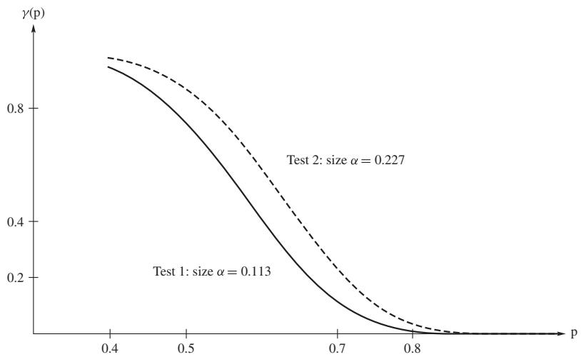  
Figure 4.5.1: Power curves for tests 1 and 2; see Example 4.5.2.

Denote by Test 1 the test for the situation with $n = 20$ , $p_0 = 0.70$ , and size $\alpha = 0.1133$ . Suppose we have a second test (Test 2) with an increased size. How does the power function of Test 2 compare to Test 1? As an example, suppose for Test 2, we select $\alpha = 0.2277$ . Hence, for Test 2, we reject $H_0$ if $S \leq 12$ . Figure 4.5.1 displays the resulting power function. Note that while Test 2 has a higher probability of committing a Type I error, it also has a higher power at each alternative $p < 0.7$ . Exercise 4.5.7 shows that this is true for these binomial tests. It is true in general; that is, if the size of the test increases, power does too. For this example, the R function binpower.r, found at the site listed in the Preface, produces a version of Figure 4.5.1.

Remark 4.5.1 (Nomenclature). Since in Example 4.5.2, the first null hypothesis $H_0: p = p_0$ completely specifies the underlying distribution, it is called a simple hypothesis. Most hypotheses, such as $H_1: p < p_0$ , are composite hypotheses, because they are composed of many simple hypotheses and, hence, do not completely specify the distribution.

As we study more and more statistics, we discover that often other names are used for the size, $\alpha$ , of the critical region. Frequently, $\alpha$ is also called the signifi-

cance level of the test associated with that critical region. Moreover, sometimes $\alpha$ is called the "maximum of probabilities of committing an error of Type I" and the "maximum of the power of the test when $H_0$ is true." It is disconcerting to the student to discover that there are so many names for the same thing. However, all of them are used in the statistical literature, and we feel obligated to point out this fact.

The test in the last example is based on the exact distribution of its test statistic, i.e., the binomial distribution. Often we cannot obtain the distribution of the test statistic in closed form. As with approximate confidence intervals, however, we can frequently appeal to the Central Limit Theorem to obtain an approximate test; see Theorem 4.2.1. Such is the case for the next example.

Example 4.5.3 (Large Sample Test for the Mean). Let $X$ be a random variable with mean $\mu$ and finite variance $\sigma^2$ . We want to test the hypotheses

$$
H _ {0}: \mu = \mu_ {0} \text {v e r s u s} H _ {1}: \mu > \mu_ {0}, \tag {4.5.9}
$$

where $\mu_0$ is specified. To illustrate, suppose $\mu_0$ is the mean level on a standardized test of students who have been taught a course by a standard method of teaching. Suppose it is hoped that a new method that incorporates computers has a mean level $\mu > \mu_0$ , where $\mu = E(X)$ and $X$ is the score of a student taught by the new method. This conjecture is tested by having $n$ students (randomly selected) taught under this new method.

Let $X_{1},\ldots ,X_{n}$ be a random sample from the distribution of $X$ and denote the sample mean and variance by $\overline{X}$ and $S^2$ , respectively. Because $\overline{X}$ is an unbiased estimate of $\mu$ , an intuitive decision rule is given by

$$
\text {R e j e c t} H _ {0} \text {i n f a v o r} H _ {1} \text {i f} \bar {X} \text {i s m u c h l a r g e r t h a n} \mu_ {0}. \tag {4.5.10}
$$

In general, the distribution of the sample mean cannot be obtained in closed form. In Example 4.5.4, under the strong assumption of normality for the distribution of $X$ , we obtain an exact test. For now, the Central Limit Theorem (Theorem 4.2.1) shows that the distribution of $(\overline{X} - \mu) / (S / \sqrt{n})$ is approximately $N(0,1)$ . Using this, we obtain a test with an approximate size $\alpha$ , with the decision rule

$$
\operatorname {R e j e c t} H _ {0} \text {i n f a v o r o f} H _ {1} \text {i f} \frac {\bar {X} - \mu_ {0}}{S / \sqrt {n}} \geq z _ {\alpha}. \tag {4.5.11}
$$

The test is intuitive. To reject $H_0$ , $\overline{X}$ must exceed $\mu_0$ by at least $z_{\alpha}S / \sqrt{n}$ . To approximate the power function of the test, we use the Central Limit Theorem. Upon substituting $\sigma$ for $S$ , it readily follows that the approximate power function is

$$
\begin{array}{l} \gamma (\mu) = P _ {\mu} (\bar {X} \geq \mu_ {0} + z _ {\alpha} \sigma / \sqrt {n}) \\ = P _ {\mu} \left(\frac {\bar {X} - \mu}{\sigma / \sqrt {n}} \geq \frac {\mu_ {0} - \mu}{\sigma / \sqrt {n}} + z _ {\alpha}\right) \\ \approx \quad 1 - \Phi \left(z _ {\alpha} + \frac {\sqrt {n} (\mu_ {0} - \mu)}{\sigma}\right) \\ = \Phi \left(- z _ {\alpha} - \frac {\sqrt {n} (\mu_ {0} - \mu)}{\sigma}\right). \tag {4.5.12} \\ \end{array}
$$

So if we have some reasonable idea of what $\sigma$ equals, we can compute the approximate power function. As Exercise 4.5.1 shows, this approximate power function is strictly increasing in $\mu$ , so as in the last example, we can change the null hypotheses to

$$
H _ {0}: \mu \leq \mu_ {0} \text {v e r s u s} H _ {1}: \mu > \mu_ {0}. \tag {4.5.13}
$$

Our asymptotic test has approximate size $\alpha$ for these hypotheses.

Example 4.5.4 (Test for $\mu$ Under Normality). Let $X$ have a $N(\mu, \sigma^2)$ distribution. As in Example 4.5.3, consider the hypotheses

$$
H _ {0}: \mu = \mu_ {0} \text {v e r s u s} H _ {1}: \mu > \mu_ {0}, \tag {4.5.14}
$$

where $\mu_0$ is specified. Assume that the desired size of the test is $\alpha$ , for $0 < \alpha < 1$ . Suppose $X_{1},\ldots ,X_{n}$ is a random sample from a $N(\mu ,\sigma^2)$ distribution. Let $\overline{X}$ and $S^2$ denote the sample mean and variance, respectively. Our intuitive rejection rule is to reject $H_{0}$ in favor of $H_{1}$ if $\overline{X}$ is much larger than $\mu_0$ . Unlike Example 4.5.3, we now know the distribution of the statistic $\overline{X}$ . In particular, by Part (d) of Theorem 3.6.1, under $H_{0}$ the statistic $T = (\overline{X} -\mu_0) / (S / \sqrt{n})$ has a $t$ -distribution with $n - 1$ degrees of freedom. Using the distribution of $T$ , it follows that this rejection rule has exact level $\alpha$ :

$$
\text {R e j e c t} H _ {0} \text {i n f a v o r} H _ {1} \text {i f} T = \frac {\bar {X} - \mu_ {0}}{S / \sqrt {n}} \geq t _ {\alpha , n - 1}, \tag {4.5.15}
$$

where $t_{\alpha, n-1}$ is the upper $\alpha$ critical point of a $t$ -distribution with $n-1$ degrees of freedom; i.e., $\alpha = P(T > t_{\alpha, n-1})$ . This is often called the $t$ -test of $H_0: \mu = \mu_0$ .

Note the differences between this rejection rule and the large sample rule, (4.5.11). The large sample rule has approximate level $\alpha$ , while this has exact level $\alpha$ . Of course, we now have to assume that $X$ has a normal distribution. In practice, we may not be willing to assume that the population is normal. Usually $t$ -critical values are larger than $z$ -critical values; hence, the $t$ -test is conservative relative to the large sample test. So, in practice, many statisticians often use the $t$ -test.

The R code t.test(x, mu=mu0, alt="greater") computes the $t$ -test for the hypotheses (4.5.14), where the R vector $\mathbf{x}$ contains the sample.

Example 4.5.5 (Example 4.5.1, Continued). The data for Darwin's experiment on Zea mays are recorded in Table 4.5.2 and are, also, in the file darwin.rda. A boxplot and a normal $q - q$ plot of the 15 differences, $x_{i} = y_{i} - z_{i}$ , are found in Figure 4.5.2. Based on these plots, we can see that there seem to be two outliers, Pots 2 and 15. In these two pots, the self-fertilized Zea mays are much taller than their cross-fertilized pairs. Except for these two outliers, the differences, $y_{i} - z_{i}$ , are positive, indicating that the cross-fertilization leads to taller plants. We proceed to conduct a test of hypotheses (4.5.2), as discussed in Example 4.5.4. We use the decision rule given by (4.5.15) with $\alpha = 0.05$ . As Exercise 4.5.2 shows, the values of the sample mean and standard deviation for the differences, $x_{i}$ , are $\overline{x} = 2.62$ and $s_{x} = 4.72$ . Hence the $t$ -test statistic is 2.15, which exceeds the $t$ -critical value, $t_{.05,14} = \mathrm{qt}(0.95,14) = 1.76$ . Thus we reject $H_{0}$ and conclude that cross-fertilized Zea mays are on the average taller than self-fertilized Zea mays. Because of the

Table 4.5.2: Plant Growth   

<table><tr><td>Pot</td><td>1</td><td>2</td><td>3</td><td>4</td><td>5</td><td>6</td><td>7</td><td>8</td></tr><tr><td>Cross</td><td>23.500</td><td>12.000</td><td>21.000</td><td>22.000</td><td>19.125</td><td>21.500</td><td>22.125</td><td>20.375</td></tr><tr><td>Self</td><td>17.375</td><td>20.375</td><td>20.000</td><td>20.000</td><td>18.375</td><td>18.625</td><td>18.625</td><td>15.250</td></tr><tr><td>Pot</td><td>9</td><td>10</td><td>11</td><td>12</td><td>13</td><td>14</td><td>15</td><td></td></tr><tr><td>Cross</td><td>18.250</td><td>21.625</td><td>23.250</td><td>21.000</td><td>22.125</td><td>23.000</td><td>12.000</td><td></td></tr><tr><td>Self</td><td>16.500</td><td>18.000</td><td>16.250</td><td>18.000</td><td>12.750</td><td>15.500</td><td>18.000</td><td></td></tr></table>

outliers, normality of the error distribution is somewhat dubious, and we use the test in a conservative manner, as discussed at the end of Example 4.5.4.

Assuming that the rda file darwin.rda has been loaded in R, the code for the above $t$ -test is t.test(cross-self, mu=0, alt="greater") which evaluates the $t$ -test statistic to be 2.1506.

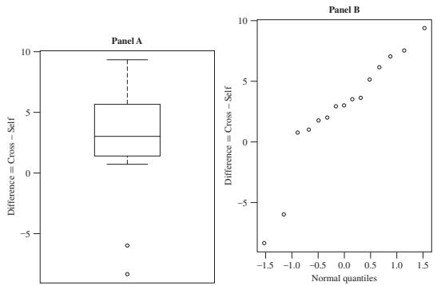  
Figure 4.5.2: Boxplot and normal $q - q$ plot for the data of Example 4.5.5.

# EXERCISES

In many of these exercises, use R or another statistical package for computations and graphs of power functions.

4.5.1. Show that the approximate power function given in expression (4.5.12) of Example 4.5.3 is a strictly increasing function of $\mu$ . Show then that the test discussed in this example has approximate size $\alpha$ for testing

$$
H _ {0}: \mu \leq \mu_ {0} \text {v e r s u s} H _ {1}: \mu > \mu_ {0}.
$$

4.5.2. For the Darwin data tabled in Example 4.5.5, verify that the Student $t$ -test statistic is 2.15.

4.5.3. Let $X$ have a pdf of the form $f(x; \theta) = \theta x^{\theta - 1}$ , $0 < x < 1$ , zero elsewhere, where $\theta \in \{\theta : \theta = 1, 2\}$ . To test the simple hypothesis $H_0: \theta = 1$ against the alternative simple hypothesis $H_1: \theta = 2$ , use a random sample $X_1, X_2$ of size $n = 2$

and define the critical region to be $C = \{(x_1, x_2) : \frac{3}{4} \leq x_1 x_2\}$ . Find the power function of the test.

4.5.4. Let $X$ have a binomial distribution with the number of trials $n = 10$ and with $p$ either $1/4$ or $1/2$ . The simple hypothesis $H_0: p = \frac{1}{2}$ is rejected, and the alternative simple hypothesis $H_1: p = \frac{1}{4}$ is accepted, if the observed value of $X_1$ , a random sample of size 1, is less than or equal to 3. Find the significance level and the power of the test.

4.5.5. Let $X_1, X_2$ be a random sample of size $n = 2$ from the distribution having pdf $f(x; \theta) = (1 / \theta)e^{-x / \theta}$ , $0 < x < \infty$ , zero elsewhere. We reject $H_0: \theta = 2$ and accept $H_1: \theta = 1$ if the observed values of $X_1, X_2$ , say $x_1, x_2$ , are such that

$$
\frac {f (x _ {1} ; 2) f (x _ {2} ; 2)}{f (x _ {1} ; 1) f (x _ {2} ; 1)} \leq \frac {1}{2}.
$$

Here $\Omega = \{\theta : \theta = 1,2\}$ . Find the significance level of the test and the power of the test when $H_0$ is false.

4.5.6. Consider the tests Test 1 and Test 2 for the situation discussed in Example 4.5.2. Consider the test that rejects $H_0$ if $S \leq 10$ . Find the level of significance for this test and sketch its power curve as in Figure 4.5.1.

4.5.7. Consider the situation described in Example 4.5.2. Suppose we have two tests A and B defined as follows. For Test A, $H_0$ is rejected if $S \leq k_A$ , while for Test B, $H_0$ is rejected if $S \leq k_B$ . If Test A has a higher level of significance than Test B, show that Test A has higher power than Test B at each alternative.

4.5.8. Let us say the life of a tire in miles, say $X$ , is normally distributed with mean $\theta$ and standard deviation 5000. Past experience indicates that $\theta = 30,000$ . The manufacturer claims that the tires made by a new process have mean $\theta > 30,000$ . It is possible that $\theta = 35,000$ . Check his claim by testing $H_0: \theta = 30,000$ against $H_1: \theta > 30,000$ . We observe $n$ independent values of $X$ , say $x_1, \ldots, x_n$ , and we reject $H_0$ (thus accept $H_1$ ) if and only if $\overline{x} \geq c$ . Determine $n$ and $c$ so that the power function $\gamma(\theta)$ of the test has the values $\gamma(30,000) = 0.01$ and $\gamma(35,000) = 0.98$ .

4.5.9. Let $X$ have a Poisson distribution with mean $\theta$ . Consider the simple hypothesis $H_0: \theta = \frac{1}{2}$ and the alternative composite hypothesis $H_1: \theta < \frac{1}{2}$ . Thus $\Omega = \{\theta : 0 < \theta \leq \frac{1}{2}\}$ . Let $X_1, \ldots, X_{12}$ denote a random sample of size 12 from this distribution. We reject $H_0$ if and only if the observed value of $Y = X_1 + \dots + X_{12} \leq 2$ . Show that the following R code graphs the power function of this test:

theta=seq(.1,.5,.05); gam=ppois(2,theta*12)

plot(gam~theta,pch=" ",xlabel=expression(theta),ylabel=expression(gamma)) lines(gam~theta)

Run the code. Determine the significance level from the plot.

4.5.10. Let $Y$ have a binomial distribution with parameters $n$ and $p$ . We reject $H_0: p = \frac{1}{2}$ and accept $H_1: p > \frac{1}{2}$ if $Y \geq c$ . Find $n$ and $c$ to give a power function $\gamma(p)$ which is such that $\gamma(\frac{1}{2}) = 0.10$ and $\gamma(\frac{2}{3}) = 0.95$ , approximately.

4.5.11. Let $Y_{1} < Y_{2} < Y_{3} < Y_{4}$ be the order statistics of a random sample of size $n = 4$ from a distribution with pdf $f(x; \theta) = 1 / \theta$ , $0 < x < \theta$ , zero elsewhere, where $0 < \theta$ . The hypothesis $H_{0}: \theta = 1$ is rejected and $H_{1}: \theta > 1$ is accepted if the observed $Y_{4} \geq c$ .

(a) Find the constant $c$ so that the significance level is $\alpha = 0.05$ .   
(b) Determine the power function of the test.

4.5.12. Let $X_{1}, X_{2}, \ldots, X_{8}$ be a random sample of size $n = 8$ from a Poisson distribution with mean $\mu$ . Reject the simple null hypothesis $H_{0}: \mu = 0.5$ and accept $H_{1}: \mu > 0.5$ if the observed sum $\sum_{i=1}^{8} x_{i} \geq 8$ .

(a) Show that the significance level is 1-ppois(7,8*.5).   
(b) Use R to determine $\gamma (0.75)$ , $\gamma (1)$ , and $\gamma (1.25)$ .   
(c) Modify the code in Exercise 4.5.9 to obtain a plot of the power function.

4.5.13. Let $p$ denote the probability that, for a particular tennis player, the first serve is good. Since $p = 0.40$ , this player decided to take lessons in order to increase $p$ . When the lessons are completed, the hypothesis $H_0: p = 0.40$ is tested against $H_1: p > 0.40$ based on $n = 25$ trials. Let $Y$ equal the number of first serves that are good, and let the critical region be defined by $C = \{Y: Y \geq 13\}$ .

(a) Show that $\alpha$ is computed by $\alpha = 1$ -pbinom(12,25,.4).   
(b) Find $\beta = P(Y < 13)$ when $p = 0.60$ ; that is, $\beta = P(Y \leq 12; p = 0.60)$ so that $1 - \beta$ is the power at $p = 0.60$ .

4.5.14. Let $S$ denote the number of success in $n = 40$ Bernoulli trials with probability of success $p$ . Consider the hypotheses: $H_0: p \leq 0.3$ versus $H_1: p > 0.3$ . Consider the two tests: (1) Reject $H_0$ if $S \geq 16$ and (2) Reject $H_0$ if $S \geq 17$ . Determine the level of these tests. The R function binpower.r produces a version of Figure 4.5.1. For this exercise, write a similar R function that graphs the power functions of the above two tests.

# 4.6 Additional Comments About Statistical Tests

All of the alternative hypotheses considered in Section 4.5 were one-sided hypotheses. For illustration, in Exercise 4.5.8 we tested $H_0: \mu = 30,000$ against the one-sided alternative $H_1: \mu > 30,000$ , where $\mu$ is the mean of a normal distribution having standard deviation $\sigma = 5000$ . Perhaps in this situation, though, we think the manufacturer's process has changed but are unsure of the direction. That is, we are interested in the alternative $H_1: \mu \neq 30,000$ . In this section, we further explore hypotheses testing and we begin with the construction of a test for a two-sided alternative.

Example 4.6.1 (Large Sample Two-Sided Test for the Mean). In order to see how to construct a test for a two-sided alternative, reconsider Example 4.5.3, where we constructed a large sample one-sided test for the mean of a random variable. As in Example 4.5.3, let $X$ be a random variable with mean $\mu$ and finite variance $\sigma^2$ . Here, though, we want to test

$$
H _ {0}: \mu = \mu_ {0} \text {v e r s u s} H _ {1}: \mu \neq \mu_ {0}, \tag {4.6.1}
$$

where $\mu_0$ is specified. Let $X_{1},\ldots ,X_{n}$ be a random sample from the distribution of $X$ and denote the sample mean and variance by $\overline{X}$ and $S^2$ , respectively. For the one-sided test, we rejected $H_{0}$ if $\overline{X}$ was too large; hence, for the hypotheses (4.6.1), we use the decision rule

$$
\text {R e j e c t} H _ {0} \text {i n f a v o r} H _ {1} \text {i f} \bar {X} \leq h \text {o r} \bar {X} \geq k, \tag {4.6.2}
$$

where $h$ and $k$ are such that $\alpha = P_{H_0}[\overline{X} \leq h \text{ or } \overline{X} \geq k]$ . Clearly, $h < k$ ; hence, we have

$$
\alpha = P _ {H _ {0}} [ \bar {X} \leq h \text {o r} \bar {X} \geq k ] = P _ {H _ {0}} [ \bar {X} \leq h ] + P _ {H _ {0}} [ \bar {X} \geq k ].
$$

Since, at least for large samples, the distribution of $\overline{X}$ is symmetrically distributed about $\mu_0$ , under $H_0$ , an intuitive rule is to divide $\alpha$ equally between the two terms on the right side of the above expression; that is, $h$ and $k$ are chosen by

$$
P _ {H _ {0}} [ \bar {X} \leq h ] = \alpha / 2 \text {a n d} P _ {H _ {0}} [ \bar {X} \geq k ] = \alpha / 2. \tag {4.6.3}
$$

From Theorem 4.2.1, it follows that $(\overline{X} - \mu_0) / (S / \sqrt{n})$ is approximately $N(0,1)$ . This and (4.6.3) lead to the approximate decision rule

$$
\text {R e j e c t} H _ {0} \text {i n f a v o r} H _ {1} \text {i f} \left| \frac {\bar {X} - \mu_ {0}}{S / \sqrt {n}} \right| \geq z _ {\alpha / 2}. \tag {4.6.4}
$$

Upon substituting $\sigma$ for $S$ , it readily follows that the approximate power function is

$$
\begin{array}{l} \gamma (\mu) = P _ {\mu} \left(\bar {X} \leq \mu_ {0} - z _ {\alpha / 2} \sigma / \sqrt {n}\right) + P _ {\mu} \left(\bar {X} \geq \mu_ {0} + z _ {\alpha / 2} \sigma / \sqrt {n}\right) \\ = \Phi \left(\frac {\sqrt {n} (\mu_ {0} - \mu)}{\sigma} - z _ {\alpha / 2}\right) + 1 - \Phi \left(\frac {\sqrt {n} (\mu_ {0} - \mu)}{\sigma} + z _ {\alpha / 2}\right), \tag {4.6.5} \\ \end{array}
$$

where $\Phi(z)$ is the cdf of a standard normal random variable; see (3.4.9). So if we have some reasonable idea of what $\sigma$ equals, we can compute the approximate power function. Note that the derivative of the power function is

$$
\gamma^ {\prime} (\mu) = \frac {\sqrt {n}}{\sigma} \left[ \phi \left(\frac {\sqrt {n} (\mu_ {0} - \mu)}{\sigma} + z _ {\alpha / 2}\right) - \phi \left(\frac {\sqrt {n} (\mu_ {0} - \mu)}{\sigma} - z _ {\alpha / 2}\right) \right], \tag {4.6.6}
$$

where $\phi(z)$ is the pdf of a standard normal random variable. Then we can show that $\gamma(\mu)$ has a critical value at $\mu_0$ which is the minimum; see Exercise 4.6.2. Further, $\gamma(\mu)$ is strictly decreasing for $\mu < \mu_0$ and strictly increasing for $\mu > \mu_0$ .

Consider again the situation at the beginning of this section. Suppose we want to test

$$
H _ {0}: \mu = 3 0, 0 0 0 \text {v e r s u s} H _ {1}: \mu \neq 3 0, 0 0 0. \tag {4.6.7}
$$

Suppose $n = 20$ and $\alpha = 0.01$ . Then the rejection rule (4.6.4) becomes

$$
\operatorname {R e j e c t} H _ {0} \text {i n f a v o r o f} H _ {1} \text {i f} \left| \frac {\bar {X} - 3 0 , 0 0 0}{S / \sqrt {2 0}} \right| \geq 2. 5 7 5. \tag {4.6.8}
$$

Figure 4.6.1 displays the power curve for this test when $\sigma = 5000$ is substituted in for $S$ . For comparison, the power curve for the test with level $\alpha = 0.05$ is also shown. The R function zpower computes a version of this figure.

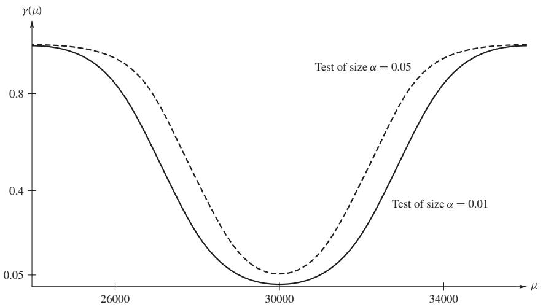  
Figure 4.6.1: Power curves for the tests of the hypotheses (4.6.7).

This two-sided test for the mean is approximate. If we assume that $X$ has a normal distribution, then, as Exercise 4.6.3 shows, the following test has exact size $\alpha$ for testing $H_0: \mu = \mu_0$ versus $H_1: \mu \neq \mu_0$ :

$$
\text {R e j e c t} H _ {0} \text {i n f a v o r o f} H _ {1} \text {i f} \left| \frac {\bar {X} - \mu_ {0}}{S / \sqrt {n}} \right| \geq t _ {\alpha / 2, n - 1}. \tag {4.6.9}
$$

It too has a bowl-shaped power curve similar to Figure 4.6.1, although it is not as easy to show; see Lehmann (1986).

For computation in R, the code t.test(x, mu=mu0) obtains the two-sided $t$ -test of hypotheses (4.6.1), when the R vector $\mathbf{x}$ contains the sample.

There exists a relationship between two-sided tests and confidence intervals. Consider the two-sided $t$ -test (4.6.9). Here, we use the rejection rule with "if and only if" replacing "if." Hence, in terms of acceptance, we have

$$
\text {A c c e p t} H _ {0} \text {i f a n d o n l y i f} \mu_ {0} - t _ {\alpha / 2, n - 1} S / \sqrt {n} <   \overline {{X}} <   \mu_ {0} + t _ {\alpha / 2, n - 1} S / \sqrt {n}.
$$

But this is easily shown to be

$$
\text {A c c e p t} H _ {0} \text {i f a n d o n l y i f} \mu_ {0} \in (\bar {X} - t _ {\alpha / 2, n - 1} S / \sqrt {n}, \bar {X} + t _ {\alpha / 2, n - 1} S / \sqrt {n}); \tag {4.6.10}
$$

that is, we accept $H_0$ at significance level $\alpha$ if and only if $\mu_0$ is in the $(1 - \alpha)100\%$ confidence interval for $\mu$ . Equivalently, we reject $H_0$ at significance level $\alpha$ if and only if $\mu_0$ is not in the $(1 - \alpha)100\%$ confidence interval for $\mu$ . This is true for all the two-sided tests and hypotheses discussed in this text. There is also a similar relationship between one-sided tests and one-sided confidence intervals.

Once we recognize this relationship between confidence intervals and tests of hypothesis, we can use all those statistics that we used to construct confidence intervals to test hypotheses, not only against two-sided alternatives but one-sided ones as well. Without listing all of these in a table, we present enough of them so that the principle can be understood.

Example 4.6.2. Let independent random samples be taken from $N(\mu_1, \sigma^2)$ and $N(\mu_2, \sigma^2)$ , respectively. Say these have the respective sample characteristics $n_1$ , $\overline{X}$ , $S_1^2$ and $n_2$ , $\overline{Y}$ , $S_2^2$ . Let $n = n_1 + n_2$ denote the combined sample size and let $S_p^2 = [(n_1 - 1)S_1^2 + (n_2 - 1)S_2^2] / (n - 2)$ , (4.2.11), be the pooled estimator of the common variance. At $\alpha = 0.05$ , reject $H_0: \mu_1 = \mu_2$ and accept the one-sided alternative $H_1: \mu_1 > \mu_2$ if

$$
T = \frac {\bar {X} - \bar {Y} - 0}{S _ {p} \sqrt {\frac {1}{n _ {1}} + \frac {1}{n _ {2}}}} \geq t _ {. 0 5, n - 2},
$$

because, under $H_0: \mu_1 = \mu_2$ , $T$ has a $t(n - 2)$ -distribution. A rigorous development of this test is given in Example 8.3.1.

Example 4.6.3. Say $X$ is $b(1, p)$ . Consider testing $H_0: p = p_0$ against $H_1: p < p_0$ . Let $X_1, \ldots, X_n$ be a random sample from the distribution of $X$ and let $\widehat{p} = \overline{X}$ . To test $H_0$ versus $H_1$ , we use either

$$
Z _ {1} = \frac {\widehat {p} - p _ {0}}{\sqrt {p _ {0} (1 - p _ {0}) / n}} \leq c \quad \mathrm {o r} \quad Z _ {2} = \frac {\widehat {p} - p _ {0}}{\sqrt {\widehat {p} (1 - \widehat {p}) / n}} \leq c.
$$

If $n$ is large, both $Z_{1}$ and $Z_{2}$ have approximate standard normal distributions provided that $H_{0}: p = p_{0}$ is true. Hence, if $c$ is set at $-1.645$ , then the approximate significance level is $\alpha = 0.05$ . Some statisticians use $Z_{1}$ and others $Z_{2}$ . We do not have strong preferences one way or the other because the two methods provide about the same numerical results. As one might suspect, using $Z_{1}$ provides better probabilities for power calculations if the true $p$ is close to $p_{0}$ , while $Z_{2}$ is better if $H_{0}$ is clearly false. However, with a two-sided alternative hypothesis, $Z_{2}$ does provide a better relationship with the confidence interval for $p$ . That is, $|Z_{2}| < z_{\alpha / 2}$ is equivalent to $p_{0}$ being in the interval from

$$
\widehat {p} - z _ {\alpha / 2} \sqrt {\frac {\widehat {p} (1 - \widehat {p})}{n}} \quad \mathrm {t o} \quad \widehat {p} + z _ {\alpha / 2} \sqrt {\frac {\widehat {p} (1 - \widehat {p})}{n}},
$$

which is the interval that provides a $(1 - \alpha)100\%$ approximate confidence interval for $p$ as considered in Section 4.2.

In closing this section, we introduce the concept of randomized tests.

Example 4.6.4. Let $X_{1}, X_{2}, \ldots, X_{10}$ be a random sample of size $n = 10$ from a Poisson distribution with mean $\theta$ . A critical region for testing $H_{0}: \theta = 0.1$ against $H_{1}: \theta > 0.1$ is given by $Y = \sum_{1}^{10} X_{i} \geq 3$ . The statistic $Y$ has a Poisson distribution with mean $10\theta$ . Thus, with $\theta = 0.1$ so that the mean of $Y$ is 1, the significance level of the test is

$$
P (Y \geq 3) = 1 - P (Y \leq 2) = 1 - \mathrm {p p o i s} (2, 1) = 1 - 0. 9 2 0 = 0. 0 8 0.
$$

If, on the other hand, the critical region defined by $\sum_{1}^{10}x_{i}\geq 4$ is used, the significance level is

$$
\alpha = P (Y \geq 4) = 1 - P (Y \leq 3) = 1 - \text {p p o i s} (3, 1) = 1 - 0. 9 8 1 = 0. 0 1 9.
$$

For instance, if a significance level of about $\alpha = 0.05$ , say, is desired, most statisticians would use one of these tests; that is, they would adjust the significance level to that of one of these convenient tests. However, a significance level of $\alpha = 0.05$ can be achieved in the following way. Let $W$ have a Bernoulli distribution with probability of success equal to

$$
P (W = 1) = \frac {0 . 0 5 0 - 0 . 0 1 9}{0 . 0 8 0 - 0 . 0 1 9} = \frac {3 1}{6 1}.
$$

Assume that $W$ is selected independently of the sample. Consider the rejection rule

$$
\text {R e j e c t} H _ {0} \text {i f} \sum_ {1} ^ {1 0} x _ {i} \geq 4 \text {o r i f} \sum_ {1} ^ {1 0} x _ {i} = 3 \text {a n d} W = 1.
$$

The significance level of this rule is

$$
\begin{array}{l} P _ {H _ {0}} (Y \geq 4) + P _ {H _ {0}} (\{Y = 3 \} \cap \{W = 1 \}) = P _ {H _ {0}} (Y \geq 4) \\ + P _ {H _ {0}} (Y = 3) P (W = 1) \\ = 0. 0 1 9 + 0. 0 6 1 \frac {3 1}{6 1} = 0. 0 5; \\ \end{array}
$$

hence, the decision rule has exactly level 0.05. The process of performing the auxiliary experiment to decide whether to reject or not when $Y = 3$ is sometimes referred to as a randomized test.

# 4.6.1 Observed Significance Level, $p$ -value

Not many statisticians like randomized tests in practice, because the use of them means that two statisticians could make the same assumptions, observe the same data, apply the same test, and yet make different decisions. Hence, they usually adjust their significance level so as not to randomize. As a matter of fact, many statisticians report what are commonly called observed significance levels or $p$ -values (for probability values).

A general example suffices to explain observed significance levels. Let $X_{1},\ldots ,X_{n}$ be a random sample from a $N(\mu ,\sigma^2)$ distribution, where both $\mu$ and $\sigma^2$ are unknown.

Consider, first, the one-sided hypotheses $H_0: \mu = \mu_0$ versus $H_1: \mu > \mu_0$ , where $\mu_0$ is specified. Write the rejection rule as

$$
\text {R e j e c t} H _ {0} \text {i n f a v o r} H _ {1}, \text {i f} \bar {X} \geq k, \tag {4.6.11}
$$

where $\overline{X}$ is the sample mean. Previously we have specified a level and then solved for $k$ . In practice, though, the level is not specified. Instead, once the sample is observed, the realized value $\overline{x}$ of $\overline{X}$ is computed and we ask the question: Is $\overline{x}$ sufficiently large to reject $H_0$ in favor of $H_1$ ? To answer this we calculate the $p$ -value which is the probability,

$$
p \text {v a l u e} = P _ {H _ {0}} (\bar {X} \geq \bar {x}). \tag {4.6.12}
$$

Note that this is a data-based "significance level" and we call it the observed significance level or the $p$ -value. The hypothesis $H_0$ is rejected at all levels greater than or equal to the $p$ -value. For example, if the $p$ -value is 0.048, and the nominal $\alpha$ level is 0.05 then $H_0$ would be rejected; however, if the nominal $\alpha$ level is 0.01, then $H_0$ would not be rejected. In summary, the experimenter sets the hypotheses; the statistician selects the test statistic and rejection rule; the data are observed and the statistician reports the $p$ -value to the experimenter; and the experimenter decides whether the $p$ -value is sufficiently small to warrant rejection of $H_0$ in favor of $H_1$ . The following example provides a numerical illustration.

Example 4.6.5. Recall the Darwin data discussed in Example 4.5.5. It was a paired design on the heights of cross and self-fertilized Zea mays plants. In each of 15 pots, one cross-fertilized and one self-fertilized were grown. The data of interest are the 15 paired differences, (cross - self). As in Example 4.5.5, let $X_{i}$ denote the paired difference for the $i$ th pot. Let $\mu$ be the true mean difference. The hypotheses of interest are $H_{0}: \mu = 0$ versus $H_{1}: \mu > 0$ . The standardized rejection rule is

$$
\text {R e j e c t} H _ {0} \text {i n f a v o r} H _ {1} \text {i f} T \geq k,
$$

where $T = \overline{X} / (S / \sqrt{15})$ , where $\overline{X}$ and $S$ are respectively the sample mean and standard deviation of the differences. The alternative hypothesis states that on the average cross-fertilized plants are taller than self-fertilized plants. From Example 4.5.5 the $t$ -test statistic has the value 2.15. Letting $t(14)$ denote a random variable with the $t$ -distribution with 14 degrees of freedom, and using R the $p$ -value for the experiment is

$$
P [ t (1 4) > 2. 1 5 ] = 1 - \operatorname {p t} (2. 1 5, 1 4) = 1 - 0. 9 7 5 2 = 0. 0 2 4 8. \tag {4.6.13}
$$

In practice, with this $p$ -value, $H_0$ would be rejected at all levels greater than or equal to 0.0248. This observed significance level is also part of the output from the R call t.test(cross-self, mu=0, alt="greater").

Returning to the discussion above, suppose the hypotheses are $H_0: \mu = \mu_0$ versus $H_1: \mu < \mu_0$ . Obviously, the observed significance level in this case is $p$ -value $= P_{H_0}(\overline{X} \leq \overline{x})$ . For the two-sided hypotheses $H_0: \mu = \mu_0$ versus $H_1: \mu \neq \mu_0$ , our "unspecified" rejection rule is

$$
\text {R e j e c t} H _ {0} \text {i n f a v o r} H _ {1}, \text {i f} \bar {X} \leq l \text {o r} \bar {X} \geq k. \tag {4.6.14}
$$

For the $p$ -value, compute each of the one-sided $p$ -values, take the smaller $p$ -value, and double it. For an illustration, in the Darwin example, suppose the hypotheses are $H_0: \mu = 0$ versus $H_1: \mu \neq 0$ . Then the $p$ -value is $2(0.0248) = 0.0496$ . As a final note on $p$ -values for two-sided hypotheses, suppose the test statistic can be expressed in terms of a $t$ -test statistic. In this case the $p$ -value can be found equivalently as follows. If $d$ is the realized value of the $t$ -test statistic then the $p$ -value is

$$
p \text {v a l u e} = P _ {H _ {0}} [ | t | \geq | d | ], \tag {4.6.15}
$$

where, under $H_0$ , $t$ has a $t$ -distribution with $n - 1$ degrees of freedom.

In this discussion on $p$ -values, keep in mind that good science dictates that the hypotheses should be known before the data are drawn.

# EXERCISES

4.6.1. The R function zpower, found at the site listed in the Preface, computes the plot in Figure 4.6.1. Consider the two-sided test for proportions discussed in Example 4.6.3 based on the test statistic $Z_{1}$ . Specifically consider the hypotheses $H_{0}: p = .0.6$ versus $H_{1}: p \neq 0.6$ . Using the sample size $n = 50$ and the level $\alpha = 0.05$ , write a R program, similar to zpower, which computes a plot of the power curve for this test on a proportion.

4.6.2. Consider the power function $\gamma (\mu)$ and its derivative $\gamma^\prime (\mu)$ given by (4.6.5) and (4.6.6). Show that $\gamma^{\prime}(\mu)$ is strictly negative for $\mu <  \mu_0$ and strictly positive for $\mu >\mu_0$

4.6.3. Show that the test defined by 4.6.9 has exact size $\alpha$ for testing $H_0: \mu = \mu_0$ versus $H_1: \mu \neq \mu_0$ .

4.6.4. Consider the one-sided $t$ -test for $H_0: \mu = \mu_0$ versus $H_{A1}: \mu > \mu_0$ constructed in Example 4.5.4 and the two-sided $t$ -test for $t$ -test for $H_0: \mu = \mu_0$ versus $H_1: \mu \neq \mu_0$ given in (4.6.9). Assume that both tests are of size $\alpha$ . Show that for $\mu > \mu_0$ , the power function of the one-sided test is larger than the power function of the two-sided test.

4.6.5. On page 373 Rasmussen (1992) discussed a paired design. A baseball coach paired 20 members of his team by their speed; i.e., each member of the pair has about the same speed. Then for each pair, he randomly chose one member of the pair and told him that if could beat his best time in circling the bases he would give him an award (call this response the time of the "self" member). For the other member of the pair the coach's instruction was an award if he could beat the time of the other member of the pair (call this response the time of the "rival" member). Each member of the pair knew who his rival was. The data are given below, but are also in the file selffrival.rda. Let $\mu_d$ be the true difference in times (rival minus self) for a pair. The hypotheses of interest are $H_0: \mu_d = 0$ versus $H_1: \mu_d < 0$ . The data are in order by pairs, so do not mix the order.

15.92 16.58 17.57 16.75 17.28 17.32 17.51 17.58 18.26 17.87

rival: 15.95 16.15 17.05 16.99 17.34 17.53 17.34 17.51 18.10 18.19

16.04 16.80 17.24 16.81 17.11 17.22 17.33 17.82 18.19 17.88

(a) Obtain comparison boxplots of the data. Comment on the comparison plots. Are there any outliers?   
(b) Compute the paired $t$ -test and obtain the $p$ -value. Are the data significant at the 5% level of significance?   
(c) Obtain a point estimate of $\mu_d$ and a $95\%$ confidence interval for it.   
(d) Conclude in terms of the problem.

4.6.6. Verzani (2014), page 323, presented a data set concerning the effect that different dosages of the drug AZT have on patients with HIV. The responses we consider are the p24 antigen levels of HIV patients after their treatment with AZT. Of the 20 HIV patients in the study, 10 were randomly assign the dosage of $300\mathrm{mg}$ of AZT while the other 10 were assigned $600\mathrm{mg}$ . The hypotheses of interest are $H_0:\Delta = 0$ versus $H_{1}:\Delta \neq 0$ where $\Delta = \mu_{600} - \mu_{300}$ and $\mu_{600}$ and $\mu_{300}$ are the true mean p24 antigen levels under dosages of $600\mathrm{mg}$ and $300\mathrm{mg}$ of AZT, respectively. The data are given below but are also available in the file aztdoses.rda.

<table><tr><td>300 mg</td><td>284</td><td>279</td><td>289</td><td>292</td><td>287</td><td>295</td><td>285</td><td>279</td><td>306</td><td>298</td></tr><tr><td>600 mg</td><td>298</td><td>307</td><td>297</td><td>279</td><td>291</td><td>335</td><td>299</td><td>300</td><td>306</td><td>291</td></tr></table>

(a) Obtain comparison boxplots of the data. Identify outliers by patient. Comment on the comparison plots.   
(b) Compute the two-sample $t$ -test and obtain the $p$ -value. Are the data significant at the 5% level of significance?   
(c) Obtain a point estimate of $\Delta$ and a $95\%$ confidence interval for it.   
(d) Conclude in terms of the problem.

4.6.7. Among the data collected for the World Health Organization air quality monitoring project is a measure of suspended particles in $\mu \mathrm{g} / \mathrm{m}^3$ . Let $X$ and $Y$ equal the concentration of suspended particles in $\mu \mathrm{g} / \mathrm{m}^3$ in the city center (commercial district) for Melbourne and Houston, respectively. Using $n = 13$ observations of $X$ and $m = 16$ observations of $Y$ , we test $H_0: \mu_X = \mu_Y$ against $H_1: \mu_X < \mu_Y$ .

(a) Define the test statistic and critical region, assuming that the unknown variances are equal. Let $\alpha = 0.05$ .   
(b) If $\overline{x} = 72.9$ , $s_x = 25.6$ , $\overline{y} = 81.7$ , and $s_y = 28.3$ , calculate the value of the test statistic and state your conclusion.

4.6.8. Let $p$ equal the proportion of drivers who use a seat belt in a country that does not have a mandatory seat belt law. It was claimed that $p = 0.14$ . An advertising campaign was conducted to increase this proportion. Two months after the campaign, $y = 104$ out of a random sample of $n = 590$ drivers were wearing their seat belts. Was the campaign successful?

(a) Define the null and alternative hypotheses.   
(b) Define a critical region with an $\alpha = 0.01$ significance level.   
(c) Determine the approximate $p$ -value and state your conclusion.

4.6.9. In Exercise 4.2.18 we found a confidence interval for the variance $\sigma^2$ using the variance $S^2$ of a random sample of size $n$ arising from $N(\mu, \sigma^2)$ , where the mean $\mu$ is unknown. In testing $H_0: \sigma^2 = \sigma_0^2$ against $H_1: \sigma^2 > \sigma_0^2$ , use the critical region defined by $(n - 1)S^2 / \sigma_0^2 \geq c$ . That is, reject $H_0$ and accept $H_1$ if $S^2 \geq c\sigma_0^2 / (n - 1)$ . If $n = 13$ and the significance level $\alpha = 0.025$ , determine $c$ .

4.6.10. In Exercise 4.2.27, in finding a confidence interval for the ratio of the variances of two normal distributions, we used a statistic $S_1^2 / S_2^2$ , which has an $F$ -distribution when those two variances are equal. If we denote that statistic by $F$ , we can test $H_0: \sigma_1^2 = \sigma_2^2$ against $H_1: \sigma_1^2 > \sigma_2^2$ using the critical region $F \geq c$ . If $n = 13$ , $m = 11$ , and $\alpha = 0.05$ , find $c$ .

# 4.7 Chi-Square Tests

In this section we introduce tests of statistical hypotheses called chi-square tests. A test of this sort was originally proposed by Karl Pearson in 1900, and it provided one of the earlier methods of statistical inference.

Let the random variable $X_{i}$ be $N(\mu_i,\sigma_i^2)$ , $i = 1,2,\ldots ,n$ , and let $X_{1},X_{2},\ldots ,X_{n}$ be mutually independent. Thus the joint pdf of these variables is

$$
\frac {1}{\sigma_ {1} \sigma_ {2} \cdots \sigma_ {n} (2 \pi) ^ {n / 2}} \exp \left[ - \frac {1}{2} \sum_ {1} ^ {n} \left(\frac {x _ {i} - \mu_ {i}}{\sigma_ {i}}\right) ^ {2} \right], - \infty <   x _ {i} <   \infty .
$$

The random variable that is defined by the exponent (apart from the coefficient $-\frac{1}{2}$ ) is $\sum_{1}^{n}[(X_i - \mu_i) / \sigma_i]^2$ , and this random variable has a $\chi^2(n)$ distribution. In Section 3.5 we generalized this joint normal distribution of probability to $n$ random variables that are dependent and we called the distribution a multivariate normal distribution. Theorem 3.5.1 shows a similar result holds for the exponent in the multivariate normal case, also.

Let us now discuss some random variables that have approximate chi-square distributions. Let $X_{1}$ be $b(n,p_{1})$ . Consider the random variable

$$
Y = \frac {X _ {1} - n p _ {1}}{\sqrt {n p _ {1} (1 - p _ {1})}},
$$

which has, as $n \to \infty$ , an approximate $N(0,1)$ distribution (see Theorem 4.2.1). Furthermore, as discussed in Example 5.3.6, the distribution of $Y^2$ is approximately $\chi^2(1)$ . Let $X_2 = n - X_1$ and let $p_2 = 1 - p_1$ . Let $Q_1 = Y^2$ . Then $Q_1$ may be written as

$$
\begin{array}{l} Q _ {1} = \frac {\left(X _ {1} - n p _ {1}\right) ^ {2}}{n p _ {1} \left(1 - p _ {1}\right)} = \frac {\left(X _ {1} - n p _ {1}\right) ^ {2}}{n p _ {1}} + \frac {\left(X _ {1} - n p _ {1}\right) ^ {2}}{n \left(1 - p _ {1}\right)} \\ = \frac {\left(X _ {1} - n p _ {1}\right) ^ {2}}{n p _ {1}} + \frac {\left(X _ {2} - n p _ {2}\right) ^ {2}}{n p _ {2}} \tag {4.7.1} \\ \end{array}
$$

because $(X_{1} - np_{1})^{2} = (n - X_{2} - n + np_{2})^{2} = (X_{2} - np_{2})^{2}$ . This result can be generalized as follows.

Let $X_{1}, X_{2}, \ldots, X_{k-1}$ have a multinomial distribution with the parameters $n$ and $p_{1}, \ldots, p_{k-1}$ , as in Section 3.1. Let $X_{k} = n - (X_{1} + \dots + X_{k-1})$ and let $p_{k} = 1 - (p_{1} + \dots + p_{k-1})$ . Define $Q_{k-1}$ by

$$
Q _ {k - 1} = \sum_ {i = 1} ^ {k} \frac {\left(X _ {i} - n p _ {i}\right) ^ {2}}{n p _ {i}}.
$$

It is proved in a more advanced course that, as $n \to \infty$ , $Q_{k-1}$ has an approximate $\chi^2(k-1)$ distribution. Some writers caution the user of this approximation to be certain that $n$ is large enough so that each $np_i$ , $i = 1, 2, \ldots, k$ , is at least equal to 5. In any case, it is important to realize that $Q_{k-1}$ does not have a chi-square distribution, only an approximate chi-square distribution.

The random variable $Q_{k-1}$ may serve as the basis of the tests of certain statistical hypotheses which we now discuss. Let the sample space $\mathcal{A}$ of a random experiment be the union of a finite number $k$ of mutually disjoint sets $A_1, A_2, \ldots, A_k$ . Furthermore, let $P(A_i) = p_i$ , $i = 1, 2, \ldots, k$ , where $p_k = 1 - p_1 - \dots - p_{k-1}$ , so that $p_i$ is the probability that the outcome of the random experiment is an element of the set $A_i$ . The random experiment is to be repeated $n$ independent times and $X_i$ represents the number of times the outcome is an element of set $A_i$ . That is, $X_1, X_2, \ldots, X_k = n - X_1 - \dots - X_{k-1}$ are the frequencies with which the outcome is, respectively, an element of $A_1, A_2, \ldots, A_k$ . Then the joint pmf of $X_1, X_2, \ldots, X_{k-1}$ is the multinomial pmf with the parameters $n, p_1, \ldots, p_{k-1}$ . Consider the simple hypothesis (concerning this multinomial pmf) $H_0: p_1 = p_{10}$ , $p_2 = p_{20}, \ldots, p_{k-1} = p_{k-1,0}$ ( $p_k = p_{k0} = 1 - p_{10} - \dots - p_{k-1,0}$ ), where $p_{10}, \ldots, p_{k-1,0}$ are specified numbers. It is desired to test $H_0$ against all alternatives.

If the hypothesis $H_0$ is true, the random variable

$$
Q _ {k - 1} = \sum_ {1} ^ {k} \frac {\left(X _ {i} - n p _ {i 0}\right) ^ {2}}{n p _ {i 0}}
$$

has an approximate chi-square distribution with $k - 1$ degrees of freedom. Since, when $H_0$ is true, $np_{i0}$ is the expected value of $X_i$ , one would feel intuitively that observed values of $Q_{k-1}$ should not be too large if $H_0$ is true. Our test is then

to reject $H_0$ if $Q_{k-1} \geq c$ . To determine a test with level of significance $\alpha$ , we can use tables of the $\chi^2$ -distribution or a computer package. Using R, we compute the critical value $c$ by qchisq(1 - $\alpha$ , k-1). If, then, the hypothesis $H_0$ is rejected when the observed value of $Q_{k-1}$ is at least as great as $c$ , the test of $H_0$ has a significance level that is approximately equal to $\alpha$ . Also if $q$ is the realized value of the test statistic $Q_{k-1}$ then the observed significance level of the test is computed in R by 1-pchisq(q, k-1). This is frequently called a goodness-of-fit test. Some illustrative examples follow.

Example 4.7.1. One of the first six positive integers is to be chosen by a random experiment (perhaps by the cast of a die). Let $A_{i} = \{x : x = i\}$ , $i = 1, 2, \ldots, 6$ . The hypothesis $H_{0}: P(A_{i}) = p_{i0} = \frac{1}{6}$ , $i = 1, 2, \ldots, 6$ , is tested, at the approximate $5\%$ significance level, against all alternatives. To make the test, the random experiment is repeated under the same conditions, 60 independent times. In this example, $k = 6$ and $np_{i0} = 60\left(\frac{1}{6}\right) = 10$ , $i = 1, 2, \ldots, 6$ . Let $X_{i}$ denote the frequency with which the random experiment terminates with the outcome in $A_{i}$ , $i = 1, 2, \ldots, 6$ , and let $Q_{5} = \sum_{1}^{6}(X_{i} - 10)^{2}/10$ . Since there are $6 - 1 = 5$ degrees of freedom, the critical value for a level $\alpha = 0.05$ test is qchisq(0.95,5) = 11.0705. Now suppose that the experimental frequencies of $A_{1}, A_{2}, \ldots, A_{6}$ are, respectively, 13, 19, 11, 8, 5, and 4. The observed value of $Q_{5}$ is

$$
\frac {(1 3 - 1 0) ^ {2}}{1 0} + \frac {(1 9 - 1 0) ^ {2}}{1 0} + \frac {(1 1 - 1 0) ^ {2}}{1 0} + \frac {(8 - 1 0) ^ {2}}{1 0} + \frac {(5 - 1 0) ^ {2}}{1 0} + \frac {(4 - 1 0) ^ {2}}{1 0} = 1 5. 6.
$$

Since $15.6 > 11.0705$ , the hypothesis $P(A_{i}) = \frac{1}{6}$ , $i = 1,2,\ldots,6$ , is rejected at the (approximate) $5\%$ significance level.

The following R segment computes this test, returning the test statistic and the $p$ -value as shown:

ps=rep(1/6,6); x=c(13,19,11,8,5,4); chisq.test(x,p=ps)

X-squared $= 15.6$ , df $= 5$ , p-value $= 0.008084$

Example 4.7.2. A point is to be selected from the unit interval $\{x:0 < x < 1\}$ by a random process. Let $A_{1} = \{x:0 < x\leq \frac{1}{4}\}$ , $A_{2} = \{x:\frac{1}{4} < x\leq \frac{1}{2}\}$ , $A_{3} = \{x:\frac{1}{2} < x\leq \frac{3}{4}\}$ , and $A_{4} = \{x:\frac{3}{4} < x < 1\}$ . Let the probabilities $p_i$ , $i = 1,2,3,4$ , assigned to these sets under the hypothesis be determined by the pdf $2x$ , $0 < x < 1$ , zero elsewhere. Then these probabilities are, respectively,

$$
p _ {1 0} = \int_ {0} ^ {1 / 4} 2 x d x = \frac {1}{1 6}, p _ {2 0} = \frac {3}{1 6}, p _ {3 0} = \frac {5}{1 6}, p _ {4 0} = \frac {7}{1 6}.
$$

Thus the hypothesis to be tested is that $p_1, p_2, p_3$ , and $p_4 = 1 - p_1 - p_2 - p_3$ have the preceding values in a multinomial distribution with $k = 4$ . This hypothesis is to be tested at an approximate 0.025 significance level by repeating the random experiment $n = 80$ independent times under the same conditions. Here the $np_{i0}$ for $i = 1, 2, 3, 4$ , are, respectively, 5, 15, 25, and 35. Suppose the observed frequencies of $A_1, A_2, A_3$ , and $A_4$ are 6, 18, 20, and 36, respectively. Then the observed value

of $Q_{3} = \sum_{1}^{4}(X_{i} - np_{i0})^{2} / (np_{i0})$ is

$$
\frac {(6 - 5) ^ {2}}{5} + \frac {(1 8 - 1 5) ^ {2}}{1 5} + \frac {(2 0 - 2 5) ^ {2}}{2 5} + \frac {(3 6 - 3 5) ^ {2}}{3 5} = \frac {6 4}{3 5} = 1. 8 3.
$$

The following R segment calculates the test and $p$ -value:

$$
x = c (6, 1 8, 2 0, 3 6); p s = c (1, 3, 5, 7) / 1 6; c h i s q. t e s t (x, p = p s)
$$

$$
X - \text {s q u a r e d} = 1. 8 2 8 6, \mathrm {d f} = 3, \text {p - v a l u e} = 0. 6 0 8 7
$$

Hence, we fail to reject $H_0$ at level 0.0250.

Thus far we have used the chi-square test when the hypothesis $H_0$ is a simple hypothesis. More often we encounter hypotheses $H_0$ in which the multinomial probabilities $p_1, p_2, \ldots, p_k$ are not completely specified by the hypothesis $H_0$ . That is, under $H_0$ , these probabilities are functions of unknown parameters. For an illustration, suppose that a certain random variable $Y$ can take on any real value. Let us partition the space $\{y: -\infty < y < \infty\}$ into $k$ mutually disjoint sets $A_1, A_2, \ldots, A_k$ so that the events $A_1, A_2, \ldots, A_k$ are mutually exclusive and exhaustive. Let $H_0$ be the hypothesis that $Y$ is $N(\mu, \sigma^2)$ with $\mu$ and $\sigma^2$ unspecified. Then each

$$
p _ {i} = \int_ {A _ {i}} \frac {1}{\sqrt {2 \pi} \sigma} \exp [ - (y - \mu) ^ {2} / 2 \sigma^ {2} ] d y, i = 1, 2, \ldots , k,
$$

is a function of the unknown parameters $\mu$ and $\sigma^2$ . Suppose that we take a random sample $Y_{1},\ldots ,Y_{n}$ of size $n$ from this distribution. If we let $X_{i}$ denote the frequency of $A_{i}$ , $i = 1,2,\dots ,k$ , so that $X_{1} + X_{2} + \dots +X_{k} = n$ , the random variable

$$
Q _ {k - 1} = \sum_ {i = 1} ^ {k} \frac {(X _ {i} - n p _ {i}) ^ {2}}{n p _ {i}}
$$

cannot be computed once $X_{1}, \ldots, X_{k}$ have been observed, since each $p_{i}$ , and hence $Q_{k-1}$ , is a function of $\mu$ and $\sigma^{2}$ . Accordingly, choose the values of $\mu$ and $\sigma^{2}$ that minimize $Q_{k-1}$ . These values depend upon the observed $X_{1} = x_{1}, \ldots, X_{k} = x_{k}$ and are called minimum chi-square estimates of $\mu$ and $\sigma^{2}$ . These point estimates of $\mu$ and $\sigma^{2}$ enable us to compute numerically the estimates of each $p_{i}$ . Accordingly, if these values are used, $Q_{k-1}$ can be computed once $Y_{1}, Y_{2}, \ldots, Y_{n}$ , and hence $X_{1}, X_{2}, \ldots, X_{k}$ , are observed. However, a very important aspect of the fact, which we accept without proof, is that now $Q_{k-1}$ is approximately $\chi^{2}(k-3)$ . That is, the number of degrees of freedom of the approximate chi-square distribution of $Q_{k-1}$ is reduced by one for each parameter estimated by the observed data. This statement applies not only to the problem at hand but also to more general situations. Two examples are now given. The first of these examples deals with the test of the hypothesis that two multinomial distributions are the same.

Remark 4.7.1. In many cases, such as that involving the mean $\mu$ and the variance $\sigma^2$ of a normal distribution, minimum chi-square estimates are difficult to compute. Other estimates, such as the maximum likelihood estimates of Example 4.1.3, $\hat{\mu} = \overline{Y}$ and $\hat{\sigma^2} = (n - 1)S^2 /n$ , are used to evaluate $p_i$ and $Q_{k - 1}$ . In general, $Q_{k - 1}$ is not minimized by maximum likelihood estimates, and thus its computed value

is somewhat greater than it would be if minimum chi-square estimates are used. Hence, when comparing it to a critical value listed in the chi-square table with $k - 3$ degrees of freedom, there is a greater chance of rejection than there would be if the actual minimum of $Q_{k-1}$ is used. Accordingly, the approximate significance level of such a test may be higher than the $p$ -value as calculated in the $\chi^2$ -analysis. This modification should be kept in mind and, if at all possible, each $p_i$ should be estimated using the frequencies $X_1, \ldots, X_k$ rather than directly using the observations $Y_1, Y_2, \ldots, Y_n$ of the random sample.

Example 4.7.3. In this example, we consider two multinomial distributions with parameters $n_j, p_{1j}, p_{2j}, \ldots, p_{kj}$ and $j = 1, 2$ , respectively. Let $X_{ij}$ , $i = 1, 2, \ldots, k$ , $j = 1, 2$ , represent the corresponding frequencies. If $n_1$ and $n_2$ are large and the observations from one distribution are independent of those from the other, the random variable

$$
\sum_ {j = 1} ^ {2} \sum_ {i = 1} ^ {k} \frac {(X _ {i j} - n _ {j} p _ {i j}) ^ {2}}{n _ {j} p _ {i j}}
$$

is the sum of two independent random variables each of which we treat as though it were $\chi^2 (k - 1)$ ; that is, the random variable is approximately $\chi^2 (2k - 2)$ . Consider the hypothesis

$$
H _ {0}: p _ {1 1} = p _ {1 2}, p _ {2 1} = p _ {2 2}, \dots , p _ {k 1} = p _ {k 2},
$$

where each $p_{i1} = p_{i2}$ , $i = 1,2,\ldots ,k$ , is unspecified. Thus we need point estimates of these parameters. The maximum likelihood estimator of $p_{i1} = p_{i2}$ , based upon the frequencies $X_{ij}$ , is $(X_{i1} + X_{i2}) / (n_1 + n_2)$ , $i = 1,2,\dots ,k$ . Note that we need only $k - 1$ point estimates, because we have a point estimate of $p_{k1} = p_{k2}$ once we have point estimates of the first $k - 1$ probabilities. In accordance with the fact that has been stated, the random variable

$$
Q _ {k - 1} = \sum_ {j = 1} ^ {2} \sum_ {i = 1} ^ {k} \frac {\left\{X _ {i j} - n _ {j} \left[ \left(X _ {i 1} + X _ {i 2}\right) / \left(n _ {1} + n _ {2}\right) \right] \right\} ^ {2}}{n _ {j} \left[ \left(X _ {i 1} + X _ {i 2}\right) / \left(n _ {1} + n _ {2}\right) \right]}
$$

has an approximate $\chi^2$ distribution with $2k - 2 - (k - 1) = k - 1$ degrees of freedom. Thus we are able to test the hypothesis that two multinomial distributions are the same. For a specified level $\alpha$ , the hypothesis $H_0$ is rejected when the computed value of $Q_{k - 1}$ exceeds the $1 - \alpha$ quantile of a $\chi^2$ -distribution with $k - 1$ degrees of freedom. This test is often called the chi-square test for homogeneity (the null is equivalent to homogeneous distributions).

The second example deals with the subject of contingency tables.

Example 4.7.4. Let the result of a random experiment be classified by two attributes (such as the color of the hair and the color of the eyes). That is, one attribute of the outcome is one and only one of certain mutually exclusive and exhaustive events, say $A_{1}, A_{2}, \ldots, A_{a}$ ; and the other attribute of the outcome is also one and only one of certain mutually exclusive and exhaustive events, say $B_{1}, B_{2}, \ldots, B_{b}$ . Let $p_{ij} = P(A_{i} \cap B_{j})$ , $i = 1, 2, \ldots, a$ ; $j = 1, 2, \ldots, b$ . The random

experiment is repeated $n$ independent times and $X_{ij}$ denotes the frequency of the event $A_i \cap B_j$ . Since there are $k = ab$ such events as $A_i \cap B_j$ , the random variable

$$
Q _ {a b - 1} = \sum_ {j = 1} ^ {b} \sum_ {i = 1} ^ {a} \frac {\left(X _ {i j} - n p _ {i j}\right) ^ {2}}{n p _ {i j}}
$$

has an approximate chi-square distribution with $ab - 1$ degrees of freedom, provided that $n$ is large. Suppose that we wish to test the independence of the $A$ and the $B$ attributes, i.e., the hypothesis $H_0: P(A_i \cap B_j) = P(A_i)P(B_j), i = 1, 2, \ldots, a; j = 1, 2, \ldots, b$ . Let us denote $P(A_i)$ by $p_i$ and $P(B_j)$ by $p_{j}$ . It follows that

$$
p _ {i.} = \sum_ {j = 1} ^ {b} p _ {i j}, \quad p _ {. j} = \sum_ {i = 1} ^ {a} p _ {i j}, \text {a n d} 1 = \sum_ {j = 1} ^ {b} \sum_ {i = 1} ^ {a} p _ {i j} = \sum_ {j = 1} ^ {b} p _ {. j} = \sum_ {i = 1} ^ {a} p _ {i}.
$$

Then the hypothesis can be formulated as $H_0: p_{ij} = p_{i.p.j}$ , $i = 1,2,\ldots,a$ ; $j = 1,2,\ldots,b$ . To test $H_0$ , we can use $Q_{ab-1}$ with $p_{ij}$ replaced by $p_{i.p.j}$ . But if $p_{i..}$ , $i = 1,2,\ldots,a$ , and $p_{.j}$ , $j = 1,2,\ldots,b$ , are unknown, as they frequently are in applications, we cannot compute $Q_{ab-1}$ once the frequencies are observed. In such a case, we estimate these unknown parameters by

$$
\hat {p} _ {i.} = \frac {X _ {i .}}{n}, \text {w h e r e} X _ {i.} = \sum_ {j = 1} ^ {b} X _ {i j}, \text {f o r} i = 1, 2, \dots , a,
$$

and

$$
\hat {p}. _ {j} = \frac {X _ {. j}}{n}, \text {w h e r e} X _ {. j} = \sum_ {i = 1} ^ {a} X _ {i j}, \text {f o r} j = 1, 2, \dots , b.
$$

Since $\sum_{i}p_{i.} = \sum_{j}p_{.j} = 1$ , we have estimated only $a - 1 + b - 1 = a + b - 2$ parameters. So if these estimates are used in $Q_{ab - 1}$ , with $p_{ij} = p_{i}.p_{.j}$ , then, according to the rule that has been stated in this section, the random variable

$$
\sum_ {j = 1} ^ {b} \sum_ {i = 1} ^ {a} \frac {\left[ X _ {i j} - n \left(X _ {i .} / n\right) \left(X _ {j} / n\right) \right] ^ {2}}{n \left(X _ {i .} / n\right) \left(X _ {j} / n\right)} \tag {4.7.2}
$$

has an approximate chi-square distribution with $ab - 1 - (a + b - 2) = (a - 1)(b - 1)$ degrees of freedom provided that $H_0$ is true. For a specified level $\alpha$ , the hypothesis $H_0$ is then rejected if the computed value of this statistic exceeds the $1 - \alpha$ quantile of a $\chi^2$ -distribution with $(a - 1)(b - 1)$ degrees of freedom. This is the $\chi^2$ -test for independence.

For an illustration, reconsider Example 4.1.5 in which we presented data on hair color of Scottish children. The eye colors of the children were also recorded. The complete data are in the following contingency table (with additionally the marginal sums). The contingency table is also in the file scotteyehair.rda.

<table><tr><td></td><td>Fair</td><td>Red</td><td>Medium</td><td>Dark</td><td>Black</td><td>Margin</td></tr><tr><td>Blue</td><td>1368</td><td>170</td><td>1041</td><td>398</td><td>1</td><td>2978</td></tr><tr><td>Light</td><td>2577</td><td>474</td><td>2703</td><td>932</td><td>11</td><td>6697</td></tr><tr><td>Medium</td><td>1390</td><td>420</td><td>3826</td><td>1842</td><td>33</td><td>7511</td></tr><tr><td>Dark</td><td>454</td><td>255</td><td>1848</td><td>2506</td><td>112</td><td>5175</td></tr><tr><td>Margin</td><td>5789</td><td>1319</td><td>9418</td><td>5678</td><td>157</td><td>22361</td></tr></table>

The table indicates that hair and eye color are dependent random variables. For example, the observed frequency of children with blue eyes and black hair is 1 while the expected frequency under independence is $2978 \times 157 / 22361 = 20.9$ . The contribution to the test statistic from this one cell is $(1 - 20.9)^{2} / 20.9 = 19.95$ that nearly exceeds the test statistic's $\chi^{2}$ critical value at level 0.05, which is qchisq(.95,12) = 21.026. The $\chi^{2}$ -test statistic for independence is tedious to compute and the reader is advised to use a statistical package. For R, assume that the contingency table without margin sums is in the matrix scotteyehair. Then the code chisq.test(scotteyehair) returns the $\chi^{2}$ test statistic and the $p$ -value as: X-squared = 3683.9, df = 12, p-value < 2.2e-16. Thus the result is highly significant. Based on this study, hair color and eye color of Scottish children are dependent on one another. To investigate where the dependence is the strongest in a contingency table, we recommend considering the table of expected frequencies and the table of Pearson residuals. The later are the square roots (with the sign of the numerators) of the summands in expression (4.7.2) defining the test statistic. The sum of the squared Pearson residuals equals the $\chi^{2}$ -test statistic. In R, the following code obtains both of these items:

fit = chisq.test(scotteyehair); fitexpected; fit\(residual Based on running this code, the largest residual is 32.8 for the cell dark hair and dark eyes. The observed frequency is 2506 while the expected frequency under independence is 1314.

In each of the four examples of this section, we have indicated that the statistic used to test the hypothesis $H_0$ has an approximate chi-square distribution, provided that $n$ is sufficiently large and $H_0$ is true. To compute the power of any of these tests for values of the parameters not described by $H_0$ , we need the distribution of the statistic when $H_0$ is not true. In each of these cases, the statistic has an approximate distribution called a noncentral chi-square distribution. The noncentral chi-square distribution is discussed later in Section 9.3.

# EXERCISES

4.7.1. Consider Example 4.7.2. Suppose the observed frequencies of $A_{1}, \ldots, A_{4}$ are 20, 30, 92, and 105, respectively. Modify the R code given in the example to calculate the test for these new frequencies. Report the $p$ -value.

4.7.2. A number is to be selected from the interval $\{x:0 < x < 2\}$ by a random process. Let $A_{i} = \{x:(i - 1) / 2 < x\leq i / 2\}$ , $i = 1,2,3$ , and let $A_4 = \{x:\frac{3}{2} < x < 2\}$ . For $i = 1,2,3,4$ , suppose a certain hypothesis assigns probabilities $p_{i0}$ to these sets in accordance with $p_{i0} = \int_{A_i}(\frac{1}{2})(2 - x)dx$ , $i = 1,2,3,4$ . This

hypothesis (concerning the multinomial pdf with $k = 4$ ) is to be tested at the $5\%$ level of significance by a chi-square test. If the observed frequencies of the sets $A_{i}$ , $i = 1,2,3,4$ , are respectively, 30, 30, 10, 10, would $H_0$ be accepted at the (approximate) $5\%$ level of significance? Use R code similar to that of Example 4.7.2 for the computation.

4.7.3. Define the sets $A_{1} = \{x: -\infty < x \leq 0\}$ , $A_{i} = \{x: i - 2 < x \leq i - 1\}$ , $i = 2, \ldots, 7$ , and $A_{8} = \{x: 6 < x < \infty\}$ . A certain hypothesis assigns probabilities $p_{i0}$ to these sets $A_{i}$ in accordance with

$$
p _ {i 0} = \int_ {A _ {i}} \frac {1}{2 \sqrt {2 \pi}} \exp \left[ - \frac {(x - 3) ^ {2}}{2 (4)} \right] d x, i = 1, 2, \ldots , 7, 8.
$$

This hypothesis (concerning the multinomial pdf with $k = 8$ ) is to be tested, at the $5\%$ level of significance, by a chi-square test. If the observed frequencies of the sets $A_{i}$ , $i = 1,2,\ldots ,8$ , are, respectively, 60, 96, 140, 210, 172, 160, 88, and 74, would $H_0$ be accepted at the (approximate) $5\%$ level of significance? Use R code similar to that discussed in Example 4.7.2. The probabilities are easily computed in R; for example, $p_{30} = \mathrm{pnorm}(2,3,2) - \mathrm{pnorm}(1,3,2)$ .

4.7.4. A die was cast $n = 120$ independent times and the following data resulted:

<table><tr><td>Spots Up</td><td>1</td><td>2</td><td>3</td><td>4</td><td>5</td><td>6</td></tr><tr><td>Frequency</td><td>b</td><td>20</td><td>20</td><td>20</td><td>20</td><td>40-b</td></tr></table>

If we use a chi-square test, for what values of $b$ would the hypothesis that the die is unbiased be rejected at the 0.025 significance level?

4.7.5. Consider the problem from genetics of crossing two types of peas. The Mendelian theory states that the probabilities of the classifications (a) round and yellow, (b) wrinkled and yellow, (c) round and green, and (d) wrinkled and green are $\frac{9}{16}$ , $\frac{3}{16}$ , $\frac{3}{16}$ , and $\frac{1}{16}$ , respectively. If, from 160 independent observations, the observed frequencies of these respective classifications are 86, 35, 26, and 13, are these data consistent with the Mendelian theory? That is, test, with $\alpha = 0.01$ , the hypothesis that the respective probabilities are $\frac{9}{16}$ , $\frac{3}{16}$ , $\frac{3}{16}$ , and $\frac{1}{16}$ .

4.7.6. Two different teaching procedures were used on two different groups of students. Each group contained 100 students of about the same ability. At the end of the term, an evaluating team assigned a letter grade to each student. The results were tabulated as follows.

<table><tr><td rowspan="2">Group</td><td colspan="5">Grade</td><td rowspan="2">Total</td></tr><tr><td>A</td><td>B</td><td>C</td><td>D</td><td>F</td></tr><tr><td>I</td><td>15</td><td>25</td><td>32</td><td>17</td><td>11</td><td>100</td></tr><tr><td>II</td><td>9</td><td>18</td><td>29</td><td>28</td><td>16</td><td>100</td></tr></table>

If we consider these data to be independent observations from two respective multinomial distributions with $k = 5$ , test at the $5\%$ significance level the hypothesis

Table 4.7.1: Contingency Table for Type of Crime and Alcoholic Status Data   

<table><tr><td>Crime</td><td>Alcoholic</td><td>Non-Alcoholic</td></tr><tr><td>Arson</td><td>50</td><td>43</td></tr><tr><td>Rape</td><td>88</td><td>62</td></tr><tr><td>Violence</td><td>155</td><td>110</td></tr><tr><td>Theft</td><td>379</td><td>300</td></tr><tr><td>Coining</td><td>18</td><td>14</td></tr><tr><td>Fraud</td><td>63</td><td>144</td></tr></table>

that the two distributions are the same (and hence the two teaching procedures are equally effective). For computation in R, use

r1=c(15,25,32,17,11);r2=c(9,18,29,28,16);mat=rbind(r1,r2)  
chisq.test(mat)

4.7.7. Kloke and McKean (2014) present a data set concerning crime and alcoholism. The data they discuss is in Table 4.7.1. It contains the frequencies of criminals who committed certain crimes and whether or not they are alcoholics. The data are also in the file crimealk.rda.

(a) Using code similar to that given in Exercise 4.7.6, compute the $\chi^2$ -test for independence between type of crime and alcoholic status. Conclude in terms of the problem, using the $p$ -value.   
(b) Use the Pearson residuals to determine which part of the table contains the strongest information concerning dependence.   
(c) Use a $\chi^2$ -test to confirm your suspicions in Part (b). This is a conditional test based on the data, but, in practice, such tests are used for planning future studies.

4.7.8. Let the result of a random experiment be classified as one of the mutually exclusive and exhaustive ways $A_{1}, A_{2}, A_{3}$ and also as one of the mutually exhaustive ways $B_{1}, B_{2}, B_{3}, B_{4}$ . Say that 180 independent trials of the experiment result in the following frequencies:

<table><tr><td></td><td>B1</td><td>B2</td><td>B3</td><td>B4</td></tr><tr><td>A1</td><td>15 - 3k</td><td>15 - k</td><td>15 + k</td><td>15 + 3k</td></tr><tr><td>A2</td><td>15</td><td>15</td><td>15</td><td>15</td></tr><tr><td>A3</td><td>15 + 3k</td><td>15 + k</td><td>15 - k</td><td>15 - 3k</td></tr></table>

where $k$ is one of the integers 0,1,2,3,4,5. What is the smallest value of $k$ that leads to the rejection of the independence of the $A$ attribute and the $B$ attribute at the $\alpha = 0.05$ significance level?

4.7.9. It is proposed to fit the Poisson distribution to the following data:

<table><tr><td>x</td><td>0</td><td>1</td><td>2</td><td>3</td><td>3 &lt; x</td></tr><tr><td>Frequency</td><td>20</td><td>40</td><td>16</td><td>18</td><td>6</td></tr></table>

(a) Compute the corresponding chi-square goodness-of-fit statistic.

Hint: In computing the mean, treat $3 < x$ as $x = 4$ .

(b) How many degrees of freedom are associated with this chi-square?

(c) Do these data result in the rejection of the Poisson model at the $\alpha = 0.05$ significance level?

# 4.8 The Method of Monte Carlo

In this section we introduce the concept of generating observations from a specified distribution or sample. This is often called Monte Carlo generation. This technique has been used for simulating complicated processes and investigating finite sample properties of statistical methodology for some time now. In the last 30 years, however, this has become a very important concept in modern statistics in the realm of inference based on the bootstrap (resampling) and modern Bayesian methods. We repeatedly make use of this concept throughout the book.

For the most part, a generator of random uniform observations is all that is needed. It is not easy to construct a device that generates random uniform observations. However, there has been considerable work done in this area, not only in the construction of such generators, but in the testing of their accuracy as well. Most statistical software packages, such as R, have reliable uniform generators.

Suppose then we have a device capable of generating a stream of independent and identically distributed observations from a uniform $(0,1)$ distribution. For example, the following command generates 10 such observations in the language R: runif(10). In this command the r stands for random, the unif stands for uniform, the 10 stands for the number of observations requested, and the lack of additional arguments means that the standard uniform $(0,1)$ generator is used.

For observations from a discrete distribution, often a uniform generator suffices. For a simple example, consider an experiment where a fair six-sided die is rolled and the random variable $X$ is 1 if the upface is a "low number," namely $\{1,2\}$ ; otherwise, $X = 0$ . Note that the mean of $X$ is $\mu = 1/3$ . If $U$ has a uniform $(0,1)$ distribution, then $X$ can be realized as

$$
X = \left\{ \begin{array}{l l} 1 & \text {i f} 0 <   U \leq 1 / 3 \\ 0 & \text {i f} 1 / 3 <   U <   1. \end{array} \right.
$$

Using the command above, we used the following R code to generate 10 observations from this experiment:

$$
n = 1 0; u = \operatorname {r u n i f} (n); x = \operatorname {r e p} (0, n); x [ u <   1 / 3 ] = 1; x
$$

The following table displays the results.

<table><tr><td>ui</td><td>0.4743</td><td>0.7891</td><td>0.5550</td><td>0.9693</td><td>0.0299</td></tr><tr><td>xi</td><td>0</td><td>0</td><td>0</td><td>0</td><td>1</td></tr><tr><td>ui</td><td>0.8425</td><td>0.6012</td><td>0.1009</td><td>0.0545</td><td>0.4677</td></tr><tr><td>xi</td><td>0</td><td>0</td><td>1</td><td>1</td><td>0</td></tr></table>

Note that observations form a realization of a random sample $X_{1},\ldots ,X_{10}$ drawn from the distribution of $X$ . For these 10 observations, the realized value of the statistic $\overline{X}$ is $\overline{x} = 0.3$ .

Example 4.8.1 (Estimation of $\pi$ ). Consider the experiment where a pair of numbers $(U_1, U_2)$ is chosen at random in the unit square, as shown in Figure 4.8.1; that is, $U_1$ and $U_2$ are iid uniform $(0,1)$ random variables. Since the point is chosen at random, the probability of $(U_1, U_2)$ lying within the unit circle is $\pi/4$ . Let $X$ be the random variable,

$$
X = \left\{ \begin{array}{l l} 1 & \text {i f U _ {1} ^ {2} + U _ {2} ^ {2} <   1} \\ 0 & \text {o t h e r w i s e .} \end{array} \right.
$$

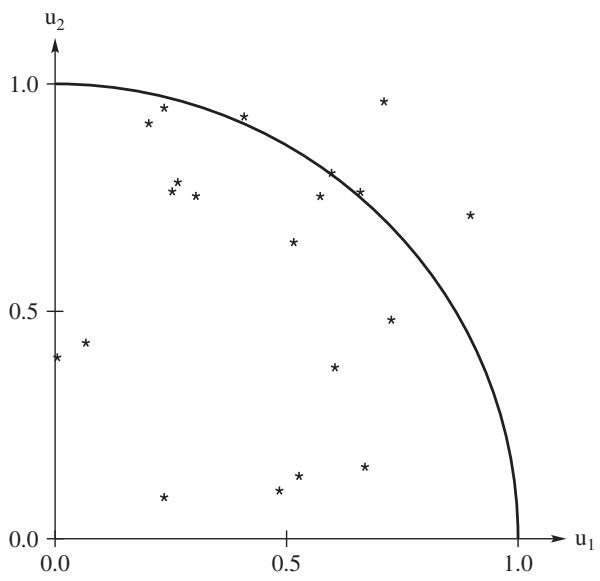  
Figure 4.8.1: Unit square with the first quadrant of the unit circle, Example 4.8.1.

Hence the mean of $X$ is $\mu = \pi / 4$ . Now suppose $\pi$ is unknown. One way of estimating $\pi$ is to repeat the experiment $n$ independent times, hence, obtaining a random sample $X_{1}, \ldots, X_{n}$ on $X$ . The statistic $4\overline{X}$ is an unbiased estimator of $\pi$ . The R function piest repeats this experiment $n$ times, returning the estimate of $\pi$ . This function and other R functions discussed in this chapter are available at the site discussed in the Preface. Figure 4.8.1 shows 20 realizations of this experiment. Note that of the 20 points, 15 fall within the unit circle. Hence our estimate of $\pi$ is $4(15 / 20) = 3.00$ . We ran this code for various values of $n$ with the following results:

<table><tr><td>n</td><td>100</td><td>500</td><td>1000</td><td>10,000</td><td>100,000</td></tr><tr><td>4x</td><td>3.24</td><td>3.072</td><td>3.132</td><td>3.138</td><td>3.13828</td></tr><tr><td>1.96·4√x(1-x)/n</td><td>0.308</td><td>0.148</td><td>0.102</td><td>0.032</td><td>0.010</td></tr></table>

We can use the large sample confidence interval derived in Section 4.2 to estimate the error of estimation. The corresponding $95\%$ confidence interval for $\pi$ is

$$
\left(4 \bar {x} - 1. 9 6 \cdot 4 \sqrt {\bar {x} (1 - \bar {x}) / n}, 4 \bar {x} + 1. 9 6 \cdot 4 \sqrt {\bar {x} (1 - \bar {x}) / n}\right). \tag {4.8.1}
$$

The last row of the above table contains the error part of the confidence intervals. Notice that all five confidence intervals trapped the true value of $\pi$ .

What about continuous random variables? For these we have the following theorem:

Theorem 4.8.1. Suppose the random variable $U$ has a uniform $(0,1)$ distribution. Let $F$ be a continuous distribution function. Then the random variable $X = F^{-1}(U)$ has distribution function $F$ .

Proof: Recall from the definition of a uniform distribution that $U$ has the distribution function $F_U(u) = u$ for $u \in (0,1)$ . Using this, the distribution-function technique, and assuming that $F(x)$ is strictly monotone, the distribution function of $X$ is

$$
\begin{array}{l} P [ X \leq x ] = P [ F ^ {- 1} (U) \leq x ] \\ = P [ U \leq F (x) ] \\ = F (x), \\ \end{array}
$$

which proves the theorem.

In the proof, we assumed that $F(x)$ was strictly monotone. As Exercise 4.8.13 shows, we can weaken this.

We can use this theorem to generate realizations (observations) of many different random variables. For example, suppose $X$ has the $\Gamma(1, \beta)$ -distribution. Suppose we have a uniform generator and we want to generate a realization of $X$ . The distribution function of $X$ is

$$
F (x) = 1 - e ^ {- x / \beta}, \quad x > 0.
$$

Hence the inverse of the distribution function is given by

$$
F ^ {- 1} (u) = - \beta \log (1 - u), \quad 0 <   u <   1. \tag {4.8.2}
$$

So if $U$ has the uniform $(0,1)$ distribution, then $X = -\beta \log(1 - U)$ has the $\Gamma(1,\beta)$ -distribution. For instance, suppose $\beta = 1$ and our uniform generator generated the following stream of uniform observations:

$$
0. 4 7 3, 0. 8 5 8, 0. 5 0 1, 0. 6 7 6, 0. 2 4 0.
$$

Then the corresponding stream of exponential observations is

$$
0. 6 4 1, 1. 9 5, 0. 6 9 6, 1. 1 3, 0. 2 7 4.
$$

As the next example shows, we can generate Poisson realizations using this exponential generation.

Example 4.8.2 (Simulating Poisson Processes). Let $X$ be the number of occurrences of an event over a unit of time and assume that it has a Poisson distribution with mean $\lambda$ , (3.2.1). Let $T_{1}, T_{2}, T_{3}, \ldots$ be the interarrival times of the occurrences. Recall from Remark 3.3.1 that $T_{1}, T_{2}, T_{3}, \ldots$ are iid with the common $\Gamma(1,1/\lambda)$ -distribution. Note that $X = k$ if and only if $\sum_{j=1}^{k} T_{j} \leq 1$ and $\sum_{j=1}^{k+1} T_{j} > 1$ . Using this fact and the generation of $\Gamma(1,1/\lambda)$ variates discussed above, the following algorithm generates a realization of $X$ (assume that the uniforms generated are independent of one another).

1. Set $X = 0$ and $T = 0$ .   
2. Generate $U$ uniform $(0,1)$ and let $Y = -(1 / \lambda)\log (1 - U)$ .   
3. Set $T = T + Y$ .   
4. If $T > 1$ , output $X$ ;

else set $X = X + 1$ and go to step 2.

The R function poisrand provides an implementation of this algorithm, generating $n$ simulations of a Poisson distribution with parameter $\lambda$ . As an illustration, we obtained 1000 realizations from a Poisson distribution with $\lambda = 5$ by running R with the R code temp = poisrand(1000,5), which stores the realizations in the vector temp. The sample average of these realizations is computed by the command mean(temp). In the situation that we ran, the realized mean was 4.895.

Example 4.8.3 (Monte Carlo Integration). Suppose we want to obtain the integral $\int_{a}^{b} g(x) \, dx$ for a continuous function $g$ over the closed and bounded interval $[a, b]$ . If the antiderivative of $g$ does not exist, then numerical integration is in order. A simple numerical technique is the method of Monte Carlo. We can write the integral as

$$
\int_ {a} ^ {b} g (x) d x = (b - a) \int_ {a} ^ {b} g (x) \frac {1}{b - a} d x = (b - a) E [ g (X) ],
$$

where $X$ has the uniform $(a, b)$ distribution. The Monte Carlo technique is then to generate a random sample $X_1, \ldots, X_n$ of size $n$ from the uniform $(a, b)$ distribution and compute $Y_i = (b - a)g(X_i)$ . Then $\overline{Y}$ is an unbiased estimator of $\int_{a}^{b} g(x) dx$ .

Example 4.8.4 (Estimation of $\pi$ by Monte Carlo Integration). For a numerical example, reconsider the estimation of $\pi$ . Instead of the experiment described in Example 4.8.1, we use the method of Monte Carlo integration. Let $g(x) = 4\sqrt{1 - x^2}$ for $0 < x < 1$ . Then

$$
\pi = \int_ {0} ^ {1} g (x) d x = E [ g (X) ],
$$

where $X$ has the uniform $(0,1)$ distribution. Hence we need to generate a random sample $X_{1},\ldots ,X_{n}$ from the uniform $(0,1)$ distribution and form $Y_{i} = 4\sqrt{1 - X_{i}^{2}}$ .

Then $\overline{Y}$ is a unbiased estimator of $\pi$ . Note that $\overline{Y}$ is estimating a mean, so the large sample confidence interval (4.2.6) derived in Example 4.2.2 for means can be used to estimate the error of estimation. Recall that this $95\%$ confidence interval is given by

$$
(\bar {y} - 1. 9 6 s / \sqrt {n}, \bar {y} + 1. 9 6 s / \sqrt {n}),
$$

where $s$ is the value of the sample standard deviation. We coded this algorithm in the R function piest2. The table below gives the results for estimates of $\pi$ for various runs of different sample sizes along with the confidence intervals.

<table><tr><td>n</td><td>100</td><td>1000</td><td>10,000</td><td>100,000</td></tr><tr><td>\(\overline{y}\)</td><td>3.217849</td><td>3.103322</td><td>3.135465</td><td>3.142066</td></tr><tr><td>\(\overline{y}-1.96(s/\sqrt{n})\)</td><td>3.054664</td><td>3.046330</td><td>3.118080</td><td>3.136535</td></tr><tr><td>\(\overline{y}+1.96(s/\sqrt{n})\)</td><td>3.381034</td><td>3.160314</td><td>3.152850</td><td>3.147597</td></tr></table>

Note that for each experiment the confidence interval trapped $\pi$

Numerical integration techniques have made great strides over the last 30 years. But the simplicity of integration by Monte Carlo still makes it a powerful technique.

As Theorem 4.8.1 shows, if we can obtain $F_{X}^{-1}(u)$ in closed form, then we can easily generate observations with cdf $F_{X}$ . In many cases where this is not possible, techniques have been developed to generate observations. Note that the normal distribution serves as an example of such a case, and, in the next example, we show how to generate normal observations. In Section 4.8.1, we discuss an algorithm that can be adapted for many of these cases.

Example 4.8.5 (Generating Normal Observations). To simulate normal variables, Box and Muller (1958) suggested the following procedure. Let $Y_{1}$ , $Y_{2}$ be a random sample from the uniform distribution over $0 < y < 1$ . Define $X_{1}$ and $X_{2}$ by

$$
X _ {1} = (- 2 \log Y _ {1}) ^ {1 / 2} \cos (2 \pi Y _ {2}),
$$

$$
X _ {2} = (- 2 \log Y _ {1}) ^ {1 / 2} \sin (2 \pi Y _ {2}).
$$

This transformation is one-to-one and maps $\{(y_1, y_2) : 0 < y_1 < 1, 0 < y_2 < 1\}$ onto $\{(x_1, x_2) : -\infty < x_1 < \infty, -\infty < x_2 < \infty\}$ except for sets involving $x_1 = 0$ and $x_2 = 0$ , which have probability zero. The inverse transformation is given by

$$
y _ {1} = \exp \left(- \frac {x _ {1} ^ {2} + x _ {2} ^ {2}}{2}\right),
$$

$$
y _ {2} = \frac {1}{2 \pi} \arctan \frac {x _ {2}}{x _ {1}}.
$$

This has the Jacobian

$$
\begin{array}{l} J = \left| \begin{array}{c c} (- x _ {1}) \exp \left(- \frac {x _ {1} ^ {2} + x _ {2} ^ {2}}{2}\right) & (- x _ {2}) \exp \left(- \frac {x _ {1} ^ {2} + x _ {2} ^ {2}}{2}\right) \\ \frac {- x _ {2} / x _ {1} ^ {2}}{(2 \pi) (1 + x _ {2} ^ {2} / x _ {1} ^ {2})} & \frac {1 / x _ {1}}{(2 \pi) (1 + x _ {2} ^ {2} / x _ {1} ^ {2})} \end{array} \right| \\ = \frac {- (1 + x _ {2} ^ {2} / x _ {1} ^ {2}) \exp \left(- \frac {x _ {1} ^ {2} + x _ {2} ^ {2}}{2}\right)}{(2 \pi) (1 + x _ {2} ^ {2} / x _ {1} ^ {2})} = \frac {- \exp \left(- \frac {x _ {1} ^ {2} + x _ {2} ^ {2}}{2}\right)}{2 \pi}. \\ \end{array}
$$

Since the joint pdf of $Y_{1}$ and $Y_{2}$ is 1 on $0 < y_{1} < 1, 0 < y_{2} < 1$ , and zero elsewhere, the joint pdf of $X_{1}$ and $X_{2}$ is

$$
\begin{array}{l} \frac {\exp \left(- \frac {x _ {1} ^ {2} + x _ {2} ^ {2}}{2}\right)}{2 \pi}, - \infty <   x _ {1} <   \infty , - \infty <   x _ {2} <   \infty . \end{array}
$$

That is, $X_{1}$ and $X_{2}$ are independent, standard normal random variables. One of the most commonly used normal generators is a variant of the above procedure called the Marsaglia and Bray (1964) algorithm; see Exercise 4.8.21.

Observations from a contaminated normal distribution, discussed in Section 3.4.1, can easily be generated using a normal generator and a uniform generator. We close this section by estimating via Monte Carlo the significance level of a $t$ -test when the underlying distribution is a contaminated normal.

Example 4.8.6. Let $X$ be a random variable with mean $\mu$ and consider the hypotheses

$$
H _ {0}: \mu = 0 \text {v e r s u s} H _ {1}: \mu > 0. \tag {4.8.3}
$$

Suppose we decide to base this test on a sample of size $n = 20$ from the distribution of $X$ , using the $t$ -test with rejection rule

$$
\text {R e j e c t} H _ {0}: \mu = 0 \text {i n f a v o r} H _ {1}: \mu > 0 \text {i f} t > t _ {. 0 5, 1 9} = 1. 7 2 9, \tag {4.8.4}
$$

where $t = \overline{x} / (s / \sqrt{20})$ and $\overline{x}$ and $s$ are the sample mean and standard deviation, respectively. If $X$ has a normal distribution, then this test has level 0.05. But what if $X$ does not have a normal distribution? In particular, for this example, suppose $X$ has the contaminated normal distribution given by (3.4.17) with $\epsilon = 0.25$ and $\sigma_c = 25$ ; that is, $75\%$ of the time an observation is generated by a standard normal distribution, while $25\%$ of the time it is generated by a normal distribution with mean 0 and standard deviation 25. Hence the mean of $X$ is 0, so $H_0$ is true. To obtain the exact significance level of the test would be quite complicated. We would have to obtain the distribution of $t$ when $X$ has this contaminated normal distribution. As an alternative, we estimate the level (and the error of estimation) by simulation. Let $N$ be the number of simulations. The following algorithm gives the steps of our simulation:

1. Set $k = 1$ , $I = 0$ .   
2. Simulate a random sample of size 20 from the distribution of $X$ .   
3. Based on this sample, compute the test statistic $t$ .   
4. If $t > 1.729$ , increase $I$ by 1.   
5. If $k = N$ ; go to step 6; else increase $k$ by 1 and go to step 2.   
6. Compute $\widehat{\alpha} = I / N$ and the approximate error $= 1.96\sqrt{\widehat{\alpha}(1 - \widehat{\alpha}) / N}$ .

Then $\widehat{\alpha}$ is our simulated estimate of $\alpha$ and the half-width of a confidence interval for $\alpha$ serves as our estimate of the error of estimation.

The R function empalphacn implements this algorithm. We ran it for $N = 10,000$ obtaining the results:

<table><tr><td>No. Simulat.</td><td>Empirical α</td><td>Error</td><td>95% CI for α</td></tr><tr><td>10,000</td><td>0.0412</td><td>0.0039</td><td>(0.0373, 0.0451)</td></tr></table>

Based on these results, the $t$ -test appears to be conservative when the sample is drawn from this contaminated normal distribution.

# 4.8.1 Accept-Reject Generation Algorithm

In this section, we develop the accept-reject procedure that can often be used to simulate random variables whose inverse cdf cannot be obtained in closed form. Let $X$ be a continuous random variable with pdf $f(x)$ . For this discussion, we call this pdf the target pdf. Suppose it is relatively easy to generate an observation of the random variable $Y$ which has pdf $g(x)$ and that for some constant $M$ we have

$$
f (x) \leq M g (x), - \infty <   x <   \infty . \tag {4.8.5}
$$

We call $g(x)$ the instrumental pdf. For clarity, we write the accept-reject as an algorithm:

Algorithm 4.8.1 (Accept-Reject Algorithm). Let $f(x)$ be a pdf. Suppose that $Y$ is a random variable with pdf $g(y)$ , $U$ is a random variable with a uniform(0,1) distribution, $Y$ and $U$ are independent, and (4.8.5) holds. The following algorithm generates a random variable $X$ with pdf $f(x)$ .

1. Generate $Y$ and $U$ .   
2. If $U \leq \frac{f(Y)}{Mg(Y)}$ , then take $X = Y$ . Otherwise return to step 1.   
3. $X$ has pdf $f(x)$

Proof of the validity of the algorithm: Let $-\infty < x < \infty$ . Then

$$
\begin{array}{l} P [ X \leq x ] = P \left[ Y \leq x | U \leq \frac {f (Y)}{M g (Y)} \right] \\ = \frac {P [ Y \leq x , U \leq \frac {f (Y)}{M g (Y)} ]}{P [ U \leq \frac {f (Y)}{M g (Y)} ]} \\ = \frac {\int_ {- \infty} ^ {x} \left[ \int_ {0} ^ {f (y) / M g (y)} d u \right] g (y) d y}{\int_ {- \infty} ^ {\infty} \left[ \int_ {0} ^ {f (y) / M g (y)} d u \right] g (y) d y} \\ = \frac {\int_ {- \infty} ^ {x} \frac {f (y)}{M g (y)} g (y) d y}{\int_ {- \infty} ^ {\infty} \frac {f (y)}{M g (y)} g (y) d y} (4.8.6) \\ = \int_ {- \infty} ^ {x} f (y) d y. (4.8.7) \\ \end{array}
$$

Hence, by differentiating both sides, we find that the pdf of $X$ is $f(x)$ .

There are two facts worth noting. First, the probability of an acceptance in the algorithm is $1 / M$ . This can be seen in the derivation in the proof of the theorem. Just consider the denominators in the derivation which show that

$$
P \left[ U \leq \frac {f (Y)}{M g (Y)} \right] = \frac {1}{M}. \tag {4.8.8}
$$

Hence, for efficiency of the algorithm we want $M$ as small as possible. Secondly, normalizing constants of the two pdfs $f(x)$ and $g(x)$ can be ignored. For example, if $f(x) = kh(x)$ and $g(x) = ct(x)$ for constants $c$ and $k$ , then we can use the rule

$$
h (x) \leq M _ {2} t (x), - \infty <   x <   \infty , \tag {4.8.9}
$$

and change the ratio in step 2 of the algorithm to $U \leq h(Y) / [M_2t(Y)]$ . It follows directly that expression (4.8.5) holds if and only if expression (4.8.9) holds where $M_2 = cM / k$ . This often simplifies the use of the accept-reject algorithm.

We next present two examples of the accept-reject algorithm. The first example offers a normal generator where the instrumental random variable, $Y$ , has a Cauchy distribution. The second example shows how all gamma distributions can be generated.

Example 4.8.7. Suppose that $X$ is a normally distributed random variable with pdf $\phi(x) = (2\pi)^{-1/2} \exp\{-x^2/2\}$ and $Y$ has a Cauchy distribution with pdf $g(x) = \pi^{-1}(1 + x^2)^{-1}$ . As Exercise 4.8.9 shows, the Cauchy distribution is easy to simulate because its inverse cdf is a known function. Ignoring normalizing constants, the ratio to bound is

$$
\frac {f (x)}{g (x)} \propto (1 + x ^ {2}) \exp \{- x ^ {2} / 2 \}, \quad - \infty <   x <   \infty . \tag {4.8.10}
$$

As Exercise 4.8.17 shows, the derivative of this ratio is $-x\exp \{-x^2 /2\} (x^2 -1)$ which has critical values at $\pm 1$ . These values provide maxima to (4.8.10). Hence,

$$
(1 + x ^ {2}) \exp \{- x ^ {2} / 2 \} \leq 2 \exp \{- 1 / 2 \} = 1. 2 1 3,
$$

so $M_2 = 1.213$ . Hence, from the above discussion, $M = (\pi / \sqrt{2\pi}) 1.213 = 1.520$ . Hence, the acceptance rate of the algorithm is $1 / M = 0.6577$ .

Example 4.8.8. Suppose we want to generate observations from a $\Gamma(\alpha, \beta)$ . First, if $Y$ has a $\Gamma(\alpha, 1)$ -distribution then $\beta Y$ has a $\Gamma(\alpha, \beta)$ -distribution. Hence, we need only consider $\Gamma(\alpha, 1)$ distributions. So let $X$ have a $\Gamma(\alpha, 1)$ -distribution. If $\alpha$ is a positive integer then by Theorem 3.3.1 we can write $X$ as

$$
X = T _ {1} + T _ {2} + \dots + T _ {\alpha},
$$

where $T_{1}, T_{2}, \dots, T_{\alpha}$ are independent and identically distributed with the common $\Gamma(1,1)$ -distribution. In the discussion around expression (4.8.2), we have shown how to generate $T_{i}$ .

Assume then that $X$ has a $\Gamma(\alpha, 1)$ distribution, where $\alpha$ is not an integer. Assume first that $\alpha > 1$ . Let $Y$ have a $\Gamma([\alpha], 1/b)$ distribution, where $b < 1$ is chosen later and, as usual, $[\alpha]$ means the greatest integer less than or equal to $\alpha$ . To establish rule (4.8.9), consider the ratio, with $h(x)$ and $t(x)$ proportional to the pdfs of $x$ and $y$ , respectively, given by

$$
\frac {h (x)}{t (x)} = b ^ {- [ \alpha ]} x ^ {\alpha - [ \alpha ]} e ^ {- (1 - b) x}, \tag {4.8.11}
$$

where we have ignored some of the normalizing constants. We next determine the constant $b$ .

As Exercise 4.8.14 shows, the derivative of expression (4.8.11) is

$$
\frac {d}{d x} b ^ {- [ \alpha ]} x ^ {\alpha - [ \alpha ]} e ^ {- (1 - b) x} = b ^ {- [ \alpha ]} e ^ {- (1 - b) x} [ (\alpha - [ \alpha ]) - x (1 - b) ] x ^ {\alpha - [ \alpha ] - 1}, \tag {4.8.12}
$$

which has a maximum critical value at $x = (\alpha - [\alpha]) / (1 - b)$ . Hence, using the maximum of $h(x) / t(x)$ ,

$$
\frac {h (x)}{t (x)} \leq b ^ {- [ \alpha ]} \left[ \frac {\alpha - [ \alpha ]}{(1 - b) e} \right] ^ {\alpha - [ \alpha ]}. \tag {4.8.13}
$$

Now, we need to find our choice of $b$ . Differentiating the right side of this inequality with respect to $b$ , we get, as Exercise 4.8.15 shows,

$$
\frac {d}{d b} b ^ {- [ \alpha ]} (1 - b) ^ {[ \alpha ] - \alpha} = - b ^ {- [ \alpha ]} (1 - b) ^ {[ \alpha ] - \alpha} \left[ \frac {[ \alpha ] - \alpha b}{b (1 - b)} \right], \tag {4.8.14}
$$

which has a critical value at $b = [\alpha] / \alpha < 1$ . As shown in that exercise, this value of $b$ provides a minimum of the right side of expression (4.8.13). Thus, if we take $b = [\alpha] / \alpha < 1$ , then equality (4.8.13) holds and it is the tightest inequality possible and, hence, provides the highest acceptance rate. The final value of $M$ is the right side of expression (4.8.13) evaluated at $b = [\alpha] / \alpha < 1$ .

What if $0 < \alpha < 1$ ? Then the above argument does not work. In this case write $X = YU^{1 / \alpha}$ where $Y$ has a $\Gamma (\alpha +1,1)$ -distribution, $U$ has a uniform $(0,1)$ -distribution, and $Y$ and $U$ are independent. Then, as the derivation in Exercise 4.8.16 shows, $X$ has a $\Gamma (\alpha ,1)$ -distribution and we are finished.

For further discussion, see Kennedy and Gentle (1980) and Robert and Casella (1999).

# EXERCISES

4.8.1. Prove the converse of Theorem MCT. That is, let $X$ be a random variable with a continuous cdf $F(x)$ . Assume that $F(x)$ is strictly increasing on the space of $X$ . Consider the random variable $Z = F(X)$ . Show that $Z$ has a uniform distribution on the interval (0, 1).

4.8.2. Recall that $\log 2 = \int_0^1\frac{1}{x + 1} dx$ . Hence, by using a uniform(0,1) generator, approximate log 2. Obtain an error of estimation in terms of a large sample $95\%$ confidence interval. Write an R function for the estimate and the error of estimation. Obtain your estimate for 10,000 simulations and compare it to the true value.

4.8.3. Similar to Exercise 4.8.2 but now approximate $\int_0^{1.96} \frac{1}{\sqrt{2\pi}} \exp \left\{-\frac{1}{2} t^2\right\} dt$ .

4.8.4. Suppose $X$ is a random variable with the pdf $f_{X}(x) = b^{-1}f((x - a) / b)$ , where $b > 0$ . Suppose we can generate observations from $f(z)$ . Explain how we can generate observations from $f_{X}(x)$ .

4.8.5. Determine a method to generate random observations for the logistic pdf, (4.4.11). Write an R function that returns a random sample of observations from a logistic distribution. Use your function to generate 10,000 observations from this pdf. Then obtain a histogram (use hist(x, pr=T), where x contains the observations). On this histogram overlay a plot of the pdf.

4.8.6. Determine a method to generate random observations for the following pdf:

$$
f (x) = \left\{ \begin{array}{l l} 4 x ^ {3} & 0 <   x <   1 \\ 0 & \text {e l s e w h e r e .} \end{array} \right.
$$

Write an R function that returns a random sample of observations from this pdf.

4.8.7. Obtain the inverse function of the cdf of the Laplace pdf, given by $f(x) = (1/2)e^{-|x|}$ , for $-\infty < x < \infty$ . Write an R function that returns a random sample of observations from this distribution.

4.8.8. Determine a method to generate random observations for the extreme-valued pdf that is given by

$$
f (x) = \exp \left\{x - e ^ {x} \right\}, \quad - \infty <   x <   \infty . \tag {4.8.15}
$$

Write an R function that returns a random sample of observations from an extreme-valued distribution. Use your function to generate 10,000 observations from this pdf. Then obtain a histogram (use hist(x, pr=T), where x contains the observations). On the histogram overlay a plot of the pdf.

4.8.9. Determine a method to generate random observations for the Cauchy distribution with pdf

$$
f (x) = \frac {1}{\pi \left(1 + x ^ {2}\right)}, \quad - \infty <   x <   \infty . \tag {4.8.16}
$$

Write an R function that returns a random sample of observations from this Cauchy distribution.

4.8.10. Suppose we are interested in a particular Weibull distribution with pdf

$$
f (x) = \left\{ \begin{array}{l l} \frac {1}{\theta^ {3}} 3 x ^ {2} e ^ {- x ^ {3} / \theta^ {3}} & 0 <   x <   \infty \\ 0 & \mathrm {e l s e w h e r e .} \end{array} \right.
$$

Determine a method to generate random observations from this Weibull distribution. Write an R function that returns such a sample.

Hint: Find $F^{-1}(u)$

4.8.11. Consider the situation in Example 4.8.6 with the hypotheses (4.8.3). Write an algorithm that simulates the power of the test (4.8.4) to detect the alternative $\mu = 0.5$ under the same contaminated normal distribution as in the example. Modify the $R$ function empalphacn(N) to simulate this power and to obtain an estimate of the error of estimation.   
4.8.12. For the last exercise, write an algorithm to simulate the significance level and power to detect the alternative $\mu = 0.5$ for the test (4.8.4) when the underlying distribution is the logistic distribution (4.4.11).   
4.8.13. For the proof of Theorem 4.8.1, we assumed that the cdf was strictly increasing over its support. Consider a random variable $X$ with cdf $F(x)$ that is not strictly increasing. Define as the inverse of $F(x)$ the function

$$
F ^ {- 1} (u) = \inf  \{x: F (x) \geq u \}, \quad 0 <   u <   1.
$$

Let $U$ have a uniform $(0,1)$ distribution. Prove that the random variable $F^{-1}(U)$ has cdf $F(x)$ .

4.8.14. Verify the derivative in expression (4.8.12) and show that the function (4.8.11) attains a maximum at the critical value $x = (\alpha - [\alpha]) / (1 - b)$ .

4.8.15. Derive expression (4.8.14) and show that the resulting critical value $b = [\alpha] / \alpha < 1$ gives a minimum of the function that is the right side of expression (4.8.13).

4.8.16. Assume that $Y_{1}$ has a $\Gamma(\alpha + 1, 1)$ -distribution, $Y_{2}$ has a uniform $(0, 1)$ distribution, and $Y_{1}$ and $Y_{2}$ are independent. Consider the transformation $X_{1} = Y_{1}Y_{2}^{1 / \alpha}$ and $X_{2} = Y_{2}$ .

(a) Show that the inverse transformation is: $y_{1} = x_{1} / x_{2}^{1 / \alpha}$ and $y_{2} = x_{2}$ with support $0 < x_{1} < \infty$ and $0 < x_{2} < 1$ .   
(b) Show that the Jacobian of the transformation is $1 / x_2^{1 / \alpha}$ and the pdf of $(X_{1},X_{2})$ is

$$
f (x _ {1}, x _ {2}) = \frac {1}{\Gamma (\alpha + 1)} \frac {x _ {1} ^ {\alpha}}{x _ {2}} \exp \left\{- \frac {x _ {1}}{x _ {2} ^ {1 / \alpha}} \right\} \frac {1}{x _ {2} ^ {1 / \alpha}}, 0 <   x _ {1} <   \infty \mathrm {a n d} 0 <   x _ {2} <   1.
$$

(c) Show that the marginal distribution of $X_{1}$ is $\Gamma (\alpha ,1)$

4.8.17. Show that the derivative of the ratio in expression (4.8.10) is given by the function $-x\exp \{-x^2 /2\} (x^2 -1)$ with critical values $\pm 1$ . Show that the critical values provide maxima for expression (4.8.10).

4.8.18. Consider the pdf

$$
f (x) = \left\{ \begin{array}{l l} \beta x ^ {\beta - 1} & 0 <   x <   1 \\ 0 & \text {e l s e w h e r e ,} \end{array} \right.
$$

for $\beta > 1$ .

(a) Use Theorem 4.8.1 to generate an observation from this pdf.   
(b) Use the accept-reject algorithm to generate an observation from this pdf.

4.8.19. Proceeding similar to Example 4.8.7, use the accept-reject algorithm to generate an observation from a $t$ distribution with $r > 1$ degrees of freedom when $g(x)$ is the Cauchy pdf.

4.8.20. For $\alpha > 0$ and $\beta > 0$ , consider the following accept-reject algorithm:

1. Generate $U_{1}$ and $U_{2}$ iid uniform(0,1) random variables. Set $V_{1} = U_{1}^{1 / \alpha}$ and $V_{2} = U_{2}^{1 / \beta}$ .   
2. Set $W = V_{1} + V_{2}$ . If $W \leq 1$ , set $X = V_{1} / W$ ; else go to step 1.   
3. Deliver $X$

Show that $X$ has a beta distribution with parameters $\alpha$ and $\beta$ , (3.3.9). See Kennedy and Gentle (1980).

4.8.21. Consider the following algorithm:

1. Generate $U$ and $V$ independent uniform $(-1, 1)$ random variables.   
2. Set $W = U^{2} + V^{2}$ .   
3. If $W > 1$ go to step 1.   
4. Set $Z = \sqrt{(-2\log W) / W}$ and let $X_{1} = UZ$ and $X_{2} = VZ$ .

Show that the random variables $X_{1}$ and $X_{2}$ are iid with a common $N(0,1)$ distribution. This algorithm was proposed by Marsaglia and Bray (1964).

# 4.9 Bootstrap Procedures

In the last section, we introduced the method of Monte Carlo and discussed several of its applications. In the last few years, however, Monte Carlo procedures have become increasingly used in statistical inference. In this section, we present the bootstrap, one of these procedures. We concentrate on confidence intervals and tests for one- and two-sample problems in this section.

# 4.9.1 Percentile Bootstrap Confidence Intervals

Let $X$ be a random variable of the continuous type with pdf $f(x; \theta)$ , for $\theta \in \Omega$ . Suppose $\mathbf{X} = (X_1, X_2, \ldots, X_n)$ is a random sample on $X$ and $\widehat{\theta} = \widehat{\theta}(\mathbf{X})$ is a point estimator of $\theta$ . The vector notation, $\mathbf{X}$ , proves useful in this section. In Sections 4.2 and 4.3, we discussed the problem of obtaining confidence intervals for $\theta$ in certain situations. In this section, we discuss a general method called the percentile bootstrap procedure, which is a resampling procedure. It was proposed by Efron (1979).

Informative discussions of such procedures can be found in Efron and Tibshirani (1993) and Davison and Hinkley (1997).

To motivate the procedure, suppose for the moment that

$$
\widehat {\theta} \text {h a s a} N \left(\theta , \sigma_ {\widehat {\theta}} ^ {2}\right) \text {d i s t r i b u t i o n .} \tag {4.9.1}
$$

Then as in Section 4.2, a $(1 - \alpha)100\%$ confidence interval for $\theta$ is $(\widehat{\theta}_L,\widehat{\theta}_U)$ , where

$$
\widehat {\theta} _ {L} = \widehat {\theta} - z ^ {(1 - \alpha / 2)} \sigma_ {\widehat {\theta}} \quad \text {a n d} \quad \widehat {\theta} _ {U} = \widehat {\theta} - z ^ {(\alpha / 2)} \sigma_ {\widehat {\theta}}, \tag {4.9.2}
$$

and $z^{(\gamma)}$ denotes the $\gamma 100$ th percentile of a standard normal random variable; i.e., $z^{(\gamma)} = \Phi^{-1}(\gamma)$ , where $\Phi$ is the cdf of a $N(0,1)$ random variable (see also Exercise 4.9.5). We have gone to a superscript notation here to avoid confusion with the usual subscript notation on critical values.

Now suppose that $\widehat{\theta}$ and $\sigma_{\widehat{\theta}}$ are realizations from the sample and $\widehat{\theta}_L$ and $\widehat{\theta}_U$ are calculated as in (4.9.2). Next suppose that $\widehat{\theta}^*$ is a random variable with a $N(\widehat{\theta},\sigma_{\widehat{\theta}}^{2})$ distribution. Then, by (4.9.2),

$$
P \left(\widehat {\theta} ^ {*} \leq \widehat {\theta} _ {L}\right) = P \left(\frac {\widehat {\theta} ^ {*} - \widehat {\theta}}{\sigma_ {\widehat {\theta}}} \leq - z ^ {(1 - \alpha / 2)}\right) = \alpha / 2. \tag {4.9.3}
$$

Likewise, $P(\widehat{\theta}^* \leq \widehat{\theta}_U) = 1 - (\alpha / 2)$ . Therefore, $\widehat{\theta}_L$ and $\widehat{\theta}_U$ are the $\frac{\alpha}{2}$ th and $(1 - \frac{\alpha}{2})$ th percentiles of the distribution of $\widehat{\theta}^*$ . That is, the percentiles of the $N(\widehat{\theta}, \sigma_\widehat{\theta}^2)$ distribution form the $(1 - \alpha)$ th confidence interval for $\theta$ .

We want our final procedure to be quite general, so the normality assumption (4.9.1) is definitely not desired and, in Remark 4.9.1, we do show that this assumption is not necessary. So, in general, let $H(t)$ denote the cdf of $\widehat{\theta}$ .

In practice, though, we do not know the function $H(t)$ . Hence the above confidence interval defined by statement (4.9.3) cannot be obtained. But suppose we could take an infinite number of samples $\mathbf{X}_1, \mathbf{X}_2, \ldots$ ; obtain $\widehat{\theta}^* = \widehat{\theta}(\mathbf{X}^*)$ for each sample $\mathbf{X}^*$ ; and then form the histogram of these estimates $\widehat{\theta}^*$ . The percentiles of this histogram would be the confidence interval defined by expression (4.9.3). Since we only have one sample, this is impossible. It is, however, the idea behind bootstrap procedures.

Bootstrap procedures simply resample from the empirical distribution defined by the one sample. The sampling is done at random and with replacement and the resamples are all of size $n$ , the size of the original sample. That is, suppose $\mathbf{x}' = (x_1, x_2, \ldots, x_n)$ denotes the realization of the sample. Let $\widehat{F}_n$ denote the empirical distribution function of the sample. Recall that $\widehat{F}_n$ is a discrete cdf that puts mass $n^{-1}$ at each point $x_i$ and that $\widehat{F}_n(x)$ is an estimator of $F(x)$ . Then a bootstrap sample is a random sample, say $\mathbf{x}^{*'} = (x_1^*, x_2^*, \ldots, x_n^*)$ , drawn from $\widehat{F}_n$ . For example, it follows from the definition of expectation that

$$
E \left(x _ {i} ^ {*}\right) = \sum_ {i = 1} ^ {n} x _ {i} \frac {1}{n} = \frac {1}{n} \sum_ {i = 1} ^ {n} x _ {i} = \bar {x}. \tag {4.9.4}
$$

Likewise $V(x_{i}^{*}) = n^{-1}\sum_{i = 1}^{n}(x_{i} - \overline{x})^{2}$ ; see Exercise 4.9.2. At first glance, this resampling the sample seems like it would not work. But our only information on sampling variability is within the sample itself, and by resampling the sample we are simulating this variability.

We now give an algorithm that obtains a bootstrap confidence interval. For clarity, we present a formal algorithm, which can be readily coded into languages such as R. Let $\mathbf{x}' = (x_1, x_2, \ldots, x_n)$ be the realization of a random sample drawn from a cdf $F(x; \theta)$ , $\theta \in \Omega$ . Let $\widehat{\theta}$ be a point estimator of $\theta$ . Let $B$ , an integer, denote the number of bootstrap replications, i.e., the number of resamples. In practice, $B$ is often 3000 or more.

1. Set $j = 1$ .   
2. While $j \leq B$ , do steps 2-5.   
3. Let $\mathbf{x}_j^*$ be a random sample of size $n$ drawn from the sample $\mathbf{x}$ . That is, the observations $\mathbf{x}_j^*$ are drawn at random from $x_1, x_2, \ldots, x_n$ , with replacement.   
4. Let $\widehat{\theta}_j^* = \widehat{\theta} (\mathbf{x}_j^*)$   
5. Replace $j$ by $j + 1$ .   
6. Let $\widehat{\theta}_{(1)}^{*} \leq \widehat{\theta}_{(2)}^{*} \leq \dots \leq \widehat{\theta}_{(B)}^{*}$ denote the ordered values of $\widehat{\theta}_{1}^{*}, \widehat{\theta}_{2}^{*}, \ldots, \widehat{\theta}_{B}^{*}$ . Let $m = [(\alpha / 2)B]$ , where $[\cdot]$ denotes the greatest integer function. Form the interval

$$
\left(\widehat {\theta} _ {(m)} ^ {*}, \widehat {\theta} _ {(B + 1 - m)} ^ {*}\right); \tag {4.9.5}
$$

that is, obtain the $\frac{\alpha}{2} 100\%$ and $(1 - \frac{\alpha}{2}) 100\%$ percentiles of the sampling distribution of $\widehat{\theta}_1^*, \widehat{\theta}_2^*, \ldots, \widehat{\theta}_B^*$ .

The interval in (4.9.5) is called the percentile bootstrap confidence interval for $\theta$ . In step 6, the subscripted parenthetical notation is a common notation for order statistics (Section 4.4), which is handy in this section.

For the remainder of this subsection, we use as our estimator of $\theta$ the sample mean. For the sample mean, the following R function percentciboot is an R implementation of this algorithm (it can be downloaded at the site listed in Chapter 1):

```r
percentciboot <- function(x,b,alpha){
    theta = mean(x); thetastar = rep(0,b); n=length(x)
    for (i in 1:b){xstar = sample(x,n,replace=T)
        thetastar[i] = mean(xstar)}
    thetastar = sort(thetastar); pick = round((alpha/2)*(b+1))
    lower = thetastar[pick]; upper = thetastar[b-pick+1]
    list(theta = theta,lower=lower,upper=upper)
    #list(theta = theta,lower=lower,upper=upper, thetasta = thetastar) 
```

The input consists of the sample $\mathbf{x}$ , the number of bootstraps $\mathsf{b}$ , and the desired confidence coefficient $\alpha$ . The second line of code computes the mean and the

size of the sample and provides a vector to store the $\hat{\theta}^*\mathrm{s}$ . In the for loop, the $i$ th bootstrap sample is obtained by the single command sample(x,n,replace=T), which is followed by the computation of $\hat{\theta}_i^*$ . The remainder of the code forms the bootstrap confidence interval, while the list command returns the estimate and the bootstrap confidence interval. The optional second list command returns the $\hat{\theta}^*\mathrm{s}$ , also. Notice that it easy to change the code for an estimator other than the mean. For example, to obtain a bootstrap confidence interval for the median just replace the two occurrences of mean with median. We illustrate this discussion in the next example.

Example 4.9.1. In this example, we sample from a known distribution, but, in practice, the distribution is usually unknown. Let $X_{1}, X_{2}, \ldots, X_{n}$ be a random sample from a $\Gamma(1, \beta)$ distribution. Since the mean of this distribution is $\beta$ , the sample average $\overline{X}$ is an unbiased estimator of $\beta$ . In this example, the $\overline{X}$ serves as our point estimator of $\beta$ . The following 20 data points are the realizations (rounded) of a random sample of size $n = 20$ from a $\Gamma(1, 100)$ distribution:

<table><tr><td>131.7</td><td>182.7</td><td>73.3</td><td>10.7</td><td>150.4</td><td>42.3</td><td>22.2</td><td>17.9</td><td>264.0</td><td>154.4</td></tr><tr><td>4.3</td><td>265.6</td><td>61.9</td><td>10.8</td><td>48.8</td><td>22.5</td><td>8.8</td><td>150.6</td><td>103.0</td><td>85.9</td></tr></table>

The value of $\overline{X}$ for this sample is $\overline{x} = 90.59$ , which is our point estimate of $\beta$ . For illustration, we generated one bootstrap sample of these data. This ordered bootstrap sample is

<table><tr><td>4.3</td><td>4.3</td><td>4.3</td><td>10.8</td><td>10.8</td><td>10.8</td><td>10.8</td><td>17.9</td><td>22.5</td><td>42.3</td></tr><tr><td>48.8</td><td>48.8</td><td>85.9</td><td>131.7</td><td>131.7</td><td>150.4</td><td>154.4</td><td>154.4</td><td>264.0</td><td>265.6</td></tr></table>

The sample mean of this particular bootstrap sample is $\overline{x}^{*} = 78.725$ . To obtain our bootstrap confidence interval for $\beta$ , we need to compute many more resamples. For this computation, we used the R function percentcboot discussed above. Let $\mathbf{x}$ denote the R vector of the original sample of observations. We selected 3000 as the number of bootstraps and chose $\alpha = 0.10$ . We used the code percentcboot(x,3000,.10) to compute our bootstrap confidence interval. Figure 4.9.1 displays a histogram of the 3000 sample means $\overline{x}^{*}$ s computed by the code. The sample mean of these 3000 values is 90.13, close to $\overline{x} = 90.59$ . Our program also obtained a $90\%$ (bootstrap percentile) confidence interval given by (61.655, 120.48), which the reader can locate on the figure. It does trap the true value $\mu = 100$ . Exercise 4.9.3 shows that if we are sampling from a $\Gamma(1,\beta)$ distribution, then the interval $(2n\overline{x} / [\chi_{2n}^2]^{(1 - (\alpha/2))}, 2n\overline{x} / [\chi_{2n}^2]^{(\alpha/2)})$ is an exact $(1 - \alpha)100\%$ confidence interval for $\beta$ . Note that, in keeping with our superscript notation for critical values, $[\chi_{2n}^2]^{(\gamma)}$ denotes the $\gamma100\%$ percentile of a $\chi^2$ distribution with $2n$ degrees of freedom. This exact $90\%$ confidence interval for our sample is (64.99, 136.69).

What about the validity of a bootstrap confidence interval? Davison and Hinkley (1997) discuss the theory behind the bootstrap in Chapter 2 of their book. Under some general conditions, they show that the bootstrap confidence interval is asymptotically valid.

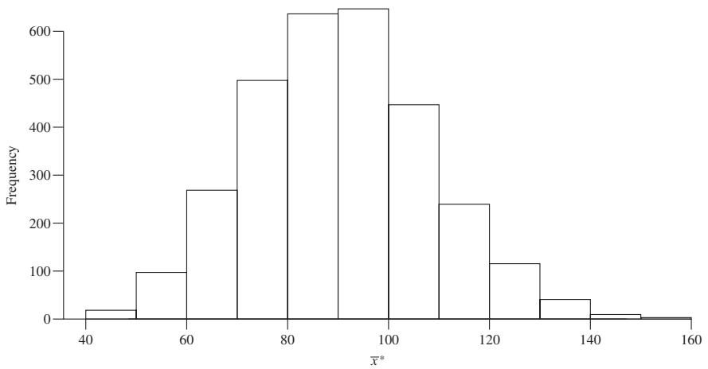  
Figure 4.9.1: Histogram of the 3000 bootstrap $\overline{x}^*$ s. The $90\%$ bootstrap confidence interval is (61.655, 120.48).

One way of improving the bootstrap is to use a pivot random variable, a variable whose distribution is free of other parameters. For instance, in the last example, instead of using $\overline{X}$ , use $\overline{X} / \hat{\sigma}_{\overline{X}}$ , where $\hat{\sigma}_{\overline{X}} = S / \sqrt{n}$ and $S = [\sum (X_i - \overline{X})^2 /(n - 1)]^{1 / 2}$ ; that is, adjust $\overline{X}$ by its standard error. This is discussed in Exercise 4.9.6. Other improvements are discussed in the two books cited earlier.

Remark 4.9.1. *Briefly, we show that the normal assumption on the distribution of $\widehat{\theta}$ , (4.9.1), is transparent to the argument around expression (4.9.3); see Efron and Tibshirani (1993) for further discussion. Suppose $H$ is the cdf of $\widehat{\theta}$ and that $H$ depends on $\theta$ . Then, using Theorem 4.8.1, we can find an increasing transformation $\phi = m(\theta)$ such that the distribution of $\widehat{\phi} = m(\widehat{\theta})$ is $N(\phi, \sigma_c^2)$ , where $\phi = m(\theta)$ and $\sigma_c^2$ is some variance. For example, take the transformation to be $m(\theta) = F_c^{-1}(H(\theta))$ , where $F_c(x)$ is the cdf of a $N(\phi, \sigma_c^2)$ distribution. Then, as above, $(\widehat{\phi} - z^{(1 - \alpha / 2)}\sigma_c, \widehat{\phi} - z^{(\alpha / 2)}\sigma_c)$ is a $(1 - \alpha)$ $100\%$ confidence interval for $\phi$ . But note that

$$
\begin{array}{l} {1 - \alpha} = {P \left[ \widehat {\phi} - z ^ {(1 - \alpha / 2)} \sigma_ {c} <   \phi <   \widehat {\phi} - z ^ {(\alpha / 2)} \sigma_ {c}) \right]} \\ { = } { P \left[ m ^ { - 1 } ( \widehat { \phi } - z ^ { ( 1 - \alpha / 2 ) } \sigma _ { c } ) <   \theta <   m ^ { - 1 } ( \widehat { \phi } - z ^ { ( \alpha / 2 ) } \sigma _ { c } ) \right] . } { ( 4 . 9 . 6 ) } \\ \end{array}
$$

Hence, $(m^{-1}(\widehat{\phi} -z^{(1 - \alpha /2)}\sigma_c),m^{-1}(\widehat{\phi} -z^{(\alpha /2)}\sigma_c))$ is a $(1 - \alpha)100\%$ confidence interval for $\theta$ . Now suppose $\widehat{H}$ is the cdf $H$ with a realization $\widehat{\theta}$ substituted in for $\theta$ , i.e., analogous to the $N(\widehat{\theta},\sigma_{\widehat{\theta}}^2)$ distribution above. Suppose $\widehat{\theta}^*$ is a random variable with

cdf $\widehat{H}$ .Let $\widehat{\phi} = m(\widehat{\theta})$ and $\widehat{\phi}^{*} = m(\widehat{\theta}^{*})$ .We have

$$
\begin{array}{l} P \left[ \widehat {\theta} ^ {*} \leq m ^ {- 1} \left(\widehat {\phi} - z ^ {(1 - \alpha / 2)} \sigma_ {c}\right) \right] = P \left[ \widehat {\phi} ^ {*} \leq \widehat {\phi} - z ^ {(1 - \alpha / 2)} \sigma_ {c} \right] \\ = P \left[ \frac {\widehat {\phi} ^ {*} - \widehat {\phi}}{\sigma_ {c}} \leq - z ^ {(1 - \alpha / 2)} \right] = \alpha / 2, \\ \end{array}
$$

similar to (4.9.3). Therefore, $m^{-1}(\widehat{\phi} - z^{(1 - \alpha / 2)}\sigma_c)$ is the $\frac{\alpha}{2}$ 100th percentile of the cdf $\widehat{H}$ . Likewise, $m^{-1}(\widehat{\phi} - z^{(\alpha / 2)}\sigma_c)$ is the $(1 - \frac{\alpha}{2})$ 100th percentile of the cdf $\widehat{H}$ . Therefore, in the general case too, the percentiles of the distribution of $\widehat{H}$ form the confidence interval for $\theta$ .

# 4.9.2 Bootstrap Testing Procedures

Bootstrap procedures can also be used effectively in testing hypotheses. We begin by discussing these procedures for two-sample problems, which cover many of the nuances of the use of the bootstrap in testing.

Consider a two-sample location problem; that is, $\mathbf{X}' = (X_1, X_2, \ldots, X_{n_1})$ is a random sample from a distribution with cdf $F(x)$ and $\mathbf{Y}' = (Y_1, Y_2, \ldots, Y_{n_2})$ is a random sample from a distribution with the cdf $F(x - \Delta)$ , where $\Delta \in R$ . The parameter $\Delta$ is the shift in locations between the two samples. Hence $\Delta$ can be written as the difference in location parameters. In particular, assuming that the means $\mu_Y$ and $\mu_X$ exist, we have $\Delta = \mu_Y - \mu_X$ . We consider the one-sided hypotheses given by

$$
H _ {0}: \Delta = 0 \text {v e r s u s} H _ {1}: \Delta > 0. \tag {4.9.7}
$$

As our test statistic, we take the difference in sample means, i.e.,

$$
V = \bar {Y} - \bar {X}. \tag {4.9.8}
$$

Our decision rule is to reject $H_0$ if $V \geq c$ . As is often done in practice, we base our decision on the $p$ -value of the test. Recall if the samples result in the values $x_1, x_2, \ldots, x_{n_1}$ and $y_1, y_2, \ldots, y_{n_2}$ with realized sample means $\overline{x}$ and $\overline{y}$ , respectively, then the $p$ -value of the test is

$$
\widehat {p} = P _ {H _ {0}} [ V \geq \bar {y} - \bar {x} ]. \tag {4.9.9}
$$

Our goal is a bootstrap estimate of the $p$ -value. But, unlike the last section, the bootstraps here have to be performed when $H_0$ is true. An easy way to do this is to combine the samples into one large sample and then to resample at random and with replacement the combined sample into two samples, one of size $n_1$ (new xs) and one of size $n_2$ (new ys). Hence the resampling is performed under one distribution; i.e., $H_0$ is true. Let $B$ be a positive integer and let $v = \overline{y} - \overline{x}$ . Our bootstrap algorithm is

1. Combine the samples into one sample: $\mathbf{z}' = (\mathbf{x}',\mathbf{y}')$   
2. Set $j = 1$ .

3. While $j \leq B$ , do steps 3-6.   
4. Obtain a random sample with replacement of size $n_1$ from $\mathbf{z}$ . Call the sample $\mathbf{x}^{*'} = (x_1^*, x_2^*, \ldots, x_{n_1}^*)$ . Compute $\overline{x}_j^*$ .   
5. Obtain a random sample with replacement of size $n_2$ from $\mathbf{z}$ . Call the sample $\mathbf{y}^{*'} = (y_1^*, y_2^*, \ldots, y_{n_2}^*)$ . Compute $\overline{y}_j^*$ .   
6. Compute $v_{j}^{*} = \overline{y}_{j}^{*} - \overline{x}_{j}^{*}$ .   
7. The bootstrap estimated $p$ -value is given by

$$
\widehat {p} ^ {*} = \frac {\# _ {j = 1} ^ {B} \left\{v _ {j} ^ {*} \geq v \right\}}{B}. \tag {4.9.10}
$$

Note that the theory cited above for the bootstrap confidence intervals covers this testing situation also. Hence, this bootstrap $p$ -value is valid.

Example 4.9.2. For illustration, we generated data sets from a contaminated normal distribution, using the R function rcn. Let $W$ be a random variable with the contaminated normal distribution (3.4.17) with proportion of contamination $\epsilon = 0.20$ and $\sigma_c = 4$ . Thirty independent observations $W_1, W_2, \ldots, W_{30}$ were generated from this distribution. Then we let $X_i = 10W_i + 100$ for $1 \leq i \leq 15$ and $Y_i = 10W_{i+15} + 120$ for $1 \leq i \leq 15$ . Hence the true shift parameter is $\Delta = 20$ . The actual (rounded) data are

<table><tr><td colspan="8">X variates</td></tr><tr><td>94.2</td><td>111.3</td><td>90.0</td><td>99.7</td><td>116.8</td><td>92.2</td><td>166.0</td><td>95.7</td></tr><tr><td>109.3</td><td>106.0</td><td>111.7</td><td>111.9</td><td>111.6</td><td>146.4</td><td>103.9</td><td></td></tr><tr><td colspan="8">Y variates</td></tr><tr><td>125.5</td><td>107.1</td><td>67.9</td><td>98.2</td><td>128.6</td><td>123.5</td><td>116.5</td><td>143.2</td></tr><tr><td>120.3</td><td>118.6</td><td>105.0</td><td>111.8</td><td>129.3</td><td>130.8</td><td>139.8</td><td></td></tr></table>

Based on the comparison boxplots below, the scales of the two data sets appear to be the same, while the $y$ -variates (Sample 2) appear to be shifted to the right of $x$ -variates (Sample 1).

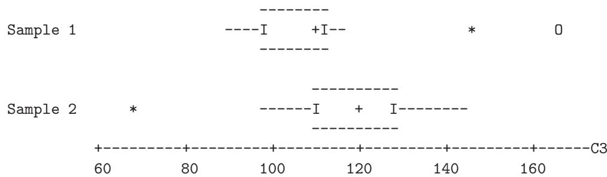

There are three outliers in the data sets.

Our test statistic for these data is $v = \overline{y} - \overline{x} = 117.74 - 111.11 = 6.63$ . Computing with the R function boottesttwo, we performed the bootstrap algorithm given above for $B = 3000$ bootstrap replications. The bootstrap $p$ -value was $\widehat{p}^* = 0.169$ . This means that $(0.169)(3000) = 507$ of the bootstrap test statistics exceeded the value of the test statistic. Furthermore, these bootstrap values were generated under $H_0$ . In practice, $H_0$ would generally not be rejected for a $p$ -value this high. In Figure 4.9.2, we display a histogram of the 3000 values of the bootstrap test statistic that were obtained. The relative area to the right of the value of the test statistic, 6.63, is approximately equal to $\widehat{p}^*$ .

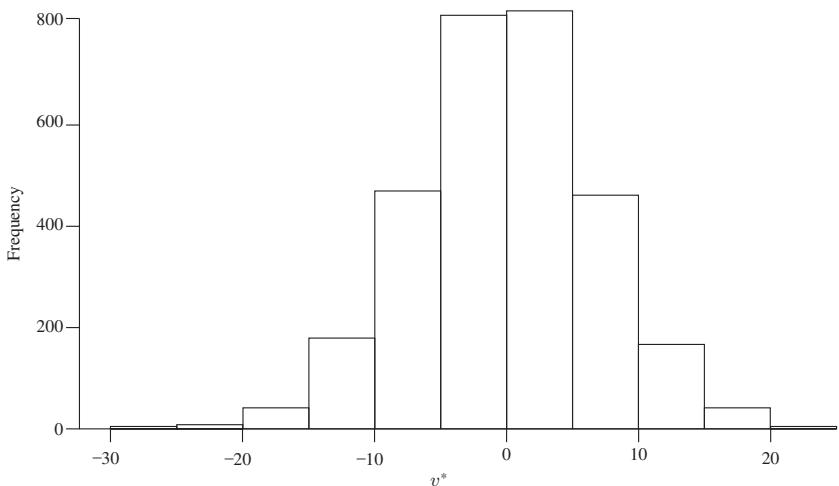  
Figure 4.9.2: Histogram of the 3000 bootstrap $v^*$ s. Locate the value of the test statistic $v = \overline{y} - \overline{x} = 6.63$ on the horizontal axis. The area (proportional to overall area) to the right is the $p$ -value of the bootstrap test.

For comparison purposes, we used the two-sample "pooled" $t$ -test discussed in Example 4.6.2 to test these hypotheses. As the reader can obtain in Exercise 4.9.8, for these data, $t = 0.93$ with a $p$ -value of 0.18, which is quite close to the bootstrap $p$ -value.

The above test uses the difference in sample means as the test statistic. Certainly other test statistics could be used. Exercise 4.9.7 asks the reader to obtain the bootstrap test based on the difference in sample medians. Often, as with confidence intervals, standardizing the test statistic by a scale estimator improves the bootstrap test.

The bootstrap test described above for the two-sample problem is analogous to permutation tests. In the permutation test, the test statistic is calculated for all possible samples of $x$ s and $y$ s drawn without replacement from the combined data. Often, it is approximated by Monte Carlo methods, in which case it is quite similar to the bootstrap test except, in the case of the bootstrap, the sampling is done with

replacement; see Exercise 4.9.10. Usually, the permutation tests and the bootstrap tests give very similar solutions; see Efron and Tibshirani (1993) for discussion.

As our second testing situation, consider a one-sample location problem. Suppose $X_{1},X_{2},\ldots ,X_{n}$ is a random sample from a continuous cdf $F(x)$ with finite mean $\mu$ . Suppose we want to test the hypotheses

$$
H _ {0}: \mu = \mu_ {0} \text {v e r s u s} H _ {1}: \mu > \mu_ {0},
$$

where $\mu_0$ is specified. As a test statistic we use $\overline{X}$ with the decision rule

Reject $H_0$ in favor of $H_{1}$ if $\overline{X}$ is too large.

Let $x_{1}, x_{2}, \ldots, x_{n}$ be the realization of the random sample. We base our decision on the $p$ -value of the test, namely,

$$
\widehat {p} = P _ {H _ {0}} [ \overline {{X}} \geq \overline {{x}} ],
$$

where $\overline{x}$ is the realized value of the sample average when the sample is drawn. Our bootstrap test is to obtain a bootstrap estimate of this $p$ -value. At first glance, one might proceed by bootstrapping the statistic $\overline{X}$ . But note that the $p$ -value must be estimated under $H_0$ . To assure that $H_0$ is true, bootstrap the values:

$$
z _ {i} = x _ {i} - \bar {x} + \mu_ {0}, \quad i = 1, 2, \dots , n. \tag {4.9.11}
$$

Our bootstrap procedure is to randomly sample with replacement from $z_{1}, z_{2}, \ldots, z_{n}$ . Let $(z_{j,1}^{*}, \ldots, z_{j,1}^{*})$ denote, say, the $j$ th bootstrap sample. As in expression (4.9.4), it follows that $E(z_{j,i}^{*}) = \mu_{0}$ . Hence, using the $z_{i}$ s, the bootstrap resampling is performed under $H_{0}$ . Denote the test statistic by the sample mean $\overline{z}_{j}^{*}$ . Then the bootstrap $p$ -value is

$$
\widehat {p} ^ {*} = \frac {\# _ {j = 1} ^ {B} \left\{\bar {z} _ {j} ^ {*} \geq \bar {x} \right\}}{B}. \tag {4.9.12}
$$

Example 4.9.3. To illustrate the bootstrap test just described, consider the following data set. We generated $n = 20$ observations $X_{i} = 10W_{i} + 100$ , where $W_{i}$ has a contaminated normal distribution with proportion of contamination $20\%$ and $\sigma_c = 4$ . Suppose we are interested in testing

$$
H _ {0}: \mu = 9 0 \text {v e r s u s} H _ {1}: \mu > 9 0.
$$

Because the true mean of $X_{i}$ is 100, the null hypothesis is false. The data generated are

<table><tr><td>119.7</td><td>104.1</td><td>92.8</td><td>85.4</td><td>108.6</td><td>93.4</td><td>67.1</td><td>88.4</td><td>101.0</td><td>97.2</td></tr><tr><td>95.4</td><td>77.2</td><td>100.0</td><td>114.2</td><td>150.3</td><td>102.3</td><td>105.8</td><td>107.5</td><td>0.9</td><td>94.1</td></tr></table>

The sample mean of these values is $\overline{x} = 95.27$ , which exceeds 90, but is it significantly over 90? As discussed above, we bootstrap the values $z_{i} = x_{i} - 95.27 + 90$ . The R function bootst三点mean performs this bootstrap test. For the run we did, it computed the 3000 values $\overline{z}_j^*$ , which are displayed in the histogram in Figure

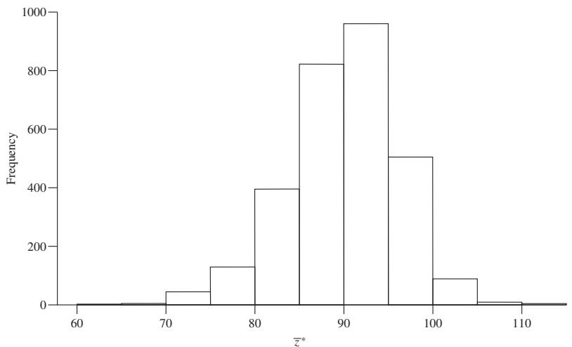  
Figure 4.9.3: Histogram of the 3000 bootstrap $\overline{z}^*$ s discussed in Example 4.9.3. The bootstrap $p$ -value is the area (relative to the total area) under the histogram and to the right of the 95.27.

4.9.3. The mean of these 3000 values is 89.96, which is quite close to 90. Of these 3000 values, 563 exceeded $\overline{x} = 95.27$ ; hence, the $p$ -value of the bootstrap test is 0.188. The fraction of the total area that is to the right of 95.27 in Figure 4.9.3 is approximately equal to 0.188. Such a high $p$ -value is usually deemed nonsignificant; hence, the null hypothesis would not be rejected.

For comparison, the reader is asked to show in Exercise 4.9.12 that the value of the one-sample $t$ -test is $t = 0.84$ , which has a $p$ -value of 0.20. A test based on the median is discussed in Exercise 4.9.13.

# EXERCISES

4.9.1. Consider the sulfur dioxide concentrations data discussed in Example 4.1.3. Use the R function percentcboot to obtain a bootstrap $95\%$ confidence interval for the true mean concentration. Use 3000 bootstraps and compare it with the $t$ -confidence interval for the mean.

4.9.2. Let $x_{1}, x_{2}, \ldots, x_{n}$ be the values of a random sample. A bootstrap sample, $\mathbf{x}^{*'} = (x_{1}^{*}, x_{2}^{*}, \ldots, x_{n}^{*})$ , is a random sample of $x_{1}, x_{2}, \ldots, x_{n}$ drawn with replacement.

(a) Show that $x_1^*, x_2^*, \ldots, x_n^*$ are iid with common cdf $\widehat{F}_n$ , the empirical cdf of $x_1, x_2, \ldots, x_n$ .

(b) Show that $E(x_{i}^{*}) = \overline{x}$ .   
(c) If $n$ is odd, show that $\text{median} \{x_i^*\} = x_{((n + 1) / 2)}$ .   
(d) Show that $V(x_{i}^{*}) = n^{-1}\sum_{i = 1}^{n}(x_{i} - \overline{x})^{2}$ .

4.9.3. Let $X_{1}, X_{2}, \ldots, X_{n}$ be a random sample from a $\Gamma(1, \beta)$ distribution.

(a) Show that the confidence interval $(2n\overline{X} /(\chi_{2n}^2)^{(1 - (\alpha /2))},2n\overline{X} /(\chi_{2n}^2)^{(\alpha /2)})$ is an exact $(1 - \alpha)100\%$ confidence interval for $\beta$   
(b) Using part (a), show that the $90\%$ confidence interval for the data of Example 4.9.1 is (64.99, 136.69).

4.9.4. Consider the situation discussed in Example 4.9.1. Suppose we want to estimate the median of $X_{i}$ using the sample median.

(a) Determine the median for a $\Gamma (1,\beta)$ distribution.   
(b) The algorithm for the bootstrap percentile confidence intervals is general and hence can be used for the median. Rewrite the R code in the function percentciboot.s so that the median is the estimator. Using the sample given in the example, obtain a $90\%$ bootstrap percentile confidence interval for the median. Did it trap the true median in this case?

4.9.5. Suppose $X_{1},X_{2},\ldots ,X_{n}$ is a random sample drawn from a $N(\mu ,\sigma^2)$ distribution. As discussed in Example 4.2.1, the pivot random variable for a confidence interval is

$$
t = \frac {\bar {X} - \mu}{S / \sqrt {n}}, \tag {4.9.13}
$$

where $\overline{X}$ and $S$ are the sample mean and standard deviation, respectively. Recall by Theorem 3.6.1 that $t$ has a Student $t$ -distribution with $n - 1$ degrees of freedom; hence, its distribution is free of all parameters for this normal situation. In the notation of this section, $t_{n - 1}^{(\gamma)}$ denotes the $\gamma 100\%$ percentile of a $t$ -distribution with $n - 1$ degrees of freedom. Using this notation, show that a $(1 - \alpha)100\%$ confidence interval for $\mu$ is

$$
\left(\bar {x} - t ^ {(1 - \alpha / 2)} \frac {s}{\sqrt {n}}, \bar {x} - t ^ {(\alpha / 2)} \frac {s}{\sqrt {n}}\right). \tag {4.9.14}
$$

4.9.6. Frequently, the bootstrap percentile confidence interval can be improved if the estimator $\widehat{\theta}$ is standardized by an estimate of scale. To illustrate this, consider a bootstrap for a confidence interval for the mean. Let $x_{1}^{*}, x_{2}^{*}, \ldots, x_{n}^{*}$ be a bootstrap sample drawn from the sample $x_{1}, x_{2}, \ldots, x_{n}$ . Consider the bootstrap pivot [analog of (4.9.13)]:

$$
t ^ {*} = \frac {\bar {x} ^ {*} - \bar {x}}{s ^ {*} / \sqrt {n}}, \tag {4.9.15}
$$

where $\overline{x}^{*} = n^{-1}\sum_{i = 1}^{n}x_{i}^{*}$ and

$$
s ^ {* 2} = (n - 1) ^ {- 1} \sum_ {i = 1} ^ {n} (x _ {i} ^ {*} - \overline {{x}} ^ {*}) ^ {2}.
$$

(a) Rewrite the percentile bootstrap confidence interval algorithm using the mean and collecting $t_j^*$ for $j = 1,2,\ldots ,B$ . Form the interval

$$
\left(\bar {x} - t ^ {* (1 - \alpha / 2)} \frac {s}{\sqrt {n}}, \bar {x} - t ^ {* (\alpha / 2)} \frac {s}{\sqrt {n}}\right), \tag {4.9.16}
$$

where $t^{*(\gamma)} = t_{([\gamma *B])}^*$ ; that is, order the $t_j^*$ s and pick off the quantiles.

(b) Rewrite the R program percentcboot.s and then use it to find a $90\%$ confidence interval for $\mu$ for the data in Example 4.9.3. Use 3000 bootstraps.   
(c) Compare your confidence interval in the last part with the nonstandardized bootstrap confidence interval based on the program percentcboot.s.

4.9.7. Consider the algorithm for a two-sample bootstrap test given in Section 4.9.2.

(a) Rewrite the algorithm for the bootstrap test based on the difference in medians.   
(b) Consider the data in Example 4.9.2. By substituting the difference in medians for the difference in means in the R program boottesttwo.s, obtain the bootstrap test for the algorithm of part (a).   
(c) Obtain the estimated $p$ -value of your test for $B = 3000$ and compare it to the estimated $p$ -value of 0.063 that the authors obtained.

4.9.8. Consider the data of Example 4.9.2. The two-sample $t$ -test of Example 4.6.2 can be used to test these hypotheses. The test is not exact here (why?), but it is an approximate test. Show that the value of the test statistic is $t = 0.93$ , with an approximate $p$ -value of 0.18.

4.9.9. In Example 4.9.3, suppose we are testing the two-sided hypotheses,

$$
H _ {0}: \mu = 9 0 \text {v e r s u s} H _ {1}: \mu \neq 9 0.
$$

(a) Determine the bootstrap $p$ -value for this situation.   
(b) Rewrite the R program boottestonemean to obtain this $p$ -value.   
(c) Compute the $p$ -value based on 3000 bootstraps.

4.9.10. Consider the following permutation test for the two-sample problem with hypotheses (4.9.7). Let $\mathbf{x}' = (x_1, x_2, \ldots, x_{n_1})$ and $\mathbf{y}' = (y_1, y_2, \ldots, y_{n_2})$ be the realizations of the two random samples. The test statistic is the difference in sample means $\overline{y} - \overline{x}$ . The estimated $p$ -value of the test is calculated as follows:

1. Combine the data into one sample $\mathbf{z}' = (\mathbf{x}',\mathbf{y}')$   
2. Obtain all possible samples of size $n_1$ drawn without replacement from $\mathbf{z}$ . Each such sample automatically gives another sample of size $n_2$ , i.e., all elements of $\mathbf{z}$ not in the sample of size $n_1$ . There are $M = \binom{n_1+n_2}{n_1}$ such samples.

3. For each such sample $j$ :

(a) Label the sample of size $n_1$ by $\mathbf{x}^*$ and label the sample of size $n_2$ by $\mathbf{y}^*$ .   
(b) Calculate $v_{j}^{*} = \overline{y}^{*} - \overline{x}^{*}$ .

4. The estimated $p$ -value is $\widehat{p}^{*} = \# \{v_{j}^{*}\geq \overline{y} -\overline{x}\} /M$

(a) Suppose we have two samples each of size 3 which result in the realizations: $\mathbf{x}' = (10,15,21)$ and $\mathbf{y}' = (20,25,30)$ . Determine the test statistic and the permutation test described above along with the $p$ -value.   
(b) If we ignore distinct samples, then we can approximate the permutation test by using the bootstrap algorithm with resampling performed at random and without replacement. Modify the bootstrap program boottesttwo.s to do this and obtain this approximate permutation test based on 3000 resamples for the data of Example 4.9.2.   
(c) In general, what is the probability of having distinct samples in the approximate permutation test described in the last part? Assume that the original data are distinct values.

4.9.11. Let $z^*$ be drawn at random from the discrete distribution that has mass $n^{-1}$ at each point $z_i = x_i - \overline{x} + \mu_0$ , where $(x_1, x_2, \ldots, x_n)$ is the realization of a random sample. Determine $E(z^*)$ and $V(z^*)$ .   
4.9.12. For the situation described in Example 4.9.3, show that the value of the one-sample $t$ -test is $t = 0.84$ and its associated $p$ -value is 0.20.   
4.9.13. For the situation described in Example 4.9.3, obtain the bootstrap test based on medians. Use the same hypotheses; i.e.,

$$
H _ {0}: \mu = 9 0 \text {v e r s u s} H _ {1}: \mu > 9 0.
$$

4.9.14. Consider the Darwin's experiment on Zea mays discussed in Examples 4.5.1 and 4.5.5.

(a) Obtain a bootstrap test for this experimental data. Keep in mind that the data are recorded in pairs. Hence your resampling procedure must keep this dependence intact and still be under $H_0$ .   
(b) Write an R program that executes your bootstrap test and compare its $p$ -value with that found in Example 4.5.5.

# 4.10 *Tolerance Limits for Distributions

We propose now to investigate a problem that has something of the same flavor as that treated in Section 4.4. Specifically, can we compute the probability that a certain random interval includes (or covers) a preassigned percentage of the probability of the distribution under consideration? And, by appropriate selection of

the random interval, can we be led to an additional distribution-free method of statistical inference?

Let $X$ be a random variable with distribution function $F(x)$ of the continuous type. Let $Z = F(X)$ . Then, as shown in Exercise 4.8.1, $Z$ has a uniform(0,1) distribution. That is, $Z = F(X)$ has the pdf

$$
h (z) = \left\{ \begin{array}{l l} 1 & 0 <   z <   1 \\ 0 & \text {e l s e w h e r e .} \end{array} \right.
$$

Then, if $0 < p < 1$ , we have

$$
P [ F (X) \leq p ] = \int_ {0} ^ {p} d z = p.
$$

Now $F(x) = P(X \leq x)$ . Since $P(X = x) = 0$ , then $F(x)$ is the fractional part of the probability for the distribution of $X$ that is between $-\infty$ and $x$ . If $F(x) \leq p$ , then no more than $100p\%$ of the probability for the distribution of $X$ is between $-\infty$ and $x$ . But recall $P[F(X) \leq p] = p$ . That is, the probability that the random variable $Z = F(X)$ is less than or equal to $p$ is precisely the probability that the random interval $(-\infty, X)$ contains no more than $100p\%$ of the probability for the distribution. For example, if $p = 0.70$ , the probability that the random interval $(-\infty, X)$ contains no more than $70\%$ of the probability for the distribution is 0.70; and the probability that the random interval $(-\infty, X)$ contains more than $70\%$ of the probability for the distribution is $1 - 0.70 = 0.30$ .

We now consider certain functions of the order statistics. Let $X_{1}, X_{2}, \ldots, X_{n}$ denote a random sample of size $n$ from a distribution that has a positive and continuous pdf $f(x)$ if and only if $a < x < b$ , and let $F(x)$ denote the associated distribution function. Consider the random variables $F(X_{1}), F(X_{2}), \ldots, F(X_{n})$ . These random variables are independent and each, in accordance with Exercise 4.8.1, has a uniform distribution on the interval (0,1). Thus, $F(X_{1}), F(X_{2}), \ldots, F(X_{n})$ is a random sample of size $n$ from a uniform distribution on the interval (0,1). Consider the order statistics of this random sample $F(X_{1}), F(X_{2}), \ldots, F(X_{n})$ . Let $Z_{1}$ be the smallest of these $F(X_{i})$ , $Z_{2}$ the next $F(X_{i})$ in order of magnitude, ..., and $Z_{n}$ the largest of $F(X_{i})$ . If $Y_{1}, Y_{2}, \ldots, Y_{n}$ are the order statistics of the initial random sample $X_{1}, X_{2}, \ldots, X_{n}$ , the fact that $F(x)$ is a nondecreasing (here, strictly increasing) function of $x$ implies that $Z_{1} = F(Y_{1}), Z_{2} = F(Y_{2}), \ldots, Z_{n} = F(Y_{n})$ . Hence, it follows from (4.4.1) that the joint pdf of $Z_{1}, Z_{2}, \ldots, Z_{n}$ is given by

$$
h \left(z _ {1}, z _ {2}, \dots , z _ {n}\right) = \left\{ \begin{array}{l l} n! & 0 <   z _ {1} <   z _ {2} <   \dots <   z _ {n} <   1 \\ 0 & \text {e l s e w h e r e .} \end{array} \right. \tag {4.10.1}
$$

This proves a special case of the following theorem.

Theorem 4.10.1. Let $Y_{1}, Y_{2}, \ldots, Y_{n}$ denote the order statistics of a random sample of size $n$ from a distribution of the continuous type that has pdf $f(x)$ and cdf $F(x)$ . The joint pdf of the random variables $Z_{i} = F(Y_{i})$ , $i = 1, 2, \ldots, n$ , is given by expression (4.10.1).

Because the distribution function of $Z = F(X)$ is given by $z$ , $0 < z < 1$ , it follows from (4.4.2) that the marginal pdf of $Z_{k} = F(Y_{k})$ is the following beta pdf:

$$
h _ {k} \left(z _ {k}\right) = \left\{ \begin{array}{l l} \frac {n !}{(k - 1) ! (n - k) !} z _ {k} ^ {k - 1} \left(1 - z _ {k}\right) ^ {n - k} & 0 <   z _ {k} <   1 \\ 0 & \text {e l s e w h e r e .} \end{array} \right. \tag {4.10.2}
$$

Moreover, from (4.4.3), the joint pdf of $Z_{i} = F(Y_{i})$ and $Z_{j} = F(Y_{j})$ is, with $i < j$ , given by

$$
h \left(z _ {i}, z _ {j}\right) = \left\{ \begin{array}{l l} \frac {n ! z _ {i} ^ {i - 1} \left(z _ {j} - z _ {i}\right) ^ {j - i - 1} \left(1 - z _ {j}\right) ^ {n - j}}{(i - 1) ! (j - i - 1) ! (n - j) !} & 0 <   z _ {i} <   z _ {j} <   1 \\ 0 & \text {e l s e w h e r e .} \end{array} \right. \tag {4.10.3}
$$

Consider the difference $Z_{j} - Z_{i} = F(Y_{j}) - F(Y_{i}), i < j$ . Now $F(y_{j}) = P(X \leq y_{j})$ and $F(y_{i}) = P(X \leq y_{i})$ . Since $P(X = y_{i}) = P(X = y_{j}) = 0$ , then the difference $F(y_{j}) - F(y_{i})$ is that fractional part of the probability for the distribution of $X$ that is between $y_{i}$ and $y_{j}$ . Let $p$ denote a positive proper fraction. If $F(y_{j}) - F(y_{i}) \geq p$ , then at least $100p\%$ of the probability for the distribution of $X$ is between $y_{i}$ and $y_{j}$ . Let it be given that $\gamma = P[F(Y_{j}) - F(Y_{i}) \geq p]$ . Then the random interval $(Y_{i}, Y_{j})$ has probability $\gamma$ of containing at least $100p\%$ of the probability for the distribution of $X$ . Now if $y_{i}$ and $y_{j}$ denote, respectively, observational values of $Y_{i}$ and $Y_{j}$ , the interval $(y_{i}, y_{j})$ either does or does not contain at least $100p\%$ of the probability for the distribution of $X$ . However, we refer to the interval $(y_{i}, y_{j})$ as a $100\gamma\%$ tolerance interval for $100p\%$ of the probability for the distribution of $X$ . In like vein, $y_{i}$ and $y_{j}$ are called the $100\gamma\%$ tolerance limits for $100p\%$ of the probability for the distribution of $X$ .

One way to compute the probability $\gamma = P[F(Y_j) - F(Y_i)\geq p]$ is to use equation (4.10.3), which gives the joint pdf of $Z_{i} = F(Y_{i})$ and $Z_{j} = F(Y_{j})$ . The required probability is then given by

$$
\gamma = P (Z _ {j} - Z _ {i} \geq p) = \int_ {0} ^ {1 - p} \left[ \int_ {p + z _ {i}} ^ {1} h _ {i j} (z _ {i}, z _ {j}) d z _ {j} \right] d z _ {i}.
$$

Sometimes, this is a rather tedious computation. For this reason and also for the reason that coverages are important in distribution-free statistical inference, we choose to introduce at this time the concept of coverage.

Consider the random variables $W_{1} = F(Y_{1}) = Z_{1}$ , $W_{2} = F(Y_{2}) - F(Y_{1}) = Z_{2} - Z_{1}$ , and $W_{3} = F(Y_{3}) - F(Y_{2}) = Z_{3} - Z_{2},\ldots ,W_{n} = F(Y_{n}) - F(Y_{n - 1}) = Z_{n} - Z_{n - 1}$ . The random variable $W_{1}$ is called a coverage of the random interval $\{x: - \infty < x < Y_1\}$ and the random variable $W_{i}$ , $i = 2,3,\dots,n$ , is called a coverage of the random interval $\{x:Y_{i - 1} < x < Y_i\}$ . We find that the joint pdf of the $n$ coverages $W_{1},W_{2},\ldots ,W_{n}$ . First we note that the inverse functions of the associated transformation are given by

$$
z _ {i} = \sum_ {j = 1} ^ {i} w _ {j}, \text {f o r} i = 1, 2, \dots , n.
$$

We also note that the Jacobian is equal to 1 and that the space of positive probability density is

$$
\left\{\left(w _ {1}, w _ {2}, \dots , w _ {n}\right): 0 <   w _ {i}, i = 1, 2, \dots , n, w _ {1} + \dots + w _ {n} <   1 \right\}.
$$

Since the joint pdf of $Z_{1}, Z_{2}, \ldots, Z_{n}$ is $n!$ , $0 < z_{1} < z_{2} < \dots < z_{n} < 1$ , zero elsewhere, the joint pdf of the $n$ coverages is

$$
k (w _ {1}, \ldots , w _ {n}) = \left\{ \begin{array}{l l} n! & 0 <   w _ {i}, i = 1, \ldots , n, w _ {1} + \dots w _ {n} <   1 \\ 0 & \text {e l s e w h e r e .} \end{array} \right.
$$

Because the pdf $k(w_{1},\ldots ,w_{n})$ is symmetric in $w_{1},w_{2},\ldots ,w_{n}$ , it is evident that the distribution of every sum of $r$ , $r < n$ , of these coverages $W_{1},\ldots ,W_{n}$ is exactly the same for each fixed value of $r$ . For instance, if $i < j$ and $r = j - i$ , the distribution of $Z_{j} - Z_{i} = F(Y_{j}) - F(Y_{i}) = W_{i + 1} + W_{i + 2} + \dots +W_{j}$ is exactly the same as that of $Z_{j - i} = F(Y_{j - i}) = W_1 + W_2 + \dots +W_{j - i}$ . But we know that the pdf of $Z_{j - i}$ is the beta pdf of the form

$$
h _ {j - i} (v) = \left\{ \begin{array}{l l} \frac {\Gamma (n + 1)}{\Gamma (j - i) \Gamma (n - j + i + 1)} v ^ {j - i - 1} (1 - v) ^ {n - j + i} & 0 <   v <   1 \\ 0 & \mathrm {e l s e w h e r e .} \end{array} \right.
$$

Consequently, $F(Y_{j}) - F(Y_{i})$ has this pdf and

$$
P \left[ F \left(Y _ {j}\right) - F \left(Y _ {i}\right) \geq p \right] = \int_ {p} ^ {1} h _ {j - i} (v) d v.
$$

Example 4.10.1. Let $Y_{1} < Y_{2} < \dots < Y_{6}$ be the order statistics of a random sample of size 6 from a distribution of the continuous type. We want to use the observed interval $(y_{1}, y_{6})$ as a tolerance interval for $80\%$ of the distribution. Then

$$
\begin{array}{l} \gamma = P \left[ F \left(Y _ {6}\right) - F \left(Y _ {1}\right) \geq 0. 8 \right] \\ = 1 - \int_ {0} ^ {0. 8} 3 0 v ^ {4} (1 - v) d v, \\ \end{array}
$$

because the integrand is the pdf of $F(Y_6) - F(Y_1)$ . Accordingly,

$$
\gamma = 1 - 6 (0. 8) ^ {5} + 5 (0. 8) ^ {6} = 0. 3 4,
$$

approximately. That is, the observed values of $Y_{1}$ and $Y_{6}$ define a $34\%$ tolerance interval for $80\%$ the probability for the distribution.

Remark 4.10.1. Tolerance intervals are extremely important and often they are more desirable than confidence intervals. For illustration, consider a "fill" problem in which a manufacturer says that each container has at least 12 ounces of the product. Let $X$ be the amount in a container. The company would be pleased to note that the interval (12.1, 12.3), for instance, is a $95\%$ tolerance interval for $99\%$ of the distribution of $X$ . This would be true in this case, because the FDA allows a very small fraction of the containers to be less than 12 ounces.

# EXERCISES

4.10.1. Let $Y_{1}$ and $Y_{n}$ be, respectively, the first and the $n$ th order statistic of a random sample of size $n$ from a distribution of the continuous type having cdf $F(x)$ . Find the smallest value of $n$ such that $P[F(Y_{n}) - F(Y_{1}) \geq 0.5]$ is at least 0.95.

4.10.2. Let $Y_{2}$ and $Y_{n - 1}$ denote the second and the $(n - 1)$ st order statistics of a random sample of size $n$ from a distribution of the continuous type having a distribution function $F(x)$ . Compute $P[F(Y_{n - 1}) - F(Y_2)\geq p]$ , where $0 < p < 1$ .

4.10.3. Let $Y_{1} < Y_{2} < \dots < Y_{48}$ be the order statistics of a random sample of size 48 from a distribution of the continuous type. We want to use the observed interval $(y_{4}, y_{45})$ as a $100\gamma \%$ tolerance interval for $75\%$ of the distribution.

(a) What is the value of $\gamma$ ?   
(b) Approximate the integral in part (a) by noting that it can be written as a partial sum of a binomial pdf, which in turn can be approximated by probabilities associated with a normal distribution (see Section 5.3).

4.10.4. Let $Y_{1} < Y_{2} < \dots < Y_{n}$ be the order statistics of a random sample of size $n$ from a distribution of the continuous type having distribution function $F(x)$ .

(a) What is the distribution of $U = 1 - F(Y_{j})$ ?   
(b) Determine the distribution of $V = F(Y_{n}) - F(Y_{j}) + F(Y_{i}) - F(Y_{1})$ , where $i < j$ .

4.10.5. Let $Y_{1} < Y_{2} < \dots < Y_{10}$ be the order statistics of a random sample from a continuous-type distribution with distribution function $F(x)$ . What is the joint distribution of $V_{1} = F(Y_{4}) - F(Y_{2})$ and $V_{2} = F(Y_{10}) - F(Y_{6})$ ?

This page intentionally left blank

# Chapter 5

# Consistency and Limiting Distributions

In Chapter 4, we introduced some of the main concepts in statistical inference, namely, point estimation, confidence intervals, and hypothesis tests. For readers who on first reading have skipped Chapter 4, we review these ideas in Section 5.1.1.

The theory behind these inference procedures often depends on the distribution of a pivot random variable. For example, suppose $X_{1},X_{2},\ldots ,X_{n}$ is a random sample on a random variable $X$ which has a $N(\mu ,\sigma^2)$ distribution. Denote the sample mean by $\overline{X}_n = n^{-1}\sum_{i = 1}^n X_i$ . Then the pivot random variable of interest is

$$
Z _ {n} = \frac {\overline {{X}} _ {n} - \mu}{\sigma / \sqrt {n}}.
$$

This random variable plays a key role in obtaining exact procedures for the confidence interval for $\mu$ and for tests of hypotheses concerning $\mu$ . What if $X$ does not have a normal distribution? In this case, in Chapter 4, we discussed inference procedures, which were quite similar to the exact procedures, but they were based on the "approximate" (as the sample size $n$ gets large) distribution of $Z_{n}$ .

There are several types of convergence used in statistics, and in this chapter we discuss two of the most important: convergence in probability and convergence in distribution. These concepts provide structure to the "approximations" discussed in Chapter 4. Beyond this, though, these concepts play a crucial role in much of statistics and probability. We begin with convergence in probability.

# 5.1 Convergence in Probability

In this section, we formalize a way of saying that a sequence of random variables $\{X_{n}\}$ is getting "close" to another random variable $X$ , as $n \to \infty$ . We will use this concept throughout the book.

Definition 5.1.1. Let $\{X_{n}\}$ be a sequence of random variables and let $X$ be a random variable defined on a sample space. We say that $X_{n}$ converges in probability to $X$ if, for all $\epsilon >0$ ,

$$
\lim _ {n \to \infty} P [ | X _ {n} - X | \geq \epsilon ] = 0,
$$

or equivalently,

$$
\lim _ {n \to \infty} P [ | X _ {n} - X | <   \epsilon ] = 1.
$$

If so, we write

$$
X _ {n} \stackrel {P} {\to} X.
$$

If $X_{n} \xrightarrow{P} X$ , we often say that the mass of the difference $X_{n} - X$ is converging to 0. In statistics, often the limiting random variable $X$ is a constant; i.e., $X$ is a degenerate random variable with all its mass at some constant $a$ . In this case, we write $X_{n} \xrightarrow{P} a$ . Also, as Exercise 5.1.1 shows, for a sequence of real numbers $\{a_{n}\}$ , $a_{n} \to a$ is equivalent to $a_{n} \xrightarrow{P} a$ .

One way of showing convergence in probability is to use Chebyshev's Theorem (1.10.3). An illustration of this is given in the following proof. To emphasize the fact that we are working with sequences of random variables, we may place a subscript $n$ on the appropriate random variables; for example, write $\overline{X}$ as $\overline{X}_n$ .

Theorem 5.1.1 (Weak Law of Large Numbers). Let $\{X_{n}\}$ be a sequence of iid random variables having common mean $\mu$ and variance $\sigma^2 < \infty$ . Let $\overline{X}_n = n^{-1} \sum_{i=1}^{n} X_i$ . Then

$$
\overline {{X}} _ {n} \stackrel {P} {\rightarrow} \mu .
$$

Proof: From expression (2.8.6) of Example 2.8.1, the mean and variance of $\overline{X}_n$ are $\mu$ and $\sigma^2 / n$ , respectively. Hence, by Chebyshev's Theorem, we have for every $\epsilon > 0$ ,

$$
P [ | \overline {{X}} _ {n} - \mu | \geq \epsilon ] = P [ | \overline {{X}} _ {n} - \mu | \geq (\epsilon \sqrt {n} / \sigma) (\sigma / \sqrt {n}) ] \leq \frac {\sigma^ {2}}{n \epsilon^ {2}} \rightarrow 0.
$$

This theorem says that all the mass of the distribution of $\overline{X}_n$ is converging to $\mu$ , as $n \to \infty$ . In a sense, for $n$ large, $\overline{X}_n$ is close to $\mu$ . But how close? For instance, if we were to estimate $\mu$ by $\overline{X}_n$ , what can we say about the error of estimation? We answer this in Section 5.3.

Actually, in a more advanced course, a Strong Law of Large Numbers is proved; see page 124 of Chung (1974). One result of this theorem is that we can weaken the hypothesis of Theorem 5.1.1 to the assumption that the random variables $X_{i}$ are independent and each has finite mean $\mu$ . Thus the Strong Law of Large Numbers is a first moment theorem, while the Weak Law requires the existence of the second moment.

There are several theorems concerning convergence in probability which will be useful in the sequel. Together the next two theorems say that convergence in probability is closed under linearity.

Theorem 5.1.2. Suppose $X_{n} \xrightarrow{P} X$ and $Y_{n} \xrightarrow{P} Y$ . Then $X_{n} + Y_{n} \xrightarrow{P} X + Y$ .

Proof: Let $\epsilon > 0$ be given. Using the triangle inequality, we can write

$$
\left| X _ {n} - X \right| + \left| Y _ {n} - Y \right| \geq \left| \left(X _ {n} + Y _ {n}\right) - (X + Y) \right| \geq \epsilon .
$$

Since $P$ is monotone relative to set containment, we have

$$
\begin{array}{l} P \left[ \left| \left(X _ {n} + Y _ {n}\right) - (X + Y) \right| \geq \epsilon \right] \leq P \left[ \left| X _ {n} - X \right| + \left| Y _ {n} - Y \right| \geq \epsilon \right] \\ \leq \quad P [ | X _ {n} - X | \geq \epsilon / 2 ] + P [ | Y _ {n} - Y | \geq \epsilon / 2 ]. \\ \end{array}
$$

By the hypothesis of the theorem, the last two terms converge to 0 as $n \to \infty$ which gives us the desired result.

Theorem 5.1.3. Suppose $X_{n} \xrightarrow{P} X$ and $a$ is a constant. Then $aX_{n} \xrightarrow{P} aX$ .

Proof: If $a = 0$ , the result is immediate. Suppose $a \neq 0$ . Let $\epsilon > 0$ . The result follows from these equalities:

$$
P \left[ \left| a X _ {n} - a X \right| \geq \epsilon \right] = P \left[ \left| a \right| \left| X _ {n} - X \right| \geq \epsilon \right] = P \left[ \left| X _ {n} - X \right| \geq \epsilon / | a | \right],
$$

and by hypotheses the last term goes to 0 as $n\to \infty$

Theorem 5.1.4. Suppose $X_{n} \xrightarrow{P} a$ and the real function $g$ is continuous at $a$ . Then $g(X_{n}) \xrightarrow{P} g(a)$ .

Proof: Let $\epsilon > 0$ . Then since $g$ is continuous at $a$ , there exists a $\delta > 0$ such that if $|x - a| < \delta$ , then $|g(x) - g(a)| < \epsilon$ . Thus

$$
\left| g (x) - g (a) \right| \geq \epsilon \Rightarrow | x - a | \geq \delta .
$$

Substituting $X_{n}$ for $x$ in the above implication, we obtain

$$
P [ | g (X _ {n}) - g (a) | \geq \epsilon ] \leq P [ | X _ {n} - a | \geq \delta ].
$$

By the hypothesis, the last term goes to 0 as $n\to \infty$ , which gives us the result.

This theorem gives us many useful results. For instance, if $X_{n} \xrightarrow{P} a$ , then

$$
\begin{array}{l} X _ {n} ^ {2} \stackrel {{P}} {{\to}} a ^ {2} \\ 1 / X _ {n} \stackrel {{P}} {{\rightarrow}} 1 / a, \text {p r o v i d e d} a \neq 0 \\ \begin{array}{c c c c} \sqrt {X _ {n}} & \stackrel {{P}} {{\to}} & \sqrt {a}, & \text {p r o v i d e d} a \geq 0. \end{array} \\ \end{array}
$$

Actually, in a more advanced class, it is shown that if $X_{n} \xrightarrow{P} X$ and $g$ is a continuous function, then $g(X_{n}) \xrightarrow{P} g(X)$ ; see page 104 of Tucker (1967). We make use of this in the next theorem.

Theorem 5.1.5. Suppose $X_{n} \xrightarrow{P} X$ and $Y_{n} \xrightarrow{P} Y$ . Then $X_{n}Y_{n} \xrightarrow{P} XY$ .

Proof: Using the above results, we have

$$
\begin{array}{l} X _ {n} Y _ {n} = \frac {1}{2} X _ {n} ^ {2} + \frac {1}{2} Y _ {n} ^ {2} - \frac {1}{2} (X _ {n} - Y _ {n}) ^ {2} \\ \stackrel {P} {\rightarrow} \quad \frac {1}{2} X ^ {2} + \frac {1}{2} Y ^ {2} - \frac {1}{2} (X - Y) ^ {2} = X Y. \\ \end{array}
$$

# 5.1.1 Sampling and Statistics

Consider the situation where we have a random variable $X$ whose pdf (or pmf) is written as $f(x;\theta)$ for an unknown parameter $\theta \in \Omega$ . For example, the distribution of $X$ is normal with unknown mean $\mu$ and variance $\sigma^2$ . Then $\theta = (\mu, \sigma^2)$ and $\Omega = \{\theta = (\mu, \sigma^2) : -\infty < \mu < \infty, \sigma > 0\}$ . As another example, the distribution of $X$ is $\Gamma(1,\beta)$ , where $\beta > 0$ is unknown. Our information consists of a random sample $X_1, X_2, \ldots, X_n$ on $X$ ; i.e., $X_1, X_2, \ldots, X_n$ are independent and identically distributed (iid) random variables with the common pdf $f(x;\theta)$ , $\theta \in \Omega$ . We say that $T$ is a statistic if $T$ is a function of the sample; i.e., $T = T(X_1, X_2, \ldots, X_n)$ . Here, we want to consider $T$ as a point estimator of $\theta$ . For example, if $\mu$ is the unknown mean of $X$ , then we may use as our point estimator the sample mean $\overline{X} = n^{-1} \sum_{i=1}^{n} X_i$ . When the sample is drawn let $x_1, x_2, \ldots, x_n$ denote the observed values of $X_1, X_2, \ldots, X_n$ . We call these values the realized values of the sample and call the realized statistic $t = t(x_1, x_2, \ldots, x_n)$ a point estimate of $\theta$ .

In Chapters 6 and 7, we discuss properties of point estimators in formal settings. For now, we consider two properties: unbiasedness and consistency. We say that the point estimator $T$ for $\theta$ is unbiased if $E(T) = \theta$ . Recall in Section 2.8, we showed that the sample mean $\overline{X}$ and the sample variance $S^2$ are unbiased estimators of $\mu$ and $\sigma^2$ respectively; see equations (2.8.6) and (2.8.8). We next consider consistency of a point estimator.

Definition 5.1.2 (Consistency). Let $X$ be a random variable with cdf $F(x, \theta)$ , $\theta \in \Omega$ . Let $X_1, \ldots, X_n$ be a sample from the distribution of $X$ and let $T_n$ denote a statistic. We say $T_n$ is a consistent estimator of $\theta$ if

$$
T _ {n} \stackrel {P} {\to} \theta .
$$

If $X_{1},\ldots ,X_{n}$ is a random sample from a distribution with finite mean $\mu$ and variance $\sigma^2$ , then by the Weak Law of Large Numbers, the sample mean, $\overline{X}_n$ , is a consistent estimator of $\mu$ .

Figure 5.1.1 displays realizations of the sample mean for samples of size 10 to 2000 in steps of 10 which are drawn from a $N(0,1)$ distribution. The lines on the plot encompass the interval $\mu \pm 0.04$ for $\mu = 0$ . As $n$ increases, the realizations tend to stay within this interval, verifying the consistency of the sample mean. The R function consistent produces this plot. Within this function, if the function mean is changed to median a similar plot on the estimator $\operatorname{med} X_i$ can be obtained.

Example 5.1.1 (Sample Variance). Let $X_{1},\ldots ,X_{n}$ denote a random sample from a distribution with mean $\mu$ and variance $\sigma^2$ . In Example 2.8.7, we showed that the

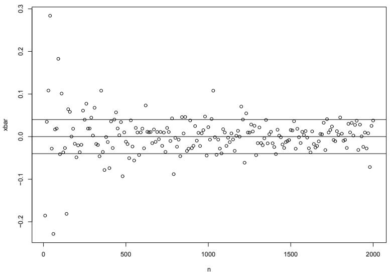  
Figure 5.1.1: Realizations of the point estimator $\overline{X}$ for samples of size 10 to 2000 in steps of 10 which are drawn from a $N(0,1)$ distribution.

sample variance is an unbiased estimator of $\sigma^2$ . We now show that it is a consistent estimator of $\sigma^2$ . Recall Theorem 5.1.1 which shows that $\overline{X}_n \xrightarrow{P} \mu$ . To show that the sample variance converges in probability to $\sigma^2$ , assume further that $E[X_1^4] < \infty$ , so that $\operatorname{Var}(S^2) < \infty$ . Using the preceding results, we can show the following:

$$
\begin{array}{l} S _ {n} ^ {2} = \frac {1}{n - 1} \sum_ {i = 1} ^ {n} (X _ {i} - \overline {{X}} _ {n}) ^ {2} = \frac {n}{n - 1} \left(\frac {1}{n} \sum_ {i = 1} ^ {n} X _ {i} ^ {2} - \overline {{X}} _ {n} ^ {2}\right) \\ \stackrel {P} {\rightarrow} 1 \cdot [ E (X _ {1} ^ {2}) - \mu^ {2} ] = \sigma^ {2}. \\ \end{array}
$$

Hence the sample variance is a consistent estimator of $\sigma^2$ . From the discussion above, we have immediately that $S_n \xrightarrow{P} \sigma$ ; that is, the sample standard deviation is a consistent estimator of the population standard deviation.

Unlike the last example, sometimes we can obtain the convergence by using the distribution function. We illustrate this with the following example:

Example 5.1.2 (Maximum of a Sample from a Uniform Distribution). Suppose $X_{1},\ldots ,X_{n}$ is a random sample from a uniform $(0,\theta)$ distribution. Suppose $\theta$ is unknown. An intuitive estimate of $\theta$ is the maximum of the sample. Let $Y_{n} = \max \{X_{1},\dots ,X_{n}\}$ . Exercise 5.1.4 shows that the cdf of $Y_{n}$ is

$$
F _ {Y _ {n}} (t) = \left\{ \begin{array}{l l} 1 & t > \theta \\ \left(\frac {t}{\theta}\right) ^ {n} & 0 <   t \leq \theta \\ 0 & t \leq 0. \end{array} \right. \tag {5.1.1}
$$

Hence the pdf of $Y_{n}$ is

$$
f _ {Y _ {n}} (t) = \left\{ \begin{array}{l l} \frac {n}{\theta^ {n}} t ^ {n - 1} & 0 <   t \leq \theta \\ 0 & \text {e l s e w h e r e .} \end{array} \right. \tag {5.1.2}
$$

Based on its pdf, it is easy to show that $E(Y_{n}) = (n / (n + 1))\theta$ . Thus, $Y_{n}$ is a biased estimator of $\theta$ . Note, however, that $((n + 1) / n)Y_{n}$ is an unbiased estimator of $\theta$ . Further, based on the cdf of $Y_{n}$ , it is easily seen that $Y_{n} \xrightarrow{P} \theta$ and, hence, that the sample maximum is a consistent estimate of $\theta$ . Note that the unbiased estimator, $((n + 1) / n)Y_{n}$ , is also consistent.

To expand on Example 5.1.2, by the Weak Law of Large Numbers, Theorem 5.1.1, it follows that $\overline{X}_n$ is a consistent estimator of $\theta / 2$ , so $2\overline{X}_n$ is a consistent estimator of $\theta$ . Note the difference in how we showed that $Y_n$ and $2\overline{X}_n$ converge to $\theta$ in probability. For $Y_n$ we used the cdf of $Y_n$ , but for $2\overline{X}_n$ we appealed to the Weak Law of Large Numbers. In fact, the cdf of $2\overline{X}_n$ is quite complicated for the uniform model. In many situations, the cdf of the statistic cannot be obtained, but we can appeal to asymptotic theory to establish the result. There are other estimators of $\theta$ . Which is the "best" estimator? In future chapters we will be concerned with such questions.

Consistency is a very important property for an estimator to have. It is a poor estimator that does not approach its target as the sample size gets large. Note that the same cannot be said for the property of unbiasedness. For example, instead of using the sample variance to estimate $\sigma^2$ , suppose we use $V = n^{-1}\sum_{i=1}^{n}(X_i - \overline{X})^2$ . Then $V$ is consistent for $\sigma^2$ , but it is biased, because $E(V) = (n-1)\sigma^2/n$ . Thus the bias of $V$ is $-\sigma^2/n$ , which vanishes as $n \to \infty$ .

# EXERCISES

5.1.1. Let $\{a_n\}$ be a sequence of real numbers. Hence, we can also say that $\{a_n\}$ is a sequence of constant (degenerate) random variables. Let $a$ be a real number. Show that $a_n \to a$ is equivalent to $a_n \xrightarrow{P} a$ .

5.1.2. Let the random variable $Y_{n}$ have a distribution that is $b(n,p)$ .

(a) Prove that $Y_{n} / n$ converges in probability to $p$ . This result is one form of the weak law of large numbers.   
(b) Prove that $1 - Y_{n} / n$ converges in probability to $1 - p$ .   
(c) Prove that $(Y_{n} / n)(1 - Y_{n} / n)$ converges in probability to $p(1 - p)$ .

5.1.3. Let $W_{n}$ denote a random variable with mean $\mu$ and variance $b / n^{p}$ , where $p > 0$ , $\mu$ , and $b$ are constants (not functions of $n$ ). Prove that $W_{n}$ converges in probability to $\mu$ .

Hint: Use Chebyshev's inequality.

5.1.4. Derive the cdf given in expression (5.1.1).

5.1.5. Consider the R function consistmean which produces the plot shown in Figure 5.1.1. Obtain a similar plot for the sample median when the distribution sampled is the $N(0,1)$ distribution. Compare the mean and median plots.

5.1.6. Write an R function that obtains a plot similar to Figure 5.1.1 for the situation described in Example 5.1.2. For the plot choose $\theta = 10$ .

5.1.7. Let $X_{1},\ldots ,X_{n}$ be iid random variables with common pdf

$$
f (x) = \left\{ \begin{array}{l l} e ^ {- (x - \theta)} & x > \theta , - \infty <   \theta <   \infty \\ 0 & \text {e l s e w h e r e .} \end{array} \right. \tag {5.1.3}
$$

This pdf is called the shifted exponential. Let $Y_{n} = \min \{X_{1},\ldots ,X_{n}\}$ . Prove that $Y_{n}\to \theta$ in probability by first obtaining the cdf of $Y_{n}$ .

5.1.8. Using the assumptions behind the confidence interval given in expression (4.2.9), show that

$$
\sqrt {\frac {S _ {1} ^ {2}}{n _ {1}} + \frac {S _ {2} ^ {2}}{n _ {2}}} / \sqrt {\frac {\sigma_ {1} ^ {2}}{n _ {1}} + \frac {\sigma_ {2} ^ {2}}{n _ {2}}} \stackrel {P} {\rightarrow} 1.
$$

5.1.9. For Exercise 5.1.7, obtain the mean of $Y_{n}$ . Is $Y_{n}$ an unbiased estimator of $\theta$ ? Obtain an unbiased estimator of $\theta$ based on $Y_{n}$ .

# 5.2 Convergence in Distribution

In the last section, we introduced the concept of convergence in probability. With this concept, we can formally say, for instance, that a statistic converges to a parameter and, furthermore, in many situations we can show this without having to obtain the distribution function of the statistic. But how close is the statistic to the estimator? For instance, can we obtain the error of estimation with some credence? The method of convergence discussed in this section, in conjunction with earlier results, gives us affirmative answers to these questions.

Definition 5.2.1 (Convergence in Distribution). Let $\{X_{n}\}$ be a sequence of random variables and let $X$ be a random variable. Let $F_{X_{n}}$ and $F_{X}$ be, respectively, the cdfs of $X_{n}$ and $X$ . Let $C(F_{X})$ denote the set of all points where $F_{X}$ is continuous. We say that $X_{n}$ converges in distribution to $X$ if

$$
\lim _ {n \to \infty} F _ {X _ {n}} (x) = F _ {X} (x), \quad f o r a l l x \in C (F _ {X}).
$$

We denote this convergence by

$$
X _ {n} \stackrel {D} {\longrightarrow} X.
$$

Remark 5.2.1. This material on convergence in probability and in distribution comes under what statisticians and probabilists refer to as asymptotic theory. Often, we say that the distribution of $X$ is the asymptotic distribution or the limiting distribution of the sequence $\{X_{n}\}$ . We might even refer informally to

the asymptotics of certain situations. Moreover, for illustration, instead of saying $X_{n} \xrightarrow{D} X$ , where $X$ has a standard normal distribution, we may write

$$
X _ {n} \stackrel {D} {\to} N (0, 1)
$$

as an abbreviated way of saying the same thing. Clearly, the right-hand member of this last expression is a distribution and not a random variable as it should be, but we will make use of this convention. In addition, we may say that $X_{n}$ has a limiting standard normal distribution to mean that $X_{n} \stackrel{D}{\to} X$ , where $X$ has a standard normal random, or equivalently $X_{n} \stackrel{D}{\to} N(0,1)$ .

Motivation for considering only points of continuity of $F_{X}$ is given by the following simple example. Let $X_{n}$ be a random variable with all its mass at $\frac{1}{n}$ and let $X$ be a random variable with all its mass at 0. Then, as Figure 5.2.1 shows, all the mass of $X_{n}$ is converging to 0, i.e., the distribution of $X$ . At the point of discontinuity of $F_{X}$ , $\lim F_{X_{n}}(0) = 0 \neq 1 = F_{X}(0)$ , while at continuity points $x$ of $F_{X}$ (i.e., $x \neq 0$ ), $\lim F_{X_{n}}(x) = F_{X}(x)$ . Hence, according to the definition, $X_{n} \stackrel{D}{\to} X$ .

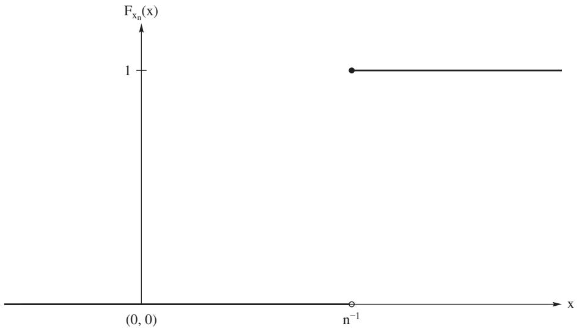  
Figure 5.2.1: Cdf of $X_{n}$ , that has all its mass at $n^{-1}$ .

Convergence in probability is a way of saying that a sequence of random variables $X_{n}$ is getting close to another random variable $X$ . On the other hand, convergence in distribution is only concerned with the cdfs $F_{X_{n}}$ and $F_{X}$ . A simple example illustrates this. Let $X$ be a continuous random variable with a pdf $f_{X}(x)$ that is symmetric about 0; i.e., $f_{X}(-x) = f_{X}(x)$ . Then it is easy to show that the density of the random variable $-X$ is also $f_{X}(x)$ . Thus, $X$ and $-X$ have the same distributions. Define the sequence of random variables $X_{n}$ as

$$
X _ {n} = \left\{ \begin{array}{l l} X & \text {i f n i s o d d} \\ - X & \text {i f n i s e v e n .} \end{array} \right. \tag {5.2.1}
$$

Clearly, $F_{X_n}(x) = F_X(x)$ for all $x$ in the support of $X$ , so that $X_n \stackrel{D}{\to} X$ . On the other hand, the sequence $X_n$ does not get close to $X$ . In particular, $X_n \nrightarrow X$ in probability.

Example 5.2.1. Let $\overline{X}_n$ have the cdf

$$
F _ {n} (\overline {{x}}) = \int_ {- \infty} ^ {\overline {{x}}} \frac {1}{\sqrt {1 / n} \sqrt {2 \pi}} e ^ {- n w ^ {2} / 2} d w.
$$

If the change of variable $v = \sqrt{n} w$ is made, we have

$$
F _ {n} (\overline {{x}}) = \int_ {- \infty} ^ {\sqrt {n x}} \frac {1}{\sqrt {2 \pi}} e ^ {- v ^ {2} / 2} d v.
$$

It is clear that

$$
\lim _ {n \to \infty} F _ {n} (\overline {{x}}) = \left\{ \begin{array}{l l} 0 & \overline {{x}} <   0 \\ \frac {1}{2} & \overline {{x}} = 0 \\ 1 & \overline {{x}} > 0. \end{array} \right.
$$

Now the function

$$
F (\overline {{x}}) = \left\{ \begin{array}{l l} 0 & \overline {{x}} <   0 \\ 1 & \overline {{x}} \geq 0 \end{array} \right.
$$

is a cdf and $\lim_{n\to \infty}F_n(\overline{x}) = F(\overline{x})$ at every point of continuity of $F(\overline{x})$ . To be sure, $\lim_{n\to \infty}F_n(0)\neq F(0)$ , but $F(\overline{x})$ is not continuous at $\overline{x} = 0$ . Accordingly, the sequence $\overline{X}_1,\overline{X}_2,\overline{X}_3,\ldots$ converges in distribution to a random variable that has a degenerate distribution at $\overline{x} = 0$ .

Example 5.2.2. Even if a sequence $X_{1}, X_{2}, X_{3}, \ldots$ converges in distribution to a random variable $X$ , we cannot in general determine the distribution of $X$ by taking the limit of the pmf of $X_{n}$ . This is illustrated by letting $X_{n}$ have the pmf

$$
p _ {n} (x) = \left\{ \begin{array}{l l} 1 & x = 2 + n ^ {- 1} \\ 0 & \text {e l s e w h e r e .} \end{array} \right.
$$

Clearly, $\lim_{n\to \infty}p_n(x) = 0$ for all values of $x$ . This may suggest that $X_{n}$ , for $n = 1,2,3,\ldots$ , does not converge in distribution. However, the cdf of $X_{n}$ is

$$
F _ {n} (x) = \left\{ \begin{array}{l l} 0 & x <   2 + n ^ {- 1} \\ 1 & x \geq 2 + n ^ {- 1}, \end{array} \right.
$$

and

$$
\lim  _ {n \to \infty} F _ {n} (x) = \left\{ \begin{array}{l l} 0 & x \leq 2 \\ 1 & x > 2. \end{array} \right.
$$

Since

$$
F (x) = \left\{ \begin{array}{l l} 0 & x <   2 \\ 1 & x \geq 2 \end{array} \right.
$$

is a cdf, and since $\lim_{n\to \infty}F_n(x) = F(x)$ at all points of continuity of $F(x)$ , the sequence $X_{1},X_{2},X_{3},\ldots$ converges in distribution to a random variable with cdf $F(x)$ .

The last example shows in general that we cannot determine limiting distributions by considering pmfs or pdfs. But under certain conditions we can determine convergence in distribution by considering the sequence of pdfs as the following example shows.

Example 5.2.3. Let $T_{n}$ have a $t$ -distribution with $n$ degrees of freedom, $n = 1, 2, 3, \ldots$ . Thus its cdf is

$$
F _ {n} (t) = \int_ {- \infty} ^ {t} \frac {\Gamma [ (n + 1) / 2 ]}{\sqrt {\pi n} \Gamma (n / 2)} \frac {1}{(1 + y ^ {2} / n) ^ {(n + 1) / 2}} d y,
$$

where the integrand is the pdf $f_{n}(y)$ of $T_{n}$ . Accordingly,

$$
\lim  _ {n \to \infty} F _ {n} (t) = \lim  _ {n \to \infty} \int_ {- \infty} ^ {t} f _ {n} (y) d y = \int_ {- \infty} ^ {t} \lim  _ {n \to \infty} f _ {n} (y) d y,
$$

by a result in analysis (the Lebesgue Dominated Convergence Theorem) that allows us to interchange the order of the limit and integration, provided that $|f_n(y)|$ is dominated by a function that is integrable. This is true because

$$
\left| f _ {n} (y) \right| \leq 1 0 f _ {1} (y)
$$

and

$$
\int_ {- \infty} ^ {t} 1 0 f _ {1} (y) d y = \frac {1 0}{\pi} \arctan t <   \infty ,
$$

for all real $t$ . Hence we can find the limiting distribution by finding the limit of the pdf of $T_{n}$ . It is

$$
\begin{array}{l} \lim  _ {n \to \infty} f _ {n} (y) = \lim  _ {n \to \infty} \left\{\frac {\Gamma [ (n + 1) / 2 ]}{\sqrt {n / 2} \Gamma (n / 2)} \right\} \lim  _ {n \to \infty} \left\{\frac {1}{(1 + y ^ {2} / n) ^ {1 / 2}} \right\} \\ \times \lim  _ {n \rightarrow \infty} \left\{\frac {1}{\sqrt {2 \pi}} \left[\left(1 + \frac {y ^ {2}}{n}\right)\right] ^ {- n / 2} \right\}. \\ \end{array}
$$

Using the fact from elementary calculus that

$$
\lim _ {n \to \infty} \left(1 + \frac {y ^ {2}}{n}\right) ^ {n} = e ^ {y ^ {2}},
$$

the limit associated with the third factor is clearly the pdf of the standard normal distribution. The second limit obviously equals 1. By Remark 5.2.2, the first limit also equals 1. Thus, we have

$$
\lim  _ {n \rightarrow \infty} F _ {n} (t) = \int_ {- \infty} ^ {t} \frac {1}{\sqrt {2 \pi}} e ^ {- y ^ {2} / 2} d y,
$$

and hence $T_{n}$ has a limiting standard normal distribution.

Remark 5.2.2 (Stirling's Formula). In advanced calculus the following approximation is derived:

$$
\Gamma (k + 1) \approx \sqrt {2 \pi} k ^ {k + 1 / 2} e ^ {- k}. \tag {5.2.2}
$$

This is known as Stirling's formula and it is an excellent approximation when $k$ is large. Because $\Gamma(k + 1) = k!$ , for $k$ an integer, this formula gives an idea of how fast $k!$ grows. As Exercise 5.2.21 shows, this approximation can be used to show that the first limit in Example 5.2.3 is 1.

Example 5.2.4 (Maximum of a Sample from a Uniform Distribution, Continued). Recall Example 5.1.2, where $X_{1},\ldots ,X_{n}$ is a random sample from a uniform $(0,\theta)$ distribution. Again, let $Y_{n} = \max \{X_{1},\dots ,X_{n}\}$ , but now consider the random variable $Z_{n} = n(\theta -Y_{n})$ . Let $t\in (0,n\theta)$ . Then, using the cdf of $Y_{n}$ , (5.1.1), the cdf of $Z_{n}$ is

$$
\begin{array}{l} P \left[ Z _ {n} \leq t \right] = P \left[ Y _ {n} \geq \theta - (t / n) \right] \\ = \quad 1 - \left(\frac {\theta - (t / n)}{\theta}\right) ^ {n} \\ = 1 - \left(1 - \frac {t / \theta}{n}\right) ^ {n} \\ \rightarrow \quad 1 - e ^ {- t / \theta}. \\ \end{array}
$$

Note that the last quantity is the cdf of an exponential random variable with mean $\theta$ , (3.3.6), i.e., $\Gamma(1, \theta)$ . So we say that $Z_{n} \stackrel{D}{\to} Z$ , where $Z$ is distributed $\Gamma(1, \theta)$ .

Remark 5.2.3. To simplify several of the proofs of this section, we make use of the $\varlimsup$ and $\varliminf$ of a sequence. For readers who are unfamiliar with these concepts, we discuss them in Appendix A. In this brief remark, we highlight the properties needed for understanding the proofs. Let $\{a_{n}\}$ be a sequence of real numbers and define the two subsequences

$$
b _ {n} = \sup  \left\{a _ {n}, a _ {n + 1}, \dots \right\}, \quad n = 1, 2, 3 \dots , \tag {5.2.3}
$$

$$
c _ {n} = \inf  \left\{a _ {n}, a _ {n + 1}, \dots \right\}, \quad n = 1, 2, 3 \dots . \tag {5.2.4}
$$

The sequences $\{b_n\}$ and $\{c_n\}$ are nonincreasing and nondecreasing, respectively. Hence their limits always exist (may be $\pm \infty$ ) and are denoted respectively by $\varlimsup_{n\to \infty}a_n$ and $\varliminf_{n\to \infty}a_n$ . Further, $c_{n}\leq a_{n}\leq b_{n}$ , for all $n$ . Hence, by the Sandwich Theorem (see Theorem A.2.1 of Appendix A), if $\varliminf_{n\to \infty}a_n = \varliminf_{n\to \infty}a_n$ , then $\lim_{n\to \infty}a_n$ exists and is given by $\lim_{n\to \infty}a_n = \varliminf_{n\to \infty}a_n$ .

As discussed in Appendix A, several other properties of these concepts are useful. For example, suppose $\{p_n\}$ is a sequence of probabilities and $\overline{\lim}_{n\to \infty}p_n = 0$ . Then, by the Sandwich Theorem, since $0\leq p_{n}\leq \sup \{p_{n},p_{n + 1},\ldots \}$ for all $n$ , we have $\lim_{n\to \infty}p_n = 0$ . Also, for any two sequences $\{a_n\}$ and $\{b_n\}$ , it easily follows that $\overline{\lim}_{n\to \infty}(a_n + b_n)\leq \overline{\lim}_{n\to \infty}a_n + \overline{\lim}_{n\to \infty}b_n$ .

As the following theorem shows, convergence in distribution is weaker than convergence in probability. Thus convergence in distribution is often called weak convergence.

Theorem 5.2.1. If $X_{n}$ converges to $X$ in probability, then $X_{n}$ converges to $X$ in distribution.

Proof: Let $x$ be a point of continuity of $F_{X}(x)$ . For every $\epsilon > 0$ ,

$$
\begin{array}{l} F _ {X _ {n}} (x) = P [ X _ {n} \leq x ] \\ = P \left[ \left\{X _ {n} \leq x \right\} \cap \left\{| X _ {n} - X | <   \epsilon \right\} \right] + P \left[ \left\{X _ {n} \leq x \right\} \cap \left\{| X _ {n} - X | \geq \epsilon \right\} \right] \\ \leq P [ X \leq x + \epsilon ] + P [ | X _ {n} - X | \geq \epsilon ]. \\ \end{array}
$$

Based on this inequality and the fact that $X_{n}\stackrel {P}{\to}X$ , we see that

$$
\varlimsup_ {n \rightarrow \infty} F _ {X _ {n}} (x) \leq F _ {X} (x + \epsilon). \tag {5.2.5}
$$

To get a lower bound, we proceed similarly with the complement to show that

$$
P \left[ X _ {n} > x \right] \leq P [ X \geq x - \epsilon ] + P \left[ | X _ {n} - X | \geq \epsilon \right].
$$

Hence

$$
\varlimsup_ {n \rightarrow \infty} F _ {X _ {n}} (x) \geq F _ {X} (x - \epsilon). \tag {5.2.6}
$$

Using a relationship between $\varlimsup$ and $\varliminf$ , it follows from (5.2.5) and (5.2.6) that

$$
F _ {X} (x - \epsilon) \leq \varliminf_ {n \to \infty} F _ {X _ {n}} (x) \leq \varlimsup_ {n \to \infty} F _ {X _ {n}} (x) \leq F _ {X} (x + \epsilon).
$$

Letting $\epsilon \downarrow 0$ gives us the desired result.

Reconsider the sequence of random variables $\{X_{n}\}$ defined by expression (5.2.1). Here, $X_{n} \xrightarrow{D} X$ but $X_{n} \not\to X$ . So, in general, the converse of the above theorem is not true. However, it is true if $X$ is degenerate, as shown by the following theorem.

Theorem 5.2.2. If $X_{n}$ converges to the constant $b$ in distribution, then $X_{n}$ converges to $b$ in probability.

Proof: Let $\epsilon > 0$ be given. Then

$$
\lim  _ {n \rightarrow \infty} P [ | X _ {n} - b | \leq \epsilon ] = \lim  _ {n \rightarrow \infty} F _ {X _ {n}} (b + \epsilon) - \lim  _ {n \rightarrow \infty} F _ {X _ {n}} [ (b - \epsilon) - 0 ] = 1 - 0 = 1,
$$

which is the desired result.

A result that will prove quite useful is the following:

Theorem 5.2.3. Suppose $X_{n}$ converges to $X$ in distribution and $Y_{n}$ converges in probability to 0. Then $X_{n} + Y_{n}$ converges to $X$ in distribution.

The proof is similar to that of Theorem 5.2.2 and is left to Exercise 5.2.13. We often use this last result as follows. Suppose it is difficult to show that $X_{n}$ converges to $X$ in distribution, but it is easy to show that $Y_{n}$ converges in distribution to $X$ and that $X_{n} - Y_{n}$ converges to 0 in probability. Hence, by this last theorem, $X_{n} = Y_{n} + (X_{n} - Y_{n}) \stackrel{D}{\to} X$ , as desired.

The next two theorems state general results. A proof of the first result can be found in a more advanced text, while the second, Slutsky's Theorem, follows similarly to that of Theorem 5.2.1.

Theorem 5.2.4. Suppose $X_{n}$ converges to $X$ in distribution and $g$ is a continuous function on the support of $X$ . Then $g(X_{n})$ converges to $g(X)$ in distribution.

An often-used application of this theorem occurs when we have a sequence of random variables $Z_{n}$ which converges in distribution to a standard normal random variable $Z$ . Because the distribution of $Z^{2}$ is $\chi^2 (1)$ , it follows by Theorem 5.2.4 that $Z_{n}^{2}$ converges in distribution to a $\chi^2 (1)$ distribution.

Theorem 5.2.5 (Slutsky's Theorem). Let $X_{n}$ , $X$ , $A_{n}$ , and $B_{n}$ be random variables and let $a$ and $b$ be constants. If $X_{n} \xrightarrow{D} X$ , $A_{n} \xrightarrow{P} a$ , and $B_{n} \xrightarrow{P} b$ , then

$$
A _ {n} + B _ {n} X _ {n} \stackrel {{D}} {{\to}} a + b X.
$$

# 5.2.1 Bounded in Probability

Another useful concept, related to convergence in distribution, is boundedness in probability of a sequence of random variables.

First consider any random variable $X$ with cdf $F_{X}(x)$ . Then given $\epsilon > 0$ , we can bound $X$ in the following way. Because the lower limit of $F_{X}$ is 0 and its upper limit is 1, we can find $\eta_{1}$ and $\eta_{2}$ such that

$$
F _ {X} (x) <   \epsilon / 2 \text {f o r} x \leq \eta_ {1} \text {a n d} F _ {X} (x) > 1 - (\epsilon / 2) \text {f o r} x \geq \eta_ {2}.
$$

Let $\eta = \max \{| \eta_1 |, | \eta_2 |\}$ . Then

$$
P [ | X | \leq \eta ] = F _ {X} (\eta) - F _ {X} (- \eta - 0) \geq 1 - (\epsilon / 2) - (\epsilon / 2) = 1 - \epsilon . (5. 2. 7)
$$

Thus random variables which are not bounded [e.g., $X$ is $N(0,1)$ ] are still bounded in this probability way. This is a useful concept for sequences of random variables, which we define next.

Definition 5.2.2 (Bounded in Probability). We say that the sequence of random variables $\{X_{n}\}$ is bounded in probability if, for all $\epsilon >0$ , there exist a constant $B_{\epsilon} > 0$ and an integer $N_{\epsilon}$ such that

$$
n \geq N _ {\epsilon} \Rightarrow P [ | X _ {n} | \leq B _ {\epsilon} ] \geq 1 - \epsilon .
$$

Next, consider a sequence of random variables $\{X_{n}\}$ which converges in distribution to a random variable $X$ that has cdf $F$ . Let $\epsilon > 0$ be given and choose $\eta$ so that (5.2.7) holds for $X$ . We can always choose $\eta$ so that $\eta$ and $-\eta$ are continuity points of $F$ . We then have

$$
\lim  _ {n \rightarrow \infty} P [ | X _ {n} | \leq \eta ] \geq \lim  _ {n \rightarrow \infty} F _ {X _ {n}} (\eta) - \lim  _ {n \rightarrow \infty} F _ {X _ {n}} (- \eta - 0) = F _ {X} (\eta) - F _ {X} (- \eta) \geq 1 - \epsilon .
$$

To be precise, we can then choose $N$ so large that $P[|X_n|\leq \eta ]\geq 1 - \epsilon$ , for $n\geq N$ . We have thus proved the following theorem

Theorem 5.2.6. Let $\{X_{n}\}$ be a sequence of random variables and let $X$ be a random variable. If $X_{n} \to X$ in distribution, then $\{X_{n}\}$ is bounded in probability.

As the following example shows, the converse of this theorem is not true.

Example 5.2.5. Take $\{X_{n}\}$ to be the following sequence of degenerate random variables. For $n = 2m$ even, $X_{2m} = 2 + (1 / (2m))$ with probability 1. For $n = 2m - 1$ odd, $X_{2m - 1} = 1 + (1 / (2m))$ with probability 1. Then the sequence $\{X_2,X_4,X_6,\ldots \}$ converges in distribution to the degenerate random variable $Y = 2$ , while the sequence $\{X_1,X_3,X_5,\dots \}$ converges in distribution to the degenerate random variable $W = 1$ . Since the distributions of $Y$ and $W$ are not the same, the sequence $\{X_n\}$ does not converge in distribution. Because all of the mass of the sequence $\{X_{n}\}$ is in the interval $[1,5 / 2]$ , however, the sequence $\{X_{n}\}$ is bounded in probability.

One way of thinking of a sequence that is bounded in probability (or one that is converging to a random variable in distribution) is that the probability mass of $|X_{n}|$ is not escaping to $\infty$ . At times we can use boundedness in probability instead of convergence in distribution. A property we will need later is given in the following theorem:

Theorem 5.2.7. Let $\{X_{n}\}$ be a sequence of random variables bounded in probability and let $\{Y_{n}\}$ be a sequence of random variables that converges to 0 in probability. Then

$$
X _ {n} Y _ {n} \xrightarrow {P} 0.
$$

Proof: Let $\epsilon > 0$ be given. Choose $B_{\epsilon} > 0$ and an integer $N_{\epsilon}$ such that

$$
n \geq N _ {\epsilon} \Rightarrow P [ | X _ {n} | \leq B _ {\epsilon} ] \geq 1 - \epsilon .
$$

Then

$$
\begin{array}{l} \varlimsup_ {n \rightarrow \infty} P [ | X _ {n} Y _ {n} | \geq \epsilon ] \leq \varliminf_ {n \rightarrow \infty} P [ | X _ {n} Y _ {n} | \geq \epsilon , | X _ {n} | \leq B _ {\epsilon} ] \\ + \varlimsup_ {n \rightarrow \infty} P [ | X _ {n} Y _ {n} | \geq \epsilon , | X _ {n} | > B _ {\epsilon} ] \\ \leq \quad \varlimsup_ {n \rightarrow \infty} P \left[\left| Y _ {n} \right| \geq \epsilon / B _ {\epsilon} \right] + \epsilon = \epsilon , \tag {5.2.8} \\ \end{array}
$$

from which the desired result follows.

# 5.2.2 $\Delta$ -Method

Recall a common problem discussed in the last three chapters is the situation where we know the distribution of a random variable, but we want to determine the distribution of a function of it. This is also true in asymptotic theory, and Theorems 5.2.4 and 5.2.5 are illustrations of this. Another such result is called the $\pmb{\Delta}$ -method. To establish this result, we need a convenient form of the mean value theorem with remainder, sometimes called Young's Theorem; see Hardy (1992) or Lehmann (1999). Suppose $g(x)$ is differentiable at $x$ . Then we can write

$$
g (y) = g (x) + g ^ {\prime} (x) (y - x) + o (| y - x |), \tag {5.2.9}
$$

where the notation $o$ means

$$
a = o (b) \mathrm {i f a n d o n l y i f} \frac {a}{b} \longrightarrow 0, \mathrm {a s} b \longrightarrow 0.
$$

The little- $o$ notation is used in terms of convergence in probability, also. We often write $o_p(X_n)$ , which means

$$
Y _ {n} = o _ {p} \left(X _ {n}\right) \text {i f a n d o n l y i f} \frac {Y _ {n}}{X _ {n}} \xrightarrow {P} 0, \text {a s} n \to \infty . \tag {5.2.10}
$$

There is a corresponding big- $O_p$ notation, which is given by

$$
Y _ {n} = O _ {p} \left(X _ {n}\right) \text {i f a n d o n l y i f} \frac {Y _ {n}}{X _ {n}} \text {i s b o u n d e d i n p r o b a b i l i t y a s} n \rightarrow \infty . \tag {5.2.11}
$$

The following theorem illustrates the little-o notation, but it also serves as a lemma for Theorem 5.2.9.

Theorem 5.2.8. Suppose $\{Y_n\}$ is a sequence of random variables that is bounded in probability. Suppose $X_{n} = o_{p}(Y_{n})$ . Then $X_{n} \stackrel{P}{\to} 0$ , as $n \to \infty$ .

Proof: Let $\epsilon > 0$ be given. Because the sequence $\{Y_n\}$ is bounded in probability, there exist positive constants $N_{\epsilon}$ and $B_{\epsilon}$ such that

$$
n \geq N _ {\epsilon} \Longrightarrow P [ | Y _ {n} | \leq B _ {\epsilon} ] \geq 1 - \epsilon . \tag {5.2.12}
$$

Also, because $X_{n} = o_{p}(Y_{n})$ , we have

$$
\frac {X _ {n}}{Y _ {n}} \xrightarrow {P} 0, \tag {5.2.13}
$$

as $n\to \infty$ .We then have

$$
\begin{array}{l} P \left[ | X _ {n} | \geq \epsilon \right] = P \left[ | X _ {n} | \geq \epsilon , | Y _ {n} | \leq B _ {\epsilon} \right] + P \left[ | X _ {n} | \geq \epsilon , | Y _ {n} | > B _ {\epsilon} \right] \\ \leq P \left[ \frac {X _ {n}}{| Y _ {n} |} \geq \frac {\epsilon}{B _ {\epsilon}} \right] + P \left[ | Y _ {n} | > B _ {\epsilon} \right]. \\ \end{array}
$$

By (5.2.13) and (5.2.12), respectively, the first and second terms on the right side can be made arbitrarily small by choosing $n$ sufficiently large. Hence the result is true.

We can now prove the theorem about the asymptotic procedure, which is often called the $\Delta$ method.

Theorem 5.2.9. Let $\{X_{n}\}$ be a sequence of random variables such that

$$
\sqrt {n} \left(X _ {n} - \theta\right) \stackrel {{D}} {{\rightarrow}} N \left(0, \sigma^ {2}\right). \tag {5.2.14}
$$

Suppose the function $g(x)$ is differentiable at $\theta$ and $g'(\theta) \neq 0$ . Then

$$
\sqrt {n} (g \left(X _ {n}\right) - g (\theta)) \stackrel {{D}} {{\rightarrow}} N \left(0, \sigma^ {2} \left(g ^ {\prime} (\theta)\right) ^ {2}\right). \tag {5.2.15}
$$

Proof: Using expression (5.2.9), we have

$$
g (X _ {n}) = g (\theta) + g ^ {\prime} (\theta) (X _ {n} - \theta) + o _ {p} (| X _ {n} - \theta |),
$$

where $o_p$ is interpreted as in (5.2.10). Rearranging, we have

$$
\sqrt {n} (g (X _ {n}) - g (\theta)) = g ^ {\prime} (\theta) \sqrt {n} (X _ {n} - \theta) + o _ {p} (\sqrt {n} | X _ {n} - \theta |).
$$

Because (5.2.14) holds, Theorem 5.2.6 implies that $\sqrt{n} |X_n - \theta|$ is bounded in probability. Therefore, by Theorem 5.2.8, $o_p(\sqrt{n} |X_n - \theta|) \to 0$ , in probability. Hence, by (5.2.14) and Theorem 5.2.1, the result follows.

Illustrations of the $\Delta$ -method can be found in Example 5.2.8 and the exercises.

# 5.2.3 Moment Generating Function Technique

To find the limiting distribution function of a random variable $X_{n}$ by using the definition obviously requires that we know $F_{X_{n}}(x)$ for each positive integer $n$ . But it is often difficult to obtain $F_{X_{n}}(x)$ in closed form. Fortunately, if it exists, the mgf that corresponds to the cdf $F_{X_{n}}(x)$ often provides a convenient method of determining the limiting cdf.

The following theorem, which is essentially Curtiss' (1942) modification of a theorem of Lévy and Cramér, explains how the mgf may be used in problems of limiting distributions. A proof of the theorem is beyond of the scope of this book. It can readily be found in more advanced books; see, for instance, page 171 of Breiman (1968) for a proof based on characteristic functions.

Theorem 5.2.10. Let $\{X_n\}$ be a sequence of random variables with mgf $M_{X_n}(t)$ that exists for $-h < t < h$ for all $n$ . Let $X$ be a random variable with mgf $M(t)$ , which exists for $|t| \leq h_1 \leq h$ . If $\lim_{n \to \infty} M_{X_n}(t) = M(t)$ for $|t| \leq h_1$ , then $X_n \stackrel{D}{\to} X$ .

In this and the subsequent sections are several illustrations of the use of Theorem 5.2.10. In some of these examples it is convenient to use a certain limit that is established in some courses in advanced calculus. We refer to a limit of the form

$$
\lim _ {n \to \infty} \left[ 1 + \frac {b}{n} + \frac {\psi (n)}{n} \right] ^ {c n},
$$

where $b$ and $c$ do not depend upon $n$ and where $\lim_{n\to \infty}\psi (n) = 0$ . Then

$$
\lim  _ {n \rightarrow \infty} \left[ 1 + \frac {b}{n} + \frac {\psi (n)}{n} \right] ^ {c n} = \lim  _ {n \rightarrow \infty} \left(1 + \frac {b}{n}\right) ^ {c n} = e ^ {b c}. \tag {5.2.16}
$$

For example,

$$
\lim _ {n \to \infty} \left(1 - \frac {t ^ {2}}{n} + \frac {t ^ {2}}{n ^ {3 / 2}}\right) ^ {- n / 2} = \lim _ {n \to \infty} \left(1 - \frac {t ^ {2}}{n} + \frac {t ^ {2} / \sqrt {n}}{n}\right) ^ {- n / 2}.
$$

Here $b = -t^2, c = -\frac{1}{2}$ , and $\psi(n) = t^2 / \sqrt{n}$ . Accordingly, for every fixed value of $t$ , the limit is $e^{t^2 / 2}$ .

Example 5.2.6. Let $Y_{n}$ have a distribution that is $b(n,p)$ . Suppose that the mean $\mu = np$ is the same for every $n$ ; that is, $p = \mu / n$ , where $\mu$ is a constant. We shall find the limiting distribution of the binomial distribution, when $p = \mu / n$ , by finding the limit of $M_{Y_n}(t)$ . Now

$$
M _ {Y _ {n}} (t) = E (e ^ {t Y _ {n}}) = [ (1 - p) + p e ^ {t} ] ^ {n} = \left[ 1 + \frac {\mu (e ^ {t} - 1)}{n} \right] ^ {n}
$$

for all real values of $t$ . Hence we have

$$
\lim _ {n \to \infty} M _ {Y _ {n}} (t) = e ^ {\mu (e ^ {t} - 1)}
$$

for all real values of $t$ . Since there exists a distribution, namely the Poisson distribution with mean $\mu$ , that has mgf $e^{\mu (e^{t} - 1)}$ , then, in accordance with the theorem and under the conditions stated, it is seen that $Y_{n}$ has a limiting Poisson distribution with mean $\mu$ .

Whenever a random variable has a limiting distribution, we may, if we wish, use the limiting distribution as an approximation to the exact distribution function. The result of this example enables us to use the Poisson distribution as an approximation to the binomial distribution when $n$ is large and $p$ is small. To illustrate the use of the approximation, let $Y$ have a binomial distribution with $n = 50$ and $p = \frac{1}{25}$ . Then, using R for the calculations, we have

$$
P r (Y \leq 1) = (\frac {2 4}{2 5}) ^ {5 0} + 5 0 (\frac {1}{2 5}) = \mathrm {p b i n o m} (1, 5 0, 1 / 2 5) = 0. 4 0 0 4 8 1 2
$$

approximately. Since $\mu = np = 2$ , the Poisson approximation to this probability is

$$
e ^ {- 2} + 2 e ^ {- 2} = \operatorname {p p o i s} (1, 2) = 0. 4 0 6 0 0 5 8.
$$

Example 5.2.7. Let $Z_{n}$ be $\chi^2 (n)$ . Then the mgf of $Z_{n}$ is $(1 - 2t)^{-n / 2}$ , $t < \frac{1}{2}$ . The mean and the variance of $Z_{n}$ are, respectively, $n$ and $2n$ . The limiting distribution of the random variable $Y_{n} = (Z_{n} - n) / \sqrt{2n}$ will be investigated. Now the mgf of $Y_{n}$ is

$$
\begin{array}{l} {M _ {Y _ {n}} (t)} = {E \left\{\exp \left[ t \left(\frac {Z _ {n} - n}{\sqrt {2 n}}\right) \right] \right\}} \\ { = } { e ^ { - t n / \sqrt { 2 n } } E ( e ^ { t Z _ { n } / \sqrt { 2 n } } ) } \\ = \exp \left[ - \left(t \sqrt {\frac {2}{n}}\right) \left(\frac {n}{2}\right) \right] \left(1 - 2 \frac {t}{\sqrt {2 n}}\right) ^ {- n / 2}, t <   \frac {\sqrt {2 n}}{2}. \\ \end{array}
$$

This may be written in the form

$$
M _ {Y _ {n}} (t) = \left(e ^ {t \sqrt {2 / n}} - t \sqrt {\frac {2}{n}} e ^ {t \sqrt {2 / n}}\right) ^ {- n / 2}, \quad t <   \sqrt {\frac {n}{2}}.
$$

In accordance with Taylor's formula, there exists a number $\xi(n)$ , between 0 and $t\sqrt{2/n}$ , such that

$$
e ^ {t \sqrt {2 / n}} = 1 + t \sqrt {\frac {2}{n}} + \frac {1}{2} \left(t \sqrt {\frac {2}{n}}\right) ^ {2} + \frac {e ^ {\xi (n)}}{6} \left(t \sqrt {\frac {2}{n}}\right) ^ {3}.
$$

If this sum is substituted for $e^{t\sqrt{2 / n}}$ in the last expression for $M_{Y_n}(t)$ , it is seen that

$$
M _ {Y _ {n}} (t) = \left(1 - \frac {t ^ {2}}{n} + \frac {\psi (n)}{n}\right) ^ {- n / 2},
$$

where

$$
\psi (n) = \frac {\sqrt {2} t ^ {3} e ^ {\xi (n)}}{3 \sqrt {n}} - \frac {\sqrt {2} t ^ {3}}{\sqrt {n}} - \frac {2 t ^ {4} e ^ {\xi (n)}}{3 n}.
$$

Since $\xi(n) \to 0$ as $n \to \infty$ , then $\lim \psi(n) = 0$ for every fixed value of $t$ . In accordance with the limit proposition cited earlier in this section, we have

$$
\lim  _ {n \rightarrow \infty} M _ {Y _ {n}} (t) = e ^ {t ^ {2} / 2}
$$

for all real values of $t$ . That is, the random variable $Y_{n} = (Z_{n} - n) / \sqrt{2n}$ has a limiting standard normal distribution.

Figure 5.2.2 displays a verification of the asymptotic distribution of the standardized $Z_{n}$ . For each value of $n = 5,10,20$ and 50, 1000 observations from a $\chi^2 (n)$ -distribution were generated, using the R command rchisq(1000,n). Each observation $z_{n}$ was standardized as $y_{n} = (z_{n} - n) / \sqrt{2n}$ and a histogram of these $y_{n}$ 's was computed. On this histogram, the pdf of a standard normal distribution is superimposed. Note that at $n = 5$ , the histogram of $y_{n}$ values is skewed, but as $n$ increases, the shape of the histogram nears the shape of the pdf, verifying the above theory. These plots are computed by the R function cdistplt. In this function, it is easy to change values of $n$ for further such plots.

Example 5.2.8 (Example 5.2.7, Continued). In the notation of the last example, we showed that

$$
\sqrt {n} \left[ \frac {1}{\sqrt {2} n} Z _ {n} - \frac {1}{\sqrt {2}} \right] \stackrel {{D}} {{\rightarrow}} N (0, 1). \tag {5.2.17}
$$

For this situation, though, there are times when we are interested in the square root of $Z_{n}$ . Let $g(t) = \sqrt{t}$ and let $W_{n} = g(Z_{n} / (\sqrt{2} n)) = (Z_{n} / (\sqrt{2} n))^{1/2}$ . Note that $g(1 / \sqrt{2}) = 1 / 2^{1/4}$ and $g'(1 / \sqrt{2}) = 2^{-3/4}$ . Therefore, by the $\Delta$ -method, Theorem 5.2.9, and (5.2.17), we have

$$
\sqrt {n} \left[ W _ {n} - 1 / 2 ^ {1 / 4} \right] \xrightarrow {D} N \left(0, 2 ^ {- 3 / 2}\right). \tag {5.2.18}
$$

# EXERCISES

5.2.1. Let $\overline{X}_n$ denote the mean of a random sample of size $n$ from a distribution that is $N(\mu, \sigma^2)$ . Find the limiting distribution of $\overline{X}_n$ .

5.2.2. Let $Y_{1}$ denote the minimum of a random sample of size $n$ from a distribution that has pdf $f(x) = e^{-(x - \theta)}$ , $\theta < x < \infty$ , zero elsewhere. Let $Z_{n} = n(Y_{1} - \theta)$ . Investigate the limiting distribution of $Z_{n}$ .

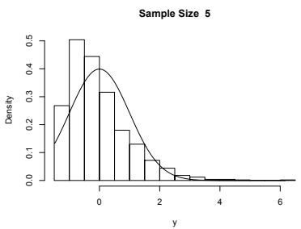

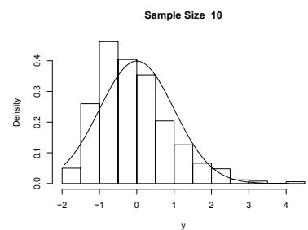

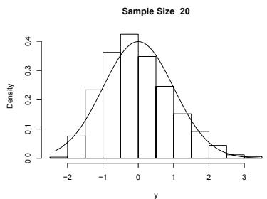

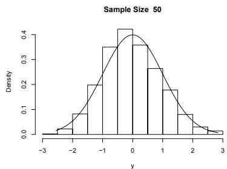  
Figure 5.2.2: For each value of $n$ , a histogram plot of 1000 generated values $y_{n}$ is shown, where $y_{n}$ is discussed in Example 5.2.7. The limiting $N(0,1)$ pdf is superimposed on the histogram.

5.2.3. Let $Y_{n}$ denote the maximum of a random sample of size $n$ from a distribution of the continuous type that has cdf $F(x)$ and pdf $f(x) = F'(x)$ . Find the limiting distribution of $Z_{n} = n[1 - F(Y_{n})]$ .   
5.2.4. Let $Y_{2}$ denote the second smallest item of a random sample of size $n$ from a distribution of the continuous type that has cdf $F(x)$ and pdf $f(x) = F'(x)$ . Find the limiting distribution of $W_{n} = nF(Y_{2})$ .   
5.2.5. Let the pmf of $Y_{n}$ be $p_n(y) = 1$ , $y = n$ , zero elsewhere. Show that $Y_{n}$ does not have a limiting distribution. (In this case, the probability has "escaped" to infinity.)   
5.2.6. Let $X_{1}, X_{2}, \ldots, X_{n}$ be a random sample of size $n$ from a distribution that is $N(\mu, \sigma^2)$ , where $\sigma^2 > 0$ . Show that the sum $Z_{n} = \sum_{1}^{n} X_{i}$ does not have a limiting distribution.   
5.2.7. Let $X_{n}$ have a gamma distribution with parameter $\alpha = n$ and $\beta$ , where $\beta$ is not a function of $n$ . Let $Y_{n} = X_{n} / n$ . Find the limiting distribution of $Y_{n}$ .   
5.2.8. Let $Z_{n}$ be $\chi^2 (n)$ and let $W_{n} = Z_{n} / n^{2}$ . Find the limiting distribution of $W_{n}$ .   
5.2.9. Let $X$ be $\chi^2(50)$ . Using the limiting distribution discussed in Example 5.2.7, approximate $P(40 < X < 60)$ . Compare your answer with that calculated by R.

5.2.10. Modify the R function cdistplt to show histograms of the values $w_{n}$ discussed in Example 5.2.8.

5.2.11. Let $p = 0.95$ be the probability that a man, in a certain age group, lives at least 5 years.

(a) If we are to observe 60 such men and if we assume independence, use R to compute the probability that at least 56 of them live 5 or more years.   
(b) Find an approximation to the result of part (a) by using the Poisson distribution.

Hint: Redefine $p$ to be 0.05 and $1 - p = 0.95$ .

5.2.12. Let the random variable $Z_{n}$ have a Poisson distribution with parameter $\mu = n$ . Show that the limiting distribution of the random variable $Y_{n} = (Z_{n} - n) / \sqrt{n}$ is normal with mean zero and variance 1.

5.2.13. Prove Theorem 5.2.3.

5.2.14. Let $X_{n}$ and $Y_{n}$ have a bivariate normal distribution with parameters $\mu_1, \mu_2, \sigma_1^2, \sigma_2^2$ (free of $n$ ) but $\rho = 1 - 1/n$ . Consider the conditional distribution of $Y_{n}$ , given $X_{n} = x$ . Investigate the limit of this conditional distribution as $n \to \infty$ . What is the limiting distribution if $\rho = -1 + 1/n$ ? Reference to these facts is made in the remark of Section 2.5.

5.2.15. Let $\overline{X}_n$ denote the mean of a random sample of size $n$ from a Poisson distribution with parameter $\mu = 1$ .

(a) Show that the mgf of $Y_{n} = \sqrt{n} (\overline{X}_{n} - \mu) / \sigma = \sqrt{n} (\overline{X}_{n} - 1)$ is given by $\exp [-t\sqrt{n} + n(e^{t / \sqrt{n}} - 1)]$ .   
(b) Investigate the limiting distribution of $Y_{n}$ as $n\to \infty$

Hint: Replace, by its MacLaurin's series, the expression $e^{t / \sqrt{n}}$ , which is in the exponent of the mgf of $Y_{n}$ .

5.2.16. Using Exercise 5.2.15 and the $\Delta$ -method, find the limiting distribution of $\sqrt{n} (\sqrt{\overline{X}_n} - 1)$ .

5.2.17. Let $\overline{X}_n$ denote the mean of a random sample of size $n$ from a distribution that has pdf $f(x) = e^{-x}$ , $0 < x < \infty$ , zero elsewhere.

(a) Show that the mgf $M_{Y_n}(t)$ of $Y_{n} = \sqrt{n} (\overline{X}_{n} - 1)$ is

$$
M _ {Y _ {n}} (t) = \left[ e ^ {t / \sqrt {n}} - (t / \sqrt {n}) e ^ {t / \sqrt {n}} \right] ^ {- n}, \quad t <   \sqrt {n}.
$$

(b) Find the limiting distribution of $Y_{n}$ as $n\to \infty$

Exercises 5.2.15 and 5.2.17 are special instances of an important theorem that will be proved in the next section.

5.2.18. Continuing with Exercise 5.2.17, use the $\Delta$ -method to find the limiting distribution of $\sqrt{n} (\sqrt{\overline{X}_n} - 1)$ .

5.2.19. Let $Y_{1} < Y_{2} < \dots < Y_{n}$ be the order statistics of a random sample (see Section 5.2) from a distribution with pdf $f(x) = e^{-x}, 0 < x < \infty,$ zero elsewhere. Determine the limiting distribution of $Z_{n} = (Y_{n} - \log n)$ .

5.2.20. Let $Y_{1} < Y_{2} < \dots < Y_{n}$ be the order statistics of a random sample (see Section 5.2) from a distribution with pdf $f(x) = 5x^{4}, 0 < x < 1,$ zero elsewhere. Find $p$ so that $Z_{n} = n^{p}Y_{1}$ converges in distribution.

5.2.21. Consider Stirling's formula (5.2.2):

(a) Run the following R code to check this formula for $k = 5$ to $k = 15$ .  
ks = 5; kstp = 15; coll = c(); for(j in ks:kstp){  
c1 = gamma(j+1); c2 = sqrt(2*pi) * exp(-j + (j+.5) * log(j))  
coll = rbind(col1, c(j, c1, c2))}; coll   
(b) Take the log of Stirling's formula and compare it with the R computation $\lg \mathrm{gamma}(\mathbf{k} + 1)$ .   
(c) Use Stirling's formula to show that the first limit in Example 5.2.3 is 1.

# 5.3 Central Limit Theorem

It was seen in Section 3.4 that if $X_{1}, X_{2}, \ldots, X_{n}$ is a random sample from a normal distribution with mean $\mu$ and variance $\sigma^2$ , the random variable

$$
\frac {\sum_ {i = 1} ^ {n} X _ {i} - n \mu}{\sigma \sqrt {n}} = \frac {\sqrt {n} (\overline {{X}} _ {n} - \mu)}{\sigma}
$$

is, for every positive integer $n$ , normally distributed with zero mean and unit variance. In probability theory there is a very elegant theorem called the Central Limit Theorem (CLT). A special case of this theorem asserts the remarkable and important fact that if $X_{1},X_{2},\ldots ,X_{n}$ denote the observations of a random sample of size $n$ from any distribution having finite variance $\sigma^2 >0$ (and hence finite mean $\mu$ ), then the random variable $\sqrt{n} (\overline{X}_n - \mu) / \sigma$ converges in distribution to a random variable having a standard normal distribution. Thus, whenever the conditions of the theorem are satisfied, for large $n$ the random variable $\sqrt{n} (\overline{X}_n - \mu) / \sigma$ has an approximate normal distribution with mean zero and variance 1. It is then possible to use this approximate normal distribution to compute approximate probabilities concerning $\overline{X}$ .

We often use the notation $Y_{n}$ has a limiting standard normal distribution" to mean that $Y_{n}$ converges in distribution to a standard normal random variable; see Remark 5.2.1.

The more general form of the theorem is stated, but it is proved only in the modified case. However, this is exactly the proof of the theorem that would be given if we could use the characteristic function in place of the mgf.

Theorem 5.3.1 (Central Limit Theorem). Let $X_{1},X_{2},\ldots ,X_{n}$ denote the observations of a random sample from a distribution that has mean $\mu$ and positive variance $\sigma^2$ . Then the random variable $Y_{n} = (\sum_{i = 1}^{n}X_{i} - n\mu) / \sqrt{n}\sigma = \sqrt{n} (\overline{X}_n - \mu) / \sigma$ converges in distribution to a random variable that has a normal distribution with mean zero and variance 1.

Proof: For this proof, additionally assume that the mgf $M(t) = E(e^{tX})$ exists for $-h < t < h$ . If one replaces the mgf by the characteristic function $\varphi(t) = E(e^{itX})$ , which always exists, then our proof is essentially the same as the proof in a more advanced course which uses characteristic functions.

The function

$$
m (t) = E [ e ^ {t (X - \mu)} ] = e ^ {- \mu t} M (t)
$$

also exists for $-h < t < h$ . Since $m(t)$ is the mgf for $X - \mu$ , it must follow that $m(0) = 1$ , $m'(0) = E(X - \mu) = 0$ , and $m''(0) = E[(X - \mu)^2] = \sigma^2$ . By Taylor's formula there exists a number $\xi$ between 0 and $t$ such that

$$
\begin{array}{l} m (t) = m (0) + m ^ {\prime} (0) t + \frac {m ^ {\prime \prime} (\xi) t ^ {2}}{2} \\ = 1 + \frac {m ^ {\prime \prime} (\xi) t ^ {2}}{2}. \\ \end{array}
$$

If $\sigma^2 t^2 / 2$ is added and subtracted, then

$$
m (t) = 1 + \frac {\sigma^ {2} t ^ {2}}{2} + \frac {[ m ^ {\prime \prime} (\xi) - \sigma^ {2} ] t ^ {2}}{2} \tag {5.3.1}
$$

Next consider $M(t; n)$ , where

$$
\begin{array}{l} {M (t; n)} = {E \left[ \exp \left(t \frac {\sum X _ {i} - n \mu}{\sigma \sqrt {n}}\right) \right]} \\ { = } { E \left[ \exp \left( t \frac { X _ { 1 } - \mu } { \sigma \sqrt { n } } \right) \exp \left( t \frac { X _ { 2 } - \mu } { \sigma \sqrt { n } } \right) \cdots \exp \left( t \frac { X _ { n } - \mu } { \sigma \sqrt { n } } \right) \right] } \\ = E \left[ \exp \left(t \frac {X _ {1} - \mu}{\sigma \sqrt {n}}\right) \right] \dots E \left[ \exp \left(t \frac {X _ {n} - \mu}{\sigma \sqrt {n}}\right) \right] \\ = \left\{E \left[ \exp \left(t \frac {X - \mu}{\sigma \sqrt {n}}\right) \right] \right\} ^ {n} \\ = \left[ m \left(\frac {t}{\sigma \sqrt {n}}\right) \right] ^ {n}, - h <   \frac {t}{\sigma \sqrt {n}} <   h. \\ \end{array}
$$

In equation (5.3.1), replace $t$ by $t / \sigma \sqrt{n}$ to obtain

$$
m \left(\frac {t}{\sigma \sqrt {n}}\right) = 1 + \frac {t ^ {2}}{2 n} + \frac {[ m ^ {\prime \prime} (\xi) - \sigma^ {2} ] t ^ {2}}{2 n \sigma^ {2}},
$$

where now $\xi$ is between 0 and $t / \sigma \sqrt{n}$ with $-h\sigma \sqrt{n} < t < h\sigma \sqrt{n}$ . Accordingly,

$$
M (t; n) = \left\{1 + \frac {t ^ {2}}{2 n} + \frac {[ m ^ {\prime \prime} (\xi) - \sigma^ {2} ] t ^ {2}}{2 n \sigma^ {2}} \right\} ^ {n}.
$$

Since $m''(t)$ is continuous at $t = 0$ and since $\xi \to 0$ as $n\to \infty$ , we have

$$
\lim  _ {n \rightarrow \infty} [ m ^ {\prime \prime} (\xi) - \sigma^ {2} ] = 0.
$$

The limit proposition (5.2.16) cited in Section 5.2 shows that

$$
\lim _ {n \to \infty} M (t; n) = e ^ {t ^ {2} / 2},
$$

for all real values of $t$ . This proves that the random variable $Y_{n} = \sqrt{n(X_{n} - \mu)} / \sigma$ has a limiting standard normal distribution.

As cited in Remark 5.2.1, we say that $Y_{n}$ has a limiting standard normal distribution. We interpret this theorem as saying that when $n$ is a large, fixed positive integer, the random variable $\overline{X}$ has an approximate normal distribution with mean $\mu$ and variance $\sigma^2 / n$ ; and in applications we often use the approximate normal pdf as though it were the exact pdf of $\overline{X}$ . Also, we can equivalently state the conclusion of the Central Limit Theorem as

$$
\sqrt {n} (\bar {X} - \mu) \stackrel {\mathcal {D}} {\rightarrow} N (0, \sigma^ {2}). \tag {5.3.2}
$$

This is often a convenient formulation to use.

One of the key applications of the Central Limit Theorem is for statistical inference. In Examples 5.3.1-5.3.6, we present results for several such applications. As we point out, we made use of these results in Chapter 4, but we will also use them in the remainder of the book.

Example 5.3.1 (Large Sample Inference for $\mu$ ). Let $X_{1}, X_{2}, \ldots, X_{n}$ be a random sample from a distribution with mean $\mu$ and variance $\sigma^2$ , where $\mu$ and $\sigma^2$ are unknown. Let $\overline{X}$ and $S$ be the sample mean and sample standard deviation, respectively. Then

$$
\frac {\overline {{X}} - \mu}{S / \sqrt {n}} \xrightarrow {D} N (0, 1). \tag {5.3.3}
$$

To see this, write the left side as

$$
\frac {\overline {{X}} - \mu}{S / \sqrt {n}} = \left(\frac {\sigma}{S}\right) \frac {(\overline {{X}} - \mu)}{\sigma / \sqrt {n}}.
$$

Example 5.1.1 shows that $S$ converges in probability to $\sigma$ and, hence, by the theorems of Section 5.2, that $\sigma / S$ converges in probability to 1. Thus the result (5.3.3) follows from the CLT and Slutsky's Theorem, Theorem 5.2.5.

In Examples 4.2.2 and 4.5.3 of Chapter 4, we presented large sample confidence intervals and tests for $\mu$ based on (5.3.3).

Some illustrative examples, here and below, help show the importance of this version of the CLT.

Example 5.3.2. Let $\overline{X}$ denote the mean of a random sample of size 75 from the distribution that has the pdf

$$
f (x) = \left\{ \begin{array}{l l} 1 & 0 <   x <   1 \\ 0 & \text {e l s e w h e r e .} \end{array} \right.
$$

For this situation, it can be shown that the pdf of $\overline{X}$ , $g(\overline{x})$ , has a graph when $0 < \overline{x} < 1$ that is composed of arcs of 75 different polynomials of degree 74. The computation of such a probability as $P(0.45 < \overline{X} < 0.55)$ would be extremely laborious. The conditions of the theorem are satisfied, since $M(t)$ exists for all real values of $t$ . Moreover, $\mu = \frac{1}{2}$ and $\sigma^2 = \frac{1}{12}$ , so that using R we have approximately

$$
\begin{array}{l} P (0. 4 5 <   \overline {{X}} <   0. 5 5) = P \left[ \frac {\sqrt {n} (0 . 4 5 - \mu)}{\sigma} <   \frac {\sqrt {n} (\overline {{X}} - \mu)}{\sigma} <   \frac {\sqrt {n} (0 . 5 5 - \mu)}{\sigma} \right] \\ = P [ - 1. 5 <   3 0 (\bar {X} - 0. 5) <   1. 5 ] \\ \approx \quad \operatorname {p n o r m} (1. 5) - \operatorname {p n o r m} (- 1. 5) = 0. 8 6 6 3. \\ \end{array}
$$

Example 5.3.3 (Normal Approximation to the Binomial Distribution). Suppose that $X_{1}, X_{2}, \ldots, X_{n}$ is a random sample from a distribution that is $b(1,p)$ . Here $\mu = p$ , $\sigma^2 = p(1 - p)$ , and $M(t)$ exists for all real values of $t$ . If $Y_{n} = X_{1} + \dots + X_{n}$ , it is known that $Y_{n}$ is $b(n,p)$ . Calculations of probabilities for $Y_{n}$ , when we do not use the Poisson approximation, are simplified by making use of the fact that $(Y_{n} - np) / \sqrt{np(1 - p)} = \sqrt{n} (\overline{X}_{n} - p) / \sqrt{p(1 - p)} = \sqrt{n} (\overline{X}_{n} - \mu) / \sigma$ has a limiting distribution that is normal with mean zero and variance 1.

Frequently, statisticians say that $Y_{n}$ , or more simply $Y$ , has an approximate normal distribution with mean $np$ and variance $np(1 - p)$ . Even with $n$ as small as 10, with $p = \frac{1}{2}$ so that the binomial distribution is symmetric about $np = 5$ , we note in Figure 5.3.1 how well the normal distribution, $N(5, \frac{5}{2})$ , fits the binomial distribution, $b(10, \frac{1}{2})$ , where the heights of the rectangles represent the probabilities of the respective integers 0, 1, 2, ..., 10. Note that the area of the rectangle whose base is $(k - 0.5, k + 0.5)$ and the area under the normal pdf between $k - 0.5$ and $k + 0.5$ are approximately equal for each $k = 0, 1, 2, \ldots, 10$ , even with $n = 10$ . This example should help the reader understand Example 5.3.4.

Example 5.3.4. With the background of Example 5.3.3, let $n = 100$ and $p = \frac{1}{2}$ , and suppose that we wish to compute $P(Y = 48, 49, 50, 51, 52)$ . Since $Y$ is a random variable of the discrete type, $\{Y = 48, 49, 50, 51, 52\}$ and $\{47.5 < Y < 52.5\}$ are equivalent events. That is, $P(Y = 48, 49, 50, 51, 52) = P(47.5 < Y < 52.5)$ . Since $np = 50$ and $np(1 - p) = 25$ , the latter probability may be written

$$
\begin{array}{l} P (4 7. 5 <   Y <   5 2. 5) = P \left(\frac {4 7 . 5 - 5 0}{5} <   \frac {Y - 5 0}{5} <   \frac {5 2 . 5 - 5 0}{5}\right) \\ = P \left(- 0. 5 <   \frac {Y - 5 0}{5} <   0. 5\right). \\ \end{array}
$$

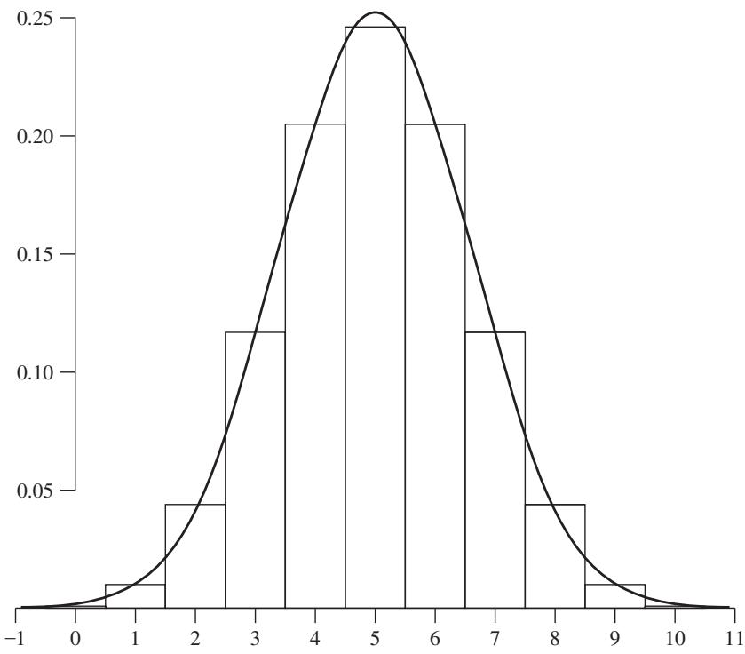  
Figure 5.3.1: The $b\left( {{10},\frac{1}{2}}\right)$ pmf overlaid by the $N\left( {5,\frac{5}{2}}\right)$ pdf.

Since $(Y - 50) / 5$ has an approximate normal distribution with mean zero and variance 1, the probability is approximately $\mathsf{pnorm}(.5)$ - $\mathsf{pnorm}(-.5) = 0.3829$ .

The convention of selecting the event $47.5 < Y < 52.5$ , instead of another event, say, $47.8 < Y < 52.3$ , as the event equivalent to the event $Y = 48, 49, 50, 51, 52$ is due to the following observation. The probability $P(Y = 48, 49, 50, 51, 52)$ can be interpreted as the sum of five rectangular areas where the rectangles have widths 1 and the heights are respectively $P(Y = 48), \ldots, P(Y = 52)$ . If these rectangles are so located that the midpoints of their bases are, respectively, at the points $48, 49, \ldots, 52$ on a horizontal axis, then in approximating the sum of these areas by an area bounded by the horizontal axis, the graph of a normal pdf, and two ordinates, it seems reasonable to take the two ordinates at the points 47.5 and 52.5. This is called the continuity correction.

We next present two examples concerning large sample inference for proportions.

Example 5.3.5 (Large Sample Inference for Proportions). Let $X_{1}, X_{2}, \ldots, X_{n}$ be a random sample from a Bernoulli distribution with $p$ as the probability of success. Let $\widehat{p}$ be the sample proportion of successes. Then $\widehat{p} = \overline{X}$ . Hence,

$$
\frac {\widehat {p} - p}{\sqrt {\widehat {p} (1 - \widehat {p}) / n}} \stackrel {{D}} {{\to}} N (0, 1). \tag {5.3.4}
$$

This is readily established by using the CLT and the same reasoning as in Example 5.3.1; see Exercise 5.3.13.

In Examples 4.2.3 and 4.5.2 of Chapter 4, we presented large sample confidence intervals and tests for $p$ using (5.3.4).

Example 5.3.6 (Large Sample Inference for $\chi^2$ -Tests). Another extension of Example 5.3.3 that was used in Section 4.7 follows quickly from the Central Limit Theorem and Theorem 5.2.4. Using the notation of Example 5.3.3, suppose $Y_{n}$ has a binomial distribution with parameters $n$ and $p$ . Then, as in Example 5.3.3, $(Y_{n} - np) / \sqrt{np(1 - p)}$ converges in distribution to a random variable $Z$ with the $N(0,1)$ distribution. Hence, by Theorem 5.2.4,

$$
\left(\frac {Y _ {n} - n p}{\sqrt {n p (1 - p)}}\right) ^ {2} \stackrel {D} {\rightarrow} \chi^ {2} (1). \tag {5.3.5}
$$

This was the result referenced in Chapter 4; see expression (4.7.1).

We know that $\overline{X}$ and $\sum_{1}^{n} X_{i}$ have approximately normal distributions, provided that $n$ is large enough. Later, we find that other statistics also have approximate normal distributions, and this is the reason that the normal distribution is so important to statisticians. That is, while not many underlying distributions are normal, the distributions of statistics calculated from random samples arising from these distributions are often very close to being normal.

Frequently, we are interested in functions of statistics that have approximately normal distributions. To illustrate, consider the sequence of random variable $Y_{n}$ of Example 5.3.3. As discussed there, $Y_{n}$ has an approximate $N[np, np(1 - p)]$ . So $np(1 - p)$ is an important function of $p$ , as it is the variance of $Y_{n}$ . Thus, if $p$ is unknown, we might want to estimate the variance of $Y_{n}$ . Since $E(Y_{n} / n) = p$ , we might use $n(Y_{n} / n)(1 - Y_{n} / n)$ as such an estimator and would want to know something about the latter's distribution. In particular, does it also have an approximate normal distribution? If so, what are its mean and variance? To answer questions like these, we can apply the $\Delta$ -method, Theorem 5.2.9.

As an illustration of the $\Delta$ -method, we consider a function of the sample mean. Assume that $X_{1},\ldots ,X_{n}$ is a random sample on $X$ which has finite mean $\mu$ and variance $\sigma^2$ . Then rewriting expression (5.3.2) we have by the Central Limit Theorem that

$$
\sqrt {n} (\bar {X} - \mu) \stackrel {\mathcal {D}} {\rightarrow} N (0, \sigma^ {2}).
$$

Hence, by the $\Delta$ -method, Theorem 5.2.9, we have

$$
\sqrt {n} [ g (\bar {X}) - g (\mu) ] \stackrel {\mathcal {D}} {\rightarrow} N (0, \sigma^ {2} (g ^ {\prime} (\mu)) ^ {2}), \tag {5.3.6}
$$

for a continuous transformation $g(x)$ such that $g'(\mu) \neq 0$ .

Example 5.3.7. Assume that we are sampling from a binomial $b(1, p)$ distribution. Then $\overline{X}$ is the sample proportion of successes. Here $\mu = p$ and $\sigma^2 = p(1 - p)$ . Suppose that we want a transformation $g(p)$ such that the transformed asymptotic

variance is constant; in particular, it is free of $p$ . Hence, we seek a transformation $g(p)$ such that

$$
g ^ {\prime} (p) = \frac {c}{\sqrt {p (1 - p)}},
$$

for some constant $c$ . Integrating both sides and making the change-of-variables $z = p$ , $dz = 1 / (2\sqrt{p})dp$ , we have

$$
\begin{array}{l} g (p) = c \int \frac {1}{\sqrt {p (1 - p)}} d p \\ { = } { 2 c \int \frac { 1 } { \sqrt { 1 - z ^ { 2 } } } d z = 2 c \mathrm { a r c s i n } ( z ) = 2 c \mathrm { a r c s i n } ( \sqrt { p } ) . } \\ \end{array}
$$

Taking $c = 1/2$ , for the statistic $g(\overline{X}) = \arcsin \left( \sqrt{\overline{X}} \right)$ , we obtain

$$
\sqrt {n} \left[ \arcsin \left(\sqrt {\overline {{X}}}\right) - \arcsin \left(\sqrt {\overline {{p}}}\right) \right] \stackrel {{\mathcal {D}}} {{\to}} N \left(0, \frac {1}{4}\right).
$$

Several other such examples are given in the exercises.

# EXERCISES

5.3.1. Let $\overline{X}$ denote the mean of a random sample of size 100 from a distribution that is $\chi^2(50)$ . Compute an approximate value of $P(49 < \overline{X} < 51)$ .

5.3.2. Let $\overline{X}$ denote the mean of a random sample of size 128 from a gamma distribution with $\alpha = 2$ and $\beta = 4$ . Approximate $P(7 < \overline{X} < 9)$ .

5.3.3. Let $Y$ be $b(72, \frac{1}{3})$ . Approximate $P(22 \leq Y \leq 28)$ .

5.3.4. Compute an approximate probability that the mean of a random sample of size 15 from a distribution having pdf $f(x) = 3x^{2}$ , $0 < x < 1$ , zero elsewhere, is between $\frac{3}{5}$ and $\frac{4}{5}$ .

5.3.5. Let $Y$ denote the sum of the observations of a random sample of size 12 from a distribution having pmf $p(x) = \frac{1}{6}$ , $x = 1, 2, 3, 4, 5, 6$ , zero elsewhere. Compute an approximate value of $P(36 \leq Y \leq 48)$ .

Hint: Since the event of interest is $Y = 36, 37, \ldots, 48$ , rewrite the probability as $P(35.5 < Y < 48.5)$ .

5.3.6. Let $Y$ be $b(400, \frac{1}{5})$ . Compute an approximate value of $P(0.25 < Y / 400)$ .

5.3.7. If $Y$ is $b(100, \frac{1}{2})$ , approximate the value of $P(Y = 50)$ .

5.3.8. Let $Y$ be $b(n, 0.55)$ . Find the smallest value of $n$ such that (approximately) $P(Y / n > \frac{1}{2}) \geq 0.95$ .

5.3.9. Let $f(x) = 1 / x^2$ , $1 < x < \infty$ , zero elsewhere, be the pdf of a random variable $X$ . Consider a random sample of size 72 from the distribution having this pdf. Compute approximately the probability that more than 50 of the observations of the random sample are less than 3.

5.3.10. Forty-eight measurements are recorded to several decimal places. Each of these 48 numbers is rounded off to the nearest integer. The sum of the original 48 numbers is approximated by the sum of these integers. If we assume that the errors made by rounding off are iid and have a uniform distribution over the interval $(-\frac{1}{2},\frac{1}{2})$ , compute approximately the probability that the sum of the integers is within two units of the true sum.

5.3.11. We know that $\overline{X}$ is approximately $N(\mu, \sigma^2 / n)$ for large $n$ . Find the approximate distribution of $u(\overline{X}) = \overline{X}^3$ , provided that $\mu \neq 0$ .

5.3.12. Let $X_{1}, X_{2}, \ldots, X_{n}$ be a random sample from a Poisson distribution with mean $\mu$ . Thus, $Y = \sum_{i=1}^{n} X_{i}$ has a Poisson distribution with mean $n\mu$ . Moreover, $\overline{X} = Y / n$ is approximately $N(\mu, \mu / n)$ for large $n$ . Show that $u(Y / n) = \sqrt{Y / n}$ is a function of $Y / n$ whose variance is essentially free of $\mu$ .

5.3.13. Using the notation of Example 5.3.5, show that equation (5.3.4) is true.

5.3.14. Assume that $X_{1},\ldots ,X_{n}$ is a random sample from a $\Gamma (1,\beta)$ distribution. Determine the asymptotic distribution of $\sqrt{n} (\overline{X} -\beta)$ . Then find a transformation $g(\overline{X})$ whose asymptotic variance is free of $\beta$ .

# 5.4 *Extensions to Multivariate Distributions

In this section, we briefly discuss asymptotic concepts for sequences of random vectors. The concepts introduced for univariate random variables generalize in a straightforward manner to the multivariate case. Our development is brief, and the interested reader can consult more advanced texts for more depth; see Serfling (1980).

We need some notation. For a vector $\mathbf{v} \in R^p$ , recall the Euclidean norm of $\mathbf{v}$ is defined to be

$$
\| \mathbf {v} \| = \sqrt {\sum_ {i = 1} ^ {p} v _ {i} ^ {2}}. \tag {5.4.1}
$$

This norm satisfies the usual three properties given by

(a) For all $\mathbf{v} \in R^p$ , $\|\mathbf{v}\| \geq 0$ , and $\|\mathbf{v}\| = 0$ if and only if $\mathbf{v} = \mathbf{0}$ .   
(b) For all $\mathbf{v} \in R^p$ and $a \in R$ , $\|a\mathbf{v}\| = |a||\mathbf{v}|$ . (5.4.2)   
(c) For all $\mathbf{v},\mathbf{u}\in R^p$ $\| \mathbf{u} + \mathbf{v}\| \leq \| \mathbf{u}\| +\| \mathbf{v}\|$

Denote the standard basis of $R^p$ by the vectors $\mathbf{e}_1, \ldots, \mathbf{e}_p$ , where all the components of $\mathbf{e}_i$ are 0 except for the $i$ th component, which is 1. Then we can write any vector

$\mathbf{v}' = (v_{1}, \ldots, v_{p})$ as

$$
\mathbf {v} = \sum_ {i = 1} ^ {p} v _ {i} \mathbf {e} _ {i}.
$$

The following lemma will be useful:

Lemma 5.4.1. Let $\mathbf{v}' = (v_1, \ldots, v_p)$ be any vector in $R^p$ . Then

$$
| v _ {j} | \leq \| \mathbf {v} \| \leq \sum_ {i = 1} ^ {n} | v _ {i} |, \quad f o r a l l j = 1, \dots , p. \tag {5.4.3}
$$

Proof: Note that for all $j$

$$
v _ {j} ^ {2} \leq \sum_ {i = 1} ^ {p} v _ {i} ^ {2} = \| \mathbf {v} \| ^ {2};
$$

hence, taking the square root of this equality leads to the first part of the desired inequality. The second part is

$$
\| \mathbf {v} \| = \left\| \sum_ {i = 1} ^ {p} v _ {i} \mathbf {e} _ {i} \right\| \leq \sum_ {i = 1} ^ {p} | v _ {i} | \| \mathbf {e} _ {i} \| = \sum_ {i = 1} ^ {p} | v _ {i} |.
$$

Let $\{\mathbf{X}_n\}$ denote a sequence of $p$ -dimensional vectors. Because the absolute value is the Euclidean norm in $R^1$ , the definition of convergence in probability for random vectors is an immediate generalization:

Definition 5.4.1. Let $\{\mathbf{X}_n\}$ be a sequence of $p$ -dimensional vectors and let $\mathbf{X}$ be a random vector, all defined on the same sample space. We say that $\{\mathbf{X}_n\}$ converges in probability to $\mathbf{X}$ if

$$
\lim  _ {n \rightarrow \infty} P [ \| \mathbf {X} _ {n} - \mathbf {X} \| \geq \epsilon ] = 0, \tag {5.4.4}
$$

for all $\epsilon > 0$ . As in the univariate case, we write $\mathbf{X}_n \xrightarrow{P} \mathbf{X}$ .

As the next theorem shows, convergence in probability of vectors is equivalent to componentwise convergence in probability.

Theorem 5.4.1. Let $\{\mathbf{X}_n\}$ be a sequence of $p$ -dimensional vectors and let $\mathbf{X}$ be a random vector, all defined on the same sample space. Then

$$
\mathbf {X} _ {n} \stackrel {{P}} {{\to}} \mathbf {X} \text {i f a n d o n l y i f} X _ {n j} \stackrel {{P}} {{\to}} X _ {j} \text {f o r a l l} j = 1, \dots , p.
$$

Proof: This follows immediately from Lemma 5.4.1. Suppose $\mathbf{X}_n \xrightarrow{P} \mathbf{X}$ . For any $j$ , from the first part of the inequality (5.4.3), we have, for $\epsilon > 0$ ,

$$
\epsilon \leq | X _ {n j} - X _ {j} | \leq \| \mathbf {X} _ {n} - \mathbf {X} \|.
$$

Hence

$$
\overline {{\lim }} _ {n \rightarrow \infty} P [ | X _ {n j} - X _ {j} | \geq \epsilon ] \leq \overline {{\lim }} _ {n \rightarrow \infty} P [ \| \mathbf {X} _ {n} - \mathbf {X} \| \geq \epsilon ] = 0,
$$

which is the desired result.

Conversely, if $X_{nj} \stackrel{P}{\to} X_j$ for all $j = 1, \ldots, p$ , then by the second part of the inequality (5.4.3),

$$
\epsilon \leq \| \mathbf {X} _ {n} - \mathbf {X} \| \leq \sum_ {i = 1} ^ {p} | X _ {n j} - X _ {j} |,
$$

for any $\epsilon > 0$ . Hence

$$
\begin{array}{l} \overline {{\lim }} _ {n \rightarrow \infty} P [ \| \mathbf {X} _ {n} - \mathbf {X} \| \geq \epsilon ] \leq \overline {{\lim }} _ {n \rightarrow \infty} P [ \sum_ {j = 1} ^ {p} | X _ {n j} - X _ {j} | \geq \epsilon ] \\ \leq \sum_ {j = 1} ^ {p} \overline {{\lim }} _ {n \rightarrow \infty} P [ | X _ {n j} - X _ {j} | \geq \epsilon / p ] = 0. \\ \end{array}
$$

Based on this result, many of the theorems involving convergence in probability can easily be extended to the multivariate setting. Some of these results are given in the exercises. This is true of statistical results, too. For example, in Section 5.2, we showed that if $X_{1},\ldots ,X_{n}$ is a random sample from the distribution of a random variable $X$ with mean, $\mu$ , and variance, $\sigma^2$ , then $\overline{X}_n$ and $S_n^2$ are consistent estimates of $\mu$ and $\sigma^2$ . By the last theorem, we have that $(\overline{X}_n,S_n^2)$ is a consistent estimate of $(\mu,\sigma^2)$ .

As another simple application, consider the multivariate analog of the sample mean and sample variance. Let $\{\mathbf{X}_n\}$ be a sequence of iid random vectors with common mean vector $\pmb{\mu}$ and variance-covariance matrix $\pmb{\Sigma}$ . Denote the vector of means by

$$
\overline {{\mathbf {X}}} _ {n} = \frac {1}{n} \sum_ {i = 1} ^ {n} \mathbf {X} _ {i}. \tag {5.4.5}
$$

Of course, $\overline{\mathbf{X}}_n$ is just the vector of sample means, $(\overline{X}_1,\ldots ,\overline{X}_p)'$ . By the Weak Law of Large Numbers, Theorem 5.1.1, $\overline{X}_j\rightarrow \mu_j$ , in probability, for each $j$ . Hence, by Theorem 5.4.1, $\overline{\mathbf{X}}_n\to \boldsymbol{\mu}$ , in probability.

How about the analog of the sample variances? Let $\mathbf{X}_i = (X_{i1},\ldots ,X_{ip})'$ . Define the sample variances and covariances by

$$
\begin{array}{l} S _ {n, j} ^ {2} = \frac {1}{n - 1} \sum_ {i = 1} ^ {n} \left(X _ {i j} - \bar {X} _ {j}\right) ^ {2}, \quad \text {f o r} j = 1, \dots , p, (5.4.6) \\ S _ {n, j k} = \frac {1}{n - 1} \sum_ {i = 1} ^ {n} \left(X _ {i j} - \bar {X} _ {j}\right) \left(X _ {i k} - \bar {X} _ {k}\right), \quad \text {f o r} j \neq k = 1, \dots , p. (5.4.7) \\ \end{array}
$$

Assuming finite fourth moments, the Weak Law of Large Numbers shows that all these componentwise sample variances and sample covariances converge in probability to distribution variances and covariances, respectively. As in our discussion after the Weak Law of Large Numbers, the Strong Law of Large Numbers implies that this convergence is true under the weaker assumption of the existence of finite

second moments. If we define the $p \times p$ matrix $\mathbf{S}$ to be the matrix with the $j$ th diagonal entry $S_{n,j}^{2}$ and $(j,k)$ th entry $S_{n,jk}$ , then $\mathbf{S} \rightarrow \mathbf{\Sigma}$ , in probability.

The definition of convergence in distribution remains the same. We state it here in terms of vector notation.

Definition 5.4.2. Let $\{\mathbf{X}_n\}$ be a sequence of random vectors with $\mathbf{X}_n$ having distribution function $F_{n}(\mathbf{x})$ and $\mathbf{X}$ be a random vector with distribution function $F(\mathbf{x})$ . Then $\{\mathbf{X}_n\}$ converges in distribution to $\mathbf{X}$ if

$$
\lim  _ {n \rightarrow \infty} F _ {n} (\mathbf {x}) = F (\mathbf {x}), \tag {5.4.8}
$$

for all points $\mathbf{x}$ at which $F(\mathbf{x})$ is continuous. We write $\mathbf{X}_n\stackrel {D}{\to}\mathbf{X}$ .

In the multivariate case, there are analogs to many of the theorems in Section 5.2. We state two important theorems without proof.

Theorem 5.4.2. Let $\{\mathbf{X}_n\}$ be a sequence of random vectors that converges in distribution to a random vector $\mathbf{X}$ and let $g(\mathbf{x})$ be a function that is continuous on the support of $\mathbf{X}$ . Then $g(\mathbf{X}_n)$ converges in distribution to $g(\mathbf{X})$ .

We can apply this theorem to show that convergence in distribution implies marginal convergence. Simply take $g(\mathbf{x}) = x_{j}$ , where $\mathbf{x} = (x_{1},\ldots ,x_{p})^{\prime}$ . Since $g$ is continuous, the desired result follows.

It is often difficult to determine convergence in distribution by using the definition. As in the univariate case, convergence in distribution is equivalent to convergence of moment generating functions, which we state in the following theorem.

Theorem 5.4.3. Let $\{\mathbf{X}_n\}$ be a sequence of random vectors with $\mathbf{X}_n$ having distribution function $F_{n}(\mathbf{x})$ and moment generating function $M_{n}(\mathbf{t})$ . Let $\mathbf{X}$ be a random vector with distribution function $F(\mathbf{x})$ and moment generating function $M(\mathbf{t})$ . Then $\{\mathbf{X}_n\}$ converges in distribution to $\mathbf{X}$ if and only if, for some $h > 0$ ,

$$
\lim  _ {n \rightarrow \infty} M _ {n} (\mathbf {t}) = M (\mathbf {t}), \tag {5.4.9}
$$

for all $\mathbf{t}$ such that $\| \mathbf{t}\| < h$

The proof of this theorem can be found in more advanced books; see, for instance, Tucker (1967). Also, the usual proof is for characteristic functions instead of moment generating functions. As we mentioned previously, characteristic functions always exist, so convergence in distribution is completely characterized by convergence of corresponding characteristic functions.

The moment generating function of $\mathbf{X}_n$ is $E[\exp \{\mathbf{t}'\mathbf{X}_n\} ]$ . Note that $\mathbf{t}'\mathbf{X}_n$ is a random variable. We can frequently use this and univariate theory to derive results in the multivariate case. A perfect example of this is the multivariate central limit theorem.

Theorem 5.4.4 (Multivariate Central Limit Theorem). Let $\{\mathbf{X}_n\}$ be a sequence of iid random vectors with common mean vector $\pmb{\mu}$ and variance-covariance matrix

$\pmb{\Sigma}$ which is positive definite. Assume that the common moment generating function $M(\mathbf{t})$ exists in an open neighborhood of $\mathbf{0}$ . Let

$$
\mathbf {Y} _ {n} = \frac {1}{\sqrt {n}} \sum_ {i = 1} ^ {n} (\mathbf {X} _ {i} - \boldsymbol {\mu}) = \sqrt {n} (\overline {{\mathbf {X}}} - \boldsymbol {\mu}).
$$

Then $\mathbf{Y}_n$ converges in distribution to a $N_p(\mathbf{0},\Sigma)$ distribution.

Proof: Let $\mathbf{t} \in R^p$ be a vector in the stipulated neighborhood of $\mathbf{0}$ . The moment generating function of $\mathbf{Y}_n$ is

$$
\begin{array}{l} M _ {n} (\mathbf {t}) = E \left[ \exp \left\{\mathbf {t} ^ {\prime} \frac {1}{\sqrt {n}} \sum_ {i = 1} ^ {n} \left(\mathbf {X} _ {i} - \boldsymbol {\mu}\right) \right\} \right] \\ = E \left[ \exp \left\{\frac {1}{\sqrt {n}} \sum_ {i = 1} ^ {n} \mathbf {t} ^ {\prime} \left(\mathbf {X} _ {i} - \boldsymbol {\mu}\right) \right\} \right] \\ = E \left[ \exp \left\{\frac {1}{\sqrt {n}} \sum_ {i = 1} ^ {n} W _ {i} \right\} \right], \tag {5.4.10} \\ \end{array}
$$

where $W_{i} = \mathbf{t}'(\mathbf{X}_{i} - \boldsymbol{\mu})$ . Note that $W_{1},\ldots ,W_{n}$ are iid with mean 0 and variance $\mathrm{Var}(W_i) = \mathbf{t}'\pmb {\Sigma}\mathbf{t}$ . Hence, by the simple Central Limit Theorem,

$$
\frac {1}{\sqrt {n}} \sum_ {i = 1} ^ {n} W _ {i} \xrightarrow {D} N \left(0, \mathbf {t} ^ {\prime} \boldsymbol {\Sigma} \mathbf {t}\right). \tag {5.4.11}
$$

Expression (5.4.10), though, is the mgf of $(1 / \sqrt{n})\sum_{i = 1}^{n}W_{i}$ evaluated at 1. Therefore, by (5.4.11), we must have

$$
M _ {n} (\mathbf {t}) = E \left[ \exp \left\{(1) \frac {1}{\sqrt {n}} \sum_ {i = 1} ^ {n} W _ {i} \right\}\right]\rightarrow e ^ {1 ^ {2} \mathbf {t} ^ {\prime} \boldsymbol {\Sigma} \mathbf {t} / 2} = e ^ {\mathbf {t} ^ {\prime} \boldsymbol {\Sigma} \mathbf {t} / 2}.
$$

Because the last quantity is the moment generating function of a $N_p(\mathbf{0},\Sigma)$ distribution, we have the desired result.

Suppose $\mathbf{X}_1, \mathbf{X}_2, \ldots, \mathbf{X}_n$ is a random sample from a distribution with mean vector $\pmb{\mu}$ and variance-covariance matrix $\pmb{\Sigma}$ . Let $\overline{\mathbf{X}}_n$ be the vector of sample means. Then, from the Central Limit Theorem, we say that

$$
\overline {{\mathbf {X}}} _ {n} \text {h a s a n a p p r o x i m a t e} N _ {p} \left(\boldsymbol {\mu}, \frac {1}{n} \boldsymbol {\Sigma}\right) \text {d i s t r i b u t i o n}. \tag {5.4.12}
$$

A result that we use frequently concerns linear transformations. Its proof is obtained by using moment generating functions and is left as an exercise.

Theorem 5.4.5. Let $\{\mathbf{X}_n\}$ be a sequence of $p$ -dimensional random vectors. Suppose $\mathbf{X}_n \stackrel{D}{\to} N(\boldsymbol{\mu}, \boldsymbol{\Sigma})$ . Let $\mathbf{A}$ be an $m \times p$ matrix of constants and let $\mathbf{b}$ be an $m$ -dimensional vector of constants. Then $\mathbf{A}\mathbf{X}_n + \mathbf{b} \stackrel{D}{\to} N(\mathbf{A}\boldsymbol{\mu} + \mathbf{b}, \mathbf{A}\boldsymbol{\Sigma}\mathbf{A}')$ .

A result that will prove to be quite useful is the extension of the $\Delta$ -method; see Theorem 5.2.9. A proof can be found in Chapter 3 of Serfling (1980).

Theorem 5.4.6. Let $\{\mathbf{X}_n\}$ be a sequence of $p$ -dimensional random vectors. Suppose

$$
\sqrt {n} (\mathbf {X} _ {n} - \boldsymbol {\mu} _ {0}) \stackrel {D} {\to} N _ {p} (\mathbf {0}, \boldsymbol {\Sigma}).
$$

Let $\mathbf{g}$ be a transformation $\mathbf{g}(\mathbf{x}) = (g_1(\mathbf{x}),\dots ,g_k(\mathbf{x}))'$ such that $1\leq k\leq p$ and the $k\times p$ matrix of partial derivatives,

$$
\mathbf {B} = \left[ \frac {\partial g _ {i}}{\partial \mu_ {j}} \right], \quad i = 1, \dots k; j = 1, \dots , p,
$$

are continuous and do not vanish in a neighborhood of $\pmb{\mu}_0$ . Let $\mathbf{B}_0 = \mathbf{B}$ at $\pmb{\mu}_0$ . Then

$$
\sqrt {n} \left(\mathbf {g} \left(\mathbf {X} _ {n}\right) - \mathbf {g} \left(\boldsymbol {\mu} _ {0}\right)\right) \stackrel {{D}} {{\rightarrow}} N _ {k} \left(\mathbf {0}, \mathbf {B} _ {0} \boldsymbol {\Sigma} \mathbf {B} _ {0} ^ {\prime}\right). \tag {5.4.13}
$$

# EXERCISES

5.4.1. Let $\{\mathbf{X}_n\}$ be a sequence of $p$ -dimensional random vectors. Show that

$$
\mathbf {X} _ {n} \stackrel {{D}} {{\to}} N _ {p} (\boldsymbol {\mu}, \boldsymbol {\Sigma}) \text {i f o n d o n l y i f} \mathbf {a} ^ {\prime} \mathbf {X} _ {n} \stackrel {{D}} {{\to}} N _ {1} (\mathbf {a} ^ {\prime} \boldsymbol {\mu}, \mathbf {a} ^ {\prime} \boldsymbol {\Sigma} \mathbf {a}),
$$

for all vectors $\mathbf{a} \in R^p$ .

5.4.2. Let $X_{1},\ldots ,X_{n}$ be a random sample from a uniform(a,b) distribution. Let $Y_{1} = \min X_{i}$ and let $Y_{2} = \max X_{i}$ . Show that $(Y_{1},Y_{2})^{\prime}$ converges in probability to the vector $(a,b)^{\prime}$ .

5.4.3. Let $\mathbf{X}_n$ and $\mathbf{Y}_n$ be $p$ -dimensional random vectors. Show that if

$$
\mathbf {X} _ {n} - \mathbf {Y} _ {n} \stackrel {{P}} {{\to}} \mathbf {0} \text {a n d} \mathbf {X} _ {n} \stackrel {{D}} {{\to}} \mathbf {X},
$$

where $\mathbf{X}$ is a $p$ -dimensional random vector, then $\mathbf{Y}_n \stackrel{D}{\to} \mathbf{X}$ .

5.4.4. Let $\mathbf{X}_n$ and $\mathbf{Y}_n$ be $p$ -dimensional random vectors such that $\mathbf{X}_n$ and $\mathbf{Y}_n$ are independent for each $n$ and their mgfs exist. Show that if

$$
\mathbf {X} _ {n} \stackrel {{D}} {{\to}} \mathbf {X} \text {a n d} \mathbf {Y} _ {n} \stackrel {{D}} {{\to}} \mathbf {Y},
$$

where $\mathbf{X}$ and $\mathbf{Y}$ are $p$ -dimensional random vectors, then $(\mathbf{X}_n,\mathbf{Y}_n)\stackrel {D}{\to}(\mathbf{X},\mathbf{Y})$

5.4.5. Suppose $\mathbf{X}_n$ has a $N_p(\pmb{\mu}_n, \pmb{\Sigma}_n)$ distribution. Show that

$$
\mathbf {X} _ {n} \stackrel {D} {\rightarrow} N _ {p} (\boldsymbol {\mu}, \boldsymbol {\Sigma}) \mathrm {i f} \boldsymbol {\mu} _ {n} \rightarrow \boldsymbol {\mu} \mathrm {a n d} \boldsymbol {\Sigma} _ {n} \rightarrow \boldsymbol {\Sigma}.
$$

This page intentionally left blank

# Chapter 6

# Maximum Likelihood Methods

# 6.1 Maximum Likelihood Estimation

Recall in Chapter 4 that as a point estimation procedure, we introduced maximum likelihood estimates (MLE). In this chapter, we continue this development showing that these likelihood procedures give rise to a formal theory of statistical inference (confidence and testing procedures). Under certain conditions (regularity conditions), these procedures are asymptotically optimal.

As in Section 4.1, consider a random variable $X$ whose pdf $f(x; \theta)$ depends on an unknown parameter $\theta$ which is in a set $\Omega$ . Our general discussion is for the continuous case, but the results extend to the discrete case also. For information, suppose that we have a random sample $X_1, \ldots, X_n$ on $X$ ; i.e., $X_1, \ldots, X_n$ are iid random variables with common pdf $f(x; \theta), \theta \in \Omega$ . For now, we assume that $\theta$ is a scalar, but we do extend the results to vectors in Sections 6.4 and 6.5. The parameter $\theta$ is unknown. The basis of our inferential procedures is the likelihood function given by

$$
L (\theta ; \mathbf {x}) = \prod_ {i = 1} ^ {n} f (x _ {i}; \theta), \quad \theta \in \Omega , \tag {6.1.1}
$$

where $\mathbf{x} = (x_{1},\ldots ,x_{n})^{\prime}$ . Because we treat $L$ as a function of $\theta$ in this chapter, we have transposed the $x_{i}$ and $\theta$ in the argument of the likelihood function. In fact, we often write it as $L(\theta)$ . Actually, the log of this function is usually more convenient to use and we denote it by

$$
l (\theta) = \log L (\theta) = \sum_ {i = 1} ^ {n} \log f \left(x _ {i}; \theta\right), \quad \theta \in \Omega . \tag {6.1.2}
$$

Note that there is no loss of information in using $l(\theta)$ because the log is a one-to-one function. Most of our discussion in this chapter remains the same if $X$ is a random vector.

As in Chapter 4, our point estimator of $\theta$ is $\widehat{\theta} = \widehat{\theta}(X_1, \ldots, X_n)$ , where $\widehat{\theta}$ maximizes the function $L(\theta)$ . We call $\widehat{\theta}$ the maximum likelihood estimator (MLE) of $\theta$ . In Section 4.1, several motivating examples were given, including the binomial and normal probability models. Later we give several more examples, but first we offer a theoretical justification for considering the mle. Let $\theta_0$ denote the true value of $\theta$ . Theorem 6.1.1 shows that the maximum of $L(\theta)$ asymptotically separates the true model at $\theta_0$ from models at $\theta \neq \theta_0$ . To prove this theorem, certain assumptions, regularity conditions, are required.

Assumptions 6.1.1 (Regularity Conditions). Regularity conditions $(R0) - (R2)$ are

(R0) The cdfs are distinct; i.e., $\theta \neq \theta' \Rightarrow F(x_i; \theta) \neq F(x_i; \theta')$ .   
(R1) The pdfs have common support for all $\theta$ .   
(R2) The point $\theta_0$ is an interior point in $\Omega$ .

The first assumption states that the parameter identifies the pdf. The second assumption implies that the support of $X_{i}$ does not depend on $\theta$ . This is restrictive, and some examples and exercises cover models in which (R1) is not true.

Theorem 6.1.1. Assume that $\theta_0$ is the true parameter and that $E_{\theta_0}[f(X_i;\theta) / f(X_i;\theta_0)]$ exists. Under assumptions (R0) and (R1),

$$
\lim  _ {n \rightarrow \infty} P _ {\theta_ {0}} \left[ L \left(\theta_ {0}, \mathbf {X}\right) > L \left(\theta , \mathbf {X}\right)\right] = 1, \quad f o r a l l \theta \neq \theta_ {0}. \tag {6.1.3}
$$

Proof: By taking logs, the inequality $L(\theta_0, \mathbf{X}) > L(\theta, \mathbf{X})$ is equivalent to

$$
\frac {1}{n} \sum_ {i = 1} ^ {n} \log \left[ \frac {f (X _ {i} ; \theta)}{f (X _ {i} ; \theta_ {0})} \right] <   0.
$$

Since the summands are iid with finite expectation and the function $\phi(x) = -\log(x)$ is strictly convex, it follows from the Law of Large Numbers (Theorem 5.1.1) and Jensen's inequality (Theorem 1.10.5) that, when $\theta_0$ is the true parameter,

$$
\frac {1}{n} \sum_ {i = 1} ^ {n} \log \left[ \frac {f (X _ {i} ; \theta)}{f (X _ {i} ; \theta_ {0})} \right] \stackrel {P} {\rightarrow} E _ {\theta_ {0}} \left[ \log \frac {f (X _ {1} ; \theta)}{f (X _ {1} ; \theta_ {0})} \right] <   \log E _ {\theta_ {0}} \left[ \frac {f (X _ {1} ; \theta)}{f (X _ {1} ; \theta_ {0})} \right].
$$

But

$$
E _ {\theta_ {0}} \left[ \frac {f (X _ {1} ; \theta)}{f (X _ {1} ; \theta_ {0})} \right] = \int \frac {f (x ; \theta)}{f (x ; \theta_ {0})} f (x; \theta_ {0}) d x = 1.
$$

Because $\log 1 = 0$ , the theorem follows. Note that common support is needed to obtain the last equalities.

Theorem 6.1.1 says that asymptotically the likelihood function is maximized at the true value $\theta_0$ . So in considering estimates of $\theta_0$ , it seems natural to consider the value of $\theta$ that maximizes the likelihood.

Definition 6.1.1 (Maximum Likelihood Estimator). We say that $\widehat{\theta} = \widehat{\theta}(\mathbf{X})$ is a maximum likelihood estimator (mle) of $\theta$ if

$$
\widehat {\theta} = \operatorname {A r g m a x} L (\theta ; \mathbf {X}). \tag {6.1.4}
$$

The notation $\operatorname{Argmax}$ means that $L(\theta; \mathbf{X})$ achieves its maximum value at $\widehat{\theta}$ .

As in Chapter 4, to determine the mle, we often take the log of the likelihood and determine its critical value; that is, letting $l(\theta) = \log L(\theta)$ , the mle solves the equation

$$
\frac {\partial l (\theta)}{\partial \theta} = 0. \tag {6.1.5}
$$

This is an example of an estimating equation, which we often label as an EE. This is the first of several EEs in the text.

Example 6.1.1 (Laplace Distribution). Let $X_{1}, \ldots, X_{n}$ be iid with density

$$
f (x; \theta) = \frac {1}{2} e ^ {- | x - \theta |}, \quad - \infty <   x <   \infty , - \infty <   \theta <   \infty . \tag {6.1.6}
$$

This pdf is referred to as either the Laplace or the double exponential distribution. The log of the likelihood simplifies to

$$
l (\theta) = - n \log 2 - \sum_ {i = 1} ^ {n} | x _ {i} - \theta |.
$$

The first partial derivative is

$$
l ^ {\prime} (\theta) = \sum_ {i = 1} ^ {n} \operatorname {s g n} \left(x _ {i} - \theta\right), \tag {6.1.7}
$$

where $\operatorname{sgn}(t) = 1,0$ , or $-1$ depending on whether $t > 0, t = 0$ , or $t < 0$ . Note that we have used $\frac{d}{dt} |t| = \operatorname{sgn}(t)$ , which is true unless $t = 0$ . Setting equation (6.1.7) to 0, the solution for $\theta$ is $\mathrm{med}\{x_1, x_2, \ldots, x_n\}$ , because the median makes half the terms of the sum in expression (6.1.7) nonpositive and half nonnegative. Recall that we defined the sample median in expression (4.4.4) and that we denote it by $Q_2$ (the second quartile of the sample). Hence, $\widehat{\theta} = Q_2$ is the mle of $\theta$ for the Laplace pdf (6.1.6).

There is no guarantee that the mle exists or, if it does, it is unique. This is often clear from the application as in the next two examples. Other examples are given in the exercises.

Example 6.1.2 (Logistic Distribution). Let $X_{1},\ldots ,X_{n}$ be iid with density

$$
f (x; \theta) = \frac {\exp \{- (x - \theta) \}}{(1 + \exp \{- (x - \theta) \}) ^ {2}}, \quad - \infty <   x <   \infty , - \infty <   \theta <   \infty . \tag {6.1.8}
$$

The log of the likelihood simplifies to

$$
l (\theta) = \sum_ {i = 1} ^ {n} \log f (x _ {i}; \theta) = n \theta - n \overline {{x}} - 2 \sum_ {i = 1} ^ {n} \log (1 + \exp \{- (x _ {i} - \theta) \}).
$$

Using this, the first partial derivative is

$$
l ^ {\prime} (\theta) = n - 2 \sum_ {i = 1} ^ {n} \frac {\exp \left\{- \left(x _ {i} - \theta\right) \right\}}{1 + \exp \left\{- \left(x _ {i} - \theta\right) \right\}}. \tag {6.1.9}
$$

Setting this equation to 0 and rearranging terms results in the equation

$$
\sum_ {i = 1} ^ {n} \frac {\exp \{- (x _ {i} - \theta) \}}{1 + \exp \{- (x _ {i} - \theta) \}} = \frac {n}{2}. \tag {6.1.10}
$$

Although this does not simplify, we can show that equation (6.1.10) has a unique solution. The derivative of the left side of equation (6.1.10) simplifies to

$$
(\partial / \partial \theta) \sum_ {i = 1} ^ {n} \frac {\exp \{- (x _ {i} - \theta) \}}{1 + \exp \{- (x _ {i} - \theta) \}} = \sum_ {i = 1} ^ {n} \frac {\exp \{- (x _ {i} - \theta) \}}{(1 + \exp \{- (x _ {i} - \theta) \}) ^ {2}} > 0.
$$

Thus the left side of equation (6.1.10) is a strictly increasing function of $\theta$ . Finally, the left side of (6.1.10) approaches 0 as $\theta \to -\infty$ and approaches $n$ as $\theta \to \infty$ . Thus equation (6.1.10) has a unique solution. Also, the second derivative of $l(\theta)$ is strictly negative for all $\theta$ ; hence, the solution is a maximum.

Having shown that the mle exists and is unique, we can use a numerical method to obtain the solution. In this case, Newton's procedure is useful. We discuss this in general in the next section, at which time we reconsider this example.

Example 6.1.3. In Example 4.1.2, we discussed the mole of the probability of success $\theta$ for a random sample $X_{1}, X_{2}, \ldots, X_{n}$ from the Bernoulli distribution with pmf

$$
p (x) = \left\{ \begin{array}{l l} \theta^ {x} (1 - \theta) ^ {1 - x} & x = 0, 1 \\ 0 & \text {e l s e w h e r e ,} \end{array} \right.
$$

where $0 \leq \theta \leq 1$ . Recall that the mle is $\overline{X}$ , the proportion of sample successes. Now suppose that we know in advance that, instead of $0 \leq \theta \leq 1$ , $\theta$ is restricted by the inequalities $0 \leq \theta \leq 1/3$ . If the observations were such that $\overline{x} > 1/3$ , then $\overline{x}$ would not be a satisfactory estimate. Since $\frac{\partial l(\theta)}{\partial \theta} > 0$ , provided $\theta < \overline{x}$ , under the restriction $0 \leq \theta \leq 1/3$ , we can maximize $l(\theta)$ by taking $\widehat{\theta} = \min \left\{\overline{x}, \frac{1}{3}\right\}$ .

The following is an appealing property of maximum likelihood estimates.

Theorem 6.1.2. Let $X_{1},\ldots ,X_{n}$ be iid with the pdf $f(x;\theta),\theta \in \Omega$ . For a specified function $g$ , let $\eta = g(\theta)$ be a parameter of interest. Suppose $\widehat{\theta}$ is the mle of $\theta$ . Then $g(\widehat{\theta})$ is the mle of $\eta = g(\theta)$

Proof: First suppose $g$ is a one-to-one function. The likelihood of interest is $L(g(\theta))$ , but because $g$ is one-to-one,

$$
\max L (g (\theta)) = \max _ {\eta = g (\theta)} L (\eta) = \max _ {\eta} L (g ^ {- 1} (\eta)).
$$

But the maximum occurs when $g^{-1}(\eta) = \widehat{\theta}$ ; i.e., take $\widehat{\eta} = g(\widehat{\theta})$ .

Suppose $g$ is not one-to-one. For each $\eta$ in the range of $g$ , define the set (preimage)

$$
g ^ {- 1} (\eta) = \{\theta : g (\theta) = \eta \}.
$$

The maximum occurs at $\widehat{\theta}$ and the domain of $g$ is $\Omega$ , which covers $\widehat{\theta}$ . Hence, $\widehat{\theta}$ is in one of these preimages and, in fact, it can only be in one preimage. Hence to maximize $L(\eta)$ , choose $\widehat{\eta}$ so that $g^{-1}(\widehat{\eta})$ is that unique preimage containing $\widehat{\theta}$ . Then $\widehat{\eta} = g(\widehat{\theta})$ .

Consider Example 4.1.2, where $X_{1},\ldots ,X_{n}$ are iid Bernoulli random variables with probability of success $p$ . As shown in this example, $\widehat{p} = \overline{X}$ is the mle of $p$ . Recall that in the large sample confidence interval for $p$ , (4.2.7), an estimate of $\sqrt{p(1 - p)}$ is required. By Theorem 6.1.2, the mle of this quantity is $\sqrt{\widehat{p}(1 - \widehat{p})}$ .

We close this section by showing that maximum likelihood estimators, under regularity conditions, are consistent estimators. Recall that $\mathbf{X}' = (X_1, \ldots, X_n)$ .

Theorem 6.1.3. Assume that $X_{1},\ldots ,X_{n}$ satisfy the regularity conditions $(R0)$ through (R2), where $\theta_0$ is the true parameter, and further that $f(x;\theta)$ is differentiable with respect to $\theta$ in $\Omega$ . Then the likelihood equation,

$$
\frac {\partial}{\partial \theta} L (\theta) = 0,
$$

or equivalently

$$
\frac {\partial}{\partial \theta} l (\theta) = 0,
$$

has a solution $\widehat{\theta}_n$ such that $\widehat{\theta}_n \xrightarrow{P} \theta_0$ .

Proof: Because $\theta_0$ is an interior point in $\Omega$ , $(\theta_0 - a, \theta_0 + a) \subset \Omega$ , for some $a > 0$ . Define $S_n$ to be the event

$$
S _ {n} = \left\{\mathbf {X}: l (\theta_ {0}; \mathbf {X}) > l (\theta_ {0} - a; \mathbf {X}) \right\} \cap \left\{\mathbf {X}: l (\theta_ {0}; \mathbf {X}) > l (\theta_ {0} + a; \mathbf {X}) \right\}.
$$

By Theorem 6.1.1, $P(S_{n}) \to 1$ . So we can restrict attention to the event $S_{n}$ . But on $S_{n}$ , $l(\theta)$ has a local maximum, say, $\widehat{\theta}_{n}$ , such that $\theta_0 - a < \widehat{\theta}_n < \theta_0 + a$ and $l^{\prime}(\widehat{\theta}_n) = 0$ . That is,

$$
S _ {n} \subset \left\{\mathbf {X}: | \widehat {\theta} _ {n} (\mathbf {X}) - \theta_ {0} | <   a \right\} \cap \left\{\mathbf {X}: l ^ {\prime} (\widehat {\theta} _ {n} (\mathbf {X})) = 0 \right\}.
$$

Therefore,

$$
1 = \lim  _ {n \rightarrow \infty} P (S _ {n}) \leq \varlimsup_ {n \rightarrow \infty} P \left[\left\{\mathbf {X}: | \widehat {\theta} _ {n} (\mathbf {X}) - \theta_ {0} | <   a \right\} \cap \left\{\mathbf {X}: l ^ {\prime} (\widehat {\theta} _ {n} (\mathbf {X})) = 0 \right\}\right] \leq 1;
$$

see Remark 5.2.3 for discussion on $\overline{\lim}$ . It follows that for the sequence of solutions $\widehat{\theta}_n$ , $P[|\widehat{\theta}_n - \theta_0| < a] \to 1$ .

The only contentious point in the proof is that the sequence of solutions might depend on $a$ . But we can always choose a solution "closest" to $\theta_0$ in the following way. For each $n$ , the set of all solutions in the interval is bounded; hence, the infimum over solutions closest to $\theta_0$ exists.

Note that this theorem is vague in that it discusses solutions of the equation. If, however, we know that the mle is the unique solution of the equation $l^{\prime}(\theta) = 0$ , then it is consistent. We state this as a corollary:

Corollary 6.1.1. Assume that $X_{1},\ldots ,X_{n}$ satisfy the regularity conditions $(R0)$ through (R2), where $\theta_0$ is the true parameter, and that $f(x;\theta)$ is differentiable with respect to $\theta$ in $\Omega$ . Suppose the likelihood equation has the unique solution $\widehat{\theta}_n$ . Then $\widehat{\theta}_n$ is a consistent estimator of $\theta_0$ .

# EXERCISES

6.1.1. Let $X_{1}, X_{2}, \ldots, X_{n}$ be a random sample on $X$ that has a $\Gamma(\alpha = 4, \beta = \theta)$ distribution, $0 < \theta < \infty$ .

(a) Determine the mle of $\theta$   
(b) Suppose the following data is a realization (rounded) of a random sample on $X$ . Obtain a histogram with the argument $\mathsf{pr} = \mathsf{T}$ (data are in ex6111.rda).

9393823 84721221810172214

9 5 26 11 31 15 25 9 29 28 19 8

(c) For this sample, obtain $\hat{\theta}$ the realized value of the mle and locate $4\hat{\theta}$ on the histogram. Overlay the $\Gamma (\alpha = 4,\beta = \hat{\theta})$ pdf on the histogram. Does the data agree with this pdf? Code for overlay:

xs=sort(x);y=dgamma(xs,4,1/betahat);hist(x,pr=T);lines(y~xs).

6.1.2. Let $X_{1}, X_{2}, \ldots, X_{n}$ represent a random sample from each of the distributions having the following pdfs:

(a) $f(x;\theta) = \theta x^{\theta -1}$ $0 <   x <   1$ $0 <   \theta <  \infty$ , zero elsewhere.   
(b) $f(x;\theta) = e^{-(x - \theta)}$ , $\theta \leq x < \infty$ , $-\infty < \theta < \infty$ , zero elsewhere. Note that this is a nonregular case.

In each case find the mle $\hat{\theta}$ of $\theta$

6.1.3. Let $Y_{1} < Y_{2} < \dots < Y_{n}$ be the order statistics of a random sample from a distribution with pdf $f(x; \theta) = 1$ , $\theta - \frac{1}{2} \leq x \leq \theta + \frac{1}{2}$ , $-\infty < \theta < \infty$ , zero elsewhere. This is a nonregular case. Show that every statistic $u(X_{1}, X_{2}, \ldots, X_{n})$ such that

$$
Y _ {n} - \frac {1}{2} \leq u (X _ {1}, X _ {2}, \ldots , X _ {n}) \leq Y _ {1} + \frac {1}{2}
$$

is a mle of $\theta$ . In particular, $(4Y_{1} + 2Y_{n} + 1) / 6$ , $(Y_{1} + Y_{n}) / 2$ , and $(2Y_{1} + 4Y_{n} - 1) / 6$ are three such statistics. Thus, uniqueness is not, in general, a property of mles.

6.1.4. Suppose $X_{1},\ldots ,X_{n}$ are iid with pdf $f(x;\theta) = 2x / \theta^2$ , $0 < x\leq \theta$ , zero elsewhere. Note this is a nonregular case. Find:

(a) The mle $\hat{\theta}$ for $\theta$   
(b) The constant $c$ so that $E(c\hat{\theta}) = \theta$   
(c) The mle for the median of the distribution. Show that it is a consistent estimator.

6.1.5. Consider the pdf in Exercise 6.1.4.

(a) Using Theorem 4.8.1, show how to generate observations from this pdf.   
(b) The following data were generated from this pdf. Find the mles of $\theta$ and the median.

1.2 7.7 4.3 4.1 7.1 6.3 5.3 6.3 5.3 2.8

3.87.04.55.06.36.75.07.47.57.5

6.1.6. Suppose $X_{1}, X_{2}, \ldots, X_{n}$ are iid with pdf $f(x; \theta) = (1 / \theta)e^{-x / \theta}$ , $0 < x < \infty$ , zero elsewhere. Find the mle of $P(X \leq 2)$ and show that it is consistent.

6.1.7. Let the table

<table><tr><td>x</td><td>0</td><td>1</td><td>2</td><td>3</td><td>4</td><td>5</td></tr><tr><td>Frequency</td><td>6</td><td>10</td><td>14</td><td>13</td><td>6</td><td>1</td></tr></table>

represent a summary of a sample of size 50 from a binomial distribution having $n = 5$ . Find the mle of $P(X \geq 3)$ . For the data in the table, using the R function pbinom determine the realization of the mle.

6.1.8. Let $X_{1}, X_{2}, X_{3}, X_{4}, X_{5}$ be a random sample from a Cauchy distribution with median $\theta$ , that is, with pdf

$$
f (x; \theta) = \frac {1}{\pi} \frac {1}{1 + (x - \theta) ^ {2}}, \quad - \infty <   x <   \infty ,
$$

where $-\infty <  \theta <  \infty$ .Suppose $x_{1} = -1.94$ $x_{2} = 0.59$ $x_{3} = -5.98$ $x_{4} = -0.08$ and $x_{5} = -0.77$

(a) Show that the mle can be obtained by minimizing

$$
\sum_ {i = 1} ^ {5} \log [ 1 + (x _ {i} - \theta) ^ {2} ].
$$

(b) Approximate the mle by plotting the function in Part (a). Make use of the following R code which assumes that the data are in the R vector x: theta $\equiv$ seq(-6,6,.001);lfs<-c() for(th in theta){lfs=c(lfs,sum(log((x-th)^2+1)))} plot(lfs~theta)

6.1.9. Let the table

$$
\begin{array}{c c c c c c c} \text {x} & 0 & 1 & 2 & 3 & 4 & 5 \\ \hline \text {F r e q u e n c y} & 7 & 1 4 & 1 2 & 1 3 & 6 & 3 \end{array}
$$

represent a summary of a random sample of size 55 from a Poisson distribution. Find the maximum likelihood estimator of $P(X = 2)$ . Use the R function dpois to find the estimator's realization for the data in the table.

6.1.10. Let $X_{1}, X_{2}, \ldots, X_{n}$ be a random sample from a Bernoulli distribution with parameter $p$ . If $p$ is restricted so that we know that $\frac{1}{2} \leq p \leq 1$ , find the mle of this parameter.

6.1.11. Let $X_{1}, X_{2}, \ldots, X_{n}$ be a random sample from a $N(\theta, \sigma^2)$ distribution, where $\sigma^2$ is fixed but $-\infty < \theta < \infty$ .

(a) Show that the mle of $\theta$ is $\overline{X}$ .   
(b) If $\theta$ is restricted by $0\leq \theta <  \infty$ , show that the mle of $\theta$ is $\widehat{\theta} = \max \{0,\overline{X}\}$

6.1.12. Let $X_{1}, X_{2}, \ldots, X_{n}$ be a random sample from the Poisson distribution with $0 < \theta \leq 2$ . Show that the mle of $\theta$ is $\widetilde{\theta} = \min \{ \overline{X}, 2 \}$ .

6.1.13. Let $X_1, X_2, \ldots, X_n$ be a random sample from a distribution with one of two pdfs. If $\theta = 1$ , then $f(x; \theta = 1) = \frac{1}{\sqrt{2\pi}} e^{-x^2 / 2}$ , $-\infty < x < \infty$ . If $\theta = 2$ , then $f(x; \theta = 2) = 1 / [\pi (1 + x^2)]$ , $-\infty < x < \infty$ . Find the mle of $\theta$ .

# 6.2 Rao-Cramér Lower Bound and Efficiency

In this section, we establish a remarkable inequality called the Rao-Cramér lower bound, which gives a lower bound on the variance of any unbiased estimate. We then show that, under regularity conditions, the variances of the maximum likelihood estimates achieve this lower bound asymptotically.

As in the last section, let $X$ be a random variable with pdf $f(x; \theta)$ , $\theta \in \Omega$ , where the parameter space $\Omega$ is an open interval. In addition to the regularity conditions (6.1.1) of Section 6.1, for the following derivations, we require two more regularity conditions, namely,

Assumptions 6.2.1 (Additional Regularity Conditions). Regularity conditions (R3) and (R4) are given by

(R3) The pdf $f(x; \theta)$ is twice differentiable as a function of $\theta$ .

(R4) The integral $\int f(x;\theta)dx$ can be differentiated twice under the integral sign as a function of $\theta$ .

Note that conditions (R1)-(R4) mean that the parameter $\theta$ does not appear in the endpoints of the interval in which $f(x;\theta) > 0$ and that we can interchange integration and differentiation with respect to $\theta$ . Our derivation is for the continuous case, but the discrete case can be handled in a similar manner. We begin with the identity

$$
1 = \int_ {- \infty} ^ {\infty} f (x; \theta) d x.
$$

Taking the derivative with respect to $\theta$ results in

$$
0 = \int_ {- \infty} ^ {\infty} \frac {\partial f (x ; \theta)}{\partial \theta} d x.
$$

The latter expression can be rewritten as

$$
0 = \int_ {- \infty} ^ {\infty} \frac {\partial f (x ; \theta) / \partial \theta}{f (x ; \theta)} f (x; \theta) d x,
$$

or, equivalently,

$$
0 = \int_ {- \infty} ^ {\infty} \frac {\partial \log f (x ; \theta)}{\partial \theta} f (x; \theta) d x. \tag {6.2.1}
$$

Writing this last equation as an expectation, we have established

$$
E \left[ \frac {\partial \log f (X ; \theta)}{\partial \theta} \right] = 0; \tag {6.2.2}
$$

that is, the mean of the random variable $\frac{\partial\log f(X;\theta)}{\partial\theta}$ is 0. If we differentiate (6.2.1) again, it follows that

$$
0 = \int_ {- \infty} ^ {\infty} \frac {\partial^ {2} \log f (x ; \theta)}{\partial \theta^ {2}} f (x; \theta) d x + \int_ {- \infty} ^ {\infty} \frac {\partial \log f (x ; \theta)}{\partial \theta} \frac {\partial \log f (x ; \theta)}{\partial \theta} f (x; \theta) d x. (6. 2. 3)
$$

The second term of the right side of this equation can be written as an expectation, which we call Fisher information and we denote it by $I(\theta)$ ; that is,

$$
I (\theta) = \int_ {- \infty} ^ {\infty} \frac {\partial \log f (x ; \theta)}{\partial \theta} \frac {\partial \log f (x ; \theta)}{\partial \theta} f (x; \theta) d x = E \left[ \left(\frac {\partial \log f (X ; \theta)}{\partial \theta}\right) ^ {2} \right]. (6. 2. 4)
$$

From equation (6.2.3), we see that $I(\theta)$ can be computed from

$$
I (\theta) = - \int_ {- \infty} ^ {\infty} \frac {\partial^ {2} \log f (x ; \theta)}{\partial \theta^ {2}} f (x; \theta) d x = - E \left[ \frac {\partial^ {2} \log f (X ; \theta)}{\partial \theta^ {2}} \right]. \tag {6.2.5}
$$

Using equation (6.2.2), Fisher information is the variance of the random variable $\frac{\partial\log f(X;\theta)}{\partial\theta}$ ; i.e.,

$$
I (\theta) = \operatorname {V a r} \left(\frac {\partial \log f (X ; \theta)}{\partial \theta}\right). \tag {6.2.6}
$$

Usually, expression (6.2.5) is easier to compute than expression (6.2.4).

Remark 6.2.1. Note that the information is the weighted mean of either

$$
\left[ \frac {\partial \log f (x ; \theta)}{\partial \theta} \right] ^ {2} \quad \mathrm {o r} \quad - \frac {\partial^ {2} \log f (x ; \theta)}{\partial \theta^ {2}},
$$

where the weights are given by the pdf $f(x; \theta)$ . That is, the greater these derivatives are on the average, the more information that we get about $\theta$ . Clearly, if they were equal to zero [so that $\theta$ would not be in $\log f(x; \theta)$ ], there would be zero information about $\theta$ . The important function

$$
\frac {\partial \log f (x ; \theta)}{\partial \theta}
$$

is called the score function. Recall that it determines the estimating equations for the mle; that is, the mle $\hat{\theta}$ solves

$$
\sum_ {i = 1} ^ {n} \frac {\partial \log f (x _ {i} ; \theta)}{\partial \theta} = 0
$$

for $\theta$

Example 6.2.1 (Information for a Bernoulli Random Variable). Let $X$ be Bernoulli $b(1, \theta)$ . Thus

$$
\begin{array}{l} \log f (x; \theta) = x \log \theta + (1 - x) \log (1 - \theta) \\ \frac {\partial \log f (x ; \theta)}{\partial \theta} = \frac {x}{\theta} - \frac {1 - x}{1 - \theta} \\ \frac {\partial^ {2} \log f (x ; \theta)}{\partial \theta^ {2}} = - \frac {x}{\theta^ {2}} - \frac {1 - x}{(1 - \theta) ^ {2}}. \\ \end{array}
$$

Clearly,

$$
\begin{array}{l} I (\theta) = - E \left[ \frac {- X}{\theta^ {2}} - \frac {1 - X}{(1 - \theta) ^ {2}} \right] \\ = \frac {\theta}{\theta^ {2}} + \frac {1 - \theta}{(1 - \theta) ^ {2}} = \frac {1}{\theta} + \frac {1}{(1 - \theta)} = \frac {1}{\theta (1 - \theta)}, \\ \end{array}
$$

which is larger for $\theta$ values close to zero or one.

Example 6.2.2 (Information for a Location Family). Consider a random sample $X_{1}, \ldots, X_{n}$ such that

$$
X _ {i} = \theta + e _ {i}, \quad i = 1, \dots , n, \tag {6.2.7}
$$

where $e_1, e_2, \ldots, e_n$ are iid with common pdf $f(x)$ and with support $(-\infty, \infty)$ . Then the common pdf of $X_i$ is $f_X(x; \theta) = f(x - \theta)$ . We call model (6.2.7) a location model. Assume that $f(x)$ satisfies the regularity conditions. Then the information is

$$
\begin{array}{l} I (\theta) = \int_ {- \infty} ^ {\infty} \left(\frac {f ^ {\prime} (x - \theta)}{f (x - \theta)}\right) ^ {2} f (x - \theta) d x \\ = \int_ {- \infty} ^ {\infty} \left(\frac {f ^ {\prime} (z)}{f (z)}\right) ^ {2} f (z) d z, \tag {6.2.8} \\ \end{array}
$$

where the last equality follows from the transformation $z = x - \theta$ . Hence, in the location model, the information does not depend on $\theta$ .

As an illustration, reconsider Example 6.1.1 concerning the Laplace distribution. Let $X_{1}, X_{2}, \ldots, X_{n}$ be a random sample from this distribution. Then it follows that $X_{i}$ can be expressed as

$$
X _ {i} = \theta + e _ {i}, \tag {6.2.9}
$$

where $e_1, \ldots, e_n$ are iid with common pdf $f(z) = 2^{-1} \exp \{-|z|\}$ , for $-\infty < z < \infty$ . As we did in Example 6.1.1, use $\frac{d}{dz} |z| = \operatorname{sgn}(z)$ . Then $f'(z) = -2^{-1} \operatorname{sgn}(z) \exp \{-|z|\}$ and, hence, $[f'(z) / f(z)]^2 = [-\operatorname{sgn}(z)]^2 = 1$ , so that

$$
I (\theta) = \int_ {- \infty} ^ {\infty} \left(\frac {f ^ {\prime} (z)}{f (z)}\right) ^ {2} f (z) d z = \int_ {- \infty} ^ {\infty} f (z) d z = 1. \tag {6.2.10}
$$

Note that the Laplace pdf does not satisfy the regularity conditions, but this argument can be made rigorous; see Huber (1981) and also Chapter 10.

From (6.2.6), for a sample of size 1, say $X_{1}$ , Fisher information is the variance of the random variable $\frac{\partial\log f(X_1;\theta)}{\partial\theta}$ . What about a sample of size $n$ ? Let $X_{1},X_{2},\ldots ,X_{n}$ be a random sample from a distribution having pdf $f(x;\theta)$ . The likelihood $L(\theta)$ is the pdf of the random sample, and the random variable whose variance is the information in the sample is given by

$$
\frac {\partial \log L (\theta , \mathbf {X})}{\partial \theta} = \sum_ {i = 1} ^ {n} \frac {\partial \log f (X _ {i} ; \theta)}{\partial \theta}.
$$

The summands are iid with common variance $I(\theta)$ . Hence the information in the sample is

$$
\operatorname {V a r} \left(\frac {\partial \log L (\theta , \mathbf {X})}{\partial \theta}\right) = n I (\theta). \tag {6.2.11}
$$

Thus the information in a random sample of size $n$ is $n$ times the information in a sample of size 1. So, in Example 6.2.1, the Fisher information in a random sample of size $n$ from a Bernoulli $b(1,\theta)$ distribution is $n / [\theta (1 - \theta)]$ .

We are now ready to obtain the Rao-Cramér lower bound, which we state as a theorem.

Theorem 6.2.1 (Rao-Cramér Lower Bound). Let $X_{1},\ldots ,X_{n}$ be iid with common pdf $f(x;\theta)$ for $\theta \in \Omega$ . Assume that the regularity conditions (R0)-(R4) hold. Let $Y = u(X_{1},X_{2},\dots ,X_{n})$ be a statistic with mean $E(Y) = E[u(X_1,X_2,\dots ,X_n)] = k(\theta)$ . Then

$$
\operatorname {V a r} (Y) \geq \frac {\left[ k ^ {\prime} (\theta) \right] ^ {2}}{n I (\theta)}. \tag {6.2.12}
$$

Proof: The proof is for the continuous case, but the proof for the discrete case is quite similar. Write the mean of $Y$ as

$$
k (\theta) = \int_ {- \infty} ^ {\infty} \dots \int_ {- \infty} ^ {\infty} u (x _ {1}, \ldots , x _ {n}) f (x _ {1}; \theta) \dots f (x _ {n}; \theta) d x _ {1} \dots d x _ {n}.
$$

Differentiating with respect to $\theta$ , we obtain

$$
\begin{array}{l} k ^ {\prime} (\theta) = \int_ {- \infty} ^ {\infty} \dots \int_ {- \infty} ^ {\infty} u (x _ {1}, x _ {2}, \dots , x _ {n}) \left[ \sum_ {1} ^ {n} \frac {1}{f (x _ {i} ; \theta)} \frac {\partial f (x _ {i} ; \theta)}{\partial \theta} \right] \\ \times f (x _ {1}; \theta) \dots f (x _ {n}; \theta) d x _ {1} \dots d x _ {n} \\ = \int_ {- \infty} ^ {\infty} \dots \int_ {- \infty} ^ {\infty} u (x _ {1}, x _ {2}, \dots , x _ {n}) \left[ \sum_ {1} ^ {n} \frac {\partial \log f (x _ {i} ; \theta)}{\partial \theta} \right] \\ \times f \left(x _ {1}; \theta\right) \dots f \left(x _ {n}; \theta\right) d x _ {1} \dots d x _ {n}. \tag {6.2.13} \\ \end{array}
$$

Define the random variable $Z$ by $Z = \sum_{1}^{n}[\partial \log f(X_i;\theta) / \partial \theta]$ . We know from (6.2.2) and (6.2.11) that $E(Z) = 0$ and $\operatorname{Var}(Z) = nI(\theta)$ , respectively. Also, equation (6.2.13) can be expressed in terms of expectation as $k'(\theta) = E(YZ)$ . Hence we have

$$
k ^ {\prime} (\theta) = E (Y Z) = E (Y) E (Z) + \rho \sigma_ {Y} \sqrt {n I (\theta)},
$$

where $\rho$ is the correlation coefficient between $Y$ and $Z$ . Using $E(Z) = 0$ , this simplifies to

$$
\rho = \frac {k ^ {\prime} (\theta)}{\sigma_ {Y} \sqrt {n I (\theta)}}.
$$

Because $\rho^2\leq 1$ , we have

$$
\frac {[ k ^ {\prime} (\theta) ] ^ {2}}{\sigma_ {Y} ^ {2} n I (\theta)} \leq 1,
$$

which, upon rearrangement, is the desired result.

Corollary 6.2.1. Under the assumptions of Theorem 6.2.1, if $Y = u(X_{1},\ldots ,X_{n})$ is an unbiased estimator of $\theta$ , so that $k(\theta) = \theta$ , then the Rao-Cramér inequality becomes

$$
V a r (Y) \geq \frac {1}{n I (\theta)}.
$$

Consider the Bernoulli model with probability of success $\theta$ which was treated in Example 6.2.1. In the example we showed that $1 / nI(\theta) = \theta (1 - \theta) / n$ . From Example 4.1.2 of Section 4.1, the mle of $\theta$ is $\overline{X}$ . The mean and variance of a Bernoulli $(\theta)$ distribution are $\theta$ and $\theta (1 - \theta)$ , respectively. Hence the mean and variance of $\overline{X}$ are $\theta$ and $\theta (1 - \theta) / n$ , respectively. That is, in this case the variance of the mle has attained the Rao-Cramér lower bound.

We now make the following definitions.

Definition 6.2.1 (Efficient Estimator). Let $Y$ be an unbiased estimator of a parameter $\theta$ in the case of point estimation. The statistic $Y$ is called an efficient estimator of $\theta$ if and only if the variance of $Y$ attains the Rao-Cramér lower bound.

Definition 6.2.2 (Efficiency). In cases in which we can differentiate with respect to a parameter under an integral or summation symbol, the ratio of the Rao-Cramér lower bound to the actual variance of any unbiased estimator of a parameter is called the efficiency of that estimator.

Example 6.2.3 (Poisson $(\theta)$ Distribution). Let $X_{1}, X_{2}, \ldots, X_{n}$ denote a random sample from a Poisson distribution that has the mean $\theta > 0$ . It is known that $\overline{X}$ is an mle of $\theta$ ; we shall show that it is also an efficient estimator of $\theta$ . We have

$$
\begin{array}{l} \frac {\partial \log f (x ; \theta)}{\partial \theta} = \frac {\partial}{\partial \theta} (x \log \theta - \theta - \log x!) \\ = \frac {x}{\theta} - 1 = \frac {x - \theta}{\theta}. \\ \end{array}
$$

Accordingly,

$$
E \left[ \left(\frac {\partial \log f (X ; \theta)}{\partial \theta}\right) ^ {2} \right] = \frac {E (X - \theta) ^ {2}}{\theta^ {2}} = \frac {\sigma^ {2}}{\theta^ {2}} = \frac {\theta}{\theta^ {2}} = \frac {1}{\theta}.
$$

The Rao-Cramér lower bound in this case is $1 / [n(1 / \theta)] = \theta / n$ . But $\theta / n$ is the variance of $\overline{X}$ . Hence $\overline{X}$ is an efficient estimator of $\theta$ .

Example 6.2.4 (Beta(θ,1) Distribution). Let $X_{1},X_{2},\ldots ,X_{n}$ denote a random sample of size $n > 2$ from a distribution with pdf

$$
f (x; \theta) = \left\{ \begin{array}{l l} \theta x ^ {\theta - 1} & \text {f o r} 0 <   x <   1 \\ 0 & \text {e l s e w h e r e ,} \end{array} \right. \tag {6.2.14}
$$

where the parameter space is $\Omega = (0,\infty)$ . This is the beta distribution, (3.3.9), with parameters $\theta$ and 1, which we denote by $\mathrm{beta}(\theta ,1)$ . The derivative of the log of $f$ is

$$
\frac {\partial \log f}{\partial \theta} = \log x + \frac {1}{\theta}. \tag {6.2.15}
$$

From this we have $\partial^2\log f / \partial \theta^2 = -\theta^{-2}$ . Hence the information is $I(\theta) = \theta^{-2}$ .

Next, we find the mle of $\theta$ and investigate its efficiency. The log of the likelihood function is

$$
l (\theta) = \theta \sum_ {i = 1} ^ {n} \log x _ {i} - \sum_ {i = 1} ^ {n} \log x _ {i} + n \log \theta .
$$

The first partial of $l(\theta)$ is

$$
\frac {\partial l (\theta)}{\partial \theta} = \sum_ {i = 1} ^ {n} \log x _ {i} + \frac {n}{\theta}. \tag {6.2.16}
$$

Setting this to 0 and solving for $\theta$ , the mle is $\widehat{\theta} = -n / \sum_{i=1}^{n} \log X_i$ . To obtain the distribution of $\widehat{\theta}$ , let $Y_i = -\log X_i$ . A straight transformation argument shows

that the distribution is $\Gamma(1, 1/\theta)$ . Because the $X_{i}$ are independent, Theorem 3.3.1 shows that $W = \sum_{i=1}^{n} Y_{i}$ is $\Gamma(n, 1/\theta)$ . Theorem 3.3.2 shows that

$$
E \left[ W ^ {k} \right] = \frac {(n + k - 1) !}{\theta^ {k} (n - 1) !}, \tag {6.2.17}
$$

for $k > -n$ . So, in particular for $k = -1$ , we get

$$
E [ \widehat {\theta} ] = n E [ W ^ {- 1} ] = \theta \frac {n}{n - 1}.
$$

Hence, $\widehat{\theta}$ is biased, but the bias vanishes as $n\to \infty$ . Also, note that the estimator $[(n - 1) / n]\widehat{\theta}$ is unbiased. For $k = -2$ , we get

$$
E [ \widehat {\theta} ^ {2} ] = n ^ {2} E [ W ^ {- 2} ] = \theta^ {2} \frac {n ^ {2}}{(n - 1) (n - 2)},
$$

and, hence, after simplifying $E(\hat{\theta}^2) - [E(\hat{\theta})]^2$ , we obtain

$$
\mathrm {V a r} (\widehat {\theta}) = \theta^ {2} \frac {n ^ {2}}{(n - 1) ^ {2} (n - 2)}.
$$

From this, we can obtain the variance of the unbiased estimator $[(n - 1) / n]\widehat{\theta}$ , i.e.,

$$
\operatorname {V a r} \left(\frac {n - 1}{n} \widehat {\theta}\right) = \frac {\theta^ {2}}{n - 2}.
$$

From above, the information is $I(\theta) = \theta^{-2}$ and, hence, the variance of an unbiased efficient estimator is $\theta^2 / n$ . Because $\frac{\theta^2}{n - 2} > \frac{\theta^2}{n}$ , the unbiased estimator $[(n - 1) / n]\widehat{\theta}$ is not efficient. Notice, though, that its efficiency (as in Definition 6.2.2) converges to 1 as $n \to \infty$ . Later in this section, we say that $[(n - 1) / n]\widehat{\theta}$ is asymptotically efficient.

In the above examples, we were able to obtain the mles in closed form along with their distributions and, hence, moments. This is often not the case. Maximum likelihood estimators, however, have an asymptotic normal distribution. In fact, mles are asymptotically efficient. To prove these assertions, we need the additional regularity condition given by

Assumptions 6.2.2 (Additional Regularity Condition). Regularity condition (R5) is

(R5) The pdf $f(x; \theta)$ is three times differentiable as a function of $\theta$ . Further, for all $\theta \in \Omega$ , there exist a constant $c$ and a function $M(x)$ such that

$$
\left| \frac {\partial^ {3}}{\partial \theta^ {3}} \log f (x; \theta) \right| \leq M (x),
$$

with $E_{\theta_0}[M(X)] < \infty$ , for all $\theta_0 - c < \theta < \theta_0 + c$ and all $x$ in the support of $X$ .

Theorem 6.2.2. Assume $X_{1},\ldots ,X_{n}$ are iid with pdf $f(x;\theta_0)$ for $\theta_0\in \Omega$ such that the regularity conditions (R0)-(R5) are satisfied. Suppose further that the Fisher information satisfies $0 < I(\theta_0) < \infty$ . Then any consistent sequence of solutions of the mle equations satisfies

$$
\sqrt {n} \left(\widehat {\theta} - \theta_ {0}\right) \stackrel {D} {\rightarrow} N \left(0, \frac {1}{I \left(\theta_ {0}\right)}\right). \tag {6.2.18}
$$

Proof: Expanding the function $l^{\prime}(\theta)$ into a Taylor series of order 2 about $\theta_0$ and evaluating it at $\widehat{\theta}_n$ , we get

$$
l ^ {\prime} \left(\widehat {\theta} _ {n}\right) = l ^ {\prime} \left(\theta_ {0}\right) + \left(\widehat {\theta} _ {n} - \theta_ {0}\right) l ^ {\prime \prime} \left(\theta_ {0}\right) + \frac {1}{2} \left(\widehat {\theta} _ {n} - \theta_ {0}\right) ^ {2} l ^ {\prime \prime \prime} \left(\theta_ {n} ^ {*}\right), \tag {6.2.19}
$$

where $\theta_{n}^{*}$ is between $\theta_0$ and $\widehat{\theta}_n$ . But $l^{\prime}(\widehat{\theta}_n) = 0$ . Hence, rearranging terms, we obtain

$$
\sqrt {n} \left(\widehat {\theta} _ {n} - \theta_ {0}\right) = \frac {n ^ {- 1 / 2} l ^ {\prime} \left(\theta_ {0}\right)}{- n ^ {- 1} l ^ {\prime \prime} \left(\theta_ {0}\right) - (2 n) ^ {- 1} \left(\widehat {\theta} _ {n} - \theta_ {0}\right) l ^ {\prime \prime \prime} \left(\theta_ {n} ^ {*}\right)}. \tag {6.2.20}
$$

By the Central Limit Theorem,

$$
\frac {1}{\sqrt {n}} l ^ {\prime} \left(\theta_ {0}\right) = \frac {1}{\sqrt {n}} \sum_ {i = 1} ^ {n} \frac {\partial \log f \left(X _ {i} ; \theta_ {0}\right)}{\partial \theta} \stackrel {D} {\rightarrow} N (0, I \left(\theta_ {0}\right)), \tag {6.2.21}
$$

because the summands are iid with $\operatorname{Var}(\partial \log f(X_i; \theta_0) / \partial \theta) = I(\theta_0) < \infty$ . Also, by the Law of Large Numbers,

$$
- \frac {1}{n} l ^ {\prime \prime} \left(\theta_ {0}\right) = - \frac {1}{n} \sum_ {i = 1} ^ {n} \frac {\partial^ {2} \log f \left(X _ {i} ; \theta_ {0}\right)}{\partial \theta^ {2}} \xrightarrow {P} I \left(\theta_ {0}\right). \tag {6.2.22}
$$

To complete the proof then, we need only show that the second term in the denominator of expression (6.2.20) goes to zero in probability. Because $\widehat{\theta}_n - \theta_0 \stackrel{P}{\to} 0$ by Theorem 5.2.7, this follows provided that $n^{-1}l^{\prime \prime \prime}(\theta_n^*)$ is bounded in probability. Let $c_{0}$ be the constant defined in condition (R5). Note that $|\widehat{\theta}_n - \theta_0| < c_0$ implies that $|\theta_n^* - \theta_0| < c_0$ , which in turn by condition (R5) implies the following string of inequalities:

$$
\left| - \frac {1}{n} l ^ {\prime \prime \prime} \left(\theta_ {n} ^ {*}\right) \right| \leq \frac {1}{n} \sum_ {i = 1} ^ {n} \left| \frac {\partial^ {3} \log f (X _ {i} ; \theta)}{\partial \theta^ {3}} \right| \leq \frac {1}{n} \sum_ {i = 1} ^ {n} M (X _ {i}). \tag {6.2.23}
$$

By condition (R5), $E_{\theta_0}[M(X)] < \infty$ ; hence, $\frac{1}{n}\sum_{i = 1}^{n}M(X_i)\xrightarrow{P}E_{\theta_0}[M(X)]$ , by the Law of Large Numbers. For the bound, we select $1 + E_{\theta_0}[M(X)]$ . Let $\epsilon >0$ be given. Choose $N_{1}$ and $N_{2}$ so that

$$
n \geq N _ {1} \Rightarrow P [ | \widehat {\theta} _ {n} - \theta_ {0} | <   c _ {0} ] \geq 1 - \frac {\epsilon}{2} \tag {6.2.24}
$$

$$
n \geq N _ {2} \Rightarrow P \left[ \left| \frac {1}{n} \sum_ {i = 1} ^ {n} M \left(X _ {i}\right) - E _ {\theta_ {0}} [ M (X) ] \right| <   1 \right] \geq 1 - \frac {\epsilon}{2}. \tag {6.2.25}
$$

It follows from (6.2.23)-(6.2.25) that

$$
n \geq \max  \left\{N _ {1}, N _ {2} \right\} \Rightarrow P \left[ \left| - \frac {1}{n} l ^ {\prime \prime \prime} \left(\theta_ {n} ^ {*}\right) \right| \leq 1 + E _ {\theta_ {0}} [ M (X) ] \right] \geq 1 - \frac {\epsilon}{2};
$$

hence, $n^{-1}l^{\prime \prime \prime}(\theta_n^*)$ is bounded in probability.

We next generalize Definitions 6.2.1 and 6.2.2 concerning efficiency to the asymptotic case.

Definition 6.2.3. Let $X_{1},\ldots ,X_{n}$ be independent and identically distributed with probability density function $f(x;\theta)$ . Suppose $\hat{\theta}_{1n} = \hat{\theta}_{1n}(X_1,\dots ,X_n)$ is an estimator of $\theta_0$ such that $\sqrt{n} (\hat{\theta}_{1n} - \theta_0)\stackrel {D}{\to}N\left(0,\sigma_{\hat{\theta}_{1n}}^2\right)$ . Then

(a) The asymptotic efficiency of $\hat{\theta}_{1n}$ is defined to be

$$
e \left(\hat {\theta} _ {1 n}\right) = \frac {1 / I \left(\theta_ {0}\right)}{\sigma_ {\hat {\theta} _ {1 n}} ^ {2}}. \tag {6.2.26}
$$

(b) The estimator $\hat{\theta}_{1n}$ is said to be asymptotically efficient if the ratio in part (a) is 1.

(c) Let $\hat{\theta}_{2n}$ be another estimator such that $\sqrt{n} (\hat{\theta}_{2n} - \theta_0)\xrightarrow{D}N\left(0,\sigma_{\hat{\theta}_{2n}}^2\right)$ . Then the asymptotic relative efficiency (ARE) of $\hat{\theta}_{1n}$ to $\hat{\theta}_{2n}$ is the reciprocal of the ratio of their respective asymptotic variances; i.e.,

$$
e \left(\hat {\theta} _ {1 n}, \hat {\theta} _ {2 n}\right) = \frac {\sigma_ {\hat {\theta} _ {2 n}} ^ {2}}{\sigma_ {\hat {\theta} _ {1 n}} ^ {2}}. \tag {6.2.27}
$$

Hence, by Theorem 6.2.2, under regularity conditions, maximum likelihood estimators are asymptotically efficient estimators. This is a nice optimality result. Also, if two estimators are asymptotically normal with the same asymptotic mean, then intuitively the estimator with the smaller asymptotic variance would be selected over the other as a better estimator. In this case, the ARE of the selected estimator to the nonselected one is greater than 1.

Example 6.2.5 (ARE of the Sample Median to the Sample Mean). We obtain this ARE under the Laplace and normal distributions. Consider first the Laplace location model as given in expression (6.2.9); i.e.,

$$
X _ {i} = \theta + e _ {i}, \quad i = 1, \dots , n. \tag {6.2.28}
$$

By Example 6.1.1, we know that the mle of $\theta$ is the sample median, $Q_{2}$ . By (6.2.10), the information $I(\theta_0) = 1$ for this distribution; hence, $Q_{2}$ is asymptotically normal with mean $\theta$ and variance $1 / n$ . On the other hand, by the Central Limit Theorem,

the sample mean $\overline{X}$ is asymptotically normal with mean $\theta$ and variance $\sigma^2 /n$ , where $\sigma^2 = \operatorname {Var}(X_i) = \operatorname {Var}(e_i + \theta) = \operatorname {Var}(e_i) = E(e_i^2)$ . But

$$
E (e _ {i} ^ {2}) = \int_ {- \infty} ^ {\infty} z ^ {2} 2 ^ {- 1} \exp \{- | z | \} d z = \int_ {0} ^ {\infty} z ^ {3 - 1} \exp \{- z \} d z = \Gamma (3) = 2.
$$

Therefore, the $\mathrm{ARE}(Q_2,\overline{X}) = \frac{2}{1} = 2$ . Thus, if the sample comes from a Laplace distribution, then asymptotically the sample median is twice as efficient as the sample mean.

Next suppose the location model (6.2.28) holds, except now the pdf of $e_i$ is $N(0,1)$ . Under this model, by Theorem 10.2.3, $Q_2$ is asymptotically normal with mean $\theta$ and variance $(\pi / 2) / n$ . Because the variance of $\overline{X}$ is $1 / n$ , in this case, the $\mathrm{ARE}(Q_2, \overline{X}) = \frac{1}{\pi / 2} = 2 / \pi = 0.636$ . Since $\pi / 2 = 1.57$ , asymptotically, $\overline{X}$ is 1.57 times more efficient than $Q_2$ if the sample arises from the normal distribution.

Theorem 6.2.2 is also a practical result in that it gives us a way of doing inference. The asymptotic standard deviation of the mle $\widehat{\theta}$ is $[nI(\theta_0)]^{-1/2}$ . Because $I(\theta)$ is a continuous function of $\theta$ , it follows from Theorems 5.1.4 and 6.1.2 that

$$
I (\widehat {\theta} _ {n}) \stackrel {P} {\longrightarrow} I (\theta_ {0}).
$$

Thus we have a consistent estimate of the asymptotic standard deviation of the mle. Based on this result and the discussion of confidence intervals in Chapter 4, for a specified $0 < \alpha < 1$ , the following interval is an approximate $(1 - \alpha)100\%$ confidence interval for $\theta$ ,

$$
\left(\widehat {\theta} _ {n} - z _ {\alpha / 2} \frac {1}{\sqrt {n I (\widehat {\theta} _ {n})}}, \widehat {\theta} _ {n} + z _ {\alpha / 2} \frac {1}{\sqrt {n I (\widehat {\theta} _ {n})}}\right). \tag {6.2.29}
$$

Remark 6.2.2. If we use the asymptotic distributions to construct confidence intervals for $\theta$ , the fact that the $ARE(Q_2, \overline{X}) = 2$ when the underlying distribution is the Laplace means that $n$ would need to be twice as large for $\overline{X}$ to get the same length confidence interval as we would if we used $Q_2$ .

A simple corollary to Theorem 6.2.2 yields the asymptotic distribution of a function $g(\widehat{\theta}_n)$ of the mle.

Corollary 6.2.2. Under the assumptions of Theorem 6.2.2, suppose $g(x)$ is a continuous function of $x$ that is differentiable at $\theta_0$ such that $g'(\theta_0) \neq 0$ . Then

$$
\sqrt {n} \left(g \left(\widehat {\theta} _ {n}\right) - g \left(\theta_ {0}\right)\right) \stackrel {D} {\rightarrow} N \left(0, \frac {g ^ {\prime} \left(\theta_ {0}\right) ^ {2}}{I \left(\theta_ {0}\right)}\right). \tag {6.2.30}
$$

The proof of this corollary follows immediately from the $\Delta$ -method, Theorem 5.2.9, and Theorem 6.2.2.

The proof of Theorem 6.2.2 contains an asymptotic representation of $\widehat{\theta}$ which proves useful; hence, we state it as another corollary.

Corollary 6.2.3. Under the assumptions of Theorem 6.2.2,

$$
\sqrt {n} \left(\widehat {\theta} _ {n} - \theta_ {0}\right) = \frac {1}{I \left(\theta_ {0}\right)} \frac {1}{\sqrt {n}} \sum_ {i = 1} ^ {n} \frac {\partial \log f \left(X _ {i} ; \theta_ {0}\right)}{\partial \theta} + R _ {n}, \tag {6.2.31}
$$

where $R_{n}\stackrel {P}{\to}0$

The proof is just a rearrangement of equation (6.2.20) and the ensuing results in the proof of Theorem 6.2.2.

Example 6.2.6 (Example 6.2.4, Continued). Let $X_{1},\ldots ,X_{n}$ be a random sample having the common pdf (6.2.14). Recall that $I(\theta) = \theta^{-2}$ and that the mle is $\widehat{\theta} = -n / \sum_{i = 1}^{n}\log X_{i}$ . Hence, $\widehat{\theta}$ is approximately normally distributed with mean $\theta$ and variance $\theta^2 /n$ . Based on this, an approximate $(1 - \alpha)100\%$ confidence interval for $\theta$ is

$$
\widehat {\theta} \pm z _ {\alpha / 2} \frac {\widehat {\theta}}{\sqrt {n}}.
$$

Recall that we were able to obtain the exact distribution of $\widehat{\theta}$ in this case. As Exercise 6.2.12 shows, based on this distribution of $\widehat{\theta}$ , an exact confidence interval for $\theta$ can be constructed.

In obtaining the mle of $\theta$ , we are often in the situation of Example 6.1.2; that is, we can verify the existence of the mle, but the solution of the equation $l'(\widehat{\theta}) = 0$ cannot be obtained in closed form. In such situations, numerical methods are used. One iterative method that exhibits rapid (quadratic) convergence is Newton's method. The sketch in Figure 6.2.1 helps recall this method. Suppose $\widehat{\theta}^{(0)}$ is an initial guess at the solution. The next guess (one-step estimate) is the point $\widehat{\theta}^{(1)}$ , which is the horizontal intercept of the tangent line to the curve $l'(\theta)$ at the point $(\widehat{\theta}^{(0)}, l'(\widehat{\theta}^{(0)}))$ . A little algebra finds

$$
\widehat {\theta} ^ {(1)} = \widehat {\theta} ^ {(0)} - \frac {l ^ {\prime} \left(\widehat {\theta} ^ {(0)}\right)}{l ^ {\prime \prime} \left(\widehat {\theta} ^ {(0)}\right)}. \tag {6.2.32}
$$

We then substitute $\widehat{\theta}^{(1)}$ for $\widehat{\theta}^{(0)}$ and repeat the process. On the figure, trace the second step estimate $\widehat{\theta}^{(2)}$ ; the process is continued until convergence.

Example 6.2.7 (Example 6.1.2, continued). Recall Example 6.1.2, where the random sample $X_{1},\ldots ,X_{n}$ has the common logistic density

$$
f (x; \theta) = \frac {\exp \{- (x - \theta) \}}{(1 + \exp \{- (x - \theta) \}) ^ {2}}, \quad - \infty <   x <   \infty , - \infty <   \theta <   \infty . \tag {6.2.33}
$$

We showed that the likelihood equation has a unique solution, though it cannot be obtained in closed form. To use formula (6.2.32), we need the first and second partial derivatives of $l(\theta)$ and an initial guess. Expression (6.1.9) of Example 6.1.2 gives the first partial derivative, from which the second partial is

$$
l ^ {\prime \prime} (\theta) = - 2 \sum_ {i = 1} ^ {n} \frac {\exp \{- (x _ {i} - \theta) \}}{(1 + \exp \{- (x _ {i} - \theta) \}) ^ {2}}.
$$

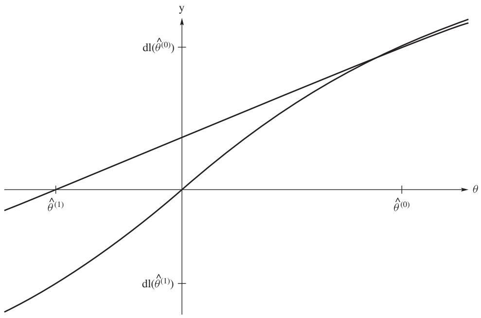  
Figure 6.2.1: Beginning with the starting value $\widehat{\theta}^{(0)}$ , the one-step estimate is $\widehat{\theta}^{(1)}$ , which is the intersection of the tangent line to the curve $l'(\theta)$ at $\widehat{\theta}^{(0)}$ and the horizontal axis. In the figure, $dl(\theta) = l'(\theta)$ .

The logistic distribution is similar to the normal distribution; hence, we can use $\overline{X}$ as our initial guess of $\theta$ . The R function mlelogistic, at the site listed in the preface, computes the $k$ -step estimates.

We close this section with a remarkable fact. The estimate $\widehat{\theta}^{(1)}$ in equation (6.2.32) is called the one-step estimator. As Exercise 6.2.15 shows, this estimator has the same asymptotic distribution as the mle [i.e., (6.2.18)], provided that the initial guess $\widehat{\theta}^{(0)}$ is a consistent estimator of $\theta$ . That is, the one-step estimate is an asymptotically efficient estimate of $\theta$ . This is also true of the other iterative steps.

# EXERCISES

6.2.1. Prove that $\overline{X}$ , the mean of a random sample of size $n$ from a distribution that is $N(\theta, \sigma^2)$ , $-\infty < \theta < \infty$ , is, for every known $\sigma^2 > 0$ , an efficient estimator of $\theta$ .   
6.2.2. Given $f(x; \theta) = 1 / \theta$ , $0 < x < \theta$ , zero elsewhere, with $\theta > 0$ , formally compute the reciprocal of

$$
n E \left\{\left[ \frac {\partial \log f (X : \theta)}{\partial \theta} \right] ^ {2} \right\}.
$$

Compare this with the variance of $(n + 1)Y_{n} / n$ , where $Y_{n}$ is the largest observation of a random sample of size $n$ from this distribution. Comment.

6.2.3. Given the pdf

$$
f (x; \theta) = \frac {1}{\pi [ 1 + (x - \theta) ^ {2} ]}, \quad - \infty <   x <   \infty , \quad - \infty <   \theta <   \infty ,
$$

show that the Rao-Cramér lower bound is $2 / n$ , where $n$ is the size of a random sample from this Cauchy distribution. What is the asymptotic distribution of $\sqrt{n} (\widehat{\theta} -\theta)$ if $\widehat{\theta}$ is the mle of $\theta$ ?

6.2.4. Consider Example 6.2.2, where we discussed the location model.

(a) Write the location model when $e_i$ has the logistic pdf given in expression (4.4.11).   
(b) Using expression (6.2.8), show that the information $I(\theta) = 1/3$ for the model in part (a). Hint: In the integral of expression (6.2.8), use the substitution $u = (1 + e^{-z})^{-1}$ . Then $du = f(z)dz$ , where $f(z)$ is the pdf (4.4.11).

6.2.5. Using the same location model as in part (a) of Exercise 6.2.4, obtain the ARE of the sample median to mle of the model.

Hint: The mle of $\theta$ for this model is discussed in Example 6.2.7. Furthermore, as shown in Theorem 10.2.3 of Chapter 10, $Q_{2}$ is asymptotically normal with asymptotic mean $\theta$ and asymptotic variance $1 / (4f^{2}(0)n)$ .

6.2.6. Consider a location model (Example 6.2.2) when the error pdf is the contaminated normal (3.4.17) with $\epsilon$ as the proportion of contamination and with $\sigma_c^2$ as the variance of the contaminated part. Show that the ARE of the sample median to the sample mean is given by

$$
e \left(Q _ {2}, \bar {X}\right) = \frac {2 \left[ 1 + \epsilon \left(\sigma_ {c} ^ {2} - 1\right) \right] \left[ 1 - \epsilon + \left(\epsilon / \sigma_ {c}\right) \right] ^ {2}}{\pi}. \tag {6.2.34}
$$

Use the hint in Exercise 6.2.5 for the median.

(a) If $\sigma_c^2 = 9$ , use (6.2.34) to fill in the following table:

<table><tr><td>ε</td><td>0</td><td>0.05</td><td>0.10</td><td>0.15</td></tr><tr><td>e(Q2, X)</td><td></td><td></td><td></td><td></td></tr></table>

(b) Notice from the table that the sample median becomes the "better" estimator when $\epsilon$ increases from 0.10 to 0.15. Determine the value for $\epsilon$ where this occurs [this involves a third-degree polynomial in $\epsilon$ , so one way of obtaining the root is to use the Newton algorithm discussed around expression (6.2.32)].

6.2.7. Recall Exercise 6.1.1 where $X_{1}, X_{2}, \ldots, X_{n}$ is a random sample on $X$ that has a $\Gamma(\alpha = 4, \beta = \theta)$ distribution, $0 < \theta < \infty$ .

(a) Find the Fisher information $I(\theta)$ .   
(b) Show that the mle of $\theta$ , which was derived in Exercise 6.1.1, is an efficient estimator of $\theta$ .   
(c) Using Theorem 6.2.2, obtain the asymptotic distribution of $\sqrt{n} (\widehat{\theta} -\theta)$ .   
(d) For the data of Example 6.1.1, find the asymptotic $95\%$ confidence interval for $\theta$ .

6.2.8. Let $X$ be $N(0,\theta)$ , $0 < \theta < \infty$ .

(a) Find the Fisher information $I(\theta)$ .   
(b) If $X_{1}, X_{2}, \ldots, X_{n}$ is a random sample from this distribution, show that the mle of $\theta$ is an efficient estimator of $\theta$ .   
(c) What is the asymptotic distribution of $\sqrt{n} (\hat{\theta} -\theta)$ ?

6.2.9. If $X_{1}, X_{2}, \ldots, X_{n}$ is a random sample from a distribution with pdf

$$
f (x; \theta) = \left\{ \begin{array}{l l} \frac {3 \theta^ {3}}{(x + \theta) ^ {4}} & 0 <   x <   \infty , 0 <   \theta <   \infty \\ 0 & \text {e l s e w h e r e}, \end{array} \right.
$$

show that $Y = 2\overline{X}$ is an unbiased estimator of $\theta$ and determine its efficiency.

6.2.10. Let $X_{1}, X_{2}, \ldots, X_{n}$ be a random sample from a $N(0, \theta)$ distribution. We want to estimate the standard deviation $\sqrt{\theta}$ . Find the constant $c$ so that $Y = c \sum_{i=1}^{n} |X_{i}|$ is an unbiased estimator of $\sqrt{\theta}$ and determine its efficiency.

6.2.11. Let $\overline{X}$ be the mean of a random sample of size $n$ from a $N(\theta, \sigma^2)$ distribution, $-\infty < \theta < \infty, \sigma^2 > 0$ . Assume that $\sigma^2$ is known. Show that $\overline{X}^2 - \frac{\sigma^2}{n}$ is an unbiased estimator of $\theta^2$ and find its efficiency.

6.2.12. Recall that $\widehat{\theta} = -n / \sum_{i=1}^{n} \log X_i$ is the mle of $\theta$ for a beta $(\theta, 1)$ distribution. Also, $W = -\sum_{i=1}^{n} \log X_i$ has the gamma distribution $\Gamma(n, 1 / \theta)$ .

(a) Show that $2\theta W$ has a $\chi^2 (2n)$ distribution.   
(b) Using part (a), find $c_{1}$ and $c_{2}$ so that

$$
P \left(c _ {1} <   \frac {2 \theta n}{\widehat {\theta}} <   c _ {2}\right) = 1 - \alpha , \tag {6.2.35}
$$

for $0 < \alpha < 1$ . Next, obtain a $(1 - \alpha)100\%$ confidence interval for $\theta$ .

(c) For $\alpha = 0.05$ and $n = 10$ , compare the length of this interval with the length of the interval found in Example 6.2.6.

6.2.13. The data file beta30.rda contains 30 observations generated from a beta $(\theta, 1)$ distribution, where $\theta = 4$ . The file can be downloaded at the site discussed in the Preface.

(a) Obtain a histogram of the data using the argument $\mathsf{pr} = \mathsf{T}$ . Overlay the pdf of a $\beta(4,1)$ pdf. Comment.   
(b) Using the results of Exercise 6.2.12, compute the maximum likelihood estimate based on the data.   
(c) Using the confidence interval found in Part (c) of Exercise 6.2.12, compute the $95\%$ confidence interval for $\theta$ based on the data. Is the confidence interval successful?

6.2.14. Consider sampling on the random variable $X$ with the pdf given in Exercise 6.2.9.

(a) Obtain the corresponding cdf and its inverse. Show how to generate observations from this distribution.   
(b) Write an R function that generates a sample on $X$ .   
(c) Generate a sample of size 50 and compute the unbiased estimate of $\theta$ discussed in Exercise 6.2.9. Use it and the Central Limit Theorem to compute a $95\%$ confidence interval for $\theta$ .

6.2.15. By using expressions (6.2.21) and (6.2.22), obtain the result for the one-step estimate discussed at the end of this section.

6.2.16. Let $S^2$ be the sample variance of a random sample of size $n > 1$ from $N(\mu, \theta)$ , $0 < \theta < \infty$ , where $\mu$ is known. We know $E(S^2) = \theta$ .

(a) What is the efficiency of $S^2$ ?   
(b) Under these conditions, what is the mle $\widehat{\theta}$ of $\theta$ ?   
(c) What is the asymptotic distribution of $\sqrt{n} (\hat{\theta} -\theta)$ ?

# 6.3 Maximum Likelihood Tests

In the last section, we presented an inference for pointwise estimation and confidence intervals based on likelihood theory. In this section, we present a corresponding inference for testing hypotheses.

As in the last section, let $X_{1},\ldots ,X_{n}$ be iid with pdf $f(x;\theta)$ for $\theta \in \Omega$ . In this section, $\theta$ is a scalar, but in Sections 6.4 and 6.5 extensions to the vector-valued case are discussed. Consider the two-sided hypotheses

$$
H _ {0}: \theta = \theta_ {0} \text {v e r s u s} H _ {1}: \theta \neq \theta_ {0}, \tag {6.3.1}
$$

where $\theta_0$ is a specified value.

Recall that the likelihood function and its log are given by

$$
L (\theta) = \prod_ {i = 1} ^ {n} f \left(X _ {i}; \theta\right)
$$

$$
l (\theta) = \sum_ {i = 1} ^ {n} \log f (X _ {i}; \theta).
$$

Let $\widehat{\theta}$ denote the maximum likelihood estimate of $\theta$ .

To motivate the test, consider Theorem 6.1.1, which says that if $\theta_0$ is the true value of $\theta$ , then, asymptotically, $L(\theta_0)$ is the maximum value of $L(\theta)$ . Consider the ratio of two likelihood functions, namely,

$$
\Lambda = \frac {L \left(\theta_ {0}\right)}{L (\widehat {\theta})}. \tag {6.3.2}
$$

Note that $\Lambda \leq 1$ , but if $H_0$ is true, $\Lambda$ should be large (close to 1), while if $H_1$ is true, $\Lambda$ should be smaller. For a specified significance level $\alpha$ , this leads to the intuitive decision rule

$$
\text {R e j e c t} H _ {0} \text {i n f a v o r} H _ {1} \text {i f} \Lambda \leq c, \tag {6.3.3}
$$

where $c$ is such that $\alpha = P_{\theta_0}[\Lambda \leq c]$ . We call it the likelihood ratio test (LRT). Theorem 6.3.1 derives the asymptotic distribution of $\Lambda$ under $H_0$ , but first we look at two examples.

Example 6.3.1 (Likelihood Ratio Test for the Exponential Distribution). Suppose $X_{1},\ldots ,X_{n}$ are iid with pdf $f(x;\theta) = \theta^{-1}\exp \{-x / \theta \}$ , for $x,\theta >0$ . Let the hypotheses be given by (6.3.1). The likelihood function simplifies to

$$
L (\theta) = \theta^ {- n} \exp \left\{- (n / \theta) \overline {{X}} \right\}.
$$

From Example 4.1.1, the mle of $\theta$ is $\overline{X}$ . After some simplification, the likelihood ratio test statistic simplifies to

$$
\Lambda = e ^ {n} \left(\frac {\bar {X}}{\theta_ {0}}\right) ^ {n} \exp \{- n \bar {X} / \theta_ {0} \}. \tag {6.3.4}
$$

The decision rule is to reject $H_0$ if $\Lambda \leq c$ . But further simplification of the test is possible. Other than the constant $e^n$ , the test statistic is of the form

$$
g (t) = t ^ {n} \exp \{- n t \}, \quad t > 0,
$$

where $t = \overline{x} / \theta_0$ . Using differentiable calculus, it is easy to show that $g(t)$ has a unique critical value at 1, i.e., $g'(1) = 0$ , and further that $t = 1$ provides a maximum, because $g''(1) < 0$ . As Figure 6.3.1 depicts, $g(t) \leq c$ if and only if $t \leq c_1$ or $t \geq c_2$ . This leads to

$$
\Lambda \leq c, \text {i f a n d o n l y i f}, \frac {\bar {X}}{\theta_ {0}} \leq c _ {1} \text {o r} \frac {\bar {X}}{\theta_ {0}} \geq c _ {2}.
$$

Note that under the null hypothesis, $H_0$ , the statistic $(2 / \theta_0) \sum_{i=1}^{n} X_i$ has a $\chi^2$ distribution with 2n degrees of freedom. Based on this, the following decision rule results in a level $\alpha$ test:

Reject $H_0$ if $(2 / \theta_0)\sum_{i = 1}^{n}X_{i}\leq \chi_{1 - \alpha /2}^{2}(2n)$ or $(2 / \theta_0)\sum_{i = 1}^{n}X_{i}\geq \chi_{\alpha /2}^{2}(2n)$ , (6.3.5)

where $\chi_{1 - \alpha /2}^2 (2n)$ is the lower $\alpha /2$ quantile of a $\chi^2$ distribution with $2n$ degrees of freedom and $\chi_{\alpha /2}^2 (2n)$ is the upper $\alpha /2$ quantile of a $\chi^2$ distribution with $2n$ degrees of freedom. Other choices of $c_{1}$ and $c_{2}$ can be made, but these are usually the choices used in practice. Exercise 6.3.2 investigates the power curve for this test.

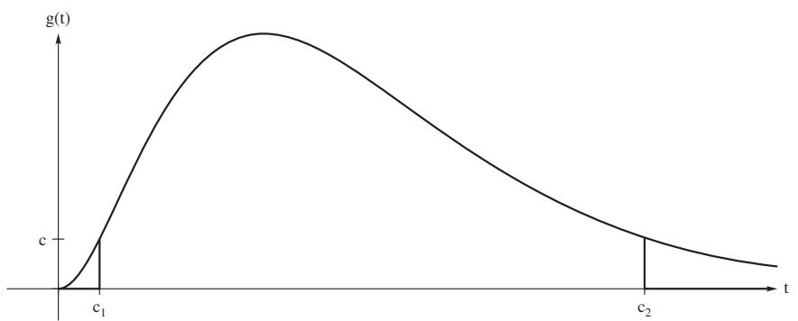  
Figure 6.3.1: Plot for Example 6.3.1, showing that the function $g(t) \leq c$ if and only if $t \leq c_1$ or $t \geq c_2$ .

Example 6.3.2 (Likelihood Ratio Test for the Mean of a Normal pdf). Consider a random sample $X_{1}, X_{2}, \ldots, X_{n}$ from a $N(\theta, \sigma^2)$ distribution where $-\infty < \theta < \infty$ and $\sigma^2 > 0$ is known. Consider the hypotheses

$$
H _ {0}: \theta = \theta_ {0} \text {v e r s u s} H _ {1}: \theta \neq \theta_ {0},
$$

where $\theta_0$ is specified. The likelihood function is

$$
\begin{array}{l} L (\theta) = \left(\frac {1}{2 \pi \sigma^ {2}}\right) ^ {n / 2} \exp \left\{- (2 \sigma^ {2}) ^ {- 1} \sum_ {i = 1} ^ {n} (x _ {i} - \theta) ^ {2} \right\} \\ { = } { \left( \frac { 1 } { 2 \pi \sigma ^ { 2 } } \right) ^ { n / 2 } \exp \left\{ - ( 2 \sigma ^ { 2 } ) ^ { - 1 } \sum _ { i = 1 } ^ { n } ( x _ { i } - \overline { { x } } ) ^ { 2 } \right\} \exp \{ - ( 2 \sigma ^ { 2 } ) ^ { - 1 } n ( \overline { { x } } - \theta ) ^ { 2 } \} . } \\ \end{array}
$$

Of course, in $\Omega = \{\theta : -\infty <  \theta <  \infty \}$ , the mle is $\widehat{\theta} = \overline{X}$ and thus

$$
\Lambda = \frac {L (\theta_ {0})}{L (\widehat {\theta})} = \exp \{- (2 \sigma^ {2}) ^ {- 1} n (\overline {{X}} - \theta_ {0}) ^ {2} \}.
$$

Then $\Lambda \leq c$ is equivalent to $-2\log \Lambda \geq -2\log c$ . However,

$$
- 2 \log \Lambda = \left(\frac {\overline {{X}} - \theta_ {0}}{\sigma / \sqrt {n}}\right) ^ {2},
$$

which has a $\chi^2(1)$ distribution under $H_0$ . Thus, the likelihood ratio test with significance level $\alpha$ states that we reject $H_0$ and accept $H_1$ when

$$
- 2 \log \Lambda = \left(\frac {\bar {X} - \theta_ {0}}{\sigma / \sqrt {n}}\right) ^ {2} \geq \chi_ {\alpha} ^ {2} (1). \tag {6.3.6}
$$

Note that this test is the same as the $z$ -test for a normal mean discussed in Chapter 4 with $s$ replaced by $\sigma$ . Hence, the power function for this test is given in expression (4.6.5).

Other examples are given in the exercises. In these examples the likelihood ratio tests simplify and we are able to get the test in closed form. Often, though, this is impossible. In such cases, similarly to Example 6.2.7, we can obtain the mle by iterative routines and, hence, also the test statistic $\Lambda$ . In Example 6.3.2, $-2\log \Lambda$ had an exact $\chi^2(1)$ null distribution. While not true in general, as the following theorem shows, under regularity conditions, the asymptotic null distribution of $-2\log \Lambda$ is $\chi^2$ with one degree of freedom. Hence in all cases an asymptotic test can be constructed.

Theorem 6.3.1. Assume the same regularity conditions as for Theorem 6.2.2. Under the null hypothesis, $H_0: \theta = \theta_0$ ,

$$
- 2 \log \Lambda \stackrel {D} {\rightarrow} \chi^ {2} (1). \tag {6.3.7}
$$

Proof: Expand the function $l(\theta)$ into a Taylor series about $\theta_0$ of order 1 and evaluate it at the mle, $\widehat{\theta}$ . This results in

$$
l (\widehat {\theta}) = l \left(\theta_ {0}\right) + \left(\widehat {\theta} - \theta_ {0}\right) l ^ {\prime} \left(\theta_ {0}\right) + \frac {1}{2} \left(\widehat {\theta} - \theta_ {0}\right) ^ {2} l ^ {\prime \prime} \left(\theta_ {n} ^ {*}\right), \tag {6.3.8}
$$

where $\theta_{n}^{*}$ is between $\widehat{\theta}$ and $\theta_0$ . Because $\widehat{\theta}\stackrel {P}{\to}\theta_0$ , it follows that $\theta_n^*\stackrel {P}{\to}\theta_0$ . This, in addition to the fact that the function $l''(\theta)$ is continuous, and equation (6.2.22) of Theorem 6.2.2 imply that

$$
- \frac {1}{n} l ^ {\prime \prime} \left(\theta_ {n} ^ {*}\right) \xrightarrow {P} I \left(\theta_ {0}\right). \tag {6.3.9}
$$

By Corollary 6.2.3,

$$
\frac {1}{\sqrt {n}} l ^ {\prime} \left(\theta_ {0}\right) = \sqrt {n} \left(\widehat {\theta} - \theta_ {0}\right) I \left(\theta_ {0}\right) + R _ {n}, \tag {6.3.10}
$$

where $R_{n} \to 0$ , in probability. If we substitute (6.3.9) and (6.3.10) into expression (6.3.8) and do some simplification, we have

$$
- 2 \log \Lambda = 2 (l (\widehat {\theta}) - l (\theta_ {0})) = \left\{\sqrt {n I (\theta_ {0})} (\widehat {\theta} - \theta_ {0}) \right\} ^ {2} + R _ {n} ^ {*}, \tag {6.3.11}
$$

where $R_{n}^{*}\to 0$ , in probability. By Theorems 5.2.4 and 6.2.2, the first term on the right side of the above equation converges in distribution to a $\chi^2$ -distribution with one degree of freedom.

Define the test statistic $\chi_L^2 = -2\log \Lambda$ . For the hypotheses (6.3.1), this theorem suggests the decision rule

$$
\operatorname {R e j e c t} H _ {0} \text {i n f a v o r} H _ {1} \text {i f} \chi_ {L} ^ {2} \geq \chi_ {\alpha} ^ {2} (1). \tag {6.3.12}
$$

By the last theorem, this test has asymptotic level $\alpha$ . If we cannot obtain the test statistic or its distribution in closed form, we can use this asymptotic test.

Besides the likelihood ratio test, in practice two other likelihood-related tests are employed. A natural test statistic is based on the asymptotic distribution of $\widehat{\theta}$ . Consider the statistic

$$
\chi_ {W} ^ {2} = \left\{\sqrt {n I (\widehat {\theta})} (\widehat {\theta} - \theta_ {0}) \right\} ^ {2}. \tag {6.3.13}
$$

Because $I(\theta)$ is a continuous function, $I(\widehat{\theta}) \to I(\theta_0)$ in probability under the null hypothesis, (6.3.1). It follows, under $H_0$ , that $\chi_W^2$ has an asymptotic $\chi^2$ -distribution with one degree of freedom. This suggests the decision rule

$$
\operatorname {R e j e c t} H _ {0} \text {i n f a v o r o f} H _ {1} \text {i f} \chi_ {W} ^ {2} \geq \chi_ {\alpha} ^ {2} (1). \tag {6.3.14}
$$

As with the test based on $\chi_L^2$ , this test has asymptotic level $\alpha$ . Actually, the relationship between the two test statistics is strong, because as equation (6.3.11) shows, under $H_0$ ,

$$
\chi_ {W} ^ {2} - \chi_ {L} ^ {2} \stackrel {P} {\rightarrow} 0. \tag {6.3.15}
$$

The test (6.3.14) is often referred to as a Wald-type test, after Abraham Wald, who was a prominent statistician of the 20th century.

The third test is called a scores-type test, which is often referred to as Rao's score test, after another prominent statistician, C. R. Rao. The scores are the components of the vector

$$
\mathbf {S} (\theta) = \left(\frac {\partial \log f (X _ {1} ; \theta)}{\partial \theta}, \dots , \frac {\partial \log f (X _ {n} ; \theta)}{\partial \theta}\right) ^ {\prime}. \tag {6.3.16}
$$

In our notation, we have

$$
\frac {1}{\sqrt {n}} l ^ {\prime} \left(\theta_ {0}\right) = \frac {1}{\sqrt {n}} \sum_ {i = 1} ^ {n} \frac {\partial \log f \left(X _ {i} ; \theta_ {0}\right)}{\partial \theta}. \tag {6.3.17}
$$

Define the statistic

$$
\chi_ {R} ^ {2} = \left(\frac {l ^ {\prime} \left(\theta_ {0}\right)}{\sqrt {n I \left(\theta_ {0}\right)}}\right) ^ {2}. \tag {6.3.18}
$$

Under $H_0$ , it follows from expression (6.3.10) that

$$
\chi_ {R} ^ {2} = \chi_ {W} ^ {2} + R _ {0 n}, \tag {6.3.19}
$$

where $R_{0n}$ converges to 0 in probability. Hence the following decision rule defines an asymptotic level $\alpha$ test under $H_0$ :

$$
\operatorname {R e j e c t} H _ {0} \text {i n f a v o r o f} H _ {1} \text {i f} \chi_ {R} ^ {2} \geq \chi_ {\alpha} ^ {2} (1). \tag {6.3.20}
$$

Example 6.3.3 (Example 6.2.6, Continued). As in Example 6.2.6, let $X_{1},\ldots ,X_{n}$ be a random sample having the common beta(θ,1) pdf (6.2.14). We use this pdf to illustrate the three test statistics discussed above for the hypotheses

$$
H _ {0}: \theta = 1 \text {v e r s u s} H _ {1}: \theta \neq 1. \tag {6.3.21}
$$

Under $H_0$ , $f(x; \theta)$ is the uniform(0,1) pdf. Recall that $\widehat{\theta} = -n / \sum_{i=1}^{n} \log X_i$ is the mle of $\theta$ . After some simplification, the value of the likelihood function at the mle is

$$
L (\widehat {\theta}) = \left(- \sum_ {i = 1} ^ {n} \log X _ {i}\right) ^ {- n} \exp \left\{- \sum_ {i = 1} ^ {n} \log X _ {i} \right\} \exp \left\{n (\log n - 1) \right\}.
$$

Also, $L(1) = 1$ . Hence the likelihood ratio test statistic is $\Lambda = 1 / L(\widehat{\theta})$ , so that

$$
\chi_ {L} ^ {2} = - 2 \log \Lambda = 2 \left\{- \sum_ {i = 1} ^ {n} \log X _ {i} - n \log \left(- \sum_ {i = 1} ^ {n} \log X _ {i}\right) - n + n \log n \right\}.
$$

Recall that the information for this pdf is $I(\theta) = \theta^{-2}$ . For the Wald-type test, we would estimate this consistently by $\widehat{\theta}^{-2}$ . The Wald-type test simplifies to

$$
\chi_ {W} ^ {2} = \left(\sqrt {\frac {n}{\widehat {\theta} ^ {2}}} (\widehat {\theta} - 1)\right) ^ {2} = n \left\{1 - \frac {1}{\widehat {\theta}} \right\} ^ {2}. \tag {6.3.22}
$$

Finally, for the scores-type course, recall from (6.2.15) that the $l^{\prime}(1)$ is

$$
l ^ {\prime} (1) = \sum_ {i = 1} ^ {n} \log X _ {i} + n.
$$

Hence the scores-type test statistic is

$$
\chi_ {R} ^ {2} = \left\{\frac {\sum_ {i = 1} ^ {n} \log X _ {i} + n}{\sqrt {n}} \right\} ^ {2}. (6. 3. 2 3)
$$

It is easy to show that expressions (6.3.22) and (6.3.23) are the same. From Example 6.2.4, we know the exact distribution of the maximum likelihood estimate. Exercise 6.3.8 uses this distribution to obtain an exact test.

Example 6.3.4 (Likelihood Tests for the Laplace Location Model). Consider the location model

$$
X _ {i} = \theta + e _ {i}, \quad i = 1, \dots , n,
$$

where $-\infty < \theta < \infty$ and the random errors $e_i$ s are iid each having the Laplace pdf, (2.2.4). Technically, the Laplace distribution does not satisfy all of the regularity

conditions (R0)-(R5), but the results below can be derived rigorously; see, for example, Hettmansperger and McKean (2011). Consider testing the hypotheses

$$
H _ {0}: \theta = \theta_ {0} \text {v e r s u s} H _ {1}: \theta \neq \theta_ {0},
$$

where $\theta_0$ is specified. Here $\Omega = (-\infty, \infty)$ and $\omega = \{\theta_0\}$ . By Example 6.1.1, we know that the mle of $\theta$ under $\Omega$ is $Q_2 = \mathrm{med}\{X, \ldots, X_n\}$ , the sample median. It follows that

$$
L (\widehat {\Omega}) = 2 ^ {- n} \exp \left\{- \sum_ {i = 1} ^ {n} | x _ {i} - Q _ {2} | \right\},
$$

while

$$
L (\widehat {\omega}) = 2 ^ {- n} \exp \left\{- \sum_ {i = 1} ^ {n} | x _ {i} - \theta_ {0} | \right\}.
$$

Hence the negative of twice the log of the likelihood ratio test statistic is

$$
- 2 \log \Lambda = 2 \left[ \sum_ {i = 1} ^ {n} \left| x _ {i} - \theta_ {0} \right| - \sum_ {i = 1} ^ {n} \left| x _ {i} - Q _ {2} \right| \right]. \tag {6.3.24}
$$

Thus the size $\alpha$ asymptotic likelihood ratio test for $H_0$ versus $H_{1}$ rejects $H_{0}$ in favor of $H_{1}$ if

$$
2 \left[ \sum_ {i = 1} ^ {n} | x _ {i} - \theta_ {0} | - \sum_ {i = 1} ^ {n} | x _ {i} - Q _ {2} | \right] \geq \chi_ {\alpha} ^ {2} (1).
$$

By (6.2.10), the Fisher information for this model is $I(\theta) = 1$ . Thus, the Wald-type test statistic simplifies to

$$
\chi_ {W} ^ {2} = [ \sqrt {n} (Q _ {2} - \theta_ {0}) ] ^ {2}.
$$

For the scores test, we have

$$
\frac {\partial \log f (x _ {i} - \theta)}{\partial \theta} = \frac {\partial}{\partial \theta} \left[ \log \frac {1}{2} - | x _ {i} - \theta | \right] = \operatorname {s g n} (x _ {i} - \theta).
$$

Hence the score vector for this model is $\mathbf{S}(\theta) = (\mathrm{sgn}(X_1 - \theta),\dots ,\mathrm{sgn}(X_n - \theta))'$ . From the above discussion [see equation (6.3.17)], the scores test statistic can be written as

$$
\chi_ {R} ^ {2} = (S ^ {*}) ^ {2} / n,
$$

where

$$
S ^ {*} = \sum_ {i = 1} ^ {n} \operatorname {s g n} \left(X _ {i} - \theta_ {0}\right).
$$

As Exercise 6.3.5 shows, under $H_0$ , $S^*$ is a linear function of a random variable with a $b(n,1/2)$ distribution.

Which of the three tests should we use? Based on the above discussion, all three tests are asymptotically equivalent under the null hypothesis. Similarly to the concept of asymptotic relative efficiency (ARE), we can derive an equivalent concept

of efficiency for tests; see Chapter 10 and more advanced books such as Hettmansperger and McKean (2011). However, all three tests have the same asymptotic efficiency. Hence, asymptotic theory offers little help in separating the tests. Finite sample comparisons have not shown that any of these tests are "best" overall; see Chapter 7 of Lehmann (1999) for more discussion.

# EXERCISES

6.3.1. The following data were generated from an exponential distribution with pdf $f(x; \theta) = (1 / \theta)e^{-x / \theta}$ , for $x > 0$ , where $\theta = 40$ .

(a) Histogram the data and locate $\theta_0 = 50$ on the plot.   
(b) Use the test described in Example 6.3.1 to test $H_0: \theta = 50$ versus $H_1: \theta \neq 50$ . Determine the decision at level $\alpha = 0.10$ .

19 15 76 23 24 66 27 12 25 7 6 16 51 26 39

6.3.2. Consider the decision rule (6.3.5) derived in Example 6.3.1. Obtain the distribution of the test statistic under a general alternative and use it to obtain the power function of the test. Using R, sketch this power curve for the case when $\theta_0 = 1$ , $n = 10$ , and $\alpha = 0.05$ .   
6.3.3. Show that the test with decision rule (6.3.6) is like that of Example 4.6.1 except that here $\sigma^2$ is known.   
6.3.4. Obtain an R function that plots the power function discussed at the end of Example 6.3.2. Run your function for the case when $\theta_0 = 0$ , $n = 10$ , $\sigma^2 = 1$ , and $\alpha = 0.05$ .   
6.3.5. Consider Example 6.3.4.

(a) Show that we can write $S^{*} = 2T - n$ , where $T = \# \{X_{i} > \theta_{0}\}$ .   
(b) Show that the scores test for this model is equivalent to rejecting $H_0$ if $T < c_1$ or $T > c_2$ .   
(c) Show that under $H_0$ , $T$ has the binomial distribution $b(n, 1/2)$ ; hence, determine $c_1$ and $c_2$ so that the test has size $\alpha$ .   
(d) Determine the power function for the test based on $T$ as a function of $\theta$ .

6.3.6. Let $X_{1}, X_{2}, \ldots, X_{n}$ be a random sample from a $N(\mu_0, \sigma^2 = \theta)$ distribution, where $0 < \theta < \infty$ and $\mu_0$ is known. Show that the likelihood ratio test of $H_0: \theta = \theta_0$ versus $H_1: \theta \neq \theta_0$ can be based upon the statistic $W = \sum_{i=1}^{n} (X_i - \mu_0)^2 / \theta_0$ . Determine the null distribution of $W$ and give, explicitly, the rejection rule for a level $\alpha$ test.

6.3.7. For the test described in Exercise 6.3.6, obtain the distribution of the test statistic under general alternatives. If computational facilities are available, sketch this power curve for the case when $\theta_0 = 1$ , $n = 10$ , $\mu = 0$ , and $\alpha = 0.05$ .

6.3.8. Using the results of Example 6.2.4, find an exact size $\alpha$ test for the hypotheses (6.3.21).

6.3.9. Let $X_{1}, X_{2}, \ldots, X_{n}$ be a random sample from a Poisson distribution with mean $\theta > 0$ .

(a) Show that the likelihood ratio test of $H_0: \theta = \theta_0$ versus $H_1: \theta \neq \theta_0$ is based upon the statistic $Y = \sum_{i=1}^{n} X_i$ . Obtain the null distribution of $Y$ .   
(b) For $\theta_0 = 2$ and $n = 5$ , find the significance level of the test that rejects $H_0$ if $Y \leq 4$ or $Y \geq 17$ .

6.3.10. Let $X_{1}, X_{2}, \ldots, X_{n}$ be a random sample from a Bernoulli $b(1, \theta)$ distribution, where $0 < \theta < 1$ .

(a) Show that the likelihood ratio test of $H_0: \theta = \theta_0$ versus $H_1: \theta \neq \theta_0$ is based upon the statistic $Y = \sum_{i=1}^{n} X_i$ . Obtain the null distribution of $Y$ .   
(b) For $n = 100$ and $\theta_0 = 1/2$ , find $c_1$ so that the test rejects $H_0$ when $Y \leq c_1$ or $Y \geq c_2 = 100 - c_1$ has the approximate significance level of $\alpha = 0.05$ . Hint: Use the Central Limit Theorem.

6.3.11. Let $X_{1}, X_{2}, \ldots, X_{n}$ be a random sample from a $\Gamma(\alpha = 4, \beta = \theta)$ distribution, where $0 < \theta < \infty$ .

(a) Show that the likelihood ratio test of $H_0: \theta = \theta_0$ versus $H_1: \theta \neq \theta_0$ is based upon the statistic $W = \sum_{i=1}^{n} X_i$ . Obtain the null distribution of $2W / \theta_0$ .   
(b) For $\theta_0 = 3$ and $n = 5$ , find $c_{1}$ and $c_{2}$ so that the test that rejects $H_{0}$ when $W \leq c_{1}$ or $W \geq c_{2}$ has significance level 0.05.

6.3.12. Let $X_1, X_2, \ldots, X_n$ be a random sample from a distribution with pdf $f(x; \theta) = \theta \exp \left\{ -|x|^{\theta} \right\} / 2\Gamma(1/\theta)$ , $-\infty < x < \infty$ , where $\theta > 0$ . Suppose $\Omega = \{ \theta : \theta = 1, 2 \}$ . Consider the hypotheses $H_0 : \theta = 2$ (a normal distribution) versus $H_1 : \theta = 1$ (a double exponential distribution). Show that the likelihood ratio test can be based on the statistic $W = \sum_{i=1}^{n} (X_i^2 - |X_i|)$ .

6.3.13. Let $X_{1}, X_{2}, \ldots, X_{n}$ be a random sample from the beta distribution with $\alpha = \beta = \theta$ and $\Omega = \{\theta : \theta = 1, 2\}$ . Show that the likelihood ratio test statistic $\Lambda$ for testing $H_{0} : \theta = 1$ versus $H_{1} : \theta = 2$ is a function of the statistic $W = \sum_{i=1}^{n} \log X_{i} + \sum_{i=1}^{n} \log (1 - X_{i})$ .

6.3.14. Consider a location model

$$
X _ {i} = \theta + e _ {i}, \quad i = 1, \dots , n, \tag {6.3.25}
$$

where $e_1, e_2, \ldots, e_n$ are iid with pdf $f(z)$ . There is a nice geometric interpretation for estimating $\theta$ . Let $\mathbf{X} = (X_1, \ldots, X_n)'$ and $\mathbf{e} = (e_1, \ldots, e_n)'$ be the vectors of observations and random error, respectively, and let $\pmb{\mu} = \theta \mathbf{1}$ , where $\mathbf{1}$ is a vector with all components equal to 1. Let $V$ be the subspace of vectors of the form $\pmb{\mu}$ ;

i.e., $V = \{\mathbf{v} : \mathbf{v} = a\mathbf{1}$ for some $a \in R \}$ . Then in vector notation we can write the model as

$$
\mathbf {X} = \boldsymbol {\mu} + \mathbf {e}, \quad \boldsymbol {\mu} \in V. \tag {6.3.26}
$$

Then we can summarize the model by saying, "Except for the random error vector $\mathbf{e}$ , $\mathbf{X}$ would reside in $V$ ." Hence, it makes sense intuitively to estimate $\pmb{\mu}$ by a vector in $V$ that is "closest" to $\mathbf{X}$ . That is, given a norm $\| \cdot \|$ in $R^n$ , choose

$$
\hat {\boldsymbol {\mu}} = \operatorname {A r g m i n} \| \mathbf {X} - \mathbf {v} \|, \quad \mathbf {v} \in V. \tag {6.3.27}
$$

(a) If the error pdf is the Laplace, (2.2.4), show that the minimization in (6.3.27) is equivalent to maximizing the likelihood when the norm is the $l_{1}$ norm given by

$$
\left\| \mathbf {v} \right\| _ {1} = \sum_ {i = 1} ^ {n} \left| v _ {i} \right|. \tag {6.3.28}
$$

(b) If the error pdf is the $N(0,1)$ , show that the minimization in (6.3.27) is equivalent to maximizing the likelihood when the norm is given by the square of the $l_{2}$ norm

$$
\| \mathbf {v} \| _ {2} ^ {2} = \sum_ {i = 1} ^ {n} v _ {i} ^ {2}. \tag {6.3.29}
$$

6.3.15. Continuing with Exercise 6.3.14, besides estimation there is also a nice geometric interpretation for testing. For the model (6.3.26), consider the hypotheses

$$
H _ {0}: \theta = \theta_ {0} \text {v e r s u s} H _ {1}: \theta \neq \theta_ {0}, \tag {6.3.30}
$$

where $\theta_0$ is specified. Given a norm $\| \cdot \|$ on $R^n$ , denote by $d(\mathbf{X}, V)$ the distance between $\mathbf{X}$ and the subspace $V$ ; i.e., $d(\mathbf{X}, V) = \| \mathbf{X} - \widehat{\boldsymbol{\mu}}\|$ , where $\widehat{\boldsymbol{\mu}}$ is defined in equation (6.3.27). If $H_0$ is true, then $\widehat{\boldsymbol{\mu}}$ should be close to $\boldsymbol{\mu} = \theta_0\mathbf{1}$ and, hence, $\| \mathbf{X} - \theta_0\mathbf{1}\|$ should be close to $d(\mathbf{X}, V)$ . Denote the difference by

$$
R D = \left\| \mathbf {X} - \theta_ {0} \mathbf {1} \right\| - \left\| \mathbf {X} - \widehat {\boldsymbol {\mu}} \right\|. \tag {6.3.31}
$$

Small values of $RD$ indicate that the null hypothesis is true, while large values indicate $H_{1}$ . So our rejection rule when using $RD$ is

$$
\text {R e j e c t} H _ {0} \text {i n f a v o r} H _ {1} \text {i f} R D > c. \tag {6.3.32}
$$

(a) If the error pdf is the Laplace, (6.1.6), show that expression (6.3.31) is equivalent to the likelihood ratio test when the norm is given by (6.3.28).   
(b) If the error pdf is the $N(0,1)$ , show that expression (6.3.31) is equivalent to the likelihood ratio test when the norm is given by the square of the $l_{2}$ norm, (6.3.29).

6.3.16. Let $X_1, X_2, \ldots, X_n$ be a random sample from a distribution with pmf $p(x; \theta) = \theta^x (1 - \theta)^{1 - x}$ , $x = 0, 1$ , where $0 < \theta < 1$ . We wish to test $H_0: \theta = 1/3$ versus $H_1: \theta \neq 1/3$ .

(a) Find $\Lambda$ and $-2\log \Lambda$   
(b) Determine the Wald-type test.   
(c) What is Rao's score statistic?

6.3.17. Let $X_{1}, X_{2}, \ldots, X_{n}$ be a random sample from a Poisson distribution with mean $\theta > 0$ . Consider testing $H_{0}: \theta = \theta_{0}$ against $H_{1}: \theta \neq \theta_{0}$ .

(a) Obtain the Wald type test of expression (6.3.13).   
(b) Write an R function to compute this test statistic.   
(c) For $\theta_0 = 23$ , compute the test statistic and determine the $p$ -value for the following data.

27 13 21 24 22 14 17 26 14 22

21 24 19 25 15 25 23 16 20 19

6.3.18. Let $X_{1}, X_{2}, \ldots, X_{n}$ be a random sample from a $\Gamma(\alpha, \beta)$ distribution where $\alpha$ is known and $\beta > 0$ . Determine the likelihood ratio test for $H_{0}: \beta = \beta_{0}$ against $H_{1}: \beta \neq \beta_{0}$ .

6.3.19. Let $Y_{1} < Y_{2} < \dots < Y_{n}$ be the order statistics of a random sample from a uniform distribution on $(0, \theta)$ , where $\theta > 0$ .

(a) Show that $\Lambda$ for testing $H_0: \theta = \theta_0$ against $H_1: \theta \neq \theta_0$ is $\Lambda = (Y_n / \theta_0)^n$ , $Y_n \leq \theta_0$ , and $\Lambda = 0$ if $Y_n > \theta_0$ .   
(b) When $H_0$ is true, show that $-2\log \Lambda$ has an exact $\chi^2(2)$ distribution, not $\chi^2(1)$ . Note that the regularity conditions are not satisfied.

# 6.4 Multiparameter Case: Estimation

In this section, we discuss the case where $\theta$ is a vector of $p$ parameters. There are analogs to the theorems in the previous sections in which $\theta$ is a scalar, and we present their results but, for the most part, without proofs. The interested reader can find additional information in more advanced books; see, for instance, Lehmann and Casella (1998) and Rao (1973).

Let $X_{1},\ldots ,X_{n}$ be iid with common pdf $f(x;\pmb {\theta})$ , where $\pmb {\theta}\in \Omega \subset R^p$ . As before, the likelihood function and its log are given by

$$
\begin{array}{l} L (\boldsymbol {\theta}) = \prod_ {i = 1} ^ {n} f (x _ {i}; \boldsymbol {\theta}) \\ l (\boldsymbol {\theta}) = \log L (\boldsymbol {\theta}) = \sum_ {i = 1} ^ {n} \log f (x _ {i}; \boldsymbol {\theta}), \tag {6.4.1} \\ \end{array}
$$

for $\pmb{\theta} \in \Omega$ . The theory requires additional regularity conditions, which are listed in Appendix A, (A.1.1). In keeping with our number scheme in the last three sections,

we have labeled these (R6)-(R9). In this section, when we say "under regularity conditions," we mean all of the conditions of (6.1.1), (6.2.1), (6.2.2), and (A.1.1) that are relevant to the argument. The discrete case follows in the same way as the continuous case, so in general we state material in terms of the continuous case.

Note that the proof of Theorem 6.1.1 does not depend on whether the parameter is a scalar or a vector. Therefore, with probability going to 1, $L(\pmb{\theta})$ is maximized at the true value of $\pmb{\theta}$ . Hence, as an estimate of $\pmb{\theta}$ we consider the value that maximizes $L(\pmb{\theta})$ or equivalently solves the vector equation $(\partial/\partial \pmb{\theta})l(\pmb{\theta}) = \mathbf{0}$ . If it exists, this value is called the maximum likelihood estimator (mle) and we denote it by $\widehat{\pmb{\theta}}$ . Often we are interested in a function of $\pmb{\theta}$ , say, the parameter $\eta = g(\pmb{\theta})$ . Because the second part of the proof of Theorem 6.1.2 remains true for $\pmb{\theta}$ as a vector, $\widehat{\eta} = g(\widehat{\pmb{\theta}})$ is the mle of $\eta$ .

Example 6.4.1 (Maximum Likelihood Estimates Under the Normal Model). Suppose $X_{1},\ldots ,X_{n}$ are iid $N(\mu ,\sigma^2)$ . In this case, $\pmb {\theta} = (\mu ,\sigma^2)'$ and $\Omega$ is the product space $(-\infty ,\infty)\times (0,\infty)$ . The log of the likelihood simplifies to

$$
l (\mu , \sigma^ {2}) = - \frac {n}{2} \log 2 \pi - n \log \sigma - \frac {1}{2 \sigma^ {2}} \sum_ {i = 1} ^ {n} (x _ {i} - \mu) ^ {2}. \tag {6.4.2}
$$

Taking partial derivatives of (6.4.2) with respect to $\mu$ and $\sigma$ and setting them to 0, we get the simultaneous equations

$$
\begin{array}{l} \frac {\partial l}{\partial \mu} = \frac {1}{\sigma^ {2}} \sum_ {i = 1} ^ {n} (x _ {i} - \mu) = 0 \\ \frac {\partial l}{\partial \sigma} = - \frac {n}{\sigma} + \frac {1}{\sigma^ {3}} \sum_ {i = 1} ^ {n} (x _ {i} - \mu) ^ {2} = 0. \\ \end{array}
$$

Solving these equations, we obtain $\widehat{\mu} = \overline{X}$ and $\widehat{\sigma} = \sqrt{(1/n)\sum_{i=1}^{n}(X_i - \overline{X})^2}$ as solutions. A check of the second partials shows that these maximize $l(\mu, \sigma^2)$ , so these are the mles. Also, by Theorem 6.1.2, $(1/n)\sum_{i=1}^{n}(X_i - \overline{X})^2$ is the mle of $\sigma^2$ . We know from our discussion in Section 5.1 that these are consistent estimates of $\mu$ and $\sigma^2$ , respectively, that $\widehat{\mu}$ is an unbiased estimate of $\mu$ , and that $\widehat{\sigma^2}$ is a biased estimate of $\sigma^2$ whose bias vanishes as $n \to \infty$ .

Example 6.4.2 (General Laplace pdf). Let $X_{1}, X_{2}, \ldots, X_{n}$ be a random sample from the Laplace pdf $f_{X}(x) = (2b)^{-1}\exp\{-|x - a| / b\}$ , $-\infty < x < \infty$ , where the parameters $(a,b)$ are in the space $\Omega = \{(a,b): -\infty < a < \infty, b > 0\}$ . Recall in Section 6.1 that we looked at the special case where $b = 1$ . As we now show, the mle of $a$ is the sample median, regardless of the value of $b$ . The log of the likelihood function is

$$
l (a, b) = - n \log 2 - n \log b - \sum_ {i = 1} ^ {n} \left| \frac {x _ {i} - a}{b} \right|.
$$

The partial of $l(a,b)$ with respect to $a$ is

$$
\frac {\partial l (a , b)}{\partial a} = \frac {1}{b} \sum_ {i = 1} ^ {n} \operatorname {s g n} \left\{\frac {x _ {i} - a}{b} \right\} = \frac {1}{b} \sum_ {i = 1} ^ {n} \operatorname {s g n} \{x _ {i} - a \},
$$

where the second equality follows because $b > 0$ . Setting this partial to 0, we obtain the mle of $a$ to be $Q_{2} = \mathrm{med}\{X_{1}, X_{2}, \ldots, X_{n}\}$ , just as in Example 6.1.1. Hence the mle of $a$ is invariant to the parameter $b$ . Taking the partial of $l(a, b)$ with respect to $b$ , we obtain

$$
\frac {\partial l (a , b)}{\partial b} = - \frac {n}{b} + \frac {1}{b ^ {2}} \sum_ {i = 1} ^ {n} | x _ {i} - a |.
$$

Setting to 0 and solving the two equations simultaneously, we obtain, as the mle of $b$ , the statistic

$$
\widehat {b} = \frac {1}{n} \sum_ {i = 1} ^ {n} | X _ {i} - Q _ {2} |.
$$

Recall that the Fisher information in the scalar case was the variance of the random variable $(\partial/\partial \theta) \log f(X; \theta)$ . The analog in the multiparameter case is the variance-covariance matrix of the gradient of $\log f(X; \theta)$ , that is, the variance-covariance matrix of the random vector given by

$$
\bigtriangledown \log f (X; \boldsymbol {\theta}) = \left(\frac {\partial \log f (X ; \boldsymbol {\theta})}{\partial \theta_ {1}}, \dots , \frac {\partial \log f (X ; \boldsymbol {\theta})}{\partial \theta_ {p}}\right) ^ {\prime}. \tag {6.4.3}
$$

Fisher information is then defined by the $p\times p$ matrix

$$
\mathbf {I} (\boldsymbol {\theta}) = \operatorname {C o v} \left(\bigtriangledown \log f (X; \boldsymbol {\theta})\right). \tag {6.4.4}
$$

The $(j,k)$ th entry of $\mathbf{I}(\pmb {\theta})$ is given by

$$
I _ {j k} = \operatorname {c o v} \left(\frac {\partial}{\partial \theta_ {j}} \log f (X; \boldsymbol {\theta}), \frac {\partial}{\partial \theta_ {k}} \log f (X; \boldsymbol {\theta})\right); \quad j, k = 1, \dots , p. \tag {6.4.5}
$$

As in the scalar case, we can simplify this by using the identity $1 = \int f(x; \theta) dx$ . Under the regularity conditions, as discussed in the second paragraph of this section, the partial derivative of this identity with respect to $\theta_j$ results in

$$
\begin{array}{l} 0 = \int \frac {\partial}{\partial \theta_ {j}} f (x; \boldsymbol {\theta}) d x = \int \left[ \frac {\partial}{\partial \theta_ {j}} \log f (x; \boldsymbol {\theta}) \right] f (x; \boldsymbol {\theta}) d x \\ = E \left[ \frac {\partial}{\partial \theta_ {j}} \log f (X; \boldsymbol {\theta}) \right]. \tag {6.4.6} \\ \end{array}
$$

Next, on both sides of the first equality above, take the partial derivative with respect to $\theta_{k}$ . After simplification, this results in

$$
\begin{array}{l} 0 = \int \left(\frac {\partial^ {2}}{\partial \theta_ {j} \partial \theta_ {k}} \log f (x; \boldsymbol {\theta})\right) f (x; \boldsymbol {\theta}) d x \\ + \int \left(\frac {\partial}{\partial \theta_ {j}} \log f (x; \boldsymbol {\theta}) \frac {\partial}{\partial \theta_ {k}} \log f (x; \boldsymbol {\theta})\right) f (x; \boldsymbol {\theta}) d x; \\ \end{array}
$$

that is,

$$
E \left[ \frac {\partial}{\partial \theta_ {j}} \log f (X; \boldsymbol {\theta}) \frac {\partial}{\partial \theta_ {k}} \log f (X; \boldsymbol {\theta}) \right] = - E \left[ \frac {\partial^ {2}}{\partial \theta_ {j} \partial \theta_ {k}} \log f (X; \boldsymbol {\theta}) \right]. \tag {6.4.7}
$$

Using (6.4.6) and (6.4.7) together, we obtain

$$
I _ {j k} = - E \left[ \frac {\partial^ {2}}{\partial \theta_ {j} \partial \theta_ {k}} \log f (X; \boldsymbol {\theta}) \right]. \tag {6.4.8}
$$

Information for a random sample follows in the same way as the scalar case. The pdf of the sample is the likelihood function $L(\pmb{\theta}; \mathbf{X})$ . Replace $f(X; \pmb{\theta})$ by $L(\pmb{\theta}; \mathbf{X})$ in the vector given in expression (6.4.3). Because $\log L$ is a sum, this results in the random vector

$$
\bigtriangledown \log L (\boldsymbol {\theta}; \mathbf {X}) = \sum_ {i = 1} ^ {n} \bigtriangledown \log f (X _ {i}; \boldsymbol {\theta}). \tag {6.4.9}
$$

Because the summands are iid with common covariance matrix $\mathbf{I}(\pmb {\theta})$ , we have

$$
\operatorname {C o v} (\bigtriangledown \log L (\boldsymbol {\theta}; \mathbf {X})) = n \mathbf {I} (\boldsymbol {\theta}). \tag {6.4.10}
$$

As in the scalar case, the information in a random sample of size $n$ is $n$ times the information in a sample of size 1.

The diagonal entries of $\mathbf{I}(\pmb{\theta})$ are

$$
I _ {i i} (\boldsymbol {\theta}) = \operatorname {V a r} \left[ \frac {\partial \log f (X ; \boldsymbol {\theta})}{\partial \theta_ {i}} \right] = - E \left[ \frac {\partial^ {2}}{\partial \theta_ {i} ^ {2}} \log f (X _ {i}; \boldsymbol {\theta}) \right].
$$

This is similar to the case when $\theta$ is a scalar, except now $I_{ii}(\theta)$ is a function of the vector $\pmb{\theta}$ . Recall in the scalar case that $(nI(\theta))^{-1}$ was the Rao-Cramér lower bound for an unbiased estimate of $\theta$ . There is an analog to this in the multiparameter case. In particular, if $Y_{j} = u_{j}(X_{1},\ldots ,X_{n})$ is an unbiased estimate of $\theta_{j}$ , then it can be shown that

$$
\operatorname {V a r} \left(Y _ {j}\right) \geq \frac {1}{n} \left[ \mathbf {I} ^ {- 1} (\boldsymbol {\theta}) \right] _ {j j}; \tag {6.4.11}
$$

see, for example, Lehmann (1983). As in the scalar case, we shall call an unbiased estimate efficient if its variance attains this lower bound.

Example 6.4.3 (Information Matrix for the Normal pdf). The log of a $N(\mu, \sigma^2)$ pdf is given by

$$
\log f (x; \mu , \sigma^ {2}) = - \frac {1}{2} \log 2 \pi - \log \sigma - \frac {1}{2 \sigma^ {2}} (x - \mu) ^ {2}. \tag {6.4.12}
$$

The first and second partial derivatives are

$$
\frac {\partial \log f}{\partial \mu} = \frac {1}{\sigma^ {2}} (x - \mu)
$$

$$
\frac {\partial^ {2} \log f}{\partial \mu^ {2}} = - \frac {1}{\sigma^ {2}}
$$

$$
\frac {\partial \log f}{\partial \sigma} = - \frac {1}{\sigma} + \frac {1}{\sigma^ {3}} (x - \mu) ^ {2}
$$

$$
\frac {\partial^ {2} \log f}{\partial \sigma^ {2}} = \frac {1}{\sigma^ {2}} - \frac {3}{\sigma^ {4}} (x - \mu) ^ {2}
$$

$$
\frac {\partial^ {2} \log f}{\partial \mu \partial \sigma} = - \frac {2}{\sigma^ {3}} (x - \mu).
$$

Upon taking the negative of the expectations of the second partial derivatives, the information matrix for a normal density is

$$
\mathbf {I} (\mu , \sigma) = \left[ \begin{array}{c c} \frac {1}{\sigma^ {2}} & 0 \\ 0 & \frac {2}{\sigma^ {2}} \end{array} \right]. \tag {6.4.13}
$$

We may want the information matrix for $(\mu, \sigma^2)$ . This can be obtained by taking partial derivatives with respect to $\sigma^2$ instead of $\sigma$ ; however, in Example 6.4.6, we obtain it via a transformation. From Example 6.4.1, the maximum likelihood estimates of $\mu$ and $\sigma^2$ are $\widehat{\mu} = \overline{X}$ and $\widehat{\sigma}^2 = (1/n)\sum_{i=1}^{n}(X_i - \overline{X})^2$ , respectively. Based on the information matrix, we note that $\overline{X}$ is an efficient estimate of $\mu$ for finite samples. In Example 6.4.6, we consider the sample variance.

Example 6.4.4 (Information Matrix for a Location and Scale Family). Suppose $X_{1}, X_{2}, \ldots, X_{n}$ is a random sample with common pdf $f_{X}(x) = b^{-1}f\left(\frac{x - a}{b}\right)$ , $-\infty < x < \infty$ , where $(a,b)$ is in the space $\Omega = \{(a,b) : -\infty < a < \infty, b > 0\}$ and $f(z)$ is a pdf such that $f(z) > 0$ for $-\infty < z < \infty$ . As Exercise 6.4.10 shows, we can model $X_{i}$ as

$$
X _ {i} = a + b e _ {i}, \tag {6.4.14}
$$

where the $e_i$ s are iid with pdf $f(z)$ . This is called a location and scale model (LASP). Example 6.4.2 illustrated this model when $f(z)$ had the Laplace pdf. In Exercise 6.4.11, the reader is asked to show that the partial derivatives are

$$
\begin{array}{l} \frac {\partial}{\partial a} \left\{\log \left[ \frac {1}{b} f \left(\frac {x - a}{b}\right) \right] \right\} = - \frac {1}{b} \frac {f ^ {\prime} \left(\frac {x - a}{b}\right)}{f \left(\frac {x - a}{b}\right)} \\ \frac {\partial}{\partial b} \left\{\log \left[ \frac {1}{b} f \left(\frac {x - a}{b}\right) \right] \right\} = - \frac {1}{b} \left[ 1 + \frac {\frac {x - a}{b} f ^ {\prime} \left(\frac {x - a}{b}\right)}{f \left(\frac {x - a}{b}\right)} \right]. \\ \end{array}
$$

Using (6.4.5) and (6.4.6), we then obtain

$$
I _ {1 1} = \int_ {- \infty} ^ {\infty} \frac {1}{b ^ {2}} \left[ \frac {f ^ {\prime} \left(\frac {x - a}{b}\right)}{f \left(\frac {x - a}{b}\right)} \right] ^ {2} \frac {1}{b} f \left(\frac {x - a}{b}\right) d x.
$$

Now make the substitution $z = (x - a) / b$ , $dz = (1 / b)dx$ . Then we have

$$
I _ {1 1} = \frac {1}{b ^ {2}} \int_ {- \infty} ^ {\infty} \left[ \frac {f ^ {\prime} (z)}{f (z)} \right] ^ {2} f (z) d z; \tag {6.4.15}
$$

hence, information on the location parameter $a$ does not depend on $a$ . As Exercise 6.4.11 shows, upon making this substitution, the other entries in the information matrix are

$$
\begin{array}{l} I _ {2 2} = \frac {1}{b ^ {2}} \int_ {- \infty} ^ {\infty} \left[ 1 + \frac {z f ^ {\prime} (z)}{f (z)} \right] ^ {2} f (z) d z (6.4.16) \\ I _ {1 2} = \frac {1}{b ^ {2}} \int_ {- \infty} ^ {\infty} z \left[ \frac {f ^ {\prime} (z)}{f (z)} \right] ^ {2} f (z) d z. (6.4.17) \\ \end{array}
$$

Thus, the information matrix can be written as $(1 / b)^2$ times a matrix whose entries are free of the parameters $a$ and $b$ . As Exercise 6.4.12 shows, the off-diagonal entries of the information matrix are 0 if the pdf $f(z)$ is symmetric about 0.

Example 6.4.5 (Multinomial Distribution). Consider a random trial which can result in one, and only one, of $k$ outcomes or categories. Let $X_{j}$ be 1 or 0 depending on whether the $j$ th outcome occurs or does not, for $j = 1, \ldots, k$ . Suppose the probability that outcome $j$ occurs is $p_{j}$ ; hence, $\sum_{j=1}^{k} p_{j} = 1$ . Let $\mathbf{X} = (X_{1}, \ldots, X_{k-1})'$ and $\mathbf{p} = (p_{1}, \ldots, p_{k-1})'$ . The distribution of $\mathbf{X}$ is multinomial; see Section 3.1. Recall that the pmf is given by

$$
f (\mathbf {x}, \mathbf {p}) = \left(\prod_ {j = 1} ^ {k - 1} p _ {j} ^ {x _ {j}}\right) \left(1 - \sum_ {j = 1} ^ {k - 1} p _ {j}\right) ^ {1 - \sum_ {j = 1} ^ {k - 1} x _ {j}}, \tag {6.4.18}
$$

where the parameter space is $\Omega = \{\mathbf{p}:0 < p_j < 1,j = 1,\ldots ,k - 1;\sum_{j = 1}^{k - 1}p_j < 1\}$

We first obtain the information matrix. The first partial of the log of $f$ with respect to $p_i$ simplifies to

$$
\frac {\partial \log f}{\partial p _ {i}} = \frac {x _ {i}}{p _ {i}} - \frac {1 - \sum_ {j = 1} ^ {k - 1} x _ {j}}{1 - \sum_ {j = 1} ^ {k - 1} p _ {j}}.
$$

The second partial derivatives are given by

$$
\frac {\partial^ {2} \log f}{\partial p _ {i} ^ {2}} = - \frac {x _ {i}}{p _ {i} ^ {2}} - \frac {1 - \sum_ {j = 1} ^ {k - 1} x _ {j}}{(1 - \sum_ {j = 1} ^ {k - 1} p _ {j}) ^ {2}}
$$

$$
\frac {\partial^ {2} \log f}{\partial p _ {i} \partial p _ {h}} = - \frac {1 - \sum_ {j = 1} ^ {k - 1} x _ {j}}{(1 - \sum_ {j = 1} ^ {k - 1} p _ {j}) ^ {2}}, i \neq h <   k.
$$

Recall that for this distribution the marginal distribution of $X_{j}$ is Bernoulli with mean $p_{j}$ . Recalling that $p_{k} = 1 - (p_{1} + \dots + p_{k-1})$ , the expectations of the negatives of the second partial derivatives are straightforward and result in the information matrix

$$
\mathbf {I} (\mathbf {p}) = \left[ \begin{array}{c c c c} \frac {1}{p _ {1}} + \frac {1}{p _ {k}} & \frac {1}{p _ {k}} & \dots & \frac {1}{p _ {k}} \\ \frac {1}{p _ {k}} & \frac {1}{p _ {2}} + \frac {1}{p _ {k}} & \dots & \frac {1}{p _ {k}} \\ \vdots & \vdots & & \vdots \\ \frac {1}{p _ {k}} & \frac {1}{p _ {k}} & \dots & \frac {1}{p _ {k - 1}} + \frac {1}{p _ {k}} \end{array} \right]. \tag {6.4.19}
$$

This is a patterned matrix with inverse [see page 170 of Graybill (1969)],

$$
\mathbf {I} ^ {- 1} (\mathbf {p}) = \left[ \begin{array}{c c c c} p _ {1} (1 - p _ {1}) & - p _ {1} p _ {2} & \dots & - p _ {1} p _ {k - 1} \\ - p _ {1} p _ {2} & p _ {2} (1 - p _ {2}) & \dots & - p _ {2} p _ {k - 1} \\ \vdots & \vdots & & \vdots \\ - p _ {1} p _ {k - 1} & - p _ {2} p _ {k - 1} & \dots & p _ {k - 1} (1 - p _ {k - 1}) \end{array} \right]. \tag {6.4.20}
$$

Next, we obtain the mles for a random sample $\mathbf{X}_1,\mathbf{X}_2,\ldots ,\mathbf{X}_n$ . The likelihood function is given by

$$
L (\mathbf {p}) = \prod_ {i = 1} ^ {n} \prod_ {j = 1} ^ {k - 1} p _ {j} ^ {x _ {j i}} \left(1 - \sum_ {j = 1} ^ {k - 1} p _ {j}\right) ^ {1 - \sum_ {j = 1} ^ {k - 1} x _ {j i}}. \tag {6.4.21}
$$

Let $t_j = \sum_{i=1}^n x_{ji}$ , for $j = 1, \ldots, k-1$ . With simplification, the log of $L$ reduces to

$$
l (\mathbf {p}) = \sum_ {j = 1} ^ {k - 1} t _ {j} \log p _ {j} + \left(n - \sum_ {j = 1} ^ {k - 1} t _ {j}\right) \log \left(1 - \sum_ {j = 1} ^ {k - 1} p _ {j}\right).
$$

The first partial of $l(\mathbf{p})$ with respect to $p_h$ leads to the system of equations

$$
\frac {\partial l (\mathbf {p})}{\partial p _ {h}} = \frac {t _ {h}}{p _ {h}} - \frac {n - \sum_ {j = 1} ^ {k - 1} t _ {j}}{1 - \sum_ {j = 1} ^ {k - 1} p _ {j}} = 0, h = 1, \dots , k - 1.
$$

It is easily seen that $p_h = t_h / n$ satisfies these equations. Hence the maximum likelihood estimates are

$$
\widehat {p _ {h}} = \frac {\sum_ {i = 1} ^ {n} X _ {i h}}{n}, \quad h = 1, \dots , k - 1. \tag {6.4.22}
$$

Each random variable $\sum_{i=1}^{n} X_{ih}$ is binomial $(n, p_h)$ with variance $np_h(1 - p_h)$ . Therefore, the maximum likelihood estimates are efficient estimates.

As a final note on information, suppose the information matrix is diagonal. Then the lower bound of the variance of the $j$ th estimator (6.4.11) is $1 / (n\mathbf{I}_{jj}(\pmb{\theta}))$ . Because $\mathbf{I}_{jj}(\pmb{\theta})$ is defined in terms of partial derivatives [see (6.4.5)] this is the information in treating all $\theta_{i}$ , except $\theta_{j}$ , as known. For instance, in Example 6.4.3, for the normal pdf the information matrix is diagonal; hence, the information for $\mu$ could have been obtained by treating $\sigma^2$ as known. Example 6.4.4 discusses the information for a general location and scale family. For this general family, of which the normal is a member, the information matrix is a diagonal matrix if the underlying pdf is symmetric.

In the next theorem, we summarize the asymptotic behavior of the maximum likelihood estimator of the vector $\pmb{\theta}$ . It shows that the mles are asymptotically efficient estimates.

Theorem 6.4.1. Let $X_{1},\ldots ,X_{n}$ be iid with pdf $f(x;\pmb {\theta})$ for $\pmb {\theta}\in \Omega$ . Assume the regularity conditions hold. Then

1. The likelihood equation,

$$
\frac {\partial}{\partial \pmb {\theta}} l (\pmb {\theta}) = \mathbf {0},
$$

has a solution $\widehat{\pmb{\theta}}_n$ such that $\widehat{\pmb{\theta}}_n \stackrel{P}{\to} \pmb{\theta}$ .

2. For any sequence that satisfies (1),

$$
\sqrt {n} \left(\widehat {\boldsymbol {\theta}} _ {n} - \boldsymbol {\theta}\right) \stackrel {{D}} {{\to}} N _ {p} \left(\mathbf {0}, \mathbf {I} ^ {- 1} (\boldsymbol {\theta})\right).
$$

The proof of this theorem can be found in more advanced books; see, for example, Lehmann and Casella (1998). As in the scalar case, the theorem does not assure that the maximum likelihood estimates are unique. But if the sequence of solutions are unique, then they are both consistent and asymptotically normal. In applications, we can often verify uniqueness.

We immediately have the following corollary,

Corollary 6.4.1. Let $X_{1},\ldots ,X_{n}$ be iid with pdf $f(x;\pmb {\theta})$ for $\pmb {\theta}\in \Omega$ . Assume the regularity conditions hold. Let $\widehat{\pmb{\theta}}_n$ be a sequence of consistent solutions of the likelihood equation. Then $\widehat{\pmb{\theta}}_n$ are asymptotically efficient estimates; that is, for $j = 1,\dots ,p$ ,

$$
\sqrt {n} (\widehat {\theta} _ {n, j} - \theta_ {j}) \stackrel {D} {\to} N (0, [ \mathbf {I} ^ {- 1} (\pmb {\theta}) ] _ {j j}).
$$

Let $\mathbf{g}$ be a transformation $\mathbf{g}(\pmb{\theta}) = (g_1(\pmb{\theta}),\dots,g_k(\pmb{\theta}))'$ such that $1\leq k\leq p$ and that the $k\times p$ matrix of partial derivatives

$$
\mathbf {B} = \left[ \frac {\partial g _ {i}}{\partial \theta_ {j}} \right], \quad i = 1, \dots k, j = 1, \dots , p,
$$

has continuous elements and does not vanish in a neighborhood of $\pmb{\theta}$ . Let $\widehat{\pmb{\eta}} = \mathbf{g}(\widehat{\pmb{\theta}})$ . Then $\widehat{\pmb{\eta}}$ is the mle of $\pmb{\eta} = \mathbf{g}(\pmb{\theta})$ . By Theorem 5.4.6,

$$
\sqrt {n} (\widehat {\boldsymbol {\eta}} - \boldsymbol {\eta}) \stackrel {D} {\rightarrow} N _ {k} (\mathbf {0}, \mathbf {B I} ^ {- 1} (\boldsymbol {\theta}) \mathbf {B} ^ {\prime}). \tag {6.4.23}
$$

Hence the information matrix for $\sqrt{n} (\widehat{\eta} -\eta)$ is

$$
\mathbf {I} (\boldsymbol {\eta}) = \left[ \mathbf {B} \mathbf {I} ^ {- 1} (\boldsymbol {\theta}) \mathbf {B} ^ {\prime} \right] ^ {- 1}, \tag {6.4.24}
$$

provided that the inverse exists.

For a simple example of this result, reconsider Example 6.4.3.

Example 6.4.6 (Information for the Variance of a Normal Distribution). Suppose $X_{1},\ldots ,X_{n}$ are iid $N(\mu ,\sigma^2)$ . Recall from Example 6.4.3 that the information matrix was $\mathbf{I}(\mu ,\sigma) = \mathrm{diag}\{\sigma^{-2},2\sigma^{-2}\}$ . Consider the transformation $g(\mu ,\sigma) = \sigma^2$ . Hence the matrix of partials $\mathbf{B}$ is the row vector $[0 2\sigma]$ . Thus the information for $\sigma^2$ is

$$
I (\sigma^ {2}) = \left\{\left[ \begin{array}{l l} 0 & 2 \sigma \end{array} \right] \left[ \begin{array}{c c} \frac {1}{\sigma^ {2}} & 0 \\ 0 & \frac {2}{\sigma^ {2}} \end{array} \right] ^ {- 1} \left[ \begin{array}{l} 0 \\ 2 \sigma \end{array} \right] \right\} ^ {- 1} = \frac {1}{2 \sigma^ {4}}.
$$

The Rao-Cramér lower bound for the variance of an estimator of $\sigma^2$ is $(2\sigma^4) / n$ . Recall that the sample variance is unbiased for $\sigma^2$ , but its variance is $(2\sigma^4) / (n - 1)$ . Hence, it is not efficient for finite samples, but it is asymptotically efficient.

# EXERCISES

6.4.1. A survey is taken of the citizens in a city as to whether or not they support the zoning plan that the city council is considering. The responses are: Yes, No, Indifferent, and Otherwise. Let $p_1, p_2, p_3$ , and $p_4$ denote the respective true probabilities of these responses. The results of the survey are:

<table><tr><td>Yes</td><td>No</td><td>Indifferent</td><td>Otherwise</td></tr><tr><td>60</td><td>45</td><td>70</td><td>25</td></tr></table>

(a) Obtain the mles of $p_i$ , $i = 1, \ldots, 4$ .   
(b) Obtain $95\%$ confidence intervals, (4.2.7), for $p_i$ , $i = 1,\ldots ,4$

6.4.2. Let $X_{1}, X_{2}, \ldots, X_{n}$ and $Y_{1}, Y_{2}, \ldots, Y_{m}$ be independent random samples from $N(\theta_{1}, \theta_{3})$ and $N(\theta_{2}, \theta_{4})$ distributions, respectively.

(a) If $\Omega \subset R^3$ is defined by

$$
\Omega = \left\{\left(\theta_ {1}, \theta_ {2}, \theta_ {3}\right): - \infty <   \theta_ {i} <   \infty , i = 1, 2; 0 <   \theta_ {3} = \theta_ {4} <   \infty \right\},
$$

find the mles of $\theta_{1},\theta_{2}$ , and $\theta_3$

(b) If $\Omega \subset R^2$ is defined by

$$
\Omega = \left\{\left(\theta_ {1}, \theta_ {3}\right): - \infty <   \theta_ {1} = \theta_ {2} <   \infty ; 0 <   \theta_ {3} = \theta_ {4} <   \infty \right\},
$$

find the mles of $\theta_{1}$ and $\theta_{3}$

6.4.3. Let $X_{1}, X_{2}, \ldots, X_{n}$ be iid, each with the distribution having pdf $f(x; \theta_1, \theta_2) = (1 / \theta_2)e^{-(x - \theta_1) / \theta_2}$ , $\theta_1 \leq x < \infty$ , $-\infty < \theta_2 < \infty$ , zero elsewhere. Find the maximum likelihood estimators of $\theta_{1}$ and $\theta_{2}$ .

6.4.4. The Pareto distribution is a frequently used model in the study of incomes and has the distribution function

$$
F (x; \theta_ {1}, \theta_ {2}) = \left\{ \begin{array}{l l} 1 - (\theta_ {1} / x) ^ {\theta_ {2}} & \theta_ {1} \leq x \\ 0 & \text {e l s e w h e r e ,} \end{array} \right.
$$

where $\theta_{1} > 0$ and $\theta_{2} > 0$ . If $X_{1}, X_{2}, \ldots, X_{n}$ is a random sample from this distribution, find the maximum likelihood estimators of $\theta_{1}$ and $\theta_{2}$ . (Hint: This exercise deals with a nonregular case.)

6.4.5. Let $Y_{1} < Y_{2} < \dots < Y_{n}$ be the order statistics of a random sample of size $n$ from the uniform distribution of the continuous type over the closed interval $[\theta - \rho, \theta + \rho]$ . Find the maximum likelihood estimators for $\theta$ and $\rho$ . Are these two unbiased estimators?

6.4.6. Let $X_{1},X_{2},\ldots ,X_{n}$ be a random sample from $N(\mu ,\sigma^2)$

(a) If the constant $b$ is defined by the equation $P(X \leq b) = 0.90$ , find the mle of $b$ .   
(b) If $c$ is given constant, find the mle of $P(X\leq c)$

6.4.7. The data file normal50.rda contains a random sample of size $n = 50$ for the situation described in Exercise 6.4.6. Download this data in R and obtain a histogram of the observations.

(a) In Part (b) of Exercise 6.4.6, let $c = 58$ and let $\xi = P(X \leq c)$ . Based on the data, compute the estimated value of the mle for $\xi$ . Compare this estimate with the sample proportion, $\hat{p}$ , of the data less than or equal to 58.   
(b) The R function bootstraps64.R computes a bootstrap confidence interval for the mle. Use this function to compute a $95\%$ confidence interval for $\xi$ . Compare your interval with that of expression (4.2.7) based on $\hat{p}$ .

6.4.8. Consider Part (a) of Exercise 6.4.6.

(a) Using the data of Exercise 6.4.7, compute the mle of $b$ . Also obtain the estimate based on 90th percentile of the data.   
(b) Edit the R function bootstrapcis64.R to compute a bootstrap confidence interval for $b$ . Then run your R function on the data of Exercise 6.4.7 to compute a $95\%$ confidence interval for $b$ .

6.4.9. Consider two Bernoulli distributions with unknown parameters $p_1$ and $p_2$ . If $Y$ and $Z$ equal the numbers of successes in two independent random samples, each of size $n$ , from the respective distributions, determine the mles of $p_1$ and $p_2$ if we know that $0 \leq p_1 \leq p_2 \leq 1$ .   
6.4.10. Show that if $X_{i}$ follows the model (6.4.14), then its pdf is $b^{-1}f((x - a) / b)$ .   
6.4.11. Verify the partial derivatives and the entries of the information matrix for the location and scale family as given in Example 6.4.4.   
6.4.12. Suppose the pdf of $X$ is of a location and scale family as defined in Example 6.4.4. Show that if $f(z) = f(-z)$ , then the entry $I_{12}$ of the information matrix is 0. Then argue that in this case the mles of $a$ and $b$ are asymptotically independent.   
6.4.13. Suppose $X_{1}, X_{2}, \ldots, X_{n}$ are iid $N(\mu, \sigma^2)$ . Show that $X_{i}$ follows a location and scale family as given in Example 6.4.4. Obtain the entries of the information matrix as given in this example and show that they agree with the information matrix determined in Example 6.4.3.

# 6.5 Multiparameter Case: Testing

In the multiparameter case, hypotheses of interest often specify $\pmb{\theta}$ to be in a subregion of the space. For example, suppose $X$ has a $N(\mu, \sigma^2)$ distribution. The full space is $\Omega = \{(\mu, \sigma^2) : \sigma^2 > 0, -\infty < \mu < \infty\}$ . This is a two-dimensional space.

We may be interested though in testing that $\mu = \mu_0$ , where $\mu_0$ is a specified value. Here we are not concerned about the parameter $\sigma^2$ . Under $H_0$ , the parameter space is the one-dimensional space $\omega = \{(\mu_0, \sigma^2) : \sigma^2 > 0\}$ . We say that $H_0$ is defined in terms of one constraint on the space $\Omega$ .

In general, let $X_{1},\ldots ,X_{n}$ be iid with pdf $f(x;\pmb {\theta})$ for $\pmb {\theta}\in \Omega \subset R^p$ . As in the last section, we assume that the regularity conditions listed in (6.1.1), (6.2.1), (6.2.2), and (A.1.1) are satisfied. In this section, we invoke these by the phrase under regularity conditions. The hypotheses of interest are

$$
H _ {0}: \boldsymbol {\theta} \in \omega \text {v e r s u s} H _ {1}: \boldsymbol {\theta} \in \Omega \cap \omega^ {c}, \tag {6.5.1}
$$

where $\omega \subset \Omega$ is defined in terms of $q$ , $0 < q \leq p$ , independent constraints of the form $g_{1}(\pmb{\theta}) = a_{1}, \dots, g_{q}(\pmb{\theta}) = a_{q}$ . The functions $g_{1}, \dots, g_{q}$ must be continuously differentiable. This implies that $\omega$ is a $(p - q)$ -dimensional space. Based on Theorem 6.1.1, the true parameter maximizes the likelihood function, so an intuitive test statistic is given by the likelihood ratio

$$
\Lambda = \frac {\operatorname* {m a x} _ {\boldsymbol {\theta} \in \omega} L (\boldsymbol {\theta})}{\operatorname* {m a x} _ {\boldsymbol {\theta} \in \Omega} L (\boldsymbol {\theta})}. \tag {6.5.2}
$$

Large values (close to 1) of $\Lambda$ suggest that $H_0$ is true, while small values indicate $H_1$ is true. For a specified level $\alpha$ , $0 < \alpha < 1$ , this suggests the decision rule

$$
\text {R e j e c t} H _ {0} \text {i n f a v o r} H _ {1} \text {i f} \Lambda \leq c, \tag {6.5.3}
$$

where $c$ is such that $\alpha = \max_{\pmb{\theta} \in \omega} P_{\pmb{\theta}}[\Lambda \leq c]$ . As in the scalar case, this test often has optimal properties; see Section 6.3. To determine $c$ , we need to determine the distribution of $\Lambda$ or a function of $\Lambda$ when $H_0$ is true.

Let $\widehat{\pmb{\theta}}$ denote the maximum likelihood estimator when the parameter space is the full space $\Omega$ and let $\widehat{\pmb{\theta}}_0$ denote the maximum likelihood estimator when the parameter space is the reduced space $\omega$ . For convenience, define $L(\widehat{\Omega}) = L\left(\widehat{\pmb{\theta}}\right)$ and $L(\widehat{\omega}) = L\left(\widehat{\pmb{\theta}}_0\right)$ . Then we can write the likelihood ratio test (LRT) statistic as

$$
\Lambda = \frac {L (\widehat {\omega})}{L (\widehat {\Omega})}. \tag {6.5.4}
$$

Example 6.5.1 (LRT for the Mean of a Normal pdf). Let $X_{1}, \ldots, X_{n}$ be a random sample from a normal distribution with mean $\mu$ and variance $\sigma^2$ . Suppose we are interested in testing

$$
H _ {0}: \mu = \mu_ {0} \text {v e r s u s} H _ {1}: \mu \neq \mu_ {0}, \tag {6.5.5}
$$

where $\mu_0$ is specified. Let $\Omega = \{(\mu, \sigma^2) : -\infty < \mu < \infty, \sigma^2 > 0\}$ denote the full model parameter space. The reduced model parameter space is the one-dimensional subspace $\omega = \{(\mu_0, \sigma^2) : \sigma^2 > 0\}$ . By Example 6.4.1, the mles of $\mu$ and $\sigma^2$ under $\Omega$ are $\widehat{\mu} = \overline{X}$ and $\widehat{\sigma}^2 = (1/n)\sum_{i=1}^{n}(X_i - \overline{X})^2$ , respectively. Under $\Omega$ , the maximum value of the likelihood function is

$$
L (\widehat {\Omega}) = \frac {1}{(2 \pi) ^ {n / 2}} \frac {1}{(\widehat {\sigma} ^ {2}) ^ {n / 2}} \exp \{- (n / 2) \}. \tag {6.5.6}
$$

Following Example 6.4.1, it is easy to show that under the reduced parameter space $\omega$ , $\widehat{\sigma}_0^2 = (1/n)\sum_{i=1}^{n}(X_i - \mu_0)^2$ . Thus the maximum value of the likelihood function under $\omega$ is

$$
L (\widehat {\omega}) = \frac {1}{(2 \pi) ^ {n / 2}} \frac {1}{\left(\widehat {\sigma} _ {0} ^ {2}\right) ^ {n / 2}} \exp \{- (n / 2) \}. \tag {6.5.7}
$$

The likelihood ratio test statistic is the ratio of $L(\widehat{\omega})$ to $L(\widehat{\Omega})$ ; i.e,

$$
\Lambda = \left(\frac {\sum_ {i = 1} ^ {n} \left(X _ {i} - \bar {X}\right) ^ {2}}{\sum_ {i = 1} ^ {n} \left(X _ {i} - \mu_ {0}\right) ^ {2}}\right) ^ {n / 2}. \tag {6.5.8}
$$

The likelihood ratio test rejects $H_0$ if $\Lambda \leq c$ , but this is equivalent to rejecting $H_0$ if $\Lambda^{-2/n} \geq c'$ . Next, consider the identity

$$
\sum_ {i = 1} ^ {n} \left(X _ {i} - \mu_ {0}\right) ^ {2} = \sum_ {i = 1} ^ {n} \left(X _ {i} - \bar {X}\right) ^ {2} + n \left(\bar {X} - \mu_ {0}\right) ^ {2}. \tag {6.5.9}
$$

Substituting (6.5.9) for $\sum_{i=1}^{n}(X_i - \mu_0)^2$ , after simplification, the test becomes reject $H_0$ if

$$
1 + \frac {n (\overline {{X}} - \mu_ {0}) ^ {2}}{\sum_ {i = 1} ^ {n} (X _ {i} - \overline {{X}}) ^ {2}} \geq c ^ {\prime},
$$

or equivalently, reject $H_0$ if

$$
\left\{\frac {\sqrt {n} (\overline {{X}} - \mu_ {0})}{\sqrt {\sum_ {i = 1} ^ {n} (X _ {i} - \overline {{X}}) ^ {2} / (n - 1)}} \right\} ^ {2} \geq c ^ {\prime \prime} = (c ^ {\prime} - 1) (n - 1).
$$

Let $T$ denote the expression within braces on the left side of this inequality. Then the decision rule is equivalent to

$$
\text {R e j e c t} H _ {0} \text {i n f a v o r o f} H _ {1} \text {i f} | T | \geq c ^ {*}, \tag {6.5.10}
$$

where $\alpha = P_{H_0}[|T|\geq c^* ]$ . Of course, this is the two-sided version of the $t$ -test presented in Example 4.5.4. If we take $c$ to be $t_{\alpha /2,n - 1}$ , the upper $\alpha /2$ -critical value of a $t$ -distribution with $n - 1$ degrees of freedom, then our test has exact level $\alpha$ . The power function for this test is discussed in Section 8.3.

As discussed in Example 4.2.1, the R call to compute $t$ is $t$ . test(x, mu=mu0), where the vector $x$ contains the sample and the scalar $mu0$ is $\mu_0$ . It also computes the $t$ -confidence interval for $\mu$ .

Other examples of likelihood ratio tests for normal distributions can be found in the exercises.

We are not always as fortunate as in Example 6.5.1 to obtain the likelihood ratio test in a simple form. Often it is difficult or perhaps impossible to obtain its finite sample distribution. But, as the next theorem shows, we can always obtain an asymptotic test based on it.

Theorem 6.5.1. Let $X_{1},\ldots ,X_{n}$ be iid with pdf $f(x;\pmb {\theta})$ for $\pmb {\theta}\in \Omega \subset R^p$ . Assume the regularity conditions hold. Let $\widehat{\pmb{\theta}}_n$ be a sequence of consistent solutions of the likelihood equation when the parameter space is the full space $\Omega$ . Let $\widehat{\pmb{\theta}}_{0,n}$ be a sequence of consistent solutions of the likelihood equation when the parameter space is the reduced space $\omega$ , which has dimension $p - q$ . Let $\Lambda$ denote the likelihood ratio test statistic given in (6.5.4). Under $H_0$ , (6.5.1),

$$
- 2 \log \Lambda \stackrel {D} {\rightarrow} \chi^ {2} (q). \tag {6.5.11}
$$

A proof of this theorem can be found in Rao (1973).

There are analogs of the Wald-type and scores-type tests, also. The Wald-type test statistic is formulated in terms of the constraints, which define $H_0$ , evaluated at the mle under $\Omega$ . We do not formally state it here, but as the following example shows, it is often a straightforward formulation. The interested reader can find a discussion of these tests in Lehmann (1999).

A careful reading of the development of this chapter shows that much of it remains the same if $X$ is a random vector. The next example demonstrates this.

Example 6.5.2 (Application of a Multinomial Distribution). As an example, consider a poll for a presidential race with $k$ candidates. Those polled are asked to select the person for which they would vote if the election were held tomorrow. Assuming that those polled are selected independently of one another and that each can select one and only one candidate, the multinomial model seems appropriate. In this problem, suppose we are interested in comparing how the two "leaders" are doing. In fact, say the null hypothesis of interest is that they are equally favorable. This can be modeled with a multinomial model that has three categories: (1) and (2) for the two leading candidates and (3) for all other candidates. Our observation is a vector $(X_{1}, X_{2})$ , where $X_{i}$ is 1 or 0 depending on whether category $i$ is selected or not. If both are 0, then category (3) has been selected. Let $p_{i}$ denote the probability that category $i$ is selected. Then the pmf of $(X_{1}, X_{2})$ is the trinomial density,

$$
f \left(x _ {1}, x _ {2}; p _ {1}, p _ {2}\right) = p _ {1} ^ {x _ {1}} p _ {2} ^ {x _ {2}} \left(1 - p _ {1} - p _ {2}\right) ^ {1 - x _ {1} - x _ {2}}, \tag {6.5.12}
$$

for $x_{i} = 0,1,i = 1,2$ ; $x_{1} + x_{2}\leq 1$ , where the parameter space is $\Omega = \{(p_1,p_2):0 < p_i < 1, p_1 + p_2 < 1\}$ . Suppose $(X_{11},X_{21}),\ldots ,(X_{1n},X_{2n})$ is a random sample from this distribution. We shall consider the hypotheses

$$
H _ {0}: p _ {1} = p _ {2} \text {v e r s u s} H _ {1}: p _ {1} \neq p _ {2}. \tag {6.5.13}
$$

We first derive the likelihood ratio test. Let $T_{j} = \sum_{i=1}^{n} X_{ji}$ for $j = 1,2$ . From Example 6.4.5, we know that the maximum likelihood estimates are $\widehat{p}_{j} = T_{j}/n$ , for $j = 1,2$ . The value of the likelihood function (6.4.21) at the mles under $\Omega$ is

$$
L \left(\hat {\Omega}\right) = \hat {p} _ {1} ^ {n \hat {p} _ {1}} \hat {p} _ {2} ^ {n \hat {p} _ {2}} (1 - \hat {p} _ {1} - \hat {p} _ {2}) ^ {n (1 - \hat {p} _ {1} - \hat {p} _ {2})}.
$$

Under the null hypothesis, let $p$ be the common value of $p_1$ and $p_2$ . The pmf of $(X_1, X_2)$ is

$$
f \left(x _ {1}, x _ {2}; p\right) = p ^ {x _ {1} + x _ {2}} (1 - 2 p) ^ {1 - x _ {1} - x _ {2}}; \quad x _ {1}, x _ {2} = 0, 1; x _ {1} + x _ {2} \leq 1, \tag {6.5.14}
$$

where the parameter space is $\omega = \{p:0 < p < 1 / 2\}$ . The likelihood under $\omega$ is

$$
L (p) = p ^ {t _ {1} + t _ {2}} \left(1 - 2 p\right) ^ {n - t _ {1} - t _ {2}}. \tag {6.5.15}
$$

Differentiating $\log L(p)$ with respect to $p$ and setting the derivative to 0 results in the following maximum likelihood estimate, under $\omega$ :

$$
\widehat {p} _ {0} = \frac {t _ {1} + t _ {2}}{2 n} = \frac {\widehat {p} _ {1} + \widehat {p} _ {2}}{2}, \tag {6.5.16}
$$

where $\widehat{p_1}$ and $\widehat{p_2}$ are the mles under $\Omega$ . The likelihood function evaluated at the mle under $\omega$ simplifies to

$$
L (\hat {\omega}) = \left(\frac {\hat {p} _ {1} + \hat {p} _ {2}}{2}\right) ^ {n \left(\hat {p} _ {1} + \hat {p} _ {2}\right)} \left(1 - \hat {p} _ {1} - \hat {p} _ {2}\right) ^ {n \left(1 - \hat {p} _ {1} - \hat {p} _ {2}\right)}. \tag {6.5.17}
$$

The reciprocal of the likelihood ratio test statistic then simplifies to

$$
\Lambda^ {- 1} = \left(\frac {2 \widehat {p} _ {1}}{\widehat {p} _ {1} + \widehat {p} _ {2}}\right) ^ {n \widehat {p} _ {1}} \left(\frac {2 \widehat {p} _ {2}}{\widehat {p} _ {1} + \widehat {p} _ {2}}\right) ^ {n \widehat {p} _ {2}}. \tag {6.5.18}
$$

Based on Theorem 6.5.11, an asymptotic level $\alpha$ test rejects $H_0$ if $2\log \Lambda^{-1} > \chi_{\alpha}^{2}(1)$ .

This is an example where the Wald's test can easily be formulated. The constraint under $H_0$ is $p_1 - p_2 = 0$ . Hence, the Wald-type statistic is $W = \widehat{p}_1 - \widehat{p}_2$ , which can be expressed as $W = [1, -1][\widehat{p}_1; \widehat{p}_2]'$ . Recall that the information matrix and its inverse were found for $k$ categories in Example 6.4.5. From Theorem 6.4.1, we then have

$$
\left[ \begin{array}{c} \widehat {p} _ {1} \\ \widehat {p} _ {2} \end{array} \right] \text {i s a p p r o x i m a t e l y} N _ {2} \left(\left( \begin{array}{c} p _ {1} \\ p _ {2} \end{array} \right), \frac {1}{n} \left[ \begin{array}{c c} p _ {1} (1 - p _ {1}) & - p _ {1} p _ {2} \\ - p _ {1} p _ {2} & p _ {2} (1 - p _ {2}) \end{array} \right]\right). \tag {6.5.19}
$$

As shown in Example 6.4.5, the finite sample moments are the same as the asymptotic moments. Hence the variance of $W$ is

$$
\begin{array}{l} \operatorname {V a r} (W) = [ 1, - 1 ] \frac {1}{n} \left[ \begin{array}{c c} p _ {1} (1 - p _ {1}) & - p _ {1} p _ {2} \\ - p _ {1} p _ {2} & p _ {2} (1 - p _ {2}) \end{array} \right] \left[ \begin{array}{c} 1 \\ - 1 \end{array} \right] \\ = \frac {p _ {1} + p _ {2} - (p _ {1} - p _ {2}) ^ {2}}{n}. \\ \end{array}
$$

Because $W$ is asymptotically normal, an asymptotic level $\alpha$ test for the hypotheses (6.5.13) is to reject $H_0$ if $\chi_W^2 \geq \chi_\alpha^2(1)$ , where

$$
\chi_ {W} ^ {2} = \frac {\left(\widehat {p} _ {1} - \widehat {p} _ {2}\right) ^ {2}}{\left(\widehat {p} _ {1} + \widehat {p} _ {2} - \left(\widehat {p} _ {1} - \widehat {p} _ {2}\right) ^ {2}\right) / n}. \tag {6.5.20}
$$

It also follows that an asymptotic $(1 - \alpha)100\%$ confidence interval for the difference $p_1 - p_2$ is

$$
\widehat {p} _ {1} - \widehat {p} _ {2} \pm z _ {\alpha / 2} \left(\frac {\widehat {p} _ {1} + \widehat {p} _ {2} - (\widehat {p} _ {1} - \widehat {p} _ {2}) ^ {2}}{n}\right) ^ {1 / 2}. \tag {6.5.21}
$$

Returning to the polling situation discussed at the beginning of this example, we would say the race is too close to call if 0 is in this confidence interval.

Equivalently, the test can be based on the test statistic $z = \sqrt{\chi_W^2}$ , which has an asymptotic $N(0,1)$ distribution under $H_0$ . This form of the test and the confidence interval for $p_1 - p_2$ are computed by the R function p2pair.R, which can be downloaded at the site mentioned in the Preface.

Example 6.5.3 (Two-Sample Binomial Proportions). In Example 6.5.2, we developed tests for $p_1 = p_2$ based on a single sample from a multinomial distribution. Now consider the situation where $X_{1},X_{2},\ldots ,X_{n_{1}}$ is a random sample from a $b(1,p_1)$ distribution, $Y_{1},Y_{2},\ldots ,Y_{n_{2}}$ is a random sample from a $b(1,p_2)$ distribution, and the $X_{i}$ s and $Y_{j}$ s are mutually independent. The hypotheses of interest are

$$
H _ {0}: p _ {1} = p _ {2} \text {v e r s u s} H _ {1}: p _ {1} \neq p _ {2}. \tag {6.5.22}
$$

This situation occurs in practice when, for instance, we are comparing the president's rating from one month to the next. The full and reduced model parameter spaces are given respectively by $\Omega = \{(p_1,p_2):0 < p_i < 1,i = 1,2\}$ and $\omega = \{(p,p):0 < p < 1\}$ . The likelihood function for the full model simplifies to

$$
L \left(p _ {1}, p _ {2}\right) = p _ {1} ^ {n _ {1} \bar {x}} \left(1 - p _ {1}\right) ^ {n _ {1} - n _ {1} \bar {x}} p _ {2} ^ {n _ {2} \bar {y}} \left(1 - p _ {2}\right) ^ {n _ {2} - n _ {2} \bar {y}}. \tag {6.5.23}
$$

It follows immediately that the mles of $p_1$ and $p_2$ are $\overline{x}$ and $\overline{y}$ , respectively. Note, for the reduced model, that we can combine the samples into one large sample from a $b(n,p)$ distribution, where $n = n_1 + n_2$ is the combined sample size. Hence, for the reduced model, the mle of $p$ is

$$
\widehat {p} = \frac {\sum_ {i = 1} ^ {n _ {1}} x _ {i} + \sum_ {i = 1} ^ {n _ {2}} y _ {i}}{n _ {1} + n _ {2}} = \frac {n _ {1} \bar {x} + n _ {2} \bar {y}}{n}, \tag {6.5.24}
$$

i.e., a weighted average of the individual sample proportions. Using this, the reader is asked to derive the LRT for the hypotheses (6.5.22) in Exercise 6.5.12. We next derive the Wald-type test. Let $\widehat{p}_1 = \overline{x}$ and $\widehat{p}_2 = \overline{y}$ . From the Central Limit Theorem, we have

$$
\frac {\sqrt {n _ {i}} (\widehat {p _ {i}} - p _ {i})}{\sqrt {p _ {i} (1 - p _ {i})}} \stackrel {D} {\to} Z _ {i}, i = 1, 2,
$$

where $Z_{1}$ and $Z_{2}$ are iid $N(0,1)$ random variables. Assume for $i = 1,2$ that, as $n\to \infty$ , $n_i / n\rightarrow \lambda_i$ , where $0 < \lambda_{i} < 1$ and $\lambda_1 + \lambda_2 = 1$ . As Exercise 6.5.13 shows,

$$
\sqrt {n} \left[\left(\widehat {p} _ {1} - \widehat {p} _ {2}\right) - \left(p _ {1} - p _ {2}\right)\right] \stackrel {{D}} {{\rightarrow}} N \left(0, \frac {1}{\lambda_ {1}} p _ {1} \left(1 - p _ {1}\right) + \frac {1}{\lambda_ {2}} p _ {2} \left(1 - p _ {2}\right)\right). \tag {6.5.25}
$$

It follows that the random variable

$$
Z = \frac {\left(\widehat {p} _ {1} - \widehat {p} _ {2}\right) - \left(p _ {1} - p _ {2}\right)}{\sqrt {\frac {p _ {1} \left(1 - p _ {1}\right)}{n _ {1}} + \frac {p _ {2} \left(1 - p _ {2}\right)}{n _ {2}}}} \tag {6.5.26}
$$

has an approximate $N(0,1)$ distribution. Under $H_0$ , $p_1 - p_2 = 0$ . We could use $Z$ as a test statistic, provided we replace the parameters $p_1(1 - p_1)$ and $p_2(1 - p_2)$

in its denominator with a consistent estimate. Recall that $\widehat{p_i} \to p_i$ , $i = 1,2$ , in probability. Thus under $H_0$ , the statistic

$$
Z ^ {*} = \frac {\widehat {p} _ {1} - \widehat {p} _ {2}}{\sqrt {\frac {\widehat {p} _ {1} (1 - \widehat {p} _ {1})}{n _ {1}} + \frac {\widehat {p} _ {2} (1 - \widehat {p} _ {2})}{n _ {2}}}} \tag {6.5.27}
$$

has an approximate $N(0,1)$ distribution. Hence an approximate level $\alpha$ test is to reject $H_0$ if $|z^*| \geq z_{\alpha/2}$ . Another consistent estimator of the denominator is discussed in Exercise 6.5.14.

# EXERCISES

6.5.1. On page 80 of their test, Hollander and Wolfe (1999) present measurements of the ratio of the earth's mass to that of its moon that were made by 7 different spacecraft (5 of the Mariner type and 2 of the Pioneer type). These measurements are presented below (also in the file earthmoon.rda). Based on earlier Ranger voyages, scientists had set this ratio at 81.3035. Assuming a normal distribution, test the hypotheses $H_0: \mu = 81.3035$ versus $H_1: \mu \neq 81.3035$ , where $\mu$ is the true mean ratio of these later voyages. Using the $p$ -value, conclude in terms of the problem at the nominal $\alpha$ -level of 0.05.

<table><tr><td colspan="7">Earth to Moon Mass Ratios</td></tr><tr><td>81.3001</td><td>81.3015</td><td>81.3006</td><td>81.3011</td><td>81.2997</td><td>81.3005</td><td>81.3021</td></tr></table>

6.5.2. Obtain the boxplot of the data in Exercise 6.5.1. Mark the value 81.3035 on the plot. Compute the $95\%$ confidence interval for $\mu$ , (4.2.3), and mark its endpoints on the plot. Comment.

6.5.3. Consider the survey of citizens discussed in Exercise 6.4.1. Suppose that the hypotheses of interest are $H_0: p_1 = p_2$ versus $H_1: p_1 \neq p_2$ . Note that computation can be carried out using the R function p2pair.R, which can be downloaded at the site mentioned in the Preface.

(a) Test these hypotheses at level $\alpha = 0.05$ using the test (6.5.20). Conclude in terms of the problem.   
(b) Obtain the $95\%$ confidence interval, (6.5.21), for $p_1 - p_2$ . What does the confidence interval mean in terms of the problem?

6.5.4. Let $X_{1}, X_{2}, \ldots, X_{n}$ be a random sample from the distribution $N(\theta_{1}, \theta_{2})$ . Show that the likelihood ratio principle for testing $H_{0}: \theta_{2} = \theta_{2}'$ specified, and $\theta_{1}$ unspecified against $H_{1}: \theta_{2} \neq \theta_{2}'$ , $\theta_{1}$ unspecified, leads to a test that rejects when $\sum_{1}^{n}(x_{i} - \overline{x})^{2} \leq c_{1}$ or $\sum_{1}^{n}(x_{i} - \overline{x})^{2} \geq c_{2}$ , where $c_{1} < c_{2}$ are selected appropriately.

6.5.5. Let $X_{1},\ldots ,X_{n}$ and $Y_{1},\ldots ,Y_{m}$ be independent random samples from the distributions $N(\theta_1,\theta_3)$ and $N(\theta_2,\theta_4)$ , respectively.

(a) Show that the likelihood ratio for testing $H_0: \theta_1 = \theta_2$ , $\theta_3 = \theta_4$ against all alternatives is given by

$$
\frac {\left[ \sum_ {1} ^ {n} (x _ {i} - \overline {{x}}) ^ {2} / n \right] ^ {n / 2} \left[ \sum_ {1} ^ {m} (y _ {i} - \overline {{y}}) ^ {2} / m \right] ^ {m / 2}}{\left\{\left[ \sum_ {1} ^ {n} (x _ {i} - u) ^ {2} + \sum_ {1} ^ {m} (y _ {i} - u) ^ {2} \right] \Bigg / (m + n) \right\} ^ {(n + m) / 2}},
$$

where $u = (n\overline{x} + m\overline{y}) / (n + m)$ .

(b) Show that the likelihood ratio test for testing $H_0: \theta_3 = \theta_4$ , $\theta_1$ and $\theta_2$ unspecified, against $H_1: \theta_3 \neq \theta_4$ , $\theta_1$ and $\theta_2$ unspecified, can be based on the random variable

$$
F = \frac {\sum_ {1} ^ {n} (X _ {i} - \overline {{X}}) ^ {2} / (n - 1)}{\sum_ {1} ^ {m} (Y _ {i} - \overline {{Y}}) ^ {2} / (m - 1)}.
$$

6.5.6. Let $X_{1}, X_{2}, \ldots, X_{n}$ and $Y_{1}, Y_{2}, \ldots, Y_{m}$ be independent random samples from the two normal distributions $N(0, \theta_{1})$ and $N(0, \theta_{2})$ .

(a) Find the likelihood ratio $\Lambda$ for testing the composite hypothesis $H_0: \theta_1 = \theta_2$ against the composite alternative $H_1: \theta_1 \neq \theta_2$ .   
(b) This $\Lambda$ is a function of what $F$ -statistic that would actually be used in this test?

6.5.7. Let $X$ and $Y$ be two independent random variables with respective pdfs

$$
f (x; \theta_ {i}) = \left\{ \begin{array}{l l} \left(\frac {1}{\theta_ {i}}\right) e ^ {- x / \theta_ {i}} & 0 <   x <   \infty , 0 <   \theta_ {i} <   \infty \\ 0 & \text {e l s e w h e r e}, \end{array} \right.
$$

for $i = 1,2$ . To test $H_0: \theta_1 = \theta_2$ against $H_1: \theta_1 \neq \theta_2$ , two independent samples of sizes $n_1$ and $n_2$ , respectively, were taken from these distributions. Find the likelihood ratio $\Lambda$ and show that $\Lambda$ can be written as a function of a statistic having an $F$ -distribution, under $H_0$ .

6.5.8. For a numerical example of the $F$ -test derived in Exercise 6.5.7, here are two generated data sets. The first was generated by the R call rexp(10,1/20), i.e., 10 observations from a $\Gamma(1,20)$ -distribution. The second was generated by rexp(12,1/40). The data are rounded and can also be found in the file genexpd.rda.

(a) Obtain comparison boxplots of the data sets. Comment.   
(b) Carry out the $F$ -test of Exercise 6.5.7. Conclude in terms of the problem at level 0.05.

$$
\begin{array}{l} x: 1 1. 1 \quad 1 1. 7 \quad 1 2. 7 \quad 9. 6 \quad 1 4. 7 \quad 1. 6 \quad 1. 7 \quad 5 6. 1 \quad 3. 3 \quad 2. 6 \\ y: 5 5. 6 4 0. 5 3 2. 7 2 5. 6 7 0. 6 1. 4 5 1. 5 1 2. 6 1 6. 9 6 3. 3 5. 6 6 6. 7 \\ \end{array}
$$

6.5.9. Consider the two uniform distributions with respective pdfs

$$
f (x; \theta_ {i}) = \left\{ \begin{array}{l l} \frac {1}{2 \theta_ {i}} & - \theta_ {i} <   x <   \theta_ {i}, - \infty <   \theta_ {i} <   \infty \\ 0 & \text {e l s e w h e r e ,} \end{array} \right.
$$

for $i = 1,2$ . The null hypothesis is $H_0: \theta_1 = \theta_2$ , while the alternative is $H_1: \theta_1 \neq \theta_2$ . Let $X_1 < X_2 < \dots < X_{n_1}$ and $Y_1 < Y_2 < \dots < Y_{n_2}$ be the order statistics of two independent random samples from the respective distributions. Using the likelihood ratio $\Lambda$ , find the statistic used to test $H_0$ against $H_1$ . Find the distribution of $-2\log \Lambda$ when $H_0$ is true. Note that in this nonregular case, the number of degrees of freedom is two times the difference of the dimensions of $\Omega$ and $\omega$ .

6.5.10. Let $(X_{1},Y_{1}),(X_{2},Y_{2}),\ldots ,(X_{n},Y_{n})$ be a random sample from a bivariate normal distribution with $\mu_1,\mu_2,\sigma_1^2 = \sigma_2^2 = \sigma^2,\rho = \frac{1}{2}$ , where $\mu_1,\mu_2$ , and $\sigma^2 >0$ are unknown real numbers. Find the likelihood ratio $\Lambda$ for testing $H_0:\mu_1 = \mu_2 = 0$ , $\sigma^2$ unknown against all alternatives. The likelihood ratio $\Lambda$ is a function of what statistic that has a well-known distribution?

6.5.11. Let $n$ independent trials of an experiment be such that $x_{1}, x_{2}, \ldots, x_{k}$ are the respective numbers of times that the experiment ends in the mutually exclusive and exhaustive events $C_{1}, C_{2}, \ldots, C_{k}$ . If $p_{i} = P(C_{i})$ is constant throughout the $n$ trials, then the probability of that particular sequence of trials is $L = p_{1}^{x_{1}} p_{2}^{x_{2}} \cdots p_{k}^{x_{k}}$ .

(a) Recalling that $p_1 + p_2 + \dots + p_k = 1$ , show that the likelihood ratio for testing $H_0: p_i = p_{i0} > 0, i = 1, 2, \ldots, k,$ against all alternatives is given by

$$
\Lambda = \prod_ {i = 1} ^ {k} \left(\frac {\left(p _ {i 0}\right) ^ {x _ {i}}}{\left(x _ {i} / n\right) ^ {x _ {i}}}\right).
$$

(b) Show that

$$
- 2 \log \Lambda = \sum_ {i = 1} ^ {k} \frac {x _ {i} (x _ {i} - n p _ {i 0}) ^ {2}}{(n p _ {i} ^ {\prime}) ^ {2}},
$$

where $p_i^\prime$ is between $p_{i0}$ and $x_{i} / n$

Hint: Expand $\log p_{i0}$ in a Taylor's series with the remainder in the term involving $(p_{i0} - x_i / n)^2$ .

(c) For large $n$ , argue that $x_{i} / (np_{i}^{\prime})^{2}$ is approximated by $1 / (np_{i0})$ and hence

$$
- 2 \log \Lambda \approx \sum_ {i = 1} ^ {k} \frac {\left(x _ {i} - n p _ {i 0}\right) ^ {2}}{n p _ {i 0}} \quad \text {w h e n} H _ {0} \text {i s t r u e}.
$$

Theorem 6.5.1 says that the right-hand member of this last equation defines a statistic that has an approximate chi-square distribution with $k - 1$ degrees of freedom. Note that

$$
\mathrm {d i m e n s i o n} \Omega - \mathrm {d i m e n s i o n} \omega = (k - 1) - 0 = k - 1.
$$

6.5.12. Finish the derivation of the LRT found in Example 6.5.3. Simplify as much as possible.

6.5.13. Show that expression (6.5.25) of Example 6.5.3 is true.

6.5.14. As discussed in Example 6.5.3, $Z$ , (6.5.27), can be used as a test statistic provided that we have consistent estimators of $p_1(1 - p_1)$ and $p_2(1 - p_2)$ when $H_0$ is true. In the example, we discussed an estimator that is consistent under both $H_0$ and $H_1$ . Under $H_0$ , though, $p_1(1 - p_1) = p_2(1 - p_2) = p(1 - p)$ , where $p = p_1 = p_2$ . Show that the statistic (6.5.24) is a consistent estimator of $p$ , under $H_0$ . Thus determine another test of $H_0$ .

6.5.15. A machine shop that manufactures toggle levers has both a day and a night shift. A toggle lever is defective if a standard nut cannot be screwed onto the threads. Let $p_1$ and $p_2$ be the proportion of defective levers among those manufactured by the day and night shifts, respectively. We shall test the null hypothesis, $H_0: p_1 = p_2$ , against a two-sided alternative hypothesis based on two random samples, each of 1000 levers taken from the production of the respective shifts. Use the test statistic $Z^*$ given in Example 6.5.3.

(a) Sketch a standard normal pdf illustrating the critical region having $\alpha = 0.05$   
(b) If $y_{1} = 37$ and $y_{2} = 53$ defectives were observed for the day and night shifts, respectively, calculate the value of the test statistic and the approximate $p$ -value (note that this is a two-sided test). Locate the calculated test statistic on your figure in part (a) and state your conclusion. Obtain the approximate $p$ -value of the test.

6.5.16. For the situation given in part (b) of Exercise 6.5.15, calculate the tests defined in Exercises 6.5.12 and 6.5.14. Obtain the approximate $p$ -values of all three tests. Discuss the results.

# 6.6 The EM Algorithm

In practice, we are often in the situation where part of the data is missing. For example, we may be observing lifetimes of mechanical parts that have been put on test and some of these parts are still functioning when the statistical analysis is carried out. In this section, we introduce the EM algorithm, which frequently can be used in these situations to obtain maximum likelihood estimates. Our presentation is brief. For further information, the interested reader can consult the literature in this area, including the monograph by McLachlan and Krishnan (1997). Although, for convenience, we write in terms of continuous random variables, the theory in this section holds for the discrete case as well.

Suppose we consider a sample of $n$ items, where $n_1$ of the items are observed, while $n_2 = n - n_1$ items are not observable. Denote the observed items by $\mathbf{X}' = (X_1, X_2, \ldots, X_{n_1})$ and unobserved items by $\mathbf{Z}' = (Z_1, Z_2, \ldots, Z_{n_2})$ . Assume that the $X_i$ s are iid with pdf $f(x|\theta)$ , where $\theta \in \Omega$ . Assume that the $Z_j$ s and the $X_i$ s are

mutually independent. The conditional notation will prove useful here. Let $g(\mathbf{x}|\theta)$ denote the joint pdf of $\mathbf{X}$ . Let $h(\mathbf{x},\mathbf{z}|\theta)$ denote the joint pdf of the observed and unobserved items. Let $k(\mathbf{z}|\theta, \mathbf{x})$ denote the conditional pdf of the missing data given the observed data. By the definition of a conditional pdf, we have the identity

$$
k (\mathbf {z} | \theta , \mathbf {x}) = \frac {h (\mathbf {x} , \mathbf {z} | \theta)}{g (\mathbf {x} | \theta)}. \tag {6.6.1}
$$

The observed likelihood function is $L(\theta | \mathbf{x}) = g(\mathbf{x} | \theta)$ . The complete likelihood function is defined by

$$
L ^ {c} (\theta | \mathbf {x}, \mathbf {z}) = h (\mathbf {x}, \mathbf {z} | \theta). \tag {6.6.2}
$$

Our goal is to maximize the likelihood function $L(\theta | \mathbf{x})$ by using the complete likelihood $L^{c}(\theta | \mathbf{x}, \mathbf{z})$ in this process.

Using (6.6.1), we derive the following basic identity for an arbitrary but fixed $\theta_0 \in \Omega$ :

$$
\begin{array}{l} \log L (\theta | \mathbf {x}) = \int \log L (\theta | \mathbf {x}) k (\mathbf {z} | \theta_ {0}, \mathbf {x}) d \mathbf {z} \\ = \int \log g (\mathbf {x} | \theta) k (\mathbf {z} | \theta_ {0}, \mathbf {x}) d \mathbf {z} \\ = \int [ \log h (\mathbf {x}, \mathbf {z} | \theta) - \log k (\mathbf {z} | \theta , \mathbf {x}) ] k (\mathbf {z} | \theta_ {0}, \mathbf {x}) d \mathbf {z} \\ = \int \log [ h (\mathbf {x}, \mathbf {z} | \theta) ] k (\mathbf {z} | \theta_ {0}, \mathbf {x}) d \mathbf {z} - \int \log [ k (\mathbf {z} | \theta , \mathbf {x}) ] k (\mathbf {z} | \theta_ {0}, \mathbf {x}) d \mathbf {z} \\ = E _ {\theta_ {0}} \left[ \log L ^ {c} (\theta | \mathbf {x}, \mathbf {Z}) \mid \theta_ {0}, \mathbf {x} \right] - E _ {\theta_ {0}} \left[ \log k (\mathbf {Z} \mid \theta , \mathbf {x}) \mid \theta_ {0}, \mathbf {x} \right], \tag {6.6.3} \\ \end{array}
$$

where the expectations are taken under the conditional pdf $k(\mathbf{z}|\theta_0,\mathbf{x})$ . Define the first term on the right side of (6.6.3) to be the function

$$
Q (\theta | \theta_ {0}, \mathbf {x}) = E _ {\theta_ {0}} [ \log L ^ {c} (\theta | \mathbf {x}, \mathbf {Z}) | \theta_ {0}, \mathbf {x} ]. \tag {6.6.4}
$$

The expectation that defines the function $Q$ is called the $E$ step of the EM algorithm. Recall that we want to maximize $\log L(\theta | \mathbf{x})$ . As discussed below, we need only maximize $Q(\theta | \theta_0, \mathbf{x})$ . This maximization is called the $M$ step of the EM algorithm.

Denote by $\widehat{\theta}^{(0)}$ an initial estimate of $\theta$ , perhaps based on the observed likelihood. Let $\widehat{\theta}^{(1)}$ be the argument that maximizes $Q(\theta|\widehat{\theta}^{(0)}, \mathbf{x})$ . This is the first-step estimate of $\theta$ . Proceeding this way, we obtain a sequence of estimates $\widehat{\theta}^{(m)}$ . We formally define this algorithm as follows:

Algorithm 6.6.1 (EM Algorithm). Let $\widehat{\theta}^{(m)}$ denote the estimate on the $m$ th step. To compute the estimate on the $(m + 1)$ st step, do

1. Expectation Step: Compute

$$
Q (\theta | \widehat {\theta} ^ {(m)}, \mathbf {x}) = E _ {\widehat {\theta} ^ {(m)}} [ \log L ^ {c} (\theta | \mathbf {x}, \mathbf {Z}) | \widehat {\theta} _ {m}, \mathbf {x} ], \tag {6.6.5}
$$

where the expectation is taken under the conditional pdf $k(\mathbf{z}|\widehat{\theta}^{(m)},\mathbf{x})$

# 2. Maximization Step: Let

$$
\widehat {\theta} ^ {(m + 1)} = \operatorname {A r g m a x} Q (\theta | \widehat {\theta} ^ {(m)}, \mathbf {x}). \tag {6.6.6}
$$

Under strong assumptions, it can be shown that $\widehat{\theta}^{(m)}$ converges in probability to the maximum likelihood estimate, as $m\to \infty$ . We will not show these results, but as the next theorem shows, $\widehat{\theta}^{(m + 1)}$ always increases the likelihood over $\widehat{\theta}^{(m)}$ .

Theorem 6.6.1. The sequence of estimates $\widehat{\theta}^{(m)}$ , defined by Algorithm 6.6.1, satisfies

$$
L \left(\widehat {\theta} ^ {(m + 1)} | \mathbf {x}\right) \geq L \left(\widehat {\theta} ^ {(m)} | \mathbf {x}\right). \tag {6.6.7}
$$

Proof: Because $\widehat{\theta}^{(m + 1)}$ maximizes $Q(\theta |\widehat{\theta}^{(m)},\mathbf{x})$ , we have

$$
Q (\widehat {\boldsymbol {\theta}} ^ {(m + 1)} | \widehat {\boldsymbol {\theta}} ^ {(m)}, \mathbf {x}) \geq Q (\widehat {\boldsymbol {\theta}} ^ {(m)} | \widehat {\boldsymbol {\theta}} ^ {(m)}, \mathbf {x});
$$

that is,

$$
E _ {\widehat {\theta} ^ {(m)}} [ \log L ^ {c} (\widehat {\theta} ^ {(m + 1)} | \mathbf {x}, \mathbf {Z}) ] \geq E _ {\widehat {\theta} ^ {(m)}} [ \log L ^ {c} (\widehat {\theta} ^ {(m)} | \mathbf {x}, \mathbf {Z}) ], \tag {6.6.8}
$$

where the expectation is taken under the pdf $k(\mathbf{z}|\widehat{\theta}^{(m)},\mathbf{x})$ . By expression (6.6.3), we can complete the proof by showing that

$$
E _ {\widehat {\theta} ^ {(m)}} \left[ \log k \left(\mathbf {Z} \mid \widehat {\theta} ^ {(m + 1)}, \mathbf {x}\right) \right] \leq E _ {\widehat {\theta} ^ {(m)}} \left[ \log k \left(\mathbf {Z} \mid \widehat {\theta} ^ {(m)}, \mathbf {x}\right) \right]. \tag {6.6.9}
$$

Keep in mind that these expectations are taken under the conditional pdf of $\mathbf{Z}$ given $\widehat{\theta}^{(m)}$ and $\mathbf{x}$ . An application of Jensen's inequality, (1.10.5), yields

$$
\begin{array}{l} E _ {\widehat {\theta} ^ {(m)}} \left\{\log \left[ \frac {k (\mathbf {Z} | \widehat {\theta} ^ {(m + 1)} , \mathbf {x})}{k (\mathbf {Z} | \widehat {\theta} ^ {(m)} , \mathbf {x})} \right] \right\} \leq \log E _ {\widehat {\theta} ^ {(m)}} \left[ \frac {k (\mathbf {Z} | \widehat {\theta} ^ {(m + 1)} , \mathbf {x})}{k (\mathbf {Z} | \widehat {\theta} ^ {(m)} , \mathbf {x})} \right] \\ = \log \int \frac {k (\mathbf {z} | \widehat {\theta} ^ {(m + 1)} , \mathbf {x})}{k (\mathbf {z} | \widehat {\theta} ^ {(m)} , \mathbf {x})} k (\mathbf {z} | \widehat {\theta} ^ {(m)}, \mathbf {x}) d \mathbf {z} \\ = \log (1) = 0. \tag {6.6.10} \\ \end{array}
$$

This last result establishes (6.6.9) and, hence, finishes the proof.

As an example, suppose $X_{1}, X_{2}, \ldots, X_{n_{1}}$ are iid with pdf $f(x - \theta)$ , for $-\infty < x < \infty$ , where $-\infty < \theta < \infty$ . Denote the cdf of $X_{i}$ by $F(x - \theta)$ . Let $Z_{1}, Z_{2}, \ldots, Z_{n_{2}}$ denote the censored observations. For these observations, we only know that $Z_{j} > a$ for some $a$ that is known, and that the $Z_{j}$ s are independent of the $X_{i}$ s. Then the observed and complete likelihoods are given by

$$
L (\theta | \mathbf {x}) = [ 1 - F (a - \theta) ] ^ {n _ {2}} \prod_ {i = 1} ^ {n _ {1}} f \left(x _ {i} - \theta\right) \tag {6.6.11}
$$

$$
L ^ {c} (\theta | \mathbf {x}, \mathbf {z}) = \prod_ {i = 1} ^ {n _ {1}} f (x _ {i} - \theta) \prod_ {i = 1} ^ {n _ {2}} f (z _ {i} - \theta). \tag {6.6.12}
$$

By expression (6.6.1), the conditional distribution $\mathbf{Z}$ given $\mathbf{X}$ is the ratio of (6.6.12) to (6.6.11); that is,

$$
\begin{array}{l} k (\mathbf {z} | \theta , \mathbf {x}) = \frac {\prod_ {i = 1} ^ {n _ {1}} f (x _ {i} - \theta) \prod_ {i = 1} ^ {n _ {2}} f (z _ {i} - \theta)}{\left[ 1 - F (a - \theta) \right] ^ {n _ {2}} \prod_ {i = 1} ^ {n _ {1}} f (x _ {i} - \theta)} \\ = \left[ 1 - F (a - \theta) \right] ^ {- n _ {2}} \prod_ {i = 1} ^ {n _ {2}} f \left(z _ {i} - \theta\right), \quad a <   z _ {i}, i = 1, \dots , n _ {2}. (6. 6. 1 3) \\ \end{array}
$$

Thus, $\mathbf{Z}$ and $\mathbf{X}$ are independent, and $Z_{1},\ldots ,Z_{n_{2}}$ are iid with the common pdf $f(z - \theta) / [1 - F(a - \theta)]$ , for $z > a$ . Based on these observations and expression (6.6.13), we have the following derivation:

$$
\begin{array}{l} Q (\theta | \theta_ {0}, \mathbf {x}) = E _ {\theta_ {0}} [ \log L ^ {c} (\theta | \mathbf {x}, \mathbf {Z}) ] \\ = E _ {\theta_ {0}} \left[ \sum_ {i = 1} ^ {n _ {1}} \log f (x _ {i} - \theta) + \sum_ {i = 1} ^ {n _ {2}} \log f (Z _ {i} - \theta) \right] \\ = \sum_ {i = 1} ^ {n _ {1}} \log f (x _ {i} - \theta) + n _ {2} E _ {\theta_ {0}} [ \log f (Z - \theta) ] \\ = \sum_ {i = 1} ^ {n _ {1}} \log f (x _ {i} - \theta) \\ + n _ {2} \int_ {a} ^ {\infty} \log f (z - \theta) \frac {f (z - \theta_ {0})}{1 - F (a - \theta_ {0})} d z. \tag {6.6.14} \\ \end{array}
$$

This last result is the E step of the EM algorithm. For the M step, we need the partial derivative of $Q(\theta | \theta_0, \mathbf{x})$ with respect to $\theta$ . This is easily found to be

$$
\frac {\partial Q}{\partial \theta} = - \left\{\sum_ {i = 1} ^ {n _ {1}} \frac {f ^ {\prime} \left(x _ {i} - \theta\right)}{f \left(x _ {i} - \theta\right)} + n _ {2} \int_ {a} ^ {\infty} \frac {f ^ {\prime} (z - \theta)}{f (z - \theta)} \frac {f \left(z - \theta_ {0}\right)}{1 - F \left(a - \theta_ {0}\right)} d z \right\}. \tag {6.6.15}
$$

Assuming that $\theta_0 = \widehat{\theta}_0$ , the first-step EM estimate would be the value of $\theta$ , say $\widehat{\theta}^{(1)}$ , which solves $\frac{\partial Q}{\partial \theta} = 0$ . In the next example, we obtain the solution for a normal model.

Example 6.6.1. Assume the censoring model given above, but now assume that $X$ has a $N(\theta, 1)$ distribution. Then $f(x) = \phi(x) = (2\pi)^{-1/2} \exp\{-x^2/2\}$ . It is easy to show that $f'(x)/f(x) = -x$ . Letting $\Phi(z)$ denote, as usual, the cdf of a standard normal random variable, by (6.6.15) the partial derivative of $Q(\theta|\theta_0, \mathbf{x})$ with respect to $\theta$ for this model simplifies to

$$
\begin{array}{l} \frac {\partial Q}{\partial \theta} = \sum_ {i = 1} ^ {n _ {1}} (x _ {i} - \theta) + n _ {2} \int_ {a} ^ {\infty} (z - \theta) \frac {1}{\sqrt {2 \pi}} \frac {\exp \left\{- (z - \theta_ {0}) ^ {2} / 2 \right\}}{1 - \Phi (a - \theta_ {0})} d z \\ = n _ {1} (\bar {x} - \theta) + n _ {2} \int_ {a} ^ {\infty} (z - \theta_ {0}) \frac {1}{\sqrt {2 \pi}} \frac {\exp \left\{- (z - \theta_ {0}) ^ {2} / 2 \right\}}{1 - \Phi (a - \theta_ {0})} d z - n _ {2} (\theta - \theta_ {0}) \\ = n _ {1} (\bar {x} - \theta) + \frac {n _ {2}}{1 - \Phi (a - \theta_ {0})} \phi (a - \theta_ {0}) - n _ {2} (\theta - \theta_ {0}). \\ \end{array}
$$

Solving $\partial Q / \partial \theta = 0$ for $\theta$ determines the EM step estimates. In particular, given that $\widehat{\theta}^{(m)}$ is the EM estimate on the $m$ th step, the $(m + 1)$ st step estimate is

$$
\widehat {\theta} ^ {(m + 1)} = \frac {n _ {1}}{n} \bar {x} + \frac {n _ {2}}{n} \widehat {\theta} ^ {(m)} + \frac {n _ {2}}{n} \frac {\phi (a - \widehat {\theta} ^ {(m)})}{1 - \Phi (a - \widehat {\theta} ^ {(m)})}, \tag {6.6.16}
$$

where $n = n_1 + n_2$ .

For our second example, consider a mixture problem involving normal distributions. Suppose $Y_{1}$ has a $N(\mu_1,\sigma_1^2)$ distribution and $Y_{2}$ has a $N(\mu_2,\sigma_2^2)$ distribution. Let $W$ be a Bernoulli random variable independent of $Y_{1}$ and $Y_{2}$ and with probability of success $\epsilon = P(W = 1)$ . Suppose the random variable we observe is $X = (1 - W)Y_{1} + WY_{2}$ . In this case, the vector of parameters is given by $\pmb{\theta}' = (\mu_1,\mu_2,\sigma_1,\sigma_2,\epsilon)$ . As shown in Section 3.4, the pdf of the mixture random variable $X$ is

$$
f (x) = (1 - \epsilon) f _ {1} (x) + \epsilon f _ {2} (x), \quad - \infty <   x <   \infty , \tag {6.6.17}
$$

where $f_{j}(x) = \sigma_{j}^{-1}\phi[(x - \mu_{j}) / \sigma_{j}]$ , $j = 1,2$ , and $\phi(z)$ is the pdf of a standard normal random variable. Suppose we observe a random sample $\mathbf{X}' = (X_{1}, X_{2}, \ldots, X_{n})$ from this mixture distribution with pdf $f(x)$ . Then the log of the likelihood function is

$$
l (\boldsymbol {\theta} | \mathbf {x}) = \sum_ {i = 1} ^ {n} \log [ (1 - \epsilon) f _ {1} (x _ {i}) + \epsilon f _ {2} (x _ {i}) ]. \tag {6.6.18}
$$

In this mixture problem, the unobserved data are the random variables that identify the distribution membership. For $i = 1,2,\ldots ,n$ , define the random variables

$$
W _ {i} = \left\{ \begin{array}{l l} 0 & \text {i f X _ {i} h a s p d f f _ {1} (x)} \\ 1 & \text {i f X _ {i} h a s p d f f _ {2} (x) .} \end{array} \right.
$$

These variables, of course, constitute the random sample on the Bernoulli random variable $W$ . Accordingly, assume that $W_{1},W_{2},\ldots ,W_{n}$ are iid Bernoulli random variables with probability of success $\epsilon$ . The complete likelihood function is

$$
L ^ {c} (\boldsymbol {\theta} | \mathbf {x}, \mathbf {w}) = \prod_ {W _ {i} = 0} f _ {1} (x _ {i}) \prod_ {W _ {i} = 1} f _ {2} (x _ {i}).
$$

Hence the log of the complete likelihood function is

$$
\begin{array}{l} l ^ {c} (\boldsymbol {\theta} | \mathbf {x}, \mathbf {w}) = \sum_ {W _ {i} = 0} \log f _ {1} (x _ {i}) + \sum_ {W _ {i} = 1} \log f _ {2} (x _ {i}) \\ = \sum_ {i = 1} ^ {n} \left[ \left(1 - w _ {i}\right) \log f _ {1} \left(x _ {i}\right) + w _ {i} \log f _ {2} \left(x _ {i}\right) \right]. \tag {6.6.19} \\ \end{array}
$$

For the E step of the algorithm, we need the conditional expectation of $W_{i}$ given $\mathbf{x}$ under $\theta_0$ ; that is,

$$
E _ {\pmb {\theta} _ {0}} [ W _ {i} | \pmb {\theta} _ {0}, \mathbf {x} ] = P [ W _ {i} = 1 | \pmb {\theta} _ {0}, \mathbf {x} ].
$$

An estimate of this expectation is the likelihood of $x_{i}$ being drawn from distribution $f_{2}(x)$ , which is given by

$$
\gamma_ {i} = \frac {\widehat {\epsilon} f _ {2 , 0} \left(x _ {i}\right)}{\left(1 - \widehat {\epsilon}\right) f _ {1 , 0} \left(x _ {i}\right) + \widehat {\epsilon} f _ {2 , 0} \left(x _ {i}\right)}, \tag {6.6.20}
$$

where the subscript 0 signifies that the parameters at $\theta_0$ are being used. Expression (6.6.20) is intuitively evident; see McLachlan and Krishnan (1997) for more discussion. Replacing $w_{i}$ by $\gamma_{i}$ in expression (6.6.19), the M step of the algorithm is to maximize

$$
Q (\boldsymbol {\theta} | \boldsymbol {\theta} _ {0}, \mathbf {x}) = \sum_ {i = 1} ^ {n} \left[ \left(1 - \gamma_ {i}\right) \log f _ {1} \left(x _ {i}\right) + \gamma_ {i} \log f _ {2} \left(x _ {i}\right) \right]. \tag {6.6.21}
$$

This maximization is easy to obtain by taking partial derivatives of $Q(\pmb{\theta}|\pmb{\theta}_0, \mathbf{x})$ with respect to the parameters. For example,

$$
\frac {\partial Q}{\partial \mu_ {1}} = \sum_ {i = 1} ^ {n} (1 - \gamma_ {i}) (- 1 / 2 \sigma_ {1} ^ {2}) (- 2) (x _ {i} - \mu_ {1}).
$$

Setting this to 0 and solving for $\mu_{1}$ yields the estimate of $\mu_{1}$ . The estimates of the other mean and the variances can be obtained similarly. These estimates are

$$
\begin{array}{l} \widehat {\mu} _ {1} = \frac {\sum_ {i = 1} ^ {n} (1 - \gamma_ {i}) x _ {i}}{\sum_ {i = 1} ^ {n} (1 - \gamma_ {i})} \\ \widehat {\sigma} _ {1} ^ {2} = \frac {\sum_ {i = 1} ^ {n} (1 - \gamma_ {i}) (x _ {i} - \widehat {\mu} _ {1}) ^ {2}}{\sum_ {i = 1} ^ {n} (1 - \gamma_ {i})} \\ \widehat {\mu} _ {2} = \frac {\sum_ {i = 1} ^ {n} \gamma_ {i} x _ {i}}{\sum_ {i = 1} ^ {n} \gamma_ {i}} \\ \widehat {\sigma} _ {2} ^ {2} = \frac {\sum_ {i = 1} ^ {n} \gamma_ {i} (x _ {i} - \widehat {\mu} _ {2}) ^ {2}}{\sum_ {i = 1} ^ {n} \gamma_ {i}}. \\ \end{array}
$$

Since $\gamma_{i}$ is an estimate of $P[W_i = 1|\pmb{\theta}_0,\mathbf{x}]$ , the average $n^{-1}\sum_{i = 1}^{n}\gamma_{i}$ is an estimate of $\epsilon = P[W_i = 1]$ . This average is our estimate of $\widehat{\epsilon}$ .

# EXERCISES

6.6.1. Rao (page 368, 1973) considers a problem in the estimation of linkages in genetics. McLachlan and Krishnan (1997) also discuss this problem and we present their model. For our purposes, it can be described as a multinomial model with the four categories $C_1, C_2, C_3$ , and $C_4$ . For a sample of size $n$ , let $\mathbf{X} = (X_1, X_2, X_3, X_4)'$ denote the observed frequencies of the four categories. Hence, $n = \sum_{i=1}^{4} X_i$ . The probability model is

<table><tr><td>C1</td><td>C2</td><td>C3</td><td>C4</td></tr><tr><td>1/2 + 1/4θ</td><td>1/4 - 1/4θ</td><td>1/4 - 1/4θ</td><td>1/4θ</td></tr></table>

where the parameter $\theta$ satisfies $0\leq \theta \leq 1$ . In this exercise, we obtain the mle of $\theta$ .

(a) Show that likelihood function is given by

$$
L (\theta | \mathbf {x}) = \frac {n !}{x _ {1} ! x _ {2} ! x _ {3} ! x _ {4} !} \left[ \frac {1}{2} + \frac {1}{4} \theta \right] ^ {x _ {1}} \left[ \frac {1}{4} - \frac {1}{4} \theta \right] ^ {x _ {2} + x _ {3}} \left[ \frac {1}{4} \theta \right] ^ {x _ {4}}. \tag {6.6.22}
$$

(b) Show that the log of the likelihood function can be expressed as a constant (not involving parameters) plus the term

$$
x _ {1} \log [ 2 + \theta ] + [ x _ {2} + x _ {3} ] \log [ 1 - \theta ] + x _ {4} \log \theta .
$$

(c) Obtain the partial derivative with respect to $\theta$ of the last expression, set the result to 0, and solve for the mle. (This will result in a quadratic equation that has one positive and one negative root.)

6.6.2. In this exercise, we set up an EM algorithm to determine the mle for the situation described in Exercise 6.6.1. Split category $C_1$ into the two subcategories $C_{11}$ and $C_{12}$ with probabilities $1/2$ and $\theta / 4$ , respectively. Let $Z_{11}$ and $Z_{12}$ denote the respective "frequencies." Then $X_1 = Z_{11} + Z_{12}$ . Of course, we cannot observe $Z_{11}$ and $Z_{12}$ . Let $\mathbf{Z} = (Z_{11}, Z_{12})'$ .

(a) Obtain the complete likelihood $L^{c}(\theta | \mathbf{x}, \mathbf{z})$ .   
(b) Using the last result and (6.6.22), show that the conditional pmf $k(\mathbf{z}|\theta, \mathbf{x})$ is binomial with parameters $x_{1}$ and probability of success $\theta / (2 + \theta)$ .   
(c) Obtain the E step of the EM algorithm given an initial estimate $\widehat{\theta}^{(0)}$ of $\theta$ . That is, obtain

$$
Q (\theta | \widehat {\theta} ^ {(0)}, \mathbf {x}) = E _ {\widehat {\theta} ^ {(0)}} [ \log L ^ {c} (\theta | \mathbf {x}, \mathbf {Z}) | \widehat {\theta} ^ {(0)}, \mathbf {x} ].
$$

Recall that this expectation is taken using the conditional pmf $k(\mathbf{z}|\widehat{\theta}^{(0)},\mathbf{x})$ Keep in mind the next step; i.e., we need only terms that involve $\theta$

(d) For the M step of the EM algorithm, solve the equation $\partial Q(\theta |\widehat{\theta}^{(0)},\mathbf{x}) / \partial \theta = 0$ Show that the solution is

$$
\widehat {\theta} ^ {(1)} = \frac {x _ {1} \widehat {\theta} ^ {(0)} + 2 x _ {4} + x _ {4} \widehat {\theta} ^ {(0)}}{n \widehat {\theta} ^ {(0)} + 2 \left(x _ {2} + x _ {3} + x _ {4}\right)}. \tag {6.6.23}
$$

6.6.3. For the setup of Exercise 6.6.2, show that the following estimator of $\theta$ is unbiased:

$$
\widetilde {\theta} = n ^ {- 1} \left(X _ {1} - X _ {2} - X _ {3} + X _ {4}\right). \tag {6.6.24}
$$

6.6.4. Rao (page 368, 1973) presents data for the situation described in Exercise 6.6.1. The observed frequencies are $\mathbf{x} = (125, 18, 20, 34)'$ .

(a) Using computational packages (for example, R), with (6.6.24) as the initial estimate, write a program that obtains the stepwise EM estimates $\widehat{\theta}^{(k)}$ .

(b) Using the data from Rao, compute the EM estimate of $\theta$ with your program. List the sequence of EM estimates, $\{\widehat{\theta}^k\}$ , that you obtained. Did your sequence of estimates converge?   
(c) Show that the mle using the likelihood approach in Exercise 6.6.1 is the positive root of the equation $197\theta^2 - 15\theta - 68 = 0$ . Compare it with your EM solution. They should be the same within roundoff error.

6.6.5. Suppose $X_{1}, X_{2}, \ldots, X_{n_{1}}$ is a random sample from a $N(\theta, 1)$ distribution. Besides these $n_{1}$ observable items, suppose there are $n_{2}$ missing items, which we denote by $Z_{1}, Z_{2}, \ldots, Z_{n_{2}}$ . Show that the first-step EM estimate is

$$
\widehat {\theta} ^ {(1)} = \frac {n _ {1} \overline {{x}} + n _ {2} \widehat {\theta} ^ {(0)}}{n},
$$

where $\widehat{\theta}^{(0)}$ is an initial estimate of $\theta$ and $n = n_1 + n_2$ . Note that if $\widehat{\theta}^{(0)} = \overline{x}$ , then $\widehat{\theta}^{(k)} = \overline{x}$ for all $k$ .

6.6.6. Consider the situation described in Example 6.6.1. But suppose we have left censoring. That is, if $Z_{1}, Z_{2}, \ldots, Z_{n_{2}}$ are the censored items, then all we know is that each $Z_{j} < a$ . Obtain the EM algorithm estimate of $\theta$ .

6.6.7. Suppose these data follow the model of Example 6.6.1:

<table><tr><td>2.01</td><td>0.74</td><td>0.68</td><td>1.50+</td><td>1.47</td><td>1.50+</td><td>1.50+</td><td>1.52</td></tr><tr><td>0.07</td><td>-0.04</td><td>-0.21</td><td>0.05</td><td>-0.09</td><td>0.67</td><td>0.14</td><td></td></tr></table>

where the superscript $^+$ denotes that the observation was censored at 1.50. Write a computer program to obtain the EM algorithm estimate of $\theta$

6.6.8. The following data are observations of the random variable $X = (1 - W)Y_{1} + WY_{2}$ , where $W$ has a Bernoulli distribution with probability of success 0.70; $Y_{1}$ has a $N(100,20^{2})$ distribution; $Y_{2}$ has a $N(120,25^{2})$ distribution; $W$ and $Y_{1}$ are independent; and $W$ and $Y_{2}$ are independent. Data are in the file mix668.rda.

<table><tr><td>119.0</td><td>96.0</td><td>146.2</td><td>138.6</td><td>143.4</td><td>98.2</td><td>124.5</td></tr><tr><td>114.1</td><td>136.2</td><td>136.4</td><td>184.8</td><td>79.8</td><td>151.9</td><td>114.2</td></tr><tr><td>145.7</td><td>95.9</td><td>97.3</td><td>136.4</td><td>109.2</td><td>103.2</td><td></td></tr></table>

Program the EM algorithm for this mixing problem as discussed at the end of the section. Use a dotplot to obtain initial estimates of the parameters. Compute the estimates. How close are they to the true parameters? Note: assuming the R vector $\mathbf{x}$ contains the sample on $X$ , a quick dotplot in R is computed by plot(rep(1,20)\~x).

This page intentionally left blank

# Chapter 7

# Sufficiency

# 7.1 Measures of Quality of Estimators

In Chapters 4 and 6 we presented procedures for finding point estimates, interval estimates, and tests of statistical hypotheses based on likelihood theory. In this and the next chapter, we present some optimal point estimates and tests for certain situations. We first consider point estimation.

In this chapter, as in Chapters 4 and 6, we find it convenient to use the letter $f$ to denote a pmf as well as a pdf. It is clear from the context whether we are discussing the distributions of discrete or continuous random variables.

Suppose $f(x; \theta)$ for $\theta \in \Omega$ is the pdf (pmf) of a continuous (discrete) random variable $X$ . Consider a point estimator $Y_{n} = u(X_{1}, \ldots, X_{n})$ based on a sample $X_{1}, \ldots, X_{n}$ . In Chapters 4 and 5, we discussed several properties of point estimators. Recall that $Y_{n}$ is a consistent estimator (Definition 5.1.2) of $\theta$ if $Y_{n}$ converges to $\theta$ in probability; i.e., $Y_{n}$ is close to $\theta$ for large sample sizes. This is definitely a desirable property of a point estimator. Under suitable conditions, Theorem 6.1.3 shows that the maximum likelihood estimator is consistent. Another property was unbiasedness (Definition 4.1.3), which says that $Y_{n}$ is an unbiased estimator of $\theta$ if $E(Y_{n}) = \theta$ . Recall that maximum likelihood estimators may not be unbiased, although generally they are asymptotically unbiased (see Theorem 6.2.2).

If two estimators of $\theta$ are unbiased, it would seem that we would choose the one with the smaller variance. This would be especially true if they were both approximately normal because the one with the smaller asymptotic variance (and hence asymptotic standard error) would tend to produce shorter asymptotic confidence intervals for $\theta$ . This leads to the following definition:

Definition 7.1.1. For a given positive integer $n$ , $Y = u(X_1, X_2, \ldots, X_n)$ is called a minimum variance unbiased estimator (MVUE) of the parameter $\theta$ if $Y$ is unbiased, that is, $E(Y) = \theta$ , and if the variance of $Y$ is less than or equal to the variance of every other unbiased estimator of $\theta$ .

Example 7.1.1. As an illustration, let $X_1, X_2, \ldots, X_9$ denote a random sample from a distribution that is $N(\theta, \sigma^2)$ , where $-\infty < \theta < \infty$ . Because the statistic

$\overline{X} = (X_{1} + X_{2} + \dots +X_{9}) / 9$ is $N(\theta ,\frac{\sigma^2}{9})$ , $\overline{X}$ is an unbiased estimator of $\theta$ . The statistic $X_{1}$ is $N(\theta ,\sigma^{2})$ , so $X_{1}$ is also an unbiased estimator of $\theta$ . Although the variance $\frac{\sigma^2}{9}$ of $\overline{X}$ is less than the variance $\sigma^2$ of $X_{1}$ , we cannot say, with $n = 9$ , that $\overline{X}$ is the minimum variance unbiased estimator (MVUE) of $\theta$ ; that definition requires that the comparison be made with every unbiased estimator of $\theta$ . To be sure, it is quite impossible to tabulate all other unbiased estimators of this parameter $\theta$ , so other methods must be developed for making the comparisons of the variances. A beginning on this problem is made in this chapter.

Let us now discuss the problem of point estimation of a parameter from a slightly different standpoint. Let $X_{1}, X_{2}, \ldots, X_{n}$ denote a random sample of size $n$ from a distribution that has the pdf $f(x; \theta)$ , $\theta \in \Omega$ . The distribution may be of either the continuous or the discrete type. Let $Y = u(X_{1}, X_{2}, \ldots, X_{n})$ be a statistic on which we wish to base a point estimate of the parameter $\theta$ . Let $\delta(y)$ be that function of the observed value of the statistic $Y$ which is the point estimate of $\theta$ . Thus the function $\delta$ decides the value of our point estimate of $\theta$ and $\delta$ is called a decision function or a decision rule. One value of the decision function, say $\delta(y)$ , is called a decision. Thus a numerically determined point estimate of a parameter $\theta$ is a decision. Now a decision may be correct or it may be wrong. It would be useful to have a measure of the seriousness of the difference, if any, between the true value of $\theta$ and the point estimate $\delta(y)$ . Accordingly, with each pair, $[\theta, \delta(y)]$ , $\theta \in \Omega$ , we associate a nonnegative number $\mathcal{L}[\theta, \delta(y)]$ that reflects this seriousness. We call the function $\mathcal{L}$ the loss function. The expected (mean) value of the loss function is called the risk function. If $f_{Y}(y; \theta)$ , $\theta \in \Omega$ , is the pdf of $Y$ , the risk function $R(\theta, \delta)$ is given by

$$
R (\theta , \delta) = E \{\mathcal {L} [ \theta , \delta (y) ] \} = \int_ {- \infty} ^ {\infty} \mathcal {L} [ \theta , \delta (y) ] f _ {Y} (y; \theta) d y
$$

if $Y$ is a random variable of the continuous type. It would be desirable to select a decision function that minimizes the risk $R(\theta, \delta)$ for all values of $\theta$ , $\theta \in \Omega$ . But this is usually impossible because the decision function $\delta$ that minimizes $R(\theta, \delta)$ for one value of $\theta$ may not minimize $R(\theta, \delta)$ for another value of $\theta$ . Accordingly, we need either to restrict our decision function to a certain class or to consider methods of ordering the risk functions. The following example, while very simple, dramatizes these difficulties.

Example 7.1.2. Let $X_{1}, X_{2}, \ldots, X_{25}$ be a random sample from a distribution that is $N(\theta, 1)$ , for $-\infty < \theta < \infty$ . Let $Y = \overline{X}$ , the mean of the random sample, and let $\mathcal{L}[\theta, \delta(y)] = [\theta - \delta(y)]^2$ . We shall compare the two decision functions given by $\delta_{1}(y) = y$ and $\delta_{2}(y) = 0$ for $-\infty < y < \infty$ . The corresponding risk functions are

$$
R (\theta , \delta_ {1}) = E [ (\theta - Y) ^ {2} ] = \frac {1}{2 5}
$$

and

$$
R (\theta , \delta_ {2}) = E [ (\theta - 0) ^ {2} ] = \theta^ {2}.
$$

If, in fact, $\theta = 0$ , then $\delta_2(y) = 0$ is an excellent decision and we have $R(0,\delta_2) = 0$ . However, if $\theta$ differs from zero by very much, it is equally clear that $\delta_2 = 0$ is a poor decision. For example, if, in fact, $\theta = 2$ , $R(2,\delta_2) = 4 > R(2,\delta_1) = \frac{1}{25}$ . In general, we see that $R(\theta ,\delta_{2}) < R(\theta ,\delta_{1})$ , provided that $-\frac{1}{5} < \theta < \frac{1}{5}$ , and that otherwise $R(\theta ,\delta_2)\geq R(\theta ,\delta_1)$ . That is, one of these decision functions is better than the other for some values of $\theta$ , while the other decision function is better for other values of $\theta$ . If, however, we had restricted our consideration to decision functions $\delta$ such that $E[\delta (Y)] = \theta$ for all values of $\theta$ , $\theta \in \Omega$ , then the decision function $\delta_2(y) = 0$ is not allowed. Under this restriction and with the given $\mathcal{L}[\theta ,\delta (y)]$ , the risk function is the variance of the unbiased estimator $\delta (Y)$ , and we are confronted with the problem of finding the MVUE. Later in this chapter we show that the solution is $\delta (y) = y = \overline{x}$ .

Suppose, however, that we do not want to restrict ourselves to decision functions $\delta$ , such that $E[\delta(Y)] = \theta$ for all values of $\theta$ , $\theta \in \Omega$ . Instead, let us say that the decision function that minimizes the maximum of the risk function is the best decision function. Because, in this example, $R(\theta, \delta_2) = \theta^2$ is unbounded, $\delta_2(y) = 0$ is not, in accordance with this criterion, a good decision function. On the other hand, with $-\infty < \theta < \infty$ , we have

$$
\max _ {\theta} R (\theta , \delta_ {1}) = \max _ {\theta} (\frac {1}{2 5}) = \frac {1}{2 5}.
$$

Accordingly, $\delta_1(y) = y = \overline{x}$ seems to be a very good decision in accordance with this criterion because $\frac{1}{25}$ is small. As a matter of fact, it can be proved that $\delta_1$ is the best decision function, as measured by the minimax criterion, when the loss function is $\mathcal{L}[\theta, \delta(y)] = [\theta - \delta(y)]^2$ .

In this example we illustrated the following:

1. Without some restriction on the decision function, it is difficult to find a decision function that has a risk function which is uniformly less than the risk function of another decision.   
2. One principle of selecting a best decision function is called the minimax principle. This principle may be stated as follows: If the decision function given by $\delta_0(y)$ is such that, for all $\theta \in \Omega$ ,

$$
\max _ {\theta} R [ \theta , \delta_ {0} (y) ] \leq \max _ {\theta} R [ \theta , \delta (y) ]
$$

for every other decision function $\delta(y)$ , then $\delta_0(y)$ is called a minimax decision function.

With the restriction $E[\delta(Y)] = \theta$ and the loss function $\mathcal{L}[\theta, \delta(y)] = [\theta - \delta(y)]^2$ , the decision function that minimizes the risk function yields an unbiased estimator with minimum variance. If, however, the restriction $E[\delta(Y)] = \theta$ is replaced by some other condition, the decision function $\delta(Y)$ , if it exists, which minimizes $E\{[\theta - \delta(Y)]^2\}$ uniformly in $\theta$ is sometimes called the minimum mean-squared-error estimator. Exercises 7.1.6-7.1.8 provide examples of this type of estimator.

There are two additional observations about decision rules and loss functions that should be made at this point. First, since $Y$ is a statistic, the decision rule

$\delta(Y)$ is also a statistic, and we could have started directly with a decision rule based on the observations in a random sample, say, $\delta_1(X_1, X_2, \ldots, X_n)$ . The risk function is then given by

$$
\begin{array}{l} R (\theta , \delta_ {1}) = E \{\mathcal {L} [ \theta , \delta_ {1} (X _ {1}, \dots , X _ {n}) ] \} \\ = \int_ {- \infty} ^ {\infty} \dots \int_ {- \infty} ^ {\infty} \mathcal {L} [ \theta , \delta_ {1} (x _ {1}, \dots , x _ {n}) ] f (x _ {1}; \theta) \dots f (x _ {n}; \theta) d x _ {1} \dots d x _ {n} \\ \end{array}
$$

if the random sample arises from a continuous-type distribution. We do not do this, because, as we show in this chapter, it is rather easy to find a good statistic, say $Y$ , upon which to base all of the statistical inferences associated with a particular model. Thus we thought it more appropriate to start with a statistic that would be familiar, like the mle $Y = \overline{X}$ in Example 7.1.2. The second decision rule of that example could be written $\delta_2(X_1, X_2, \ldots, X_n) = 0$ , a constant no matter what values of $X_1, X_2, \ldots, X_n$ are observed.

The second observation is that we have only used one loss function, namely, the squared-error loss function $\mathcal{L}(\theta, \delta) = (\theta - \delta)^2$ . The absolute-error loss function $\mathcal{L}(\theta, \delta) = |\theta - \delta|$ is another popular one. The loss function defined by

$$
\begin{array}{l} \mathcal {L} (\theta , \delta) = 0, | \theta - \delta | \leq a, \\ = b, | \theta - \delta | > a, \\ \end{array}
$$

where $a$ and $b$ are positive constants, is sometimes referred to as the goalpost loss function. The reason for this terminology is that football fans recognize that it is similar to kicking a field goal: There is no loss (actually a three-point gain) if within $a$ units of the middle but $b$ units of loss (zero points awarded) if outside that restriction. In addition, loss functions can be asymmetric as well as symmetric, as the three previous ones have been. That is, for example, it might be more costly to underestimate the value of $\theta$ than to overestimate it. (Many of us think about this type of loss function when estimating the time it takes us to reach an airport to catch a plane.) Some of these loss functions are considered when studying Bayesian estimates in Chapter 11.

Let us close this section with an interesting illustration that raises a question leading to the likelihood principle, which many statisticians believe is a quality characteristic that estimators should enjoy. Suppose that two statisticians, $A$ and $B$ , observe 10 independent trials of a random experiment ending in success or failure. Let the probability of success on each trial be $\theta$ , where $0 < \theta < 1$ . Let us say that each statistician observes one success in these 10 trials. Suppose, however, that $A$ had decided to take $n = 10$ such observations in advance and found only one success, while $B$ had decided to take as many observations as needed to get the first success, which happened on the 10th trial. The model of $A$ is that $Y$ is $b(n = 10, \theta)$ and $y = 1$ is observed. On the other hand, $B$ is considering the random variable $Z$ that has a geometric pmf $g(z) = (1 - \theta)^{z - 1}\theta$ , $z = 1, 2, 3, \ldots$ , and $z = 10$ is observed. In either case, an estimate of $\theta$ could be the relative frequency of success given by

$$
{\frac {y}{n}} = {\frac {1}{z}} = {\frac {1}{1 0}}.
$$

Let us observe, however, that one of the corresponding estimators, $Y / n$ and $1 / Z$ , is biased. We have

$$
E \left(\frac {Y}{1 0}\right) = \frac {1}{1 0} E (Y) = \frac {1}{1 0} (1 0 \theta) = \theta ,
$$

while

$$
\begin{array}{l} E \left(\frac {1}{Z}\right) = \sum_ {z = 1} ^ {\infty} \frac {1}{z} (1 - \theta) ^ {z - 1} \theta \\ = \theta + \frac {1}{2} (1 - \theta) \theta + \frac {1}{3} (1 - \theta) ^ {2} \theta + \dots > \theta . \\ \end{array}
$$

That is, $1 / Z$ is a biased estimator while $Y / 10$ is unbiased. Thus $A$ is using an unbiased estimator while $B$ is not. Should we adjust $B$ 's estimator so that it, too, is unbiased?

It is interesting to note that if we maximize the two respective likelihood functions, namely,

$$
L _ {1} (\theta) = \left( \begin{array}{c} 1 0 \\ y \end{array} \right) \theta^ {y} (1 - \theta) ^ {1 0 - y}
$$

and

$$
L _ {2} (\theta) = (1 - \theta) ^ {z - 1} \theta ,
$$

with $n = 10$ , $y = 1$ , and $z = 10$ , we get exactly the same answer, $\hat{\theta} = \frac{1}{10}$ . This must be the case, because in each situation we are maximizing $(1 - \theta)^9\theta$ . Many statisticians believe that this is the way it should be and accordingly adopt the likelihood principle:

Suppose two different sets of data from possibly two different random experiments lead to respective likelihood ratios, $L_{1}(\theta)$ and $L_{2}(\theta)$ , that are proportional to each other. These two data sets provide the same information about the parameter $\theta$ and a statistician should obtain the same estimate of $\theta$ from either.

In our special illustration, we note that $L_{1}(\theta) \propto L_{2}(\theta)$ , and the likelihood principle states that statisticians $A$ and $B$ should make the same inference. Thus believers in the likelihood principle would not adjust the second estimator to make it unbiased.

# EXERCISES

7.1.1. Show that the mean $\overline{X}$ of a random sample of size $n$ from a distribution having pdf $f(x;\theta) = (1 / \theta)e^{-(x / \theta)}$ , $0 < x < \infty$ , $0 < \theta < \infty$ , zero elsewhere, is an unbiased estimator of $\theta$ and has variance $\theta^2 / n$ .

7.1.2. Let $X_{1}, X_{2}, \ldots, X_{n}$ denote a random sample from a normal distribution with mean zero and variance $\theta$ , $0 < \theta < \infty$ . Show that $\sum_{1}^{n} X_{i}^{2} / n$ is an unbiased estimator of $\theta$ and has variance $2\theta^{2} / n$ .

7.1.3. Let $Y_{1} < Y_{2} < Y_{3}$ be the order statistics of a random sample of size 3 from the uniform distribution having pdf $f(x; \theta) = 1 / \theta$ , $0 < x < \theta$ , $0 < \theta < \infty$ , zero elsewhere. Show that $4Y_{1}$ , $2Y_{2}$ , and $\frac{4}{3}Y_{3}$ are all unbiased estimators of $\theta$ . Find the variance of each of these unbiased estimators.

7.1.4. Let $Y_{1}$ and $Y_{2}$ be two independent unbiased estimators of $\theta$ . Assume that the variance of $Y_{1}$ is twice the variance of $Y_{2}$ . Find the constants $k_{1}$ and $k_{2}$ so that $k_{1}Y_{1} + k_{2}Y_{2}$ is an unbiased estimator with the smallest possible variance for such a linear combination.

7.1.5. In Example 7.1.2 of this section, take $\mathcal{L}[\theta, \delta(y)] = |\theta - \delta(y)|$ . Show that $R(\theta, \delta_1) = \frac{1}{5}\sqrt{2/\pi}$ and $R(\theta, \delta_2) = |\theta|$ . Of these two decision functions $\delta_1$ and $\delta_2$ , which yields the smaller maximum risk?

7.1.6. Let $X_{1}, X_{2}, \ldots, X_{n}$ denote a random sample from a Poisson distribution with parameter $\theta$ , $0 < \theta < \infty$ . Let $Y = \sum_{1}^{n} X_{i}$ and let $\mathcal{L}[\theta, \delta(y)] = [\theta - \delta(y)]^2$ . If we restrict our considerations to decision functions of the form $\delta(y) = b + y/n$ , where $b$ does not depend on $y$ , show that $R(\theta, \delta) = b^2 + \theta / n$ . What decision function of this form yields a uniformly smaller risk than every other decision function of this form? With this solution, say $\delta$ , and $0 < \theta < \infty$ , determine $\max_{\theta} R(\theta, \delta)$ if it exists.

7.1.7. Let $X_{1}, X_{2}, \ldots, X_{n}$ denote a random sample from a distribution that is $N(\mu, \theta)$ , $0 < \theta < \infty$ , where $\mu$ is unknown. Let $Y = \sum_{1}^{n}(X_{i} - \overline{X})^{2} / n$ and let $\mathcal{L}[\theta, \delta(y)] = [\theta - \delta(y)]^{2}$ . If we consider decision functions of the form $\delta(y) = by$ , where $b$ does not depend upon $y$ , show that $R(\theta, \delta) = (\theta^{2} / n^{2})[(n^{2} - 1)b^{2} - 2n(n - 1)b + n^{2}]$ . Show that $b = n / (n + 1)$ yields a minimum risk decision function of this form. Note that $nY / (n + 1)$ is not an unbiased estimator of $\theta$ . With $\delta(y) = ny / (n + 1)$ and $0 < \theta < \infty$ , determine $\max_{\theta} R(\theta, \delta)$ if it exists.

7.1.8. Let $X_{1}, X_{2}, \ldots, X_{n}$ denote a random sample from a distribution that is $b(1, \theta)$ , $0 \leq \theta \leq 1$ . Let $Y = \sum_{1}^{n} X_{i}$ and let $\mathcal{L}[\theta, \delta(y)] = [\theta - \delta(y)]^2$ . Consider decision functions of the form $\delta(y) = by$ , where $b$ does not depend upon $y$ . Prove that $R(\theta, \delta) = b^2 n\theta (1 - \theta) + (bn - 1)^2\theta^2$ . Show that

$$
\max  _ {\theta} R (\theta , \delta) = \frac {b ^ {4} n ^ {2}}{4 [ b ^ {2} n - (b n - 1) ^ {2} ]},
$$

provided that the value $b$ is such that $b^{2}n > (bn - 1)^{2}$ . Prove that $b = 1 / n$ does not minimize $\max_{\theta} R(\theta, \delta)$ .

7.1.9. Let $X_{1}, X_{2}, \ldots, X_{n}$ be a random sample from a Poisson distribution with mean $\theta > 0$ .

(a) Statistician $A$ observes the sample to be the values $x_{1}, x_{2}, \ldots, x_{n}$ with sum $y = \sum x_{i}$ . Find the mle of $\theta$ .   
(b) Statistician $B$ loses the sample values $x_{1}, x_{2}, \ldots, x_{n}$ but remembers the sum $y_{1}$ and the fact that the sample arose from a Poisson distribution. Thus $B$ decides to create some fake observations, which he calls $z_{1}, z_{2}, \ldots, z_{n}$ (as

he knows they will probably not equal the original $x$ -values) as follows. He notes that the conditional probability of independent Poisson random variables $Z_{1}, Z_{2}, \ldots, Z_{n}$ being equal to $z_{1}, z_{2}, \ldots, z_{n}$ , given $\sum z_{i} = y_{1}$ , is

$$
\frac {\frac {\theta^ {z _ {1}} e ^ {- \theta}}{z _ {1} !} \frac {\theta^ {z _ {2}} e ^ {- \theta}}{z _ {2} !} \cdots \frac {\theta^ {z _ {n}} e ^ {- \theta}}{z _ {n} !}}{\frac {(n \theta) ^ {y _ {1}} e ^ {- n \theta}}{y _ {1} !}} = \frac {y _ {1} !}{z _ {1} ! z _ {2} ! \cdots z _ {n} !} \left(\frac {1}{n}\right) ^ {z _ {1}} \left(\frac {1}{n}\right) ^ {z _ {2}} \dots \left(\frac {1}{n}\right) ^ {z _ {n}}
$$

since $Y_{1} = \sum Z_{i}$ has a Poisson distribution with mean $n\theta$ . The latter distribution is multinomial with $y_{1}$ independent trials, each terminating in one of $n$ mutually exclusive and exhaustive ways, each of which has the same probability $1 / n$ . Accordingly, $B$ runs such a multinomial experiment $y_{1}$ independent trials and obtains $z_{1}, z_{2}, \ldots, z_{n}$ . Find the likelihood function using these $z$ -values. Is it proportional to that of statistician $A$ ?

Hint: Here the likelihood function is the product of this conditional pdf and the pdf of $Y_{1} = \sum Z_{i}$ .

# 7.2 A Sufficient Statistic for a Parameter

Suppose that $X_{1}, X_{2}, \ldots, X_{n}$ is a random sample from a distribution that has pdf $f(x; \theta)$ , $\theta \in \Omega$ . In Chapters 4 and 6, we constructed statistics to make statistical inferences as illustrated by point and interval estimation and tests of statistical hypotheses. We note that a statistic, for example, $Y = u(X_{1}, X_{2}, \ldots, X_{n})$ , is a form of data reduction. To illustrate, instead of listing all of the individual observations $X_{1}, X_{2}, \ldots, X_{n}$ , we might prefer to give only the sample mean $\overline{X}$ or the sample variance $S^{2}$ . Thus statisticians look for ways of reducing a set of data so that these data can be more easily understood without losing the meaning associated with the entire set of observations.

It is interesting to note that a statistic $Y = u(X_{1},X_{2},\ldots ,X_{n})$ really partitions the sample space of $X_{1},X_{2},\ldots ,X_{n}$ . For illustration, suppose we say that the sample was observed and $\overline{x} = 8.32$ . There are many points in the sample space which have that same mean of 8.32, and we can consider them as belonging to the set $\{(x_1,x_2,\dots,x_n):\overline{x} = 8.32\}$ . As a matter of fact, all points on the hyperplane

$$
x _ {1} + x _ {2} + \dots + x _ {n} = (8. 3 2) n
$$

yield the mean of $\overline{x} = 8.32$ , so this hyperplane is the set. However, there are many values that $\overline{X}$ can take, and thus there are many such sets. So, in this sense, the sample mean $\overline{X}$ , or any statistic $Y = u(X_1, X_2, \ldots, X_n)$ , partitions the sample space into a collection of sets.

Often in the study of statistics the parameter $\theta$ of the model is unknown; thus, we need to make some statistical inference about it. In this section we consider a statistic denoted by $Y_{1} = u_{1}(X_{1},X_{2},\ldots ,X_{n})$ , which we call a sufficient statistic and which we find is good for making those inferences. This sufficient statistic partitions the sample space in such a way that, given

$$
\left(X _ {1}, X _ {2}, \ldots , X _ {n}\right) \in \left\{\left(x _ {1}, x _ {2}, \ldots , x _ {n}\right): u _ {1} \left(x _ {1}, x _ {2}, \ldots , x _ {n}\right) = y _ {1} \right\},
$$

the conditional probability of $X_{1},X_{2},\ldots ,X_{n}$ does not depend upon $\theta$ . Intuitively, this means that once the set determined by $Y_{1} = y_{1}$ is fixed, the distribution of another statistic, say $Y_{2} = u_{2}(X_{1},X_{2},\dots ,X_{n})$ , does not depend upon the parameter $\theta$ because the conditional distribution of $X_{1},X_{2},\dots ,X_{n}$ does not depend upon $\theta$ . Hence it is impossible to use $Y_{2}$ , given $Y_{1} = y_{1}$ , to make a statistical inference about $\theta$ . So, in a sense, $Y_{1}$ exhausts all the information about $\theta$ that is contained in the sample. This is why we call $Y_{1} = u_{1}(X_{1},X_{2},\dots ,X_{n})$ a sufficient statistic.

To understand clearly the definition of a sufficient statistic for a parameter $\theta$ , we start with an illustration.

Example 7.2.1. Let $X_{1}, X_{2}, \ldots, X_{n}$ denote a random sample from the distribution that has pmf

$$
f (x; \theta) = \left\{ \begin{array}{l l} \theta^ {x} (1 - \theta) ^ {1 - x} & x = 0, 1; 0 <   \theta <   1 \\ 0 & \text {e l s e w h e r e .} \end{array} \right.
$$

The statistic $Y_{1} = X_{1} + X_{2} + \dots +X_{n}$ has the pmf

$$
f _ {Y _ {1}} (y _ {1}; \theta) = \left\{ \begin{array}{l l} {\binom {n} {y _ {1}}} \theta^ {y _ {1}} (1 - \theta) ^ {n - y _ {1}} & y _ {1} = 0, 1, \ldots , n \\ 0 & \text {e l s e w h e r e .} \end{array} \right.
$$

What is the conditional probability

$$
P \left(X _ {1} = x _ {1}, X _ {2} = x _ {2}, \dots , X _ {n} = x _ {n} \mid Y _ {1} = y _ {1}\right) = P (A \mid B),
$$

say, where $y_{1} = 0, 1, 2, \ldots, n$ ? Unless the sum of the integers $x_{1}, x_{2}, \ldots, x_{n}$ (each of which equals zero or 1) is equal to $y_{1}$ , the conditional probability obviously equals zero because $A \cap B = \phi$ . But in the case $y_{1} = \sum x_{i}$ , we have that $A \subset B$ , so that $A \cap B = A$ and $P(A|B) = P(A) / P(B)$ ; thus, the conditional probability equals

$$
\begin{array}{l} \frac {\theta^ {x _ {1}} (1 - \theta) ^ {1 - x _ {1}} \theta^ {x _ {2}} (1 - \theta) ^ {1 - x _ {2}} \cdots \theta^ {x _ {n}} (1 - \theta) ^ {1 - x _ {n}}}{\binom {n} {y _ {1}} \theta^ {y _ {1}} (1 - \theta) ^ {n - y _ {1}}} = \frac {\theta^ {\sum x _ {i}} (1 - \theta) ^ {n - \sum x _ {i}}}{\binom {n} {\sum x _ {i}} \theta^ {\sum x _ {i}} (1 - \theta) ^ {n - \sum x _ {i}}} \\ = \frac {1}{\binom {n} {\sum x _ {i}}}. \\ \end{array}
$$

Since $y_{1} = x_{1} + x_{2} + \dots + x_{n}$ equals the number of ones in the $n$ independent trials, this is the conditional probability of selecting a particular arrangement of $y_{1}$ ones and $(n - y_{1})$ zeros. Note that this conditional probability does not depend upon the value of the parameter $\theta$ .

In general, let $f_{Y_1}(y_1;\theta)$ be the pmf of the statistic $Y_{1} = u_{1}(X_{1},X_{2},\ldots ,X_{n})$ , where $X_{1},X_{2},\ldots ,X_{n}$ is a random sample arising from a distribution of the discrete type having pmf $f(x;\theta)$ , $\theta \in \Omega$ . The conditional probability of $X_{1} = x_{1}$ , $X_{2} = x_{2},\ldots ,X_{n} = x_{n}$ , given $Y_{1} = y_{1}$ , equals

$$
\frac {f (x _ {1} ; \theta) f (x _ {2} ; \theta) \cdots f (x _ {n} ; \theta)}{f _ {Y _ {1}} [ u _ {1} (x _ {1} , x _ {2} , \ldots , x _ {n}) ; \theta ]},
$$

provided that $x_{1}, x_{2}, \ldots, x_{n}$ are such that the fixed $y_{1} = u_{1}(x_{1}, x_{2}, \ldots, x_{n})$ , and equals zero otherwise. We say that $Y_{1} = u_{1}(X_{1}, X_{2}, \ldots, X_{n})$ is a sufficient statistic for $\theta$ if and only if this ratio does not depend upon $\theta$ . While, with distributions of the continuous type, we cannot use the same argument, we do, in this case, accept the fact that if this ratio does not depend upon $\theta$ , then the conditional distribution of $X_{1}, X_{2}, \ldots, X_{n}$ , given $Y_{1} = y_{1}$ , does not depend upon $\theta$ . Thus, in both cases, we use the same definition of a sufficient statistic for $\theta$ .

Definition 7.2.1. Let $X_{1}, X_{2}, \ldots, X_{n}$ denote a random sample of size $n$ from a distribution that has pdf or pmf $f(x; \theta)$ , $\theta \in \Omega$ . Let $Y_{1} = u_{1}(X_{1}, X_{2}, \ldots, X_{n})$ be a statistic whose pdf or pmf is $f_{Y_{1}}(y_{1}; \theta)$ . Then $Y_{1}$ is a sufficient statistic for $\theta$ if and only if

$$
\frac {f (x _ {1} ; \theta) f (x _ {2} ; \theta) \cdots f (x _ {n} ; \theta)}{f _ {Y _ {1}} [ u _ {1} (x _ {1} , x _ {2} , \ldots , x _ {n}) ; \theta ]} = H (x _ {1}, x _ {2}, \ldots , x _ {n}),
$$

where $H(x_{1},x_{2},\ldots ,x_{n})$ does not depend upon $\theta \in \Omega$

Remark 7.2.1. In most cases in this book, $X_{1}, X_{2}, \ldots, X_{n}$ represent the observations of a random sample; that is, they are iid. It is not necessary, however, in more general situations, that these random variables be independent; as a matter of fact, they do not need to be identically distributed. Thus, more generally, the definition of sufficiency of a statistic $Y_{1} = u_{1}(X_{1}, X_{2}, \ldots, X_{n})$ would be extended to read that

$$
\frac {f (x _ {1} , x _ {2} , \ldots , x _ {n} ; \theta)}{f _ {Y _ {1}} [ u _ {1} (x _ {1} , x _ {2} , \ldots , x _ {n}) ; \theta) ]} = H (x _ {1}, x _ {2}, \ldots , x _ {n})
$$

does not depend upon $\theta \in \Omega$ , where $f(x_{1},x_{2},\ldots ,x_{n};\theta)$ is the joint pdf or pmf of $X_{1},X_{2},\ldots ,X_{n}$ . There are even a few situations in which we need an extension like this one in this book.

We now give two examples that are illustrative of the definition.

Example 7.2.2. Let $X_{1}, X_{2}, \ldots, X_{n}$ be a random sample from a gamma distribution with $\alpha = 2$ and $\beta = \theta > 0$ . Because the mgf associated with this distribution is given by $M(t) = (1 - \theta t)^{-2}$ , $t < 1 / \theta$ , the mgf of $Y_{1} = \sum_{i=1}^{n} X_{i}$ is

$$
\begin{array}{l} E \left[ e ^ {t \left(X _ {1} + X _ {2} + \dots + X _ {n}\right)} \right] = E \left(e ^ {t X _ {1}}\right) E \left(e ^ {t X _ {2}}\right) \dots E \left(e ^ {t X _ {n}}\right) \\ = \left[ (1 - \theta t) ^ {- 2} \right] ^ {n} = (1 - \theta t) ^ {- 2 n}. \\ \end{array}
$$

Thus $Y_{1}$ has a gamma distribution with $\alpha = 2n$ and $\beta = \theta$ , so that its pdf is

$$
f _ {Y _ {1}} (y _ {1}; \theta) = \left\{ \begin{array}{l l} \frac {1}{\Gamma (2 n) \theta^ {2 n}} y _ {1} ^ {2 n - 1} e ^ {- y _ {1} / \theta} & 0 <   y _ {1} <   \infty \\ 0 & \text {e l s e w h e r e .} \end{array} \right.
$$

Thus we have

$$
\frac {\left[ \frac {x _ {1} ^ {2 - 1} e ^ {- x _ {1} / \theta}}{\Gamma (2) \theta^ {2}} \right] \left[ \frac {x _ {2} ^ {2 - 1} e ^ {- x _ {2} / \theta}}{\Gamma (2) \theta^ {2}} \right] \cdots \left[ \frac {x _ {n} ^ {2 - 1} e ^ {- x _ {n} / \theta}}{\Gamma (2) \theta^ {2}} \right]}{\frac {(x _ {1} + x _ {2} + \cdots + x _ {n}) ^ {2 n - 1} e ^ {- (x _ {1} + x _ {2} + \cdots + x _ {n}) / \theta}}{\Gamma (2 n) \theta^ {2 n}}} = \frac {\Gamma (2 n)}{[ \Gamma (2) ] ^ {n}} \frac {x _ {1} x _ {2} \cdots x _ {n}}{(x _ {1} + x _ {2} + \cdots + x _ {n}) ^ {2 n - 1}},
$$

where $0 < x_{i} < \infty$ , $i = 1,2,\ldots,n$ . Since this ratio does not depend upon $\theta$ , the sum $Y_{1}$ is a sufficient statistic for $\theta$ .

Example 7.2.3. Let $Y_{1} < Y_{2} < \dots < Y_{n}$ denote the order statistics of a random sample of size $n$ from the distribution with pdf

$$
f (x; \theta) = e ^ {- (x - \theta)} I _ {(\theta , \infty)} (x).
$$

Here we use the indicator function of a set $A$ defined by

$$
I _ {A} (x) = \left\{ \begin{array}{l l} 1 & x \in A \\ 0 & x \notin A. \end{array} \right.
$$

This means, of course, that $f(x; \theta) = e^{-(x - \theta)}$ , $\theta < x < \infty$ , zero elsewhere. The pdf of $Y_{1} = \min(X_{i})$ is

$$
f _ {Y _ {1}} (y _ {1}; \theta) = n e ^ {- n (y _ {1} - \theta)} I _ {(\theta , \infty)} (y _ {1}).
$$

Note that $\theta < \min\{x_i\}$ if and only if $\theta < x_i$ , for all $i = 1, \ldots, n$ . Notationally this can be expressed as $I_{(\theta, \infty)}(\min x_i) = \prod_{i=1}^{n} I_{(\theta, \infty)}(x_i)$ . Thus we have that

$$
\frac {\prod_ {i = 1} ^ {n} e ^ {- (x _ {i} - \theta)} I _ {(\theta , \infty)} (x _ {i})}{n e ^ {- n (\min x _ {i} - \theta)} I _ {(\theta , \infty)} (\min x _ {i})} = \frac {e ^ {- x _ {1} - x _ {2} - \cdots - x _ {n}}}{n e ^ {- n \min x _ {i}}}.
$$

Since this ratio does not depend upon $\theta$ , the first order statistic $Y_{1}$ is a sufficient statistic for $\theta$ .

If we are to show by means of the definition that a certain statistic $Y_{1}$ is or is not a sufficient statistic for a parameter $\theta$ , we must first of all know the pdf of $Y_{1}$ , say $f_{Y_1}(y_1;\theta)$ . In many instances it may be quite difficult to find this pdf. Fortunately, this problem can be avoided if we prove the following factorization theorem of Neyman.

Theorem 7.2.1 (Neyman). Let $X_{1}, X_{2}, \ldots, X_{n}$ denote a random sample from a distribution that has pdf or pmf $f(x; \theta)$ , $\theta \in \Omega$ . The statistic $Y_{1} = u_{1}(X_{1}, \ldots, X_{n})$ is a sufficient statistic for $\theta$ if and only if we can find two nonnegative functions, $k_{1}$ and $k_{2}$ , such that

$$
f \left(x _ {1}; \theta\right) f \left(x _ {2}; \theta\right) \dots f \left(x _ {n}; \theta\right) = k _ {1} \left[ u _ {1} \left(x _ {1}, x _ {2}, \dots , x _ {n}\right); \theta \right] k _ {2} \left(x _ {1}, x _ {2}, \dots , x _ {n}\right), \tag {7.2.1}
$$

where $k_{2}(x_{1},x_{2},\ldots ,x_{n})$ does not depend upon $\theta$

Proof. We shall prove the theorem when the random variables are of the continuous type. Assume that the factorization is as stated in the theorem. In our proof we shall make the one-to-one transformation $y_{1} = u_{1}(x_{1}, x_{2}, \ldots, x_{n})$ , $y_{2} = u_{2}(x_{1}, x_{2}, \ldots, x_{n}), \ldots, y_{n} = u_{n}(x_{1}, x_{2}, \ldots, x_{n})$ having the inverse functions $x_{1} = w_{1}(y_{1}, y_{2}, \ldots, y_{n})$ , $x_{2} = w_{2}(y_{1}, y_{2}, \ldots, y_{n}), \ldots, x_{n} = w_{n}(y_{1}, y_{2}, \ldots, y_{n})$ and Jacobian $J$ ; see the note after the proof. The pdf of the statistic $Y_{1}, Y_{2}, \ldots, Y_{n}$ is then given by

$$
g (y _ {1}, y _ {2}, \dots , y _ {n}; \theta) = k _ {1} (y _ {1}; \theta) k _ {2} (w _ {1}, w _ {2}, \dots , w _ {n}) | J |,
$$

where $w_{i} = w_{i}(y_{1},y_{2},\ldots ,y_{n})$ , $i = 1,2,\dots ,n$ . The pdf of $Y_{1}$ , say $f_{Y_1}(y_1;\theta)$ , is given by

$$
\begin{array}{l} f _ {Y _ {1}} (y _ {1}; \theta) = \int_ {- \infty} ^ {\infty} \dots \int_ {- \infty} ^ {\infty} g (y _ {1}, y _ {2}, \dots , y _ {n}; \theta) d y _ {2} \dots d y _ {n} \\ = k _ {1} \left(y _ {1}; \theta\right) \int_ {- \infty} ^ {\infty} \dots \int_ {- \infty} ^ {\infty} | J | k _ {2} \left(w _ {1}, w _ {2}, \dots , w _ {n}\right) d y _ {2} \dots d y _ {n}. \\ \end{array}
$$

Now the function $k_{2}$ does not depend upon $\theta$ , nor is $\theta$ involved in either the Jacobian $J$ or the limits of integration. Hence the $(n - 1)$ -fold integral in the right-hand member of the preceding equation is a function of $y_{1}$ alone, for example, $m(y_{1})$ . Thus

$$
f _ {Y _ {1}} (y _ {1}; \theta) = k _ {1} (y _ {1}; \theta) m (y _ {1}).
$$

If $m(y_{1}) = 0$ , then $f_{Y_1}(y_1;\theta) = 0$ . If $m(y_{1}) > 0$ , we can write

$$
k _ {1} [ u _ {1} (x _ {1}, x _ {2}, \ldots , x _ {n}); \theta ] = \frac {f _ {Y _ {1}} [ u _ {1} (x _ {1} , \ldots , x _ {n}) ; \theta ]}{m [ u _ {1} (x _ {1} , \ldots , x _ {n}) ]},
$$

and the assumed factorization becomes

$$
f (x _ {1}; \theta) \dots f (x _ {n}; \theta) = f _ {\mathrm {Y} _ {1}} [ u _ {1} (x _ {1}, \ldots , x _ {n}); \theta ] \frac {k _ {2} (x _ {1} , \ldots , x _ {n})}{m [ u _ {1} (x _ {1} , \ldots , x _ {n}) ]}.
$$

Since neither the function $k_{2}$ nor the function $m$ depends upon $\theta$ , then in accordance with the definition, $Y_{1}$ is a sufficient statistic for the parameter $\theta$ .

Conversely, if $Y_{1}$ is a sufficient statistic for $\theta$ , the factorization can be realized by taking the function $k_{1}$ to be the pdf of $Y_{1}$ , namely, the function $f_{Y_1}$ . This completes the proof of the theorem.

Note that the assumption of a one-to-one transformation made in the proof is not needed; see Lehmann (1986) for a more rigorous proof. This theorem characterizes sufficiency and, as the following examples show, is usually much easier to work with than the definition of sufficiency.

Example 7.2.4. Let $X_1, X_2, \ldots, X_n$ denote a random sample from a distribution that is $N(\theta, \sigma^2)$ , $-\infty < \theta < \infty$ , where the variance $\sigma^2 > 0$ is known. If $\overline{x} = \sum_{i=1}^{n} x_i / n$ , then

$$
\sum_ {i = 1} ^ {n} (x _ {i} - \theta) ^ {2} = \sum_ {i = 1} ^ {n} [ (x _ {i} - \overline {{x}}) + (\overline {{x}} - \theta) ] ^ {2} = \sum_ {i = 1} ^ {n} (x _ {i} - \overline {{x}}) ^ {2} + n (\overline {{x}} - \theta) ^ {2}
$$

because

$$
2 \sum_ {i = 1} ^ {n} (x _ {i} - \overline {{x}}) (\overline {{x}} - \theta) = 2 (\overline {{x}} - \theta) \sum_ {i = 1} ^ {n} (x _ {i} - \overline {{x}}) = 0.
$$

Thus the joint pdf of $X_{1},X_{2},\ldots ,X_{n}$ may be written

$$
\begin{array}{l} \left(\frac {1}{\sigma \sqrt {2 \pi}}\right) ^ {n} \exp \left[ - \sum_ {i = 1} ^ {n} (x _ {i} - \theta) ^ {2} / 2 \sigma^ {2} \right] \\ = \left\{\exp \left[ - n (\bar {x} - \theta) ^ {2} / 2 \sigma^ {2} \right] \right\} \left\{\frac {\exp \left[ - \sum_ {i = 1} ^ {n} \left(x _ {i} - \bar {x}\right) ^ {2} / 2 \sigma^ {2} \right]}{(\sigma \sqrt {2 \pi}) ^ {n}} \right\}. \\ \end{array}
$$

Because the first factor of the right-hand member of this equation depends upon $x_{1}, x_{2}, \ldots, x_{n}$ only through $\overline{x}$ , and the second factor does not depend upon $\theta$ , the factorization theorem implies that the mean $\overline{X}$ of the sample is, for any particular value of $\sigma^2$ , a sufficient statistic for $\theta$ , the mean of the normal distribution.

We could have used the definition in the preceding example because we know that $\overline{X}$ is $N(\theta, \sigma^2 / n)$ . Let us now consider an example in which the use of the definition is inappropriate.

Example 7.2.5. Let $X_{1}, X_{2}, \ldots, X_{n}$ denote a random sample from a distribution with pdf

$$
f (x; \theta) = \left\{ \begin{array}{l l} \theta x ^ {\theta - 1} & 0 <   x <   1 \\ 0 & \text {e l s e w h e r e ,} \end{array} \right.
$$

where $0 < \theta$ . The joint pdf of $X_{1}, X_{2}, \ldots, X_{n}$ is

$$
\theta^ {n} \left(\prod_ {i = 1} ^ {n} x _ {i}\right) ^ {\theta - 1} = \left[ \theta^ {n} \left(\prod_ {i = 1} ^ {n} x _ {i}\right) ^ {\theta} \right] \left(\frac {1}{\prod_ {i = 1} ^ {n} x _ {i}}\right),
$$

where $0 < x_{i} < 1$ , $i = 1,2,\ldots,n$ . In the factorization theorem, let

$$
k _ {1} \left[ u _ {1} \left(x _ {1}, x _ {2}, \dots , x _ {n}\right); \theta \right] = \theta^ {n} \left(\prod_ {i = 1} ^ {n} x _ {i}\right) ^ {\theta}
$$

and

$$
k _ {2} (x _ {1}, x _ {2}, \ldots , x _ {n}) = \frac {1}{\prod_ {i = 1} ^ {n} x _ {i}}.
$$

Since $k_{2}(x_{1}, x_{2}, \ldots, x_{n})$ does not depend upon $\theta$ , the product $\prod_{i=1}^{n} X_{i}$ is a sufficient statistic for $\theta$ .

There is a tendency for some readers to apply incorrectly the factorization theorem in those instances in which the domain of positive probability density depends upon the parameter $\theta$ . This is due to the fact that they do not give proper consideration to the domain of the function $k_{2}(x_{1},x_{2},\ldots ,x_{n})$ . This is illustrated in the next example.

Example 7.2.6. In Example 7.2.3 with $f(x; \theta) = e^{-(x - \theta)} I_{(\theta, \infty)}(x)$ , it was found that the first order statistic $Y_1$ is a sufficient statistic for $\theta$ . To illustrate our point about not considering the domain of the function, take $n = 3$ and note that

$$
e ^ {- (x _ {1} - \theta)} e ^ {- (x _ {2} - \theta)} e ^ {- (x _ {3} - \theta)} = [ e ^ {- 3 \max x _ {i} + 3 \theta} ] [ e ^ {- x _ {1} - x _ {2} - x _ {3} + 3 \max x _ {i}} ]
$$

or a similar expression. Certainly, in the latter formula, there is no $\theta$ in the second factor and it might be assumed that $Y_{3} = \max X_{i}$ is a sufficient statistic for $\theta$ . Of course, this is incorrect because we should have written the joint pdf of $X_{1}, X_{2}, X_{3}$ as

$$
\prod_ {i = 1} ^ {3} \left[ e ^ {- (x _ {i} - \theta)} I _ {(\theta , \infty)} (x _ {i}) \right] = \left[ e ^ {3 \theta} I _ {(\theta , \infty)} (\min x _ {i}) \right] \left[ \exp \left\{- \sum_ {i = 1} ^ {3} x _ {i} \right\} \right]
$$

because $I_{(\theta, \infty)}(\min x_i) = I_{(\theta, \infty)}(x_1)I_{(\theta, \infty)}(x_2)I_{(\theta, \infty)}(x_3)$ . A similar statement cannot be made with $\max x_i$ . Thus $Y_1 = \min X_i$ is the sufficient statistic for $\theta$ , not $Y_3 = \max X_i$ .

# EXERCISES

7.2.1. Let $X_{1}, X_{2}, \ldots, X_{n}$ be iid $N(0, \theta)$ , $0 < \theta < \infty$ . Show that $\sum_{1}^{n} X_{i}^{2}$ is a sufficient statistic for $\theta$ .

7.2.2. Prove that the sum of the observations of a random sample of size $n$ from a Poisson distribution having parameter $\theta$ , $0 < \theta < \infty$ , is a sufficient statistic for $\theta$ .

7.2.3. Show that the $n$ th order statistic of a random sample of size $n$ from the uniform distribution having pdf $f(x; \theta) = 1 / \theta$ , $0 < x < \theta$ , $0 < \theta < \infty$ , zero elsewhere, is a sufficient statistic for $\theta$ . Generalize this result by considering the pdf $f(x; \theta) = Q(\theta) M(x)$ , $0 < x < \theta$ , $0 < \theta < \infty$ , zero elsewhere. Here, of course,

$$
\int_ {0} ^ {\theta} M (x) d x = \frac {1}{Q (\theta)}.
$$

7.2.4. Let $X_{1}, X_{2}, \ldots, X_{n}$ be a random sample of size $n$ from a geometric distribution that has pmf $f(x; \theta) = (1 - \theta)^{x}\theta$ , $x = 0, 1, 2, \ldots$ , $0 < \theta < 1$ , zero elsewhere. Show that $\sum_{1}^{n}X_{i}$ is a sufficient statistic for $\theta$ .

7.2.5. Show that the sum of the observations of a random sample of size $n$ from a gamma distribution that has pdf $f(x; \theta) = (1 / \theta)e^{-x / \theta}$ , $0 < x < \infty$ , $0 < \theta < \infty$ , zero elsewhere, is a sufficient statistic for $\theta$ .

7.2.6. Let $X_{1}, X_{2}, \ldots, X_{n}$ be a random sample of size $n$ from a beta distribution with parameters $\alpha = \theta$ and $\beta = 5$ . Show that the product $X_{1}X_{2}\dots X_{n}$ is a sufficient statistic for $\theta$ .

7.2.7. Show that the product of the sample observations is a sufficient statistic for $\theta > 0$ if the random sample is taken from a gamma distribution with parameters $\alpha = \theta$ and $\beta = 6$ .

7.2.8. What is the sufficient statistic for $\theta$ if the sample arises from a beta distribution in which $\alpha = \beta = \theta > 0$ ?

7.2.9. We consider a random sample $X_{1}, X_{2}, \ldots, X_{n}$ from a distribution with pdf $f(x; \theta) = (1 / \theta) \exp(-x / \theta)$ , $0 < x < \infty$ , zero elsewhere, where $0 < \theta$ . Possibly, in a life-testing situation, however, we only observe the first $r$ order statistics $Y_{1} < Y_{2} < \dots < Y_{r}$ .

(a) Record the joint pdf of these order statistics and denote it by $L(\theta)$ .   
(b) Under these conditions, find the mle, $\hat{\theta}$ , by maximizing $L(\theta)$ .   
(c) Find the mgf and pdf of $\hat{\theta}$ .   
(d) With a slight extension of the definition of sufficiency, is $\hat{\theta}$ a sufficient statistic?

# 7.3 Properties of a Sufficient Statistic

Suppose $X_{1}, X_{2}, \ldots, X_{n}$ is a random sample on a random variable with pdf or pmf $f(x; \theta)$ , where $\theta \in \Omega$ . In this section we discuss how sufficiency is used to determine MVUEs. First note that a sufficient estimate is not unique in any sense. For if $Y_{1} = u_{1}(X_{1}, X_{2}, \ldots, X_{n})$ is a sufficient statistic and $Y_{2} = g(Y_{1})$ is a statistic, where $g(x)$ is a one-to-one function, then

$$
\begin{array}{l} f (x _ {1}; \theta) f (x _ {2}; \theta) \dots f (x _ {n}; \theta) = k _ {1} [ u _ {1} (y _ {1}); \theta ] k _ {2} (x _ {1}, x _ {2}, \dots , x _ {n}) \\ = k _ {1} \left[ u _ {1} \left(g ^ {- 1} \left(y _ {2}\right)\right); \theta \right] k _ {2} \left(x _ {1}, x _ {2}, \dots , x _ {n}\right); \\ \end{array}
$$

hence, by the factorization theorem, $Y_{2}$ is also sufficient. However, as the theorem below shows, sufficiency can lead to a best point estimate.

We first refer back to Theorem 2.3.1 of Section 2.3: If $X_{1}$ and $X_{2}$ are random variables such that the variance of $X_{2}$ exists, then

$$
E \left[ X _ {2} \right] = E \left[ E \left(X _ {2} \mid X _ {1}\right) \right]
$$

and

$$
\operatorname {V a r} \left(X _ {2}\right) \geq \operatorname {V a r} \left[ E \left(X _ {2} \mid X _ {1}\right) \right].
$$

For the adaptation in the context of sufficient statistics, we let the sufficient statistic $Y_{1}$ be $X_{1}$ and $Y_{2}$ , an unbiased statistic of $\theta$ , be $X_{2}$ . Thus, with $E(Y_{2}|y_{1}) = \varphi(y_{1})$ , we have

$$
\theta = E \left(Y _ {2}\right) = E \left[ \varphi \left(Y _ {1}\right) \right]
$$

and

$$
\operatorname {V a r} \left(Y _ {2}\right) \geq \operatorname {V a r} \left[ \varphi \left(Y _ {1}\right) \right].
$$

That is, through this conditioning, the function $\varphi(Y_1)$ of the sufficient statistic $Y_1$ is an unbiased estimator of $\theta$ having a smaller variance than that of the unbiased estimator $Y_2$ . We summarize this discussion more formally in the following theorem, which can be attributed to Rao and Blackwell.

Theorem 7.3.1 (Rao-Blackwell). Let $X_{1}, X_{2}, \ldots, X_{n}$ , $n$ a fixed positive integer, denote a random sample from a distribution (continuous or discrete) that has pdf or pmf $f(x; \theta)$ , $\theta \in \Omega$ . Let $Y_{1} = u_{1}(X_{1}, X_{2}, \ldots, X_{n})$ be a sufficient statistic for $\theta$ , and let $Y_{2} = u_{2}(X_{1}, X_{2}, \ldots, X_{n})$ , not a function of $Y_{1}$ alone, be an unbiased estimator of $\theta$ . Then $E(Y_{2}|y_{1}) = \varphi(y_{1})$ defines a statistic $\varphi(Y_{1})$ . This statistic $\varphi(Y_{1})$ is a function of the sufficient statistic for $\theta$ ; it is an unbiased estimator of $\theta$ ; and its variance is less than or equal to that of $Y_{2}$ .

This theorem tells us that in our search for an MVUE of a parameter, we may, if a sufficient statistic for the parameter exists, restrict that search to functions of the sufficient statistic. For if we begin with an unbiased estimator $Y_{2}$ alone, then we can always improve on this by computing $E(Y_{2}|y_{1}) = \varphi (y_{1})$ so that $\varphi (Y_1)$ is an unbiased estimator with a smaller variance than that of $Y_{2}$ .

After Theorem 7.3.1, many students believe that it is necessary to find first some unbiased estimator $Y_{2}$ in their search for $\varphi(Y_{1})$ , an unbiased estimator of $\theta$ based upon the sufficient statistic $Y_{1}$ . This is not the case at all, and Theorem 7.3.1 simply convinces us that we can restrict our search for a best estimator to functions of $Y_{1}$ . Furthermore, there is a connection between sufficient statistics and maximum likelihood estimates, as shown in the following theorem:

Theorem 7.3.2. Let $X_{1}, X_{2}, \ldots, X_{n}$ denote a random sample from a distribution that has pdf or pmf $f(x; \theta)$ , $\theta \in \Omega$ . If a sufficient statistic $Y_{1} = u_{1}(X_{1}, X_{2}, \ldots, X_{n})$ for $\theta$ exists and if a maximum likelihood estimator $\hat{\theta}$ of $\theta$ also exists uniquely, then $\hat{\theta}$ is a function of $Y_{1} = u_{1}(X_{1}, X_{2}, \ldots, X_{n})$ .

Proof. Let $f_{Y_1}(y_1; \theta)$ be the pdf or pmf of $Y_1$ . Then by the definition of sufficiency, the likelihood function

$$
\begin{array}{l} L (\theta ; x _ {1}, x _ {2}, \dots , x _ {n}) = f (x _ {1}; \theta) f (x _ {2}; \theta) \dots f (x _ {n}; \theta) \\ = f _ {Y _ {1}} \left[ u _ {1} \left(x _ {1}, x _ {2}, \dots , x _ {n}\right); \theta \right] H \left(x _ {1}, x _ {2}, \dots , x _ {n}\right), \\ \end{array}
$$

where $H(x_{1},x_{2},\ldots ,x_{n})$ does not depend upon $\theta$ . Thus $L$ and $f_{Y_1}$ , as functions of $\theta$ , are maximized simultaneously. Since there is one and only one value of $\theta$ that maximizes $L$ and hence $f_{Y_1}[u_1(x_1,x_2,\dots,x_n);\theta ]$ , that value of $\theta$ must be a function of $u_{1}(x_{1},x_{2},\ldots ,x_{n})$ . Thus the mle $\hat{\theta}$ is a function of the sufficient statistic $Y_{1} = u_{1}(X_{1},X_{2},\ldots ,X_{n})$ .

We know from Chapters 4 and 6 that, generally, mles are asymptotically unbiased estimators of $\theta$ . Hence, one way to proceed is to find a sufficient statistic and then find the mle. Based on this, we can often obtain an unbiased estimator that is a function of the sufficient statistic. This process is illustrated in the following example.

Example 7.3.1. Let $X_{1},\ldots ,X_{n}$ be iid with pdf

$$
f (x; \theta) = \left\{ \begin{array}{l l} \theta e ^ {- \theta x} & 0 <   x <   \infty ,   \theta > 0 \\ 0 & \text {e l s e w h e r e .} \end{array} \right.
$$

Suppose we want an MVUE of $\theta$ . The joint pdf (likelihood function) is

$$
L (\theta ; x _ {1}, \dots , x _ {n}) = \theta^ {n} e ^ {- \theta \sum_ {i = 1} ^ {n} x _ {i}}, \quad \text {f o r} x _ {i} > 0, i = 1, \dots , n.
$$

Hence, by the factorization theorem, the statistic $Y_{1} = \sum_{i = 1}^{n}X_{i}$ is sufficient. The log of the likelihood function is

$$
l (\theta) = n \log \theta - \theta \sum_ {i = 1} ^ {n} x _ {i}.
$$

Taking the partial with respect to $\theta$ of $l(\theta)$ and setting it to 0 results in the mle of $\theta$ , which is given by

$$
Y _ {2} = \frac {1}{\overline {{X}}}.
$$

Note that $Y_{2} = n / Y_{1}$ is a function of the sufficient statistic $Y_{1}$ . Also, since $Y_{2}$ is the mle of $\theta$ , it is asymptotically unbiased. Hence, as a first step, we shall determine its expectation. In this problem, $X_{i}$ are iid $\Gamma (1,1 / \theta)$ random variables; hence, $Y_{1} = \sum_{i = 1}^{n}X_{i}$ is $\Gamma (n,1 / \theta)$ . Therefore,

$$
E (Y _ {2}) = E \left[ \frac {1}{\overline {{X}}} \right] = n E \left[ \frac {1}{\sum_ {i = 1} ^ {n} X _ {i}} \right] = n \int_ {0} ^ {\infty} \frac {\theta^ {n}}{\Gamma (n)} t ^ {- 1} t ^ {n - 1} e ^ {- \theta t} d t;
$$

making the change of variable $z = \theta t$ and simplifying results in

$$
E (Y _ {2}) = E \left[ \frac {1}{\overline {{X}}} \right] = \theta \frac {n}{(n - 1) !} \Gamma (n - 1) = \theta \frac {n}{n - 1}.
$$

Thus the statistic $[(n - 1)Y_2] / n = (n - 1) / \sum_{i = 1}^n X_i$ is an MVUE of $\theta$ .

In the next two sections, we discover that, in most instances, if there is one function $\varphi(Y_1)$ that is unbiased, $\varphi(Y_1)$ is the only unbiased estimator based on the sufficient statistic $Y_1$ .

Remark 7.3.1. Since the unbiased estimator $\varphi(Y_1)$ , where $\varphi(Y_1) = E(Y_2 | y_1)$ , has a variance smaller than that of the unbiased estimator $Y_2$ of $\theta$ , students sometimes reason as follows. Let the function $\Upsilon(y_3) = E[\varphi(Y_1) | Y_3 = y_3]$ , where $Y_3$ is another statistic, which is not sufficient for $\theta$ . By the Rao-Blackwell theorem, we have $E[\Upsilon(Y_3)] = \theta$ and $\Upsilon(Y_3)$ has a smaller variance than does $\varphi(Y_1)$ . Accordingly, $\Upsilon(Y_3)$ must be better than $\varphi(Y_1)$ as an unbiased estimator of $\theta$ . But this is not true, because $Y_3$ is not sufficient; thus, $\theta$ is present in the conditional distribution of $Y_1$ , given $Y_3 = y_3$ , and the conditional mean $\Upsilon(y_3)$ . So although indeed $E[\Upsilon(Y_3)] = \theta$ , $\Upsilon(Y_3)$ is not even a statistic because it involves the unknown parameter $\theta$ and hence cannot be used as an estimate.

We illustrate this remark in the following example.

Example 7.3.2. Let $X_{1}, X_{2}, X_{3}$ be a random sample from an exponential distribution with mean $\theta > 0$ , so that the joint pdf is

$$
\left(\frac {1}{\theta}\right) ^ {3} e ^ {- (x _ {1} + x _ {2} + x _ {3}) / \theta}, 0 <   x _ {i} <   \infty ,
$$

$i = 1,2,3$ , zero elsewhere. From the factorization theorem, we see that $Y_{1} = X_{1} + X_{2} + X_{3}$ is a sufficient statistic for $\theta$ . Of course,

$$
E \left(Y _ {1}\right) = E \left(X _ {1} + X _ {2} + X _ {3}\right) = 3 \theta ,
$$

and thus $Y_{1} / 3 = \overline{X}$ is a function of the sufficient statistic that is an unbiased estimator of $\theta$ .

In addition, let $Y_{2} = X_{2} + X_{3}$ and $Y_{3} = X_{3}$ . The one-to-one transformation defined by

$$
x _ {1} = y _ {1} - y _ {2}, x _ {2} = y _ {2} - y _ {3}, x _ {3} = y _ {3}
$$

has Jacobian equal to 1 and the joint pdf of $Y_{1},Y_{2},Y_{3}$ is

$$
g \left(y _ {1}, y _ {2}, y _ {3}; \theta\right) = \left(\frac {1}{\theta}\right) ^ {3} e ^ {- y _ {1} / \theta}, \quad 0 <   y _ {3} <   y _ {2} <   y _ {1} <   \infty ,
$$

zero elsewhere. The marginal pdf of $Y_{1}$ and $Y_{3}$ is found by integrating out $y_{2}$ to obtain

$$
g _ {1 3} (y _ {1}, y _ {3}; \theta) = \left(\frac {1}{\theta}\right) ^ {3} (y _ {1} - y _ {3}) e ^ {- y _ {1} / \theta}, 0 <   y _ {3} <   y _ {1} <   \infty ,
$$

zero elsewhere. The pdf of $Y_{3}$ alone is

$$
g _ {3} (y _ {3}; \theta) = \frac {1}{\theta} e ^ {- y _ {3} / \theta}, 0 <   y _ {3} <   \infty ,
$$

zero elsewhere, since $Y_{3} = X_{3}$ is an observation of a random sample from this exponential distribution.

Accordingly, the conditional pdf of $Y_{1}$ , given $Y_{3} = y_{3}$ , is

$$
\begin{array}{l} g _ {1 | 3} (y _ {1} | y _ {3}) = \frac {g _ {1 3} (y _ {1} , y _ {3} ; \theta)}{g _ {3} (y _ {3} ; \theta)} \\ = \left(\frac {1}{\theta}\right) ^ {2} \left(y _ {1} - y _ {3}\right) e ^ {- \left(y _ {1} - y _ {3}\right) / \theta}, \quad 0 <   y _ {3} <   y _ {1} <   \infty , \\ \end{array}
$$

zero elsewhere. Thus

$$
\begin{array}{l} E \left(\frac {Y _ {1}}{3} \mid y _ {3}\right) = E \left(\frac {Y _ {1} - Y _ {3}}{3} \mid y _ {3}\right) + E \left(\frac {Y _ {3}}{3} \mid y _ {3}\right) \\ = \left(\frac {1}{3}\right) \int_ {y _ {3}} ^ {\infty} \left(\frac {1}{\theta}\right) ^ {2} \left(y _ {1} - y _ {3}\right) ^ {2} e ^ {- \left(y _ {1} - y _ {3}\right) / \theta} d y _ {1} + \frac {y _ {3}}{3} \\ = \left(\frac {1}{3}\right) \frac {\Gamma (3) \theta^ {3}}{\theta^ {2}} + \frac {y _ {3}}{3} = \frac {2 \theta}{3} + \frac {y _ {3}}{3} = \Upsilon \left(y _ {3}\right). \\ \end{array}
$$

Of course, $E[\Upsilon(Y_3)] = \theta$ and $\operatorname{var}[\Upsilon(Y_3)] \leq \operatorname{var}(Y_1/3)$ , but $\Upsilon(Y_3)$ is not a statistic, as it involves $\theta$ and cannot be used as an estimator of $\theta$ . This illustrates the preceding remark.

# EXERCISES

7.3.1. In each of Exercises 7.2.1-7.2.4, show that the mle of $\theta$ is a function of the sufficient statistic for $\theta$ .

7.3.2. Let $Y_{1} < Y_{2} < Y_{3} < Y_{4} < Y_{5}$ be the order statistics of a random sample of size 5 from the uniform distribution having pdf $f(x; \theta) = 1 / \theta$ , $0 < x < \theta$ , $0 < \theta < \infty$ , zero elsewhere. Show that $2Y_{3}$ is an unbiased estimator of $\theta$ . Determine the joint pdf of $Y_{3}$ and the sufficient statistic $Y_{5}$ for $\theta$ . Find the conditional expectation $E(2Y_{3}|y_{5}) = \varphi(y_{5})$ . Compare the variances of $2Y_{3}$ and $\varphi(Y_{5})$ .

7.3.3. If $X_{1}, X_{2}$ is a random sample of size 2 from a distribution having pdf $f(x; \theta) = (1 / \theta)e^{-x / \theta}$ , $0 < x < \infty$ , $0 < \theta < \infty$ , zero elsewhere, find the joint pdf of the sufficient statistic $Y_{1} = X_{1} + X_{2}$ for $\theta$ and $Y_{2} = X_{2}$ . Show that $Y_{2}$ is an unbiased estimator of $\theta$ with variance $\theta^{2}$ . Find $E(Y_{2}|y_{1}) = \varphi(y_{1})$ and the variance of $\varphi(Y_{1})$ .

7.3.4. Let $f(x,y) = (2 / \theta^2)e^{-(x + y) / \theta}$ , $0 < x < y < \infty$ , zero elsewhere, be the joint pdf of the random variables $X$ and $Y$ .

(a) Show that the mean and the variance of $Y$ are, respectively, $3\theta /2$ and $5\theta^{2} / 4$ .   
(b) Show that $E(Y|x) = x + \theta$ . In accordance with the theory, the expected value of $X + \theta$ is that of $Y$ , namely, $3\theta /2$ , and the variance of $X + \theta$ is less than that of $Y$ . Show that the variance of $X + \theta$ is in fact $\theta^2 /4$ .

7.3.5. In each of Exercises 7.2.1-7.2.3, compute the expected value of the given sufficient statistic and, in each case, determine an unbiased estimator of $\theta$ that is a function of that sufficient statistic alone.

7.3.6. Let $X_{1}, X_{2}, \ldots, X_{n}$ be a random sample from a Poisson distribution with mean $\theta$ . Find the conditional expectation $E(X_{1} + 2X_{2} + 3X_{3} \mid \sum_{1}^{n} X_{i})$ .

# 7.4 Completeness and Uniqueness

Let $X_{1}, X_{2}, \ldots, X_{n}$ be a random sample from the Poisson distribution that has pmf

$$
f (x; \theta) = \left\{ \begin{array}{l l} \frac {\theta^ {x} e ^ {- \theta}}{x !} & x = 0, 1, 2, \ldots ; \theta > 0 \\ 0 & \text {e l s e w h e r e .} \end{array} \right.
$$

From Exercise 7.2.2, we know that $Y_{1} = \sum_{i = 1}^{n}X_{i}$ is a sufficient statistic for $\theta$ and its pmf is

$$
g _ {1} (y _ {1}; \theta) = \left\{ \begin{array}{l l} \frac {(n \theta) ^ {y _ {1}} e ^ {- n \theta}}{y _ {1} !} & y _ {1} = 0, 1, 2, \ldots \\ 0 & \text {e l s e w h e r e .} \end{array} \right.
$$

Let us consider the family $\{g_1(y_1;\theta):\theta >0\}$ of probability mass functions. Suppose that the function $u(Y_{1})$ of $Y_{1}$ is such that $E[u(Y_{1})] = 0$ for every $\theta >0$ . We shall show that this requires $u(y_{1})$ to be zero at every point $y_{1} = 0,1,2,\ldots$ . That is, $E[u(Y_{1})] = 0$ for $\theta >0$ requires

$$
0 = u (0) = u (1) = u (2) = u (3) = \dots .
$$

We have for all $\theta > 0$ that

$$
\begin{array}{l} 0 = E [ u (Y _ {1}) ] = \sum_ {y _ {1} = 0} ^ {\infty} u (y _ {1}) \frac {(n \theta) ^ {y _ {1}} e ^ {- n \theta}}{y _ {1} !} \\ = e ^ {- n \theta} \left[ u (0) + u (1) \frac {n \theta}{1 !} + u (2) \frac {(n \theta) ^ {2}}{2 !} + \dots \right]. \\ \end{array}
$$

Since $e^{-n\theta}$ does not equal zero, we have shown that

$$
0 = u (0) + [ n u (1) ] \theta + \left[ \frac {n ^ {2} u (2)}{2} \right] \theta^ {2} + \dots .
$$

However, if such an infinite (power) series converges to zero for all $\theta > 0$ , then each of the coefficients must equal zero. That is,

$$
u (0) = 0, \quad n u (1) = 0, \quad \frac {n ^ {2} u (2)}{2} = 0, \ldots ,
$$

and thus $0 = u(0) = u(1) = u(2) = \dots$ , as we wanted to show. Of course, the condition $E[u(Y_1)] = 0$ for all $\theta > 0$ does not place any restriction on $u(y_1)$ when $y_1$ is not a nonnegative integer. So we see that, in this illustration, $E[u(Y_1)] = 0$ for all $\theta > 0$ requires that $u(y_1)$ equals zero except on a set of points that has probability zero for each pmf $g_1(y_1; \theta)$ , $0 < \theta$ . From the following definition we observe that the family $\{g_1(y_1; \theta) : 0 < \theta\}$ is complete.

Definition 7.4.1. Let the random variable $Z$ of either the continuous type or the discrete type have a pdf or pmf that is one member of the family $\{h(z;\theta):\theta \in \Omega \}$ . If the condition $E[u(Z)] = 0$ , for every $\theta \in \Omega$ , requires that $u(z)$ be zero except on a set of points that has probability zero for each $h(z;\theta)$ , $\theta \in \Omega$ , then the family $\{h(z;\theta):\theta \in \Omega\}$ is called a complete family of probability density or mass functions.

Remark 7.4.1. In Section 1.8, it was noted that the existence of $E[u(X)]$ implies that the integral (or sum) converges absolutely. This absolute convergence was tacitly assumed in our definition of completeness and it is needed to prove that certain families of probability density functions are complete.

In order to show that certain families of probability density functions of the continuous type are complete, we must appeal to the same type of theorem in analysis that we used when we claimed that the moment generating function uniquely determines a distribution. This is illustrated in the next example.

Example 7.4.1. Consider the family of pdfs $\{h(z;\theta):0 < \theta < \infty\}$ . Suppose $Z$ has a pdf in this family given by

$$
h (z; \theta) = \left\{ \begin{array}{l l} \frac {1}{\theta} e ^ {- z / \theta} & 0 <   z <   \infty \\ 0 & \text {e l s e w h e r e .} \end{array} \right.
$$

Let us say that $E[u(Z)] = 0$ for every $\theta > 0$ . That is,

$$
\frac {1}{\theta} \int_ {0} ^ {\infty} u (z) e ^ {- z / \theta} d z = 0, \quad \theta > 0.
$$

Readers acquainted with the theory of transformations recognize the integral in the left-hand member as being essentially the Laplace transform of $u(z)$ . In that theory we learn that the only function $u(z)$ transforming to a function of $\theta$ that is identically equal to zero is $u(z) = 0$ , except (in our terminology) on a set of points that has probability zero for each $h(z; \theta)$ , $\theta > 0$ . That is, the family $\{h(z; \theta) : 0 < \theta < \infty\}$ is complete.

Let the parameter $\theta$ in the pdf or pmf $f(x;\theta)$ , $\theta \in \Omega$ , have a sufficient statistic $Y_{1} = u_{1}(X_{1},X_{2},\ldots ,X_{n})$ , where $X_{1},X_{2},\ldots ,X_{n}$ is a random sample from this distribution. Let the pdf or pmf of $Y_{1}$ be $f_{Y_1}(y_1;\theta)$ , $\theta \in \Omega$ . It has been seen that if there is any unbiased estimator $Y_{2}$ (not a function of $Y_{1}$ alone) of $\theta$ , then there is at least one function of $Y_{1}$ that is an unbiased estimator of $\theta$ , and our search for a best estimator of $\theta$ may be restricted to functions of $Y_{1}$ . Suppose it has been verified that a certain function $\varphi (Y_1)$ , not a function of $\theta$ , is such that $E[\varphi (Y_1)] = \theta$ for all values of $\theta$ , $\theta \in \Omega$ . Let $\psi (Y_1)$ be another function of the sufficient statistic $Y_{1}$ alone, so that we also have $E[\psi (Y_1)] = \theta$ for all values of $\theta$ , $\theta \in \Omega$ . Hence

$$
E [ \varphi (Y _ {1}) - \psi (Y _ {1}) ] = 0, \quad \theta \in \Omega .
$$

If the family $\{f_{Y_1}(y_1;\theta):\theta \in \Omega \}$ is complete, the function of $\varphi (y_{1}) - \psi (y_{1}) = 0$ except on a set of points that has probability zero. That is, for every other unbiased estimator $\psi (Y_1)$ of $\theta$ , we have

$$
\varphi (y _ {1}) = \psi (y _ {1})
$$

except possibly at certain special points. Thus, in this sense [namely $\varphi(y_1) = \psi(y_1)$ , except on a set of points with probability zero], $\varphi(Y_1)$ is the unique function of $Y_1$ , which is an unbiased estimator of $\theta$ . In accordance with the Rao-Blackwell theorem, $\varphi(Y_1)$ has a smaller variance than every other unbiased estimator of $\theta$ . That is, the statistic $\varphi(Y_1)$ is the MVUE of $\theta$ . This fact is stated in the following theorem of Lehmann and Scheffé.

Theorem 7.4.1 (Lehmann and Scheffé). Let $X_{1}, X_{2}, \ldots, X_{n}$ , $n$ a fixed positive integer, denote a random sample from a distribution that has pdf or pmf $f(x; \theta)$ , $\theta \in \Omega$ , let $Y_{1} = u_{1}(X_{1}, X_{2}, \ldots, X_{n})$ be a sufficient statistic for $\theta$ , and let the family $\{f_{Y_{1}}(y_{1}; \theta) : \theta \in \Omega\}$ be complete. If there is a function of $Y_{1}$ that is an unbiased estimator of $\theta$ , then this function of $Y_{1}$ is the unique MVUE of $\theta$ . Here "unique" is used in the sense described in the preceding paragraph.

The statement that $Y_{1}$ is a sufficient statistic for a parameter $\theta$ , $\theta \in \Omega$ , and that the family $\{f_{Y_1}(y_1;\theta):\theta \in \Omega \}$ of probability density functions is complete is lengthy and somewhat awkward. We shall adopt the less descriptive, but more convenient, terminology that $Y_{1}$ is a complete sufficient statistic for $\theta$ . In the next section, we study a fairly large class of probability density functions for which a complete sufficient statistic $Y_{1}$ for $\theta$ can be determined by inspection.

Example 7.4.2 (Uniform Distribution). Let $X_{1}, X_{2}, \ldots, X_{n}$ be a random sample from the uniform distribution with pdf $f(x; \theta) = 1 / \theta$ , $0 < x < \theta$ , $\theta > 0$ , and zero elsewhere. As Exercise 7.2.3 shows, $Y_{n} = \max \{X_{1}, X_{2}, \ldots, X_{n}\}$ is a sufficient statistic for $\theta$ . It is easy to show that the pdf of $Y_{n}$ is

$$
g \left(y _ {n}; \theta\right) = \left\{ \begin{array}{l l} \frac {n y _ {n} ^ {n - 1}}{\theta^ {n}} & 0 <   y _ {n} <   \theta \\ 0 & \text {e l s e w h e r e .} \end{array} \right. \tag {7.4.1}
$$

To show that $Y_{n}$ is complete, suppose for any function $u(t)$ and any $\theta$ that $E[u(Y_{n})] = 0$ ; i.e.,

$$
0 = \int_ {0} ^ {\theta} u (t) \frac {n t ^ {n - 1}}{\theta^ {n}} d t.
$$

Since $\theta > 0$ , this equation is equivalent to

$$
0 = \int_ {0} ^ {\theta} u (t) t ^ {n - 1} d t.
$$

Taking partial derivatives of both sides with respect to $\theta$ and using the Fundamental Theorem of Calculus, we have

$$
0 = u (\theta) \theta^ {n - 1}.
$$

Since $\theta > 0$ , $u(\theta) = 0$ , for all $\theta > 0$ . Thus $Y_{n}$ is a complete and sufficient statistic for $\theta$ . It is easy to show that

$$
E (Y _ {n}) = \int_ {0} ^ {\theta} y \frac {n y ^ {n - 1}}{\theta^ {n}} d y = \frac {n}{n + 1} \theta .
$$

Therefore, the MVUE of $\theta$ is $((n + 1) / n)Y_{n}$ .

# EXERCISES

7.4.1. If $az^2 + bz + c = 0$ for more than two values of $z$ , then $a = b = c = 0$ . Use this result to show that the family $\{b(2, \theta) : 0 < \theta < 1\}$ is complete.

7.4.2. Show that each of the following families is not complete by finding at least one nonzero function $u(x)$ such that $E[u(X)] = 0$ , for all $\theta > 0$ .

(a)

$$
f (x; \theta) = \left\{ \begin{array}{l l} \frac {1}{2 \theta} & - \theta <   x <   \theta , \\ 0 & \text {e l s e w h e r e .} \end{array} \right. \quad \text {w h e r e} 0 <   \theta <   \infty
$$

(b) $N(0,\theta)$ , where $0 < \theta < \infty$ .

7.4.3. Let $X_{1}, X_{2}, \ldots, X_{n}$ represent a random sample from the discrete distribution having the pmf

$$
f (x; \theta) = \left\{ \begin{array}{l l} \theta^ {x} (1 - \theta) ^ {1 - x} & x = 0, 1, 0 <   \theta <   1 \\ 0 & \text {e l s e w h e r e .} \end{array} \right.
$$

Show that $Y_{1} = \sum_{1}^{n}X_{i}$ is a complete sufficient statistic for $\theta$ . Find the unique function of $Y_{1}$ that is the MVUE of $\theta$ .

Hint: Display $E[u(Y_1)] = 0$ , show that the constant term $u(0)$ is equal to zero, divide both members of the equation by $\theta \neq 0$ , and repeat the argument.

7.4.4. Consider the family of probability density functions $\{h(z;\theta):\theta \in \Omega \}$ , where $h(z;\theta) = 1 / \theta$ , $0 < z < \theta$ , zero elsewhere.

(a) Show that the family is complete provided that $\Omega = \{\theta : 0 < \theta < \infty\}$ .

Hint: For convenience, assume that $u(z)$ is continuous and note that the derivative of $E[u(Z)]$ with respect to $\theta$ is equal to zero also.

(b) Show that this family is not complete if $\Omega = \{\theta : 1 < \theta < \infty\}$ .

Hint: Concentrate on the interval $0 < z < 1$ and find a nonzero function $u(z)$ on that interval such that $E[u(Z)] = 0$ for all $\theta > 1$ .

7.4.5. Show that the first order statistic $Y_{1}$ of a random sample of size $n$ from the distribution having pdf $f(x; \theta) = e^{-(x - \theta)}$ , $\theta < x < \infty$ , $-\infty < \theta < \infty$ , zero elsewhere, is a complete sufficient statistic for $\theta$ . Find the unique function of this statistic which is the MVUE of $\theta$ .

7.4.6. Let a random sample of size $n$ be taken from a distribution of the discrete type with pmf $f(x; \theta) = 1 / \theta$ , $x = 1, 2, \ldots, \theta$ , zero elsewhere, where $\theta$ is an unknown positive integer.

(a) Show that the largest observation, say $Y$ , of the sample is a complete sufficient statistic for $\theta$ .

(b) Prove that

$$
[ Y ^ {n + 1} - (Y - 1) ^ {n + 1} ] / [ Y ^ {n} - (Y - 1) ^ {n} ]
$$

is the unique MVUE of $\theta$ .

7.4.7. Let $X$ have the pdf $f_{X}(x;\theta) = 1 / (2\theta)$ , for $-\theta < x < \theta$ , zero elsewhere, where $\theta > 0$ .

(a) Is the statistic $Y = |X|$ a sufficient statistic for $\theta$ ? Why?   
(b) Let $f_{Y}(y;\theta)$ be the pdf of $Y$ . Is the family $\{f_{Y}(y;\theta):\theta >0\}$ complete? Why?

7.4.8. Let $X$ have the pmf $p(x; \theta) = \frac{1}{2} \binom{n}{|x|} \theta^{|x|} (1 - \theta)^{n - |x|}$ , for $x = \pm 1, \pm 2, \ldots, \pm n$ , $p(0, \theta) = (1 - \theta)^n$ , and zero elsewhere, where $0 < \theta < 1$ .

(a) Show that this family $\{p(x;\theta):0 <   \theta <  1\}$ is not complete.

(b) Let $Y = |X|$ . Show that $Y$ is a complete and sufficient statistic for $\theta$ .

7.4.9. Let $X_{1},\ldots ,X_{n}$ be iid with pdf $f(x;\theta) = 1 / (3\theta)$ , $-\theta < x < 2\theta$ , zero elsewhere, where $\theta >0$ .

(a) Find the mle $\widehat{\theta}$ of $\theta$   
(b) Is $\widehat{\theta}$ a sufficient statistic for $\theta$ ? Why?   
(c) Is $(n + 1)\widehat{\theta} / n$ the unique MVUE of $\theta$ ? Why?

7.4.10. Let $Y_{1} < Y_{2} < \dots < Y_{n}$ be the order statistics of a random sample of size $n$ from a distribution with pdf $f(x; \theta) = 1 / \theta$ , $0 < x < \theta$ , zero elsewhere. By Example 7.4.2, the statistic $Y_{n}$ is a complete sufficient statistic for $\theta$ and it has pdf

$$
g (y _ {n}; \theta) = \frac {n y _ {n} ^ {n - 1}}{\theta^ {n}}, \quad 0 <   y _ {n} <   \theta ,
$$

and zero elsewhere.

(a) Find the distribution function $H_{n}(z;\theta)$ of $Z = n(\theta -Y_{n})$   
(b) Find the $\lim_{n\to \infty}H_n(z;\theta)$ and thus the limiting distribution of $Z$

# 7.5 The Exponential Class of Distributions

In this section we discuss an important class of distributions, called the exponential class. As we show, this class possesses complete and sufficient statistics which are readily determined from the distribution.

Consider a family $\{f(x;\theta):\theta \in \Omega \}$ of probability density or mass functions, where $\Omega$ is the interval set $\Omega = \{\theta :\gamma <  \theta <  \delta \}$ , where $\gamma$ and $\delta$ are known constants (they may be $\pm \infty$ ), and where

$$
f (x; \theta) = \left\{ \begin{array}{l l} \exp [ p (\theta) K (x) + H (x) + q (\theta) ] & x \in \mathcal {S} \\ 0 & \text {e l s e w h e r e ,} \end{array} \right. \tag {7.5.1}
$$

where $\mathcal{S}$ is the support of $X$ . In this section we are concerned with a particular class of the family called the regular exponential class.

Definition 7.5.1 (Regular Exponential Class). A pdf of the form (7.5.1) is said to be a member of the regular exponential class of probability density or mass functions if

1. $\mathcal{S}$ , the support of $X$ , does not depend upon $\theta$

2. $p(\theta)$ is a nontrivial continuous function of $\theta \in \Omega$

3. Finally,

(a) if $X$ is a continuous random variable, then each of $K'(x) \neq 0$ and $H(x)$ is a continuous function of $x \in S$ ,

(b) if $X$ is a discrete random variable, then $K(x)$ is a nontrivial function of $x \in S$ .

For example, each member of the family $\{f(x;\theta):0 < \theta < \infty\}$ , where $f(x;\theta)$ is $N(0,\theta)$ , represents a regular case of the exponential class of the continuous type because

$$
\begin{array}{l} f (x; \theta) = \frac {1}{\sqrt {2 \pi \theta}} e ^ {- x ^ {2} / 2 \theta} \\ = \exp \left(- \frac {1}{2 \theta} x ^ {2} - \log \sqrt {2 \pi \theta}\right), - \infty <   x <   \infty . \\ \end{array}
$$

On the other hand, consider the uniform density function given by

$$
f (x; \theta) = \left\{ \begin{array}{l l} \exp \{- \log \theta \} & x \in (0, \theta) \\ 0 & \text {e l s e w h e r e .} \end{array} \right.
$$

This can be written in the form (7.5.1), but the support is the interval $(0, \theta)$ , which depends on $\theta$ . Hence the uniform family is not a regular exponential family.

Let $X_{1}, X_{2}, \ldots, X_{n}$ denote a random sample from a distribution that represents a regular case of the exponential class. The joint pdf or pmf of $X_{1}, X_{2}, \ldots, X_{n}$ is

$$
\exp \left[ p (\theta) \sum_ {1} ^ {n} K (x _ {i}) + \sum_ {1} ^ {n} H (x _ {i}) + n q (\theta) \right]
$$

for $x_{i} \in S$ , $i = 1,2,\ldots,n$ and zero elsewhere. At points in the $S$ of $X$ , this joint pdf or pmf may be written as the product of the two nonnegative functions

$$
\exp \left[ p (\theta) \sum_ {1} ^ {n} K (x _ {i}) + n q (\theta) \right] \exp \left[ \sum_ {1} ^ {n} H (x _ {i}) \right].
$$

In accordance with the factorization theorem, Theorem 7.2.1, $Y_{1} = \sum_{1}^{n}K(X_{i})$ is a sufficient statistic for the parameter $\theta$ .

Besides the fact that $Y_{1}$ is a sufficient statistic, we can obtain the general form of the distribution of $Y_{1}$ and its mean and variance. We summarize these results in a theorem. The details of the proof are given in Exercises 7.5.5 and 7.5.8. Exercise 7.5.6 obtains the mgf of $Y_{1}$ in the case that $p(\theta) = \theta$ .

Theorem 7.5.1. Let $X_{1}, X_{2}, \ldots, X_{n}$ denote a random sample from a distribution that represents a regular case of the exponential class, with pdf or pmf given by (7.5.1). Consider the statistic $Y_{1} = \sum_{i=1}^{n} K(X_{i})$ . Then

1. The pdf or pmf of $Y_{1}$ has the form

$$
f _ {Y _ {1}} \left(y _ {1}; \theta\right) = R \left(y _ {1}\right) \exp \left[ p (\theta) y _ {1} + n q (\theta) \right], \tag {7.5.2}
$$

for $y_{1}\in \mathcal{S}_{Y_{1}}$ and some function $R(y_{1})$ . Neither $\mathcal{S}_{Y_1}$ nor $R(y_{1})$ depends on $\theta$ .

2. $E(Y_{1}) = -n\frac{q^{\prime}(\theta)}{p^{\prime}(\theta)}$

$$
3. V a r (Y _ {1}) = n \frac {1}{p ^ {\prime} (\theta) ^ {3}} \left\{p ^ {\prime \prime} (\theta) q ^ {\prime} (\theta) - q ^ {\prime \prime} (\theta) p ^ {\prime} (\theta) \right\}.
$$

Example 7.5.1. Let $X$ have a Poisson distribution with parameter $\theta \in (0, \infty)$ . Then the support of $X$ is the set $S = \{0, 1, 2, \ldots\}$ , which does not depend on $\theta$ . Further, the pmf of $X$ on its support is

$$
f (x, \theta) = e ^ {- \theta} \frac {\theta^ {x}}{x !} = \exp \left\{(\log \theta) x + \log (1 / x!) + (- \theta) \right\}.
$$

Hence the Poisson distribution is a member of the regular exponential class, with $p(\theta) = \log (\theta)$ , $q(\theta) = -\theta$ , and $K(x) = x$ . Therefore, if $X_{1},X_{2},\ldots ,X_{n}$ denotes a random sample on $X$ , then the statistic $Y_{1} = \sum_{i = 1}^{n}X_{i}$ is sufficient. But since $p^{\prime}(\theta) = 1 / \theta$ and $q^{\prime}(\theta) = -1$ , Theorem 7.5.1 verifies that the mean of $Y_{1}$ is $n\theta$ . It is easy to verify that the variance of $Y_{1}$ is $n\theta$ also. Finally, we can show that the function $R(y_{1})$ in Theorem 7.5.1 is given by $R(y_{1}) = n^{y_{1}}(1 / y_{1}!)$ .

For the regular case of the exponential class, we have shown that the statistic $Y_{1} = \sum_{i}^{n}K(X_{i})$ is sufficient for $\theta$ . We now use the form of the pdf of $Y_{1}$ given in Theorem 7.5.1 to establish the completeness of $Y_{1}$ .

Theorem 7.5.2. Let $f(x; \theta)$ , $\gamma < \theta < \delta$ , be a pdf or pmf of a random variable $X$ whose distribution is a regular case of the exponential class. Then if $X_1, X_2, \ldots, X_n$ (where $n$ is a fixed positive integer) is a random sample from the distribution of $X$ , the statistic $Y_1 = \sum_{i=1}^{n} K(X_i)$ is a sufficient statistic for $\theta$ and the family $\{f_{Y_1}(y_1; \theta) : \gamma < \theta < \delta\}$ of probability density functions of $Y_1$ is complete. That is, $Y_1$ is a complete sufficient statistic for $\theta$ .

Proof: We have shown above that $Y_{1}$ is sufficient. For completeness, suppose that $E[u(Y_1)] = 0$ . Expression (7.5.2) of Theorem 7.5.1 gives the pdf of $Y_{1}$ . Hence we have the equation

$$
\int_ {\mathcal {S} _ {Y _ {1}}} u (y _ {1}) R (y _ {1}) \exp \{p (\theta) y _ {1} + n q (\theta) \} d y _ {1} = 0
$$

or equivalently since $\exp \{nq(\theta)\} \neq 0$

$$
\int_ {\mathcal {S} _ {Y _ {1}}} u (y _ {1}) R (y _ {1}) \exp \{p (\theta) y _ {1} \} d y _ {1} = 0
$$

for all $\theta$ . However, $p(\theta)$ is a nontrivial continuous function of $\theta$ , and thus this integral is essentially a type of Laplace transform of $u(y_1)R(y_1)$ . The only function of $y_1$ transforming to the 0 function is the zero function (except for a set of points with probability zero in our context). That is,

$$
u (y _ {1}) R (y _ {1}) \equiv 0.
$$

However, $R(y_{1}) \neq 0$ for all $y_{1} \in S_{Y_{1}}$ because it is a factor in the pdf of $Y_{1}$ . Hence $u(y_{1}) \equiv 0$ (except for a set of points with probability zero). Therefore, $Y_{1}$ is a complete sufficient statistic for $\theta$ .

This theorem has useful implications. In a regular case of form (7.5.1), we can see by inspection that the sufficient statistic is $Y_{1} = \sum_{1}^{n}K(X_{i})$ . If we can see how to form a function of $Y_{1}$ , say $\varphi (Y_{1})$ , so that $E[\varphi (Y_1)] = \theta$ , then the statistic $\varphi (Y_{1})$ is unique and is the MVUE of $\theta$ .

Example 7.5.2. Let $X_{1}, X_{2}, \ldots, X_{n}$ denote a random sample from a normal distribution that has pdf

$$
f (x; \theta) = \frac {1}{\sigma \sqrt {2 \pi}} \exp \left[ - \frac {(x - \theta) ^ {2}}{2 \sigma^ {2}} \right], - \infty <   x <   \infty , - \infty <   \theta <   \infty ,
$$

or

$$
f (x; \theta) = \exp \left(\frac {\theta}{\sigma^ {2}} x - \frac {x ^ {2}}{2 \sigma^ {2}} - \log \sqrt {2 \pi \sigma^ {2}} - \frac {\theta^ {2}}{2 \sigma^ {2}}\right).
$$

Here $\sigma^2$ is any fixed positive number. This is a regular case of the exponential class with

$$
\begin{array}{l} p (\theta) = \frac {\theta}{\sigma^ {2}}, K (x) = x, \\ H (x) = - \frac {x ^ {2}}{2 \sigma^ {2}} - \log \sqrt {2 \pi \sigma^ {2}}, q (\theta) = - \frac {\theta^ {2}}{2 \sigma^ {2}}. \\ \end{array}
$$

Accordingly, $Y_{1} = X_{1} + X_{2} + \dots + X_{n} = n\overline{X}$ is a complete sufficient statistic for the mean $\theta$ of a normal distribution for every fixed value of the variance $\sigma^2$ . Since $E(Y_{1}) = n\theta$ , then $\varphi(Y_{1}) = Y_{1} / n = \overline{X}$ is the only function of $Y_{1}$ that is an unbiased estimator of $\theta$ ; and being a function of the sufficient statistic $Y_{1}$ , it has a minimum variance. That is, $\overline{X}$ is the unique MVUE of $\theta$ . Incidentally, since $Y_{1}$ is a one-to-one function of $\overline{X}$ , $\overline{X}$ itself is also a complete sufficient statistic for $\theta$ .

Example 7.5.3 (Example 7.5.1, Continued). Reconsider the discussion concerning the Poisson distribution with parameter $\theta$ found in Example 7.5.1. Based on this discussion, the statistic $Y_{1} = \sum_{i=1}^{n} X_{i}$ was sufficient. It follows from Theorem 7.5.2 that its family of distributions is complete. Since $E(Y_{1}) = n\theta$ , it follows that $\overline{X} = n^{-1}Y_{1}$ is the unique MVUE of $\theta$ .

# EXERCISES

7.5.1. Write the pdf

$$
f (x; \theta) = \frac {1}{6 \theta^ {4}} x ^ {3} e ^ {- x / \theta}, 0 <   x <   \infty , 0 <   \theta <   \infty ,
$$

zero elsewhere, in the exponential form. If $X_{1}, X_{2}, \ldots, X_{n}$ is a random sample from this distribution, find a complete sufficient statistic $Y_{1}$ for $\theta$ and the unique function $\varphi(Y_{1})$ of this statistic that is the MVUE of $\theta$ . Is $\varphi(Y_{1})$ itself a complete sufficient statistic?

7.5.2. Let $X_{1}, X_{2}, \ldots, X_{n}$ denote a random sample of size $n > 1$ from a distribution with pdf $f(x; \theta) = \theta e^{-\theta x}$ , $0 < x < \infty$ , zero elsewhere, and $\theta > 0$ . Then $Y = \sum_{1}^{n} X_{i}$ is a sufficient statistic for $\theta$ . Prove that $(n - 1)/Y$ is the MVUE of $\theta$ .

7.5.3. Let $X_1, X_2, \ldots, X_n$ denote a random sample of size $n$ from a distribution with pdf $f(x; \theta) = \theta x^{\theta - 1}$ , $0 < x < 1$ , zero elsewhere, and $\theta > 0$ .

(a) Show that the geometric mean $(X_{1}X_{2}\dots X_{n})^{1 / n}$ of the sample is a complete sufficient statistic for $\theta$   
(b) Find the maximum likelihood estimator of $\theta$ , and observe that it is a function of this geometric mean.

7.5.4. Let $\overline{X}$ denote the mean of the random sample $X_{1}, X_{2}, \ldots, X_{n}$ from a gamma-type distribution with parameters $\alpha > 0$ and $\beta = \theta > 0$ . Compute $E[X_1|\overline{x}]$ .

Hint: Can you find directly a function $\psi(\overline{X})$ of $\overline{X}$ such that $E[\psi(\overline{X})] = \theta$ ? Is $E(X_1|\overline{x}) = \psi(\overline{x})$ ? Why?

7.5.5. Let $X$ be a random variable with the pdf of a regular case of the exponential class, given by $f(x; \theta) = \exp[\theta K(x) + H(x) + q(\theta)]$ , $a < x < b$ , $\gamma < \theta < \delta$ . Show that $E[K(X)] = -q'(\theta) / p'(\theta)$ , provided these derivatives exist, by differentiating both members of the equality

$$
\int_ {a} ^ {b} \exp [ p (\theta) K (x) + H (x) + q (\theta) ] d x = 1
$$

with respect to $\theta$ . By a second differentiation, find the variance of $K(X)$ .

7.5.6. Given that $f(x; \theta) = \exp[\theta K(x) + H(x) + q(\theta)]$ , $a < x < b$ , $\gamma < \theta < \delta$ , represents a regular case of the exponential class, show that the moment-generating function $M(t)$ of $Y = K(X)$ is $M(t) = \exp[q(\theta) - q(\theta + t)]$ , $\gamma < \theta + t < \delta$ .

7.5.7. In the preceding exercise, given that $E(Y) = E[K(X)] = \theta$ , prove that $Y$ is $N(\theta, 1)$ .

Hint: Consider $M'(0) = \theta$ and solve the resulting differential equation.

7.5.8. If $X_{1}, X_{2}, \ldots, X_{n}$ is a random sample from a distribution that has a pdf which is a regular case of the exponential class, show that the pdf of $Y_{1} = \sum_{1}^{n} K(X_{i})$ is of the form $f_{Y_1}(y_1; \theta) = R(y_1) \exp[p(\theta) y_1 + n q(\theta)]$ .

Hint: Let $Y_{2} = X_{2}, \ldots, Y_{n} = X_{n}$ be $n - 1$ auxiliary random variables. Find the joint pdf of $Y_{1}, Y_{2}, \ldots, Y_{n}$ and then the marginal pdf of $Y_{1}$ .

7.5.9. Let $Y$ denote the median and let $\overline{X}$ denote the mean of a random sample of size $n = 2k + 1$ from a distribution that is $N(\mu, \sigma^2)$ . Compute $E(Y|\overline{X} = \overline{x})$ .

Hint: See Exercise 7.5.4.

7.5.10. Let $X_1, X_2, \ldots, X_n$ be a random sample from a distribution with pdf $f(x; \theta) = \theta^2 x e^{-\theta x}$ , $0 < x < \infty$ , where $\theta > 0$ .

(a) Argue that $Y = \sum_{1}^{n} X_{i}$ is a complete sufficient statistic for $\theta$ .   
(b) Compute $E(1 / Y)$ and find the function of $Y$ that is the unique MVUE of $\theta$ .

7.5.11. Let $X_{1}, X_{2}, \ldots, X_{n}$ , $n > 2$ , be a random sample from the binomial distribution $b(1, \theta)$ .

(a) Show that $Y_{1} = X_{1} + X_{2} + \dots + X_{n}$ is a complete sufficient statistic for $\theta$ .   
(b) Find the function $\varphi(Y_1)$ that is the MVUE of $\theta$ .   
(c) Let $Y_{2} = (X_{1} + X_{2}) / 2$ and compute $E(Y_{2})$ .   
(d) Determine $E(Y_{2}|Y_{1} = y_{1})$ .

7.5.12. Let $X_1, X_2, \ldots, X_n$ be a random sample from a distribution with pmf $p(x; \theta) = \theta^x (1 - \theta)$ , $x = 0, 1, 2, \ldots$ , zero elsewhere, where $0 \leq \theta \leq 1$ .

(a) Find the mle, $\hat{\theta}$ , of $\theta$ .   
(b) Show that $\sum_{1}^{n}X_{i}$ is a complete sufficient statistic for $\theta$   
(c) Determine the MVUE of $\theta$

# 7.6 Functions of a Parameter

Up to this point we have sought an MVUE of a parameter $\theta$ . Not always, however, are we interested in $\theta$ but rather in a function of $\theta$ . There are several techniques we can use to the find the MVUE. One is by inspection of the expected value of a sufficient statistic. This is how we found the MVUEs in Examples 7.5.2 and 7.5.3 of the last section. In this section and its exercises, we offer more examples of the inspection technique. The second technique is based on the conditional expectation of an unbiased estimate given a sufficient statistic. The third example illustrates this technique.

Recall that in Chapter 6 under regularity conditions, we obtained the asymptotic distribution theory for maximum likelihood estimators (mles). This allows certain asymptotic inferences (confidence intervals and tests) for these estimators. Such a straightforward theory is not available for MVUEs. As Theorem 7.3.2 shows, though, sometimes we can determine the relationship between the mle and the MVUE. In these situations, we can often obtain the asymptotic distribution for the MVUE based on the asymptotic distribution of the mle. Also, as we discuss in Section 7.6.1, we can usually make use of the bootstrap to obtain standard errors for MVUE estimates. We illustrate this for some of the following examples.

Example 7.6.1. Let $X_{1}, X_{2}, \ldots, X_{n}$ denote the observations of a random sample of size $n > 1$ from a distribution that is $b(1, \theta)$ , $0 < \theta < 1$ . We know that if $Y = \sum_{1}^{n} X_{i}$ , then $Y / n$ is the unique minimum variance unbiased estimator of $\theta$ . Now suppose we want to estimate the variance of $Y / n$ , which is $\theta (1 - \theta) / n$ . Let $\delta = \theta (1 - \theta)$ . Because $Y$ is a sufficient statistic for $\theta$ , it is known that we can restrict our search to functions of $Y$ . The maximum likelihood estimate of $\delta$ , which is given by $\tilde{\delta} = (Y / n)(1 - Y / n)$ , is a function of the sufficient statistic and seems to be a reasonable starting point. The expectation of this statistic is given by

$$
E [ \tilde {\delta} ] = E \left[ \frac {Y}{n} \left(1 - \frac {Y}{n}\right) \right] = \frac {1}{n} E (Y) - \frac {1}{n ^ {2}} E (Y ^ {2}).
$$

Now $E(Y) = n\theta$ and $E(Y^2) = n\theta (1 - \theta) + n^2\theta^2$ . Hence

$$
E \left[ \frac {Y}{n} \left(1 - \frac {Y}{n}\right) \right] = (n - 1) \frac {\theta (1 - \theta)}{n}.
$$

If we multiply both members of this equation by $n / (n - 1)$ , we find that the statistic $\hat{\delta} = (n / (n - 1))(Y / n)(1 - Y / n) = (n / (n - 1))\tilde{\delta}$ is the unique MVUE of $\delta$ . Hence the MVUE of $\delta / n$ , the variance of $Y / n$ , is $\hat{\delta} / n$ .

It is interesting to compare the mle $\tilde{\delta}$ with $\hat{\delta}$ . Recall from Chapter 6 that the mle $\tilde{\delta}$ is a consistent estimate of $\delta$ and that $\sqrt{n} (\tilde{\delta} -\delta)$ is asymptotically normal. Because

$$
\hat {\delta} - \tilde {\delta} = \tilde {\delta} \frac {1}{n - 1} \stackrel {P} {\rightarrow} \delta \cdot 0 = 0,
$$

it follows that $\hat{\delta}$ is also a consistent estimator of $\delta$ . Further,

$$
\sqrt {n} (\hat {\delta} - \delta) - \sqrt {n} (\tilde {\delta} - \delta) = \frac {\sqrt {n}}{n - 1} \tilde {\delta} \xrightarrow {P} 0. \tag {7.6.1}
$$

Hence $\sqrt{n} (\hat{\delta} -\delta)$ has the same asymptotic distribution as $\sqrt{n} (\tilde{\delta} -\delta)$ . Using the $\Delta$ -method, Theorem 5.2.9, we can obtain the asymptotic distribution of $\sqrt{n} (\tilde{\delta} -\delta)$ . Let $g(\theta) = \theta (1 - \theta)$ . Then $g^{\prime}(\theta) = 1 - 2\theta$ . Hence, by Theorem 5.2.9 and (7.6.1), the asymptotic distribution of $\sqrt{n} (\tilde{\delta} -\delta)$ is given by

$$
\sqrt {n} (\hat {\delta} - \delta) \stackrel {D} {\rightarrow} N (0, \theta (1 - \theta) (1 - 2 \theta) ^ {2}),
$$

provided $\theta \neq 1 / 2$ ; see Exercise 7.6.12 for the case $\theta = 1 / 2$ .

In the next example, we consider the uniform $(0,\theta)$ distribution and obtain the MVUE for all differentiable functions of $\theta$ . This example was sent to us by Professor Bradford Crain of Portland State University.

Example 7.6.2. Suppose $X_{1}, X_{2}, \ldots, X_{n}$ are iid random variables with the common uniform $(0, \theta)$ distribution. Let $Y_{n} = \max \{X_{1}, X_{2}, \ldots, X_{n}\}$ . In Example 7.4.2, we showed that $Y_{n}$ is a complete and sufficient statistic of $\theta$ and the pdf of $Y_{n}$ is given by (7.4.1). Let $g(\theta)$ be any differentiable function of $\theta$ . Then the MVUE of $g(\theta)$ is the statistic $u(Y_{n})$ , which satisfies the equation

$$
g (\theta) = \int_ {0} ^ {\theta} u (y) \frac {n y ^ {n - 1}}{\theta^ {n}} d y, \quad \theta > 0,
$$

or equivalently,

$$
g (\theta) \theta^ {n} = \int_ {0} ^ {\theta} u (y) n y ^ {n - 1} d y, \quad \theta > 0.
$$

Differentiating both sides of this equation with respect to $\theta$ , we obtain

$$
n \theta^ {n - 1} g (\theta) + \theta^ {n} g ^ {\prime} (\theta) = u (\theta) n \theta^ {n - 1}.
$$

Solving for $u(\theta)$ , we obtain

$$
u (\theta) = g (\theta) + \frac {\theta g ^ {\prime} (\theta)}{n}.
$$

Therefore, the MVUE of $g(\theta)$ is

$$
u \left(Y _ {n}\right) = g \left(Y _ {n}\right) + \frac {Y _ {n}}{n} g ^ {\prime} \left(Y _ {n}\right). \tag {7.6.2}
$$

For example, if $g(\theta) = \theta$ , then

$$
u (Y _ {n}) = Y _ {n} + \frac {Y _ {n}}{n} = \frac {n + 1}{n} Y _ {n},
$$

which agrees with the result obtained in Example 7.4.2. Other examples are given in Exercise 7.6.5.

A somewhat different but also very important problem in point estimation is considered in the next example. In the example the distribution of a random variable $X$ is described by a pdf $f(x; \theta)$ that depends upon $\theta \in \Omega$ . The problem is to estimate the fractional part of the probability for this distribution, which is at, or to the left of, a fixed point $c$ . Thus we seek an MVUE of $F(c; \theta)$ , where $F(x; \theta)$ is the cdf of $X$ .

Example 7.6.3. Let $X_{1}, X_{2}, \ldots, X_{n}$ be a random sample of size $n > 1$ from a distribution that is $N(\theta, 1)$ . Suppose that we wish to find an MVUE of the function of $\theta$ defined by

$$
P (X \leq c) = \int_ {- \infty} ^ {c} \frac {1}{\sqrt {2 \pi}} e ^ {- (x - \theta) ^ {2} / 2} d x = \Phi (c - \theta),
$$

where $c$ is a fixed constant. There are many unbiased estimators of $\Phi (c - \theta)$ . We first exhibit one of these, say $u(X_{1})$ , a function of $X_{1}$ alone. We shall then compute the conditional expectation, $E[u(X_1)|\overline{X} = \overline{x} ] = \varphi (\overline{x})$ , of this unbiased statistic, given the sufficient statistic $\overline{X}$ , the mean of the sample. In accordance with the theorems of Rao-Blackwell and Lehmann-Scheffé, $\varphi (\overline{X})$ is the unique MVUE of $\Phi (c - \theta)$ .

Consider the function $u(x_{1})$ , where

$$
u (x _ {1}) = \left\{ \begin{array}{l l} 1 & x _ {1} \leq c \\ 0 & x _ {1} > c. \end{array} \right.
$$

The expected value of the random variable $u(X_1)$ is given by

$$
E [ u (X _ {1}) ] = 1 \cdot P [ X _ {1} - \theta \leq c - \theta ] = \Phi (c - \theta).
$$

That is, $u(X_{1})$ is an unbiased estimator of $\Phi (c - \theta)$ .

We shall next discuss the joint distribution of $X_{1}$ and $\overline{X}$ and the conditional distribution of $X_{1}$ , given $\overline{X} = \overline{x}$ . This conditional distribution enables us to compute the conditional expectation $E[u(X_1)|\overline{X} = \overline{x}] = \varphi (\overline{x})$ . In accordance with Exercise

7.6.8, the joint distribution of $X_{1}$ and $\overline{X}$ is bivariate normal with mean vector $(\theta ,\theta)$ , variances $\sigma_1^2 = 1$ and $\sigma_2^2 = 1 / n$ , and correlation coefficient $\rho = 1 / \sqrt{n}$ . Thus the conditional pdf of $X_{1}$ , given $\overline{X} = \overline{x}$ , is normal with linear conditional mean

$$
\theta + \frac {\rho \sigma_ {1}}{\sigma_ {2}} (\overline {{x}} - \theta) = \overline {{x}}
$$

and with variance

$$
\sigma_ {1} ^ {2} (1 - \rho^ {2}) = \frac {n - 1}{n}.
$$

The conditional expectation of $u(X_1)$ , given $\overline{X} = \overline{x}$ , is then

$$
\begin{array}{l} \varphi (\overline {{x}}) = \int_ {- \infty} ^ {\infty} u (x _ {1}) \sqrt {\frac {n}{n - 1}} \frac {1}{\sqrt {2 \pi}} \exp \left[ - \frac {n (x _ {1} - \overline {{x}}) ^ {2}}{2 (n - 1)} \right] d x _ {1} \\ { = } { \int _ { - \infty } ^ { c } \sqrt { \frac { n } { n - 1 } } \frac { 1 } { \sqrt { 2 \pi } } \exp \left[ - \frac { n ( x _ { 1 } - \overline { { x } } ) ^ { 2 } } { 2 ( n - 1 ) } \right] d x _ { 1 } . } \\ \end{array}
$$

The change of variable $z = \sqrt{n} (x_{1} - \overline{x}) / \sqrt{n - 1}$ enables us to write this conditional expectation as

$$
\varphi (\overline {{x}}) = \int_ {- \infty} ^ {c ^ {\prime}} \frac {1}{\sqrt {2 \pi}} e ^ {- z ^ {2} / 2} d z = \Phi (c ^ {\prime}) = \Phi \left[ \frac {\sqrt {n} (c - \overline {{x}})}{\sqrt {n - 1}} \right],
$$

where $c' = \sqrt{n} (c - \overline{x}) / \sqrt{n - 1}$ . Thus the unique MVUE of $\Phi(c - \theta)$ is, for every fixed constant $c$ , given by $\varphi(\overline{X}) = \Phi[\sqrt{n} (c - \overline{X}) / \sqrt{n - 1}]$ .

In this example the mle of $\Phi (c - \theta)$ is $\Phi (c - \overline{X})$ . These two estimators are close because $\sqrt{n / (n - 1)}\to 1$ , as $n\to \infty$ .

Remark 7.6.1. We should like to draw the attention of the reader to a rather important fact. This has to do with the adoption of a principle, such as the principle of unbiasedness and minimum variance. A principle is not a theorem; and seldom does a principle yield satisfactory results in all cases. So far, this principle has provided quite satisfactory results. To see that this is not always the case, let $X$ have a Poisson distribution with parameter $\theta$ , $0 < \theta < \infty$ . We may look upon $X$ as a random sample of size 1 from this distribution. Thus $X$ is a complete sufficient statistic for $\theta$ . We seek the estimator of $e^{-2\theta}$ that is unbiased and has minimum variance. Consider $Y = (-1)^{X}$ . We have

$$
E (Y) = E [ (- 1) ^ {X} ] = \sum_ {x = 0} ^ {\infty} \frac {(- \theta) ^ {x} e ^ {- \theta}}{x !} = e ^ {- 2 \theta}.
$$

Accordingly, $(-1)^{X}$ is the MVUE of $e^{-2\theta}$ . Here this estimator leaves much to be desired. We are endeavoring to elicit some information about the number $e^{-2\theta}$ , where $0 < e^{-2\theta} < 1$ ; yet our point estimate is either $-1$ or $+1$ , each of which is a very poor estimate of a number between 0 and 1. We do not wish to leave the reader with the impression that an MVUE is bad. That is not the case at all. We merely wish to point out that if one tries hard enough, one can find instances where such a statistic is not good. Incidentally, the maximum likelihood estimator of $e^{-2\theta}$ is, in the case where the sample size equals 1, $e^{-2X}$ , which is probably a much better estimator in practice than is the unbiased estimator $(-1)^{X}$ .

# 7.6.1 Bootstrap Standard Errors

Section 6.3 presented the asymptotic theory of maximum likelihood estimators (mles). In many cases, this theory also provides consistent estimators of the asymptotic standard deviation of mles. This allows a simple, but very useful, summary of the estimation process; i.e., $\hat{\theta} \pm \mathrm{SE}(\hat{\theta})$ where $\hat{\theta}$ is the mle of $\theta$ and $\mathrm{SE}(\hat{\theta})$ is the corresponding standard error. For example, these summaries can be used descriptively as labels on plots and tables as well as in the formation of asymptotic confidence intervals for inference. Section 4.9 presented percentile confidence intervals for $\theta$ based on the bootstrap. The bootstrap, though, can also be used to obtain standard errors for estimates including MVUE's.

Consider a random variable $X$ with pdf $f(x;\theta)$ , where $\theta \in \Omega$ . Let $X_{1},\ldots ,X_{n}$ be a random sample on $X$ . Let $\hat{\theta}$ be an estimator of $\theta$ based on the sample. Suppose $x_{1},\ldots ,x_{n}$ is a realization of the sample and let $\hat{\theta} = \hat{\theta} (x_1,\dots,x_n)$ be the corresponding estimate of $\theta$ . Recall in Section 4.9 that the bootstrap uses the empirical cdf $\hat{F}_n$ of the realization. This is the discrete distribution which places mass $1 / n$ at each point $x_{i}$ . The bootstrap procedure samples, with replacement, from $\hat{F}_n$ .

For the bootstrap procedure, we obtain $B$ bootstrap samples. For $i = 1,\dots ,B$ , let the vector $\mathbf{x}_i^* = (x_{i,1}^*,\ldots ,x_{i,n}^*)'$ denote the $i$ th bootstrap sample. Let $\hat{\theta}_i^* = \hat{\theta} (\mathbf{x}_i^*)$ denote the estimate of $\theta$ based on the $i$ th sample. We then have the bootstrap estimates $\hat{\theta}_1^*,\ldots ,\hat{\theta}_B^*$ , which we used in Section 4.9 to obtain the bootstrap percentile confidence interval for $\theta$ . Suppose instead we consider the standard deviation of these bootstrap estimates; that is,

$$
\mathrm {S E} _ {B} = \left[ \frac {1}{B - 1} \sum_ {i = 1} ^ {B} \left(\hat {\theta} _ {1} ^ {*} - \overline {{\hat {\theta} ^ {*}}}\right) ^ {2}, \right] ^ {1 / 2}, \tag {7.6.3}
$$

where $\overline{\hat{\theta}^*} = (1 / B)\sum_{i = 1}^{B}\hat{\theta}_1^*$ . This is the bootstrap estimate of the standard error of $\hat{\theta}$ .

Example 7.6.4. For this example, we consider a data set drawn from a normal distribution, $N(\theta, \sigma^2)$ . In this case the MVUE of $\theta$ is the sample mean $\overline{X}$ and its usual standard error is $s / \sqrt{n}$ , where $s$ is the sample standard deviation. The rounded data<sup>1</sup> are:

27.5 50.9 71.1 43.1 40.4 44.8 36.6 53.5 65.2 47.7

75.7 55.4 61.1 39.8 33.4 57.6 47.9 60.7 27.8 65.2

Assuming the data are in the R vector $\mathbf{x}$ , the mean and standard error are computed as

mean(x); 50.27; sd(x)/sqrt(n); 3.094461

The R function bootse1.R runs the bootstrap for standard errors as described above. Using 3,000 bootstraps, our run of this function estimated the standard error by 3.050878. Thus, the estimate and the bootstrap standard error are summarized as $50.27 \pm 3.05$ .

The bootstrap process described above is often called the nonparametric bootstrap because it makes no assumptions about the pdf $f(x; \theta)$ . In this chapter, though, strong assumptions are made about the model. For instance, in the last example, we assume that the pdf is normal. What if we make use of this information in the bootstrap? This is called the parametric bootstrap. For the last example, instead of sampling from the empirical cdf $\widehat{F}_n$ , we sample randomly from the normal distribution, using as mean $\overline{x}$ and as standard deviation $s$ , the sample standard deviation. The R function bootse2.R performs this parametric bootstrap. For our run on the data set in the example, it computed the standard error as 3.162918. Notice how close the three estimated standard deviations are.

Which bootstrap, nonparametric or parametric, should we use? We recommend the nonparametric bootstrap in general. The strong model assumptions are not needed for its validity. See pages 55-56 of Efron and Tibshirani (1993) for discussion.

# EXERCISES

7.6.1. Let $X_{1}, X_{2}, \ldots, X_{n}$ denote a random sample from a distribution that is $N(\theta, 1)$ , $-\infty < \theta < \infty$ . Find the MVUE of $\theta^{2}$ .

Hint: First determine $E(\overline{X}^2)$ .

7.6.2. Let $X_{1}, X_{2}, \ldots, X_{n}$ denote a random sample from a distribution that is $N(0, \theta)$ . Then $Y = \sum X_{i}^{2}$ is a complete sufficient statistic for $\theta$ . Find the MVUE of $\theta^{2}$ .

7.6.3. Consider Example 7.6.3 where the parameter of interest is $P(X < c)$ for $X$ distributed $N(\theta, 1)$ . Modify the R function bootse1.R so that for a specified value of $c$ it returns the MVUE of $P(X < c)$ and the bootstrap standard error of the estimate. Run your function on the data in ex763data.rda with $c = 11$ and 3,000 bootstraps. These data are generated from a $N(10,1)$ distribution. Report (a) the true parameter, (b) the MVUE, and (c) the bootstrap standard error.

7.6.4. For Example 7.6.4, modify the R function bootse1.R so that the estimate is the median not the mean. Using 3,000 bootstraps, run your function on the data set discussed in the example and report (a) the estimate and (b) the bootstrap standard error.

7.6.5. Let $X_{1}, X_{2}, \ldots, X_{n}$ be a random sample from a uniform $(0, \theta)$ distribution. Continuing with Example 7.6.2, find the MVUEs for the following functions of $\theta$ .

(a) $g(\theta) = \frac{\theta^2}{12}$ , i.e., the variance of the distribution.   
(b) $g(\theta) = \frac{1}{\theta}$ , i.e., the pdf of the distribution.   
(c) For $t$ real, $g(\theta) = \frac{e^{t\theta} - 1}{t\theta}$ , i.e., the mgf of the distribution.

7.6.6. Let $X_{1}, X_{2}, \ldots, X_{n}$ be a random sample from a Poisson distribution with parameter $\theta > 0$ .

(a) Find the MVUE of $P(X\leq 1) = (1 + \theta)e^{-\theta}$   
Hint: Let $u(x_{1}) = 1$ , $x_{1} \leq 1$ , zero elsewhere, and find $E[u(X_1)|Y = y]$ where $Y = \sum_{1}^{n}X_{i}$ .   
(b) Express the MVUE as a function of the mle of $\theta$   
(c) Determine the asymptotic distribution of the mle of $\theta$   
(d) Obtain the mle of $P(X \leq 1)$ . Then use Theorem 5.2.9 to determine its asymptotic distribution.

7.6.7. Let $X_{1}, X_{2}, \ldots, X_{n}$ denote a random sample from a Poisson distribution with parameter $\theta > 0$ . From Remark 7.6.1, we know that $E[(-1)^{X_1}] = e^{-2\theta}$ .

(a) Show that $E[(-1)^{X_1}|Y_1 = y_1] = (1 - 2/n)^{y_1}$ , where $Y_1 = X_1 + X_2 + \dots + X_n$ . Hint: First show that the conditional pdf of $X_1, X_2, \ldots, X_{n-1}$ , given $Y_1 = y_1$ , is multinomial, and hence that of $X_1$ , given $Y_1 = y_1$ , is $b(y_1, 1/n)$ .   
(b) Show that the mle of $e^{-2\theta}$ is $e^{-2\overline{X}}$   
(c) Since $y_{1} = n\overline{x}$ , show that $(1 - 2 / n)^{y_1}$ is approximately equal to $e^{-2\overline{x}}$ when $n$ is large.

7.6.8. As in Example 7.6.3, let $X_{1}, X_{2}, \ldots, X_{n}$ be a random sample of size $n > 1$ from a distribution that is $N(\theta, 1)$ . Show that the joint distribution of $X_{1}$ and $\overline{X}$ is bivariate normal with mean vector $(\theta, \theta)$ , variances $\sigma_{1}^{2} = 1$ and $\sigma_{2}^{2} = 1/n$ , and correlation coefficient $\rho = 1/\sqrt{n}$ .

7.6.9. Let a random sample of size $n$ be taken from a distribution that has the pdf $f(x; \theta) = (1 / \theta) \exp(-x / \theta) I_{(0, \infty)}(x)$ . Find the mle and MVUE of $P(X \leq 2)$ .

7.6.10. Let $X_1, X_2, \ldots, X_n$ be a random sample with the common pdf $f(x) = \theta^{-1} e^{-x / \theta}$ , for $x > 0$ , zero elsewhere; that is, $f(x)$ is a $\Gamma(1, \theta)$ pdf.

(a) Show that the statistic $\overline{X} = n^{-1}\sum_{i=1}^{n} X_i$ is a complete and sufficient statistic for $\theta$ .   
(b) Determine the MVUE of $\theta$   
(c) Determine the mle of $\theta$   
(d) Often, though, this pdf is written as $f(x) = \tau e^{-\tau x}$ , for $x > 0$ , zero elsewhere. Thus $\tau = 1 / \theta$ . Use Theorem 6.1.2 to determine the mle of $\tau$ .   
(e) Show that the statistic $\overline{X} = n^{-1}\sum_{i=1}^{n} X_i$ is a complete and sufficient statistic for $\tau$ . Show that $(n-1)/(n\overline{X})$ is the MVUE of $\tau = 1/\theta$ . Hence, as usual, the reciprocal of the mle of $\theta$ is the mle of $1/\theta$ , but, in this situation, the reciprocal of the MVUE of $\theta$ is not the MVUE of $1/\theta$ .   
(f) Compute the variances of each of the unbiased estimators in parts (b) and (e).

7.6.11. Consider the situation of the last exercise, but suppose we have the following two independent random samples: (1) $X_{1}, X_{2}, \ldots, X_{n}$ is a random sample with the common pdf $f_{X}(x) = \theta^{-1} e^{-x / \theta}$ , for $x > 0$ , zero elsewhere, and (2) $Y_{1}, Y_{2}, \ldots, Y_{n}$ is a random sample with common pdf $f_{Y}(y) = \theta e^{-\theta y}$ , for $y > 0$ , zero elsewhere. The last exercise suggests that, for some constant $c$ , $Z = c \overline{X / Y}$ might be an unbiased estimator of $\theta^2$ . Find this constant $c$ and the variance of $Z$ .

Hint: Show that $\overline{X} /(\theta^2\overline{Y})$ has an $F$ -distribution.

7.6.12. Obtain the asymptotic distribution of the MVUE in Example 7.6.1 for the case $\theta = 1/2$ .

# 7.7 The Case of Several Parameters

In many of the interesting problems we encounter, the pdf or pmf may not depend upon a single parameter $\theta$ , but perhaps upon two (or more) parameters. In general, our parameter space $\Omega$ is a subset of $R^p$ , but in many of our examples $p$ is 2.

Definition 7.7.1. Let $X_1, X_2, \ldots, X_n$ denote a random sample from a distribution that has pdf or pmf $f(x; \pmb{\theta})$ , where $\pmb{\theta} \in \Omega \subset R^p$ . Let $S$ denote the support of $X$ . Let $\mathbf{Y}$ be an $m$ -dimensional random vector of statistics $\mathbf{Y} = (Y_1, \dots, Y_m)'$ , where $Y_i = u_i(X_1, X_2, \dots, X_n)$ , for $i = 1, \dots, m$ . Denote the pdf or pmf of $\mathbf{Y}$ by $f_{\mathbf{Y}}(\mathbf{y}; \pmb{\theta})$ for $\mathbf{y} \in R^m$ . The random vector of statistics $\mathbf{Y}$ is jointly sufficient for $\pmb{\theta}$ if and only if

$$
\frac {\prod_ {i = 1} ^ {n} f (x _ {i} ; \boldsymbol {\theta})}{f _ {\mathbf {Y}} (\mathbf {y} ; \boldsymbol {\theta})} = H (x _ {1}, x _ {2}, \ldots , x _ {n}), \quad \text {f o r a l l} x _ {i} \in \mathcal {S},
$$

where $H(x_{1},x_{2},\ldots ,x_{n})$ does not depend upon $\pmb{\theta}$ .

In general, $m \neq p$ , i.e., the number of sufficient statistics does not have to be the same as the number of parameters, but in most of our examples this is the case.

As may be anticipated, the factorization theorem can be extended. In our notation it can be stated in the following manner. The vector of statistics $\mathbf{Y}$ is jointly sufficient for the parameter $\pmb{\theta} \in \Omega$ if and only if we can find two nonnegative functions $k_{1}$ and $k_{2}$ such that

$$
\prod_ {i = 1} ^ {n} f \left(x _ {i}; \boldsymbol {\theta}\right) = k _ {1} (\mathbf {y}; \boldsymbol {\theta}) k _ {2} \left(x _ {1}, \dots , x _ {n}\right), \quad \text {f o r a l l} x _ {i} \in \mathcal {S}, \tag {7.7.1}
$$

where the function $k_{2}(x_{1},x_{2},\ldots ,x_{n})$ does not depend upon $\pmb{\theta}$

Example 7.7.1. Let $X_{1}, X_{2}, \ldots, X_{n}$ be a random sample from a distribution having pdf

$$
f (x; \theta_ {1}, \theta_ {2}) = \left\{ \begin{array}{l l} \frac {1}{2 \theta_ {2}} & \theta_ {1} - \theta_ {2} <   x <   \theta_ {1} + \theta_ {2} \\ 0 & \text {e l s e w h e r e ,} \end{array} \right.
$$

where $-\infty <  \theta_{1} <   \infty$ $0 <   \theta_{2} <   \infty$ . Let $Y_{1} <   Y_{2} <   \dots <  Y_{n}$ be the order statistics. The joint pdf of $Y_{1}$ and $Y_{n}$ is given by

$$
f _ {Y _ {1}, Y _ {2}} (y _ {1}, y _ {n}; \theta_ {1}, \theta_ {2}) = \frac {n (n - 1)}{(2 \theta_ {2}) ^ {n}} (y _ {n} - y _ {1}) ^ {n - 2}, \quad \theta_ {1} - \theta_ {2} <   y _ {1} <   y _ {n} <   \theta_ {1} + \theta_ {2},
$$

and equals zero elsewhere. Accordingly, the joint pdf of $X_{1},X_{2},\ldots ,X_{n}$ can be written, for all points in its support (all $x_{i}$ such that $\theta_{1} - \theta_{2} < x_{i} < \theta_{1} + \theta_{2}$ ),

$$
\left(\frac {1}{2 \theta_ {2}}\right) ^ {n} = \frac {n (n - 1) [ \max (x _ {i}) - \min (x _ {i}) ] ^ {n - 2}}{(2 \theta_ {2}) ^ {n}} \left(\frac {1}{n (n - 1) [ \max (x _ {i}) - \min (x _ {i}) ] ^ {n - 2}}\right).
$$

Since $\min (x_i)\leq x_j\leq \max (x_i)$ , $j = 1,2,\ldots ,n$ , the last factor does not depend upon the parameters. Either the definition or the factorization theorem assures us that $Y_{1}$ and $Y_{n}$ are joint sufficient statistics for $\theta_{1}$ and $\theta_{2}$ .

The concept of a complete family of probability density functions is generalized as follows: Let

$$
\{f (v _ {1}, v _ {2}, \dots , v _ {k}; \boldsymbol {\theta}): \boldsymbol {\theta} \in \Omega \}
$$

denote a family of pdfs of $k$ random variables $V_{1}, V_{2}, \ldots, V_{k}$ that depends upon the $p$ -dimensional vector of parameters $\pmb{\theta} \in \Omega$ . Let $u(v_{1}, v_{2}, \ldots, v_{k})$ be a function of $v_{1}, v_{2}, \ldots, v_{k}$ (but not a function of any or all of the parameters). If

$$
E [ u (V _ {1}, V _ {2}, \dots , V _ {k}) ] = 0
$$

for all $\theta \in \Omega$ implies that $u(v_{1},v_{2},\ldots ,v_{k}) = 0$ at all points $(v_{1},v_{2},\dots,v_{k})$ , except on a set of points that has probability zero for all members of the family of probability density functions, we shall say that the family of probability density functions is a complete family.

In the case where $\pmb{\theta}$ is a vector, we generally consider best estimators of functions of $\pmb{\theta}$ , that is, parameters $\delta$ , where $\delta = g(\pmb{\theta})$ for a specified function $g$ . For example, suppose we are sampling from a $N(\theta_1, \theta_2)$ distribution, where $\theta_2$ is the variance. Let $\pmb{\theta} = (\theta_1, \theta_2)'$ and consider the two parameters $\delta_1 = g_1(\pmb{\theta}) = \theta_1$ and $\delta_2 = g_2(\pmb{\theta}) = \sqrt{\theta_2}$ . Hence we are interested in best estimates of $\delta_1$ and $\delta_2$ .

The Rao-Blackwell, Lehmann-Scheffé theory outlined in Sections 7.3 and 7.4 extends naturally to this vector case. Briefly, suppose $\delta = g(\pmb{\theta})$ is the parameter of interest and $\mathbf{Y}$ is a vector of sufficient and complete statistics for $\pmb{\theta}$ . Let $T$ be a statistic that is a function of $\mathbf{Y}$ , such as $T = T(\mathbf{Y})$ . If $E(T) = \delta$ , then $T$ is the unique MVUE of $\delta$ .

The remainder of our treatment of the case of several parameters is restricted to probability density functions that represent what we shall call regular cases of the exponential class. Here $m = p$ .

Definition 7.7.2. Let $X$ be a random variable with pdf or pmf $f(x; \theta)$ , where the vector of parameters $\theta \in \Omega \subset R^m$ . Let $S$ denote the support of $X$ . If $X$ is continuous, assume that $S = (a, b)$ , where $a$ or $b$ may be $-\infty$ or $\infty$ , respectively. If $X$ is discrete, assume that $S = \{a_1, a_2, \ldots\}$ . Suppose $f(x; \theta)$ is of the form

$$
f (x; \boldsymbol {\theta}) = \left\{ \begin{array}{l l} \exp \left[ \sum_ {j = 1} ^ {m} p _ {j} (\boldsymbol {\theta}) K _ {j} (x) + H (x) + q \left(\theta_ {1}, \theta_ {2}, \dots , \theta_ {m}\right) \right] & f o r a l l x \in \mathcal {S} \\ 0 & e l s e w h e r e. \end{array} \right. \tag {7.7.2}
$$

Then we say this pdf or pmf is a member of the exponential class. We say it is a regular case of the exponential family if, in addition,

1. the support does not depend on the vector of parameters $\pmb{\theta}$

2. the space $\Omega$ contains a nonempty, $m$ -dimensional open rectangle,

3. the $p_j(\pmb{\theta})$ , $j = 1, \dots, m$ , are nontrivial, functionally independent, continuous functions of $\pmb{\theta}$ ,

4. and, depending on whether $X$ is continuous or discrete, one of the following holds, respectively:

(a) if $X$ is a continuous random variable, then the $m$ derivatives $K_{j}^{\prime}(x)$ , for $j = 1,2,\ldots,m$ , are continuous for $a < x < b$ and no one is a linear homogeneous function of the others, and $H(x)$ is a continuous function of $x$ , $a < x < b$ .   
(b) if $X$ is discrete, the $K_{j}(x)$ , $j = 1,2,\ldots,m$ , are nontrivial functions of $x$ on the support $S$ and no one is a linear homogeneous function of the others.

Let $X_{1},\ldots ,X_{n}$ be a random sample on $X$ where the pdf or pmf of $X$ is a regular case of the exponential class with the same notation as in Definition 7.7.2. It follows from (7.7.2) that the joint pdf or pmf of the sample is given by

$$
\prod_ {i = 1} ^ {n} f (x _ {i}; \boldsymbol {\theta}) = \exp \left[ \sum_ {j = 1} ^ {m} p _ {j} (\boldsymbol {\theta}) \sum_ {i = 1} ^ {n} K _ {j} (x _ {i}) + n q (\boldsymbol {\theta}) \right] \exp \left[ \sum_ {i = 1} ^ {n} H (x _ {i}) \right], \tag {7.7.3}
$$

for all $x_{i} \in S$ . In accordance with the factorization theorem, the statistics

$$
Y _ {1} = \sum_ {i = 1} ^ {n} K _ {1} (x _ {i}), \quad Y _ {2} = \sum_ {i = 1} ^ {n} K _ {2} (x _ {i}), \dots , Y _ {m} = \sum_ {i = 1} ^ {n} K _ {m} (x _ {i})
$$

are joint sufficient statistics for the $m$ -dimensional vector of parameters $\pmb{\theta}$ . It is left as an exercise to prove that the joint pdf of $\mathbf{Y} = (Y_1, \ldots, Y_m)'$ is of the form

$$
R (\mathbf {y}) \exp \left[ \sum_ {j = 1} ^ {m} p _ {j} (\boldsymbol {\theta}) y _ {j} + n q (\boldsymbol {\theta}) \right], \tag {7.7.4}
$$

at points of positive probability density. These points of positive probability density and the function $R(\mathbf{y})$ do not depend upon the vector of parameters $\pmb{\theta}$ . Moreover, in accordance with a theorem in analysis, it can be asserted that in a regular case of the exponential class, the family of probability density functions of these joint sufficient statistics $Y_{1}, Y_{2}, \ldots, Y_{m}$ is complete when $n > m$ . In accordance with a convention previously adopted, we shall refer to $Y_{1}, Y_{2}, \ldots, Y_{m}$ as joint complete sufficient statistics for the vector of parameters $\pmb{\theta}$ .

Example 7.7.2. Let $X_{1}, X_{2}, \ldots, X_{n}$ denote a random sample from a distribution that is $N(\theta_{1}, \theta_{2})$ , $-\infty < \theta_{1} < \infty$ , $0 < \theta_{2} < \infty$ . Thus the pdf $f(x; \theta_{1}, \theta_{2})$ of the distribution may be written as

$$
f (x; \theta_ {1}, \theta_ {2}) = \exp \left(\frac {- 1}{2 \theta_ {2}} x ^ {2} + \frac {\theta_ {1}}{\theta_ {2}} x - \frac {\theta_ {1} ^ {2}}{2 \theta_ {2}} - \ln \sqrt {2 \pi \theta_ {2}}\right).
$$

Therefore, we can take $K_{1}(x) = x^{2}$ and $K_{2}(x) = x$ . Consequently, the statistics

$$
Y _ {1} = \sum_ {1} ^ {n} X _ {i} ^ {2} \quad \text {a n d} \quad Y _ {2} = \sum_ {1} ^ {n} X _ {i}
$$

are joint complete sufficient statistics for $\theta_{1}$ and $\theta_{2}$ . Since the relations

$$
Z _ {1} = \frac {Y _ {2}}{n} = \bar {X}, \quad Z _ {2} = \frac {Y _ {1} - Y _ {2} ^ {2} / n}{n - 1} = \frac {\sum (X _ {i} - \bar {X}) ^ {2}}{n - 1}
$$

define a one-to-one transformation, $Z_{1}$ and $Z_{2}$ are also joint complete sufficient statistics for $\theta_{1}$ and $\theta_{2}$ . Moreover,

$$
E (Z _ {1}) = \theta_ {1} \quad \text {a n d} \quad E (Z _ {2}) = \theta_ {2}.
$$

From completeness, we have that $Z_{1}$ and $Z_{2}$ are the only functions of $Y_{1}$ and $Y_{2}$ that are unbiased estimators of $\theta_{1}$ and $\theta_{2}$ , respectively. Hence $Z_{1}$ and $Z_{2}$ are the unique minimum variance estimators of $\theta_{1}$ and $\theta_{2}$ , respectively. The MVUE of the standard deviation $\sqrt{\theta_2}$ is derived in Exercise 7.7.5.

In this section we have extended the concepts of sufficiency and completeness to the case where $\pmb{\theta}$ is a $p$ -dimensional vector. We now extend these concepts to the case where $\mathbf{X}$ is a $k$ -dimensional random vector. We only consider the regular exponential class.

Suppose $\mathbf{X}$ is a $k$ -dimensional random vector with pdf or pmf $f(\mathbf{x};\pmb{\theta})$ , where $\pmb{\theta} \in \Omega \subset R^{p}$ . Let $\mathcal{S} \subset R^{k}$ denote the support of $\mathbf{X}$ . Suppose $f(\mathbf{x};\pmb{\theta})$ is of the form

$$
f (\mathbf {x}; \boldsymbol {\theta}) = \left\{ \begin{array}{l l} \exp \left[ \sum_ {j = 1} ^ {m} p _ {j} (\boldsymbol {\theta}) K _ {j} (\mathbf {x}) + H (\mathbf {x}) + q (\boldsymbol {\theta}) \right] & \text {f o r a l l} \mathbf {x} \in \mathcal {S} \\ 0 & \text {e l s e w h e r e .} \end{array} \right. \tag {7.7.5}
$$

Then we say this pdf or pmf is a member of the exponential class. If, in addition, $p = m$ , the support does not depend on the vector of parameters $\pmb{\theta}$ , and conditions similar to those of Definition 7.7.2 hold, then we say this pdf is a regular case of the exponential class.

Suppose that $\mathbf{X}_1, \ldots, \mathbf{X}_n$ constitute a random sample on $\mathbf{X}$ . Then the statistics,

$$
Y _ {j} = \sum_ {i = 1} ^ {n} K _ {j} \left(\mathbf {X} _ {i}\right), \quad \text {f o r} j = 1, \dots , m, \tag {7.7.6}
$$

are sufficient and complete statistics for $\pmb{\theta}$ . Let $\mathbf{Y} = (Y_1, \dots, Y_m)'$ . Suppose $\delta = g(\pmb{\theta})$ is a parameter of interest. If $T = h(\mathbf{Y})$ for some function $h$ and $E(T) = \delta$ then $T$ is the unique minimum variance unbiased estimator of $\delta$ .

Example 7.7.3 (Multinomial). In Example 6.4.5, we consider the mles of the multinomial distribution. In this example we determine the MVUEs of several of the parameters. As in Example 6.4.5, consider a random trial that can result in one, and only one, of $k$ outcomes or categories. Let $X_{j}$ be 1 or 0 depending on whether the $j$ th outcome does or does not occur, for $j = 1, \ldots, k$ . Suppose the probability

that outcome $j$ occurs is $p_j$ ; hence, $\sum_{j=1}^{k} p_j = 1$ . Let $\mathbf{X} = (X_1, \ldots, X_{k-1})'$ and $\mathbf{p} = (p_1, \ldots, p_{k-1})'$ . The distribution of $\mathbf{X}$ is multinomial and can be found in expression (6.4.18), which can be reexpressed as

$$
f (\mathbf {x}, \mathbf {p}) = \exp \left\{\sum_ {j = 1} ^ {k - 1} \left(\log \left[ \frac {p _ {j}}{1 - \sum_ {i \neq k} p _ {i}} \right]\right) x _ {j} + \log \left(1 - \sum_ {i \neq k} p _ {i}\right) \right\}.
$$

Because this a regular case of the exponential family, the following statistics, resulting from a random sample $\mathbf{X}_1,\ldots ,\mathbf{X}_n$ from the distribution of $\mathbf{X}$ , are jointly sufficient and complete for the parameters $\mathbf{p} = (p_{1},\dots,p_{k - 1})^{\prime}$ :

$$
Y _ {j} = \sum_ {i = 1} ^ {n} X _ {i j}, \quad \mathrm {f o r} j = 1, \ldots , k - 1.
$$

Each random variable $X_{ij}$ is Bernoulli with parameter $p_j$ and the variables $X_{ij}$ are independent for $i = 1, \ldots, n$ . Hence the variables $Y_j$ are binomial $(n, p_j)$ for $j = 1, \ldots, k$ . Thus the MVUE of $p_j$ is the statistic $n^{-1}Y_j$ .

Next, we shall find the MVUE of $p_j p_l$ , for $j \neq l$ . Exercise 7.7.8 shows that the mle of $p_j p_l$ is $n^{-2} Y_j Y_l$ . Recall from Section 3.1 that the conditional distribution of $Y_j$ , given $Y_l$ , is $b[n - Y_l, p_j / (1 - p_l)]$ . As an initial guess at the MVUE, consider the mle, which, as shown by Exercise 7.7.8, is $n^{-2} Y_j Y_l$ . Hence

$$
\begin{array}{l} E [ n ^ {- 2} Y _ {j} Y _ {l} ] = \frac {1}{n ^ {2}} E [ E (Y _ {j} Y _ {l} | Y _ {l}) ] = \frac {1}{n ^ {2}} E [ Y _ {l} E (Y _ {j} | Y _ {l}) ] \\ { = } { \frac { 1 } { n ^ { 2 } } E \left[ Y _ { l } ( n - Y _ { l } ) \frac { p _ { j } } { 1 - p _ { l } } \right] = \frac { 1 } { n ^ { 2 } } \frac { p _ { j } } { 1 - p _ { l } } \{ E [ n Y _ { l } ] - E [ Y _ { l } ^ { 2 } ] \} } \\ = \frac {1}{n ^ {2}} \frac {p _ {j}}{1 - p _ {l}} \{n ^ {2} p _ {l} - n p _ {l} (1 - p _ {l}) - n ^ {2} p _ {l} ^ {2} \} \\ = \frac {1}{n ^ {2}} \frac {p _ {j}}{1 - p _ {l}} n p _ {l} (n - 1) (1 - p _ {l}) = \frac {(n - 1)}{n} p _ {j} p _ {l}. \\ \end{array}
$$

Hence the MVUE of $p_j p_l$ is $\frac{1}{n(n-1)} Y_j Y_l$ .

Example 7.7.4 (Multivariate Normal). Let $\mathbf{X}$ have the multivariate normal distribution $N_{k}(\boldsymbol{\mu},\boldsymbol{\Sigma})$ , where $\boldsymbol{\Sigma}$ is a positive definite $k\times k$ matrix. The pdf of $\mathbf{X}$ is given in expression (3.5.16). In this case $\pmb{\theta}$ is a $\{k + [k(k + 1) / 2]\}$ -dimensional vector whose first $k$ components consist of the mean vector $\pmb{\mu}$ and whose last $\frac{k(k + 1)}{2}$ components consist of the componentwise variances $\sigma_{i}^{2}$ and the covariances $\sigma_{ij}$ , for $j\geq i$ . The density of $\mathbf{X}$ can be written as

$$
f _ {\mathbf {X}} (\mathbf {x}) = \exp \left\{- \frac {1}{2} \mathbf {x} ^ {\prime} \boldsymbol {\Sigma} ^ {- 1} \mathbf {x} + \boldsymbol {\mu} ^ {\prime} \boldsymbol {\Sigma} ^ {- 1} \mathbf {x} - \frac {1}{2} \boldsymbol {\mu} ^ {\prime} \boldsymbol {\Sigma} ^ {- 1} \boldsymbol {\mu} - \frac {1}{2} \log | \boldsymbol {\Sigma} | - \frac {k}{2} \log 2 \pi \right\}, \tag {7.7.7}
$$

for $\mathbf{x} \in R^k$ . Hence, by (7.7.5), the multivariate normal pdf is a regular case of the exponential class of distributions. We need only identify the functions $K(\mathbf{x})$ . The second term in the exponent on the right side of (7.7.7) can be written as $(\boldsymbol{\mu}'\boldsymbol{\Sigma}^{-1})\mathbf{x}$ ;

hence, $K_{1}(\mathbf{x}) = \mathbf{x}$ . The first term is easily seen to be a linear combination of the products $x_{i}x_{j}$ , $i,j = 1,2,\ldots,k$ , which are the entries of the matrix $\mathbf{xx}'$ . Hence we can take $K_{2}(\mathbf{x}) = \mathbf{xx}'$ . Now, let $\mathbf{X}_1,\dots,\mathbf{X}_n$ be a random sample on $\mathbf{X}$ . Based on (7.7.7) then, a set of sufficient and complete statistics is given by

$$
\mathbf {Y} _ {1} = \sum_ {i = 1} ^ {n} \mathbf {X} _ {i} \text {a n d} \mathbf {Y} _ {2} = \sum_ {i = 1} ^ {n} \mathbf {X} _ {i} \mathbf {X} _ {i} ^ {\prime}. \tag {7.7.8}
$$

Note that $\mathbf{Y}_1$ is a vector of $k$ statistics and that $\mathbf{Y}_2$ is a $k \times k$ symmetric matrix. Because the matrix is symmetric, we can eliminate the bottom-half [elements $(i,j)$ with $i > j$ ] of the matrix, which results in $\{k + [k(k + 1)]\}$ complete sufficient statistics, i.e., as many complete sufficient statistics as there are parameters.

Based on marginal distributions, it is easy to show that $\overline{X}_j = n^{-1}\sum_{i=1}^{n} X_{ij}$ is the MVUE of $\mu_j$ and that $(n-1)^{-1}\sum_{i=1}^{n}(X_{ij} - \overline{X}_j)^2$ is the MVUE of $\sigma_j^2$ . The MVUEs of the covariance parameters are obtained in Exercise 7.7.9.

For our last example, we consider a case where the set of parameters is the cdf.

Example 7.7.5. Let $X_{1}, X_{2}, \ldots, X_{n}$ be a random sample having the common continuous cdf $F(x)$ . Let $Y_{1} < Y_{2} < \dots < Y_{n}$ denote the corresponding order statistics. Note that given $Y_{1} = y_{1}, Y_{2} = y_{2}, \ldots, Y_{n} = y_{n}$ , the conditional distribution of $X_{1}, X_{2}, \ldots, X_{n}$ is discrete with probability $\frac{1}{n!}$ on each of the $n!$ permutations of the vector $(y_{1}, y_{2}, \ldots, y_{n})$ , [because $F(x)$ is continuous, we can assume that each of the values $y_{1}, y_{2}, \ldots, y_{n}$ is distinct]. That is, the conditional distribution does not depend on $F(x)$ . Hence, by the definition of sufficiency, the order statistics are sufficient for $F(x)$ . Furthermore, while the proof is beyond the scope of this book, it can be shown that the order statistics are also complete; see page 72 of Lehmann and Casella (1998).

Let $T = T(x_{1},x_{2},\ldots ,x_{n})$ be any statistic that is symmetric in its arguments; i.e., $T(x_{1},x_{2},\ldots ,x_{n}) = T(x_{i_{1}},x_{i_{2}},\ldots ,x_{i_{n}})$ for any permutation $(x_{i_1},x_{i_2},\dots,x_{i_n})$ of $(x_{1},x_{2},\ldots ,x_{n})$ . Then $T$ is a function of the order statistics. This is useful in determining MVUEs for this situation; see Exercises 7.7.12 and 7.7.13.

# EXERCISES

7.7.1. Let $Y_{1} < Y_{2} < Y_{3}$ be the order statistics of a random sample of size 3 from the distribution with pdf

$$
f (x; \theta_ {1}, \theta_ {2}) = \left\{ \begin{array}{l l} \frac {1}{\theta_ {2}} \exp \left(- \frac {x - \theta_ {1}}{\theta_ {2}}\right) & \theta_ {1} <   x <   \infty , - \infty <   \theta_ {1} <   \infty , 0 <   \theta_ {2} <   \infty \\ 0 & \text {e l s e w h e r e .} \end{array} \right.
$$

Find the joint pdf of $Z_{1} = Y_{1}, Z_{2} = Y_{2}$ , and $Z_{3} = Y_{1} + Y_{2} + Y_{3}$ . The corresponding transformation maps the space $\{(y_{1}, y_{2}, y_{3}) : \theta_{1} < y_{1} < y_{2} < y_{3} < \infty\}$ onto the space

$$
\left\{\left(z _ {1}, z _ {2}, z _ {3}\right): \theta_ {1} <   z _ {1} <   z _ {2} <   \left(z _ {3} - z _ {1}\right) / 2 <   \infty \right\}.
$$

Show that $Z_{1}$ and $Z_{3}$ are joint sufficient statistics for $\theta_{1}$ and $\theta_{2}$ .

7.7.2. Let $X_{1}, X_{2}, \ldots, X_{n}$ be a random sample from a distribution that has a pdf of the form (7.7.2) of this section. Show that $Y_{1} = \sum_{i=1}^{n} K_{1}(X_{i}), \ldots, Y_{m} = \sum_{i=1}^{m} K_{m}(X_{i})$ have a joint pdf of the form (7.7.4) of this section.

7.7.3. Let $(X_{1},Y_{1}),(X_{2},Y_{2}),\ldots ,(X_{n},Y_{n})$ denote a random sample of size $n$ from a bivariate normal distribution with means $\mu_{1}$ and $\mu_{2}$ , positive variances $\sigma_1^2$ and $\sigma_2^2$ , and correlation coefficient $\rho$ . Show that $\sum_{1}^{n}X_{i}$ , $\sum_{1}^{n}Y_{i}$ , $\sum_{1}^{n}X_{i}^{2}$ , $\sum_{1}^{n}Y_{i}^{2}$ , and $\sum_{1}^{n}X_{i}Y_{i}$ are joint complete sufficient statistics for the five parameters. Are $\overline{X} = \sum_{1}^{n}X_{i} / n$ , $\overline{Y} = \sum_{1}^{n}Y_{i} / n$ , $S_1^2 = \sum_{1}^{n}(X_i - \overline{X})^2 /(n - 1)$ , $S_2^2 = \sum_{1}^{n}(Y_i - \overline{Y})^2 /(n - 1)$ , and $\sum_{1}^{n}(X_{i} - \overline{X})(Y_{i} - \overline{Y}) / (n - 1)S_{1}S_{2}$ also joint complete sufficient statistics for these parameters?

7.7.4. Let the pdf $f(x; \theta_1, \theta_2)$ be of the form

$$
\exp \left[ p _ {1} \left(\theta_ {1}, \theta_ {2}\right) K _ {1} (x) + p _ {2} \left(\theta_ {1}, \theta_ {2}\right) K _ {2} (x) + H (x) + q _ {1} \left(\theta_ {1}, \theta_ {2}\right) \right], a <   x <   b,
$$

zero elsewhere. Suppose that $K_1'(x) = cK_2'(x)$ . Show that $f(x; \theta_1, \theta_2)$ can be written in the form

$$
\exp \left[ p \left(\theta_ {1}, \theta_ {2}\right) K _ {2} (x) + H (x) + q \left(\theta_ {1}, \theta_ {2}\right) \right], a <   x <   b,
$$

zero elsewhere. This is the reason why it is required that no one $K_{j}^{\prime}(x)$ be a linear homogeneous function of the others, that is, so that the number of sufficient statistics equals the number of parameters.

7.7.5. In Example 7.7.2:

(a) Find the MVUE of the standard deviation $\sqrt{\theta_2}$ .   
(b) Modify the R function bootse1.R so that it returns the estimate in (a) and its bootstrap standard error. Run it on the Bavarian forest data discussed in Example 4.1.3, where the response is the concentration of sulfur dioxide. Using 3,000 bootstraps, report the estimate and its bootstrap standard error.

7.7.6. Let $X_1, X_2, \ldots, X_n$ be a random sample from the uniform distribution with pdf $f(x; \theta_1, \theta_2) = 1 / (2\theta_2)$ , $\theta_1 - \theta_2 < x < \theta_1 + \theta_2$ , where $-\infty < \theta_1 < \infty$ and $\theta_2 > 0$ , and the pdf is equal to zero elsewhere.

(a) Show that $Y_{1} = \min(X_{i})$ and $Y_{n} = \max(X_{i})$ , the joint sufficient statistics for $\theta_{1}$ and $\theta_{2}$ , are complete.   
(b) Find the MVUEs of $\theta_{1}$ and $\theta_{2}$ .

7.7.7. Let $X_{1},X_{2},\ldots ,X_{n}$ be a random sample from $N(\theta_1,\theta_2)$

(a) If the constant $b$ is defined by the equation $P(X \leq b) = p$ where $p$ is specified, find the mle and the MVUE of $b$ .   
(b) Modify the R function bootse1.R so that it returns the MVUE of Part (a) and its bootstrap standard error.   
(c) Run your function in Part (b) on the data set discussed in Example 7.6.4 for $p = 0.75$ and 3,000 bootstraps.

7.7.8. In the notation of Example 7.7.3, show that the mle of $p_j p_l$ is $n^{-2} Y_j Y_l$ .

7.7.9. Refer to Example 7.7.4 on sufficiency for the multivariate normal model.

(a) Determine the MVUE of the covariance parameters $\sigma_{ij}$ .   
(b) Let $g = \sum_{i=1}^{k} a_i \mu_i$ , where $a_1, \ldots, a_k$ are specified constants. Find the MVUE for $g$ .

7.7.10. In a personal communication, LeRoy Folks noted that the inverse Gaussian pdf

$$
f \left(x; \theta_ {1}, \theta_ {2}\right) = \left(\frac {\theta_ {2}}{2 \pi x ^ {3}}\right) ^ {1 / 2} \exp \left[ \frac {- \theta_ {2} \left(x - \theta_ {1}\right) ^ {2}}{2 \theta_ {1} ^ {2} x} \right], \quad 0 <   x <   \infty , \tag {7.7.9}
$$

where $\theta_{1} > 0$ and $\theta_{2} > 0$ , is often used to model lifetimes. Find the complete sufficient statistics for $(\theta_{1},\theta_{2})$ if $X_{1},X_{2},\ldots ,X_{n}$ is a random sample from the distribution having this pdf.

7.7.11. Let $X_{1}, X_{2}, \ldots, X_{n}$ be a random sample from a $N(\theta_{1}, \theta_{2})$ distribution.

(a) Show that $E[(X_1 - \theta_1)^4] = 3\theta_2^2$ .   
(b) Find the MVUE of $3\theta_2^2$

7.7.12. Let $X_{1},\ldots ,X_{n}$ be a random sample from a distribution of the continuous type with cdf $F(x)$ . Suppose the mean, $\mu = E(X_1)$ , exists. Using Example 7.7.5, show that the sample mean, $\overline{X} = n^{-1}\sum_{i = 1}^{n}X_{i}$ , is the MVUE of $\mu$ .

7.7.13. Let $X_{1}, \ldots, X_{n}$ be a random sample from a distribution of the continuous type with cdf $F(x)$ . Let $\theta = P(X_{1} \leq a) = F(a)$ , where $a$ is known. Show that the proportion $n^{-1} \# \{X_{i} \leq a\}$ is the MVUE of $\theta$ .

# 7.8 Minimal Sufficiency and Ancillary Statistics

In the study of statistics, it is clear that we want to reduce the data contained in the entire sample as much as possible without losing relevant information about the important characteristics of the underlying distribution. That is, a large collection of numbers in the sample is not as meaningful as a few good summary statistics of those data. Sufficient statistics, if they exist, are valuable because we know that the statisticians with those summary measures have as much information as the statistician with the entire sample. Sometimes, however, there are several sets of joint sufficient statistics, and thus we would like to find the simplest one of these sets. For illustration, in a sense, the observations $X_{1}, X_{2}, \ldots, X_{n}$ , $n > 2$ , of a random sample from $N(\theta_{1}, \theta_{2})$ could be thought of as joint sufficient statistics for $\theta_{1}$ and $\theta_{2}$ . We know, however, that we can use $\overline{X}$ and $S^{2}$ as joint sufficient statistics for those parameters, which is a great simplification over using $X_{1}, X_{2}, \ldots, X_{n}$ , particularly if $n$ is large.

In most instances in this chapter, we have been able to find a single sufficient statistic for one parameter or two joint sufficient statistics for two parameters. Possibly the most complicated cases considered so far are given in Example 7.7.3, in

which we find $k + k(k + 1) / 2$ joint sufficient statistics for $k + k(k + 1) / 2$ parameters; or the multivariate normal distribution given in Example 7.7.4; or in the use the order statistics of a random sample for some completely unknown distribution of the continuous type as in Example 7.7.5.

What we would like to do is to change from one set of joint sufficient statistics to another, always reducing the number of statistics involved until we cannot go any further without losing the sufficiency of the resulting statistics. Those statistics that are there at the end of this reduction are called minimal sufficient statistics. These are sufficient for the parameters and are functions of every other set of sufficient statistics for those same parameters. Often, if there are $k$ parameters, we can find $k$ joint sufficient statistics that are minimal. In particular, if there is one parameter, we can often find a single sufficient statistic that is minimal. Most of the earlier examples that we have considered illustrate this point, but this is not always the case, as shown by the following example.

Example 7.8.1. Let $X_{1}, X_{2}, \ldots, X_{n}$ be a random sample from the uniform distribution over the interval $(\theta - 1, \theta + 1)$ having pdf

$$
f (x; \theta) = (\frac {1}{2}) I _ {(\theta - 1, \theta + 1)} (x), \quad \mathrm {w h e r e} - \infty <   \theta <   \infty .
$$

The joint pdf of $X_{1},X_{2},\ldots ,X_{n}$ equals the product of $(\frac{1}{2})^n$ and certain indicator functions, namely,

$$
\left(\frac {1}{2}\right) ^ {n} \prod_ {i = 1} ^ {n} I _ {(\theta - 1, \theta + 1)} (x _ {i}) = \left(\frac {1}{2}\right) ^ {n} \{I _ {(\theta - 1, \theta + 1)} [ \min (x _ {i}) ] \} \{I _ {(\theta - 1, \theta + 1)} [ \max (x _ {i}) ] \},
$$

because $\theta - 1 < \min(x_i) \leq x_j \leq \max(x_i) < \theta + 1$ , $j = 1, 2, \ldots, n$ . Thus the order statistics $Y_1 = \min(X_i)$ and $Y_n = \max(X_i)$ are the sufficient statistics for $\theta$ . These two statistics actually are minimal for this one parameter, as we cannot reduce the number of them to less than two and still have sufficiency.

There is an observation that helps us see that almost all the sufficient statistics that we have studied thus far are minimal. We have noted that the mle $\hat{\theta}$ of $\theta$ is a function of one or more sufficient statistics, when the latter exists. Suppose that this mle $\hat{\theta}$ is also sufficient. Since this sufficient statistic $\hat{\theta}$ is a function of the other sufficient statistics, by Theorem 7.3.2, it must be minimal. For example, we have

1. The mle $\hat{\theta} = \overline{X}$ of $\theta$ in $N(\theta, \sigma^2)$ , $\sigma^2$ known, is a minimal sufficient statistic for $\theta$ .   
2. The mle $\hat{\theta} = \overline{X}$ of $\theta$ in a Poisson distribution with mean $\theta$ is a minimal sufficient statistic for $\theta$ .   
3. The mle $\hat{\theta} = Y_{n} = \max(X_{i})$ of $\theta$ in the uniform distribution over $(0, \theta)$ is a minimal sufficient statistic for $\theta$ .   
4. The maximum likelihood estimators $\hat{\theta}_1 = \overline{X}$ and $\hat{\theta}_2 = [(n - 1) / n]S^2$ of $\theta_{1}$ and $\theta_{2}$ in $N(\theta_1,\theta_2)$ are joint minimal sufficient statistics for $\theta_{1}$ and $\theta_{2}$ .

From these examples we see that the minimal sufficient statistics do not need to be unique, for any one-to-one transformation of them also provides minimal sufficient statistics. The linkage between minimal sufficient statistics and the mle, however, does not hold in many interesting instances. We illustrate this in the next two examples.

Example 7.8.2. Consider the model given in Example 7.8.1. There we noted that $Y_{1} = \min(X_{i})$ and $Y_{n} = \max(X_{i})$ are joint sufficient statistics. Also, we have

$$
\theta - 1 <   Y _ {1} <   Y _ {n} <   \theta + 1
$$

or, equivalently,

$$
Y _ {n} - 1 <   \theta <   Y _ {1} + 1.
$$

Hence, to maximize the likelihood function so that it equals $\left(\frac{1}{2}\right)^n$ , $\theta$ can be any value between $Y_{n} - 1$ and $Y_{1} + 1$ . For example, many statisticians take the mle to be the mean of these two endpoints, namely,

$$
\hat {\theta} = \frac {Y _ {n} - 1 + Y _ {1} + 1}{2} = \frac {Y _ {1} + Y _ {n}}{2},
$$

which is the midrange. We recognize, however, that this mle is not unique. Some might argue that since $\hat{\theta}$ is an mle of $\theta$ and since it is a function of the joint sufficient statistics, $Y_{1}$ and $Y_{n}$ , for $\theta$ , it is a minimal sufficient statistic. This is not the case at all, for $\hat{\theta}$ is not even sufficient. Note that the mle must itself be a sufficient statistic for the parameter before it can be considered the minimal sufficient statistic.

Note that we can model the situation in the last example by

$$
X _ {i} = \theta + W _ {i}, \tag {7.8.1}
$$

where $W_{1}, W_{2}, \ldots, W_{n}$ are iid with the common uniform $(-1, 1)$ pdf. Hence this is an example of a location model. We discuss these models in general next.

Example 7.8.3. Consider a location model given by

$$
X _ {i} = \theta + W _ {i}, \tag {7.8.2}
$$

where $W_{1}, W_{2}, \ldots, W_{n}$ are iid with the common pdf $f(w)$ and common continuous cdf $F(w)$ . From Example 7.7.5, we know that the order statistics $Y_{1} < Y_{2} < \dots < Y_{n}$ are a set of complete and sufficient statistics for this situation. Can we obtain a smaller set of minimal sufficient statistics? Consider the following four situations:

(a) Suppose $f(w)$ is the $N(0,1)$ pdf. Then we know that $\overline{X}$ is both the MVUE and mle of $\theta$ . Also, $\overline{X} = n^{-1}\sum_{i=1}^{n}Y_{i}$ , i.e., a function of the order statistics. Hence $\overline{X}$ is minimal sufficient.   
(b) Suppose $f(w) = \exp \{-w\}$ , for $w > 0$ , zero elsewhere. Then the statistic $Y_{1}$ is a sufficient statistic as well as the mle, and thus is minimal sufficient.

(c) Suppose $f(w)$ is the logistic pdf. As discussed in Example 6.1.2, the mle of $\theta$ exists and it is easy to compute. As shown on page 38 of Lehmann and Casella (1998), though, the order statistics are minimal sufficient for this situation. That is, no reduction is possible.

(d) Suppose $f(w)$ is the Laplace pdf. It was shown in Example 6.1.1 that the median, $Q_{2}$ is the mle of $\theta$ , but it is not a sufficient statistic. Further, similar to the logistic pdf, it can be shown that the order statistics are minimal sufficient for this situation.

In general, the situation described in parts (c) and (d), where the mle is obtained rather easily while the set of minimal sufficient statistics is the set of order statistics and no reduction is possible, is the norm for location models.

There is also a relationship between a minimal sufficient statistic and completeness that is explained more fully in Lehmann and Scheffé (1950). Let us say simply and without explanation that for the cases in this book, complete sufficient statistics are minimal sufficient statistics. The converse is not true, however, by noting that in Example 7.8.1, we have

$$
E \left[ \frac {Y _ {n} - Y _ {1}}{2} - \frac {n - 1}{n + 1} \right] = 0, \quad \text {f o r a l l} \theta .
$$

That is, there is a nonzero function of those minimal sufficient statistics, $Y_{1}$ and $Y_{n}$ , whose expectation is zero for all $\theta$ .

There are other statistics that almost seem opposites of sufficient statistics. That is, while sufficient statistics contain all the information about the parameters, these other statistics, called ancillary statistics, have distributions free of the parameters and seemingly contain no information about those parameters. As an illustration, we know that the variance $S^2$ of a random sample from $N(\theta, 1)$ has a distribution that does not depend upon $\theta$ and hence is an ancillary statistic. Another example is the ratio $Z = X_1 / (X_1 + X_2)$ , where $X_1, X_2$ is a random sample from a gamma distribution with known parameter $\alpha > 0$ and unknown parameter $\beta = \theta$ , because $Z$ has a beta distribution that is free of $\theta$ . There are many examples of ancillary statistics, and we provide some rules that make them rather easy to find with certain models, which we present in the next three examples.

Example 7.8.4 (Location-Invariant Statistics). In Example 7.8.3, we introduced the location model. Recall that a random sample $X_{1},X_{2},\ldots ,X_{n}$ follows this model if

$$
X _ {i} = \theta + W _ {i}, \quad i = 1, \dots , n, \tag {7.8.3}
$$

where $-\infty < \theta < \infty$ is a parameter and $W_{1}, W_{2}, \ldots, W_{n}$ are iid random variables with the pdf $f(w)$ , which does not depend on $\theta$ . Then the common pdf of $X_{i}$ is $f(x - \theta)$ .

Let $Z = u(X_{1},X_{2},\ldots ,X_{n})$ be a statistic such that

$$
u (x _ {1} + d, x _ {2} + d, \dots , x _ {n} + d) = u (x _ {1}, x _ {2}, \dots , x _ {n}),
$$

for all real $d$ . Hence

$$
Z = u \left(W _ {1} + \theta , W _ {2} + \theta , \dots , W _ {n} + \theta\right) = u \left(W _ {1}, W _ {2}, \dots , W _ {n}\right)
$$

is a function of $W_{1}, W_{2}, \ldots, W_{n}$ alone (not of $\theta$ ). Hence $Z$ must have a distribution that does not depend upon $\theta$ . We call $Z = u(X_{1}, X_{2}, \ldots, X_{n})$ a location-invariant statistic.

Assuming a location model, the following are some examples of location-invariant statistics: the sample variance $= S^2$ , the sample range $= \max \{X_i\} - \min \{X_i\}$ , the mean deviation from the sample median $= (1/n) \sum |X_i - \text{median}(X_i)|$ , $X_1 + X_2 - X_3 - X_4$ , $X_1 + X_3 - 2X_2$ , $(1/n) \sum [X_i - \min(X_i)]$ , and so on. To see that the range is location-invariant, note that

$$
\begin{array}{l} \max  \left\{X _ {i} \right\} - \theta = \max  \left\{X _ {i} - \theta \right\} = \max  \left\{W _ {i} \right\} \\ \min  \{X _ {i} \} - \theta = \min  \{X _ {i} - \theta \} = \min  \{W _ {i} \}. \\ \end{array}
$$

So,

range $= \max \{X_{i}\} -\min \{X_{i}\} = \max \{X_{i}\} -\theta -(\min \{X_{i}\} -\theta) = \max \{W_{i}\} -\min \{W_{i}\} .$

Hence the distribution of the range only depends on the distribution of the $W_{i}$ and, thus, it is location-invariant. For the location invariance of other statistics, see Exercise 7.8.4.

Example 7.8.5 (Scale-Invariant Statistics). Consider a random sample $X_{1},\ldots ,X_{n}$ that follows a scale model, i.e., a model of the form

$$
X _ {i} = \theta W _ {i}, \quad i = 1, \dots , n, \tag {7.8.4}
$$

where $\theta > 0$ and $W_{1}, W_{2}, \ldots, W_{n}$ are iid random variables with pdf $f(w)$ , which does not depend on $\theta$ . Then the common pdf of $X_{i}$ is $\theta^{-1} f(x / \theta)$ . We call $\theta$ a scale parameter. Suppose that $Z = u(X_{1}, X_{2}, \ldots, X_{n})$ is a statistic such that

$$
u \left(c x _ {1}, c x _ {2}, \dots , c x _ {n}\right) = u \left(x _ {1}, x _ {2}, \dots , x _ {n}\right)
$$

for all $c > 0$ . Then

$$
Z = u \left(X _ {1}, X _ {2}, \dots , X _ {n}\right) = u \left(\theta W _ {1}, \theta W _ {2}, \dots , \theta W _ {n}\right) = u \left(W _ {1}, W _ {2}, \dots , W _ {n}\right).
$$

Since neither the joint pdf of $W_{1}, W_{2}, \ldots, W_{n}$ nor $Z$ contains $\theta$ , the distribution of $Z$ must not depend upon $\theta$ . We say that $Z$ is a scale-invariant statistic.

The following are some examples of scale-invariant statistics: $X_{1} / (X_{1} + X_{2})$ , $X_{1}^{2} / \sum_{1}^{n}X_{i}^{2}$ , $\min(X_{i}) / \max(X_{i})$ , and so on. The scale invariance of the first statistic follows from

$$
\frac {X _ {1}}{X _ {1} + X _ {2}} = \frac {(\theta X _ {1}) / \theta}{[ (\theta X _ {1}) + (\theta X _ {2}) ] / \theta} = \frac {W _ {1}}{W _ {1} + W _ {2}}.
$$

The scale invariance of the other statistics is asked for in Exercise 7.8.5.

Example 7.8.6 (Location- and Scale-Invariant Statistics). Finally, consider a random sample $X_{1}, X_{2}, \ldots, X_{n}$ that follows a location and scale model as in Example 7.7.5. That is,

$$
X _ {i} = \theta_ {1} + \theta_ {2} W _ {i}, \quad i = 1, \dots , n, \tag {7.8.5}
$$

where $W_{i}$ are iid with the common pdf $f(t)$ which is free of $\theta_{1}$ and $\theta_{2}$ . In this case, the pdf of $X_{i}$ is $\theta_2^{-1}f((x - \theta_1) / \theta_2)$ . Consider the statistic $Z = u(X_{1},X_{2},\ldots ,X_{n})$ , where

$$
u \left(c x _ {1} + d, \dots , c x _ {n} + d\right) = u \left(x _ {1}, \dots , x _ {n}\right).
$$

Then

$$
Z = u \left(X _ {1}, \dots , X _ {n}\right) = u \left(\theta_ {1} + \theta_ {2} W _ {1}, \dots , \theta_ {1} + \theta_ {2} W _ {n}\right) = u \left(W _ {1}, \dots , W _ {n}\right).
$$

Since neither the joint pdf of $W_{1}, \ldots, W_{n}$ nor $Z$ contains $\theta_{1}$ and $\theta_{2}$ , the distribution of $Z$ must not depend upon $\theta_{1}$ nor $\theta_{2}$ . Statistics such as $Z = u(X_{1}, X_{2}, \ldots, X_{n})$ are called location- and scale-invariant statistics. The following are four examples of such statistics:

(a) $T_{1} = [\max (X_{i}) - \min (X_{i})] / S;$   
(b) $T_{2} = \sum_{i = 1}^{n - 1}(X_{i + 1} - X_{i})^{2} / S^{2};$   
(c) $T_{3} = (X_{i} - \overline{X}) / S$ ;   
(d) $T_{4} = |X_{i} - X_{j}| / S_{\cdot \cdot},i\neq j.$

Let $\overline{X} -\theta_{1} = n^{-1}\sum_{i = 1}^{n}(X_{i} - \theta_{1})$ . Then the location and scale invariance of the statistic in (d) follows from the two identities

$$
S ^ {2} = \theta_ {2} ^ {2} \sum_ {i = 1} ^ {n} \left[ \frac {X _ {i} - \theta_ {1}}{\theta_ {2}} - \frac {\overline {{X}} - \theta_ {1}}{\theta_ {2}} \right] ^ {2} = \theta_ {2} ^ {2} \sum_ {i = 1} ^ {n} (W _ {i} - \overline {{W}}) ^ {2}
$$

$$
X _ {i} - X _ {j} = \theta_ {2} \left[ \frac {X _ {i} - \theta_ {1}}{\theta_ {2}} - \frac {X _ {j} - \theta_ {1}}{\theta_ {2}} \right] = \theta_ {2} (W _ {i} - W _ {j}).
$$

See Exercise 7.8.6 for the other statistics.

Thus, these location-invariant, scale-invariant, and location- and scale-invariant statistics provide good illustrations, with the appropriate model for the pdf, of ancillary statistics. Since an ancillary statistic and a complete (minimal) sufficient statistic are such opposites, we might believe that there is, in some sense, no relationship between the two. This is true, and in the next section we show that they are independent statistics.

# EXERCISES

7.8.1. Let $X_{1}, X_{2}, \ldots, X_{n}$ be a random sample from each of the following distributions involving the parameter $\theta$ . In each case find the mle of $\theta$ and show that it is a sufficient statistic for $\theta$ and hence a minimal sufficient statistic.

(a) $b(1,\theta)$ , where $0\leq \theta \leq 1$   
(b) Poisson with mean $\theta > 0$ .   
(c) Gamma with $\alpha = 3$ and $\beta = \theta >0$   
(d) $N(\theta, 1)$ , where $-\infty < \theta < \infty$   
(e) $N(0,\theta)$ , where $0 < \theta < \infty$ .

7.8.2. Let $Y_{1} < Y_{2} < \dots < Y_{n}$ be the order statistics of a random sample of size $n$ from the uniform distribution over the closed interval $[-\theta, \theta]$ having pdf $f(x; \theta) = (1/2\theta) I_{[-\theta, \theta]}(x)$ .

(a) Show that $Y_{1}$ and $Y_{n}$ are joint sufficient statistics for $\theta$   
(b) Argue that the mle of $\theta$ is $\hat{\theta} = \max (-Y_1,Y_n)$   
(c) Demonstrate that the mle $\hat{\theta}$ is a sufficient statistic for $\theta$ and thus is a minimal sufficient statistic for $\theta$ .

7.8.3. Let $Y_{1} < Y_{2} < \dots < Y_{n}$ be the order statistics of a random sample of size $n$ from a distribution with pdf

$$
f (x; \theta_ {1}, \theta_ {2}) = \left(\frac {1}{\theta_ {2}}\right) e ^ {- (x - \theta_ {1}) / \theta_ {2}} I _ {(\theta_ {1}, \infty)} (x),
$$

where $-\infty < \theta_{1} < \infty$ and $0 < \theta_{2} < \infty$ . Find the joint minimal sufficient statistics for $\theta_{1}$ and $\theta_{2}$ .

7.8.4. Continuing with Example 7.8.4, show that the following statistics are location-invariant:

(a) The sample variance $= S^2$ .   
(b) The mean deviation from the sample median $= (1 / n)\sum |X_{i} - \mathrm{median}(X_{i})|$ .   
(c) $(1 / n)\sum [X_i - \min (X_i)]$

7.8.5. In Example 7.8.5, a scale model was presented and scale invariance was defined. Using the notation of this example, show that the following statistics are scale-invariant:

(a) $X_1^2 / \sum_{1}^{n} X_i^2$ .   
(b) $\min \{X_i\} /\max \{X_i\}$

7.8.6. Obtain the location and scale invariance of the other statistics listed in Example 7.8.6, i.e., the statistics

(a) $T_{1} = [\max (X_{i}) - \min (X_{i})] / S.$

(b) $T_{2} = \sum_{i = 1}^{n - 1}(X_{i + 1} - X_{i})^{2} / S^{2}$   
(c) $T_{3} = (X_{i} - \overline{X}) / S.$

7.8.7. With random samples from each of the distributions given in Exercises 7.8.1(d), 7.8.2, and 7.8.3, define at least two ancillary statistics that are different from the examples given in the text. These examples illustrate, respectively, location-invariant, scale-invariant, and location- and scale-invariant statistics.

# 7.9 Sufficiency, Completeness, and Independence

We have noted that if we have a sufficient statistic $Y_{1}$ for a parameter $\theta$ , $\theta \in \Omega$ , then $h(z|y_1)$ , the conditional pdf of another statistic $Z$ , given $Y_{1} = y_{1}$ , does not depend upon $\theta$ . If, moreover, $Y_{1}$ and $Z$ are independent, the pdf $g_{2}(z)$ of $Z$ is such that $g_{2}(z) = h(z|y_{1})$ , and hence $g_{2}(z)$ must not depend upon $\theta$ either. So the independence of a statistic $Z$ and the sufficient statistic $Y_{1}$ for a parameter $\theta$ imply that the distribution of $Z$ does not depend upon $\theta \in \Omega$ . That is, $Z$ is an ancillary statistic.

It is interesting to investigate a converse of that property. Suppose that the distribution of an ancillary statistic $Z$ does not depend upon $\theta$ ; then are $Z$ and the sufficient statistic $Y_{1}$ for $\theta$ independent? To begin our search for the answer, we know that the joint pdf of $Y_{1}$ and $Z$ is $g_{1}(y_{1};\theta)h(z|y_{1})$ , where $g_{1}(y_{1};\theta)$ and $h(z|y_{1})$ represent the marginal pdf of $Y_{1}$ and the conditional pdf of $Z$ given $Y_{1} = y_{1}$ , respectively. Thus the marginal pdf of $Z$ is

$$
\int_ {- \infty} ^ {\infty} g _ {1} (y _ {1}; \theta) h (z | y _ {1}) d y _ {1} = g _ {2} (z),
$$

which, by hypothesis, does not depend upon $\theta$ . Because

$$
\int_ {- \infty} ^ {\infty} g _ {2} (z) g _ {1} (y _ {1}; \theta) d y _ {1} = g _ {2} (z),
$$

if follows, by taking the difference of the last two integrals, that

$$
\int_ {- \infty} ^ {\infty} [ g _ {2} (z) - h (z | y _ {1}) ] g _ {1} (y _ {1}; \theta) d y _ {1} = 0 \tag {7.9.1}
$$

for all $\theta \in \Omega$ . Since $Y_{1}$ is sufficient statistic for $\theta$ , $h(z|y_{1})$ does not depend upon $\theta$ . By assumption, $g_{2}(z)$ and hence $g_{2}(z) - h(z|y_{1})$ do not depend upon $\theta$ . Now if the family $\{g_{1}(y_{1};\theta):\theta \in \Omega\}$ is complete, Equation (7.9.1) would require that

$$
g _ {2} (z) - h (z | y _ {1}) = 0 \quad \text {o r} \quad g _ {2} (z) = h (z | y _ {1}).
$$

That is, the joint pdf of $Y_{1}$ and $Z$ must be equal to

$$
g _ {1} (y _ {1}; \theta) h (z | y _ {1}) = g _ {1} (y _ {1}; \theta) g _ {2} (z).
$$

Accordingly, $Y_{1}$ and $Z$ are independent, and we have proved the following theorem, which was considered in special cases by Neyman and Hogg and proved in general by Basu.

Theorem 7.9.1. Let $X_{1}, X_{2}, \ldots, X_{n}$ denote a random sample from a distribution having a pdf $f(x; \theta)$ , $\theta \in \Omega$ , where $\Omega$ is an interval set. Suppose that the statistic $Y_{1}$ is a complete and sufficient statistic for $\theta$ . Let $Z = u(X_{1}, X_{2}, \ldots, X_{n})$ be any other statistic (not a function of $Y_{1}$ alone). If the distribution of $Z$ does not depend upon $\theta$ , then $Z$ is independent of the sufficient statistic $Y_{1}$ .

In the discussion above, it is interesting to observe that if $Y_{1}$ is a sufficient statistic for $\theta$ , then the independence of $Y_{1}$ and $Z$ implies that the distribution of $Z$ does not depend upon $\theta$ whether $\{g_{1}(y_{1};\theta):\theta \in \Omega \}$ is or is not complete. Conversely, to prove the independence from the fact that $g_{2}(z)$ does not depend upon $\theta$ , we definitely need the completeness. Accordingly, if we are dealing with situations in which we know that family $\{g_1(y_1;\theta):\theta \in \Omega \}$ is complete (such as a regular case of the exponential class), we can say that the statistic $Z$ is independent of the sufficient statistic $Y_{1}$ if and only if the distribution of $Z$ does not depend upon $\theta$ (i.e., $Z$ is an ancillary statistic).

It should be remarked that the theorem (including the special formulation of it for regular cases of the exponential class) extends immediately to probability density functions that involve $m$ parameters for which there exist $m$ joint sufficient statistics. For example, let $X_{1},X_{2},\ldots ,X_{n}$ be a random sample from a distribution having the pdf $f(x;\theta_1,\theta_2)$ that represents a regular case of the exponential class so that there are two joint complete sufficient statistics for $\theta_{1}$ and $\theta_{2}$ . Then any other statistic $Z = u(X_{1},X_{2},\dots,X_{n})$ is independent of the joint complete sufficient statistics if and only if the distribution of $Z$ does not depend upon $\theta_{1}$ or $\theta_{2}$ .

We present an example of the theorem that provides an alternative proof of the independence of $\overline{X}$ and $S^2$ , the mean and the variance of a random sample of size $n$ from a distribution that is $N(\mu, \sigma^2)$ . This proof is given as if we were unaware that $(n - 1)S^2 / \sigma^2$ is $\chi^2(n - 1)$ , because that fact and the independence were established in Theorem 3.6.1.

Example 7.9.1. Let $X_{1}, X_{2}, \ldots, X_{n}$ denote a random sample of size $n$ from a distribution that is $N(\mu, \sigma^2)$ . We know that the mean $\overline{X}$ of the sample is, for every known $\sigma^2$ , a complete sufficient statistic for the parameter $\mu$ , $-\infty < \mu < \infty$ . Consider the statistic

$$
S ^ {2} = \frac {1}{n - 1} \sum_ {i = 1} ^ {n} (X _ {i} - \overline {{X}}) ^ {2},
$$

which is location-invariant. Thus $S^2$ must have a distribution that does not depend upon $\mu$ ; and hence, by the theorem, $S^2$ and $\overline{X}$ , the complete sufficient statistic for $\mu$ , are independent.

Example 7.9.2. Let $X_{1}, X_{2}, \ldots, X_{n}$ be a random sample of size $n$ from the distribution having pdf

$$
\begin{array}{l} f (x; \theta) = \exp \left\{- (x - \theta) \right\}, \quad \theta <   x <   \infty , \quad - \infty <   \theta <   \infty , \\ = 0 \quad e l s e w h e r e. \\ \end{array}
$$

Here the pdf is of the form $f(x - \theta)$ , where $f(w) = e^{-w}$ , $0 < w < \infty$ , zero elsewhere. Moreover, we know (Exercise 7.4.5) that the first order statistic $Y_{1} = \min(X_{i})$ is a

complete sufficient statistic for $\theta$ . Hence $Y_{1}$ must be independent of each location-invariant statistic $u(X_{1},X_{2},\ldots ,X_{n})$ , enjoying the property that

$$
u \left(x _ {1} + d, x _ {2} + d, \dots , x _ {n} + d\right) = u \left(x _ {1}, x _ {2}, \dots , x _ {n}\right)
$$

for all real $d$ . Illustrations of such statistics are $S^2$ , the sample range, and

$$
\frac {1}{n} \sum_ {i = 1} ^ {n} [ X _ {i} - \min (X _ {i}) ].
$$

Example 7.9.3. Let $X_{1}, X_{2}$ denote a random sample of size $n = 2$ from a distribution with pdf

$$
\begin{array}{l} f (x; \theta) = \frac {1}{\theta} e ^ {- x / \theta}, 0 <   x <   \infty , 0 <   \theta <   \infty , \\ = 0 \quad \text {e l s e w h e r e .} \\ \end{array}
$$

The pdf is of the form $(1 / \theta)f(x / \theta)$ , where $f(w) = e^{-w}$ , $0 < w < \infty$ , zero elsewhere. We know that $Y_{1} = X_{1} + X_{2}$ is a complete sufficient statistic for $\theta$ . Hence, $Y_{1}$ is independent of every scale-invariant statistic $u(X_1,X_2)$ with the property $u(cx_{1},cx_{2}) = u(x_{1},x_{2})$ . Illustrations of these are $X_{1} / X_{2}$ and $X_{1} / (X_{1} + X_{2})$ , statistics that have $F$ - and beta distributions, respectively.

Example 7.9.4. Let $X_{1}, X_{2}, \ldots, X_{n}$ denote a random sample from a distribution that is $N(\theta_{1}, \theta_{2})$ , $-\infty < \theta_{1} < \infty$ , $0 < \theta_{2} < \infty$ . In Example 7.7.2 it was proved that the mean $\overline{X}$ and the variance $S^{2}$ of the sample are joint complete sufficient statistics for $\theta_{1}$ and $\theta_{2}$ . Consider the statistic

$$
Z = \frac {\sum_ {1} ^ {n - 1} (X _ {i + 1} - X _ {i}) ^ {2}}{\sum_ {1} ^ {n} (X _ {i} - \overline {{X}}) ^ {2}} = u (X _ {1}, X _ {2}, \ldots , X _ {n}),
$$

which satisfies the property that $u(cx_1 + d, \ldots, cx_n + d) = u(x_1, \ldots, x_n)$ . That is, the ancillary statistic $Z$ is independent of both $\overline{X}$ and $S^2$ .

In this section we have given several examples in which the complete sufficient statistics are independent of ancillary statistics. Thus, in those cases, the ancillary statistics provide no information about the parameters. However, if the sufficient statistics are not complete, the ancillary statistics could provide some information as the following example demonstrates.

Example 7.9.5. We refer back to Examples 7.8.1 and 7.8.2. There the first and $n$ th order statistics, $Y_{1}$ and $Y_{n}$ , were minimal sufficient statistics for $\theta$ , where the sample arose from an underlying distribution having pdf $(\frac{1}{2}) I_{(\theta - 1, \theta + 1)}(x)$ . Often $T_{1} = (Y_{1} + Y_{n}) / 2$ is used as an estimator of $\theta$ , as it is a function of those sufficient statistics that is unbiased. Let us find a relationship between $T_{1}$ and the ancillary statistic $T_{2} = Y_{n} - Y_{1}$ .

The joint pdf of $Y_{1}$ and $Y_{n}$ is

$$
g \left(y _ {1}, y _ {n}; \theta\right) = n (n - 1) \left(y _ {n} - y _ {1}\right) ^ {n - 2} / 2 ^ {n}, \quad \theta - 1 <   y _ {1} <   y _ {n} <   \theta + 1,
$$

zero elsewhere. Accordingly, the joint pdf of $T_{1}$ and $T_{2}$ is, since the absolute value of the Jacobian equals 1,

$$
h \left(t _ {1}, t _ {2}; \theta\right) = n (n - 1) t _ {2} ^ {n - 2} / 2 ^ {n}, \quad \theta - 1 + \frac {t _ {2}}{2} <   t _ {1} <   \theta + 1 - \frac {t _ {2}}{2}, \quad 0 <   t _ {2} <   2,
$$

zero elsewhere. Thus the pdf of $T_{2}$ is

$$
h _ {2} \left(t _ {2}; \theta\right) = n (n - 1) t _ {2} ^ {n - 2} \left(2 - t _ {2}\right) / 2 ^ {n}, \quad 0 <   t _ {2} <   2,
$$

zero elsewhere, which, of course, is free of $\theta$ as $T_{2}$ is an ancillary statistic. Thus, the conditional pdf of $T_{1}$ , given $T_{2} = t_{2}$ , is

$$
h _ {1 | 2} (t _ {1} | t _ {2}; \theta) = \frac {1}{2 - t _ {2}}, \quad \theta - 1 + \frac {t _ {2}}{2} <   t _ {1} <   \theta + 1 - \frac {t _ {2}}{2}, \quad 0 <   t _ {2} <   2,
$$

zero elsewhere. Note that this is uniform on the interval $(\theta - 1 + t_2 / 2, \theta + 1 - t_2 / 2)$ ; so the conditional mean and variance of $T_1$ are, respectively,

$$
E (T _ {1} | t _ {2}) = \theta \quad \text {a n d} \quad \operatorname {v a r} (T _ {1} | t _ {2}) = \frac {(2 - t _ {2}) ^ {2}}{1 2}.
$$

Given $T_{2} = t_{2}$ , we know something about the conditional variance of $T_{1}$ . In particular, if that observed value of $T_{2}$ is large (close to 2), then that variance is small and we can place more reliance on the estimator $T_{1}$ . On the other hand, a small value of $t_{2}$ means that we have less confidence in $T_{1}$ as an estimator of $\theta$ . It is extremely interesting to note that this conditional variance does not depend upon the sample size $n$ but only on the given value of $T_{2} = t_{2}$ . As the sample size increases, $T_{2}$ tends to become larger and, in those cases, $T_{1}$ has smaller conditional variance.

While Example 7.9.5 is a special one demonstrating mathematically that an ancillary statistic can provide some help in point estimation, this does actually happen in practice, too. For illustration, we know that if the sample size is large enough, then

$$
T = \frac {\overline {{X}} - \mu}{S / \sqrt {n}}
$$

has an approximate standard normal distribution. Of course, if the sample arises from a normal distribution, $\overline{X}$ and $S$ are independent and $T$ has a $t$ -distribution with $n - 1$ degrees of freedom. Even if the sample arises from a symmetric distribution, $\overline{X}$ and $S$ are uncorrelated and $T$ has an approximate $t$ -distribution and certainly an approximate standard normal distribution with sample sizes around 30 or 40. On the other hand, if the sample arises from a highly skewed distribution (say to the right), then $\overline{X}$ and $S$ are highly correlated and the probability $P(-1.96 < T < 1.96)$ is not necessarily close to 0.95 unless the sample size is extremely large (certainly much greater than 30). Intuitively, one can understand why this correlation exists if

the underlying distribution is highly skewed to the right. While $S$ has a distribution free of $\mu$ (and hence is an ancillary), a large value of $S$ implies a large value of $\overline{X}$ , since the underlying pdf is like the one depicted in Figure 7.9.1. Of course, a small value of $\overline{X}$ (say less than the mode) requires a relatively small value of $S$ . This means that unless $n$ is extremely large, it is risky to say that

$$
\overline {{x}} - \frac {1 . 9 6 s}{\sqrt {n}}, \quad \overline {{x}} + \frac {1 . 9 6 s}{\sqrt {n}}
$$

provides an approximate $95\%$ confidence interval with data from a very skewed distribution. As a matter of fact, the authors have seen situations in which this confidence coefficient is closer to $80\%$ , rather than $95\%$ , with sample sizes of 30 to 40.

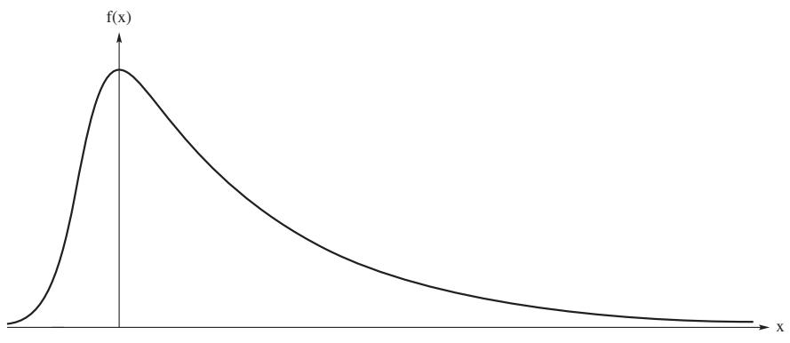  
Figure 7.9.1: Graph of a right skewed distribution; see also Exercise 7.9.14.

# EXERCISES

7.9.1. Let $Y_{1} < Y_{2} < Y_{3} < Y_{4}$ denote the order statistics of a random sample of size $n = 4$ from a distribution having pdf $f(x; \theta) = 1 / \theta$ , $0 < x < \theta$ , zero elsewhere, where $0 < \theta < \infty$ . Argue that the complete sufficient statistic $Y_{4}$ for $\theta$ is independent of each of the statistics $Y_{1} / Y_{4}$ and $(Y_{1} + Y_{2}) / (Y_{3} + Y_{4})$ .   
Hint: Show that the pdf is of the form $(1 / \theta)f(x / \theta)$ , where $f(w) = 1$ , $0 < w < 1$ , zero elsewhere.   
7.9.2. Let $Y_{1} < Y_{2} < \dots < Y_{n}$ be the order statistics of a random sample from a $N(\theta, \sigma^{2})$ , $-\infty < \theta < \infty$ , distribution. Show that the distribution of $Z = Y_{n} - \overline{X}$ does not depend upon $\theta$ . Thus $\overline{Y} = \sum_{1}^{n} Y_{i} / n$ , a complete sufficient statistic for $\theta$ is independent of $Z$ .   
7.9.3. Let $X_{1}, X_{2}, \ldots, X_{n}$ be iid with the distribution $N(\theta, \sigma^2)$ , $-\infty < \theta < \infty$ . Prove that a necessary and sufficient condition that the statistics $Z = \sum_{1}^{n} a_{i} X_{i}$ and $Y = \sum_{1}^{n} X_{i}$ , a complete sufficient statistic for $\theta$ , are independent is that $\sum_{1}^{n} a_{i} = 0$ .

7.9.4. Let $X$ and $Y$ be random variables such that $E(X^k)$ and $E(Y^k) \neq 0$ exist for $k = 1,2,3,\ldots$ . If the ratio $X / Y$ and its denominator $Y$ are independent, prove that $E[(X / Y)^k] = E(X^k) / E(Y^k), k = 1,2,3,\ldots$ .

Hint: Write $E(X^k) = E[Y^k (X / Y)^k]$ .

7.9.5. Let $Y_{1} < Y_{2} < \dots < Y_{n}$ be the order statistics of a random sample of size $n$ from a distribution that has pdf $f(x; \theta) = (1 / \theta)e^{-x / \theta}$ , $0 < x < \infty$ , $0 < \theta < \infty$ , zero elsewhere. Show that the ratio $R = nY_{1} / \sum_{1}^{n}Y_{i}$ and its denominator (a complete sufficient statistic for $\theta$ ) are independent. Use the result of the preceding exercise to determine $E(R^{k})$ , $k = 1, 2, 3, \ldots$ .

7.9.6. Let $X_1, X_2, \ldots, X_5$ be iid with pdf $f(x) = e^{-x}$ , $0 < x < \infty$ , zero elsewhere. Show that $(X_1 + X_2) / (X_1 + X_2 + \dots + X_5)$ and its denominator are independent. Hint: The pdf $f(x)$ is a member of $\{f(x; \theta) : 0 < \theta < \infty\}$ , where $f(x; \theta) = (1 / \theta)e^{-x / \theta}$ , $0 < x < \infty$ , zero elsewhere.

7.9.7. Let $Y_{1} < Y_{2} < \dots < Y_{n}$ be the order statistics of a random sample from the normal distribution $N(\theta_1, \theta_2), -\infty < \theta_1 < \infty, 0 < \theta_2 < \infty$ . Show that the joint complete sufficient statistics $\overline{X} = \overline{Y}$ and $S^2$ for $\theta_{1}$ and $\theta_{2}$ are independent of each of $(Y_{n} - \overline{Y}) / S$ and $(Y_{n} - Y_{1}) / S$ .

7.9.8. Let $Y_{1} < Y_{2} < \dots < Y_{n}$ be the order statistics of a random sample from a distribution with the pdf

$$
f (x; \theta_ {1}, \theta_ {2}) = \frac {1}{\theta_ {2}} \exp \left(- \frac {x - \theta_ {1}}{\theta_ {2}}\right),
$$

$\theta_{1} < x < \infty$ , zero elsewhere, where $-\infty < \theta_{1} < \infty$ , $0 < \theta_{2} < \infty$ . Show that the joint complete sufficient statistics $Y_{1}$ and $\overline{X} = \overline{Y}$ for the parameters $\theta_{1}$ and $\theta_{2}$ are independent of $(Y_{2} - Y_{1}) / \sum_{1}^{n}(Y_{i} - Y_{1})$ .

7.9.9. Let $X_{1}, X_{2}, \ldots, X_{5}$ be a random sample of size $n = 5$ from the normal distribution $N(0, \theta)$ .

(a) Argue that the ratio $R = (X_1^2 + X_2^2) / (X_1^2 + \dots + X_5^2)$ and its denominator $(X_1^2 + \dots + X_5^2)$ are independent.   
(b) Does $5R / 2$ have an $F$ -distribution with 2 and 5 degrees of freedom? Explain your answer.   
(c) Compute $E(R)$ using Exercise 7.9.4.

7.9.10. Referring to Example 7.9.5 of this section, determine $c$ so that

$$
P (- c <   T _ {1} - \theta <   c | T _ {2} = t _ {2}) = 0. 9 5.
$$

Use this result to find a $95\%$ confidence interval for $\theta$ , given $T_{2} = t_{2}$ ; and note how its length is smaller when the range of $t_{2}$ is larger.

7.9.11. Show that $Y = |X|$ is a complete sufficient statistic for $\theta > 0$ , where $X$ has the pdf $f_{X}(x; \theta) = 1 / (2\theta)$ , for $-\theta < x < \theta$ , zero elsewhere. Show that $Y = |X|$ and $Z = \operatorname{sgn}(X)$ are independent.

7.9.12. Let $Y_{1} < Y_{2} < \dots < Y_{n}$ be the order statistics of a random sample from a $N(\theta, \sigma^2)$ distribution, where $\sigma^2$ is fixed but arbitrary. Then $\overline{Y} = \overline{X}$ is a complete sufficient statistic for $\theta$ . Consider another estimator $T$ of $\theta$ , such as $T = (Y_{i} + Y_{n+1-i}) / 2$ , for $i = 1, 2, \ldots, [n/2]$ , or $T$ could be any weighted average of these latter statistics.

(a) Argue that $T - \overline{X}$ and $\overline{X}$ are independent random variables.   
(b) Show that $\operatorname{Var}(T) = \operatorname{Var}(\overline{X}) + \operatorname{Var}(T - \overline{X})$ .   
(c) Since we know $\operatorname{Var}(\overline{X}) = \sigma^2 / n$ , it might be more efficient to estimate $\operatorname{Var}(T)$ by estimating the $\operatorname{Var}(T - \overline{X})$ by Monte Carlo methods rather than doing that with $\operatorname{Var}(T)$ directly, because $\operatorname{Var}(T) \geq \operatorname{Var}(T - \overline{X})$ . This is often called the Monte Carlo Swindle.

7.9.13. Suppose $X_{1}, X_{2}, \ldots, X_{n}$ is a random sample from a distribution with pdf $f(x; \theta) = (1/2)\theta^{3}x^{2}e^{-\theta x}$ , $0 < x < \infty$ , zero elsewhere, where $0 < \theta < \infty$ :

(a) Find the mle, $\hat{\theta}$ , of $\theta$ . Is $\hat{\theta}$ unbiased?   
Hint: Find the pdf of $Y = \sum_{1}^{n}X_{i}$ and then compute $E(\hat{\theta})$ .   
(b) Argue that $Y$ is a complete sufficient statistic for $\theta$ .   
(c) Find the MVUE of $\theta$   
(d) Show that $X_{1} / Y$ and $Y$ are independent.   
(e) What is the distribution of $X_{1} / Y$ ?

7.9.14. The pdf depicted in Figure 7.9.1 is given by

$$
f _ {m _ {2}} (x) = e ^ {- x} \left(1 + m _ {2} ^ {- 1} e ^ {- x}\right) ^ {- (m _ {2} + 1)}, - \infty <   x <   \infty , \tag {7.9.2}
$$

where $m_2 > 0$ (the pdf graphed is for $m_2 = 0.1$ ). This is a member of a large family of pdfs, $\log F$ -family, which are useful in survival (lifetime) analysis; see Chapter 3 of Hettmansperger and McKean (2011).

(a) Let $W$ be a random variable with pdf (7.9.2). Show that $W = \log Y$ , where $Y$ has an $F$ -distribution with 2 and $2m_2$ degrees of freedom.   
(b) Show that the pdf becomes the logistic (6.1.8) if $m_2 = 1$   
(c) Consider the location model where

$$
X _ {i} = \theta + W _ {i} \quad i = 1, \ldots , n,
$$

where $W_{1},\ldots ,W_{n}$ are iid with pdf (7.9.2). Similar to the logistic location model, the order statistics are minimal sufficient for this model. Show, similar to Example 6.1.2, that the mle of $\theta$ exists.

This page intentionally left blank

# Chapter 8

# Optimal Tests of Hypotheses

# 8.1 Most Powerful Tests

In Section 4.5, we introduced the concept of hypotheses testing and followed it with the introduction of likelihood ratio tests in Chapter 6. In this chapter, we discuss certain best tests.

For convenience to the reader, in the next several paragraphs we quickly review concepts of testing that were presented in Section 4.5. We are interested in a random variable $X$ that has pdf or pmf $f(x; \theta)$ , where $\theta \in \Omega$ . We assume that $\theta \in \omega_0$ or $\theta \in \omega_1$ , where $\omega_0$ and $\omega_1$ are disjoint subsets of $\Omega$ and $\omega_0 \cup \omega_1 = \Omega$ . We label the hypotheses as

$$
H _ {0}: \theta \in \omega_ {0} \text {v e r s u s} H _ {1}: \theta \in \omega_ {1}. \tag {8.1.1}
$$

The hypothesis $H_0$ is referred to as the null hypothesis, while $H_1$ is referred to as the alternative hypothesis. The test of $H_0$ versus $H_1$ is based on a sample $X_1, \ldots, X_n$ from the distribution of $X$ . In this chapter, we often use the vector $\mathbf{X}' = (X_1, \ldots, X_n)$ to denote the random sample and $\mathbf{x}' = (x_1, \ldots, x_n)$ to denote the values of the sample. Let $S$ denote the support of the random sample $\mathbf{X}' = (X_1, \ldots, X_n)$ .

A test of $H_0$ versus $H_1$ is based on a subset $C$ of $\mathcal{S}$ . This set $C$ is called the critical region and its corresponding decision rule is

$$
\operatorname {R e j e c t} H _ {0} (\text {A c c e p t} H _ {1}) \quad \text {i f} \mathbf {X} \in C \tag {8.1.2}
$$

$$
\text {R e t a i n} H _ {0} (\text {R e j e c t} H _ {1}) \quad \text {i f} \mathbf {X} \in C ^ {c}.
$$

Note that a test is defined by its critical region. Conversely, a critical region defines a test.

Recall that the $2 \times 2$ decision table, Table 4.5.1, summarizes the results of the hypothesis test in terms of the true state of nature. Besides the correct decisions, two errors can occur. A Type I error occurs if $H_0$ is rejected when it is true, while a Type II error occurs if $H_0$ is accepted when $H_1$ is true. The size or significance

level of the test is the probability of a Type I error; i.e.,

$$
\alpha = \max  _ {\theta \in \omega_ {0}} P _ {\theta} (\mathbf {X} \in C). \tag {8.1.3}
$$

Note that $P_{\theta}(\mathbf{X} \in C)$ should be read as the probability that $\mathbf{X} \in C$ when $\theta$ is the true parameter. Subject to tests having size $\alpha$ , we select tests that minimize Type II error or equivalently maximize the probability of rejecting $H_0$ when $\theta \in \omega_1$ . Recall that the power function of a test is given by

$$
\gamma_ {C} (\theta) = P _ {\theta} (\mathbf {X} \in C); \quad \theta \in \omega_ {1}. \tag {8.1.4}
$$

In Chapter 4, we gave examples of tests of hypotheses, while in Sections 6.3 and 6.4, we discussed tests based on maximum likelihood theory. In this chapter, we want to construct best tests for certain situations.

We begin with testing a simple hypothesis $H_0$ against a simple alternative $H_1$ . Let $f(x; \theta)$ denote the pdf or pmf of a random variable $X$ , where $\theta \in \Omega = \{\theta', \theta''\}$ . Let $\omega_0 = \{\theta'\}$ and $\omega_1 = \{\theta''\}$ . Let $\mathbf{X}' = (X_1, \ldots, X_n)$ be a random sample from the distribution of $X$ . We now define a best critical region (and hence a best test) for testing the simple hypothesis $H_0$ against the alternative simple hypothesis $H_1$ .

Definition 8.1.1. Let $C$ denote a subset of the sample space. Then we say that $C$ is a best critical region of size $\alpha$ for testing the simple hypothesis $H_0: \theta = \theta'$ against the alternative simple hypothesis $H_1: \theta = \theta''$ if

(a) $P_{\theta^{\prime}}[\mathbf{X}\in C] = \alpha$

(b) And for every subset $A$ of the sample space,

$$
P _ {\theta^ {\prime}} [ \mathbf {X} \in A ] = \alpha \Rightarrow P _ {\theta^ {\prime \prime}} [ \mathbf {X} \in C ] \geq P _ {\theta^ {\prime \prime}} [ \mathbf {X} \in A ].
$$

This definition states, in effect, the following: In general, there is a multiplicity of subsets $A$ of the sample space such that $P_{\theta^{\prime}}[\mathbf{X} \in A] = \alpha$ . Suppose that there is one of these subsets, say $C$ , such that when $H_{1}$ is true, the power of the test associated with $C$ is at least as great as the power of the test associated with every other $A$ . Then $C$ is defined as a best critical region of size $\alpha$ for testing $H_{0}$ against $H_{1}$ .

As Theorem 8.1.1 shows, there is a best test for this simple versus simple case. But first, we offer a simple example examining this definition in some detail.

Example 8.1.1. Consider the one random variable $X$ that has a binomial distribution with $n = 5$ and $p = \theta$ . Let $f(x; \theta)$ denote the pmf of $X$ and let $H_0: \theta = \frac{1}{2}$ and $H_1: \theta = \frac{3}{4}$ . The following tabulation gives, at points of positive probability density, the values of $f(x; \frac{1}{2})$ , $f(x; \frac{3}{4})$ , and the ratio $f(x; \frac{1}{2}) / f(x; \frac{3}{4})$ .

<table><tr><td>x</td><td>0</td><td>1</td><td>2</td></tr><tr><td>f(x; 1/2)</td><td>1/32</td><td>5/32</td><td>10/32</td></tr><tr><td>f(x; 3/4)</td><td>1/1024</td><td>15/1024</td><td>90/1024</td></tr><tr><td>f(x; 1/2)/f(x; 3/4)</td><td>32/1</td><td>32/3</td><td>32/9</td></tr><tr><td>x</td><td>3</td><td>4</td><td>5</td></tr><tr><td>f(x; 1/2)</td><td>10/32</td><td>5/32</td><td>1/32</td></tr><tr><td>f(x; 3/4)</td><td>270/1024</td><td>405/1024</td><td>243/1024</td></tr><tr><td>f(x; 1/2)/f(x; 3/4)</td><td>32/27</td><td>32/81</td><td>32/243</td></tr></table>

We shall use one random value of $X$ to test the simple hypothesis $H_0: \theta = \frac{1}{2}$ against the alternative simple hypothesis $H_1: \theta = \frac{3}{4}$ , and we shall first assign the significance level of the test to be $\alpha = \frac{1}{32}$ . We seek a best critical region of size $\alpha = \frac{1}{32}$ . If $A_1 = \{x : x = 0\}$ or $A_2 = \{x : x = 5\}$ , then $P_{\{\theta = 1/2\}}(X \in A_1) = P_{\{\theta = 1/2\}}(X \in A_2) = \frac{1}{32}$ and there is no other subset $A_3$ of the space $\{x : x = 0, 1, 2, 3, 4, 5\}$ such that $P_{\{\theta = 1/2\}}(X \in A_3) = \frac{1}{32}$ . Then either $A_1$ or $A_2$ is the best critical region $C$ of size $\alpha = \frac{1}{32}$ for testing $H_0$ against $H_1$ . We note that $P_{\{\theta = 1/2\}}(X \in A_1) = \frac{1}{32}$ and $P_{\{\theta = 3/4\}}(X \in A_1) = \frac{1}{1024}$ . Thus, if the set $A_1$ is used as a critical region of size $\alpha = \frac{1}{32}$ , we have the intolerable situation that the probability of rejecting $H_0$ when $H_1$ is true ( $H_0$ is false) is much less than the probability of rejecting $H_0$ when $H_0$ is true.

On the other hand, if the set $A_{2}$ is used as a critical region, then $P_{\{\theta = 1 / 2\}}(X \in A_2) = \frac{1}{32}$ and $P_{\{\theta = 3 / 4\}}(X \in A_2) = \frac{243}{1024}$ . That is, the probability of rejecting $H_{0}$ when $H_{1}$ is true is much greater than the probability of rejecting $H_{0}$ when $H_{0}$ is true. Certainly, this is a more desirable state of affairs, and actually $A_{2}$ is the best critical region of size $\alpha = \frac{1}{32}$ . The latter statement follows from the fact that when $H_{0}$ is true, there are but two subsets, $A_{1}$ and $A_{2}$ , of the sample space, each of whose probability measure is $\frac{1}{32}$ and the fact that

$$
\frac {2 4 3}{1 0 2 4} = P _ {\{\theta = 3 / 4 \}} (X \in A _ {2}) > P _ {\{\theta = 3 / 4 \}} (X \in A _ {1}) = \frac {1}{1 0 2 4}.
$$

It should be noted in this problem that the best critical region $C = A_{2}$ of size $\alpha = \frac{1}{32}$ is found by including in $C$ the point (or points) at which $f(x; \frac{1}{2})$ is small in comparison with $f(x; \frac{3}{4})$ . This is seen to be true once it is observed that the ratio $f(x; \frac{1}{2}) / f(x; \frac{3}{4})$ is a minimum at $x = 5$ . Accordingly, the ratio $f(x; \frac{1}{2}) / f(x; \frac{3}{4})$ , that is given in the last line of the above tabulation, provides us with a precise tool by which to find a best critical region $C$ for certain given values of $\alpha$ . To illustrate this, take $\alpha = \frac{6}{32}$ . When $H_{0}$ is true, each of the subsets $\{x : x = 0, 1\}$ , $\{x : x = 0, 4\}$ , $\{x : x = 1, 5\}$ , $\{x : x = 4, 5\}$ has probability measure $\frac{6}{32}$ . By direct computation it is found that the best critical region of this size is $\{x : x = 4, 5\}$ . This reflects the fact that the ratio $f(x; \frac{1}{2}) / f(x; \frac{3}{4})$ has its two smallest values for $x = 4$ and $x = 5$ . The power of this test, which has $\alpha = \frac{6}{32}$ , is

$$
P _ {\{\theta = 3 / 4 \}} (X = 4, 5) = \frac {4 0 5}{1 0 2 4} + \frac {2 4 3}{1 0 2 4} = \frac {6 4 8}{1 0 2 4}.
$$

The preceding example should make the following theorem, due to Neyman and Pearson, easier to understand. It is an important theorem because it provides a systematic method of determining a best critical region.

Theorem 8.1.1. Neyman-Pearson Theorem. Let $X_{1}, X_{2}, \ldots, X_{n}$ , where $n$ is a fixed positive integer, denote a random sample from a distribution that has pdf or pmf $f(x; \theta)$ . Then the likelihood of $X_{1}, X_{2}, \ldots, X_{n}$ is

$$
L (\theta ; \mathbf {x}) = \prod_ {i = 1} ^ {n} f (x _ {i}; \theta), \quad f o r \mathbf {x} ^ {\prime} = (x _ {1}, \dots , x _ {n}).
$$

Let $\theta'$ and $\theta''$ be distinct fixed values of $\theta$ so that $\Omega = \{\theta : \theta = \theta', \theta''\}$ , and let $k$ be a positive number. Let $C$ be a subset of the sample space such that

(a) $\frac{L(\theta';\mathbf{x})}{L(\theta'';\mathbf{x})}\leq k$ , for each point $\mathbf{x}\in C$   
(b) $\frac{L(\theta';\mathbf{x})}{L(\theta'';\mathbf{x})}\geq k,$ for each point $\mathbf{x}\in C^c$   
(c) $\alpha = P_{H_0}[\mathbf{X}\in C]$

Then $C$ is a best critical region of size $\alpha$ for testing the simple hypothesis $H_0: \theta = \theta'$ against the alternative simple hypothesis $H_1: \theta = \theta''$ .

Proof: We shall give the proof when the random variables are of the continuous type. If $C$ is the only critical region of size $\alpha$ , the theorem is proved. If there is another critical region of size $\alpha$ , denote it by $A$ . For convenience, we shall let $\int_{R} \dots \int_{R} L(\theta; x_1, \ldots, x_n) dx_1 \dots dx_n$ be denoted by $\int_{R} L(\theta)$ . In this notation we wish to show that

$$
\int_ {C} L (\theta^ {\prime \prime}) - \int_ {A} L (\theta^ {\prime \prime}) \geq 0.
$$

Since $C$ is the union of the disjoint sets $C \cap A$ and $C \cap A^c$ and $A$ is the union of the disjoint sets $A \cap C$ and $A \cap C^c$ , we have

$$
\begin{array}{l} \int_ {C} L \left(\theta^ {\prime \prime}\right) - \int_ {A} L \left(\theta^ {\prime \prime}\right) = \int_ {C \cap A} L \left(\theta^ {\prime \prime}\right) + \int_ {C \cap A ^ {c}} L \left(\theta^ {\prime \prime}\right) - \int_ {A \cap C} L \left(\theta^ {\prime \prime}\right) - \int_ {A \cap C ^ {c}} L \left(\theta^ {\prime \prime}\right) \\ = \int_ {C \cap A ^ {c}} L \left(\theta^ {\prime \prime}\right) - \int_ {A \cap C ^ {c}} L \left(\theta^ {\prime \prime}\right). \tag {8.1.5} \\ \end{array}
$$

However, by the hypothesis of the theorem, $L(\theta^{\prime \prime}) \geq (1 / k)L(\theta^{\prime})$ at each point of $C$ , and hence at each point of $C \cap A^{c}$ ; thus,

$$
\int_ {C \cap A ^ {c}} L \left(\theta^ {\prime \prime}\right) \geq \frac {1}{k} \int_ {C \cap A ^ {c}} L \left(\theta^ {\prime}\right).
$$

But $L(\theta'') \leq (1/k)L(\theta')$ at each point of $C^c$ , and hence at each point of $A \cap C^c$ ; accordingly,

$$
\int_ {A \cap C ^ {c}} L \left(\theta^ {\prime \prime}\right) \leq \frac {1}{k} \int_ {A \cap C ^ {c}} L \left(\theta^ {\prime}\right).
$$

These inequalities imply that

$$
\int_ {C \cap A ^ {c}} L (\theta^ {\prime \prime}) - \int_ {A \cap C ^ {c}} L (\theta^ {\prime \prime}) \geq \frac {1}{k} \int_ {C \cap A ^ {c}} L (\theta^ {\prime}) - \frac {1}{k} \int_ {A \cap C ^ {c}} L (\theta^ {\prime});
$$

and, from Equation (8.1.5), we obtain

$$
\int_ {C} L \left(\theta^ {\prime \prime}\right) - \int_ {A} L \left(\theta^ {\prime \prime}\right) \geq \frac {1}{k} \left[ \int_ {C \cap A ^ {c}} L \left(\theta^ {\prime}\right) - \int_ {A \cap C ^ {c}} L \left(\theta^ {\prime}\right) \right]. \tag {8.1.6}
$$

However,

$$
\begin{array}{l} \int_ {C \cap A ^ {c}} L \left(\theta^ {\prime}\right) - \int_ {A \cap C ^ {c}} L \left(\theta^ {\prime}\right) = \int_ {C \cap A ^ {c}} L \left(\theta^ {\prime}\right) + \int_ {C \cap A} L \left(\theta^ {\prime}\right) \\ - \int_ {A \cap C} L \left(\theta^ {\prime}\right) - \int_ {A \cap C ^ {c}} L \left(\theta^ {\prime}\right) \\ = \int_ {C} L \left(\theta^ {\prime}\right) - \int_ {A} L \left(\theta^ {\prime}\right) = \alpha - \alpha = 0. \\ \end{array}
$$

If this result is substituted in inequality (8.1.6), we obtain the desired result,

$$
\int_ {C} L \left(\theta^ {\prime \prime}\right) - \int_ {A} L \left(\theta^ {\prime \prime}\right) \geq 0.
$$

If the random variables are of the discrete type, the proof is the same with integration replaced by summation.

Remark 8.1.1. As stated in the theorem, conditions (a), (b), and (c) are sufficient ones for region $C$ to be a best critical region of size $\alpha$ . However, they are also necessary. We discuss this briefly. Suppose there is a region $A$ of size $\alpha$ that does not satisfy (a) and (b) and that is as powerful at $\theta = \theta''$ as $C$ , which satisfies (a), (b), and (c). Then expression (8.1.5) would be zero, since the power at $\theta''$ using $A$ is equal to that using $C$ . It can be proved that to have expression (8.1.5) equal zero, $A$ must be of the same form as $C$ . As a matter of fact, in the continuous case, $A$ and $C$ would essentially be the same region; that is, they could differ only by a set having probability zero. However, in the discrete case, if $P_{H_0}[L(\theta') = kL(\theta'')]$ is positive, $A$ and $C$ could be different sets, but each would necessarily enjoy conditions (a), (b), and (c) to be a best critical region of size $\alpha$ .

It would seem that a test should have the property that its power should never fall below its significance level; otherwise, the probability of falsely rejecting $H_0$ (level) is higher than the probability of correctly rejecting $H_0$ (power). We say a test having this property is unbiased, which we now formally define:

Definition 8.1.2. Let $X$ be a random variable which has pdf or pmf $f(x; \theta)$ , where $\theta \in \Omega$ . Consider the hypotheses given in expression (8.1.1). Let $\mathbf{X}' = (X_1, \ldots, X_n)$ denote a random sample on $X$ . Consider a test with critical region $C$ and level $\alpha$ . We say that this test is unbiased if

$$
P _ {\theta} (\mathbf {X} \in C) \geq \alpha ,
$$

for all $\theta \in \omega_1$ .

As the next corollary shows, the best test given in Theorem 8.1.1 is an unbiased test.

Corollary 8.1.1. As in Theorem 8.1.1, let $C$ be the critical region of the best test of $H_0: \theta = \theta'$ versus $H_1: \theta = \theta''$ . Suppose the significance level of the test is $\alpha$ . Let $\gamma_C(\theta'') = P_{\theta''}[\mathbf{X} \in C]$ denote the power of the test. Then $\alpha \leq \gamma_C(\theta'')$ .

Proof: Consider the "unreasonable" test in which the data are ignored, but a Bernoulli trial is performed which has probability $\alpha$ of success. If the trial ends in success, we reject $H_0$ . The level of this test is $\alpha$ . Because the power of a test is the probability of rejecting $H_0$ when $H_1$ is true, the power of this unreasonable test is $\alpha$ also. But $C$ is the best critical region of size $\alpha$ and thus has power greater than or equal to the power of the unreasonable test. That is, $\gamma_C(\theta'') \geq \alpha$ , which is the desired result.

Another aspect of Theorem 8.1.1 to be emphasized is that if we take $C$ to be the set of all points $\mathbf{x}$ which satisfy

$$
\frac {L \left(\theta^ {\prime} ; \mathbf {x}\right)}{L \left(\theta^ {\prime \prime} ; \mathbf {x}\right)} \leq k, \quad k > 0,
$$

then, in accordance with the theorem, $C$ is a best critical region. This inequality can frequently be expressed in one of the forms (where $c_{1}$ and $c_{2}$ are constants)

$$
u _ {1} (\mathbf {x}; \theta^ {\prime}, \theta^ {\prime \prime}) \leq c _ {1}
$$

or

$$
u _ {2} (\mathbf {x}; \theta^ {\prime}, \theta^ {\prime \prime}) \geq c _ {2}.
$$

Suppose that it is the first form, $u_{1} \leq c_{1}$ . Since $\theta'$ and $\theta''$ are given constants, $u_{1}(\mathbf{X};\theta',\theta'')$ is a statistic; and if the pdf or pmf of this statistic can be found when $H_{0}$ is true, then the significance level of the test of $H_{0}$ against $H_{1}$ can be determined from this distribution. That is,

$$
\alpha = P _ {H _ {0}} \left[ u _ {1} (\mathbf {X}; \theta^ {\prime}, \theta^ {\prime \prime}) \leq c _ {1} \right].
$$

Moreover, the test may be based on this statistic; for if the observed vector value of $\mathbf{X}$ is $\mathbf{x}$ , we reject $H_0$ (accept $H_1$ ) if $u_1(\mathbf{x}) \leq c_1$ .

A positive number $k$ determines a best critical region $C$ whose size is $\alpha = P_{H_0}[\mathbf{X} \in C]$ for that particular $k$ . It may be that this value of $\alpha$ is unsuitable for the purpose at hand; that is, it is too large or too small. However, if there is a statistic $u_1(\mathbf{X})$ as in the preceding paragraph, whose pdf or pmf can be determined when $H_0$ is true, we need not experiment with various values of $k$ to obtain a desirable significance level. For if the distribution of the statistic is known, or can be found, we may determine $c_1$ such that $P_{H_0}[u_1(\mathbf{X}) \leq c_1]$ is a desirable significance level.

An illustrative example follows.

Example 8.1.2. Let $\mathbf{X}' = (X_1, \ldots, X_n)$ denote a random sample from the distribution that has the pdf

$$
f (x; \theta) = \frac {1}{\sqrt {2 \pi}} \exp \left(- \frac {(x - \theta) ^ {2}}{2}\right), \quad - \infty <   x <   \infty .
$$

It is desired to test the simple hypothesis $H_0: \theta = \theta' = 0$ against the alternative simple hypothesis $H_1: \theta = \theta'' = 1$ . Now

$$
\begin{array}{l} \frac {L (\theta^ {\prime} ; \mathbf {x})}{L (\theta^ {\prime \prime} ; \mathbf {x})} = \frac {(1 / \sqrt {2 \pi}) ^ {n} \exp \left[ - \sum_ {1} ^ {n} x _ {i} ^ {2} / 2 \right]}{(1 / \sqrt {2 \pi}) ^ {n} \exp \left[ - \sum_ {1} ^ {n} (x _ {i} - 1) ^ {2} / 2 \right]} \\ = \exp \left(- \sum_ {1} ^ {n} x _ {i} + \frac {n}{2}\right). \\ \end{array}
$$

If $k > 0$ , the set of all points $(x_{1}, x_{2}, \ldots, x_{n})$ such that

$$
\exp \left(- \sum_ {1} ^ {n} x _ {i} + \frac {n}{2}\right) \leq k
$$

is a best critical region. This inequality holds if and only if

$$
- \sum_ {1} ^ {n} x _ {i} + \frac {n}{2} \leq \log k
$$

or, equivalently,

$$
\sum_ {1} ^ {n} x _ {i} \geq \frac {n}{2} - \log k = c.
$$

In this case, a best critical region is the set $C = \{(x_1, x_2, \ldots, x_n) : \sum_{1}^{n} x_i \geq c\}$ , where $c$ is a constant that can be determined so that the size of the critical region is a desired number $\alpha$ . The event $\sum_{1}^{n} X_i \geq c$ is equivalent to the event $\overline{X} \geq c / n = c_1$ , for example, so the test may be based upon the statistic $\overline{X}$ . If $H_0$ is true, that is, $\theta = \theta' = 0$ , then $\overline{X}$ has a distribution that is $N(0, 1 / n)$ . Given the significance level $\alpha$ , the number $c_1$ is computed in $R$ as $c_1 = \mathbf{qnorm}(1 - \alpha, 0, 1 / \sqrt{n})$ ; hence, $P_{H_0}(\overline{X} \geq c_1) = \alpha$ . So, if the experimental values of $X_1, X_2, \ldots, X_n$ were, respectively, $x_1, x_2, \ldots, x_n$ , we would compute $\overline{x} = \sum_{1}^{n} x_i / n$ . If $\overline{x} \geq c_1$ , the simple hypothesis $H_0: \theta = \theta' = 0$ would be rejected at the significance level $\alpha$ ; if $\overline{x} < c_1$ , the hypothesis $H_0$ would be accepted. The probability of rejecting $H_0$ when $H_0$ is true is $\alpha$ the level of significance. The probability of rejecting $H_0$ , when $H_0$ is false, is the value of the power of the test at $\theta = \theta'' = 1$ , which is,

$$
P _ {H _ {1}} (\bar {X} \geq c _ {1}) = \int_ {c _ {1}} ^ {\infty} \frac {1}{\sqrt {2 \pi} \sqrt {1 / n}} \exp \left[ - \frac {(\bar {x} - 1) ^ {2}}{2 (1 / n)} \right] d \bar {x}. \tag {8.1.7}
$$

For example, if $n = 25$ and $\alpha$ is $0.05$ , $c_{1} = \mathrm{qnorm}(0.95, 0, 1/5) = 0.329$ , using R. Hence, the power of the test to detect $\theta = 1$ , given in expression (8.1.7), is computed by $1 - \mathrm{pnorm}(0.329, 1, 1/5) = 0.9996$ .

There is another aspect of this theorem that warrants special mention. It has to do with the number of parameters that appear in the pdf. Our notation suggests that there is but one parameter. However, a careful review of the proof reveals that nowhere was this needed or assumed. The pdf or pmf may depend upon any finite number of parameters. What is essential is that the hypothesis $H_0$ and the alternative hypothesis $H_1$ be simple, namely, that they completely specify the distributions. With this in mind, we see that the simple hypotheses $H_0$ and $H_1$ do not need to be hypotheses about the parameters of a distribution, nor, as a matter of fact, do the random variables $X_1, X_2, \ldots, X_n$ need to be independent. That is, if $H_0$ is the simple hypothesis that the joint pdf or pmf is $g(x_1, x_2, \ldots, x_n)$ , and if $H_1$ is the alternative simple hypothesis that the joint pdf or pmf is $h(x_1, x_2, \ldots, x_n)$ , then $C$ is a best critical region of size $\alpha$ for testing $H_0$ against $H_1$ if, for $k > 0$ ,

1. $\frac{g(x_1, x_2, \ldots, x_n)}{h(x_1, x_2, \ldots, x_n)} \leq k$ for $(x_1, x_2, \ldots, x_n) \in C$ .   
2. $\frac{g(x_1, x_2, \ldots, x_n)}{h(x_1, x_2, \ldots, x_n)} \geq k$ for $(x_1, x_2, \ldots, x_n) \in C^c$ .   
3. $\alpha = P_{H_0}[(X_1, X_2, \ldots, X_n) \in C]$ .

Consider the following example.

Example 8.1.3. Let $X_1, \ldots, X_n$ denote a random sample on $X$ that has pmf $f(x)$ with support $\{0, 1, 2, \ldots\}$ . It is desired to test the simple hypothesis

$$
H _ {0}: f (x) = \left\{ \begin{array}{l l} \frac {e ^ {- 1}}{x !} & x = 0, 1, 2, \ldots \\ 0 & \text {e l s e w h e r e ,} \end{array} \right.
$$

against the alternative simple hypothesis

$$
H _ {1}: f (x) = \left\{ \begin{array}{l l} (\frac {1}{2}) ^ {x + 1} & x = 0, 1, 2, \ldots \\ 0 & \text {e l s e w h e r e .} \end{array} \right.
$$

That is, we want to test whether $X$ has a Poisson distribution with mean $\lambda = 1$ versus $X$ has a geometric distribution with $p = 1/2$ . Here

$$
\begin{array}{l} \frac {g \left(x _ {1} , \dots , x _ {n}\right)}{h \left(x _ {1} , \dots , x _ {n}\right)} = \frac {e ^ {- n} / \left(x _ {1} ! x _ {2} ! \cdots x _ {n}!\right)}{\left(\frac {1}{2}\right) ^ {n} \left(\frac {1}{2}\right) ^ {x _ {1} + x _ {2} + \cdots + x _ {n}}} \\ = \frac {(2 e ^ {- 1}) ^ {n} 2 ^ {\sum x _ {i}}}{\prod_ {1} ^ {n} (x _ {i} !)}. \\ \end{array}
$$

If $k > 0$ , the set of points $(x_{1}, x_{2}, \ldots, x_{n})$ such that

$$
\left(\sum_ {1} ^ {n} x _ {i}\right) \log 2 - \log \left[ \prod_ {1} ^ {n} (x _ {i}!) \right] \leq \log k - n \log (2 e ^ {- 1}) = c
$$

is a best critical region $C$ . Consider the case of $k = 1$ and $n = 1$ . The preceding inequality may be written $2^{x_1} / x_1! \leq e / 2$ . This inequality is satisfied by all points in the set $C = \{x_1 : x_1 = 0, 3, 4, 5, \ldots\}$ . Using R, the level of significance is

$$
P _ {H _ {0}} \left(X _ {1} \in C\right) = 1 - P _ {H _ {0}} \left(X _ {1} = 1, 2\right) = 1 - \mathbf {d p o i s} (1, 1) - \mathbf {d p o i s} (2, 1) = 0. 4 4 8 2.
$$

The power of the test to detect $H_{1}$ is computed as

$$
P _ {H _ {1}} (X _ {1} \in C) = 1 - P _ {H _ {1}} (X _ {1} = 1, 2) = 1 - (\frac {1}{4} + \frac {1}{8}) = 0. 6 2 5.
$$

Note that these results are consistent with Corollary 8.1.1.

Remark 8.1.2. In the notation of this section, say $C$ is a critical region such that

$$
\alpha = \int_ {C} L (\theta^ {\prime}) \quad \mathrm {a n d} \quad \beta = \int_ {C ^ {c}} L (\theta^ {\prime \prime}),
$$

where $\alpha$ and $\beta$ equal the respective probabilities of the Type I and Type II errors associated with $C$ . Let $d_{1}$ and $d_{2}$ be two given positive constants. Consider a certain linear function of $\alpha$ and $\beta$ , namely,

$$
\begin{array}{l} d _ {1} \int_ {C} L \left(\theta^ {\prime}\right) + d _ {2} \int_ {C ^ {c}} L \left(\theta^ {\prime \prime}\right) = d _ {1} \int_ {C} L \left(\theta^ {\prime}\right) + d _ {2} \left[ 1 - \int_ {C} L \left(\theta^ {\prime \prime}\right) \right] \\ = d _ {2} + \int_ {C} \left[ d _ {1} L \left(\theta^ {\prime}\right) - d _ {2} L \left(\theta^ {\prime \prime}\right) \right]. \\ \end{array}
$$

If we wished to minimize this expression, we would select $C$ to be the set of all $(x_{1}, x_{2}, \ldots, x_{n})$ such that

$$
d _ {1} L \left(\theta^ {\prime}\right) - d _ {2} L \left(\theta^ {\prime \prime}\right) <   0
$$

or, equivalently,

$$
\frac {L \left(\theta^ {\prime}\right)}{L \left(\theta^ {\prime \prime}\right)} <   \frac {d _ {2}}{d _ {1}}, \quad \text {f o r a l l} (x _ {1}, x _ {2}, \ldots , x _ {n}) \in C,
$$

which according to the Neyman-Pearson theorem provides a best critical region with $k = d_2 / d_1$ . That is, this critical region $C$ is one that minimizes $d_1\alpha + d_2\beta$ . There could be others, including points on which $L(\theta') / L(\theta'') = d_2 / d_1$ , but these would still be best critical regions according to the Neyman-Pearson theorem.

# EXERCISES

8.1.1. In Example 8.1.2 of this section, let the simple hypotheses read $H_0: \theta = \theta' = 0$ and $H_1: \theta = \theta'' = -1$ . Show that the best test of $H_0$ against $H_1$ may be carried out by use of the statistic $\overline{X}$ , and that if $n = 25$ and $\alpha = 0.05$ , the power of the test is 0.9996 when $H_1$ is true.

8.1.2. Let the random variable $X$ have the pdf $f(x; \theta) = (1 / \theta)e^{-x / \theta}$ , $0 < x < \infty$ , zero elsewhere. Consider the simple hypothesis $H_0: \theta = \theta' = 2$ and the alternative hypothesis $H_1: \theta = \theta'' = 4$ . Let $X_1, X_2$ denote a random sample of size 2 from this distribution. Show that the best test of $H_0$ against $H_1$ may be carried out by use of the statistic $X_1 + X_2$ .

8.1.3. Repeat Exercise 8.1.2 when $H_{1}:\theta = \theta^{\prime \prime} = 6$ . Generalize this for every $\theta^{\prime \prime} > 2$ .

8.1.4. Let $X_{1}, X_{2}, \ldots, X_{10}$ be a random sample of size 10 from a normal distribution $N(0, \sigma^2)$ . Find a best critical region of size $\alpha = 0.05$ for testing $H_0: \sigma^2 = 1$ against $H_{1}: \sigma^{2} = 2$ . Is this a best critical region of size 0.05 for testing $H_0: \sigma^2 = 1$ against $H_{1}: \sigma^{2} = 4$ ? Against $H_{1}: \sigma^{2} = \sigma_{1}^{2} > 1$ ?

8.1.5. If $X_{1}, X_{2}, \ldots, X_{n}$ is a random sample from a distribution having pdf of the form $f(x; \theta) = \theta x^{\theta - 1}$ , $0 < x < 1$ , zero elsewhere, show that a best critical region for testing $H_{0}: \theta = 1$ against $H_{1}: \theta = 2$ is $C = \{(x_{1}, x_{2}, \ldots, x_{n}) : c \leq \prod_{i=1}^{n} x_{i}\}$ .

8.1.6. Let $X_{1}, X_{2}, \ldots, X_{10}$ be a random sample from a distribution that is $N(\theta_{1}, \theta_{2})$ . Find a best test of the simple hypothesis $H_{0}: \theta_{1} = \theta_{1}' = 0$ , $\theta_{2} = \theta_{2}' = 1$ against the alternative simple hypothesis $H_{1}: \theta_{1} = \theta_{1}' = 1$ , $\theta_{2} = \theta_{2}' = 4$ .

8.1.7. Let $X_{1}, X_{2}, \ldots, X_{n}$ denote a random sample from a normal distribution $N(\theta, 100)$ . Show that $C = \{(x_{1}, x_{2}, \ldots, x_{n}) : c \leq \overline{x} = \sum_{1}^{n} x_{i} / n\}$ is a best critical region for testing $H_{0} : \theta = 75$ against $H_{1} : \theta = 78$ . Find $n$ and $c$ so that

$$
P _ {H _ {0}} \left[ \left(X _ {1}, X _ {2}, \dots , X _ {n}\right) \in C \right] = P _ {H _ {0}} (\bar {X} \geq c) = 0. 0 5
$$

and

$$
P _ {H _ {1}} \left[ \left(X _ {1}, X _ {2}, \dots , X _ {n}\right) \in C \right] = P _ {H _ {1}} (\bar {X} \geq c) = 0. 9 0,
$$

approximately.

8.1.8. If $X_{1}, X_{2}, \ldots, X_{n}$ is a random sample from a beta distribution with parameters $\alpha = \beta = \theta > 0$ , find a best critical region for testing $H_{0}: \theta = 1$ against $H_{1}: \theta = 2$ .

8.1.9. Let $X_{1}, X_{2}, \ldots, X_{n}$ be iid with pmf $f(x; p) = p^{x}(1 - p)^{1 - x}$ , $x = 0, 1$ , zero elsewhere. Show that $C = \{(x_{1}, \ldots, x_{n}) : \sum_{1}^{n} x_{i} \leq c\}$ is a best critical region for testing $H_{0} : p = \frac{1}{2}$ against $H_{1} : p = \frac{1}{3}$ . Use the Central Limit Theorem to find $n$ and $c$ so that approximately $P_{H_{0}}(\sum_{1}^{n} X_{i} \leq c) = 0.10$ and $P_{H_{1}}(\sum_{1}^{n} X_{i} \leq c) = 0.80$ .

8.1.10. Let $X_{1}, X_{2}, \ldots, X_{10}$ denote a random sample of size 10 from a Poisson distribution with mean $\theta$ . Show that the critical region $C$ defined by $\sum_{1}^{10} x_{i} \geq 3$ is a best critical region for testing $H_{0}: \theta = 0.1$ against $H_{1}: \theta = 0.5$ . Determine, for this test, the significance level $\alpha$ and the power at $\theta = 0.5$ . Use the R function ppois.

# 8.2 Uniformly Most Powerful Tests

This section takes up the problem of a test of a simple hypothesis $H_0$ against an alternative composite hypothesis $H_1$ . We begin with an example.

Example 8.2.1. Consider the pdf

$$
f (x; \theta) = \left\{ \begin{array}{l l} \frac {1}{\theta} e ^ {- x / \theta} & 0 <   x <   \infty \\ 0 & \text {e l s e w h e r e} \end{array} \right.
$$

of Exercises 8.1.2 and 8.1.3. It is desired to test the simple hypothesis $H_0: \theta = 2$ against the alternative composite hypothesis $H_1: \theta > 2$ . Thus $\Omega = \{\theta : \theta \geq 2\}$ . A random sample, $X_1, X_2$ , of size $n = 2$ is used, and the critical region is $C = \{(x_1, x_2): 9.5 \leq x_1 + x_2 < \infty\}$ . It was shown in the exercises cited that the significance level of the test is approximately 0.05 and the power of the test when $\theta = 4$ is approximately 0.31. The power function $\gamma(\theta)$ of the test for all $\theta \geq 2$ is

$$
\begin{array}{l} \gamma (\theta) = 1 - \int_ {0} ^ {9. 5} \int_ {0} ^ {9. 5 - x _ {2}} \frac {1}{\theta^ {2}} \exp \left(- \frac {x _ {1} + x _ {2}}{\theta}\right) d x _ {1} d x _ {2} \\ = \left(\frac {\theta + 9 . 5}{\theta}\right) e ^ {- 9. 5 / \theta}, 2 \leq \theta . \\ \end{array}
$$

For example, $\gamma(2) = 0.05$ , $\gamma(4) = 0.31$ , and $\gamma(9.5) = 2/e \approx 0.74$ . It is shown (Exercise 8.1.3) that the set $C = \{(x_1, x_2) : 9.5 \leq x_1 + x_2 < \infty\}$ is a best critical region of size 0.05 for testing the simple hypothesis $H_0: \theta = 2$ against each simple hypothesis in the composite hypothesis $H_1: \theta > 2$ .

The preceding example affords an illustration of a test of a simple hypothesis $H_0$ that is a best test of $H_0$ against every simple hypothesis in the alternative composite hypothesis $H_1$ . We now define a critical region, when it exists, which is a best critical region for testing a simple hypothesis $H_0$ against an alternative composite hypothesis $H_1$ . It seems desirable that this critical region should be a best critical region for testing $H_0$ against each simple hypothesis in $H_1$ . That is, the power function of the test that corresponds to this critical region should be at least as great as the power function of any other test with the same significance level for every simple hypothesis in $H_1$ .

Definition 8.2.1. The critical region $C$ is a uniformly most powerful (UMP) critical region of size $\alpha$ for testing the simple hypothesis $H_0$ against an alternative composite hypothesis $H_1$ if the set $C$ is a best critical region of size $\alpha$ for testing $H_0$ against each simple hypothesis in $H_1$ . A test defined by this critical region $C$ is called a uniformly most powerful (UMP) test, with significance level $\alpha$ , for testing the simple hypothesis $H_0$ against the alternative composite hypothesis $H_1$ .

As will be seen presently, uniformly most powerful tests do not always exist. However, when they do exist, the Neyman-Pearson theorem provides a technique for finding them. Some illustrative examples are given here.

Example 8.2.2. Let $X_{1}, X_{2}, \ldots, X_{n}$ denote a random sample from a distribution that is $N(0, \theta)$ , where the variance $\theta$ is an unknown positive number. It will be shown that there exists a uniformly most powerful test with significance level $\alpha$ for testing the simple hypothesis $H_{0}: \theta = \theta'$ , where $\theta'$ is a fixed positive number, against the alternative composite hypothesis $H_{1}: \theta > \theta'$ . Thus $\Omega = \{\theta: \theta \geq \theta'\}$ . The joint pdf of $X_{1}, X_{2}, \ldots, X_{n}$ is

$$
L (\theta ; x _ {1}, x _ {2}, \dots , x _ {n}) = \left(\frac {1}{2 \pi \theta}\right) ^ {n / 2} \exp \left\{- \frac {1}{2 \theta} \sum_ {i = 1} ^ {n} x _ {i} ^ {2} \right\}.
$$

Let $\theta''$ represent a number greater than $\theta'$ , and let $k$ denote a positive number. Let $C$ be the set of points where

$$
\frac {L \left(\theta^ {\prime} ; x _ {1} , x _ {2} , \ldots , x _ {n}\right)}{L \left(\theta^ {\prime \prime} ; x _ {1} , x _ {2} , \ldots , x _ {n}\right)} \leq k,
$$

that is, the set of points where

$$
\left(\frac {\theta^ {\prime \prime}}{\theta^ {\prime}}\right) ^ {n / 2} \exp \left[ - \left(\frac {\theta^ {\prime \prime} - \theta^ {\prime}}{2 \theta^ {\prime} \theta^ {\prime \prime}}\right) \sum_ {1} ^ {n} x _ {i} ^ {2} \right] \leq k
$$

or, equivalently,

$$
\sum_ {1} ^ {n} x _ {i} ^ {2} \geq \frac {2 \theta^ {\prime} \theta^ {\prime \prime}}{\theta^ {\prime \prime} - \theta^ {\prime}} \left[ \frac {n}{2} \log \left(\frac {\theta^ {\prime \prime}}{\theta^ {\prime}}\right) - \log k \right] = c.
$$

The set $C = \{(x_1, x_2, \ldots, x_n) : \sum_{i=1}^{n} x_i^2 \geq c\}$ is then a best critical region for testing the simple hypothesis $H_0 : \theta = \theta'$ against the simple hypothesis $\theta = \theta''$ . It remains to determine $c$ , so that this critical region has the desired size $\alpha$ . If $H_0$ is true, the random variable $\sum_{i=1}^{n} X_i^2 / \theta'$ has a chi-square distribution with $n$ degrees of freedom. Since $\alpha = P_{\theta'}(\sum_{i=1}^{n} X_i^2 / \theta' \geq c / \theta')$ , $c / \theta'$ may be computed, for example, by the R code qchisq(1 - $\alpha, n$ ). Then $C = \{(x_1, x_2, \ldots, x_n) : \sum_{i=1}^{n} x_i^2 \geq c\}$ is a best critical region of size $\alpha$ for testing $H_0 : \theta = \theta'$ against the hypothesis $\theta = \theta''$ . Moreover, for each number $\theta''$ greater than $\theta'$ , the foregoing argument holds. That is, $C = \{(x_1, \ldots, x_n) : \sum_{i=1}^{n} x_i^2 \geq c\}$ is a uniformly most powerful critical region of size $\alpha$ for testing $H_0 : \theta = \theta'$ against $H_1 : \theta > \theta'$ . If $x_1, x_2, \ldots, x_n$ denote the experimental values of $X_1, X_2, \ldots, X_n$ , then $H_0 : \theta = \theta'$ is rejected at the significance level $\alpha$ , and $H_1 : \theta > \theta'$ is accepted if $\sum_{i=1}^{n} x_i^2 \geq c$ ; otherwise, $H_0 : \theta = \theta'$ is accepted.

If, in the preceding discussion, we take $n = 15$ , $\alpha = 0.05$ , and $\theta' = 3$ , then the two hypotheses are $H_0: \theta = 3$ and $H_1: \theta > 3$ . Using R, $c/3$ is computed by qchisq(0.95,15) = 24.996. Hence, $c = 74.988$ .

Example 8.2.3. Let $X_{1}, X_{2}, \ldots, X_{n}$ denote a random sample from a distribution that is $N(\theta, 1)$ , where $\theta$ is unknown. It will be shown that there is no uniformly most powerful test of the simple hypothesis $H_{0}: \theta = \theta'$ , where $\theta'$ is a fixed number against the alternative composite hypothesis $H_{1}: \theta \neq \theta'$ . Thus $\Omega = \{\theta: -\infty < \theta < \infty\}$ . Let $\theta''$ be a number not equal to $\theta'$ . Let $k$ be a positive number and consider

$$
\frac {(1 / 2 \pi) ^ {n / 2} \exp \left[ - \sum_ {1} ^ {n} (x _ {i} - \theta^ {\prime}) ^ {2} / 2 \right]}{(1 / 2 \pi) ^ {n / 2} \exp \left[ - \sum_ {1} ^ {n} (x _ {i} - \theta^ {\prime \prime}) ^ {2} / 2 \right]} \leq k.
$$

The preceding inequality may be written as

$$
\exp \left\{- (\theta^ {\prime \prime} - \theta^ {\prime}) \sum_ {1} ^ {n} x _ {i} + \frac {n}{2} [ (\theta^ {\prime \prime}) ^ {2} - (\theta^ {\prime}) ^ {2} ] \right\} \leq k
$$

or

$$
\left(\theta^ {\prime \prime} - \theta^ {\prime}\right) \sum_ {1} ^ {n} x _ {i} \geq \frac {n}{2} \left[ \left(\theta^ {\prime \prime}\right) ^ {2} - \left(\theta^ {\prime}\right) ^ {2} \right] - \log k.
$$

This last inequality is equivalent to

$$
\sum_ {1} ^ {n} x _ {i} \geq \frac {n}{2} \left(\theta^ {\prime \prime} + \theta^ {\prime}\right) - \frac {\log k}{\theta^ {\prime \prime} - \theta^ {\prime}},
$$

provided that $\theta'' > \theta'$ , and it is equivalent to

$$
\sum_ {1} ^ {n} x _ {i} \leq \frac {n}{2} \left(\theta^ {\prime \prime} + \theta^ {\prime}\right) - \frac {\log k}{\theta^ {\prime \prime} - \theta^ {\prime}}
$$

if $\theta'' < \theta'$ . The first of these two expressions defines a best critical region for testing $H_0: \theta = \theta'$ against the hypothesis $\theta = \theta''$ provided that $\theta'' > \theta'$ , while the second expression defines a best critical region for testing $H_0: \theta = \theta'$ against the hypothesis $\theta = \theta''$ provided that $\theta'' < \theta'$ . That is, a best critical region for testing the simple hypothesis against an alternative simple hypothesis, say $\theta = \theta' + 1$ , does not serve as a best critical region for testing $H_0: \theta = \theta'$ against the alternative simple hypothesis $\theta = \theta' - 1$ . By definition, then, there is no uniformly most powerful test in the case under consideration.

It should be noted that had the alternative composite hypothesis been one-sided, either $H_{1}:\theta >\theta^{\prime}$ or $H_{1}:\theta < \theta^{\prime}$ , a uniformly most powerful test would exist in each instance.

Example 8.2.4. In Exercise 8.1.10, the reader was asked to show that if a random sample of size $n = 10$ is taken from a Poisson distribution with mean $\theta$ , the critical region defined by $\sum_{1}^{n} x_{i} \geq 3$ is a best critical region for testing $H_{0}: \theta = 0.1$ against

$H_{1}:\theta = 0.5$ . This critical region is also a uniformly most powerful one for testing $H_0:\theta = 0.1$ against $H_{1}:\theta >0.1$ because, with $\theta '' > 0.1$

$$
\frac {(0 . 1) ^ {\sum x _ {i}} e ^ {- 1 0 (0 . 1)} / (x _ {1} ! x _ {2} ! \cdots x _ {n} !)}{(\theta^ {\prime \prime}) ^ {\sum x _ {i}} e ^ {- 1 0 (\theta^ {\prime \prime})} / (x _ {1} ! x _ {2} ! \cdots x _ {n} !)} \leq k
$$

is equivalent to

$$
\left(\frac {0 . 1}{\theta^ {\prime \prime}}\right) ^ {\sum x _ {i}} e ^ {- 1 0 (0. 1 - \theta^ {\prime \prime})} \leq k.
$$

The preceding inequality may be written as

$$
\left(\sum_ {1} ^ {n} x _ {i}\right) \left(\log 0. 1 - \log \theta^ {\prime \prime}\right) \leq \log k + 1 0 \left(1 - \theta^ {\prime \prime}\right)
$$

or, since $\theta'' > 0.1$ , equivalently as

$$
\sum_ {1} ^ {n} x _ {i} \geq \frac {\log k + 1 0 - 1 0 \theta^ {\prime \prime}}{\log 0 . 1 - \log \theta^ {\prime \prime}}.
$$

Of course, $\sum_{1}^{n}x_{i}\geq 3$ is of the latter form.

Let us make an important observation, although obvious when pointed out. Let $X_{1}, X_{2}, \ldots, X_{n}$ denote a random sample from a distribution that has pdf $f(x; \theta)$ , $\theta \in \Omega$ . Suppose that $Y = u(X_{1}, X_{2}, \ldots, X_{n})$ is a sufficient statistic for $\theta$ . In accordance with the factorization theorem, the joint pdf of $X_{1}, X_{2}, \ldots, X_{n}$ may be written

$$
L (\theta ; x _ {1}, x _ {2}, \dots , x _ {n}) = k _ {1} [ u (x _ {1}, x _ {2}, \dots , x _ {n}); \theta ] k _ {2} (x _ {1}, x _ {2}, \dots , x _ {n}),
$$

where $k_{2}(x_{1},x_{2},\ldots ,x_{n})$ does not depend upon $\theta$ . Consequently, the ratio

$$
\frac {L (\theta^ {\prime} ; x _ {1} , x _ {2} , \ldots , x _ {n})}{L (\theta^ {\prime \prime} ; x _ {1} , x _ {2} , \ldots , x _ {n})} = \frac {k _ {1} [ u (x _ {1} , x _ {2} , \ldots , x _ {n}) ; \theta^ {\prime} ]}{k _ {1} [ u (x _ {1} , x _ {2} , \ldots , x _ {n}) ; \theta^ {\prime \prime} ]}
$$

depends upon $x_{1}, x_{2}, \ldots, x_{n}$ only through $u(x_{1}, x_{2}, \ldots, x_{n})$ . Accordingly, if there is a sufficient statistic $Y = u(X_{1}, X_{2}, \ldots, X_{n})$ for $\theta$ and if a best test or a uniformly most powerful test is desired, there is no need to consider tests that are based upon any statistic other than the sufficient statistic. This result supports the importance of sufficiency.

In the above examples, we have presented uniformly most powerful tests. For some families of pdfs and hypotheses, we can obtain general forms of such tests. We sketch these results for the general one-sided hypotheses of the form

$$
H _ {0}: \theta \leq \theta^ {\prime} \text {v e r s u s} H _ {1}: \theta > \theta^ {\prime}. \tag {8.2.1}
$$

The other one-sided hypotheses with the null hypothesis $H_0: \theta \geq \theta'$ , is completely analogous. Note that the null hypothesis of (8.2.1) is a composite hypothesis. Recall from Chapter 4 that the level of a test for the hypotheses (8.2.1) is defined by

$\max_{\theta \leq \theta'} \gamma(\theta)$ , where $\gamma(\theta)$ is the power function of the test. That is, the significance level is the maximum probability of Type I error.

Let $\mathbf{X}' = (X_1, \ldots, X_n)$ be a random sample with common pdf (or pmf) $f(x; \theta)$ , $\theta \in \Omega$ , and, hence with the likelihood function

$$
L (\theta , \mathbf {x}) = \prod_ {i = 1} ^ {n} f (x _ {i}; \theta), \quad \mathbf {x} ^ {\prime} = \left(x _ {1}, \dots , x _ {n}\right).
$$

We consider the family of pdfs that has monotone likelihood ratio as defined next.

Definition 8.2.2. We say that the likelihood $L(\theta, \mathbf{x})$ has monotone likelihood ratio (mlr) in the statistic $y = u(\mathbf{x})$ if, for $\theta_1 < \theta_2$ , the ratio

$$
\frac {L \left(\theta_ {1} , \mathbf {x}\right)}{L \left(\theta_ {2} , \mathbf {x}\right)} \tag {8.2.2}
$$

is a monotone function of $y = u(\mathbf{x})$

Assume then that our likelihood function $L(\theta, \mathbf{x})$ has a monotone decreasing likelihood ratio in the statistic $y = u(\mathbf{x})$ . Then the ratio in (8.2.2) is equal to $g(y)$ , where $g$ is a decreasing function. The case where the likelihood function has a monotone increasing likelihood ratio (i.e., $g$ is an increasing function) follows similarly by changing the sense of the inequalities below. Let $\alpha$ denote the significance level. Then we claim that the following test is UMP level $\alpha$ for the hypotheses (8.2.1):

$$
\text {R e j e c t} H _ {0} \text {i f} Y \geq c _ {Y}, \tag {8.2.3}
$$

where $c_{Y}$ is determined by $\alpha = P_{\theta^{\prime}}[Y \geq c_{Y}]$ . To show this claim, first consider the simple null hypothesis $H_0': \theta = \theta'$ . Let $\theta'' > \theta'$ be arbitrary but fixed. Let $C$ denote the most powerful critical region for $\theta'$ versus $\theta''$ . By the Neyman-Pearson Theorem, $C$ is defined by

$$
\frac {L \left(\theta^ {\prime} , \mathbf {X}\right)}{L \left(\theta^ {\prime \prime} , \mathbf {X}\right)} \leq k \text {i f a n d o n l y i f} \mathbf {X} \in C,
$$

where $k$ is determined by $\alpha = P_{\theta'}[\mathbf{X} \in C]$ . But by Definition 8.2.2, because $\theta'' > \theta'$ ,

$$
\frac {L \left(\theta^ {\prime} , \mathbf {X}\right)}{L \left(\theta^ {\prime \prime} , \mathbf {X}\right)} = g (Y) \leq k \Leftrightarrow Y \geq g ^ {- 1} (k),
$$

where $g^{-1}(k)$ satisfies $\alpha = P_{\theta'}[Y \geq g^{-1}(k)]$ ; i.e., $c_{Y} = g^{-1}(k)$ . Hence the Neyman-Pearson test is equivalent to the test defined by (8.2.3). Furthermore, the test is UMP for $\theta'$ versus $\theta'' > \theta'$ because the test only depends on $\theta'' > \theta'$ and $g^{-1}(k)$ is uniquely determined under $\theta'$ .

Let $\gamma_{Y}(\theta)$ denote the power function of the test (8.2.3). To finish, we need to show that $\max_{\theta \leq \theta'} \gamma_{Y}(\theta) = \alpha$ . But this follows immediately if we can show that $\gamma_{Y}(\theta)$ is a nondecreasing function. To see this, let $\theta_1 < \theta_2$ . Note that since $\theta_1 < \theta_2$ , the test (8.2.3) is the most powerful test for testing $\theta_1$ versus $\theta_2$ with the level $\gamma_{Y}(\theta_{1})$ . By Corollary 8.1.1, the power of the test at $\theta_{2}$ must not be below the level; i.e., $\gamma_{Y}(\theta_{2}) \geq \gamma_{Y}(\theta_{1})$ . Hence $\gamma_{Y}(\theta)$ is a nondecreasing function. Since the power function is nondecreasing, it follows from Definition 8.1.2 that the mlr tests are unbiased tests for the hypotheses (8.2.1); see Exercise 8.2.14.

Example 8.2.5. Let $X_{1}, X_{2}, \ldots, X_{n}$ be a random sample from a Bernoulli distribution with parameter $p = \theta$ , where $0 < \theta < 1$ . Let $\theta' < \theta''$ . Consider the ratio of likelihoods

$$
\frac {L (\theta^ {\prime} ; x _ {1} , x _ {2} , \ldots , x _ {n})}{L (\theta^ {\prime \prime} ; x _ {1} , x _ {2} , \ldots , x _ {n})} = \frac {(\theta^ {\prime}) ^ {\sum x _ {i}} (1 - \theta^ {\prime}) ^ {n - \sum x _ {i}}}{(\theta^ {\prime \prime}) ^ {\sum x _ {i}} (1 - \theta^ {\prime \prime}) ^ {n - \sum x _ {i}}} = \left[ \frac {\theta^ {\prime} (1 - \theta^ {\prime \prime})}{\theta^ {\prime \prime} (1 - \theta^ {\prime})} \right] ^ {\sum x _ {i}} \left(\frac {1 - \theta^ {\prime}}{1 - \theta^ {\prime \prime}}\right) ^ {n}.
$$

Since $\theta' / \theta'' < 1$ and $(1 - \theta'') / (1 - \theta') < 1$ , so that $\theta'(1 - \theta'') / \theta''(1 - \theta') < 1$ , the ratio is a decreasing function of $y = \sum x_i$ . Thus we have a monotone likelihood ratio in the statistic $Y = \sum X_i$ .

Consider the hypotheses

$$
H _ {0}: \theta \leq \theta^ {\prime} \text {v e r s u s} H _ {1}: \theta > \theta^ {\prime}. \tag {8.2.4}
$$

By our discussion above, the UMP level $\alpha$ decision rule for testing $H_0$ versus $H_{1}$ is given by

$$
\operatorname {R e j e c t} H _ {0} \text {i f} Y = \sum_ {i = 1} ^ {n} X _ {i} \geq c,
$$

where $c$ is such that $\alpha = P_{\theta^{\prime}}[Y\geq c]$

In the last example concerning a Bernoulli pmf, we obtained a UMP test by showing that its likelihood possesses mlr. The Bernoulli distribution is a regular case of the exponential family and our argument, under the one assumption below, can be generalized to the entire regular exponential family. To show this, suppose that the random sample $X_{1}, X_{2}, \ldots, X_{n}$ arises from a pdf or pmf representing a regular case of the exponential class, namely,

$$
f (x; \theta) = \left\{ \begin{array}{l l} \exp [ p (\theta) K (x) + H (x) + q (\theta) ] & x \in \mathcal {S} \\ 0 & \text {e l s e w h e r e ,} \end{array} \right.
$$

where the support of $X$ , $S$ , is free of $\theta$ . Further assume that $p(\theta)$ is an increasing function of $\theta$ . Then

$$
\begin{array}{l} \frac {L \left(\theta^ {\prime}\right)}{L \left(\theta^ {\prime \prime}\right)} = \frac {\exp \left[ p \left(\theta^ {\prime}\right) \sum_ {1} ^ {n} K \left(x _ {i}\right) + \sum_ {1} ^ {n} H \left(x _ {i}\right) + n q \left(\theta^ {\prime}\right) \right]}{\exp \left[ p \left(\theta^ {\prime \prime}\right) \sum_ {1} ^ {n} K \left(x _ {i}\right) + \sum_ {1} ^ {n} H \left(x _ {i}\right) + n q \left(\theta^ {\prime \prime}\right) \right]} \\ = \exp \left\{\left[ p \left(\theta^ {\prime}\right) - p \left(\theta^ {\prime \prime}\right) \right] \sum_ {1} ^ {n} K \left(x _ {i}\right) + n \left[ q \left(\theta^ {\prime}\right) - q \left(\theta^ {\prime \prime}\right) \right] \right\}. \\ \end{array}
$$

If $\theta' < \theta''$ , $p(\theta)$ being an increasing function, requires this ratio to be a decreasing function of $y = \sum_{1}^{n} K(x_i)$ . Thus, we have a monotone likelihood ratio in the statistic $Y = \sum_{1}^{n} K(X_i)$ . Hence consider the hypotheses

$$
H _ {0}: \theta \leq \theta^ {\prime} \text {v e r s u s} H _ {1}: \theta > \theta^ {\prime}. \tag {8.2.5}
$$

By our discussion above concerning mlr, the UMP level $\alpha$ decision rule for testing $H_0$ versus $H_1$ is given by

$$
\operatorname {R e j e c t} H _ {0} \text {i f} Y = \sum_ {i = 1} ^ {n} K (X _ {i}) \geq c,
$$

where $c$ is such that $\alpha = P_{\theta'}[Y \geq c]$ . Furthermore, the power function of this test is an increasing function in $\theta$ .

For the record, consider the other one-sided alternative hypotheses,

$$
H _ {0}: \theta \geq \theta^ {\prime} \text {v e r s u s} H _ {1}: \theta <   \theta^ {\prime}. \tag {8.2.6}
$$

The UMP level $\alpha$ decision rule is, for $p(\theta)$ an increasing function,

$$
\operatorname {R e j e c t} H _ {0} \text {i f} Y = \sum_ {i = 1} ^ {n} K (X _ {i}) \leq c,
$$

where $c$ is such that $\alpha = P_{\theta'}[Y \leq c]$ .

If in the preceding situation with monotone likelihood ratio we test $H_0: \theta = \theta'$ against $H_1: \theta > \theta'$ , then $\sum K(x_i) \geq c$ would be a uniformly most powerful critical region. From the likelihood ratios displayed in Examples 8.2.2-8.2.5, we see immediately that the respective critical regions

$$
\sum_ {i = 1} ^ {n} x _ {i} ^ {2} \geq c, \quad \sum_ {i = 1} ^ {n} x _ {i} \geq c, \quad \sum_ {i = 1} ^ {n} x _ {i} \geq c, \quad \sum_ {i = 1} ^ {n} x _ {i} \geq c
$$

are uniformly most powerful for testing $H_0: \theta = \theta'$ against $H_1: \theta > \theta'$ .

There is a final remark that should be made about uniformly most powerful tests. Of course, in Definition 8.2.1, the word uniformly is associated with $\theta$ ; that is, $C$ is a best critical region of size $\alpha$ for testing $H_0: \theta = \theta_0$ against all $\theta$ values given by the composite alternative $H_1$ . However, suppose that the form of such a region is

$$
u (x _ {1}, x _ {2}, \dots , x _ {n}) \leq c.
$$

Then this form provides uniformly most powerful critical regions for all attainable $\alpha$ values by, of course, appropriately changing the value of $c$ . That is, there is a certain uniformity property, also associated with $\alpha$ , that is not always noted in statistics texts.

# EXERCISES

8.2.1. Let $X$ have the pmf $f(x; \theta) = \theta^x (1 - \theta)^{1 - x}$ , $x = 0, 1$ , zero elsewhere. We test the simple hypothesis $H_0: \theta = \frac{1}{4}$ against the alternative composite hypothesis $H_1: \theta < \frac{1}{4}$ by taking a random sample of size 10 and rejecting $H_0: \theta = \frac{1}{4}$ if and only if the observed values $x_1, x_2, \ldots, x_{10}$ of the sample observations are such that $\sum_{1}^{10} x_i \leq 1$ . Find the power function $\gamma(\theta)$ , $0 < \theta \leq \frac{1}{4}$ , of this test.

8.2.2. Let $X$ have a pdf of the form $f(x; \theta) = 1 / \theta$ , $0 < x < \theta$ , zero elsewhere. Let $Y_1 < Y_2 < Y_3 < Y_4$ denote the order statistics of a random sample of size 4 from this distribution. Let the observed value of $Y_4$ be $y_4$ . We reject $H_0: \theta = 1$ and accept $H_1: \theta \neq 1$ if either $y_4 \leq \frac{1}{2}$ or $y_4 > 1$ . Find the power function $\gamma(\theta)$ , $0 < \theta$ , of the test.

8.2.3. Consider a normal distribution of the form $N(\theta, 4)$ . The simple hypothesis $H_0: \theta = 0$ is rejected, and the alternative composite hypothesis $H_1: \theta > 0$ is accepted if and only if the observed mean $\overline{x}$ of a random sample of size 25 is greater than or equal to $\frac{3}{5}$ . Find the power function $\gamma(\theta)$ , $0 \leq \theta$ , of this test.

8.2.4. Consider the distributions $N(\mu_1, 400)$ and $N(\mu_2, 225)$ . Let $\theta = \mu_1 - \mu_2$ . Let $\overline{x}$ and $\overline{y}$ denote the observed means of two independent random samples, each of size $n$ , from these two distributions. We reject $H_0: \theta = 0$ and accept $H_1: \theta > 0$ if and only if $\overline{x} - \overline{y} \geq c$ . If $\gamma(\theta)$ is the power function of this test, find $n$ and $c$ so that $\gamma(0) = 0.05$ and $\gamma(10) = 0.90$ , approximately.

8.2.5. Consider Example 8.2.2. Show that $L(\theta)$ has a monotone likelihood ratio in the statistic $\sum_{i=1}^{n} X_i^2$ . Use this to determine the UMP test for $H_0: \theta = \theta'$ , where $\theta'$ is a fixed positive number, versus $H_1: \theta < \theta'$ .

8.2.6. If, in Example 8.2.2 of this section, $H_0: \theta = \theta'$ , where $\theta'$ is a fixed positive number, and $H_1: \theta \neq \theta'$ , show that there is no uniformly most powerful test for testing $H_0$ against $H_1$ .

8.2.7. Let $X_{1}, X_{2}, \ldots, X_{25}$ denote a random sample of size 25 from a normal distribution $N(\theta, 100)$ . Find a uniformly most powerful critical region of size $\alpha = 0.10$ for testing $H_{0}: \theta = 75$ against $H_{1}: \theta > 75$ .

8.2.8. Let $X_{1}, X_{2}, \ldots, X_{n}$ denote a random sample from a normal distribution $N(\theta, 16)$ . Find the sample size $n$ and a uniformly most powerful test of $H_{0}: \theta = 25$ against $H_{1}: \theta < 25$ with power function $\gamma(\theta)$ so that approximately $\gamma(25) = 0.10$ and $\gamma(23) = 0.90$ .

8.2.9. Consider a distribution having a pmf of the form $f(x; \theta) = \theta^x (1 - \theta)^{1 - x}$ , $x = 0, 1$ , zero elsewhere. Let $H_0: \theta = \frac{1}{20}$ and $H_1: \theta > \frac{1}{20}$ . Use the Central Limit Theorem to determine the sample size $n$ of a random sample so that a uniformly most powerful test of $H_0$ against $H_1$ has a power function $\gamma(\theta)$ , with approximately $\gamma\left(\frac{1}{20}\right) = 0.05$ and $\gamma\left(\frac{1}{10}\right) = 0.90$ .

8.2.10. Illustrative Example 8.2.1 of this section dealt with a random sample of size $n = 2$ from a gamma distribution with $\alpha = 1$ , $\beta = \theta$ . Thus the mgf of the distribution is $(1 - \theta t)^{-1}$ , $t < 1 / \theta$ , $\theta \geq 2$ . Let $Z = X_{1} + X_{2}$ . Show that $Z$ has a gamma distribution with $\alpha = 2$ , $\beta = \theta$ . Express the power function $\gamma(\theta)$ of Example 8.2.1 in terms of a single integral. Generalize this for a random sample of size $n$ .

8.2.11. Let $X_{1}, X_{2}, \ldots, X_{n}$ be a random sample from a distribution with pdf $f(x; \theta) = \theta x^{\theta - 1}$ , $0 < x < 1$ , zero elsewhere, where $\theta > 0$ . Show the likelihood has mlr in the statistic $\prod_{i=1}^{n} X_{i}$ . Use this to determine the UMP test for $H_{0}: \theta = \theta'$ against $H_{1}: \theta < \theta'$ , for fixed $\theta' > 0$ .

8.2.12. Let $X$ have the pdf $f(x; \theta) = \theta^x (1 - \theta)^{1 - x}$ , $x = 0, 1$ , zero elsewhere. We test $H_0: \theta = \frac{1}{2}$ against $H_1: \theta < \frac{1}{2}$ by taking a random sample $X_1, X_2, \ldots, X_5$ of size $n = 5$ and rejecting $H_0$ if $Y = \sum_{i=1}^{n} X_i$ is observed to be less than or equal to a constant $c$ .

(a) Show that this is a uniformly most powerful test.   
(b) Find the significance level when $c = 1$ .   
(c) Find the significance level when $c = 0$ .   
(d) By using a randomized test, as discussed in Example 4.6.4, modify the tests given in parts (b) and (c) to find a test with significance level $\alpha = \frac{2}{32}$ .

8.2.13. Let $X_{1}, \ldots, X_{n}$ denote a random sample from a gamma-type distribution with $\alpha = 2$ and $\beta = \theta$ . Let $H_{0}: \theta = 1$ and $H_{1}: \theta > 1$ .

(a) Show that there exists a uniformly most powerful test for $H_0$ against $H_1$ , determine the statistic $Y$ upon which the test may be based, and indicate the nature of the best critical region.   
(b) Find the pdf of the statistic $Y$ in part (a). If we want a significance level of 0.05, write an equation that can be used to determine the critical region. Let $\gamma(\theta)$ , $\theta \geq 1$ , be the power function of the test. Express the power function as an integral.

8.2.14. Show that the mlr test defined by expression (8.2.3) is an unbiased test for the hypotheses (8.2.1).

# 8.3 Likelihood Ratio Tests

In the first section of this chapter, we presented the most powerful tests for simple versus simple hypotheses. In the second section, we extended this theory to uniformly most powerful tests for essentially one-sided alternative hypotheses and families of distributions that have a monotone likelihood ratio. What about the general case? That is, suppose the random variable $X$ has pdf or pmf $f(x; \pmb{\theta})$ , where $\pmb{\theta}$ is a vector of parameters in $\Omega$ . Let $\omega \subset \Omega$ and consider the hypotheses

$$
H _ {0}: \boldsymbol {\theta} \in \omega \text {v e r s u s} H _ {1}: \boldsymbol {\theta} \in \Omega \cap \omega^ {c}. \tag {8.3.1}
$$

There are complications in extending the optimal theory to this general situation, which are addressed in more advanced books; see, in particular, Lehmann (1986). We illustrate some of these complications with an example. Suppose $X$ has a $N(\theta_1, \theta_2)$ distribution and that we want to test $\theta_1 = \theta_1'$ , where $\theta_1'$ is specified. In the notation of (8.3.1), $\pmb{\theta} = (\theta_1, \theta_2)$ , $\Omega = \{\pmb{\theta}: -\infty < \theta_1 < \infty, \theta_2 > 0\}$ , and $\omega = \{\pmb{\theta}: \theta_1 = \theta_1', \theta_2 > 0\}$ . Notice that $H_0: \pmb{\theta} \in \omega$ is a composite null hypothesis. Let $X_1, \ldots, X_n$ be a random sample on $X$ .

Assume for the moment that $\theta_{2}$ is known. Then $H_{0}$ becomes the simple hypothesis $\theta_{1} = \theta_{1}^{\prime}$ . This is essentially the situation discussed in Example 8.2.3. There

it was shown that no UMP test exists for this situation. If we restrict attention to the class of unbiased tests (Definition 8.1.2), then a theory of best tests can be constructed; see Lehmann (1986). For our illustrative example, as Exercise 8.3.21 shows, the test based on the critical region

$$
C _ {2} = \left\{| \overline {{X}} - \theta_ {1} ^ {\prime} | > \sqrt {\frac {\theta_ {2}}{n}} z _ {\alpha / 2} \right\}
$$

is unbiased. Then it follows from Lehmann that it is an UMP unbiased level $\alpha$ test.

In practice, though, the variance $\theta_{2}$ is unknown. In this case, theory for optimal tests can be constructed using the concept of what are called conditional tests. We do not pursue this any further in this text, but refer the interested reader to Lehmann (1986).

Recall from Chapter 6 that the likelihood ratio tests (6.3.3) can be used to test general hypotheses such as (8.3.1). While in general the exact null distribution of the test statistic cannot be determined, under regularity conditions the likelihood ratio test statistic is asymptotically $\chi^2$ under $H_0$ . Hence we can obtain an approximate test in most situations. Although, there is no guarantee that likelihood ratio tests are optimal, similar to tests based on the Neyman-Pearson Theorem, they are based on a ratio of likelihood functions and, in many situations, are asymptotically optimal.

In the example above on testing for the mean of a normal distribution, with known variance, the likelihood ratio test is the same as the UMP unbiased test. When the variance is unknown, the likelihood ratio test results in the one-sample $t$ -test as shown in Example 6.5.1 of Chapter 6. This is the same as the conditional test discussed in Lehmann (1986).

In the remainder of this section, we present likelihood ratio tests for situations when sampling from normal distributions.

# 8.3.1 Likelihood Ratio Tests for Testing Means of Normal Distributions

In Example 6.5.1 of Chapter 6, we derived the likelihood ratio test for the one-sample $t$ -test to test for the mean of a normal distribution with unknown variance. In the next example, we derive the likelihood ratio test for comparing the means of two independent normal distributions. We then discuss the power functions for both of these tests.

Example 8.3.1. Let the independent random variables $X$ and $Y$ have distributions that are $N(\theta_1, \theta_3)$ and $N(\theta_2, \theta_3)$ , where the means $\theta_1$ and $\theta_2$ and common variance $\theta_3$ are unknown. Then $\Omega = \{ (\theta_1, \theta_2, \theta_3) : -\infty < \theta_1 < \infty, -\infty < \theta_2 < \infty, 0 < \theta_3 < \infty \}$ . Let $X_1, X_2, \ldots, X_n$ and $Y_1, Y_2, \ldots, Y_m$ denote independent random samples from these distributions. The hypothesis $H_0 : \theta_1 = \theta_2$ , unspecified, and $\theta_3$ unspecified, is to be tested against all alternatives. Then $\omega = \{ (\theta_1, \theta_2, \theta_3) : -\infty < \theta_1 = \theta_2 < \infty, 0 < \theta_3 < \infty \}$ . Here $X_1, X_2, \ldots, X_n, Y_1, Y_2, \ldots, Y_m$ are $n + m > 2$ mutually

independent random variables having the likelihood functions

$$
L (\omega) = \left(\frac {1}{2 \pi \theta_ {3}}\right) ^ {(n + m) / 2} \exp \left\{- \frac {1}{2 \theta_ {3}} \left[ \sum_ {1} ^ {n} (x _ {i} - \theta_ {1}) ^ {2} + \sum_ {1} ^ {m} (y _ {i} - \theta_ {1}) ^ {2} \right] \right\}
$$

and

$$
L (\Omega) = \left(\frac {1}{2 \pi \theta_ {3}}\right) ^ {(n + m) / 2} \exp \left\{- \frac {1}{2 \theta_ {3}} \left[ \sum_ {1} ^ {n} (x _ {i} - \theta_ {1}) ^ {2} + \sum_ {1} ^ {m} (y _ {i} - \theta_ {2}) ^ {2} \right] \right\}.
$$

If $\partial \log L(\omega) / \partial \theta_{1}$ and $\partial \log L(\omega) / \partial \theta_{3}$ are equated to zero, then (Exercise 8.3.2)

$$
\begin{array}{l} \sum_ {1} ^ {n} \left(x _ {i} - \theta_ {1}\right) + \sum_ {1} ^ {m} \left(y _ {i} - \theta_ {1}\right) = 0 \\ \frac {1}{\theta_ {3}} \left[ \sum_ {1} ^ {n} \left(x _ {i} - \theta_ {1}\right) ^ {2} + \sum_ {1} ^ {m} \left(y _ {i} - \theta_ {1}\right) ^ {2} \right] = n + m. \tag {8.3.2} \\ \end{array}
$$

The solutions for $\theta_{1}$ and $\theta_{3}$ are, respectively,

$$
\begin{array}{l} u = (n + m) ^ {- 1} \left\{\sum_ {1} ^ {n} x _ {i} + \sum_ {1} ^ {m} y _ {i} \right\} \\ w = (n + m) ^ {- 1} \left\{\sum_ {1} ^ {n} (x _ {i} - u) ^ {2} + \sum_ {1} ^ {m} (y _ {i} - u) ^ {2} \right\}. \\ \end{array}
$$

Further, $u$ and $w$ maximize $L(\omega)$ . The maximum is

$$
L (\hat {\omega}) = \left(\frac {e ^ {- 1}}{2 \pi w}\right) ^ {(n + m) / 2}.
$$

In a like manner, if

$$
\frac {\partial \log L (\Omega)}{\partial \theta_ {1}}, \quad \frac {\partial \log L (\Omega)}{\partial \theta_ {2}}, \quad \frac {\partial \log L (\Omega)}{\partial \theta_ {3}}
$$

are equated to zero, then (Exercise 8.3.3)

$$
\begin{array}{l} \sum_ {1} ^ {n} (x _ {i} - \theta_ {1}) = 0 \\ \sum_ {1} ^ {m} \left(y _ {i} - \theta_ {2}\right) = 0 \tag {8.3.3} \\ - (n + m) + \frac {1}{\theta_ {3}} \left[ \sum_ {1} ^ {n} (x _ {i} - \theta_ {1}) ^ {2} + \sum_ {1} ^ {m} (y _ {i} - \theta_ {2}) ^ {2} \right] = 0. \\ \end{array}
$$

The solutions for $\theta_{1}$ , $\theta_{2}$ , and $\theta_{3}$ are, respectively,

$$
u _ {1} = n ^ {- 1} \sum_ {1} ^ {n} x _ {i}
$$

$$
u _ {2} = m ^ {- 1} \sum_ {1} ^ {m} y _ {i}
$$

$$
w ^ {\prime} = (n + m) ^ {- 1} \left[ \sum_ {1} ^ {n} (x _ {i} - u _ {1}) ^ {2} + \sum_ {1} ^ {m} (y _ {i} - u _ {2}) ^ {2} \right],
$$

and, further, $u_{1}$ , $u_{2}$ , and $w'$ maximize $L(\Omega)$ . The maximum is

$$
L (\hat {\Omega}) = \left(\frac {e ^ {- 1}}{2 \pi w ^ {\prime}}\right) ^ {(n + m) / 2},
$$

so that

$$
\Lambda (x _ {1}, \ldots , x _ {n}, y _ {1}, \ldots , y _ {m}) = \Lambda = \frac {L (\hat {\omega})}{L (\hat {\Omega})} = \left(\frac {w ^ {\prime}}{w}\right) ^ {(n + m) / 2}.
$$

The random variable defined by $\Lambda^{2 / (n + m)}$ is

$$
\frac {\sum_ {1} ^ {n} \left(X _ {i} - \overline {{X}}\right) ^ {2} + \sum_ {1} ^ {m} \left(Y _ {i} - \overline {{Y}}\right) ^ {2}}{\sum_ {1} ^ {n} \left\{X _ {i} - \left[ (n \overline {{X}} + m \overline {{Y}}) / (n + m) \right] \right\} ^ {2} + \sum_ {1} ^ {n} \left\{Y _ {i} - \left[ (n \overline {{X}} + m \overline {{Y}}) / (n + m) \right] \right\} ^ {2}}.
$$

Now

$$
\begin{array}{l} \sum_ {1} ^ {n} \left(X _ {i} - \frac {n \overline {{X}} + m \overline {{Y}}}{n + m}\right) ^ {2} = \sum_ {1} ^ {n} \left[ (X _ {i} - \overline {{X}}) + \left(\overline {{X}} - \frac {n \overline {{X}} + m \overline {{Y}}}{n + m}\right) \right] ^ {2} \\ = \sum_ {1} ^ {n} \left(X _ {i} - \bar {X}\right) ^ {2} + n \left(\bar {X} - \frac {n \bar {X} + m \bar {Y}}{n + m}\right) ^ {2} \\ \end{array}
$$

and

$$
\begin{array}{l} \sum_ {1} ^ {m} \left(Y _ {i} - \frac {n \bar {X} + m \bar {Y}}{n + m}\right) ^ {2} = \sum_ {1} ^ {m} \left[ \left(Y _ {i} - \bar {Y}\right) + \left(\bar {Y} - \frac {n \bar {X} + m \bar {Y}}{n + m}\right) \right] ^ {2} \\ = \sum_ {1} ^ {m} (Y _ {i} - \overline {{Y}}) ^ {2} + m \left(\overline {{Y}} - \frac {n \overline {{X}} + m \overline {{Y}}}{n + m}\right) ^ {2}. \\ \end{array}
$$

But

$$
n \left(\overline {{X}} - \frac {n \overline {{X}} + m \overline {{Y}}}{n + m}\right) ^ {2} = \frac {m ^ {2} n}{(n + m) ^ {2}} (\overline {{X}} - \overline {{Y}}) ^ {2}
$$

and

$$
m \left(\overline {{Y}} - \frac {n \overline {{X}} + m \overline {{Y}}}{n + m}\right) ^ {2} = \frac {n ^ {2} m}{(n + m) ^ {2}} (\overline {{X}} - \overline {{Y}}) ^ {2}.
$$

Hence the random variable defined by $\Lambda^{2 / (n + m)}$ may be written

$$
\begin{array}{l} \frac {\sum_ {1} ^ {n} \left(X _ {i} - \bar {X}\right) ^ {2} + \sum_ {1} ^ {m} \left(Y _ {i} - \bar {Y}\right) ^ {2}}{\sum_ {1} ^ {n} \left(X _ {i} - \bar {X}\right) ^ {2} + \sum_ {1} ^ {m} \left(Y _ {i} - \bar {Y}\right) ^ {2} + [ n m / (n + m) ] (\bar {X} - \bar {Y}) ^ {2}} \\ = \frac {1}{1 + \frac {[ n m / (n + m) ] (\overline {{X}} - \overline {{Y}}) ^ {2}}{\sum_ {1} ^ {n} (X _ {i} - \overline {{X}}) ^ {2} + \sum_ {1} ^ {m} (Y _ {i} - \overline {{Y}}) ^ {2}}}. \\ \end{array}
$$

If the hypothesis $H_0:\theta_1 = \theta_2$ is true, the random variable

$$
T = \sqrt {\frac {n m}{n + m}} (\bar {X} - \bar {Y}) \left\{(n + m - 2) ^ {- 1} \left[ \sum_ {1} ^ {n} \left(X _ {i} - \bar {X}\right) ^ {2} + \sum_ {1} ^ {m} \left(Y _ {i} - \bar {Y}\right) ^ {2} \right] \right\} ^ {- 1 / 2} \tag {8.3.4}
$$

has, in accordance with Section 3.6, a $t$ -distribution with $n + m - 2$ degrees of freedom. Thus the random variable defined by $\Lambda^{2 / (n + m)}$ is

$$
\frac {n + m - 2}{(n + m - 2) + T ^ {2}}.
$$

The test of $H_0$ against all alternatives may then be based on a $t$ -distribution with $n + m - 2$ degrees of freedom.

The likelihood ratio principle calls for the rejection of $H_0$ if and only if $\Lambda \leq \lambda_0 < 1$ . Thus the significance level of the test is

$$
\alpha = P _ {H _ {0}} [ \Lambda (X _ {1}, \dots , X _ {n}, Y _ {1}, \dots , Y _ {m}) \leq \lambda_ {0} ].
$$

However, $\Lambda(X_1, \ldots, X_n, Y_1, \ldots, Y_m) \leq \lambda_0$ is equivalent to $|T| \geq c$ , and so

$$
\alpha = P (| T | \geq c; H _ {0}).
$$

For given values of $n$ and $m$ , the number $c$ is easily computed. In R, $c = \mathbf{q}\mathbf{t}(1 - \alpha / 2, n + m - 2)$ . Then $H_0$ is rejected at a significance level $\alpha$ if and only if $|t| \geq c$ , where $t$ is the observed value of $T$ . If, for instance, $n = 10$ , $m = 6$ , and $\alpha = 0.05$ , then $c = \mathbf{q}\mathbf{t}(0.975, 14) = 2.1448$ .

For this last example as well as the one-sample $t$ -test derived in Example 6.5.1, it was found that the likelihood ratio test could be based on a statistic that, when the hypothesis $H_0$ is true, has a $t$ -distribution. To help us compute the power functions of these tests at parameter points other than those described by the hypothesis $H_0$ , we turn to the following definition.

Definition 8.3.1. Let the random variable $W$ be $N(\delta, 1)$ ; let the random variable $V$ be $\chi^2(r)$ , and let $W$ and $V$ be independent. The quotient

$$
T = \frac {W}{\sqrt {V / r}}
$$

is said to have a noncentral $t$ -distribution with $r$ degrees of freedom and noncentrality parameter $\delta$ . If $\delta = 0$ , we say that $T$ has a central $t$ -distribution.

In the light of this definition, let us reexamine the $t$ -statistics of Examples 6.5.1 and 8.3.1.

Example 8.3.2 (Power of the One Sample $t$ -Test). For Example 6.5.1, consider a more general situation. Assume that $X_{1},\ldots ,X_{n}$ is a random sample on $X$ that has a $N(\mu ,\sigma^2)$ distribution. We are interested in testing $H_0:\mu = \mu_0$ versus $H_{1}:\mu \neq \mu_{0}$ , where $\mu_0$ is specified. Then from Example 6.5.1, the likelihood ratio test statistic is

$$
\begin{array}{l} t (X _ {1}, \dots , X _ {n}) = \frac {\sqrt {n} (\bar {X} - \mu_ {0})}{\sqrt {\sum_ {1} ^ {n} (X _ {i} - \bar {X}) ^ {2} / (n - 1)}} \\ = \frac {\sqrt {n} (\bar {X} - \mu_ {0}) / \sigma}{\sqrt {\sum_ {1} ^ {n} (X _ {i} - \bar {X}) ^ {2} / [ \sigma^ {2} (n - 1) ]}}. \\ \end{array}
$$

The hypothesis $H_0$ is rejected at level $\alpha$ if $|t| \geq t_{\alpha / 2, n - 1}$ . Suppose $\mu_1 \neq \mu_0$ is an alternative of interest. Because $E_{\mu_1}[\sqrt{nX} / \sigma \sqrt{nX} / \sigma] = \sqrt{n} (\mu_1 - \mu_0) / \sigma$ , the power of the test to detect $\mu_1$ is

$$
\gamma (\mu_ {1}) = P (| t | \geq t _ {\alpha / 2, n - 1}) = 1 - P (t \leq t _ {\alpha / 2, n - 1}) + P (t \leq - t _ {\alpha / 2, n - 1}), \tag {8.3.5}
$$

where $t$ has a noncentral $t$ -distribution with noncentrality parameter $\delta = \sqrt{n} (\mu_1 - \mu_0) / \sigma$ and $n - 1$ degrees of freedom. This is computed in $\mathbb{R}$ by the call

1 - pt(tc,n-1,ncp=delta) + pt(-tc,n-1,ncp=delta)

where $\mathsf{tc}$ is $t_{\alpha /2,n - 1}$ and delta is the noncentrality parameter $\delta$ .

The following R code computes a graph of the power curve of this test. Notice that the horizontal range of the plot is the interval $\left[\mu_0 - 4\sigma /\sqrt{n},\mu_0 + 4\sigma /\sqrt{n}\right]$ . As indicated the parameters need to be set.

## Input mu0, sig, n, alpha.
fse = 4*sig/sqrt(n); maxmu = mu0 + fse; tc = qt(1-(alpha/2),n-1)
minmu = mu0 -fse; mu1 = seq(minmu,maxmu,.1)
delta = (mu1-mu0)/(sig/sqrt(n))
gs = 1 - pt(tc,n-1,ncp=delta) + pt(-tc,n-1,ncp=delta)
plot(gs~mu1,pch=" ",xlab=expression(mu[1]),ylab=expression(gamma))
lines(gs~mu1)

This code is the body of the function tpowerg.R. Exercise 8.3.5 discusses its use.

Example 8.3.3 (Power of the Two Sample $t$ -Test). In Example 8.3.1 we had

$$
T = \frac {W _ {2}}{\sqrt {V _ {2} / (n + m - 2)}},
$$

where

$$
W _ {2} = \sqrt {\frac {n m}{n + m}} (\overline {{X}} - \overline {{Y}}) \Bigg / \sigma
$$

and

$$
V _ {2} = \frac {\sum_ {1} ^ {n} (X _ {i} - \bar {X}) ^ {2} + \sum_ {1} ^ {m} (Y _ {i} - \bar {Y}) ^ {2}}{\sigma^ {2}}.
$$

Here $W_{2}$ is $N[\sqrt{nm / (n + m)} (\theta_{1} - \theta_{2}) / \sigma, 1]$ , $V_{2}$ is $\chi^2 (n + m - 2)$ , and $W_{2}$ and $V_{2}$ are independent. Accordingly, if $\theta_{1} \neq \theta_{2}$ , $T$ has a noncentral $t$ -distribution with $n + m - 2$ degrees of freedom and noncentrality parameter $\delta_{2} = \sqrt{nm / (n + m)} (\theta_{1} - \theta_{2}) / \sigma$ . It is interesting to note that $\delta_{1} = \sqrt{n}\theta_{1} / \sigma$ measures the deviation of $\theta_{1}$ from $\theta_{1} = 0$ in units of the standard deviation $\sigma / \sqrt{n}$ of $\overline{X}$ . The noncentrality parameter $\delta_{2} = \sqrt{nm / (n + m)} (\theta_{1} - \theta_{2}) / \sigma$ is equal to the deviation of $\theta_{1} - \theta_{2}$ from $\theta_{1} - \theta_{2} = 0$ in units of the standard deviation $\sigma / \sqrt{(n + m) / mn}$ of $\overline{X} - \overline{Y}$ .

As in the last example, it is easy to write R code that evaluates power for this test. For a numerical illustration, assume that the common variance is $\theta_{3} = 100$ , $n = 20$ , and $m = 15$ . Suppose $\alpha = 0.05$ and we want to determine the power of the test to detect $\Delta = 5$ , where $\Delta = \theta_{1} - \theta_{2}$ . In this case the critical value is $t_{0.25,33} = \mathrm{qt}(975,33) = 2.0345$ and the noncentrality parameter is $\delta_{2} = 1.4639$ . The power is computed as

1- pt(2.0345,33,ncp=1.4639) + pt(-2.0345,33,ncp=1.4639) = 0.2954 Hence, the test has a $29.4\%$ chance of detecting a difference in means of 5.

Remark 8.3.1. The one- and two-sample tests for normal means, presented in Examples 6.5.1 and 8.3.1, are the tests for normal means presented in most elementary statistics books. They are based on the assumption of normality. What if the underlying distributions are not normal? In that case, with finite variances, the $t$ -test statistics for these situations are asymptotically correct. For example, consider the one-sample $t$ -test. Suppose $X_{1}, \ldots, X_{n}$ are iid with a common nonnormal pdf that has mean $\theta_{1}$ and finite variance $\sigma^{2}$ . The hypotheses remain the same, i.e., $H_{0}: \theta_{1} = \theta_{1}^{\prime}$ versus $H_{1}: \theta_{1} \neq \theta_{1}^{\prime}$ . The $t$ -test statistic, $T_{n}$ , is given by

$$
T _ {n} = \frac {\sqrt {n} \left(\bar {X} - \theta_ {1} ^ {\prime}\right)}{S _ {n}}, \tag {8.3.6}
$$

where $S_{n}$ is the sample standard deviation. Our critical region is $C_1 = \{|T_n| \geq t_{\alpha / 2, n - 1}\}$ . Recall that $S_{n} \to \sigma$ in probability. Hence, by the Central Limit Theorem, under $H_{0}$ ,

$$
T _ {n} = \frac {\sigma}{S _ {n}} \frac {\sqrt {n} \left(\bar {X} - \theta_ {1} ^ {\prime}\right)}{\sigma} \stackrel {D} {\rightarrow} Z, \tag {8.3.7}
$$

where $Z$ has a standard normal distribution. Hence the asymptotic test would use the critical region $C_2 = \{|T_n| \geq z_{\alpha/2}\}$ . By (8.3.7) the critical region $C_2$ would have approximate size $\alpha$ . In practice, we would use $C_1$ , because $t$ critical values are generally larger than $z$ critical values and, hence, the use of $C_1$ would be conservative; i.e., the size of $C_1$ would be slightly smaller than that of $C_2$ . As Exercise 8.3.4 shows, the two-sample $t$ -test is also asymptotically correct, provided the underlying distributions have the same variance.

For nonnormal situations where the distribution is "close" to the normal distribution, the $t$ -test is essentially valid; i.e., the true level of significance is close to the nominal $\alpha$ . In terms of robustness, we would say that for these situations the $t$ -test possesses robustness of validity. But the $t$ -test may not possess robustness of power. For nonnormal situations, there are more powerful tests than the $t$ -test; see Chapter 10 for discussion.

For finite sample sizes and for distributions that are decidedly not normal, very skewed for instance, the validity of the $t$ -test may also be questionable, as we illustrate in the following simulation study.

Example 8.3.4 (Skewed Contaminated Normal Family of Distributions). Consider the random variable $X$ given by

$$
X = \left(1 - I _ {\epsilon}\right) Z + I _ {\epsilon} Y, \tag {8.3.8}
$$

where $Z$ has a $N(0,1)$ distribution, $Y$ has a $N(\mu_c, \sigma_c^2)$ distribution, $I_{\epsilon}$ has a $bin(1, \epsilon)$ distribution, and $Z, Y, I_{\epsilon}$ are mutually independent. Assume that $\epsilon < 0.5$ and $\sigma_c > 1$ , so that $Y$ is the contaminating random variable in the mixture. If $\mu_c = 0$ , then $X$ has the contaminated normal distribution discussed in Section 3.4.1, which is symmetrically distributed about 0. For $\mu_c \neq 0$ , the distribution of $X$ , (8.3.8), is skewed and we call it the skewed contaminated normal distribution, $SCN(\epsilon, \sigma_c, \mu_C)$ . Note that $E(X) = \epsilon \mu_c$ and in Exercise 8.3.18 the cdf and pdf of $X$ are derived. The R function rscn generates random variates from this distribution.

In this example, we show the results of a small simulation study on the validity of the $t$ -test for random samples from the distribution of $X$ . Consider the one-sided hypotheses

$$
H _ {0}: \mu = \mu_ {X} \text {v e r s u s} H _ {0}: \mu <   \mu_ {X}.
$$

Let $X_{1},X_{2},\ldots ,X_{n}$ be a random sample from the distribution of $X$ . As a test statistic we consider the $t$ -test discussed in Example 4.5.4, which is also given in expression (8.3.6); that is, the test statistic is $T_{n} = (\overline{X} -\mu_{X}) / (S_{n} / \sqrt{n})$ , where $\overline{X}$ and $S_{n}$ are the sample mean and standard deviation of $X_{1},X_{2},\ldots ,X_{n}$ , respectively. We set the level of significance at $\alpha = 0.05$ and used the decision rule: Reject $H_{0}$ if $T_{n}\leq t_{0.05,n - 1}$ . For the study, we set $n = 30$ , $\epsilon = 0.20$ , and $\sigma_c = 25$ . For $\mu_c$ , we selected the five values of 0, 5, 10, 15, and 20, as shown in Table 8.3.1. For each of these five situations, we ran 10,000 simulations and recorded $\widehat{\alpha}$ , which is the number of rejections of $H_{0}$ divided by the number of simulations, i.e., the empirical $\alpha$ level.

For the test to be valid, $\widehat{\alpha}$ should be close to the nominal value of 0.05. As Table 8.3.1 shows, though, for all cases other than $\mu_c = 0$ , the $t$ -test is quite liberal; that is, its empirical significance level far exceeds the nominal 0.05 level (as Exercise

Table 8.3.1: Empirical $\alpha$ Levels for the Nominal $0.05t$ -Test of Example 8.3.4.   

<table><tr><td></td><td colspan="5">Empirical α</td></tr><tr><td>μc</td><td>0</td><td>5</td><td>10</td><td>15</td><td>20</td></tr><tr><td>α</td><td>0.0458</td><td>0.0961</td><td>0.1238</td><td>0.1294</td><td>0.1301</td></tr></table>

8.3.19 shows, the sampling error in the table is about 0.004). Note that when $\mu_c = 0$ the distribution of $X$ is symmetric about 0 and in this case the empirical level is close to the nominal value of 0.05.

# 8.3.2 Likelihood Ratio Tests for Testing Variances of Normal Distributions

In this section, we discuss likelihood ratio tests for variances of normal distributions. In the next example, we begin with the two sample problem.

Example 8.3.5. In Example 8.3.1, in testing the equality of the means of two normal distributions, it was assumed that the unknown variances of the distributions were equal. Let us now consider the problem of testing the equality of these two unknown variances. We are given the independent random samples $X_{1},\ldots ,X_{n}$ and $Y_{1},\ldots ,Y_{m}$ from the distributions, which are $N(\theta_1,\theta_3)$ and $N(\theta_2,\theta_4)$ , respectively. We have

$$
\Omega = \left\{\left(\theta_ {1}, \theta_ {2}, \theta_ {3}, \theta_ {4}\right): - \infty <   \theta_ {1}, \theta_ {2} <   \infty , 0 <   \theta_ {3}, \theta_ {4} <   \infty \right\}.
$$

The hypothesis $H_0: \theta_3 = \theta_4$ , unspecified, with $\theta_1$ and $\theta_2$ also unspecified, is to be tested against all alternatives. Then

$$
\omega = \left\{\left(\theta_ {1}, \theta_ {2}, \theta_ {3}, \theta_ {4}\right): - \infty <   \theta_ {1}, \theta_ {2} <   \infty , 0 <   \theta_ {3} = \theta_ {4} <   \infty \right\}.
$$

It is easy to show (see Exercise 8.3.11) that the statistic defined by $\Lambda = L(\hat{\omega}) / L(\hat{\Omega})$ is a function of the statistic

$$
F = \frac {\sum_ {1} ^ {n} \left(X _ {i} - \bar {X}\right) ^ {2} / (n - 1)}{\sum_ {1} ^ {m} \left(Y _ {i} - \bar {Y}\right) ^ {2} / (m - 1)}. \tag {8.3.9}
$$

If $\theta_{3} = \theta_{4}$ , this statistic $F$ has an $F$ -distribution with $n - 1$ and $m - 1$ degrees of freedom. The hypothesis that $(\theta_{1},\theta_{2},\theta_{3},\theta_{4}) \in \omega$ is rejected if the computed $F \leq c_{1}$ or if the computed $F \geq c_{2}$ . The constants $c_{1}$ and $c_{2}$ are usually selected so that, if $\theta_{3} = \theta_{4}$ ,

$$
P (F \leq c _ {1}) = P (F \geq c _ {2}) = \frac {\alpha_ {1}}{2},
$$

where $\alpha_{1}$ is the desired significance level of this test. The power function of this test is derived in Exercise 8.3.10.

Remark 8.3.2. We caution the reader on this last test for the equality of two variances. In Remark 8.3.1, we discussed that the one- and two-sample $t$ -tests for means are asymptotically correct. The two-sample variance test of the last example is not, however; see, for example, page 143 of Hettmansperger and McKean (2011). If the underlying distributions are not normal, then the $F$ -critical values may be far from valid critical values (unlike the $t$ -critical values for the means tests as discussed in Remark 8.3.1). In a large simulation study, Conover, Johnson, and Johnson (1981) showed that instead of having the nominal size of $\alpha = 0.05$ , the $F$ -test for variances using the $F$ -critical values could have significance levels as high as 0.80, in certain nonnormal situations. Thus the two-sample $F$ -test for variances does not possess robustness of validity. It should only be used in situations where the assumption of normality can be justified. See Exercise 8.3.17 for an illustrative data set.

The corresponding likelihood ratio test for the variance of a normal distribution based on one sample is discussed in Exercise 8.3.9. The cautions raised in Remark 8.3.1, hold for this test also.

Example 8.3.6. Let the independent random variables $X$ and $Y$ have distributions that are $N(\theta_1, \theta_3)$ and $N(\theta_2, \theta_4)$ . In Example 8.3.1, we derived the likelihood ratio test statistic $T$ of the hypothesis $\theta_1 = \theta_2$ when $\theta_3 = \theta_4$ , while in Example 8.3.5 we obtained the likelihood ratio test statistic $F$ of the hypothesis $\theta_3 = \theta_4$ . The hypothesis that $\theta_1 = \theta_2$ is rejected if the computed $|T| \geq c$ , where the constant $c$ is selected so that $\alpha_2 = P(|T| \geq c; \theta_1 = \theta_2, \theta_3 = \theta_4)$ is the assigned significance level of the test. We shall show that, if $\theta_3 = \theta_4$ , the likelihood ratio test statistics for equality of variances and equality of means, respectively $F$ and $T$ , are independent. Among other things, this means that if these two tests based on $F$ and $T$ , respectively, are performed sequentially with significance levels $\alpha_1$ and $\alpha_2$ , the probability of accepting both these hypotheses, when they are true, is $(1 - \alpha_1)(1 - \alpha_2)$ . Thus the significance level of this joint test is $\alpha = 1 - (1 - \alpha_1)(1 - \alpha_2)$ .

Independence of $F$ and $T$ , when $\theta_3 = \theta_4$ , can be established using sufficiency and completeness. The statistics $\overline{X}$ , $\overline{Y}$ , and $\sum_{1}^{n}(X_i - \overline{X})^2 + \sum_{1}^{n}(Y_i - \overline{Y})^2$ are joint complete sufficient statistics for the three parameters $\theta_1, \theta_2$ , and $\theta_3 = \theta_4$ . Obviously, the distribution of $F$ does not depend upon $\theta_1, \theta_2$ , or $\theta_3 = \theta_4$ , and hence $F$ is independent of the three joint complete sufficient statistics. However, $T$ is a function of these three joint complete sufficient statistics alone, and, accordingly, $T$ is independent of $F$ . It is important to note that these two statistics are independent whether $\theta_1 = \theta_2$ or $\theta_1 \neq \theta_2$ . This permits us to calculate probabilities other than the significance level of the test. For example, if $\theta_3 = \theta_4$ and $\theta_1 \neq \theta_2$ , then

$$
P (c _ {1} <   F <   c _ {2}, | T | \geq c) = P (c _ {1} <   F <   c _ {2}) P (| T | \geq c).
$$

The second factor in the right-hand member is evaluated by using the probabilities of a noncentral $t$ -distribution. Of course, if $\theta_3 = \theta_4$ and the difference $\theta_1 - \theta_2$ is large, we would want the preceding probability to be close to 1 because the event $\{c_1 < F < c_2, |T| \geq c\}$ leads to a correct decision, namely, accept $\theta_3 = \theta_4$ and reject $\theta_1 = \theta_2$ .

# EXERCISES

8.3.1. Verzani (2014) discusses a data set on healthy individuals, including their temperatures by gender. The data are in the file tempbygender.rda and the variables of interest are maletemp and femaletemp. Download this file from the site listed in the Preface.

(a) Obtain comparison boxplots. Comment on the plots. Which, if any, gender seems to have lower temperatures? Based on the width of the boxplots, comment on the assumption of equal variances.   
(b) As discussed in Example 8.3.3, compute the two-sample, two-sided $t$ -test that there is no difference in the true mean temperatures between genders. Obtain the $p$ -value of the test and conclude in terms of the problem at the nominal $\alpha$ -level of 0.05.   
(c) Obtain a $95\%$ confidence interval for the difference in means. What does it mean in terms of the problem?

8.3.2. Verify Equations (8.3.2) of Example 8.3.1 of this section.   
8.3.3. Verify Equations (8.3.3) of Example 8.3.1 of this section.   
8.3.4. Let $X_{1},\ldots ,X_{n}$ and $Y_{1},\ldots ,Y_{m}$ follow the location model

$$
\begin{array}{l} X _ {i} = \theta_ {1} + Z _ {i}, i = 1, \dots , n \\ Y _ {i} = \theta_ {2} + Z _ {n + i}, i = 1, \dots , m, \\ \end{array}
$$

where $Z_{1},\ldots ,Z_{n + m}$ are iid random variables with common pdf $f(z)$ . Assume that $E(Z_{i}) = 0$ and $\operatorname{Var}(Z_i) = \theta_3 < \infty$ .

(a) Show that $E(X_{i}) = \theta_{1}$ , $E(Y_{i}) = \theta_{2}$ , and $\operatorname{Var}(X_i) = \operatorname{Var}(Y_i) = \theta_3$ .   
(b) Consider the hypotheses of Example 8.3.1, i.e.,

$$
H _ {0}: \theta_ {1} = \theta_ {2} \text {v e r s u s} H _ {1}: \theta_ {1} \neq \theta_ {2}.
$$

Show that under $H_0$ , the test statistic $T$ given in expression (8.3.4) has a limiting $N(0,1)$ distribution.

(c) Using part (b), determine the corresponding large sample test (decision rule) of $H_0$ versus $H_1$ . (This shows that the test in Example 8.3.1 is asymptotically correct.)

8.3.5. In Example 8.3.2, the power function for the one-sample $t$ -test is discussed.

(a) Plot the power function for the following setup: $X$ has a $N(\mu, \sigma^2)$ distribution; $H_0: \mu = 50$ versus $H_1: \mu \neq 50$ ; $\alpha = 0.05$ ; $n = 25$ ; and $\sigma = 10$ .   
(b) Overlay the power curve in (a) with that for $\alpha = 0.01$ . Comment.   
(c) Overlay the power curve in (a) with that for $n = 35$ . Comment.

(d) Determine the smallest value of $n$ so the power exceeds 0.80 to detect $\mu = 53$ . Hint: Modify the R function tpowerg.R so it returns the power for a specified alternative.

8.3.6. The effect that a certain drug (Drug A) has on increasing blood pressure is a major concern. It is thought that a modification of the drug (Drug B) will lessen the increase in blood pressure. Let $\mu_{A}$ and $\mu_{B}$ be the true mean increases in blood pressure due to Drug A and B, respectively. The hypotheses of interest are $H_{0}:\mu_{A} = \mu_{B} = 0$ versus $H_{1}:\mu_{A} > \mu_{B} = 0$ . The two-sample $t$ -test statistic discussed in Example 8.3.3 is to be used to conduct the analysis. The nominal level is set at $\alpha = 0.05$ For the experimental design assume that the sample sizes are the same; i.e., $m = n$ . Also, based on data from Drug A, $\sigma = 30$ seems to be a reasonable selection for the common standard deviation. Determine the common sample size, so that the difference in means $\mu_{A} - \mu_{B} = 12$ has an $80\%$ detection rate. Suppose when the experiment is over, due to patients dropping out, the sample sizes for Drugs A and B are respectively $n = 72$ and $m = 68$ . What was the actual power of the experiment to detect the difference of 12?

8.3.7. Show that the likelihood ratio principle leads to the same test when testing a simple hypothesis $H_0$ against an alternative simple hypothesis $H_1$ , as that given by the Neyman-Pearson theorem. Note that there are only two points in $\Omega$ .

8.3.8. Let $X_{1}, X_{2}, \ldots, X_{n}$ be a random sample from the normal distribution $N(\theta, 1)$ . Show that the likelihood ratio principle for testing $H_{0}: \theta = \theta'$ , where $\theta'$ is specified, against $H_{1}: \theta \neq \theta'$ leads to the inequality $|\overline{x} - \theta'| \geq c$ .

(a) Is this a uniformly most powerful test of $H_0$ against $H_1$ ?   
(b) Is this a uniformly most powerful unbiased test of $H_0$ against $H_1$ ?

8.3.9. Let $X_{1}, X_{2}, \ldots, X_{n}$ be iid $N(\theta_{1}, \theta_{2})$ . Show that the likelihood ratio principle for testing $H_{0} : \theta_{2} = \theta_{2}'$ specified, and $\theta_{1}$ unspecified, against $H_{1} : \theta_{2} \neq \theta_{2}'$ , $\theta_{1}$ unspecified, leads to a test that rejects when $\sum_{1}^{n}(x_{i} - \overline{x})^{2} \leq c_{1}$ or $\sum_{1}^{n}(x_{i} - \overline{x})^{2} \geq c_{2}$ , where $c_{1} < c_{2}$ are selected appropriately.

8.3.10. For the situation discussed in Example 8.3.5, derive the power function for the likelihood ratio test statistic given in expression (8.3.9).

8.3.11. Let $X_{1},\ldots ,X_{n}$ and $Y_{1},\ldots ,Y_{m}$ be independent random samples from the distributions $N(\theta_1,\theta_3)$ and $N(\theta_{2},\theta_{4})$ , respectively.

(a) Show that the likelihood ratio for testing $H_0: \theta_1 = \theta_2$ , $\theta_3 = \theta_4$ against all alternatives is given by

$$
\frac {\left[ \sum_ {1} ^ {n} (x _ {i} - \overline {{x}}) ^ {2} / n \right] ^ {n / 2} \left[ \sum_ {1} ^ {m} (y _ {i} - \overline {{y}}) ^ {2} / m \right] ^ {m / 2}}{\left\{\left[ \sum_ {1} ^ {n} (x _ {i} - u) ^ {2} + \sum_ {1} ^ {m} (y _ {i} - u) ^ {2} \right] \Bigg / (m + n) \right\} ^ {(n + m) / 2}},
$$

where $u = (n\overline{x} + m\overline{y}) / (n + m)$ .

(b) Show that the likelihood ratio for testing $H_0: \theta_3 = \theta_4$ with $\theta_1$ and $\theta_2$ unspecified can be based on the test statistic $F$ given in expression (8.3.9).

8.3.12. Let $Y_{1} < Y_{2} < \dots < Y_{5}$ be the order statistics of a random sample of size $n = 5$ from a distribution with pdf $f(x; \theta) = \frac{1}{2} e^{-|x - \theta|}$ , $-\infty < x < \infty$ , for all real $\theta$ . Find the likelihood ratio test $\Lambda$ for testing $H_{0}: \theta = \theta_{0}$ against $H_{1}: \theta \neq \theta_{0}$ .

8.3.13. A random sample $X_{1}, X_{2}, \ldots, X_{n}$ arises from a distribution given by

$$
H _ {0}: f (x; \theta) = \frac {1}{\theta}, 0 <   x <   \theta , \mathrm {z e r o e l s e w h e r e},
$$

or

$$
H _ {1}: f (x; \theta) = \frac {1}{\theta} e ^ {- x / \theta}, \quad 0 <   x <   \infty , \quad \text {z e r o e l s e w h e r e}.
$$

Determine the likelihood ratio $(\Lambda)$ test associated with the test of $H_0$ against $H_{1}$

8.3.14. Consider a random sample $X_{1}, X_{2}, \ldots, X_{n}$ from a distribution with pdf $f(x; \theta) = \theta (1 - x)^{\theta - 1}$ , $0 < x < 1$ , zero elsewhere, where $\theta > 0$ .

(a) Find the form of the uniformly most powerful test of $H_0: \theta = 1$ against $H_1: \theta > 1$ .   
(b) What is the likelihood ratio $\Lambda$ for testing $H_0: \theta = 1$ against $H_1: \theta \neq 1$ ?

8.3.15. Let $X_{1}, X_{2}, \ldots, X_{n}$ and $Y_{1}, Y_{2}, \ldots, Y_{n}$ be independent random samples from two normal distributions $N(\mu_{1}, \sigma^{2})$ and $N(\mu_{2}, \sigma^{2})$ , respectively, where $\sigma^{2}$ is the common but unknown variance.

(a) Find the likelihood ratio $\Lambda$ for testing $H_0: \mu_1 = \mu_2 = 0$ against all alternatives.   
(b) Rewrite $\Lambda$ so that it is a function of a statistic $Z$ which has a well-known distribution.   
(c) Give the distribution of $Z$ under both null and alternative hypotheses.

8.3.16. Let $(X_{1},Y_{1}),(X_{2},Y_{2}),\ldots ,(X_{n},Y_{n})$ be a random sample from a bivariate normal distribution with $\mu_1,\mu_2,\sigma_1^2 = \sigma_2^2 = \sigma^2,\rho = \frac{1}{2}$ , where $\mu_1,\mu_2$ , and $\sigma^2 >0$ are unknown real numbers. Find the likelihood ratio $\Lambda$ for testing $H_0:\mu_1 = \mu_2 = 0$ , $\sigma^2$ unknown against all alternatives. The likelihood ratio $\Lambda$ is a function of what statistic that has a well-known distribution?

8.3.17. Let $X$ be a random variable with pdf $f_{X}(x) = (2b_{X})^{-1}\exp \{-|x| / b_{X}\}$ , for $-\infty < x < \infty$ and $b_{X} > 0$ . First, show that the variance of $X$ is $\sigma_X^2 = 2b_X^2$ . Next, let $Y$ , independent of $X$ , have pdf $f_{Y}(y) = (2b_{Y})^{-1}\exp \{-|y| / b_{Y}\}$ , for $-\infty < x < \infty$ and $b_{Y} > 0$ . Consider the hypotheses

$$
H _ {0}: \sigma_ {X} ^ {2} = \sigma_ {Y} ^ {2} \text {v e r s u s} H _ {1}: \sigma_ {X} ^ {2} > \sigma_ {Y} ^ {2}.
$$

To illustrate Remark 8.3.2 for testing these hypotheses, consider the following data set (data are also in the file exercise8316.rda). Sample 1 represents the values of a sample drawn on $X$ with $b_{X} = 1$ , while Sample 2 represents the values of a sample drawn on $Y$ with $b_{Y} = 1$ . Hence, in this case $H_{0}$ is true.

<table><tr><td>Sample 1</td><td>-0.389 -0.110</td><td>-2.177 -0.709</td><td>0.813 0.456</td><td>-0.001 0.135</td></tr><tr><td>Sample 1</td><td>0.763 0.403</td><td>-0.570 0.778</td><td>-2.565 -0.115</td><td>-1.733</td></tr><tr><td>Sample 2</td><td>-1.067 -0.634</td><td>-0.577 -0.996</td><td>0.361 -0.181</td><td>-0.680 0.239</td></tr><tr><td>Sample 2</td><td>-0.775 0.213</td><td>-1.421 1.425</td><td>-0.818 -0.165</td><td>0.328</td></tr></table>

(a) Obtain comparison boxplots of these two samples. Comparison boxplots consist of boxplots of both samples drawn on the same scale. Based on these plots, in particular the interquartile ranges, what do you conclude about $H_0$ ?   
(b) Obtain the $F$ -test (for a one-sided hypothesis) as discussed in Remark 8.3.2 at level $\alpha = 0.10$ . What is your conclusion?   
(c) The test in part (b) is not exact. Why?

8.3.18. For the skewed contaminated normal random variable $X$ of Example 8.3.4, derive the cdf, pdf, mean, and variance of $X$ .   
8.3.19. For Table 8.3.1 of Example 8.3.4, show that the half-width of the $95\%$ confidence interval for a binomial proportion as given in Chapter 4 is 0.004 at the nominal value of 0.05.   
8.3.20. If computational facilities are available, perform a Monte Carlo study of the two-sided $t$ -test for the skewed contaminated normal situation of Example 8.3.4. The R function `rscn.R` generates variates from the distribution of $X$ .   
8.3.21. Suppose $X_{1},\ldots ,X_{n}$ is a random sample on $X$ which has a $N(\mu ,\sigma_0^2)$ distribution, where $\sigma_0^2$ is known. Consider the two-sided hypotheses

$$
H _ {0}: \mu = 0 \text {v e r s u s} H _ {1}: \mu \neq 0.
$$

Show that the test based on the critical region $C = \{|\overline{X}| > \sqrt{\sigma_0^2 / n} z_{\alpha / 2}\}$ is an unbiased level $\alpha$ test.

8.3.22. Assume the same situation as in the last exercise but consider the test with critical region $C^* = \{\overline{X} > \sqrt{\sigma_0^2 / n} z_\alpha\}$ . Show that the test based on $C^*$ has significance level $\alpha$ but that it is not an unbiased test.

# 8.4 *The Sequential Probability Ratio Test

Theorem 8.1.1 provides us with a method for determining a best critical region for testing a simple hypothesis against an alternative simple hypothesis. Recall its statement: Let $X_{1}, X_{2}, \ldots, X_{n}$ be a random sample with fixed sample size $n$ from a distribution that has pdf or pmf $f(x; \theta)$ , where $\theta = \{\theta : \theta = \theta', \theta''\}$ and $\theta'$ and $\theta''$ .

are known numbers. For this section, we denote the likelihood of $X_{1},X_{2},\ldots ,X_{n}$ by

$$
L (\theta ; n) = f (x _ {1}; \theta) f (x _ {2}; \theta) \dots f (x _ {n}; \theta),
$$

a notation that reveals both the parameter $\theta$ and the sample size $n$ . If we reject $H_0: \theta = \theta'$ and accept $H_1: \theta = \theta''$ when and only when

$$
\frac {L \left(\theta^ {\prime} ; n\right)}{L \left(\theta^ {\prime \prime} ; n\right)} \leq k,
$$

where $k > 0$ , then by Theorem 8.1.1 this is a best test of $H_0$ against $H_1$ .

Let us now suppose that the sample size $n$ is not fixed in advance. In fact, let the sample size be a random variable $N$ with sample space $\{1,2,\dots,3,\ldots\}$ . An interesting procedure for testing the simple hypothesis $H_0: \theta = \theta'$ against the simple hypothesis $H_1: \theta = \theta''$ is the following: Let $k_0$ and $k_1$ be two positive constants with $k_0 < k_1$ . Observe the independent outcomes $X_1, X_2, X_3, \ldots$ in a sequence, for example, $x_1, x_2, x_3, \ldots$ , and compute

$$
\frac {L \left(\theta^ {\prime} ; 1\right)}{L \left(\theta^ {\prime \prime} ; 1\right)}, \frac {L \left(\theta^ {\prime} ; 2\right)}{L \left(\theta^ {\prime \prime} ; 2\right)}, \frac {L \left(\theta^ {\prime} ; 3\right)}{L \left(\theta^ {\prime \prime} ; 3\right)}, \dots .
$$

The hypothesis $H_0: \theta = \theta'$ is rejected (and $H_1: \theta = \theta''$ is accepted) if and only if there exists a positive integer $n$ so that $\mathbf{x}_n = (x_1, x_2, \ldots, x_n)$ belongs to the set

$$
C _ {n} = \left\{\mathbf {x} _ {n}: k _ {0} <   \frac {L \left(\theta^ {\prime} , j\right)}{L \left(\theta^ {\prime \prime} , j\right)} <   k _ {1}, j = 1, \dots , n - 1, \text {a n d} \frac {L \left(\theta^ {\prime} , n\right)}{L \left(\theta^ {\prime \prime} , n\right)} \leq k _ {0} \right\}. \tag {8.4.1}
$$

On the other hand, the hypothesis $H_0: \theta = \theta'$ is accepted (and $H_1: \theta = \theta''$ is rejected) if and only if there exists a positive integer $n$ so that $(x_1, x_2, \ldots, x_n)$ belongs to the set

$$
B _ {n} = \left\{\mathbf {x} _ {n}: k _ {0} <   \frac {L \left(\theta^ {\prime} , j\right)}{L \left(\theta^ {\prime \prime} , j\right)} <   k _ {1}, j = 1, \dots , n - 1, \text {a n d} \frac {L \left(\theta^ {\prime} , n\right)}{L \left(\theta^ {\prime \prime} , n\right)} \geq k _ {1} \right\}. \tag {8.4.2}
$$

That is, we continue to observe sample observations as long as

$$
k _ {0} <   \frac {L \left(\theta^ {\prime} , n\right)}{L \left(\theta^ {\prime \prime} , n\right)} <   k _ {1}. \tag {8.4.3}
$$

We stop these observations in one of two ways:

1. With rejection of $H_0: \theta = \theta'$ as soon as

$$
\frac {L (\theta^ {\prime} , n)}{L (\theta^ {\prime \prime} , n)} \leq k _ {0}
$$

or

2. With acceptance of $H_0: \theta = \theta'$ as soon as

$$
\frac {L \left(\theta^ {\prime} , n\right)}{L \left(\theta^ {\prime \prime} , n\right)} \geq k _ {1},
$$

A test of this kind is called Wald's sequential probability ratio test. Frequently, inequality (8.4.3) can be conveniently expressed in an equivalent form:

$$
c _ {0} (n) <   u \left(x _ {1}, x _ {2}, \dots , x _ {n}\right) <   c _ {1} (n), \tag {8.4.4}
$$

where $u(X_1, X_2, \ldots, X_n)$ is a statistic and $c_0(n)$ and $c_1(n)$ depend on the constants $k_0, k_1, \theta', \theta''$ , and on $n$ . Then the observations are stopped and a decision is reached as soon as

$$
u \left(x _ {1}, x _ {2}, \dots , x _ {n}\right) \leq c _ {0} (n) \quad \text {o r} \quad u \left(x _ {1}, x _ {2}, \dots , x _ {n}\right) \geq c _ {1} (n).
$$

We now give an illustrative example.

Example 8.4.1. Let $X$ have a pmf

$$
f (x; \theta) = \left\{ \begin{array}{l l} \theta^ {x} (1 - \theta) ^ {1 - x} & x = 0, 1 \\ 0 & \text {e l s e w h e r e .} \end{array} \right.
$$

In the preceding discussion of a sequential probability ratio test, let $H_0: \theta = \frac{1}{3}$ and $H_1: \theta = \frac{2}{3}$ ; then, with $\sum x_i = \sum_{i=1}^{n} x_i$ ,

$$
\frac {L (\frac {1}{3} , n)}{L (\frac {2}{3} , n)} = \frac {(\frac {1}{3}) ^ {\sum x _ {i}} (\frac {2}{3}) ^ {n - \sum x _ {i}}}{(\frac {2}{3}) ^ {\sum x _ {i}} (\frac {1}{3}) ^ {n - \sum x _ {i}}} = 2 ^ {n - 2} \sum x _ {i}.
$$

If we take logarithms to the base 2, the inequality

$$
k _ {0} <   \frac {L (\frac {1}{3} , n)}{L (\frac {2}{3} , n)} <   k _ {1},
$$

with $0 < k_{0} < k_{1}$ , becomes

$$
\log_ {2} k _ {0} <   n - 2 \sum_ {1} ^ {n} x _ {i} <   \log_ {2} k _ {1},
$$

or, equivalently, in the notation of expression (8.4.4),

$$
c _ {0} (n) = \frac {n}{2} - \frac {1}{2} \log_ {2} k _ {1} <   \sum_ {1} ^ {n} x _ {i} <   \frac {n}{2} - \frac {1}{2} \log_ {2} k _ {0} = c _ {1} (n).
$$

Note that $L(\frac{1}{3}, n) / L(\frac{2}{3}, n) \leq k_0$ if and only if $c_1(n) \leq \sum_{1}^{n} x_i$ ; and $L(\frac{1}{3}, n) / L(\frac{2}{3}, n) \geq k_1$ if and only if $c_0(n) \geq \sum_{1}^{n} x_i$ . Thus we continue to observe outcomes as long as $c_0(n) < \sum_{1}^{n} x_i < c_1(n)$ . The observation of outcomes is discontinued with the first value of $n$ of $N$ for which either $c_1(n) \leq \sum_{1}^{n} x_i$ or $c_0(n) \geq \sum_{1}^{n} x_i$ . The inequality $c_1(n) \leq \sum_{1}^{n} x_i$ leads to rejection of $H_0: \theta = \frac{1}{3}$ (the acceptance of $H_1$ ), and the inequality $c_0(n) \geq \sum_{1}^{n} x_i$ leads to the acceptance of $H_0: \theta = \frac{1}{3}$ (the rejection of $H_1$ ).

Remark 8.4.1. At this point, the reader undoubtedly sees that there are many questions that should be raised in connection with the sequential probability ratio test. Some of these questions are possibly among the following:

1. What is the probability of the procedure continuing indefinitely?   
2. What is the value of the power function of this test at each of the points $\theta = \theta^{\prime}$ and $\theta = \theta^{\prime \prime}$ ?   
3. If $\theta''$ is one of several values of $\theta$ specified by an alternative composite hypothesis, say $H_1: \theta > \theta'$ , what is the power function at each point $\theta \geq \theta'$ ?   
4. Since the sample size $N$ is a random variable, what are some of the properties of the distribution of $N$ ? In particular, what is the expected value $E(N)$ of $N$ ?   
5. How does this test compare with tests that have a fixed sample size $n$ ?

A course in sequential analysis would investigate these and many other problems. However, in this book our objective is largely that of acquainting the reader with this kind of test procedure. Accordingly, we assert that the answer to question 1 is zero. Moreover, it can be proved that if $\theta = \theta^{\prime}$ or if $\theta = \theta^{\prime \prime}$ , $E(N)$ is smaller for this sequential procedure than the sample size of a fixed-sample-size test that has the same values of the power function at those points. We now consider question 2 in some detail.

In this section we shall denote the power of the test when $H_0$ is true by the symbol $\alpha$ and the power of the test when $H_1$ is true by the symbol $1 - \beta$ . Thus $\alpha$ is the probability of committing a Type I error (the rejection of $H_0$ when $H_0$ is true), and $\beta$ is the probability of committing a Type II error (the acceptance of $H_0$ when $H_0$ is false). With the sets $C_n$ and $B_n$ as previously defined, and with random variables of the continuous type, we then have

$$
\alpha = \sum_ {n = 1} ^ {\infty} \int_ {C _ {n}} L \left(\theta^ {\prime}, n\right), \quad 1 - \beta = \sum_ {n = 1} ^ {\infty} \int_ {C _ {n}} L \left(\theta^ {\prime \prime}, n\right).
$$

Since the probability is 1 that the procedure terminates, we also have

$$
1 - \alpha = \sum_ {n = 1} ^ {\infty} \int_ {B _ {n}} L \left(\theta^ {\prime}, n\right), \quad \beta = \sum_ {n = 1} ^ {\infty} \int_ {B _ {n}} L \left(\theta^ {\prime \prime}, n\right).
$$

If $(x_{1},x_{2},\ldots ,x_{n})\in C_{n}$ , we have $L(\theta^{\prime},n)\leq k_{0}L(\theta^{\prime \prime},n)$ ; hence, it is clear that

$$
\alpha = \sum_ {n = 1} ^ {\infty} \int_ {C _ {n}} L \left(\theta^ {\prime}, n\right) \leq \sum_ {n = 1} ^ {\infty} \int_ {C _ {n}} k _ {0} L \left(\theta^ {\prime \prime}, n\right) = k _ {0} (1 - \beta).
$$

Because $L(\theta', n) \geq k_1 L(\theta'', n)$ at each point of the set $B_n$ , we have

$$
1 - \alpha = \sum_ {n = 1} ^ {\infty} \int_ {B _ {n}} L \left(\theta^ {\prime}, n\right) \geq \sum_ {n = 1} ^ {\infty} \int_ {B _ {n}} k _ {1} L \left(\theta^ {\prime \prime}, n\right) = k _ {1} \beta .
$$

Accordingly, it follows that

$$
\frac {\alpha}{1 - \beta} \leq k _ {0}, \quad k _ {1} \leq \frac {1 - \alpha}{\beta}, \tag {8.4.5}
$$

provided that $\beta$ is not equal to 0 or 1.

Now let $\alpha_{a}$ and $\beta_{a}$ be preassigned proper fractions; some typical values in the applications are 0.01, 0.05, and 0.10. If we take

$$
k _ {0} = \frac {\alpha_ {a}}{1 - \beta_ {a}}, k _ {1} = \frac {1 - \alpha_ {a}}{\beta_ {a}},
$$

then inequalities (8.4.5) become

$$
\frac {\alpha}{1 - \beta} \leq \frac {\alpha_ {a}}{1 - \beta_ {a}}, \quad \frac {1 - \alpha_ {a}}{\beta_ {a}} \leq \frac {1 - \alpha}{\beta}; \tag {8.4.6}
$$

or, equivalently,

$$
\alpha (1 - \beta_ {a}) \leq (1 - \beta) \alpha_ {a}, \quad \beta (1 - \alpha_ {a}) \leq (1 - \alpha) \beta_ {a}.
$$

If we add corresponding members of the immediately preceding inequalities, we find that

$$
\alpha + \beta - \alpha \beta_ {a} - \beta \alpha_ {a} \leq \alpha_ {a} + \beta_ {a} - \beta \alpha_ {a} - \alpha \beta_ {a}
$$

and hence

$$
\alpha + \beta \leq \alpha_ {a} + \beta_ {a};
$$

that is, the sum $\alpha + \beta$ of the probabilities of the two kinds of errors is bounded above by the sum $\alpha_{a} + \beta_{a}$ of the preassigned numbers. Moreover, since $\alpha$ and $\beta$ are positive proper fractions, inequalities (8.4.6) imply that

$$
\alpha \leq \frac {\alpha_ {a}}{1 - \beta_ {a}}, \quad \beta \leq \frac {\beta_ {a}}{1 - \alpha_ {a}};
$$

consequently, we have an upper bound on each of $\alpha$ and $\beta$ . Various investigations of the sequential probability ratio test seem to indicate that in most practical cases, the values of $\alpha$ and $\beta$ are quite close to $\alpha_{a}$ and $\beta_{a}$ . This prompts us to approximate the power function at the points $\theta = \theta^{\prime}$ and $\theta = \theta^{\prime \prime}$ by $\alpha_{a}$ and $1 - \beta_{a}$ , respectively.

Example 8.4.2. Let $X$ be $N(\theta, 100)$ . To find the sequential probability ratio test for testing $H_0: \theta = 75$ against $H_1: \theta = 78$ such that each of $\alpha$ and $\beta$ is approximately equal to 0.10, take

$$
k _ {0} = \frac {0 . 1 0}{1 - 0 . 1 0} = \frac {1}{9}, \quad k _ {1} = \frac {1 - 0 . 1 0}{0 . 1 0} = 9.
$$

Since

$$
\frac {L (7 5 , n)}{L (7 8 , n)} = \frac {\exp \left[ - \sum (x _ {i} - 7 5) ^ {2} / 2 (1 0 0) \right]}{\exp \left[ - \sum (x _ {i} - 7 8) ^ {2} / 2 (1 0 0) \right]} = \exp \left(- \frac {6 \sum x _ {i} - 4 5 9 n}{2 0 0}\right),
$$

the inequality

$$
k _ {0} = \frac {1}{9} <   \frac {L (7 5 , n)}{L (7 8 , n)} <   9 = k _ {1}
$$

can be rewritten, by taking logarithms, as

$$
- \log 9 <   \frac {6 \sum x _ {i} - 4 5 9 n}{2 0 0} <   \log 9.
$$

This inequality is equivalent to the inequality

$$
c _ {0} (n) = \frac {1 5 3}{2} n - \frac {1 0 0}{3} \log 9 <   \sum_ {1} ^ {n} x _ {i} <   \frac {1 5 3}{2} n + \frac {1 0 0}{3} \log 9 = c _ {1} (n).
$$

Moreover, $L(75,n) / L(78,n) \leq k_0$ and $L(75,n) / L(78,n) \geq k_1$ are equivalent to the inequalities $\sum_{1}^{n} x_i \geq c_1(n)$ and $\sum_{1}^{n} x_i \leq c_0(n)$ , respectively. Thus the observation of outcomes is discontinued with the first value of $n$ of $N$ for which either $\sum_{1}^{n} x_i \geq c_1(n)$ or $\sum_{1}^{n} x_i \leq c_0(n)$ . The inequality $\sum_{1}^{n} x_i \geq c_1(n)$ leads to the rejection of $H_0: \theta = 75$ , and the inequality $\sum_{1}^{n} x_i \leq c_0(n)$ leads to the acceptance of $H_0: \theta = 75$ . The power of the test is approximately 0.10 when $H_0$ is true, and approximately 0.90 when $H_1$ is true.

Remark 8.4.2. It is interesting to note that a sequential probability ratio test can be thought of as a random-walk procedure. To illustrate, the final inequalities of Examples 8.4.1 and 8.4.2 can be written as

$$
- \log_ {2} k _ {1} <   \sum_ {1} ^ {n} 2 (x _ {i} - 0. 5) <   - \log_ {2} k _ {0}
$$

and

$$
- \frac {1 0 0}{3} \log 9 <   \sum_ {1} ^ {n} (x _ {i} - 7 6. 5) <   \frac {1 0 0}{3} \log 9,
$$

respectively. In each instance, think of starting at the point zero and taking random steps until one of the boundaries is reached. In the first situation the random steps are $2(X_{1} - 0.5), 2(X_{2} - 0.5), 2(X_{3} - 0.5), \ldots$ , which have the same length, 1, but with random directions. In the second instance, both the length and the direction of the steps are random variables, $X_{1} - 76.5, X_{2} - 76.5, X_{3} - 76.5, \ldots$ .

In recent years, there has been much attention devoted to improving quality of products using statistical methods. One such simple method was developed by Walter Shewhart in which a sample of size $n$ of the items being produced is taken and they are measured, resulting in $n$ values. The mean $\overline{X}$ of these $n$ measurements has an approximate normal distribution with mean $\mu$ and variance $\sigma^2 / n$ . In practice, $\mu$ and $\sigma^2$ must be estimated, but in this discussion, we assume that they are known. From theory we know that the probability is 0.997 that $\overline{x}$ is between

$$
\mathrm {L C L} = \mu - \frac {3 \sigma}{\sqrt {n}} \quad \mathrm {a n d} \quad \mathrm {U C L} = \mu + \frac {3 \sigma}{\sqrt {n}}.
$$

These two values are called the lower (LCL) and upper (UCL) control limits, respectively. Samples like these are taken periodically, resulting in a sequence of means,

say $\overline{x}_1, \overline{x}_2, \overline{x}_3, \ldots$ . These are usually plotted; and if they are between the LCL and UCL, we say that the process is in control. If one falls outside the limits, this would suggest that the mean $\mu$ has shifted, and the process would be investigated.

It was recognized by some that there could be a shift in the mean, say from $\mu$ to $\mu + (\sigma / \sqrt{n})$ ; and it would still be difficult to detect that shift with a single sample mean, for now the probability of a single $\overline{x}$ exceeding UCL is only about 0.023. This means that we would need about $1/0.023 \approx 43$ samples, each of size $n$ , on the average before detecting such a shift. This seems too long; so statisticians recognized that they should be cumulating experience as the sequence $\overline{X}_1, \overline{X}_2, \overline{X}_3, \ldots$ is observed in order to help them detect the shift sooner. It is the practice to compute the standardized variable $Z = (\overline{X} - \mu) / (\sigma / \sqrt{n})$ ; thus, we state the problem in these terms and provide the solution given by a sequential probability ratio test.

Here $Z$ is $N(\theta, 1)$ , and we wish to test $H_0: \theta = 0$ against $H_1: \theta = 1$ using the sequence of iid random variables $Z_1, Z_2, \ldots, Z_m, \ldots$ . We use $m$ rather than $n$ , as the latter is the size of the samples taken periodically. We have

$$
\frac {L (0 , m)}{L (1 , m)} = \frac {\exp \left[ - \sum z _ {i} ^ {2} / 2 \right]}{\exp \left[ - \sum \left(z _ {i} - 1\right) ^ {2} / 2 \right]} = \exp \left[ - \sum_ {i = 1} ^ {m} \left(z _ {i} - 0. 5\right) \right].
$$

Thus

$$
k _ {0} <   \exp \left[ - \sum_ {i = 1} ^ {m} (z _ {i} - 0. 5) \right] <   k _ {1}
$$

can be written as

$$
h = - \log k _ {0} > \sum_ {i = 1} ^ {m} (z _ {i} - 0. 5) > - \log k _ {1} = - h.
$$

It is true that $-\log k_{0} = \log k_{1}$ when $\alpha_{a} = \beta_{a}$ . Often, $h = -\log k_{0}$ is taken to be about 4 or 5, suggesting that $\alpha_{a} = \beta_{a}$ is small, like 0.01. As $\sum (z_{i} - 0.5)$ is cumulating the sum of $z_{i} - 0.5$ , $i = 1,2,3,\ldots$ , these procedures are often called CUSUMS. If the CUSUM = $\sum (z_{i} - 0.5)$ exceeds $h$ , we would investigate the process, as it seems that the mean has shifted upward. If this shift is to $\theta = 1$ , the theory associated with these procedures shows that we need only eight or nine samples on the average, rather than 43, to detect this shift. For more information about these methods, the reader is referred to one of the many books on quality improvement through statistical methods. What we would like to emphasize here is that through sequential methods (not only the sequential probability ratio test), we should take advantage of all past experience that we can gather in making inferences.

# EXERCISES

8.4.1. Let $X$ be $N(0, \theta)$ and, in the notation of this section, let $\theta' = 4$ , $\theta'' = 9$ , $\alpha_{a} = 0.05$ , and $\beta_{a} = 0.10$ . Show that the sequential probability ratio test can be based upon the statistic $\sum_{1}^{n} X_{i}^{2}$ . Determine $c_{0}(n)$ and $c_{1}(n)$ .

8.4.2. Let $X$ have a Poisson distribution with mean $\theta$ . Find the sequential probability ratio test for testing $H_0: \theta = 0.02$ against $H_1: \theta = 0.07$ . Show that this test can be based upon the statistic $\sum_{1}^{n} X_i$ . If $\alpha_a = 0.20$ and $\beta_a = 0.10$ , find $c_0(n)$ and $c_1(n)$ .

8.4.3. Let the independent random variables $Y$ and $Z$ be $N(\mu_1, 1)$ and $N(\mu_2, 1)$ , respectively. Let $\theta = \mu_1 - \mu_2$ . Let us observe independent observations from each distribution, say $Y_1, Y_2, \ldots$ and $Z_1, Z_2, \ldots$ . To test sequentially the hypothesis $H_0: \theta = 0$ against $H_1: \theta = \frac{1}{2}$ , use the sequence $X_i = Y_i - Z_i$ , $i = 1, 2, \ldots$ . If $\alpha_a = \beta_a = 0.05$ , show that the test can be based upon $\overline{X} = \overline{Y} - \overline{Z}$ . Find $c_0(n)$ and $c_1(n)$ .

8.4.4. Suppose that a manufacturing process makes about $3\%$ defective items, which is considered satisfactory for this particular product. The managers would like to decrease this to about $1\%$ and clearly want to guard against a substantial increase, say to $5\%$ . To monitor the process, periodically $n = 100$ items are taken and the number $X$ of defectives counted. Assume that $X$ is $b(n = 100, p = \theta)$ . Based on a sequence $X_1, X_2, \ldots, X_m, \ldots$ , determine a sequential probability ratio test that tests $H_0: \theta = 0.01$ against $H_1: \theta = 0.05$ . (Note that $\theta = 0.03$ , the present level, is in between these two values.) Write this test in the form

$$
h _ {0} > \sum_ {i = 1} ^ {m} \left(x _ {i} - n d\right) > h _ {1}
$$

and determine $d$ , $h_0$ , and $h_1$ if $\alpha_{a} = \beta_{a} = 0.02$ .

8.4.5. Let $X_{1}, X_{2}, \ldots, X_{n}$ be a random sample from a distribution with pdf $f(x; \theta) = \theta x^{\theta - 1}$ , $0 < x < 1$ , zero elsewhere.

(a) Find a complete sufficient statistic for $\theta$   
(b) If $\alpha_{a} = \beta_{a} = \frac{1}{10}$ , find the sequential probability ratio test of $H_0: \theta = 2$ against $H_1: \theta = 3$ .

# 8.5 *Minimax and Classification Procedures

We have considered several procedures that may be used in problems of point estimation. Among these were decision function procedures (in particular, minimax decisions). In this section, we apply minimax procedures to the problem of testing a simple hypothesis $H_0$ against an alternative simple hypothesis $H_1$ . It is important to observe that these procedures yield, in accordance with the Neyman-Pearson theorem, a best test of $H_0$ against $H_1$ . We end this section with a discussion on an application of these procedures to a classification problem.

# 8.5.1 Minimax Procedures

We first investigate the decision function approach to the problem of testing a simple null hypothesis against a simple alternative hypothesis. Let the joint pdf of the $n$

random variables $X_{1}, X_{2}, \ldots, X_{n}$ depend upon the parameter $\theta$ . Here $n$ is a fixed positive integer. This pdf is denoted by $L(\theta; x_{1}, x_{2}, \ldots, x_{n})$ or, for brevity, by $L(\theta)$ . Let $\theta'$ and $\theta''$ be distinct and fixed values of $\theta$ . We wish to test the simple hypothesis $H_{0}: \theta = \theta'$ against the simple hypothesis $H_{1}: \theta = \theta''$ . Thus the parameter space is $\Omega = \{\theta: \theta = \theta', \theta''\}$ . In accordance with the decision function procedure, we need a function $\delta$ of the observed values of $X_{1}, \ldots, X_{n}$ (or, of the observed value of a statistic $Y$ ) that decides which of the two values of $\theta$ , $\theta'$ or $\theta''$ , to accept. That is, the function $\delta$ selects either $H_{0}: \theta = \theta'$ or $H_{1}: \theta = \theta''$ . We denote these decisions by $\delta = \theta'$ and $\delta = \theta''$ , respectively. Let $\mathcal{L}(\theta, \delta)$ represent the loss function associated with this decision problem. Because the pairs $(\theta = \theta', \delta = \theta')$ and $(\theta = \theta'', \delta = \theta'')$ represent correct decisions, we shall always take $\mathcal{L}(\theta', \theta') = \mathcal{L}(\theta'', \theta'') = 0$ . On the other hand, if either $\delta = \theta''$ when $\theta = \theta'$ or $\delta = \theta'$ when $\theta = \theta''$ , then a positive value should be assigned to the loss function; that is, $\mathcal{L}(\theta', \theta'') > 0$ and $\mathcal{L}(\theta'', \theta') > 0$ .

It has previously been emphasized that a test of $H_0: \theta = \theta'$ against $H_1: \theta = \theta''$ can be described in terms of a critical region in the sample space. We can do the same kind of thing with the decision function. That is, we can choose a subset of $C$ of the sample space and if $(x_1, x_2, \ldots, x_n) \in C$ , we can make the decision $\delta = \theta''$ ; whereas if $(x_1, x_2, \ldots, x_n) \in C^c$ , the complement of $C$ , we make the decision $\delta = \theta'$ . Thus a given critical region $C$ determines the decision function. In this sense, we may denote the risk function by $R(\theta, C)$ instead of $R(\theta, \delta)$ . That is, in a notation used in Section 7.1,

$$
R (\theta , C) = R (\theta , \delta) = \int_ {C \cup C ^ {c}} \mathcal {L} (\theta , \delta) L (\theta).
$$

Since $\delta = \theta''$ if $(x_1, \ldots, x_n) \in C$ and $\delta = \theta'$ if $(x_1, \ldots, x_n) \in C^c$ , we have

$$
R (\theta , C) = \int_ {C} \mathcal {L} \left(\theta , \theta^ {\prime \prime}\right) L (\theta) + \int_ {C ^ {c}} \mathcal {L} \left(\theta , \theta^ {\prime}\right) L (\theta). \tag {8.5.1}
$$

If, in Equation (8.5.1), we take $\theta = \theta^{\prime}$ , then $\mathcal{L}(\theta ',\theta ') = 0$ and hence

$$
R (\theta^ {\prime}, C) = \int_ {C} \mathcal {L} (\theta^ {\prime}, \theta^ {\prime \prime}) L (\theta^ {\prime}) = \mathcal {L} (\theta^ {\prime}, \theta^ {\prime \prime}) \int_ {C} L (\theta^ {\prime}).
$$

On the other hand, if in Equation (8.5.1) we let $\theta = \theta''$ , then $\mathcal{L}(\theta'', \theta'') = 0$ and, accordingly,

$$
R (\theta^ {\prime \prime}, C) = \int_ {C ^ {c}} \mathcal {L} (\theta^ {\prime \prime}, \theta^ {\prime}) L (\theta^ {\prime \prime}) = \mathcal {L} (\theta^ {\prime \prime}, \theta^ {\prime}) \int_ {C ^ {c}} L (\theta^ {\prime \prime}).
$$

It is enlightening to note that if $\gamma (\theta)$ is the power function of the test associated with the critical region $C$ , then

$$
R \left(\theta^ {\prime}, C\right) = \mathcal {L} \left(\theta^ {\prime}, \theta^ {\prime \prime}\right) \gamma \left(\theta^ {\prime}\right) = \mathcal {L} \left(\theta^ {\prime}, \theta^ {\prime \prime}\right) \alpha ,
$$

where $\alpha = \gamma (\theta^{\prime})$ is the significance level; and

$$
R (\theta^ {\prime \prime}, C) = \mathcal {L} (\theta^ {\prime \prime}, \theta^ {\prime}) [ 1 - \gamma (\theta^ {\prime \prime}) ] = \mathcal {L} (\theta^ {\prime \prime}, \theta^ {\prime}) \beta ,
$$

where $\beta = 1 - \gamma (\theta^{\prime \prime})$ is the probability of the type II error.

Let us now see if we can find a minimax solution to our problem. That is, we want to find a critical region $C$ so that

$$
\max [ R (\theta^ {\prime}, C), R (\theta^ {\prime \prime}, C) ]
$$

is minimized. We shall show that the solution is the region

$$
C = \left\{\left(x _ {1}, \dots , x _ {n}\right): \frac {L \left(\theta^ {\prime} ; x _ {1} , \dots , x _ {n}\right)}{L \left(\theta^ {\prime \prime} ; x _ {1} , \dots , x _ {n}\right)} \leq k \right\},
$$

provided the positive constant $k$ is selected so that $R(\theta', C) = R(\theta'', C)$ . That is, if $k$ is chosen so that

$$
\mathcal {L} \left(\theta^ {\prime}, \theta^ {\prime \prime}\right) \int_ {C} L \left(\theta^ {\prime}\right) = \mathcal {L} \left(\theta^ {\prime \prime}, \theta^ {\prime}\right) \int_ {C ^ {c}} L \left(\theta^ {\prime \prime}\right),
$$

then the critical region $C$ provides a minimax solution. In the case of random variables of the continuous type, $k$ can always be selected so that $R(\theta', C) = R(\theta'', C)$ . However, with random variables of the discrete type, we may need to consider an auxiliary random experiment when $L(\theta') / L(\theta'') = k$ in order to achieve the exact equality $R(\theta', C) = R(\theta'', C)$ .

To see that $C$ is the minimax solution, consider every other region $A$ for which $R(\theta', C) \geq R(\theta', A)$ . A region $A$ for which $R(\theta', C) < R(\theta', A)$ is not a candidate for a minimax solution, for then $R(\theta', C) = R(\theta'', C) < \max[R(\theta', A), R(\theta'', A)]$ . Since $R(\theta', C) \geq R(\theta', A)$ means that

$$
\mathcal {L} \left(\theta^ {\prime}, \theta^ {\prime \prime}\right) \int_ {C} L \left(\theta^ {\prime}\right) \geq \mathcal {L} \left(\theta^ {\prime}, \theta^ {\prime \prime}\right) \int_ {A} L \left(\theta^ {\prime}\right),
$$

we have

$$
\alpha = \int_ {C} L (\theta^ {\prime}) \geq \int_ {A} L (\theta^ {\prime});
$$

that is, the significance level of the test associated with the critical region $A$ is less than or equal to $\alpha$ . But $C$ , in accordance with the Neyman-Pearson theorem, is a best critical region of size $\alpha$ . Thus

$$
\int_ {C} L \left(\theta^ {\prime \prime}\right) \geq \int_ {A} L \left(\theta^ {\prime \prime}\right)
$$

and

$$
\int_ {C ^ {c}} L \left(\theta^ {\prime \prime}\right) \leq \int_ {A ^ {c}} L \left(\theta^ {\prime \prime}\right).
$$

Accordingly,

$$
\mathcal {L} \left(\theta^ {\prime \prime}, \theta^ {\prime}\right) \int_ {C ^ {c}} L \left(\theta^ {\prime \prime}\right) \leq \mathcal {L} \left(\theta^ {\prime \prime}, \theta^ {\prime}\right) \int_ {A ^ {c}} L \left(\theta^ {\prime \prime}\right),
$$

or, equivalently,

$$
R \left(\theta^ {\prime \prime}, C\right) \leq R \left(\theta^ {\prime \prime}, A\right).
$$

That is,

$$
R (\theta^ {\prime}, C) = R (\theta^ {\prime \prime}, C) \leq R (\theta^ {\prime \prime}, A).
$$

This means that

$$
\max  [ R (\theta^ {\prime}, C), R (\theta^ {\prime \prime}, C) ] \leq R (\theta^ {\prime \prime}, A).
$$

Then certainly,

$$
\max [ R (\theta^ {\prime}, C), R (\theta^ {\prime \prime}, C) ] \leq \max [ R (\theta^ {\prime}, A), R (\theta^ {\prime \prime}, A) ],
$$

and the critical region $C$ provides a minimax solution, as we wanted to show.

Example 8.5.1. Let $X_{1}, X_{2}, \ldots, X_{100}$ denote a random sample of size 100 from a distribution that is $N(\theta, 100)$ . We again consider the problem of testing $H_{0} : \theta = 75$ against $H_{1} : \theta = 78$ . We seek a minimax solution with $\mathcal{L}(75, 78) = 3$ and $\mathcal{L}(78, 75) = 1$ . Since $L(75) / L(78) \leq k$ is equivalent to $\overline{x} \geq c$ , we want to determine $c$ , and thus $k$ , so that

$$
3 P (\bar {X} \geq c; \theta = 7 5) = P (\bar {X} <   c; \theta = 7 8). \tag {8.5.2}
$$

Because $\overline{X}$ is $N(\theta, 1)$ , the preceding equation can be rewritten as

$$
3 [ 1 - \Phi (c - 7 5) ] = \Phi (c - 7 8).
$$

As requested in Exercise 8.5.4, the reader can show by using Newton's algorithm that the solution to one place is $c = 76.8$ . The significance level of the test is $1 - \Phi(1.8) = 0.036$ , approximately, and the power of the test when $H_{1}$ is true is $1 - \Phi(-1.2) = 0.885$ , approximately.

# 8.5.2 Classification

The summary above has an interesting application to the problem of classification, which can be described as follows. An investigator makes a number of measurements on an item and wants to place it into one of several categories (or classify it). For convenience in our discussion, we assume that only two measurements, say $X$ and $Y$ , are made on the item to be classified. Moreover, let $X$ and $Y$ have a joint pdf $f(x,y;\theta)$ , where the parameter $\theta$ represents one or more parameters. In our simplification, suppose that there are only two possible joint distributions (categories) for $X$ and $Y$ , which are indexed by the parameter values $\theta'$ and $\theta''$ , respectively. In this case, the problem then reduces to one of observing $X = x$ and $Y = y$ and then testing the hypothesis $\theta = \theta'$ against the hypothesis $\theta = \theta''$ , with the classification of $X$ and $Y$ being in accord with which hypothesis is accepted. From the Neyman-Pearson theorem, we know that a best decision of this sort is of the following form: If

$$
\frac {f (x , y ; \theta^ {\prime})}{f (x , y ; \theta^ {\prime \prime})} \leq k,
$$

choose the distribution indexed by $\theta''$ ; that is, we classify $(x,y)$ as coming from the distribution indexed by $\theta''$ . Otherwise, choose the distribution indexed by $\theta'$ ; that is, we classify $(x,y)$ as coming from the distribution indexed by $\theta'$ . Some discussion on the choice of $k$ follows in the next remark.

Remark 8.5.1 (On the Choice of $k$ ). Consider the following probabilities:

$$
\pi^ {\prime} = P \left[ (X, Y) \text {i s d r a w n f r o m t h e d i s t r i b u t i o n w i t h p d f} f (x, y; \theta^ {\prime}) \right]
$$

$$
\pi^ {\prime \prime} = P [ (X, Y) \text {i s d r a w n f r o m t h e d i s t r i b u t i o n w i t h p d f} f (x, y; \theta^ {\prime \prime}) ].
$$

Note that $\pi' + \pi'' = 1$ . Then it can be shown that the optimal classification rule is determined by taking $k = \pi'' / \pi'$ ; see, for instance, Seber (1984). Hence, if we have prior information on how likely the item is drawn from the distribution with parameter $\theta'$ , then we can obtain the classification rule. In practice, it is common for each distribution to be equilikely, in which case, $\pi' = \pi'' = 1/2$ and, hence, $k = 1$ .

Example 8.5.2. Let $(x,y)$ be an observation of the random pair $(X,Y)$ , which has a bivariate normal distribution with parameters $\mu_1, \mu_2, \sigma_1^2, \sigma_2^2$ , and $\rho$ . In Section 3.5 that joint pdf is given by

$$
f (x, y; \mu_ {1}, \mu_ {2}, \sigma_ {1} ^ {2}, \sigma_ {2} ^ {2}) = \frac {1}{2 \pi \sigma_ {1} \sigma_ {2} \sqrt {1 - \rho^ {2}}} e ^ {- q (x, y; \mu_ {1}, \mu_ {2}) / 2},
$$

for $-\infty < x < \infty$ and $-\infty < y < \infty$ , where $\sigma_1 > 0$ , $\sigma_2 > 0$ , $-1 < \rho < 1$ , and

$$
q (x, y; \mu_ {1}, \mu_ {2}) = \frac {1}{1 - \rho^ {2}} \left[ \left(\frac {x - \mu_ {1}}{\sigma_ {1}}\right) ^ {2} - 2 \rho \left(\frac {x - \mu_ {1}}{\sigma_ {1}}\right) \left(\frac {y - \mu_ {2}}{\sigma_ {2}}\right) + \left(\frac {y - \mu_ {2}}{\sigma_ {2}}\right) ^ {2} \right].
$$

Assume that $\sigma_1^2, \sigma_2^2$ , and $\rho$ are known but that we do not know whether the respective means of $(X,Y)$ are $(\mu_1', \mu_2')$ or $(\mu_1'', \mu_2'')$ . The inequality

$$
\frac {f (x , y ; \mu_ {1} ^ {\prime} , \mu_ {2} ^ {\prime} , \sigma_ {1} ^ {2} , \sigma_ {2} ^ {2} , \rho)}{f (x , y ; \mu_ {1} ^ {\prime \prime} , \mu_ {2} ^ {\prime \prime} , \sigma_ {1} ^ {2} , \sigma_ {2} ^ {2} , \rho)} \leq k
$$

is equivalent to

$$
\frac {1}{2} [ q (x, y; \mu_ {1} ^ {\prime \prime}, \mu_ {2} ^ {\prime \prime}) - q (x, y; \mu_ {1} ^ {\prime}, \mu_ {2} ^ {\prime}) ] \leq \log k.
$$

Moreover, it is clear that the difference in the left-hand member of this inequality does not contain terms involving $x^{2}$ , $xy$ , and $y^{2}$ . In particular, this inequality is the same as

$$
\begin{array}{l} \frac {1}{1 - \rho^ {2}} \left\{\left[ \frac {\mu_ {1} ^ {\prime} - \mu_ {1} ^ {\prime \prime}}{\sigma_ {1} ^ {2}} - \frac {\rho (\mu_ {2} ^ {\prime} - \mu_ {2} ^ {\prime \prime})}{\sigma_ {1} \sigma_ {2}} \right] x + \left[ \frac {\mu_ {2} ^ {\prime} - \mu_ {2} ^ {\prime \prime}}{\sigma_ {2} ^ {2}} - \frac {\rho (\mu_ {1} ^ {\prime} - \mu_ {1} ^ {\prime \prime})}{\sigma_ {1} \sigma_ {2}} \right] y \right\} \\ \leq \log k + \frac {1}{2} [ q (0, 0; \mu_ {1} ^ {\prime}, \mu_ {2} ^ {\prime}) - q (0, 0; \mu_ {1} ^ {\prime \prime}, \mu_ {2} ^ {\prime \prime}) ], \\ \end{array}
$$

or, for brevity,

$$
a x + b y \leq c. \tag {8.5.3}
$$

That is, if this linear function of $x$ and $y$ in the left-hand member of inequality (8.5.3) is less than or equal to a constant, we classify $(x,y)$ as coming from the bivariate normal distribution with means $\mu_1''$ and $\mu_2''$ . Otherwise, we classify $(x,y)$ as arising from the bivariate normal distribution with means $\mu_1'$ and $\mu_2'$ . Of course, if the prior probabilities can be assigned as discussed in Remark 8.5.1 then $k$ and thus $c$ can be found easily; see Exercise 8.5.3.

Once the rule for classification is established, the statistician might be interested in the two probabilities of misclassifications using that rule. The first of these two is associated with the classification of $(x,y)$ as arising from the distribution indexed by $\theta''$ if, in fact, it comes from that index by $\theta'$ . The second misclassification is similar, but with the interchange of $\theta'$ and $\theta''$ . In the preceding example, the probabilities of these respective misclassifications are

$$
P (a X + b Y \leq c; \mu_ {1} ^ {\prime}, \mu_ {2} ^ {\prime}) \quad \text {a n d} \quad P (a X + b Y > c; \mu_ {1} ^ {\prime \prime}, \mu_ {2} ^ {\prime \prime}).
$$

The distribution of $Z = aX + bY$ is obtained from Theorem 3.5.2. It follows that the distribution of $Z = aX + bY$ is given by

$$
N \left(a \mu_ {1} + b \mu_ {2}, a ^ {2} \sigma_ {1} ^ {2} + 2 a b \rho \sigma_ {1} \sigma_ {2} + b ^ {2} \sigma_ {2} ^ {2}\right).
$$

With this information, it is easy to compute the probabilities of misclassifications; see Exercise 8.5.3.

One final remark must be made with respect to the use of the important classification rule established in Example 8.5.2. In most instances the parameter values $\mu_1', \mu_2'$ and $\mu_1'', \mu_2''$ as well as $\sigma_1^2, \sigma_2^2$ , and $\rho$ are unknown. In such cases the statistician has usually observed a random sample (frequently called a training sample) from each of the two distributions. Let us say the samples have sizes $n'$ and $n''$ , respectively, with sample characteristics

$$
\overrightarrow {x} ^ {\prime}, \overrightarrow {y} ^ {\prime}, (s _ {x} ^ {\prime}) ^ {2}, (s _ {y} ^ {\prime}) ^ {2}, r ^ {\prime} \quad \mathrm {a n d} \quad \overrightarrow {x} ^ {\prime \prime}, \overrightarrow {y} ^ {\prime \prime}, (s _ {x} ^ {\prime \prime}) ^ {2}, (s _ {y} ^ {\prime \prime}) ^ {2}, r ^ {\prime \prime}.
$$

The statistics $r'$ and $r''$ are the sample correlation coefficients, as defined in expression (9.7.1) of Section 9.7. The sample correlation coefficient is the mle for the correlation parameter $\rho$ of a bivariate normal distribution; see Section 9.7. If in inequality (8.5.3) the parameters $\mu_1', \mu_2', \mu_1'', \mu_2'', \sigma_1^2, \sigma_2^2$ , and $\rho \sigma_1 \sigma_2$ are replaced by the unbiased estimates

$$
\begin{array}{l} \overline {{x}} ^ {\prime}, \overline {{y}} ^ {\prime}, \overline {{x}} ^ {\prime \prime}, \overline {{y}} ^ {\prime \prime}, \frac {(n ^ {\prime} - 1) (s _ {x} ^ {\prime}) ^ {2} + (n ^ {\prime \prime} - 1) (s _ {x} ^ {\prime \prime}) ^ {2}}{n ^ {\prime} + n ^ {\prime \prime} - 2}, \frac {(n ^ {\prime} - 1) (s _ {y} ^ {\prime}) ^ {2} + (n ^ {\prime \prime} - 1) (s _ {y} ^ {\prime \prime}) ^ {2}}{n ^ {\prime} + n ^ {\prime \prime} - 2}, \\ \frac {(n ^ {\prime} - 1) r ^ {\prime} s _ {x} ^ {\prime} s _ {y} ^ {\prime} + (n ^ {\prime \prime} - 1) r ^ {\prime \prime} s _ {x} ^ {\prime \prime} s _ {y} ^ {\prime \prime}}{n ^ {\prime} + n ^ {\prime \prime} - 2}, \\ \end{array}
$$

the resulting expression in the left-hand member is frequently called Fisher's linear discriminant function. Since those parameters have been estimated, the distribution theory associated with $aX + bY$ does provide an approximation.

Although we have considered only bivariate distributions in this section, the results can easily be extended to multivariate normal distributions using the results of Section 3.5; see also Chapter 6 of Seber (1984).

# EXERCISES

8.5.1. Let $X_1, X_2, \ldots, X_{20}$ be a random sample of size 20 from a distribution that is $N(\theta, 5)$ . Let $L(\theta)$ represent the joint pdf of $X_1, X_2, \ldots, X_{20}$ . The problem is to test $H_0: \theta = 1$ against $H_1: \theta = 0$ . Thus $\Omega = \{\theta : \theta = 0, 1\}$ .

(a) Show that $L(1) / L(0) \leq k$ is equivalent to $\overline{x} \leq c$ .   
(b) Find $c$ so that the significance level is $\alpha = 0.05$ . Compute the power of this test if $H_{1}$ is true.   
(c) If the loss function is such that $\mathcal{L}(1,1) = \mathcal{L}(0,0) = 0$ and $\mathcal{L}(1,0) = \mathcal{L}(0,1) > 0$ , find the minimax test. Evaluate the power function of this test at the points $\theta = 1$ and $\theta = 0$ .

8.5.2. Let $X_1, X_2, \ldots, X_{10}$ be a random sample of size 10 from a Poisson distribution with parameter $\theta$ . Let $L(\theta)$ be the joint pdf of $X_1, X_2, \ldots, X_{10}$ . The problem is to test $H_0: \theta = \frac{1}{2}$ against $H_1: \theta = 1$ .

(a) Show that $L\left(\frac{1}{2}\right) / L(1) \leq k$ is equivalent to $y = \sum_{1}^{n} x_{i} \geq c$ .   
(b) In order to make $\alpha = 0.05$ , show that $H_0$ is rejected if $y > 9$ and, if $y = 9$ , reject $H_0$ with probability $\frac{1}{2}$ (using some auxiliary random experiment).   
(c) If the loss function is such that $\mathcal{L}(\frac{1}{2},\frac{1}{2}) = \mathcal{L}(1,1) = 0$ and $\mathcal{L}(\frac{1}{2},1) = 1$ and $\mathcal{L}(1,\frac{1}{2}) = 2$ , show that the minimax procedure is to reject $H_{0}$ if $y > 6$ and, if $y = 6$ , reject $H_{0}$ with probability 0.08 (using some auxiliary random experiment).

8.5.3. In Example 8.5.2 let $\mu_1' = \mu_2' = 0$ , $\mu_1'' = \mu_2'' = 1$ , $\sigma_1^2 = 1$ , $\sigma_2^2 = 1$ , and $\rho = \frac{1}{2}$ .

(a) Find the distribution of the linear function $aX + bY$   
(b) With $k = 1$ , compute $P(aX + bY \leq c; \mu_1' = \mu_2' = 0)$ and $P(aX + bY > c; \mu_1'' = \mu_2'' = 1)$ .

8.5.4. Determine Newton's algorithm to find the solution of Equation (8.5.2). If software is available, write a program that performs your algorithm and then show that the solution is $c = 76.8$ . If software is not available, solve (8.5.2) by "trial and error."

8.5.5. Let $X$ and $Y$ have the joint pdf

$$
f (x, y; \theta_ {1}, \theta_ {2}) = \frac {1}{\theta_ {1} \theta_ {2}} \exp \left(- \frac {x}{\theta_ {1}} - \frac {y}{\theta_ {2}}\right), 0 <   x <   \infty , 0 <   y <   \infty ,
$$

zero elsewhere, where $0 < \theta_{1}$ , $0 < \theta_{2}$ . An observation $(x,y)$ arises from the joint distribution with parameters equal to either $(\theta_1' = 1,\theta_2' = 5)$ or $(\theta_1'' = 3,\theta_2'' = 2)$ . Determine the form of the classification rule.

8.5.6. Let $X$ and $Y$ have a joint bivariate normal distribution. An observation $(x, y)$ arises from the joint distribution with parameters equal to either

$$
\mu_ {1} ^ {\prime} = \mu_ {2} ^ {\prime} = 0, (\sigma_ {1} ^ {2}) ^ {\prime} = (\sigma_ {2} ^ {2}) ^ {\prime} = 1, \rho^ {\prime} = \frac {1}{2}
$$

or

$$
\mu_ {1} ^ {\prime \prime} = \mu_ {2} ^ {\prime \prime} = 1, (\sigma_ {1} ^ {2}) ^ {\prime \prime} = 4, (\sigma_ {2} ^ {2}) ^ {\prime \prime} = 9, \rho^ {\prime \prime} = \frac {1}{2}.
$$

Show that the classification rule involves a second-degree polynomial in $x$ and $y$ .

8.5.7. Let $\pmb{W}^{\prime} = (W_{1}, W_{2})$ be an observation from one of two bivariate normal distributions, I and II, each with $\mu_{1} = \mu_{2} = 0$ but with the respective variance-covariance matrices

$$
\boldsymbol {V} _ {1} = \left( \begin{array}{c c} 1 & 0 \\ 0 & 4 \end{array} \right) \quad \text {a n d} \quad \boldsymbol {V} _ {2} = \left( \begin{array}{c c} 3 & 0 \\ 0 & 1 2 \end{array} \right).
$$

How would you classify $\pmb{W}$ into I or II?

# Chapter 9

# Inferences About Normal Linear Models

# 9.1 Introduction

In this chapter, we consider analyses of some of the most widely used linear models. These models include one- and two-way analysis of variance (ANOVA) models and regression and correlation models. We generally assume normally distributed random errors for these models. The inference procedures that we discuss are, for the most part, based on maximum likelihood procedures. The theory requires some discussion of quadratic forms which we briefly introduce next.

Consider polynomials of degree 2 in $n$ variables, $X_{1},\ldots ,X_{n}$ , of the form

$$
q (X _ {1}, \ldots , X _ {n}) = \sum_ {i = 1} ^ {n} \sum_ {j = 1} ^ {n} X _ {i} a _ {i j} X _ {j},
$$

for $n^2$ constants $a_{ij}$ . We call this form a quadratic form in the variables $X_1, \ldots, X_n$ . If both the variables and the coefficients are real, it is called a real quadratic form. Only real quadratic forms are considered in this book. To illustrate, the form $X_1^2 + X_1X_2 + X_2^2$ is a quadratic form in the two variables $X_1$ and $X_2$ ; the form $X_1^2 + X_2^2 + X_3^2 - 2X_1X_2$ is a quadratic form in the three variables $X_1, X_2$ , and $X_3$ ; but the form $(X_1 - 1)^2 + (X_2 - 2)^2 = X_1^2 + X_2^2 - 2X_1 - 4X_2 + 5$ is not a quadratic form in $X_1$ and $X_2$ , although it is a quadratic form in the variables $X_1 - 1$ and $X_2 - 2$ .

Let $\overline{X}$ and $S^2$ denote, respectively, the mean and variance of a random sample

$X_{1},X_{2},\ldots ,X_{n}$ from an arbitrary distribution. Thus

$$
\begin{array}{l} (n - 1) S ^ {2} = \sum_ {i = 1} ^ {n} (X _ {i} - \bar {X}) ^ {2} = \sum_ {i = 1} ^ {n} X _ {i} ^ {2} - n \bar {X} ^ {2} \\ = \sum_ {i = 1} ^ {n} X _ {i} ^ {2} - \frac {n}{n ^ {2}} \left(\sum_ {i = 1} ^ {n} X _ {i}\right) ^ {2} \\ = \sum_ {i = 1} ^ {n} X _ {i} ^ {2} - \frac {1}{n} \left(\sum_ {i = 1} ^ {n} X _ {i} \sum_ {j = 1} ^ {n} X _ {j}\right) \\ = \sum_ {i = 1} ^ {n} X _ {i} ^ {2} - \frac {1}{n} \left(\sum_ {i = 1} ^ {n} X _ {i} ^ {2} + 2 \sum_ {i <   j} X _ {i} X _ {j}\right) \\ = \frac {n - 1}{n} \sum_ {i = 1} ^ {n} X _ {i} ^ {2} - \frac {2}{n} \sum_ {i <   j} X _ {i} X _ {j}. \\ \end{array}
$$

So the sample variance is a quadratic form in the variables $X_{1},\ldots ,X_{n}$

# 9.2 One-Way ANOVA

Consider $b$ independent random variables that have normal distributions with unknown means $\mu_1, \mu_2, \ldots, \mu_b$ , respectively, and unknown but common variance $\sigma^2$ . For each $j = 1, 2, \ldots, b$ , let $X_{1j}, X_{2j}, \ldots, X_{nj}$ represent a random sample of size $n_j$ from the normal distribution with mean $\mu_j$ and variance $\sigma^2$ . The appropriate model for the observations is

$$
X _ {i j} = \mu_ {j} + e _ {i j}; \quad i = 1, \dots , n _ {j}, j = 1, \dots , b, \tag {9.2.1}
$$

where $e_{ij}$ are iid $N(0, \sigma^2)$ . Let $n = \sum_{j=1}^{b} n_j$ denote the total sample size. Suppose that it is desired to test the composite hypothesis

$$
H _ {0}: \mu_ {1} = \mu_ {2} = \dots = \mu_ {b} \text {v e r s u s} H _ {1}: \mu_ {j} \neq \mu_ {j ^ {\prime}}, \text {f o r s o m e} j \neq j ^ {\prime}. \tag {9.2.2}
$$

We derive the likelihood ratio test for these hypotheses.

Such problems often arise in practice. For example, suppose for a certain type of disease there are $b$ drugs that can be used to treat it and we are interested in determining which drug is best in terms of a certain response. Let $X_{j}$ denote this response when drug $j$ is applied and let $\mu_{j} = E(X_{j})$ . If we assume that $X_{j}$ is $N(\mu_j,\sigma^2)$ , then the above null hypothesis says that all the drugs are equally effective; see Exercise 9.2.6 for a numerical illustration of this situation involving drugs that are intended to lower cholesterol. In general, we often summarize this problem by saying that we have one factor at $b$ levels. In this case the factor is the treatment of the disease and each level corresponds to one of the treatment drugs.

Model (9.2.1) is called a one-way model. As shown, the likelihood ratio test can be thought of in terms of estimates of variance. Hence, this is an example of an

analysis of variance (ANOVA). In short, we say that this example is a one-way ANOVA problem.

Here the full model parameter space is

$$
\Omega = \left\{\left(\mu_ {1}, \mu_ {2}, \dots , \mu_ {b}, \sigma^ {2}\right): - \infty <   \mu_ {j} <   \infty , 0 <   \sigma^ {2} <   \infty \right\},
$$

while the reduced model (full model under $H_0$ ) parameter space is

$$
\omega = \left\{\left(\mu_ {1}, \mu_ {2}, \dots , \mu_ {b}, \sigma^ {2}\right): - \infty <   \mu_ {1} = \mu_ {2} = \dots = \mu_ {b} = \mu <   \infty , 0 <   \sigma^ {2} <   \infty \right\}.
$$

The likelihood functions, denoted by $L(\Omega)$ and $L(\omega)$ are, respectively,

$$
L (\Omega) = \left(\frac {1}{2 \pi \sigma^ {2}}\right) ^ {a b / 2} \exp \left[ - \frac {1}{2 \sigma^ {2}} \sum_ {j = 1} ^ {b} \sum_ {i = 1} ^ {n _ {j}} (x _ {i j} - \mu_ {j}) ^ {2} \right].
$$

and

$$
L (\omega) = \left(\frac {1}{2 \pi \sigma^ {2}}\right) ^ {a b / 2} \exp \left[ - \frac {1}{2 \sigma^ {2}} \sum_ {j = 1} ^ {b} \sum_ {i = 1} ^ {n _ {j}} (x _ {i j} - \mu) ^ {2} \right]
$$

We first consider the reduced model. Notice that it is just a one sample model with sample size $n$ from a $N(\mu, \sigma^2)$ distribution. We have derived the mles in Example 4.1.3 of Chapter 4, which, in this notation, are given by

$$
\hat {\mu} _ {\omega} = \frac {1}{n} \sum_ {j = 1} ^ {b} \sum_ {i = 1} ^ {n _ {j}} x _ {i j} = \overline {{x}}.. \text {a n d} \hat {\sigma} _ {\omega} ^ {2} = \frac {1}{n} \sum_ {j = 1} ^ {b} \sum_ {i = 1} ^ {n _ {j}} (x _ {i j} - \overline {{x}}..) ^ {2}. \tag {9.2.3}
$$

The notation $\overline{x}$ denotes that the mean is taken over both subscripts. This is often called the grand mean. Evaluating $L(\omega)$ at the mles, we obtain after simplification:

$$
L (\hat {\omega}) = \left(\frac {1}{2 \pi}\right) ^ {n / 2} \left(\frac {1}{\hat {\sigma} _ {\omega} ^ {2}}\right) ^ {n / 2} e ^ {- n / 2}. \tag {9.2.4}
$$

Next, we consider the full model. The log of its likelihood is

$$
\log L (\Omega) = - (n / 2) \log (2 \pi) - (n / 2) \log \left(\sigma^ {2}\right) - \frac {1}{2 \sigma^ {2}} \sum_ {j = 1} ^ {b} \sum_ {i = 1} ^ {n _ {j}} \left(x _ {i j} - \mu_ {j}\right) ^ {2}. \tag {9.2.5}
$$

For $j = 1, \dots, b$ , the partial of the log of $L(\Omega)$ with respect to $\mu_j$ results in

$$
\frac {\partial \log L (\Omega}{\partial \mu_ {j}} = \frac {1}{\sigma^ {2}} \sum_ {i = 1} ^ {n _ {j}} (x _ {i j} - \mu_ {j}).
$$

Setting this partial to 0 and solving for $\mu_j$ , we obtain the mle of $\mu_j$ which we denote by

$$
\hat {\mu} _ {j} = \frac {1}{n _ {j}} \sum_ {i = 1} ^ {n _ {j}} x _ {i j} = \bar {x}. _ {j}, \quad j = 1, \dots , b. \tag {9.2.6}
$$

Since this derivation did not depend on $\sigma$ , to find the mle of $\sigma$ , we substitute $\overline{x}_{.j}$ for $\mu_{j}$ in the $\log L(\Omega)$ . Taking the partial derivative with respect to $\sigma$ we then get

$$
\frac {\partial \log L (\Omega}{\partial \sigma} = - (n / 2) \frac {2 \sigma}{\sigma^ {2}} + \frac {1}{\sigma^ {3}} \sum_ {j = 1} ^ {b} \sum_ {i = 1} ^ {n _ {j}} (x _ {i j} - \overline {{x}} _ {. j}) ^ {2}.
$$

Solving this for $\sigma^2$ , we obtain<sup>1</sup> the mle

$$
\hat {\sigma} _ {\Omega} ^ {2} = \frac {1}{n} \sum_ {j = 1} ^ {b} \sum_ {i = 1} ^ {n _ {j}} \left(x _ {i j} - \bar {x} _ {. j}\right) ^ {2}. \tag {9.2.7}
$$

Substituting these mles for their respective parameters in $L(\Omega)$ , after some simplification, leads to

$$
L (\hat {\Omega}) = \left(\frac {1}{2 \pi}\right) ^ {n / 2} \left(\frac {1}{\hat {\sigma} _ {\Omega} ^ {2}}\right) ^ {n / 2} e ^ {- n / 2}. \tag {9.2.8}
$$

Hence, the likelihood ratio test rejects $H_0$ in favor of $H_1$ for small values of the statistic $\hat{\Lambda} = L(\hat{\omega}) / L(\hat{\Omega})$ or equivalently, for large values of $\hat{\Lambda}^{-2/n}$ . We can express this test statistic as a ratio of two quadratic forms $Q_3$ and $Q$ as

$$
\begin{array}{l} \hat {\Lambda} ^ {n / 2} = \frac {\hat {\sigma} _ {\Omega} ^ {2}}{\hat {\sigma} _ {\omega} ^ {2}} = \frac {\sum_ {j = 1} ^ {b} \sum_ {i = 1} ^ {n _ {j}} (x _ {i j} - \overline {{x}} _ {. j}) ^ {2}}{\sum_ {j = 1} ^ {b} \sum_ {i = 1} ^ {n _ {j}} (x _ {i j} - \overline {{x}} _ {. .}) ^ {2}} \\ = \mathrm {d f n} \frac {Q _ {3}}{Q}. (9. 2. 9) \\ \end{array}
$$

In order to rewrite the test statistic in terms of an $F$ -statistic, consider the identity involving $Q$ , $Q_{3}$ , and another quadratic form $Q_{4}$ given by:

$$
\begin{array}{l} Q = \sum_ {j = 1} ^ {b} \sum_ {i = 1} ^ {n _ {j}} (x _ {i j} - \overline {{x}}.) ^ {2} = \sum_ {j = 1} ^ {b} \sum_ {i = 1} ^ {n _ {j}} [ (x _ {i j} - \overline {{x}}.) + (\overline {{x}}. _ {j} - \overline {{x}}.) ] ^ {2} \\ = \sum_ {j = 1} ^ {b} \sum_ {i = 1} ^ {n _ {j}} \left(x _ {i j} - \bar {x}. _ {j}\right) ^ {2} + \sum_ {j = 1} ^ {b} n _ {j} \left(\bar {x}. _ {j} - \bar {x}. _ {\cdot}\right) ^ {2} \\ = \mathrm {d f n} Q _ {3} + Q _ {4}. \tag {9.2.10} \\ \end{array}
$$

This derivation follows because the cross product term in the second line is 0. Using this identity, the test statistic $\hat{\Lambda}^{-2 / n}$ can be expressed as

$$
\hat {\Lambda} ^ {- 2 / n} = \frac {Q _ {3} + Q _ {4}}{Q _ {3}} = 1 + \frac {Q _ {4}}{Q _ {3}}.
$$

As the final version, note that the test rejects $H_0$ if $F$ is too large where

$$
F = \frac {Q _ {4} / (b - 1)}{Q _ {3} / (n - b)}. \tag {9.2.11}
$$

To complete the test, we need to determine the distribution of $F$ under $H_0$ . First consider the sum of squares in the denominator, $Q_{3}$ , which we write as:

$$
Q _ {3} / \sigma^ {2} = \sum_ {j = 1} ^ {b} \left\{\frac {1}{\sigma^ {2}} \sum_ {i = 1} ^ {n _ {j}} (X _ {i j} - \overline {{X}} _ {. j}) ^ {2} \right\}.
$$

Notice, since we are discussing distributions, we are now using random variable notation. By Part (c) of Theorem 3.6.1, for $j = 1, \ldots, b$ , the term within the braces has a $\chi^2$ -distribution with $n_j - 1$ degrees of freedom. Further, the samples are independent so these $\chi^2$ random variables are independent. Hence, by Corollary 3.3.1, $Q_3 / \sigma^2$ has a $\chi^2$ -distribution with $\sum_{j=1}^{b} (n_j - 1) = n - b$ degrees of freedom. By Part (b) of Theorem 3.6.1, the random variable $\overline{X}_{\cdot j}$ is independent of the sum of squares within the braces and further, by the independence of the samples, it is independent of $Q_3$ . Thus, all $b$ sample means are independent of $Q_3$ . Because $\overline{X}_{\cdot \cdot} = \sum_{j=1}^{b} n_j \overline{X}_{\cdot j}$ , the grand mean $\overline{X}_{\cdot \cdot}$ is a function of the $b$ sample means, it must be independent of $Q_3$ , also. Therefore, $Q_4$ is independent of $Q_3$ . For the distribution of the numerator sum of squares, write the identity (9.2.10) as

$$
Q / \sigma^ {2} = Q _ {3} / \sigma^ {2} + Q _ {4} / \sigma^ {2}.
$$

For the left side, under $H_0$ , $Q / \sigma^2$ has a $\chi^2$ -distribution with $n - 1$ degrees of freedom. On the right side $Q_3 / \sigma^2$ has a $\chi^2$ -distribution with $n - b$ degrees of freedom and it is also independent of $Q_4 / \sigma^2$ . By equating the mgfs of both sides, it follows that $Q_4 / \sigma^2$ has a $\chi^2$ -distribution with $(n - 1) - (n - b) = b - 1$ degrees of freedom. Therefore, under $H_0$ , the $F$ test statistic, (9.2.11), has a $F$ -distribution with $b - 1$ and $n - b$ degrees of freedom.

Suppose now that we wish to compute the power of the test of $H_0$ against $H_1$ when $H_0$ is false, that is, when we do not have $\mu_1 = \mu_2 = \dots = \mu_b$ . In Section 9.3 we show that under $H_1$ , $Q_4 / \sigma^2$ no longer has a $\chi^2(b - 1)$ distribution. Thus we cannot use an $F$ -statistic to compute the power of the test when $H_1$ is true. The problem is discussed in Section 9.3.

Next, based on a simple example, we illustrate the computation of the $F$ -test using R.

Example 9.2.1. Devore (2012), page 412, presents a data set where the response is the elastic modulus for an alloy that is cast by one of three different casting processes. The null hypothesis is that the mean of the elastic modulus is not affected by the casting process. The data are:

<table><tr><td>Cast Method</td><td colspan="8">Elastic Modulus</td></tr><tr><td>Permanent mold</td><td>45.5</td><td>45.3</td><td>45.4</td><td>44.4</td><td>44.6</td><td>43.9</td><td>44.6</td><td>44.0</td></tr><tr><td>Die cast</td><td>44.2</td><td>43.9</td><td>44.7</td><td>44.2</td><td>44.0</td><td>43.8</td><td>44.6</td><td>43.1</td></tr><tr><td>Plaster mold</td><td>46.0</td><td>45.9</td><td>44.8</td><td>46.2</td><td>45.1</td><td>45.5</td><td></td><td></td></tr></table>

The data are in the file `elasticmod.rda`. The variable `elasticmod` contains the response while the variable `ind` contains the casting method (1, 2, or 3). The R code and results (test statistic $F$ and the $p$ -value) are:

oneway.test(elasticmod~ind,var.equal=T)

F = 12.565, num df = 2, denom df = 19, p-value = 0.0003336

With such a low $p$ -value, the null hypothesis would be rejected and we would conclude that the casting method does have an effect on the elastic modulus.

In this example, the experimenter would also be interested in the pairwise comparisons of the casting methods. We consider this in Section 9.4.

# EXERCISES

9.2.1. Consider the $T$ -statistic that was derived through a likelihood ratio for testing the equality of the means of two normal distributions having common variance in Example 8.3.1. Show that $T^2$ is exactly the $F$ -statistic of expression (9.2.11).   
9.2.2. Under Model (9.2.1), show that the linear functions $X_{ij} - \overline{X}_{.j}$ and $\overline{X}_{.j} - \overline{X}_{..}$ are uncorrelated.

Hint: Recall the definition of $\overline{X}_{.j}$ and $\overline{X}_{\cdot}$ and, without loss of generality, we can let $E(X_{ij}) = 0$ for all $i,j$ .

9.2.3. The following are observations associated with independent random samples from three normal distributions having equal variances and respective means $\mu_1, \mu_2, \mu_3$ .

<table><tr><td>I</td><td>II</td><td>III</td></tr><tr><td>0.5</td><td>2.1</td><td>3.0</td></tr><tr><td>1.3</td><td>3.3</td><td>5.1</td></tr><tr><td>-1.0</td><td>0.0</td><td>1.9</td></tr><tr><td>1.8</td><td>2.3</td><td>2.4</td></tr><tr><td></td><td>2.5</td><td>4.2</td></tr><tr><td></td><td></td><td>4.1</td></tr></table>

Using R or another statistical package, compute the $F$ -statistic that is used to test $H_0: \mu_1 = \mu_2 = \mu_3$ .

9.2.4. Let $X_{1}, X_{2}, \ldots, X_{n}$ be a random sample from a normal distribution $N(\mu, \sigma^2)$ . Show that

$$
\sum_ {i = 1} ^ {n} (X _ {i} - \overline {{X}}) ^ {2} = \sum_ {i = 2} ^ {n} (X _ {i} - \overline {{X}} ^ {\prime}) ^ {2} + \frac {n - 1}{n} (X _ {1} - \overline {{X}} ^ {\prime}) ^ {2},
$$

where $\overline{X} = \sum_{i=1}^{n} X_i / n$ and $\overline{X}' = \sum_{i=2}^{n} X_i / (n - 1)$ .

Hint: Replace $X_{i} - \overline{X}$ by $(X_{i} - \overline{X}^{\prime}) - (X_{1} - \overline{X}^{\prime}) / n$ . Show that $\sum_{i=2}^{n}(X_{i} - \overline{X}^{\prime})^{2} / \sigma^{2}$ has a chi-square distribution with $n - 2$ degrees of freedom. Prove that the two terms in the right-hand member are independent. What then is the distribution of

$$
\frac {[ (n - 1) / n ] (X _ {1} - \overline {{X}} ^ {\prime}) ^ {2}}{\sigma^ {2}}?
$$

9.2.5. Using the notation of this section, assume that the means satisfy the condition that $\mu = \mu_{1} + (b - 1)d = \mu_{2} - d = \mu_{3} - d = \dots = \mu_{b} - d$ . That is, the last $b - 1$ means are equal but differ from the first mean $\mu_{1}$ , provided that $d \neq 0$ . Let independent random samples of size $a$ be taken from the $b$ normal distributions with common unknown variance $\sigma^2$ .

(a) Show that the maximum likelihood estimators of $\mu$ and $d$ are $\hat{\mu} = \overline{X}_{\cdot}$ and

$$
\hat {d} = \frac {\sum_ {j = 2} ^ {b} \overline {{X}} _ {. j} / (b - 1) - \overline {{X}} _ {. 1}}{b}.
$$

(b) Using Exercise 9.2.4, find $Q_{6}$ and $Q_{7} = c\hat{d^{2}}$ so that, when $d = 0$ , $Q_{7} / \sigma^{2}$ is $\chi^2(1)$ and

$$
\sum_ {i = 1} ^ {a} \sum_ {j = 1} ^ {b} (X _ {i j} - \overline {{X}} _ {\cdot \cdot}) ^ {2} = Q _ {3} + Q _ {6} + Q _ {7}.
$$

(c) Argue that the three terms in the right-hand member of part (b), once divided by $\sigma^2$ , are independent random variables with chi-square distributions, provided that $d = 0$ .

(d) The ratio $Q_7 / (Q_3 + Q_6)$ times what constant has an $F$ -distribution, provided that $d = 0$ ? Note that this $F$ is really the square of the two-sample $T$ used to test the equality of the mean of the first distribution and the common mean of the other distributions, in which the last $b - 1$ samples are combined into one.

9.2.6. On page 123 of their text, Kloke and McKean (2014) present the results of an experiment investigating 4 drugs (treatments) for their effect on lowering LDL (low density lipids) cholesterol. For the experimental design, 39 quail were randomly assigned to one of the 4 drugs. The drug was mixed in their food, but, other than this, the quail were all treated in the same way. After a specified period of time, the LDL level of each quail was determined. The first drug was a placebo, so the interest is to see if any other of the drugs resulted in lower LDL than the placebo. The data are in the file quailldl.rda. The first column of this matrix contains the drug indicator (1 through 4) for the quail while the second column contains the ldl level of that quail.

(a) Obtain comparison boxplots of LDL levels. Which drugs seem to result in lower LDL levels? Identify, by observation number, the outliers in the data.   
(b) Compute the $F$ -test that all mean levels of LDL are the same for all 4 drugs. Report the $F$ -test statistic and $p$ -value. Conclude in terms of the problem using the nominal significance level of 0.05. Use the R code in Example 9.2.1.   
(c) Does your conclusion in Part (b) agree with the boxplots of Part (a)?

(d) Note that one assumption for the $F$ -test is that the random errors $e_{ij}$ in Model (9.2.1) are normally distributed. An estimate of $e_{ij}$ is $x_{ij} - \overline{x}.j$ . These are called residuals, i.e., what is left after the full model fit. Compute these residuals and then obtain a histogram, a boxplot, and a normal $q - q$ plot of them. Comment on the normality assumption. Use the code:

$$
\operatorname {r e s d} <   - \operatorname {l m} (\text {q u a i l m a t} [, 2 ] \tilde {\sim} \text {f a c t o r} (\text {q u a i l m a t} [, 1 ])) \mathbb {S} \text {r e s i d}
$$

$$
\operatorname {p a r} (\text {m f r o w} = \mathrm {c} (2, 2)); \text {h i s t} (\text {r e s d}); \text {b o x p l o t} (\text {r e s d}); \text {q q n o r m} (\text {r e s d})
$$

9.2.7. Let $\mu_1, \mu_2, \mu_3$ be, respectively, the means of three normal distributions with a common but unknown variance $\sigma^2$ . In order to test, at the $\alpha = 5\%$ significance level, the hypothesis $H_0: \mu_1 = \mu_2 = \mu_3$ against all possible alternative hypotheses, we take an independent random sample of size 4 from each of these distributions. Determine whether we accept or reject $H_0$ if the observed values from these three distributions are, respectively,

$$
X _ {1}: \quad 5 \quad 9 \quad 6 \quad 8
$$

$$
X _ {2}: \quad 1 1 \quad 1 3 \quad 1 0 \quad 1 2
$$

$$
X _ {3}: \quad 1 0 \quad 6 \quad 9 \quad 9
$$

9.2.8. The driver of a diesel-powered automobile decided to test the quality of three types of diesel fuel sold in the area based on mpg. Test the null hypothesis that the three means are equal using the following data. Make the usual assumptions and take $\alpha = 0.05$ .

Brand A: 38.7 39.2 40.1 38.9

Brand B: 41.9 42.3 41.3

Brand C: 40.8 41.2 39.5 38.9 40.3

# 9.3 Noncentral $\chi^2$ and $F$ -Distributions

Let $X_{1}, X_{2}, \ldots, X_{n}$ denote independent random variables that are $N(\mu_i, \sigma^2)$ , $i = 1, 2, \ldots, n$ , and consider the quadratic form $Y = \sum_{1}^{n} X_{i}^{2} / \sigma^{2}$ . If each $\mu_i$ is zero, we know that $Y$ is $\chi^2(n)$ . We shall now investigate the distribution of $Y$ when each $\mu_i$ is not zero. The mgf of $Y$ is given by

$$
\begin{array}{l} M (t) = E \left[ \exp \left(t \sum_ {i = 1} ^ {n} \frac {X _ {i} ^ {2}}{\sigma^ {2}}\right) \right] \\ = \prod_ {i = 1} ^ {n} E \left[ \exp \left(t \frac {X _ {i} ^ {2}}{\sigma^ {2}}\right) \right]. \\ \end{array}
$$

Consider

$$
E \left[ \exp \left(\frac {t X _ {i} ^ {2}}{\sigma^ {2}}\right) \right] = \int_ {- \infty} ^ {\infty} \frac {1}{\sigma \sqrt {2 \pi}} \exp \left[ \frac {t x _ {i} ^ {2}}{\sigma^ {2}} - \frac {(x _ {i} - \mu_ {i}) ^ {2}}{2 \sigma^ {2}} \right] d x _ {i}.
$$

The integral exists if $t < \frac{1}{2}$ . To evaluate the integral, note that

$$
\begin{array}{l} \frac {t x _ {i} ^ {2}}{\sigma^ {2}} - \frac {(x _ {i} - \mu_ {i}) ^ {2}}{2 \sigma^ {2}} = - \frac {x _ {i} ^ {2} (1 - 2 t)}{2 \sigma^ {2}} + \frac {2 \mu_ {i} x _ {i}}{2 \sigma^ {2}} - \frac {\mu_ {i} ^ {2}}{2 \sigma^ {2}} \\ = \frac {t \mu_ {i} ^ {2}}{\sigma^ {2} (1 - 2 t)} - \frac {1 - 2 t}{2 \sigma^ {2}} \left(x _ {i} - \frac {\mu_ {i}}{1 - 2 t}\right) ^ {2}. \\ \end{array}
$$

Accordingly, with $t < \frac{1}{2}$ , we have

$$
E \left[ \exp \left(\frac {t X _ {i} ^ {2}}{\sigma^ {2}}\right) \right] = \exp \left[ \frac {t \mu_ {i} ^ {2}}{\sigma^ {2} (1 - 2 t)} \right] \int_ {- \infty} ^ {\infty} \frac {1}{\sigma \sqrt {2 \pi}} \exp \left[ - \frac {1 - 2 t}{2 \sigma^ {2}} \left(x _ {i} - \frac {\mu_ {i}}{1 - 2 t}\right) ^ {2} \right] d x _ {i}.
$$

If we multiply the integrand by $\sqrt{1 - 2t}$ , $t < \frac{1}{2}$ , we have the integral of a normal pdf with mean $\mu_i / (1 - 2t)$ and variance $\sigma^2 / (1 - 2t)$ . Thus

$$
E \left[ \exp \left(\frac {t X _ {i} ^ {2}}{\sigma^ {2}}\right) \right] = \frac {1}{\sqrt {1 - 2 t}} \exp \left[ \frac {t \mu_ {i} ^ {2}}{\sigma^ {2} (1 - 2 t)} \right],
$$

and the mgf of $Y = \sum_{1}^{n}X_{i}^{2} / \sigma^{2}$ is given by

$$
M (t) = \frac {1}{(1 - 2 t) ^ {n / 2}} \exp \left[ \frac {t \sum_ {1} ^ {n} \mu_ {i} ^ {2}}{\sigma^ {2} (1 - 2 t)} \right], \quad t <   \frac {1}{2}. \tag {9.3.1}
$$

A random variable that has the mgf

$$
M (t) = \frac {1}{(1 - 2 t) ^ {r / 2}} e ^ {t \theta / (1 - 2 t)}, \tag {9.3.2}
$$

where $t < \frac{1}{2}$ , $0 < \theta$ , and $r$ is a positive integer, is said to have a noncentral chi-square distribution with $r$ degrees of freedom and noncentrality parameter $\theta$ . If one sets the noncentrality parameter $\theta = 0$ , one has $M(t) = (1 - 2t)^{-r/2}$ , which is the mgf of a random variable that is $\chi^2(r)$ . Such a random variable can appropriately be called a central chi-square variable. We shall use the symbol $\chi^2(r,\theta)$ to denote a noncentral chi-square distribution that has the parameters $r$ and $\theta$ ; and we shall say that a random variable is $\chi^2(r,\theta)$ when that random variable has this kind of distribution. The symbol $\chi^2(r,0)$ is equivalent to $\chi^2(r)$ . Thus our random variable $Y = \sum_{1}^{n} X_i^2 / \sigma^2$ of this section is $\chi^2\left(n, \sum_{1}^{n} \mu_i^2 / \sigma^2\right)$ . The mean of $Y$ is given by

$$
E (Y) = \frac {1}{\sigma^ {2}} \sum_ {i = 1} ^ {n} E \left(X _ {i} ^ {2}\right) = \frac {1}{\sigma^ {2}} \sum_ {i = 1} ^ {n} \left(\sigma^ {2} + \mu_ {i} ^ {2}\right) = n + \theta , \tag {9.3.3}
$$

i.e., the mean of the central $\chi^2$ plus the noncentrality parameter. If each $\mu_i$ is equal to zero, then $Y$ is $\chi^2(n,0)$ or, more simply, $Y$ is $\chi^2(n)$ with mean $n$ .

The noncentral $\chi^2$ -variables, in which we have interest, are certain quadratic forms in normally distributed variables divided by a variance $\sigma^2$ . In our example it is worth noting that the noncentrality parameter of $\sum_{1}^{n}X_{i}^{2} / \sigma^{2}$ , which is

$\sum_{1}^{n}\mu_{i}^{2} / \sigma^{2}$ , may be computed by replacing each $X_{i}$ in the quadratic form by its mean $\mu_{i}$ , $i = 1,2,\ldots ,n$ . This is no fortuitous circumstance; any quadratic form $Q = Q(X_{1},\dots,X_{n})$ in normally distributed variables, which is such that $Q / \sigma^2$ is $\chi^2 (r,\theta)$ , has $\theta = Q(\mu_1,\mu_2,\dots,\mu_n) / \sigma^2$ ; and if $Q / \sigma^2$ is a chi-square variable (central or noncentral) for certain real values of $\mu_1,\mu_2,\dots,\mu_n$ , it is chi-square (central or noncentral) for all real values of these means.

We next discuss the noncentral $F$ -distribution. If $U$ and $V$ are independent and are, respectively, $\chi^2(r_1)$ and $\chi^2(r_2)$ , the random variable $F$ has been defined by $F = r_2 U / r_1 V$ . Now suppose, in particular, that $U$ is $\chi^2(r_1, \theta)$ , $V$ is $\chi^2(r_2)$ , and $U$ and $V$ are independent. The distribution of the random variable $r_2 U / r_1 V$ is called a noncentral $F$ -distribution with $r_1$ and $r_2$ degrees of freedom with noncentrality parameter $\theta$ . Note that the noncentrality parameter of $F$ is precisely the noncentrality parameter of the random variable $U$ , which is $\chi^2(r_1, \theta)$ . To obtain the expectation of $F$ , use the $E(U)$ in expression (9.3.3) and the derivation of the expected value of a central $F$ given in expression (3.6.8). These together immediately imply that

$$
E (F) = \frac {r _ {2}}{r _ {2} - 2} \left[ \frac {r _ {1} + \theta}{r _ {1}} \right], \tag {9.3.4}
$$

provided, of course, that $r_2 > 2$ . If $\theta > 0$ then the quantity in brackets exceeds one and, hence, the mean of the noncentral $F$ exceeds the mean of the corresponding central $F$ .

We next discuss the noncentral $F$ distribution for the one-way ANOVA of the last section.

Example 9.3.1 (Noncentrality Parameter for One-way ANOVA). Consider the one-way model with $b$ levels, expression (9.2.1), with the hypotheses $H_0: \mu_1 = \dots = \mu_b$ versus $H_1: \mu_j \neq \mu_{j'}$ for some $j \neq j'$ . From expression (9.2.11), the $F$ test statistic is $F = [Q_4 / (b - 1)] / [Q_3 / (n - b)]$ . In the denominator, the random variable $Q_3 / \sigma^2$ is $\chi^2(n - b)$ under the full model and, hence, in particular, under $H_1$ . It follows from Remark 9.8.3 of Section 9.8, though, that the distribution of $Q_4 / \sigma^2$ is noncentral $\chi^2(b - 1, \theta)$ under the full model. Recall that

$$
Q _ {4} / \sigma^ {2} = \frac {1}{\sigma^ {2}} \sum_ {j = 1} ^ {b} n _ {j} (\overline {{X}} _ {\cdot j} - \overline {{X}} _ {\cdot \cdot}) ^ {2}.
$$

Under the full model, $E(\overline{X}_{\cdot j}) = \mu_j$ and $E(\overline{X}_{\cdot \cdot}) = \sum_{j=1}^{b}(n_j / n)\mu_j$ . Calling this last expectation $\overline{\mu}$ , we have from the above discussion that

$$
\theta = \frac {1}{\sigma^ {2}} \sum_ {j = 1} ^ {b} n _ {j} \left(\mu_ {j} - \bar {\mu}\right) ^ {2}. \tag {9.3.5}
$$

If $H_0$ is true then $\mu_j \equiv \mu$ , for some $\mu$ , and, hence, $\overline{\mu} = \mu$ . Thus, under $H_0$ , $\theta = 0$ . Under $H_1$ , there are distinct $j$ and $j'$ such that $\mu_j \neq \mu_{j'}$ . In particular, then both $\mu_j$ and $\mu_{j'}$ cannot equal $\overline{\mu}$ , so $\theta > 0$ . Therefore, under $H_1$ the expectation of $F$ exceeds the null expectation.

There are R commands that compute the cdf of noncentral $\chi^2$ and $F$ random variables. For example, suppose we want to compute $P(Y \leq y)$ , where $Y$ has a $\chi^2$ -distribution with $\mathsf{d}$ degrees of freedom and noncentrality parameter $\mathsf{b}$ . This probability is returned with the command pchisq(y,d,b). The corresponding value of the pdf at $y$ is computed by the command dchisq(y,d,b). As another example, suppose we want $P(W \geq w)$ , where $W$ has an $F$ -distribution with n1 and n2 degrees of freedom and noncentrality parameter theta. This is computed by the command 1-pf(w,n1,n2,theta), while the command df(w,n1,n2,theta) computes the value of the density of $W$ at $w$ . Tables of the noncentral chi-square and noncentral $F$ -distributions are available in the literature also.

# EXERCISES

9.3.1. Let $Y_{i}$ , $i = 1,2,\ldots ,n$ , denote independent random variables that are, respectively, $\chi^2 (r_i,\theta_i)$ , $i = 1,2,\dots ,n$ . Prove that $Z = \sum_{1}^{n}Y_{i}$ is $\chi^2\left(\sum_1^n r_i,\sum_1^n\theta_i\right)$ .

9.3.2. Compute the variance of a random variable that is $\chi^2 (r,\theta)$

9.3.3. Three different medical procedures (A, B, and C) for a certain disease are under investigation. For the study, $3m$ patients having this disease are to be selected and $m$ are to be assigned to each procedure. This common sample size $m$ must be determined. Let $\mu_1, \mu_2$ , and $\mu_3$ , be the means of the response of interest under treatments A, B, and C, respectively. The hypotheses are: $H_0: \mu_1 = \mu_2 = \mu_3$ versus $H_1: \mu_j \neq \mu_{j'}$ for some $j \neq j'$ . To determine $m$ , from a pilot study the experimenters use a guess of 30 of $\sigma^2$ and they select the significance level of 0.05. They are interested in detecting the pattern of means: $\mu_2 = \mu_1 + 5$ and $\mu_3 = \mu_1 + 10$ .

(a) Determine the noncentrality parameter under the above pattern of means.   
(b) Use the R function pf to determine the powers of the $F$ -test to detect the above pattern of means for $m = 5$ and $m = 10$ .   
(c) Determine the smallest value of $m$ so that the power of detection is at least 0.80.   
(d) Answer (a)-(c) if $\sigma^2 = 40$

9.3.4. Show that the square of a noncentral $T$ random variable is a noncentral $F$ random variable.

9.3.5. Let $X_{1}$ and $X_{2}$ be two independent random variables. Let $X_{1}$ and $Y = X_{1} + X_{2}$ be $\chi^2 (r_1,\theta_1)$ and $\chi^2 (r,\theta)$ , respectively. Here $r_1 < r$ and $\theta_{1}\leq \theta$ . Show that $X_{2}$ is $\chi^2 (r - r_1,\theta -\theta_1)$ .

# 9.4 Multiple Comparisons

For this section, consider the one-way ANONA model with $b$ treatments as described in expression (9.2.1) of Section 9.2. In that section, we developed the $F$ -test

of the hypotheses of equal means, (9.2.2). In practice, besides this test, statisticians usually want to make pairwise comparisons of the form $\mu_j - \mu_{j'}$ . This is often called the Second Stage Analysis, while the $F$ -test is considered the First Stage Analysis. The analysis for such comparisons usually consists of confidence intervals for the differences $\mu_j - \mu_{j'}$ and $\mu_j$ is declared different from $\mu_{j'}$ if 0 is not in the confidence interval. The random samples for treatments $j$ and $j'$ are: $X_{1j}, \ldots, X_{nj}$ from the $N(\mu_j, \sigma^2)$ distribution and $X_{1j'}, \ldots, X_{n_{j'}j'}$ from the $N(\mu_{j'}, \sigma^2)$ distribution, which are independent random samples. Based on these samples the estimator of $\mu_j - \mu_{j'}$ is $\overline{X}_{\cdot j} - \overline{X}_{\cdot j'}$ . Further in the one-way analysis, an estimator of $\sigma^2$ is the full model estimator $\hat{\sigma^2}_{\Omega}$ defined in expression (9.2.7). As discussed in Section 9.2, $(n - b)\hat{\sigma^2}_{\Omega} / \sigma^2$ has a $\chi^2(n - b)$ distribution which is independent of all the sample means $\overline{X}_{\cdot j}$ . Hence, for a specified $\alpha$ it follows as in (4.2.13) of Chapter 4 that

$$
\bar {X} _ {\cdot j} - \bar {X} _ {\cdot j ^ {\prime}} \pm t _ {\alpha / 2, n - b} \hat {\sigma} _ {\Omega} \sqrt {\frac {1}{n _ {j}} + \frac {1}{n _ {j ^ {\prime}}}} \tag {9.4.1}
$$

is a $(1 - \alpha)100\%$ confidence interval for $\mu_{j} - \mu_{j^{\prime}}$ .

We often want to make many pairwise comparisons, though. For example, the first treatment might be a placebo or represent the standard treatment. In this case, there are $b - 1$ pairwise comparisons of interest. On the other hand, we may want to make all $\binom{b}{2}$ pairwise comparisons. In making so many comparisons, while each confidence interval, (9.4.1), has confidence $(1 - \alpha)$ , it would seem that the overall confidence diminishes. As we next show, this slippage of overall confidence is true. These problems are often called Multiple Comparison Problems (MCP). In this section, we present several MCP procedures.

# Bonferroni Multiple Comparison Procedure

It is easy to motivate the Bonferroni Procedure while, at the same time, showing the slippage of confidence. This procedure is quite general and can be used in many settings not just the one-way design. So suppose we have $k$ parameters $\theta_{i}$ with $(1 - \alpha)100\%$ confidence intervals $I_{i}$ , $i = 1,\dots ,k$ , where $0 < \alpha < 1$ is given. Then the overall confidence is $P(\theta_1\in I_1,\ldots ,\theta_k\in I_k)$ . Using the method of complements, DeMorgan's Laws, and Boole's inequality, expression (1.3.7) of Chapter 1, we have

$$
\begin{array}{l} P \left(\theta_ {1} \in I _ {1}, \dots , \theta_ {k} \in I _ {k}\right) = 1 - P \left(\cup_ {i = 1} ^ {k} \theta_ {i} \notin I _ {i}\right) \\ \geq 1 - \sum_ {i = 1} ^ {k} P \left(\theta_ {i} \notin I _ {i}\right) = 1 - k \alpha . \tag {9.4.2} \\ \end{array}
$$

The quantity $1 - k\alpha$ is the lower bound on the slippage of confidence. For example, if $k = 20$ and $\alpha = 0.05$ then the overall confidence may be 0. The Bonferroni procedure follows from expression (9.4.2). Simply change the confidence level of each confidence interval to $[1 - (\alpha /k)]$ . Then the overall confidence is at least $1 - \alpha$ .

For our one-way analysis, suppose we have $k$ differences of interest. Then the

Bonferroni confidence interval for $\mu_{j} - \mu_{j^{\prime}}$ is

$$
\bar {X} _ {\cdot j} - \bar {X} _ {\cdot j ^ {\prime}} \pm t _ {\alpha / (2 k), n - b} \hat {\sigma} _ {\Omega} \sqrt {\frac {1}{n _ {j}} + \frac {1}{n _ {j ^ {\prime}}}} \tag {9.4.3}
$$

While the overall confidence of the Bonferroni procedure is at least $(1 - \alpha)$ , for a large number of comparisons, the lengths of its intervals are wide; i.e., a loss in precision. We offer two other procedures that, generally, lessen this effect.

The R function mcpbon.R² computes the Bonferroni procedure for all pairwise comparisons for a one-way design. The call is mcpbon(y, ind, alpha=0.05) where y is the vector of the combined samples and ind is the corresponding treatment vector. See Example 9.4.1 below.

# Tukey's Multiple Comparison Procedure

To state Tukey's procedure, we first need to define the Studentized range distribution.

Definition 9.4.1. Let $Y_{1}, \ldots, Y_{k}$ be iid $N(\mu, \sigma^{2})$ . Denote the range of these variables by $R = \max \{Y_{i}\} - \min \{Y_{i}\}$ . Suppose $mS^{2}/\sigma^{2}$ has a $\chi^{2}(m)$ distribution which is independent of $Y_{1}, \ldots, Y_{k}$ . Then we say that $Q = R/S$ has a Studentized range distribution with parameters $k$ and $m$ .

The distribution of $Q$ cannot be obtained in close form but packages such as R have functions that compute the cdf and quantiles. In R, the call ptukey(x,k,m) computes the cdf of $Q$ at $x$ , while the call qtukey(p,k,m) returns the $p$ th quantile.

Consider the one-way design. First, assume that all the sample sizes are the same; i.e., for some positive integer $a$ , $n_j = a$ , for all $j = 1, \ldots, b$ . Let $R = \mathrm{Range}\{\overline{X}_{\cdot 1} - \mu_1, \ldots, \overline{X}_{\cdot b} - \mu_b\}$ . Then since $\overline{X}_{\cdot 1} - \mu_1, \ldots, \overline{X}_{\cdot b} - \mu_b$ are iid $N(0, \sigma^2 / a)$ , the random variable $Q = R / (\hat{\sigma}_{\Omega} / \sqrt{a})$ has a Studentized range distribution with parameters $b$ and $n - b$ . Let $q_c = q_{1 - \alpha, b, n - b}$ .

$$
\begin{array}{l} 1 - \alpha = P (Q \leq q _ {c}) = P \left(\max  \left\{\bar {X} _ {. j} - \mu_ {j} \right\} - \min  \left\{\bar {X} _ {. j} - \mu_ {j} \right\} \leq q _ {c} \hat {\sigma} _ {\Omega} / \sqrt {a}\right) \\ = P \left(| (\mu_ {j} - \mu_ {j ^ {\prime}}) - (\bar {X} _ {. j} - \bar {X} _ {. j ^ {\prime}}) | \leq q _ {c} \hat {\sigma} _ {\Omega} / \sqrt {a}, \text {f o r a l l} j, j ^ {\prime}\right) \\ \end{array}
$$

If we expand the inequality in the last statement, we obtain the $(1 - \alpha)100\%$ simultaneous confidence intervals for all pairwise differences given by

$$
\overline {{X}} _ {\cdot j} - \overline {{X}} _ {\cdot j ^ {\prime}} \pm q _ {1 - \alpha , b, n - b} \frac {\hat {\sigma} _ {\Omega}}{\sqrt {a}}, \quad \text {f o r a l l} j, j ^ {\prime} \text {i n} 1, \dots b. \tag {9.4.4}
$$

The statistician John Tukey developed these simultaneous confidence intervals for the balanced case. For the unbalanced case, first write the error term in (9.4.4) as

$$
\frac {q _ {1 - \alpha , b , n - b}}{\sqrt {2}} \hat {\sigma} _ {\Omega} \sqrt {\frac {1}{a} + \frac {1}{a}}.
$$

For the unbalanced case, this suggests the following intervals

$$
\overline {{X}} _ {\cdot j} - \overline {{X}} _ {\cdot j ^ {\prime}} \pm \frac {q _ {1 - \alpha , b , n - b}}{\sqrt {2}} \hat {\sigma} _ {\Omega} \sqrt {\frac {1}{n _ {j}} + \frac {1}{n _ {j ^ {\prime}}}}, \quad \text {f o r a l l} j, j ^ {\prime} \text {i n} 1, \dots b. \tag {9.4.5}
$$

This correction is due to Kramer and these intervals are often referred to as the Tukey-Kramer multiple comparison procedure; see Miller (1981) for discussion. These intervals do not have exact confidence $(1 - \alpha)$ but studies have indicated that if the unbalance is not severe the confidence is close to $(1 - \alpha)$ ; see Dunnett (1980). Corresponding R code is shown in Example 9.4.1.

# Fisher's PLSD Multiple Comparison Procedure

The final procedure we discuss is Fisher's Protected Least Significance Difference (PLSD). The setting is the general (unbalanced) one-way design (9.2.1). This procedure is a two-stage procedure. It can be used for an arbitrary umber of comparisons but we state it for all comparisons. For a specified level of significance $\alpha$ , Stage 1 consists of the $F$ -test of the hypotheses of equal means, (9.2.2). If the test rejects at level $\alpha$ then Stage 2 consists of the usual pairwise $(1 - \alpha)100\%$ confidence intervals, i.e.,

$$
\overline {{X}} _ {j} - \overline {{X}} _ {j ^ {\prime}} \pm t _ {\alpha / 2, n - b} \hat {\sigma} _ {\Omega} \sqrt {\frac {1}{n _ {j}} + \frac {1}{n _ {j ^ {\prime}}}}, \quad \text {f o r a l l} j, j ^ {\prime} \text {i n} 1, \dots , b. \tag {9.4.6}
$$

If the test in Stage 1 fails to reject, users sometimes perform Stage 2 using the Bonferroni procedure. Fisher's procedure does not have overall coverage $1 - \alpha$ , but the initial $F$ -test offers protection. Simulation studies have shown that Fisher's procedure performs well in terms of power and level; see, for instance, Carmer and Swanson (1973) and McKean et al. (1989). The R function<sup>3</sup> mcpfisher.R computes this procedure as discussed in the next example.

Example 9.4.1 (Fast Cars). Kitchens (1997) discusses an experiment concerning the speed of cars. Five cars are considered: Acura (1), Ferrari (2), Lotus (3), Porsche (4), and Viper (5). For each car, 6 runs were made, 3 in each direction. For each run, the speed recorded is the maximum speed on the run achieved without exceeding the engine's redline. The data are in the file fastcars.rda. Figure 9.4.1 displays the comparison boxplots of the speeds versus the cars, which shows clearly that there are differences in speed due to the car. Ferrari and Porsche seem to be the fastest but are the differences significant? We assume the one-way design (9.2.1) and use R to do the computations. Key commands and corresponding results are given next. The overall $F$ -test of the hypotheses of equal means, (9.2.2), is quite significant: $F = 25.15$ with the $p$ -value 0.0000. We selected the Tukey MCP at level 0.05. The command below returns all $\binom{5}{2} = 10$ pairwise comparisons, but in our summary we only list two.

Code assumes that fastcars.rda has been loaded in R

```powershell
>fit<-lm(speed~factor(car))   
>anova(fit)   
##F-Stat and p-value 25.145 1.903e-08   
>aovfit<-aov(speed~factor(car))   
>TukeyHSD(aovfit)   
#Tukey's procedures of all pairwise comparisons are computed.   
##Summary of a pertinent few   
##Cars Mean-diff LB CI UB CI Sig??   
##Porsche-Ferrari -2.6166667 -9.0690855 3.835752 NS   
##Viper-Porsche -7.7333333 -14.1857522 -1.280914 Sig.   
##Bonferroni   
>mpbon(speed,car)   
##Porsche-Ferrari -2.6166667 -9.3795891 4.1462558 NS   
##Viper-Porsche -7.7333333 -14.496255 -0.9704109 Sig.   
2.197038 6.762922 0.9704109 14.49625578   
##Fisher   
>mcpfisher(speed,car)   
##ftest 2.514542e+01 1.903360e-08   
##Porsche-Ferrari -2.6166667 -7.141552 1.908219 NS   
##Viper-Porsche -7.7333333 -12.258219 -3.208448 Sig. 
```

For discussion, we cite only two of Tukey's confidence intervals. As the second interval in the above printout shows, the mean speeds of both the Ferrari and Porsche are significantly faster than the mean speeds of the other cars. The difference between the Ferrari's and Porsche's mean speeds, though, is insignificant. Below the two Tukey confidence intervals, we display the results based on the Bonferroni and Fisher procedures. Note that all three procedures result in the same conclusions for these comparisons. The Bonferroni intervals are slightly larger than those of the Tukey procedure. The Fisher procedure gives the shortest intervals as expected.

In practice, the Tukey-Kramer procedure is often used, but there are many other multiple comparison procedures. A classical monograph on MCPs is Miller (1981) while Hus (1996) offers a more recent discussion.

# EXERCISES

9.4.1. For the study discussed in Exercise 9.2.8, obtain the results of Bonferroni multiple comparison procedure using $\alpha = 0.10$ . Based on this procedure, which brand of fuel if any is significantly best?   
9.4.2. For the study discussed in Exercise 9.2.6, compute the Tukey-Kramer procedure. Are there any significant differences?   
9.4.3. Suppose $X$ and $Y$ are discrete random variables that have the common range $\{1,2,\ldots,k\}$ . Let $p_{1j}$ and $p_{2j}$ be the respective probabilities $P(X = j)$ and

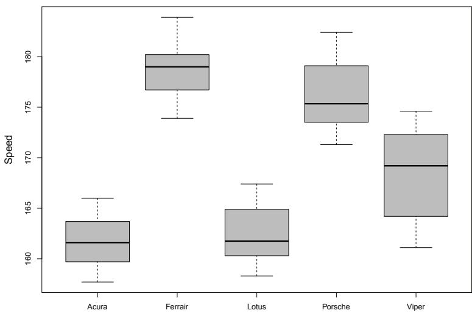  
Figure 9.4.1: Boxplot of car speeds cited in Example 9.4.1.

$P(Y = j)$ . Let $X_{1},\ldots ,X_{n_{1}}$ and $Y_{1},\ldots ,Y_{n_{2}}$ be respective independent random samples on $X$ and $Y$ . The samples are recorded in a $2\times k$ contingency table of counts $O_{ij}$ , where $O_{1j} = \# \{X_i = j\}$ and $O_{2j} = \# \{Y_i = j\}$ . In Example 4.7.3, based on this table, we discussed a test that the distributions of $X$ and $Y$ are the same. Here we want to consider all the differences $p_{1j} - p_{2j}$ for $j = 1,\dots ,k$ . Let $\hat{p}_{ij} = O_{ij} / n_i$ .

(a) Determine the Bonferroni method for performing all these comparisons.   
(b) Determine the Fisher method for performing all these comparisons.

9.4.4. Suppose the samples in Exercise 9.4.3 resulted in the contingency table:

<table><tr><td></td><td>1</td><td>2</td><td>3</td><td>4</td><td>5</td><td>6</td><td>7</td><td>8</td><td>9</td><td>10</td></tr><tr><td>x</td><td>20</td><td>31</td><td>56</td><td>18</td><td>45</td><td>55</td><td>47</td><td>78</td><td>56</td><td>81</td></tr><tr><td>y</td><td>36</td><td>41</td><td>65</td><td>15</td><td>38</td><td>78</td><td>18</td><td>72</td><td>59</td><td>85</td></tr></table>

To compute (in R) the confidence intervals below, use the command prop.test as in Example 4.2.5.

(a) Based on the Bonferroni procedure for all 10 comparisons, compute the confidence interval for $p_{16} - p_{26}$ .   
(b) Based on the Fisher procedure for all 10 comparisons, compute the confidence interval for $p_{16} - p_{26}$ .

9.4.5. Write an R function that computes the Fisher procedure of Exercise 9.4.3. Validate it using the data of Exercise 9.4.4.

9.4.6. Extend the Bonferroni procedure to simultaneous testing. That is, suppose we have $m$ hypotheses of interest: $H_{0i}$ versus $H_{1i}$ , $i = 1,\dots,m$ . For testing $H_{0i}$ versus $H_{1i}$ , let $C_{i,\alpha}$ be a critical region of size $\alpha$ and assume $H_{0i}$ is rejected if $\mathbf{X}_i\in C_{i,\alpha}$ , for a sample $\mathbf{X}_i$ . Determine a rule so that we can simultaneously test these $m$ hypotheses with a Type I error rate less than or equal to $\alpha$ .

# 9.5 Two-Way ANOVA

Recall the one-way analysis of variance (ANOVA) problem considered in Section 9.2 which was concerned with one factor at $b$ levels. In this section, we are concerned with the situation where we have two factors $A$ and $B$ with levels $a$ and $b$ , respectively. This is called a two-way analysis of variance (ANOVA). Let $X_{ij}$ , $i = 1, 2, \ldots, a$ and $j = 1, 2, \ldots, b$ , denote the response for factor $A$ at level $i$ and factor $B$ at level $j$ . Denote the total sample size by $n = ab$ . We shall assume that the $X_{ij}$ s are independent normally distributed random variables with common variance $\sigma^2$ . Denote the mean of $X_{ij}$ by $\mu_{ij}$ . The mean $\mu_{ij}$ is often referred to as the mean of the $(i,j)$ th cell. For our first model, we consider the additive model where

$$
\mu_ {i j} = \bar {\mu} + (\bar {\mu} _ {i.} - \bar {\mu}) + (\bar {\mu} _ {. j} - \bar {\mu}); \tag {9.5.1}
$$

that is, the mean in the $(i,j)$ th cell is due to additive effects of the levels, $i$ of factor A and $j$ of factor $B$ , over the average (constant) $\overline{\mu}$ . Let $\alpha_{i} = \overline{\mu}_{i}$ . $-\overline{\mu}$ , $i = 1,\ldots,a$ ; $\beta_{j} = \overline{\mu}_{\cdot j} - \overline{\mu}$ , $j = 1,\ldots,b$ ; and $\mu = \overline{\mu}$ . Then the model can be written more simply as

$$
\mu_ {i j} = \mu + \alpha_ {i} + \beta_ {j}, \tag {9.5.2}
$$

where $\sum_{i=1}^{a} \alpha_{i} = 0$ and $\sum_{j=1}^{b} \beta_{j} = 0$ . We refer to this model as being a two-way additive ANOVA model.

For example, take $a = 2$ , $b = 3$ , $\mu = 5$ , $\alpha_{1} = 1$ , $\alpha_{2} = -1$ , $\beta_{1} = 1$ , $\beta_{2} = 0$ , and $\beta_{3} = -1$ . Then the cell means are

<table><tr><td rowspan="2" colspan="2"></td><td colspan="3">Factor B</td></tr><tr><td>1</td><td>2</td><td>3</td></tr><tr><td rowspan="2">Factor A</td><td>1</td><td>μ11 = 7</td><td>μ12 = 6</td><td>μ13 = 5</td></tr><tr><td>2</td><td>μ21 = 5</td><td>μ22 = 4</td><td>μ23 = 3</td></tr></table>

Note that for each $i$ , the plots of $\mu_{ij}$ versus $j$ are parallel. This is true for additive models in general; see Exercise 9.5.9. We call these plots mean profile plots.

Had we taken $\beta_{1} = \beta_{2} = \beta_{3} = 0$ , then the cell means would be

<table><tr><td rowspan="2" colspan="2"></td><td colspan="3">Factor B</td></tr><tr><td>1</td><td>2</td><td>3</td></tr><tr><td rowspan="2">Factor A</td><td>1</td><td>μ11 = 6</td><td>μ12 = 6</td><td>μ13 = 6</td></tr><tr><td>2</td><td>μ21 = 4</td><td>μ22 = 4</td><td>μ23 = 4</td></tr></table>

The hypotheses of interest are

$$
H _ {0 A}: \alpha_ {1} = \dots = \alpha_ {a} = 0 \text {v e r s u s} H _ {1 A}: \alpha_ {i} \neq 0, \text {f o r s o m e} i, \tag {9.5.3}
$$

and

$$
H _ {0 B}: \beta_ {1} = \dots = \beta_ {b} = 0 \text {v e r s u s} H _ {1 B}: \beta_ {j} \neq 0, \text {f o r s o m e} j. \tag {9.5.4}
$$

If $H_{0A}$ is true, then by (9.5.2) the mean of the $(i,j)$ th cell does not depend on the level of $A$ . The second example above is under $H_{0B}$ . The cell means remain the same from column to column for a specified row. We call these hypotheses main effect hypotheses.

Remark 9.5.1. The model just described, and others similar to it, are widely used in statistical applications. Consider a situation in which it is desirable to investigate the effects of two factors that influence an outcome. Thus the variety of a grain and the type of fertilizer used influence the yield; or the teacher and the size of the class may influence the score on a standardized test. Let $X_{ij}$ denote the yield from the use of variety $i$ of a grain and type $j$ of fertilizer. A test of the hypothesis that $\beta_{1} = \beta_{2} = \dots = \beta_{b} = 0$ would then be a test of the hypothesis that the mean yield of each variety of grain is the same regardless of the type of fertilizer used.

Call the model described around expression (9.5.2) the full model. We want to determine the mles. If we write out the likelihood function, the summation in the exponent of $e$ is

$$
S S = \sum_ {i = 1} ^ {a} \sum_ {j = 1} ^ {b} (x _ {i j} - \overline {{\mu}} - \alpha_ {i} - \beta_ {j}) ^ {2}.
$$

The mles of $\alpha_{i}$ , $\beta_{j}$ , and $\overline{\mu}$ minimize $SS$ . By adding in and subtracting out, we obtain:

$$
S S = \sum_ {i = 1} ^ {a} \sum_ {j = 1} ^ {b} \left\{\left[ \bar {x}. - \bar {\mu} \right] - \left[ \alpha_ {i} - \left(\bar {x} _ {i}. - \bar {x}. .\right) \right] - \left[ \beta_ {j} - \left(\bar {x}. _ {j} - \bar {x}. .\right) \right] + \left[ x _ {i j} - \bar {x} _ {i}. - \bar {x}. _ {j} + \bar {x}. . \right] \right\} ^ {2}. \tag {9.5.5}
$$

From expression (9.5.2), we have $\sum_{i}\alpha_{i} = \sum_{j}\beta_{j} = 0$ . Further,

$$
\sum_ {i = 1} ^ {a} (\overline {{x}} _ {i.} - \overline {{x}} _ {.}) = \sum_ {j = 1} ^ {b} (\overline {{x}} _ {. j} - \overline {{x}} _ {.}) = 0
$$

and

$$
\sum_ {i = 1} ^ {a} (x _ {i j} - \overline {{x}} _ {i}. - \overline {{x}} _ {. j} + \overline {{x}} _ {.}) = \sum_ {j = 1} ^ {b} (x _ {i j} - \overline {{x}} _ {i}. - \overline {{x}} _ {. j} + \overline {{x}} _ {.}) = 0.
$$

Therefore, in the expansion of the sum of squares, (9.5.5), all cross product terms are 0. Hence, we have the identity

$$
\begin{array}{l} { S S } { = } { a b [ \overline { { x } } . . - \overline { { \mu } } ] ^ { 2 } + b \sum _ { i = 1 } ^ { a } [ \alpha _ { i } - ( \overline { { x } } _ { i } . . - \overline { { x } } . . ) ] ^ { 2 } + a \sum _ { j = 1 } ^ { b } [ \beta _ { j } - ( \overline { { x } } . _ { j } - \overline { { x } } . . ) ] ^ { 2 } } \\ + \sum_ {i = 1} ^ {a} \sum_ {j = 1} ^ {b} \left[ x _ {i j} - \bar {x} _ {i}. - \bar {x}. _ {j} + \bar {x}. ] \right] ^ {2}. \tag {9.5.6} \\ \end{array}
$$

Since these are sums of squares, the minimizing values, (mles), must be

$$
\hat {\bar {\mu}} = \bar {X}.., \hat {\alpha} _ {i} = \bar {X} _ {i}. - \bar {X}.., \text {a n d} \hat {\beta} _ {j} = \bar {X} _ {. j} - \bar {X}.. \tag {9.5.7}
$$

Note that we have used random variable notation. So these are the maximum likelihood estimators. It then follows that the maximum likelihood estimator of $\sigma^2$ is

$$
\hat {\sigma} _ {\Omega} ^ {2} = \frac {\sum_ {i = 1} ^ {a} \sum_ {j = 1} ^ {b} \left[ X _ {i j} - \bar {X} _ {i \cdot} - \bar {X} _ {\cdot j} + \bar {X} _ {\cdot .} \right] ^ {2}}{a b} = \mathrm {d f n} \frac {Q _ {3} ^ {\prime}}{a b}, \tag {9.5.8}
$$

where we have defined the numerator of $\hat{\sigma}_{\Omega}^{2}$ as the quadratic form $Q_{3}^{\prime}$ . It follows from an advanced course in linear models that $ab\hat{\sigma}_{\Omega}^{2} / \sigma^{2}$ has a $\chi^2 ((a - 1)(b - 1))$ distribution.

Next we construct the likelihood ratio test for $H_{0B}$ . Under the reduced model (full model constrained by $H_{0B}$ ), $\beta_{j} = 0$ for all $j = 1, \ldots, b$ . To obtain the mles for the reduced model, the identity (9.5.6) becomes

$$
\begin{array}{l} S S = a b [ \bar {x}. -. - \bar {\mu} ] ^ {2} + b \sum_ {i = 1} ^ {a} [ \alpha_ {i} -. - (\bar {x}. -. - \bar {x}..) ] ^ {2} \\ + a \sum_ {j = 1} ^ {b} [ \bar {x}. _ {j} - \bar {x}. ] ^ {2} + \sum_ {i = 1} ^ {a} \sum_ {j = 1} ^ {b} \left[ x _ {i j} - \bar {x} _ {i}. - \bar {x}. _ {j} + \bar {x}. ] ^ {2}. \right. \tag {9.5.9} \\ \end{array}
$$

Thus the mles for $\alpha_{i}$ and $\overline{\mu}$ remain the same as in the full model and the reduced model maximum likelihood estimator of $\sigma^2$ is

$$
\hat {\sigma} _ {\omega} ^ {2} = \frac {\left\{a \sum_ {j = 1} ^ {b} \left[ \bar {X} . j - \bar {X} . \right] ^ {2} + \sum_ {i = 1} ^ {a} \sum_ {j = 1} ^ {b} \left[ X _ {i j} - \bar {X} _ {i} . - \bar {X} . j + \bar {X} . \right] ^ {2} \right\}}{a b}. \tag {9.5.10}
$$

Denote the numerator of $\hat{\sigma}_{\omega}^{2}$ by $Q^{\prime}$ . Note that it is the residual variation left after fitting the reduced model.

Let $\Lambda$ denote the likelihood ratio test statistic for $H_{0B}$ . Our derivation is similar to the derivation for the likelihood ratio test statistic for one-way ANOVA of Section 9.2. Hence, similar to equation (9.2.9), our likelihood ratio test statistic simplifies to

$$
\Lambda^ {a b / 2} = \frac {\hat {\sigma} _ {\Omega} ^ {2}}{\hat {\sigma} _ {\omega} ^ {2}} = \frac {Q _ {3} ^ {\prime}}{Q ^ {\prime}}.
$$

Then, similar to the one-way derivation, the likelihood ratio test rejects $H_{0B}$ for large values of $Q_4' / Q_3'$ , where in this case,

$$
Q _ {4} ^ {\prime} = a \sum_ {j = 1} ^ {b} \left[ \bar {x}. _ {j} - \bar {x}. _ {.} \right] ^ {2}. \tag {9.5.11}
$$

Note that $Q_4' = Q' - Q_3'$ ; i.e., it is the incremental increase in residual variation if we use the reduced model instead of the full model.

To obtain the null distribution of $Q_{4}^{\prime}$ , notice that it is the numerator of the sample variance of the random variables $\sqrt{aX}.1, \ldots, \sqrt{aX}.b$ . These random variables are

independent with the common $N(\sqrt{a}\overline{\mu},\sigma^2)$ distribution; see Exercise 9.5.2. Hence, by Theorem 3.6.1, $Q_4^\prime /\sigma^2$ has $\chi^2 (b - 1)$ distribution. In a more advanced course, it can be further shown that $Q_4^\prime$ and $Q_3^\prime$ are independent. Hence, the statistic

$$
F _ {B} = \frac {a \sum_ {j = 1} ^ {b} \left[ \bar {X} . _ {j} - \bar {X} . . ] ^ {2} / (b - 1) \right.}{\sum_ {i = 1} ^ {a} \sum_ {j = 1} ^ {b} \left[ X _ {i j} - \bar {X} _ {i .} - \bar {X} . _ {j} + \bar {X} . . ] ^ {2} / (a - 1) (b - 1) \right.} \tag {9.5.12}
$$

has an $F(b - 1, (a - 1)(b - 1))$ under $H_{0B}$ . Thus, a level $\alpha$ test is to reject $H_{0B}$ in favor of $H_{1B}$ if

$$
F _ {B} \geq F (\alpha , b - 1, (a - 1) (b - 1)). \tag {9.5.13}
$$

If we are to compute the power function of the test, we need the distribution of $F_{B}$ when $H_{0B}$ is not true. As we have stated above, $Q_3^\prime /\sigma^2$ , (9.5.8), has a central $\chi^2$ -distribution with $(a - 1)(b - 1)$ degrees of freedom under the full model, and, hence, under $H_{1B}$ . Further, it can be shown that $Q_4^\prime$ , (9.5.11), has a noncentral $\chi^2$ -distribution with $b - 1$ degrees of freedom under $H_{1B}$ . To compute the noncentrality parameters of $Q_4^\prime /\sigma^2$ when $H_{1B}$ is true, we have $E(X_{ij}) = \mu +\alpha_i + \beta_j$ , $E(\overline{X}_i.) = \mu +\alpha_i$ , $E(\overline{X}_{.j}) = \mu +\beta_j$ , and $E(\overline{X}_{..}) = \mu$ . Using the general rule discussed in Section 9.4, we replace the variables in $Q_4^\prime /\sigma^2$ with their means. Accordingly, the noncentrality parameter $Q_4^\prime /\sigma^2$ is

$$
\frac {a}{\sigma^ {2}} \sum_ {j = 1} ^ {b} (\mu + \beta_ {j} - \mu) ^ {2} = \frac {a}{\sigma^ {2}} \sum_ {j = 1} ^ {b} \beta_ {j} ^ {2}.
$$

Thus, if the hypothesis $H_{0B}$ is not true, $F$ has a noncentral $F$ -distribution with $b - 1$ and $(a - 1)(b - 1)$ degrees of freedom and noncentrality parameter $a\sum_{j = 1}^{b}\beta_{j}^{2} / \sigma^{2}$ .

A similar argument can be used to construct the likelihood ratio test statistics $F_{A}$ to test $H_{0A}$ versus $H_{1A}$ , (9.5.3). The numerator of the $F$ test statistic is the sum of squares among rows. The test statistic is

$$
F _ {A} = \frac {b \sum_ {i = 1} ^ {a} \left[ \bar {X} _ {i .} - \bar {X} . . ] ^ {2} / (a - 1) \right.}{\sum_ {i = 1} ^ {a} \sum_ {j = 1} ^ {b} \left[ X _ {i j} - \bar {X} _ {i .} - \bar {X} . _ {j} + \bar {X} . . ] ^ {2} / (a - 1) (b - 1) \right.} \tag {9.5.14}
$$

and it has an $F(a - 1, (a - 1)(b - 1))$ distribution under $H_{0A}$ .

# 9.5.1 Interaction between Factors

The analysis of variance problem that has just been discussed is usually referred to as a two-way classification with one observation per cell. Each combination of $i$ and $j$ determines a cell; thus, there is a total of $ab$ cells in this model. Let us now investigate another two-way classification problem, but in this case we take $c > 1$ independent observations per cell.

Let $X_{ijk}$ , $i = 1,2,\ldots ,a$ , $j = 1,2,\ldots ,b$ , and $k = 1,2,\ldots ,c$ , denote $n = abc$ random variables that are independent and have normal distributions with common, but unknown, variance $\sigma^2$ . Denote the mean of each $X_{ijk}$ , $k = 1,2,\ldots ,c$ , by $\mu_{ij}$ .

Under the additive model, (9.5.1), the mean of each cell depended on its row and column, but often the mean is cell-specific. To allow this, consider the parameters

$$
\begin{array}{l} \gamma_ {i j} = \mu_ {i j} - \left\{\mu + (\bar {\mu} _ {i.} - \mu) + (\bar {\mu} _ {. j} - \mu) \right\} \\ = \mu_ {i j} - \overline {{\mu}} _ {i}. - \overline {{\mu}} _ {. j} + \mu , \\ \end{array}
$$

for $i = 1, \ldots, a, j = 1, \ldots, b$ . Hence $\gamma_{ij}$ reflects the specific contribution to the cell mean over and above the additive model. These parameters are called interaction parameters. Using the second form (9.5.2), we can write the cell means as

$$
\mu_ {i j} = \mu + \alpha_ {i} + \beta_ {j} + \gamma_ {i j}, \tag {9.5.15}
$$

where $\sum_{i=1}^{a}\alpha_{i} = 0$ , $\sum_{j=1}^{b}\beta_{j} = 0$ , and $\sum_{i=1}^{a}\gamma_{ij} = \sum_{j=1}^{b}\gamma_{ij} = 0$ . This model is called a two-way model with interaction.

For example, take $a = 2$ , $b = 3$ , $\mu = 5$ , $\alpha_{1} = 1$ , $\alpha_{2} = -1$ , $\beta_{1} = 1$ , $\beta_{2} = 0$ , $\beta_{3} = -1$ , $\gamma_{11} = 1$ , $\gamma_{12} = 1$ , $\gamma_{13} = -2$ , $\gamma_{21} = -1$ , $\gamma_{22} = -1$ , and $\gamma_{23} = 2$ . Then the cell means are

<table><tr><td></td><td colspan="3">Factor B</td></tr><tr><td></td><td>1</td><td>2</td><td>3</td></tr><tr><td>Factor A 1</td><td>μ11 = 8</td><td>μ12 = 7</td><td>μ13 = 3</td></tr><tr><td>2</td><td>μ21 = 4</td><td>μ22 = 3</td><td>μ23 = 5</td></tr></table>

If each $\gamma_{ij} = 0$ , then the cell means are

<table><tr><td></td><td colspan="3">Factor B</td></tr><tr><td></td><td>1</td><td>2</td><td>3</td></tr><tr><td>Factor A 1</td><td>μ11 = 7</td><td>μ12 = 6</td><td>μ13 = 5</td></tr><tr><td>2</td><td>μ21 = 5</td><td>μ22 = 4</td><td>μ23 = 3</td></tr></table>

Note that the mean profile plots for this second example are parallel, but those in the first example (where interaction is present) are not.

The derivation of the mles under the full model, (9.5.15), is quite similar to the derivation for the additive model. Letting $SS$ denote the sums of squares in the exponent of $e$ in the likelihood function, we obtain the following identity by adding in and subtracting out (we have omitted subscripts on the sums):

$$
S S = \sum \sum \sum (x _ {i j k} - \mu - \alpha_ {i} - \beta_ {j} - \gamma_ {i j k}) ^ {2}
$$

$$
\begin{array}{l} = \sum \sum \sum \sum \left\{\left[ x _ {i j k} - \bar {x} _ {i j}. \right] - \left[ \mu - \bar {x} \dots \right] - \left[ \alpha_ {i} - \left(\bar {x} _ {i}. - \bar {x} \dots\right) \right] - \left[ \beta_ {j} - \left(\bar {x} _ {. j}. - \bar {x} \dots\right) \right] \right. \\ \left. \right. - \left[ \right. \gamma_ {i j} - \left( \right.\bar {x} _ {i j}. - \bar {x} _ {i}. - \bar {x}. _ {j}. + \bar {x}. _ {..} ] \left. \right\} ^ {2} \left. \right. \\ \end{array}
$$

$$
\begin{array}{l} = \sum \sum \sum [ x _ {i j k} - \bar {x} _ {i j}. ] ^ {2} + a b c [ \mu - \bar {x} \dots ] ^ {2} + b c \sum [ \alpha_ {i} - (\bar {x} _ {i..} - \bar {x} \dots) ] ^ {2} + \\ a c \sum \left[ \beta_ {j} - \left(\bar {x} _ {. j}. - \bar {x} \dots\right) \right] ^ {2} + c \sum \sum \left[ \gamma_ {i j} - \left(\bar {x} _ {i j}. - \bar {x} _ {i..} - \bar {x} _ {. j}. + \bar {x} \dots\right) \right] ^ {2} \tag {9.5.16} \\ \end{array}
$$

where, as in the additive model, the cross product terms in the expansion are 0. Thus, the mles of $\mu$ , $\alpha_{i}$ and $\beta_{j}$ are the same as in the additive model; the mle of $\gamma_{ij}$ is $\hat{\gamma}_{ij} = \overline{X}_{ij} - \overline{X}_{i\cdot} - \overline{X}_{\cdot j} + \overline{X}_{\dots}$ ; and the mle of $\sigma^2$ is

$$
\hat {\sigma} _ {\Omega} ^ {2} = \frac {\sum \sum \sum [ X _ {i j k} - \bar {X} _ {i j .} ] ^ {2}}{a b c}. \tag {9.5.17}
$$

Let $Q_3^{\prime \prime}$ denote the numerator of $\hat{\sigma}^2$

The major hypotheses of interest for the interaction model are

$$
H _ {0 A B}: \gamma_ {i j} = 0 \text {f o r a l l} i, j \text {v e r s u s} H _ {1 A B}: \gamma_ {i j} \neq 0, \text {f o r s o m e} i, j. \tag {9.5.18}
$$

Substituting $\gamma_{ij} = 0$ in $SS$ , it is clear that the reduced model mle of $\sigma^2$ is

$$
\hat {\sigma} _ {\omega} ^ {2} = \frac {\sum \sum \sum [ X _ {i j k} - \bar {X} _ {i j .} ] ^ {2} + c \sum \sum [ \bar {X} _ {i j .} - \bar {X} _ {i . .} - \bar {X} _ {. j .} + \bar {X} _ {\dots} ] ^ {2}}{a b c}. \tag {9.5.19}
$$

Let $Q''$ denote the numerator of $\hat{\sigma}_{\omega}^{2}$ and let $Q_{4}^{\prime \prime} = Q^{\prime \prime} - Q_{3}^{\prime \prime}$ . Then it follows as in the additive model that the likelihood ratio test statistic rejects $H_{0AB}$ for large values of $Q_{4}^{\prime \prime} / Q_{3}^{\prime \prime}$ . In a more advanced class, it is shown that the standardized test statistic

$$
F _ {A B} = \frac {Q _ {4} ^ {\prime \prime} / [ (a - 1) (b - 1) ]}{Q _ {3} ^ {\prime \prime} / [ a b (c - 1) ]} \tag {9.5.20}
$$

has under $H_{0AB}$ an $F$ -distribution with $(a - 1)(b - 1)$ and $ab(c - 1)$ degrees of freedom.

If $H_{0AB} : \gamma_{ij} = 0$ is accepted, then one usually continues to test $\alpha_i = 0$ , $i = 1,2,\ldots,a$ , by using the test statistic

$$
F = \frac {b c \sum_ {i = 1} ^ {a} (\overline {{X}} _ {i . .} - \overline {{X}} _ {\ldots}) ^ {2} / (a - 1)}{\sum_ {i = 1} ^ {a} \sum_ {j = 1} ^ {b} \sum_ {k = 1} ^ {c} (X _ {i j k} - \overline {{X}} _ {i j .}) ^ {2} / [ a b (c - 1) ]},
$$

which has a null $F$ -distribution with $a - 1$ and $ab(c - 1)$ degrees of freedom. Similarly, the test of $\beta_{j} = 0$ , $j = 1,2,\ldots,b$ , proceeds by using the test statistic

$$
F = \frac {a c \sum_ {j = 1} ^ {b} (\overline {{X}} . _ {j .} - \overline {{X}} . . .) ^ {2} / (b - 1)}{\sum_ {i = 1} ^ {a} \sum_ {j = 1} ^ {b} \sum_ {k = 1} ^ {c} (X _ {i j k} - \overline {{X}} _ {i j .}) ^ {2} / [ a b (c - 1) ]},
$$

which has a null $F$ -distribution with $b - 1$ and $ab(c - 1)$ degrees of freedom.

We conclude this section with an example that serves as an illustration of two-way ANOVA along with its associated R code.

Example 9.5.1. Devore (2012), page 435, presents a study concerning the effects to the thermal conductivity of an asphalt mix due to two factors: Binder Grade at three different levels (PG58, PG64, and PG70) and Coarseness of Aggregate Content at three levels (38%, 41%, and 44%). Hence, there are $3 \times 3 = 9$ different treatments. The responses are the thermal conductivities of the mixes of asphalt at these crossed levels. Two replications were performed at each treatment. The data are:

<table><tr><td></td><td colspan="3">Coarse Aggregate Content</td></tr><tr><td>Binder-Grade</td><td>38%</td><td>41%</td><td>44%</td></tr><tr><td rowspan="2">PG58</td><td>0.835</td><td>0.822</td><td>0.785</td></tr><tr><td>0.845</td><td>0.826</td><td>0.795</td></tr><tr><td rowspan="2">PG64</td><td>0.855</td><td>0.832</td><td>0.790</td></tr><tr><td>0.865</td><td>0.836</td><td>0.800</td></tr><tr><td rowspan="2">PG70</td><td>0.815</td><td>0.800</td><td>0.770</td></tr><tr><td>0.825</td><td>0.820</td><td>0.790</td></tr></table>

The data are also in the file conductivity.rda. Assuming this file has been loaded into the R work area, the mean profile plot is computed by

interaction.plot(Binder, Aggregate, Conductivity, legend=T)

and it is displayed in Figure 9.5.1. Note that the mean profiles are almost parallel, a graphical indication of little interaction between the factors. The ANOVA for the study is computed by the following two commands. It yields the tabled results (which we have abbreviated). The next to last column shows the $F$ -test statistics discussed in this section.

fit=lm(Conductivity ~ factor(Binder) + factor(Aggregate) + factor(Binder)*factor(Aggregate))  
anova.fit)

Analysis of Variance Table

Df Sum Sq F value Pr $(>\mathbb{F})$ factor(Binder) 20.0020893 14.1171 0.001678 factor(Aggregate) 20.0082973 56.0631 8.308e-06 factor(Binder):factor(Aggregate) 40.0003253 1.0991 0.413558

As the interaction plot suggests, interaction is not significant ( $p = 0.4135$ ). In practice, we would accept the additive (no interaction) model. The main effects are both highly significant. So both factors have an effect on conductivity. See Devore (2012) for more discussion.

# EXERCISES

9.5.1. For the two-way interaction model, (9.5.15), show that the following decomposition of sums of squares is true:

$$
\begin{array}{l} \sum_ {i = 1} ^ {a} \sum_ {j = 1} ^ {b} \sum_ {k = 1} ^ {c} (X _ {i j k} - \overline {{X}} _ {\dots}) ^ {2} = b c \sum_ {i = 1} ^ {a} (\overline {{X}} _ {i..} - \overline {{X}} _ {\dots}) ^ {2} + a c \sum_ {j = 1} ^ {b} (\overline {{X}} _ {. j.} - \overline {{X}} _ {\dots}) ^ {2} \\ + c \sum_ {i = 1} ^ {a} \sum_ {j = 1} ^ {b} \left(\bar {X} _ {i j.} - \bar {X} _ {i..} - \bar {X}. _ {j.} + \bar {X}. _ {\dots}\right) ^ {2} \\ + \sum_ {i = 1} ^ {a} \sum_ {j = 1} ^ {b} \sum_ {k = 1} ^ {c} (X _ {i j k} - \overline {{X}} _ {i j.}) ^ {2}; \\ \end{array}
$$

that is, the total sum of squares is decomposed into that due to row differences, that due to column differences, that due to interaction, and that within cells.

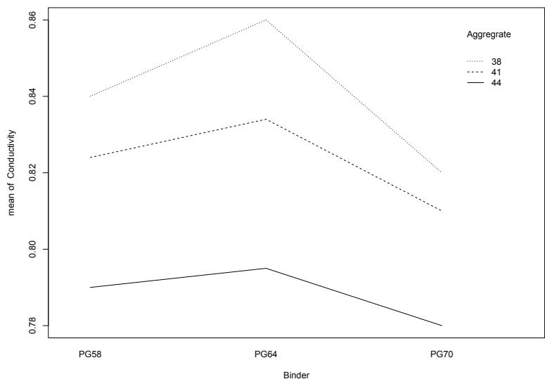  
Figure 9.5.1: Mean profile plot for the study discussed in Example 9.5.1. The profiles are nearly parallel, indicating little interaction between the factors.

9.5.2. Consider the discussion above expression (9.5.14). Show that the random variables $\sqrt{a\overline{X}}_{1},\ldots ,\sqrt{a\overline{X}}_{b}$ are independent with the common $N(\sqrt{a\overline{\mu}},\sigma^2)$ distribution.   
9.5.3. For the two-way interaction model, (9.5.15), show that the noncentrality parameter of the test statistic $F_{AB}$ is equal to $c\sum_{j = 1}^{b}\sum_{i = 1}^{a}\gamma_{ij}^2 /\sigma^2$ .   
9.5.4. Using the background of the two-way classification with one observation per cell, determine the distribution of the maximum likelihood estimators of $\alpha_{i}$ , $\beta_{j}$ , and $\mu$ .   
9.5.5. Prove that the linear functions $X_{ij} - \overline{X}_{i\cdot} - \overline{X}_{\cdot j} + \overline{X}_{\cdot \cdot}$ and $\overline{X}_{\cdot j} - \overline{X}_{\cdot \cdot}$ are uncorrelated, under the assumptions of this section.   
9.5.6. Given the following observations associated with a two-way classification with $a = 3$ and $b = 4$ , use R or another statistical package to compute the $F$ -statistic used to test the equality of the column means $(\beta_{1} = \beta_{2} = \beta_{3} = \beta_{4} = 0)$ and the equality of the row means $(\alpha_{1} = \alpha_{2} = \alpha_{3} = 0)$ , respectively.

<table><tr><td>Row/Column</td><td>1</td><td>2</td><td>3</td><td>4</td></tr><tr><td>1</td><td>3.1</td><td>4.2</td><td>2.7</td><td>4.9</td></tr><tr><td>2</td><td>2.7</td><td>2.9</td><td>1.8</td><td>3.0</td></tr><tr><td>3</td><td>4.0</td><td>4.6</td><td>3.0</td><td>3.9</td></tr></table>

9.5.7. With the background of the two-way classification with $c > 1$ observations per cell, determine the distribution of the mles of $\alpha_{i},\beta_{j}$ , and $\gamma_{ij}$ .

9.5.8. Given the following observations in a two-way classification with $a = 3$ , $b = 4$ , and $c = 2$ , compute the $F$ -statistics used to test that all interactions are equal to zero ( $\gamma_{ij} = 0$ ), all column means are equal ( $\beta_j = 0$ ), and all row means are equal ( $\alpha_i = 0$ ), respectively. Data are in the form $x_{ijk}, i, j$ in the data set sec951.rda.

<table><tr><td>Row/Column</td><td>1</td><td>2</td><td>3</td><td>4</td></tr><tr><td>1</td><td>3.1</td><td>4.2</td><td>2.7</td><td>4.9</td></tr><tr><td></td><td>2.9</td><td>4.9</td><td>3.2</td><td>4.5</td></tr><tr><td>2</td><td>2.7</td><td>2.9</td><td>1.8</td><td>3.0</td></tr><tr><td></td><td>2.9</td><td>2.3</td><td>2.4</td><td>3.7</td></tr><tr><td>3</td><td>4.0</td><td>4.6</td><td>3.0</td><td>3.9</td></tr><tr><td></td><td>4.4</td><td>5.0</td><td>2.5</td><td>4.2</td></tr></table>

9.5.9. For the additive model (9.5.1), show that the mean profile plots are parallel. The sample mean profile plots are given by plotting $\overline{X}_{ij}$ versus $j$ , for each $i$ . These offer a graphical diagnostic for interaction detection. Obtain these plots for the last exercise.

9.5.10. We wish to compare compressive strengths of concrete corresponding to $a = 3$ different drying methods (treatments). Concrete is mixed in batches that are just large enough to produce three cylinders. Although care is taken to achieve uniformity, we expect some variability among the $b = 5$ batches used to obtain the following compressive strengths. (There is little reason to suspect interaction, and hence only one observation is taken in each cell.) Data are also in the data set sec95set2.rda.

<table><tr><td rowspan="2">Treatment</td><td colspan="5">Batch</td></tr><tr><td>B1</td><td>B2</td><td>B3</td><td>B4</td><td>B5</td></tr><tr><td>A1</td><td>52</td><td>47</td><td>44</td><td>51</td><td>42</td></tr><tr><td>A2</td><td>60</td><td>55</td><td>49</td><td>52</td><td>43</td></tr><tr><td>A3</td><td>56</td><td>48</td><td>45</td><td>44</td><td>38</td></tr></table>

(a) Use the $5\%$ significance level and test $H_{A}:\alpha_{1} = \alpha_{2} = \alpha_{3} = 0$ against all alternatives.   
(b) Use the $5\%$ significance level and test $H_{B}:\beta_{1} = \beta_{2} = \beta_{3} = \beta_{4} = \beta_{5} = 0$ against all alternatives.

9.5.11. With $a = 3$ and $b = 4$ , find $\mu, \alpha_i, \beta_j$ and $\gamma_{ij}$ if $\mu_{ij}$ , for $i = 1,2,3$ and $j = 1,2,3,4$ , are given by

<table><tr><td>6</td><td>7</td><td>7</td><td>12</td></tr><tr><td>10</td><td>3</td><td>11</td><td>8</td></tr><tr><td>8</td><td>5</td><td>9</td><td>10</td></tr></table>

# 9.6 A Regression Problem

There is often interest in the relationship between two variables, for example, a student's scholastic aptitude test score in mathematics and this same student's

grade in calculus. Frequently, one of these variables, say $x$ , is known in advance of the other and there is interest in predicting a future random variable $Y$ . Since $Y$ is a random variable, we cannot predict its future observed value $Y = y$ with certainty. Thus let us first concentrate on the problem of estimating the mean of $Y$ , that is, $E(Y)$ . Now $E(Y)$ is usually a function of $x$ ; for example, in our illustration with the calculus grade, say $Y$ , we would expect $E(Y)$ to increase with increasing mathematics aptitude score $x$ . Sometimes $E(Y) = \mu(x)$ is assumed to be of a given form, such as a linear or quadratic or exponential function; that is, $\mu(x)$ could be assumed to be equal to $\alpha + \beta x$ or $\alpha + \beta x + \gamma x^2$ or $\alpha e^{\beta x}$ . To estimate $E(Y) = \mu(x)$ , or equivalently the parameters $\alpha$ , $\beta$ , and $\gamma$ , we observe the random variable $Y$ for each of $n$ possible different values of $x$ , say $x_1, x_2, \ldots, x_n$ , which are not all equal. Once the $n$ independent experiments have been performed, we have $n$ pairs of known numbers $(x_1, y_1), (x_2, y_2), \ldots, (x_n, y_n)$ . These pairs are then used to estimate the mean $E(Y)$ . Problems like this are often classified under regression because $E(Y) = \mu(x)$ is frequently called a regression curve.

Remark 9.6.1. A model for the mean such as $\alpha + \beta x + \gamma x^2$ is called a linear model because it is linear in the parameters $\alpha, \beta$ , and $\gamma$ . Thus $\alpha e^{\beta x}$ is not a linear model because it is not linear in $\alpha$ and $\beta$ . Note that, in Sections 9.2 to 9.5, all the means were linear in the parameters and hence are linear models.

For the most part in this section, we consider the case in which $E(Y) = \mu(x)$ is a linear function. Denote by $Y_{i}$ the response at $x_{i}$ and consider the model

$$
Y _ {i} = \alpha + \beta \left(x _ {i} - \bar {x}\right) + e _ {i}, \quad i = 1, \dots , n, \tag {9.6.1}
$$

where $\overline{x} = n^{-1}\sum_{i=1}^{n}x_{i}$ and $e_1, \ldots, e_n$ are iid random variables with a common $N(0,\sigma^2)$ distribution. Hence $E(Y_i) = \alpha + \beta (x_i - \overline{x})$ , $\operatorname{Var}(Y_i) = \sigma^2$ , and $Y_i$ has $N(\alpha + \beta (x_i - \overline{x}), \sigma^2)$ distribution. The major assumption is that the random errors, $e_i$ , are iid. In particular, this means that the errors are not a function of the $x_i$ 's. This is discussed in Remark 9.6.3. First, we discuss the maximum likelihood estimates of the parameters $\alpha$ , $\beta$ , and $\sigma$ .

# 9.6.1 Maximum Likelihood Estimates

Assume that the $n$ points $(x_{1},Y_{1}),(x_{2},Y_{2}),\ldots ,(x_{n},Y_{n})$ follow Model 9.6.1. So the first problem is that of fitting a straight line to the set of points; i.e., estimating $\alpha$ and $\beta$ . As an aid to our discussion, Figure 9.6.1 shows a scatterplot of 60 observations $(x_{1},y_{1}),\ldots ,(x_{60},y_{60})$ simulated from a linear model of the form (9.6.1). Our method of estimation in this section is that of maximum likelihood (MLE). The joint pdf of $Y_{1},\ldots ,Y_{n}$ is the product of the individual probability density functions; that is, the likelihood function equals

$$
\begin{array}{l} L (\alpha , \beta , \sigma^ {2}) = \prod_ {i = 1} ^ {n} \frac {1}{\sqrt {2 \pi \sigma^ {2}}} \exp \left\{- \frac {[ y _ {i} - \alpha - \beta (x _ {i} - \bar {x}) ] ^ {2}}{2 \sigma^ {2}} \right\} \\ = \left(\frac {1}{2 \pi \sigma^ {2}}\right) ^ {n / 2} \exp \left\{- \frac {1}{2 \sigma^ {2}} \sum_ {i = 1} ^ {n} [ y _ {i} - \alpha - \beta (x _ {i} - \overline {{x}}) ] ^ {2} \right\}. \\ \end{array}
$$

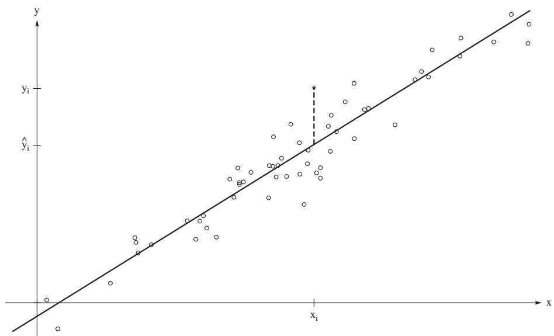  
Figure 9.6.1: The plot shows the least squares fitted line (solid line) to a set of data. The dashed-line segment from $(x_i, \hat{y}_i)$ to $(x_i, y_i)$ shows the deviation of $(x_i, y_i)$ from its fit.

To maximize $L(\alpha, \beta, \sigma^2)$ , or, equivalently, to minimize

$$
- \log L (\alpha , \beta , \sigma^ {2}) = \frac {n}{2} \log (2 \pi \sigma^ {2}) + \frac {\sum_ {i = 1} ^ {n} [ y _ {i} - \alpha - \beta (x _ {i} - \overline {{x}}) ] ^ {2}}{2 \sigma^ {2}},
$$

we must select $\alpha$ and $\beta$ to minimize

$$
H (\alpha , \beta) = \sum_ {i = 1} ^ {n} \left[ y _ {i} - \alpha - \beta \left(x _ {i} - \bar {x}\right) \right] ^ {2}.
$$

Since $|y_{i} - \alpha - \beta (x_{i} - \overline{x})| = |y_{i} - \mu (x_{i})|$ is the vertical distance from the point $(x_{i}, y_{i})$ to the line $y = \mu(x)$ (see the dashed-line segment in Figure 9.6.1), we note that $H(\alpha, \beta)$ represents the sum of the squares of those distances. Thus, selecting $\alpha$ and $\beta$ so that the sum of the squares is minimized means that we are fitting the straight line to the data by the method of least squares (LS).

To minimize $H(\alpha ,\beta)$ , we find the two first partial derivatives,

$$
\frac {\partial H (\alpha , \beta)}{\partial \alpha} = 2 \sum_ {i = 1} ^ {n} [ y _ {i} - \alpha - \beta (x _ {i} - \overline {{x}}) ] (- 1)
$$

and

$$
\frac {\partial H (\alpha , \beta)}{\partial \beta} = 2 \sum_ {i = 1} ^ {n} [ y _ {i} - \alpha - \beta (x _ {i} - \overline {{x}}) ] [ - (x _ {i} - \overline {{x}}) ].
$$

Setting $\partial H(\alpha ,\beta) / \partial \alpha = 0$ we obtain

$$
\sum_ {i = 1} ^ {n} y _ {i} - n \alpha - \beta \sum_ {i = 1} ^ {n} \left(x _ {i} - \bar {x}\right) = 0. \tag {9.6.2}
$$

Since $\sum_{i=1}^{n}(x_i - \overline{x}) = 0$ , the equation becomes $\sum_{i=1}^{n}y_i - n\alpha = 0$ ; hence, the mle of $\alpha$ is

$$
\hat {\alpha} = \bar {Y}. \tag {9.6.3}
$$

The equation $\partial H(\alpha, \beta) / \partial \beta = 0$ yields, with $\alpha$ replaced by $\overline{y}$ ,

$$
\sum_ {i = 1} ^ {n} \left(y _ {i} - \bar {y}\right) \left(x _ {i} - \bar {x}\right) - \beta \sum_ {i = 1} ^ {n} \left(x _ {i} - \bar {x}\right) ^ {2} = 0 \tag {9.6.4}
$$

and, hence, the mle of $\beta$ is

$$
\hat {\beta} = \frac {\sum_ {i = 1} ^ {n} \left(Y _ {i} - \bar {Y}\right) \left(x _ {i} - \bar {x}\right)}{\sum_ {i = 1} ^ {n} \left(x _ {i} - \bar {x}\right) ^ {2}} = \frac {\sum_ {i = 1} ^ {n} Y _ {i} \left(x _ {i} - \bar {x}\right)}{\sum_ {i = 1} ^ {n} \left(x _ {i} - \bar {x}\right) ^ {2}}. \tag {9.6.5}
$$

Equations (9.6.2) and (9.6.4) are the estimating equations for the LS solutions for this simple linear model.

The fitted value at the point $(x_{i},y_{i})$ is given by

$$
\dot {y} _ {i} = \hat {\alpha} + \hat {\beta} (x _ {i} - \bar {x}), \tag {9.6.6}
$$

which is shown on Figure 9.6.1. The fitted value $\hat{y}_i$ is also called the predicted value of $y_i$ at $x_i$ . The residual at the point $(x_i, y_i)$ is given by

$$
\hat {e} _ {i} = y _ {i} - \hat {y} _ {i}, \tag {9.6.7}
$$

which is also shown on Figure 9.6.1. Residual means "what is left" and the residual in regression is exactly that, i.e., what is left over after the fit. The relationship between the fitted values and the residuals are explored in Remark 9.6.3 and in Exercise 9.6.13.

To find the maximum likelihood estimator of $\sigma^2$ , consider the partial derivative

$$
\frac {\partial [ - \log L (\alpha , \beta , \sigma^ {2}) ]}{\partial (\sigma^ {2})} = \frac {n}{2 \sigma^ {2}} - \frac {\sum_ {i = 1} ^ {n} [ y _ {i} - \alpha - \beta (x _ {i} - \overline {{x}}) ] ^ {2}}{2 (\sigma^ {2}) ^ {2}}.
$$

Setting this equal to zero and replacing $\alpha$ and $\beta$ by their solutions $\hat{\alpha}$ and $\hat{\beta}$ , we obtain

$$
\hat {\sigma} ^ {2} = \frac {1}{n} \sum_ {i = 1} ^ {n} \left[ Y _ {i} - \hat {\alpha} - \hat {\beta} \left(x _ {i} - \bar {x}\right) \right] ^ {2}. \tag {9.6.8}
$$

Of course, due to the invariance of mles, $\hat{\sigma} = \sqrt{\hat{\sigma}^2}$ . Note that in terms of the residuals, $\hat{\sigma}^2 = n^{-1}\sum_{i=1}^{n}\hat{e}_i^2$ . As shown in Exercise 9.6.13, the average of the residuals is 0.

Since $\hat{\alpha}$ is a linear function of independent and normally distributed random variables, $\hat{\alpha}$ has a normal distribution with mean

$$
E (\hat {\alpha}) = E \left(\frac {1}{n} \sum_ {i = 1} ^ {n} Y _ {i}\right) = \frac {1}{n} \sum_ {i = 1} ^ {n} E (Y _ {i}) = \frac {1}{n} \sum_ {i = 1} ^ {n} [ \alpha + \beta (x _ {i} - \overline {{x}}) ] = \alpha
$$

and variance

$$
\operatorname {v a r} (\hat {\alpha}) = \sum_ {i = 1} ^ {n} \left(\frac {1}{n}\right) ^ {2} \operatorname {v a r} (Y _ {i}) = \frac {\sigma^ {2}}{n}.
$$

The estimator $\hat{\beta}$ is also a linear function of $Y_{1}, Y_{2}, \ldots, Y_{n}$ and hence has a normal distribution with mean

$$
\begin{array}{l} E (\hat {\beta}) = \frac {\sum_ {i = 1} ^ {n} (x _ {i} - \bar {x}) [ \alpha + \beta (x _ {i} - \bar {x}) ]}{\sum_ {i = 1} ^ {n} (x _ {i} - \bar {x}) ^ {2}} \\ = \frac {\alpha \sum_ {i = 1} ^ {n} \left(x _ {i} - \bar {x}\right) + \beta \sum_ {i = 1} ^ {n} \left(x _ {i} - \bar {x}\right) ^ {2}}{\sum_ {i = 1} ^ {n} \left(x _ {i} - \bar {x}\right) ^ {2}} = \beta \\ \end{array}
$$

and variance

$$
\begin{array}{l} \operatorname {v a r} (\hat {\beta}) = \sum_ {i = 1} ^ {n} \left[ \frac {x _ {i} - \overline {{x}}}{\sum_ {i = 1} ^ {n} (x _ {i} - \overline {{x}}) ^ {2}} \right] ^ {2} \operatorname {v a r} (Y _ {i}) \\ = \frac {\sum_ {i = 1} ^ {n} (x _ {i} - \overline {{x}}) ^ {2}}{\left[ \sum_ {i = 1} ^ {n} (x _ {i} - \overline {{x}}) ^ {2} \right] ^ {2}} \sigma^ {2} = \frac {\sigma^ {2}}{\sum_ {i = 1} ^ {n} (x _ {i} - \overline {{x}}) ^ {2}}. \\ \end{array}
$$

In summary, the estimators $\hat{\alpha}$ and $\hat{\beta}$ are linear functions of the independent normal random variables $Y_{1},\ldots ,Y_{n}$ . In Exercise 9.6.4 it is further shown that the covariance between $\hat{\alpha}$ and $\hat{\beta}$ is zero. It follows that $\hat{\alpha}$ and $\hat{\beta}$ are independent random variables with a bivariate normal distribution; that is,

$$
\left( \begin{array}{c} \hat {\alpha} \\ \hat {\beta} \end{array} \right) \text {h a s a} N _ {2} \left(\left( \begin{array}{c} \alpha \\ \beta \end{array} \right), \sigma^ {2} \left[ \begin{array}{c c} \frac {1}{n} & 0 \\ 0 & \frac {1}{\sum_ {i = 1} ^ {n} (x _ {i} - \bar {x}) ^ {2}} \end{array} \right]\right) \text {d i s t r i b u t i o n .} \tag {9.6.9}
$$

Next, we consider the estimator of $\sigma^2$ . It can be shown (Exercise 9.6.9) that

$$
\begin{array}{l} \sum_ {i = 1} ^ {n} \left[ Y _ {i} - \alpha - \beta \left(x _ {i} - \bar {x}\right) \right] ^ {2} = \sum_ {i = 1} ^ {n} \left\{\left(\hat {\alpha} - \alpha\right) + \left(\hat {\beta} - \beta\right) \left(x _ {i} - \bar {x}\right) \right. \\ \left. + \left[ Y _ {i} - \hat {\alpha} - \hat {\beta} (x _ {i} - \bar {x}) \right] \right\} ^ {2} \\ = n (\hat {\alpha} - \alpha) ^ {2} + (\hat {\beta} - \beta) ^ {2} \sum_ {i = 1} ^ {n} (x _ {i} - \bar {x}) ^ {2} + n \hat {\sigma} ^ {2}, \\ \end{array}
$$

or for brevity,

$$
Q = Q _ {1} + Q _ {2} + Q _ {3}.
$$

Here $Q, Q_1, Q_2$ , and $Q_3$ are real quadratic forms in the variables

$$
Y _ {i} - \alpha - \beta (x _ {i} - \bar {x}), \quad i = 1, 2, \dots , n.
$$

In this equation, $Q$ represents the sum of the squares of $n$ independent random variables that have normal distributions with means zero and variances $\sigma^2$ . Thus $Q / \sigma^2$ has a $\chi^2$ distribution with $n$ degrees of freedom. Each of the random variables $\sqrt{n} (\hat{\alpha} -\alpha) / \sigma$ and $\sqrt{\sum_{i = 1}^{n}(x_i - \overline{x})^2} (\hat{\beta} -\beta) / \sigma$ has a normal distribution with zero mean and unit variance; thus, each of $Q_{1} / \sigma^{2}$ and $Q_{2} / \sigma^{2}$ has a $\chi^2$ distribution with 1 degree of freedom. In accordance with Theorem 9.9.2 (proved in Section 9.9), because $Q_{3}$ is nonnegative, we have that $Q_{1},Q_{2}$ , and $Q_{3}$ are independent and that $Q_{3} / \sigma^{2}$ has a $\chi^2$ distribution with $n - 1 - 1 = n - 2$ degrees of freedom. That is, $n\hat{\sigma}^2 /\sigma^2$ has a $\chi^2$ distribution with $n - 2$ degrees of freedom.

We now extend this discussion to obtain inference for the parameters $\alpha$ and $\beta$ . It follows from the above derivations that both the random variable $T_{1}$

$$
T _ {1} = \frac {[ \sqrt {n} (\hat {\alpha} - \alpha) ] / \sigma}{\sqrt {Q _ {3} / [ \sigma^ {2} (n - 2) ]}} = \frac {\hat {\alpha} - \alpha}{\sqrt {\hat {\sigma} ^ {2} / (n - 2)}}
$$

and the random variable $T_{2}$

$$
T _ {2} = \frac {\left[ \sqrt {\sum_ {i = 1} ^ {n} \left(x _ {i} - \bar {x}\right) ^ {2}} (\hat {\beta} - \beta) \right] / \sigma}{\sqrt {Q _ {3} / \left[ \sigma^ {2} (n - 2) \right]}} = \frac {\hat {\beta} - \beta}{\sqrt {n \hat {\sigma} ^ {2} / \left[ (n - 2) \sum_ {1} ^ {n} \left(x _ {i} - \bar {x}\right) ^ {2} \right]}} \tag {9.6.10}
$$

have a $t$ -distribution with $n - 2$ degrees of freedom. These facts enable us to obtain confidence intervals for $\alpha$ and $\beta$ ; see Exercise 9.6.5. The fact that $n\hat{\sigma}^2 /\sigma^2$ has a $\chi^2$ distribution with $n - 2$ degrees of freedom provides a means of determining a confidence interval for $\sigma^2$ . These are some of the statistical inferences about the parameters to which reference was made in the introductory remarks of this section.

Remark 9.6.2. The more discerning reader should quite properly question our construction of $T_{1}$ and $T_{2}$ immediately above. We know that the squares of the linear forms are independent of $Q_{3} = n\hat{\sigma}^{2}$ , but we do not know, at this time, that the linear forms themselves enjoy this independence. A more general result is obtained in Theorem 9.9.1 of Section 9.9 and the present case is a special instance.

Before considering a numerical example, we discuss a diagnostic plot for the major assumption of Model 9.6.1.

Remark 9.6.3 (Diagnostic Plot Based on Fitted Values and Residuals). The major assumption in the model is that the random errors $e_1, \ldots, e_n$ are iid. In particular, this means that the errors are not a function of the $x_i$ 's so that a plot of $e_i$ versus $\alpha + \beta(x_i - \overline{x})$ should result in a random scatter. Since the errors and the parameters are unknown, this plot is not possible. We have estimates, though, of these quantities, namely the residuals $\hat{e}_i$ and the fitted values $\hat{y}_i$ . A diagnostic for the assumption is to plot the residuals versus the fitted values. This is called the residual plot. If the plot results in a random scatter, it is an indication that the model is appropriate. Patterns in the plot, though, are indicative of a poor model. Often in this later case, the patterns in the plot lead to better models.

As a final note, in Model 9.6.1 we have centered the $x$ 's; i.e., subtracted $\overline{x}$ from $x_{i}$ . In practice, usually we do not precenter the $x$ 's. Instead, we fit the model $y_{i} = \alpha^{*} + \beta x_{i} + e_{i}$ . In this case, the least squares, and hence, mles minimize the sum of squares

$$
\sum_ {i = 1} ^ {n} \left(y _ {i} - \alpha^ {*} - \beta x _ {i}\right) ^ {2}. \tag {9.6.11}
$$

In Exercise 9.6.1, the reader is asked to show that the estimate of $\beta$ remains the same as in expression (9.6.5), while $\hat{\alpha}^{*} = \overline{y} -\hat{\beta}\overline{x}$ . We use this noncentered model in the following example.

Example 9.6.1 (Men's 1500 meters). As a numerical illustration, consider data drawn from the Olympics. The response of interest is the winning time of the men's 1500 meters, while the predictor is the year of the olympics. The data were taken from Wikipedia and can be found in olym1500mara.rda. Assume the R vectors for the winning times and year are time and year, respectively. There are $n = 27$ data points. The top panel of Figure 9.6.2 shows a scatterplot of the data that is computed by the R command

par(mfrow=c(2,1)); plot(time~year,xlab="Year",ylab="Winning time") The winning times are steadily decreasing over time and, based on this plot, a simple linear model seems reasonable. Obviously the time for 2016 is an outlier but it is the correct time. Before proceeding to inference, though, we check the quality of the fit of the model. The following R commands obtain the least squares fit, overlaying it on the scatterplot in Figure 9.6.2, the fitted values, and the residuals. These are used to obtain the residual plot that is displayed in the bottom panel of 9.6.2.

fit <- lm(time~year); abline(fit)

ehat <- fit\ $resid; yhat <- fit\$ fitted.values

plot(ehat~yhat,xlab="Fitted values",ylab="Residuals")

Recall a "good" fit is indicated by a random scatter in the residual plot. This does not appear to be the case. There is a dependence between adjacent points over time. This dependence is apparent from the scatterplot too. In a time series course, this dependence would be investigated.

Based on the dependence, the following inference is approximate. The command summary.fit) produces the table of coefficients:

Estimate Std. Error t value $\mathrm{Pr}(>t)$

(Intercept) 12.325411 1.039402 11.858 9.26e-12

year -0.004376 0.000530 -8.257 1.31e-08

Hence, the prediction equation is $\hat{y} = 12.33 - .0044$ year. Based on the slope estimate, we predict the winning time to drop by 0.004 minutes every year. For a $95\%$ confidence interval for the slope, the $t$ -critical value via R is qt(.975,25) which computes to 2.060. Using the standard error in the summary table, the following R commands compute confidence interval for the slope parameter:

err=0.000530*2.060;lb=-0.004376-err;ub=-0.004376+err;ci=c(lb,ub)

ci; -0.0054678 -0.0032842

So with approximate confidence $95\%$ , we estimate the drop in winning time to between 0.0032 to 0.0055 minutes per year.

Based on the fit, the predicted winning time for the men's 1500 meters in the 2020 Olympics is

$$
\hat {y} = 1 2. 3 2 5 4 1 1 - 0. 0 0 4 3 7 6 (2 0 2 0) = 3. 4 8 6. \tag {9.6.12}
$$

Exercise 9.6.8 provides an estimate (predictive interval) of error for this prediction.

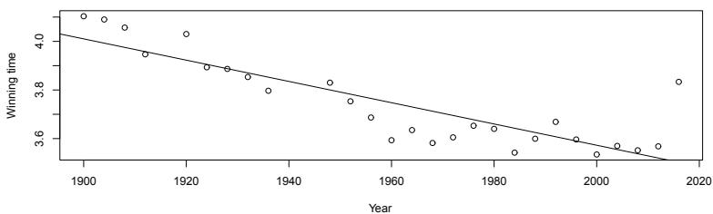

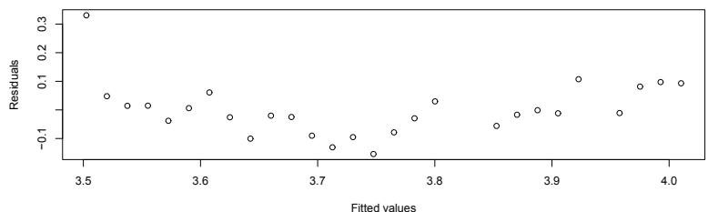  
Figure 9.6.2: The top panel is the scatterplot of winning times in the men's 1500 meters versus the year of the Olympics. The least squares fit is overlaid. The bottom panel is the residual plot of the fit.

# 9.6.2 *Geometry of the Least Squares Fit

In the modern literature, linear models are usually expressed in terms of matrices and vectors, which we briefly introduce in this example. Furthermore, this allows us to discuss the simple geometry behind the least squares fit. Consider then Model (9.6.1). Write the vectors $\mathbf{Y} = (Y_1,\dots ,Y_n)'$ , $\mathbf{e} = (e_1,\dots ,e_n)'$ , and $\mathbf{x}_c = (x_1 - \overline{x},\ldots ,x_n - \overline{x})'$ . Let $\mathbf{1}$ denote the $n\times 1$ vector whose components are all 1. Then

Model (9.6.1) can be expressed equivalently as

$$
\begin{array}{l} \mathbf {Y} = \alpha \mathbf {1} + \beta \mathbf {x} _ {c} + \mathbf {e} \\ = \mathbf {\alpha} [ \mathbf {1 x} _ {c} ] \left( \begin{array}{c} \alpha \\ \beta \end{array} \right) + \mathbf {e} \\ = \mathbf {X} \boldsymbol {\beta} + \mathbf {e}, \tag {9.6.13} \\ \end{array}
$$

where $\mathbf{X}$ is the $n\times 2$ matrix with columns $\mathbf{1}$ and $\mathbf{x}_c$ and $\beta = (\alpha ,\beta)^{\prime}$ . Next, let $\pmb {\theta} = E(\mathbf{Y}) = \mathbf{X}\pmb {\beta}$ . Finally, let $V$ be the two-dimensional subspace of $R^n$ spanned by the columns of $\mathbf{X}$ ; i.e., $V$ is the range of the matrix $\mathbf{X}$ . Hence we can also express the model succinctly as

$$
\mathbf {Y} = \boldsymbol {\theta} + \mathbf {e}, \quad \boldsymbol {\theta} \in V. \tag {9.6.14}
$$

Hence, except for the random error vector $\mathbf{e}$ , $\mathbf{Y}$ would lie in $V$ . It makes sense intuitively then, as suggested by Figure 9.6.3, to estimate $\pmb{\theta}$ by the vector in $V$ that is "closest" (in Euclidean distance) to $\mathbf{Y}$ , that is, by $\hat{\pmb{\theta}}$ , where

$$
\hat {\boldsymbol {\theta}} = \operatorname {A r g m i n} _ {\boldsymbol {\theta} \in V} \| \mathbf {Y} - \boldsymbol {\theta} \| ^ {2}, \tag {9.6.15}
$$

where the square of the Euclidean norm is given by $\| \mathbf{u}\| ^2 = \sum_{i = 1}^n u_i^2$ , for $\mathbf{u}\in R^n$ . As shown in Exercise 9.6.13 and depicted on the plot in Figure 9.6.3, $\hat{\pmb{\theta}} = \hat{\alpha}\mathbf{1} + \hat{\beta}\mathbf{x}_c$ , where $\hat{\alpha}$ and $\hat{\beta}$ are the least squares estimates given above. Also, the vector $\hat{\mathbf{e}} = \mathbf{Y} - \hat{\pmb{\theta}}$ is the vector of residuals and $n\hat{\sigma}^2 = \| \hat{\mathbf{e}}\|^2$ . Also, just as depicted in Figure 9.6.3, the angle between the vectors $\hat{\pmb{\theta}}$ and $\hat{\mathbf{e}}$ is a right angle. In linear models, we say that $\hat{\pmb{\theta}}$ is the projection of $\mathbf{Y}$ onto the subspace $V$ .

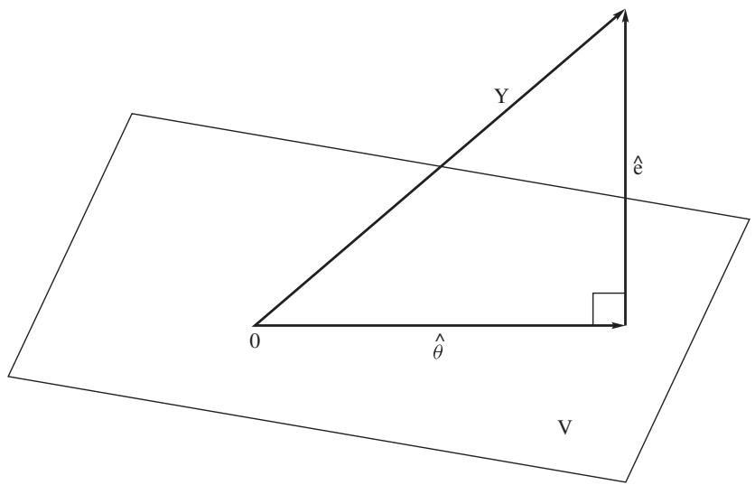  
Figure 9.6.3: The sketch shows the geometry of least squares. The vector of responses is $\mathbf{Y}$ , the fit is $\widehat{\pmb{\theta}}$ , and the vector of residuals is $\hat{\mathbf{e}}$ .

# EXERCISES

9.6.1. Obtain the least squares estimates for the model $y_{i} = \alpha^{*} + \beta x_{i} + e_{i}$ by minimizing the sum of squares given in expression (9.6.11). Determine the distribution of $\hat{\alpha}^*$ .

9.6.2. Students' scores on the mathematics portion of the ACT examination, $x$ , and on the final examination in the first-semester calculus (200 points possible), $y$ , are:

<table><tr><td>x</td><td>25</td><td>20</td><td>26</td><td>26</td><td>28</td><td>28</td><td>29</td><td>32</td><td>20</td><td>25</td></tr><tr><td>y</td><td>138</td><td>84</td><td>104</td><td>112</td><td>88</td><td>132</td><td>90</td><td>183</td><td>100</td><td>143</td></tr><tr><td>x</td><td>26</td><td>28</td><td>25</td><td>31</td><td>30</td><td rowspan="2" colspan="5"></td></tr><tr><td>y</td><td>141</td><td>161</td><td>124</td><td>118</td><td>168</td></tr></table>

The data are also in the rda file regr1.rda. Use R or another statistical package for computation and plotting.

(a) Calculate the least squares regression line for these data.   
(b) Plot the points and the least squares regression line on the same graph.   
(c) Obtain the residual plot and comment on the appropriateness of the model.   
(d) Find $95\%$ confidence interval for $\beta$ under the usual assumptions. Comment in terms of the problem.

9.6.3 (Telephone Data). Consider the data presented below. The responses $(y)$ for this data set are the numbers of telephone calls (tens of millions) made in Belgium for the years 1950 through 1973. Time, the years, serves as the predictor variable $(x)$ . The data are discussed on page 172 of Hettmansperger and McKean (2011) and are in the file telephone.rda.

<table><tr><td>Year</td><td>50</td><td>51</td><td>52</td><td>53</td><td>54</td><td>55</td></tr><tr><td>No. Calls</td><td>0.44</td><td>0.47</td><td>0.47</td><td>0.59</td><td>0.66</td><td>0.73</td></tr><tr><td>Year</td><td>56</td><td>57</td><td>58</td><td>59</td><td>60</td><td>61</td></tr><tr><td>No. Calls</td><td>0.81</td><td>0.88</td><td>1.06</td><td>1.20</td><td>1.35</td><td>1.49</td></tr><tr><td>Year</td><td>62</td><td>63</td><td>64</td><td>65</td><td>66</td><td>67</td></tr><tr><td>No. Calls</td><td>1.61</td><td>2.12</td><td>11.90</td><td>12.40</td><td>14.20</td><td>15.90</td></tr><tr><td>Year</td><td>68</td><td>69</td><td>70</td><td>71</td><td>72</td><td>73</td></tr><tr><td>No. Calls</td><td>18.20</td><td>21.20</td><td>4.30</td><td>2.40</td><td>2.70</td><td>2.90</td></tr></table>

(a) Calculate the least squares regression line for these data.   
(b) Plot the points and the least squares regression line on the same graph.   
(c) What is the reason for the poor least squares fit?

9.6.4. Show that the covariance between $\hat{\alpha}$ and $\hat{\beta}$ is zero.

9.6.5. Find $(1 - \alpha)100\%$ confidence intervals for the parameters $\alpha$ and $\beta$ in Model (9.6.1).

9.6.6. Consider Model (9.6.1). Let $\eta_0 = E(Y|x = x_0 - \overline{x})$ . The least squares estimator of $\eta_0$ is $\hat{\eta}_0 = \hat{\alpha} + \hat{\beta}(x_0 - \overline{x})$ .

(a) Using (9.6.9), show that $\hat{\eta}_0$ is an unbiased estimator and show that its variance is given by

$$
V (\hat {\eta} _ {0}) = \sigma^ {2} \left[ \frac {1}{n} + \frac {(x _ {0} - \overline {{x}}) ^ {2}}{\sum_ {i = 1} ^ {n} (x _ {1} - \overline {{x}}) ^ {2}} \right]
$$

(b) Obtain the distribution of $\hat{\eta}_0$ and use it to determine a $(1 - \alpha)100\%$ confidence interval for $\eta_0$ .

9.6.7. Assume that the sample $(x_{1},Y_{1}),\ldots ,(x_{n},Y_{n})$ follows the linear model (9.6.1). Suppose $Y_{0}$ is a future observation at $x = x_0 - \overline{x}$ and we want to determine a predictive interval for it. Assume that the model (9.6.1) holds for $Y_{0}$ ; i.e., $Y_{0}$ has a $N(\alpha +\beta (x_0 - \overline{x}),\sigma^2)$ distribution. We use $\hat{\eta}_0$ of Exercise 9.6.6 as our prediction of $Y_{0}$ .

(a) Obtain the distribution of $Y_0 - \hat{\eta}_0$ , showing that its variance is:

$$
V (Y _ {0} - \hat {\eta} _ {0}) = \sigma^ {2} \left[ 1 + \frac {1}{n} + \frac {(x _ {0} - \overline {{x}}) ^ {2}}{\sum_ {i = 1} ^ {n} (x _ {1} - \overline {{x}}) ^ {2}} \right]
$$

Use the fact that the future observation $Y_{0}$ is independent of the sample $(x_{1},Y_{1}),\ldots ,(x_{n},Y_{n})$ .

(b) Determine a $t$ -statistic with numerator $Y_0 - \hat{\eta}_0$   
(c) Now beginning with $1 - \alpha = P[-t_{\alpha /2,n - 2} < T < t_{\alpha /2,n - 2}]$ , where $0 < \alpha < 1$ , determine a $(1 - \alpha)100\%$ predictive interval for $Y_0$ .   
(d) Compare this predictive interval with the confidence interval obtained in Exercise 9.6.6. Intuitively, why is the predictive interval larger?

9.6.8. In Example 9.6.1, we obtain the predicted winning time for the men's 1500 meters in the 2020 Olympics. Compute the $95\%$ predictive interval for this prediction that is given in the last exercise. These computations are performed by the R function cipi.R. The call is cipi(lm(time~year),matrix(c(1,2020),ncol=2)). In terms of the problem, what does this predictive interval mean? Next compute the prediction for the 2024 and 2028 Olympics. Why are the intervals increasing in length?

# 9.6.9. Show that

$$
\sum_ {i = 1} ^ {n} [ Y _ {i} - \alpha - \beta (x _ {i} - \overline {{x}}) ] ^ {2} = n (\hat {\alpha} - \alpha) ^ {2} + (\hat {\beta} - \beta) ^ {2} \sum_ {i = 1} ^ {n} (x _ {i} - \overline {{x}}) ^ {2} + \sum_ {i = 1} ^ {n} [ Y _ {i} - \hat {\alpha} - \hat {\beta} (x _ {i} - \overline {{x}}) ] ^ {2}.
$$

9.6.10. Let the independent random variables $Y_{1}, Y_{2}, \ldots, Y_{n}$ have, respectively, the probability density functions $N(\beta x_{i}, \gamma^{2}x_{i}^{2})$ , $i = 1, 2, \ldots, n$ , where the given numbers $x_{1}, x_{2}, \ldots, x_{n}$ are not all equal and no one is zero. Find the maximum likelihood estimators of $\beta$ and $\gamma^{2}$ .

9.6.11. Let the independent random variables $Y_{1},\ldots ,Y_{n}$ have the joint pdf

$$
L (\alpha , \beta , \sigma^ {2}) = \left(\frac {1}{2 \pi \sigma^ {2}}\right) ^ {n / 2} \exp \left\{- \frac {1}{2 \sigma^ {2}} \sum_ {1} ^ {n} [ y _ {i} - \alpha - \beta (x _ {i} - \overline {{x}}) ] ^ {2} \right\},
$$

where the given numbers $x_{1}, x_{2}, \ldots, x_{n}$ are not all equal. Let $H_{0}: \beta = 0$ ( $\alpha$ and $\sigma^{2}$ unspecified). It is desired to use a likelihood ratio test to test $H_{0}$ against all possible alternatives. Find $\Lambda$ and see whether the test can be based on a familiar statistic.

Hint: In the notation of this section, show that

$$
\sum_ {1} ^ {n} (Y _ {i} - \hat {\alpha}) ^ {2} = Q _ {3} + \widehat {\beta} ^ {2} \sum_ {1} ^ {n} (x _ {i} - \overline {{x}}) ^ {2}.
$$

9.6.12. Using the notation of Section 9.2, assume that the means $\mu_{j}$ satisfy a linear function of $j$ , namely, $\mu_{j} = c + d[j - (b + 1) / 2]$ . Let independent random samples of size $a$ be taken from the $b$ normal distributions having means $\mu_{1}, \mu_{2}, \ldots, \mu_{b}$ , respectively, and common unknown variance $\sigma^2$ .

(a) Show that the maximum likelihood estimators of $c$ and $d$ are, respectively, $\hat{c} = \overline{X}_{\cdot}$ and

$$
\hat {d} = \frac {\sum_ {j = 1} ^ {b} [ j - (b - 1) / 2 ] (\overline {{X}} _ {\cdot , j} - \overline {{X}} _ {\cdot , \cdot})}{\sum_ {j = 1} ^ {b} [ j - (b + 1) / 2 ] ^ {2}}.
$$

(b) Show that

$$
\begin{array}{l} \sum_ {i = 1} ^ {a} \sum_ {j = 1} ^ {b} (X _ {i j} - \overline {{X}} _ {\cdot \cdot}) ^ {2} = \sum_ {i = 1} ^ {a} \sum_ {j = 1} ^ {b} \left[ X _ {i j} - \overline {{X}} _ {\cdot \cdot} - \hat {d} \left(j - \frac {b + 1}{2}\right) \right] ^ {2} \\ + \hat {d} ^ {2} \sum_ {j = 1} ^ {b} a \left(j - \frac {b + 1}{2}\right) ^ {2}. \\ \end{array}
$$

(c) Argue that the two terms in the right-hand member of part (b), once divided by $\sigma^2$ , are independent random variables with $\chi^2$ distributions provided that $d = 0$ .

(d) What $F$ -statistic would be used to test the equality of the means, that is, $H_0: d = 0$ ?

9.6.13. Consider the discussion in Section 9.6.2.

(a) Show that $\hat{\pmb{\theta}} = \hat{\alpha}\mathbf{1} + \hat{\beta}\mathbf{x}_c$ , where $\hat{\alpha}$ and $\hat{\beta}$ are the least squares estimators derived in this section.   
(b) Show that the vector $\hat{\mathbf{e}} = \mathbf{Y} - \hat{\pmb{\theta}}$ is the vector of residuals; i.e., its $ith$ entry is $\hat{e}_i$ , (9.6.7).

(c) As depicted in Figure 9.6.3, show that the angle between the vectors $\hat{\theta}$ and $\hat{\mathbf{e}}$ is a right angle.

(d) Show that the residuals sum to zero; i.e., $\mathbf{1}'\hat{\mathbf{e}} = 0$

9.6.14. Fit $y = a + x$ to the data

<table><tr><td>x</td><td>0</td><td>1</td><td>2</td></tr><tr><td>y</td><td>1</td><td>3</td><td>4</td></tr></table>

by the method of least squares.

9.6.15. Fit by the method of least squares the plane $z = a + bx + cy$ to the five points $(x, y, z): (-1, -2, 5), (0, -2, 4), (0, 0, 4), (1, 0, 2), (2, 1, 0)$ .

Let the R vectors $\mathbf{x}, \mathbf{y}, \mathbf{z}$ contain the values for $x, y$ , and $z$ . Then the LS fit is computed by $\mathrm{lm}(\mathbf{z} \sim \mathbf{x} + \mathbf{y})$ .

9.6.16. Let the $4 \times 1$ matrix $\mathbf{Y}$ be multivariate normal $N(\mathbf{X}\boldsymbol{\beta},\sigma^2\mathbf{I})$ , where the $4 \times 3$ matrix $\mathbf{X}$ equals

$$
\boldsymbol {X} = \left[ \begin{array}{c c c} 1 & 1 & 2 \\ 1 & - 1 & 2 \\ 1 & 0 & - 3 \\ 1 & 0 & - 1 \end{array} \right]
$$

and $\beta$ is the $3\times 1$ regression coefficient matrix.

(a) Find the mean matrix and the covariance matrix of $\hat{\beta} = (X'X)^{-1}X'Y$ .

(b) If we observe $\mathbf{Y}'$ to be equal to (6,1,11,3), compute $\hat{\beta}$ .

9.6.17. Suppose $\mathbf{Y}$ is an $n \times 1$ random vector, $\mathbf{X}$ is an $n \times p$ matrix of known constants of rank $p$ , and $\beta$ is a $p \times 1$ vector of regression coefficients. Let $\mathbf{Y}$ have a $N(\mathbf{X}\boldsymbol{\beta},\sigma^2\mathbf{I})$ distribution. Obtain the pdf of $\hat{\boldsymbol{\beta}} = (\mathbf{X}'\mathbf{X})^{-1}\mathbf{X}'\mathbf{Y}$ .

9.6.18. Let the independent normal random variables $Y_{1}, Y_{2}, \ldots, Y_{n}$ have, respectively, the probability density functions $N(\mu, \gamma^{2}x_{i}^{2})$ , $i = 1, 2, \ldots, n$ , where the given $x_{1}, x_{2}, \ldots, x_{n}$ are not all equal and no one of which is zero. Discuss the test of the hypothesis $H_{0}: \gamma = 1$ , $\mu$ unspecified, against all alternatives $H_{1}: \gamma \neq 1$ , $\mu$ unspecified.

# 9.7 A Test of Independence

Let $X$ and $Y$ have a bivariate normal distribution with means $\mu_{1}$ and $\mu_{2}$ , positive variances $\sigma_{1}^{2}$ and $\sigma_{2}^{2}$ , and correlation coefficient $\rho$ . We wish to test the hypothesis that $X$ and $Y$ are independent. Because two jointly normally distributed random variables are independent if and only if $\rho = 0$ , we test the hypothesis $H_{0}: \rho = 0$ against the hypothesis $H_{1}: \rho \neq 0$ . A likelihood ratio test is used. Let $(X_{1}, Y_{1}), (X_{2}, Y_{2}), \ldots, (X_{n}, Y_{n})$ denote a random sample of size $n > 2$ from the

bivariate normal distribution; that is, the joint pdf of these $2n$ random variables is given by

$$
f (x _ {1}, y _ {1}) f (x _ {2}, y _ {2}) \dots f (x _ {n}, y _ {n}).
$$

Although it is fairly difficult to show, the statistic that is defined by the likelihood ratio $\Lambda$ is a function of the statistic, which is the mle of $\rho$ , namely,

$$
R = \frac {\sum_ {i = 1} ^ {n} \left(X _ {i} - \bar {X}\right) \left(Y _ {i} - \bar {Y}\right)}{\sqrt {\sum_ {i = 1} ^ {n} \left(X _ {i} - \bar {X}\right) ^ {2} \sum_ {i = 1} ^ {n} \left(Y _ {i} - \bar {Y}\right) ^ {2}}}. \tag {9.7.1}
$$

This statistic $R$ is called the sample correlation coefficient of the random sample. Following the discussion after expression (5.4.5), the statistic $R$ is a consistent estimate of $\rho$ ; see Exercise 9.7.5. The likelihood ratio principle, which calls for the rejection of $H_0$ if $\Lambda \leq \lambda_0$ , is equivalent to the computed value of $|R| \geq c$ . That is, if the absolute value of the correlation coefficient of the sample is too large, we reject the hypothesis that the correlation coefficient of the distribution is equal to zero. To determine a value of $c$ for a satisfactory significance level, it is necessary to obtain the distribution of $R$ , or a function of $R$ , when $H_0$ is true, as we outline next.

Let $X_{1} = x_{1}, X_{2} = x_{2}, \ldots, X_{n} = x_{n}$ , $n > 2$ , where $x_{1}, x_{2}, \ldots, x_{n}$ and $\overline{x} = \sum_{1}^{n} x_{i} / n$ are fixed numbers such that $\sum_{1}^{n} (x_{i} - \overline{x})^{2} > 0$ . Consider the conditional pdf of $Y_{1}, Y_{2}, \ldots, Y_{n}$ given that $X_{1} = x_{1}, X_{2} = x_{2}, \ldots, X_{n} = x_{n}$ . Because $Y_{1}, Y_{2}, \ldots, Y_{n}$ are independent and, with $\rho = 0$ , are also independent of $X_{1}, X_{2}, \ldots, X_{n}$ , this conditional pdf is given by

$$
\left(\frac {1}{\sqrt {2 \pi} \sigma_ {2}}\right) ^ {n} \exp \left\{- \frac {1}{2 \sigma_ {2} ^ {2}} \sum_ {1} ^ {n} (y _ {i} - \mu_ {2}) ^ {2} \right\}.
$$

Let $R_{c}$ be the correlation coefficient, given $X_{1} = x_{1}, X_{2} = x_{2}, \ldots, X_{n} = x_{n}$ , so that

$$
\frac {R _ {c} \sqrt {\sum_ {i = 1} ^ {n} \left(Y _ {i} - \bar {Y}\right) ^ {2}}}{\sqrt {\sum_ {i = 1} ^ {n} \left(x _ {i} - \bar {x}\right) ^ {2}}} = \frac {\sum_ {i = 1} ^ {n} \left(x _ {i} - \bar {x}\right) \left(Y _ {i} - \bar {Y}\right)}{\sum_ {i = 1} ^ {n} \left(x _ {i} - \bar {x}\right) ^ {2}} = \frac {\sum_ {i = 1} ^ {n} \left(x _ {i} - \bar {x}\right) Y _ {i}}{\sum_ {i = 1} ^ {n} \left(x _ {i} - \bar {x}\right) ^ {2}} \tag {9.7.2}
$$

is $\hat{\beta}$ , expression (9.6.5) of Section 9.6. Conditionally the mean of $Y_{i}$ is $\mu_{2}$ ; i.e., a constant. So here expression (9.7.2) has expectation 0 which implies that $E(R_{c}) = 0$ . Next consider the $t$ -ratio of $\hat{\beta}$ given by $T_{2}$ of expression (9.6.10) of Section 9.6. In this notation $T_{2}$ can be expressed as

$$
T _ {2} = \frac {R _ {c} \sqrt {\sum \left(Y _ {i} - \bar {Y}\right) ^ {2}} / \sqrt {\sum \left(x _ {i} - \bar {x}\right) ^ {2}}}\sqrt {\frac {\sum_ {i = 1} ^ {n} \left\{Y _ {i} - \bar {Y} - \left[ R _ {c} \sqrt {\sum_ {j = 1} ^ {n} \left(Y _ {j} - \bar {Y}\right) ^ {2}} / \sqrt {\sum_ {j = 1} ^ {n} \left(x _ {j} - \bar {x}\right) ^ {2}} \right] (x _ {i} - \bar {x}) \right\} ^ {2}}{(n - 2) \sum_ {j = 1} ^ {n} (x _ {j} - \bar {x}) ^ {2}}} = \frac {R _ {c} \sqrt {n - 2}}{\sqrt {1 - R _ {c} ^ {2}}}. \tag {9.7.3}
$$

Thus $T_{2}$ , given $X_{1} = x_{1},\ldots ,X_{n} = x_{n}$ , has a conditional $t$ -distribution with $n - 2$ degrees of freedom. Note that the pdf, say $g(t)$ , of this $t$ -distribution does not depend upon $x_{1},x_{2},\ldots ,x_{n}$ . Now the joint pdf of $X_{1},X_{2},\ldots ,X_{n}$ and $R\sqrt{n - 2} /\sqrt{1 - R^2}$ , where $R$ is given by expression (9.7.1), is the product of $g(t)$ and the joint pdf of $X_{1},\ldots ,X_{n}$ . Integration on $x_{1},\ldots ,x_{n}$ yields the marginal pdf of $R\sqrt{n - 2} /\sqrt{1 - R^2}$ ; because $g(t)$ does not depend upon $x_{1},x_{2},\ldots ,x_{n}$ , it is obvious that this marginal pdf is $g(t)$ , the conditional pdf of $R\sqrt{n - 2} /\sqrt{1 - R^2}$ . The change-of-variable technique can now be used to find the pdf of $R$ .

Remark 9.7.1. Since $R$ has, when $\rho = 0$ , a conditional distribution that does not depend upon $x_{1}, x_{2}, \ldots, x_{n}$ (and hence that conditional distribution is, in fact, the marginal distribution of $R$ ), we have the remarkable fact that $R$ is independent of $X_{1}, X_{2}, \ldots, X_{n}$ . It follows that $R$ is independent of every function of $X_{1}, X_{2}, \ldots, X_{n}$ alone, that is, a function that does not depend upon any $Y_{i}$ . In like manner, $R$ is independent of every function of $Y_{1}, Y_{2}, \ldots, Y_{n}$ alone. Moreover, a careful review of the argument reveals that nowhere did we use the fact that $X$ has a normal marginal distribution. Thus, if $X$ and $Y$ are independent, and if $Y$ has a normal distribution, then $R$ has the same conditional distribution whatever the distribution of $X$ , subject to the condition $\sum_{1}^{n}(x_{i} - \overline{x})^{2} > 0$ . Moreover, if $P[\sum_{1}^{n}(X_{i} - \overline{X})^{2} > 0] = 1$ , then $R$ has the same marginal distribution whatever the distribution of $X$ .

If we write $T = R\sqrt{n - 2} / \sqrt{1 - R^2}$ , where $T$ has a $t$ -distribution with $n - 2 > 0$ degrees of freedom, it is easy to show by the change-of-variable technique (Exercise 9.7.4) that the pdf of $R$ is given by

$$
h (r) = \left\{ \begin{array}{l l} \frac {\Gamma [ (n - 1) / 2 ]}{\Gamma (\frac {1}{2}) \Gamma [ (n - 2) / 2 ]} (1 - r ^ {2}) ^ {(n - 4) / 2} & - 1 <   r <   1 \\ 0 & \text {e l s e w h e r e .} \end{array} \right. \tag {9.7.4}
$$

We have now solved the problem of the distribution of $R$ , when $\rho = 0$ and $n > 2$ , or perhaps more conveniently, that of $R\sqrt{n - 2} / \sqrt{1 - R^2}$ . The likelihood ratio test of the hypothesis $H_0: \rho = 0$ against all alternatives $H_1: \rho \neq 0$ may be based either on the statistic $R$ or on the statistic $R\sqrt{n - 2} / \sqrt{1 - R^2} = T$ , although the latter is easier to use. Therefore, a level $\alpha$ test is to reject $H_0: \rho = 0$ if $|T| \geq t_{\alpha / 2, n - 2}$ .

Remark 9.7.2. It is possible to obtain an approximate test of size $\alpha$ by using the fact that

$$
W = \frac {1}{2} \log \left(\frac {1 + R}{1 - R}\right)
$$

has an approximate normal distribution with mean $\frac{1}{2}\log [(1 + \rho) / (1 - \rho)]$ and with variance $1 / (n - 3)$ . We accept this statement without proof. Thus a test of $H_0$ : $\rho = 0$ can be based on the statistic

$$
Z = \frac {\frac {1}{2} \log [ (1 + R) / (1 - R) ] - \frac {1}{2} \log [ (1 + \rho) / (1 - \rho) ]}{\sqrt {1 / (n - 3)}}, \tag {9.7.5}
$$

with $\rho = 0$ so that $\frac{1}{2}\log [(1 + \rho) / (1 - \rho)] = 0$ . However, using $W$ , we can also test a hypothesis like $H_0: \rho = \rho_0$ against $H_1: \rho \neq \rho_0$ , where $\rho_0$ is not necessarily zero. In that case, the hypothesized mean of $W$ is

$$
\frac {1}{2} \log \left(\frac {1 + \rho_ {0}}{1 - \rho_ {0}}\right).
$$

Furthermore, as outlined in Exercise 9.7.6, $Z$ can be used to obtain an asymptotic confidence interval for $\rho$ .

# EXERCISES

9.7.1. Show that

$$
R = \frac {\sum_ {1} ^ {n} \left(X _ {i} - \bar {X}\right) \left(Y _ {i} - \bar {Y}\right)}{\sqrt {\sum_ {1} ^ {n} \left(X _ {i} - \bar {X}\right) ^ {2} \sum_ {1} ^ {n} \left(Y _ {i} - \bar {Y}\right) ^ {2}}} = \frac {\sum_ {1} ^ {n} X _ {i} Y _ {i} - n \overline {{X Y}}}{\sqrt {\left(\sum_ {1} ^ {n} X _ {i} ^ {2} - n \bar {X} ^ {2}\right) \left(\sum_ {1} ^ {n} Y _ {i} ^ {2} - n \bar {Y} ^ {2}\right)}}.
$$

9.7.2. A random sample of size $n = 6$ from a bivariate normal distribution yields a value of the correlation coefficient of 0.89. Would we accept or reject, at the $5\%$ significance level, the hypothesis that $\rho = 0$ ?

9.7.3. Verify Equation (9.7.3) of this section.

9.7.4. Verify the pdf (9.7.4) of this section.

9.7.5. Using the results of Section 4.5, show that $R$ , (9.7.1), is a consistent estimate of $\rho$ .

9.7.6. By doing the following steps, determine a $(1 - \alpha)100\%$ approximate confidence interval for $\rho$ .

(a) For $0 < \alpha < 1$ , in the usual way, start with $1 - \alpha = P(-z_{\alpha /2} < Z < z_{\alpha /2})$ where $Z$ is given by expression (9.7.5). Then isolate $h(\rho) = (1 / 2)\log [(1 + \rho) / (1 - \rho)]$ in the middle part of the inequality. Find $h^\prime (\rho)$ and show that it is strictly positive on $-1 < \rho < 1$ ; hence, $h$ is strictly increasing and its inverse function exists.   
(b) Show that this inverse function is the hyperbolic tangent function given by $\tanh(y) = (e^y - e^{-y}) / (e^y + e^{-y})$ .   
(c) Obtain a $(1 - \alpha)100\%$ confidence interval for $\rho$

9.7.7. The intrinsic R function cor.test(x,y) computes the estimate of $\rho$ and the confidence interval in Exercise 9.7.6. Recall the baseball data which is in the file bb.rda.

(a) Using the baseball data, determine the estimate and the confidence interval for the correlation coefficient between height and weight for professional baseball players.

(b) Separate the pitchers and hitters and for each obtain the estimate and confidence for the correlation coefficient between height and weight. Do they differ significantly?

(c) Argue that the difference in the estimates of the correlation coefficients is the mole of $\rho_{1} - \rho_{2}$ for two independent samples, as in Part (b).

9.7.8. Two experiments gave the following results:

<table><tr><td>n</td><td>x̅</td><td>y̅</td><td>sx</td><td>sy</td><td>r</td></tr><tr><td>100</td><td>10</td><td>20</td><td>5</td><td>8</td><td>0.70</td></tr><tr><td>200</td><td>12</td><td>22</td><td>6</td><td>10</td><td>0.80</td></tr></table>

Calculate $r$ for the combined sample.

# 9.8 The Distributions of Certain Quadratic Forms

Remark 9.8.1. It is essential that the reader have the background of the multivariate normal distribution as given in Section 3.5 to understand Sections 9.8 and 9.9.

Remark 9.8.2. We make use of the trace of a square matrix. If $\mathbf{A} = [a_{ij}]$ is an $n\times n$ matrix, then we define the trace of $\mathbf{A}$ , (tr $\mathbf{A}$ ), to be the sum of its diagonal entries; i.e.,

$$
\operatorname {t r} \mathbf {A} = \sum_ {i = 1} ^ {n} a _ {i i}. \tag {9.8.1}
$$

The trace of a matrix has several interesting properties. One is that it is a linear operator; that is,

$$
\operatorname {t r} \left(a \mathbf {A} + b \mathbf {B}\right) = a \operatorname {t r} \mathbf {A} + b \operatorname {t r} \mathbf {B}. \tag {9.8.2}
$$

A second useful property is: If $\mathbf{A}$ is an $n\times m$ matrix, $\mathbf{B}$ is an $m\times k$ matrix, and $\mathbf{C}$ is a $k\times n$ matrix, then

$$
\operatorname {t r} (\mathbf {A B C}) = \operatorname {t r} (\mathbf {B C A}) = \operatorname {t r} (\mathbf {C A B}). \tag {9.8.3}
$$

The reader is asked to prove these facts in Exercise 9.8.7. Finally, a simple but useful property is that $\operatorname{tr}a = a$ , for any scalar $a$ .

We begin this section with a more formal but equivalent definition of a quadratic form. Let $\mathbf{X} = (X_1, \ldots, X_n)$ be an $n$ -dimensional random vector and let $\mathbf{A}$ be a real $n \times n$ symmetric matrix. Then the random variable $Q = \mathbf{X}'\mathbf{A}\mathbf{X}$ is called a

quadratic form in $\mathbf{X}$ . Due to the symmetry of $\mathbf{A}$ , there are several ways we can write $Q$ :

$$
\begin{array}{l} Q = \mathbf {X} ^ {\prime} \mathbf {A} \mathbf {X} = \sum_ {i = 1} ^ {n} \sum_ {j = 1} ^ {n} a _ {i j} X _ {i} X _ {j} = \sum_ {i = 1} ^ {n} a _ {i i} X _ {i} ^ {2} + \sum_ {i \neq j} a _ {i j} X _ {i} X _ {j} (9.8.4) \\ = \sum_ {i = 1} ^ {n} a _ {i i} X _ {i} ^ {2} + 2 \sum_ {i <   j} a _ {i j} X _ {i} X _ {j}. (9.8.5) \\ \end{array}
$$

These are very useful random variables in analysis of variance models. As the following theorem shows, the mean of a quadratic form is easily obtained.

Theorem 9.8.1. Suppose the $n$ -dimensional random vector $\mathbf{X}$ has mean $\mu$ and variance-covariance matrix $\boldsymbol{\Sigma}$ . Let $Q = \mathbf{X}'\mathbf{A}\mathbf{X}$ , where $\mathbf{A}$ is a real $n \times n$ symmetric matrix. Then

$$
E (Q) = t r \mathbf {A} \boldsymbol {\Sigma} + \boldsymbol {\mu} ^ {\prime} \mathbf {A} \boldsymbol {\mu}. \tag {9.8.6}
$$

Proof: Using the trace operator and property (9.8.3), we have

$$
\begin{array}{l} E (Q) = E (\operatorname {t r} \mathbf {X} ^ {\prime} \mathbf {A X}) = E (\operatorname {t r} \mathbf {A X X} ^ {\prime}) \\ = \operatorname {t r} \mathbf {A} E \left(\mathbf {X X} ^ {\prime}\right) \\ = \operatorname {t r} \mathbf {A} \left(\boldsymbol {\Sigma} + \boldsymbol {\mu} \boldsymbol {\mu} ^ {\prime}\right) \\ = \operatorname {t r} \mathbf {A} \boldsymbol {\Sigma} + \mu^ {\prime} \mathbf {A} \mu , \\ \end{array}
$$

where the third line follows from Theorem 2.6.3.

Example 9.8.1 (Sample Variance). Let $\mathbf{X}' = (X_1, \ldots, X_n)$ be an $n$ -dimensional vector of random variables. Let $\mathbf{1}' = (1, \ldots, 1)$ be the $n$ -dimensional vector whose components are 1. Let $\mathbf{I}$ be the $n \times n$ identity matrix. Consider the quadratic form $Q = \mathbf{X}'(\mathbf{I} - \frac{1}{n}\mathbf{J})\mathbf{X}$ , where $\mathbf{J} = \mathbf{11}'$ ; i.e., $\mathbf{J}$ is an $n \times n$ matrix with all entries equal to 1. Note that the off-diagonal entries of $(\mathbf{I} - \frac{1}{n}, \mathbf{J})$ are $-n^{-1}$ while the diagonal entries are $1 - n^{-1}$ ; hence, by (9.8.4), $Q$ simplifies to

$$
\begin{array}{l} Q = \sum_ {i = 1} ^ {n} X _ {i} ^ {2} \left(1 - \frac {1}{n}\right) + \sum_ {i \neq j} \left(- \frac {1}{n}\right) X _ {i} X _ {j} \\ = \sum_ {i = 1} ^ {n} X _ {i} ^ {2} \left(1 - \frac {1}{n}\right) - \frac {1}{n} \sum_ {i = 1} ^ {n} X _ {i} \sum_ {j = 1} ^ {n} X _ {j} + \frac {1}{n} \sum_ {i = 1} ^ {n} X _ {i} ^ {2} \\ = \sum_ {i = 1} ^ {n} X _ {i} ^ {2} - n \bar {X} ^ {2} = (n - 1) S ^ {2}, \tag {9.8.7} \\ \end{array}
$$

where $\overline{X}$ and $S^2$ denote the sample mean and variance of $X_{1},\ldots ,X_{n}$ .

Suppose we further assume that $X_{1},\ldots ,X_{n}$ are iid random variables with common mean $\mu$ and variance $\sigma^2$ . Using Theorem 9.8.1, we can obtain yet another

proof that $S^2$ is an unbiased estimate of $\sigma^2$ . Note that the mean of the random vector $\mathbf{X}$ is $\mu \mathbf{1}$ and that its variance-covariance matrix is $\sigma^2 \mathbf{I}$ . Based on Theorem 9.8.1, we find immediately that

$$
E (S ^ {2}) = \frac {1}{n - 1} \left\{\operatorname {t r} \left(\mathbf {I} - \frac {1}{n} \mathbf {J}\right) \sigma^ {2} \mathbf {I} + \mu^ {2} \left(\mathbf {1} ^ {\prime} \mathbf {1} - \frac {1}{n} \mathbf {1} ^ {\prime} \mathbf {1} \mathbf {1} ^ {\prime} \mathbf {1}\right) \right\} = \sigma^ {2}.
$$

The spectral decomposition of symmetric matrices proves quite useful in this part of the chapter. As discussed around expression (3.5.8), a real symmetric matrix $\mathbf{A}$ can be diagonalized as

$$
\mathbf {A} = \boldsymbol {\Gamma} ^ {\prime} \boldsymbol {\Lambda} \boldsymbol {\Gamma}, \tag {9.8.8}
$$

where $\Lambda$ is the diagonal matrix $\Lambda = \mathrm{diag}(\lambda_1,\dots ,\lambda_n)$ , $\lambda_{1}\geq \dots \geq \lambda_{n}$ are the eigenvalues of $\mathbf{A}$ , and the columns of $\Gamma^{\prime} = [\mathbf{v}_1\dots \mathbf{v}_n]$ are the corresponding orthonormal eigenvectors (i.e., $\Gamma$ is an orthogonal matrix). Recall from linear algebra that the rank of $\mathbf{A}$ is the number of nonzero eigenvalues. Further, because $\Lambda$ is diagonal, we can write this expression as

$$
\mathbf {A} = \sum_ {i = 1} ^ {n} \lambda_ {i} \mathbf {v} _ {i} \mathbf {v} _ {i} ^ {\prime}. \tag {9.8.9}
$$

The R command to compute the spectral decomposition of $\mathbf{A}$ is sdc=eigen(amat), where amat is the R matrix for $\mathbf{A}$ . The eigenvalues and eigenvectors are in the respective attributes sdc $\mathbf{\Phi}$ values and sdc $\mathbf{\Phi}$ vectors. For normal random variables, we make use of equation (9.8.9) to obtain the mgf of the quadratic form $Q$ in the next theorem, Theorem 9.8.2.

Theorem 9.8.2. Let $\mathbf{X}' = (X_1, \ldots, X_n)$ , where $X_1, \ldots, X_n$ are iid $N(0, \sigma^2)$ . Consider the quadratic form $Q = \sigma^{-2}\mathbf{X}'\mathbf{A}\mathbf{X}$ for a symmetric matrix $\mathbf{A}$ of rank $r \leq n$ . Then $Q$ has the moment generating function

$$
M (t) = \prod_ {i = 1} ^ {r} \left(1 - 2 t \lambda_ {i}\right) ^ {- 1 / 2} = | \mathbf {I} - 2 t \mathbf {A} | ^ {- 1 / 2}, \tag {9.8.10}
$$

where $\lambda_1, \ldots, \lambda_r$ are the nonzero eigenvalues of $\mathbf{A}$ , $|t| < 1/(2\lambda^*)$ , and the value of $\lambda^*$ is given by $\lambda^* = \max_{1 \leq i \leq r} |\lambda_i|$ .

Proof: Write the spectral decomposition of $\mathbf{A}$ as in expression (9.8.9). Since the rank of $\mathbf{A}$ is $r$ , exactly $r$ of the eigenvalues are not 0. Denote the nonzero eigenvalues by $\lambda_1, \ldots, \lambda_r$ . Then we can write $Q$ as

$$
Q = \sum_ {i = 1} ^ {r} \lambda_ {i} \left(\sigma^ {- 1} \mathbf {v} _ {i} ^ {\prime} \mathbf {X}\right) ^ {2}. \tag {9.8.11}
$$

Let $\Gamma_1' = [\mathbf{v}_1 \cdots \mathbf{v}_r]$ and define the $r$ -dimensional random vector $\mathbf{W}$ by $\mathbf{W} = \sigma^{-1} \Gamma_1 \mathbf{X}$ . Since $\mathbf{X}$ is $N_n(\mathbf{0}, \sigma^2 \mathbf{I}_n)$ and $\Gamma_1' \Gamma_1 = \mathbf{I}_r$ , Theorem 3.5.2 shows that $\mathbf{W}$ has a $N_r(\mathbf{0}, \mathbf{I}_r)$ distribution. In terms of the $W_i$ , we can write (9.8.11) as

$$
Q = \sum_ {i = 1} ^ {r} \lambda_ {i} W _ {i} ^ {2}. \tag {9.8.12}
$$

Because $W_{1}, \ldots, W_{r}$ are independent $N(0,1)$ random variables, $W_{1}^{2}, \ldots, W_{r}^{2}$ are independent $\chi^{2}(1)$ random variables. Thus the mgf of $Q$ is

$$
\begin{array}{l} E \left[ \exp \{t Q \} \right] = E \left[ \exp \left\{\sum_ {i = 1} ^ {r} t \lambda_ {i} W _ {i} ^ {2} \right\} \right] \\ = \prod_ {i = 1} ^ {r} E \left[ \exp \left\{t \lambda_ {i} W _ {i} ^ {2} \right\} \right] = \prod_ {i = 1} ^ {r} (1 - 2 t \lambda_ {i}) ^ {- 1 / 2}. \tag {9.8.13} \\ \end{array}
$$

The last equality holds if we assume that $|t| < 1 / (2\lambda^{*})$ , where $\lambda^{*} = \max_{1\leq i\leq r}|\lambda_i|$ ; see Exercise 9.8.6. To obtain the second form in (9.8.10), recall that the determinant of an orthogonal matrix is 1. The result then follows from

$$
\begin{array}{l} \left| \mathbf {I} - 2 t \mathbf {A} \right| = \left| \boldsymbol {\Gamma} ^ {\prime} \boldsymbol {\Gamma} - 2 t \boldsymbol {\Gamma} ^ {\prime} \boldsymbol {\Lambda} \boldsymbol {\Gamma} \right| = \left| \boldsymbol {\Gamma} ^ {\prime} (\mathbf {I} - 2 t \boldsymbol {\Lambda}) \boldsymbol {\Gamma} \right| \\ = \left. | \mathbf {I} - 2 t \boldsymbol {\Lambda} | = \left\{\prod_ {i = 1} ^ {r} (1 - 2 t \lambda_ {i}) ^ {- 1 / 2} \right\} ^ {- 2}. \right. \\ \end{array}
$$

Example 9.8.2. To illustrate this theorem, suppose $X_{i}$ , $i = 1,2,\ldots ,n$ , are independent random variables with $X_{i}$ distributed as $N(\mu_i,\sigma_i^2)$ , $i = 1,2,\dots,n$ , respectively. Let $Z_{i} = (X_{i} - \mu_{i}) / \sigma_{i}$ . We know that $\sum_{i = 1}^{n}Z_{i}^{2}$ has a $\chi^2$ distribution with $n$ degrees of freedom. To illustrate Theorem 9.8.2, let $\mathbf{Z}' = (Z_1,\dots,Z_n)$ . Let $Q = \mathbf{Z}'\mathbf{I}\mathbf{Z}$ . Hence the symmetric matrix associated with $Q$ is the identity matrix $\mathbf{I}$ , which has $n$ eigenvalues, all of value 1; i.e., $\lambda_{i}\equiv 1$ . By Theorem 9.8.2, the mgf of $Q$ is $(1 - 2t)^{-n / 2}$ ; i.e., $Q$ is distributed $\chi^2$ with $n$ degrees of freedom.

In general, from Theorem 9.8.2, note how close the mgf of the quadratic form $Q$ is to the mgf of a $\chi^2$ distribution. The next two theorems give conditions where this is true.

Theorem 9.8.3. Let $\mathbf{X}' = (X_1, X_2, \ldots, X_n)$ have a $N_n(\pmb{\mu}, \pmb{\Sigma})$ distribution, where $\pmb{\Sigma}$ is positive definite. Then $Q = (\mathbf{X} - \pmb{\mu})' \pmb{\Sigma}^{-1} (\mathbf{X} - \pmb{\mu})$ has a $\chi^2(n)$ distribution.

Proof: Write the spectral decomposition of $\pmb{\Sigma}$ as $\pmb {\Sigma} = \Gamma^{\prime}\pmb {\Lambda}\pmb{\Gamma}$ , where $\Gamma$ is an orthogonal matrix and $\Lambda = \mathrm{diag}\{\lambda_1,\dots ,\lambda_n\}$ is a diagonal matrix whose diagonal entries are the eigenvalues of $\pmb{\Sigma}$ . Because $\pmb{\Sigma}$ is positive definite, all $\lambda_{i} > 0$ . Hence we can write

$$
\boldsymbol {\Sigma} ^ {- 1} = \Gamma^ {\prime} \boldsymbol {\Lambda} ^ {- 1} \boldsymbol {\Gamma} = \Gamma^ {\prime} \boldsymbol {\Lambda} ^ {- 1 / 2} \boldsymbol {\Gamma} \boldsymbol {\Gamma} ^ {\prime} \boldsymbol {\Lambda} ^ {- 1 / 2} \boldsymbol {\Gamma},
$$

where $\Lambda^{-1 / 2} = \mathrm{diag}\{\lambda_1^{-1 / 2},\dots ,\lambda_n^{-1 / 2}\}$ . Thus we have

$$
Q = \left\{\Lambda^ {- 1 / 2} \Gamma (\mathbf {X} - \boldsymbol {\mu}) \right\} ^ {\prime} \mathbf {I} \left\{\Lambda^ {- 1 / 2} \Gamma (\mathbf {X} - \boldsymbol {\mu}) \right\}.
$$

But by Theorem 3.5.2, it is easy to show that the random vector $\pmb{\Lambda}^{-1/2}\pmb{\Gamma}(\mathbf{X} - \pmb{\mu})$ has a $N_{n}(\mathbf{0},\mathbf{I})$ distribution; hence, $Q$ has a $\chi^2(n)$ distribution.

The remarkable fact that the random variable $Q$ in the last theorem is $\chi^2(n)$ stimulates a number of questions about quadratic forms in normally distributed

variables. We would like to treat this problem generally, but limitations of space forbid this, and we find it necessary to restrict ourselves to some special cases; see, for instance, Stapleton (2009) for discussion.

Recall from linear algebra that a symmetric matrix $\mathbf{A}$ is idempotent if $\mathbf{A}^2 = \mathbf{A}$ . In Section 9.1, we have already met some idempotent matrices. For example, the matrix $\mathbf{I} - \frac{1}{n}\mathbf{J}$ of Example 9.8.1 is idempotent. Idempotent matrices possess some important characteristics. Suppose $\lambda$ is an eigenvalue of an idempotent matrix $\mathbf{A}$ with corresponding eigenvector $\mathbf{v}$ . Then the following identity is true:

$$
\lambda \mathbf {v} = \mathbf {A} \mathbf {v} = \mathbf {A} ^ {2} \mathbf {v} = \lambda \mathbf {A} \mathbf {v} = \lambda^ {2} \mathbf {v}.
$$

Hence $\lambda (\lambda -1)\mathbf{v} = \mathbf{0}$ . Since $\mathbf{v}\neq \mathbf{0}$ , $\lambda = 0$ or 1. Conversely, if the eigenvalues of a real symmetric matrix are only 0s and 1s then it is idempotent; see Exercise 9.8.10. Thus the rank of an idempotent matrix $\mathbf{A}$ is the number of its eigenvalues which are 1. Denote the spectral decomposition of $\mathbf{A}$ by $\mathbf{A} = \Gamma^{\prime}\boldsymbol {\Lambda}\boldsymbol{\Gamma}$ , where $\pmb{\Lambda}$ is a diagonal matrix of eigenvalues and $\pmb{\Gamma}$ is an orthogonal matrix whose columns are the corresponding orthonormal eigenvectors. Because the diagonal entries of $\pmb{\Lambda}$ are 0 or 1 and $\pmb{\Gamma}$ is orthogonal, we have

$$
\operatorname {t r} \mathbf {A} = \operatorname {t r} \boldsymbol {\Lambda} \boldsymbol {\Gamma} \boldsymbol {\Gamma} ^ {\prime} = \operatorname {t r} \boldsymbol {\Lambda} = \operatorname {r a n k} (\mathbf {A});
$$

i.e., the rank of an idempotent matrix is equal to its trace.

Theorem 9.8.4. Let $\mathbf{X}' = (X_1, \ldots, X_n)$ , where $X_1, \ldots, X_n$ are iid $N(0, \sigma^2)$ . Let $Q = \sigma^{-2}\mathbf{X}'\mathbf{A}\mathbf{X}$ for a symmetric matrix $\mathbf{A}$ with rank $r$ . Then $Q$ has a $\chi^2(r)$ distribution if and only if $\mathbf{A}$ is idempotent.

Proof: By Theorem 9.8.2, the mgf of $Q$ is

$$
M _ {Q} (t) = \prod_ {i = 1} ^ {r} \left(1 - 2 t \lambda_ {i}\right) ^ {- 1 / 2}, \tag {9.8.14}
$$

where $\lambda_1, \ldots, \lambda_r$ are the $r$ nonzero eigenvalues of $\mathbf{A}$ . Suppose, first, that $\mathbf{A}$ is idempotent. Then $\lambda_1 = \dots = \lambda_r = 1$ and the mgf of $Q$ is $M_Q(t) = (1 - 2t)^{-r/2}$ ; i.e., $Q$ has a $\chi^2(r)$ distribution. Next, suppose $Q$ has a $\chi^2(r)$ distribution. Then for $t$ in a neighborhood of 0, we have the identity

$$
\prod_ {i = 1} ^ {r} (1 - 2 t \lambda_ {i}) ^ {- 1 / 2} = (1 - 2 t) ^ {- r / 2},
$$

which, upon squaring both sides, leads to

$$
\prod_ {i = 1} ^ {r} (1 - 2 t \lambda_ {i}) = (1 - 2 t) ^ {r},
$$

By the uniqueness of the factorization of polynomials, $\lambda_1 = \dots = \lambda_r = 1$ . Hence $\mathbf{A}$ is idempotent.

Example 9.8.3. Based on this last theorem, we can obtain quickly the distribution of the sample variance when sampling from a normal distribution. Suppose $X_{1},X_{2},\ldots ,X_{n}$ are iid $N(\mu ,\sigma^2)$ . Let $\mathbf{X} = (X_1,X_2,\dots ,X_n)'$ . Then $\mathbf{X}$ has a $N_{n}(\mu \mathbf{1},\sigma^{2}\mathbf{I})$ distribution, where $\mathbf{1}$ denotes a $n\times 1$ vector with all components equal to 1. Let $S^2 = (n - 1)^{-1}\sum_{i = 1}^{n}(X_i - \overline{X})^2$ . Then by Example 9.8.1, we can write

$$
\frac {(n - 1) S ^ {2}}{\sigma^ {2}} = \sigma^ {- 2} \mathbf {X} ^ {\prime} \left(\mathbf {I} - \frac {1}{n} \mathbf {J}\right) \mathbf {X} = \sigma^ {- 2} (\mathbf {X} - \mu \mathbf {1}) ^ {\prime} \left(\mathbf {I} - \frac {1}{n} \mathbf {J}\right) (\mathbf {X} - \mu \mathbf {1}),
$$

where the last equality holds because $\left(\mathbf{I} - \frac{1}{n}\mathbf{J}\right)\mathbf{1} = \mathbf{0}$ . Because the matrix $\mathbf{I} - \frac{1}{n}\mathbf{J}$ is idempotent, $\operatorname{tr}\left(\mathbf{I} - \frac{1}{n}\mathbf{J}\right) = n - 1$ , and $\mathbf{X} - \mu \mathbf{1}$ is $N_{n}(\mathbf{0},\sigma^{2}\mathbf{I})$ , it follows from Theorem 9.8.4 that $(n - 1)S^2 /\sigma^2$ has a $\chi^2 (n - 1)$ distribution.

Remark 9.8.3. If the normal distribution in Theorem 9.8.4 is $N_{n}(\pmb{\mu}, \sigma^{2}\mathbf{I})$ , the condition $\mathbf{A}^2 = \mathbf{A}$ remains a necessary and sufficient condition that $Q / \sigma^2$ have a chi-square distribution. In general, however, $Q / \sigma^2$ is not central $\chi^2(r)$ but instead, $Q / \sigma^2$ has a noncentral chi-square distribution if $\mathbf{A}^2 = \mathbf{A}$ . The number of degrees of freedom is $r$ , the rank of $\mathbf{A}$ , and the noncentrality parameter is $\pmb{\mu}'\mathbf{A}\pmb{\mu} / \sigma^2$ . If $\pmb{\mu} = \pmb{\mu}\mathbf{1}$ , then $\pmb{\mu}'\mathbf{A}\pmb{\mu} = \mu^2\sum_{i,j}a_{ij}$ , where $\mathbf{A} = [a_{ij}]$ . Then, if $\mu \neq 0$ , the conditions $\mathbf{A}^2 = \mathbf{A}$ and $\sum_{i,j}a_{ij} = 0$ are necessary and sufficient conditions that $Q / \sigma^2$

be central $\chi^2 (r)$ . Moreover, the theorem may be extended to a quadratic form in random variables which have a multivariate normal distribution with positive definite covariance matrix $\pmb{\Sigma}$ ; here the necessary and sufficient condition that $Q$ have a chi-square distribution is $\mathbf{A}\pmb {\Sigma}\mathbf{A} = \mathbf{A}$ . See Exercise 9.8.9.

# EXERCISES

9.8.1. Let $Q = X_{1}X_{2} - X_{3}X_{4}$ , where $X_{1}, X_{2}, X_{3}, X_{4}$ is a random sample of size 4 from a distribution that is $N(0, \sigma^2)$ . Show that $Q / \sigma^2$ does not have a chi-square distribution. Find the mgf of $Q / \sigma^2$ .

9.8.2. Let $\mathbf{X}' = [X_1, X_2]$ be bivariate normal with matrix of means $\boldsymbol{\mu}' = [\mu_1, \mu_2]$ and positive definite covariance matrix $\boldsymbol{\Sigma}$ . Let

$$
Q _ {1} = \frac {X _ {1} ^ {2}}{\sigma_ {1} ^ {2} (1 - \rho^ {2})} - 2 \rho \frac {X _ {1} X _ {2}}{\sigma_ {1} \sigma_ {2} (1 - \rho^ {2})} + \frac {X _ {2} ^ {2}}{\sigma_ {2} ^ {2} (1 - \rho^ {2})}.
$$

Show that $Q_{1}$ is $\chi^2 (r,\theta)$ and find $r$ and $\theta$ . When and only when does $Q_{1}$ have a central chi-square distribution?

9.8.3. Let $\mathbf{X}' = [X_1, X_2, X_3]$ denote a random sample of size 3 from a distribution that is $N(4, 8)$ and let

$$
\mathbf {A} = \left( \begin{array}{c c c} \frac {1}{2} & 0 & \frac {1}{2} \\ 0 & 1 & 0 \\ \frac {1}{2} & 0 & \frac {1}{2} \end{array} \right).
$$

Let $Q = \mathbf{X}'\mathbf{A}\mathbf{X} / \sigma^2$

(a) Use Theorem 9.8.1 to find the $E(Q)$ .   
(b) Justify the assertion that $Q$ is $\chi^2 (2,6)$

9.8.4. Suppose $X_{1},\ldots ,X_{n}$ are independent random variables with the common mean $\mu$ but with unequal variances $\sigma_i^2 = \operatorname {Var}(X_i)$ .

(a) Determine the variance of $\overline{X}$ .   
(b) Determine the constant $K$ so that $Q = K\sum_{i=1}^{n}(X_i - \overline{X})^2$ is an unbiased estimate of the variance of $\overline{X}$ . (Hint: Proceed as in Example 9.8.3.)

9.8.5. Suppose $X_{1},\ldots ,X_{n}$ are correlated random variables, with common mean $\mu$ and variance $\sigma^2$ but with correlations $\rho$ (all correlations are the same).

(a) Determine the variance of $\overline{X}$ .   
(b) Determine the constant $K$ so that $Q = K\sum_{i=1}^{n}(X_i - \overline{X})^2$ is an unbiased estimate of the variance of $\overline{X}$ . (Hint: Proceed as in Example 9.8.3.)

9.8.6. Fill in the details for expression (9.8.13).

9.8.7. For the trace operator defined in expression (9.8.1), prove the following properties are true.

(a) If $\mathbf{A}$ and $\mathbf{B}$ are $n\times n$ matrices and $a$ and $b$ are scalars, then

$$
\operatorname {t r} \left(a \mathbf {A} + b \mathbf {B}\right) = a \operatorname {t r} \mathbf {A} + b \operatorname {t r} \mathbf {B}.
$$

(b) If $\mathbf{A}$ is an $n\times m$ matrix, $\mathbf{B}$ is an $m\times k$ matrix, and $\mathbf{C}$ is a $k\times n$ matrix, then

$$
\operatorname {t r} (\mathbf {A B C}) = \operatorname {t r} (\mathbf {B C A}) = \operatorname {t r} (\mathbf {C A B}).
$$

(c) If $\mathbf{A}$ is a square matrix and $\Gamma$ is an orthogonal matrix, use the result of part (a) to show that $\operatorname{tr}(\Gamma' \mathbf{A} \Gamma) = \operatorname{tr} \mathbf{A}$ .

(d) If $\mathbf{A}$ is a real symmetric idempotent matrix, use the result of part (b) to prove that the rank of $\mathbf{A}$ is equal to $\operatorname{tr} \mathbf{A}$ .

9.8.8. Let $\mathbf{A} = [a_{ij}]$ be a real symmetric matrix. Prove that $\sum_{i}\sum_{j}a_{ij}^{2}$ is equal to the sum of the squares of the eigenvalues of $\mathbf{A}$ .

Hint: If $\Gamma$ is an orthogonal matrix, show that $\sum_{j}\sum_{i}a_{ij}^{2} = \mathrm{tr}(\mathbf{A}^{2}) = \mathrm{tr}(\mathbf{\Gamma}^{\prime}\mathbf{A}^{2}\mathbf{\Gamma}) =$ $\operatorname {tr}[(\mathbf{\Gamma}'\mathbf{A}\boldsymbol {\Gamma})(\mathbf{\Gamma}'\mathbf{A}\boldsymbol {\Gamma})]$

9.8.9. Suppose $\mathbf{X}$ has a $N_{n}(0,\Sigma)$ distribution, where $\boldsymbol{\Sigma}$ is positive definite. Let $Q = \mathbf{X}'\mathbf{A}\mathbf{X}$ for a symmetric matrix $\mathbf{A}$ with rank $r$ . Prove $Q$ has a $\chi^2(r)$ distribution if and only if $\mathbf{A}\boldsymbol{\Sigma}\mathbf{A} = \mathbf{A}$ .

Hint: Write $Q$ as

$$
Q = \left(\boldsymbol {\Sigma} ^ {- 1 / 2} \mathbf {X}\right) ^ {\prime} \boldsymbol {\Sigma} ^ {1 / 2} \mathbf {A} \boldsymbol {\Sigma} ^ {1 / 2} \left(\boldsymbol {\Sigma} ^ {- 1 / 2} \mathbf {X}\right),
$$

where $\pmb{\Sigma}^{1/2} = \pmb{\Gamma}'\pmb{\Lambda}^{1/2}\pmb{\Gamma}$ and $\pmb{\Sigma} = \pmb{\Gamma}'\pmb{\Lambda}\pmb{\Gamma}$ is the spectral decomposition of $\pmb{\Sigma}$ . Then use Theorem 9.8.4.

9.8.10. Suppose $\mathbf{A}$ is a real symmetric matrix. If the eigenvalues of $\mathbf{A}$ are only 0s and 1s then prove that $\mathbf{A}$ is idempotent.

# 9.9 The Independence of Certain Quadratic Forms

We have previously investigated the independence of linear functions of normally distributed variables. In this section we shall prove some theorems about the independence of quadratic forms. We shall confine our attention to normally distributed variables that constitute a random sample of size $n$ from a distribution that is $N(0, \sigma^2)$ .

Remark 9.9.1. In the proof of the next theorem, we use the fact that if $\mathbf{A}$ is an $m \times n$ matrix of rank $n$ (i.e., $\mathbf{A}$ has full column rank), then the matrix $\mathbf{A}'\mathbf{A}$ is nonsingular. A proof of this linear algebra fact is sketched in Exercises 9.9.12 and 9.9.13.

Theorem 9.9.1 (Craig). Let $\mathbf{X}' = (X_1, \ldots, X_n)$ , where $X_1, \ldots, X_n$ are iid $N(0, \sigma^2)$ random variables. For real symmetric matrices $\mathbf{A}$ and $\mathbf{B}$ , let $Q_1 = \sigma^{-2} \mathbf{X}' \mathbf{A} \mathbf{X}$ and $Q_2 = \sigma^{-2} \mathbf{X}' \mathbf{B} \mathbf{X}$ denote quadratic forms in $\mathbf{X}$ . The random variables $Q_1$ and $Q_2$ are independent if and only if $\mathbf{AB} = \mathbf{0}$ .

Proof: First, we obtain some preliminary results. Based on these results, the proof follows immediately. Assume the ranks of the matrices $\mathbf{A}$ and $\mathbf{B}$ are $r$ and $s$ , respectively. Let $\Gamma_1' \Lambda_1 \Gamma_1$ denote the spectral decomposition of $\mathbf{A}$ . Denote the $r$ nonzero eigenvalues of $\mathbf{A}$ by $\lambda_1, \ldots, \lambda_r$ . Without loss of generality, assume that these nonzero eigenvalues of $\mathbf{A}$ are the first $r$ elements on the main diagonal of $\Lambda_1$ and let $\Gamma_{11}'$ be the $n \times r$ matrix whose columns are the corresponding eigenvectors. Finally, let $\Lambda_{11} = \mathrm{diag}\{\lambda_1, \dots, \lambda_r\}$ . Then we can write the spectral decomposition of $\mathbf{A}$ in either of the two ways

$$
\mathbf {A} = \boldsymbol {\Gamma} _ {1} ^ {\prime} \boldsymbol {\Lambda} _ {1} \boldsymbol {\Gamma} _ {1} = \boldsymbol {\Gamma} _ {1 1} ^ {\prime} \boldsymbol {\Lambda} _ {1 1} \boldsymbol {\Gamma} _ {1 1}. \tag {9.9.1}
$$

Note that we can write $Q_{1}$ as

$$
Q _ {1} = \sigma^ {- 2} \mathbf {X} ^ {\prime} \boldsymbol {\Gamma} _ {1 1} ^ {\prime} \boldsymbol {\Lambda} _ {1 1} \boldsymbol {\Gamma} _ {1 1} \mathbf {X} = \sigma^ {- 2} \left(\boldsymbol {\Gamma} _ {1 1} \mathbf {X}\right) ^ {\prime} \boldsymbol {\Lambda} _ {1 1} \left(\boldsymbol {\Gamma} _ {1 1} \mathbf {X}\right) = \mathbf {W} _ {1} ^ {\prime} \boldsymbol {\Lambda} _ {1 1} \mathbf {W} _ {1}, \tag {9.9.2}
$$

where $\mathbf{W}_1 = \sigma^{-1}\mathbf{\Gamma}_{11}\mathbf{X}$ . Next, obtain a similar representation based on the $s$ nonzero eigenvalues $\gamma_1,\ldots ,\gamma_s$ of $\mathbf{B}$ . Let $\Lambda_{22} = \mathrm{diag}\{\gamma_1,\dots ,\gamma_s\}$ denote the $s\times s$ diagonal matrix of nonzero eigenvalues and form the $n\times s$ matrix $\Gamma_{21}^{\prime} = [\mathbf{u}_1\dots \mathbf{u}_s]$ of corresponding eigenvectors. Then we can write the spectral decomposition of $\mathbf{B}$ as

$$
\mathbf {B} = \boldsymbol {\Gamma} _ {2 1} ^ {\prime} \boldsymbol {\Lambda} _ {2 2} \boldsymbol {\Gamma} _ {2 1}. \tag {9.9.3}
$$

Also, we can write $Q_{2}$ as

$$
Q _ {2} = \mathbf {W} _ {2} ^ {\prime} \boldsymbol {\Lambda} _ {2 2} \mathbf {W} _ {2}, \tag {9.9.4}
$$

where $\mathbf{W}_2 = \sigma^{-1}\mathbf{\Gamma}_{21}\mathbf{X}$ . Letting $\mathbf{W}' = (\mathbf{W}_1',\mathbf{W}_2')$ , we have

$$
\mathbf {W} = \sigma^ {- 1} \left[ \begin{array}{c} \mathbf {\Gamma} _ {1 1} \\ \mathbf {\Gamma} _ {2 1} \end{array} \right] \mathbf {X}.
$$

Because $\mathbf{X}$ has a $N_{n}(\mathbf{0},\sigma^{2}\mathbf{I})$ distribution, Theorem 3.5.2 shows that $\mathbf{W}$ has an $(r + s)$ -dimensional multivariate normal distribution with mean $\mathbf{0}$ and variance-covariance matrix

$$
\operatorname {V a r} (\mathbf {W}) = \left[ \begin{array}{c c} \mathbf {I} _ {r} & \mathbf {\Gamma} _ {1 1} \mathbf {\Gamma} _ {2 1} ^ {\prime} \\ \mathbf {\Gamma} _ {2 1} \mathbf {\Gamma} _ {1 1} ^ {\prime} & \mathbf {I} _ {s} \end{array} \right]. \tag {9.9.5}
$$

Finally, using (9.9.1) and (9.9.3), we have the identity

$$
\mathbf {A B} = \left\{\boldsymbol {\Gamma} _ {1 1} ^ {\prime} \boldsymbol {\Lambda} _ {1 1} \right\} \boldsymbol {\Gamma} _ {1 1} \boldsymbol {\Gamma} _ {2 1} ^ {\prime} \left\{\boldsymbol {\Lambda} _ {2 2} \boldsymbol {\Gamma} _ {2 1} \right\}. \tag {9.9.6}
$$

Let $\mathbf{U}$ denote the matrix in the first set of braces. Note that $\mathbf{U}$ has full column rank, so its kernel is null; i.e., its kernel consists of the vector $\mathbf{0}$ . Let $\mathbf{V}$ denote the matrix in the second set of braces. Note that $\mathbf{V}$ has full row rank, hence the kernel of $\mathbf{V}'$ is null.

For the proof then, suppose $\mathbf{AB} = \mathbf{0}$ . Then

$$
\mathbf {U} \left[ \boldsymbol {\Gamma} _ {1 1} \boldsymbol {\Gamma} _ {2 1} ^ {\prime} \mathbf {V} \right] = \mathbf {0}.
$$

Because the kernel of $\mathbf{U}$ is null this implies each column of the matrix in the brackets is the vector $\mathbf{0}$ ; i.e., the matrix in the brackets is the matrix $\mathbf{0}$ . This implies that

$$
\mathbf {V} ^ {\prime} \left[ \boldsymbol {\Gamma} _ {2 1} \boldsymbol {\Gamma} _ {1 1} ^ {\prime} \right] = \mathbf {0}.
$$

In the same way, because the kernel of $\mathbf{V}'$ is null, we have $\Gamma_{11}\Gamma_{21}' = 0$ . Hence, by (9.9.5), the random vectors $\mathbf{W}_1$ and $\mathbf{W}_2$ are independent. Therefore, by (9.9.2) and (9.9.4), $Q_1$ and $Q_2$ are independent.

Conversely, if $Q_{1}$ and $Q_{2}$ are independent, then

$$
\left\{E \left[ \exp \left\{t _ {1} Q _ {1} + t _ {2} Q _ {2} \right\} \right] \right\} ^ {- 2} = \left\{E \left[ \exp \left\{t _ {1} Q _ {1} \right\} \right] \right\} ^ {- 2} \left\{E \left[ \exp \left\{t _ {2} Q _ {2} \right\} \right] \right\} ^ {- 2}, \tag {9.9.7}
$$

for $(t_1, t_2)$ in an open neighborhood of $(0, 0)$ . Note that $t_1Q_1 + t_2Q_2$ is a quadratic form in $\mathbf{X}$ with symmetric matrix $t_1\mathbf{A} + t_2\mathbf{B}$ . Recall that the matrix $\Gamma_1$ is orthogonal and hence has determinant $\pm 1$ . Using this and Theorem 9.8.2, we can write the left side of (9.9.7) as

$$
\begin{array}{l} E ^ {- 2} \left[ \exp \left\{t _ {1} Q _ {1} + t _ {2} Q _ {2} \right\} \right] = | \mathbf {I} _ {n} - 2 t _ {1} \mathbf {A} - 2 t _ {2} \mathbf {B} | \\ = \left| \boldsymbol {\Gamma} _ {1} ^ {\prime} \boldsymbol {\Gamma} _ {1} - 2 t _ {1} \boldsymbol {\Gamma} _ {1} ^ {\prime} \boldsymbol {\Lambda} _ {1} \boldsymbol {\Gamma} _ {1} - 2 t _ {2} \boldsymbol {\Gamma} _ {1} ^ {\prime} \left(\boldsymbol {\Gamma} _ {1} \boldsymbol {\mathbf {B}} \boldsymbol {\Gamma} _ {1} ^ {\prime}\right) \boldsymbol {\Gamma} _ {1} \right| \\ = \left| \mathbf {I} _ {n} - 2 t _ {1} \boldsymbol {\Lambda} _ {1} - 2 t _ {2} \mathbf {D} \right|, \tag {9.9.8} \\ \end{array}
$$

where the matrix $\mathbf{D}$ is given by

$$
\mathbf {D} = \Gamma_ {1} \mathbf {B} \boldsymbol {\Gamma} _ {1} ^ {\prime} = \left[ \begin{array}{l l} \mathbf {D} _ {1 1} & \mathbf {D} _ {1 2} \\ \mathbf {D} _ {2 1} & \mathbf {D} _ {2 2} \end{array} \right], \tag {9.9.9}
$$

and $\mathbf{D}_{11}$ is $r\times r$ . By (9.9.2), (9.9.3), and Theorem 9.8.2, the right side of (9.9.7) can be written as

$$
\left\{E \left[ \exp \left\{t _ {1} Q _ {1} \right\} \right] \right\} ^ {- 2} \left\{E \left[ \exp \left\{t _ {2} Q _ {2} \right\} \right] \right\} ^ {- 2} = \left\{\prod_ {i = 1} ^ {r} \left(1 - 2 t _ {1} \lambda_ {i}\right) \right\} | \mathbf {I} _ {n} - 2 t _ {2} \mathbf {D} |. \tag {9.9.10}
$$

This leads to the identity

$$
\left| \mathbf {I} _ {n} - 2 t _ {1} \boldsymbol {\Lambda} _ {1} - 2 t _ {2} \mathbf {D} \right| = \left\{\prod_ {i = 1} ^ {r} \left(1 - 2 t _ {1} \lambda_ {i}\right) \right\} \left| \mathbf {I} _ {n} - 2 t _ {2} \mathbf {D} \right|, \tag {9.9.11}
$$

for $(t_1, t_2)$ in an open neighborhood of $(0, 0)$ .

The coefficient of $(-2t_{1})^{r}$ on the right side of (9.9.11) is $\lambda_1\cdots \lambda_r|\mathbf{I} - 2t_2\mathbf{D}|$ . It is not so easy to find the coefficient of $(-2t_{1})^{r}$ in the left side of the equation (9.9.11). Conceive of expanding this determinant in terms of minors of order $r$ formed from the first $r$ columns. One term in this expansion is the product of the minor of order $r$ in the upper left-hand corner, namely, $|\mathbf{I}_r - 2t_1\pmb{\Lambda}_{11} - 2t_2\mathbf{D}_{11}|$ , and the minor of order $n - r$ in the lower right-hand corner, namely, $|\mathbf{I}_{n - r} - 2t_2\mathbf{D}_{22}|$ . Moreover, this product is the only term in the expansion of the determinant that involves $(-2t_{1})^{r}$ . Thus the coefficient of $(-2t_{1})^{r}$ in the left-hand member of Equation (9.9.11) is $\lambda_1\cdots \lambda_r|\mathbf{I}_{n - r} - 2t_2\mathbf{D}_{22}|$ . If we equate these coefficients of $(-2t_{1})^{r}$ , we have

$$
\left| \mathbf {I} - 2 t _ {2} \mathbf {D} \right| = \left| \mathbf {I} _ {n - r} - 2 t _ {2} \mathbf {D} _ {2 2} \right|, \tag {9.9.12}
$$

for $t_2$ in an open neighborhood of 0. Equation (9.9.12) implies that the nonzero eigenvalues of the matrices $\mathbf{D}$ and $\mathbf{D}_{22}$ are the same (see Exercise 9.9.8). Recall that the sum of the squares of the eigenvalues of a symmetric matrix is equal to the sum of the squares of the elements of that matrix (see Exercise 9.8.8). Thus the sum of the squares of the elements of matrix $\mathbf{D}$ is equal to the sum of the squares of the elements of $\mathbf{D}_{22}$ . Since the elements of the matrix $\mathbf{D}$ are real, it follows that each of the elements of $\mathbf{D}_{11}, \mathbf{D}_{12}$ , and $\mathbf{D}_{21}$ is zero. Hence we can write

$$
\mathbf {0} = \boldsymbol {\Lambda} _ {1} \mathbf {D} = \Gamma_ {1} \mathbf {A} \Gamma_ {1} ^ {\prime} \boldsymbol {\Gamma} _ {1} \mathbf {B} \Gamma_ {1} ^ {\prime}
$$

because $\Gamma_{1}$ is an orthogonal matrix, $\mathbf{AB} = \mathbf{0}$ .

Remark 9.9.2. Theorem 9.9.1 remains valid if the random sample is from a distribution that is $N(\mu, \sigma^2)$ , whatever the real value of $\mu$ . Moreover, Theorem 9.9.1 may be extended to quadratic forms in random variables that have a joint multivariate normal distribution with a positive definite covariance matrix $\pmb{\Sigma}$ . The necessary and sufficient condition for the independence of two such quadratic forms with symmetric matrices $\mathbf{A}$ and $\mathbf{B}$ then becomes $A\pmb{\Sigma}\pmb{B} = \mathbf{0}$ . In our Theorem 9.9.1, we have $\pmb{\Sigma} = \sigma^2\pmb{I}$ , so that $A\pmb{\Sigma}\pmb{B} = A\sigma^2\pmb{IB} = \sigma^2\pmb{AB} = \mathbf{0}$ .

The following theorem is from Hogg and Craig (1958).

Theorem 9.9.2 (Hogg and Craig). Define the sum $Q = Q_{1} + \dots + Q_{k - 1} + Q_{k}$ where $Q, Q_{1}, \ldots, Q_{k - 1}, Q_{k}$ are $k + 1$ random variables that are quadratic forms in the observations of a random sample of size $n$ from a distribution that is $N(0, \sigma^2)$ . Let $Q / \sigma^2$ be $\chi^2(r)$ , let $Q_{i} / \sigma^2$ be $\chi^2(r_{i})$ , $i = 1, 2, \ldots, k - 1$ , and let $Q_{k}$ be nonnegative. Then the random variables $Q_{1}, Q_{2}, \ldots, Q_{k}$ are independent and, hence, $Q_{k} / \sigma^2$ is $\chi^2(r_{k} = r - r_{1} - \dots - r_{k - 1})$ .

Proof: Take first the case of $k = 2$ and let the real symmetric matrices $Q, Q_1$ , and $Q_2$ be denoted, respectively, by $A, A_1, A_2$ . We are given that $Q = Q_1 + Q_2$ or, equivalently, that $A = A_1 + A_2$ . We are also given that $Q / \sigma^2$ is $\chi^2(r)$ and that $Q_1 / \sigma^2$ is $\chi^2(r_1)$ . In accordance with Theorem 9.8.4, we have $A^2 = A$ and $A_1^2 = A$ .

Since $Q_{2} \geq 0$ , each of the matrices $A, A_{1}$ , and $A_{2}$ is positive semidefinite. Because $A^{2} = A$ , we can find an orthogonal matrix $\Gamma$ such that

$$
\Gamma^ {\prime} A \Gamma = \left[ \begin{array}{c c} \mathbf {I} _ {r} & \mathbf {O} \\ \mathbf {O} & \mathbf {O} \end{array} \right].
$$

If we multiply both members of $\mathbf{A} = \mathbf{A}_1 + \mathbf{A}_2$ on the left by $\Gamma'$ and on the right by $\Gamma$ , we have

$$
\left[ \begin{array}{c c} I _ {r} & 0 \\ 0 & 0 \end{array} \right] = \Gamma^ {\prime} A _ {1} \Gamma + \Gamma^ {\prime} A _ {2} \Gamma .
$$

Now each of $A_{1}$ and $A_{2}$ , and hence each of $\Gamma' A_{1} \Gamma$ and $\Gamma' A_{2} \Gamma$ is positive semidefinite. Recall that if a real symmetric matrix is positive semidefinite, each element on the principal diagonal is positive or zero. Moreover, if an element on the principal diagonal is zero, then all elements in that row and all elements in that column are zero. Thus $\Gamma' A \Gamma = \Gamma' A_{1} \Gamma + \Gamma' A_{2} \Gamma$ can be written as

$$
\left[ \begin{array}{l l} \boldsymbol {I} _ {r} & \mathbf {0} \\ \mathbf {0} & \mathbf {0} \end{array} \right] = \left[ \begin{array}{l l} \boldsymbol {G} _ {r} & \mathbf {0} \\ \mathbf {0} & \mathbf {0} \end{array} \right] + \left[ \begin{array}{l l} \boldsymbol {H} _ {r} & \mathbf {0} \\ \mathbf {0} & \mathbf {0} \end{array} \right]. \tag {9.9.13}
$$

Since $A_1^2 = A_1$ , we have

$$
(\Gamma^ {\prime} A _ {1} \Gamma) ^ {2} = \Gamma^ {\prime} A _ {1} \Gamma = \left[ \begin{array}{c c} G _ {r} & \mathbf {0} \\ \mathbf {0} & \mathbf {0} \end{array} \right].
$$

If we multiply both members of Equation (9.9.13) on the left by the matrix $\Gamma' A_1 \Gamma$ , we see that

$$
\left[ \begin{array}{c c} G _ {r} & \mathbf {0} \\ \mathbf {0} & \mathbf {0} \end{array} \right] = \left[ \begin{array}{c c} G _ {r} & \mathbf {0} \\ \mathbf {0} & \mathbf {0} \end{array} \right] + \left[ \begin{array}{c c} G _ {r} H _ {r} & \mathbf {0} \\ \mathbf {0} & \mathbf {0} \end{array} \right]
$$

or, equivalently, $\Gamma' A_1 \Gamma = \Gamma' A_1 \Gamma + (\Gamma' A_1 \Gamma)(\Gamma' A_2 \Gamma)$ . Thus $(\Gamma' A_1 \Gamma) \times (\Gamma' A_2 \Gamma) = 0$ and $A_1 A_2 = 0$ . In accordance with Theorem 9.9.1, $Q_1$ and $Q_2$ are independent. This independence immediately implies that $Q_2 / \sigma^2$ is $\chi^2(r_2 = r - r_1)$ . This completes the proof when $k = 2$ . For $k > 2$ , the proof may be made by induction. We shall merely indicate how this can be done by using $k = 3$ . Take $A = A_1 + A_2 + A_3$ , where $A^2 = A$ , $A_1^2 = A_1$ , $A_2^2 = A_2$ , and $A_3$ is positive semidefinite. Write $A = A_1 + (A_2 + A_3) = A_1 + B_1$ , say. Now $A^2 = A$ , $A_1^2 = A_1$ , and $B_1$ is positive semidefinite. In accordance with the case of $k = 2$ , we have $A_1 B_1 = 0$ , so that $B_1^2 = B_1$ . With $B_1 = A_2 + A_3$ , where $B_1^2 = B_1$ , $A_2^2 = A_2$ , it follows from the case of $k = 2$ that $A_2 A_3 = 0$ and $A_3^2 = A_3$ . If we regroup by writing $A = A_2 + (A_1 + A_3)$ , we obtain $A_1 A_3 = 0$ , and so on.

Remark 9.9.3. In our statement of Theorem 9.9.2, we took $X_{1}, X_{2}, \ldots, X_{n}$ to be observations of a random sample from a distribution that is $N(0, \sigma^{2})$ . We did this because our proof of Theorem 9.9.1 was restricted to that case. In fact, if $Q', Q_1', \ldots, Q_k'$ are quadratic forms in any normal variables (including multivariate normal variables), if $Q' = Q_1' + \dots + Q_k'$ , if $Q', Q_1', \ldots, Q_{k-1}'$ are central or noncentral chi-square, and if $Q_k'$ is nonnegative, then $Q_1', \ldots, Q_k'$ are independent and $Q_k'$ is either central or noncentral chi-square.

This section concludes with a proof of a frequently quoted theorem due to Cochran.

Theorem 9.9.3 (Cochran). Let $X_{1}, X_{2}, \ldots, X_{n}$ denote a random sample from a distribution that is $N(0, \sigma^{2})$ . Let the sum of the squares of these observations be written in the form

$$
\sum_ {1} ^ {n} X _ {i} ^ {2} = Q _ {1} + Q _ {2} + \dots + Q _ {k},
$$

where $Q_{j}$ is a quadratic form in $X_{1},X_{2},\ldots ,X_{n}$ , with matrix $\mathbf{A}_j$ that has rank $r_j$ , $j = 1,2,\dots,k$ . The random variables $Q_{1},Q_{2},\ldots ,Q_{k}$ are independent and $Q_{j} / \sigma^{2}$ is $\chi^2 (r_j)$ , $j = 1,2,\ldots ,k$ , if and only if $\sum_{1}^{k}r_{j} = n$ .

Proof. First assume the two conditions $\sum_{1}^{k}r_{j} = n$ and $\sum_{1}^{n}X_{i}^{2} = \sum_{1}^{k}Q_{j}$ to be satisfied. The latter equation implies that $\pmb{I} = \pmb{A}_{1} + \pmb{A}_{2} + \dots +\pmb{A}_{k}$ . Let $\pmb{B}_i = \pmb{I} - \pmb{A}_i$ ; that is, $\pmb{B}_i$ is the sum of the matrices $A_{1},\ldots ,A_{k}$ exclusive of $\pmb{A}_i$ . Let $R_{i}$ denote the rank of $\pmb{B}_i$ . Since the rank of the sum of several matrices is less than or equal to the sum of the ranks, we have $R_{i}\leq \sum_{1}^{k}r_{j} - r_{i} = n - r_{i}$ . However, $\pmb {I} = \pmb {A}_i + \pmb {B}_i$ , so that $n\leq r_i + R_i$ and $n - r_i\leq R_i$ . Hence $R_{i} = n - r_{i}$ . The eigenvalues of $\pmb{B}_i$ are the roots of the equation $|\pmb {B}_i - \lambda \pmb {I}| = 0$ . Since $\pmb {B}_i = \pmb {I} - \pmb {A}_i$ , this equation can be written as $|\pmb {I} - \pmb {A}_i - \lambda \pmb {I}| = 0$ . Thus we have $|\pmb {A}_i - (1 - \lambda)\pmb {I}| = 0$ . But each root of the last equation is 1 minus an eigenvalue of $\pmb{A}_i$ . Since $\pmb{B}_i$ has exactly $n - R_i = r_i$ eigenvalues that are zero, then $\pmb{A}_i$ has exactly $r_i$ eigenvalues that are equal to 1. However, $r_i$ is the rank of $\pmb{A}_i$ . Thus each of the $r_i$ nonzero eigenvalues of $\pmb{A}_i$ is 1. That is, $\pmb{A}_i^2 = \pmb{A}_i$ and thus $Q_{i} / \sigma^{2}$ has a $\chi^2 (r_i)$ , for $i = 1,2,\ldots ,k$ . In accordance with Theorem 9.9.2, the random variables $Q_{1},Q_{2},\ldots ,Q_{k}$ are independent.

To complete the proof of Theorem 9.9.3, take

$$
\sum_ {1} ^ {n} X _ {i} ^ {2} = Q _ {1} + Q _ {2} + \dots + Q _ {k},
$$

let $Q_{1}, Q_{2}, \ldots, Q_{k}$ be independent, and let $Q_{j} / \sigma^{2}$ be $\chi^2(r_j)$ , $j = 1, 2, \ldots, k$ . Then $\sum_{1}^{k} Q_{j} / \sigma^{2}$ is $\chi^2(\sum_{1}^{k} r_{j})$ . But $\sum_{1}^{k} Q_{j} / \sigma^{2} = \sum_{1}^{n} X_{i}^{2} / \sigma^{2}$ is $\chi^2(n)$ . Thus $\sum_{1}^{k} r_{j} = n$ and the proof is complete.

# EXERCISES

9.9.1. Let $X_{1}, X_{2}, X_{3}$ be a random sample from the normal distribution $N(0, \sigma^2)$ . Are the quadratic forms $X_{1}^{2} + 3X_{1}X_{2} + X_{2}^{2} + X_{1}X_{3} + X_{3}^{2}$ and $X_{1}^{2} - 2X_{1}X_{2} + \frac{2}{3}X_{2}^{2} - 2X_{1}X_{2} - X_{3}^{2}$ independent or dependent?

9.9.2. Let $X_{1}, X_{2}, \ldots, X_{n}$ denote a random sample of size $n$ from a distribution that is $N(0, \sigma^2)$ . Prove that $\sum_{1}^{n} X_{i}^{2}$ and every quadratic form, that is nonidentically zero in $X_{1}, X_{2}, \ldots, X_{n}$ , are dependent.

9.9.3. Let $X_{1}, X_{2}, X_{3}, X_{4}$ denote a random sample of size 4 from a distribution that is $N(0, \sigma^2)$ . Let $Y = \sum_{i=1}^{4} a_i X_i$ , where $a_1, a_2, a_3$ , and $a_4$ are real constants. If $Y^2$ and $Q = X_1X_2 - X_3X_4$ are independent, determine $a_1, a_2, a_3$ , and $a_4$ .

9.9.4. Let $\mathbf{A}$ be the real symmetric matrix of a quadratic form $Q$ in the observations of a random sample of size $n$ from a distribution that is $N(0, \sigma^2)$ . Given that $Q$ and the mean $\overline{X}$ of the sample are independent, what can be said of the elements of each row (column) of $\mathbf{A}$ ?

Hint: Are $Q$ and $\overline{X}^2$ independent?

9.9.5. Let $A_1, A_2, \ldots, A_k$ be the matrices of $k > 2$ quadratic forms $Q_1, Q_2, \ldots, Q_k$ in the observations of a random sample of size $n$ from a distribution that is $N(0, \sigma^2)$ . Prove that the pairwise independence of these forms implies that they are mutually independent.

Hint: Show that $\mathbf{A}_i\mathbf{A}_j = \mathbf{0}$ , $i \neq j$ , permits $E[\exp(t_1Q_1 + t_2Q_2 + \dots + t_kQ_k)]$ to be written as a product of the mgfs of $Q_1, Q_2, \ldots, Q_k$ .

9.9.6. Let $\pmb{X}^{\prime} = [X_{1}, X_{2}, \dots, X_{n}]$ , where $X_{1}, X_{2}, \dots, X_{n}$ are observations of a random sample from a distribution that is $N(0, \sigma^{2})$ . Let $\pmb{b}^{\prime} = [b_{1}, b_{2}, \dots, b_{n}]$ be a real nonzero vector, and let $\pmb{A}$ be a real symmetric matrix of order $n$ . Prove that the linear form $\pmb{b}^{\prime}\pmb{X}$ and the quadratic form $\pmb{X}^{\prime}\pmb{A}\pmb{X}$ are independent if and only if $\pmb{b}^{\prime}\pmb{A} = \mathbf{0}$ . Use this fact to prove that $\pmb{b}^{\prime}\pmb{X}$ and $\pmb{X}^{\prime}\pmb{A}\pmb{X}$ are independent if and only if the two quadratic forms $(\pmb{b}^{\prime}\pmb{X})^{2} = \pmb{X}^{\prime}\pmb{b}\pmb{b}^{\prime}\pmb{X}$ and $\pmb{X}^{\prime}\pmb{A}\pmb{X}$ are independent.

9.9.7. Let $Q_{1}$ and $Q_{2}$ be two nonnegative quadratic forms in the observations of a random sample from a distribution that is $N(0, \sigma^2)$ . Show that another quadratic form $Q$ is independent of $Q_{1} + Q_{2}$ if and only if $Q$ is independent of each of $Q_{1}$ and $Q_{2}$ .

Hint: Consider the orthogonal transformation that diagonalizes the matrix of $Q_{1} + Q_{2}$ . After this transformation, what are the forms of the matrices $Q, Q_{1}$ and $Q_{2}$ if $Q$ and $Q_{1} + Q_{2}$ are independent?

9.9.8. Prove that Equation (9.9.12) of this section implies that the nonzero eigenvalues of the matrices $\pmb{D}$ and $D_{22}$ are the same.

Hint: Let $\lambda = 1 / (2t_2)$ , $t_2 \neq 0$ , and show that Equation (9.9.12) is equivalent to $|\pmb{D} - \lambda \pmb{I}| = (-\lambda)^r |\pmb{D}_{22} - \lambda \pmb{I}_{n-r}|$ .

9.9.9. Here $Q_{1}$ and $Q_{2}$ are quadratic forms in observations of a random sample from $N(0,1)$ . If $Q_{1}$ and $Q_{2}$ are independent and if $Q_{1} + Q_{2}$ has a chi-square distribution, prove that $Q_{1}$ and $Q_{2}$ are chi-square variables.

9.9.10. Often in regression the mean of the random variable $Y$ is a linear function of $p$ -values $x_{1}, x_{2}, \ldots, x_{p}$ , say $\beta_{1}x_{1} + \beta_{2}x_{2} + \dots + \beta_{p}x_{p}$ , where $\boldsymbol{\beta}' = (\beta_{1}, \beta_{2}, \ldots, \beta_{p})$ are the regression coefficients. Suppose that $n$ values, $\mathbf{Y}' = (Y_{1}, Y_{2}, \ldots, Y_{n})$ , are observed for the $x$ -values in $\mathbf{X} = [x_{ij}]$ , where $\mathbf{X}$ is an $n \times p$ design matrix and its $i$ th row is associated with $Y_{i}$ , $i = 1, 2, \ldots, n$ . Assume that $\mathbf{Y}$ is multivariate normal with mean $X\boldsymbol{\beta}$ and variance-covariance matrix $\sigma^{2}\mathbf{I}$ , where $\mathbf{I}$ is the $n \times n$ identity matrix.

(a) Note that $Y_{1}, Y_{2}, \ldots, Y_{n}$ are independent. Why?   
(b) Since $\pmb{Y}$ should approximately equal its mean $X\beta$ , we estimate $\beta$ by solving the normal equations $\pmb{X}'\pmb{Y} = \pmb{X}'\pmb{X}\beta$ for $\beta$ . Assuming that $\pmb{X}'\pmb{X}$ is nonsingular, solve the equations to get $\hat{\beta} = (\pmb{X}'\pmb{X})^{-1}\pmb{X}'\pmb{Y}$ . Show that $\hat{\beta}$ has a

multivariate normal distribution with mean $\beta$ and variance-covariance matrix $\sigma^2 (\pmb {X}'\pmb {X})^{-1}$

(c) Show that

$$
\left(\boldsymbol {Y} - \boldsymbol {X} \beta\right) ^ {\prime} (\boldsymbol {Y} - \boldsymbol {X} \beta) = (\hat {\beta} - \beta) ^ {\prime} \left(\boldsymbol {X} ^ {\prime} \boldsymbol {X}\right) (\hat {\beta} - \beta) + \left(\boldsymbol {Y} - \boldsymbol {X} \hat {\beta}\right) ^ {\prime} (\boldsymbol {Y} - \boldsymbol {X} \hat {\beta}),
$$

For the remainder of the exercise, let $Q$ denote the quadratic form on the left side of this expression and $Q_{1}$ and $Q_{2}$ denote the respective quadratic forms on the right side. Hence, $Q = Q_{1} + Q_{2}$ .

(d) Show that $Q_{1} / \sigma^{2}$ is $\chi^2 (p)$   
(e) Show that $Q_{1}$ and $Q_{2}$ are independent.   
(f) Argue that $Q_{2} / \sigma^{2}$ is $\chi^2 (n - p)$   
(g) Find $c$ so that $cQ_{1} / Q_{2}$ has an $F$ -distribution.   
(h) The fact that a value $d$ can be found so that $P(cQ_1 / Q_2 \leq d) = 1 - \alpha$ could be used to find a $100(1 - \alpha)\%$ confidence ellipsoid for $\beta$ . Explain.

9.9.11. Say that G.P.A. $(Y)$ is thought to be a linear function of a "coded" high school rank $(x_{2})$ and a "coded" American College Testing score $(x_{3})$ , namely, $\beta_{1} + \beta_{2}x_{2} + \beta_{3}x_{3}$ . Note that all $x_{1}$ values equal 1. We observe the following five points:

<table><tr><td>x1</td><td>x2</td><td>x3</td><td>Y</td></tr><tr><td>1</td><td>1</td><td>2</td><td>3</td></tr><tr><td>1</td><td>4</td><td>3</td><td>6</td></tr><tr><td>1</td><td>2</td><td>2</td><td>4</td></tr><tr><td>1</td><td>4</td><td>2</td><td>4</td></tr><tr><td>1</td><td>3</td><td>2</td><td>4</td></tr></table>

(a) Compute $X^{\prime}X$ and $\hat{\beta} = (X^{\prime}X)^{-1}X^{\prime}Y$   
(b) Compute a $95\%$ confidence ellipsoid for $\beta' = (\beta_1, \beta_2, \beta_3)$ . See part (h) of Exercise 9.9.10.

9.9.12. Assume that $\mathbf{X}$ is an $n \times p$ matrix. Then the kernel of $\mathbf{X}$ is defined to be the space $\ker(\mathbf{X}) = \{\mathbf{b} : \mathbf{X}\mathbf{b} = \mathbf{0}\}$ .

(a) Show that $\ker (\mathbf{X})$ is a subspace of $R^p$ .   
(b) The dimension of $\ker (\mathbf{X})$ is called the nullity of $\mathbf{X}$ and is denoted by $\nu (\mathbf{X})$ . Let $\rho (\mathbf{X})$ denote the rank of $\mathbf{X}$ . A fundamental theorem of linear algebra says that $\rho (\mathbf{X}) + \nu (\mathbf{X}) = p$ . Use this to show that if $\mathbf{X}$ has full column rank, then $\ker (\mathbf{X}) = \{\mathbf{0}\}$ .

9.9.13. Suppose $\mathbf{X}$ is an $n\times p$ matrix with rank $p$ .

(a) Show that $\ker (\mathbf{X}'\mathbf{X}) = \ker (\mathbf{X})$   
(b) Use part (a) and the last exercise to show that if $\mathbf{X}$ has full column rank, then $\mathbf{X}'\mathbf{X}$ is nonsingular.

# Chapter 10

# Nonparametric and Robust Statistics

# 10.1 Location Models

In this chapter, we present some nonparametric procedures for the simple location problems. As we shall show, the test procedures associated with these methods are distribution-free under null hypotheses. We also obtain point estimators and confidence intervals associated with these tests. The distributions of the estimators are not distribution-free; hence, we use the term rank-based to refer collectively to these procedures. The asymptotic relative efficiencies of these procedures are easily obtained, thus facilitating comparisons among them and procedures that we have discussed in earlier chapters. We also obtain estimators that are asymptotically efficient; that is, they achieve asymptotically the Rao-Cramér bound.

Our purpose is not a rigorous development of these concepts, and at times we simply sketch the theory. A rigorous treatment can be found in several advanced texts, such as Randles and Wolfe (1979) or Hettmansperger and McKean (2011). For an applied discussion using R, see Kloke and McKean (2014).

In this and the following section, we consider the one-sample problem. For the most part, we consider continuous random variables $X$ with cdf and pdf $F_{X}(x)$ and $f_{X}(x)$ , respectively. We assume that $f_{X}(x) > 0$ on the support of $X$ ; so, in particular, $F_{X}(x)$ is strictly increasing on the support. In this and the succeeding chapters, we want to identify classes of parameters. Think of a parameter as a function of the cdf (or pdf) of a given random variable. For example, consider the mean $\mu$ of $X$ . We can write it as $\mu_{X} = T(F_{X})$ if $T$ is defined as

$$
T (F _ {X}) = E (X).
$$

As another example, recall that the median of a random variable $X$ is a parameter $\xi$ such that $F_{X}(\xi) = 1 / 2$ ; i.e., $\xi = F_{X}^{-1}(1 / 2)$ . Hence, in this notation, we say that the parameter $\xi$ is defined by the function $T(F_{X}) = F_{X}^{-1}(1 / 2)$ . Note that these $T$ 's are functions of the cdfs (or pdfs). We shall call them functionals.

Remark 10.1.1 (Natural Nonparametric Estimators). Functionals induce nonparametric estimators naturally. Let $X_{1},X_{2},\ldots ,X_{n}$ denote a random sample from some distribution with cdf $F(x)$ and let $T(F)$ be a functional. Let $x_{1},x_{2},\dots,x_{n}$ be a realization of this sample. Recall that the empirical distribution function of the sample is given by

$$
\widehat {F} _ {n} (x) = n ^ {- 1} [ \# \{x _ {i} \leq x \} ], - \infty <   x <   \infty . \tag {10.1.1}
$$

Hence, $F_{n}$ is a discrete cdf that puts mass (probability) $1 / n$ at each $x_{i}$ . Because $\widehat{F}_n(x)$ is a cdf, $T(\widehat{F}_n)$ is well defined. Furthermore, $T(\widehat{F}_n)$ depends only on the sample; hence, it is a statistic. We call $T(\widehat{F}_n)$ the induced estimator of $T(F)$ . For example, if $T(F)$ is the mean of the distribution, then it is easy to see that $T(\widehat{F}_n) = \overline{x}$ ; see Exercise 10.1.3.

For another example, consider the median. Note that $\hat{F}_n$ is a discrete cdf; hence, we use the general definition of a median of a distribution that is given in Definition 1.7.2 of Chapter 1. Let $\hat{\theta}$ denote the usual sample median which is defined in expression (4.4.4); that is, $\hat{\theta} = x_{((n + 1) / 2)}$ if $n$ is odd while $\hat{\theta} = [x_{(n / 2)} + x_{((n / 2) + 1)}] / 2$ if $n$ is even. To show that $\hat{\theta}$ satisfies Definition 1.7.2, note that:

- If $n$ is even, then $\hat{F}_n(\hat{\theta}) = 1 / 2$ .

- If $n$ is odd then

$$
n ^ {- 1} \# \left\{x _ {i} <   \hat {\theta} \right\} = \frac {1}{2} - \frac {1}{n} \leq 1 / 2 \text {a n d} F _ {n} (\hat {\theta}) \geq 1 / 2.
$$

Thus in either case, by Definition 1.7.2, $\hat{\theta}$ is a median of $\hat{F}_n$ . Note that when $n$ is even any point in the interval $(X_{(n/2)}, X_{((n/2)+1)})$ satisfies the definition of a median.

We begin with the definition of a location functional.

Definition 10.1.1. Let $X$ be a continuous random variable with cdf $F_{X}(x)$ and pdf $f_{X}(x)$ . We say that $T(F_{X})$ is a location functional if it satisfies

$$
I f Y = X + a, \text {t h e n} T \left(F _ {Y}\right) = T \left(F _ {X}\right) + a, \text {f o r a l l} a \in R, \tag {10.1.2}
$$

$$
I f Y = a X; \text {t h e n} T \left(F _ {Y}\right) = a T \left(F _ {X}\right), \text {f o r a l l} a \neq 0. \tag {10.1.3}
$$

For example, suppose $T$ is the mean functional; i.e., $T(F_{X}) = E(X)$ . Let $Y = X + a$ ; then $E(Y) = E(X + a) = E(X) + a$ . Secondly, if $Y = aX$ , then $E(Y) = aE(X)$ . Hence the mean is a location functional. The next example shows that the median is a location functional.

Example 10.1.1. Let $F(x)$ be the cdf of $X$ and let $T(F_{X}) = F_{X}^{-1}(1 / 2)$ be the median functional of $X$ . Note that another way to state this is $F_{X}(T(F_{X})) = 1 / 2$ . Let $Y = X + a$ . It then follows that the cdf of $Y$ is $F_{Y}(y) = F_{X}(y - a)$ . The following identity shows that $T(F_{Y}) = T(F_{X}) + a$ :

$$
F _ {Y} (T \left(F _ {X}\right) + a) = F _ {X} (T \left(F _ {X}\right) + a - a) = F _ {X} \left(T \left(F _ {X}\right)\right) = 1 / 2.
$$

Next, suppose $Y = aX$ . If $a > 0$ , then $F_{Y}(y) = F_{X}(y / a)$ and, hence,

$$
F _ {Y} (a T \left(F _ {X}\right)) = F _ {X} (a T \left(F _ {X}\right) / a) = F _ {X} (T \left(F _ {X}\right)) = 1 / 2.
$$

Thus $T(F_{Y}) = aT(F_{X})$ when $a > 0$ . On the other hand, if $a < 0$ , then $F_{Y}(y) = 1 - F_{X}(y / a)$ . Hence

$$
F _ {Y} (a T (F _ {X})) = 1 - F _ {X} (a T (F _ {X}) / a) = 1 - F _ {X} (T (F _ {X})) = 1 - \frac {1}{2} = \frac {1}{2}.
$$

Therefore, (10.1.3) holds for all $a \neq 0$ . Thus the median is a location functional.

Recall that the median is a percentile, namely, the 50th percentile of a distribution. As Exercise 10.1.1 shows, the median is the only percentile that is a location functional.

We often continue to use parameter notation to denote functionals. For example, $\theta_{X} = T(F_{X})$ .

In Chapters 4 and 6, we wrote the location model for specified pdfs. In this chapter, we write it for a general pdf in terms of a specified location functional. Let $X$ be a random variable with cdf $F_{X}(x)$ and pdf $f_{X}(x)$ . Let $\theta_{X} = T(F_{X})$ be a location functional. Define the random variable $\varepsilon$ to be $\varepsilon = X - T(F_{X})$ . Then by (10.1.2), $T(F_{\varepsilon}) = 0$ ; i.e., $\varepsilon$ has location 0, according to $T$ . Further, the pdf of $X$ can be written as $f_{X}(x) = f(x - T(F_{X}))$ , where $f(x)$ is the pdf of $\varepsilon$ .

Definition 10.1.2 (Location Model). Let $\theta_{X} = T(F_{X})$ be a location functional. We say that the observations $X_{1}, X_{2}, \ldots, X_{n}$ follow a location model with functional $\theta_{X} = T(F_{X})$ if

$$
X _ {i} = \theta_ {X} + \varepsilon_ {i}, \tag {10.1.4}
$$

where $\varepsilon_1, \varepsilon_2, \ldots, \varepsilon_n$ are iid random variables with pdf $f(x)$ and $T(F_{\varepsilon}) = 0$ . Hence, from the above discussion, $X_1, X_2, \ldots, X_n$ are iid with pdf $f_X(x) = f(x - T(F_X))$ .

Example 10.1.2. Let $\varepsilon$ be a random variable with cdf $F(x)$ , such that $F(0) = 1/2$ . Assume that $\varepsilon_1, \varepsilon_2, \ldots, \varepsilon_n$ are iid with cdf $F(x)$ . Let $\theta \in R$ and define

$$
X _ {i} = \theta + \varepsilon_ {i}, \quad i = 1, 2, \dots , n.
$$

Then $X_{1}, X_{2}, \ldots, X_{n}$ follow the location model with the locational functional $\theta$ , which is the median of $X_{i}$ .

Note that the location model very much depends on the functional. It forces one to state clearly which location functional is being used in order to write the model statement. For the class of symmetric densities, though, all location functionals are the same.

Theorem 10.1.1. Let $X$ be a random variable with cdf $F_{X}(x)$ and pdf $f_{X}(x)$ such that the distribution of $X$ is symmetric about $a$ . Let $T(F_{X})$ be any location functional. Then $T(F_{X}) = a$ .

Proof: By (10.1.2), we have

$$
T \left(F _ {X - a}\right) = T \left(F _ {X}\right) - a. \tag {10.1.5}
$$

Since the distribution of $X$ is symmetric about $a$ , it is easy to show that $X - a$ and $-(X - a)$ have the same distribution; see Exercise 10.1.2. Hence, using (10.1.2) and (10.1.3), we have

$$
T \left(F _ {X - a}\right) = T \left(F _ {- (X - a)}\right) = - \left(T \left(F _ {X}\right) - a\right) = - T \left(F _ {X}\right) + a. \tag {10.1.6}
$$

Putting (10.1.5) and (10.1.6) together gives the result.

The assumption of symmetry is very appealing, because the concept of "center" is unique when it is true.

# EXERCISES

10.1.1. Let $X$ be a continuous random variable with cdf $F(x)$ . For $0 < p < 1$ , let $\xi_p$ be the $p$ th quantile; i.e., $F(\xi_p) = p$ . If $p \neq 1/2$ , show that while property (10.1.2) holds, property (10.1.3) does not. Thus $\xi_p$ is not a location parameter.

10.1.2. Let $X$ be a continuous random variable with pdf $f(x)$ . Suppose $f(x)$ is symmetric about $a$ ; i.e., $f(x - a) = f(-x - a)$ . Show that the random variables $X - a$ and $-(X - a)$ have the same pdf.

10.1.3. Let $\widehat{F}_n(x)$ denote the empirical cdf of the sample $X_1, X_2, \ldots, X_n$ . The distribution of $\widehat{F}_n(x)$ puts mass $1/n$ at each sample item $X_i$ . Show that its mean is $\overline{X}$ . If $T(F) = F^{-1}(1/2)$ is the median, show that $T(\widehat{F}_n) = Q_2$ , the sample median.

10.1.4. Let $X$ be a random variable with cdf $F(x)$ and let $T(F)$ be a functional. We say that $T(F)$ is a scale functional if it satisfies the three properties

(i) $T(F_{aX}) = aT(F_X)$ for $a > 0$   
(ii) $T(F_{X + b}) = T(F_X)$ , for all $b$   
(iii) $T(F_{-X}) = T(F_X)$

Show that the following functionals are scale functionals.

(a) The standard deviation, $T(F_{X}) = (\operatorname{Var}(X))^{1/2}$ .   
(b) The interquartile range, $T(F_{X}) = F_{X}^{-1}(3 / 4) - F_{X}^{-1}(1 / 4)$ .

# 10.2 Sample Median and the Sign Test

In this section, we consider inference for the median of a distribution using the sample median. Fundamental to this discussion is the sign test statistic, which we present first.

Let $X_{1},X_{2},\ldots ,X_{n}$ be a random sample that follows the location model

$$
X _ {i} = \theta + \varepsilon_ {i}, \tag {10.2.1}
$$

where $\varepsilon_1, \varepsilon_2, \ldots, \varepsilon_n$ are iid with cdf $F(x)$ , pdf $f(x)$ , and median 0. Note that in terms of Section 10.1, the location functional is the median and, hence, $\theta$ is the median of $X_i$ . We begin with a test for the one-sided hypotheses

$$
H _ {0}: \theta = \theta_ {0} \text {v e r s u s} H _ {1}: \theta > \theta_ {0}. \tag {10.2.2}
$$

Consider the statistic

$$
S \left(\theta_ {0}\right) = \# \left\{X _ {i} > \theta_ {0} \right\}, \tag {10.2.3}
$$

which is called the sign statistic because it counts the number of positive signs in the differences $X_{i} - \theta_{0}, i = 1,2,\ldots ,n$ . If we define $I(x > a)$ to be 1 or 0 depending on whether $x > a$ or $x\leq a$ , then we can express $S(\theta_0)$ as

$$
S \left(\theta_ {0}\right) = \sum_ {i = 1} ^ {n} I \left(X _ {i} > \theta_ {0}\right). \tag {10.2.4}
$$

Note that if $H_0$ is true, then we expect one half of the observations to exceed $\theta_0$ , while if $H_1$ is true, we expect more than half of the observations to exceed $\theta_0$ . Consider then the test of the hypotheses (10.2.2) given by

$$
\operatorname {R e j e c t} H _ {0} \text {i n f a v o r} H _ {1} \text {i f} S \left(\theta_ {0}\right) \geq c. \tag {10.2.5}
$$

Under the null hypothesis, the random variables $I(X_{i} > \theta_{0})$ are iid with a Bernoulli $b(1, 1/2)$ distribution. Hence the null distribution of $S(\theta_0)$ is $b(n, 1/2)$ with mean $n/2$ and variance $n/4$ . Note that under $H_{0}$ , the sign test does not depend on the distribution of $X_{i}$ . In general, we call such a test a distribution free test.

For a level $\alpha$ test, select $c$ to be $c_{\alpha}$ , where $c_{\alpha}$ is the upper $\alpha$ critical point of a binomial $b(n,1 / 2)$ distribution. The test statistic, though, has a discrete distribution, so for an exact test there are only a finite number of levels $\alpha$ available. The values of $c_{\alpha}$ are easily found by most computer packages. For instance, the R command pbinom(0:15,15,.5) returns the cdf of a binomial distribution with $n = 15$ and $p = 0.5$ , from which all possible levels can be seen.

For a given data set, the $p$ -value associated with the sign test is given by $\widehat{p} = P_{H_0}(S(\theta_0) \geq s)$ , where $s$ is the realized value of $S(\theta_0)$ based on the sample. For computation, the R command 1 - pbinom(s-1,n,.5) computes $\widehat{p}$ .

It is convenient at times to use a large sample test based on the asymptotic distribution of the test statistic. By the Central Limit Theorem, under $H_0$ the standardized statistic $[S(\theta_0) - (n/2)] / \sqrt{n}/2$ is asymptotically normal, $N(0,1)$ . Hence the large sample test rejects $H_0$ if

$$
\frac {S \left(\theta_ {0}\right) - (n / 2)}{\sqrt {n} / 2} \geq z _ {\alpha}; \tag {10.2.6}
$$

see Exercise 10.2.2.

We briefly touch on the two-sided hypotheses given by

$$
H _ {0}: \theta = \theta_ {0} \text {v e r s u s} H _ {1}: \theta \neq \theta_ {0}. \tag {10.2.7}
$$

The following symmetric decision rule seems appropriate:

$$
\text {R e j e c t} H _ {0} \text {i n f a v o r} H _ {1} \text {i f} S \left(\theta_ {0}\right) \leq c _ {1} \text {o r i f} S \left(\theta_ {0}\right) \geq n - c _ {1}. \tag {10.2.8}
$$

For a level $\alpha$ test, $c_{1}$ would be chosen such that $\alpha /2 = P_{H_0}(S(\theta_0)\leq c_1)$ . Recall that the $p$ -value is given by $\widehat{p} = 2\min \{P_{H_0}(S(\theta_0)\leq s),P_{H_0}(S(\theta_0)\geq s)\}$ , where $s$ is the realized value of $S(\theta_0)$ based on the sample.

Example 10.2.1 (Shoshoni Rectangles). A golden rectangle is a rectangle in which the ratio of the width $(w)$ to the length $(l)$ is the golden ratio, which is approximately 0.618. It can be characterized in various ways. For example, $w / l = l / (w + l)$ characterizes the golden rectangle. It is considered to be an aesthetic standard in Western civilization and appears in art and architecture going back to the ancient Greeks. It now appears in such items as credit and business cards. In a cultural anthropology study, DuBois (1960) reports on a study of the Shoshoni beaded baskets. These baskets contain beaded rectangles, and the question was whether the Shoshonis use the same aesthetic standard as the West. Let $X$ denote the ratio of the width to the length of a Shoshoni beaded basket. Let $\theta$ be the median of $X$ . The hypotheses of interest are

$$
H _ {0}: \theta = 0. 6 1 8 \text {v e r s u s} H _ {1}: \theta \neq 0. 6 1 8.
$$

These are two-sided hypotheses. It follows from the above discussion that the sign test rejects $H_0$ in favor of $H_1$ if $S(0.618) \leq c$ or $S(0.618) \geq n - c$ .

A sample of 20 width to length (ordered) ratios from Shoshoni baskets resulted in the data

Width-to-Length Ratios of Rectangles   

<table><tr><td>0.553</td><td>0.570</td><td>0.576</td><td>0.601</td><td>0.606</td><td>0.606</td><td>0.609</td><td>0.611</td><td>0.615</td><td>0.628</td></tr><tr><td>0.654</td><td>0.662</td><td>0.668</td><td>0.670</td><td>0.672</td><td>0.690</td><td>0.693</td><td>0.749</td><td>0.844</td><td>0.933</td></tr></table>

The data can be found in the file shoshoni.rda. For these data, the sign test statistic is $S(0.618) = 11$ . Using R the $p$ -value is: $2*(1 - \text{pbinom}(10, 20, .5)) = 0.8238$ . Thus there is no evidence to reject $H_0$ based on these data.

A boxplot and a normal $q - q$ plot of the data are given in Figure 10.2.1. Notice that the data contain two, possibly three, potential outliers. The data do not appear to be drawn from a normal distribution.

We next obtain several useful results concerning the power function of the sign test for the hypotheses (10.2.2). The following function proves useful here and in the associated estimation and confidence intervals described below. Define

$$
S (\theta) = \# \left\{X _ {i} > \theta \right\}. \tag {10.2.9}
$$

The sign test statistic is given by $S(\theta_0)$ . We can easily describe the function $S(\theta)$ . First, note that we can write it in terms of the order statistics $Y_{1} < \dots < Y_{n}$ of $X_{1},\ldots ,X_{n}$ because $\# \{Y_i > \theta \} = \# \{X_i > \theta \}$ . Now if $\theta < Y_{1}$ , then all the $Y_{i}$ s are larger than $\theta$ and, hence $S(\theta) = n$ . Next, if $Y_{1}\leq \theta < Y_{2}$ then $S(\theta) = n - 1$ . Continuing this way, we see that $S(\theta)$ is a decreasing step function of $\theta$ , which steps

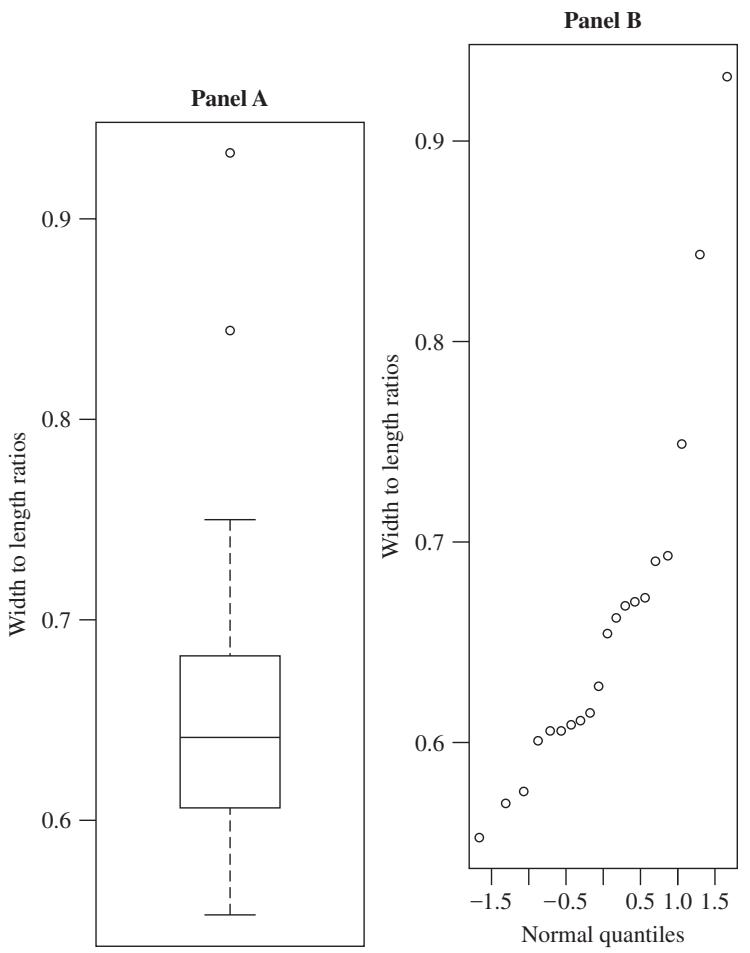  
Figure 10.2.1: Boxplot (Panel A) and normal $q - q$ plot (Panel B) of the Shoshoni data.

down one unit at each order statistic $Y_{i}$ , attaining its maximum and minimum values $n$ and 0 at $Y_{1}$ and $Y_{n}$ , respectively. Figure 10.2.2 depicts this function.

We need the following translation property. Because we can always subtract $\theta_0$ from each $X_{i}$ , we can assume without loss of generality that $\theta_0 = 0$ .

Lemma 10.2.1. For every $k$ ,

$$
P _ {\theta} [ S (0) \geq k ] = P _ {0} [ S (- \theta) \geq k ]. \tag {10.2.10}
$$

Proof: Note that the left side of equation (10.2.10) concerns the probability of the event $\# \{X_i > 0\}$ , where $X_i$ has median $\theta$ . The right side concerns the probability of the event $\# \{(X_i + \theta) > 0\}$ , where the random variable $X_i + \theta$ has median $\theta$ (because under $\theta = 0$ , $X_i$ has median 0). Hence the left and right sides give the same probability.

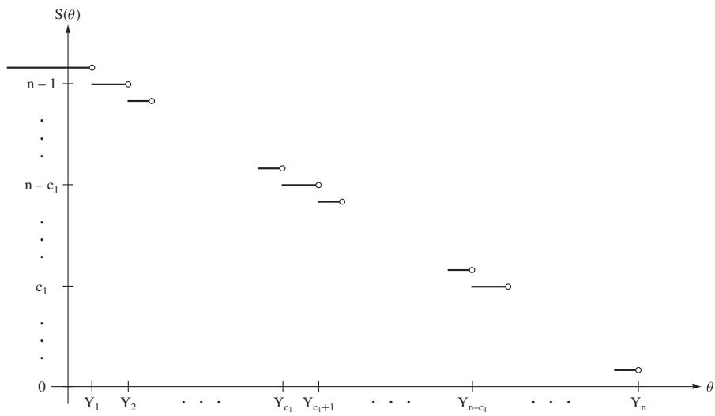  
Figure 10.2.2: The sketch shows the graph of the decreasing step function $S(\theta)$ . The function drops one unit at each order statistic $Y_{i}$ .

Based on this lemma, it is easy to show that the power function of the sign test is monotone for one-sided tests.

Theorem 10.2.1. Suppose Model (10.2.1) is true. Let $\gamma(\theta)$ be the power function of the sign test of level $\alpha$ for the one-sided hypotheses (10.2.2). Then $\gamma(\theta)$ is a nondecreasing function of $\theta$ .

Proof: Let $c_{\alpha}$ denote the $b(n,1/2)$ upper critical value as defined after expression (10.2.8). Without loss of generality, assume that $\theta_0 = 0$ . The power function of the sign test is

$$
\gamma (\theta) = P _ {\theta} [ S (0) \geq c _ {\alpha} ], \quad \mathrm {f o r} - \infty <   \theta <   \infty .
$$

Suppose $\theta_{1} < \theta_{2}$ . Then $-\theta_{1} > -\theta_{2}$ and hence, since $S(\theta)$ is nonincreasing, $S(-\theta_{1}) \leq S(-\theta_{2})$ . This and Lemma 10.2.1 yield the desired result; i.e.,

$$
\begin{array}{l} \gamma \left(\theta_ {1}\right) = P _ {\theta_ {1}} [ S (0) \geq c _ {\alpha} ] \\ = P _ {0} \left[ S \left(- \theta_ {1}\right) \geq c _ {\alpha} \right] \\ \leq \quad P _ {0} [ S (- \theta_ {2}) \geq c _ {\alpha} ] \\ = P _ {\theta_ {2}} [ S (0) \geq c _ {\alpha} ] \\ = \gamma (\theta_ {2}). \\ \end{array}
$$

This is a very desirable property for any test. Because the monotonicity of the power function of the sign test holds for all $\theta$ , $-\infty < \theta < \infty$ , we can extend the simple null hypothesis of (10.2.2) to the composite null hypothesis

$$
H _ {0}: \theta \leq \theta_ {0} \text {v e r s u s} H _ {1}: \theta > \theta_ {0}. \tag {10.2.11}
$$

Recall from Definition 4.5.4 of Chapter 4 that the size of the test for a composite null hypothesis is given by $\max_{\theta \leq \theta_0} \gamma(\theta)$ . Because $\gamma(\theta)$ is nondecreasing, the size of the sign test is $\alpha$ for this extended null hypothesis. As a second result, it follows immediately that the sign test is an unbiased test; see Section 8.3. As Exercise 10.2.8 shows, the power function of the sign test for the other one-sided alternative, $H_1: \theta < \theta_0$ , is nonincreasing.

Under an alternative, say $\theta = \theta_{1}$ , the test statistic $S(\theta_0)$ has the binomial distribution $b(n,p_1)$ , where $p_1$ is given by

$$
p _ {1} = P _ {\theta_ {1}} (X > 0) = 1 - F (- \theta_ {1}), \tag {10.2.12}
$$

where $F(x)$ is the cdf of $\varepsilon$ in Model (10.2.1). Hence $S(\theta_0)$ is not distribution free under alternative hypotheses. As in Exercise 10.2.3, we can determine the power of the test for specified $\theta_{1}$ and $F(x)$ . We want to compare the power of the sign test to other size $\alpha$ tests, in particular the test based on the sample mean. However, for these comparison purposes, we need more general results, some of which are obtained in the next subsection.

# 10.2.1 Asymptotic Relative Efficiency

One solution to this problem is to consider the behavior of a test under a sequence of local alternatives. In this section, we often take $\theta_0 = 0$ in hypotheses (10.2.2). As noted before Lemma 10.2.1, this is without loss of generality. For the hypotheses (10.2.2), consider the sequence of alternatives

$$
H _ {0}: \theta = 0 \text {v e r s u s} H _ {1 n}: \theta_ {n} = \frac {\delta}{\sqrt {n}}, \tag {10.2.13}
$$

where $\delta > 0$ . Note that this sequence of alternatives converges to the null hypothesis as $n \to \infty$ . We often call such a sequence of alternatives local alternatives. The idea is to consider how the power function of a test behaves relative to the power functions of other tests under this sequence of alternatives. We only sketch this development. For more details, the reader can consult the more advanced books cited in Section 10.1. As a first step in that direction, we obtain the asymptotic power lemma for the sign test.

Consider the large sample size $\alpha$ test given by (10.2.6). Under the alternative

$\theta_{n}$ , we can approximate the mean of this test as follows:

$$
\begin{array}{l} E _ {\theta_ {n}} \left[ \frac {1}{\sqrt {n}} \left(S (0) - \frac {n}{2}\right) \right] = E _ {0} \left[ \frac {1}{\sqrt {n}} \left(S (- \theta_ {n}) - \frac {n}{2}\right) \right] \\ = \frac {1}{\sqrt {n}} \sum_ {i = 1} ^ {n} E _ {0} [ I (X _ {i} > - \theta_ {n}) ] - \frac {\sqrt {n}}{2} \\ = \frac {1}{\sqrt {n}} \sum_ {i = 1} ^ {n} P _ {0} \left(X _ {i} > - \theta_ {n}\right) - \frac {\sqrt {n}}{2} \\ = \sqrt {n} \left(1 - F (- \theta_ {n}) - \frac {1}{2}\right) \\ = \sqrt {n} \left(\frac {1}{2} - F (- \theta_ {n})\right) \\ \approx \sqrt {n} \theta_ {n} f (0) = \delta f (0), \tag {10.2.14} \\ \end{array}
$$

where the step to the last line is due to the mean value theorem. It can be shown in more advanced texts that the variance of $[S(0) - (n / 2)] / (\sqrt{n} /2)$ converges to 1 under $\theta_{n}$ , just as under $H_0$ , and that, furthermore, $[S(0) - (n / 2) - \sqrt{n}\delta f(0)] / (\sqrt{n} /2)$ has a limiting standard normal distribution. This leads to the asymptotic power lemma, which we state in the form of a theorem.

Theorem 10.2.2 (Asymptotic Power Lemma). Consider the sequence of hypotheses (10.2.13). The limit of the power function of the large sample, size $\alpha$ , sign test is

$$
\lim  _ {n \rightarrow \infty} \gamma \left(\theta_ {n}\right) = 1 - \Phi \left(z _ {\alpha} - \delta \tau_ {S} ^ {- 1}\right), \tag {10.2.15}
$$

where $\tau_{S} = 1 / [2f(0)]$ and $\Phi (z)$ is the cdf of a standard normal random variable.

Proof: Using expression (10.2.14) and the discussion that followed its derivation, we have

$$
\begin{array}{l} \gamma \left(\theta_ {n}\right) = P _ {\theta_ {n}} \left[ \frac {n ^ {- 1 / 2} [ S (0) - (n / 2) ]}{1 / 2} \geq z _ {\alpha} \right] \\ = P _ {\theta_ {n}} \left[ \frac {n ^ {- 1 / 2} [ S (0) - (n / 2) - \sqrt {n} \delta f (0) ]}{1 / 2} \geq z _ {\alpha} - \delta 2 f (0) \right] \\ \rightarrow \quad 1 - \Phi (z _ {\alpha} - \delta 2 f (0)), \\ \end{array}
$$

which was to be shown.

As shown in Exercise 10.2.5, the parameter $\tau_{S} = 1 / [2f(0)]$ is a scale parameter (functional) as defined in Exercise 10.1.4 of the last section. We later show that $\tau_{S} / \sqrt{n}$ is the asymptotic standard deviation of the sample median.

Note that there were several approximations used in the proof of Theorem 10.2.2. A rigorous proof can be found in more advanced texts, such as those cited in Section 10.1. It is quite helpful for the next sections to reconsider the approximation of the

mean given in (10.2.14) in terms of another concept called efficacy. Consider another standardization of the test statistic given by

$$
\bar {S} (0) = \frac {1}{n} \sum_ {i = 1} ^ {n} I \left(X _ {i} > 0\right), \tag {10.2.16}
$$

where the bar notation is used to signify that $\overline{S}(0)$ is an average of $I(X_{i} > 0)$ and, in this case under $H_{0}$ , converges in probability to $\frac{1}{2}$ . Let $\mu(\theta) = E_{\theta}(\overline{S}(0) - \frac{1}{2})$ . Then, by expression (10.2.14), we have

$$
\mu \left(\theta_ {n}\right) = E _ {\theta_ {n}} \left(\bar {S} (0) - \frac {1}{2}\right) = \frac {1}{2} - F (- \theta_ {n}). \tag {10.2.17}
$$

Let $\sigma_{\overline{S}}^2 = \operatorname{Var}(\overline{S}(0)) = \frac{1}{4n}$ . Finally, define the efficacy of the sign test to be

$$
c _ {S} = \lim  _ {n \rightarrow \infty} \frac {\mu^ {\prime} (0)}{\sqrt {n} \sigma_ {\bar {S}}}. \tag {10.2.18}
$$

That is, the efficacy is the rate of change of the mean of the test statistic at the null divided by the product of $\sqrt{n}$ and the standard deviation of the test statistic at the null. So the efficacy increases with an increase in this rate, as it should. We use this formulation of efficacy throughout this chapter.

Hence, by expression (10.2.14), the efficacy of the sign test is

$$
c _ {S} = \frac {f (0)}{1 / 2} = 2 f (0) = \tau_ {S} ^ {- 1}, \tag {10.2.19}
$$

the reciprocal of the scale parameter $\tau_{S}$ . In terms of efficacy, we can write the conclusion of the Asymptotic Power Lemma as

$$
\lim  _ {n \rightarrow \infty} \gamma \left(\theta_ {n}\right) = 1 - \Phi \left(z _ {\alpha} - \delta c _ {S}\right). \tag {10.2.20}
$$

This is not a coincidence, and it is true for the procedures we consider in the next section.

Remark 10.2.1. In this chapter, we compare nonparametric procedures with traditional parametric procedures. For instance, we compare the sign test with the test based on the sample mean. Traditionally, tests based on sample means are referred to as $t$ -tests. Even though our comparisons are asymptotic and we could use the terminology of $z$ -tests, we instead use the traditional terminology of $t$ -tests.

As a second illustration of efficacy, we determine the efficacy of the $t$ -test for the mean. Assume that the random variables $\varepsilon_{i}$ in Model (10.2.1) are symmetrically distributed about 0 and their mean exists. Hence the parameter $\theta$ is the location parameter. In particular, $\theta = E(X_{i}) = \mathrm{med}(X_{i})$ . Denote the variance of $X_{i}$ by $\sigma^2$ . This allows us to easily compare the sign and $t$ -tests. Recall for hypotheses (10.2.2) that the $t$ -test rejects $H_{0}$ in favor of $H_{1}$ if $\overline{X} \geq c$ . The form of the test statistic is then $\overline{X}$ . Furthermore, we have

$$
\mu_ {\overline {{X}}} (\theta) = E _ {\theta} (\overline {{X}}) = \theta \tag {10.2.21}
$$

and

$$
\sigma \frac {2}{X} (0) = V _ {0} (\bar {X}) = \frac {\sigma^ {2}}{n}. \tag {10.2.22}
$$

Thus, by (10.2.21) and (10.2.22), the efficacy of the $t$ -test is

$$
c _ {t} = \lim  _ {n \rightarrow \infty} \frac {\mu_ {\overline {{X}}} ^ {\prime} (0)}{\sqrt {n} (\sigma / \sqrt {n})} = \frac {1}{\sigma}. \tag {10.2.23}
$$

As confirmed in Exercise 10.2.9, the asymptotic power of the large sample level $\alpha$ , $t$ -test under the sequence of alternatives (10.2.13) is $1 - \Phi(z_{\alpha} - \delta c_{t})$ . Thus we can compare the sign and $t$ -tests by comparing their efficacies. We do this from the perspective of sample size determination.

Assume without loss of generality that $H_0: \theta = 0$ . Now suppose we want to determine the sample size so that a level $\alpha$ sign test can detect the alternative $\theta^* > 0$ with (approximate) probability $\gamma^*$ . That is, find $n$ so that

$$
\gamma^ {*} = \gamma (\theta^ {*}) = P _ {\theta^ {*}} \left[ \frac {S (0) - (n / 2)}{\sqrt {n} / 2} \geq z _ {\alpha} \right]. \tag {10.2.24}
$$

Write $\theta^{*} = \sqrt{n}\theta^{*} / \sqrt{n}$ . Then, using the asymptotic power lemma, we have

$$
\gamma^ {*} = \gamma (\sqrt {n} \theta^ {*} / \sqrt {n}) \approx 1 - \Phi (z _ {\alpha} - \sqrt {n} \theta^ {*} \tau_ {S} ^ {- 1}).
$$

Now denote $z_{\gamma^*}$ to be the upper $1 - \gamma^{*}$ quantile of the standard normal distribution. Then, from this last equation, we have

$$
z _ {\gamma^ {*}} = z _ {\alpha} - \sqrt {n} \theta^ {*} \tau_ {S} ^ {- 1}.
$$

Solving for $n$ , we get

$$
n _ {S} = \left(\frac {\left(z _ {\alpha} - z _ {\gamma^ {*}}\right) \tau_ {S}}{\theta^ {*}}\right) ^ {2}. \tag {10.2.25}
$$

As outlined in Exercise 10.2.9, for this situation the sample size determination for the test based on the sample mean is

$$
n _ {\bar {X}} = \left(\frac {\left(z _ {\alpha} - z _ {\gamma^ {*}}\right) \sigma}{\theta^ {*}}\right) ^ {2}, \tag {10.2.26}
$$

where $\sigma^2 = \mathrm{Var}(\varepsilon)$

Suppose we have two tests of the same level for which the asymptotic power lemma holds and for each we determine the sample size necessary to achieve power $\gamma^{*}$ at the alternative $\theta^{*}$ . Then the ratio of these sample sizes is called the asymptotic relative efficiency (ARE) between the tests. We show later that this is the same as the ARE defined in Chapter 6 between estimators. Hence the ARE of the sign test to the $t$ -test is

$$
\operatorname {A R E} (S, t) = \frac {n _ {\bar {X}}}{n _ {S}} = \frac {\sigma^ {2}}{\tau_ {S} ^ {2}} = \frac {c _ {S} ^ {2}}{c _ {t} ^ {2}}. \tag {10.2.27}
$$

Note that this is the same relative efficiency that was discussed in Example 6.2.5 when the sample median was compared to the sample mean. In the next two examples we revisit this discussion by examining the AREs when $X_{i}$ has a normal distribution and then a Laplace (double exponential) distribution.

Example 10.2.2 (ARE(S,t): normal distribution). Suppose $X_{1}, X_{2}, \ldots, X_{n}$ follow the location model (10.1.4), where $f(x)$ is a $N(0, \sigma^2)$ pdf. Then $\tau_S = (2f(0))^{-1} = \sigma \sqrt{\pi / 2}$ . Hence the $\mathrm{ARE}(S,t)$ is given by

$$
\mathrm {A R E} (S, t) = \frac {\sigma^ {2}}{\tau_ {S} ^ {2}} = \frac {\sigma^ {2}}{(\pi / 2) \sigma^ {2}} = \frac {2}{\pi} \approx 0. 6 3 7. \tag {10.2.28}
$$

Hence at the normal distribution the sign test is only $64\%$ as efficient as the $t$ -test. In terms of sample size at the normal distribution, the $t$ -test requires a smaller sample, $0.64n_{s}$ , where $n_{s}$ is the sample size of the sign test, to achieve the same power as the sign test. A cautionary note is needed here because this is asymptotic efficiency. There have been ample empirical (simulation) studies that give credence to these numbers.

Example 10.2.3 (ARE(S, t) at the Laplace distribution). For this example, consider Model (10.1.4), where $f(x)$ is the Laplace pdf $f(x) = (2b)^{-1} \exp \{-|x| / b\}$ for $-\infty < x < \infty$ and $b > 0$ . Then $\tau_S = (2f(0))^{-1} = b$ , while $\sigma^2 = E(X^2) = 2b^2$ . Hence the ARE(S, t) is given by

$$
\operatorname {A R E} (S, t) = \frac {\sigma^ {2}}{\tau_ {S} ^ {2}} = \frac {2 b ^ {2}}{b ^ {2}} = 2. \tag {10.2.29}
$$

So, at the Laplace distribution, the sign test is (asymptotically) twice as efficient as the $t$ -test. In terms of sample size at the Laplace distribution, the $t$ -test requires twice as large a sample as the sign test to achieve the same asymptotic power as the sign test.

Recall from Example 6.3.4 that the sign test is the scores type likelihood ratio test when the true distribution is the Laplace.

The normal distribution has much lighter tails than the Laplace distribution, because the two pdfs are proportional to $\exp\{-t^2/2\sigma^2\}$ and $\exp\{-|t|/b\}$ , respectively. Based on the last two examples, it seems that the $t$ -test is more efficient for light-tailed distributions while the sign test is more efficient for heavier-tailed distributions. This is true in general and we illustrate this in the next example where we can easily vary the tail weight from light to heavy.

Example 10.2.4 (ARE(S, t) at a family of contaminated normals). Consider the location Model (10.1.4), where the cdf of $\varepsilon_{i}$ is the contaminated normal cdf given in expression (3.4.19). Assume that $\theta_0 = 0$ . Recall that for this distribution, $(1 - \epsilon)$ proportion of the time the sample is drawn from a $N(0, b^2)$ distribution, while $\epsilon$ proportion of the time the sample is drawn from a $N(0, b^2 \sigma_c^2)$ distribution. The corresponding pdf is given by

$$
f (x) = \frac {1 - \epsilon}{b} \phi \left(\frac {x}{b}\right) + \frac {\epsilon}{b \sigma_ {c}} \phi \left(\frac {x}{b \sigma_ {c}}\right), \tag {10.2.30}
$$

where $\phi (z)$ is the pdf of a standard normal random variable. As shown in Section 3.4, the variance of $\varepsilon_{i}$ is $b^{2}(1 + \epsilon (\sigma_{c}^{2} - 1))$ . Also, $\tau_{s} = (b\sqrt{\pi / 2}) / [1 - \epsilon +(\epsilon /\sigma_{c})]$ . Thus the ARE is

$$
\operatorname {A R E} (S, t) = \frac {2}{\pi} \left[ \left(1 + \epsilon \left(\sigma_ {c} ^ {2} - 1\right) \right] \left[ 1 - \epsilon + \left(\epsilon / \sigma_ {c}\right) \right] ^ {2}. \right. \tag {10.2.31}
$$

For example, the following table (see Exercise 6.2.6) shows the AREs for various values of $\epsilon$ when $\sigma_c$ is set at 3.0:

<table><tr><td>ε</td><td>0</td><td>0.01</td><td>0.02</td><td>0.03</td><td>0.05</td><td>0.10</td><td>0.15</td><td>0.25</td></tr><tr><td>ARE(S,t)</td><td>0.636</td><td>0.678</td><td>0.718</td><td>0.758</td><td>0.832</td><td>0.998</td><td>1.134</td><td>1.326</td></tr></table>

Note: if $\epsilon$ increases over the range of values in the table, then the contamination effect becomes larger (generally resulting in a heavier-tailed distribution) and as the table shows, the sign test becomes more efficient relative to the $t$ -test. Increasing $\sigma_{c}$ has the same effect. It does take, however, with $\sigma_{c} = 3$ , over $10\%$ contamination before the sign test becomes more efficient than the $t$ -test.

# 10.2.2 Estimating Equations Based on the Sign Test

In practice, we often want to estimate $\theta$ , the median of $X_{i}$ , in Model (10.2.1). The associated point estimate based on the sign test can be described with a simple geometry, which is analogous to the geometry of the sample mean. As Exercise 10.2.6 shows, the sample mean $\overline{X}$ is such that

$$
\bar {X} = \operatorname {A r g m i n} \sqrt {\sum_ {i = 1} ^ {n} \left(X _ {i} - \theta\right) ^ {2}}. \tag {10.2.32}
$$

The quantity $\sqrt{\sum_{i=1}^{n}(X_i - \theta)^2}$ is the Euclidean distance between the vector of observations $\mathbf{X} = (X_1, X_2, \ldots, X_n)$ and the vector $\theta \mathbf{1}$ . If we simply interchange the square root and the summation symbols, we go from the Euclidean distance to the $L_1$ distance. Let

$$
\widehat {\theta} = \operatorname {A r g m i n} \sum_ {i = 1} ^ {n} | X _ {i} - \theta |. \tag {10.2.33}
$$

To determine $\widehat{\theta}$ , simply differentiate the quantity on the right side with respect to $\theta$ (as in Chapter 6, define the derivative of $|x|$ to be 0 at $x = 0$ ). We then obtain

$$
\frac {\partial}{\partial \theta} \sum_ {i = 1} ^ {n} | X _ {i} - \theta | = - \sum_ {i = 1} ^ {n} \operatorname {s g n} (X _ {i} - \theta).
$$

Setting this to 0, we obtain the estimating equations (EE)

$$
\sum_ {i = 1} ^ {n} \operatorname {s g n} \left(X _ {i} - \theta\right) = 0, \tag {10.2.34}
$$

whose solution is the sample median $Q_{2}$ (4.4.4).

Because our observations are continuous random variables, we have the identity

$$
\sum_ {i = 1} ^ {n} \operatorname {s g n} (X _ {i} - \theta) = 2 S (\theta) - n.
$$

Hence the sample median also solves $S(\theta) \approx n / 2$ . Consider again Figure 10.2.2. Imagine $n / 2$ on the vertical axis. This is halfway in the total drop of $S(\theta)$ , from $n$ to 0. The order statistic on the horizontal axis corresponding to $n / 2$ is essentially the sample median (middle order statistic). In terms of testing, this last equation says that, based on the data, the sample median is the "most acceptable" hypothesis, because $n / 2$ is the null expected value of the test statistic. We often think of this as estimation by the inversion of a test.

We now sketch the asymptotic distribution of the sample median. Assume without loss of generality that the true median of $X_{i}$ is 0. Suppose $-\infty < x < \infty$ . Using the fact that $S(\theta)$ is nonincreasing and the identity $S(\theta) \approx n / 2$ , we have the following equivalences:

$$
\{\sqrt {n} Q _ {2} \leq x \} \Leftrightarrow \left\{Q _ {2} \leq \frac {x}{\sqrt {n}} \right\} \Leftrightarrow \left\{S \left(\frac {x}{\sqrt {n}}\right) \leq \frac {n}{2} \right\}.
$$

Hence we have

$$
\begin{array}{l} P _ {0} (\sqrt {n} Q _ {2} \leq x) = P _ {0} \left[ S \left(\frac {x}{\sqrt {n}}\right) \leq \frac {n}{2} \right] \\ { = } { P _ { - x / \sqrt { n } } \left[ S ( 0 ) \leq \frac { n } { 2 } \right] } \\ = P _ {- x / \sqrt {n}} \left[ \frac {S (0) - (n / 2)}{\sqrt {n} / 2} \leq 0 \right] \\ \rightarrow \Phi (0 - x \tau_ {S} ^ {- 1}) = P (\tau_ {S} Z \leq x), \\ \end{array}
$$

where $Z$ has a standard normal distribution, Notice that the limit was obtained by invoking the Asymptotic Power Lemma with $\alpha = 0.5$ and hence $z_{\alpha} = 0$ . Rearranging the last term earlier, we obtain the asymptotic distribution of the sample median, which we state as a theorem:

Theorem 10.2.3. For the random sample $X_{1}, X_{2}, \ldots, X_{n}$ , assume that Model (10.2.1) holds. Suppose that $f(0) > 0$ . Let $Q_{2}$ denote the sample median. Then

$$
\sqrt {n} \left(Q _ {2} - \theta\right)\rightarrow N \left(0, \tau_ {S} ^ {2}\right), \tag {10.2.35}
$$

where $\tau_{S} = (2f(0))^{-1}$

In Section 6.2 we defined the ARE between two estimators to be the reciprocal of their asymptotic variances. For the sample median and mean, this is the same ratio as that based on sample size determinations of their respective tests given earlier in expression (10.2.27).

# 10.2.3 Confidence Interval for the Median

In Section 4.4, we obtained a confidence interval for the median. In this section, we derive this confidence interval by inverting the sign test. Based on the monotonicity of $S(\theta)$ , the derivation is straightforward, but the technique will prove useful in subsequent sections of this chapter.

Suppose the random sample $X_{1}, X_{2}, \ldots, X_{n}$ follows the location model (10.2.1). In this subsection, we develop a confidence interval for the median $\theta$ of $X_{i}$ . Assuming that $\theta$ is the true median, the random variable $S(\theta)$ , (10.2.9), has a binomial $b(n, 1/2)$ distribution. For $0 < \alpha < 1$ , select $c_{1}$ so that $P_{\theta}[S(\theta) \leq c_{1}] = \alpha / 2$ . Hence we have

$$
1 - \alpha = P _ {\theta} [ c _ {1} <   S (\theta) <   n - c _ {1} ]. \tag {10.2.36}
$$

Recall in our derivation for the $t$ -confidence interval for the mean in Chapter 3, we began with such a statement and then "inverted" the pivot random variable $t = \sqrt{n}(\overline{X} - \mu) / S$ ( $S$ in this expression is the sample standard deviation) to obtain an equivalent inequality with $\mu$ isolated in the middle. In this case, the function $S(\theta)$ does not have an inverse, but it is a decreasing step function of $\theta$ and the inversion can still be performed. As depicted in Figure 10.2.2, $c_{1} < S(\theta) < n - c_{1}$ if and only if $Y_{c_{1} + 1} \leq \theta < Y_{n - c_{1}}$ , where $Y_{1} < Y_{2} < \dots < Y_{n}$ are the order statistics of the sample $X_{1}, X_{2}, \ldots, X_{n}$ . Therefore, the interval $[Y_{c_{1} + 1}, Y_{n - c_{1}})$ is a $(1 - \alpha)100\%$ confidence interval for the median $\theta$ . Because the order statistics are continuous random variables, the interval $(Y_{c_{1} + 1}, Y_{n - c_{1}})$ is an equivalent confidence interval.

If $n$ is large, then there is a large sample approximation to $c_{1}$ . We know from the Central Limit Theorem that $S(\theta)$ is approximately normal with mean $n / 2$ and variance $n / 4$ . Then, using the continuity correction, we obtain the approximation

$$
c _ {1} \approx \frac {n}{2} - \frac {z _ {\alpha / 2} \sqrt {n}}{2} - \frac {1}{2}, \tag {10.2.37}
$$

where $\Phi(-z_{\alpha/2}) = \alpha/2$ ; see Exercise 10.2.7. In practice, we use the closest integer to $c_1$ .

Example 10.2.5 (Example 10.2.1, Continued). There are 20 data points in the Shoshoni basket data. The sample median of the width to the length is $0.5(0.628 + 0.654) = 0.641$ . Because $0.021 = P_{H_0}(S(0.618) \leq 5)$ , a $95.8\%$ confidence interval for $\theta$ is the interval $(y_6, y_{15}) = (0.606, 0.672)$ , which includes 0.618, the ratio of the width to the length, which characterizes the golden rectangle.

Currently, there is not an intrinsic R function for the one-sample sign analysis. The R function `onesampsgn.R`, which can be downloaded at the site listed in the Preface, computes this analysis. For these data, its default 95% confidence interval is the same as that computed above.

# EXERCISES

10.2.1. Sketch Figure 10.2.2 for the Shoshoni basket data found in Example 10.2.1. Show the values of the test statistic, the point estimate, and the $95.8\%$ confidence interval of Example 10.2.5 on the sketch.

10.2.2. Show that the test given by (10.2.6) has asymptotically level $\alpha$ ; that is, show that under $H_0$

$$
\frac {S (\theta_ {0}) - (n / 2)}{\sqrt {n} / 2} \stackrel {D} {\rightarrow} Z,
$$

where $Z$ has a $N(0,1)$ distribution.

10.2.3. Let $\theta$ denote the median of a random variable $X$ . Consider testing

$$
H _ {0}: \theta = 0 \text {v e r s u s} H _ {1}: \theta > 0.
$$

Suppose we have a sample of size $n = 25$ .

(a) Let $S(0)$ denote the sign test statistic. Determine the level of the test: reject $H_0$ if $S(0) \geq 16$ .   
(b) Determine the power of the test in part (a) if $X$ has $N(0.5,1)$ distribution.   
(c) Assuming $X$ has finite mean $\mu = \theta$ , consider the asymptotic test of rejecting $H_0$ if $\overline{X} / (\sigma / \sqrt{n}) \geq k$ . Assuming that $\sigma = 1$ , determine $k$ so the asymptotic test has the same level as the test in part (a). Then determine the power of this test for the situation in part (b).

10.2.4. To appreciate the importance of setting the location functional, consider the length of rivers data set, as taken from Tukey (1977). This data set contains the lengths of 141 American rivers in miles and it can be found in the file lengthriver.rda.

(a) Suppose the location functional is the median. Obtain the estimate and a $95\%$ confidence interval for it. Use the confidence interval discussed in Section 10.2.3. Interpret it in terms of the data. Use the R function onesampsgn.R for computation.   
(b) Suppose the location functional is the mean. Obtain the estimate and the $95\%$ $t$ -confidence interval for it. Interpret it in terms of the data.   
(c) Obtain the boxplot of the data and sketch the estimates and confidence intervals on it. Discuss.

10.2.5. Recall the definition of a scale functional given in Exercise 10.1.4. Show that the parameter $\tau_{S}$ defined in Theorem 10.2.2 is a scale functional.

10.2.6. Show that the sample mean solves Equation (10.2.32).

10.2.7. Derive the approximation (10.2.37).

10.2.8. Show that the power function of the sign test is nonincreasing for the hypotheses

$$
H _ {0}: \theta = \theta_ {0} \text {v e r s u s} H _ {1}: \theta <   \theta_ {0}. \tag {10.2.38}
$$

10.2.9. Let $X_{1}, X_{2}, \ldots, X_{n}$ be a random sample that follows the location model (10.2.1). In this exercise we want to compare the sign tests and $t$ -test of the hypotheses (10.2.2); so we assume the random errors $\varepsilon_{i}$ are symmetrically distributed about 0. Let $\sigma^{2} = \operatorname{Var}(\varepsilon_{i})$ . Hence the mean and the median are the same for this location model. Assume, also, that $\theta_{0} = 0$ . Consider the large sample version of the $t$ -test, which rejects $H_{0}$ in favor of $H_{1}$ if $\overline{X} / (\sigma / \sqrt{n}) > z_{\alpha}$ .

(a) Obtain the power function, $\gamma_t(\theta)$ , of the large sample version of the $t$ -test.   
(b) Show that $\gamma_t(\theta)$ is nondecreasing in $\theta$ .   
(c) Show that $\gamma_t(\theta_n) \to 1 - \Phi(z_\alpha - \sigma \theta^*)$ , under the sequence of local alternatives (10.2.13).   
(d) Based on part (c), obtain the sample size determination for the $t$ -test to detect $\theta^{*}$ with approximate power $\gamma^{*}$ .   
(e) Derive the $\operatorname{ARE}(S, t)$ given in (10.2.27).

# 10.3 Signed-Rank Wilcoxon

Let $X_{1}, X_{2}, \ldots, X_{n}$ be a random sample that follows Model (10.2.1). Inference for $\theta$ based on the sign test is simple and requires few assumptions about the underlying distribution of $X_{i}$ . On the other hand, sign procedures have the low efficiency of 0.64 relative to procedures based on the $t$ -test given an underlying normal distribution. In this section, we discuss a nonparametric procedure that does attain high efficiency relative to the $t$ -test. We make the additional assumption that the pdf $f(x)$ of $\varepsilon_{i}$ in Model (10.2.1) is symmetric; i.e., $f(x) = f(-x)$ , for all $x$ such that $-\infty < x < \infty$ . Hence $X_{i}$ is symmetrically distributed about $\theta$ . Thus, by Theorem 10.1.1, all location parameters are identical.

First, consider the one-sided hypotheses

$$
H _ {0}: \theta = 0 \text {v e r s u s} H _ {1}: \theta > 0. \tag {10.3.1}
$$

There is no loss of generality in assuming that the null hypothesis is $H_0: \theta = 0$ , for if it were $H_0: \theta = \theta_0$ , we would consider the sample $X_1 - \theta_0, \ldots, X_n - \theta_0$ . Under a symmetric pdf, observations $X_i$ that are the same distance from 0 are equilibrated and hence should receive the same weight. A test statistic that does this is the signed-rank Wilcoxon given by

$$
T = \sum_ {i = 1} ^ {n} \operatorname {s g n} \left(X _ {i}\right) R \left| X _ {i} \right|, \tag {10.3.2}
$$

where $R|X_{i}|$ denotes the rank of $X_{i}$ among $|X_1|, \ldots, |X_n|$ , where the rankings are from low to high. Intuitively, under the null hypothesis, we expect half of the $X_{i}$ s to be positive and half to be negative. Further, the ranks are uniformly distributed on the integers $\{1, 2, \ldots, n\}$ . Hence values of $T$ around 0 are indicative of $H_{0}$ . On the

other hand, if $H_{1}$ is true, then we expect more than half of the $X_{i}$ s to be positive and further, the positive observations are more likely to receive the higher ranks. Thus an appropriate decision rule is

$$
\text {R e j e c t} H _ {0} \text {i n f a v o r} H _ {1} \text {i f} T \geq c, \tag {10.3.3}
$$

where $c$ is determined by the level $\alpha$ of the test.

Given $\alpha$ , we need the null distribution of $T$ to determine the critical point $c$ . The set of integers $\{-n(n + 1) / 2, - [n(n + 1) / 2] + 2,\ldots ,n(n + 1) / 2\}$ form the support of $T$ . Also, from Section 10.2, we know that the signs are iid with support $\{-1,1\}$ and pmf

$$
p (- 1) = p (1) = \frac {1}{2}. \tag {10.3.4}
$$

A key result is the following lemma:

Lemma 10.3.1. Under $H_0$ and symmetry about 0 for the pdf, the random variables $|X_1|, \ldots, |X_n|$ are independent of the random variables $\operatorname{sgn}(X_1), \ldots, \operatorname{sgn}(X_n)$ .

Proof: Because $X_{1}, \ldots, X_{n}$ is a random sample from the cdf $F(x)$ , it suffices to show that $P[|X_i| \leq x, \operatorname{sgn}(X_i) = 1] = P[|X_i| \leq x]P[\operatorname{sgn}(X_i) = 1]$ . Due to $H_{0}$ and the symmetry of $f(x)$ , this follows from the following string of equalities

$$
\begin{array}{l} P [ | X _ {i} | \leq x, \operatorname {s g n} (X _ {i}) = 1 ] = P [ 0 <   X _ {i} \leq x ] = F (x) - \frac {1}{2} \\ = \left[ 2 F (x) - 1 \right] \frac {1}{2} = P [ | X _ {i} | \leq x ] P [ \operatorname {s g n} (X _ {i}) = 1 ]. \\ \end{array}
$$

Based on this lemma, the ranks of the $|X_i|$ s are independent of the signs of the $X_i$ s. Note that the ranks are a permutation of the integers $1, 2, \ldots, n$ . By the lemma this independence is true for any permutation. In particular, suppose we use the permutation that orders the absolute values. For example, suppose the observations are -6.1, 4.3, 7.2, 8.0, -2.1. Then the permutation $5, 2, 1, 3, 4$ orders the absolute values; that is, the fifth observation is the smallest in absolute value, the second observation is the next smallest, etc. This permutation is called the anti-ranks, which we denote generally by $i_1, i_2, \ldots, i_n$ . Using the anti-ranks, we can write $T$ as

$$
T = \sum_ {j = 1} ^ {n} j \operatorname {s g n} \left(X _ {i _ {j}}\right), \tag {10.3.5}
$$

where, by Lemma 10.3.1, $\operatorname{sgn}(X_{i_j})$ are iid with support $\{-1,1\}$ and pmf (10.3.4).

Based on this observation, for $s$ such that $-\infty < s < \infty$ , the mgf of $T$ is

$$
\begin{array}{l} E \left[ \exp \{s T \} \right] = E \left[ \exp \left\{\sum_ {j = 1} ^ {n} s j \operatorname {s g n} \left(X _ {i _ {j}}\right) \right\} \right] \\ = \prod_ {j = 1} ^ {n} E [ \exp \{s j \operatorname {s g n} \left(X _ {i _ {j}}\right) \} ] \\ = \prod_ {j = 1} ^ {n} \left(\frac {1}{2} e ^ {- s j} + \frac {1}{2} e ^ {s j}\right) \\ = \frac {1}{2 ^ {n}} \prod_ {j = 1} ^ {n} \left(e ^ {- s j} + e ^ {s j}\right). \tag {10.3.6} \\ \end{array}
$$

Because the mgf does not depend on the underlying symmetric pdf $f(x)$ , the test statistic $T$ is distribution free under $H_0$ . Although the pmf of $T$ cannot be obtained in closed form, this mgf can be used to generate the pmf for a specified $n$ ; see Exercise 10.3.1.

Because the $\operatorname{sgn}(X_{i_j})$ s are mutually independent with mean zero, it follows that $E_{H_0}[T] = 0$ . Further, because the variance of $\operatorname{sgn}(X_{i_j})$ is 1, we have

$$
\operatorname {V a r} _ {H _ {0}} (T) = \sum_ {j = 1} ^ {n} \operatorname {V a r} _ {H _ {0}} \left(j \operatorname {s g n} \left(X _ {i _ {j}}\right)\right) = \sum_ {j = 1} ^ {n} j ^ {2} = n (n + 1) (2 n + 1) / 6.
$$

We summarize these results in the following theorem:

Theorem 10.3.1. Assume that Model (10.2.1) is true for the random sample $X_{1},\ldots ,X_{n}$ . Assume also that the pdf $f(x)$ is symmetric about 0. Then under $H_0$ ,

$$
T \text {i s} \quad T \text {i s} \quad T \text {i s} \quad T \text {i s} \quad T \text {i s} \quad T \text {i s} \quad T \text {i s} \quad T \text {i s} \quad T \text {i s} \quad T \text {i s} \quad T \text {i s} \quad T \text {i s} \quad T
$$

$$
E _ {H _ {0}} [ T ] = 0 \tag {10.3.8}
$$

$$
\operatorname {V a r} _ {H _ {0}} (T) = \frac {n (n + 1) (2 n + 1)}{6} \tag {10.3.9}
$$

$$
\frac {T}{\sqrt {\operatorname {V a r} _ {H _ {0}} (T)}} \text {h a s a n a s y m p t o t i c a l l y N (0 , 1) d i s t r i b u t i o n .} \tag {10.3.10}
$$

Proof: The first part of (10.3.7) and the expressions (10.3.8) and (10.3.9) were derived above. The asymptotic distribution of $T$ certainly is plausible and its proof can be found in more advanced books. To obtain the second part of (10.3.7), we need to show that the distribution of $T$ is symmetric about 0. But by the mgf of $Y$ , (10.3.6), we have

$$
E \left[ \right. \exp \left\{s (- T) \right\} = E \left[ \exp \left\{\left(- s\right) T \right\}\right] = E \left[ \exp \left\{s T \right\}\right].
$$

Hence $T$ and $-T$ have the same distribution, so $T$ is symmetrically distributed about 0.

Note that the support of $T$ is much denser than that of the sign test, so the normal approximation is good even for a sample size of 10.

There is another formulation of $T$ that is convenient. Let $T^{+}$ denote the sum of the ranks of the positive $X_{i}$ s. Then, because the sum of all ranks is $n(n + 1) / 2$ , we have

$$
\begin{array}{l} T = \sum_ {i = 1} ^ {n} \operatorname {s g n} \left(X _ {i}\right) R \left| X _ {i} \right| = \sum_ {X _ {i} > 0} R \left| X _ {i} \right| - \sum_ {X _ {i} <   0} R \left| X _ {i} \right| \\ = 2 \sum_ {X _ {i} > 0} R \left| X _ {i} \right| - \frac {n (n + 1)}{2} \\ = 2 T ^ {+} - \frac {n (n + 1)}{2}. \tag {10.3.11} \\ \end{array}
$$

Hence $T^{+}$ is a linear function of $T$ and thus is an equivalent formulation of the signed-rank test statistic $T$ . For the record, we note the null mean and variance of $T^{+}$ :

$$
E _ {H _ {0}} \left(T ^ {+}\right) = \frac {n (n + 1)}{4} \text {a n d} \operatorname {V a r} _ {H _ {0}} \left(T ^ {+}\right) = \frac {n (n + 1) (2 n + 1)}{2 4}. \tag {10.3.12}
$$

The intrinsic R function wilcox.test computes the signed-rank analysis, returning the test statistic $T^{+}$ and the $p$ -value. If the sample is in the R vector $\mathbf{x}$ then the signed-rank test of the hypotheses (10.3.1) is computed by the R command wilcox.test(x, alt="greater"). The arguments for the other one-sided and the two-sided hypotheses are respectively alt="less" and alt="two.sided". To compute the signed-rank test of the hypotheses $H_{0}: \theta = \theta_{0}$ versus $H_{1}: \theta \neq \theta_{0}$ , use the command wilcox.test(x, alt="two.sided", mu=theta0). Also, the R call psignrank(y, n) computes the cdf of $T^{+}$ at $y$ .

Example 10.3.1 (Zea mays Data of Darwin). Reconsider the data set discussed in Example 4.5.1. Recall that $W_{i}$ is the difference in heights of the cross-fertilized plant minus the self-fertilized plant in pot $i$ , for $i = 1, \ldots, 15$ . Let $\theta$ be the location parameter and consider the one-sided hypotheses

$$
H _ {0}: \theta = 0 \text {v e r s u s} H _ {1}: \theta > 0. \tag {10.3.13}
$$

Table 10.3.1 displays the data and the signed ranks.

Adding up the ranks of the positive items in column 5 of Table 10.3.1, we obtain $T^{+} = 96$ . Using the exact distribution, the R command is 1-psignrank(95,15)), we obtain the $p$ -value, $\widehat{p} = P_{H_0}(T^+ \geq 96) = 0.021$ . For comparison, the asymptotic $p$ -value, using the continuity correction is

$$
\begin{array}{l} P _ {H _ {0}} \left(T ^ {+} \geq 9 6\right) = P _ {H _ {0}} \left(T ^ {+} \geq 9 5. 5\right) \approx P \left(Z \geq \frac {9 5 . 5 - 6 0}{\sqrt {1 5 \cdot 1 6 \cdot 3 1 / 2 4}}\right) \\ = P (Z \geq 2. 0 1 6) = 0. 0 2 2, \\ \end{array}
$$

which is quite close to the exact value of 0.021.

Suppose the R vector ds contains the paired differences between cross and self-fertilized. Then the R command wilcox.test(ds, alt="greater") computes the

Table 10.3.1: Signed Ranks for Darwin Data, Example 10.3.1   

<table><tr><td>Pot</td><td>Cross-Fertilized</td><td>Self-Fertilized</td><td>Difference</td><td>Signed-Rank</td></tr><tr><td>1</td><td>23.500</td><td>17.375</td><td>6.125</td><td>11</td></tr><tr><td>2</td><td>12.000</td><td>20.375</td><td>-8.375</td><td>-14</td></tr><tr><td>3</td><td>21.000</td><td>20.000</td><td>1.000</td><td>2</td></tr><tr><td>4</td><td>22.000</td><td>20.000</td><td>2.000</td><td>4</td></tr><tr><td>5</td><td>19.125</td><td>18.375</td><td>0.750</td><td>1</td></tr><tr><td>6</td><td>21.550</td><td>18.625</td><td>2.925</td><td>5</td></tr><tr><td>7</td><td>22.125</td><td>18.625</td><td>3.500</td><td>7</td></tr><tr><td>8</td><td>20.375</td><td>15.250</td><td>5.125</td><td>9</td></tr><tr><td>9</td><td>18.250</td><td>16.500</td><td>1.750</td><td>3</td></tr><tr><td>10</td><td>21.625</td><td>18.000</td><td>3.625</td><td>8</td></tr><tr><td>11</td><td>23.250</td><td>16.250</td><td>7.000</td><td>12</td></tr><tr><td>12</td><td>21.000</td><td>18.000</td><td>3.000</td><td>6</td></tr><tr><td>13</td><td>22.125</td><td>12.750</td><td>9.375</td><td>15</td></tr><tr><td>14</td><td>23.000</td><td>15.500</td><td>7.500</td><td>13</td></tr><tr><td>15</td><td>12.000</td><td>18.000</td><td>-6.000</td><td>-10</td></tr></table>

value of $T^{+}$ along with the $p$ -value. The computed values are the same as those computed above.

There is another formulation of $T^{+}$ which is useful for obtaining the properties of the Wilcoxon signed-rank test and confidence intervals for $\theta$ . Let $X_{i} > 0$ and consider all $X_{j}$ such that $-X_{i} < X_{j} < X_{i}$ . Thus all the averages $(X_{i} + X_{j}) / 2$ , under these restrictions, are positive, including $(X_{i} + X_{i}) / 2$ . From the restriction, though, the number of these positive averages is simply the $R|X_{i}|$ . Doing this for all $X_{i} > 0$ , we obtain

$$
T ^ {+} = \# _ {i \leq j} \left\{\left(X _ {j} + X _ {i}\right) / 2 > 0 \right\}. \tag {10.3.14}
$$

The pairwise averages $(X_{j} + X_{i}) / 2$ are often called the Walsh averages. Hence the signed-rank Wilcoxon can be obtained by counting the number of positive Walsh averages.

Based on the identity (10.3.14), we obtain the corresponding process. Let

$$
T ^ {+} (\theta) = \# _ {i \leq j} \left\{\left[ \left(X _ {j} - \theta\right) + \left(X _ {i} - \theta\right) \right] / 2 > 0 \right\} = \# _ {i \leq j} \left\{\left(X _ {j} + X _ {i}\right) / 2 > \theta \right\}. \tag {10.3.15}
$$

The process associated with $T^{+}(\theta)$ is much like the sign process, (10.2.9). Let $W_{1} < W_{2} < \dots < W_{n(n + 1) / 2}$ denote the $n(n + 1) / 2$ ordered Walsh averages. Then a graph of $T^{+}(\theta)$ would appear as in Figure 10.2.2, except the ordered Walsh averages would be on the horizontal axis and the largest value on the vertical would be $n(n + 1) / 2$ . Hence the function $T^{+}(\theta)$ is a decreasing step function of $\theta$ , which steps down one unit at each Walsh average. This observation greatly simplifies the discussion on the properties of the signed-rank Wilcoxon.

Let $c_{\alpha}$ denote the critical value of a level $\alpha$ test of the hypotheses (10.3.1) based on the signed-rank test statistic $T^{+}$ ; i.e., $\alpha = P_{H_0}(T^+ \geq c_\alpha)$ . Let $\gamma_{SW}(\theta) = P_{\theta}(T^{+} \geq c_{\alpha})$ , for $\theta \geq \theta_0$ , denote the power function of the test. The translation property, Lemma 10.2.1, holds for the signed-rank Wilcoxon. Hence, as in Theorem 10.2.1, the power function is a nondecreasing function of $\theta$ . In particular, the signed-rank Wilcoxon test is an unbiased test for the one-sided hypotheses (10.3.1).

# 10.3.1 Asymptotic Relative Efficiency

We investigate the efficiency of the signed-rank Wilcoxon by first determining its efficacy. Without loss of generality, we can assume that $\theta_0 = 0$ . Consider the same sequence of local alternatives discussed in the last section; i.e.,

$$
H _ {0}: \theta = 0 \text {v e r s u s} H _ {1 n}: \theta_ {n} = \frac {\delta}{\sqrt {n}}, \tag {10.3.16}
$$

where $\delta > 0$ . Contemplate the modified statistic, which is the average of $T^{+}(\theta)$ ,

$$
\bar {T} ^ {+} (\theta) = \frac {2}{n (n + 1)} T ^ {+} (\theta). \tag {10.3.17}
$$

Then, by (10.3.12),

$$
E _ {0} \left[ \bar {T} ^ {+} (0) \right] = \frac {2}{n (n + 1)} \frac {n (n + 1)}{4} = \frac {1}{2} \text {a n d} \sigma_ {\bar {T} ^ {+}} ^ {2} (0) = \operatorname {V a r} _ {0} \left[ \bar {T} ^ {+} (0) \right] = \frac {2 n + 1}{6 n (n + 1)}. \tag {10.3.18}
$$

Let $a_{n} = 2 / n(n + 1)$ . Note that we can decompose $\overline{T}^{+}(\theta_{n})$ into two parts as

$$
\bar {T} ^ {+} \left(\theta_ {n}\right) = a _ {n} S \left(\theta_ {n}\right) + a _ {n} \sum_ {i <   j} I \left(X _ {i} + X _ {j} > 2 \theta_ {n}\right) = a _ {n} S \left(\theta_ {n}\right) + a _ {n} T ^ {*} \left(\theta_ {n}\right), \tag {10.3.19}
$$

where $S(\theta)$ is the sign process (10.2.9) and

$$
T ^ {*} \left(\theta_ {n}\right) = \sum_ {i <   j} I \left(X _ {i} + X _ {j} > 2 \theta_ {n}\right). \tag {10.3.20}
$$

To obtain the efficacy, we require the mean

$$
\mu_ {\overline {{T}} ^ {+}} \left(\theta_ {n}\right) = E _ {\theta_ {n}} \left[ \overline {{T}} ^ {+} (0) \right] = E _ {0} \left[ \overline {{T}} ^ {+} (- \theta_ {n}) \right]. \tag {10.3.21}
$$

But by (10.2.14), $a_{n}E_{0}(S(-\theta_{n})) = a_{n}n(2^{-1} - F(-\theta_{n}))\to 0$ . Hence we need only be concerned with the second term in (10.3.19). But note that the Walsh averages in $T^{*}(\theta)$ are identically distributed. Thus

$$
a _ {n} E _ {0} \left(T ^ {*} (- \theta_ {n})\right) = a _ {n} \binom {n} {2} P _ {0} \left(X _ {1} + X _ {2} > - 2 \theta_ {n}\right). \tag {10.3.22}
$$

This latter probability can be expressed as follows:

$$
\begin{array}{l} P _ {0} \left(X _ {1} + X _ {2} > - 2 \theta_ {n}\right) = E _ {0} \left[ P _ {0} \left(X _ {1} > - 2 \theta_ {n} - X _ {2} \mid X _ {2}\right) \right] = E _ {0} \left[ 1 - F \left(- 2 \theta_ {n} - X _ {2}\right) \right] \\ = \int_ {- \infty} ^ {\infty} [ 1 - F (- 2 \theta_ {n} - x) ] f (x) d x \\ = \int_ {- \infty} ^ {\infty} F (2 \theta_ {n} + x) f (x) d x \\ \approx \int_ {- \infty} ^ {\infty} [ F (x) + 2 \theta_ {n} f (x) ] f (x) d x \\ = \frac {1}{2} + 2 \theta_ {n} \int_ {- \infty} ^ {\infty} f ^ {2} (x) d x, \tag {10.3.23} \\ \end{array}
$$

where we have used the facts that $X_{1}$ and $X_{2}$ are iid and symmetrically distributed about 0, and the mean value theorem. Hence

$$
\mu_ {\bar {T} ^ {+}} \left(\theta_ {n}\right) \approx a _ {n} \binom {n} {2} \left(\frac {1}{2} + 2 \theta_ {n} \int_ {- \infty} ^ {\infty} f ^ {2} (x) d x\right). \tag {10.3.24}
$$

Putting (10.3.18) and (10.3.24) together, we have the efficacy

$$
c _ {T ^ {+}} = \lim  _ {n \rightarrow \infty} \frac {\mu_ {\overline {{T}} ^ {+}} ^ {\prime} (0)}{\sqrt {n} \sigma_ {\overline {{T}} ^ {+}} (0)} = \sqrt {1 2} \int_ {- \infty} ^ {\infty} f ^ {2} (x) d x. \tag {10.3.25}
$$

In a more advanced text, this development can be made into a rigorous argument for the following asymptotic power lemma.

Theorem 10.3.2 (Asymptotic Power Lemma). Consider the sequence of hypotheses (10.3.16). The limit of the power function of the large sample, size $\alpha$ , signed-rank Wilcoxon test is given by

$$
\lim  _ {n \rightarrow \infty} \gamma_ {S R} \left(\theta_ {n}\right) = 1 - \Phi \left(z _ {\alpha} - \delta \tau_ {W} ^ {- 1}\right), \tag {10.3.26}
$$

where $\tau_W = 1 / [\sqrt{12}\int_{-\infty}^{\infty}f^2 (x)dx]$ is the reciprocal of the efficacy $c_{T^{+}}$ and $\Phi (z)$ is the cdf of a standard normal random variable.

As shown in Exercise 10.3.10, the parameter $\tau_W$ is a scale functional.

The arguments used in the determination of the sample size in Section 10.2 for the sign test were based on the asymptotic power lemma; hence, these arguments follow almost verbatim for the signed-rank Wilcoxon. In particular, the sample size needed so that a level $\alpha$ signed-rank Wilcoxon test of the hypotheses (10.3.1) can detect the alternative $\theta = \theta_0 + \theta^*$ with approximate probability $\gamma^{*}$ is

$$
n _ {W} = \left(\frac {\left(z _ {\alpha} - z _ {\gamma^ {*}}\right) \tau_ {W}}{\theta^ {*}}\right) ^ {2}. \tag {10.3.27}
$$

Using (10.2.26), the ARE between the signed-rank Wilcoxon test and the $t$ -test based on the sample mean is

$$
\operatorname {A R E} (T, t) = \frac {n _ {t}}{n _ {T}} = \frac {\sigma^ {2}}{\tau_ {W} ^ {2}}. \tag {10.3.28}
$$

We now derive some AREs between the Wilcoxon and the $t$ -test. As noted above, the parameter $\tau_W$ is a scale functional and, hence, varies directly with scale transformations of the form $aX$ , for $a > 0$ . Likewise, the standard deviation $\sigma$ is also a scale functional. Therefore, because the AREs are ratios of scale functionals, they are scale invariant. Hence, for derivations of AREs, we can select a pdf with a convenient choice of scale. For example, if we are considering an ARE at the normal distribution, we can work with the $N(0,1)$ pdf.

Example 10.3.2 (ARE(W, t) at the normal distribution). If $f(x)$ is a $N(0,1)$ pdf, then

$$
\begin{array}{l} \tau_ {W} ^ {- 1} = \sqrt {1 2} \int_ {- \infty} ^ {\infty} \left(\frac {1}{\sqrt {2 \pi}} \exp \{- x ^ {2} / 2 \}\right) ^ {2} d x \\ = \frac {\sqrt {1 2}}{\sqrt {2} \sqrt {2 \pi}} \int_ {- \infty} ^ {\infty} \frac {1}{\sqrt {2 \pi} (1 / \sqrt {2})} \exp \left\{- 2 ^ {- 1} \left(x / \left(1 / \sqrt {2}\right)\right) ^ {2} \right\} d x = \sqrt {\frac {3}{\pi}} \\ \end{array}
$$

Hence $\tau_W^2 = \pi /3$ . Since $\sigma = 1$ , we have

$$
\operatorname {A R E} (W, t) = \frac {\sigma^ {2}}{\tau_ {W} ^ {2}} = \frac {3}{\pi} = 0. 9 5 5. \tag {10.3.29}
$$

As discussed above, this ARE holds for all normal distributions. Hence, at the normal distribution, the Wilcoxon signed-rank test is $95.5\%$ efficient as the $t$ -test. The Wilcoxon is called a highly efficient procedure.

Example 10.3.3 (ARE( $W, t$ ) at a Family of Contaminated Normals). For this example, suppose that $f(x)$ is the pdf of a contaminated normal distribution. For convenience, we use the standardized pdf given in expression (10.2.30) with $b = 1$ . Recall that for this distribution, $(1 - \epsilon)$ proportion of the time the sample is drawn from a $N(0, 1)$ distribution, while $\epsilon$ proportion of the time the sample is drawn from a $N(0, \sigma_c^2)$ distribution. Recall that the variance is $\sigma^2 = 1 + \epsilon (\sigma_c^2 - 1)$ . Note that the formula for the pdf $f(x)$ is given in expression (3.4.17). In Exercise 10.3.5 it is shown that

$$
\int_ {- \infty} ^ {\infty} f ^ {2} (x) d x = \frac {(1 - \epsilon) ^ {2}}{2 \sqrt {\pi}} + \frac {\epsilon^ {2}}{6 \sqrt {\pi}} + \frac {\epsilon (1 - \epsilon)}{2 \sqrt {\pi}}. \tag {10.3.30}
$$

Based on this, an expression for the ARE can be obtained; see Exercise 10.3.5. We used this expression to determine the AREs between the Wilcoxon and the $t$ -tests for the situations with $\sigma_c = 3$ and $\epsilon$ varying from 0.00-0.25, displaying them in Table 10.3.2. For convenience, we have also displayed the AREs between the sign test and these two tests.

Note that the signed-rank Wilcoxon is more efficient than the $t$ -test even at $1\%$ contamination and increases to $150\%$ efficiency for $15\%$ contamination.

# 10.3.2 Estimating Equations Based on Signed-Rank Wilcoxon

For the sign procedure, the estimation of $\theta$ was based on minimizing the $L_{1}$ norm. The estimator associated with the signed-rank test minimizes another norm, which

Table 10.3.2: AREs among the sign, the Signed-Rank Wilcoxon, and the $t$ -Tests for Contaminated Normals with $\sigma_c = 3$ and Proportion of Contamination $\epsilon$   

<table><tr><td>ε</td><td>0.00</td><td>0.01</td><td>0.02</td><td>0.03</td><td>0.05</td><td>0.10</td><td>0.15</td><td>0.25</td></tr><tr><td>ARE(W,t)</td><td>0.955</td><td>1.009</td><td>1.060</td><td>1.108</td><td>1.196</td><td>1.373</td><td>1.497</td><td>1.616</td></tr><tr><td>ARE(S,t)</td><td>0.637</td><td>0.678</td><td>0.719</td><td>0.758</td><td>0.833</td><td>0.998</td><td>1.134</td><td>1.326</td></tr><tr><td>ARE(W,S)</td><td>1.500</td><td>1.487</td><td>1.474</td><td>1.461</td><td>1.436</td><td>1.376</td><td>1.319</td><td>1.218</td></tr></table>

is discussed in Exercises 10.3.7 and 10.3.8. Recall that we also show that the location estimator based on the sign test could be obtained by inverting the test. Considering this for the Wilcoxon, the estimator $\widehat{\theta}_W$ solves

$$
T ^ {+} \left(\widehat {\theta} _ {W}\right) = \frac {n (n + 1)}{4}. \tag {10.3.31}
$$

Using the description of the function $T^{+}(\theta)$ after its definition, (10.3.15), it is easily seen that $\widehat{\theta}_W = \mathrm{median}\{(X_i + X_j) / 2\}$ ; i.e., the median of the Walsh averages. This is often called the Hodges-Lehmann estimator because of several seminal articles by Hodges and Lehmann on the properties of this estimator; see Hodges and Lehmann (1963).

The R function wilcox.test computes the Hodges-Lehmann estimate. To illustrate its computation, consider the Darwin data in Example 10.3.1. Let the R vector ds contain the paired differences, Cross - Self. The R code segment given by wilcox.test(ds, conf.int=T) then computes the Hodges-Lehmann estimate to be 3.1375. So we estimate the difference in heights to be 3.1375 inches.

Once again, we can use practically the same argument that we used for the sign process to obtain the asymptotic distribution of the Hodges-Lehmann estimator. We summarize the result in the next theorem.

Theorem 10.3.3. Consider a random sample $X_{1}, X_{2}, X_{3}, \ldots, X_{n}$ which follows Model (10.2.1). Suppose that $f(x)$ is symmetric about 0. Then

$$
\sqrt {n} \left(\hat {\theta} _ {W} - \theta\right)\rightarrow N \left(0, \tau_ {W} ^ {2}\right), \tag {10.3.32}
$$

where $\tau_W = \left(\sqrt{12}\int_{-\infty}^{\infty}f^2 (x)dx\right)^{-1}$ .

Using this theorem, the AREs based on asymptotic variances for the signed-rank Wilcoxon are the same as those defined above.

# 10.3.3 Confidence Interval for the Median

Because of the similarity between the processes $S(\theta)$ and $T^{+}(\theta)$ , confidence intervals for $\theta$ based on the signed-rank Wilcoxon follow the same way as do those based on $S(\theta)$ . For a given level $\alpha$ , let $c_{W1}$ , an integer, denote the critical point of the signed-rank Wilcoxon distribution such that $P_{\theta}[T^{+}(\theta) \leq c_{W1}] = \alpha / 2$ . As in Section 10.2.3,

we then have that

$$
\begin{array}{l} 1 - \alpha = P _ {\theta} \left[ c _ {W 1} <   T ^ {+} (\theta) <   n - c _ {W 1} \right] \\ = P _ {\theta} \left[ W _ {c _ {W 1} + 1} \leq \theta <   W _ {m - c _ {W 1}} \right], \tag {10.3.33} \\ \end{array}
$$

where $m = n(n + 1) / 2$ denotes the number of Walsh averages. Therefore, the interval $[W_{cW_1 + 1}, W_{m - c_{W_1}})$ is a $(1 - \alpha)100\%$ confidence interval for $\theta$ .

We can use the asymptotic null distribution of $T^{+}$ , (10.3.10), to obtain the following approximation to $c_{W1}$ . As shown in Exercise 10.3.6,

$$
c _ {W 1} \approx \frac {n (n + 1)}{4} - z _ {\alpha / 2} \sqrt {\frac {n (n + 1) (2 n + 1)}{2 4}} - \frac {1}{2}, \tag {10.3.34}
$$

where $\Phi(-z_{\alpha/2}) = \alpha/2$ . In practice, we use the closest integer to $c_{W1}$ .

In R, this confidence interval is computed by the R function wilcox.test. For instance, for the Darwin data let the R vector ds contain the paired differences, Cross - Self. Then the call wilcox.test(ds, conf.int=T, conf.level=.95) computes a $95\%$ confidence interval for the median of the differences. Its computation results in the interval (0.5000, 5.2125). Hence, with confidence $95\%$ , we estimate that cross-fertilized zea mays are between 0.5 to 5.2 inches taller than self-fertilized ones.

# 10.3.4 Monte Carlo Investigation

The AREs derived in this chapter are asymptotic. In this section, we describe Monte Carlo techniques which investigate the relative efficiency between estimators for finite sample sizes. Comparisons are performed over families of distributions and a selection of sample sizes. Each combination of distribution and sample size is referred to as a situation. We also select a simulation size $n_s$ , which is usually quite large. We next describe a typical simulation to investigate the relative efficiency between two estimators.

For notation, let $X_{1},\ldots ,X_{n}$ be a random sample that follows the location model, (10.2.1), i.e.,

$$
X _ {i} = \theta + e _ {i}, \quad i = 1, \dots , n, \tag {10.3.35}
$$

where $e_i$ 's are iid with pdf $f(x)$ and $f(x)$ is symmetric about 0. For our discussion, consider the case of two location estimators of $\theta$ , which we denote by $\widehat{\theta}_1$ and $\widehat{\theta}_2$ . Since these are location estimators, we further assume without loss of generality that the true $\theta = 0$ .

Let $n$ denote the sample size and let $f(x)$ denote the pdf for a given situation. Then $n_s$ independent random samples of size $n$ are generated from $f(x)$ . For the $i$ th sample, denote the estimates by $\widehat{\theta}_{1i}$ and $\widehat{\theta}_{2i}$ , $i = 1, \ldots, n_s$ . For the estimator $\widehat{\theta}_j$ , consider the mean square error over the simulations given by

$$
\mathrm {M S E} _ {j} = \frac {1}{n _ {s}} \sum_ {i = 1} ^ {n _ {s}} \widehat {\theta} _ {j i} ^ {2}, \quad j = 1, 2. \tag {10.3.36}
$$

As sketched in Exercise 10.3.2, under the assumptions of symmetry and location estimators, $\mathrm{MSE}_j$ is a consistent estimator of the variance of $\widehat{\theta}_j$ for a sample of size $n$ . Hence, the estimate of the relative efficiency $(\mathrm{RE}_n)$ between the estimators $\widehat{\theta}_1$ and $\widehat{\theta}_2$ at sample size $n$ is the ratio

$$
\widehat {\mathrm {R E} _ {n} \left(\widehat {\theta_ {1}} , \widehat {\theta_ {2}}\right)} = \frac {\mathrm {M S E} _ {2}}{\mathrm {M S E} _ {1}}. \tag {10.3.37}
$$

To illustrate this discussion, consider a study comparing the Hodges-Lehmann and sample mean estimators over the family of contaminated normal distributions with rate of contamination $\epsilon$ and the standard deviation ratio $\sigma_c$ , where we are using the notation of Example 10.3.3. The R function rcn.R is used to generate samples from a contaminated normal. The following R function aresimcn.R computes the simulation and returns the estimate of $\mathrm{RE}_n$ :

```r
aresimcn <- function(n, nsimulation, eps, vc) {
chl <- c(); cxbar <- c()
for (i in 1: nsimulation) {
x <- rcn(n, eps, vc)
chl <- c(chl, wilcox.test(x, conf.int=T) $est)
cxbar <- c(cxbar, t.test(x, conf.int=T) $est)
}
aresimcn <- mses(cxbar, 0)/mses(chl, 0)
return(aresimcn) 
```

The function mses.R computes the MSEs, (10.3.36). All three functions are at the site listed in the Preface.

For a specific situation set $n = 30$ with samples generated from the contaminated normal distribution with rate of contamination $\epsilon = 0.25$ and the standard deviation ratio $\sigma_c = 3$ . From Table 10.3.2, the asymptotic ARE is 1.616. Our run of the function aresimcn.R using 10,000 simulations at these settings produced the estimate 1.561 for the relative efficiency at sample size $n = 30$ . This is close to the asymptotic value. The actual call was aresimcn(30,10000,.25,3). We also ran the situation with $\epsilon = 0.20$ and $\sigma_c = 25$ . In this case, the estimated RE for samples of size $n = 30$ was 40.934; i.e., we estimate that the Hodges-Lehmann estimator is $41\%$ more efficient than the sample mean at this contaminated normal distribution for a sample size of 30.

# EXERCISES

10.3.1. (a) For $n = 3$ , expand the mgf (10.3.6) to show that the distribution of the signed-rank Wilcoxon is given by

<table><tr><td>j</td><td>-6</td><td>-4</td><td>-2</td><td>0</td><td>2</td><td>4</td><td>6</td></tr><tr><td>P(T=j)</td><td>1/8</td><td>1/8</td><td>1/8</td><td>2/8</td><td>1/8</td><td>1/8</td><td>1/8</td></tr></table>

(b) Obtain the distribution of the signed-rank Wilcoxon for $n = 4$ .

10.3.2. Consider the location Model (10.3.35). Assume that the pdf of the random errors, $f(x)$ , is symmetric about 0. Let $\widehat{\theta}$ be a location estimator of $\theta$ . Assume that $E(\widehat{\theta}^4)$ exists.

(a) Show that $\widehat{\theta}$ is an unbiased estimator of $\theta$

Hint: Assume without loss of generality that $\theta = 0$ ; start with $E(\widehat{\theta}) = E[\widehat{\theta}(X_1, \ldots, X_n)]$ ; and use the fact that $X_i$ is symmetrically distributed about 0.

(b) As in Section 10.3.4, suppose we generate $n_s$ independent samples of size $n$ from the pdf $f(x)$ which is symmetric about 0. For the $i$ th sample, let $\widehat{\theta}_i$ be the estimate of $\theta$ . Show that $n_s^{-1} \sum_{i=1}^{n_s} \widehat{\theta}_i^2 \to V(\widehat{\theta})$ , in probability.

10.3.3. Modify the code of the R function aresimcn.R so it samples from the $N(0,1)$ distribution. Estimate the RE between the Hodges-Lehmann estimator and $\overline{X}$ for the sample sizes $n = 15,25,50$ and 100. Use 10,000 simulations for each sample size. Compare your results to the asymptotic ARE which is 0.955.

10.3.4. Consider the self-rival data presented in Exercise 4.6.5. Recall that it is a paired design consisting of the pairs $(\mathrm{Self}_i, \mathrm{Rival}_i)$ , for $i = 1, \ldots, 20$ , where $\mathrm{Self}_i$ and $\mathrm{Rival}_i$ are the running times for circling the bases for the respective treatments of Self motivation and Rival motivation. The data can be found in the file selffrival.rda. Let $X_i = \mathrm{Self}_i - \mathrm{Rival}_i$ denote the paired differences and model these in the location model as $X_i = \theta + e_i$ . Consider the hypotheses $H_0: \theta = 0$ versus $H_1: \theta \neq 0$ .

(a) Obtain the signed-rank test statistic and $p$ -value for these hypotheses. State the conclusion (in terms of the data) using the level 0.05.

(b) Obtain the $t$ test statistic and $p$ -value and conclude using the level 0.05.

(c) To see the effect that an outlier has on these two analyses, change the 20th rival time from 17.88 to 178.8. Comment on how the analyses changed due to the outlier.

(d) Obtain $95\%$ confidence intervals for $\theta$ for both analyses for the original data and the changed data. Comment on how the confidence intervals changed due to the outlier.

10.3.5. Assume that $f(x)$ has the contaminated normal pdf given in expression (3.4.17). Derive expression (10.3.30) and use it to obtain $\mathrm{ARE}(W, t)$ for this pdf.

10.3.6. Use the asymptotic null distribution of $T^{+}$ , (10.3.10), to obtain the approximation (10.3.34) to $c_{W1}$ .

10.3.7. For a vector $\mathbf{v} \in R^n$ , define the function

$$
\left\| \mathbf {v} \right\| = \sum_ {i = 1} ^ {n} R \left(\left| v _ {i} \right|\right) \left| v _ {i} \right|. \tag {10.3.38}
$$

Show that this function is a norm on $R^n$ ; that is, it satisfies the properties

1. $\| \mathbf{v}\| \geq 0$ and $\| \mathbf{v}\| = 0$ if and only if $\mathbf{v} = \mathbf{0}$   
2. $\| a\mathbf{v} \| = |a| \| \mathbf{v} \|$ , for all $a$ such that $-\infty < a < \infty$ .   
3. $\| \mathbf{u} + \mathbf{v}\| \leq \| \mathbf{u}\| +\| \mathbf{v}\|$ , for all $\mathbf{u},\mathbf{v}\in R^n$

For the triangle inequality, use the anti-rank version, that is,

$$
\left\| \mathbf {v} \right\| = \sum_ {j = 1} ^ {n} j \left| v _ {i j} \right|. \tag {10.3.39}
$$

Then use the following fact: If we have two sets of $n$ numbers, for example, $\{t_1, t_2, \ldots, t_n\}$ and $\{s_1, s_2, \ldots, s_n\}$ , then the largest sum of pairwise products, one from each set, is given by $\sum_{j=1}^{n} t_{i_j} s_{k_j}$ , where $\{i_j\}$ and $\{k_j\}$ are the anti-ranks for the $t_i$ and $s_i$ , respectively, i.e., $t_{i_1} \leq t_{i_2} \leq \dots \leq t_{i_n}$ and $s_{k_1} \leq s_{k_2} \leq \dots \leq s_{k_n}$ .

10.3.8. Consider the norm given in Exercise 10.3.7. For a location model, define the estimate of $\theta$ to be

$$
\widehat {\theta} = \operatorname {A r g m i n} _ {\theta} \| X _ {i} - \theta \|. \tag {10.3.40}
$$

Show that $\widehat{\theta}$ is the Hodges-Lehmann estimate, i.e., satisfies (10.4.27).

Hint: Use the anti-rank version (10.3.39) of the norm when differentiating with respect to $\theta$ .

10.3.9. Prove that a pdf (or pmf) $f(x)$ is symmetric about 0 if and only if its mgf is symmetric about 0, provided the mgf exists.

10.3.10. In Exercise 10.1.4, we defined the term scale functional. Show that the parameter $\tau_W$ , (10.3.26), is a scale functional.

# 10.4 Mann-Whitney-Wilcoxon Procedure

Suppose $X_{1}, X_{2}, \ldots, X_{n_{1}}$ is a random sample from a distribution with a continuous cdf $F(x)$ and pdf $f(x)$ and $Y_{1}, Y_{2}, \ldots, Y_{n_{2}}$ is a random sample from a distribution with a continuous cdf $G(x)$ and pdf $g(x)$ . For this situation there is a natural null hypothesis given by $H_{0}: F(x) = G(x)$ for all $x$ ; i.e., the samples are from the same distribution. What about alternative hypotheses besides the general alternative not $H_{0}$ ? An interesting alternative is that $X$ is stochastically larger than $Y$ , which is defined by $G(x) \geq F(x)$ , for all $x$ , with strict inequality for at least one $x$ . This alternative hypothesis is discussed in the exercises.

For the most part in this section, however, we consider the location model. In this case, $G(x) = F(x - \Delta)$ for some value of $\Delta$ . Hence the null hypothesis becomes $H_0: \Delta = 0$ . The parameter $\Delta$ is often called the shift between the distributions and the distribution of $Y$ is the same as the distribution of $X + \Delta$ ; that is,

$$
P (Y \leq y) = P (X + \Delta \leq y) = F (y - \Delta). \tag {10.4.1}
$$

If $\Delta > 0$ , then $Y$ is stochastically larger than $X$ ; see Exercise 10.4.8.

In the shift case, the parameter $\Delta$ is independent of what location functional is used. To see this, suppose we select an arbitrary location functional for $X$ , say, $T(F_X)$ . Then we can write $X_{i}$ as

$$
X _ {i} = T \left(F _ {X}\right) + \varepsilon_ {i}, \tag {10.4.2}
$$

where $\varepsilon_1, \ldots, \varepsilon_{n_1}$ are iid with $T(F_{\varepsilon}) = 0$ . By (10.4.1) it follows that

$$
Y _ {j} = T \left(F _ {X}\right) + \Delta + \varepsilon_ {j}, \quad j = 1, 2, \dots , n _ {2}. \tag {10.4.3}
$$

Hence $T(F_{Y}) = T(F_{X}) + \Delta$ . Therefore, $\Delta = T(F_{Y}) - T(F_{X})$ for any location functional; i.e., $\Delta$ is the same no matter what functional is chosen to model location.

Assume then that the shift model, (10.4.1), holds for the two samples. Alternatives of interest are the usual one- and two-sided alternatives. For convenience we pick on the one-sided hypotheses given by

$$
H _ {0}: \Delta = 0 \text {v e r s u s} H _ {1}: \Delta > 0. \tag {10.4.4}
$$

The exercises consider the other hypotheses. Under $H_0$ , the distributions of $X$ and $Y$ are the same, and we can combine the samples to have one large sample of $n = n_1 + n_2$ observations. Suppose we rank the combined samples from 1 to $n$ and consider the statistic

$$
W = \sum_ {j = 1} ^ {n _ {2}} R \left(Y _ {j}\right), \tag {10.4.5}
$$

where $R(Y_{j})$ denotes the rank of $Y_{j}$ in the combined sample of $n$ items. This statistic is often called the Mann-Whitney-Wilcoxon (MWW) statistic. Under $H_{0}$ the ranks are uniformly distributed between the $X_{i}$ s and the $Y_{j}$ s; however, under $H_{1}: \Delta > 0$ , the $Y_{j}$ s should get most of the large ranks. Hence an intuitive rejection rule is given by

$$
\text {R e j e c t} H _ {0} \text {i n f a v o r} H _ {1} \text {i f} W \geq c. \tag {10.4.6}
$$

We now discuss the null distribution of $W$ , which enables us to select $c$ for the decision rule based on a specified level $\alpha$ . Under $H_0$ , the ranks of the $Y_j$ 's are equilately to be any subset of size $n_2$ from a set of $n$ elements. Recall that there are $\binom{n}{n_2}$ such subsets; therefore, if $\{r_1, \ldots, r_{n_2}\}$ is a subset of size $n_2$ from $\{1, \ldots, n\}$ , then

$$
P \left[ R \left(Y _ {1}\right) = r _ {1}, \dots , R \left(Y _ {n _ {2}}\right) = r _ {n _ {2}} \right] = \binom {n} {n _ {2}} ^ {- 1}. \tag {10.4.7}
$$

This implies that the statistic $W$ is distribution free under $H_0$ . Although the null distribution of $W$ cannot be obtained in closed form, there are recursive algorithms which obtain this distribution; see Chapter 2 of the text by Hettmansperger and McKean (2011). In the same way, the distribution of a single rank $R(Y_j)$ is uniformly distributed on the integers $\{1, \dots, n\}$ , under $H_0$ . Hence we immediately have

$$
E _ {H _ {0}} (W) = \sum_ {j = 1} ^ {n _ {2}} E _ {H _ {0}} (R (Y _ {j})) = \sum_ {j = 1} ^ {n _ {2}} \sum_ {i = 1} ^ {n} i \frac {1}{n} = \sum_ {j = 1} ^ {n _ {2}} \frac {n (n + 1)}{2 n} = \frac {n _ {2} (n + 1)}{2}.
$$

The variance is displayed below (10.4.10) and a derivation of a more general case is given in Section 10.5. It also can be shown that $W$ is asymptotically normal. We summarize these items in the theorem below.

Theorem 10.4.1. Suppose $X_{1}, X_{2}, \ldots, X_{n_{1}}$ is a random sample from a distribution with a continuous cdf $F(x)$ and $Y_{1}, Y_{2}, \ldots, Y_{n_{2}}$ is a random sample from a distribution with a continuous cdf $G(x)$ . Suppose $H_{0}: F(x) = G(x)$ , for all $x$ . If $H_{0}$ is true, then

$$
W \text {i s} \quad \text {d i s t r i b u t i o n f r e e w i t h a s y m m e t r i c p m f} \tag {10.4.8}
$$

$$
E _ {H _ {0}} [ W ] = \frac {n _ {2} (n + 1)}{2} \tag {10.4.9}
$$

$$
\operatorname {V a r} _ {H _ {0}} (W) = \frac {n _ {1} n _ {2} (n + 1)}{1 2} \tag {10.4.10}
$$

$$
\frac {W - n _ {2} (n + 1) / 2}{\sqrt {\operatorname {V a r} _ {H _ {0}} (W)}} \text {h a s a n a s y m p t o t i c a l l y} N (0, 1) \text {d i s t r i b u t i o n}. \tag {10.4.11}
$$

The only item of the theorem not discussed above is the symmetry of the null distribution, which we show later. First, consider this example:

Example 10.4.1 (Water Wheel Data Set). In an experiment discussed in Abebe et al. (2001), mice were placed in a wheel that is partially submerged in water. If they keep the wheel moving, they avoid the water. The response is the number of wheel revolutions per minute. Group 1 is a placebo group, while Group 2 consists of mice that are under the influence of a drug. The data are

<table><tr><td>Group 1 X</td><td>2.3</td><td>0.3</td><td>5.2</td><td>3.1</td><td>1.1</td><td>0.9</td><td>2.0</td><td>0.7</td><td>1.4</td><td>0.3</td></tr><tr><td>Group 2 Y</td><td>0.8</td><td>2.8</td><td>4.0</td><td>2.4</td><td>1.2</td><td>0.0</td><td>6.2</td><td>1.5</td><td>28.8</td><td>0.7</td></tr></table>

The data are in the file waterwheel.rda. Comparison boxplots of the data (asked for in Exercise 10.4.9) show that the two data sets are similar except for the large outlier in the treatment group. A two-sided hypothesis seems appropriate in this case. Notice that a few of the data points in the data set have the same value (are tied). This happens in real data sets. We follow the usual practice and use the average of the ranks involved to break ties. For example, the observations $x_{2} = x_{10} = 0.3$ are tied and the ranks involved for the combined data are 2 and 3. Hence we use 2.5 for the ranks of each of these observations. Continuing in this way, the Wilcoxon test statistic is $w = \sum_{j=1}^{10} R(y_{j}) = 116.50$ . The null mean and variance of $W$ are 105 and 175, respectively. The asymptotic test statistic is $z = (116.5 - 105) / \sqrt{175} = 0.869$ with $p$ -value $2*(1 - \text{pnorm}(0.869)) = 0.3848$ . Hence $H_{0}$ would not be rejected. The test confirms the comparison boxplots of the data. The $t$ -test based on the difference in means is discussed in Exercise 10.4.9. In Example 10.4.2, we discuss the R computation.

We next want to derive some properties of the test statistic and then use these properties to discuss point estimation and confidence intervals for $\Delta$ . As in the last section, another way of writing $W$ proves helpful in these regards. Without loss of generality, assume that the $Y_{j}$ s are in order. Recall that the distributions

of $X_{i}$ and $Y_{j}$ are continuous; hence, we treat the observations as distinct. Thus $R(Y_{j}) = \#_{i}\{X_{i} < Y_{j}\} +\#_{i}\{Y_{i}\leq Y_{j}\}$ . This leads to

$$
\begin{array}{l} W = \sum_ {j = 1} ^ {n _ {2}} R (Y _ {j}) = \sum_ {j = 1} ^ {n _ {2}} \# _ {i} \{X _ {i} <   Y _ {j} \} + \sum_ {j = 1} ^ {n _ {2}} \# _ {i} \{Y _ {i} \leq Y _ {j} \} \\ = \# _ {i, j} \left\{Y _ {j} > X _ {i} \right\} + \frac {n _ {2} \left(n _ {2} + 1\right)}{2}. \tag {10.4.12} \\ \end{array}
$$

Let $U = \#_{i,j}\{Y_j > X_i\}$ ; then we have $W = U + n_2(n_2 + 1) / 2$ . Hence an equivalent test for the hypotheses (10.4.4) is to reject $H_0$ if $U \geq c_2$ . It follows immediately from Theorem 10.4.1 that, under $H_0$ , $U$ is distribution free with mean $n_1n_2 / 2$ and variance (10.4.10) and that it has an asymptotic normal distribution. The symmetry of the null distribution of either $U$ or $W$ can now be easily obtained. Under $H_0$ , both $X_i$ and $Y_j$ have the same distribution, so the distributions of $U$ and $U' = \#_{i,j}\{X_i > Y_j\}$ must be the same. Furthermore, $U + U' = n_1n_2$ . This leads to

$$
\begin{array}{l} P _ {H _ {0}} \left(U - \frac {n _ {1} n _ {2}}{2} = u\right) = P _ {H _ {0}} \left(n _ {1} n _ {2} - U ^ {\prime} - \frac {n _ {1} n _ {2}}{2} = u\right) \\ = P _ {H _ {0}} \left(U ^ {\prime} - \frac {n _ {1} n _ {2}}{2} = - u\right) \\ = P _ {H _ {0}} \left(U - \frac {n _ {1} n _ {2}}{2} = - u\right), \\ \end{array}
$$

which yields the desired symmetry result in Theorem 10.4.1.

Example 10.4.2 (Water Wheel, Continued). For the R commands to compute the Wilcoxon analysis, suppose $\mathbf{y}$ and $\mathbf{x}$ contain the respective samples on $Y$ and $X$ . The R call wilcox.test(y,x) computes the Wilcoxon test. The form used is the statistic $U = \#_{i,j}\{Y_j > X_i\}$ . For the data in Example 10.4.1, let the R vectors grp1 and grp2 contain the samples for group 1 and group 2, respectively. Then the call and the results are:

$$
w i l c o x. t e s t (g r p 2, g r p 1); \quad W = 6 1. 5, \quad p - v a l u e = 0. 4 0 5 3
$$

Note that R uses the label W for $U$ . As a check, $61.5 + 10(11) / 2 = 116.5 = \sum R(y_{j})$ , which agrees with the computation in Example 10.4.1. The R $p$ -value is exact in the case that there are no ties and if $n_i < 50$ , $i = 1,2$ . Otherwise it is based on the asymptotic distribution. Notice that the asymptotic $p$ -value differs a little from its R computed value. The R function pwilcox(u,n1,n2) computes the exact cdf of $U$ .

Note that if $G(x) = F(x - \Delta)$ , then $Y_{j} - \Delta$ has the same distribution as $X_{i}$ . So the process of interest here is

$$
U (\Delta) = \# _ {i, j} \left\{\left(Y _ {j} - \Delta\right) > X _ {i} \right\} = \# _ {i, j} \left\{Y _ {j} - X _ {i} > \Delta) \right\}. \tag {10.4.13}
$$

Hence $U(\Delta)$ is counting the number of differences $Y_{j} - X_{i}$ that exceed $\Delta$ . Let $D_{1} < D_{2} < \dots < D_{n_{1}n_{2}}$ denote the $n_1n_2$ ordered differences of $Y_{j} - X_{i}$ . Then the graph of $U(\Delta)$ is the same as that in Figure 10.2.2, except the $D_{i}$ s are on the

horizontal axis and the $n$ on the vertical axis is replaced by $n_1n_2$ ; that is, $U(\Delta)$ is a decreasing step function of $\Delta$ that steps down one unit at each difference $D_i$ , with the maximum value of $n_1n_2$ .

We can then proceed as in the last two sections to obtain properties of inference based on the Wilcoxon. Let the integer $c_{\alpha}$ denote the critical value of a level $\alpha$ test of the hypotheses (10.2.2) based on the statistic $U$ ; i.e., $\alpha = P_{H_0}(U \geq c_{\alpha})$ . Let $\gamma_U(\Delta) = P_{\Delta}(U \geq c_{\alpha})$ , for $\Delta \geq 0$ , denote the power function of the test. The translation property, Lemma 10.2.1, holds for the process $U(\Delta)$ . Hence, as in Theorem 10.2.1, the power function is a nondecreasing function of $\Delta$ . In particular, the Wilcoxon test is an unbiased test for the one-sided hypotheses (10.4.4).

# 10.4.1 Asymptotic Relative Efficiency

The asymptotic relative efficiency (ARE) of the Wilcoxon follows along similar lines as for the sign test statistic in Section 10.2.1. Here, consider the sequence of local alternatives given by

$$
H _ {0}: \Delta = 0 \text {v e r s u s} H _ {1 n}: \Delta_ {n} = \frac {\delta}{\sqrt {n}}, \tag {10.4.14}
$$

where $\delta > 0$ . We also assume that

$$
\frac {n _ {1}}{n} \rightarrow \lambda_ {1}, \frac {n _ {2}}{n} \rightarrow \lambda_ {2}, \text {w h e r e} \lambda_ {1} + \lambda_ {2} = 1. \tag {10.4.15}
$$

This assumption implies that $n_1 / n_2 \to \lambda_1 / \lambda_2$ ; i.e., the sample sizes maintain the same ratio asymptotically.

To determine the efficacy of the MWW, consider the average

$$
\bar {U} (\Delta) = \frac {1}{n _ {1} n _ {2}} U (\Delta). \tag {10.4.16}
$$

It follows immediately that

$$
\mu_ {\overline {{U}}} (0) = E _ {0} (\overline {{U}} (0)) = \frac {1}{2} \quad \text {a n d} \quad \overline {{\sigma}} _ {\overline {{U}}} ^ {2} (0) = \frac {n + 1}{1 2 n _ {1} n _ {2}}. \tag {10.4.17}
$$

Because the pairs $(X_{i},Y_{j})$ are iid we have

$$
\mu_ {\bar {U}} \left(\Delta_ {n}\right) = E _ {\Delta_ {n}} (\bar {U} (0)) = E _ {0} (\bar {U} (- \Delta_ {n})) = P _ {0} (Y - X > - \Delta_ {n}). \tag {10.4.18}
$$

The independence of $X$ and $Y$ and the fact $\int_{-\infty}^{\infty} F(x)f(x) dx = 1/2$ gives

$$
\begin{array}{l} P _ {0} (Y - X > - \Delta_ {n}) = E _ {0} \left(P _ {0} [ Y > X - \Delta_ {n} | X ]\right) \\ = E _ {0} \left(1 - F \left(X - \Delta_ {n}\right)\right) \\ = 1 - \int_ {- \infty} ^ {\infty} F (x - \Delta_ {n}) f (x) d x \\ = \frac {1}{2} + \int_ {- \infty} ^ {\infty} (F (x) - F (x - \Delta_ {n})) f (x) d x \\ \approx \frac {1}{2} + \Delta_ {n} \int_ {- \infty} ^ {\infty} f ^ {2} (x) d x, \tag {10.4.19} \\ \end{array}
$$

where we have applied the mean value theorem to obtain the last line. Putting together (10.4.17) and (10.4.19), we have the efficacy

$$
c _ {U} = \lim  _ {n \rightarrow \infty} \frac {\mu_ {\overline {{U}}} ^ {\prime} (0)}{\sqrt {n} \sigma_ {\overline {{U}}} (0)} = \sqrt {1 2} \sqrt {\lambda_ {1} \lambda_ {2}} \int_ {- \infty} ^ {\infty} f ^ {2} (x) d x. \tag {10.4.20}
$$

This derivation can be made rigorous, leading to the following theorem:

Theorem 10.4.2 (Asymptotic Power Lemma). Consider the sequence of hypotheses (10.4.14). The limit of the power function of the size $\alpha$ Mann-Whitney-Wilcoxon test is given by

$$
\lim  _ {n \rightarrow \infty} \gamma_ {U} \left(\Delta_ {n}\right) = 1 - \Phi \left(z _ {\alpha} - \sqrt {\lambda_ {1} \lambda_ {2}} \delta \tau_ {W} ^ {- 1}\right), \tag {10.4.21}
$$

where $\tau_W = 1 / \sqrt{12}\int_{-\infty}^{\infty}f^2 (x)dx$ is the reciprocal of the efficacy $c_{U}$ and $\Phi (z)$ is the cdf of a standard normal random variable.

As in the last two sections, we can use this theorem to establish a relative measure of efficiency by considering sample size determination. Consider the hypotheses (10.4.4). Suppose we want to determine the sample size $n = n_1 + n_2$ for a level $\alpha$ MWW test to detect the alternative $\Delta^*$ with approximate power $\gamma^*$ . By Theorem 10.4.2, we have the equation

$$
\gamma^ {*} = \gamma_ {U} (\sqrt {n} \Delta^ {*} / \sqrt {n}) \approx 1 - \Phi \left(z _ {\alpha} - \sqrt {\lambda_ {1} \lambda_ {2}} \sqrt {n} \Delta^ {*} \tau_ {W} ^ {- 1}\right). \tag {10.4.22}
$$

This leads to the equation

$$
z _ {\gamma^ {*}} = z _ {\alpha} - \sqrt {\lambda_ {1} \lambda_ {2}} \delta \tau_ {W} ^ {- 1}, \tag {10.4.23}
$$

where $\Phi (z_{\gamma^*}) = 1 - \gamma^*$ . Solving for $n$ , we obtain

$$
n _ {U} \approx \left(\frac {\left(z _ {\alpha} - z _ {\gamma^ {*}}\right) \tau_ {W}}{\Delta^ {*} \sqrt {\lambda_ {1} \lambda_ {2}}}\right) ^ {2}. \tag {10.4.24}
$$

To use this in applications, the sample size proportions $\lambda_1 = n_1 / n$ and $\lambda_2 = n_2 / n$ must be given. As Exercise 10.4.1 points out, the most powerful two-sample designs have sample size proportions of $1 / 2$ , i.e., equal sample sizes.

To use this to obtain the asymptotic relative efficiency between the MWW and the two-sample pooled $t$ -test, Exercise 10.4.2 shows that the sample size needed for the two-sample $t$ -tests to attain approximate power $\gamma^{*}$ to detect $\Delta^{*}$ is given by

$$
n _ {\mathrm {L S}} \approx \left(\frac {\left(z _ {\alpha} - z _ {\gamma^ {*}}\right) \sigma}{\Delta^ {*} \sqrt {\lambda_ {1} \lambda_ {2}}}\right) ^ {2}, \tag {10.4.25}
$$

where $\sigma$ is the variance of $e_i$ . Hence, as in the last section, the asymptotic relative efficiency between the Wilcoxon test (MWW) and the $t$ -test is the ratio of the sample sizes (10.4.24) and (10.4.25), which is

$$
\operatorname {A R E} (\mathrm {M W W}, \mathrm {L S}) = \frac {\sigma^ {2}}{\tau_ {W} ^ {2}}. \tag {10.4.26}
$$

Note that this is the same ARE as derived in the last section between the signed-rank Wilcoxon and the $t$ -test. If $f(x)$ is a normal pdf, then the MWW has efficiency $95.5\%$ relative to the pooled $t$ -test. Thus the MWW tests lose little efficiency at the normal. On the other hand, it is much more efficient than the pooled $t$ -test at the family of contaminated normals (with $\epsilon > 0$ ), as in Example 10.3.3.

# 10.4.2 Estimating Equations Based on the Mann-Whitney-Wilcoxon

As with the signed-rank Wilcoxon procedure in the last section, we invert the test statistic to obtain an estimate of $\Delta$ . As discussed in the next section, this estimate can be defined in terms of minimizing a norm. The estimator $\widehat{\theta}_W$ solves the estimating equations

$$
U (\Delta) = E _ {H _ {0}} (U) = \frac {n _ {1} n _ {2}}{2}. \tag {10.4.27}
$$

Recalling the description of the process $U(\Delta)$ described above, it is clear that the Hodges-Lehmann estimator is given by

$$
\widehat {\Delta} _ {U} = \operatorname {m e d} _ {i, j} \left\{Y _ {j} - X _ {i} \right\}. \tag {10.4.28}
$$

The asymptotic distribution of the estimate follows in the same way as in the last section based on the process $U(\Delta)$ and the asymptotic power lemma, Theorem 10.4.2. We avoid sketching the proof and simply state the result as a theorem:

Theorem 10.4.3. Assume that the random variables $X_{1}, X_{2}, \ldots, X_{n_{1}}$ are iid with pdf $f(x)$ and that the random variables $Y_{1}, Y_{2}, \ldots, Y_{n_{2}}$ are iid with pdf $f(x - \Delta)$ . Then

$$
\widehat {\Delta} _ {U} \text {h a s a n a p p r o x i m a t e} N \left(\Delta , \tau_ {W} ^ {2} \left(\frac {1}{n _ {1}} + \frac {1}{n _ {2}}\right)\right) \text {d i s t r i b u t i o n}, \tag {10.4.29}
$$

where $\tau_W = (\sqrt{12}\int_{-\infty}^{\infty}f^2 (x)dx)^{-1}$ .

As Exercise 10.4.6 shows, provided the $\mathrm{Var}(\varepsilon_i) = \sigma^2 < \infty$ , the LS estimate $\overline{Y} - \overline{X}$ of $\Delta$ has the following approximate distribution:

$$
\bar {Y} - \bar {X} \text {h a s a n a p p r o x i m a t e} N \left(\Delta , \sigma^ {2} \left(\frac {1}{n _ {1}} + \frac {1}{n _ {2}}\right)\right) \text {d i s t r i b u t i o n .} \tag {10.4.30}
$$

Note that the ratio of the asymptotic variances of $\widehat{\Delta}_U$ is given by the ratio (10.4.26). Hence the ARE of the tests agrees with the ARE of the corresponding estimates.

# 10.4.3 Confidence Interval for the Shift Parameter $\Delta$

The confidence interval for $\Delta$ corresponding to the MWW estimate is derived the same way as the Hodges-Lehmann estimate in the last section. For a given level $\alpha$ , let the integer $c$ denote the critical point of the MWW distribution such that $P_{\Delta}[U(\Delta) \leq c] = \alpha / 2$ . As in Section 10.2.3, we then have

$$
\begin{array}{l} 1 - \alpha = P _ {\Delta} [ c <   U (\Delta) <   n _ {1} n _ {2} - c ] \\ = P _ {\Delta} \left[ D _ {c + 1} \leq \Delta <   D _ {n _ {1} n _ {2} - c} \right], \tag {10.4.31} \\ \end{array}
$$

where $D_{1} < D_{2} < \dots < D_{n_{1}n_{2}}$ denote the order differences $Y_{j} - X_{i}$ . Therefore, the interval $[D_{c + 1},D_{n_1n_2 - c})$ is a $(1 - \alpha)100\%$ confidence interval for $\Delta$ . Using the null asymptotic distribution of the MWW test statistic $U$ , we have the following approximation for $c$ :

$$
c \approx \frac {n _ {1} n _ {2}}{2} - z _ {\alpha / 2} \sqrt {\frac {n _ {1} n _ {2} (n + 1)}{1 2}} - \frac {1}{2}, \tag {10.4.32}
$$

where $\Phi(-z_{\alpha/2}) = \alpha/2$ ; see Exercise 10.4.7. In practice, we use the closest integer to $c$ .

Example 10.4.3 (Example 10.4.1, Continued). Returning to Example 10.4.1, the computation in R (groups are in the vectors grp1 and grp2) yields:

wilcox.test(grp2,grp1,conf.int=T)

95 percent confidence interval: -0.8000273 2.8999445

sample estimate: 0.5000127

Hence, the Hodges-Lehmann estimate of the shift in locations is 0.50 and the confidence interval for the shift is $(-0.800, 2.890)$ . Hence, in agreement with the test statistic, the confidence interval covers the null hypothesis of $\Delta = 0$ .

# 10.4.4 Monte Carlo Investigation of Power

In Section 10.3.4, we discussed a Monte Carlo investigation of the finite sample size relative efficiency between two location estimators. In this section, we consider finite sample studies of the power of two tests. As in Section 10.3.4, a Monte Carlo study comparing the power of two tests would be over specified families of distributions and sample sizes, each combination of which is a situation of the study. For our brief presentation, we consider one such situation.

The model is the two-sample location model described by (10.4.2)-(10.4.3) where $\Delta$ is the shift in location between the models. We consider the two-sided hypotheses

$$
H _ {0}: \Delta = 0 \text {v e r s u s} H _ {1}: \Delta \neq 0. \tag {10.4.33}
$$

Our study compares the power of the MWW and two-sample $t$ -test, as defined in Example 8.3.1, for these hypotheses. For our specific situation we consider equal sample sizes $n_1 = n_2 = 30$ and the contaminated normal distribution with contamination rate $\epsilon = 0.20$ and standard deviation ratio $\sigma_c = 10$ . As the level of significance, we select $\alpha = 0.05$ . Notice that for a given data set, a level $\alpha$ test rejects $H_0$ if its $p$ -value is less than or equal to $\alpha$ .

We chose 10,000 simulations. The gist of the algorithm is straightforward. For each simulation, generate the independent samples; compute each test statistic; and record whether or not each test rejected. For each test, its empirical power is its number of rejections divided by the number of simulations. The following R function wil2powsim.R incorporates this algorithm. The first line of code contains the settings that were used.

n1=30; n2=30; nsims=10000; eps=.20; vc=10; Delta=seq(-3,3,1) #Settings

wil2powsim <- function(n1, n2, nsims, eps, vc, Delta = 0, alpha = .05) {

indwil <-0; indt <- 0  
for(i in 1:nsims){  
x <- rcn(n1, eps, vc); y <- rcn(n2, eps, vc) + Delta  
if(wilcox.test(y, x)\\(p.value <= alpha){indwil <- indwil + 1}  
if(t.test(y, x, var unequal=T)\\)p.value <= alpha){indt <- indt + 1}  
}  
powwil <- sum(indwil)/nsims; powt <- sum(indt)/nsims  
return(c(powwil, powt))}

Notice that power is computed at the sequence of alternatives $\Delta = -3, -2, \ldots, 3$ . For our run, here are the empirical powers:

<table><tr><td>Δ</td><td>-3</td><td>-2</td><td>-1</td><td>0</td><td>1</td><td>2</td><td>3</td></tr><tr><td>MWW test</td><td>0.9993</td><td>0.9856</td><td>0.6859</td><td>0.0527</td><td>0.6889</td><td>0.9874</td><td>0.9988</td></tr><tr><td>t-test</td><td>0.7245</td><td>0.4411</td><td>0.1575</td><td>0.0465</td><td>0.1597</td><td>0.4318</td><td>0.7296</td></tr></table>

Clearly for this situation the MWW test is much more powerful than the $t$ -test. It is not surprising since the contaminated normal distribution has heavy tails and the $t$ -test is impaired by the high percentage of outliers. Further, this agrees with the ARE between the MWW and $t$ -tests for contaminated normal distributions. The empirical powers for $\Delta = 0$ are the empirical levels that are close to the nominal $\alpha = 0.05$ . For both tests, the powers increase as $\Delta$ moves in either direction from 0, as they should.

# EXERCISES

10.4.1. By considering the asymptotic power lemma, Theorem 10.4.2, show that the equal sample size situation $n_1 = n_2$ is the most powerful design among designs with $n_1 + n_2 = n$ , $n$ fixed, when level and alternatives are also fixed.

Hint: Show that this problem is equivalent to maximizing the function

$$
g (n _ {1}) = \frac {n _ {1} (n - n _ {1})}{n ^ {2}},
$$

and then obtain the result.

10.4.2. Consider the asymptotic version of the $t$ -test for the hypotheses (10.4.4) which is discussed in Example 4.6.2.

(a) Using the setup of Theorem 10.4.2, derive the corresponding asymptotic power lemma for this test.   
(b) Use your result in part (a) to obtain expression (10.4.25).

10.4.3. In the power study presented in Section 10.4.4, the empirical powers at $\Delta = 0$ are empirical levels. Find $95\%$ confidence intervals for the true levels based on the empirical levels. Do they contain the nominal level $\alpha = 0.05$ ?

10.4.4. In the power study of Section 10.4.4, determine (by simulation) the necessary common sample size so that the Wilcoxon MWW test has approximately $80\%$ power to detect $\Delta = 1$ .

10.4.5. For the power study of Section 10.4.4, modify the R function wil2powsim.R to obtain the empirical powers for the $N(0,1)$ distribution.

10.4.6. Use the Central Limit Theorem to show that expression (10.4.30) is true.

10.4.7. For the cutoff index $c$ of the confidence interval (10.4.31) for $\Delta$ , derive the approximation given in expression (10.4.32).

10.4.8. Let $X$ be a continuous random variable with cdf $F(x)$ . Suppose $Y = X + \Delta$ , where $\Delta > 0$ . Show that $Y$ is stochastically larger than $X$ .

10.4.9. Consider the data given in Example 10.4.1.

(a) Obtain comparison boxplots of the data.   
(b) Show that the difference in sample means is 3.11, which is much larger than the MWW estimate of shift. What accounts for this discrepancy?   
(c) Show that the $95\%$ confidence interval for $\Delta$ using $t$ is given by (-2.7, 8.92). Why is this interval so much larger than the corresponding MWW interval?   
(d) Show that the value of the $t$ -test statistic, discussed in Example 4.6.2, for this data set is 1.12 with $p$ -value 0.28. Although, as with the MWW results, this $p$ -value would be considered insignificant, it seems lower than warranted [consider, for example, the comparison boxplots of part (a)]. Why?

# 10.5 *General Rank Scores

Suppose we are interested in estimating the center of a symmetric distribution using an estimator that corresponds to a distribution-free procedure. By the last two sections our choice is either the sign test or the signed-rank Wilcoxon test. If the sample is drawn from a normal distribution, then of the two we would choose the signed-rank Wilcoxon because it is much more efficient than the sign test at the normal distribution. But the Wilcoxon is not fully efficient. This raises the question: Is there is a distribution-free procedure that is fully efficient at the normal distribution, i.e., has efficiency of $100\%$ relative to the $t$ -test at the normal? More generally, suppose we specify a distribution. Is there a distribution-free procedure that has $100\%$ efficiency relative to the mle at that distribution? In general, the answer to both of these questions is yes. In this section, we explore these questions for the two-sample location problem since this problem generalizes immediately to the regression problem of Section 10.7. A similar theory can be developed for the one-sample problem; see Chapter 1 of Hettmansperger and McKean (2011).

As in the last section, let $X_{1}, X_{2}, \ldots, X_{n_{1}}$ be a random sample from the continuous distribution with cdf and pdf $F(x)$ and $f(x)$ , respectively. Let $Y_{1}, Y_{2}, \ldots, Y_{n_{2}}$ be a random sample from the continuous distribution with cdf and pdf, respectively, $F(x - \Delta)$ and $f(x - \Delta)$ , where $\Delta$ is the shift in location. Let $n = n_{1} + n_{2}$ denote the combined sample sizes. Consider the hypotheses

$$
H _ {0}: \Delta = 0 \text {v e r s u s} H _ {1}: \Delta > 0. \tag {10.5.1}
$$

We first define a general class of rank scores. Let $\varphi(u)$ be a nondecreasing function defined on the interval $(0,1)$ , such that $\int_0^1 \varphi^2(u) du < \infty$ . We call $\varphi(u)$ a score function. Without loss of generality, we standardize this function so that $\int_0^1 \varphi(u) du = 0$ and $\int_0^1 \varphi^2(u) du = 1$ ; see Exercise 10.5.1. Next, define the scores $a_\varphi(i) = \varphi[i / (n + 1)]$ , for $i = 1, \ldots, n$ . Then $a_\varphi(1) \leq a_\varphi(2) \leq \dots \leq a_\varphi(n)$ . Assume that $\sum_{i=1}^n a_i = 0$ , (this essentially follows from $\int \varphi(u) du = 0$ , see Exercise 10.5.12). Consider the test statistic

$$
W _ {\varphi} = \sum_ {j = 1} ^ {n _ {2}} a _ {\varphi} (R (Y _ {j})), \tag {10.5.2}
$$

where $R(Y_{j})$ denotes the rank of $Y_{j}$ in the combined sample of $n$ observations. Since the scores are nondecreasing, a natural rejection rule is given by

$$
\text {R e j e c t} H _ {0} \text {i n f a v o r} H _ {1} \text {i f} W _ {\varphi} \geq c. \tag {10.5.3}
$$

Note that if we use the linear score function $\varphi(u) = \sqrt{12}(u - (1/2))$ , then

$$
\begin{array}{l} W _ {\varphi} = \sum_ {j = 1} ^ {n _ {2}} \sqrt {1 2} \left(\frac {R (Y _ {j})}{n + 1} - \frac {1}{2}\right) = \frac {\sqrt {1 2}}{n + 1} \sum_ {j = 1} ^ {n _ {2}} \left(R (Y _ {j}) - \frac {n + 1}{2}\right) \\ = \frac {\sqrt {1 2}}{n + 1} W - \frac {\sqrt {1 2} n _ {2}}{2}, \tag {10.5.4} \\ \end{array}
$$

where $W$ is the MWW test statistic, (10.4.5). Hence the special case of a linear score function results in the MWW test statistic.

To complete the decision rule (10.5.2), we need the null distribution of the test statistic $W_{\varphi}$ . But many of its properties follow along the same lines as that of the MWW test. First, $W_{\varphi}$ is distribution free because, under the null hypothesis, every subset of ranks for the $Y_{j}$ 's is equilikely. In general, the distribution of $W_{\varphi}$ cannot be obtained in closed form, but it can be generated recursively similarly to the distribution of the MWW test statistic. Next, to obtain the null mean of $W_{\varphi}$ , use the fact that $R(Y_{j})$ is uniform on the integers $1, 2, \ldots, n$ . Because $\sum_{i=1}^{n} a_{\varphi}(i) = 0$ , we then have

$$
E _ {H _ {0}} \left(W _ {\varphi}\right) = \sum_ {j = 1} ^ {n _ {2}} E _ {H _ {0}} \left(a _ {\varphi} \left(R \left(Y _ {j}\right)\right)\right) = \sum_ {j = 1} ^ {n _ {2}} \sum_ {i = 1} ^ {n} a _ {\varphi} (i) \frac {1}{n} = 0. \tag {10.5.5}
$$

To determine the null variance, first define the quantity $s_a^2$ by the equation

$$
E _ {H _ {0}} \left(a _ {\varphi} ^ {2} (R (Y _ {j}))\right) = \sum_ {i = 1} ^ {n} a _ {\varphi} ^ {2} (i) \frac {1}{n} = \frac {1}{n} \sum_ {i = 1} ^ {n} a _ {\varphi} ^ {2} (i) = \frac {1}{n} s _ {a} ^ {2}. \tag {10.5.6}
$$

As Exercise 10.5.4 shows, $s_a^2 / n \approx 1$ . Since $E_{H_0}(W_\varphi) = 0$ , we have

$$
\begin{array}{l} \operatorname {V a r} _ {H _ {0}} \left(W _ {\varphi}\right) = E _ {H _ {0}} \left(W _ {\varphi} ^ {2}\right) = \sum_ {j = 1} ^ {n _ {2}} \sum_ {j ^ {\prime} = 1} ^ {n _ {2}} E _ {H _ {0}} \left[ a _ {\varphi} \left(R \left(Y _ {j}\right)\right) a _ {\varphi} \left(R \left(Y _ {j ^ {\prime}}\right)\right) \right] \\ = \sum_ {j = 1} ^ {n _ {2}} E _ {H _ {0}} \left[ a _ {\varphi} ^ {2} \left(R \left(Y _ {j}\right)\right) \right] + \sum_ {j \neq j ^ {\prime}} E _ {H _ {0}} \left[ a _ {\varphi} \left(R \left(Y _ {j}\right)\right) a _ {\varphi} \left(R \left(Y _ {j ^ {\prime}}\right)\right) \right] \\ = \frac {n _ {2}}{n} s _ {a} ^ {2} - \frac {n _ {2} (n _ {2} - 1)}{n (n - 1)} s _ {a} ^ {2} (10.5.7) \\ = \frac {n _ {1} n _ {2}}{n (n - 1)} s _ {a} ^ {2}; (10.5.8) \\ \end{array}
$$

see Exercise 10.5.2 for the derivation of the second term in expression (10.5.7). In more advanced books, it is shown that $W_{\varphi}$ is asymptotically normal under $H_0$ . Hence the corresponding asymptotic decision rule of level $\alpha$ is

$$
\operatorname {R e j e c t} H _ {0} \text {i n f a v o r o f} H _ {1} \text {i f} z = \frac {W _ {\varphi}}{\sqrt {\operatorname {V a r} _ {H _ {0} \left(W _ {\varphi}\right)}}} \geq z _ {\alpha}. \tag {10.5.9}
$$

To answer the questions posed in the first paragraph of this section, the efficacy of the test statistic $W_{\varphi}$ is needed. To proceed along the lines of the last section, define the process

$$
W _ {\varphi} (\Delta) = \sum_ {j = 1} ^ {n _ {2}} a _ {\varphi} (R \left(Y _ {j} - \Delta\right)), \tag {10.5.10}
$$

where $R(Y_{j} - \Delta)$ denotes the rank of $Y_{j} - \Delta$ among $X_{1},\ldots ,X_{n_{1}},Y_{1} - \Delta ,\ldots ,Y_{n_{2}} - \Delta$ . In the last section, the process for the MWW statistic was also written in terms of counts of the differences $Y_{j} - X_{i}$ . We are not as fortunate here, but as the next theorem shows, this general process is a simple decreasing step function of $\Delta$ .

Theorem 10.5.1. The process $W_{\varphi}(\Delta)$ is a decreasing step function of $\Delta$ which steps down at each difference $Y_{j} - X_{i}$ , $i = 1, \dots, n_{1}$ and $j = 1, \dots, n_{2}$ . Its maximum and minimum values are $\sum_{j=n_{1}+1}^{n} a_{\varphi}(j) \geq 0$ and $\sum_{j=1}^{n_{2}} a_{\varphi}(j) \leq 0$ , respectively.

Proof: Suppose $\Delta_1 < \Delta_2$ and $W_{\varphi}(\Delta_1) \neq W_{\varphi}(\Delta_2)$ . Hence the assignment of the ranks among the $X_i$ and $Y_j - \Delta$ must differ at $\Delta_1$ and $\Delta_2$ ; that is, then there must be a $j$ and an $i$ such that $Y_j - \Delta_2 < X_i$ and $Y_j - \Delta_1 > X_i$ . This implies that $\Delta_1 < Y_j - X_i < \Delta_2$ . Thus $W_{\varphi}(\Delta)$ changes values at the differences $Y_j - X_i$ . To show it is decreasing, suppose $\Delta_1 < Y_j - X_i < \Delta_2$ and there are no other differences between $\Delta_1$ and $\Delta_2$ . Then $Y_j - \Delta_1$ and $X_i$ must have adjacent ranks; otherwise, there would be more than one difference between $\Delta_1$ and $\Delta_2$ . Since $Y_j - \Delta_1 > X_i$ and $Y_j - \Delta_2 < X_i$ , we have

$$
R \left(Y _ {j} - \Delta_ {1}\right) = R \left(X _ {i}\right) + 1 \text {a n d} R \left(Y _ {j} - \Delta_ {2}\right) = R \left(X _ {i}\right) - 1.
$$

Also, in the expression for $W_{\varphi}(\Delta)$ , only the rank of the $Y_{j}$ term has changed in the

interval $[\Delta_1, \Delta_2]$ . Therefore, since the scores are nondecreasing,

$$
\begin{array}{l} W _ {\varphi} \left(\Delta_ {1}\right) - W _ {\varphi} \left(\Delta_ {2}\right) = \sum_ {k \neq j} a _ {\varphi} \left(R \left(Y _ {k} - \Delta_ {1}\right)\right) + a _ {\varphi} \left(R \left(Y _ {j} - \Delta_ {1}\right)\right) \\ - \left[ \sum_ {k \neq j} a _ {\varphi} \left(R \left(Y _ {k} - \Delta_ {2}\right)\right) + a _ {\varphi} \left(R \left(Y _ {j} - \Delta_ {2}\right)\right) \right] \\ = a _ {\varphi} \left(R \left(X _ {i}\right) + 1\right)) - a _ {\varphi} \left(R \left(X _ {i}\right) - 1\right)) \geq 0. \\ \end{array}
$$

Because $W_{\varphi}(\Delta)$ is a decreasing step function and steps only at the differences $Y_{j} - X_{i}$ , its maximum value occurs when $\Delta < Y_{j} - X_{i}$ , for all $i, j$ , i.e., when $X_{i} < Y_{j} - \Delta$ , for all $i, j$ . Hence, in this case, the variables $Y_{j} - \Delta$ must get all the high ranks, so

$$
\max _ {\Delta} W _ {\varphi} (\Delta) = \sum_ {j = n _ {1} + 1} ^ {n} a _ {\varphi} (j).
$$

Note that this maximum value must be nonnegative. For suppose it was strictly negative, then at least one $a_{\varphi}(j) < 0$ for $j = n_1 + 1, \ldots, n$ . Because the scores are nondecreasing, $a_{\varphi}(i) < 0$ for all $i = 1, \ldots, n_1$ . This leads to the contradiction

$$
0 > \sum_ {j = n _ {1} + 1} ^ {n} a _ {\varphi} (j) \geq \sum_ {j = n _ {1} + 1} ^ {n} a _ {\varphi} (j) + \sum_ {j = 1} ^ {n _ {1}} a _ {\varphi} (j) = 0.
$$

The results for the minimum value are obtained in the same way; see Exercise 10.5.6.

As Exercise 10.5.7 shows, the translation property, Lemma 10.2.1, holds for the process $W_{\varphi}(\Delta)$ . Using this result and the last theorem, we can show that the power function of the test statistic $W_{\varphi}$ for the hypotheses (10.5.1) is nondecreasing. Hence the test is unbiased.

# 10.5.1 Efficacy

We next sketch the derivation of the efficacy of the test based on $W_{\varphi}$ . Our arguments can be made rigorous; see advanced texts. Consider the statistic given by the average

$$
\overline {{W}} _ {\varphi} (0) = \frac {1}{n} W _ {\varphi} (0). \tag {10.5.11}
$$

Based on (10.5.5) and (10.5.8), we have

$$
\mu_ {\varphi} (0) = E _ {0} \left(\bar {W} _ {\varphi} (0)\right) = 0 \quad \text {a n d} \quad \sigma_ {\varphi} ^ {2} = \operatorname {V a r} _ {0} \left(\bar {W} _ {\varphi} (0)\right) = \frac {n _ {1} n _ {2}}{n (n - 1)} n ^ {- 2} s _ {a} ^ {2}. \tag {10.5.12}
$$

Notice from Exercise 10.5.4 that the variance of $\overline{W}_{\varphi}(0)$ is of the order $O(n^{-2})$ . We have

$$
\mu_ {\varphi} (\Delta) = E _ {\Delta} \left[ \bar {W} _ {\varphi} (0) \right] = E _ {0} \left[ \bar {W} _ {\varphi} (- \Delta) \right] = \frac {1}{n} \sum_ {j = 1} ^ {n _ {2}} E _ {0} \left[ a _ {\varphi} \left(R \left(Y _ {j} + \Delta\right)\right) \right]. \tag {10.5.13}
$$

Suppose that $\widehat{F}_{n_1}$ and $\widehat{F}_{n_2}$ are the empirical cdfs of the random samples $X_{1},\ldots ,X_{n_{1}}$ and $Y_{1},\ldots ,Y_{n_{2}}$ , respectively. The relationship between the ranks and empirical cdfs follows as

$$
\begin{array}{l} R \left(Y _ {j} + \Delta\right) = \# _ {k} \left\{Y _ {k} + \Delta \leq Y _ {j} + \Delta \right\} + \# _ {i} \left\{X _ {i} \leq Y _ {j} + \Delta \right\} \\ = \# _ {k} \left\{Y _ {k} \leq Y _ {j} \right\} + \# _ {i} \left\{X _ {i} \leq Y _ {j} + \Delta \right\} \\ = n _ {2} \widehat {F} _ {n _ {2}} \left(Y _ {j}\right) + n _ {1} \widehat {F} _ {n _ {1}} \left(Y _ {j} + \Delta\right). \tag {10.5.14} \\ \end{array}
$$

Substituting this last expression into expression (10.5.13), we get

$$
\begin{array}{l} \mu_ {\varphi} (\Delta) = \frac {1}{n} \sum_ {j = 1} ^ {n _ {2}} E _ {0} \left\{\varphi \left[ \frac {n _ {2}}{n + 1} \widehat {F} _ {n _ {2}} (Y _ {j}) + \frac {n _ {1}}{n + 1} \widehat {F} _ {n _ {1}} (Y _ {j} + \Delta) \right] \right\} (10.5.15) \\ \rightarrow \quad \lambda_ {2} E _ {0} \left\{\varphi \left[ \lambda_ {2} F (Y) + \lambda_ {1} F (Y + \Delta) \right]\right\} (10.5.16) \\ = \lambda_ {2} \int_ {- \infty} ^ {\infty} \varphi [ \lambda_ {2} F (Y) + \lambda_ {1} F (Y + \Delta) ] f (y) d y. (10.5.17) \\ \end{array}
$$

The limit in expression (10.5.16) is actually a double limit, which follows from $\widehat{F}_{n_i}(x)\to F(x),i = 1,2,$ under $H_0$ , and the observation that upon substituting $F$ for the empirical cdfs in expression (10.5.15), the sum contains identically distributed random variables and, thus, the same expectation. These approximations can be made rigorous. It follows immediately that

$$
\frac {d}{d \Delta} \mu_ {\varphi} (\Delta) = \lambda_ {2} \int_ {- \infty} ^ {\infty} \varphi^ {\prime} \left[ \lambda_ {2} F (Y) + \lambda_ {1} F (Y + \Delta) \right] \lambda_ {1} f (y + \Delta) f (y) d y.
$$

Hence

$$
\mu_ {\varphi} ^ {\prime} (0) = \lambda_ {1} \lambda_ {2} \int_ {- \infty} ^ {\infty} \varphi^ {\prime} [ F (y) ] f ^ {2} (y) d y. \tag {10.5.18}
$$

From (10.5.12),

$$
\sqrt {n} \sigma_ {\varphi} = \sqrt {n} \sqrt {\frac {n _ {1} n _ {2}}{n (n - 1)}} \frac {1}{\sqrt {n}} \sqrt {\frac {1}{n} s _ {a} ^ {2}} \rightarrow \sqrt {\lambda_ {1} \lambda_ {2}}. \tag {10.5.19}
$$

Based on (10.5.18) and (10.5.19), the efficacy of $W_{\varphi}$ is given by

$$
c _ {\varphi} = \lim  _ {n \rightarrow \infty} \frac {\mu_ {\varphi} ^ {\prime} (0)}{\sqrt {n} \sigma_ {\varphi}} = \sqrt {\lambda_ {1} \lambda_ {2}} \int_ {- \infty} ^ {\infty} \varphi^ {\prime} [ F (y) ] f ^ {2} (y) d y. \tag {10.5.20}
$$

Using the efficacy, the asymptotic power can be derived for the test statistic $W_{\varphi}$ . Consider the sequence of local alternatives given by (10.4.14) and the level $\alpha$ asymptotic test based on $W_{\varphi}$ . Denote the power function of the test by $\gamma_{\varphi}(\Delta_n)$ . Then it can be shown that

$$
\lim  _ {n \rightarrow \infty} \gamma_ {\varphi} (\Delta_ {n}) = 1 - \Phi \left(z _ {\alpha} - c _ {\varphi} \delta\right), \tag {10.5.21}
$$

where $\Phi(z)$ is the cdf of a standard normal random variable. Sample size determination based on the test statistic $W_{\varphi}$ proceeds as in the last few sections; see Exercise 10.5.8.

# 10.5.2 Estimating Equations Based on General Scores

Suppose we are using the scores $a_{\varphi}(i) = \varphi (i / (n + 1))$ discussed in Section 10.5.1. Recall that the mean of the test statistic $W_{\varphi}$ is 0. Hence the corresponding estimator of $\Delta$ solves the estimating equations

$$
W _ {\varphi} (\widehat {\Delta}) \approx 0. \tag {10.5.22}
$$

By Theorem 10.5.1, $W_{\varphi}(\widehat{\Delta})$ is a decreasing step function of $\Delta$ . Furthermore, the maximum value is positive and the minimum value is negative (only degenerate cases would result in one or both of these as 0); hence, the solution to equation (10.5.22) exists. Because $W_{\varphi}(\widehat{\Delta})$ is a step function, it may not be unique. When it is not unique, though, as with Wilcoxon and median procedures, there is an interval of solutions, so the midpoint of the interval can be chosen. This is an easy equation to solve numerically because simple iterative techniques such as the bisection method or the method of false position can be used; see the discussion on page 210 of Hettmansperger and McKean (2011). The asymptotic distribution of the estimator can be derived using the asymptotic power lemma and is given by

$$
\widehat {\Delta} _ {\varphi} \text {h a s a n a p p r o x i m a t e} N \left(\Delta , \tau_ {\varphi} ^ {2} \left(\frac {1}{n _ {1}} + \frac {1}{n _ {2}}\right)\right) \text {d i s t r i b u t i o n}, \tag {10.5.23}
$$

where

$$
\tau_ {\varphi} = \left[ \int_ {- \infty} ^ {\infty} \varphi^ {\prime} [ F (y) ] f ^ {2} (y) d y \right] ^ {- 1}. \tag {10.5.24}
$$

Hence the efficacy can be expressed as $c_{\varphi} = \sqrt{\lambda_1\lambda_2}\tau_{\varphi}^{-1}$ . As Exercise 10.5.9 shows, the parameter $\tau_{\varphi}$ is a scale parameter. Since the efficacy is $c_{\varphi} = \sqrt{\lambda_1\lambda_2}\tau_{\varphi}^{-1}$ , the efficacy varies inversely with scale. This observation proves helpful in the next subsection.

# 10.5.3 Optimization: Best Estimates

We can now answer the questions posed in the first paragraph. For a given pdf $f(x)$ , we show that in general we can select a score function that maximizes the power of the test and minimizes the asymptotic variance of the estimator. Under certain conditions we show that estimators based on this optimal score function have the same efficiency as maximum likelihood estimators (mles); i.e., they obtain the Rao-Cramér Lower Bound.

As above, let $X_{1},\ldots ,X_{n_{1}}$ be a random sample from the continuous cdf $F(x)$ with pdf $f(x)$ . Let $Y_{1},\ldots ,Y_{n_{2}}$ be a random sample from the continuous cdf $F(x - \Delta)$ with pdf $f(x - \Delta)$ . The problem is to choose $\varphi$ to maximize the efficacy $c_{\varphi}$ given in expression (10.5.20). Note that maximizing the efficacy is equivalent to minimizing the asymptotic variance of the corresponding estimator of $\Delta$ .

For a general score function $\varphi(u)$ , consider its efficacy given by expression (10.5.20). Without loss of generality, the relative sample sizes in this expression

can be ignored, so we consider $c_{\varphi}^{*} = (\sqrt{\lambda_{1}\lambda_{2}})^{-1}c_{\varphi}$ . If we make the change of variables $u = F(y)$ and then integrate by parts, we get

$$
\begin{array}{l} c _ {\varphi} ^ {*} = \int_ {- \infty} ^ {\infty} \varphi^ {\prime} [ F (y) ] f ^ {2} (y) d y \\ = \int_ {0} ^ {1} \varphi^ {\prime} (u) f \left(F ^ {- 1} (u)\right) d u \\ = \int_ {0} ^ {1} \varphi (u) \left[ - \frac {f ^ {\prime} \left(F ^ {- 1} (u)\right)}{f \left(F ^ {- 1} (u)\right)} \right] d u. \tag {10.5.25} \\ \end{array}
$$

Recall that the score function $\int \varphi^2(u) \, du = 1$ . Thus we can state the problem as

$$
\begin{array}{l} \max  _ {\varphi} c _ {\varphi} ^ {* 2} = \max  _ {\varphi} \left\{\int_ {0} ^ {1} \varphi (u) \left[ - \frac {f ^ {\prime} (F ^ {- 1} (u))}{f (F ^ {- 1} (u))} \right] d u \right\} ^ {2} \\ = \left\{\max  _ {\varphi} \frac {\left\{\int_ {0} ^ {1} \varphi (u) \left[ - \frac {f ^ {\prime} \left(F ^ {- 1} (u)\right)}{f \left(F ^ {- 1} (u)\right)} \right] d u \right\} ^ {2}}{\int_ {0} ^ {1} \varphi^ {2} (u) d u \int_ {0} ^ {1} \left[ \frac {f ^ {\prime} \left(F ^ {- 1} (u)\right)}{f \left(F ^ {- 1} (u)\right)} \right] ^ {2} d u} \right\} \int_ {0} ^ {1} \left[ \frac {f ^ {\prime} \left(F ^ {- 1} (u)\right)}{f \left(F ^ {- 1} (u)\right)} \right] ^ {2} d u. \\ \end{array}
$$

The quantity that we are maximizing in the braces of this last expression, however, is the square of a correlation coefficient, which achieves its maximum value 1. Therefore, by choosing the score function $\varphi(u) = \varphi_f(u)$ , where

$$
\varphi_ {f} (u) = - \kappa \frac {f ^ {\prime} \left(F ^ {- 1} (u)\right)}{f \left(F ^ {- 1} (u)\right)}, \tag {10.5.26}
$$

and $\kappa$ is a constant chosen so that $\int \varphi_f^2 (u)du = 1$ , then the correlation coefficient is 1 and the maximum value is

$$
I (f) = \int_ {0} ^ {1} \left[ \frac {f ^ {\prime} \left(F ^ {- 1} (u)\right)}{f \left(F ^ {- 1} (u)\right)} \right] ^ {2} d u, \tag {10.5.27}
$$

which is Fisher information for the location model. We call the score function given by (10.5.26) the optimal score function.

In terms of estimation, if $\hat{\Delta}$ is the corresponding estimator, then, according to (10.5.24), it has the asymptotic variance

$$
\tau_ {\varphi} ^ {2} = \left[ \frac {1}{I (f)} \right] \left(\frac {1}{n _ {1}} + \frac {1}{n _ {2}}\right). \tag {10.5.28}
$$

Thus the estimator $\widehat{\Delta}$ achieves asymptotically the Rao-Cramér lower bound; that is, $\widehat{\Delta}$ is an asymptotically efficient estimator of $\Delta$ . In terms of asymptotic relative efficiency, the ARE between the estimator $\widehat{\Delta}$ and the mle of $\Delta$ is 1. Thus we have answered the second question of the first paragraph of this section.

Now we look at some examples. The initial example assumes that the distribution of $\varepsilon_{i}$ is normal, which answers the leading question at the beginning of this

section. First, though, note an invariance that simplifies matters. Suppose $Z$ is a scale and location transformation of a random variable $X$ ; i.e., $Z = a(X - b)$ , where $a > 0$ and $-\infty < b < \infty$ . Because the efficacy varies indirectly with scale, we have $c_{f_Z}^2 = a^{-2}c_{f_X}^2$ . Furthermore, as Exercise 10.5.9 shows, the efficacy is invariant to location and, also, $I(f_Z) = a^{-2}I(f_X)$ . Hence the quantity maximized above is invariant to changes in location and scale. In particular, in the derivation of optimal scores, only the form of the density is important.

Example 10.5.1 (Normal Scores). Suppose the error random variable $\varepsilon_{i}$ has a normal distribution. Based on the discussion in the last paragraph, we can take the pdf of a $N(0,1)$ distribution as the form of the density. So consider $f_{Z}(z) = \phi (z) =$ $(2\pi)^{-1 / 2}\exp \{-2^{-1}z^{2}\}$ . Then $-\phi^{\prime}(z) = z\phi (z)$ . Let $\Phi (z)$ denote the cdf of $Z$ . Hence the optimal score function is

$$
\varphi_ {N} (u) = - \kappa \frac {\phi^ {\prime} (\Phi^ {- 1} (u))}{\phi (\Phi^ {- 1} (u))} = \Phi^ {- 1} (u); \tag {10.5.29}
$$

see Exercise 10.5.5, which shows that $\kappa = 1$ as well as that $\int \varphi_N(u)du = 0$ . The corresponding scores, $a_{N}(i) = \Phi^{-1}(i / (n + 1))$ , are often called the normal scores. Denote the process by

$$
W _ {N} (\Delta) = \sum_ {j = 1} ^ {n _ {2}} \Phi^ {- 1} \left[ R \left(Y _ {j} - \Delta\right) / (n + 1) \right]. \tag {10.5.30}
$$

The associated test statistic for the hypotheses (10.5.1) is the statistic $W_{N} = W_{N}(0)$ . The estimator of $\Delta$ solves the estimating equations

$$
W _ {N} \left(\widehat {\Delta} _ {N}\right) \approx 0. \tag {10.5.31}
$$

Although the estimate cannot be obtained in closed form, this equation is relatively easy to solve numerically. From the above discussion, $\mathrm{ARE}(\widehat{\Delta}_N,\overline{Y} -\overline{X}) = 1$ at the normal distribution. Hence normal score procedures are fully efficient at the normal distribution. Actually, a much more powerful result can be obtained for symmetric distributions. It can be shown that $\mathrm{ARE}(\widehat{\Delta}_N,\overline{Y} -\overline{X})\geq 1$ at all symmetric distributions.

Example 10.5.2 (Wilcoxon Scores). Suppose the random errors, $\varepsilon_{i}$ , $i = 1,2,\ldots ,n$ , have a logistic distribution with pdf $f_{Z}(z) = \exp \{-z\} /(1 + \exp \{-z\})^{2}$ . Then the corresponding cdf is $F_{Z}(z) = (1 + \exp \{-z\})^{-1}$ . As Exercise 10.5.11 shows,

$$
- \frac {f _ {Z} ^ {\prime} (z)}{f _ {Z} (z)} = F _ {Z} (z) (1 - \exp \{- z \}) \quad \text {a n d} \quad F _ {Z} ^ {- 1} (u) = \log \frac {u}{1 - u}. \tag {10.5.32}
$$

Upon standardization, this leads to the optimal score function,

$$
\varphi_ {W} (u) = \sqrt {1 2} (u - (1 / 2)), \tag {10.5.33}
$$

that is, the Wilcoxon scores. The properties of the inference based on Wilcoxon scores are discussed in Section 10.4. Let $\widehat{\Delta}_W = \mathrm{med}\{Y_j - X_i\}$ denote the corresponding estimate. Recall that $\mathrm{ARE}(\widehat{\Delta}_W,\overline{Y} -\overline{X}) = 0.955$ at the normal. Hodges and Lehmann (1956) showed that $\mathrm{ARE}(\widehat{\Delta}_W,\overline{Y} -\overline{X})\geq 0.864$ over all symmetric distributions.

Table 10.5.1: Data for Example 10.5.3   

<table><tr><td colspan="3">Sample 1 (X)</td><td colspan="3">Sample 2 (Y)</td></tr><tr><td>Data</td><td>Ranks</td><td>Normal Scores</td><td>Data</td><td>Ranks</td><td>Normal Scores</td></tr><tr><td>51.9</td><td>15</td><td>-0.04044</td><td>59.2</td><td>24</td><td>0.75273</td></tr><tr><td>56.9</td><td>23</td><td>0.64932</td><td>49.1</td><td>14</td><td>-0.12159</td></tr><tr><td>45.2</td><td>11</td><td>-0.37229</td><td>54.4</td><td>19</td><td>0.28689</td></tr><tr><td>52.3</td><td>16</td><td>0.04044</td><td>47.0</td><td>13</td><td>-0.20354</td></tr><tr><td>59.5</td><td>26</td><td>0.98917</td><td>55.9</td><td>21</td><td>0.46049</td></tr><tr><td>41.4</td><td>4</td><td>-1.13098</td><td>34.9</td><td>3</td><td>-1.30015</td></tr><tr><td>46.4</td><td>12</td><td>-0.28689</td><td>62.2</td><td>28</td><td>1.30015</td></tr><tr><td>45.1</td><td>10</td><td>-0.46049</td><td>41.6</td><td>6</td><td>-0.86489</td></tr><tr><td>53.9</td><td>17</td><td>0.12159</td><td>59.3</td><td>25</td><td>0.86489</td></tr><tr><td>42.9</td><td>7</td><td>-0.75273</td><td>32.7</td><td>1</td><td>-1.84860</td></tr><tr><td>41.5</td><td>5</td><td>-0.98917</td><td>72.1</td><td>29</td><td>1.51793</td></tr><tr><td>55.2</td><td>20</td><td>0.37229</td><td>43.8</td><td>8</td><td>-0.64932</td></tr><tr><td>32.9</td><td>2</td><td>-1.51793</td><td>56.8</td><td>22</td><td>0.55244</td></tr><tr><td>54.0</td><td>18</td><td>0.20354</td><td>76.7</td><td>30</td><td>1.84860</td></tr><tr><td>45.0</td><td>9</td><td>-0.55244</td><td>60.3</td><td>27</td><td>1.13098</td></tr></table>

Example 10.5.3. As a numerical illustration, we consider some generated normal observations. The first sample, labeled $X$ , was generated from a $N(48,10^2)$ distribution, while the second sample, $Y$ , was generated from a $N(58,10^2)$ distribution. The data are displayed in Table 10.5.1, but they can also be found in the file examp1053.rda. Also in Table 10.5.1, the ranks and the normal scores are exhibited. We consider tests of the two-sided hypotheses $H_0: \Delta = 0$ versus $H_1: \Delta \neq 0$ for the Wilcoxon, normal scores, and Student $t$ procedures. The next segment of R code returns the results in Table 10.5.2. As we have used the R functions t.test and wilcox.test in the last section we do not show their results in the segment but we do show the results for the normal scores. The code assumes that the R vectors $x$ and $y$ contain the respective samples.

```matlab
t.test(y,x); wilcox.test(y,x,conf.int=T)  
zed=c(x,y); ind=c(rep(0,15),rep(1,15)); rz=rank(z)  
phis=qnorm(rz/31); varns=((15*15)/(30*29))*sum(phis^2)  
nstst=sum(ind*phis); stdns=nstst/sqrt(varns)  
pns =2*(1-pnorm(abs(stdns)))  
nstst; stdns; pns  
3.727011; 1.483559; 0.137926 
```

To complete the summary in Table 10.5.2 we need the estimate of $\Delta$ based on the rank-based normal scores process. Kloke and McKean (2014) discuss the use of the CRAN package Rfit for this computation. If this package is installed in the users area then the following command computes this estimate of $\Delta$ :

```txt
rfit(zed~ind,scores=nscores)\(coef[2] 5.100012 
```

Table 10.5.2: Summary of analyses for Example 10.5.3   

<table><tr><td>Method</td><td>Test Statistic</td><td>Standardized</td><td>p-Value</td><td>Estimate of Δ</td></tr><tr><td>Student t</td><td>Y - X = 5.46</td><td>1.47</td><td>0.16</td><td>5.46</td></tr><tr><td>Wilcoxon</td><td>W = 270</td><td>1.53</td><td>0.12</td><td>5.20</td></tr><tr><td>Normal scores</td><td>WN = 3.73</td><td>1.48</td><td>0.14</td><td>5.15</td></tr></table>

Notice that the standardized tests statistics and their corresponding $p$ -values are quite similar and all would result in the same decision regarding the hypotheses. As shown in the table, the corresponding point estimates of $\Delta$ are also alike.

We changed $x_{5}$ to be an outlier with value 95.5 and then reran the analyses. The $t$ -analysis was the most affected, for on the changed data, $t = 0.63$ with a $p$ -value of 0.53. In contrast, the Wilcoxon analysis was the least affected ( $z = 1.37$ and $p = 0.17$ ). The normal scores analysis was more affected by the outlier than the Wilcoxon analysis with $z = 1.14$ and $p = 0.25$ .

Example 10.5.4 (Sign Scores). For our final example, suppose that the random errors $\varepsilon_1,\varepsilon_2,\ldots ,\varepsilon_n$ have a Laplace distribution. Consider the convenient form $f_{Z}(z) = 2^{-1}\exp \{-|z|\}$ . Then $f_{Z}^{\prime}(z) = -2^{-1}\mathrm{sgn}(z)\exp \{-|z|\}$ and, hence, $-f_Z'(F_Z^{-1}(u)) / f_Z(F_Z^{-1}(u)) = \mathrm{sgn}(z)$ . But $F_{Z}^{-1}(u) > 0$ if and only if $u > 1 / 2$ . The optimal score function is

$$
\varphi_ {S} (u) = \operatorname {s g n} \left(u - \frac {1}{2}\right), \tag {10.5.34}
$$

which is easily shown to be standardized. The corresponding process is

$$
W _ {S} (\Delta) = \sum_ {j = 1} ^ {n _ {2}} \operatorname {s g n} \left[ R \left(Y _ {j} - \Delta\right) - \frac {n + 1}{2} \right]. \tag {10.5.35}
$$

Because of the signs, this test statistic can be written in a simpler form, which is often called Mood's test; see Exercise 10.5.13.

We can also obtain the associated estimator in closed form. The estimator solves the equation

$$
\sum_ {j = 1} ^ {n _ {2}} \operatorname {s g n} \left[ R \left(Y _ {j} - \Delta\right) - \frac {n + 1}{2} \right] = 0. \tag {10.5.36}
$$

For this equation, we rank the variables

$$
\left\{X _ {1}, \dots , X _ {n _ {1}}, Y _ {1} - \Delta , \dots , Y _ {n _ {2}} - \Delta \right\}.
$$

Because ranks, though, are invariant to a constant shift, we obtain the same ranks if we rank the variables

$$
X _ {1} - \operatorname {m e d} \left\{X _ {i} \right\}, \dots , X _ {n _ {1}} - \operatorname {m e d} \left\{X _ {i} \right\}, Y _ {1} - \Delta - \operatorname {m e d} \left\{X _ {i} \right\}, \dots , Y _ {n _ {2}} - \Delta - \operatorname {m e d} \left\{X _ {i} \right\}.
$$

Therefore, the solution to equation (10.5.36) is easily seen to be

$$
\widehat {\Delta} _ {S} = \operatorname {m e d} \left\{Y _ {j} \right\} - \operatorname {m e d} \left\{X _ {i} \right\}. \quad \blacksquare \tag {10.5.37}
$$

Other examples are given in the exercises.

# EXERCISES

10.5.1. In this section, as discussed above expression (10.5.2), the scores $a_{\varphi}(i)$ are generated by the standardized score function $\varphi(u)$ ; that is, $\int_0^1 \varphi(u) \, du = 0$ and $\int_0^1 \varphi^2(u) \, du = 1$ . Suppose that $\psi(u)$ is a square-integrable function defined on the interval (0,1). Consider the score function defined by

$$
\varphi (u) = \frac {\psi (u) - \overline {{\psi}}}{\int_ {0} ^ {1} [ \psi (v) - \overline {{\psi}} ] ^ {2} d v},
$$

where $\overline{\psi} = \int_0^1\psi (v)dv$ . Show that $\varphi (u)$ is a standardized score function.

10.5.2. Complete the derivation of the null variance of the test statistic $W_{\varphi}$ by showing the second term in expression (10.5.7) is true.

Hint: Use the fact that under $H_0$ , for $j \neq j'$ , the pair $(a_{\varphi}(R(Y_j)), a_{\varphi}(R(Y_{j'})))$ is uniformly distributed on the pairs of integers $(i, i')$ , $i, i' = 1, 2, \ldots, n$ , $i \neq i'$ .

10.5.3. For the Wilcoxon score function $\varphi(u) = \sqrt{12} [u - (1/2)]$ , obtain the value of $s_a$ . Then show that the $V_{H_0}(W_\varphi)$ given in expression (10.5.8) is the same (except for standardization) as the variance of the MWW statistic of Section 10.4.

10.5.4. Recall that the scores have been standardized so that $\int_{-\infty}^{\infty}\varphi^{2}(u)du = 1$ . Use this and a Riemann sum to show that $n^{-1}s_a^2\to 1$ , where $s_a^2$ is defined in expression (10.5.6).

10.5.5. Show that the normal scores, (10.5.29), derived in Example 10.5.1 are standardized; that is, $\int_0^1\varphi_N(u)du = 0$ and $\int_0^1\varphi_N^2 (u)du = 1$

10.5.6. In Theorem 10.5.1, show that the minimum value of $W_{\varphi}(\Delta)$ is given by $\sum_{j=1}^{n_2} a_{\varphi}(j)$ and that it is nonpositive.

10.5.7. Show that $E_{\Delta}[W_{\varphi}(0)] = E_0[W_{\varphi}(-\Delta)].$

10.5.8. Consider the hypotheses (10.4.4). Suppose we select the score function $\varphi(u)$ and the corresponding test based on $W_{\varphi}$ . Suppose we want to determine the sample size $n = n_1 + n_2$ for this test of significance level $\alpha$ to detect the alternative $\Delta^*$ with approximate power $\gamma^*$ . Assuming that the sample sizes $n_1$ and $n_2$ are the same, show that

$$
n \approx \left(\frac {\left(z _ {\alpha} - z _ {\gamma^ {*}}\right) 2 \tau_ {\varphi}}{\Delta^ {*}}\right) ^ {2}. \tag {10.5.38}
$$

10.5.9. In the context of this section, show the following invariances:

(a) Show that the parameter $\tau_{\varphi}$ , (10.5.24), is a scale functional as defined in Exercise 10.1.4.

(b) Show that part (a) implies that the efficacy, (10.5.20), is invariant to the location and varies indirectly with scale.   
(c) Suppose $Z$ is a scale and location transformation of a random variable $X$ ; i.e., $Z = a(X - b)$ , where $a > 0$ and $-\infty < b < \infty$ . Show that $I(f_Z) = a^{-2}I(f_X)$ .

10.5.10. Consider the scale parameter $\tau_{\varphi}$ , (10.5.24), when normal scores are used; i.e., $\varphi(u) = \Phi^{-1}(u)$ . Suppose we are sampling from a $N(\mu, \sigma^2)$ distribution. Show that $\tau_{\varphi} = \sigma$ .   
10.5.11. In the context of Example 10.5.2, obtain the results in expression (10.5.32).   
10.5.12. Let the scores $a(i)$ be generated by $a_{\varphi}(i) = \varphi [i / (n + 1)]$ , for $i = 1, \dots, n$ , where $\int_0^1 \varphi (u)du = 0$ and $\int_0^1 \varphi^2 (u)du = 1$ . Using Riemann sums, with subintervals of equal length, of the integrals $\int_0^1 \varphi (u)du$ and $\int_0^1 \varphi^2 (u)du$ , show that $\sum_{i = 1}^{n}a(i)\approx 0$ and $\sum_{i = 1}^{n}a^{2}(i)\approx n$ .   
10.5.13. Consider the sign scores test procedure discussed in Example 10.5.4.

(a) Show that $W_{S} = 2W_{S}^{*} - n_{2}$ , where $W_{S}^{*} = \#_{j}\{R(Y_{j}) > \frac{n + 1}{2}\}$ . Hence $W_{S}^{*}$ is an equivalent test statistic. Find the null mean and variance of $W_{S}$ .   
(b) Show that $W_{S}^{*} = \#_{j}\{Y_{j} > \theta^{*}\}$ , where $\theta^{*}$ is the combined sample median.   
(c) Suppose $n$ is even. Letting $W_{XS}^{*} = \#_{i}\{X_{i} > \theta^{*}\}$ , show that we can table $W_{S}^{*}$ in the following $2 \times 2$ contingency table with all margins fixed:

<table><tr><td></td><td>Y</td><td>X</td><td></td></tr><tr><td>No. items &gt; θ*</td><td>WS*</td><td>WXS*</td><td>n/2</td></tr><tr><td>No. items &lt; θ*</td><td>n2 - WS*</td><td>n1 - WXS*</td><td>n/2</td></tr><tr><td></td><td>n2</td><td>n1</td><td>n</td></tr></table>

Show that the usual $\chi^2$ goodness-of-fit is the same as $Z_S^2$ , where $Z_S$ is the standardized $z$ -test based on $W_S$ . This is often called Mood's median test; see Example 10.5.4.

10.5.14. Recall the data discussed in Example 10.5.3.

(a) Obtain the contingency table described in Exercise 10.5.13.   
(b) Obtain the $\chi^2$ goodness-of-fit test statistic associated with the table and use it to test at level 0.05 the hypotheses $H_0: \Delta = 0$ versus $H_1: \Delta \neq 0$ .   
(c) Obtain the point estimate of $\Delta$ given in expression (10.5.37).

10.5.15. Optimal signed-rank based methods also exist for the one-sample problem. In this exercise, we briefly discuss these methods. Let $X_{1}, X_{2}, \ldots, X_{n}$ follow the location model

$$
X _ {i} = \theta + e _ {i}, \tag {10.5.39}
$$

where $e_1, e_2, \ldots, e_n$ are iid with pdf $f(x)$ , which is symmetric about 0; i.e., $f(-x) = f(x)$ .

(a) Show that under symmetry the optimal two-sample score function (10.5.26) satisfies

$$
\varphi_ {f} (1 - u) = - \varphi_ {f} (u), \quad 0 <   u <   1; \tag {10.5.40}
$$

that is, $\varphi_f(u)$ is an odd function about $\frac{1}{2}$ . Show that a function satisfying (10.5.40) is 0 at $u = \frac{1}{2}$ .

(b) For a two-sample score function $\varphi(u)$ that is odd about $\frac{1}{2}$ , define the function $\varphi^{+}(u) = \varphi[(u + 1)/2]$ , i.e., the top half of $\varphi(u)$ . Note that the domain of $\varphi^{+}(u)$ is the interval $(0, 1)$ . Show that $\varphi^{+}(u) \geq 0$ , provided $\varphi(u)$ is nondecreasing.   
(c) Assume for the remainder of the problem that $\varphi^{+}(u)$ is nonnegative and nondecreasing on the interval $(0,1)$ . Define the scores $a^{+}(i) = \varphi^{+}[i / (n + 1)]$ , $i = 1,2,\ldots ,n$ , and the corresponding statistic

$$
W _ {\varphi^ {+}} = \sum_ {i = 1} ^ {n} \operatorname {s g n} \left(X _ {i}\right) a ^ {+} \left(R \mid X _ {i} \right\lvert . \tag {10.5.41}
$$

Show that $W_{\varphi^{+}}$ reduces to a linear function of the signed-rank test statistic (10.3.2) if $\varphi(u) = 2u - 1$ .

(d) Show that $W_{\varphi^{+}}$ reduces to a linear function of the sign test statistic (10.2.3) if $\varphi(u) = \operatorname{sgn}(2u - 1)$ .

Note: Suppose Model (10.5.39) is true and we take $\varphi(u) = \varphi_f(u)$ , where $\varphi_f(u)$ is given by (10.5.26). If we choose $\varphi^+(u) = \varphi[(u + 1)/2]$ to generate the signed-rank scores, then it can be shown that the corresponding test statistic $W_{\varphi^+}$ is optimal, among all signed-rank tests.

(e) Consider the hypotheses

$$
H _ {0}: \theta = 0 \text {v e r s u s} H _ {1}: \theta > 0.
$$

Our decision rule for the statistic $W_{\varphi^{+}}$ is to reject $H_{0}$ in favor of $H_{1}$ if $W_{\varphi^{+}} \geq k$ , for some $k$ . Write $W_{\varphi^{+}}$ in terms of the anti-ranks, (10.3.5). Show that $W_{\varphi^{+}}$ is distribution-free under $H_{0}$ .

(f) Determine the mean and variance of $W_{\varphi^{+}}$ under $H_0$ .   
(g) Assuming that, when properly standardized, the null distribution is asymptotically normal, determine the asymptotic test.

# 10.6 *Adaptive Procedures

In the last section, we presented fully efficient rank-based procedures for testing and estimation. As with mle methods, though, the underlying form of the distribution must be known in order to select the optimal rank score function. In practice, often the underlying distribution is not known. In this case, we could select a score function, such as the Wilcoxon, which is fairly efficient for moderate- to heavy-tailed

error distributions. Or if the distribution of the errors is thought to be quite close to a normal distribution, then the normal scores would be a proper choice. Suppose we use a technique that bases the score selection on the data. These techniques are called adaptive procedures. Such a procedure could attempt to estimate the score function; see, for example, Naranjo and McKean (1997). However, large data sets are often needed for these. There are other adaptive procedures that attempt to select a score from a finite class of scores based on some criteria. In this section, we look at an adaptive testing procedure that retains the distribution-free property.

Frequently, an investigator is tempted to evaluate several test statistics associated with a single hypothesis and then use the one statistic that best supports his or her position, usually rejection. Obviously, this type of procedure changes the actual significance level of the test from the nominal $\alpha$ that is used. However, there is a way in which the investigator can first look at the data and then select a test statistic without changing this significance level. For illustration, suppose there are three possible test statistics, $W_{1}, W_{2}$ , and $W_{3}$ , of the hypothesis $H_{0}$ with respective critical regions $C_{1}, C_{2}$ , and $C_{3}$ such that $P(W_{i} \in C_{i}; H_{0}) = \alpha$ , $i = 1, 2, 3$ . Moreover, suppose that a statistic $Q$ based upon the same data, selects one and only one of the statistics $W_{1}, W_{2}, W_{3}$ , and that $W$ is then used to test $H_{0}$ . For example, we choose to use the test statistic $W_{i}$ if $Q \in D_{i}$ , $i = 1, 2, 3$ , where the events defined by $D_{1}, D_{2}$ , and $D_{3}$ are mutually exclusive and exhaustive. Now if $Q$ and each $W_{i}$ are independent when $H_{0}$ is true, then the probability of rejection, using the entire procedure (selecting and testing), is, under $H_{0}$ ,

$$
\begin{array}{l} P _ {H _ {0}} \left(Q \in D _ {1}, W _ {1} \in C _ {1}\right) + P _ {H _ {0}} \left(Q \in D _ {2}, W _ {2} \in C _ {2}\right) + P _ {H _ {0}} \left(Q \in D _ {3}, W _ {3} \in C _ {3}\right) \\ = P _ {H _ {0}} (Q \in D _ {1}) P _ {H _ {0}} (W _ {1} \in C _ {1}) + P _ {H _ {0}} (Q \in D _ {2}) P _ {H _ {0}} (W _ {2} \in C _ {2}) \\ + P _ {H _ {0}} (Q \in D _ {3}) P _ {H _ {0}} (W _ {3} \in C _ {3}) \\ = \alpha \left[ P _ {H _ {0}} (Q \in D _ {1}) + P _ {H _ {0}} (Q \in D _ {2}) + P _ {H _ {0}} (Q \in D _ {3}) \right] = \alpha . \\ \end{array}
$$

That is, the procedure of selecting $W_{i}$ using an independent statistic $Q$ and then constructing a test of significance level $\alpha$ with the statistic $W_{i}$ has overall significance level $\alpha$ .

Of course, the important element in this procedure is the ability to be able to find a selector $Q$ that is independent of each test statistic $W$ . This can frequently be done by using the fact that complete sufficient statistics for the parameters, given by $H_0$ , are independent of every statistic whose distribution is free of those parameters. For illustration, if independent random samples of sizes $n_1$ and $n_2$ arise from two normal distributions with respective means $\mu_1$ and $\mu_2$ and common variance $\sigma^2$ , then the complete sufficient statistics $\overline{X}, \overline{Y}$ , and

$$
V = \sum_ {1} ^ {n _ {1}} (X _ {i} - \overline {{X}}) ^ {2} + \sum_ {1} ^ {n _ {2}} (Y _ {i} - \overline {{Y}}) ^ {2}
$$

for $\mu_1, \mu_2$ , and $\sigma^2$ are independent of every statistic whose distribution is free of

$\mu_1, \mu_2$ , and $\sigma^2$ , such as the statistics

$$
\frac {\sum_ {1} ^ {n _ {1}} (X _ {i} - \overline {{X}}) ^ {2}}{\sum_ {1} ^ {n _ {2}} (Y _ {i} - \overline {{Y}}) ^ {2}}, \frac {\sum_ {1} ^ {n _ {1}} | X _ {i} - \mathrm {m e d i a n} (X _ {i}) |}{\sum_ {1} ^ {n _ {2}} | Y _ {i} - \mathrm {m e d i a n} (Y _ {i}) |}, \frac {\mathrm {r a n g e} (X _ {1} , X _ {2} , \ldots , X _ {n _ {1}})}{\mathrm {r a n g e} (Y _ {1} , Y _ {2} , \ldots , Y _ {n _ {2}})}.
$$

Thus, in general, we would hope to be able to find a selector $Q$ that is a function of the complete sufficient statistics for the parameters, under $H_0$ , so that it is independent of the test statistic.

It is particularly interesting to note that it is relatively easy to use this technique in nonparametric methods by using the independence result based upon complete sufficient statistics for parameters. For the situations here, we must find complete sufficient statistics for a cdf, $F$ , of the continuous type. In Chapter 7, it is shown that the order statistics $Y_{1} < Y_{2} < \dots < Y_{n}$ of a random sample of size $n$ from a distribution of the continuous type with pdf $F'(x) = f(x)$ are sufficient statistics for the "parameter" $f$ (or $F$ ). Moreover, if the family of distributions contains all probability density functions of the continuous type, the family of joint probability density functions of $Y_{1}, Y_{2}, \ldots, Y_{n}$ is also complete. That is, the order statistics $Y_{1}, Y_{2}, \ldots, Y_{n}$ are complete sufficient statistics for the parameters $f$ (or $F$ ).

Accordingly, our selector $Q$ is based upon those complete sufficient statistics, the order statistics under $H_0$ . This allows us to independently choose a distribution-free test appropriate for this type of underlying distribution, and thus increase the power of our test.

A statistical test that maintains the significance level close to a desired significance level $\alpha$ for a wide variety of underlying distributions with good (not necessarily the best for any one type of distribution) power for all these distributions is described as being robust. As an illustration, the pooled $t$ -test (Student's $t$ ) used to test the equality of the means of two normal distributions is quite robust provided that the underlying distributions are rather close to normal ones with common variance. However, if the class of distributions includes those that are not too close to normal ones, such as contaminated normal distributions, the test based upon $t$ is not robust; the significance level is not maintained and the power of the $t$ -test can be quite low for heavy-tailed distributions. As a matter of fact, the test based on the Mann-Whitney-Wilcoxon statistic (Section 10.4) is a much more robust test than that based upon $t$ if the class of distributions includes those with heavy tails.

In the following example, we illustrate a robust, adaptive, distribution-free procedure in the setting of the two-sample problem.

Example 10.6.1. Let $X_{1}, X_{2}, \ldots, X_{n_{1}}$ be a random sample from a continuous-type distribution with cdf $F(x)$ and let $Y_{1}, Y_{2}, \ldots, Y_{n_{2}}$ be a random sample from a distribution with cdf $F(x - \Delta)$ . Let $n = n_{1} + n_{2}$ denote the combined sample size. We test

$$
H _ {0}: \Delta = 0 \text {v e r s u s} H _ {1}: \Delta > 0,
$$

by using one of four distribution-free statistics, one being the Wilcoxon and the other three being modifications of the Wilcoxon. In particular, the test statistics

are

$$
W _ {i} = \sum_ {j = 1} ^ {n _ {2}} a _ {i} [ R (Y _ {j}) ], \quad i = 1, 2, 3, 4, \tag {10.6.1}
$$

where

$$
a _ {i} (j) = \varphi_ {i} [ j / (n + 1) ],
$$

and the four functions are displayed in Figure 10.6.1. The score function $\varphi_{1}(u)$ is the Wilcoxon. The score function $\varphi_{2}(u)$ is the sign score function. The score function $\varphi_{3}(u)$ is good for short-tailed distributions, and $\varphi_{4}(u)$ is good for long, right-skewed distributions with shift alternatives.

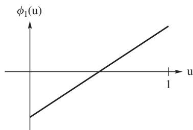

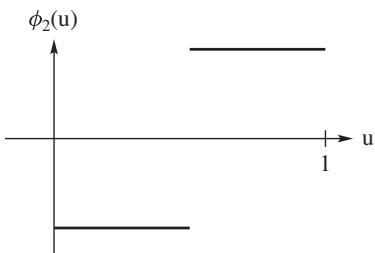

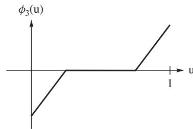

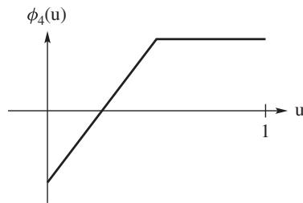  
Figure 10.6.1: Plots of the score functions $\varphi_1(u),\varphi_2(u),\varphi_3(u)$ , and $\varphi_4(u)$

We combine the two samples into one denoting the order statistics of the combined sample by $V_{1} < V_{2} < \dots < V_{n}$ . These are complete sufficient statistics for $F(x)$ under the null hypothesis. For $i = 1, \ldots, 4$ , the test statistic $W_{i}$ is distribution free under $H_{0}$ and, in particular, the distribution of $W_{i}$ does not depend on $F(x)$ . Therefore, each $W_{i}$ is independent of $V_{1}, V_{2}, \ldots, V_{n}$ . We use a pair of selector statistics $(Q_{1}, Q_{2})$ , which are functions of $V_{1}, V_{2}, \ldots, V_{n}$ , and hence are also independent of each $W_{i}$ . The first is

$$
Q _ {1} = \frac {\bar {U} _ {. 0 5} - \bar {M} _ {. 5}}{\bar {M} _ {. 5} - \bar {L} _ {. 0 5}}, \tag {10.6.2}
$$

where $\overline{U}_{.05}$ , $\overline{M}_{.5}$ , and $\overline{L}_{.05}$ are the averages of the largest $5\%$ of the $V_{s}$ , the middle $50\%$ of the $V_{s}$ , and the smallest $5\%$ of the $V_{s}$ , respectively. If $Q_{1}$ is large (say 2 or more), then the right tail of the distribution seems longer than the left tail; that is, there is an indication that the distribution is skewed to the right. On the other hand, if $Q_{1} < \frac{1}{2}$ , the sample indicates that the distribution may be skewed to the

left. The second selector statistic is

$$
Q _ {2} = \frac {\bar {U} . 0 5 - \bar {L} . 0 5}{\bar {U} . 5 - \bar {L} . 5}. \tag {10.6.3}
$$

Large values of $Q_{2}$ indicate that the distribution is heavy-tailed, while small values indicate that the distribution is light-tailed. Rules are needed for score selection, and here we make use of the benchmarks proposed in an article by Hogg et al. (1975). These rules are tabulated below, along with their benchmarks:

<table><tr><td>Benchmark</td><td>Distribution Indicated</td><td>Score Selected</td></tr><tr><td>Q2&gt;7</td><td>Heavy-tailed symmetric</td><td>φ2</td></tr><tr><td>Q1&gt;2 and Q2&lt;7</td><td>Right-skewed</td><td>φ4</td></tr><tr><td>Q1≤2 and Q2≤2</td><td>Light-tailed symmetric</td><td>φ3</td></tr><tr><td>Elsewhere</td><td>Moderate heavy-tailed</td><td>φ1</td></tr></table>

Hogg et al. (1975) performed a Monte Carlo power study of this adaptive procedure over a number of distributions with different kurtosis and skewness coefficients. In the study, both the adaptive procedure and the Wilcoxon test maintain their $\alpha$ level over the distributions, but the Student $t$ does not. Moreover, the Wilcoxon test has better power than the $t$ -test, as the distribution deviates much from the normal ( $kurtosis = 3$ and skewness $= 0$ ), but the adaptive procedure is much better than the Wilcoxon for the short-tailed distributions, the very heavy-tailed distributions, and the highly skewed distributions that are considered in the study.

Remark 10.6.1 (Computation for the Adaptive Procedure). An R implementation of Hogg's adaptive procedure as discussed in Example 10.6.1 can be found in the R package `npm` developed by Kloke and McKean (2014); see their Section 3.6. The R function is `hogg.test`. For illustration, consider the normal data discussed in Example 10.5.3. Here are the code and results:

load("examp1053.rda");hogg.test(y,x)

Scores Selected: Wilcoxon; p.value 0.11984

Hence, for this data, Hogg's procedure selected Wilcoxon scores. As another example, consider the waterwheel data given in Example 10.4.1. In this case the computation results in:

load("waterwheel.rda"); hogg.test(grp2,grp1)

Scores Selected: bent; p.value 0.63494

The selected score is the bent score which is the score function $\varphi_4(u)$ in Hogg's procedure. As the boxplot for the combined samples indicates the data are right-skewed, an indication that the score selection is appropriate.

The adaptive distribution-free procedure that we have discussed is for testing. Suppose we have a location model and were interested in estimating the shift in locations $\Delta$ . For example, if the true $F$ is a normal cdf, then a good choice for the estimator of $\Delta$ would be the estimator based on the normal scores procedure discussed in Example 10.5.1. The estimators, though, are not distribution free and, hence, the above reasoning does not hold. Also, the combined sample observations

$X_{1},\ldots ,X_{n_{1}},Y_{1},\ldots ,Y_{n_{2}}$ are not identically distributed. There are adaptive procedures based on residuals $X_{1},\ldots ,X_{n_{1}},Y_{1} - \widehat{\Delta},\ldots ,Y_{n_{2}} - \widehat{\Delta}$ , where $\widehat{\Delta}$ is an initial estimator of $\Delta$ ; see page 237 of Hettmansperger and McKean (2011) for discussion and Section 7.6 of Kloke and McKean (2014) for an R implementation.

# EXERCISES

10.6.1. In Exercises 10.6.2 and 10.6.3, the student is asked to apply the adaptive procedure described in Example 10.6.1 to real data sets. The hypotheses of interest are

$$
H _ {0}: \Delta = 0 \text {v e r s u s} H _ {1}: \Delta > 0,
$$

where $\Delta = \mu_{Y} - \mu_{X}$ . The four distribution-free test statistics are

$$
W _ {i} = \sum_ {j = 1} ^ {n _ {2}} a _ {i} [ R (Y _ {j}) ], \quad i = 1, 2, 3, 4, \tag {10.6.4}
$$

where

$$
a _ {i} (j) = \varphi_ {i} [ j / (n + 1) ],
$$

and the score functions are given by

$$
\begin{array}{l} \varphi_ {1} (u) = 2 u - 1, \quad 0 <   u <   1 \\ \varphi_ {2} (u) = \operatorname {s g n} (2 u - 1), \quad 0 <   u <   1 \\ \varphi_ {3} (u) = \left\{ \begin{array}{l l} 4 u - 1 & 0 <   u \leq \frac {1}{4} \\ 0 & \frac {1}{4} <   u \leq \frac {3}{4} \\ 4 u - 3 & \frac {3}{4} <   u <   1 \end{array} \right. \\ \varphi_ {4} (u) = \left\{ \begin{array}{l l} 4 u - (3 / 2) & 0 <   u \leq \frac {1}{2} \\ 1 / 2 & \frac {1}{2} <   u <   1. \end{array} \right. \\ \end{array}
$$

Note that we have adjusted the fourth score $\varphi_4(u)$ in Figure 10.6.1 so that it integrates to 0 over the interval $(0,1)$ .

The theory of Section 10.5 states that, under $H_0$ , the distribution of $W_i$ is asymptotically normal with mean 0 and variance

$$
\operatorname {V a r} _ {H _ {0}} (W _ {i}) = \frac {n _ {1} n _ {2}}{n - 1} \left[ \frac {1}{n} \sum_ {j = 1} ^ {n} a _ {i} ^ {2} (j) \right].
$$

Note, however, that the scores have not been standardized, so their squares integrate to 1 over the interval $(0,1)$ . Hence, do not replace the term in brackets by 1. If $n_1 = n_2 = 15$ , find $\operatorname{Var}_{H_0}(W_i)$ , for $i = 1,\dots,4$ .

10.6.2. Consider the data in Example 10.5.3 and the hypotheses

$$
H _ {0}: \Delta = 0 \text {v e r s u s} H _ {1}: \Delta > 0,
$$

where $\Delta = \mu_{Y} - \mu_{X}$ . Apply the adaptive procedure described in Example 10.6.1 with the tests defined in Exercise 10.6.1 to test these hypotheses. Obtain the $p$ -value of the test.

10.6.3. Let $F(x)$ be a distribution function of a distribution of the continuous type that is symmetric about its median $\theta$ . We wish to test $H_0: \theta = 0$ against $H_1: \theta > 0$ . Use the fact that the $2n$ values, $X_i$ and $-X_i$ , $i = 1, 2, \ldots, n$ , after ordering, are complete sufficient statistics for $F$ , provided that $H_0$ is true.

(a) As in Exercise 10.5.15, determine the one-sample signed-rank test statistics corresponding to the two-sample score functions $\varphi_1(u)$ , $\varphi_2(u)$ , and $\varphi_3(u)$ defined in the last exercise. Use the asymptotic test statistics. Note that these score functions are odd about $\frac{1}{2}$ ; hence, their top halves serve as score functions for signed-rank statistics.

(b) We are assuming symmetric distributions in this problem; hence, we use only $Q_{2}$ as our score selector. If $Q_{2} \geq 7$ , then select $\varphi_{2}(u)$ ; if $2 < Q_{2} < 7$ , then select $\varphi_{1}(u)$ ; and finally, if $Q_{2} \leq 2$ , then select $\varphi_{3}(u)$ . Construct this adaptive distribution-free test.

(c) Use your adaptive procedure on Darwin's Zea mays data; see Example 10.3.1. Obtain the $p$ -value.

# 10.7 Simple Linear Model

In this section, we consider the simple linear model and briefly develop the rank-based procedures for it.

Suppose the responses $Y_{1}, Y_{2}, \ldots, Y_{n}$ follow the model

$$
Y _ {i} = \alpha + \beta \left(x _ {i} - \bar {x}\right) + \varepsilon_ {i}, \quad i = 1, 2, \dots , n, \tag {10.7.1}
$$

where $\varepsilon_1, \varepsilon_2, \ldots, \varepsilon_n$ are iid with continuous cdf $F(x)$ and pdf $f(x)$ . In this model, the variables $x_1, x_2, \ldots, x_n$ are considered fixed. Often $x$ is referred to as a predictor of $Y$ . Also, the centering, using $\overline{x}$ , is for convenience (without loss of generality) and we do not use it in the examples of this section. The parameter $\beta$ is the slope parameter, which is the expected change in $Y$ (provided expectations exist) when $x$ increases by one unit. A natural null hypothesis is

$$
H _ {0}: \beta = 0 \text {v e r s u s} H _ {1}: \beta \neq 0. \tag {10.7.2}
$$

Under $H_0$ , the distribution of $Y$ is free of $x$ .

In Chapter 3 of Hettmansperger and McKean (2011), rank-based procedures for linear models are presented from a geometric point of view; see also Exercises 10.9.11-10.9.12 of Section 10.9. Here, it is easier to present a development which parallels the preceding sections. Hence we introduce a rank test of $H_0$ and then invert the test to estimate $\beta$ . Before doing this, though, we present an example that shows that the two-sample location problem of Section 10.4 is a regression problem.

Example 10.7.1. As in Section 10.4, let $X_{1}, X_{2}, \ldots, X_{n_{1}}$ be a random sample from a distribution with a continuous cdf $F(x - \alpha)$ , where $\alpha$ is a location parameter. Let $Y_{1}, Y_{2}, \ldots, Y_{n_{2}}$ be a random sample with cdf $F(x - \alpha - \Delta)$ . Hence $\Delta$ is the shift between the cdfs of $X_{i}$ and $Y_{j}$ . Redefine the observations as $Z_{i} = X_{i}$ , for

$i = 1, \ldots, n_1$ , and $Z_{n_1 + i} = Y_i$ , for $i = n_1 + 1, \ldots, n$ , where $n = n_1 + n_2$ . Let $c_i$ be 0 or 1 depending on whether $1 \leq i \leq n_1$ or $n_1 + 1 \leq i \leq n$ . Then we can write the two sample location models as

$$
Z _ {i} = \alpha + \Delta c _ {i} + \varepsilon_ {i}, \tag {10.7.3}
$$

where $\varepsilon_1, \varepsilon_2, \ldots, \varepsilon_n$ are iid with cdf $F(x)$ . Hence the shift in locations is the slope parameter from this viewpoint.

Suppose the regression model (10.7.1) holds and, further, that $H_0$ is true. Then we would expect that $Y_i$ and $x_i - \overline{x}$ are not related and, in particular, that they are uncorrelated. Hence one could consider $\sum_{i=1}^{n} (x_i - \overline{x})Y_i$ as a test statistic. As Exercise 9.6.11 of Chapter 9 shows, if we additionally assume that the random errors $\varepsilon_i$ are normally distributed, this test statistic, properly standardized, is the likelihood ratio test statistic. Reasoning in the same way, for a specified score function we would expect that $a_\varphi(R(Y_i))$ and $x_i - \overline{x}$ are uncorrelated, under $H_0$ . Therefore, consider the test statistic

$$
T _ {\varphi} = \sum_ {i = 1} ^ {n} \left(x _ {i} - \bar {x}\right) a _ {\varphi} (R \left(Y _ {i}\right)), \tag {10.7.4}
$$

where $R(Y_{i})$ denotes the rank of $Y_{i}$ among $Y_{1},\ldots ,Y_{n}$ and $a_{\varphi}(i) = \varphi (i / (n + 1))$ for a nondecreasing score function $\varphi (u)$ that is standardized, so that $\int \varphi (u)du = 0$ and $\int \varphi^2 (u)du = 1$ . Values of $T_{\varphi}$ close to 0 indicate $H_0$ is true.

Assume $H_0$ is true. Then $Y_{1},\ldots ,Y_{n}$ are iid random variables. Hence any permutation of the integers $\{1,2,\dots ,n\}$ is equiliterly to be the ranks of $Y_{1},\ldots ,Y_{n}$ . So the distribution of $T_{\varphi}$ is free of $F(x)$ . Note that the distribution does depend on $x_{1},x_{2},\ldots ,x_{n}$ . Thus, tables of the distribution are not available, although with high-speed computing, this distribution can be generated. Because $R(Y_{i})$ is uniformly distributed on the integers $\{1,2,\dots ,n\}$ , it is easy to show that the null expectation of $T_{\varphi}$ is zero. The null variance follows that of $W_{\varphi}$ of Section 10.5, so we have left the details for Exercise 10.7.4. To summarize, the null moments are given by

$$
E _ {H _ {0}} \left(T _ {\varphi}\right) = 0 \quad \text {a n d} \quad \operatorname {V a r} _ {H _ {0}} \left(T _ {\varphi}\right) = \frac {1}{n - 1} s _ {a} ^ {2} \sum_ {i = 1} ^ {n} \left(x _ {i} - \bar {x}\right) ^ {2}, \tag {10.7.5}
$$

where $s_a^2$ is the mean sum of the squares of the scores (10.5.6). Also, it can be shown that the test statistic is asymptotically normal. Therefore, an asymptotic level $\alpha$ decision rule for the hypotheses (10.7.2) with the two-sided alternative is given by

$$
\text {R e j e c t} H _ {0} \text {i n f a v o r o f} H _ {1} \text {i f} | z | = \left| \frac {T _ {\varphi}}{\sqrt {\operatorname {V a r} _ {H _ {0} \left(T _ {\varphi}\right)}}} \right| \geq z _ {\alpha / 2}. \tag {10.7.6}
$$

The associated process is given by

$$
T _ {\varphi} (\beta) = \sum_ {i = 1} ^ {n} \left(x _ {i} - \bar {x}\right) a _ {\varphi} \left(R \left(Y _ {i} - x _ {i} \beta\right)\right). \tag {10.7.7}
$$

Hence the corresponding estimate of $\beta$ is given by $\widehat{\beta}_{\varphi}$ , which solves the estimating equations

$$
T _ {\varphi} \left(\widehat {\beta} _ {\varphi}\right) \approx 0. \tag {10.7.8}
$$

Similar to Theorem 10.5.1, it can be shown that $T_{\varphi}(\beta)$ is a decreasing step function of $\beta$ that steps down at each sample slope $(Y_j - Y_i) / (x_j - x_i)$ , for $i \neq j$ . Thus the estimate exists. It cannot be obtained in closed form, but simple iterative techniques can be used to find the solution. In the regression problem, though, prediction of $Y$ is often of interest, which also requires an estimate of $\alpha$ . Notice that such an estimate can be obtained as a location estimate based on residuals. This is discussed in some detail in Section 3.5.2 of Hettmansperger and McKean (2011). For our purposes, we consider the median of the residuals; that is, we estimate $\alpha$ as

$$
\widehat {\alpha} = \operatorname {m e d} \left\{Y _ {i} - \widehat {\beta} _ {\varphi} \left(x _ {i} - \bar {x}\right) \right\}. \tag {10.7.9}
$$

Remark 10.7.1 (Computation). The Wilcoxon estimates of slope and intercept are computed by several packages. We recommend the CRAN package Rfit developed by Kloke and McKean (2012). Chapter 4 of the book by Kloke and McKean (2014) discusses the use of Rfit for the simple regression model (10.7.1). Rfit has code for many score functions, including the Wilcoxon scores, normal scores, as well as scores appropriate for skewed error distributions. The computations in this section are performed by Rfit. Also, the minitab command rregr obtains the Wilcoxon fit. Terpstra and McKean (2005) have written a collection of R functions, ww, which obtains the fit using Wilcoxon scores.

Example 10.7.2 (Telephone Data). Consider the regression data discussed in Exercise 9.6.3. Recall that the responses $(y)$ for this data set are the numbers of telephone calls (tens of millions) made in Belgium for the years 1950-1973, while time in years serves as the predictor variable $(x)$ . The data are plotted in Figure 10.7.1. The data are in the file telephone.rda. For this example, we use Wilcoxon scores to fit Model (10.7.1). The code and partial results (including the plot with overlaid fits) are:

fit1s <- lm(numcall~year); fitrob <- rfit(numcall~year)

fitls\$coef; fitrb\$coef # Result -26.0, 0.504; -7.1, 0.145

plot(numcall~year,xlab="Year",ylab="Number of calls")

abline(fitls); abline(fitrb, lty=2)

```c
legend(50,15,c("LS-Fit","Wilcoxon-Fit"),lty=c(1,2))

Thus, the Wilcoxon fitted value is $\hat{Y}_{\varphi,i} = -7.1 + 0.145x_{i}$ which is plotted in Figure 10.7.1. The least squares fit $\widehat{Y}_{\mathrm{LS},i} = -26.0 + 0.504x_{i}$ , is also plotted. Note that the Wilcoxon fit is much less sensitive to the outliers than the least squares fit.

The outliers in this data set were recording errors; see page 25 of Rousseeuw and Leroy (1987) for more discussion.

Similar to Lemma 10.2.1, a translation property holds for the process $T(\beta)$ given by

$$
E _ {\beta} [ T (0) ] = E _ {0} [ T (- \beta) ]; \tag {10.7.10}
$$

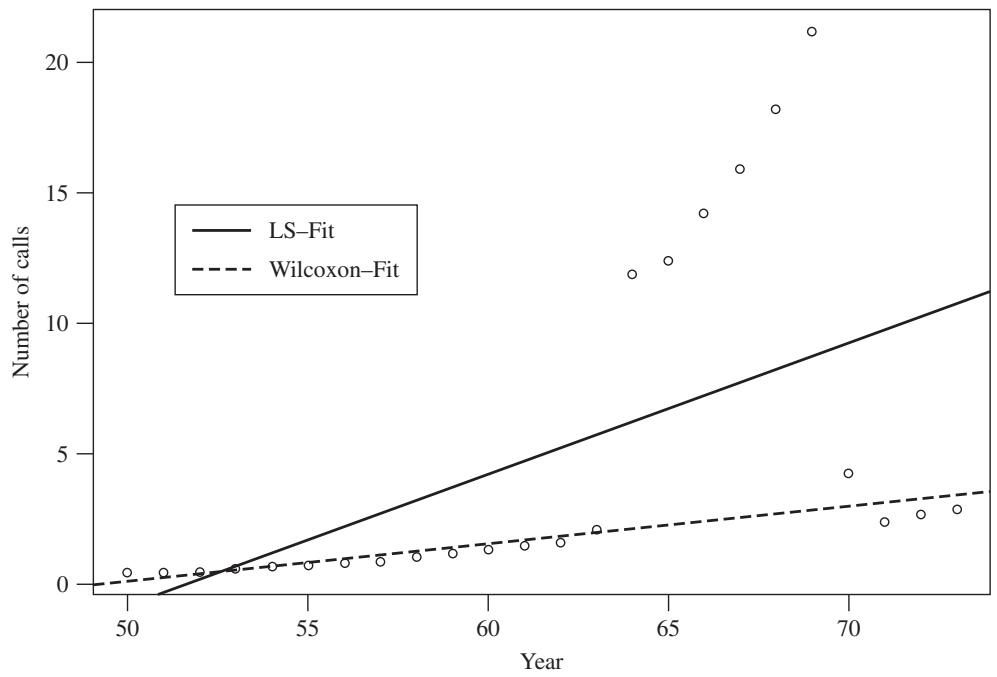  
Figure 10.7.1: Plot of telephone data, Example 10.7.2, overlaid with Wilcoxon and LS fits.

see Exercise 10.7.2. Further, as Exercise 10.7.5 shows, this property implies that the power curve for the one-sided tests of $H_0: \beta = 0$ are monotone, assuring the unbiasedness of the tests based on $T_{\varphi}$ .

We can now derive the efficacy of the process. Let $\mu_T(\beta) = E_\beta[T(0)]$ and $\sigma_T^2(0) = \mathrm{Var}_0[T(0)]$ . Expression (10.7.5) gives the result for $\sigma_T^2(0)$ . Recall that for the mean $\mu_T(\beta)$ , we need its derivative at 0. We freely use the relationship between rankings and the empirical cdf and then approximate this empirical cdf with the true cdf. Hence

$$
\begin{array}{l} \mu_ {T} (\beta) = E _ {\beta} [ T (0) ] = E _ {0} [ T (- \beta) ] = \sum_ {i = 1} ^ {n} (x _ {i} - \overline {{x}}) E _ {0} [ a _ {\varphi} (R (Y _ {i} + x _ {i} \beta)) ] \\ = \sum_ {i = 1} ^ {n} \left(x _ {i} - \bar {x}\right) E _ {0} \left[ \varphi \left(\frac {n \widehat {F} _ {n} \left(Y _ {i} + x _ {i} \beta\right)}{n + 1}\right) \right] \\ \approx \sum_ {i = 1} ^ {n} (x _ {i} - \overrightarrow {x}) E _ {0} [ \varphi (F (Y _ {i} + x _ {i} \beta)) ] \\ = \sum_ {i = 1} ^ {n} \left(x _ {i} - \bar {x}\right) \int_ {- \infty} ^ {\infty} \varphi \left(F \left(y + x _ {i} \beta\right)\right) f (y) d y. \tag {10.7.11} \\ \end{array}
$$

Differentiating this last expression, we have

$$
\mu_ {T} ^ {\prime} (\beta) = \sum_ {i = 1} ^ {n} (x _ {i} - \overline {{x}}) x _ {i} \int_ {- \infty} ^ {\infty} \varphi^ {\prime} (F (y + x _ {i} \beta)) f (y + x _ {i} \beta) f (y) d y,
$$

which yields

$$
\mu_ {T} ^ {\prime} (0) = \sum_ {i = 1} ^ {n} \left(x _ {i} - \bar {x}\right) ^ {2} \int_ {- \infty} ^ {\infty} \varphi^ {\prime} (F (y)) f ^ {2} (y) d y. \tag {10.7.12}
$$

We need one assumption on the $x_{1}, x_{2}, \ldots, x_{n}$ ; namely, $n^{-1} \sum_{i=1}^{n} (x_{i} - \overline{x})^{2} \to \sigma_{x}^{2}$ where $0 < \sigma_{x}^{2} < \infty$ . Recall that $(n-1)^{-1} s_{a}^{2} \to 1$ . Therefore, the efficacy of the process $T(\beta)$ is given by

$$
\begin{array}{l} c _ {T} = \lim _ {n \to \infty} \frac {\mu_ {T} ^ {\prime} (0)}{\sqrt {n} \sigma_ {T} (0)} = \lim _ {n \to \infty} \frac {\sum_ {i = 1} ^ {n} (x _ {i} - \overline {{x}}) ^ {2} \int_ {- \infty} ^ {\infty} \varphi^ {\prime} (F (y)) f ^ {2} (y) d y}{\sqrt {n} \sqrt {(n - 1) ^ {- 1} s _ {a} ^ {2}} \sqrt {\sum_ {i = 1} ^ {n} (x _ {i} - \overline {{x}}) ^ {2}}} \\ = \sigma_ {x} \int_ {- \infty} ^ {\infty} \varphi^ {\prime} (F (y)) f ^ {2} (y) d y. \tag {10.7.13} \\ \end{array}
$$

Using this, an asymptotic power lemma can be derived for the test based on $T_{\varphi}$ ; see expression (10.7.17) of Exercise 10.7.6. Based on this, it can be shown that the asymptotic distribution of the estimator $\widehat{\beta}_{\varphi}$ is given by

$$
\widehat {\beta} _ {\varphi} \text {h a s a n a p p r o x i m a t e} N \left(\beta , \tau_ {\varphi} ^ {2} / \sum_ {i = 1} ^ {n} \left(x _ {i} - \bar {x}\right) ^ {2}\right) \text {d i s t r i b u t i o n}, \tag {10.7.14}
$$

where the scale parameter $\tau_{\varphi}$ is $\tau_{\varphi} = (\int_{-\infty}^{\infty}\varphi '(F(y))f^{2}(y)dy)^{-1}$ . Koul et al. (1987) developed a consistent estimator of the scale parameter $\tau$ , which is the default estimate in the package Rfit. This can be used to compute a confidence interval for the slope parameter, as illustrated in Example 10.7.3.

Remark 10.7.2. The least squares (LS) estimates for Model (10.7.1) were discussed in Section 9.6 in the case that the random errors $\varepsilon_1, \varepsilon_2, \ldots, \varepsilon_n$ are iid with a $N(0, \sigma^2)$ distribution. In general, for Model (10.7.1), the asymptotic distribution of the LS estimator of $\beta$ , say $\widehat{\beta}_{\mathrm{LS}}$ , is:

$$
\widehat {\beta} _ {\mathrm {L S}} \text {h a s a n a p p r o x i m a t e} N \left(\beta , \sigma^ {2} / \sum_ {i = 1} ^ {n} \left(x _ {i} - \bar {x}\right) ^ {2}\right) \text {d i s t r i b u t i o n}, \tag {10.7.15}
$$

where $\sigma^2$ is the variance of $\varepsilon_{i}$ . Based on (10.7.14) and (10.7.15), it follows that the ARE between the rank-based and LS estimators is given by

$$
\operatorname {A R E} \left(\widehat {\beta} _ {\varphi}, \widehat {\beta} _ {\mathrm {L S}}\right) = \frac {\sigma^ {2}}{\tau_ {\varphi} ^ {2}}. \tag {10.7.16}
$$

Hence, if Wilcoxon scores are used, this ARE is the same as the ARE between the Wilcoxon and $t$ -procedures in the one- and two-sample location models.

Example 10.7.3 (Distance of Punts). Rasmussen (1992), page 562, presents a data set concerning distance of punts along with several predictors. The actual response is the average distance in feet of 10 punts for each of 13 punters. As a predictor, we consider the average hang-time in seconds (the time the punted football is in the air). The data are in the file punter.rda. Based on the plot (see Exercise 10.7.1), the simple linear model seems reasonable as an initial fit. Next is the code and partial results of the Wilcoxon fit:

fit <- rfit(distance~hangtime); summary.fit) Estimate Std. Error t.value p.value (Intercept) -18.180 51.201 -0.3551 0.729254 hangtime 41.010 12.882 3.1834 0.008708 **

The second line of the summary table gives the Wilcoxon estimate of the slope (41.01) and the standard error of the estimate (12.89). Hence, we predict that the football travels an additional 41 feet for each additional second of hang-time. An approximate $95\%$ confidence interval for the true slope, using the $t$ -critical with 11 degrees of freedom is (12.66, 69.36). So with approximate confidence of $95\%$ the slope differs from 0.

# EXERCISES

10.7.1. Consider the data on football punts in Example 10.7.3.

(a) Obtain the scatterplot of distance versus hang-time and overlay the Wilcoxon fit.   
(b) As a second predictor consider overall strength of the kicker which is in the variable strength. Obtain the scatterplot of distance versus strength and overlay the Wilcoxon fit. What is the meaning of the slope parameter for this predictor. Answer using a $95\%$ confidence interval for the slope.

10.7.2. Establish expression (10.7.10). To do this, note first that the expression is the same as

$$
E _ {\beta} \left[ \sum_ {i = 1} ^ {n} (x _ {i} - \overline {{x}}) a _ {\varphi} (R (Y _ {i})) \right] = E _ {0} \left[ \sum_ {i = 1} ^ {n} (x _ {i} - \overline {{x}}) a _ {\varphi} (R (Y _ {i} + x _ {i} \beta)) \right].
$$

Show that the cdfs of $Y_{i}$ (under $\beta$ ) and $Y_{i} + (x_{i} - \overline{x})\beta$ (under 0) are the same.

10.7.3. Suppose we have a two-sample model given by (10.7.3). Assuming Wilcoxon scores, show that the test statistic (10.7.4) is equivalent to the Wilcoxon test statistic found in expression (10.4.5).   
10.7.4. Show that the null variance of the test statistic $T_{\varphi}$ is the value given in (10.7.5).   
10.7.5. Show that the translation property (10.7.10) implies that the power curve for either one-sided test based on the test statistic $T_{\varphi}$ of $H_0: \beta = 0$ is monotone.

10.7.6. Consider the sequence of local alternatives given by the hypotheses

$$
H _ {0}: \beta = 0 \mathrm {v e r s u s} H _ {1 n}: \beta = \beta_ {n} = \frac {\beta_ {1}}{\sqrt {n}},
$$

where $\beta_{1} > 0$ . Let $\gamma (\beta)$ be the power function discussed in Exercise 10.7.5 for an asymptotic level $\alpha$ test based on the test statistic $T_{\varphi}$ . Using the mean value theorem to approximate $\mu_T(\beta_n)$ , sketch a proof of the limit

$$
\lim  _ {n \rightarrow \infty} \gamma (\beta_ {n}) = 1 - \Phi (z _ {\alpha} - c _ {T} \beta_ {1}). \tag {10.7.17}
$$

# 10.8 Measures of Association

In the last section, we discussed the simple linear regression model in which the random variables, $Y$ s, were the responses or dependent variables, while the $xs$ were the independent variables and were thought of as fixed. Regression models occur in several ways. In an experimental design, the values of the independent variables are prespecified and the responses are observed. Bioassays (dose-response experiments) are examples. The doses are fixed and the responses are observed. If the experimental design is performed in a controlled environment (for example, all other variables are controlled), it may be possible to establish cause and effect between $x$ and $Y$ . On the other hand, in observational studies both the $xs$ and $Y$ s are observed. In the regression setting, we are still interested in predicting $Y$ in terms of $x$ , but usually cause and effect between $x$ and $Y$ are precluded in such studies (other variables besides $x$ may be changing).

In this section, we focus on observational studies but are interested in the strength of the association between $Y$ and $x$ . So both $X$ and $Y$ are treated as random variables in this section and the underlying distribution of interest is the bivariate distribution of the pair $(X, Y)$ . We assume that this bivariate distribution is continuous with cdf $F(x, y)$ and pdf $f(x, y)$ .

Hence, let $(X,Y)$ be a pair of random variables. A natural null model (baseline model) is that there is no relationship between $X$ and $Y$ ; that is, the null hypothesis is given by $H_0:X$ and $Y$ are independent. Alternatives, though, depend on which measure of association is of interest. For example, if we are interested in the correlation between $X$ and $Y$ , we use the correlation coefficient $\rho$ (Section 9.7) as our measure of the association. A two-sided alternative in this case is $H_1:\rho \neq 0$ . Recall that independence between $X$ and $Y$ implies that $\rho = 0$ , but that the converse is not true. However, the contrapositive is true; that is, $\rho \neq 0$ implies that $X$ and $Y$ are dependent. So, in rejecting $H_0$ , we conclude that $X$ and $Y$ are dependent. Furthermore, the size of $\rho$ indicates the strength of the correlation between $X$ and $Y$ .

# 10.8.1 Kendall's $\tau$

The first measure of association that we consider in this section is a measure of the monotonicity between $X$ and $Y$ . Monotonicity is an easily understood association between $X$ and $Y$ . Let $(X_1, Y_1)$ and $(X_2, Y_2)$ be independent pairs with the same

bivariate distribution (discrete or continuous). We say these pairs are concordant if $\operatorname{sgn}\{(X_1 - X_2)(Y_1 - Y_2)\} = 1$ and are discordant if $\operatorname{sgn}\{(X_1 - X_2)(Y_1 - Y_2)\} = -1$ . The variables $X$ and $Y$ have an increasing relationship if the pairs tend to be concordant and a decreasing relationship if the pairs tend to be discordant. A measure of this is given by Kendall's $\tau$ ,

$$
\tau = P \left[ \operatorname {s g n} \left\{\left(X _ {1} - X _ {2}\right) \left(Y _ {1} - Y _ {2}\right) \right\} = 1 \right] - P \left[ \operatorname {s g n} \left\{\left(X _ {1} - X _ {2}\right) \left(Y _ {1} - Y _ {2}\right) \right\} = - 1 \right]. \tag {10.8.1}
$$

As Exercise 10.8.1 shows, $-1 \leq \tau \leq 1$ . Positive values of $\tau$ indicate increasing monotonicity, negative values indicate decreasing monotonicity, and $\tau = 0$ reflects neither. Furthermore, as the following theorem shows, if $X$ and $Y$ are independent, then $\tau = 0$ .

Theorem 10.8.1. Let $(X_{1},Y_{1})$ and $(X_{2},Y_{2})$ be independent pairs of observations of $(X,Y)$ , which has a continuous bivariate distribution. If $X$ and $Y$ are independent, then $\tau = 0$ .

Proof: Let $(X_{1},Y_{1})$ and $(X_{2},Y_{2})$ be independent pairs of observations with the same continuous bivariate distribution as $(X,Y)$ . Because the cdf is continuous, the sign function is either $-1$ or $1$ . By independence, we have

$$
\begin{array}{l} P \left[ \operatorname {s g n} \left(X _ {1} - X _ {2}\right) \left(Y _ {1} - Y _ {2}\right) = 1 \right] = P \left[ \left\{X _ {1} > X _ {2} \right\} \cap \left\{Y _ {1} > Y _ {2} \right\} \right] \\ + P \left[ \left\{X _ {1} <   X _ {2} \right\} \cap \left\{Y _ {1} <   Y _ {2} \right\} \right] \\ = P \left[ X _ {1} > X _ {2} \right] P \left[ Y _ {1} > Y _ {2} \right] \\ + P \left[ X _ {1} <   X _ {2} \right] P \left[ Y _ {1} <   Y _ {2} \right] \\ = \left(\frac {1}{2}\right) ^ {2} + \left(\frac {1}{2}\right) ^ {2} = \frac {1}{2}. \\ \end{array}
$$

Likewise, $P[\operatorname{sgn}(X_1 - X_2)(Y_1 - Y_2) = -1] = \frac{1}{2}$ ; hence, $\tau = 0$ .

Relative to Kendall's $\tau$ as the measure of association, the two-sided hypotheses of interest here are

$$
H _ {0}: \tau = 0 \text {v e r s u s} H _ {1}: \tau \neq 0. \tag {10.8.2}
$$

As Exercise 10.8.1 shows, the converse of Theorem 10.8.1 is false. However, the contrapositive is true; i.e., $\tau \neq 0$ implies that $X$ and $Y$ are dependent. As with the correlation coefficient, in rejecting $H_0$ , we conclude that $X$ and $Y$ are dependent.

Kendall's $\tau$ has a simple unbiased estimator. Let $(X_{1},Y_{1}),(X_{2},Y_{2}),\ldots ,(X_{n},Y_{n})$ be a random sample of the cdf $F(x,y)$ . Define the statistic

$$
K = \binom {n} {2} ^ {- 1} \sum_ {i <   j} \operatorname {s g n} \left\{\left(X _ {i} - X _ {j}\right) \left(Y _ {i} - Y _ {j}\right) \right\}. \tag {10.8.3}
$$

Note that for all $i \neq j$ , the pairs $(X_i, Y_i)$ and $(X_j, Y_j)$ are identically distributed. Thus $E(K) = \binom{n}{2}^{-1} \binom{n}{2} E[\operatorname{sgn}\{(X_1 - X_2)(Y_1 - Y_2)\}] = \tau$ .

In order to use $K$ as a test statistic of the hypotheses (10.8.2), we need its distribution under the null hypothesis. Under $H_0$ , $\tau = 0$ , so $E_{H_0}(K) = 0$ . The

null variance of $K$ is given by expression (10.8.6); see, for instance, page 205 of Hettmansperger (1984). If all pairs $(X_i, Y_i), (X_j, Y_j)$ of the sample are concordant then $K = 1$ , indicating a strictly increasing monotone relationship. On the other hand, if all pairs are discordant then $K = -1$ . Thus the range of $K$ is contained in the interval $[-1, 1]$ . Also, the summands in expression (10.8.3) are either $\pm 1$ . From the proof of Theorem 10.8.1, the probability that a summand is 1 is $1/2$ , which does not depend on the underlying distribution. Hence the statistic $K$ is distribution-free under $H_0$ . The null distribution of $K$ is symmetric about 0. This is easily seen from the fact that for each concordant pair there is an obvious discordant pair (just reverse an inequality on the $Y$ s) and the fact that concordant and discordant pairs are equilibrated under $H_0$ . Also, it can be shown that $K$ is asymptotically normal under $H_0$ . We summarize these results, without proof, in a theorem.

Theorem 10.8.2. Let $(X_{1},Y_{1}),(X_{2},Y_{2}),\ldots ,(X_{n},Y_{n})$ be a random sample on the bivariate random vector $(X,Y)$ with continuous cdf $F(x,y)$ . Under the null hypothesis of independence between $X$ and $Y$ , i.e., $F(x,y) = F_{X}(x)F_{Y}(y)$ , for all $(x,y)$ in the support of $(X,Y)$ , the test statistic $K$ satisfies the following properties:

$$
K \text {i s} \quad \text {d i s t r i b u t i o n f r e e w i t h a s y m m e t r i c p m f} \tag {10.8.4}
$$

$$
E _ {H _ {0}} [ K ] = 0 \tag {10.8.5}
$$

$$
\operatorname {V a r} _ {H _ {0}} (K) = \frac {2}{9} \frac {2 n + 5}{n (n - 1)} \tag {10.8.6}
$$

$$
\frac {K}{\sqrt {\operatorname {V a r} _ {H _ {0}} (K)}} \text {h a s a n a s y m p t o t i c N (0 , 1) d i s t r i b u t i o n .} \tag {10.8.7}
$$

Most statistical computing packages compute Kendall's $\tau$ . For instance, the R function cor.test(x,y, method=c("kendall"), exact=T) obtains $K$ and the test discussed above when x and y are the vectors of the $X$ and $Y$ observations, respectively. The computation of the $p$ -value is with the exact distribution. We illustrate this test in the next example.

Based on the asymptotic distribution, a large sample level $\alpha$ test for the hypotheses (10.8.2) is to reject $H_0$ if $Z_K > z_{\alpha / 2}$ , where

$$
Z _ {K} = \frac {K}{\sqrt {2 (2 n + 5) / 9 n (n - 1)}}. \tag {10.8.8}
$$

Example 10.8.1 (Olympic Race Times). Table 10.8.1 displays the winning times for two races in the Olympics beginning with the 1896 Olympics through the 1980 Olympics. The data were taken from Hettmansperger (1984) and can be found in the data set olym1500mara.rda. The times in seconds are for the $1500\mathrm{m}$ and the marathon. The entries in the table for the marathon race are the actual times minus 2 hours. In Exercise 10.8.2 the reader is asked to create a scatterplot of the times for the two races. The plot shows a strongly increasing monotone trend with one obvious outlier (1968 Olympics). The following R code computes Kendall's $\tau$ . We have summarized the results with the estimate of Kendall's $\tau$ and the $p$ -value of the test of no association. This $p$ -value is based on the exact distribution.

$$
\operatorname {c o r . t e s t} (\mathrm {m} 1 5 0 0, \text {m a r a h o n}, \text {m e t h o d} = ^ {\prime \prime} k e n d a l l ^ {\prime \prime}, \text {e x a c t} = T)
$$

Table 10.8.1: Data for Example 10.8.1   

<table><tr><td>Year</td><td>1500 m</td><td>Marathon*</td><td>Year</td><td>1500 m</td><td>Marathon*</td></tr><tr><td>1896</td><td>373.2</td><td>3530</td><td>1936</td><td>227.8</td><td>1759</td></tr><tr><td>1900</td><td>246.0</td><td>3585</td><td>1948</td><td>229.8</td><td>2092</td></tr><tr><td>1904</td><td>245.4</td><td>5333</td><td>1952</td><td>225.2</td><td>1383</td></tr><tr><td>1906</td><td>252.0</td><td>3084</td><td>1956</td><td>221.2</td><td>1500</td></tr><tr><td>1908</td><td>243.4</td><td>3318</td><td>1960</td><td>215.6</td><td>916</td></tr><tr><td>1912</td><td>236.8</td><td>2215</td><td>1964</td><td>218.1</td><td>731</td></tr><tr><td>1920</td><td>241.8</td><td>1956</td><td>1968</td><td>214.9</td><td>1226</td></tr><tr><td>1924</td><td>233.6</td><td>2483</td><td>1972</td><td>216.3</td><td>740</td></tr><tr><td>1928</td><td>233.2</td><td>1977</td><td>1976</td><td>219.2</td><td>595</td></tr><tr><td>1932</td><td>231.2</td><td>1896</td><td>1980</td><td>218.4</td><td>663</td></tr></table>

* Actual marathon times are 2 hours + entry.

p-value = 3.319e-06; estimates: tau 0.6947368

The test results show strong evidence to reject the hypothesis of the independence of the winning times of the races.

# 10.8.2 Spearman's Rho

As above, assume that $(X_{1},Y_{1}),(X_{2},Y_{2}),\ldots ,(X_{n},Y_{n})$ is a random sample from a bivariate continuous cdf $F(x,y)$ . The population correlation coefficient $\rho$ is a measure of linearity between $X$ and $Y$ . The usual estimate is the sample correlation coefficient given by

$$
r = \frac {\sum_ {i = 1} ^ {n} \left(X _ {i} - \bar {X}\right) \left(Y _ {i} - \bar {Y}\right)}{\sqrt {\sum_ {i = 1} ^ {n} \left(X _ {i} - \bar {X}\right) ^ {2}} \sqrt {\sum_ {i = 1} ^ {n} \left(Y _ {i} - \bar {Y}\right) ^ {2}}}; \tag {10.8.9}
$$

see Section 9.7. A simple rank analog is to replace $X_{i}$ by $R(X_{i})$ , where $R(X_{i})$ denotes the rank of $X_{i}$ among $X_{1},\ldots ,X_{n}$ , and likewise $Y_{i}$ by $R(Y_{i})$ , where $R(Y_{i})$ denotes the rank of $Y_{i}$ among $Y_{1},\ldots ,Y_{n}$ . Upon making this substitution, the denominator of the above ratio is a constant. This results in the statistic

$$
r _ {S} = \frac {\sum_ {i = 1} ^ {n} \left(R \left(X _ {i}\right) - \frac {n + 1}{2}\right) \left(R \left(Y _ {i}\right) - \frac {n + 1}{2}\right)}{n \left(n ^ {2} - 1\right) / 1 2}, \tag {10.8.10}
$$

which is called Spearman's rho. The statistic $r_S$ is a correlation coefficient, so the inequality $-1 \leq r_S \leq 1$ is true. Further, as the following theorem shows, independence implies that the mean of $r_S$ is 0.

Theorem 10.8.3. Suppose $(X_{1},Y_{1}),(X_{2},Y_{2}),\ldots ,(X_{n},Y_{n})$ is a sample on $(X,Y)$ where $(X,Y)$ has the continuous cdf $F(x,y)$ . If $X$ and $Y$ are independent, then $E(r_{S}) = 0$ .

Proof: Under independence, $X_{i}$ and $Y_{j}$ are independent for all $i$ and $j$ ; hence, in particular, $R(X_{i})$ is independent of $R(Y_{i})$ . Furthermore, $R(X_{i})$ is uniformly distributed on the integers $\{1,2,\ldots,n\}$ . Therefore, $E(R(X_{i})) = (n + 1)/2$ , which leads to the result.

Thus the measure of association $r_S$ can be used to test the null hypothesis of independence similar to Kendall's $K$ . Under independence, because the $X_i$ s are a random sample, the random vector $(R(X_1), \ldots, R(X_n))$ is equilibrated to assume any permutation of the integers $\{1, 2, \ldots, n\}$ and, likewise, the vector of the ranks of the $Y_i$ s. Furthermore, under independence, the random vector $[R(X_1), \ldots, R(X_n), R(Y_1), \ldots, R(Y_n)]$ is equilibrated to assume any of the $(n!)^2$ vectors $(i_1, i_2, \ldots, i_n, j_1, j_2, \ldots, j_n)$ , where $(i_1, i_2, \ldots, i_n)$ and $(j_1, j_2, \ldots, j_n)$ are permutations of the integers $\{1, 2, \ldots, n\}$ . Hence, under independence, the statistic $r_S$ is distribution-free. The distribution is discrete and tables of it can be found, for instance, in Hollander and Wolfe (1999). Similar to Kendall's statistic $K$ , the distribution is symmetric about zero and it has an asymptotic normal distribution with asymptotic variance $1/(n-1)$ ; see Exercise 10.8.7 for a proof of the null variance of $r_s$ . A large sample level $\alpha$ test is to reject independence between $X$ and $Y$ if $|z_S| > z_{\alpha/2}$ , where $z_S = \sqrt{n-1}r_s$ . We record these results in a theorem, without proof.

Theorem 10.8.4. Let $(X_{1},Y_{1}),(X_{2},Y_{2}),\ldots ,(X_{n},Y_{n})$ be a random sample on the bivariate random vector $(X,Y)$ with continuous cdf $F(x,y)$ . Under the null hypothesis of independence between $X$ and $Y$ , i.e., $F(x,y) = F_{X}(x)F_{Y}(y)$ , for all $(x,y)$ in the support of $(X,Y)$ , the test statistic $r_S$ satisfies the following properties:

$$
r _ {S} \text {i s d i s t r i b u t i o n - f r e e , s y m m e t r i c a l l y d i s t r i b u t e d a b o u t} 0 \tag {10.8.11}
$$

$$
E _ {H _ {0}} \left[ r _ {S} \right] = 0 \tag {10.8.12}
$$

$$
\operatorname {V a r} _ {H _ {0}} \left(r _ {S}\right) = \frac {1}{n - 1} \tag {10.8.13}
$$

$$
\frac {r _ {S}}{\sqrt {\operatorname {V a r} _ {H _ {0}} \left(r _ {S}\right)}} \text {i s} N (0, 1). \tag {10.8.14}
$$

Example 10.8.2 (Example 10.8.1, Continued). For the data in Example 10.8.1, the R code for the analysis based on Spearman's $\rho$ is:

cor.test(m1500,marathon,method="spearman")

p-value = 2.021e-06; sample estimates: rho 0.9052632

The result is highly significant. For comparison, the value of the asymptotic test statistic is $Z_{S} = 0.905\sqrt{19} = 3.94$ with the $p$ -value for a two-sided test is 0.00008; so, the results are quite similar.

If the samples have a strictly increasing monotone relationship, then it is easy to see that $r_S = 1$ ; while if they have a strictly decreasing monotone relationship, then $r_S = -1$ . Like Kendall's $K$ statistic, $r_S$ is an estimate of a population parameter, but, except for when $X$ and $Y$ are independent, it is a more complicated expression than $\tau$ . It can be shown (see Kendall, 1962) that

$$
E \left(r _ {S}\right) = \frac {3}{n + 1} [ \tau + (n - 2) (2 \gamma - 1) ], \tag {10.8.15}
$$

where $\gamma = P[(X_2 - X_1)(Y_3 - Y_1) > 0]$ . For large $n$ , $E(r_S) \approx 6(\gamma - 1/2)$ , which is a harder parameter to interpret than the measure of concordance $\tau$ .

Spearman's rho is based on Wilcoxon scores; hence, it can easily be extended to other rank score functions. Some of these measures are discussed in the exercises.

Remark 10.8.1 (Confidence Intervals). Distribution-free confidence intervals for Kendall's $\tau$ exist; see, Section 8.5 of Hollander and Wolfe (1999). As outlined in Exercise 10.8.6, it is easy to construct percentile bootstrap confidence intervals for both parameters. The R function cor.boot.ci in the CRAN package npsm obtains such confidence intervals; see Section 4.8 of Kloke and McKean (2014) for discussion. It also requires the CRAN package boot developed by Canty and Ripley (2017). We used this function to compute confidence intervals for $\tau$ and $\rho_{S}$ :

library(boot); library(npsm)

cor.boot-ci(m1500,marathon,method="spearman");# (0.719,0.955)

cor.boot-ci(m1500, marathon, method="kendall"); # (0.494, 0.845)

# EXERCISES

10.8.1. Show that Kendall's $\tau$ satisfies the inequality $-1\leq \tau \leq 1$

10.8.2. Consider Example 10.8.1. Let $Y =$ winning times of the $1500\mathrm{m}$ race for a particular year and let $X =$ winning times of the marathon for that year. Obtain a scatterplot of $Y$ versus $X$ , and determine the outlying point.

10.8.3. Consider the last exercise as a regression problem. Suppose we are interested in predicting the $1500 \, \mathrm{m}$ winning time based on the marathon winning time. Assume a simple linear model and obtain the least squares and Wilcoxon (Section 10.7) fits of the data. Overlay the fits on the scatterplot obtained in Exercise 10.8.2. Comment on the fits. What does the slope parameter mean in this problem?

10.8.4. With regards to Exercise 10.8.3, a more interesting predicting problem is the prediction of winning time of either race based on year.

(a) Make a scatterplot of the winning $1500\mathrm{m}$ race time versus year. Assume a simple linear model (does the assumption make sense?) and obtain the least squares and Wilcoxon (Section 10.7) fits of the data. Overlay the fits on the scatterplot. Comment on the fits. What does the slope parameter mean in this problem? Predict the winning time for 1984. How close was your prediction to the true winning time?   
(b) Same as part (a), except use the winning time of the marathon for that year.

10.8.5. Spearman's rho is a rank correlation coefficient based on Wilcoxon scores. In this exercise we consider a rank correlation coefficient based on a general score function. Let $(X_{1},Y_{1}),(X_{2},Y_{2}),\ldots ,(X_{n},Y_{n})$ be a random sample from a bivariate continuous cdf $F(x,y)$ . Let $a(i) = \varphi (i / (n + 1))$ , where $\sum_{i = 1}^{n}a(i) = 0$ . In particular,

$\overline{a} = 0$ . As in expression (10.5.6), let $s_a^2 = \sum_{i=1}^{n} a^2(i)$ . Consider the rank correlation coefficient,

$$
r _ {a} = \frac {1}{s _ {a} ^ {2}} \sum_ {i = 1} ^ {n} a \left(R \left(X _ {i}\right)\right) a \left(R \left(Y _ {i}\right)\right). \tag {10.8.16}
$$

(a) Show that $r_a$ is a correlation coefficient on the items

$$
\left\{\left(a \left[ R \left(X _ {1}\right) \right], a \left[ R \left(Y _ {1}\right) \right]\right), \left(a \left[ R \left(X _ {2}\right) \right], a \left[ R \left(Y _ {2}\right) \right]\right), \dots , \left(a \left[ R \left(X _ {n}\right) \right], a \left[ R \left(Y _ {n}\right) \right]\right) \right\}.
$$

(b) For the score function $\varphi(u) = \sqrt{12}(u - (1/2))$ , show that $r_a = r_S$ , Spearman's rho.

(c) Obtain $r_a$ for the sign score function $\varphi(u) = \operatorname{sgn}(u - (1/2))$ . Call this rank correlation coefficient $r_{qc}$ . (The subscript $qc$ is obvious from Exercise 10.8.8.)

10.8.6. Write an R function that computes a percentile bootstrap confidence interval for Kendall's $\tau$ . Run your function for the data discussed in Example 10.8.1 and compare your answer with the confidence interval for Kendall's $\tau$ given in Remark 10.8.1.

Note: The following R code obtains resampled vectors of $\mathbf{x}$ and $\mathbf{y}$ :

ind = 1:length(x); mat = cbind(x, y);inds = sample(ind, n, replace = T)  
mats = mat[inds, ]; xs = mats[,1]; ys = mats[,2]

10.8.7. Consider the general score rank correlation coefficient $r_a$ defined in Exercise 10.8.5. Consider the null hypothesis $H_0: X$ and $Y$ are independent.

(a) Show that $E_{H_0}(r_a) = 0$ .

(b) Based on part (a) and $H_0$ , as a first step in obtaining the variance under $H_0$ , show that the following expression is true:

$$
\mathrm {V a r} _ {H _ {0}} (r _ {a}) = \frac {1}{s _ {a} ^ {4}} \sum_ {i = 1} ^ {n} \sum_ {j = 1} ^ {n} E _ {H _ {0}} [ a (R (X _ {i})) a (R (X _ {j})) ] E _ {H _ {0}} [ a (R (Y _ {i})) a (R (Y _ {j})) ].
$$

(c) To determine the expectation in the last expression, consider the two cases $i = j$ and $i \neq j$ . Then using uniformity of the distribution of the ranks, show that

$$
\operatorname {V a r} _ {H _ {0}} \left(r _ {a}\right) = \frac {1}{s _ {a} ^ {4}} \frac {1}{n - 1} s _ {a} ^ {4} = \frac {1}{n - 1}. \tag {10.8.17}
$$

10.8.8. Consider the rank correlation coefficient given by $r_{qc}$ in part (c) of Exercise 10.8.5. Let $Q_{2X}$ and $Q_{2Y}$ denote the medians of the samples $X_1, \ldots, X_n$ and $Y_1, \ldots, Y_n$ , respectively. Now consider the four quadrants:

$$
I = \{(x, y): x > Q _ {2 X}, y > Q _ {2 Y} \}
$$

$$
I I = \{(x, y): x <   Q _ {2 X}, y > Q _ {2 Y} \}
$$

$$
I I I = \left\{(x, y): x <   Q _ {2 X}, y <   Q _ {2 Y} \right\}
$$

$$
I V = \{(x, y): x > Q _ {2 X}, y <   Q _ {2 Y} \}.
$$

Show essentially that

$$
r _ {q c} = \frac {1}{n} \left\{\# \left(X _ {i}, Y _ {i}\right) \in I + \# \left(X _ {i}, Y _ {i}\right) \in I I I - \# \left(X _ {i}, Y _ {i}\right) \in I I - \# \left(X _ {i}, Y _ {i}\right) \in I V \right\}. \tag {10.8.18}
$$

Hence, $r_{qc}$ is referred to as the quadrant count correlation coefficient.

10.8.9. Set up the asymptotic test of independence using $r_{qc}$ of the last exercise. Then use it to test for independence between the $1500\mathrm{m}$ race times and the marathon race times of the data in Example 10.8.1.

10.8.10. Obtain the rank correlation coefficient when normal scores are used; that is, the scores are $a(i) = \Phi^{-1}(i / (n + 1))$ , $i = 1,\dots ,n$ . Call it $r_N$ . Set up the asymptotic test of independence using $r_N$ of the last exercise. Then use it to test for independence between the $1500\mathrm{m}$ race times and the marathon race times of the data in Example 10.8.1.

10.8.11. Suppose that the hypothesis $H_0$ concerns the independence of two random variables $X$ and $Y$ . That is, we wish to test $H_0: F(x, y) = F_1(x)F_2(y)$ , where $F, F_1$ , and $F_2$ are the respective joint and marginal distribution functions of the continuous type, against all alternatives. Let $(X_1, Y_1), (X_2, Y_2), \ldots, (X_n, Y_n)$ be a random sample from the joint distribution. Under $H_0$ , the order statistics of $X_1, X_2, \ldots, X_n$ and the order statistics of $Y_1, Y_2, \ldots, Y_n$ are, respectively, complete sufficient statistics for $F_1$ and $F_2$ . Use $r_S, r_{qc}$ , and $r_N$ to create an adaptive distribution-free test of $H_0$ .

Remark 10.8.2. It is interesting to note that in an adaptive procedure it would be possible to use different score functions for the $X$ s and $Y$ s. That is, the order statistics of the $X$ values might suggest one score function and those of the $Y$ s another score function. Under the null hypothesis of independence, the resulting procedure would produce an $\alpha$ level test.

# 10.9 Robust Concepts

In this section, we introduce some of the concepts in robust estimation. We introduce these concepts for the location model discussed in Sections 10.1-10.3 of this chapter and then apply them to the simple linear regression model of Section 10.7. In a review article, McKean (2004) presents three introductory lectures on robust concepts.

# 10.9.1 Location Model

In a few words, we say an estimator is robust if it is not sensitive to outliers in the data. In this section, we make this more precise for the location model. Suppose then that $X_{1}, X_{2}, \ldots, X_{n}$ is a random sample which follows the location model as given in Definition 10.1.2; i.e.,

$$
X _ {i} = \theta + \varepsilon_ {i}, \quad i = 1, 2, \dots , n, \tag {10.9.1}
$$

where $\theta$ is a location parameter (functional) and $\varepsilon_{i}$ has cdf $F(t)$ and pdf $f(t)$ . Let $F_{X}(t)$ and $f_{X}(t)$ denote the cdf and pdf of $X$ , respectively. Then $F_{X}(t) = F(t - \theta)$ and $f_{X}(t) = f(t - \theta)$ .

To illustrate the robust concepts, we use the location estimators discussed in Sections 10.1-10.3: the sample mean, the sample median, and the Hodges-Lehmann estimator. It is convenient to define these estimators in terms of their estimating equations. The estimating equation of the sample mean is given by

$$
\sum_ {i = 1} ^ {n} \left(X _ {i} - \theta\right) = 0; \tag {10.9.2}
$$

i.e., the solution to this equation is $\widehat{\theta} = \overline{X}$ . The estimating equation for the sample median is given in expression (10.2.34), which, for convenience, we repeat:

$$
\sum_ {i = 1} ^ {n} \operatorname {s g n} \left(X _ {i} - \theta\right) = 0. \tag {10.9.3}
$$

Recall from Section 10.2 that the sample median minimizes the $L_{1}$ -norm. So in this section, we denote it as $\widehat{\theta}_{L_1} = \mathrm{med}X_i$ . Finally, the estimating equation for the Hodges-Lehmann estimator is given by expression (10.4.27). For this section, we denote the solution to this equation by

$$
\widehat {\theta} _ {\mathrm {H L}} = \operatorname {m e d} _ {i \leq j} \left\{\frac {X _ {i} + X _ {j}}{2} \right\}. \tag {10.9.4}
$$

Suppose, in general, then that we have a random sample $X_{1}, X_{2}, \ldots, X_{n}$ , which follows the location model (10.9.1) with location parameter $\theta$ . Let $\widehat{\theta}$ be an estimator of $\theta$ . Hopefully, $\widehat{\theta}$ is not unduly influenced by an outlier in the sample, that is, a point that is at a distance from the other points in the sample. For a realization of the sample, this sensitivity to outliers is easy to measure. We simply add an outlier to the data set and observe the change in the estimator.

More formally, let $\mathbf{x}_n = (x_1, x_2, \ldots, x_n)$ be a realization of the sample, let $x$ be the additional point, and denote the augmented sample by $\mathbf{x}_{n+1}' = (\mathbf{x}_n', x)$ . Then a simple measure is the rate of change in the estimate due to $x$ relative to the mass of $x$ , $(1/(n+1))$ ; i.e.,

$$
S (x; \widehat {\theta}) = \frac {\widehat {\theta} \left(\mathbf {x} _ {n + 1}\right) - \widehat {\theta} \left(\mathbf {x} _ {n}\right)}{1 / (n + 1)}. \tag {10.9.5}
$$

This is called the sensitivity curve of the estimate $\widehat{\theta}$ .

As examples, consider the sample mean and median. For the sample mean, it is easy to see that

$$
S (x; \bar {X}) = \frac {\bar {x} _ {n + 1} - \bar {x} _ {n}}{1 / (n + 1)} = x - \bar {x} _ {n}. \tag {10.9.6}
$$

Hence the relative change in the sample mean is a linear function of $x$ . Thus, if $x$ is large, then the change in sample mean is also large. Actually, the change is unbounded in $x$ . Thus the sample mean is quite sensitive to the size of the outlier.

In contrast, consider the sample median in which the sample size $n$ is odd. In this case, the sample median is $\widehat{\theta}_{L_1,n} = x_{(r)}$ , where $r = (n + 1)/2$ . When the additional point $x$ is added, the sample size becomes even and the sample median $\widehat{\theta}_{L_1,n+1}$ is the average of the middle two order statistics. If $x$ varies between these two order statistics, then there is some change between the $\widehat{\theta}_{L_1,n}$ and $\widehat{\theta}_{L_1,n+1}$ . But once $x$ moves beyond these middle two order statistics, there is no change. Hence $S(x; \widehat{\theta}_{L_1,n})$ is a bounded function of $x$ . Therefore, $\widehat{\theta}_{L_1,n}$ is much less sensitive to an outlier than the sample mean.

Because the Hodges-Lehmann estimator $\hat{\theta}_{\mathrm{HL}}$ , (10.9.4), is also a median, its sensitivity curve is also bounded. Exercise 10.9.2 provides a numerical illustration of these sensitivity curves.

# Influence Functions

One problem with the sensitivity curve is its dependence on the sample. In earlier chapters, we compared estimators in terms of their variances which are functions of the underlying distribution. This is the type of comparison we want to make here.

Recall that the location model (10.9.1) is the model of interest, where $F_{X}(t) = F(t - \theta)$ is the cdf of $X$ and $F(t)$ is the cdf of $\varepsilon$ . As discussed in Section 10.1, the parameter $\theta$ is a function of the cdf $F_{X}(x)$ . It is convenient, then, to use functional notation $\theta = T(F_{X})$ , as in Section 10.1. For example, if $\theta$ is the mean, then $T(F_{X})$ is defined as

$$
T \left(F _ {X}\right) = \int_ {- \infty} ^ {\infty} x d F _ {X} (x) = \int_ {- \infty} ^ {\infty} x f _ {X} (x) d x, \tag {10.9.7}
$$

while if $\theta$ is the median, then $T(F_{X})$ is defined as

$$
T \left(F _ {X}\right) = F _ {X} ^ {- 1} \left(\frac {1}{2}\right). \tag {10.9.8}
$$

It was shown in Section 10.1 that for a location functional, $T(F_X) = T(F) + \theta$ .

Estimating equations (EE) such as those defined in expressions (10.9.2) and (10.9.3) are often quite intuitive, for example, based on likelihood equations or methods such as least squares. On the other hand, functionals are more of an abstract concept. But often the estimating equations naturally lead to the functionals. We outline this next for the mean and median functionals.

Let $F_{n}$ be the empirical distribution function of the realized sample $x_{1}, x_{2}, \ldots, x_{n}$ . That is, $F_{n}$ is the cdf of the distribution which puts mass $n^{-1}$ on each $x_{i}$ ; see (10.1.1). Note that we can write the estimating equation (10.9.2), which defines the sample mean as

$$
\sum_ {i = 1} ^ {n} \left(x _ {i} - \theta\right) \frac {1}{n} = 0. \tag {10.9.9}
$$

This is an expectation using the empirical distribution. Since $F_{n} \to F_{X}$ in probability, it would seem that this expectation converges to

$$
\int_ {- \infty} ^ {\infty} [ x - T (F _ {X}) ] f _ {X} (x) d x = 0. \tag {10.9.10}
$$

The solution to the above equation is, of course, $T(F_{X}) = E(X)$ .

Likewise, we can write the estimating equation (EE), (10.9.3), which defines the sample median, as

$$
\sum_ {i = 1} ^ {n} \operatorname {s g n} \left(X _ {i} - \theta\right) \frac {1}{n} = 0. \tag {10.9.11}
$$

The corresponding equation for the functional $\theta = T(F_X)$ is the solution of the equation

$$
\int_ {- \infty} ^ {\infty} \operatorname {s g n} [ y - T \left(F _ {X}\right) ] f _ {X} (y) d y = 0. \tag {10.9.12}
$$

Note that this can be written as

$$
0 = - \int_ {- \infty} ^ {T (F _ {X})} f _ {X} (y) d y + \int_ {T (F _ {X})} ^ {\infty} f _ {X} (y) d y = - F _ {X} [ T (F _ {X}) ] + 1 - F _ {X} [ T (F _ {X}) ].
$$

Hence $F_{X}[T(F_{X})] = 1 / 2$ or $T(F_{X}) = F_{X}^{-1}(1 / 2)$ . Thus $T(F_{X})$ is the median of the distribution of $X$ .

Now we want to consider how a given functional $T(F_{X})$ changes relative to some perturbation. The analog of adding an outlier to $F(t)$ is to consider a point-mass contamination of the cdf $F_{X}(t)$ at a point $x$ . That is, for $\epsilon > 0$ , let

$$
F _ {x, \epsilon} (t) = (1 - \epsilon) F _ {X} (t) + \epsilon \Delta_ {x} (t), \tag {10.9.13}
$$

where $\Delta_x(t)$ is the cdf with all its mass at $x$ ; i.e.,

$$
\Delta_ {x} (t) = \left\{ \begin{array}{l l} 0 & t <   x \\ 1 & t \geq x. \end{array} \right. \tag {10.9.14}
$$

The cdf $F_{x,\epsilon}(t)$ is a mixture of two distributions. When sampling from it, $(1 - \epsilon)100\%$ of the time an observation is drawn from $F_{X}(t)$ , while $\epsilon 100\%$ of the time $x$ (an outlier) is drawn. So $x$ has the flavor of the outlier in the sensitivity curve. As Exercise 10.9.4 shows, $F_{x,\epsilon}(t)$ is in an $\epsilon$ neighborhood of $F_{X}(t)$ ; that is, for all $x$ , $|F_{x,\epsilon}(t) - F_{X}(t)| \leq \epsilon$ . Hence the functional at $F_{x,\epsilon}(t)$ should also be close to $T(F_{X})$ . The concept for functionals, corresponding to the sensitivity curve, is the function

$$
\operatorname {I F} (x; \widehat {\theta}) = \lim  _ {\epsilon \rightarrow 0} \frac {T \left(F _ {x , \epsilon}\right) - T \left(F _ {X}\right)}{\epsilon}, \tag {10.9.15}
$$

provided the limit exists. The function $\mathrm{IF}(x;\widehat{\theta})$ is called the influence function of the estimator $\widehat{\theta}$ at $x$ . As the notation suggests, it can be thought of as a derivative of the functional $T(F_{x\epsilon})$ with respect to $\epsilon$ evaluated at 0, and we often determine it this way. Note that for $\epsilon$ small,

$$
T \left(F _ {x, \epsilon}\right) \approx T \left(F _ {X}\right) + \epsilon \operatorname {I F} (x; \widehat {\theta});
$$

hence, the change of the functional due to point-mass contamination is approximately directly proportional to the influence function. We want estimators, whose influence functions are not sensitive to outliers. Further, as mentioned above, for any $x$ , $F_{x,\epsilon}(t)$ is close to $F_{X}(t)$ . Hence, at least, the influence function should be a bounded function of $x$ .

Definition 10.9.1. The estimator $\widehat{\theta}$ is said to be robust if $|IF(x;\widehat{\theta})|$ is bounded for all $x$ .

Hampel (1974) proposed the influence function and discussed its important properties, a few of which we list below. First, however, we determine the influence functions of the sample mean and median.

For the sample mean, recall Section 3.4.1 on mixture distributions. The function $F_{x,\epsilon}(t)$ is the cdf of the random variable $U = I_{1 - \epsilon}X + [1 - I_{1 - \epsilon}]W$ , where $X$ , $I_{1 - \epsilon}$ , and $W$ are independent random variables, $X$ has cdf $F_{X}(t)$ , $W$ has cdf $\Delta_x(t)$ , and $I_{1 - \epsilon}$ is $b(1,1 - \epsilon)$ . Hence

$$
E (U) = (1 - \epsilon) E (X) + \epsilon E (W) = (1 - \epsilon) E (X) + \epsilon x.
$$

Denote the mean functional by $T_{\mu}(F_X) = E(X)$ . In terms of $T_{\mu}(F)$ , we have just shown that

$$
T _ {\mu} (F _ {x, \epsilon}) = (1 - \epsilon) T _ {\mu} (F _ {X}) + \epsilon x.
$$

Therefore,

$$
\frac {\partial T _ {\mu} (F _ {x , \epsilon})}{\partial \epsilon} = - T _ {\mu} (F) + x.
$$

Hence the influence function of the sample mean is

$$
\operatorname {I F} (x; \bar {X}) = x - \mu , \tag {10.9.16}
$$

where $\mu = E(X)$ . The influence function of the sample mean is linear in $x$ and, hence, is an unbounded function of $x$ . Therefore, the sample mean is not a robust estimator. Another way to derive the influence function is to differentiate implicitly equation (10.9.10) when this equation is defined for $F_{x,\epsilon}(t)$ ; see Exercise 10.9.6.

Example 10.9.1 (Influence Function of the Sample Median). In this example, we derive the influence function of the sample median, $\widehat{\theta}_{L_1}$ . In this case, the functional is $T_{\theta}(F) = F^{-1}(1/2)$ , i.e., the median of $F$ . To determine the influence function, we first need to determine the functional at the contaminated cdf $F_{x,\epsilon}(t)$ , i.e., determine $F_{x,\epsilon}^{-1}(1/2)$ . As shown in Exercise 10.9.8, the inverse of the cdf $F_{x,\epsilon}(t)$ is given by

$$
F _ {x, \epsilon} ^ {- 1} (u) = \left\{ \begin{array}{l l} F ^ {- 1} \left(\frac {u}{1 - \epsilon}\right) & u <   F (x) \\ F ^ {- 1} \left(\frac {u - \epsilon}{1 - \epsilon}\right) & u \geq F (x), \end{array} \right. \tag {10.9.17}
$$

for $0 < u < 1$ . Hence, letting $u = 1/2$ , we get

$$
T _ {\theta} \left(F _ {x, \epsilon}\right) = F _ {x, \epsilon} ^ {- 1} (1 / 2) = \left\{ \begin{array}{l l} F _ {X} ^ {- 1} \left(\frac {1 / 2}{1 - \epsilon}\right) & F _ {X} ^ {- 1} \left(\frac {1}{2}\right) <   x \\ F _ {X} ^ {- 1} \left(\frac {(1 / 2) - \epsilon}{1 - \epsilon}\right) & F _ {X} ^ {- 1} \left(\frac {1}{2}\right) > x. \end{array} \right. \tag {10.9.18}
$$

Based on (10.9.18) the partial derivative of $F_{x,\epsilon}^{-1}(1 / 2)$ with respect to $\epsilon$ is seen to be

$$
\frac {\partial T _ {\theta} \left(F _ {x , \epsilon}\right)}{\partial \epsilon} = \left\{ \begin{array}{l l} \frac {(1 / 2) (1 - \epsilon) ^ {- 2}}{f _ {X} \left[ F _ {X} ^ {- 1} ((1 / 2) / (1 - \epsilon)) \right]} & F _ {X} ^ {- 1} \left(\frac {1}{2}\right) <   x \\ \frac {(- 1 / 2) (1 - \epsilon) ^ {- 2}}{f _ {X} \left[ F _ {X} ^ {- 1} (\{(1 / 2) - \epsilon \} / \{1 - \epsilon \}) \right]} & F _ {X} ^ {- 1} \left(\frac {1}{2}\right) > x. \end{array} \right. \tag {10.9.19}
$$

Evaluating this partial derivative at $\epsilon = 0$ , we arrive at the influence function of the median:

$$
\operatorname {I F} \left(x; \widehat {\theta} _ {L _ {1}}\right) = \left\{ \begin{array}{l l} \frac {1}{2 f _ {X} (\theta)} & \theta <   x \\ \frac {- 1}{2 f _ {X} (\theta)} & \theta > x \end{array} \right\} = \frac {\operatorname {s g n} (x - \theta)}{2 f (\theta)}, \tag {10.9.20}
$$

where $\theta$ is the median of $F_{X}$ . Because this influence function is bounded, the sample median is a robust estimator.

As derived on p. 46 of Hettmansperger and McKean (2011), the influence function of the Hodges-Lehmann estimator, $\widehat{\theta}_{\mathrm{HL}}$ , at the point $x$ is given by:

$$
\operatorname {I F} (x; \widehat {\theta} _ {\mathrm {H L}}) = \frac {F _ {X} (x) - 1 / 2}{\int_ {- \infty} ^ {\infty} f _ {X} ^ {2} (t) d t}. \tag {10.9.21}
$$

Since a cdf is bounded, the Hodges-Lehmann estimator is robust.

We now list three useful properties of the influence function of an estimator. Note that for the sample mean, $E[\mathrm{IF}(X; \overline{X})] = E[X] - \mu = 0$ . This is true in general. Let $\mathrm{IF}(x) = \mathrm{IF}(x; \widehat{\theta})$ denote the influence function of the estimator $\widehat{\theta}$ with functional $\theta = T(F_X)$ . Then

$$
E [ \operatorname {I F} (X) ] = 0, \tag {10.9.22}
$$

provided expectations exist; see Huber (1981) for a discussion. Hence, for the second property, we have

$$
\operatorname {V a r} [ \operatorname {I F} (X) ] = E [ \operatorname {I F} ^ {2} (X) ], \tag {10.9.23}
$$

provided the squared expectation exists. A third property of the influence function is the asymptotic result

$$
\sqrt {n} [ \widehat {\theta} - \theta ] = \frac {1}{\sqrt {n}} \sum_ {i = 1} ^ {n} \operatorname {I F} \left(X _ {i}\right) + o _ {p} (1). \tag {10.9.24}
$$

Assume that the variance (10.9.23) exists, then because $\mathrm{IF}(X_1),\ldots ,\mathrm{IF}(X_n)$ are iid with finite variance, the simple Central Limit Theorem and (10.9.24) imply that

$$
\sqrt {n} [ \hat {\theta} - \theta ] \stackrel {{D}} {{\rightarrow}} N (0, E [ \mathrm {I F} ^ {2} (X) ]). \tag {10.9.25}
$$

Thus we can obtain the asymptotic distribution of the estimator from its influence function. Under general conditions, expression (10.9.24) holds, but often the verification of the conditions is difficult and the asymptotic distribution can be obtained more easily in another way; see Huber (1981) for a discussion. In this chapter, though, we use (10.9.24) to obtain asymptotic distributions of estimators. Suppose (10.9.24) holds for the estimators $\widehat{\theta}_1$ and $\widehat{\theta}_2$ , which are both estimators of the same functional, say, $\theta$ . Then, letting $\mathrm{IF}_i$ denote the influence function of $\widehat{\theta}_i$ , $i = 1, 2$ , we can express the asymptotic relative efficiency between the two estimators as

$$
\operatorname {A R E} \left(\widehat {\theta} _ {1}, \widehat {\theta} _ {2}\right) = \frac {E \left[ \mathrm {I F} _ {2} ^ {2} (X) \right]}{E \left[ \mathrm {I F} _ {1} ^ {2} (X) \right]}. \tag {10.9.26}
$$

As an example, we consider the sample median.

Example 10.9.2 (Asymptotic Distribution of the Sample Median). The influence function for the sample median $\widehat{\theta}_{L_1}$ is given by (10.9.20). Since $E[\mathrm{sgn}^2 (X - \theta)] = 1$ , by expression (10.9.25) the asymptotic distribution of the sample median is

$$
\sqrt {n} [ \widehat {\theta} - \theta ] \stackrel {D} {\rightarrow} N \left(0, [ 2 f _ {X} (\theta ] ^ {- 2}\right),
$$

where $\theta$ is the median of the pdf $f_{X}(t)$ . This agrees with the result given in Section 10.2.

# Breakdown Point of an Estimator

The influence function of an estimator measures the sensitivity of an estimator to a single outlier, sometimes called the local sensitivity of the estimator. We next discuss a measure of global sensitivity of an estimator. That is, what proportion of outliers can an estimator tolerate without completely breaking down?

To be precise, let $\mathbf{x}' = (x_1, x_2, \ldots, x_n)$ be a realization of a sample. Suppose we corrupt $m$ points of this sample by replacing $x_1, \ldots, x_m$ by $x_1^*, \ldots, x_m^*$ , where these points are large outliers. Let $\mathbf{x}_m = (x_1^*, \ldots, x_m^*, x_{m+1}, \ldots, x_n)$ denote the corrupted sample. Define the bias of the estimator upon corrupting $m$ data points to be

$$
\operatorname {b i a s} \left(m, \mathbf {x} _ {n}, \widehat {\theta}\right) = \sup  \left| \widehat {\theta} \left(\mathbf {x} _ {m}\right) - \widehat {\theta} \left(\mathbf {x} _ {n}\right) \right|, \tag {10.9.27}
$$

where the sup is taken over all possible corrupted samples $\mathbf{x}_m$ . If this bias is infinite, we say that the estimator has broken down. The smallest proportion of corruption an estimator can tolerate until its breakdown is called its finite sample breakdown point. More precisely, if

$$
\epsilon_ {n} ^ {*} = \min  _ {m} \left\{m / n: \operatorname {b i a s} \left(m, \mathbf {x} _ {n}, \widehat {\theta}\right) = \infty \right\}, \tag {10.9.28}
$$

then $\epsilon_{n}^{*}$ is called the finite sample breakdown point of $\widehat{\theta}$ . If the limit

$$
\epsilon_ {n} ^ {*} \rightarrow \epsilon^ {*} \tag {10.9.29}
$$

exists, we call $\epsilon^{*}$ the breakdown point of $\widehat{\theta}$ .

To determine the breakdown point of the sample mean, suppose we corrupt one data point, say, without loss of generality, the first data point. The corrupted sample is then $\mathbf{x}' = (x_1^*, x_2, \ldots, x_n)$ . Denote the sample mean of the corrupted sample by $\overline{x}^*$ . Then it is easy to see that

$$
\overline {{x}} ^ {*} - \overline {{x}} = \frac {1}{n} (x _ {1} ^ {*} - x _ {1}).
$$

Hence $\mathrm{bias}(1, \mathbf{x}_n, \overline{x})$ is a linear function of $x_1^*$ and can be made as large (in absolute value) as desired by taking $x_1^*$ large (in absolute value). Therefore, the finite sample breakdown of the sample mean is $1/n$ . Because this goes to 0 as $n \to \infty$ , the breakdown point of the sample mean is 0.

Example 10.9.3 (Breakdown Value of the Sample Median). Next consider the sample median. Let $\mathbf{x}_n = (x_1, x_2, \ldots, x_n)$ be a realization of a random sample. If the sample size is $n = 2k$ , then it is easy to see that in a corrupted sample $\mathbf{x}_n$ when $x_{(k)}$ tends to $-\infty$ , the median also tends to $-\infty$ . Hence the breakdown value of the sample median is $k/n$ , which tends to 0.5. By a similar argument, when the sample size is $n = 2k + 1$ , the breakdown value is $(k + 1)/n$ and it also tends to 0.5 as the sample size increases. Hence we say that the sample median is a $50\%$ breakdown estimate. For a location model, $50\%$ breakdown is the highest possible breakdown point for an estimate. Thus the median achieves the highest possible breakdown point.

In Exercise 10.9.10, the reader is asked to show that the Hodges-Lehmann estimate has the breakdown point of 0.29.

# 10.9.2 Linear Model

In Sections 9.6 and 10.7, respectively, we presented the least squares (LS) procedure and a rank-based (Wilcoxon) procedure for fitting simple linear models. In this section, we briefly compare these procedures in terms of their robustness properties.

Recall that the simple linear model is given by

$$
Y _ {i} = \alpha + \beta x _ {c i} + \varepsilon_ {i}, \quad i = 1, 2, \dots , n, \tag {10.9.30}
$$

where $\varepsilon_1, \varepsilon_2, \ldots, \varepsilon_n$ are continuous random variables that are iid. In this model, we have centered the regression variables; that is, $x_{ci} = x_i - \overline{x}$ , where $x_1, x_2, \ldots, x_n$ are considered fixed. The parameter of interest in this section is the slope parameter $\beta$ , the expected change (provided expectations exist) when the regression variable increases by one unit. The centering of the $xs$ allows us to consider the slope parameter by itself. The results we present are invariant to the intercept parameter $\alpha$ . Estimates of $\alpha$ are discussed at the end of this section. With this in mind, define the random variable $e_i$ to be $\varepsilon_i + \alpha$ . Then we can write the model as

$$
Y _ {i} = \beta x _ {c i} + e _ {i}, \quad i = 1, 2, \dots , n, \tag {10.9.31}
$$

where $e_1, e_2, \ldots, e_n$ are iid with continuous cdf $F(x)$ and pdf $f(x)$ . We often refer to the support of $Y$ as the $Y$ -space. Likewise, we refer to the range of $X$ as the $X$ -space. The $X$ -space is often referred to as the factor space.

# Least Squares and Wilcoxon Procedures

The first procedure is least squares (LS). The estimating equation for $\beta$ is given by expression (9.6.4) of Chapter 9. Using the fact that $\sum_{i}x_{ci} = 0$ , this equation can be reexpressed as

$$
\sum_ {i = 1} ^ {n} \left(Y _ {i} - x _ {c i} \beta\right) x _ {c i} = 0. \tag {10.9.32}
$$

This is the estimating equation (EE) for the LS estimator of $\beta$ , which we use in this section. It is often called the normal equation. It is easy to see that the LS

estimator is

$$
\widehat {\beta} _ {\mathrm {L S}} = \frac {\sum_ {i = 1} ^ {n} x _ {c i} Y _ {i}}{\sum_ {i = 1} ^ {n} x _ {c i} ^ {2}}, \tag {10.9.33}
$$

which agrees with expression (9.6.5) of Chapter 9. The geometry of the LS estimator is discussed in Remark 9.6.2.

For our second procedure, we consider the estimate of slope discussed in Section 10.7. This is a rank-based estimate based on an arbitrary score function. In this section, we restrict our discussion to the linear (Wilcoxon) scores; i.e., the score function is given by $\varphi_W(u) = \sqrt{12} [u - (1 / 2)]$ , where the subscript $W$ denotes the Wilcoxon score function. The estimating equation of the rank-based estimator of $\beta$ is given by expression (10.7.8), which for the Wilcoxon score function is

$$
\sum_ {i = 1} ^ {n} a _ {W} \left(R \left(Y _ {i} - x _ {c i} \beta\right)\right) x _ {c i} = 0, \tag {10.9.34}
$$

where $a_{W}(i) = \varphi_{W}[i / (n + 1)]$ . This equation is the analog of the LS normal equation. See Exercise 10.9.12 for a geometric interpretation.

# Influence Functions

To determine the robustness properties of these procedures, first consider a probability model corresponding to Model (10.9.31), in which $X$ , in addition to $Y$ , is a random variable. Assume that the random vector $(X,Y)$ has joint cdf and pdf, $H(x,y)$ and $h(x,y)$ , respectively, and satisfies

$$
Y = \beta X + e, \tag {10.9.35}
$$

where the random variable $e$ has cdf and pdf $F(t)$ and $f(t)$ , respectively, and $e$ and $X$ are independent. Since we have centered the $xs$ , we also assume that $E(X) = 0$ . As Exercise 10.9.13 shows,

$$
P (Y \leq t | X = x) = F (t - \beta x), \tag {10.9.36}
$$

and, hence, $Y$ and $X$ are independent if and only if $\beta = 0$ .

The functional for the LS estimator easily follows from the LS normal equation (10.9.32). Let $H_{n}$ denote the empirical cdf of the pairs $(x_{1},y_{1}),(x_{2},y_{2}),\ldots ,(x_{n},y_{n})$ ; that is, $H_{n}$ is the cdf corresponding to the discrete distribution, which puts probability (mass) of $1 / n$ on each point $(x_{i},y_{i})$ . Then the LS estimating equation, (10.9.32), can be expressed as an expectation with respect to this distribution as

$$
\sum_ {i = 1} ^ {n} \left(y _ {i} - x _ {c i} \beta\right) x _ {c i} \frac {1}{n} = 0. \tag {10.9.37}
$$

For the probability model, (10.9.35), it follows that the functional $T_{\mathrm{LS}}(H)$ corresponding to the LS estimate is the solution to the equation

$$
\int_ {- \infty} ^ {\infty} \int_ {- \infty} ^ {\infty} [ y - T _ {\mathrm {L S}} (H) x ] x h (x, y) d x d y = 0. \tag {10.9.38}
$$

To obtain the functional corresponding to the Wilcoxon estimate, recall the association between the ranks and the empirical cdf; see (10.5.14). For Wilcoxon scores, we have

$$
a _ {W} \left(R \left(Y _ {i} - x _ {c i} \beta\right)\right) = \varphi_ {W} \left[ \frac {n}{n + 1} F _ {n} \left(Y _ {i} - x _ {c i} \beta\right) \right]. \tag {10.9.39}
$$

Based on the Wilcoxon estimating equations, (10.9.34), and expression (10.9.39), the functional $T_{W}(H)$ corresponding to the Wilcoxon estimate satisfies the equation

$$
\int_ {- \infty} ^ {\infty} \int_ {- \infty} ^ {\infty} \varphi_ {W} \left\{F [ y - T _ {W} (H) x ] \right\} x h (x, y) d x d y = 0. \tag {10.9.40}
$$

We next derive the influence functions of the LS and Wilcoxon estimators of $\beta$ . In regression models, we are concerned about the influence of outliers in both the $Y$ - and $X$ -spaces. Consider then a point-mass distribution with all its mass at the point $(x_0,y_0)$ , and let $\Delta_{(x_0,y_0)}(x,y)$ denote the corresponding cdf. Let $\epsilon$ denote the probability of sampling from this contaminating distribution, where $0 < \epsilon < 1$ . Hence, consider the contaminated distribution with cdf

$$
H _ {\epsilon} (x, y) = (1 - \epsilon) H (x, y) + \epsilon \Delta_ {(x _ {0}, y _ {0})} (x, y). \tag {10.9.41}
$$

Because the differential is a linear operator, we have

$$
d H _ {\epsilon} (x, y) = (1 - \epsilon) d H (x, y) + \epsilon d \Delta_ {(x _ {0}, y _ {0})} (x, y), \tag {10.9.42}
$$

where $dH(x,y) = h(x,y)dxdy$ ; that is, $d$ corresponds to the second mixed partial $\partial^2 /\partial x\partial y$ .

By (10.9.38), the LS functional $T_{\epsilon}$ at the cdf $H_{\epsilon}(x,y)$ satisfies the equation

$$
0 = (1 - \epsilon) \int_ {- \infty} ^ {\infty} \int_ {- \infty} ^ {\infty} x \left(y - x T _ {\epsilon}\right) h (x, y) d x d y + \epsilon \int_ {- \infty} ^ {\infty} \int_ {- \infty} ^ {\infty} x \left(y - x T _ {\epsilon}\right) d \Delta_ {\left(x _ {0}, y _ {0}\right)} (x, y). \tag {10.9.43}
$$

To find the partial derivative of $T_{\epsilon}$ with respect to $\epsilon$ , we simply implicitly differentiate expression (10.9.43) with respect to $\epsilon$ , which yields

$$
\begin{array}{l} 0 = - \int_ {- \infty} ^ {\infty} \int_ {- \infty} ^ {\infty} x (y - T _ {\epsilon} x) h (x, y) d x d y \\ + (1 - \epsilon) \int_ {- \infty} ^ {\infty} \int_ {- \infty} ^ {\infty} x (- x) \frac {\partial T _ {\epsilon}}{\partial \epsilon} h (x, y) d x d y \\ + \int_ {- \infty} ^ {\infty} \int_ {- \infty} ^ {\infty} x (y - x T _ {\epsilon}) d \Delta_ {(x _ {0}, y _ {0})} (x, y) + \epsilon B, \tag {10.9.44} \\ \end{array}
$$

where the expression for $B$ is not needed since we are evaluating this partial at $\epsilon = 0$ . Notice that at $\epsilon = 0$ , $y - T_{\epsilon}x = y - Tx = y - \beta x$ . Hence, at $\epsilon = 0$ , the first expression on the right side of (10.9.44) is 0, while the second expression becomes $-E(X^2)(\partial T / \partial \epsilon)$ , where the partial is evaluated at 0. Finally, the third expression is the expected value of the point-mass distribution $\Delta_{(x_0,y_0)}$ , which is, of course,

$x_0(y_0 - \beta x_0)$ . Therefore, solving for the partial $\partial T_{\epsilon} / \partial \epsilon$ and evaluating at $\epsilon = 0$ , we see that the influence function of the LS estimator is given by

$$
\operatorname {I F} \left(x _ {0}, y _ {0}; \widehat {\beta} _ {\mathrm {L S}}\right) = \frac {\left(y _ {0} - \beta x _ {0}\right) x _ {0}}{E \left(X ^ {2}\right)}. \tag {10.9.45}
$$

Note that the influence function is unbounded in both the $Y$ - and $X$ -spaces. Hence the LS estimator is unduly sensitive to outliers in both spaces. It is not robust.

Based on expression (10.9.40), the Wilcoxon functional at the contaminated distribution satisfies the equation

$$
\begin{array}{l} 0 = (1 - \epsilon) \int_ {- \infty} ^ {\infty} \int_ {- \infty} ^ {\infty} x \varphi_ {W} [ F (y - x T _ {\epsilon}) ] h (x, y) d x d y \\ + \epsilon \int_ {- \infty} ^ {\infty} \int_ {- \infty} ^ {\infty} x \varphi_ {W} [ F (y - x T _ {\epsilon}) ] d \Delta_ {(x _ {0}, y _ {0})} (x, y) \tag {10.9.46} \\ \end{array}
$$

[technically, the cdf $F$ should be replaced by the actual cdf of the residual, but the result is the same; see page 477 of Hettmansperger and McKean (2011)]. Proceeding to implicitly differentiate this expression with respect to $\epsilon$ , we obtain

$$
\begin{array}{l} 0 = - \int_ {- \infty} ^ {\infty} \int_ {- \infty} ^ {\infty} x \varphi_ {W} [ F (y - x T _ {\epsilon}) ] h (x, y) d x d y \\ + (1 - \epsilon) \int_ {- \infty} ^ {\infty} \int_ {- \infty} ^ {\infty} x \varphi_ {W} ^ {\prime} [ F (y - T _ {\epsilon} x) ] f (y - T _ {\epsilon} x) (- x) \frac {\partial T _ {\epsilon}}{\partial \epsilon} h (x, y) d x d y \\ + \int_ {- \infty} ^ {\infty} \int_ {- \infty} ^ {\infty} x \varphi_ {W} [ F (y - x T _ {\epsilon}) ] d \Delta_ {(x _ {0}, y _ {0})} (x, y) + \epsilon B, \tag {10.9.47} \\ \end{array}
$$

where the expression for $B$ is not needed since we are evaluating this partial at $\epsilon = 0$ . When $\epsilon = 0$ , then $Y - TX = e$ and the random variables $e$ and $X$ are independent. Hence, upon setting $\epsilon = 0$ , expression (10.9.47) simplifies to

$$
0 = - E \left[ \varphi_ {W} ^ {\prime} (F (e)) f (e) \right] E \left(X ^ {2}\right) \frac {\partial T _ {\epsilon}}{\partial \epsilon} \bigg | _ {\epsilon = 0} + \varphi_ {W} [ F \left(y _ {0} - x _ {0} \beta\right) ] x _ {0}. \tag {10.9.48}
$$

Since $\varphi'(u) = \sqrt{12}$ , we finally obtain, as the influence function of the Wilcoxon estimator,

$$
\operatorname {I F} \left(x _ {0}, y _ {0}; \widehat {\beta} _ {W}\right) = \frac {\tau \varphi_ {W} \left[ F \left(y _ {0} - \beta x _ {0}\right) \right] x _ {0}}{E \left(X ^ {2}\right)}, \tag {10.9.49}
$$

where $\tau = 1 / [\sqrt{12}\int f^2 (e)de]$ . Note that the influence function is bounded in the $Y$ -space, but it is unbounded in the $X$ -space. Thus, unlike the LS estimator, the Wilcoxon estimator is robust against outliers in the $Y$ -space, but like the LS estimator, it is sensitive to outliers in the $X$ -space. Weighted versions of the Wilcoxon estimator, though, have bounded influence in both the $Y$ - and $X$ -spaces; see the discussion of the HBR estimator in Chapter 3 of Hettmansperger and McKean (2011). Exercises 10.9.18 and 10.9.19 asks for derivations, respectively, of the asymptotic distributions of the LS and Wilcoxon estimators, using their influence functions.

# Breakdown Points

Breakdown for the regression model is based on the corruption of the sample in Model (10.9.31), that is, the sample $(x_{c1},Y_1),\ldots ,(x_{cn},Y_n)$ . Based on the influence functions for both the LS and Wilcoxon estimators, it is clear that corrupting one $x_{i}$ breaks down both estimators. This is shown in Exercise 10.9.14. Hence the breakdown point of each estimator is 0. The HBR estimator (weighted version of the Wilcoxon estimator) has bounded influence in both spaces and can achieve $50\%$ breakdown; see Chang et al. (1999) and Hettmansperger and McKean (2011).

# Intercept

In practice, the linear model usually contains an intercept parameter; that is, the model is given by (10.9.30) with intercept parameter $\alpha$ . Notice that $\alpha$ is a location parameter of the random variables $Y_{i} - \beta x_{ci}$ . This suggests an estimate of location on the residuals $Y_{i} - \widehat{\beta} x_{ci}$ . For LS, we take the sample mean of the residuals; i.e.,

$$
\widehat {\alpha} _ {\mathrm {L S}} = n ^ {- 1} \sum_ {i = 1} ^ {n} \left(Y _ {i} - \widehat {\beta} _ {\mathrm {L S}} x _ {c i}\right) = \bar {Y}, \tag {10.9.50}
$$

because the $x_{cis}$ are centered. For the Wilcoxon fit, several choices seem appropriate. We use the median of the Wilcoxon residuals. That is, let

$$
\widehat {\alpha} _ {W} = \operatorname {m e d} _ {1 \leq i \leq n} \left\{Y _ {i} - \widehat {\beta} _ {W} x _ {c t} \right\}. \tag {10.9.51}
$$

For the Wilcoxon fit of the regression model, computation is discussed in Remark 10.7.1. As there, we recommend the CRAN package Rfit developed by Kloke and McKean (2014). The R package<sup>1</sup> hbrfit computes the high breakdown HBR fit.

# EXERCISES

10.9.1. Consider the location model as defined in expression (10.9.1). Let

$$
\widehat {\theta} = \mathrm {A r g m i n} _ {\theta} \| \mathbf {X} - \theta \mathbf {1} \| _ {\mathrm {L S}} ^ {2},
$$

where $\| \cdot \|_{\mathrm{LS}}^2$ is the square of the Euclidean norm. Show that $\widehat{\theta} = \overline{x}$ .

10.9.2. Obtain the sensitivity curves for the sample mean, the sample median and the Hodges-Lehmann estimator for the following data set. Evaluate the curves at the values $-300$ to $300$ in increments of 10 and graph the curves on the same plot. Compare the sensitivity curves.

$$
\begin{array}{r r r r r r r r} - 9 & 5 8 & 1 2 & - 1 & - 3 7 & 0 & 1 1 & 2 1 \\ 1 8 & - 2 4 & - 4 & - 5 3 & - 9 & 9 & 8 \end{array}
$$

Note that the R command wilcox.test(x, conf.int=T) $est computes the Hodges Lehmann estimate for the R vector x.

10.9.3. Consider the influence function for the Hodges-Lehmann estimator given in expression (10.9.21). Show for it that property (10.9.22) is true. Next, evaluate expression (10.9.23) and, hence, obtain the asymptotic distribution of the estimator as given in expression (10.9.25). Does it agree with the result derived in Section 10.3?

10.9.4. Let $F_{x,\epsilon}(t)$ be the point-mass contaminated cdf given in expression (10.9.13). Show that

$$
| F _ {x, \epsilon} (t) - F _ {X} (t) | \leq \epsilon ,
$$

for all $t$ .

10.9.5. Suppose $X$ is a random variable with mean 0 and variance $\sigma^2$ . Recall that the function $F_{x,\epsilon}(t)$ is the cdf of the random variable $U = I_{1 - \epsilon}X + [1 - I_{1 - \epsilon}]W$ , where $X$ , $I_{1 - \epsilon}$ , and $W$ are independent random variables, $X$ has cdf $F_{X}(t)$ , $W$ has cdf $\Delta_x(t)$ , and $I_{1 - \epsilon}$ has a binomial $(1,1 - \epsilon)$ distribution. Define the functional $\operatorname{Var}(F_X) = \operatorname{Var}(X) = \sigma^2$ . Note that the functional at the contaminated cdf $F_{x,\epsilon}(t)$ has the variance of the random variable $U = I_{1 - \epsilon}X + [1 - I_{1 - \epsilon}]W$ . To derive the influence function of the variance, perform the following steps:

(a) Show that $E(U) = \epsilon x$ .   
(b) Show that $\operatorname{Var}(U) = (1 - \epsilon)\sigma^2 + \epsilon x^2 - \epsilon^2 x^2$ .   
(c) Obtain the partial derivative of the right side of this equation with respect to $\epsilon$ . This is the influence function.

Hint: Because $I_{1 - \epsilon}$ is a Bernoulli random variable, $I_{1 - \epsilon}^{2} = I_{1 - \epsilon}$ . Why?

10.9.6. Often influence functions are derived by differentiating implicitly the defining equation for the functional at the contaminated cdf $F_{x,\epsilon}(t)$ , (10.9.13). Consider the mean functional with the defining equation (10.9.10). Using the linearity of the differential, first show that the defining equation at the cdf $F_{x,\epsilon}(t)$ can be expressed as

$$
\begin{array}{l} 0 = \int_ {- \infty} ^ {\infty} [ t - T (F _ {x, \epsilon}) ] d F _ {x, \epsilon} (t) = (1 - \epsilon) \int_ {- \infty} ^ {\infty} [ t - T (F _ {x, \epsilon}) ] f _ {X} (t) d t \\ + \epsilon \int_ {- \infty} ^ {\infty} [ t - T (F _ {x, \epsilon}) ] d \Delta (t). \tag {10.9.52} \\ \end{array}
$$

Recall that we want $\partial T(F_{x,\epsilon}) / \partial \epsilon$ . Obtain this by implicitly differentiating the above equation with respect to $\epsilon$ .

10.9.7. In Exercise 10.9.5, the influence function of the variance functional was derived directly. Assuming that the mean of $X$ is 0, note that the variance functional, $V(F_{X})$ , also solves the equation

$$
0 = \int_ {- \infty} ^ {\infty} [ t ^ {2} - V (F _ {X}) ] f _ {X} (t) d t.
$$

(a) Determine the natural estimator of the variance by writing the defining equation at the empirical cdf $F_{n}(t)$ , for $X_{1} - \overline{X},\ldots ,X_{n} - \overline{X}$ iid with cdf $F_{X}(t)$ and solving for $V(F_{n})$ .   
(b) As in Exercise 10.9.6, write the defining equation for the variance functional at the contaminated cdf $F_{x,\epsilon}(t)$ .   
(c) Then derive the influence function by implicit differentiation of the defining equation in part (b).

10.9.8. Show that the inverse of the cdf $F_{x,\epsilon}(t)$ given in expression (10.9.17) is correct.

10.9.9. Let $\operatorname{IF}(x)$ be the influence function of the sample median given by (10.9.20). Determine $E[\operatorname{IF}(X)]$ and $\operatorname{Var}[\operatorname{IF}(X)]$ .

10.9.10. Let $x_{1}, x_{2}, \ldots, x_{n}$ be a realization of a random sample. Consider the Hodges-Lehmann estimate of location given in expression (10.9.4). Show that the breakdown point of this estimate is 0.29.

Hint: Suppose we corrupt $m$ data points. We need to determine the value of $m$ that results in corruption of one-half of the Walsh averages. Show that the corruption of $m$ data points leads to

$$
p (m) = m + \left( \begin{array}{c} m \\ 2 \end{array} \right) + m (n - m)
$$

corrupted Walsh averages. Hence the finite sample breakdown point is the "correct" solution of the quadratic equation $p(m) = n(n + 1) / 4$ .

10.9.11. For any $n\times 1$ vector $\mathbf{v}$ , define the function $\| \mathbf{v}\| _W$ by

$$
\| \mathbf {v} \| _ {W} = \sum_ {i = 1} ^ {n} a _ {W} (R (v _ {i})) v _ {i}, \tag {10.9.53}
$$

where $R(v_{i})$ denotes the rank of $v_{i}$ among $v_{1},\ldots ,v_{n}$ and the Wilcoxon scores are given by $a_{W}(i) = \varphi_{W}[i / (n + 1)]$ for $\varphi_W(u) = \sqrt{12} [u - (1 / 2)]$ . By using the correspondence between order statistics and ranks, show that

$$
\| \mathbf {v} \| _ {W} = \sum_ {i = 1} ^ {n} a (i) v _ {(i)}, \tag {10.9.54}
$$

where $v_{(1)} \leq \dots \leq v_{(n)}$ are the ordered values of $v_{1}, \ldots, v_{n}$ . Then, by establishing the following properties, show that the function (10.9.53) is a pseudo-norm on $R^n$ .

(a) $\| \mathbf{v}\| _W\geq 0$ and $\| \mathbf{v}\| _W = 0$ if and only if $v_{1} = v_{2} = \dots = v_{n}$

Hint: First, because the scores $a(i)$ sum to 0, show that

$$
\sum_ {i = 1} ^ {n} a (i) v _ {(i)} = \sum_ {i <   j} a (i) [ v _ {(i)} - v _ {(j)} ] + \sum_ {i > j} a (i) [ v _ {(i)} - v _ {(j)} ],
$$

where $j$ is the largest integer in the set $\{1,2,\dots,n\}$ such that $a(j) < 0$ .

(b) $\| c\mathbf{v}\| _W = |c||\mathbf{v}\| _W$ , for all $c\in R$   
(c) $\| \mathbf{v} + \mathbf{w}\| _W\leq \| \mathbf{v}\| _W + \| \mathbf{w}\| _W$ , for all $\mathbf{v},\mathbf{w}\in R^n$

Hint: Determine the permutations, say, $i_k$ and $j_k$ of the integers $\{1, 2, \ldots, n\}$ , which maximize $\sum_{k=1}^{n} c_{i_k} d_{j_k}$ for the two sets of numbers $\{c_1, \ldots, c_n\}$ and $\{d_1, \ldots, d_n\}$ .

10.9.12. Remark 9.6.2 discusses the geometry of the LS estimate of $\beta$ . There is an analogous geometry for the Wilcoxon estimate. Using the norm $\| \cdot \|_W$ defined in expression (10.9.53) of the last exercise, let

$$
\widehat {\beta} ^ {*} = \mathrm {A r g m i n} \| \mathbf {Y} - \mathbf {X} _ {c} \boldsymbol {\beta} \| _ {W},
$$

where $\mathbf{Y}' = (Y_1, \ldots, Y_n)$ and $\mathbf{X}_c' = (x_{c1}, \ldots, x_{cn})$ . Thus $\widehat{\beta}^*$ minimizes the distance between $\mathbf{Y}$ and the space spanned by the vector $\mathbf{X}_c$ .

(a) Using expression (10.9.54), show that $\widehat{\beta}^*$ satisfies the Wilcoxon estimating equation (10.9.34). That is, $\widehat{\beta}^* = \widehat{\beta}_W$ .   
(b) Let $\widehat{\mathbf{Y}}_W = \mathbf{X}_c\widehat{\beta}_W$ and $\mathbf{Y} - \widehat{\mathbf{Y}}_W$ denote the Wilcoxon vectors of fitted values and residuals, respectively. Sketch a figure analogous to the LS Figure 9.6.3 but with these vectors on it. Note that your figure may not contain a right angle.   
(c) For the Wilcoxon regression procedure, determine a vector (not $\mathbf{0}$ ) that is orthogonal to $\widehat{\mathbf{Y}}_W$ .

10.9.13. For Model (10.9.35), show that equation (10.9.36) holds. Then show that $Y$ and $X$ are independent if and only if $\beta = 0$ . Hence independence is based on the value of a parameter. This is a case where normality is not necessary to have this independence property.

10.9.14. Consider the telephone data discussed in Example 10.7.2 and given in the rda-file telephone.rda. It is easily seen in Figure 10.7.1 that there are seven outliers in the $Y$ -space. Based on the estimates discussed in this example, the Wilcoxon estimate of slope is robust to these outliers, while the LS estimate is highly sensitive to them.

(a) For this data set, change the last value of $x$ from 73 to 173. Notice the drastic change in the LS fit.   
(b) Obtain the Wilcoxon estimate for the changed data in part (a). Notice that it has a drastic change also. To obtain the Wilcoxon fit, see Remark 10.7.1 on computation.   
(c) Using the Wilcoxon estimates of Example 10.7.2, change the value of $Y$ at $x = 173$ to the predicted value of $Y$ based on the Wilcoxon estimates of Example 10.7.2. Note that this point is a "good" point at the outlying $x$ ; that is, it fits the model. Now determine the Wilcoxon and LS estimates. Comment on them.

10.9.15. For the pseudo-norm $\| \mathbf{v}\| _W$ defined in expression (10.9.53), establish the identity

$$
\| \mathbf {v} \| _ {W} = \frac {\sqrt {3}}{2 (n + 1)} \sum_ {i = 1} ^ {n} \sum_ {j = 1} ^ {n} | v _ {i} - v _ {j} |, \tag {10.9.55}
$$

for all $\mathbf{v} \in R^n$ . Thus we have shown that

$$
\widehat {\beta} _ {W} = \operatorname {A r g m i n} \sum_ {i = 1} ^ {n} \sum_ {j = 1} ^ {n} | \left(y _ {i} - y _ {j}\right) - \beta \left(x _ {c i} - x _ {c j}\right) |. \tag {10.9.56}
$$

Note that the formulation of $\widehat{\beta}_W$ given in expression (10.9.56) allows an easy way to compute the Wilcoxon estimate of slope by using an $L_{1}$ (least absolute deviations) routine. Terpstra and McKean (2005) used this identity, (10.9.55), to develop R functions for the computation of the Wilcoxon fit.

10.9.16. Suppose the random variable $e$ has cdf $F(t)$ . Let $\varphi(u) = \sqrt{12} [u - (1/2)]$ , $0 < u < 1$ , denote the Wilcoxon score function.

(a) Show that the random variable $\varphi[F(e_i)]$ has mean 0 and variance 1.   
(b) Investigate the mean and variance of $\varphi[F(e_i)]$ for any score function $\varphi(u)$ which satisfies $\int_0^1 \varphi(u) \, du = 0$ and $\int_0^1 \varphi^2(u) \, du = 1$ .

10.9.17. In the derivation of the influence function, we assumed that $x$ was random. For inference, though, we consider the case that $x$ is given. In this case, the variance of $X$ , $E(X^2)$ , which is found in the influence function, is replaced by its estimate, namely, $n^{-1} \sum_{i=1}^{n} x_{ci}^2$ . With this in mind, use the influence function of the LS estimator of $\beta$ to derive the asymptotic distribution of the LS estimator; see the discussion around expression (10.9.24). Show that it agrees with the exact distribution of the LS estimator given in expression (9.6.9) under the assumption that the errors have a normal distribution.

10.9.18. As in the last problem, use the influence function of the Wilcoxon estimator of $\beta$ to derive the asymptotic distribution of the Wilcoxon estimator. For Wilcoxon scores, show that it agrees with expression (10.7.14).

10.9.19. Use the results of the last two exercises to find the asymptotic relative efficiency (ARE) between the Wilcoxon and LS estimators of $\beta$ .

This page intentionally left blank

# Chapter 11

# Bayesian Statistics

# 11.1 Bayesian Procedures

To understand the Bayesian inference, let us review Bayes Theorem, (1.4.3), in a situation in which we are trying to determine something about a parameter of a distribution. Suppose we have a Poisson distribution with parameter $\theta > 0$ , and we know that the parameter is equal to either $\theta = 2$ or $\theta = 3$ . In Bayesian inference, the parameter is treated as a random variable $\Theta$ . Suppose, for this example, we assign subjective prior probabilities of $P(\Theta = 2) = \frac{1}{3}$ and $P(\Theta = 3) = \frac{2}{3}$ to the two possible values. These subjective probabilities are based upon past experiences, and it might be unrealistic that $\Theta$ can only take one of two values, instead of a continuous $\theta > 0$ (we address this immediately after this introductory illustration). Now suppose a random sample of size $n = 2$ results in the observations $x_{1} = 2$ , $x_{2} = 4$ . Given these data, what are the posterior probabilities of $\Theta = 2$ and $\Theta = 3$ ? By Bayes Theorem, we have

$$
\begin{array}{l} P (\Theta = 2 | X _ {1} = 2, X _ {2} = 4) \\ = \frac {P (\Theta = 2 \text {a n d} X _ {1} = 2 , X _ {2} = 4)}{P (X _ {1} = 2 , X _ {2} = 4 | \Theta = 2) P (\Theta = 2) + P (X _ {1} = 2 , X _ {2} = 4 | \Theta = 3) P (\Theta = 3)} \\ = \frac {\left(\frac {1}{3}\right) \frac {e ^ {- 2} 2 ^ {2}}{2 !} \frac {e ^ {- 2} 2 ^ {4}}{4 !}}{\left(\frac {1}{3}\right) \frac {e ^ {- 2} 2 ^ {2}}{2 !} \frac {e ^ {- 2} 2 ^ {4}}{4 !} + \left(\frac {2}{3}\right) \frac {e ^ {- 3} 3 ^ {2}}{2 !} \frac {e ^ {- 3} 3 ^ {4}}{4 !}} = 0. 2 4 5. \\ \end{array}
$$

Similarly,

$$
P (\Theta = 3 \mid X _ {1} = 2, X _ {2} = 4) = 1 - 0. 2 4 5 = 0. 7 5 5.
$$

That is, with the observations $x_{1} = 2, x_{2} = 4$ , the posterior probability of $\Theta = 2$ was smaller than the prior probability of $\Theta = 2$ . Similarly, the posterior probability of $\Theta = 3$ was greater than the corresponding prior. That is, the observations $x_{1} = 2, x_{2} = 4$ seemed to favor $\Theta = 3$ more than $\Theta = 2$ ; and that seems to agree with our intuition as $\overline{x} = 3$ . Now let us address in general a more realistic situation in which we place a prior pdf $h(\theta)$ on a support that is a continuum.

# 11.1.1 Prior and Posterior Distributions

We now describe the Bayesian approach to the problem of estimation. This approach takes into account any prior knowledge of the experiment that the statistician has and it is one application of a principle of statistical inference that may be called Bayesian statistics. Consider a random variable $X$ that has a distribution of probability that depends upon the symbol $\theta$ , where $\theta$ is an element of a well-defined set $\Omega$ . For example, if the symbol $\theta$ is the mean of a normal distribution, $\Omega$ may be the real line. We have previously looked upon $\theta$ as being a parameter, albeit an unknown parameter. Let us now introduce a random variable $\Theta$ that has a distribution of probability over the set $\Omega$ ; and just as we look upon $x$ as a possible value of the random variable $X$ , we now look upon $\theta$ as a possible value of the random variable $\Theta$ . Thus, the distribution of $X$ depends upon $\theta$ , an experimental value of the random variable $\Theta$ . We denote the pdf of $\Theta$ by $h(\theta)$ and we take $h(\theta) = 0$ when $\theta$ is not an element of $\Omega$ . The pdf $h(\theta)$ is called the prior pdf of $\Theta$ . Moreover, we now denote the pdf of $X$ by $f(x|\theta)$ since we think of it as a conditional pdf of $X$ , given $\Theta = \theta$ . For clarity in this chapter, we use the following summary of this model:

$$
\begin{array}{l} X | \theta \sim f (x | \theta) \\ \Theta \sim h (\theta). \tag {11.1.1} \\ \end{array}
$$

Suppose that $X_{1}, X_{2}, \ldots, X_{n}$ is a random sample from the conditional distribution of $X$ given $\Theta = \theta$ with pdf $f(x|\theta)$ . Vector notation is convenient in this chapter. Let $\mathbf{X}' = (X_{1}, X_{2}, \ldots, X_{n})$ and $\mathbf{x}' = (x_{1}, x_{2}, \ldots, x_{n})$ . Thus we can write the joint conditional pdf of $\mathbf{X}$ , given $\Theta = \theta$ , as

$$
L (\mathbf {x} \mid \theta) = f (x _ {1} \mid \theta) f (x _ {2} \mid \theta) \dots f (x _ {n} \mid \theta). \tag {11.1.2}
$$

Thus the joint pdf of $\mathbf{X}$ and $\Theta$ is

$$
g (\mathbf {x}, \theta) = L (\mathbf {x} \mid \theta) h (\theta). \tag {11.1.3}
$$

If $\Theta$ is a random variable of the continuous type, the joint marginal pdf of $\mathbf{X}$ is given by

$$
g _ {1} (\mathbf {x}) = \int_ {- \infty} ^ {\infty} g (\mathbf {x}, \theta) d \theta . \tag {11.1.4}
$$

If $\Theta$ is a random variable of the discrete type, integration would be replaced by summation. In either case, the conditional pdf of $\Theta$ , given the sample $\mathbf{X}$ , is

$$
k (\theta | \mathbf {x}) = \frac {g (\mathbf {x} , \theta)}{g _ {1} (\mathbf {x})} = \frac {L (\mathbf {x} \mid \theta) h (\theta)}{g _ {1} (\mathbf {x})}. \tag {11.1.5}
$$

The distribution defined by this conditional pdf is called the posterior distribution and (11.1.5) is called the posterior pdf. The prior distribution reflects the subjective belief of $\Theta$ before the sample is drawn, while the posterior distribution is the conditional distribution of $\Theta$ after the sample is drawn. Further discussion on these distributions follows an illustrative example.

Example 11.1.1. Consider the model

$$
\begin{array}{l} X _ {i} | \theta \sim \mathrm {i i d P o i s s o n} (\theta) \\ \begin{array}{r c l} \Theta & \sim & \Gamma (\alpha , \beta), \alpha \text {a n d} \beta \text {a r e k n o w n .} \end{array} \\ \end{array}
$$

Hence the random sample is drawn from a Poisson distribution with mean $\theta$ and the prior distribution is a $\Gamma (\alpha ,\beta)$ distribution. Let $\mathbf{X}^{\prime} = (X_{1},X_{2},\ldots ,X_{n})$ . Thus, in this case, the joint conditional pdf of $\mathbf{X}$ , given $\Theta = \theta$ , (11.1.2), is

$$
L (\mathbf {x} \mid \theta) = \frac {\theta^ {x _ {1}} e ^ {- \theta}}{x _ {1} !} \dots \frac {\theta^ {x _ {n}} e ^ {- \theta}}{x _ {n} !}, x _ {i} = 0, 1, 2, \ldots , i = 1, 2, \ldots , n,
$$

and the prior pdf is

$$
h (\theta) = \frac {\theta^ {\alpha - 1} e ^ {- \theta / \beta}}{\Gamma (\alpha) \beta^ {\alpha}}, 0 <   \theta <   \infty .
$$

Hence the joint mixed continuous-discrete pdf is given by

$$
g (\mathbf {x}, \theta) = L (\mathbf {x} | \theta) h (\theta) = \left[ \frac {\theta^ {x _ {1}} e ^ {- \theta}}{x _ {1} !} \dots \frac {\theta^ {x _ {n}} e ^ {- \theta}}{x _ {n} !} \right] \left[ \frac {\theta^ {\alpha - 1} e ^ {- \theta / \beta}}{\Gamma (\alpha) \beta^ {\alpha}} \right],
$$

provided that $x_{i} = 0,1,2,3,\ldots$ , $i = 1,2,\ldots ,n$ , and $0 < \theta < \infty$ , and is equal to zero elsewhere. Then the marginal distribution of the sample, (11.1.4), is

$$
g _ {1} (\mathbf {x}) = \int_ {0} ^ {\infty} \frac {\theta^ {\sum x _ {i} + \alpha - 1} e ^ {- (n + 1 / \beta) \theta}}{x _ {1} ! \cdots x _ {n} ! \Gamma (\alpha) \beta^ {\alpha}} d \theta = \frac {\Gamma \left(\sum_ {1} ^ {n} x _ {i} + \alpha\right)}{x _ {1} ! \cdots x _ {n} ! \Gamma (\alpha) \beta^ {\alpha} (n + 1 / \beta) ^ {\sum x _ {i} + \alpha}}. \tag {11.1.6}
$$

Finally, the posterior pdf of $\Theta$ , given $\mathbf{X} = \mathbf{x}$ , (11.1.5), is

$$
k (\theta | \mathbf {x}) = \frac {L (\mathbf {x} \mid \theta) h (\theta)}{g _ {1} (\mathbf {x})} = \frac {\theta^ {\sum x _ {i} + \alpha - 1} e ^ {- \theta / [ \beta / (n \beta + 1) ]}}{\Gamma \left(\sum x _ {i} + \alpha\right) [ \beta / (n \beta + 1) ] ^ {\sum x _ {i} + \alpha}}, \tag {11.1.7}
$$

provided that $0 < \theta < \infty$ , and is equal to zero elsewhere. This conditional pdf is of the gamma type, with parameters $\alpha^{*} = \sum_{i=1}^{n} x_{i} + \alpha$ and $\beta^{*} = \beta / (n\beta + 1)$ . Notice that the posterior pdf reflects both prior information $(\alpha, \beta)$ and sample information $(\sum_{i=1}^{n} x_{i})$ .

In Example 11.1.1, notice that it is not really necessary to determine the marginal pdf $g_{1}(\mathbf{x})$ to find the posterior pdf $k(\theta | \mathbf{x})$ . If we divide $L(\mathbf{x} | \theta) h(\theta)$ by $g_{1}(\mathbf{x})$ , we must get the product of a factor that depends upon $\mathbf{x}$ but does not depend upon $\theta$ , say $c(\mathbf{x})$ , and

$$
\theta^ {\sum x _ {i} + \alpha - 1} e ^ {- \theta / [ \beta / (n \beta + 1) ]}.
$$

That is,

$$
k (\theta | \mathbf {x}) = c (\mathbf {x}) \theta^ {\sum x _ {i} + \alpha - 1} e ^ {- \theta / [ \beta / (n \beta + 1) ]},
$$

provided that $0 < \theta < \infty$ and $x_{i} = 0,1,2,\ldots$ , $i = 1,2,\ldots,n$ . However, $c(\mathbf{x})$ must be that "constant" needed to make $k(\theta|\mathbf{x})$ a pdf, namely,

$$
c (\mathbf {x}) = \frac {1}{\Gamma \left(\sum x _ {i} + \alpha\right) [ \beta / (n \beta + 1) ] ^ {\sum x _ {i} + \alpha}}.
$$

Accordingly, we frequently write that $k(\theta|\mathbf{x})$ is proportional to $L(\mathbf{x}|\theta)h(\theta)$ ; that is, the posterior pdf can be written as

$$
k (\theta | \mathbf {x}) \propto L (\mathbf {x} \mid \theta) h (\theta). \tag {11.1.8}
$$

Note that in the right-hand member of this expression, all factors involving constants and $\mathbf{x}$ alone (not $\theta$ ) can be dropped. For illustration, in solving the problem presented in Example 11.1.1, we simply write

$$
k (\theta | \mathbf {x}) \propto \theta^ {\sum x _ {i}} e ^ {- n \theta} \theta^ {\alpha - 1} e ^ {- \theta / \beta}
$$

or, equivalently,

$$
k (\theta | \mathbf {x}) \propto \theta^ {\sum x _ {i} + \alpha - 1} e ^ {- \theta / [ \beta / (n \beta + 1) ]},
$$

$0 < \theta < \infty$ , and is equal to zero elsewhere. Clearly, $k(\theta | \mathbf{x})$ must be a gamma pdf with parameters $\alpha^{*} = \sum x_{i} + \alpha$ and $\beta^{*} = \beta / (n\beta + 1)$ .

There is another observation that can be made at this point. Suppose that there exists a sufficient statistic $Y = u(\mathbf{X})$ for the parameter so that

$$
L (\mathbf {x} \mid \theta) = g [ u (\mathbf {x}) | \theta ] H (\mathbf {x}),
$$

where now $g(y|\theta)$ is the pdf of $Y$ , given $\Theta = \theta$ . Then we note that

$$
k (\theta | \mathbf {x}) \propto g [ u (\mathbf {x}) | \theta ] h (\theta)
$$

because the factor $H(\mathbf{x})$ that does not depend upon $\theta$ can be dropped. Thus, if a sufficient statistic $Y$ for the parameter exists, we can begin with the pdf of $Y$ if we wish and write

$$
k (\theta | y) \propto g (y | \theta) h (\theta), \tag {11.1.9}
$$

where now $k(\theta | y)$ is the conditional pdf of $\Theta$ given the sufficient statistic $Y = y$ . In the case of a sufficient statistic $Y$ , we also use $g_{1}(y)$ to denote the marginal pdf of $Y$ ; that is, in the continuous case,

$$
g _ {1} (y) = \int_ {- \infty} ^ {\infty} g (y | \theta) h (\theta) d \theta .
$$

# 11.1.2 Bayesian Point Estimation

Suppose we want a point estimator of $\theta$ . From the Bayesian viewpoint, this really amounts to selecting a decision function $\delta$ , so that $\delta(\mathbf{x})$ is a predicted value of $\theta$ (an experimental value of the random variable $\Theta$ ) when both the computed value $\mathbf{x}$ and the conditional pdf $k(\theta|\mathbf{x})$ are known. Now, in general, how would we predict

an experimental value of any random variable, say $W$ , if we want our prediction to be "reasonably close" to the value to be observed? Many statisticians would predict the mean, $E(W)$ , of the distribution of $W$ ; others would predict a median (perhaps unique) of the distribution of $W$ ; and some would have other predictions. However, it seems desirable that the choice of the decision function should depend upon a loss function $\mathcal{L}[\theta, \delta(\mathbf{x})]$ . One way in which this dependence upon the loss function can be reflected is to select the decision function $\delta$ in such a way that the conditional expectation of the loss is a minimum. A Bayes estimate is a decision function $\delta$ that minimizes

$$
E \{\mathcal {L} [ \Theta , \delta (\mathbf {x}) ] | \mathbf {X} = \mathbf {x} \} = \int_ {- \infty} ^ {\infty} \mathcal {L} [ \theta , \delta (\mathbf {x}) ] k (\theta | \mathbf {x}) d \theta
$$

if $\Theta$ is a random variable of the continuous type. That is,

$$
\delta (\mathbf {x}) = \operatorname {A r g m i n} \int_ {- \infty} ^ {\infty} \mathcal {L} [ \theta , \delta (\mathbf {x}) ] k (\theta | \mathbf {x}) d \theta . \tag {11.1.10}
$$

The associated random variable $\delta(\mathbf{X})$ is called a Bayes estimator of $\theta$ . The usual modification of the right-hand member of this equation is made for random variables of the discrete type. If the loss function is given by $\mathcal{L}[\theta, \delta(\mathbf{x})] = [\theta - \delta(\mathbf{x})]^2$ , then the Bayes estimate is $\delta(\mathbf{x}) = E(\Theta | \mathbf{x})$ , the mean of the conditional distribution of $\Theta$ , given $\mathbf{X} = \mathbf{x}$ . This follows from the fact that $E[(W - b)^2]$ , if it exists, is a minimum when $b = E(W)$ . If the loss function is given by $\mathcal{L}[\theta, \delta(\mathbf{x})] = |\theta - \delta(\mathbf{x})|$ , then a median of the conditional distribution of $\Theta$ , given $\mathbf{X} = \mathbf{x}$ , is the Bayes solution. This follows from the fact that $E(|W - b|)$ , if it exists, is a minimum when $b$ is equal to any median of the distribution of $W$ .

It is easy to generalize this to estimate a specified function of $\theta$ , say, $l(\theta)$ . For the loss function $\mathcal{L}[\theta, \delta(\mathbf{x})]$ , a Bayes estimate of $l(\theta)$ is a decision function $\delta$ that minimizes

$$
E \{\mathcal {L} [ l (\Theta), \delta (\mathbf {x}) ] | \mathbf {X} = \mathbf {x} \} = \int_ {- \infty} ^ {\infty} \mathcal {L} [ l (\theta), \delta (\mathbf {x}) ] k (\theta | \mathbf {x}) d \theta .
$$

The random variable $\delta (\mathbf{X})$ is called a Bayes estimator of $l(\theta)$

The conditional expectation of the loss, given $\mathbf{X} = \mathbf{x}$ , defines a random variable that is a function of the sample $\mathbf{X}$ . The expected value of that function of $\mathbf{X}$ , in the notation of this section, is given by

$$
\int_ {- \infty} ^ {\infty} \left\{\int_ {- \infty} ^ {\infty} \mathcal {L} [ \theta , \delta (\mathbf {x}) ] k (\theta | \mathbf {x}) d \theta \right\} g _ {1} (\mathbf {x}) d \mathbf {x} = \int_ {- \infty} ^ {\infty} \left\{\int_ {- \infty} ^ {\infty} \mathcal {L} [ \theta , \delta (\mathbf {x}) ] L (\mathbf {x} | \theta) d \mathbf {x} \right\} h (\theta) d \theta ,
$$

in the continuous case. The integral within the braces in the latter expression is, for every given $\theta \in \Theta$ , the risk function $R(\theta, \delta)$ ; accordingly, the latter expression is the mean value of the risk, or the expected risk. Because a Bayes estimate $\delta(\mathbf{x})$ minimizes

$$
\int_ {- \infty} ^ {\infty} \mathcal {L} [ \theta , \delta (\mathbf {x}) ] k (\theta | \mathbf {x}) d \theta
$$

for every $\mathbf{x}$ for which $g(\mathbf{x}) > 0$ , it is evident that a Bayes estimate $\delta (\mathbf{x})$ minimizes this mean value of the risk. We now give two illustrative examples.

Example 11.1.2. Consider the model

$$
\begin{array}{l} X _ {i} | \theta \sim \text {i d b i n o m i a l}, b (1, \theta) \\ \begin{array}{c c c} \Theta & \sim & \operatorname {b e t a} (\alpha , \beta), \alpha \text {a n d} \beta \text {a r e k n o w n}; \end{array} \\ \end{array}
$$

that is, the prior pdf is

$$
h (\theta) = \left\{ \begin{array}{l l} \frac {\Gamma (\alpha + \beta)}{\Gamma (\alpha) \Gamma (\beta)} \theta^ {\alpha - 1} (1 - \theta) ^ {\beta - 1} & 0 <   \theta <   1 \\ 0 & \text {e l s e w h e r e . ,} \end{array} \right.
$$

where $\alpha$ and $\beta$ are assigned positive constants. We seek a decision function $\delta$ that is a Bayes solution. The sufficient statistic is $Y = \sum_{1}^{n}X_{i}$ , which has a $b(n,\theta)$ distribution. Thus the conditional pdf of $Y$ given $\Theta = \theta$ is

$$
g (y | \theta) = \left\{ \begin{array}{l l} {\binom {n} {y}} \theta^ {y} (1 - \theta) ^ {n - y} & y = 0, 1, \ldots , n \\ 0 & \text {e l s e w h e r e .} \end{array} \right.
$$

Thus, by (11.1.9), the conditional pdf of $\Theta$ , given $Y = y$ at points of positive probability density, is

$$
k (\theta | y) \propto \theta^ {y} (1 - \theta) ^ {n - y} \theta^ {\alpha - 1} (1 - \theta) ^ {\beta - 1}, \quad 0 <   \theta <   1.
$$

That is,

$$
k (\theta | y) = \frac {\Gamma (n + \alpha + \beta)}{\Gamma (\alpha + y) \Gamma (n + \beta - y)} \theta^ {\alpha + y - 1} (1 - \theta) ^ {\beta + n - y - 1}, \quad 0 <   \theta <   1,
$$

and $y = 0,1,\ldots ,n$ . Hence the posterior pdf is a beta density function with parameters $(\alpha +y,\beta +n - y)$ . We take the squared-error loss, i.e., $\mathcal{L}[\theta ,\delta (y)] = [\theta -\delta (y)]^2$ as the loss function. Then, the Bayesian point estimate of $\theta$ is the mean of this beta pdf, which is

$$
\delta (y) = \frac {\alpha + y}{\alpha + \beta + n}.
$$

It is very instructive to note that this Bayes estimator can be written as

$$
\delta (y) = \left(\frac {n}{\alpha + \beta + n}\right) \frac {y}{n} + \left(\frac {\alpha + \beta}{\alpha + \beta + n}\right) \frac {\alpha}{\alpha + \beta},
$$

which is a weighted average of the maximum likelihood estimate $y / n$ of $\theta$ and the mean $\alpha / (\alpha + \beta)$ of the prior pdf of the parameter. Moreover, the respective weights are $n / (\alpha + \beta + n)$ and $(\alpha + \beta) / (\alpha + \beta + n)$ . Note that for large $n$ , the Bayes estimate is close to the maximum likelihood estimate of $\theta$ and that, furthermore, $\delta(Y)$ is a consistent estimator of $\theta$ . Thus we see that $\alpha$ and $\beta$ should be selected so that not only is $\alpha / (\alpha + \beta)$ the desired prior mean, but the sum $\alpha + \beta$ indicates the worth of the prior opinion relative to a sample of size $n$ . That is, if we want our prior opinion to have as much weight as a sample size of 20, we would take $\alpha + \beta = 20$ . So if our prior mean is $\frac{3}{4}$ , we have that $\alpha$ and $\beta$ are selected so that $\alpha = 15$ and $\beta = 5$ .

Example 11.1.3. For this example, we have the normal model,

$$
X _ {i} \mid \theta \sim \text {i d} N (\theta , \sigma^ {2}), \text {w h e r e} \sigma^ {2} \text {i s k n o w n}
$$

$$
\Theta \sim N \left(\theta_ {0}, \sigma_ {0} ^ {2}\right), \text {w h e r e} \theta_ {0} \text {a n d} \sigma_ {0} ^ {2} \text {a r e k n o w n}.
$$

Then $Y = \overline{X}$ is a sufficient statistic. Hence an equivalent formulation of the model is

$$
Y | \theta \sim N (\theta , \sigma^ {2} / n), \text {w h e r e} \sigma^ {2} \text {i s k n o w n}
$$

$$
\Theta \sim N \left(\theta_ {0}, \sigma_ {0} ^ {2}\right), \text {w h e r e} \theta_ {0} \text {a n d} \sigma_ {0} ^ {2} \text {a r e k n o w n}.
$$

Then for the posterior pdf, we have

$$
k (\theta | y) \propto \frac {1}{\sqrt {2 \pi} \sigma / \sqrt {n}} \frac {1}{\sqrt {2 \pi} \sigma_ {0}} \exp \left[ - \frac {(y - \theta) ^ {2}}{2 (\sigma^ {2} / n)} - \frac {(\theta - \theta_ {0}) ^ {2}}{2 \sigma_ {0} ^ {2}} \right].
$$

If we eliminate all constant factors (including factors involving only $y$ ), we have

$$
k (\theta | y) \propto \exp \left[ - \frac {[ \sigma_ {0} ^ {2} + (\sigma^ {2} / n) ] \theta^ {2} - 2 [ y \sigma_ {0} ^ {2} + \theta_ {0} (\sigma^ {2} / n) ] \theta}{2 (\sigma^ {2} / n) \sigma_ {0} ^ {2}} \right].
$$

This can be simplified by completing the square to read (after eliminating factors not involving $\theta$ )

$$
k (\theta | y) \propto \exp \left[ - \frac {\left(\theta - \frac {y \sigma_ {0} ^ {2} + \theta_ {0} (\sigma^ {2} / n)}{\sigma_ {0} ^ {2} + (\sigma^ {2} / n)}\right) ^ {2}}{\frac {2 (\sigma^ {2} / n) \sigma_ {0} ^ {2}}{[ \sigma_ {0} ^ {2} + (\sigma^ {2} / n) ]}} \right].
$$

That is, the posterior pdf of the parameter is obviously normal with mean

$$
\frac {y \sigma_ {0} ^ {2} + \theta_ {0} (\sigma^ {2} / n)}{\sigma_ {0} ^ {2} + (\sigma^ {2} / n)} = \left(\frac {\sigma_ {0} ^ {2}}{\sigma_ {0} ^ {2} + (\sigma^ {2} / n)}\right) y + \left(\frac {\sigma^ {2} / n}{\sigma_ {0} ^ {2} + (\sigma^ {2} / n)}\right) \theta_ {0} \tag {11.1.11}
$$

and variance $(\sigma^2 /n)\sigma_0^2 /[ \sigma_0^2 +( \sigma^2 /n)]$ . If the squared-error loss function is used, this posterior mean is the Bayes estimator. Again, note that it is a weighted average of the maximum likelihood estimate $y = \overline{x}$ and the prior mean $\theta_0$ . As in the last example, for large $n$ , the Bayes estimator is close to the maximum likelihood estimator and $\delta (Y)$ is a consistent estimator of $\theta$ . Thus the Bayesian procedures permit the decision maker to enter his or her prior opinions into the solution in a very formal way such that the influences of these prior notions are less and less as $n$ increases.

In Bayesian statistics, all the information is contained in the posterior pdf $k(\theta | y)$ . In Examples 11.1.2 and 11.1.3, we found Bayesian point estimates using the squared-error loss function. It should be noted that if $\mathcal{L}[\delta(y), \theta] = |\delta(y) - \theta|$ , the absolute value of the error, then the Bayes solution would be the median of the posterior distribution of the parameter, which is given by $k(\theta | y)$ . Hence the Bayes estimator changes, as it should, with different loss functions.

# 11.1.3 Bayesian Interval Estimation

If an interval estimate of $\theta$ is desired, we can find two functions $u(\mathbf{x})$ and $v(\mathbf{x})$ so that the conditional probability

$$
P [ u (\mathbf {x}) <   \Theta <   v (\mathbf {x}) | \mathbf {X} = \mathbf {x} ] = \int_ {u (\mathbf {x})} ^ {v (\mathbf {x})} k (\theta | \mathbf {x}) d \theta
$$

is large, for example, 0.95. Then the interval $u(\mathbf{x})$ to $v(\mathbf{x})$ is an interval estimate of $\theta$ in the sense that the conditional probability of $\Theta$ belonging to that interval is equal to 0.95. These intervals are often called credible or probability intervals, so as not to confuse them with confidence intervals.

Example 11.1.4. Consider Example 11.1.3, where $X_{1}, X_{2}, \ldots, X_{n}$ is a random sample from a $N(\theta, \sigma^2)$ distribution, where $\sigma^2$ is known, and the prior distribution is a normal $N(\theta_0, \sigma_0^2)$ distribution. The statistic $Y = \overline{X}$ is sufficient. Recall that the posterior pdf of $\Theta$ given $Y = y$ was normal with mean and variance given near expression (11.1.11). Hence a credible interval is found by taking the mean of the posterior distribution and adding and subtracting 1.96 of its standard deviation; that is, the interval

$$
\frac {y \sigma_ {0} ^ {2} + \theta_ {0} (\sigma^ {2} / n)}{\sigma_ {0} ^ {2} + (\sigma^ {2} / n)} \pm 1. 9 6 \sqrt {\frac {(\sigma^ {2} / n) \sigma_ {0} ^ {2}}{\sigma_ {0} ^ {2} + (\sigma^ {2} / n)}}
$$

forms a credible interval of probability 0.95 for $\theta$ .

Example 11.1.5. Recall Example 11.1.1, where $\mathbf{X}' = (X_1, X_2, \ldots, X_n)$ is a random sample from a Poisson distribution with mean $\theta$ and a $\Gamma(\alpha, \beta)$ prior, with $\alpha$ and $\beta$ known, is considered. As given by expression (11.1.7), the posterior pdf is a $\Gamma(y + \alpha, \beta / (n\beta + 1))$ pdf, where $y = \sum_{i=1}^{n} x_i$ . Hence, if we use the squared-error loss function, the Bayes point estimate of $\theta$ is the mean of the posterior

$$
\delta (y) = \frac {\beta (y + \alpha)}{n \beta + 1} = \frac {n \beta}{n \beta + 1} \frac {y}{n} + \frac {\alpha \beta}{n \beta + 1}.
$$

As with the other Bayes estimates we have discussed in this section, for large $n$ this estimate is close to the maximum likelihood estimate and the statistic $\delta(Y)$ is a consistent estimate of $\theta$ . To obtain a credible interval, note that the posterior distribution of $\frac{2(n\beta + 1)}{\beta}\Theta$ is $\chi^2(2(\sum_{i=1}^{n} x_i + \alpha))$ . Based on this, the following interval is a $(1 - \alpha)100\%$ credible interval for $\theta$ :

$$
\left(\frac {\beta}{2 (n \beta + 1)} \chi_ {1 - (\alpha / 2)} ^ {2} \left[ 2 \left(\sum_ {i = 1} ^ {n} x _ {i} + \alpha\right) \right], \frac {\beta}{2 (n \beta + 1)} \chi_ {\alpha / 2} ^ {2} \left[ 2 \left(\sum_ {i = 1} ^ {n} x _ {i} + \alpha\right) \right]\right), \tag {11.1.12}
$$

where $\chi_{1 - (\alpha /2)}^2 (2(\sum_{i = 1}^n x_i + \alpha))$ and $\chi_{\alpha /2}^2 (2(\sum_{i = 1}^n x_i + \alpha))$ are the lower and upper $\chi^2$ quantiles for a $\chi^2$ distribution with $2(\sum_{i = 1}^{n}x_{i} + \alpha)$ degrees of freedom.

# 11.1.4 Bayesian Testing Procedures

As above, let $X$ be a random variable with pdf (pmf) $f(x|\theta)$ , $\theta \in \Omega$ . Suppose we are interested in testing the hypotheses

$$
H _ {0}: \theta \in \omega_ {0} \text {v e r s u s} H _ {1}: \theta \in \omega_ {1},
$$

where $\omega_0\cup \omega_1 = \Omega$ and $\omega_0\cap \omega_1 = \phi$ . A simple Bayesian procedure to test these hypotheses proceeds as follows. Let $h(\theta)$ denote the prior distribution of the prior random variable $\Theta$ ; let $\mathbf{X}' = (X_{1},X_{2},\ldots ,X_{n})$ denote a random sample on $X$ ; and denote the posterior pdf or pmf by $k(\theta |\mathbf{x})$ . We use the posterior distribution to compute the following conditional probabilities:

$$
P (\Theta \in \omega_ {0} | \mathbf {x}) \text {a n d} P (\Theta \in \omega_ {1} | \mathbf {x}).
$$

In the Bayesian framework, these conditional probabilities represent the truth of $H_0$ and $H_1$ , respectively. A simple rule is to

$$
\text {A c c e p t} H _ {0} \text {i f} P (\Theta \in \omega_ {0} | \mathbf {x}) \geq P (\Theta \in \omega_ {1} | \mathbf {x});
$$

otherwise, accept $H_{1}$ ; that is, accept the hypothesis that has the greater conditional probability. Note that the condition $\omega_0 \cap \omega_1 = \phi$ is required, but $\omega_0 \cup \omega_1 = \Omega$ is not necessary. More than two hypotheses may be tested at the same time, in which case a simple rule would be to accept the hypothesis with the greater conditional probability. We finish this subsection with a numerical example.

Example 11.1.6. Referring again to Example 11.1.1, where $\mathbf{X}' = (X_1, X_2, \ldots, X_n)$ is a random sample from a Poisson distribution with mean $\theta$ , suppose we are interested in testing

$$
H _ {0}: \theta \leq 1 0 \text {v e r s u s} H _ {1}: \theta > 1 0. \tag {11.1.13}
$$

Suppose we think $\theta$ is about 12, but we are not quite sure. Hence we choose the $\Gamma(10,1.2)$ pdf as our prior, which is shown in the left panel of Figure 11.1.1. The mean of the prior is 12, but as the plot shows, there is some variability (the variance of the prior distribution is 14.4). The data for the problem are

<table><tr><td>11</td><td>7</td><td>11</td><td>6</td><td>5</td><td>9</td><td>14</td><td>10</td><td>9</td><td>5</td></tr><tr><td>8</td><td>10</td><td>8</td><td>10</td><td>12</td><td>9</td><td>3</td><td>12</td><td>14</td><td>4</td></tr></table>

(these are the values of a random sample of size $n = 20$ taken from a Poisson distribution with mean 8; of course, in practice we would not know the mean is 8). The value of the sufficient statistic is $y = \sum_{i=1}^{20} x_i = 177$ . Hence, from Example 11.1.1, the posterior distribution is a $\Gamma(177 + 10, 1.2 / [20(1.2) + 1]) = \Gamma(187, 0.048)$ distribution, which is shown in the right panel of Figure 11.1.1. Note that the data have moved the mean to the left of 12 to $187(0.048) = 8.976$ , which is the Bayes estimate (under squared-error loss) of $\theta$ . Using R, we compute the posterior probability of $H_0$ as

$$
P [ \Theta \leq 1 0 | y = 1 7 7 ] = P [ \Gamma (1 8 7, 0. 0 4 8) \leq 1 0 ] = \mathrm {p g a m m a} (1 0, 1 8 7, 1 / 0. 0 4 8) = 0. 9 3 6 8.
$$

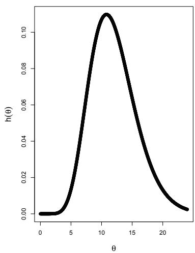

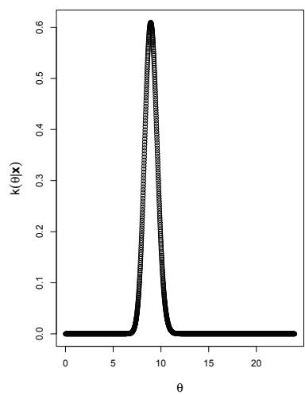  
Figure 11.1.1: Prior (left panel) and posterior (right panel) pdfs of Example 11.1.6

Thus $P[\Theta > 10|y = 177] = 1 - 0.9368 = 0.0632$ ; consequently, our rule would accept $H_0$ .

The $95\%$ credible interval, (11.1.12), is (7.77, 10.31), which also contains 10; see Exercise 11.1.7 for details.

# 11.1.5 Bayesian Sequential Procedures

Finally, we should observe what a Bayesian would do if additional data were collected beyond $x_{1}, x_{2}, \ldots, x_{n}$ . In such a situation, the posterior distribution found with the observations $x_{1}, x_{2}, \ldots, x_{n}$ becomes the new prior distribution, additional observations give a new posterior distribution, and inferences would be made from that second posterior. Of course, this can continue with even more observations. That is, the second posterior becomes the new prior, and the next set of observations yields the next posterior from which the inferences can be made. Clearly, this gives Bayesians an excellent way of handling sequential analysis. They can continue taking data, always updating the previous posterior, which has become a new prior distribution. Everything a Bayesian needs for inferences is in that final posterior distribution obtained by this sequential procedure.

# EXERCISES

11.1.1. Let $Y$ have a binomial distribution in which $n = 20$ and $p = \theta$ . The prior probabilities on $\theta$ are $P(\theta = 0.3) = 2/3$ and $P(\theta = 0.5) = 1/3$ . If $y = 9$ , what are the posterior probabilities for $\theta = 0.3$ and $\theta = 0.5$ ?

11.1.2. Let $X_{1}, X_{2}, \ldots, X_{n}$ be a random sample from a distribution that is $b(1, \theta)$ . Let the prior of $\Theta$ be a beta one with parameters $\alpha$ and $\beta$ . Show that the posterior pdf $k(\theta | x_{1}, x_{2}, \ldots, x_{n})$ is exactly the same as $k(\theta | y)$ given in Example 11.1.2.

11.1.3. Let $X_{1}, X_{2}, \ldots, X_{n}$ denote a random sample from a distribution that is $N(\theta, \sigma^2)$ , where $-\infty < \theta < \infty$ and $\sigma^2$ is a given positive number. Let $Y = \overline{X}$ denote the mean of the random sample. Take the loss function to be $\mathcal{L}[\theta, \delta(y)] = |\theta - \delta(y)|$ . If $\theta$ is an observed value of the random variable $\Theta$ that is $N(\mu, \tau^2)$ , where $\tau^2 > 0$ and $\mu$ are known numbers, find the Bayes solution $\delta(y)$ for a point estimate $\theta$ .

11.1.4. Let $X_{1}, X_{2}, \ldots, X_{n}$ denote a random sample from a Poisson distribution with mean $\theta$ , $0 < \theta < \infty$ . Let $Y = \sum_{1}^{n} X_{i}$ . Use the loss function $\mathcal{L}[\theta, \delta(y)] = [\theta - \delta(y)]^2$ . Let $\theta$ be an observed value of the random variable $\Theta$ . If $\Theta$ has the prior pdf $h(\theta) = \theta^{\alpha - 1} e^{-\theta / \beta} / \Gamma(\alpha) \beta^{\alpha}$ , for $0 < \theta < \infty$ , zero elsewhere, where $\alpha > 0$ , $\beta > 0$ are known numbers, find the Bayes solution $\delta(y)$ for a point estimate for $\theta$ .

11.1.5. Let $Y_{n}$ be the $n$ th order statistic of a random sample of size $n$ from a distribution with pdf $f(x|\theta) = 1 / \theta$ , $0 < x < \theta$ , zero elsewhere. Take the loss function to be $\mathcal{L}[\theta, \delta(y)] = [\theta - \delta(y_n)]^2$ . Let $\theta$ be an observed value of the random variable $\Theta$ , which has the prior pdf $h(\theta) = \beta \alpha^\beta / \theta^{\beta + 1}$ , $\alpha < \theta < \infty$ , zero elsewhere, with $\alpha > 0$ , $\beta > 0$ . Find the Bayes solution $\delta(y_n)$ for a point estimate of $\theta$ .

11.1.6. Let $Y_{1}$ and $Y_{2}$ be statistics that have a trinomial distribution with parameters $n$ , $\theta_{1}$ , and $\theta_{2}$ . Here $\theta_{1}$ and $\theta_{2}$ are observed values of the random variables $\Theta_{1}$ and $\Theta_{2}$ , which have a Dirichlet distribution with known parameters $\alpha_{1}$ , $\alpha_{2}$ , and $\alpha_{3}$ ; see expression (3.3.10). Show that the conditional distribution of $\Theta_{1}$ and $\Theta_{2}$ is Dirichlet and determine the conditional means $E(\Theta_{1}|y_{1},y_{2})$ and $E(\Theta_{2}|y_{1},y_{2})$ .

11.1.7. For Example 11.1.6, obtain the $95\%$ credible interval for $\theta$ . Next obtain the value of the mle for $\theta$ and the $95\%$ confidence interval for $\theta$ discussed in Chapter 6.

11.1.8. In Example 11.1.2, let $n = 30$ , $\alpha = 10$ , and $\beta = 5$ , so that $\delta(y) = (10 + y) / 45$ is the Bayes estimate of $\theta$ .

(a) If $Y$ has a binomial distribution $b(30,\theta)$ , compute the risk $E\{[\theta - \delta(Y)]^2\}$ .   
(b) Find values of $\theta$ for which the risk of part (a) is less than $\theta (1 - \theta) / 30$ , the risk associated with the maximum likelihood estimator $Y / n$ of $\theta$ .

11.1.9. Let $Y_{4}$ be the largest order statistic of a sample of size $n = 4$ from a distribution with uniform pdf $f(x; \theta) = 1 / \theta$ , $0 < x < \theta$ , zero elsewhere. If the prior pdf of the parameter $g(\theta) = 2 / \theta^3$ , $1 < \theta < \infty$ , zero elsewhere, find the Bayesian estimator $\delta(Y_{4})$ of $\theta$ , based upon the sufficient statistic $Y_{4}$ , using the loss function $|\delta(y_{4}) - \theta|$ .

11.1.10. Refer to Example 11.2.3; suppose we select $\sigma_0^2 = d\sigma^2$ , where $\sigma^2$ was known in that example. What value do we assign to $d$ so that the variance of posterior is two-thirds the variance of $Y = \overline{X}$ , namely, $\sigma^2 / n$ ?

# 11.2 More Bayesian Terminology and Ideas

Suppose $\mathbf{X}' = (X_1, X_2, \ldots, X_n)$ represents a random sample with likelihood $L(\mathbf{x}|\theta)$ and we assume a prior pdf $h(\theta)$ . The joint marginal pdf of $\mathbf{X}$ is given by

$$
g _ {1} (\mathbf {x}) = \int_ {- \infty} ^ {\infty} L (\mathbf {x} | \theta) h (\theta) d \theta .
$$

This is often called the pdf of the predictive distribution of $\mathbf{X}$ because it provides the best description of the probabilities about $\mathbf{X}$ given the likelihood and the prior. An illustration of this is provided in expression (11.1.6) of Example 11.1.1. Again note that this predictive distribution is highly dependent on the probability models for $X$ and $\Theta$ .

In this section, we consider two classes of prior distributions. The first class is the class of conjugate priors defined by:

Definition 11.2.1. A class of prior pdfs for the family of distributions with pdfs $f(x|\theta)$ , $\theta \in \Omega$ , is said to define a conjugate family of distributions if the posterior pdf of the parameter is in the same family of distributions as the prior.

As an illustration, consider Example 11.1.5, where the pmf of $X_{i}$ given $\theta$ was Poisson with mean $\theta$ . In this example, we selected a gamma prior and the resulting posterior distribution was of the gamma family also. Hence the gamma pdf forms a conjugate class of priors for this Poisson model. This was true also for Example 11.1.2 where the conjugate family was beta and the model was a binomial, and for Example 11.1.3, where both the model and the prior were normal.

To motivate our second class of priors, consider the binomial model, $b(1,\theta)$ , presented in Example 11.1.2. Thomas Bayes (1763) took as a prior the beta distribution with $\alpha = \beta = 1$ , namely $h(\theta) = 1,0 < \theta < 1$ , zero elsewhere, because he argued that he did not have much prior knowledge about $\theta$ . However, we note that this leads to the estimate of

$$
\left(\frac {n}{n + 2}\right) \left(\frac {y}{n}\right) + \left(\frac {2}{n + 2}\right) \left(\frac {1}{2}\right).
$$

We often call this a shrinkage estimate because the estimate $y / n$ is pulled a little toward the prior mean of $1 / 2$ , although Bayes tried to avoid having the prior influence the inference.

Haldane (1948) did note, however, that if a prior beta pdf exists with $\alpha = \beta = 0$ , then the shrinkage estimate would reduce to the mle $y / n$ . Of course, a beta pdf with $\alpha = \beta = 0$ is not a pdf at all, for it would be such that

$$
h (\theta) \propto \frac {1}{\theta (1 - \theta)}, 0 <   \theta <   1,
$$

zero elsewhere, and

$$
\int_ {0} ^ {1} \frac {c}{\theta (1 - \theta)} d \theta
$$

does not exist. However, such priors are used if, when combined with the likelihood, we obtain a posterior pdf which is a proper pdf. By proper, we mean that it integrates to a positive constant. In this example, we obtain the posterior pdf of

$$
f (\theta | y) \propto \theta^ {y - 1} (1 - \theta) ^ {n - y - 1},
$$

which is proper provided $y > 0$ and $n - y > 0$ . Of course, the posterior mean is $y / n$ .

Definition 11.2.2. Let $\mathbf{X}' = (X_1, X_2, \ldots, X_n)$ be a random sample from the distribution with pdf $f(x|\theta)$ . A prior $h(\theta) \geq 0$ for this family is said to be improper if it is not a pdf, but the function $k(\theta|\mathbf{x}) \propto L(\mathbf{x}|\theta)h(\theta)$ can be made proper.

A noninformative prior is a prior that treats all values of $\theta$ the same, that is, uniformly. Continuous noninformative priors are often improper. As an example, suppose we have a normal distribution $N(\theta_1,\theta_2)$ in which both $\theta_{1}$ and $\theta_{2} > 0$ are unknown. A noninformative prior for $\theta_{1}$ is $h_1(\theta_1) = 1$ , $-\infty < \theta_{1} < \infty$ . Clearly, this is not a pdf. An improper prior for $\theta_{2}$ is $h_2(\theta_2) = c_2 / \theta_2$ , $0 < \theta_{2} < \infty$ , zero elsewhere. Note that $\log \theta_{2}$ is uniformly distributed between $-\infty < \log \theta_{2} < \infty$ . Hence, in this way, it is a noninformative prior. In addition, assume the parameters are independent. Then the joint prior, which is improper, is

$$
h _ {1} \left(\theta_ {1}\right) h _ {2} \left(\theta_ {2}\right) \propto 1 / \theta_ {2}, - \infty <   \theta_ {1} <   \infty , 0 <   \theta_ {2} <   \infty . \tag {11.2.1}
$$

Using this prior, we present the Bayes solution for $\theta_{1}$ in the next example.

Example 11.2.1. Let $X_{1}, X_{2}, \ldots, X_{n}$ be a random sample from a $N(\theta_{1}, \theta_{2})$ distribution. Recall that $\overline{X}$ and $S^{2} = (n - 1)^{-1} \sum_{i=1}^{n} (X_{i} - \overline{X})^{2}$ are sufficient statistics. Suppose we use the improper prior given by (11.2.1). Then the posterior distribution is given by

$$
\begin{array}{l} k _ {1 2} \left(\theta_ {1}, \theta_ {2} | \bar {x}, s ^ {2}\right) \propto \left(\frac {1}{\theta_ {2}}\right) \left(\frac {1}{\sqrt {2 \pi \theta_ {2}}}\right) ^ {n} \exp \left[ - \frac {1}{2} \left\{\left(n - 1\right) s ^ {2} + n \left(\bar {x} - \theta_ {1}\right) ^ {2} \right\} / \theta_ {2} \right] \\ \propto \left(\frac {1}{\theta_ {2}}\right) ^ {\frac {n}{2} + 1} \exp \left[ - \frac {1}{2} \left\{\left(n - 1\right) s ^ {2} + n \left(\bar {x} - \theta_ {1}\right) ^ {2} \right\} / \theta_ {2} \right]. \\ \end{array}
$$

To get the conditional pdf of $\theta_{1}$ , given $\overline{x}$ and $s^2$ , we integrate out $\theta_{2}$

$$
k _ {1} \left(\theta_ {1} | \bar {x}, s ^ {2}\right) = \int_ {0} ^ {\infty} k _ {1 2} \left(\theta_ {1}, \theta_ {2} | \bar {x}, s ^ {2}\right) d \theta_ {2}.
$$

To carry this out, let us change variables $z = 1 / \theta_{2}$ and $\theta_{2} = 1 / z$ , with Jacobian $-1 / z^{2}$ . Thus

$$
k _ {1} (\theta_ {1} | \overline {{x}}, s ^ {2}) \propto \int_ {0} ^ {\infty} \frac {z ^ {\frac {n}{2} + 1}}{z ^ {2}} \exp \left[ - \left\{\frac {(n - 1) s ^ {2} + n (\overline {{x}} - \theta_ {1}) ^ {2}}{2} \right\} z \right] d z.
$$

Referring to a gamma distribution with $\alpha = n / 2$ and $\beta = 2 / \{(n - 1)s^2 +n(\overline{x} -\theta_1)^2\}$ , this result is proportional to

$$
k _ {1} (\theta_ {1} | \overline {{x}}, s ^ {2}) \propto \{(n - 1) s ^ {2} + n (\overline {{x}} - \theta_ {1}) ^ {2} \} ^ {- n / 2}.
$$

Let us change variables to get more familiar results; namely, let

$$
t = \frac {\theta_ {1} - \overline {{x}}}{s / \sqrt {n}} \mathrm {a n d} \theta_ {1} = \overline {{x}} + t s / \sqrt {n},
$$

with Jacobian $s / \sqrt{n}$ . This conditional pdf of $t$ , given $\overline{x}$ and $s^2$ , is then

$$
\begin{array}{l} k (t | \bar {x}, s ^ {2}) \propto \{(n - 1) s ^ {2} + (s t) ^ {2} \} ^ {- n / 2} \\ \propto \frac {1}{[ 1 + t ^ {2} / (n - 1) ] ^ {[ (n - 1) + 1 ] / 2}}. \\ \end{array}
$$

That is, the conditional pdf of $t = (\theta_1 - \overline{x}) / (s / n)$ , given $\overline{x}$ and $s^2$ , is a Student $t$ with $n - 1$ degrees of freedom. Since the mean of this pdf is 0 (assuming that $n > 2$ ), it follows that the Bayes estimator of $\theta_1$ , under squared-error loss, is $\overline{X}$ , which is also the mle.

Of course, from $k_{1}(\theta_{1}|\overline{x}, s^{2})$ or $k(t|\overline{x}, s^{2})$ , we can find a credible interval for $\theta_{1}$ . One way of doing this is to select the highest density region (HDR) of the pdf $\theta_{1}$ or that of $t$ . The former is symmetric and unimodal about $\theta_{1}$ and the latter about zero, but the latter's critical values are tabulated; so we use the HDR of that $t$ -distribution. Thus, if we want an interval having probability $1 - \alpha$ , we take

$$
- t _ {\alpha / 2} <   \frac {\theta_ {1} - \overline {{x}}}{s / \sqrt {n}} <   t _ {\alpha / 2}
$$

or, equivalently,

$$
\overline {{x}} - t _ {\alpha / 2} s \big / \sqrt {n} <   \theta_ {1} <   \overline {{x}} + t _ {\alpha / 2} s \big / \sqrt {n}.
$$

This interval is the same as the confidence interval for $\theta_{1}$ ; see Example 4.2.1. Hence, in this case, the improper prior (11.2.1) leads to the same inference as the traditional analysis.

Example 11.2.2. Usually in a Bayesian analysis, noninformative priors are not used if prior information exists. Let us consider the same situation as in Example 11.2.1, where the model was a $N(\theta_1,\theta_2)$ distribution. Suppose now we consider the precision $\theta_{3} = 1 / \theta_{2}$ instead of variance $\theta_{2}$ . The likelihood becomes

$$
\left(\frac {\theta_ {3}}{2 \pi}\right) ^ {n / 2} \exp \left[ - \frac {1}{2} \left\{(n - 1) s ^ {2} + n (\overline {{x}} - \theta_ {1}) ^ {2} \right\} \theta_ {3} \right],
$$

so that it is clear that a conjugate prior for $\theta_{3}$ is $\Gamma (\alpha ,\beta)$ . Further, given $\theta_{3}$ , a reasonable prior on $\theta_{1}$ is $N(\theta_0,\frac{1}{n_0\theta_3})$ , where $n_0$ is selected in some way to reflect how many observations the prior is worth. Thus the joint prior of $\theta_{1}$ and $\theta_{3}$ is

$$
h (\theta_ {1}, \theta_ {3}) \propto \theta_ {3} ^ {\alpha - 1} e ^ {- \theta_ {3} / \beta} (n _ {0} \theta_ {3}) ^ {1 / 2} e ^ {- (\theta_ {1} - \theta_ {0}) ^ {2} \theta_ {3} n _ {0} / 2}.
$$

If this is multiplied by the likelihood function, we obtain the posterior joint pdf of $\theta_{1}$ and $\theta_{3}$ , namely,

$$
k (\theta_ {1}, \theta_ {3} | \overline {{x}}, s ^ {2}) \propto \theta_ {3} ^ {\alpha + \frac {n}{2} + \frac {1}{2} - 1} \exp \left[ - \frac {1}{2} Q (\theta_ {1}) \theta_ {3} \right],
$$

where

$$
\begin{array}{l} Q (\theta_ {1}) = \frac {2}{\beta} + n _ {0} (\theta_ {1} - \theta_ {0}) ^ {2} + [ (n - 1) s ^ {2} + n (\overline {{x}} - \theta_ {1}) ^ {2} ] \\ = (n _ {0} + n) \left[ \left(\theta_ {1} - \frac {n _ {0} \theta_ {0} + n \overline {{x}}}{n _ {0} + n}\right) ^ {2} \right] + D, \\ \end{array}
$$

with

$$
D = \frac {2}{\beta} + (n - 1) s ^ {2} + (n _ {0} ^ {- 1} + n ^ {- 1}) ^ {- 1} (\theta_ {0} - \overline {{x}}) ^ {2}.
$$

If we integrate out $\theta_{3}$ , we obtain

$$
\begin{array}{l} k _ {1} (\theta_ {1} | \overline {{x}}, s ^ {2}) \propto \int_ {0} ^ {\infty} k (\theta_ {1}, \theta_ {3} | \overline {{x}}, s ^ {2}) d \theta_ {3} \\ \propto \frac {1}{[ Q (\theta_ {1}) ] ^ {[ 2 \alpha + n + 1 ] / 2}}. \\ \end{array}
$$

To get this in a more familiar form, change variables by letting

$$
t = \frac {\theta_ {1} - \frac {n _ {0} \theta_ {0} + n \overline {{x}}}{n _ {0} + n}}{\sqrt {D / [ (n _ {0} + n) (2 \alpha + n) ]}},
$$

with Jacobian $\sqrt{D / [(n_0 + n)(2\alpha + n)]}$ . Thus

$$
k _ {2} (t | \overline {{x}}, s ^ {2}) \propto \frac {1}{\left[ 1 + \frac {t ^ {2}}{2 \alpha + n} \right] ^ {(2 \alpha + n + 1) / 2}},
$$

which is a Student $t$ distribution with $2\alpha + n$ degrees of freedom. The Bayes estimate (under squared-error loss) in this case is

$$
\frac {n _ {0} \theta_ {0} + n \overline {{x}}}{n _ {0} + n}.
$$

It is interesting to note that if we define "new" sample characteristics as

$$
n _ {k} = n _ {0} + n
$$

$$
\overline {{x}} _ {k} = \frac {n _ {0} \theta_ {0} + n \overline {{x}}}{n _ {0} + n}
$$

$$
s _ {k} ^ {2} = \frac {D}{2 \alpha + n},
$$

then

$$
t = \frac {\theta_ {1} - \overline {{x}} _ {k}}{s _ {k} / \sqrt {n _ {k}}}
$$

has a $t$ -distribution with $2\alpha + n$ degrees of freedom. Of course, using these degrees of freedom, we can find $t_{\gamma/2}$ so that

$$
\overline {{x}} _ {k} \pm t _ {\gamma / 2} \frac {s _ {k}}{\sqrt {n _ {k}}}
$$

is an HDR credible interval estimate for $\theta_{1}$ with probability $1 - \gamma$ . Naturally, it falls upon the Bayesian to assign appropriate values to $\alpha, \beta, n_{0}$ , and $\theta_{0}$ . Small values of $\alpha$ and $n_{0}$ with a large value of $\beta$ would create a prior, so that this interval estimate would differ very little from the usual one.

Finally, it should be noted that when dealing with symmetric, unimodal posterior distributions, it was extremely easy to find the HDR interval estimate. If, however, that posterior distribution is not symmetric, it is more difficult and often the Bayesian would find the interval that has equal probabilities on each tail.

# EXERCISES

11.2.1. Let $X_{1}, X_{2}$ be a random sample from a Cauchy distribution with pdf

$$
f (x; \theta_ {1}, \theta_ {2}) = \left(\frac {1}{\pi}\right) \frac {\theta_ {2}}{\theta_ {2} ^ {2} + (x - \theta_ {1}) ^ {2}}, - \infty <   x <   \infty ,
$$

where $-\infty <  \theta_{1} <   \infty$ $0 <   \theta_{2}$ . Use the noninformative prior $h(\theta_1,\theta_2)\propto 1$

(a) Find the posterior pdf of $\theta_{1},\theta_{2}$ , other than the constant of proportionality.   
(b) Evaluate this posterior pdf if $x_{1} = 1, x_{2} = 4$ for $\theta_{1} = 1, 2, 3, 4$ and $\theta_{2} = 0.5, 1.0, 1.5, 2.0$ .   
(c) From the 16 values in part (b), where does the maximum of the posterior pdf seem to be?   
(d) Do you know a computer program that can find the point $(\theta_{1},\theta_{2})$ of maximum?

11.2.2. Let $X_{1}, X_{2}, \ldots, X_{10}$ be a random sample of size $n = 10$ from a gamma distribution with $\alpha = 3$ and $\beta = 1 / \theta$ . Suppose we believe that $\theta$ has a gamma distribution with $\alpha = 10$ and $\beta = 2$ .

(a) Find the posterior distribution of $\theta$   
(b) If the observed $\overline{x} = 18.2$ , what is the Bayes point estimate associated with square-error loss function?   
(c) What is the Bayes point estimate using the mode of the posterior distribution?   
(d) Comment on an HDR interval estimate for $\theta$ . Would it be easier to find one having equal tail probabilities?

Hint: Can the posterior distribution be related to a chi-square distribution?

11.2.3. Suppose for the situation of Example 11.2.2, $\theta_{1}$ has the prior distribution $N(75,1 / (5\theta_3))$ and $\theta_{3}$ has the prior distribution $\Gamma (\alpha = 4,\beta = 0.5)$ . Suppose the observed sample of size $n = 50$ resulted in $\overline{x} = 77.02$ and $s^2 = 8.2$ .

(a) Find the Bayes point estimate of the mean $\theta_{1}$ .   
(b) Determine an HDR interval estimate with $1 - \gamma = 0.90$

11.2.4. Let $f(x|\theta)$ , $\theta \in \Omega$ , be a pdf with Fisher information, (6.2.4), $I(\theta)$ . Consider the Bayes model

$$
\begin{array}{l} X | \theta \sim f (x | \theta), \theta \in \Omega \\ \Theta \sim h (\theta) \propto \sqrt {I (\theta)}. \tag {11.2.2} \\ \end{array}
$$

(a) Suppose we are interested in a parameter $\tau = u(\theta)$ . Use the chain rule to prove that

$$
\sqrt {I (\tau)} = \sqrt {I (\theta)} \left| \frac {\partial \theta}{\partial \tau} \right|. \tag {11.2.3}
$$

(b) Show that for the Bayes model (11.2.2), the prior pdf for $\tau$ is proportional to $\sqrt{I(\tau)}$ .

The class of priors given by expression (11.2.2) is often called the class of Jeffreys' priors; see Jeffreys (1961). This exercise shows that Jeffreys' priors exhibit an invariance in that the prior of a parameter $\tau$ , which is a function of $\theta$ , is also proportional to the square root of the information for $\tau$ .

11.2.5. Consider the Bayes model

$$
\begin{array}{l} X _ {i} | \theta , i = 1, 2, \dots , n \sim \text {i i d w i t h d i s t r i b u t i o n} \Gamma (1, \theta), \theta > 0 \\ \Theta \sim h (\theta) \propto \frac {1}{\theta}. \\ \end{array}
$$

(a) Show that $h(\theta)$ is in the class of Jeffreys' priors.

(b) Show that the posterior pdf is

$$
h (\theta | y) \propto \left(\frac {1}{\theta}\right) ^ {n + 2 - 1} e ^ {- y / \theta},
$$

where $y = \sum_{i=1}^{n} x_i$ .

(c) Show that if $\tau = \theta^{-1}$ , then the posterior $k(\tau | y)$ is the pdf of a $\Gamma(n, 1 / y)$ distribution.   
(d) Determine the posterior pdf of $2y\tau$ . Use it to obtain a $(1 - \alpha)100\%$ credible interval for $\theta$ .   
(e) Use the posterior pdf in part (d) to determine a Bayesian test for the hypotheses $H_0: \theta \geq \theta_0$ versus $H_1: \theta < \theta_0$ , where $\theta_0$ is specified.

11.2.6. Consider the Bayes model

$$
\begin{array}{l} X _ {i} | \theta , i = 1, 2, \dots , n \sim \text {i d w i t h d i s t r i b u t i o n P o i s s o n} (\theta), \theta > 0 \\ \begin{array}{c c c} \Theta & \sim & h (\theta) \propto \theta^ {- 1 / 2}. \end{array} \\ \end{array}
$$

(a) Show that $h(\theta)$ is in the class of Jeffreys' priors.   
(b) Show that the posterior pdf of $2n\theta$ is the pdf of a $\chi^2 (2y + 1)$ distribution, where $y = \sum_{i = 1}^{n}x_{i}$   
(c) Use the posterior pdf of part (b) to obtain a $(1 - \alpha)100\%$ credible interval for $\theta$ .   
(d) Use the posterior pdf in part (d) to determine a Bayesian test for the hypotheses $H_0: \theta \geq \theta_0$ versus $H_1: \theta < \theta_0$ , where $\theta_0$ is specified.

11.2.7. Consider the Bayes model

$$
X _ {i} | \theta , i = 1, 2, \dots , n \sim \mathrm {i i d} \text {w i t h d i s t r i b u t i o n} b (1, \theta), 0 <   \theta <   1.
$$

(a) Obtain the Jeffreys' prior for this model.   
(b) Assume squared-error loss and obtain the Bayes estimate of $\theta$

11.2.8. Consider the Bayes model

$$
\begin{array}{l} X _ {i} | \theta , i = 1, 2, \dots , n \sim \text {i i d w i t h d i s t r i b u t i o n} b (1, \theta), 0 <   \theta <   1 \\ \begin{array}{r c l} \Theta & \sim & h (\theta) = 1. \end{array} \\ \end{array}
$$

(a) Obtain the posterior pdf.   
(b) Assume squared-error loss and obtain the Bayes estimate of $\theta$

11.2.9. Let $\mathbf{X}_1, \mathbf{X}_2, \ldots, \mathbf{X}_n$ be a random sample from a multivariate normal normal distribution with mean vector $\boldsymbol{\mu} = (\mu_1, \mu_2, \ldots, \mu_k)'$ and known positive definite covariance matrix $\boldsymbol{\Sigma}$ . Let $\overline{\mathbf{X}}$ be the mean vector of the random sample. Suppose that $\boldsymbol{\mu}$ has a prior multivariate normal distribution with mean $\boldsymbol{\mu}_0$ and positive definite covariance matrix $\boldsymbol{\Sigma}_0$ . Find the posterior distribution of $\boldsymbol{\mu}$ , given $\overline{\mathbf{X}} = \overline{\mathbf{x}}$ . Then find the Bayes estimate $E(\boldsymbol{\mu} | \overline{\mathbf{X}} = \overline{\mathbf{x}})$ .

# 11.3 Gibbs Sampler

From the preceding sections, it is clear that integration techniques play a significant role in Bayesian inference. Hence, we now touch on some of the Monte Carlo techniques used for integration in Bayesian inference.

The Monte Carlo techniques discussed in Chapter 5 can often be used to obtain Bayesian estimates. For example, suppose a random sample is drawn from a

$N(\theta, \sigma^2)$ , where $\sigma^2$ is known. Then $Y = \overline{X}$ is a sufficient statistic. Consider the Bayes model

$$
\begin{array}{l} Y | \theta \sim N (\theta , \sigma^ {2} / n) \\ \Theta \sim h (\theta) \propto b ^ {- 1} \exp \{- (\theta - a) / b \} / (1 + \exp \{- [ (\theta - a) / b ] \}) ^ {2}, - \infty <   \theta <   \infty , \\ a \text {a n d} b > 0 \text {a r e k n o w n}, \tag {11.3.1} \\ \end{array}
$$

i.e., the prior is a logistic distribution. Thus the posterior pdf is

$$
k (\theta | y) = \frac {\frac {1}{\sqrt {2 \pi \sigma / \sqrt {n}}} \exp \left\{- \frac {1}{2} \frac {(y - \theta) ^ {2}}{\sigma^ {2} / n} \right\} b ^ {- 1} e ^ {- (\theta - a) / b} / (1 + e ^ {- [ (\theta - a) / b ]}) ^ {2}}{\int_ {- \infty} ^ {\infty} \frac {1}{\sqrt {2 \pi \sigma / \sqrt {n}}} \exp \left\{- \frac {1}{2} \frac {(y - \theta) ^ {2}}{\sigma^ {2} / n} \right\} b ^ {- 1} e ^ {- (\theta - a) / b} / (1 + e ^ {- [ (\theta - a) / b ]}) ^ {2} d \theta}.
$$

Assuming squared-error loss, the Bayes estimate is the mean of this posterior distribution. Its computation involves two integrals, which cannot be obtained in closed form. We can, however, think of the integration in the following way. Consider the likelihood $f(y|\theta)$ as a function of $\theta$ ; that is, consider the function

$$
w (\theta) = f (y | \theta) = \frac {1}{\sqrt {2 \pi} \sigma / \sqrt {n}} \exp \left\{- \frac {1}{2} \frac {(y - \theta) ^ {2}}{\sigma^ {2} / n} \right\}.
$$

We can then write the Bayes estimate as

$$
\begin{array}{l} \delta (y) = \frac {\int_ {- \infty} ^ {\infty} \theta w (\theta) b ^ {- 1} e ^ {- (\theta - a) / b} / (1 + e ^ {- [ (\theta - a) / b ]}) ^ {2} d \theta}{\int_ {- \infty} ^ {\infty} w (\theta) b ^ {- 1} e ^ {- (\theta - a) / b} / (1 + e ^ {- [ (\theta - a) / b ]}) ^ {2} d \theta} \\ = \frac {E [ \Theta w (\Theta) ]}{E [ w (\Theta) ]}, \tag {11.3.2} \\ \end{array}
$$

where the expectation is taken with $\Theta$ having the logistic prior distribution.

The estimation can be carried out by simple Monte Carlo. Independently, generate $\Theta_1, \Theta_2, \ldots, \Theta_m$ from the logistic distribution with pdf as in (11.3.1). This generation is easily computed because the inverse of the logistic cdf is given by $a + b\log \{u / (1 - u)\}$ , for $0 < u < 1$ . Then form the random variable,

$$
T _ {m} = \frac {m ^ {- 1} \sum_ {i = 1} ^ {m} \Theta_ {i} w \left(\Theta_ {i}\right)}{m ^ {- 1} \sum_ {i = 1} ^ {m} w \left(\Theta_ {i}\right)}. \tag {11.3.3}
$$

By the Weak Law of Large Numbers (Theorem 5.1.1) and Slutsky's Theorem (Theorem 5.2.4), $T_{m} \to \delta(y)$ , in probability. The value of $m$ can be quite large. Thus simple Monte Carlo techniques enable us to compute this Bayes estimate. Note that we can bootstrap this sample to obtain a confidence interval for $E[\Theta w(\Theta)] / E[w(\Theta)]$ ; see Exercise 11.3.2.

Besides simple Monte Carlo methods, there are other more complicated Monte Carlo procedures that are useful in Bayesian inference. For motivation, consider the case in which we want to generate an observation that has pdf $f_{X}(x)$ , but this generation is somewhat difficult. Suppose, however, that it is easy to generate both $Y$ , with pdf $f_{Y}(y)$ , and an observation from the conditional pdf $f_{X|Y}(x|y)$ . As the following theorem shows, if we do these sequentially, then we can easily generate from $f_{X}(x)$ .

Theorem 11.3.1. Suppose we generate random variables by the following algorithm:

1. Generate $Y\sim f_{Y}(y)$   
2. Generate $X\sim f_{X|Y}(x|Y)$

Then $X$ has pdf $f_{X}(x)$

Proof: To avoid confusion, let $T$ be the random variable generated by the algorithm. We need to show that $T$ has pdf $f_{X}(x)$ . Probabilities of events concerning $T$ are conditional on $Y$ and are taken with respect to the cdf $F_{X|Y}$ . Recall that probabilities can always be written as expectations of indicator functions and, hence, for events concerning $T$ , are conditional expectations. In particular, for any $t \in R$ ,

$$
\begin{array}{l} P [ T \leq t ] = E [ F _ {X | Y} (t) ] \\ = \int_ {- \infty} ^ {\infty} \left[ \int_ {- \infty} ^ {t} f _ {X | Y} (x | y) d x \right] f _ {Y} (y) d y \\ = \int_ {- \infty} ^ {t} \left[ \int_ {- \infty} ^ {\infty} f _ {X | Y} (x | y) f _ {Y} (y) d y \right] d x \\ = \int_ {- \infty} ^ {t} \left[ \int_ {- \infty} ^ {\infty} f _ {X, Y} (x, y) d y \right] d x \\ = \int_ {- \infty} ^ {t} f _ {X} (x) d x. \\ \end{array}
$$

Hence the random variable generated by the algorithm has pdf $f_{X}(x)$ , as was to be shown.

In the situation of this theorem, suppose we want to determine $E[W(X)]$ , for some function $W(x)$ , where $E[W^2 (X)] < \infty$ . Using the algorithm of the theorem, generate independently the sequence $(Y_{1},X_{1}),(Y_{2},X_{2}),\ldots ,(Y_{m},X_{m})$ , for a specified value of $m$ , where $Y_{i}$ is drawn from the pdf $f_{Y}(y)$ and $X_{i}$ is generated from the pdf $f_{X|Y}(x|Y)$ . Then by the Weak Law of Large Numbers,

$$
\overline {{W}} = \frac {1}{m} \sum_ {i = 1} ^ {m} W (X _ {i}) \stackrel {P} {\rightarrow} \int_ {- \infty} ^ {\infty} W (x) f _ {X} (x) d x = E [ W (X) ].
$$

Furthermore, by the Central Limit Theorem, $\sqrt{m} (\overline{W} -E[W(X)])$ converges in distribution to a $N(0,\sigma_W^2)$ distribution, where $\sigma_W^2 = \mathrm{Var}(W(X))$ . If $w_{1},w_{2},\ldots ,w_{m}$ is a realization of such a random sample, then an approximate $(1 - \alpha)100\%$ (large sample) confidence interval for $E[W(X)]$ is

$$
\overline {{w}} \pm z _ {\alpha / 2} \frac {s _ {W}}{\sqrt {m}}, \tag {11.3.4}
$$

where $s_W^2 = (m - 1)^{-1}\sum_{i = 1}^{m}(w_i - \overline{w})^2.$

To set ideas, we present the following simple example.

Example 11.3.1. Suppose the random variable $X$ has pdf

$$
f _ {X} (x) = \left\{ \begin{array}{l l} 2 e ^ {- x} \left(1 - e ^ {- x}\right) & 0 <   x <   \infty \\ 0 & \text {e l s e w h e r e .} \end{array} \right. \tag {11.3.5}
$$

Suppose $Y$ and $X|Y$ have the respective pdfs

$$
f _ {Y} (y) = \left\{ \begin{array}{l l} 2 e ^ {- 2 y} & 0 <   x <   \infty \\ 0 & \text {e l s e w h e r e} \end{array} \right. \tag {11.3.6}
$$

$$
f _ {X \mid Y} (x \mid y) = \left\{ \begin{array}{l l} e ^ {- (x - y)} & y <   x <   \infty \\ 0 & \text {e l s e w h e r e .} \end{array} \right. \tag {11.3.7}
$$

Suppose we generate random variables by the following algorithm:

1. Generate $Y \sim f_{Y}(y)$ as in expression (11.3.6).   
2. Generate $X \sim f_{X|Y}(x|Y)$ as in expression (11.3.7).

Then, by Theorem 11.3.1, $X$ has the pdf (11.3.5). Furthermore, it is easy to generate from the pdfs (11.3.6) and (11.3.7) because the inverses of the respective cdfs are given by $F_{Y}^{-1}(u) = -2^{-1}\log (1 - u)$ and $F_{X|Y}^{-1}(u) = -\log (1 - u) + Y$ .

As a numerical illustration, the R function condsim1 (found at the site listed in the Preface) uses this algorithm to generate observations from the pdf (11.3.5). Using this function, we performed $m = 10,000$ simulations of the algorithm. The sample mean and standard deviation were $\overline{x} = 1.495$ and $s = 1.112$ . Hence a $95\%$ confidence interval for $E(X)$ is (1.473, 1.517), which traps the true value $E(X) = 1.5$ ; see Exercise 11.3.4.

For the last example, Exercise 11.3.3 establishes the joint distribution of $(X,Y)$ and shows that the marginal pdf of $X$ is given by (11.3.5). Furthermore, as shown in this exercise, it is easy to generate from the distribution of $X$ directly. In Bayesian inference, though, we are often dealing with conditional pdfs, and theorems such as Theorem 11.3.1 are quite useful.

The main purpose of presenting this algorithm is to motivate another algorithm, called the Gibbs Sampler, which is useful in Bayes methodology. We describe it in terms of two random variables. Suppose $(X,Y)$ has pdf $f(x,y)$ . Our goal is to generate two streams of iid random variables, one on $X$ and the other on $Y$ . The Gibbs sampler algorithm is:

Algorithm 11.3.1 (Gibbs Sampler). Let $m$ be a positive integer, and let $X_0$ , an initial value, be given. Then for $i = 1,2,3,\ldots,m$ ,

1. Generate $Y_{i}|X_{i - 1}\sim f(y|x)$   
2. Generate $X_{i}|Y_{i}\sim f(x|y)$

Note that before entering the $i$ th step of the algorithm, we have generated $X_{i-1}$ . Let $x_{i-1}$ denote the observed value of $X_{i-1}$ . Then, using this value, generate sequentially the new $Y_i$ from the pdf $f(y|x_{i-1})$ and then draw (the new) $X_i$ from the

pdf $f(x|y_{i})$ , where $y_{i}$ is the observed value of $Y_{i}$ . In advanced texts, it is shown that

$$
Y _ {i} \stackrel {D} {\rightarrow} Y \sim f _ {Y} (y)
$$

$$
X _ {i} \quad \stackrel {{D}} {{\rightarrow}} \quad X \sim f _ {X} (x), \tag {11.3.8}
$$

as $i\to \infty$ , and

$$
\frac {1}{m} \sum_ {i = 1} ^ {m} W \left(X _ {i}\right) \xrightarrow {P} E [ W (X) ], \text {a s} m \rightarrow \infty . \tag {11.3.9}
$$

Note that the Gibbs sampler is similar but not quite the same as the algorithm given by Theorem 11.3.1. Consider the sequence of generated pairs

$$
\left(X _ {1}, Y _ {1}\right), \left(X _ {2}, Y _ {2}\right), \dots , \left(X _ {k}, Y _ {k}\right), \left(X _ {k + 1}, Y _ {k + 1}\right).
$$

Note that to compute $(X_{k + 1},Y_{k + 1})$ , we need only the pair $(X_k,Y_k)$ and none of the previous pairs from 1 to $k - 1$ . That is, given the present state of the sequence, the future of the sequence is independent of the past. In stochastic processes such a sequence is called a Markov chain. Under general conditions, the distribution of Markov chains stabilizes (reaches an equilibrium or steady-state distribution) as the length of the chain increases. For the Gibbs sampler, the equilibrium distributions are the limiting distributions in the expression (11.3.8) as $i\to \infty$ . How large should $i$ be? In practice, usually the chain is allowed to run to some large value $i$ before recording the observations. Furthermore, several recordings are run with this value of $i$ and the resulting empirical distributions of the generated random observations are examined for their similarity. Also, the starting value for $X_0$ is needed; see Casella and George (1992) for a discussion. The theory behind the convergences given in the expression (11.3.8) is beyond the scope of this text. There are many excellent references on this theory. A discussion from an elementary level can be found in Casella and George (1992). An informative overview can be found in Chapter 7 of Robert and Casella (1999); see also Lehmann and Casella (1998). We next provide a simple example.

Example 11.3.2. Suppose $(X,Y)$ has the mixed discrete-continuous pdf given by

$$
f (x, y) = \left\{ \begin{array}{l l} \frac {1}{\Gamma (\alpha)} \frac {1}{x !} y ^ {\alpha + x - 1} e ^ {- 2 y} & y > 0; x = 0, 1, 2, \dots \\ 0 & \text {e l s e w h e r e ,} \end{array} \right. \tag {11.3.10}
$$

for $\alpha > 0$ . Exercise 11.3.5 shows that this is a pdf and obtains the marginal pdfs. The conditional pdfs, however, are given by

$$
f (y | x) \propto y ^ {\alpha + x - 1} e ^ {- 2 y} \tag {11.3.11}
$$

and

$$
f (x | y) \propto e ^ {- y} \frac {y ^ {x}}{x !}. \tag {11.3.12}
$$

Hence the conditional densities are $\Gamma (\alpha +x,1 / 2)$ and Poisson $(y)$ , respectively. Thus the Gibbs sampler algorithm is, for $i = 1,2,\ldots ,m$

1. Generate $Y_{i}|X_{i - 1}\sim \Gamma (\alpha +X_{i - 1},1 / 2)$   
2. Generate $X_{i}|Y_{i}\sim \mathrm{Poisson}(Y_{i})$

In particular, for large $m$ and $n > m$ ,

$$
\bar {Y} = (n - m) ^ {- 1} \sum_ {i = m + 1} ^ {n} Y _ {i} \quad \stackrel {{P}} {\rightarrow} \quad E (Y) \tag {11.3.13}
$$

$$
\bar {X} = (n - m) ^ {- 1} \sum_ {i = m + 1} ^ {n} X _ {i} \quad \stackrel {{P}} {\rightarrow} \quad E (X). \tag {11.3.14}
$$

In this case, it can be shown (see Exercise 11.3.5) that both expectations are equal to $\alpha$ . The R function gibbser2.s, found at the site listed in the Preface, computes this Gibbs sampler. Using this routine, the authors obtained the following results upon setting $\alpha = 10$ , $m = 3000$ , and $n = 6000$ :

<table><tr><td>Parameter</td><td>Estimate</td><td>Sample Estimate</td><td>Sample Variance</td><td>Approximate 95% Confidence Interval</td></tr><tr><td>E(Y) = α = 10</td><td>y̅</td><td>10.027</td><td>10.775</td><td>(9.910, 10.145)</td></tr><tr><td>E(X) = α = 10</td><td>x̅</td><td>10.061</td><td>21.191</td><td>(9.896, 10.225)</td></tr></table>

where the estimates $\overline{y}$ and $\overline{x}$ are the observed values of the estimators in expressions (11.3.13) and (11.3.14), respectively. The confidence intervals for $\alpha$ are the large sample confidence intervals for means discussed in Example 4.2.2, using the sample variances found in the fourth column of the above table. Note that both confidence intervals trapped $\alpha = 10$ .

# EXERCISES

11.3.1. Suppose $Y$ has a $\Gamma(1,1)$ distribution while $X$ given $Y$ has the conditional pdf

$$
f (x | y) = \left\{ \begin{array}{l l} e ^ {- (x - y)} & 0 <   y <   x <   \infty \\ 0 & \text {e l s e w h e r e .} \end{array} \right.
$$

Note that both the pdf of $Y$ and the conditional pdf are easy to simulate.

(a) Set up the algorithm of Theorem 11.3.1 to generate a stream of iid observations with pdf $f_{X}(x)$ .   
(b) State how to estimate $E(X)$ .   
(c) Using your algorithm found in part (a), write an R function to estimate $E(X)$ .   
(d) Using your program, obtain a stream of 2000 simulations. Compute your estimate of $E(X)$ and find an approximate 95% confidence interval.   
(e) Show that $X$ has a $\Gamma(2,1)$ distribution. Did your confidence interval trap the true value 2?

11.3.2. Carefully write down the algorithm to obtain a bootstrap percentile confidence interval for $E[\Theta w(\Theta)] / E[w(\Theta)]$ , using the sample $\Theta_1, \Theta_2, \ldots, \Theta_m$ and the estimator given in expression (11.3.3). Write R code for this bootstrap.

11.3.3. Consider Example 11.3.1.

(a) Show that $E(X) = 1.5$ .   
(b) Obtain the inverse of the cdf of $X$ and use it to show how to generate $X$ directly.

11.3.4. Obtain another 10,000 simulations similar to those discussed at the end of Example 11.3.1. Use your simulations to obtain a confidence interval for $E(X)$ .

11.3.5. Consider Example 11.3.2.

(a) Show that the function given in expression (11.3.10) is a joint, mixed discrete-continuous pdf.   
(b) Show that the random variable $Y$ has a $\Gamma (\alpha ,1)$ distribution.   
(c) Show that the random variable $X$ has a negative binomial distribution with pmf

$$
p (x) = \left\{ \begin{array}{l l} \frac {(\alpha + x - 1) !}{x ! (\alpha - 1) !} 2 ^ {- (\alpha + x)} & x = 0, 1, 2, \ldots \\ 0 & \text {e l s e w h e r e .} \end{array} \right.
$$

(d) Show that $E(X) = \alpha$ .

11.3.6. Write an R function (or use gibbser2.s) for the Gibbs sampler discussed in Example 11.3.2. Run your function for $\alpha = 10$ , $m = 3000$ , and $n = 6000$ . Compare your results with those of the authors tabled in the example.

11.3.7. Consider the following mixed discrete-continuous pdf for a random vector $(X,Y)$ (discussed in Casella and George, 1992):

$$
f (x, y) \propto \left\{ \begin{array}{l l} {\binom {n} {x}} y ^ {x + \alpha - 1} (1 - y) ^ {n - x + \beta - 1} & x = 0, 1, \ldots , n, 0 <   y <   1 \\ 0 & \text {e l s e w h e r e}, \end{array} \right.
$$

for $\alpha > 0$ and $\beta > 0$ .

(a) Show that this function is indeed a joint, mixed discrete-continuous pdf by finding the proper constant of proportionality.   
(b) Determine the conditional pdfs $f(x|y)$ and $f(y|x)$ .   
(c) Write the Gibbs sampler algorithm to generate random samples on $X$ and $Y$ .   
(d) Determine the marginal distributions of $X$ and $Y$ .

11.3.8. Write an R function for the Gibbs sampler of Exercise 11.3.7. Run your program for $\alpha = 10$ , $\beta = 4$ , $m = 3000$ , and $n = 6000$ . Obtain estimates (and confidence intervals) of $E(X)$ and $E(Y)$ and compare them with the true parameters.

# 11.4 Modern Bayesian Methods

The prior pdf has an important influence in Bayesian inference. We need only consider the different Bayes estimators for the normal model based on different priors, as shown in Examples 11.1.3 and 11.2.1. One way of having more control over the prior is to model the prior in terms of another random variable. This is called the hierarchical Bayes model, and it is of the form

$$
\begin{array}{l} X | \theta \sim f (x | \theta) \\ \begin{array}{c c c} \Theta | \gamma & \sim & h (\theta | \gamma) \end{array} \\ \Gamma \sim \psi (\gamma). \tag {11.4.1} \\ \end{array}
$$

With this model we can exert control over the prior $h(\theta|\gamma)$ by modifying the pdf of the random variable $\Gamma$ . A second methodology, empirical Bayes, obtains an estimate of $\gamma$ and plugs it into the posterior pdf. We offer the reader a brief introduction of these procedures in this section. There are several good books on Bayesian methods. In particular, Chapter 4 of Lehmann and Casella (1998) discusses these procedures in some detail.

Consider first the hierarchical Bayes model given by (11.4.1). The parameter $\gamma$ can be thought of a nuisance parameter. It is often called a hyperparameter. As with regular Bayes, the inference focuses on the parameter $\theta$ ; hence, the posterior pdf of interest remains the conditional pdf $k(\theta|\mathbf{x})$ .

These discussions often involve several pdfs; hence, we frequently use $g$ as a generic pdf. It will always be clear from its arguments what distribution it represents. Keep in mind that the conditional pdf $f(\mathbf{x}|\theta)$ does not depend on $\gamma$ ; hence,

$$
\begin{array}{l} g (\theta , \gamma | \mathbf {x}) = \frac {g (\mathbf {x} , \theta , \gamma)}{g (\mathbf {x})} \\ = \frac {g (\mathbf {x} | \theta , \gamma) g (\theta , \gamma)}{g (\mathbf {x})} \\ = \frac {f (\mathbf {x} | \theta) h (\theta | \gamma) \psi (\gamma)}{g (\mathbf {x})}. \\ \end{array}
$$

Therefore, the posterior pdf is given by

$$
k (\theta | \mathbf {x}) = \frac {\int_ {- \infty} ^ {\infty} f (\mathbf {x} | \theta) h (\theta | \gamma) \psi (\gamma) d \gamma}{\int_ {- \infty} ^ {\infty} \int_ {- \infty} ^ {\infty} f (\mathbf {x} | \theta) h (\theta | \gamma) \psi (\gamma) d \gamma d \theta}. \tag {11.4.2}
$$

Furthermore, assuming squared-error loss, the Bayes estimate of $W(\theta)$ is

$$
\delta_ {W} (\mathbf {x}) = \frac {\int_ {- \infty} ^ {\infty} \int_ {- \infty} ^ {\infty} W (\theta) f (\mathbf {x} | \theta) h (\theta | \gamma) \psi (\gamma) d \gamma d \theta}{\int_ {- \infty} ^ {\infty} \int_ {- \infty} ^ {\infty} f (\mathbf {x} | \theta) h (\theta | \gamma) \psi (\gamma) d \gamma d \theta}. \tag {11.4.3}
$$

Recall that we defined the Gibbs sampler in Section 11.3. Here we describe it to obtain the Bayes estimate of $W(\theta)$ . For $i = 1,2,\ldots,m$ , where $m$ is specified, the

ith step of the algorithm is

$$
\Theta_ {i} | \mathbf {x}, \gamma_ {i - 1} \sim g (\theta | \mathbf {x}, \gamma_ {i - 1})
$$

$$
\Gamma_ {i} | \mathbf {x}, \theta_ {i} \sim g (\gamma | \mathbf {x}, \theta_ {i}).
$$

Recall from our discussion in Section 11.3 that

$$
\begin{array}{c c c} \Theta_ {i} & \stackrel {{D}} {{\to}} & k (\theta | \mathbf {x}) \end{array}
$$

$$
\Gamma_ {i} \stackrel {{D}} {{\longrightarrow}} g (\gamma | \mathbf {x}),
$$

as $i\to \infty$ . Furthermore, the arithmetic average

$$
\frac {1}{m} \sum_ {i = 1} ^ {m} W (\Theta_ {i}) \stackrel {P} {\rightarrow} E [ W (\Theta) | \mathbf {x} ] = \delta_ {W} (\mathbf {x}) \text {a s} m \rightarrow \infty . \tag {11.4.4}
$$

In practice, to obtain the Bayes estimate of $W(\theta)$ by the Gibbs sampler, we generate by Monte Carlo the stream of values $(\theta_1, \gamma_1), (\theta_2, \gamma_2) \ldots$ . Then choosing large values of $m$ and $n^* > m$ , our estimate of $W(\theta)$ is the average,

$$
\frac {1}{n ^ {*} - m} \sum_ {i = m + 1} ^ {n ^ {*}} W \left(\theta_ {i}\right). \tag {11.4.5}
$$

Because of the Monte Carlo generation these procedures are often called MCMC, for Markov Chain Monte Carlo procedures. We next provide two examples.

Example 11.4.1. Reconsider the conjugate family of normal distributions discussed in Example 11.1.3, with $\theta_0 = 0$ . Here we use the model

$$
\begin{array}{c c c} \overline {{X}} | \Theta & \sim & N \left(\theta , \frac {\sigma^ {2}}{n}\right), \sigma^ {2} \text {i s k n o w n} \end{array}
$$

$$
\Theta | \tau^ {2} \sim N (0, \tau^ {2})
$$

$$
\frac {1}{\tau^ {2}} \sim \Gamma (a, b), a \text {a n d} b \text {a r e k n o w n .} \tag {11.4.6}
$$

To set up the Gibbs sampler for this hierarchical Bayes model, we need the conditional pdfs $g(\theta | \overline{x}, \tau^2)$ and $g(\tau^2 | \overline{x}, \theta)$ . For the first, we have

$$
g (\theta | \overline {{x}}, \tau^ {2}) \propto f (\overline {{x}} | \theta) h (\theta | \tau^ {2}) \psi (\tau^ {- 2}).
$$

As we have been doing, we can ignore standardizing constants; hence, we need only consider the product $f(\overline{x}|\theta)h(\theta|\tau^2)$ . But this is a product of two normal pdfs which we obtained in Example 11.1.3. Based on those results, $g(\theta|\overline{x},\tau^2)$ is the pdf of a $N(\{\tau^2/[(\sigma^2/n)+\tau^2]\}\overline{x},(\tau^2\sigma^2)/[\sigma^2+n\tau^2])$ . For the second pdf, by ignoring standardizing constants and simplifying, we obtain

$$
\begin{array}{l} g \left(\frac {1}{\tau^ {2}} | \bar {x}, \theta\right) \propto f (\bar {x} | \theta) g (\theta | \tau^ {2}) \psi (1 / \tau^ {2}) \\ \propto \frac {1}{\tau} \exp \left\{- \frac {1}{2} \frac {\theta^ {2}}{\tau^ {2}} \right\} \left(\frac {1}{\tau^ {2}}\right) ^ {a - 1} \exp \left\{- \frac {1}{\tau^ {2}} \frac {1}{b} \right\} \\ \propto \left(\frac {1}{\tau^ {2}}\right) ^ {a + (1 / 2) - 1} \exp \left\{- \frac {1}{\tau^ {2}} \left[ \frac {\theta^ {2}}{2} + \frac {1}{b} \right] \right\}, \tag {11.4.7} \\ \end{array}
$$

which is the pdf of a $\Gamma\{a + (1/2),[(\theta^2/2) + (1/b)]^{-1}\}$ distribution. Thus the Gibbs sampler for this model is given by:

$$
\begin{array}{l} \Theta_ {i} | \overline {{x}}, \tau_ {i - 1} ^ {2} \sim N \left(\frac {\tau_ {i - 1} ^ {2}}{(\sigma^ {2} / n) + \tau_ {i - 1} ^ {2}} \overline {{x}}, \frac {\tau_ {i - 1} ^ {2} \sigma^ {2}}{\sigma^ {2} + n \tau_ {i - 1} ^ {2}}\right) \\ \frac {1}{\tau_ {i} ^ {2}} | \bar {x}, \Theta_ {i} \sim \Gamma \left(a + \frac {1}{2}, \left(\frac {\theta_ {i} ^ {2}}{2} + \frac {1}{b}\right) ^ {- 1}\right), \tag {11.4.8} \\ \end{array}
$$

for $i = 1,2,\ldots ,m$ . As discussed above, for a specified values of large $m$ and $n^* > m$ , we collect the chain's values $((\Theta_{m},\tau_{m}),(\Theta_{m + 1},\tau_{m + 1}),\dots ,(\Theta_{n^{*}},\tau_{n^{*}}))$ and then obtain the Bayes estimate of $\theta$ (assuming squared-error loss):

$$
\widehat {\theta} = \frac {1}{n ^ {*} - m} \sum_ {i = m + 1} ^ {n ^ {*}} \Theta_ {i}. \tag {11.4.9}
$$

The conditional distribution of $\Theta$ given $\overline{x}$ and $\tau_{i - 1}$ , though, suggests the second estimate given by

$$
\widehat {\theta} ^ {*} = \frac {1}{n ^ {*} - m} \sum_ {i = m + 1} ^ {n ^ {*}} \frac {\tau_ {i} ^ {2}}{\tau_ {i} ^ {2} + (\sigma^ {2} / n)} \bar {x}. \quad \tag {11.4.10}
$$

Example 11.4.2. Lehmann and Casella (1998, p. 257) presented the following hierarchical Bayes model:

$$
\begin{array}{l} X | \lambda \sim \text {P o i s s o n} (\lambda) \\ \begin{array}{c c c} \Lambda | b & \sim & \Gamma (1, b) \end{array} \\ B \sim g (b) = \tau^ {- 1} b ^ {- 2} \exp \{- 1 / b \tau \}, b > 0, \tau > 0. \\ \end{array}
$$

For the Gibbs sampler, we need the two conditional pdfs, $g(\lambda | x, b)$ and $g(b|x, \lambda)$ . The joint pdf is

$$
g (x, \lambda , b) = f (x | \lambda) h (\lambda | b) \psi (b). \tag {11.4.11}
$$

Based on the pdfs of the model, (11.4.11), for the first conditional pdf we have

$$
\begin{array}{l} g (\lambda | x, b) \propto e ^ {- \lambda} \frac {\lambda^ {x}}{x !} \frac {1}{b} e ^ {- \lambda / b} \\ \propto \lambda^ {x + 1 - 1} e ^ {- \lambda [ 1 + (1 / b) ]}, \tag {11.4.12} \\ \end{array}
$$

which is the pdf of a $\Gamma (x + 1,b / [b + 1])$ distribution.

For the second conditional pdf, we have

$$
\begin{array}{l} g (b | x, \lambda) \propto \frac {1}{b} e ^ {- \lambda / b} \tau^ {- 1} b ^ {- 2} e ^ {- 1 / (b \tau)} \\ \propto \quad b ^ {- 3} \exp \left\{- \frac {1}{b} \left[ \frac {1}{\tau} + \lambda \right] \right\}. \\ \end{array}
$$

In this last expression, making the change of variable $y = 1 / b$ which has the Jacobian $db / dy = -y^{-2}$ , we obtain

$$
\begin{array}{l} g (y | x, \lambda) \propto y ^ {3} \exp \left\{- y \left[ \frac {1}{\tau} + \lambda \right] \right\} y ^ {- 2} \\ \propto \quad y ^ {2 - 1} \exp \left\{- y \left[ \frac {1 + \lambda \tau}{\tau} \right] \right\}, \\ \end{array}
$$

which is easily seen to be the pdf of the $\Gamma(2, \tau / [\lambda \tau + 1])$ distribution. Therefore, the Gibbs sampler is, for $i = 1, 2, \ldots, m$ , where $m$ is specified,

$$
\begin{array}{l} \Lambda_ {i} | x, b _ {i - 1} \sim \Gamma (x + 1, b _ {i - 1} / [ 1 + b _ {i - 1} ]) \\ B _ {i} = Y _ {i} ^ {- 1}, \text {w h e r e} Y _ {i} | x, \lambda_ {i} \sim \Gamma (2, \tau / [ \lambda_ {i} \tau + 1 ]). \\ \end{array}
$$

As a numerical illustration of the last example, suppose we set $\tau = 0.05$ and observe $x = 6$ . The R function<sup>1</sup> hierarch1.s computes the Gibbs sampler given in the example. It requires specification of the value of $i$ at which the Gibbs sample commences and the length of the chain beyond this point. We set these values at $m = 1000$ and $n^* = 4000$ , respectively, i.e., the length of the chain used in the estimate is 3000. To see the effect that varying $\tau$ has on the Bayes estimator, we performed five Gibbs samplers, with these results:

<table><tr><td>τ</td><td>0.040</td><td>0.045</td><td>0.050</td><td>0.055</td><td>0.060</td></tr><tr><td>δ</td><td>6.600</td><td>6.490</td><td>6.530</td><td>6.500</td><td>6.440</td></tr></table>

There is some variation. As discussed in Lehmann and Casella (1998), in general, there is less effect on the Bayes estimator due to variability of the hyperparameter than in regular Bayes due to the variance of the prior.

# 11.4.1 Empirical Bayes

The empirical Bayes model consists of the first two lines of the hierarchical Bayes model; i.e.,

$$
\begin{array}{l} \begin{array}{c c c} \mathbf {X} | \theta & \sim & f (\mathbf {x} | \theta) \end{array} \\ \Theta | \gamma \sim h (\theta | \gamma). \\ \end{array}
$$

Instead of attempting to model the parameter $\gamma$ with a pdf as in hierarchical Bayes, empirical Bayes methodology estimates $\gamma$ based on the data as follows. Recall that

$$
\begin{array}{l} g (\mathbf {x}, \theta | \gamma) = \frac {g (\mathbf {x} , \theta , \gamma)}{\psi (\gamma)} \\ = \frac {f (\mathbf {x} | \theta) h (\theta | \gamma) \psi (\gamma)}{\psi (\gamma)} \\ = f (\mathbf {x} | \theta) h (\theta | \gamma). \\ \end{array}
$$

Consider, then, the likelihood function

$$
m (\mathbf {x} | \gamma) = \int_ {- \infty} ^ {\infty} f (\mathbf {x} | \theta) h (\theta | \gamma) d \theta . \tag {11.4.13}
$$

Using the pdf $m(\mathbf{x}|\gamma)$ , we obtain an estimate $\widehat{\gamma} = \widehat{\gamma}(\mathbf{x})$ , usually by the method of maximum likelihood. For inference on the parameter $\theta$ , the empirical Bayes procedure uses the posterior pdf $k(\theta|\mathbf{x},\widehat{\gamma})$ .

We illustrate the empirical Bayes procedure with the following example.

Example 11.4.3. Consider the same situation discussed in Example 11.4.2, except assume that we have a random sample on $X$ ; i.e., consider the model

$$
\begin{array}{l} X _ {i} | \lambda , i = 1, 2, \dots , n \sim \text {i i d P o i s s o n} (\lambda) \\ \begin{array}{c c c} \Lambda | b & \sim & \Gamma (1, b). \end{array} \\ \end{array}
$$

Let $\mathbf{X} = (X_{1},X_{2},\ldots ,X_{n})^{\prime}$ . Hence,

$$
g (\mathbf {x} | \lambda) = \frac {\lambda^ {n \overline {{x}}}}{x _ {1} ! \cdots x _ {n} !} e ^ {- n \lambda},
$$

where $\overline{x} = n^{-1}\sum_{i = 1}^{n}x_{i}$ . Thus, the pdf we need to maximize is

$$
\begin{array}{l} m (\mathbf {x} | b) = \int_ {0} ^ {\infty} g (\mathbf {x} | \lambda) h (\lambda | b) d \lambda \\ = \int_ {0} ^ {\infty} \frac {1}{x _ {1} ! \cdots x _ {n} !} \lambda^ {n \bar {x} + 1 - 1} e ^ {- n \lambda} \frac {1}{b} e ^ {- \lambda / b} d \lambda \\ = \frac {\Gamma (n \bar {x} + 1) [ b / (n b + 1) ] ^ {n \bar {x} + 1}}{x _ {1} ! \cdots x _ {n} ! b}. \\ \end{array}
$$

Taking the partial derivative of $\log m(\mathbf{x}|b)$ with respect to $b$ , we obtain

$$
\frac {\partial \log m (\mathbf {x} | b)}{\partial b} = - \frac {1}{b} + (n \overline {{x}} + 1) \frac {1}{b (b n + 1)}.
$$

Setting this equal to 0 and solving for $b$ , we obtain the solution

$$
\widehat {b} = \bar {x}. \tag {11.4.14}
$$

To obtain the empirical Bayes estimate of $\lambda$ , we need to compute the posterior pdf with $\hat{b}$ substituted for $b$ . The posterior pdf is

$$
\begin{array}{l} k (\lambda | \mathbf {x}, \widehat {b}) \propto g (\mathbf {x} | \lambda) h (\lambda | \widehat {b}) \\ \propto \lambda^ {n \bar {x} + 1 - 1} e ^ {- \lambda [ n + (1 / \bar {b}) ]}, \tag {11.4.15} \\ \end{array}
$$

which is the pdf of a $\Gamma (n\overline{x} +1,\widehat{b} /[n\widehat{b} +1])$ distribution. Therefore, the empirical Bayes estimator under squared-error loss is the mean of this distribution; i.e.,

$$
\widehat {\lambda} = [ n \bar {x} + 1 ] \frac {\widehat {b}}{n \widehat {b} + 1} = \bar {x}, \tag {11.4.16}
$$

since $\widehat{b} = \overline{x}$ . Thus, for the above prior, the empirical Bayes estimate agrees with the mle.

We can use our solution of this last example to obtain the empirical Bayes estimate for Example 11.4.2 also, for in this earlier example, the sample size is 1. Thus, the empirical Bayes estimate for $\lambda$ is $x$ . In particular, for the numerical case given at the end of Example 11.4.2, the empirical Bayes estimate has the value 6.

# EXERCISES

11.4.1. Consider the Bayes model

$$
\begin{array}{l} X _ {i} | \theta \sim \text {i i d} \Gamma \left(1, \frac {1}{\theta}\right) \\ \begin{array}{c c c} \Theta | \beta & \sim & \Gamma (2, \beta). \end{array} \\ \end{array}
$$

By performing the following steps, obtain the empirical Bayes estimate of $\theta$ .

(a) Obtain the likelihood function

$$
m (\mathbf {x} | \beta) = \int_ {0} ^ {\infty} f (\mathbf {x} | \theta) h (\theta | \beta) d \theta .
$$

(b) Obtain the mle $\widehat{\beta}$ of $\beta$ for the likelihood $m(\mathbf{x}|\beta)$ .

(c) Show that the posterior distribution of $\Theta$ given $\mathbf{x}$ and $\widehat{\beta}$ is a gamma distribution.   
(d) Assuming squared-error loss, obtain the empirical Bayes estimator.

11.4.2. Consider the hierarchical Bayes model

$$
\begin{array}{l} Y \sim b (n, p), 0 <   p <   1 \\ p | \theta \sim h (p | \theta) = \theta p ^ {\theta - 1}, \theta > 0 \\ \theta \sim \Gamma (1, a), a > 0 \text {i s} \tag {11.4.17} \\ \end{array}
$$

(a) Assuming squared-error loss, write the Bayes estimate of $p$ as in expression (11.4.3). Integrate relative to $\theta$ first. Show that both the numerator and denominator are expectations of a beta distribution with parameters $y + 1$ and $n - y + 1$ .   
(b) Recall the discussion around expression (11.3.2). Write an explicit Monte Carlo algorithm to obtain the Bayes estimate in part (a).

11.4.3. Reconsider the hierarchical Bayes model (11.4.17) of Exercise 11.4.2.

(a) Show that the conditional pdf $g(p|y, \theta)$ is the pdf of a beta distribution with parameters $y + \theta$ and $n - y + 1$ .   
(b) Show that the conditional pdf $g(\theta | y, p)$ is the pdf of a gamma distribution with parameters 2 and $\left[\frac{1}{a} - \log p\right]^{-1}$ .

(c) Using parts (a) and (b) and assuming squared-error loss, write the Gibbs sampler algorithm to obtain the Bayes estimator of $p$ .

11.4.4. For the hierarchical Bayes model of Exercise 11.4.2, set $n = 50$ and $a = 2$ . Now, draw a $\theta$ at random from a $\Gamma(1,2)$ distribution and label it $\theta^*$ . Next, draw a $p$ at random from the distribution with pdf $\theta^* p^{\theta^* - 1}$ and label it $p^*$ . Finally, draw a $y$ at random from a $b(n, p^*)$ distribution.

(a) Setting $m$ at 3000, obtain an estimate of $\theta^{*}$ using your Monte Carlo algorithm of Exercise 11.4.2.

(b) Setting $m$ at 3000 and $n^*$ at 6000, obtain an estimate of $\theta^*$ using your Gibbs sampler algorithm of Exercise 11.4.3. Let $p_{3001}, p_{3002}, \ldots, p_{6000}$ denote the stream of values drawn. Recall that these values are (asymptotically) simulated values from the posterior pdf $g(p|y)$ . Use this stream of values to obtain a 95% credible interval.

11.4.5. Write the Bayes model of Exercise 11.4.2 as

$$
\begin{array}{l} Y \sim b (n, p), 0 <   p <   1 \\ \begin{array}{r c l} p | \theta & \sim & h (p | \theta) = \theta p ^ {\theta - 1}, \theta > 0. \end{array} \\ \end{array}
$$

Set up the estimating equations for the mle of $g(y|\theta)$ , i.e., the first step to obtain the empirical Bayes estimator of $p$ . Simplify as much as possible.

11.4.6. Example 11.4.1 dealt with a hierarchical Bayes model for a conjugate family of normal distributions. Express that model as

$$
\begin{array}{l} \overline {{X}} | \Theta \sim N \left(\theta , \frac {\sigma^ {2}}{n}\right), \sigma^ {2} \mathrm {i s k n o w n} \\ \Theta | \tau^ {2} \sim N (0, \tau^ {2}). \\ \end{array}
$$

Obtain the empirical Bayes estimator of $\theta$ .

This page intentionally left blank

# Appendix A

# Mathematical Comments

# A.1 Regularity Conditions

These are the regularity conditions referred to in Sections 6.4 and 6.5 of the text. A discussion of these conditions can be found in Chapter 6 of Lehmann and Casella (1998).

Let $X$ have pdf $f(x; \pmb{\theta})$ , where $\pmb{\theta} \in \Omega \subset R^{p}$ . For these assumptions, $X$ can be either a scalar random variable or a random vector in $R^{k}$ . As in Section 6.4, let $\mathbf{I}(\pmb{\theta}) = [I_{jk}]$ denote the $p \times p$ information matrix given by expression (6.4.4). Also, we will denote the true parameter $\pmb{\theta}$ by $\pmb{\theta}_{0}$ .

Assumptions A.1.1. Additional regularity conditions for Sections 6.4 and 6.5.

(R6): There exists an open subset $\Omega_0\subset \Omega$ such that $\pmb{\theta}_0\in \Omega_0$ and all third partial derivatives of $f(x;\pmb {\theta})$ exist for all $\pmb {\theta}\in \Omega_0$

(R7) The following equations are true (essentially, we can interchange expectation and differentiation):

$$
E _ {\boldsymbol {\theta}} \left[ \frac {\partial}{\partial \theta_ {j}} \log f (x; \boldsymbol {\theta}) \right] = 0, \quad \text {f o r} j = 1, \dots , p
$$

$$
I _ {j k} (\boldsymbol {\theta}) = E _ {\boldsymbol {\theta}} \left[ - \frac {\partial^ {2}}{\partial \theta_ {j} \partial \theta_ {k}} \log f (x; \boldsymbol {\theta}) \right], \text {f o r} j, k = 1, \dots , p.
$$

(R8) For all $\pmb{\theta} \in \Omega_0$ , $\mathbf{I}(\pmb{\theta})$ is positive definite.   
(R9) There exist functions $M_{jkl}(x)$ such that

$$
\left| \frac {\partial^ {3}}{\partial \theta_ {j} \partial \theta_ {k} \theta_ {l}} \log f (x; \boldsymbol {\theta}) \right| \leq M _ {j k l} (x), \quad \text {f o r a l l} \boldsymbol {\theta} \in \Omega_ {0},
$$

and

$$
E _ {\boldsymbol {\theta} _ {0}} \left[ M _ {j k l} \right] <   \infty , \quad f o r a l l j, k, l \in 1, \dots , p.
$$

# A.2 Sequences

The following is a short review of sequences of real numbers. In particular the liminf and limsup of sequences are discussed. As a supplement to this text, the authors offer a mathematical primer which can be downloaded at the site listed in the Preface. In addition to the following review of sequences, it contains a brief review of infinite series, and differentiable and integrable calculus including double integration. Students that need a review of these concepts can freely download this supplement.

Let $\{a_n\}$ be a sequence of real numbers. Recall from calculus that $a_{n} \to a$ ( $\lim_{n \to \infty} a_{n} = a$ ) if and only if

for every $\epsilon >0$ , there exists an $N_0$ such that $n\geq N_0\Rightarrow |a_n - a| < \epsilon$ . (A.2.1)

Let $A$ be a set of real numbers that is bounded from above; that is, there exists an $M \in R$ such that $x \leq M$ for all $x \in A$ . Recall that $a$ is the supremum of $A$ if $a$ is the least of all upper bounds of $A$ . From calculus, we know that the supremum of a set bounded from above exists. Furthermore, we know that $a$ is the supremum of $A$ if and only if, for all $\epsilon > 0$ , there exists an $x \in A$ such that $a - \epsilon < x \leq a$ . Similarly, we can define the infimum of $A$ .

We need three additional facts from calculus. The first is the Sandwich Theorem.

Theorem A.2.1 (Sandwich Theorem). Suppose for sequences $\{a_n\}$ , $\{b_n\}$ , and $\{c_n\}$ that $c_n \leq a_n \leq b_n$ , for all $n$ , and that $\lim_{n \to \infty} b_n = \lim_{n \to \infty} c_n = a$ . Then $\lim_{n \to \infty} a_n = a$ .

Proof: Let $\epsilon > 0$ be given. Because both $\{b_n\}$ and $\{c_n\}$ converge, we can choose $N_0$ so large that $|c_n - a| < \epsilon$ and $|b_n - a| < \epsilon$ , for $n \geq N_0$ . Because $c_n \leq a_n \leq b_n$ , it is easy to see that

$$
\left| a _ {n} - a \right| \leq \max  \left\{\left| c _ {n} - a \right|, \left| b _ {n} - a \right| \right\},
$$

for all $n$ . Hence, if $n \geq N_0$ , then $|a_n - a| < \epsilon$ .

The second fact concerns subsequences. Recall that $\{a_{n_k}\}$ is a subsequence of $\{a_n\}$ if the sequence $n_1 \leq n_2 \leq \dots$ is an infinite subset of the positive integers. Note that $n_k \geq k$ .

Theorem A.2.2. The sequence $\{a_{n}\}$ converges to $a$ if and only if every subsequence $\{a_{n_k}\}$ converges to $a$ .

Proof: Suppose the sequence $\{a_{n}\}$ converges to $a$ . Let $\{a_{n_k}\}$ be any subsequence. Let $\epsilon > 0$ be given. Then there exists an $N_0$ such that $|a_{n} - a| < \epsilon$ , for $n \geq N_0$ . For the subsequence, take $k'$ to be the first index of the subsequence beyond $N_0$ . Because for all $k$ , $n_k \geq k$ , we have that $n_k \geq n_{k'} \geq k' \geq N_0$ , which implies that $|a_{n_k} - a| < \epsilon$ . Thus, $\{a_{n_k}\}$ converges to $a$ . The converse is immediate because a sequence is also a subsequence of itself.

Finally, the third theorem concerns monotonic sequences.

Theorem A.2.3. Let $\{a_{n}\}$ be a nondecreasing sequence of real numbers; i.e., for all $n$ , $a_{n} \leq a_{n+1}$ . Suppose $\{a_{n}\}$ is bounded from above; i.e., for some $M \in R$ , $a_{n} \leq M$ for all $n$ . Then the limit of $a_{n}$ exists.

Proof: Let $a$ be the supremum of $\{a_n\}$ . Let $\epsilon > 0$ be given. Then there exists an $N_0$ such that $a - \epsilon < a_{N_0} \leq a$ . Because the sequence is nondecreasing, this implies that $a - \epsilon < a_n \leq a$ , for all $n \geq N_0$ . Hence, by definition, $a_n \to a$ .

Let $\{a_{n}\}$ be a sequence of real numbers and define the two subsequences

$$
b _ {n} = \sup  \left\{a _ {n}, a _ {n + 1}, \dots \right\}, \quad n = 1, 2, 3 \dots \tag {A.2.2}
$$

$$
c _ {n} = \inf  \left\{a _ {n}, a _ {n + 1}, \dots \right\}, \quad n = 1, 2, 3 \dots . \tag {A.2.3}
$$

It is obvious that $\{b_n\}$ is a nonincreasing sequence. Hence, if $\{a_n\}$ is bounded from below, then the limit of $b_{n}$ exists. In this case, we call the limit of $\{b_n\}$ the limit supremum (limsup) of the sequence $\{a_n\}$ and write it as

$$
\varlimsup_ {n \rightarrow \infty} a _ {n} = \lim  _ {n \rightarrow \infty} b _ {n}. \tag {A.2.4}
$$

Note that if $\{a_n\}$ is not bounded from below, then $\overline{\lim}_{n\to \infty}a_n = -\infty$ . Also, if $\{a_n\}$ is not bounded from above, we define $\overline{\lim}_{n\to \infty}a_n = \infty$ . Hence, the $\overline{\lim}$ of any sequence always exists. Also, from the definition of the subsequence $\{b_n\}$ , we have

$$
a _ {n} \leq b _ {n}, \quad n = 1, 2, 3, \dots . \tag {A.2.5}
$$

On the other hand, $\{c_n\}$ is a nondecreasing sequence. Hence, if $\{a_{n}\}$ is bounded from above, then the limit of $c_{n}$ exists. We call the limit of $\{c_n\}$ the limit infimum (liminf) of the sequence $\{a_{n}\}$ and write it as

$$
\varlimsup_ {n \rightarrow \infty} a _ {n} = \lim  _ {n \rightarrow \infty} c _ {n}. \tag {A.2.6}
$$

Note that if $\{a_n\}$ is not bounded from above, then $\underline{\lim}_{n\to \infty}a_n = \infty$ . Also, if $\{a_n\}$ is not bounded from below, $\underline{\lim}_{n\to \infty}a_n = -\infty$ . Hence, the $\underline{\lim}$ of any sequence always exists. Also, from the definition of the subsequences $\{c_n\}$ and $\{b_n\}$ , we have

$$
c _ {n} \leq a _ {n} \leq b _ {n}, \quad n = 1, 2, 3, \dots . \tag {A.2.7}
$$

Also, because $c_{n} \leq b_{n}$ for all $n$ , we have

$$
\varlimsup_ {n \rightarrow \infty} a _ {n} \leq \varliminf_ {n \rightarrow \infty} a _ {n}. \quad \blacksquare \tag {A.2.8}
$$

Example A.2.1. Here are two examples. More are given in the exercises.

1. Suppose $a_n = -n$ for all $n = 1, 2, \ldots$ . Then $b_n = \sup \{-n, -n - 1, \ldots\} = -n \to -\infty$ and $c_n = \inf \{-n, -n - 1, \ldots\} = -\infty \to -\infty$ . So, $\varlimsup_{n \to \infty} a_n = \varlimsup_{n \to \infty} a_n = -\infty$ .

2. Suppose $\{a_n\}$ is defined by

$$
a _ {n} = \left\{ \begin{array}{l l} 1 + \frac {1}{n} & \text {i f n i s e v e n} \\ 2 + \frac {1}{n} & \text {i f n i s o d d}. \end{array} \right.
$$

Then $\{b_n\}$ is the sequence $\{3,2 + (1 / 3),2 + (1 / 3),2 + (1 / 5),2 + (1 / 5),\ldots \}$ , which converges to 2, while $\{c_{n}\} \equiv 1$ , which converges to 1. Thus, $\varlimsup_{n\to \infty}a_n = 1$ and $\varlimsup_{n\to \infty}a_n = 2$ .

It is useful that the $\varlimsup_{n\to \infty}$ and $\varlimsup_{n\to \infty}$ of every sequence exists. Also, the sandwich effects of expressions (A.2.7) and (A.2.8) lead to the following theorem.

Theorem A.2.4. Let $\{a_n\}$ be a sequence of real numbers. Then the limit of $\{a_n\}$ exists if and only if $\underline{\lim}_{n\to \infty}a_n = \overline{\lim}_{n\to \infty}a_n$ , in which case, $\lim_{n\to \infty}a_n = \underline{\lim}_{n\to \infty}a_n = \overline{\lim}_{n\to \infty}a_n$ .

Proof: Suppose first that $\lim_{n\to \infty}a_n = a$ . Because the sequences $\{c_n\}$ and $\{b_n\}$ are subsequences of $\{a_n\}$ , Theorem A.2.2 implies that they converge to $a$ also. Conversely, if $\underline{\lim}_{n\to \infty}a_n = \overline{\lim}_{n\to \infty}a_n$ , then expression (A.2.7) and the Sandwich Theorem, A.2.1, imply the result.

Based on this last theorem, we have two interesting applications that are frequently used in statistics and probability. Let $\{p_n\}$ be a sequence of probabilities and let $b_{n} = \sup \{p_{n},p_{n + 1},\ldots \}$ and $c_{n} = \inf \{p_{n},p_{n + 1},\ldots \}$ . For the first application, suppose we can show that $\varlimsup_{n\to \infty}p_n = 0$ . Then, because $0\leq p_{n}\leq b_{n}$ , the Sandwich Theorem implies that $\lim_{n\to \infty}p_n = 0$ . For the second application, suppose we can show that $\varlimsup_{n\to \infty}p_n = 1$ . Then, because $c_{n}\leq p_{n}\leq 1$ , the Sandwich Theorem implies that $\lim_{n\to \infty}p_n = 1$ .

We list some other properties in a theorem and ask the reader to provide the proofs in Exercise A.2.2:

Theorem A.2.5. Let $\{a_n\}$ and $\{d_n\}$ be sequences of real numbers. Then

$$
\varlimsup_ {n \rightarrow \infty} (a _ {n} + d _ {n}) \leq \varliminf_ {n \rightarrow \infty} a _ {n} + \varliminf_ {n \rightarrow \infty} d _ {n} \tag {A.2.9}
$$

$$
\lim  _ {n \rightarrow \infty} a _ {n} = - \overline {{\lim  _ {n \rightarrow \infty}}} (- a _ {n}). \tag {A.2.10}
$$

# EXERCISES

A.2.1. Calculate the $\varlimsup$ and $\varliminf$ of each of the following sequences:

(a) For $n = 1,2,\ldots ,a_{n} = (-1)^{n}\left(2 - \frac{4}{2^{n}}\right)$   
(b) For $n = 1,2,\ldots$ , $a_{n} = n^{\cos(\pi n / 2)}$ .   
(c) For $n = 1,2,\ldots$ , $a_{n} = \frac{1}{n} +\cos \frac{\pi n}{2} +(-1)^{n}$ .

A.2.2. Prove properties (A.2.9) and (A.2.10).

A.2.3. Let $\{a_{n}\}$ and $\{d_n\}$ be sequences of real numbers. Show that

$$
\varliminf_ {n \to \infty} (a _ {n} + d _ {n}) \geq \varliminf_ {n \to \infty} a _ {n} + \varliminf_ {n \to \infty} d _ {n}.
$$

A.2.4. Let $\{a_n\}$ be a sequence of real numbers. Suppose $\{a_{n_k}\}$ is a subsequence of $\{a_n\}$ . If $\{a_{n_k}\} \to a_0$ as $k \to \infty$ , show that $\underline{\lim}_{n \to \infty} a_n \leq a_0 \leq \varlimsup_{n \to \infty} a_n$ .

This page intentionally left blank

# Appendix B

# R Primer

The package R can be downloaded at CRAN (https://cran.r-project.org/). It is freeware and there are versions for most platforms including Windows, Mac, and Linux. To install R simply follow the directions at CRAN. Installation should only take a few minutes. For more information on R, there are free downloadable manuals on its use at the CRAN website. There are many reference texts that the reader can consult, including the books by Venables and Ripley (2002), Verzani (2014), Crawley (2007), and Chapter 1 of Kloke and McKean (2014).

Once R is installed, in Windows, click on the R icon to begin an R session. The R prompt is a $>$ . To exit R, type q(), which results in the query Save workspace image? [y/n/c]::. Upon typing y, the workspace will be saved for the next session. R has a built-in help (documentation) system. For example, to obtain help on the mean function, simply type help(mean). To exit help, type q. We would recommend using R while working through the sections in this primer.

# B.1 Basics

The commands of R work on numerical data, character strings, or logical types. To separate commands on the same line, use semicolons. Also, anything to the right of the symbol $\#$ is disregarded by R; i.e., to the right of $\#$ can be used for comments. Here are some arithmetic calculations:

$$
\begin{array}{l} > 8 + 6 - 7 * 2 \\ [ 1 ] \quad 0 \\ > (1 5 0 / 3) + 7 ^ {\wedge} 2 - 1; \operatorname {s q r t} (5 0) - 5 0 ^ {\wedge} (1 / 2) \\ [ 1 ] \quad 9 8 \\ [ 1 ] \quad 0 \\ > (4 / 3) * p i * 5 ^ {\wedge} 3 \quad \# \text {T h e v o l u m e o f a s p h e r e w i t h r a d i u s} 5 \\ \end{array}
$$

[1] 523.5988   
>2*pi*5 #Thecircumferenceofaspherewithradius5   
[1] 31.41593

Results can be saved for later calculation by either the assignment function $\leftarrow$ or equivalently the equal symbol $=$ . Names can be a mixture of letters, numbers, or symbols. For example:

$$
> r <   - 1 0; \text {V o l} <   - (4 / 3) * p i * r ^ {\wedge} 3; \text {V o l}
$$

[1] 4188.79

$$
> r = 1 0 0; \text {c i r c u m} = 2 * p i * r; \text {c i r c u m}
$$

[1] 628.3185

Variables in R include scalars, vectors, or matrices. In the last example the variables $\mathbf{r}$ and Vol are scalars. Scalars can be combined into vectors with the c function. Further, arithmetic functions on vectors are performed componentwise. For instance, here are two ways to compute the volumes of spheres with radii 5, 6, ..., 9.

$$
> r <   - c (5, 6, 7, 8, 9); \text {V o l} <   - (4 / 3) * p i * r ^ {\hat {3}}; \text {V o l}
$$

[1] 523.5988 904.7787 1436.7550 2144.6606 3053.6281

$$
> r <   - 5: 9; \text {V o l} <   - (4 / 3) * p i * r ^ {\sim} 3; \text {V o l}
$$

[1] 523.5988 904.7787 1436.7550 2144.6606 3053.6281

Components of a vector are referred to by using brackets. For example, the 5th component of the vector vec is vec[5]. Matrices can be formed from vectors using the commands rbind (combine rows) and cbind (combine columns) on vectors. To illustrate let A and B be the matrices

$$
\mathbf {A} = \left[ \begin{array}{l l} 1 & 4 \\ 3 & 2 \end{array} \right] \text {a n d} \mathbf {B} = \left[ \begin{array}{l l l l} 1 & 3 & 5 & 7 \\ 2 & 4 & 6 & 8 \end{array} \right].
$$

Then $\mathbf{AB}$ , $\mathbf{A}^{-1}$ , and $\mathbf{B}'\mathbf{A}$ are computed by

$$
\begin{array}{l} > c 1 <   - c (1, 3); c 2 <   - c (4, 2); a <   - c b i n d (c 1, c 2) \\ > r 1 <   - c (1, 3, 5, 7); r 2 <   - c (2, 4, 6, 8); b <   - r b i n d (r 1, r 2) \\ > a \% * \% b; solve (a) ; t (b) \% * \% a \\ \end{array}
$$

[.,1] [.,2] [.,3] [.,4]  
[1,] 9 19 29 39  
[2,] 7 17 27 37

[.,1] [.,2]  
c1 -0.2 0.4  
c2 0.3 -0.1

```txt
c1 c2  
[1,] 7 8  
[2,] 15 20  
[3,] 23 32  
[4,] 31 44 
```

Brackets are also used to refer to elements of matrices. Let amat be a $4 \times 4$ matrix. Then the $(2,3)$ element is amat[2,3] and the upper right corner $2 \times 2$ submatrix is amat[1:2,3:4]. This last item is an example of subsetsing of a matrix. Subsetting is easy in R. For example, the following commands obtain the negative, positive, and elements of 0 for a vector x:

$\begin{array}{rl} & {\mathrm{\bf >x = c(-2,0,3,4, - 7, - 8,11,0); x n = x[x <   0]; x n}}\\ & {[1] - 2 - 7 - 8}\\ & {\mathrm{\bf >xp = x[x > 0]; xp}}\\ & {[1] \quad 3 \quad 4 \quad 11}\\ & {\mathrm{\bf >x0 = x[x == 0]; x0}}\\ & {[1] \quad 0 \quad 0} \end{array}$

For R vectors $\mathbf{x}$ and $\mathbf{y}$ of the same length, the plot of $\mathbf{y}$ versus $\mathbf{x}$ is obtained by the command plot(y ~ x). The following segment of R code obtains plots found in Figure 2.1.1 of the volume and circumference of the sphere versus the radius for a sequence of radii from 0 to 8 in steps of 0.1. The first plot is a simple plot; the second plot adds some labeling and a title; the third plot draws a curve of the relationship; and the fourth plot shows the relationship between the circumference of the circle versus the radius.

```matlab
par(mfrow=c(2,2)) # This sets up a 2 by 2 page of plots  
r <- seq(0,8,.1); Vol <- (4/3)*pi*r^3; plot(Vol ~ r) # Plot 1  
title("Simple Plot")  
plot(Vol ~ r,xlab="Radius",ylab="Volume") # Plot 2  
title("Volume vs Radius")  
plot(Vol ~ r,pch=" ",xlab="Radius",ylab="Volume")  
lines(Vol ~ r) # Plot 3  
title("Curve")  
circum <- 2*pi*r  
plot(circum ~ r,pch=" ",xlab="Radius",ylab="Circumference")  
lines(circum ~ r); title("Circumference vs Radius") # Plot 4 
```

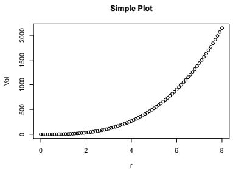

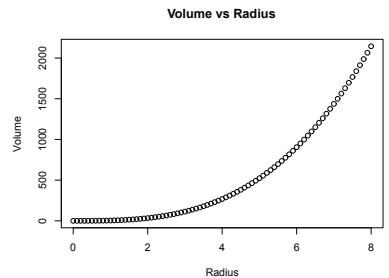

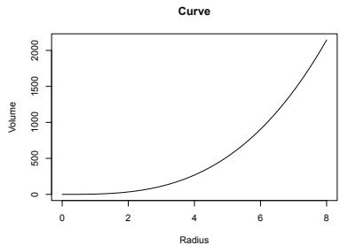

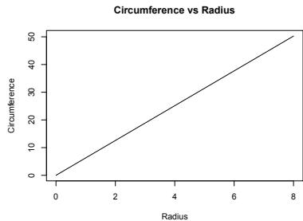  
Figure 2.1.1: Spherical Plots discussed in Text.

# B.2 Probability Distributions

For many distributions, R has functions that obtain probabilities, compute quantiles, and generate random variates. Here are two common examples. Let $X$ be a random variable with a $N(\mu, \sigma^2)$ distribution. In R, let mu and sig denote the mean and standard deviation of $X$ , respectively. Then the R commands and meanings are:

<table><tr><td>pnorm(x, mu, sig)</td><td>P(X ≤ x).</td></tr><tr><td>qnorm(p, mu, sig)</td><td>P(X ≤ q) = p.</td></tr><tr><td>dnorm(x, mu, sig)</td><td>f(x), where f is the pdf of X.</td></tr><tr><td>rnorm(n, mu, sig)</td><td>n variates generated from distribution of X.</td></tr></table>

As a numerical illustration, suppose the height of a male is normally distributed with mean 70 inches and standard deviation 4 inches.

> 1-pnorm(72,70,4) # Prob. man exceeds 6 foot in ht.   
[1] 0.3085375   
> qnorm(.90,70,4) # The upper 10th percentile in ht.   
[1] 75.12621   
$>$ dnorm(72,70,4) #value of density at 72

[1] 0.08801633

$\succ$ rnorm(6,70,4) # sample of size 6 on $X$

[1] 72.12486 75.25811 71.26661 63.36465 74.19436 69.71513

For the next figure, 2.2.2, we generate 100 variates, histogram the sample, and overlay the plot of the density of $X$ on the histogram. Note the $\mathbf{pr} = \mathbf{T}$ argument in the histogram. This scales the histogram to have area 1.

$\begin{array}{rl} & {\mathrm{>x = rnorm(100,70,4); x = sort(x)}}\\ & {\mathrm{>hist(x,pr = T,main = "Histogram of Sample")}}\\ & {\mathrm{>y = dnorm(x,70,4)}}\\ & {\mathrm{>lines(y\sim x)}} \end{array}$

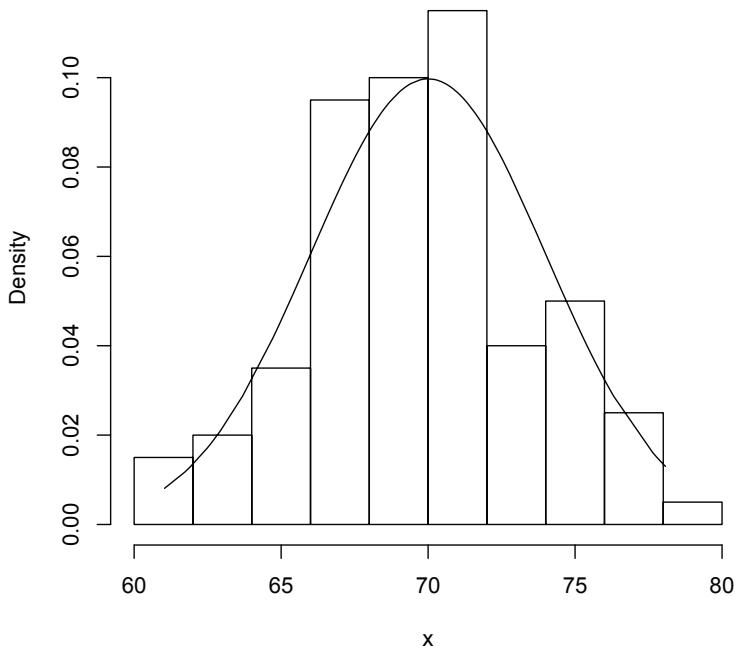  
Histogram of Sample   
Figure 2.2.2: Histogram of a Random Sample from a $N(70,4^2)$ distribution overlaid with the pdf of this normal.

For a discrete random variable the pdf is the probability mass function (pmf). Suppose $X$ is binomial with 100 trials and 0.6 as the probability of success.

> pbinom(55,100,.6) # Probability of at most 55 successes   
[1] 0.1789016   
>dbinom(55,100,.6) #Probability of exactly 55 successes   
[1] 0.04781118

Most other well known distributions are in core R. For example, here is the probability that a $\chi^2$ random variable with 30 degrees of freedom exceeds 2 standard deviations form its mean, along with a $\Gamma$ -distribution confirmation.

$>$ mu=30; sig=sqrt(2*mu); 1-pchisq(mu+2*sig,30)   
[1] 0.03471794   
> 1-pgamma(mu+2*sig,15,1/2)   
[1] 0.03471794

The sample command returns a random sample from a vector. It can either be sampling with replacement (replace=T) or sampling without replacement (replace=F). Here are samples of size 12 from the first 20 positive integers.

> vec = 1:20   
> sample vec,12,replace $\equiv$ T)

[1] 14 20 7 17 6 6 11 11 9 1 10 14

> sample vec,12,replace $\equiv F$

[1] 12 1 14 5 4 11 3 17 16 19 20 15

# B.3 R Functions

The syntax for R functions is the same as the syntax in R. This easily allows for the development of packages, a collection of R functions, for specific tasks. The schematic for an R function is

```txt
name-function <- function(args){ ... body of function ... } 
```

Example B.3.1. Consider a process where a measurement is taken over time. At each time $n$ , $n = 1,2,\ldots$ , the measurement $x_{n}$ is observed but only the sample mean $\overline{x}_n = (1 / n)\sum_{i = 1}^n x_i$ of the measurements at time $n$ is recorded and the point $(n,\overline{x}_n)$ is added to the running plot of sample means. How is this possible? There is a simple update formula for the sample mean that is easily derived. It is given by

$$
\bar {x} _ {n + 1} = \frac {n}{n + 1} \bar {x} _ {n} + \frac {1}{n + 1} x _ {n + 1}; \tag {B.3.1}
$$

hence, the sample mean for the sequence $x_{1},\ldots ,x_{n + 1}$ can be expressed as a linear combination of the sample mean at time $n$ and the $(n + 1)st$ measurement. The following R function codes this update formula:

mnupdate <- function(n,xbarn,xnp1){ # Input: n is sample size; x barn is mean of sample of size n; # xnp1 is $(n + 1)$ (new) observation # Output: mean of sample of size $(n + 1)$ mnupdate <- $(n / (n + 1))$ *xbarn + xnp1/(n+1) return(mnupdate) }

To run this function we first source it in R. If the function is in the file mnupdate.R in the current directory then the source command is source("mnupdate.R"). It can also be copied and pasted into the current R session. Here is an execution of it:

```matlab
> source("mnupdate.R")
> x = c(3,5,12,4); n=4; xbarn = mean(x);
> x; xbarn #Old sample and its mean 
```

[1] 3 5 12 4

[1] 6

```txt
> xp1 = 30 # New observation
> mnupdate(n,xbarn, xp1) # Mean of updated sample 
```

[1] 10.8

# B.4 Loops

Occasionally in the text, we use a loop in an R program to compute a result. Usually it is a simple for loop of the form

for(i in 1:n){ ... R code often as a function of i ... # For the n-iterations of the loop, i runs through # the values $i = 1$ , $i = 2$ , ... , $i = n$ .

For example, the following code segment produces a table of squares, cubes, square-roots, and cube-roots, for the integers from 1 to $n$ .

```txt
set n at some value  
tab <- c() # Initialize the table  
for(i in 1:n) {  
    tab <- rbind_tab, c(i, i^2, i^3, i^(1/2), i^(1/3)))  
}  
tab 
```

# B.5 Input and Output

Many texts on R, including the references cited above, have information on input and output (I/O) in R. We only discuss several ways which are useful for the R discussion in our text. For output, we discuss two commands. The first writes an array (matrix) to a text file. Suppose amat is a matrix with $p$ columns. Then the command write(t(amat),ncol=p,file="amatrix.dat") writes the matrix amat to the text file amatrix.dat in the current directory. Simply put the "Path" before the file as file="Path/amatrix.dat" to send it to another directory. The second way writes out variables to an R object file called an "rda" file. The variables can include scalars, vectors, matrices, and strings. For example the next line of code writes to an rda file the scalars avar and bscale and the matrix amat along with an information string.

info <- "This file contains the variable ...." save(avar,bscale,amat,info,file="try.rda")

The command load("try.rda") will load these variables (names and values) into the current session. Most of the data sets discussed in the text are in rda files.

For input, we have already discussed the c and load functions. The c function is tedious, though, and a much easier way is to use the scan function. For example, the following lines of code assign the vector $(1,2,3)$ to x:

```txt
x<-scan() 1 2 3
```

The separator between values is white space and the empty line after the data signals the end of x's values. Note that this allows data to be copied and pasted into R. A matrix can also be scanned similarly by using the read.table function; for example, the following command inputs the above matrix A with column header "c1" and "c2":

a<- read.table header $\equiv$ TRUE, text $=$ " c1 c2 1 4 3 2 "）

Notice that copy and paste is also easily used with this command. If the matrix $\mathbf{A}$ is in the file amat.dat with no header, it can be read in as

a <- matrix.scan("amat.dat"), ncol=2, byrow=T)

# B.6 Packages

An R package is a collection of R functions designed for specified tasks. For example, in Chapter 10, the packages Rfit and npsm are discussed that compute rank-based

robust and nonparametric procedures. There are thousands of free packages available to users at the site CRAN. The package hmcpkg contains all the R functions and R data sets discussed in this text. It can be downloaded at the site:

http://www.stat.wmich.edu/mckean/hmchomepage/Pkg/

Once it is installed on your computer use the library command as shown next to use the package in an R session. The next segment of code prints out the first 3 lines of the baseball data set discussed in Example 4.2.4. The attach command allows us to access the variables of the data set, as we show for the variable height.

```txt
library(hmcpkg)  
head(bb,3)  
hand height weight hitind hitpitind average  
1 1 74 218 1 0 3.330  
2 0 75 185 1 1 0.286  
3 1 77 219 2 0 3.040  
attach(bb); head.height,4) # accessing the variable height  
[1] 74 75 77 73 
```

In Example 1.3.3, the derivation of the probability that in a group of $n$ people at least 2 have the same birthday is given. The R function bday, included in the package, computes this probability. The following segment of code computes it for a group of size 10.

```txt
library(hmcpkg)  
bday(10)  
[1] 0.1169482 
```

This page intentionally left blank

# Appendix C

# Lists of Common Distributions

In this appendix, we provide a short list of common distributions. For each distribution, we note the expression where the pmf or pdf is defined in the text, the formula for the pmf or pdf, its mean and variance, and its mgf. The first list contains common discrete distributions, and the second list contains common continuous distributions.

<table><tr><td colspan="2">List of Common Discrete Distributions</td></tr><tr><td>Bernoulli 0 &lt; p &lt; 1</td><td>(3.1.1)p(x) = px(1-p)1-x, x=0,1μ = p, σ2 = p(1-p)m(t) = [(1-p) + pe^t], -∞ &lt; t &lt; ∞</td></tr><tr><td>Binomial 0 &lt; p &lt; 1n = 1, 2, ...</td><td>(3.1.2)p(x) = (nx)p^x(1-p)^{n-x}, x=0,1,2,...,nμ = np, σ^2 = np(1-p)m(t) = [(1-p) + pe^t]^n, -∞ &lt; t &lt; ∞</td></tr><tr><td>Geometric 0 &lt; p &lt; 1</td><td>(3.1.4)p(x) = p(1-p)^x, x=0,1,2,...μ = q/p, σ^2 = 1-p^2m(t) = p[1-(1-p)e^t]^-1, t &lt; -log(1-p)</td></tr><tr><td>Hypergeometric (N, D, n)n = 1, 2,..., min{N, D}</td><td>(3.1.7)p(x) = (N-D/n-x)(D/x)(N)/nμ = nD/N, σ^2 = nD/N N-D N-nN-1The above pmf is the probability of obtaining x Ds in a sample of size n, without replacement.</td></tr><tr><td>Negative Binomial 0 &lt; p &lt; 1r = 1, 2,...</td><td>(3.1.3)p(x) = (x+r-1)r^p(1-p)^x, x=0,1,2,...μ = rq/p, σ^2 = r(1-p)/p^2m(t) = pr[1-(1-p)e^t]^-r, t &lt; -log(1-p)</td></tr><tr><td>Poisson m &gt; 0</td><td>(3.2.1)p(x) = e^{-m}\frac{m^x}{x!}, x=0,1,2,...μ = m, σ^2 = mm(t) = \exp\{m(e^t - 1)\}, -∞ &lt; t &lt; ∞</td></tr><tr><td colspan="2">List of Common Continuous Distributions</td></tr><tr><td>beta</td><td>(3.3.9)</td></tr><tr><td>α&gt;0</td><td>f(x)= Γ(α+β)/Γ(α)Γ(β)xα-1(1-x)β-1, 0&lt;x&lt;1</td></tr><tr><td>β&gt;0</td><td>μ= α/α+β, σ2= αβ/(α+β+1)(α+β)2m(t)=1+ ∑i=1∞(Πj=0k-1α+j/α+β+j)t/t!,-∞&lt;t&lt;∞</td></tr><tr><td>Cauchy</td><td>(1.9.2)f(x)= 1/πx2+1, -∞&lt;x&lt;∞Neither the mean nor the variance exists.The mgf does not exist.</td></tr><tr><td>Chi-squared, χ2(r)</td><td>(3.3.7)f(x)= 1/Γ(r/2)2r/2x(r/2)-1e-x/2, x&gt;0</td></tr><tr><td>r&gt;0</td><td>μ=r, σ2= 2r m(t)= (1-2t)-r/2, t&lt;1/2 χ2(r) ⇌ Γ(r/2,2) r is called the degrees of freedom.</td></tr><tr><td>Exponential</td><td>(3.3.6)f(x)= λe-λx, x&gt;0 μ= 1/λ, σ2= 1/λ2 m(t)= [1-(t/λ)]-1, t&lt;λ Exponential(λ) ⇌ Γ(1,1/λ)</td></tr><tr><td>F, F(r1,r2)</td><td>(3.6.6)f(x)= Γ[(r1+r2)/2](r1/r2)r1/2/(1+r1x/r2)(r1+r2)/2, x&gt;0</td></tr><tr><td>r1&gt;0</td><td rowspan="2">If r2&gt;2, μ= r2/r2-2. If r&gt;4, σ2= 2(r2/r2-2)2r1+r2-2/r1(r2-4). The mgf does not exist.</td></tr><tr><td>r2&gt;0&gt;0</td></tr><tr><td>r1 is called the numerator degrees of freedom.</td><td>r2 is called the denominator degrees of freedom.</td></tr><tr><td>Gamma, Γ(α,β)</td><td>(3.3.2)f(x)= 1/Γ(α)βxα-1e-x/β, x&gt;0</td></tr><tr><td>α&gt;0</td><td>μ= αβ, σ2= αβ2</td></tr><tr><td>β&gt;0</td><td>m(t)=(1-βt)-α, t&lt;1/β</td></tr><tr><td colspan="2">Continuous Distributions, Continued</td></tr><tr><td>Laplace
-∞ &lt; θ &lt; ∞</td><td>(2.2.4)
f(x) = 1/2 e-|x-θ|, -∞ &lt; x &lt; ∞
μ = θ, σ2= 2
m(t) = eth/1-t2, -1 &lt; t &lt; 1</td></tr><tr><td>Logistic
-∞ &lt; θ &lt; ∞</td><td>(6.1.8)
f(x) = exp-{-(x-θ)}/(1+exp{-(x-θ)})2, -∞ &lt; x &lt; ∞
μ = θ, σ2= π/3
m(t) = ethΓ(1-t)Γ(1+t), -1 &lt; t &lt; 1</td></tr><tr><td>Normal, N(μ,σ2)-∞ &lt; μ &lt; ∞
σ &gt; 0</td><td>(3.4.6)
f(x) = 1/√2πσ exp{-(1/2 (x-μ)/σ)2}, -∞ &lt; x &lt; ∞
μ = μ, σ2= σ2
m(t) = exp{μt + (1/2)σ2t2}, -∞ &lt; t &lt; ∞</td></tr><tr><td>t, t(r)
r &gt; 0</td><td>(3.6.2)
f(x) = Γ[(r+1)/2] / (1+x2/r)(r+1)/2, -∞ &lt; x &lt; ∞
If r &gt; 1, μ = 0. If r &gt; 2, σ2=r/r-2.
The mgf does not exist.
The parameter r is called the degrees of freedom.</td></tr><tr><td>Uniform
-∞ &lt; a &lt; b &lt; ∞</td><td>(1.7.4)
f(x) = 1/b-a, a &lt; x &lt; b
μ = a+b/2, σ2=(b-a)/12
m(t) = etb/(b-a)t, -∞ &lt; t &lt; ∞</td></tr></table>

# Appendix D

# Tables of Distributions

Prior to the current age of computing, probability tables for certain distributions were part of many text books in probability and statistics. These are not needed any longer. Most statistical computing packages offer easy-to-use calls to determine these probabilities and quantiles. This is certainly true of the language R as we have discussed through out this text. Also, many hand calculators have such functions.

Tables for the following distributions are presented:

Table I Selected quantiles for chi-square distributions.

Table II Cumulative distribution function for the standard normal random variable.

Table III Selected quantiles for $t$ -distributions.

Table IV Selected quantiles for $F$ -distributions.

# Table I Chi-Square Distribution

The following table presents selected quantiles of chi-square distribution, i.e., the values $x$ such that

$$
P (X \leq x) = \int_ {0} ^ {x} \frac {1}{\Gamma (r / 2) 2 ^ {r / 2}} w ^ {r / 2 - 1} e ^ {- w / 2} d w,
$$

for selected degrees of freedom $r$ . The R function chistable.s generates this table.

<table><tr><td rowspan="2">r</td><td colspan="8">P(X ≤ x)</td></tr><tr><td>0.010</td><td>0.025</td><td>0.050</td><td>0.100</td><td>0.900</td><td>0.950</td><td>0.975</td><td>0.990</td></tr><tr><td>1</td><td>0.000</td><td>0.001</td><td>0.004</td><td>0.016</td><td>2.706</td><td>3.841</td><td>5.024</td><td>6.635</td></tr><tr><td>2</td><td>0.020</td><td>0.051</td><td>0.103</td><td>0.211</td><td>4.605</td><td>5.991</td><td>7.378</td><td>9.210</td></tr><tr><td>3</td><td>0.115</td><td>0.216</td><td>0.352</td><td>0.584</td><td>6.251</td><td>7.815</td><td>9.348</td><td>11.345</td></tr><tr><td>4</td><td>0.297</td><td>0.484</td><td>0.711</td><td>1.064</td><td>7.779</td><td>9.488</td><td>11.143</td><td>13.277</td></tr><tr><td>5</td><td>0.554</td><td>0.831</td><td>1.145</td><td>1.610</td><td>9.236</td><td>11.070</td><td>12.833</td><td>15.086</td></tr><tr><td>6</td><td>0.872</td><td>1.237</td><td>1.635</td><td>2.204</td><td>10.645</td><td>12.592</td><td>14.449</td><td>16.812</td></tr><tr><td>7</td><td>1.239</td><td>1.690</td><td>2.167</td><td>2.833</td><td>12.017</td><td>14.067</td><td>16.013</td><td>18.475</td></tr><tr><td>8</td><td>1.646</td><td>2.180</td><td>2.733</td><td>3.490</td><td>13.362</td><td>15.507</td><td>17.535</td><td>20.090</td></tr><tr><td>9</td><td>2.088</td><td>2.700</td><td>3.325</td><td>4.168</td><td>14.684</td><td>16.919</td><td>19.023</td><td>21.666</td></tr><tr><td>10</td><td>2.558</td><td>3.247</td><td>3.940</td><td>4.865</td><td>15.987</td><td>18.307</td><td>20.483</td><td>23.209</td></tr><tr><td>11</td><td>3.053</td><td>3.816</td><td>4.575</td><td>5.578</td><td>17.275</td><td>19.675</td><td>21.920</td><td>24.725</td></tr><tr><td>12</td><td>3.571</td><td>4.404</td><td>5.226</td><td>6.304</td><td>18.549</td><td>21.026</td><td>23.337</td><td>26.217</td></tr><tr><td>13</td><td>4.107</td><td>5.009</td><td>5.892</td><td>7.042</td><td>19.812</td><td>22.362</td><td>24.736</td><td>27.688</td></tr><tr><td>14</td><td>4.660</td><td>5.629</td><td>6.571</td><td>7.790</td><td>21.064</td><td>23.685</td><td>26.119</td><td>29.141</td></tr><tr><td>15</td><td>5.229</td><td>6.262</td><td>7.261</td><td>8.547</td><td>22.307</td><td>24.996</td><td>27.488</td><td>30.578</td></tr><tr><td>16</td><td>5.812</td><td>6.908</td><td>7.962</td><td>9.312</td><td>23.542</td><td>26.296</td><td>28.845</td><td>32.000</td></tr><tr><td>17</td><td>6.408</td><td>7.564</td><td>8.672</td><td>10.085</td><td>24.769</td><td>27.587</td><td>30.191</td><td>33.409</td></tr><tr><td>18</td><td>7.015</td><td>8.231</td><td>9.390</td><td>10.865</td><td>25.989</td><td>28.869</td><td>31.526</td><td>34.805</td></tr><tr><td>19</td><td>7.633</td><td>8.907</td><td>10.117</td><td>11.651</td><td>27.204</td><td>30.144</td><td>32.852</td><td>36.191</td></tr><tr><td>20</td><td>8.260</td><td>9.591</td><td>10.851</td><td>12.443</td><td>28.412</td><td>31.410</td><td>34.170</td><td>37.566</td></tr><tr><td>21</td><td>8.897</td><td>10.283</td><td>11.591</td><td>13.240</td><td>29.615</td><td>32.671</td><td>35.479</td><td>38.932</td></tr><tr><td>22</td><td>9.542</td><td>10.982</td><td>12.338</td><td>14.041</td><td>30.813</td><td>33.924</td><td>36.781</td><td>40.289</td></tr><tr><td>23</td><td>10.196</td><td>11.689</td><td>13.091</td><td>14.848</td><td>32.007</td><td>35.172</td><td>38.076</td><td>41.638</td></tr><tr><td>24</td><td>10.856</td><td>12.401</td><td>13.848</td><td>15.659</td><td>33.196</td><td>36.415</td><td>39.364</td><td>42.980</td></tr><tr><td>25</td><td>11.524</td><td>13.120</td><td>14.611</td><td>16.473</td><td>34.382</td><td>37.652</td><td>40.646</td><td>44.314</td></tr><tr><td>26</td><td>12.198</td><td>13.844</td><td>15.379</td><td>17.292</td><td>35.563</td><td>38.885</td><td>41.923</td><td>45.642</td></tr><tr><td>27</td><td>12.879</td><td>14.573</td><td>16.151</td><td>18.114</td><td>36.741</td><td>40.113</td><td>43.195</td><td>46.963</td></tr><tr><td>28</td><td>13.565</td><td>15.308</td><td>16.928</td><td>18.939</td><td>37.916</td><td>41.337</td><td>44.461</td><td>48.278</td></tr><tr><td>29</td><td>14.256</td><td>16.047</td><td>17.708</td><td>19.768</td><td>39.087</td><td>42.557</td><td>45.722</td><td>49.588</td></tr><tr><td>30</td><td>14.953</td><td>16.791</td><td>18.493</td><td>20.599</td><td>40.256</td><td>43.773</td><td>46.979</td><td>50.892</td></tr></table>

# Table II Normal Distribution

The following table presents the standard normal distribution. The probabilities tabled are

$$
P (Z \leq z) = \Phi (z) = \int_ {- \infty} ^ {z} \frac {1}{\sqrt {2 \pi}} e ^ {- w ^ {2} / 2} d w.
$$

Note that only the probabilities for $z \geq 0$ are tabled. To obtain the probabilities for $z < 0$ , use the identity $\Phi(-z) = 1 - \Phi(z)$ . At the bottom of the table, some useful quantiles of the standard normal distribution are displayed. The R function `normaltable.s` generates this table.

<table><tr><td>z</td><td>0.00</td><td>0.01</td><td>0.02</td><td>0.03</td><td>0.04</td><td>0.05</td><td>0.06</td><td>0.07</td><td>0.08</td><td>0.09</td></tr><tr><td>0.0</td><td>.5000</td><td>.5040</td><td>.5080</td><td>.5120</td><td>.5160</td><td>.5199</td><td>.5239</td><td>.5279</td><td>.5319</td><td>.5359</td></tr><tr><td>0.1</td><td>.5398</td><td>.5438</td><td>.5478</td><td>.5517</td><td>.5557</td><td>.5596</td><td>.5636</td><td>.5675</td><td>.5714</td><td>.5753</td></tr><tr><td>0.2</td><td>.5793</td><td>.5832</td><td>.5871</td><td>.5910</td><td>.5948</td><td>.5987</td><td>.6026</td><td>.6064</td><td>.6103</td><td>.6141</td></tr><tr><td>0.3</td><td>.6179</td><td>.6217</td><td>.6255</td><td>.6293</td><td>.6331</td><td>.6368</td><td>.6406</td><td>.6443</td><td>.6480</td><td>.6517</td></tr><tr><td>0.4</td><td>.6554</td><td>.6591</td><td>.6628</td><td>.6664</td><td>.6700</td><td>.6736</td><td>.6772</td><td>.6808</td><td>.6844</td><td>.6879</td></tr><tr><td>0.5</td><td>.6915</td><td>.6950</td><td>.6985</td><td>.7019</td><td>.7054</td><td>.7088</td><td>.7123</td><td>.7157</td><td>.7190</td><td>.7224</td></tr><tr><td>0.6</td><td>.7257</td><td>.7291</td><td>.7324</td><td>.7357</td><td>.7389</td><td>.7422</td><td>.7454</td><td>.7486</td><td>.7517</td><td>.7549</td></tr><tr><td>0.7</td><td>.7580</td><td>.7611</td><td>.7642</td><td>.7673</td><td>.7704</td><td>.7734</td><td>.7764</td><td>.7794</td><td>.7823</td><td>.7852</td></tr><tr><td>0.8</td><td>.7881</td><td>.7910</td><td>.7939</td><td>.7967</td><td>.7995</td><td>.8023</td><td>.8051</td><td>.8078</td><td>.8106</td><td>.8133</td></tr><tr><td>0.9</td><td>.8159</td><td>.8186</td><td>.8212</td><td>.8238</td><td>.8264</td><td>.8289</td><td>.8315</td><td>.8340</td><td>.8365</td><td>.8389</td></tr><tr><td>1.0</td><td>.8413</td><td>.8438</td><td>.8461</td><td>.8485</td><td>.8508</td><td>.8531</td><td>.8554</td><td>.8577</td><td>.8599</td><td>.8621</td></tr><tr><td>1.1</td><td>.8643</td><td>.8665</td><td>.8686</td><td>.8708</td><td>.8729</td><td>.8749</td><td>.8770</td><td>.8790</td><td>.8810</td><td>.8830</td></tr><tr><td>1.2</td><td>.8849</td><td>.8869</td><td>.8888</td><td>.8907</td><td>.8925</td><td>.8944</td><td>.8962</td><td>.8980</td><td>.8997</td><td>.9015</td></tr><tr><td>1.3</td><td>.9032</td><td>.9049</td><td>.9066</td><td>.9082</td><td>.9099</td><td>.9115</td><td>.9131</td><td>.9147</td><td>.9162</td><td>.9177</td></tr><tr><td>1.4</td><td>.9192</td><td>.9207</td><td>.9222</td><td>.9236</td><td>.9251</td><td>.9265</td><td>.9279</td><td>.9292</td><td>.9306</td><td>.9319</td></tr><tr><td>1.5</td><td>.9332</td><td>.9345</td><td>.9357</td><td>.9370</td><td>.9382</td><td>.9394</td><td>.9406</td><td>.9418</td><td>.9429</td><td>.9441</td></tr><tr><td>1.6</td><td>.9452</td><td>.9463</td><td>.9474</td><td>.9484</td><td>.9495</td><td>.9505</td><td>.9515</td><td>.9525</td><td>.9535</td><td>.9545</td></tr><tr><td>1.7</td><td>.9554</td><td>.9564</td><td>.9573</td><td>.9582</td><td>.9591</td><td>.9599</td><td>.9608</td><td>.9616</td><td>.9625</td><td>.9633</td></tr><tr><td>1.8</td><td>.9641</td><td>.9649</td><td>.9656</td><td>.9664</td><td>.9671</td><td>.9678</td><td>.9686</td><td>.9693</td><td>.9699</td><td>.9706</td></tr><tr><td>1.9</td><td>.9713</td><td>.9719</td><td>.9726</td><td>.9732</td><td>.9738</td><td>.9744</td><td>.9750</td><td>.9756</td><td>.9761</td><td>.9767</td></tr><tr><td>2.0</td><td>.9772</td><td>.9778</td><td>.9783</td><td>.9788</td><td>.9793</td><td>.9798</td><td>.9803</td><td>.9808</td><td>.9812</td><td>.9817</td></tr><tr><td>2.1</td><td>.9821</td><td>.9826</td><td>.9830</td><td>.9834</td><td>.9838</td><td>.9842</td><td>.9846</td><td>.9850</td><td>.9854</td><td>.9857</td></tr><tr><td>2.2</td><td>.9861</td><td>.9864</td><td>.9868</td><td>.9871</td><td>.9875</td><td>.9878</td><td>.9881</td><td>.9884</td><td>.9887</td><td>.9890</td></tr><tr><td>2.3</td><td>.9893</td><td>.9896</td><td>.9898</td><td>.9901</td><td>.9904</td><td>.9906</td><td>.9909</td><td>.9911</td><td>.9913</td><td>.9916</td></tr><tr><td>2.4</td><td>.9918</td><td>.9920</td><td>.9922</td><td>.9925</td><td>.9927</td><td>.9929</td><td>.9931</td><td>.9932</td><td>.9934</td><td>.9936</td></tr><tr><td>2.5</td><td>.9938</td><td>.9940</td><td>.9941</td><td>.9943</td><td>.9945</td><td>.9946</td><td>.9948</td><td>.9949</td><td>.9951</td><td>.9952</td></tr><tr><td>2.6</td><td>.9953</td><td>.9955</td><td>.9956</td><td>.9957</td><td>.9959</td><td>.9960</td><td>.9961</td><td>.9962</td><td>.9963</td><td>.9964</td></tr><tr><td>2.7</td><td>.9965</td><td>.9966</td><td>.9967</td><td>.9968</td><td>.9969</td><td>.9970</td><td>.9971</td><td>.9972</td><td>.9973</td><td>.9974</td></tr><tr><td>2.8</td><td>.9974</td><td>.9975</td><td>.9976</td><td>.9977</td><td>.9977</td><td>.9978</td><td>.9979</td><td>.9979</td><td>.9980</td><td>.9981</td></tr><tr><td>2.9</td><td>.9981</td><td>.9982</td><td>.9982</td><td>.9983</td><td>.9984</td><td>.9984</td><td>.9985</td><td>.9985</td><td>.9986</td><td>.9986</td></tr><tr><td>3.0</td><td>.9987</td><td>.9987</td><td>.9987</td><td>.9988</td><td>.9988</td><td>.9989</td><td>.9989</td><td>.9989</td><td>.9990</td><td>.9990</td></tr><tr><td>3.1</td><td>.9990</td><td>.9991</td><td>.9991</td><td>.9991</td><td>.9992</td><td>.9992</td><td>.9992</td><td>.9992</td><td>.9993</td><td>.9993</td></tr><tr><td>3.2</td><td>.9993</td><td>.9993</td><td>.9994</td><td>.9994</td><td>.9994</td><td>.9994</td><td>.9994</td><td>.9995</td><td>.9995</td><td>.9995</td></tr><tr><td>3.3</td><td>.9995</td><td>.9995</td><td>.9995</td><td>.9996</td><td>.9996</td><td>.9996</td><td>.9996</td><td>.9996</td><td>.9996</td><td>.9997</td></tr><tr><td>3.4</td><td>.9997</td><td>.9997</td><td>.9997</td><td>.9997</td><td>.9997</td><td>.9997</td><td>.9997</td><td>.9997</td><td>.9997</td><td>.9998</td></tr><tr><td>3.5</td><td>.9998</td><td>.9998</td><td>.9998</td><td>.9998</td><td>.9998</td><td>.9998</td><td>.9998</td><td>.9998</td><td>.9998</td><td>.9998</td></tr><tr><td>α</td><td>0.400</td><td>0.300</td><td>0.200</td><td>0.100</td><td>0.050</td><td>0.025</td><td>0.020</td><td>0.010</td><td>0.005</td><td>0.001</td></tr><tr><td>zα</td><td>0.253</td><td>0.524</td><td>0.842</td><td>1.282</td><td>1.645</td><td>1.960</td><td>2.054</td><td>2.326</td><td>2.576</td><td>3.090</td></tr><tr><td>zα/2</td><td>0.842</td><td>1.036</td><td>1.282</td><td>1.645</td><td>1.960</td><td>2.241</td><td>2.326</td><td>2.576</td><td>2.807</td><td>3.291</td></tr></table>

# Table III $t$ -Distribution

The following table presents selected quantiles of the $t$ -distribution, i.e., the values $t$ such that

$$
P (T \leq t) = \int_ {- \infty} ^ {t} \frac {\Gamma [ (r + 1) / 2 ]}{\sqrt {\pi r} \Gamma (r / 2) (1 + w ^ {2} / r) ^ {(r + 1) / 2}} d w,
$$

for selected degrees of freedom $r$ . The last row gives the standard normal quantiles.

<table><tr><td rowspan="2">r</td><td colspan="6">P(T≤t)</td></tr><tr><td>0.900</td><td>0.950</td><td>0.975</td><td>0.990</td><td>0.995</td><td>0.999</td></tr><tr><td>1</td><td>3.078</td><td>6.314</td><td>12.706</td><td>31.821</td><td>63.657</td><td>318.309</td></tr><tr><td>2</td><td>1.886</td><td>2.920</td><td>4.303</td><td>6.965</td><td>9.925</td><td>22.327</td></tr><tr><td>3</td><td>1.638</td><td>2.353</td><td>3.182</td><td>4.541</td><td>5.841</td><td>10.215</td></tr><tr><td>4</td><td>1.533</td><td>2.132</td><td>2.776</td><td>3.747</td><td>4.604</td><td>7.173</td></tr><tr><td>5</td><td>1.476</td><td>2.015</td><td>2.571</td><td>3.365</td><td>4.032</td><td>5.893</td></tr><tr><td>6</td><td>1.440</td><td>1.943</td><td>2.447</td><td>3.143</td><td>3.707</td><td>5.208</td></tr><tr><td>7</td><td>1.415</td><td>1.895</td><td>2.365</td><td>2.998</td><td>3.499</td><td>4.785</td></tr><tr><td>8</td><td>1.397</td><td>1.860</td><td>2.306</td><td>2.896</td><td>3.355</td><td>4.501</td></tr><tr><td>9</td><td>1.383</td><td>1.833</td><td>2.262</td><td>2.821</td><td>3.250</td><td>4.297</td></tr><tr><td>10</td><td>1.372</td><td>1.812</td><td>2.228</td><td>2.764</td><td>3.169</td><td>4.144</td></tr><tr><td>11</td><td>1.363</td><td>1.796</td><td>2.201</td><td>2.718</td><td>3.106</td><td>4.025</td></tr><tr><td>12</td><td>1.356</td><td>1.782</td><td>2.179</td><td>2.681</td><td>3.055</td><td>3.930</td></tr><tr><td>13</td><td>1.350</td><td>1.771</td><td>2.160</td><td>2.650</td><td>3.012</td><td>3.852</td></tr><tr><td>14</td><td>1.345</td><td>1.761</td><td>2.145</td><td>2.624</td><td>2.977</td><td>3.787</td></tr><tr><td>15</td><td>1.341</td><td>1.753</td><td>2.131</td><td>2.602</td><td>2.947</td><td>3.733</td></tr><tr><td>16</td><td>1.337</td><td>1.746</td><td>2.120</td><td>2.583</td><td>2.921</td><td>3.686</td></tr><tr><td>17</td><td>1.333</td><td>1.740</td><td>2.110</td><td>2.567</td><td>2.898</td><td>3.646</td></tr><tr><td>18</td><td>1.330</td><td>1.734</td><td>2.101</td><td>2.552</td><td>2.878</td><td>3.610</td></tr><tr><td>19</td><td>1.328</td><td>1.729</td><td>2.093</td><td>2.539</td><td>2.861</td><td>3.579</td></tr><tr><td>20</td><td>1.325</td><td>1.725</td><td>2.086</td><td>2.528</td><td>2.845</td><td>3.552</td></tr><tr><td>21</td><td>1.323</td><td>1.721</td><td>2.080</td><td>2.518</td><td>2.831</td><td>3.527</td></tr><tr><td>22</td><td>1.321</td><td>1.717</td><td>2.074</td><td>2.508</td><td>2.819</td><td>3.505</td></tr><tr><td>23</td><td>1.319</td><td>1.714</td><td>2.069</td><td>2.500</td><td>2.807</td><td>3.485</td></tr><tr><td>24</td><td>1.318</td><td>1.711</td><td>2.064</td><td>2.492</td><td>2.797</td><td>3.467</td></tr><tr><td>25</td><td>1.316</td><td>1.708</td><td>2.060</td><td>2.485</td><td>2.787</td><td>3.450</td></tr><tr><td>26</td><td>1.315</td><td>1.706</td><td>2.056</td><td>2.479</td><td>2.779</td><td>3.435</td></tr><tr><td>27</td><td>1.314</td><td>1.703</td><td>2.052</td><td>2.473</td><td>2.771</td><td>3.421</td></tr><tr><td>28</td><td>1.313</td><td>1.701</td><td>2.048</td><td>2.467</td><td>2.763</td><td>3.408</td></tr><tr><td>29</td><td>1.311</td><td>1.699</td><td>2.045</td><td>2.462</td><td>2.756</td><td>3.396</td></tr><tr><td>30</td><td>1.310</td><td>1.697</td><td>2.042</td><td>2.457</td><td>2.750</td><td>3.385</td></tr><tr><td>∞</td><td>1.282</td><td>1.645</td><td>1.960</td><td>2.326</td><td>2.576</td><td>3.090</td></tr></table>

# Table IV

# $F$ -Distribution

# Upper 0.05 Critical Points

The following table presents selected 0.95 and 0.99 quantiles of the $F$ -distribution, i.e., for $\alpha = 0.05, 0.01$ , the values $F_{\alpha}(r_1, r_2)$ such that

$$
\alpha = P (X \geq F _ {\alpha} (r _ {1}, r _ {2})) = \int_ {F _ {\alpha} (r _ {1}, r _ {2})} ^ {\infty} \frac {\Gamma [ (r _ {1} + r _ {2}) / 2 ] (r _ {1} / r _ {2}) ^ {r _ {1} / 2} w ^ {r _ {1} / 2 - 1}}{\Gamma (r _ {1} / 2) \Gamma (r _ {2} / 2) (1 + r _ {1} w / r _ {2}) ^ {(r _ {1} + r _ {2}) / 2}} d w,
$$

where $r_1$ and $r_2$ are the numerator and denominator degrees of freedom, respectively. The R function fp1.r generates this table.

<table><tr><td colspan="10">F0.05(r1,r2)</td></tr><tr><td></td><td colspan="9">r1</td></tr><tr><td>r2</td><td>1</td><td>2</td><td>3</td><td>4</td><td>5</td><td>6</td><td>7</td><td>8</td><td>9</td></tr><tr><td>1</td><td>161.45</td><td>199.50</td><td>215.71</td><td>224.58</td><td>230.16</td><td>233.99</td><td>236.77</td><td>238.88</td><td>240.54</td></tr><tr><td>2</td><td>18.51</td><td>19.00</td><td>19.16</td><td>19.25</td><td>19.30</td><td>19.33</td><td>19.35</td><td>19.37</td><td>19.38</td></tr><tr><td>3</td><td>10.13</td><td>9.55</td><td>9.28</td><td>9.12</td><td>9.01</td><td>8.94</td><td>8.89</td><td>8.85</td><td>8.81</td></tr><tr><td>4</td><td>7.71</td><td>6.94</td><td>6.59</td><td>6.39</td><td>6.26</td><td>6.16</td><td>6.09</td><td>6.04</td><td>6.00</td></tr><tr><td>5</td><td>6.61</td><td>5.79</td><td>5.41</td><td>5.19</td><td>5.05</td><td>4.95</td><td>4.88</td><td>4.82</td><td>4.77</td></tr><tr><td>6</td><td>5.99</td><td>5.14</td><td>4.76</td><td>4.53</td><td>4.39</td><td>4.28</td><td>4.21</td><td>4.15</td><td>4.10</td></tr><tr><td>7</td><td>5.59</td><td>4.74</td><td>4.35</td><td>4.12</td><td>3.97</td><td>3.87</td><td>3.79</td><td>3.73</td><td>3.68</td></tr><tr><td>8</td><td>5.32</td><td>4.46</td><td>4.07</td><td>3.84</td><td>3.69</td><td>3.58</td><td>3.50</td><td>3.44</td><td>3.39</td></tr><tr><td>9</td><td>5.12</td><td>4.26</td><td>3.86</td><td>3.63</td><td>3.48</td><td>3.37</td><td>3.29</td><td>3.23</td><td>3.18</td></tr><tr><td>10</td><td>4.96</td><td>4.10</td><td>3.71</td><td>3.48</td><td>3.33</td><td>3.22</td><td>3.14</td><td>3.07</td><td>3.02</td></tr><tr><td>11</td><td>4.84</td><td>3.98</td><td>3.59</td><td>3.36</td><td>3.20</td><td>3.09</td><td>3.01</td><td>2.95</td><td>2.90</td></tr><tr><td>12</td><td>4.75</td><td>3.89</td><td>3.49</td><td>3.26</td><td>3.11</td><td>3.00</td><td>2.91</td><td>2.85</td><td>2.80</td></tr><tr><td>13</td><td>4.67</td><td>3.81</td><td>3.41</td><td>3.18</td><td>3.03</td><td>2.92</td><td>2.83</td><td>2.77</td><td>2.71</td></tr><tr><td>14</td><td>4.60</td><td>3.74</td><td>3.34</td><td>3.11</td><td>2.96</td><td>2.85</td><td>2.76</td><td>2.70</td><td>2.65</td></tr><tr><td>15</td><td>4.54</td><td>3.68</td><td>3.29</td><td>3.06</td><td>2.90</td><td>2.79</td><td>2.71</td><td>2.64</td><td>2.59</td></tr><tr><td>16</td><td>4.49</td><td>3.63</td><td>3.24</td><td>3.01</td><td>2.85</td><td>2.74</td><td>2.66</td><td>2.59</td><td>2.54</td></tr><tr><td>17</td><td>4.45</td><td>3.59</td><td>3.20</td><td>2.96</td><td>2.81</td><td>2.70</td><td>2.61</td><td>2.55</td><td>2.49</td></tr><tr><td>18</td><td>4.41</td><td>3.55</td><td>3.16</td><td>2.93</td><td>2.77</td><td>2.66</td><td>2.58</td><td>2.51</td><td>2.46</td></tr><tr><td>19</td><td>4.38</td><td>3.52</td><td>3.13</td><td>2.90</td><td>2.74</td><td>2.63</td><td>2.54</td><td>2.48</td><td>2.42</td></tr><tr><td>20</td><td>4.35</td><td>3.49</td><td>3.10</td><td>2.87</td><td>2.71</td><td>2.60</td><td>2.51</td><td>2.45</td><td>2.39</td></tr><tr><td>21</td><td>4.32</td><td>3.47</td><td>3.07</td><td>2.84</td><td>2.68</td><td>2.57</td><td>2.49</td><td>2.42</td><td>2.37</td></tr><tr><td>22</td><td>4.30</td><td>3.44</td><td>3.05</td><td>2.82</td><td>2.66</td><td>2.55</td><td>2.46</td><td>2.40</td><td>2.34</td></tr><tr><td>23</td><td>4.28</td><td>3.42</td><td>3.03</td><td>2.80</td><td>2.64</td><td>2.53</td><td>2.44</td><td>2.37</td><td>2.32</td></tr><tr><td>24</td><td>4.26</td><td>3.40</td><td>3.01</td><td>2.78</td><td>2.62</td><td>2.51</td><td>2.42</td><td>2.36</td><td>2.30</td></tr><tr><td>25</td><td>4.24</td><td>3.39</td><td>2.99</td><td>2.76</td><td>2.60</td><td>2.49</td><td>2.40</td><td>2.34</td><td>2.28</td></tr><tr><td>26</td><td>4.23</td><td>3.37</td><td>2.98</td><td>2.74</td><td>2.59</td><td>2.47</td><td>2.39</td><td>2.32</td><td>2.27</td></tr><tr><td>27</td><td>4.21</td><td>3.35</td><td>2.96</td><td>2.73</td><td>2.57</td><td>2.46</td><td>2.37</td><td>2.31</td><td>2.25</td></tr><tr><td>28</td><td>4.20</td><td>3.34</td><td>2.95</td><td>2.71</td><td>2.56</td><td>2.45</td><td>2.36</td><td>2.29</td><td>2.24</td></tr><tr><td>29</td><td>4.18</td><td>3.33</td><td>2.93</td><td>2.70</td><td>2.55</td><td>2.43</td><td>2.35</td><td>2.28</td><td>2.22</td></tr><tr><td>30</td><td>4.17</td><td>3.32</td><td>2.92</td><td>2.69</td><td>2.53</td><td>2.42</td><td>2.33</td><td>2.27</td><td>2.21</td></tr><tr><td>40</td><td>4.08</td><td>3.23</td><td>2.84</td><td>2.61</td><td>2.45</td><td>2.34</td><td>2.25</td><td>2.18</td><td>2.12</td></tr><tr><td>60</td><td>4.00</td><td>3.15</td><td>2.76</td><td>2.53</td><td>2.37</td><td>2.25</td><td>2.17</td><td>2.10</td><td>2.04</td></tr><tr><td>120</td><td>3.92</td><td>3.07</td><td>2.68</td><td>2.45</td><td>2.29</td><td>2.18</td><td>2.09</td><td>2.02</td><td>1.96</td></tr><tr><td>∞</td><td>3.84</td><td>3.00</td><td>2.60</td><td>2.37</td><td>2.21</td><td>2.10</td><td>2.01</td><td>1.94</td><td>1.88</td></tr></table>

Generated by the R function fp2.r.

Table IV $F$ -Distribution,Continued Upper 0.05 Critical Points   

<table><tr><td colspan="10">F0.05(r1,r2)</td></tr><tr><td></td><td colspan="9">r1</td></tr><tr><td>r2</td><td>10</td><td>15</td><td>20</td><td>25</td><td>30</td><td>40</td><td>60</td><td>120</td><td>∞</td></tr><tr><td>1</td><td>241.88</td><td>245.95</td><td>248.01</td><td>249.26</td><td>250.10</td><td>251.14</td><td>252.20</td><td>253.25</td><td>254.31</td></tr><tr><td>2</td><td>19.40</td><td>19.43</td><td>19.45</td><td>19.46</td><td>19.46</td><td>19.47</td><td>19.48</td><td>19.49</td><td>19.50</td></tr><tr><td>3</td><td>8.79</td><td>8.70</td><td>8.66</td><td>8.63</td><td>8.62</td><td>8.59</td><td>8.57</td><td>8.55</td><td>8.53</td></tr><tr><td>4</td><td>5.96</td><td>5.86</td><td>5.80</td><td>5.77</td><td>5.75</td><td>5.72</td><td>5.69</td><td>5.66</td><td>5.63</td></tr><tr><td>5</td><td>4.74</td><td>4.62</td><td>4.56</td><td>4.52</td><td>4.50</td><td>4.46</td><td>4.43</td><td>4.40</td><td>4.36</td></tr><tr><td>6</td><td>4.06</td><td>3.94</td><td>3.87</td><td>3.83</td><td>3.81</td><td>3.77</td><td>3.74</td><td>3.70</td><td>3.67</td></tr><tr><td>7</td><td>3.64</td><td>3.51</td><td>3.44</td><td>3.40</td><td>3.38</td><td>3.34</td><td>3.30</td><td>3.27</td><td>3.23</td></tr><tr><td>8</td><td>3.35</td><td>3.22</td><td>3.15</td><td>3.11</td><td>3.08</td><td>3.04</td><td>3.01</td><td>2.97</td><td>2.93</td></tr><tr><td>9</td><td>3.14</td><td>3.01</td><td>2.94</td><td>2.89</td><td>2.86</td><td>2.83</td><td>2.79</td><td>2.75</td><td>2.71</td></tr><tr><td>10</td><td>2.98</td><td>2.85</td><td>2.77</td><td>2.73</td><td>2.70</td><td>2.66</td><td>2.62</td><td>2.58</td><td>2.54</td></tr><tr><td>11</td><td>2.85</td><td>2.72</td><td>2.65</td><td>2.60</td><td>2.57</td><td>2.53</td><td>2.49</td><td>2.45</td><td>2.40</td></tr><tr><td>12</td><td>2.75</td><td>2.62</td><td>2.54</td><td>2.50</td><td>2.47</td><td>2.43</td><td>2.38</td><td>2.34</td><td>2.30</td></tr><tr><td>13</td><td>2.67</td><td>2.53</td><td>2.46</td><td>2.41</td><td>2.38</td><td>2.34</td><td>2.30</td><td>2.25</td><td>2.21</td></tr><tr><td>14</td><td>2.60</td><td>2.46</td><td>2.39</td><td>2.34</td><td>2.31</td><td>2.27</td><td>2.22</td><td>2.18</td><td>2.13</td></tr><tr><td>15</td><td>2.54</td><td>2.40</td><td>2.33</td><td>2.28</td><td>2.25</td><td>2.20</td><td>2.16</td><td>2.11</td><td>2.07</td></tr><tr><td>16</td><td>2.49</td><td>2.35</td><td>2.28</td><td>2.23</td><td>2.19</td><td>2.15</td><td>2.11</td><td>2.06</td><td>2.01</td></tr><tr><td>17</td><td>2.45</td><td>2.31</td><td>2.23</td><td>2.18</td><td>2.15</td><td>2.10</td><td>2.06</td><td>2.01</td><td>1.96</td></tr><tr><td>18</td><td>2.41</td><td>2.27</td><td>2.19</td><td>2.14</td><td>2.11</td><td>2.06</td><td>2.02</td><td>1.97</td><td>1.92</td></tr><tr><td>19</td><td>2.38</td><td>2.23</td><td>2.16</td><td>2.11</td><td>2.07</td><td>2.03</td><td>1.98</td><td>1.93</td><td>1.88</td></tr><tr><td>20</td><td>2.35</td><td>2.20</td><td>2.12</td><td>2.07</td><td>2.04</td><td>1.99</td><td>1.95</td><td>1.90</td><td>1.84</td></tr><tr><td>21</td><td>2.32</td><td>2.18</td><td>2.10</td><td>2.05</td><td>2.01</td><td>1.96</td><td>1.92</td><td>1.87</td><td>1.81</td></tr><tr><td>22</td><td>2.30</td><td>2.15</td><td>2.07</td><td>2.02</td><td>1.98</td><td>1.94</td><td>1.89</td><td>1.84</td><td>1.78</td></tr><tr><td>23</td><td>2.27</td><td>2.13</td><td>2.05</td><td>2.00</td><td>1.96</td><td>1.91</td><td>1.86</td><td>1.81</td><td>1.76</td></tr><tr><td>24</td><td>2.25</td><td>2.11</td><td>2.03</td><td>1.97</td><td>1.94</td><td>1.89</td><td>1.84</td><td>1.79</td><td>1.73</td></tr><tr><td>25</td><td>2.24</td><td>2.09</td><td>2.01</td><td>1.96</td><td>1.92</td><td>1.87</td><td>1.82</td><td>1.77</td><td>1.71</td></tr><tr><td>26</td><td>2.22</td><td>2.07</td><td>1.99</td><td>1.94</td><td>1.90</td><td>1.85</td><td>1.80</td><td>1.75</td><td>1.69</td></tr><tr><td>27</td><td>2.20</td><td>2.06</td><td>1.97</td><td>1.92</td><td>1.88</td><td>1.84</td><td>1.79</td><td>1.73</td><td>1.67</td></tr><tr><td>28</td><td>2.19</td><td>2.04</td><td>1.96</td><td>1.91</td><td>1.87</td><td>1.82</td><td>1.77</td><td>1.71</td><td>1.65</td></tr><tr><td>29</td><td>2.18</td><td>2.03</td><td>1.94</td><td>1.89</td><td>1.85</td><td>1.81</td><td>1.75</td><td>1.70</td><td>1.64</td></tr><tr><td>30</td><td>2.16</td><td>2.01</td><td>1.93</td><td>1.88</td><td>1.84</td><td>1.79</td><td>1.74</td><td>1.68</td><td>1.62</td></tr><tr><td>40</td><td>2.08</td><td>1.92</td><td>1.84</td><td>1.78</td><td>1.74</td><td>1.69</td><td>1.64</td><td>1.58</td><td>1.51</td></tr><tr><td>60</td><td>1.99</td><td>1.84</td><td>1.75</td><td>1.69</td><td>1.65</td><td>1.59</td><td>1.53</td><td>1.47</td><td>1.39</td></tr><tr><td>120</td><td>1.91</td><td>1.75</td><td>1.66</td><td>1.60</td><td>1.55</td><td>1.50</td><td>1.43</td><td>1.35</td><td>1.25</td></tr><tr><td>∞</td><td>1.83</td><td>1.67</td><td>1.57</td><td>1.51</td><td>1.46</td><td>1.39</td><td>1.32</td><td>1.22</td><td>1.00</td></tr></table>

The R function fp3.r generates this table.

Table IV $F$ -Distribution,Continued Upper 0.01 Critical Points   

<table><tr><td colspan="11">F0.01(r1,r2)</td></tr><tr><td></td><td colspan="10">r1</td></tr><tr><td>r2</td><td>1</td><td>2</td><td>3</td><td>4</td><td>5</td><td>6</td><td>7</td><td>8</td><td>9</td><td></td></tr><tr><td>1</td><td>4052.2</td><td>4999.5</td><td>5403.4</td><td>5624.6</td><td>5763.7</td><td>5859.0</td><td>5928.4</td><td>5981.1</td><td>6022.5</td><td></td></tr><tr><td>2</td><td>98.50</td><td>99.00</td><td>99.17</td><td>99.25</td><td>99.30</td><td>99.33</td><td>99.36</td><td>99.37</td><td>99.39</td><td></td></tr><tr><td>3</td><td>34.12</td><td>30.82</td><td>29.46</td><td>28.71</td><td>28.24</td><td>27.91</td><td>27.67</td><td>27.49</td><td>27.35</td><td></td></tr><tr><td>4</td><td>21.20</td><td>18.00</td><td>16.69</td><td>15.98</td><td>15.52</td><td>15.21</td><td>14.98</td><td>14.80</td><td>14.66</td><td></td></tr><tr><td>5</td><td>16.26</td><td>13.27</td><td>12.06</td><td>11.39</td><td>10.97</td><td>10.67</td><td>10.46</td><td>10.29</td><td>10.16</td><td></td></tr><tr><td>6</td><td>13.75</td><td>10.92</td><td>9.78</td><td>9.15</td><td>8.75</td><td>8.47</td><td>8.26</td><td>8.10</td><td>7.98</td><td></td></tr><tr><td>7</td><td>12.25</td><td>9.55</td><td>8.45</td><td>7.85</td><td>7.46</td><td>7.19</td><td>6.99</td><td>6.84</td><td>6.72</td><td></td></tr><tr><td>8</td><td>11.26</td><td>8.65</td><td>7.59</td><td>7.01</td><td>6.63</td><td>6.37</td><td>6.18</td><td>6.03</td><td>5.91</td><td></td></tr><tr><td>9</td><td>10.56</td><td>8.02</td><td>6.99</td><td>6.42</td><td>6.06</td><td>5.80</td><td>5.61</td><td>5.47</td><td>5.35</td><td></td></tr><tr><td>10</td><td>10.04</td><td>7.56</td><td>6.55</td><td>5.99</td><td>5.64</td><td>5.39</td><td>5.20</td><td>5.06</td><td>4.94</td><td></td></tr><tr><td>11</td><td>9.65</td><td>7.21</td><td>6.22</td><td>5.67</td><td>5.32</td><td>5.07</td><td>4.89</td><td>4.74</td><td>4.63</td><td></td></tr><tr><td>12</td><td>9.33</td><td>6.93</td><td>5.95</td><td>5.41</td><td>5.06</td><td>4.82</td><td>4.64</td><td>4.50</td><td>4.39</td><td></td></tr><tr><td>13</td><td>9.07</td><td>6.70</td><td>5.74</td><td>5.21</td><td>4.86</td><td>4.62</td><td>4.44</td><td>4.30</td><td>4.19</td><td></td></tr><tr><td>14</td><td>8.86</td><td>6.51</td><td>5.56</td><td>5.04</td><td>4.69</td><td>4.46</td><td>4.28</td><td>4.14</td><td>4.03</td><td></td></tr><tr><td>15</td><td>8.68</td><td>6.36</td><td>5.42</td><td>4.89</td><td>4.56</td><td>4.32</td><td>4.14</td><td>4.00</td><td>3.89</td><td></td></tr><tr><td>16</td><td>8.53</td><td>6.23</td><td>5.29</td><td>4.77</td><td>4.44</td><td>4.20</td><td>4.03</td><td>3.89</td><td>3.78</td><td></td></tr><tr><td>17</td><td>8.40</td><td>6.11</td><td>5.18</td><td>4.67</td><td>4.34</td><td>4.10</td><td>3.93</td><td>3.79</td><td>3.68</td><td></td></tr><tr><td>18</td><td>8.29</td><td>6.01</td><td>5.09</td><td>4.58</td><td>4.25</td><td>4.01</td><td>3.84</td><td>3.71</td><td>3.60</td><td></td></tr><tr><td>19</td><td>8.18</td><td>5.93</td><td>5.01</td><td>4.50</td><td>4.17</td><td>3.94</td><td>3.77</td><td>3.63</td><td>3.52</td><td></td></tr><tr><td>20</td><td>8.10</td><td>5.85</td><td>4.94</td><td>4.43</td><td>4.10</td><td>3.87</td><td>3.70</td><td>3.56</td><td>3.46</td><td></td></tr><tr><td>21</td><td>8.02</td><td>5.78</td><td>4.87</td><td>4.37</td><td>4.04</td><td>3.81</td><td>3.64</td><td>3.51</td><td>3.40</td><td></td></tr><tr><td>22</td><td>7.95</td><td>5.72</td><td>4.82</td><td>4.31</td><td>3.99</td><td>3.76</td><td>3.59</td><td>3.45</td><td>3.35</td><td></td></tr><tr><td>23</td><td>7.88</td><td>5.66</td><td>4.76</td><td>4.26</td><td>3.94</td><td>3.71</td><td>3.54</td><td>3.41</td><td>3.30</td><td></td></tr><tr><td>24</td><td>7.82</td><td>5.61</td><td>4.72</td><td>4.22</td><td>3.90</td><td>3.67</td><td>3.50</td><td>3.36</td><td>3.26</td><td></td></tr><tr><td>25</td><td>7.77</td><td>5.57</td><td>4.68</td><td>4.18</td><td>3.85</td><td>3.63</td><td>3.46</td><td>3.32</td><td>3.22</td><td></td></tr><tr><td>26</td><td>7.72</td><td>5.53</td><td>4.64</td><td>4.14</td><td>3.82</td><td>3.59</td><td>3.42</td><td>3.29</td><td>3.18</td><td></td></tr><tr><td>27</td><td>7.68</td><td>5.49</td><td>4.60</td><td>4.11</td><td>3.78</td><td>3.56</td><td>3.39</td><td>3.26</td><td>3.15</td><td></td></tr><tr><td>28</td><td>7.64</td><td>5.45</td><td>4.57</td><td>4.07</td><td>3.75</td><td>3.53</td><td>3.36</td><td>3.23</td><td>3.12</td><td></td></tr><tr><td>29</td><td>7.60</td><td>5.42</td><td>4.54</td><td>4.04</td><td>3.73</td><td>3.50</td><td>3.33</td><td>3.20</td><td>3.09</td><td></td></tr><tr><td>30</td><td>7.56</td><td>5.39</td><td>4.51</td><td>4.02</td><td>3.70</td><td>3.47</td><td>3.30</td><td>3.17</td><td>3.07</td><td></td></tr><tr><td>40</td><td>7.31</td><td>5.18</td><td>4.31</td><td>3.83</td><td>3.51</td><td>3.29</td><td>3.12</td><td>2.99</td><td>2.89</td><td></td></tr><tr><td>60</td><td>7.08</td><td>4.98</td><td>4.13</td><td>3.65</td><td>3.34</td><td>3.12</td><td>2.95</td><td>2.82</td><td>2.72</td><td></td></tr><tr><td>120</td><td>6.85</td><td>4.79</td><td>3.95</td><td>3.48</td><td>3.17</td><td>2.96</td><td>2.79</td><td>2.66</td><td>2.56</td><td></td></tr><tr><td>∞</td><td>6.63</td><td>4.61</td><td>3.78</td><td>3.32</td><td>3.02</td><td>2.80</td><td>2.64</td><td>2.51</td><td>2.41</td><td></td></tr></table>

The R function fp4.r generates this table.

Table IV $F$ -Distribution,Continued Upper 0.01 Critical Points   

<table><tr><td colspan="10">F0.01(r1,r2)</td></tr><tr><td></td><td colspan="9">r1</td></tr><tr><td>r2</td><td>10</td><td>15</td><td>20</td><td>25</td><td>30</td><td>40</td><td>60</td><td>120</td><td>∞</td></tr><tr><td>1</td><td>6055.9</td><td>6157.3</td><td>6208.7</td><td>6239.8</td><td>6260.7</td><td>6286.8</td><td>6313.0</td><td>6339.4</td><td>6365.9</td></tr><tr><td>2</td><td>99.40</td><td>99.43</td><td>99.45</td><td>99.46</td><td>99.47</td><td>99.47</td><td>99.48</td><td>99.49</td><td>99.50</td></tr><tr><td>3</td><td>27.23</td><td>26.87</td><td>26.69</td><td>26.58</td><td>26.50</td><td>26.41</td><td>26.32</td><td>26.22</td><td>26.13</td></tr><tr><td>4</td><td>14.55</td><td>14.20</td><td>14.02</td><td>13.91</td><td>13.84</td><td>13.75</td><td>13.65</td><td>13.56</td><td>13.46</td></tr><tr><td>5</td><td>10.05</td><td>9.72</td><td>9.55</td><td>9.45</td><td>9.38</td><td>9.29</td><td>9.20</td><td>9.11</td><td>9.02</td></tr><tr><td>6</td><td>7.87</td><td>7.56</td><td>7.40</td><td>7.30</td><td>7.23</td><td>7.14</td><td>7.06</td><td>6.97</td><td>6.88</td></tr><tr><td>7</td><td>6.62</td><td>6.31</td><td>6.16</td><td>6.06</td><td>5.99</td><td>5.91</td><td>5.82</td><td>5.74</td><td>5.65</td></tr><tr><td>8</td><td>5.81</td><td>5.52</td><td>5.36</td><td>5.26</td><td>5.20</td><td>5.12</td><td>5.03</td><td>4.95</td><td>4.86</td></tr><tr><td>9</td><td>5.26</td><td>4.96</td><td>4.81</td><td>4.71</td><td>4.65</td><td>4.57</td><td>4.48</td><td>4.40</td><td>4.31</td></tr><tr><td>10</td><td>4.85</td><td>4.56</td><td>4.41</td><td>4.31</td><td>4.25</td><td>4.17</td><td>4.08</td><td>4.00</td><td>3.91</td></tr><tr><td>11</td><td>4.54</td><td>4.25</td><td>4.10</td><td>4.01</td><td>3.94</td><td>3.86</td><td>3.78</td><td>3.69</td><td>3.60</td></tr><tr><td>12</td><td>4.30</td><td>4.01</td><td>3.86</td><td>3.76</td><td>3.70</td><td>3.62</td><td>3.54</td><td>3.45</td><td>3.36</td></tr><tr><td>13</td><td>4.10</td><td>3.82</td><td>3.66</td><td>3.57</td><td>3.51</td><td>3.43</td><td>3.34</td><td>3.25</td><td>3.17</td></tr><tr><td>14</td><td>3.94</td><td>3.66</td><td>3.51</td><td>3.41</td><td>3.35</td><td>3.27</td><td>3.18</td><td>3.09</td><td>3.00</td></tr><tr><td>15</td><td>3.80</td><td>3.52</td><td>3.37</td><td>3.28</td><td>3.21</td><td>3.13</td><td>3.05</td><td>2.96</td><td>2.87</td></tr><tr><td>16</td><td>3.69</td><td>3.41</td><td>3.26</td><td>3.16</td><td>3.10</td><td>3.02</td><td>2.93</td><td>2.84</td><td>2.75</td></tr><tr><td>17</td><td>3.59</td><td>3.31</td><td>3.16</td><td>3.07</td><td>3.00</td><td>2.92</td><td>2.83</td><td>2.75</td><td>2.65</td></tr><tr><td>18</td><td>3.51</td><td>3.23</td><td>3.08</td><td>2.98</td><td>2.92</td><td>2.84</td><td>2.75</td><td>2.66</td><td>2.57</td></tr><tr><td>19</td><td>3.43</td><td>3.15</td><td>3.00</td><td>2.91</td><td>2.84</td><td>2.76</td><td>2.67</td><td>2.58</td><td>2.49</td></tr><tr><td>20</td><td>3.37</td><td>3.09</td><td>2.94</td><td>2.84</td><td>2.78</td><td>2.69</td><td>2.61</td><td>2.52</td><td>2.42</td></tr><tr><td>21</td><td>3.31</td><td>3.03</td><td>2.88</td><td>2.79</td><td>2.72</td><td>2.64</td><td>2.55</td><td>2.46</td><td>2.36</td></tr><tr><td>22</td><td>3.26</td><td>2.98</td><td>2.83</td><td>2.73</td><td>2.67</td><td>2.58</td><td>2.50</td><td>2.40</td><td>2.31</td></tr><tr><td>23</td><td>3.21</td><td>2.93</td><td>2.78</td><td>2.69</td><td>2.62</td><td>2.54</td><td>2.45</td><td>2.35</td><td>2.26</td></tr><tr><td>24</td><td>3.17</td><td>2.89</td><td>2.74</td><td>2.64</td><td>2.58</td><td>2.49</td><td>2.40</td><td>2.31</td><td>2.21</td></tr><tr><td>25</td><td>3.13</td><td>2.85</td><td>2.70</td><td>2.60</td><td>2.54</td><td>2.45</td><td>2.36</td><td>2.27</td><td>2.17</td></tr><tr><td>26</td><td>3.09</td><td>2.81</td><td>2.66</td><td>2.57</td><td>2.50</td><td>2.42</td><td>2.33</td><td>2.23</td><td>2.13</td></tr><tr><td>27</td><td>3.06</td><td>2.78</td><td>2.63</td><td>2.54</td><td>2.47</td><td>2.38</td><td>2.29</td><td>2.20</td><td>2.10</td></tr><tr><td>28</td><td>3.03</td><td>2.75</td><td>2.60</td><td>2.51</td><td>2.44</td><td>2.35</td><td>2.26</td><td>2.17</td><td>2.06</td></tr><tr><td>29</td><td>3.00</td><td>2.73</td><td>2.57</td><td>2.48</td><td>2.41</td><td>2.33</td><td>2.23</td><td>2.14</td><td>2.03</td></tr><tr><td>30</td><td>2.98</td><td>2.70</td><td>2.55</td><td>2.45</td><td>2.39</td><td>2.30</td><td>2.21</td><td>2.11</td><td>2.01</td></tr><tr><td>40</td><td>2.80</td><td>2.52</td><td>2.37</td><td>2.27</td><td>2.20</td><td>2.11</td><td>2.02</td><td>1.92</td><td>1.80</td></tr><tr><td>60</td><td>2.63</td><td>2.35</td><td>2.20</td><td>2.10</td><td>2.03</td><td>1.94</td><td>1.84</td><td>1.73</td><td>1.60</td></tr><tr><td>120</td><td>2.47</td><td>2.19</td><td>2.03</td><td>1.93</td><td>1.86</td><td>1.76</td><td>1.66</td><td>1.53</td><td>1.38</td></tr><tr><td>∞</td><td>2.32</td><td>2.04</td><td>1.88</td><td>1.77</td><td>1.70</td><td>1.59</td><td>1.47</td><td>1.32</td><td>1.00</td></tr></table>

# Appendix E

# References

Abebe, A., Crimin, K., McKean, J. W., Haas, J. V., and Vidmar, T. J. (2001), Rank-based procedures for linear models: applications to pharmaceutical science data, *Drug Information Journal*, 35, 947-971.   
Affi, A. A. and Azen, S. P. (1972), Statistical Analysis: A Computer Oriented Approach, New York: Academic Press.   
Arnold, S. F. (1981), The Theory of Linear Models and Multivariate Analysis, New York: John Wiley and Sons.   
Azzalini, A. A. (1985), A class of distributions which includes the normal ones, Scandinavian Journal of Statistics, 12, 171-178.   
Box, G. E. P. and Muller, M. (1958), A note on the generation of random normal variates, Annals of Mathematical Statistics, 29, 610-611.   
Breiman, L. (1968), *Probability*, Reading, MA: Addison-Wesley.   
Buck, R. C. (1965), Advanced Calculus, New York: McGraw-Hill.   
Canty, A. and Ripley, B. (2017), boot: Bootstrap R (S-Plus) Functions. R package version 1.3-19.   
Carmer, S. G. and Swanson, M. R. (1973), An evaluation of ten multiple comparison procedures by Monte Carlo methods, Journal of the American Statistical Association 68, 66-74.   
Casella, G. and George, E. I. (1992), Explaining the Gibbs sampler, American Statistician, 46, 167-174.   
Chang, W. H., McKean, J. W., Naranjo, J. D., and Sheather, S. J. (1999), High breakdown rank-based regression, Journal of the American Statistical Association, 94, 205-219.   
Chung, K. L. (1974), A Course in Probability Theory, New York: Academic Press.   
Conover, W. J. and Iman, R. L. (1981), Rank transform as a bridge between parametric and nonparametric statistics, American Statistician, 35, 124-133.

Cramér, H. (1946), Mathematical Methods of Statistics, Princeton: Princeton University Press.   
Crawley, M. J. (2007), The R Book, Chichester, West Sussex, John Wiley & Sons, Ltd.   
Curtiss, J. H. (1942), A note on the theory of moment generating functions, Annals of Mathematical Statistics, 13, 430.   
D'Agostino, R. B. and Stephens, M. A. (1986), Goodness-of-Fit Techniques, New York: Marcel Dekker.   
Davison, A. C. and Hinkley, D. V. (1997), Bootstrap Methods and Their Applications, Cambridge, UK: Cambridge University Press.   
Devore, J. L. (2012), Probability & Statistics, 8th Ed., Boston: Brooks/Cole.   
Draper, N. R. and Smith, H. (1966), Applied Regression Analysis, New York: John Wiley & Sons.   
DuBois, C., Ed. (1960), *Lowie's Selected Papers in Anthropology*, Berkeley: University of California Press.   
Dunnett, C. W. (1980), Journal of the American Statistical Association, 50, 1096-1121.   
Efron, B. (1979), Bootstrap methods: Another look at the jackknife, Annals of Statistics, 7, 1-26.   
Efron B. and Tibshirani, R. J. (1993), An Introduction to the Bootstrap, New York: Chapman and Hall.   
Graybill, F. A. (1969), Introduction to Matrices with Applications in Statistics, Belmont, CA: Wadsworth.   
Graybill, F. A. (1976), Theory and Application of the Linear Model, North Scituate, MA: Duxbury.   
Hald, A. (1952), Statistical Theory with Engineering Applications, New York: John Wiley & Sons.   
Haldane, J. B. S. (1948), The precision of observed values of small frequencies, Biometrika, 35, 297-303.   
Hampel, F. R. (1974), The influence curve and its role in robust estimation, Journal of the American Statistical Association, 69, 383-393.   
Hardy, G. H. (1992), A Course in Pure Mathematics, Cambridge, UK: Cambridge University Press.   
Hettmansperger, T. P. (1984), Statistical Inference Based on Ranks, New York: John Wiley & Sons.   
Hettmansperger, T. P. and McKean, J. W. (2011), Robust Nonparametric Statistical Methods, 2nd Ed., Boca Raton, FL: CRC Press.   
Hewitt, E. and Stromberg, K. (1965), Real and Abstract Analysis, New York: Springer-Verlag.

Hodges, J. L., Jr., and Lehmann, E. L. (1961), Comparison of the normal scores and Wilcoxon tests, In: Proceedings of the Fourth Berkeley Symposium on Mathematical Statistics and Probability, 1, 307-317, Berkeley: University of California Press.   
Hodges, J. L., Jr., and Lehmann, E. L. (1963), Estimates of location based on rank tests, Annals of Mathematical Statistics, 34, 598-611.   
Hogg, R. V. and Craig, A. T. (1958), On the decomposition of certain chi-square variables, Annals of Mathematical Statistics, 29, 608.   
Hogg, R. V., Fisher, D. M., and Randles, R. H. (1975), A two-sample adaptive distribution-free test, Journal of the American Statistical Association, 70, 656-661.   
Hollander, M. and Wolfe, D. A. (1999), Nonparametric Statistical Methods, 2nd Ed., New York: John Wiley & Sons.   
Hsu, J. C. (1996), Multiple Comparisons, London: Chapman Hall.   
Huber, P. J. (1981), *Robust Statistics*, New York: John Wiley & Sons.   
Ihaka, R. and Gentleman, R. (1996), R: A language for data analysis and graphics, Journal of Computational and Graphical Statistics, 5, 229-314.   
Jeffreys, H. (1961), The Theory of Probability, Oxford: Oxford University Press.   
Johnson, R. A. and Wichern, D. W. (2008), Applied Multivariate Statistical Analysis, 6th Ed., Boston: Pearson.   
Kendall, M. and Stuart, A. (1979), The Advanced Theory of Statistics, Vol. 2, New York: Macmillan.   
Kendall, M. G. (1962), Rank Correlation Methods, 3rd Ed., London: Griffin.   
Kennedy, W. J. and Gentle, J. E. (1980), Statistical Computing, New York: Marcel Dekker.   
Kitchens, L. J. (1997), Exploring Statistics: A Modern Introduction to Data Analysis and Inference, 2ndEd., Wadsworth.   
Kloke, J. D. and McKean, J. W. (2011), Rfit: R algorithms for rank-based fitting, Submitted.   
Lehmann, E. L. (1983), Theory of Point Estimation, New York: John Wiley & Sons.   
Lehmann, E. L. (1986), Testing Statistical Hypotheses, 2nd Ed., London: Chapman & Hall.   
Lehmann, E. L. (1999), Elements of Large Sample Theory, New York: Springer-Verlag.   
Lehmann, E. L. and Casella, G. (1998), Theory of Point Estimation, 2nd Ed., New York: Springer-Verlag.   
Lehmann, E. L. and Scheffé, H. (1950), Completeness, similar regions, and unbiased estimation, *Sankhya*, **10**, 305–340.

Marsaglia, G. and Bray, T. A. (1964), A convenient method for generating normal variables, SIAM Review, 6, 260-264.   
McKean, J. W. (2004), Robust analyses of linear models, Statistical Science, 19, 562-570.   
McKean, J. W. and Vidmar, T. J. (1994), A comparison of two rank-based methods for the analysis of linear models, American Statistician, 48, 220-229.   
McKean, J. W., Vidmar, T. J. and Sievers, G. (1989), A Robust Two-Stage Multiple Comparison Procedure with Application to a Random Drug Screen, Biometrics 45, 1281-1297.   
McLachlan, G. J. and Krishnan, T. (1997), The EM Algorithm and Extensions, New York: John Wiley & Sons.   
Minitab (1991), MINITAB Reference Manual, Valley Forge, PA: Minitab, Inc.   
Mosteller, F. and Tukey, J. W. (1977), Data Reduction and Regression, Reading, MA: Addison-Wesley.   
Naranjo, J. D. and McKean, J. W. (1997), Rank regression with estimated scores, Statistics and Probability Letters, 33, 209-216.   
Nelson, W. (1982), Applied Lifetime Data Analysis, New York: John Wiley & Sons.   
Neter, J., Kutner, M. H., Nachtsheim, C. J., and Wasserman, W. (1996), Applied Linear Statistical Models, 4th Ed., Chicago: Irwin.   
Parzen, E. (1962), Stochastic Processes, San Francisco: Holden-Day.   
Randles, R. H. and Wolfe, D. A. (1979), Introduction to the Theory of Nonparametric Statistics, New York: John Wiley and Sons.   
Rao, C. R. (1973), Linear Statistical Inference and Its Applications, 2nd Ed., New York: John Wiley & Sons.   
Rasmussen, S. (1992), An Introduction to Statistics with Data Analysis, Belmont, CA: Brroks/Cole.   
Robert, C. P. and Casella, G. (1999), Monte Carlo Statistical Methods, New York: Springer-Verlag.   
Rousseeuw, P. J. and Leroy, A. M. (1987), Robust Regression and Outlier Detection, New York: John Wiley & Sons.   
Scheffé, H. (1959), The Analysis of Variance, New York: John Wiley & Sons.   
Seber, G. A. F. (1984), Multivariate Observations, New York: John Wiley & Sons.   
Serfling, R. J. (1980), Approximation Theorems of Mathematical Statistics, New York: John Wiley & Sons.   
Sheather, S. J. and Jones M. C. (1991), A reliable data-based bandwidth selection method for kernel density estimation, Journal of the Royal Statistical Society-Series B, 53, 683-690.   
Silverman, B. W. (1986), Density Estimation, London: Chapman and Hall.

Shirley, E. A. C. (1981), A distribution-free method for analysis of covariance based on rank data, Applied Statistics, 30, 158-162.   
S-PLUS (2000), S-PLUS 6.0 Guide to Statistics, Vol. 2, Seattle: Data Analysis Division, MathSoft.   
Stapleton, J. H. (2009), Linear Statistical Models, 2nd ed., New York: John Wiley & Sons.   
Stigler, S.M. (1977), Do robust estimators work with real data? Annals of Statistics, 5, 1055-1078.   
Terpstra, J. T. and McKean, J. W. (2005), Rank-based analyses of linear models using R, Journal of Statistical Software, 14, http://www.jstatsoft.org/.   
Tucker, H. G. (1967), A Graduate Course in Probability, New York: Academic Press.   
Tukey, J. W. (1977), Exploratory Data Analysis, Reading, MA: Addison-Wesley.   
Venables, W. N. and Ripley, B. D. (2002), Modern Applied Statistics with S, 4th Ed., New York: Springer-Verlag.   
Verzani, J. (2014), Usng R for Introductory Statistics, 2nd Ed., Bocs Raton, FL: Chapman-Hall.   
Willerman, L., Schultz, R., Rutledge, J. N., and Bigler, E. (1991), In vivo brain size and intelligence," Intelligence, 15, 223-228.

This page intentionally left blank

# Appendix F

# Answers to Selected Exercises

# Chapter 1

1.2.1 (a) $\{0,1,2,3,4\}$ , $\{2\}$ ; (b) $(0,3)$ , $\{x:1\leq x < 2\}$ ;   
(c) $\{(x,y):1 <   x <   2,1 <   y <   2\}$   
1.2.2 (a) $\{x:0 < x\leq 5 / 8\}$   
1.2.3 $C_1 \cap C_2 = \{mary, mray\}$ .   
1.2.4 (c) $(\cup A_n)^c = \cap A_n^C$ ; $(\cap A_n)^c = \cup A_n^C$ .   
1.2.6 (a) $\{x:0 < x < 3\}$ ,   
(b) $\{(x,y):0 < x^2 +y^2 < 4\}$   
1.2.7 (a) $\{x:x = 2\}$ , (b) $\phi$   
(c) $\{(x,y):x = 0,y = 0\}$   
1.2.8 (a) $\frac{80}{81}$ , (b) 1.   
1.2.9 $\frac{11}{16}, 0, 1$ .   
1.2.10 $\frac{8}{3}, 0, \frac{\pi}{2}$ .   
1.2.11 (a) $\frac{1}{2}$ , (b) 0, (c) $\frac{2}{9}$ .   
1.2.12 (a) $\frac{1}{6}$ , (b) 0.   
1.2.14 10.   
1.3.2 $\frac{1}{4},\frac{1}{13},\frac{1}{52},\frac{4}{13}.$   
1.3.3 $\frac{31}{32},\frac{3}{64},\frac{1}{32},\frac{63}{64}.$   
1.3.4 0.3.   
1.3.5 $e^{-4}, 1 - e^{-4}, 1$ .

1.3.6 $\frac{1}{2}$   
1.3.10 $(\mathrm{a})\binom{6}{4}/\binom{16}{4}$ (b) $\binom{10}{4}/\binom{16}{4}$ .   
1.3.11 $1 - \binom{990}{5} / \binom{1000}{5}$ .   
1.3.13 (b) $1 - \binom{10}{3} / \binom{20}{3}$ .   
1.3.15 (a) $1 - \binom{48}{5} / \binom{50}{5}$ .   
1.3.16 $n = 23$   
1.3.19 $13\cdot 12{\binom{4}{3}}{\binom{4}{2}}/{\binom{52}{5}}.$   
1.3.22 (a) $0 \leq \sum_{i=1}^{3} p_i \leq 1$ , (b) no.   
1.4.3 $\frac{9}{47}$   
1.4.4 2 13 12 26 25 52 51 50 49.   
1.4.6 111/143   
1.4.8 (a) 0.022, (b) $\frac{5}{11}$ .   
1.4.9 $\frac{5}{14}$ .   
1.4.10 $\frac{3}{7},\frac{4}{7}$   
1.4.12 (c) 0.88.   
1.4.14 (a) 0.1764.   
1.4.15 $4(0.7)^{3}(0.3)$ .   
1.4.16 0.75.

1.4.18 (a) $\frac{6}{11}$ .   
1.4.20 $\frac{1}{7}$   
1.4.21 (a) $1 - \left(\frac{5}{6}\right)^6$ , (b) $1 - e^{-1}$ .   
1.4.23 $\frac{3}{4}$   
1.4.25 $\frac{43}{64}$ .   
1.4.27 (a) $\sum_{x = 1}^{20}4 / [20(25 - (x - 1))]$   
(b) $x = 1:20$ ;sum(4/((25-x+1)*20))   
(c) Download ex1427.R   
1.4.28 $\frac{5\cdot 4\cdot 5\cdot 4\cdot 3}{10\cdot 9\cdot 8\cdot 7\cdot 6}$   
1.4.29 $\frac{13}{4}$ .   
1.4.30 $\frac{2}{3}$   
1.4.31 0.518, 0.491.  
1.4.32 No.   
1.5.1 $\frac{9}{13},\frac{1}{13},\frac{1}{13},\frac{1}{13}.$   
1.5.2 (a) $\frac{1}{2}$ , (b) $\frac{1}{21}$ .   
1.5.3 $\frac{1}{5},\frac{1}{5},\frac{1}{5}.$   
1.5.5 (a) $\frac{\binom{13}{x}\binom{39}{5-x}}{\binom{52}{5}}, x = 0,1,2,3,4,5,$   
(b) $\left[\binom{39}{5} + \binom{13}{1}\binom{39}{4}\right] / \binom{52}{5}$ .   
1.5.7 $\frac{3}{4}$   
1.5.8 For the plot download ex158.R   
(a) $\frac{1}{4}$ , (b) 0, (c) $\frac{1}{4}$ , (d) 0.   
1.6.2 (a) $p_X(x) = \frac{1}{10}, x = 1, 2, \ldots, 10$ ,   
(b) $\frac{4}{10}$ .   
1.6.3 (a) $\left(\frac{5}{6}\right)^{x - 1} \frac{1}{6} x = 1, 2, 3, \ldots$ ,   
(c) $\frac{6}{11}$ .   
1.6.4 $\frac{6}{36}, x = 0; \frac{12 - 2x}{36}, x = 1, 2, 3, 4, 5$ .   
1.6.5 (a) Download dex165.R.   
1.6.7 $\frac{1}{3}, y = 3, 5, 7$ .   
1.6.8 $\left(\frac{1}{2}\right)^{\sqrt[3]{y}}, y = 1, 8, 27, \ldots$ .

1.7.1 $F(x) = \frac{\sqrt{x}}{10}, 0 \leq x < 100$ ;

$$
f (x) = \frac {1}{2 0 \sqrt {x}}, 0 <   x <   1 0 0.
$$

1.7.3 $\frac{5}{8};\frac{7}{8};\frac{3}{8}.$

1.7.5 $e^{-2} - e^{-3}$

1.7.6 (a) $\frac{1}{27}, 1$ ; (b) $\frac{2}{9}, \frac{25}{36}$ .

1.7.8 (a)1; (b) $\frac{2}{3}$ ; (c) 2.

1.7.9 (b) $\sqrt[3]{1/2}$ ; (c) 0.

1.7.10 $\sqrt[4]{0.2}$ .

1.7.12 (a) $1 - (1 - x)^3$ , $0 \leq x < 1$ ;

$$
\left(b) 1 - \frac {1}{x}, 1 \leq x <   \infty . \right.
$$

1.7.13 $xe^{-x}, 0 < x < \infty$ ; mode is 1.

1.7.14 $\frac{7}{12}$

1.7.17 $\frac{1}{2}$

1.7.19 -√2.

1.7.20 (b) $f_{y}(y) = 1 / (5 + y)^{1.2}$ .

$$
(c) d l i f e <   -
$$

$$
\text {f u n c t i o n} (\mathrm {y}) \{1 / (5 + \mathrm {y}) ^ {\wedge} (1. 2) \}.
$$

1.7.21 (a) $f(x) = (5/3)e^{-x} / [1 + (2/3)e^{-x}]^{(7/2)}$ .

$$
\mathrm {(b)} \quad f = \text {f u n c t i o n} (x)
$$

$$
\{(1 + (2 / 3) \exp (- x)) ^ {\wedge} (- 5 / 2) \}
$$

$$
\frac {1}{6 \sqrt {y}}, 1 <   y <   4.
$$

1.7.22 $\frac{1}{27}, 0 < y < 27$ .   
1.7.24 $\frac{1}{\pi(1 + y^2)}$ $y <   \infty$   
1.7.25 cdf $1 - e^{-y}$ , $0 \leq y < \infty$ .   
1.7.26 pdf $\frac{1}{3\sqrt{y}}$ $0 <   y <   1$   
1.8.3 2, 86.4, -160.8.   
1.8.4 3, 11, 27.   
1.8.5 $\frac{\log 100.5 - \log 50.5}{50}$ .   
1.8.6 (a) $\frac{3}{4}$ ; (b) $\frac{1}{4}$ , $\frac{1}{2}$ .   
1.8.7 $\frac{3}{20}$

# Chapter 2

1.8.8 $7.80.   
1.8.9 (a) 2; (b) pdf is $\frac{2}{y^3}, 1 < y < \infty$ ; (c) 2.   
1.8.10 $\frac{7}{3}$   
1.8.12 (a) $\frac{1}{2}$ ; (c) $\frac{1}{2}$ .   
1.8.13 $P[G = -p_0] = \frac{1}{3}$ $P[G = 1 - p_0] = \frac{2}{3}\frac{1}{2},$ $\dots ,P[G = 50 - p_0] = \frac{2}{3}\frac{1}{2} (0.0045).$   
1.8.14 Range of $G$ : $\{2 - p_0, 5 - p_0, 8 - p_0\}$ , Probs: $\frac{3}{10}, \frac{6}{10}, \frac{1}{10}$ .   
1.9.1 (a) 1.5,0.75; (b) 0.5,0.05; (c) 2, does not exist.   
1.9.2 $\frac{e^t}{2 - e^t}$ , $t < \log 2$ ; 2; 2.   
1.9.12 10; 0; 2; -30.   
1.9.14 (a) $-\frac{2\sqrt{2}}{5}$ ; (b) 0; (c) $\frac{2\sqrt{2}}{5}$ .   
1.9.16 $\frac{1}{2p};\frac{3}{2};\frac{5}{2};5;50.$   
1.9.18 $\frac{31}{12},\frac{167}{144}.$   
1.9.19 $E(X^r) = \frac{(r + 2)!}{2}$ .   
1.9.20 odd moments are 0, $E(X^{2n}) = (2n)!$ .   
1.9.24 $\frac{5}{8}$ ; $\frac{37}{192}$ .   
1.9.27 $(1 - \beta t)^{-1},\beta ,\beta^{2}$   
1.10.3 0.84.   
1.10.4 $P(|X| \geq 5) = 0.0067$ .   
2.1.1 $\frac{15}{64}; 0; \frac{1}{2}; \frac{1}{2}$ .   
2.1.2 $\frac{1}{4}$   
2.1.7 $ze^{-z}, 0 < z < \infty$ .   
2.1.8 - log $z$ , $0 < z < 1$ .

2.1.9 $\binom{13}{x}\binom{13}{y}\binom{26}{13-x-y}/\binom{52}{13},$ $x$ and $y$ nonnegative integers such that $x + y \leq 13$ .   
2.1.11 $\frac{15}{2} x_1^2 (1 - x_1^2), 0 < x_1 < 1$ ; $5x_{2}^{4}, 0 < x_{2} < 1$ .   
2.1.14 $\frac{2}{3};\frac{1}{2};\frac{2}{3};\frac{1}{2};\frac{4}{9};\mathrm{yes};\frac{11}{3}.$   
2.1.15 $\frac{e^{t_1 + t_2}}{(2 - e^{t_1})(2 - e^{t_2})}, t_i < \log 2.$   
2.1.16 $(1 - t_{2})^{-1}(1 - t_{1} - t_{2})^{-2},t_{2} < 1,$ $t_1 + t_2 <   1$ no.   
1 2 3 4 6 9 1 2 3 4 6 9 1 36 36 36 36 36.   
2.2.3 $e^{-y_1 - y_2}, 0 < y_i < \infty$ .   
2.2.4 $8y_{1}y_{2}^{3},0 <   y_{i} <   1$   
2.2.6 (a) $y_{1}e^{-y_{1}}, 0 < y_{1} < \infty$ ; (b) $(1 - t_{1})^{-2}, t_{1} < 1$ .   
2.3.1 $\frac{3x_1 + 2}{6x_1 + 3};\frac{6x_1^2 + 6x_1 + 1}{2(6x_1 + 3)^2}.$   
2.3.2 (a) 2,5; (b) $10x_{1}x_{2}^{2},0 <   x_{1} <   x_{2} <   1;$ (c) $\frac{12}{25};\mathrm{(d)}\frac{449}{1536}.$   
2.3.3 (a) $\frac{3x_2}{4} ;\frac{3x_2^2}{80}$ b) pdf is $7(4 / 3)^{7}y^{6},0 <   y <   \frac{3}{4};$ c) $E(X) = E(Y) = \frac{21}{32};$ $\operatorname {Var}(X_1) = \frac{553}{15360} >\operatorname {Var}(Y) = \frac{7}{1024}.$   
2.3.8 $x + 1,0 <   x <   \infty$   
2.3.9 (a) $\binom{13}{x_1}\binom{13}{x_2}\binom{26}{5-x_1-x_2}/\binom{52}{5}, x_1, x_2$ nonnegative integers, $x_1 + x_2 \leq 5$ ; (c) $\binom{13}{x_2}\binom{26}{5-x_1-x_2}/\binom{39}{5-x_1}$ , $x_2 \leq 5 - x_1$ .   
2.3.11 (a) $\frac{1}{x_1}, 0 < x_2 < x_1 < 1$ ; (b) $1 - \log 2$ .   
2.3.12 (b) $e^{-1}$ .   
2.5.1 (a) 1; (b) $-1$ ; (c) 0.   
2.5.2 (a) $\frac{7}{\sqrt{804}}$   
2.5.8 1, 2, 1, 2, 1.

$$
\left(\mathrm {b}\right) \left(\bar {1} - t _ {1}\right) ^ {- 1} \left(1 - t _ {2}\right) ^ {- 1} \left(1 - t _ {3}\right) ^ {- 1}; \text {y e s}.
$$

2.5.9 $\frac{1}{2}$   
2.4.4 $\frac{5}{81}$   
2.4.5 $\frac{7}{8}$   
2.4.6 2;2.   
2.4.8 $\frac{2(1 - y^3)}{3(1 - y^2)}, 0 < y < 1$ .   
2.4.9 $\frac{1}{2}$   
2.4.12 $\frac{1}{9}$   
2.4.13 4;4.   
2.6.1 (g) $\frac{2 + 3y + 3z}{3 + 6y + 6z}$ .   
2.6.2 (a) $\frac{1}{6}; 0$ ;   
2.6.3 pdf is $12(1 - y)^{11}, 0 < y < 1$ .   
2.6.4 pmf is $\frac{y^3 - (y - 1)^3}{6^3}$ .   
2.6.6 $\sigma_{1}(\rho_{12} - \rho_{13}\rho_{23}) / \sigma_{2}(1 - \rho_{23}^{2});$ $\sigma_{1}(\rho_{13} - \rho_{12}\rho_{23}) / \sigma_{3}(1 - \rho_{23}^{2}).$   
2.6.9 (a) $\frac{3}{4}$ .   
2.7.1 joint pdf $y_{2}y_{3}^{2}e^{-y_{3}}$ , $0 < y_{1} < 1$ , $0 < y_{2} < 1$ , $0 < y_{3} < \infty$ .   
2.7.2 $\frac{1}{2\sqrt{y}}, 0 < y < 1$ .   
2.7.3 $\frac{1}{4\sqrt{y}}, 0 < y < 1; \frac{1}{8\sqrt{y}}, 1 \leq y < 9.$   
2.7.7 $24y_{2}y_{3}^{2}y_{4}^{3}, 0 < y_{i} < 1$ .   
2.7.8 (a) $\frac{9}{16}; \frac{6}{16}; \frac{1}{16}$ ; (b) $\left(\frac{3}{4} + \frac{1}{4} e^t\right)^6$ .   
2.8.2 $\frac{8}{3};\frac{2}{9}.$   
2.8.3 7.   
2.8.5 2.5; 0.25.   
2.8.7 -5; 30.6.   
2.8.8 $\frac{\sigma_1}{\sqrt{\sigma_1^2 + \sigma_2^2}}$   
2.8.10 0.265.   
2.8.12 22.5; 65.25.

2.8.13 $\frac{\mu_2\sigma_1}{\sqrt{\sigma_1^2\sigma_2^2 + \mu_1^2\sigma_2^2 + \mu_2^2\sigma_1^2}}$   
2.8.15 0.801.

# Chapter 3

3.1.1 $\frac{40}{81}$ .   
3.1.4 1-pbinom(34,40,7/8)=0.6162.   
3.1.5 $P(X\geq 20) = 0.0009$   
3.1.6 5.   
3.1.11 $\frac{3}{16}$   
3.1.13 65 81.   
3.1.15 $\left(\frac{1}{3}\right)\left(\frac{2}{3}\right)^{x - 3}, x = 3,4,5,\ldots$   
3.1.16 $\frac{5}{72}$ .   
3.1.18 (a) Negative binomial, parameters $r$ and $T / N$ .   
3.1.19 (b) Code: ps=c(.3,.2,.2,.2,.1)  
coll=c()  
for(i in 1:10000)  
{coll<-c(col1, multitrial(ps))}  
table(col1)/10000   
3.1.20 (a) -\\(2.40   
3.1.22 $\frac{1}{6}$   
3.1.23 $\frac{24}{625}$ .   
3.1.25 (a) $\frac{11}{6}$ ; (b) $\frac{x_1}{2}$ ; (c) $\frac{11}{6}$ .   
3.1.26 $\frac{25}{4}$   
3.1.30 (a) 0.0853; (b) 0.2637; (c) 0.0861, 0.2639.   
3.2.1 0.09.   
3.2.4 $4^x e^{-4} / x!$ , $x = 0,1,2\ldots$   
3.2.5 0.84., 0.9858.  
3.2.11 About 6.7.   
3.2.13 8.   
3.2.14 2.   
3.2.16 (a) $e^{-2}\exp \{(1 + e^{t_1})e^{t_2}\}$ .

3.3.1 (a) 0.05.; (b) 0.9592   
3.3.2 0.831; 12.8.   
3.3.3 (b) 0.1355   
3.3.4 $\chi^2 (4)$   
3.3.6 pdf is $3e^{-3y}, 0 < y < \infty$ .   
3.3.7 2;0.95.   
3.3.14 (a) 0.0839; (b) 0.2424   
3.3.15 $\frac{11}{16}$   
3.3.16 $\chi^2 (2)$   
3.3.18 $\frac{\alpha}{\alpha + \beta}; \frac{\alpha \beta}{(\alpha + \beta + 1)(\alpha + \beta)^2}$ .   
3.3.19 (a) 20; (b) 1260; (c) 495.   
3.3.20 $\frac{10}{243}$ .   
3.3.24 (a) $(1 - 6t)^{-8}, t < \frac{1}{6}$ ; (b) $\Gamma (\alpha = 8, \beta = 6)$ .   
3.4.2 0.067; 0.685.   
3.4.3 1.645.   
3.4.4 71.4; 189.4.   
3.4.8 0.598.   
3.4.10 0.774.   
3.4.11 (a) $\sqrt{\frac{2}{\pi}}; \frac{\pi - 2}{\pi}$ .   
3.4.12 0.90.   
3.4.13 0.477.   
3.4.14 0.461.   
3.4.15 $N(0,1)$   
3.4.16 0.433.   
3.4.17 0;3.   
3.4.22 $N(0,2)$   
3.4.25 (a) 0.04550; (b) 0.1649   
3.4.28 Mean is $\sqrt{2 / \pi} (\alpha /\sqrt{1 + \alpha^2})$   
3.4.29 0.24.   
3.4.30 0.159.

3.4.31 0.159.   
3.4.33 $\chi^2 (2)$   
3.5.1 (a) 0.574; (b) 0.735.   
3.5.2 (a) 0.264; (b) 0.440; (c) 0.433; (d) 0.643.   
3.5.7 $\frac{4}{5}$ .   
3.5.8 (38.2, 43.4).   
3.5.17 0.05.   
3.6.1 0.05.   
3.6.2 1.761.   
3.6.5 (d) 0.0734; (e) 0.0546   
3.6.6 1.732; 0.1817   
3.6.10 $\frac{1}{4.74}$ ; 3.33.   
3.6.13 (a) $f(y) = e^{y}[1 + (1 / s)e^{y}]^{-(s + 1)}$ .   
3.7.1 $E(X) = (1 - \beta)^{-\alpha}$ , if $\beta < 1$ .   
3.7.2 Download dloggamma.R.

# Chapter 4

4.1.1 (b) 101.15; (c) 55.5; $\theta \log 2$ (d) 70.11.   
4.1.2 (b) 201, 293.9, 17.14, 11.72; (c) 0.269; (d) 0.207   
4.1.3 9.5.   
4.1.10 (e) 0.65; 0.95.   
4.1.11 (e) 0.92; 0.97   
4.2.1 (79.21, 83.19), 90%.   
4.2.2 (51.82, 150.48)   
4.2.4 (6.46, 24.69).   
4.2.5 (0.143, 0.365).   
4.2.6 24 or 25.   
4.2.7 (3.7, 5.7).   
4.2.8 160.   
4.2.9 (a) $1.31\sigma$ ; (b) $1.49\sigma$

4.2.10 $c = \sqrt{\frac{n}{n + 1}}; k = 1.50$ .   
4.2.13 ind=rep(0,numb); for(i in 1:Number){if (ci[i,1]*c[i,2]<0){ind[i]=1}\}   
4.2.14 $\left(\frac{5\overline{x}}{24},\frac{5\overline{x}}{16}\right)$   
4.2.16 6765.   
4.2.17 (3.19, 3.61).   
4.2.18 (b) (3.625, 29.101).   
4.2.21 (-3.32, 1.72).   
4.2.26 135 or 136.   
4.3.1 (c) (0.1637, 0.3642).   
4.3.3 (0.4972, 0.6967).   
4.3.4 (c) (0.197, 1.05).   
4.4.2 (a) 0.00697; (b) 0.0244; (c) 0.0625   
4.4.5 (a) 4,23,67,99,301.   
4.4.5 $1 - (1 - e^{-3})^4$   
4.4.6 (a) $\frac{1}{8}$ .   
4.4.10 Weibull.   
4.4.11 $\frac{5}{16}$ .   
4.4.12 pdf: $(2z_{1})(4z_{2}^{3})(6z_{3}^{5})$ $0 <   z_{i} <   1$   
4.4.13 $\frac{7}{12}$ .   
4.4.17 (a) $48y_{3}^{5}y_{4}, 0 < y_{3} < y_{4} < 1$ ;   
(b) $\frac{6y_3^5}{y_4^6}, 0 < y_3 < y_4$ ; (c) $\frac{6}{7} y_4$ .   
4.4.18 $\frac{1}{4}$   
4.4.19 $6uv(u + v), 0 < u < v < 1$ .   
4.4.24 14.   
4.4.25 (a) $\frac{15}{16}$ ; (b) $\frac{675}{1024}$ ; (c) $(0.8)^{4}$ .   
4.4.26 0.824.   
4.4.27 8.   
4.4.28 (a) $1.13\sigma$ ; (b) $0.92\sigma$

4.4.30 (40,124), $88\%$ .   
4.4.32 (180, 190) and (195, 210).

4.5.3 $1 - \left(\frac{3}{4}\right)^{\theta} + \theta \left(\frac{3}{4}\right)^{\theta}\log \left(\frac{3}{4}\right),\theta = 1,2.$

4.5.4 0.17; 0.78.

4.5.8 $n = 19$ or 20.

4.5.9 $\gamma \left(\frac{1}{2}\right) = 0.062; \gamma \left(\frac{1}{12}\right) = 0.920.$

4.5.10 $n\approx 73;c\approx 42$

4.5.12 (a) 0.051; (b) 0.256; 0.547; 0.780.

4.5.13 (a) 0.154; (b) 0.154.

4.5.14 (1) 0.11514; (2) 0.0633.

4.6.5 (b) $t = -3.0442$ , $p$ -value $= 0.0033$ .

4.6.6 (b) $t = 2.034$ , $p$ -value $= 0.06065$ .

4.7.1 $p$ -value $= 0.0184$

4.7.2 $8.37 > 7.81$ ; reject.

4.7.4 $b \leq 8$ or $b \geq 32$ .

4.7.5 $2.44 < 11.3$ ; do not reject $H_0$ .

4.7.6 $6.40 < 9.49$ ; do not reject $H_0$ .

4.7.7 $\chi^2 = 49.731$ , $p$ -value $= 1.573e - 09$ .

4.7.8 $k = 3$

4.8.5 $F^{-1}(u) = \log [u / (1 - u)]$

4.8.7 For $0 < u < (1 / 2)$

$$
F ^ {- 1} (u) = \log [ 2 u ].
$$

$$
\text {F o r} (1 / 2) <   u <   1:
$$

$$
F ^ {- 1} (u) = \log [ 2 (1 - u) ].
$$

4.8.8 $F^{-1}(u) = \log [-\log (1 - u)]$

4.8.18 (a) $F^{-1}(u) = u^{1 / \beta}$ ;

(b) e.g., dominated by a uniform pdf.

4.9.4 (a) $\beta \log 2$

4.9.8 Use $s_x = 20.41$ ; $s_y = 18.59$ .

4.9.10 (a) $\overline{y} -\overline{x} = 9.67;$

20 possible permutations;

(c) $P_{n}^{n} / n^{n}$

4.9.11 $\mu_0; n^{-1} \sum_{i=1}^{n} (x_i - \overline{x})^2$ .

4.10.1 8.

4.10.4 (a) $\operatorname{Beta}(n - j + 1, j)$ ;

(b) $\operatorname{Beta}(n - j + i - 1, j - i + 2)$ .

4.10.5 $\frac{10!}{1!3!4!} v_{1}v_{2}^{3}(1 - v_{1} - v_{2})^{4},$

$$
0 <   v _ {2}, v _ {1} + v _ {2} <   1.
$$

# Chapter 5

5.1.9 No; $Y_{n} - \frac{1}{n}$

5.2.1 Degenerate at $\mu$

5.2.2 Gamma $(\alpha = 1, \beta = 1)$ .

5.2.3 Gamma $(\alpha = 1, \beta = 1)$ .

5.2.4 Gamma $(\alpha = 2, \beta = 1)$ .

5.2.7 Degenerate at $\beta$

5.2.9 0.682.  
pchisq(60,50)  
- pchisq(40,50)=.686

5.2.10 Download function cdistplt4.

5.2.11 (a) 1-pbinom(55,60,.95)=0.820

$$
(b) 0. 8 1 5.
$$

5.2.14 Degenerate at $\mu_{2} + \frac{\sigma_{2}}{\sigma_{1}} (x - \mu_{1})$

5.2.15 (b) $N(0,1)$ .

5.2.17 (b) $N(0,1)$ .

5.2.20 $\frac{1}{5}$

5.3.2 0.954.

5.3.3 0.604.

5.3.4 0.840.

5.3.5 0.728.

5.3.7 0.08.

5.3.9 0.267.

# Chapter 6

6.1.1 (a) $\hat{\theta} = \overline{X} /4$ (c) 5.03

6.1.2 (a) $-n / \log (\prod_{i = 1}^{n}X_{i})$

$$
\left(\mathrm {b}\right) Y _ {1} = \min  \{\overline {{X _ {1}}}, \dots , X _ {n} \}.
$$

6.1.4 (a) $Y_{n} = \max \{X_{1},\ldots ,X_{n}\}$

$$
\begin{array}{l} \left. \quad (2 n + 1) / (2 n). \right. \\ \sqrt {1 / 2} Y _ {n}. \tag {c} \\ \end{array}
$$

6.1.5 (a) $X = \theta U^{1 / 2}$ , $U$ is $\mathrm{unf}(0,1)$ .

$$
\text {(b)} 7. 7, 5. 4.
$$

6.1.6 1 - $\exp \{-2 / \overline{X}\}$

6.1.7 $\widehat{p} = \frac{53}{125}$ , $\sum_{x=3}^{5} \binom{5}{x} \widehat{p}^x (1 - \widehat{p})^{5-x}$ , 0.3597.

6.1.8 (b) -0.534.

6.1.9 $\overline{x}^2 e^{-\overline{x}} / 2.$ ,0.2699.

6.1.10 $\max \left\{\frac{1}{2},\overline{X}\right\}$

6.2.7 (a) $\frac{4}{\theta^2}$ .  
(c) $\sqrt{n} (\hat{\theta} - \theta) \stackrel{\mathcal{D}}{\to} N(0, \theta^2 / 4)$ .  
(d) $5.03 \pm 0.99$ .

6.2.8 (a) $\frac{1}{2\theta^2}$ .

6.2.13 (b) $\hat{\theta} = 3.547$ (c) (2.39, 4.92), Yes.

6.2.14 (a) $F(x) = 1 - [\theta^3 / (x + \theta)^3]$ .  
(b) $g = \text{function}(n, t) \{ u = \text{runif}(n) \}$ $t * ((1 - u)^{-1}(-1/3) - 1) \}$

6.3.1 (b) Test-Stat $= 17.28$ Reject

6.3.2 $\gamma (\theta) = P[\chi^2 (2n) <   (\theta_0 / \theta)c_1]$ $+P[\chi^2 (2n) > (\theta_0 / \theta)c_2].$

6.3.8 Reject if $2\sum_{i = 1}^{n}Y_{i} < \chi_{1 - \alpha /2}^{2}(2n)$ or $2\sum_{i = 1}^{n}Y_{i} > \chi_{\alpha /2}^{2}(2n).$

6.3.16 (a) $\left(\frac{1}{3\overline{x}}\right)^{n\overline{x}}\left(\frac{2}{3(1 - \overline{x})}\right)^{n - n\overline{x}}$

6.3.17 (a) $\chi_W^2 = \{\sqrt{nI(\overline{X})(\overline{X} - \theta_0)}\}^2.$ (b) Download waldpois.R. (c) $\chi_W^2 = 6.90$ $p$ -value $= 0.0172$

6.3.18 $\left(\frac{\overline{x} / \alpha}{\beta_0}\right)^{n\alpha}$ $\times \exp \left\{-\sum_{i = 1}^{n}x_{i}\left(\frac{1}{\beta_{0}} -\frac{\alpha}{\overline{x}}\right)\right\} .$

6.4.1 (a) 0.300, 0.225, 0.350, 0.125.   
(b) CI for $p_2$ : (0.167, 0.283)

<table><tr><td>μ1</td><td>μ2</td><td>σ1</td><td>σ2</td><td>π</td></tr><tr><td>105.00</td><td>130.00</td><td>15.00</td><td>25.00</td><td>0.600</td></tr><tr><td>98.76</td><td>133.96</td><td>9.88</td><td>21.50</td><td>0.704</td></tr></table>

6.4.2 (a) $\overline{x},\overline{y}$ Chapter 7

(b) $\frac{n\overline{x} + m\overline{y}}{n + m}$

$$
\begin{array}{l} \left[ \sum_ {i = 1} ^ {n} \left(x _ {i} - \widehat {\theta} _ {1}\right) ^ {2} + \sum_ {i = 1} ^ {m} \left(y _ {i} - \widehat {\theta} _ {1}\right) ^ {2} \right] \\ (n + m) ^ {- 1}. \\ \end{array}
$$

6.4.3 $\widehat{\theta}_{1} = \min \{X_{i}\},\frac{1}{n}\sum_{i = 1}^{n}(X_{i} - \widehat{\theta}_{1}).$   
6.4.4 $\widehat{\theta}_{1} = \min \{X_{i}\}$

$$
n / \log \left[ \prod_ {i = 1} ^ {n} X _ {i} / \widehat {\theta} _ {1} ^ {n} \right].
$$

6.4.5 $(Y_{1} + Y_{n}) / 2, (Y_{n} - Y_{1}) / 2$ ; no.   
6.4.6 (a) $\overline{X} + 1.282\sqrt{\frac{n - 1}{n}} S$ ;

$$
\mathrm {(b)} \Phi \left(\frac {c - \overline {{X}}}{\sqrt {(n - 1) / n} S}\right).
$$

6.4.7 (a) mle is 0.7263, $\hat{p} = 0.76$

A run of BS: (0.629, 0.828).

Via $\hat{p}:(0.642,0.878)$

6.4.8 (a) mle is 64.83, $x_{(45)} = 64.6$   
6.4.9 If $\frac{y_1}{n_1} \leq \frac{y_2}{n_2}$ , then $\widehat{p}_1 = \frac{y_1}{n_1}$ and

$$
\widehat {p _ {2}} = \frac {y _ {2}}{n _ {2}}; \text {e l s e}, \widehat {p _ {1}} = \widehat {p _ {2}} = \frac {y _ {1} + y _ {2}}{n _ {1} + n _ {2}}.
$$

6.5.1 $t = -8.64$ , $p$ -value $= 0.0001$ .   
6.5.2 (81.30004, 81.30156).

6.5.3 (b) $(-0.0249, 0.1749)$ .

6.5.6 (b) $c\frac{\sum_{i = 1}^{n}X_{i}^{2}}{\sum_{i = 1}^{m}Y_{i}^{2}}.$   
6.5.7 $F = \frac{\overline{X}}{\overline{Y}}$   
6.5.8 (b) $F = \overline{x} / \overline{y} = 0.3389$ , Reject.   
6.5.9 $c\frac{[\max\{-X_1,X_{n_1}\}]^{n_1}[\max\{-Y_1,Y_{n_2}\}]^{n_2}}{[\max\{-X_1, - Y_1,X_{n_1},Y_{n_2}\}]^{n_1 + n_2}},$

$$
\chi^ {2} (2).
$$

6.6.8 The R function mixnormal, at site listed in the Preface produced these results:

(first row are initial estimates, second row are the estimates after 500 iterations):

Chapter 7

7.1.4 $\frac{1}{3},\frac{2}{3}$

7.1.5 $\delta_1(y)$

7.1.6 $b = 0$ , does not exist.

7.1.7 does not exist.

7.2.8 $\prod_{i = 1}^{n}[X_i(1 - X_i)]$

7.2.9 (a) $\frac{n! \theta^{-r}}{(n - r)!} e^{-\frac{1}{\theta} \left[ \sum_{i=1}^{r} y_i + (n - r) y_r \right]}$ .

$$
r ^ {- 1} \left[ \sum_ {i = 1} ^ {r} y _ {i} + (n - r) y _ {r} \right]. \tag {b}
$$

7.3.2 $60y_{3}^{2}(y_{5} - y_{3}) / \theta^{5}$

$$
0 <   y _ {3} <   y _ {5} <   \theta ;
$$

$$
6 y _ {5} / 5; \theta^ {2} / 7; \theta^ {2} / 3 5.
$$

7.3.3 $\frac{1}{\theta^2} e^{-y_1 / \theta}, 0 < y_2 < y_1 < \infty;$

$$
y _ {1} / 2; \theta^ {2} / 2.
$$

7.3.5 $n^{-1}\sum_{i = 1}^{n}X_{i}^{2};n^{-1}\sum_{i = 1}^{n}X_{i};$

$$
(n + 1) Y _ {n} / n.
$$

7.3.6 $\overline{X}$

7.4.2 (a) $X$ ; (b) $X$

7.4.3 $Y / n$

7.4.5 $Y_{1} - \frac{1}{n}$

7.4.7 (a) Yes; (b) yes.

7.4.8 (a) $E(X) = 0$ .

7.4.9 (a) $\max \{-Y_1, 0.5Y_n\}$ ; (b) yes;

$$
\mathrm {(c)} \text {y e s .}
$$

7.5.1 $Y_{1} = \sum_{i = 1}^{n}X_{i};Y_{1} / 4n$ ; yes.   
7.5.4 $\overline{x} /\alpha$   
7.5.9 $\overline{x}$   
7.5.11 (b) $Y_{1} / n$ ; (c) $\theta$ ; (d) $Y_{1} / n$ .   
7.6.1 $\overline{X}^2 -\frac{1}{n}$   
7.6.2 $Y^{2} / (n^{2} + 2n)$ .

7.6.3 (a) 0.8413; (b) 0.7702 (c) Our run 0.0584.

7.6.4 (a) 49.4; (b) Our run: 4.405

7.6.6 (a) $\left(\frac{n - 1}{n}\right)^Y\left(1 + \frac{Y}{n - 1}\right)$ ;

(b) $\left(\frac{n - 1}{n}\right)^{n\overline{X}}\left(1 + \frac{n\overline{X}}{n - 1}\right)$ ;   
(c) $N\left(\theta ,\frac{\theta}{n}\right)$

7.6.9 $1 - e^{-2 / \overline{X}};1 - \left(1 - \frac{2 / \overline{X}}{n}\right)^{n - 1}.$

7.6.10 (b) $\overline{X}$ ; (c) $\overline{X}$ ; (d) $1 / \overline{X}$ .

7.7.3 Yes.

7.7.5 (a) $\frac{\Gamma[(n - 1) / 2]}{\Gamma[n / 2]}\sqrt{\frac{n - 1}{2}} S.$

(b) Download bootse6.R  
10.1837; Our run: 1.156828

7.7.6 (b) $\frac{Y_1 + Y_n}{2}; \frac{(n + 1)(Y_n - Y_1)}{2(n - 1)}$ .

7.7.7 (a) $K = (\Gamma((n - 1)/2)/\Gamma(n/2))$

$$
\times \sqrt {7} (n - 1) / 2)
$$

mvue = Φ⁻¹(p)KS + x

(c) 59.727; Our run 3.291479.

7.7.9 (a) $\frac{1}{n - 1}\sum_{h = 1}^{n}(X_{ih} - \overline{X}_i)$

$$
\times \left(X _ {j h} - \bar {X} _ {j}\right);
$$

(b) $\sum_{i = 1}^{n}a_{i}\overline{X}_{i}$

7.7.10 $\left(\sum_{i=1}^{n} x_{i}, \sum_{i=1}^{n} \frac{1}{x_{i}}\right)$ .

7.8.3 $Y_{1},;\sum_{i = 1}^{n}(Y_{i} - Y_{1}) / n.$

7.9.13 (a) $\Gamma(3n, 1/\theta)$ , no;

(c) $(3n - 1) / Y$

(e) $\operatorname {Beta}(3,3n - 3)$

# Chapter 8

8.1.4 $\sum_{i = 1}^{10}x_i^2\geq 18.3$ ; yes; yes.   
8.1.5 $\prod_{i = 1}^{n}x_{i}\geq c$   
8.1.6 $3\sum_{i = 1}^{10}x_i^2 +2\sum_{i = 1}^{10}x_i\geq c.$   
8.1.7 About 96; 76.7.   
8.1.8 $\prod_{i = 1}^{n}[x_i(1 - x_i)]\geq c.$

8.1.9 About 39; 15.   
8.1.10 0.08; 0.875.   
8.2.1 $(1 - \theta)^{9}(1 + 9\theta)$   
8.2.2 $1 - \frac{15}{160^4}, 1 < \theta$ .   
8.2.3 $1 - \Phi \left(\frac{3 - 5\theta}{2}\right)$   
8.2.4 About 54; 5.6.   
8.2.7 Reject $H_0$ if $\overline{x} \geq 77.564$ .   
8.2.8 About 27; reject $H_0$ if $\overline{x} \leq 24$ .   
8.2.10 $\Gamma (n,\theta)$ Reject $H_{0}$ if $\sum_{i = 1}^{n}x_{i}\geq c$   
8.2.12 (b) $\frac{6}{32}$ ; (c) $\frac{1}{32}$ .  
(d) reject if $y = 0$ ;  
if $y = 1$ , reject with probability $\frac{1}{5}$ .   
8.3.1 (b) $t = -2.2854, p = 0.02393$ ; (c) $(-0.5396 - 0.0388)$ .   
8.3.5 (d) $n = 90$   
8.3.6 78; 0.7608.   
8.3.10 Under $H_{1}$ , $(\theta_4 / \theta_3)F$ has an $F(n - 1, m - 1)$ distribution.   
8.3.12 Reject $H_0$ if $|y_{3} - \theta_{0}|\geq c$   
8.3.14 (a) $\prod_{i=1}^{n}(1 - x_i) \geq c$ .   
8.3.17 (b) $F = 1.34$ ; $p = 0.088$ .   
8.4.1 $5.84n - 32.42;5.84n + 41.62$   
8.4.2 $0.04n - 1.66;0.04n + 1.20$   
8.4.4 0.025, 29.7, -29.7.   
8.5.5 $(9y - 20x) / 30\leq c\Rightarrow (x,y)\in 2\mathrm{nd}.$   
8.5.7 $2w_{1}^{2} + 8w_{2}^{2}\geq c\Rightarrow (w_{1},w_{2})\in \Pi$

# Chapter 9

9.2.3 6.39.   
9.2.6 (b) $F = 1.1433$ , $p = 0.3451$ .   
9.2.7 $7.875 > 4.26$ ; reject $H_0$ .   
9.2.8 $10.224 > 4.26$ ; reject $H_0$ .

9.3.2 $2r + 4\theta$   
9.3.3 (a) $5m / 3$ ; (b) 0.6174; 0.9421; (c) 7

9.9.3 0,0,0,0.   
9.9.4 $\sum_{i = 1}^{n}a_{ij} = 0$

9.4.1 None. For B - C: $(-0.199, 10.252)$ .   
9.4.2 No significant differences.   
9.4.3 (a) CI's of form: (4.2.14) using $\alpha /k$   
9.4.4 (a)(-0.103, 0.0214)

(b) $\chi^2 = 24.4309$ , $p = 0.00367$ , $(-0.103, 0.021)$ .

9.5.6 7.00; 9.98.   
9.5.8 4.79; 22.82; 30.73.   
9.5.10 (a) $7.624 > 4.46$ , reject $H_{A}$ ;   
(b) $15.538 > 3.84$ reject $H_{B}$   
9.5.11 8;0;0;0;0; -3;1;2; -2;   
2; -2; 2; 2; -2; 2; -2; 0; 0; 0; 0.

9.6.1 $N(\alpha^{*},\sigma^{2}(n^{-1} + \overline{x}^{2} / \sum (x_{i} - \overline{x})^{2})).$   
9.6.2 (a) $6.478 + 4.483x$ ; (d) $(-0.026, 8.992)$ .   
9.6.3 (a) $-983.8868 + 0.5041x$ .   
9.6.8 PI: (3.27, 3.70)   
9.6.10 $\hat{\beta} = n^{-1}\sum_{i}Y_{i} / x_{i};$

$\hat{\gamma} = n^{-1}\sum_{i}[(Y_{i} / x_{i}) - n^{-1}\sum_{j}(Y_{j} / x_{j})]^{2}.$

9.6.14 $\widehat{a} = \frac{5}{3}$   
9.7.2 Reject $H_0$

9.7.6 Lower Bound: $\tanh \left[\frac{1}{2}\log \frac{1 + r}{1 - r} -\frac{z_{\alpha / 2}}{\sqrt{n - 3}}\right]$ .   
9.7.7 (a) 0.710, (0.555, 0.818);   
(b) Pitchers: 0.536, (0.187, 0.764).   
9.8.2 2; $\mu^{\prime}\mathbf{A}\mu ;\mu_{1} = \mu_{2} = 0$   
9.8.3 (b) $\mathbf{A}^2 = \mathbf{A}$ ; $\operatorname{tr}(\mathbf{A}) = 2$ ;   
$\mu^{\prime}\mathbf{A}\mu /8 = 6$   
9.8.4 (a) $\sum \sigma_i^2 / n^2$ .   
9.8.5 (a) $[1 + (n - 1)\rho](\sigma^2 / n)$ .   
9.9.1 Dependent.

Chapter 10

10.2.3 (a) 0.1148; (b) 0.7836.  
10.2.4 (a) 425; (380, 500);

(b) 591.18; (508.96, 673.41).

10.2.9 (a) $P(Z > z_{\alpha} - (\sigma /\sqrt{n})\theta)$   
where $E(Z) = 0$ and $\operatorname{Var}(Z) = 1$ .   
(c) Use the Central Limit Theorem;   
(d) $\left[\frac{(z_{\alpha} - z_{\gamma^*})\sigma}{\theta^*}\right]^2.$

10.4.2 1- $\Phi [z_{\alpha} - \sqrt{\lambda_1\lambda_2} (\delta /\sigma)]$

10.4.3 Conf.Int for MWW: (0.0483, 00571).

10.4.4 Our run: $n_1 = n_2 = 39$ yielded 0.8025 power.

10.3.4 (a) $T^{+} = 174$ , $p$ -value $= 0.0083$ .

(b) $t = 3.0442$ , $p$ -value $= 0.0067$ .

10.5.3 $\frac{n(n - 1)}{n + 1}$

10.7.1 (b) (0.156, 0.695).

10.5.14 (a) $W_{S}^{*} = 9$ ; $W_{XS}^{*} = 6$ ; (b) 1.2;

(c) 9.5.

10.8.3 $\widehat{y}_{\mathrm{LS}} = 205.9 + 0.015x$

$\widehat{y}_W = 211.0 + 0.010x$

10.8.4 (a) $\widehat{y}_{\mathrm{LS}} = 265.7 - 0.765(x - 1900)$ ;

$\widehat{y}_W = 246.9 - 0.436(x - 1900)$

(b) $\widehat{y}_{\mathrm{LS}} = 3501.0 - 38.35(x - 1900)$ ;

$\widehat{y}_W = \overline{3297.0} - 35.52(x - 1900)$ .

10.8.9 $r_{qc} = 16 / 17 = 0.941$

(zeros were excluded).

10.8.10 $r_N = 0.835;z = 3.734$   
10.9.4 Cases: $t < y$ and $t > y$ .   
10.9.5 (c) $y^{2} - \sigma^{2}$   
10.9.7 (a) $n^{-1}\sum_{i = 1}^{n}(Y_i - \overline{Y})^2$   
(c) $y^{2} - \sigma^{2}$

10.9.9 0; $[4f^2(\theta)]^{-1}$ .   
10.9.14 $\widehat{y}_{\mathrm{LS}} = 3.14 + .028x$

$$
\widehat {y} _ {W} = 0. 2 1 4 +. 0 2 0 x.
$$

# Chapter 11

11.1.1 0.45; 0.55.   
11.1.3 $[y\tau^2 + \mu \sigma^2 / n] / (\tau^2 + \sigma^2 / n)$ .   
11.1.4 $\beta (y + \alpha) / (n\beta +1)$   
11.1.6 $\frac{y_1 + \alpha_1}{n + \alpha_1 + \alpha_2 + \alpha_3};\frac{y_2 + \alpha_2}{n + \alpha_1 + \alpha_2 + \alpha_3}.$   
11.1.8 (a) $\left(\theta -\frac{10 + 30\theta}{45}\right)^2 +$

$$
\left(\frac {1}{4 5}\right) ^ {2} 3 0 \theta (1 - \theta).
$$

11.1.9 $\sqrt[6]{2}, y_4 < 1$ ; $\sqrt[6]{2}y_4, 1 \leq y_4$ .

11.2.1 (a) $\frac{\theta_2^2}{[\theta_2^2 + (x_1 - \theta_1)^2][\theta_2^2 + (x_2 - \theta_1)^2]}$ .   
11.2.3 (a) 76.84; (b) (76.25, 77.43).   
11.2.5 (a) $I(\theta) = \theta^{-2}$ ; (d) $\chi^2(2n)$ .   
11.2.8 (a) $\mathrm{beta}(n\overline{x} + 1, n + 1 - n\overline{x})$ .   
11.3.1 (a) Let $U_{1}$ and $U_{2}$ be iid uniform(0,1):

1. Draw $Y = -\log (1 - U_1)$   
2. Draw $X = Y - \log (1 - U_{2})$ .

11.3.3 (b) $F_{X}^{-1}(u) = -\log (1 - \sqrt{u}),$ $0 <   u <   1.$   
11.3.7 (b) $f(x|y)$ is a $b(n,y)$ pmf; $f(y|x)$ is a $\mathrm{beta}(x + \alpha ,n - x + \beta)$ pdf.   
11.4.1 (b) $\widehat{\beta} = \frac{1}{2\overline{x}}$ ; (d) $\widehat{\theta} = \frac{1}{\overline{x}}$ .   
11.4.2 (a) $\delta(y) = \frac{\int_0^1 \left[\frac{a}{1 - a \log p}\right]^2 p^y (1 - p)^{n - y} dp}{\int_0^1 \left[\frac{a}{1 - a \log p}\right]^2 p^{y - 1} (1 - p)^{n - y} dp}$ .

This page intentionally left blank

# Index

$F$ -distribution, 213

distribution of $1 / F$ ，217

mean, 214

relationship with $t$ -distribution, 217

$X$ -space, 645

$Y$ -space, 645

$\sigma$ -field, 12

mn-rule, 16

pth-quantile, 257

$q - q$ -plot,260

$t$ -distribution,211

asymptotic distribution, 330

mean, 212

mixture generalization, 221

relationship with $F$ -distribution, 217

relationship with Cauchy distribution, 217

variance, 212

Abebe,A.,600

Absolutely continuous, 49

Accept-reject algorithm

generation

gamma, 299

normal, 299

Adaptive procedures, 620

Additive model, 531

Adjacent points, 259

Algorithm

accept-reject,298

bisection, 249

EM, 405

Gibbs sampler, 675

Newton's method, 372

Alternative hypothesis, 267, 469

Analysis of variance, 517

additive model, 531

interaction, 535

one-way, 517

two-way, 531

Ancillary statistic, 457

ANOVA, see Analysis of variance

two-way model

interaction, 535

Anti-ranks, 587

Arithmetic mean, 82

Arnold,S.F.,201

Assumptions

mle regularity condition (R5), 368

mle regularity conditions (R0)-(R2), 356

mle regularity conditions (R3)-(R4), 362

Asymptotic distribution

general scores

regression, 629

general scores estimator, 612

Hodges-Lehmann,594

Mann-Whitney-Wilcoxon estimator for shift, 604

sample median, 583, 644

Asymptotic Power Lemma, 578

general scores, 611

regression, 629

Mann-Whitney-Wilcoxon, 603

sign test, 578

signed-rankWilcoxon,592

Asymptotic relative efficiency (ARE), 370

influence functions, 643

Mann-Whitney-Wilcoxon and $t$ -test, 603

median and mean, 370

sign and $t$ -test, 580

signed-rankWilcoxonand $t$ -test,592

Wilcoxon and LS simple regression, 629

Asymptotic representation

influence function, 643

mle, 371

Asymptotically efficient, 370

Bandwidth, 233

Bar chart, 231

Barplot, 231

Basu'stheorem,462

Bayes point estimator, 659

Bayes’ theorem, 26

Bayesian sequential procedure, 664

Bayesian statistics, 656

Bayesian tests, 663

Bernoulli distribution, 155

mean, 155

variance, 155

Bernoulli experiment, 155

Bernoulli trials, 155

Best critical region, 470

Neyman-Pearson Theorem, 472

Beta distribution, 181

generation, 303

mean, 181

relationship with binomial, 185

variance, 181

Big O notation, 335

Bigler, E., 237

Binomial coefficient, 17

Binomial distribution, 156

additive property, 159

arcsin approximation, 346

continuity correction, 345

mean, 157

mgf, 157

mixture generalization, 221

normal approximation, 344

Poisson approximation, 337

relationship with beta, 185

variance, 157

Birthday problem, 16

Bisection algorithm, 249

Bivariate normal distribution, 198

Bonferroni Procedure, 526

Bonferroni procedure, 526

Bonferroni's inequality, 20

Boole's inequality, 19

Bootstrap, 303

hypotheses test

for $\Delta = \mu_{Y} - \mu_{X}$ , 309

hypotheses testing

for $\mu$ , 311

nonparametric, 445

parametric, 445

percentile confidence interval for $\theta$ , 305

standard errors, 444

standardized confidence interval, 313

Borel $\sigma$ -field, 23

Bounded in probability, 333

implied by convergence in distribution, 333

Box, G. E. P., 296

Boxplot, 259

adjacent points, 259

lowerfence,259

potential outliers, 259

upperfence,259

Bray,T.A.,297,303

Breakdown point, 644

sample mean, 644

sample median, 645

Breiman,L.,336

Burr distribution, 222

hazard function, 223

Canty,A.,636

Capture-recapture, 165

Carter,S.G.,528

Casella, G., 300, 386, 393, 452, 457, 676, 678, 679, 681, 682

Cauchy distribution, 60, 67, 73

mgf does not exist, 73

relationship with $t$ -distribution, 217

cdf, see Cumulative distribution function (cdf)

$n$ -variate, 134

joint, 86

Censoring, 56

Central Limit Theorem, 342

$n$ -variate, 351

normal approximation to binomial, 344

statement of, 240

Characteristic function, 74

Chebyshev's inequality, 79

Chi-square distribution, 178

kth moment, 179

additive property, 180

mean, 178

normal approximation, 338

relationship with multivariate normal distribution, 202

relationship with normal, 192

variance, 178

Chi-square tests, 283

Chung, K. L., 70, 322

Combinations, 17

Complement, 4

Complete likelihood function, 405

Complete sufficient statistic, 433 exponential class, 435

Completeness, 431

Lehmann and Scheffé theorem, 432

Composite hypothesis, 270

Compounding, 220

Concordant pairs, 632

Conditional distribution

$n$ -variate, 136

continuous, 110

discrete, 110

Conditional probability, 24

Confidence coefficient, 239

Confidence interval, 31, 238

$\mu_{1} - \mu_{2}$

$t$ -interval,243

large sample, 242

$\sigma^2$ , 247

$\sigma_1^2 /\sigma_2^2$ ，248

$p_1 - p_2$

large sample, 244

based on Mann-Whitney-Wilcoxon, 605

based on signed-rank Wilcoxon, 595

binomial exact interval, 250

bootstrap

standardized, 313

confidence coefficient, 239

confidence level, 239

discrete random variable, 249

equivalence with hypotheses testing, 277

large sample, mle, 371

mean

$t$ ，239

large sample, 240

median, 584

distribution-free, 262

percentile bootstrap interval for $\theta$ 305

pivot, 239

Poisson exact interval, 251

proportion

large sample, 241

quantile $\xi_{p}$

distribution-free, 261

Confidence level, 239

Conjugate family of distributions, 666

Conover,W.J.,496

Consistent, 324

Contaminated normal distribution, 194

Contaminated point-mass distribution, 64

Contingency tables, 287

Continuity correction, 345

Continuity theorem of probability, 19

Contour, 202

Contours, 198

Convergence

bounded in probability, 333

distribution, 327

$n$ -variate, 351

same as limiting distribution, 327

Central Limit Theorem, 342

Delta $(\Delta)$ method, 335

implied by convergence in probability, 332

impliesbounded in probability,333

mgf, 336

mgf

$n$ -variate, 351

probability, 322

consistency, 324

implies convergence in distribution, 332

random vector, 349

Slutsky's Theorem, 333

Convex function, 81

strictly, 81

Convolution, 108

Correlation coefficient, 126

sample, 552

Countable, 3

set, 3

Countable intersection, 6

Countable union, 6

Counting rule, 16

mn-rule, 16

combinations, 17

permutations, 16

Covariance, 125

linear combinations, 151

Coverage, 317

Craig, A. T., 564

Credible interval, 662

highest density region (HDR), 668

Crimin, K., 600

Critical region, 268, 469

Cumulant generating function, 77

Cumulative distribution function (cdf), 39

$n$ -variate, 134

bivariate, 86

empiricalcdf,570

joint, 86

properties, 41

CUSUMS,506

D'Agostino, R. B., 259

Data

Zea mays, 267, 272, 589

squeaky hip replacements, 228

AZT doses, 282

baseball, 243

Bavarian sulfur dioxide concentrations, 229, 240

Boeingairplanes,227

Olympic race times, 633, 635

Punt distance, 630

punter.rda,630

R data

aztdoses.rda,282

bb.rda,236,243,554

beta30.rda, 375

braindata.rda,237

conductivity.rda, 537

crimealk.rda,291

darwin.rda,272

earthmoon.rda, 401

elasticmod.rda,519

ex6111.rda,360

ex763data.rda,445

examp1053.rda,615

exercise8316.rda,499

fastcars.rda,528

genexpd.rda,402

lengthriver.rda, 585

lifetimemotor.rda,235

mix668.rda,411

normal50.rda,395

olym1500mara.rda, 545, 633

punter.rda, 630

quailldl.rda, 521

reprl.rda,548

scotteyehair.rda,231,288

sec951.rda, 539

sec95set2.rda, 539

sect76data.rda,444

selfrival.rda,281

shoshoni.rda,574

speedlight.rda,238

sulfurdio.rda, 229

telephone.rda,548,627

tempbygender.rda,497

waterwheel.rda,600

Salk polio vaccine, 244

self andrivaltimes,281

Shoshoni rectangles, 574

squeaky hip replacement, 228, 241

telephone, 548, 627

two-sample generated, 615

two-sample,variances,500

water wheel, 600, 605

Davison,A.C.,304,306

Decision function, 414

Decision rule, 268, 414

Degenerate distribution, 76

Delta $(\Delta)$ method, 335, 346

$n$ -variate, 353

arcsin approximation to binomial, 346

square-root transformation to Poisson, 348

theorem, 335

DeMorgans laws, 6

Density estimation, 233

Devore,J.L.,519

Dirichlet distribution, 182, 665

Discordant pairs, 632

Disjoint events, 5

Disjointunion,5,12

Dispersion of a distribution, 52

Distribution, 47, 259

$F$ -distribution, 213

noncentral, 524

log $F$ -family,467

$t$ -distribution,211

Bernoulli, 155

beta, 181

binomial, 156

bivariate normal, 198

Burr, 222

Cauchy, 60, 67, 73

chi-square, 178

noncentral, 523

contaminated normal, 194

contaminated point-mass, 641

convergence, 327

degenerate, 76

Dirchlet,182

Dirichlet, 665

distribution of kth order statistic, 255

double exponential, 106

extreme-valued, 301

geometric distribution, 160

Gompertz, 186

hypergeometric, 47, 162

joint distribution of $(j,k)$ th order statistic, 256

Laplace, 77, 106, 260

loggamma, 219

logistic, 217, 262, 358

marginal, 90

marginal pdf, 91

mixture distribution, 218

multinomial distribution, 160

multivariate normal, 201

negative binomial, 678

negative binomial distribution, 159

noncentral $t$ , 492

normal, 188

of a random variable, 37

order statistics, joint, 254

Pareto,222

point-mass, 641

Poisson, 168

predictive, 666

Rayleigh, 186

shifted exponential, 327

skewed contaminated normal, 494

skewed normals, 197

standard normal, 187

Studentized range, 527

trinomial, 161

truncated normal, 195

uniform, 50

Waring, 224

Weibull, 185

Distribution free, 261

Distribution free test, 573

Distributions

exponential, 176

gamma, 174

mixtures of Continuous and discrete, 56

Distributive laws, 6

Double exponential distribution, 106

DuBois, C., 574

Efficacy, 579

general scores, 611

regression, 629

Mann-Whitney-Wilcoxon,603

sign test, 579

signed-rank, 592

Efficiency, 367

asymptotic, 370

confidence intervals, 239

Efficiency of estimator, 367

Efficient estimator, 366

multiparameter, 389

Efron,B.,303,304,307,311

EM Algorithm, 405

EmpiricalBayes,679,682

Empirical cdf, 570

simple linear model, 646

Empirical rule, 191

Empty set, 5

Equal in distribution, 40

Equilikely case, 15

Estimate, 226

Estimating equations (EE)

based on normal scores, 614

based on sign test, 582

based on signed-rank Wilcoxon test, 594

general scores, 612

regression, 627

linear model

LS, 645

Wilcoxon, 646

location

$L_{1}$ ,639

based on LS, 639

Mann-Whitney-Wilcoxon,604

maximun likelihood (mle), 227

mle,univariate,357

simple linear model LS, 542

Estimation, 31

Estimator, 226

induced, 570

maximum likelihood estimator (mle), 227

method of moments, 165

point estimator, 226

Euclidean norm, 348, 547

Event, 2

Exhaustive, 12

Expectation, 61

$n$ -variate, 135

conditional, 111

conditional distribution $n$ -variate, 137

conditional identity, 114

continuous, 61

discrete, 61

function of a random variable, 62

function of several variables, 93

independence, 122

linear combination, 151

random matrix, 140

random vector, 97

Expected value, 61

Experiment, 1

Exponential class, 435

Exponential distribution, 176

memoryless property, 185

Exponential family

uniformly most powerful test, 484

Exponential family of distributions

multiparameter, 448

random vector, 450

Extreme-valued

distribution, 301

Factor space, 645

Factorial moment, 76

Fair game, 62

Finite sample breakdown point, 644

First Stage Analysis, 526

Fisher information, 363

Bernoulli distribution, 364

beta(0,1) distribution, 367

location family, 364

multiparameter, 388

location and scale family, 390

multinomial distribution, 391

normal distribution, 389

variance, normal distribution, 393

Poisson distribution, 367

Fisher'sPLSD,528

Fisher, D. M., 623

Fittedvalue,542

LS, 542

Five-number summary, 258

boxplot of, 259

Frequency, 2

Function

cdf, 39

$n$ -variate, 134

joint, 86

characteristic function, 74

convex, 81

cumulant generating function, 77

decision, 414

gamma, 173

influence, 641

likelihood, 355

loss, 414

marginal

$n$ -variate, 136

marginal pdf, 91

marginal pmf, 90

mgf, 70

$n$ -variate, 138

mgf several variables, 96

minimaxdecision,415

pdf, 50

$n$ -variate, 134

joint, 87

pmf, 46

$n$ -variate, 135

power, 470

probability function, 12

quadratic form, 515

risk, 414

score, 364

sensitivity curve, 639

set function, 7

Functional, 569, 640

location, 570, 640

scale, 572

simple linear

LS, 646

Wilcoxon, 647

symmetric error distribution, 571

Game, 62

fair, 62

Gamma distribution, 174

additive property, 177

mean, 175

mgf, 174

MonteCarlo generation,294

relationship with Poisson, 183

variance, 175

Gamma function, 173

Stirling'sFormula,331

General rank scores, 608

General rank scores test statistic, 608

General scores test statistic linear model, 626

Gentle,J.E.,300,303

Geometric distribution, 160

memoryless property, 166

Geometric mean, 82, 439

Geometric series, 8

George,E.I.,676,678

Gibbs sampler, 675

Gini's mean difference, 265

Gompertz distribution, 186

Goodness-of-fit test, 285

Grand mean, 517

Graybill,F.A.,391

Haas,J.V.,600

Haldane,J.B.S.,666

Hampel, F. R., 642

Hardy,G.H.,334

Harmonic mean, 82

Hazard function, 175

Burr distribution, 223

exponential, 186

linear, 186

Pareto distribution, 223

Hettmansperger，T.P.，248，382，383

467, 496, 548, 569, 599, 607,

612, 624, 625, 627, 633, 643,

648.649

Hewitt,E.,81

HierarchicalBayes,679

Highest density region (HDR), 668

Hinges, 258

Hinkley, D. V., 304, 306

Histogram, 230

Hodges,J.L.,594,614

Hodges-Lehmann estimator, 594

Hogg,R.V.,564,623

Hollander,M.,635,636

Hsu,J.C.,529

Huber, P. J., 365, 643

Hypergeometric distribution, 47, 162

Hyperparameter, 679

Hypotheses testing, 267

alternative hypothesis, 267

Bayesian, 663

binomial proportion $p$ , 269

power function, 269

bootstrap

for $\mu ,311$

bootstrap test

for $\Delta = \mu_{Y} - \mu_{X}$ , 309

chi-square tests, 283

for independence, 288

goodness-of-fit test, 285

homogeneity, 287

composite hypothesis, 270

critical region, 268

decision rule, 268

distribution free, 573

equivalence with confidence intervals,

277

for $\mu_1 - \mu_2$

$t$ -test,278

general rank scores, 608

general scores

regression, 626

likelihood ratio test, see Likelihood ratio test

Mann-Whitney-Wilcoxon test, 599

mean

$t$ -test, 272

large sample, 271

large sample, power function, 271

two-sided, large sample, 276

median, 573

Neyman-Pearson Theorem, 472

null hypothesis, 267

observed significance level (p-value), 279

one-sided hypotheses, 275

permutation tests, 310

power, 269

power function, 269

randomized tests, 279

sequential probability ratio test, 502

signed-rankWilcoxon,587

significance level, 271

simple hypothesis, 270

size of test, 268

test,268

two-sided hypotheses, 275

Type I error, 268

Type II error, 268

uniformly most powerful critical region, 479

uniformly most powerful test, 479

Idempotent, 559

Identity

conditional expectation, 114

iid, 140, 152

Improper prior distributions, 667

Inclusion exclusion formula, 20

Independence

$n$ -variate, 137

expectation, 122

mgf, 122

random variables

bivariate, 118

Independent, 28

events, 28

mutually, 29

Independent and identically distributed, 140

Induced estimator, 570

Inequality

Bonferroni's inequality, 20

Boole's inequality, 19

Chebyshev's, 79

conditionalvariance,114

correlation coefficient, 133

Jensen's, 81

Markov's, 79

Rao-Cramér lower bound, 365

Infimum, 688

Influence function, 641

Hodges-Lehmann estimate, 643

sample mean, 642

sample median, 643

simple linear

LS, 648

Wilcoxon, 648

Instrumental pdf, 298

Interaction parameters, 535

Interquatile range, 52

Intersection, 5

countable intersection, 6

Jacobian, 55

$n$ -variate, 144

bivariate, 102

Jeffreys' priors, 671

Jeffreys,H.,671

Jensen's inequality, 81

Johnson,M.E.,496

Johnson,M.M.,496

Joint sufficient statistics, 447

factorization theorem, 447

Jointly complete and sufficient statistics, 449

Jones, M. C., 233

Kendall's $\tau$ ,632

estimator, 632

null properties, 633

Kennedy,W.J.,300,303

Kernel

rectangular, 233

Kitchens,L.J.,528

Kloke,J.D.,244,291,521,569,615,623 624,627,636,649

Krishnan,T.,404,409

Kurtosis, 76

Laplace distribution, 77, 106, 260

Law of total probability, 26

Least squares (LS), 541

Lehmann and Scheffé theorem, 432

Lehmann, E. L., 233, 277, 334, 383, 386, 389, 393, 398, 423, 452, 457, 487, 488, 594, 614, 676, 679, 681, 682

Leroy,A.M.,627

Likelihood function, 227, 355

Likelihood principle, 417

Likelihood ratio test, 377

asymptotic distribution, 379

$\mathrm{beta}(\theta ,1)$ distribution, 381

exponential distribution, 377

for independence, 553

Laplace distribution, 381

multiparameter, 396

asymptotic distribution, 398

multinomial distribution, 398

normal distribution, 396

two-sample normal distribution, 401

variance of normal distribution, 401

normal distribution, mean, 378

relationship to Wald test, 380

two-sample

normal, means, 488

normal,variances,495,496

Limit infimum (liminf), 331, 689

Limit supremum (limsup), 331, 689

Linear combinations, 151

Linear discriminant function, 512

Linear model, 540, 645

matrixformulation,547

simple, 625

Little o notation, 335

Local alternatives, 577, 602

Location and scale distributions, 259

Location and scale invariant statistics, 459

Location family, 364

Locationfunctional,570

Location model, 242, 571, 572

$t$ -distribution, 217

normal, 191

shift $(\Delta)$ , 598

Location parameter, 191

Location-invariant statistic, 458

Loggamma distribution, 219

Logistic distribution, 217, 262, 358

Loss function, 414

absolute-error, 416

goalpost, 416

squared-error loss, 416

Lower control limit, 505

Lowerfence,259

Main effect hypotheses, 532

Mann-Whitney-Wilcoxon statistic, 599

Mann-Whitney-Wilcoxon test, 599  
null properties, 600

Marginal distribution, 90 continuous, 91

Markov chain, 676

Markov Chain Monte Carlo (MCMC), 680

Markov's inequality, 79

Marsaglia, G., 297, 303

Maximum likelihood estimator (mle), 226, 227, 357

multiparameter, 387

asymptotic normality, 369

asymptotic representation, 371

binomial distribution, 228

consistency, 359

exponential distribution, 227

logistic distribution, 357

multiparameter

$N(\mu ,\sigma^2)$ distribution, 387

Laplace distribution, 387

multinomial distribution, 391

Pareto distribution, 394

normal distribution, 228

of $g(\theta)$ , 358

one-step, 373

relationship to sufficient statistic, 427

uniform distribution, 230

McKean,J.W.,244,248,291,382,383

467，496，521，528，548，569,

599, 600, 607, 612, 615, 620,

623-625,627,636,638,643,648,

649, 653

McLachlan,G.J.,404,409

Mean, 61, 68

$n$ -variate, 141

arithmetic mean, 82

conditional, 111

linear identity, 128

geometric mean, 82

grand, 517

harmonic mean, 82

sample mean, 152

Mean profile plots, 531

Median, 51, 76, 572

breakdown point, 645

confidence interval distribution-free, 2

of a random variable, 51

sample median, 257

Method of moments estimator, 165

mgf, see Moment generating function

Midrange

sample midrange, 257

Miller, R. G., 529

Minimal sufficient statistics, 455

Minimax criterion, 415

Minimax principle, 415

Minimax test, 509

Minimum chi-square estimates, 286

Minimum mean-squared-error estimator, 415

Minimum variance unbiased estimator, see MVUE

Minitab command

rregr, 627

Mixture distribution, 218, 408

mean,218

variance, 219

Mixtures of Continuous and discrete distributions, 56

mle, see Maximum likelihood estimator (MLE)

Mode, 58

Model

linear, 540, 645

location, 191, 242, 571

median, 572

normal location, 191

simple linear, 625

Moment. 72

mth, 72

about $\mu$ , 76

factorial moment, 76

kurtosis, 76

skewness, 76

Moment generating function (mgf), 70

$n$ -variate, 138

binomial distribution, 157

Cauchy distribution (mgf does not exist), 73

convergence, 336

independence, 122

multivariate normal, 201

normal, 188

Poisson distribution, 169

quadratic form, 557

severalvariables,96

standard normal, 187

transformation technique, 107

Monotone likelihood ratio, 483

relationship to uniformly most pow- erful test, 483

regular exponential family, 484

Monotone sets, 7

nondecreasing, 7

nonincreasing, 7

MonteCarlo,292,595,672

generation

beta, 303

gamma, 294, 299

normal, 296

normal via Cauchy, 299

Poisson, 295

integration, 295

sequential generation, 674

situation, 595

Monte Hall problem, 36

Mood's median test, 616, 618

Mosteller,F.,258

Muller, M, 296

multinomial distribution, 160

Multiple Comparison

Bonferroni, 526

Tukey-Kramer, 528

Multiple comparison

Tukey, 527

Multiple Comparison Problem, 526

Bonferroni procedure, 526

Multiple Comparison Procedure

Fisher, 528

Tukey, 527

Multiplication rule, 16, 25

mn-rule, 16

forprobabilities,25

Multivariate normal distribution, 201

conditional distribution, 204

marginal distributions, 203

mgf, 201

relationship with chi-square distribution, 202

Mutually exclusive, 12

Mutually independent events, 29

MVUE,413

$\mu ,454$

binomial distribution, 440

exponential class of distributions, 438

exponential distribution, 428

Lehmann and Scheffé theorem, 432

multinomial, 450

multivariate normal, 451

Poisson distribution, 438

shifted exponential distribution, 434

Naranjo,J.D.,620

Negative binomial distribution, 159, 678

as a mixture, 220

mgf, 159

Newton's method, 372

Neyman's factorization theorem, 422

Neyman-Pearson Theorem, 472

Noncentral $F$ -distribution, 524

Noncentral $t$ -distribution, 492

Noncentral chi-square distribution, 523

Noninformative prior distributions, 667

Nonparametric, 230

Nonparametric estimate of pmf, 230

Nonparametric estimators, 570

Norm, 348

Euclidean, 348

pseudo-norm, 651

Normal distribution, 188

approximation to chi-square distribution, 338

distribution of sample mean, 193

empirical rule, 191

mean, 188

mgf, 188

points of inflection, 189

relationship with chi-square, 192

variance, 188

Normal equations, 645

Normal scores, 614

Null hypothesis, 267, 469

Observed likelihood function, 405

Observed significance level, 280

One-sided hypotheses, 275

One-step mle estimator, 373

One-way ANOVA, 517

FirstStage,526

Multiple Comparison Problem, 526

SecondStage,526

Optimal score function, 613

Order statistics, 254

ith-order statistic, 254

distribution of kth order statistic, 255

joint distribution of $(j,k)$ th, 256

joint pdf, 254

Ordinal, 231

Outlier, 216

p-value, 280

Parameter, 156, 191, 225

location, 191

scale, 191

shape, 191

Pareto distribution, 222

hazard function, 223

Partition, 12

Pearson residuals, 289

Percentile, 51, see quantile

Permutation, 16

Permutation tests, 310

Plot

$q - q$ -plot,260

boxplot, 259

mean profile plots, 531

scatterplot, 540

pnbinom, 159

Point estimator, 226, see Estimator

$\mu_{1} - \mu_{2}$ , 241

$p_1 - p_2$ ，244

asymptotically efficient, 370

Bayes, 659

consistent, 324

efficiency, 367

efficient, 366

five-number summary, 258

median, 257, 572

midrange, 257

MVUE, see MVUE

pooled estimator of variance, 242

quantile, 258

quartiles, 258

range, 257

robust, 642

sample mean, 152

unbiased, 226

Point-mass distribution, 641

Poisson distribution, 168

additive property, 171

approximation to binomial distribution, 337

compound or mixture, 220

limiting distribution, 340

mean, 170

mgf, 169

MonteCarlo generation,295

relationship with gamma, 183

square-root transformation, 348

variance, 170

Poisson process

axioms, 168

Pooled estimator of variance, 242

Positive definite, 201

Positive semi-definite, 142, 200

Posterior, 27

distribution, 656

relation to sufficiency, 658

probabilities, 27

Potential outliers, 259

Power function, 269, 470

Power of test, 269

Precision, 668

Predicted value, 542

LS, 542

Prediction interval, 245

Predictive distribution, 666

Predictor, 625

Principal components, 206

nth,207

first, 206

Prior, 27, 655

distributions, 656

conjugate family, 666

improper,667

noninformative, 667

proper, 667

Jeffreys'class,671

probabilities, 27, 655

Probability

bounded, 333

conditional, 24

convergence, 322

equilikely case, 15

Probability density function (pdf), 50

$n$ -variate, 134

conditional, 110

joint, 87

marginal, 91

$n$ -variate, 136

Probability function, 12

Probability interval, 662

Probability mass function (pmf), 46

$n$ -variate, 135

conditional, 110

joint, 86

marginal, 90

Process, 574

general scores, 609

regression, 626

Mann-Whitney-Wilcoxon,601

sign, 574

signed-rank, 590

Proper prior distributions, 667

Pseudo-norm, 651

Quadrant count statistic, 637

Quadratic form, 515

matrixformulation,556

Quantile, 51

absolutely continuous case, 52

confidence interval

distribution-free, 261

samplequantile,258

Quartile, 51

Quartiles

interquartile range, 52

ofarandomvariable,51

sample quartiles, 258

R function

abgame, 31

aresimcn,596

barplot, 231

bday, 17

binomci,250

binpower,270

bootse1,444

bootse2,445

boottestosteronean,311

bootstewtwo,310

boxplot, 259

cdistplt,338

chiqsq.test, 285

cipi, 549

condsim1,675

consistmean,324

cor, 633

cor.boot, 636

cor.boot-ci, 636

cor.test, 554, 633, 635

density, 233

dgeom, 160

dhyper, 162

eigen, 557

empalphacn, 298

fivenum, 258

getcis,246

gibbser2,677

hierarchy1,682

hist,232

hogg.test,623

interaction.plot, 537

lm,537,627

mpbon,527

mean, 228

mlelogistic, 373

mses, 596

multitrial, 165

onesampsgn, 262, 584

oneway.test, 519

p2pair, 400

pbeta, 181

pbinom,157

pchisq, 178

percentcboot,305

pf, 214

pgamma, 175

piest, 293

piest2, 296

pnbinom, 159

pnorm, 189

poisrand, 295

poissonci, 251

ppois, 170

prop.test,228,241

pt, 211

ptukey, 527

qqnorm,261

qqplotc4s2, 261

quantile, 258

rcauchy,246

rcn, 596

rexp, 402

rfit,615,627

rscn, 494

seq, 196

simplegame, 65

t.test,240,277

tpowerg, 492

var, 228

wil2powsim,605

wilcox.test,589,601

ww,627

zpower, 277

R package

boot, 636

hbrfit, 649

npsm,623,636

Rfit. 615

Randles, R. H., 569, 623

Random sample, 152, 226

likelihood function, 227

realizations, 226

sample size, 226

statistic, 226

Random variable, 37

continuous, 37, 49

discrete, 37, 45

equal in distribution, 40

vector, 85

Random vector, 85

$n$ -variate, 134

continuous, 87

discrete, 86

Random-walk procedure, 505

Randomized tests, 279

Range

sample range, 257

Rank-based procedures, 569

Rao,C.R.,386,398,409,410

Rao-Blackwell theorem, 427

Rao-Cramér lower bound, 365, 613

for unbiased estimator, 366

Rasmussen,S.,630

Rayleigh distribution, 186

Relative frequency, 2

Residual, 542

LS, 542

Residual plot, 544

Residuals

residual plot, 544

Ripley,B.,636

Risk function, 414, 659

Robert,C.P.,300,676

Robust estimator, 642

Robustness of power, 494

Robustness of validity, 494

Rousseeuw,P.J.,627

Rutledge, J. N., 237

Sample mean, 152

consistency, 322

consistent, 324

distribution under normality, 214

variance, 152

Sample median, 257

Sample midrange, 257

Sample proportion

consistency, 326

Samplequantile,258

same as percentile, 258

Sample quartiles, 258

Sample range, 257

Sample size, 226

Sample size determination, 580

$t$ -test,580

general scores, 617

Mann-Whitney-Wilcoxon,603

sign test, 580

two-sample $t$ ，603

Sample space, 1

Sample variance

consistent, 325

distribution under normality, 214

Sandwich theorem, 688

Scalefunctional,572

Scale parameter, 191

dispersion, 52

spread, 52

Scale-invariant statistic, 458

Scatter plot, 540

Scheffé,H.,457

Schultz,R.,237

Score function, 364, 608

normal scores, 614

optimal, 613

two-sample sign, 616

Scores test, 380

$\mathrm{beta}(\theta ,1)$ distribution, 381

Laplace distribution, 381

relationship to Wald test, 380

Seber,G.A.F.,511,512

Second Stage Analysis, 526

Sensitivity curve, 639

Sequences, 688

Sequential probability ratio test, 502

error bounds, 504

Serfling,R.J.,348,353

Set, 3

subset, 5

Set function, 7

Shape parameter, 191

Sheather,S.J.,233

Shewart,W.,505

Shift, in location, 598

Shifted exponential distribution, 327

Shrinkage estimate, 666

Sievers,G.,528

Signstatistic,573

Sign test, 573

power function, 576

Signed-rank Wilcoxon, 586

Walsh average identity, 589

Signed-rank Wilcoxon test, 587

null properties, 588

Significance level, 271

Simple hypothesis, 270

Simulation, 31

Size of test, 268, 470

Skewed contaminated normal distribution, 494

Skewed distribution, 51

Skewed normal distributions, 197

Skewness, 76

Slutsky's Theorem, 333

Spearman'srho,634 nullproperties,635

Spectral decomposition, 200, 557

Spread of a distribution, 52

Square root of positive semi-definite matrix, 200

Standard deviation, 69

Standard error $\overline{X}$ ,239 $\widehat{p}$ ,241

Standard normal distribution, 187  
mean, 188  
mgf, 187  
variance, 188

Stapleton,J.H.,559

Statistic, 226

Stephens,M.A.,259

Stigler,S.M.,238

Stirling's formula, 331

Stochastic order, 59

Stromberg,K.,81

Studentized range distribution, 527

Subset, 5

Sufficiency relation to posterior distribution, 658

Sufficient statistic, 421 $\Gamma(2,\theta)$ distribution, 421  
joint, see Joint sufficient statistics  
Lehmann and Scheffé theorem, 432  
minimal sufficient statistics, 455  
Neyman's factorization theorem, 422  
normal

$\sigma^2$ known, 423

Rao-Blackwell theorem, 427

relationship to mle, 427

relationship to uniformly most powerful test, 482

shifted exponential distribution, 422

Support, 46 $n$ -variate, 135  
continuous random vector, 88  
discrete, 46  
discrete random vector, 87

Supremum, 688

Swanson,M.R.,528

Terpstra,J.T.,627,653

Test, 268 t, 272

Theorem

asymptotic normality of mles, 369

Asymptotic Power Lemma, 578

Basu'stheorem,462

Bayes' theorem, 26

Boole's Inequality, 19

Central Limit Theorem, 342 $n$ -variate, 351

Chebyshev's inequality, 79

Cochran's Theorem, 566

consistency of mle, 359

continuity theorem of probability, 19

Delta $(\Delta)$ method, 335

Jensen's inequality, 81

Lehmann and Scheffe, 432

Markov's inequality, 79

mle of $g(\theta)$ , 358

Neyman'sfactorizationtheorem,422

Neyman-Pearson,472

quadratic form expectation, 556

Rao-Blackwell,427

Rao-Cramér lower bound, 365

Sandwich theorem, 688

Slutsky's, 333

Student's theorem, 214

Weak Law of Large Numbers, 322

Tibshirani,R.J.,304,307,311

Tolerance interval, 317

Total variation, 206

Trace of a matrix, 555

Transformation, 47

$n$ -variate, 144

not one-to-one, 146

bivariate, 100

continuous, 102

discrete, 100

univariate

continuous, 53, 55

discrete, 47

Translation property, 575

general scores, 610

Mann-Whitney-Wilcoxon,602

sign process, 575

signed-rank process, 591

Trinomial distribution, 161

Truncated normal distribution, 195

Tucker,H.G.,50,323,351

Tukey's MCP, 527

Tukey, J. W., 258, 259

Tukey-Kramer procedure, 528

Two-sided hypotheses, 275

Two-way ANOVA, 531

additive model, 531

Two-way model, 535

Type I error, 268, 469

Type II error, 268, 469

Unbiased, 152

Unbiased test, 473

best test, 474

mlr tests, 483

two-sided alternative, 488

Unbiasedness, 226

Uniform distribution, 50

Uniformly most powerful critical region, 479

Uniformly most powerful test, 479

regular exponential family, 484

relationship to monotone likelihood

ratio, 483

relationship to sufficiency, 482

Union, 5

countableunion,6

Upper control limit, 505

Upperfence,259

Variance, 68

$n$ -variate, 141

conditional, 111

linear identity, 128

conditional inequality, 114

linear combination, 152

sum iid, 152

Variance-covariance matrix, 141

Venn diagram, 4

Verzani, J., 282

Vidmar，T.J.,528,600

Wald test, 380

beta(0,1) distribution, 381

Laplace distribution, 381

relation to likelihood ratio test, 380

relationship to scores test, 380

Walsh averages, 590

Waring distribution, 224

Weak Law of Large Numbers, 322

$n$ -variate, 350

Weibull distribution, 185

Wilcoxon

signed-rank, 586

Willerman,L.,237

Wolfe,D.A.,569,635

Wolfe,D.A.,636

Zipf'slaw,223