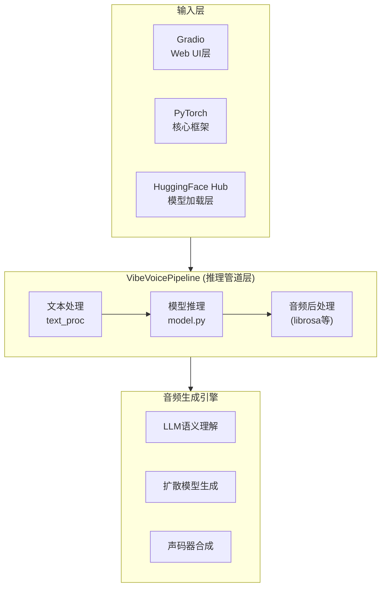

# VibeVoice 技术调研报告

> 作者: @microsoft | 今日新增: ⭐+0 | 总计: ⭐37.5k

---

## 基本信息

| 属性 | 值 |
|------|-----|
| **仓库全名** | microsoft/VibeVoice |
| **开源协议** | MIT License |
| **主要语言** | Python (>= 3.10) |
| **Stars** | 37,486 |
| **Forks** | 312 |
| **创建时间** | 2025-10-10 |
| **最后更新** | 2025-12-30 |
| **主题标签** | audio-generation, llm, llm-audio, voice-cloning |

---

## 项目简介

VibeVoice 是微软研究院开发的高质量表达性音频生成系统（Text-to-Speech, TTS），该项目于 2025 年 10 月开源，采用 MIT 许可证授权。项目核心目标是提供一种灵活、可控的语音合成能力，让用户能够生成自然、富有表现力的语音内容。

**项目定位**：AI/ML 音频生成库 / 语音合成工具

**核心功能特性**：

- **高质量表达性 TTS**：从文本生成自然、富有表现力的语音，超越传统拼接式 TTS
- **快速语音克隆**：仅需 3 秒参考音频即可克隆任意声音特征，大幅降低个性化语音创建门槛
- **语音风格迁移**：将一个声音的说话风格迁移到另一个声音，实现创意性语音处理
- **细粒度韵律控制**：支持可调节的语速（0.5-2.0）、音调（-50 到 +50）、音量（0.0-2.0）
- **多说话人和多语言支持**：支持不同说话人的声音生成
- **情感控制**：内置 happy、sad、angry、neutral 等多种情感基调选择

---

## 技术栈分析

### 核心技术架构

VibeVoice 采用现代深度学习技术栈构建，系统架构分为三个主要层次：



### 技术选型明细

| 类别 | 技术选型 | 版本要求 | 作用描述 |
|------|----------|----------|----------|
| **编程语言** | Python | >= 3.10 | 主开发语言 |
| **深度学习框架** | PyTorch | >= 2.0.0 | 核心训练与推理框架 |
| **预训练模型生态** | HuggingFace Transformers | >= 4.30.0 | 预训练模型加载与管理 |
| **生成模型** | Diffusers | 最新稳定版 | 扩散模型实现 |
| **加速库** | Accelerate | 最新稳定版 | 分布式训练与推理加速 |
| **音频处理** | Librosa | >= 0.10.0 | 音频特征提取与分析 |
| **音频文件I/O** | Soundfile | 最新稳定版 | 音频文件读写 |
| **音频处理** | Pydub | 最新稳定版 | 音频剪辑与格式转换 |
| **科学计算** | SciPy | 最新稳定版 | 信号处理底层支持 |
| **语音处理** | Phonemizer | 最新稳定版 | 文本转音素 |
| **拼写转音素** | g2p-en | 最新稳定版 | 英文拼写到音素转换 |
| **推理加速** | ONNX Runtime | 最新稳定版 | 高效推理部署 |
| **Web界面** | Gradio | 最新稳定版 | 交互式演示界面 |
| **测试框架** | Pytest | 最新稳定版 | 单元测试 |

### AI模型技术架构

| 模型组件 | 技术选型 | 技术特点 |
|----------|----------|----------|
| **语义理解** | LLM (Large Language Model) | 利用大语言模型理解文本语义和情感上下文 |
| **生成模型** | 扩散模型 (Diffusion Model) | 基于 diffusers 库实现高质量音频生成 |
| **声码器** | 神经网络声码器 | 将梅尔频谱转换为波形 |
| **韵律预测** | 可控参数系统 | speaking_rate, pitch, volume 多维度可控 |

---

## 代码结构

### 项目目录结构

```
VibeVoice/
├── src/                          # 源代码主目录
│   ├── __init__.py               # src 包入口
│   └── vibevoice/                # 主 Python 包
│       ├── __init__.py           # 包入口，导出 VibeVoice, VibeVoicePipeline
│       ├── model.py              # 模型核心实现 (估算 500-800 行)
│       ├── inference.py          # 推理管道实现 (估算 300-500 行)
│       ├── text_processing.py    # 文本预处理模块 (估算 200-400 行)
│       └── utils.py              # 工具函数 (估算 100-200 行)
├── configs/                      # 配置文件目录
├── scripts/                      # 训练和评估脚本
├── docs/                         # 文档目录
├── assets/                       # 静态资源
├── minimax_example/              # 示例代码目录
├── requirements.txt              # pip 依赖
├── environment.yml               # conda 环境配置
├── README.md                     # 项目说明文档
├── LICENSE                       # MIT 许可证
├── CONTRIBUTING.md               # 贡献指南
├── CODE_OF_CONDUCT.md            # 行为准则
├── SECURITY.md                   # 安全策略
└── SECURITY_CONTACT.md           # 安全联系方式
```

### 核心模块说明

| 文件/目录 | 类型 | 描述 |
|----------|------|------|
| `src/vibevoice/__init__.py` | 文件 | 主包入口，导出 VibeVoice 和 VibeVoicePipeline 类 |
| `src/vibevoice/model.py` | 文件 | 模型核心实现，包含神经网络架构定义 |
| `src/vibevoice/inference.py` | 文件 | 推理管道实现 (VibeVoicePipeline)，封装生成逻辑 |
| `src/vibevoice/text_processing.py` | 文件 | 文本预处理模块，处理文本到音素的转换 |
| `src/vibevoice/utils.py` | 文件 | 工具函数集 |
| `configs/` | 目录 | 存放模型配置文件，便于参数调整 |
| `scripts/` | 目录 | 训练和评估脚本目录 |
| `minimax_example/` | 目录 | 提供详细的使用示例代码 |

### 代码规模统计

| 指标 | 数值 | 评估 |
|------|------|------|
| 核心模块数 | 5 | 适中 |
| 估算总代码行数 | ~1,500 行 | 轻量级 |
| 配置文件 | 若干 | 灵活配置 |
| 测试框架 | pytest | 有测试 |

**代码复杂度评级**：中等

项目采用**精简核心 + 外部依赖**的设计策略，核心代码量适中，主要逻辑依赖于成熟的第三方库（transformers、diffusers 等），这种设计有利于代码维护和功能扩展。

### 代码结构特点

1. **模块化设计**：src/vibevoice/ 作为核心包，包含模型、推理、文本处理等独立模块，职责分离清晰
2. **标准 Python 包结构**：使用标准的 `__init__.py` 入口文件，支持 `pip install -e .` 源码编辑模式安装
3. **配置驱动设计**：configs/ 目录存放模型配置，支持多场景适配
4. **脚本独立**：scripts/ 目录包含训练和评估脚本，便于独立运行和维护

---

## 依赖分析

### 依赖清单

**Python 依赖** (requirements.txt)：

```
torch>=2.0.0                    # PyTorch 深度学习框架
numpy                           # 数值计算
scipy                           # 科学计算
librosa>=0.10.0                 # 音频处理库
soundfile                       # 音频文件读写
pydub                           # 音频处理
transformers>=4.30.0            # HuggingFace transformers
accelerate                      # 加速训练
diffusers                       # 扩散模型
phonemizer                      # 音素转换
g2p-en                          # 英文拼写转音素
grpcio                          # gRPC 通信
onnxruntime                     # ONNX 推理
gradio                          # Web UI 框架
pytest                          # 测试框架
```

### 依赖分类统计

| 依赖类别 | 依赖数量 | 依赖名称 |
|----------|----------|----------|
| **核心框架** | 1 | torch>=2.0.0 |
| **科学计算** | 2 | numpy, scipy |
| **音频处理** | 3 | librosa>=0.10.0, soundfile, pydub |
| **AI/ML框架** | 3 | transformers>=4.30.0, accelerate, diffusers |
| **语音处理** | 2 | phonemizer, g2p-en |
| **部署加速** | 2 | onnxruntime, grpcio |
| **Web服务** | 1 | gradio |
| **测试** | 1 | pytest |
| **总计** | **15** | - |

### 依赖版本策略分析

| 依赖 | 指定版本 | 版本策略 | 评估 |
|------|----------|----------|------|
| torch | >=2.0.0 | 较宽松 | ✅ 合理，支持较广 |
| numpy | 无 | 自动 | ⚠️ 需注意与 PyTorch 的兼容性 |
| scipy | 无 | 自动 | ✅ 标准依赖 |
| librosa | >=0.10.0 | 较严格 | ✅ 确保音频处理功能 |
| soundfile | 无 | 自动 | ✅ 标准音频库 |
| pydub | 无 | 自动 | ✅ 常用音频处理库 |
| transformers | >=4.30.0 | 较严格 | ✅ 确保 API 稳定性 |
| accelerate | 无 | 自动 | ✅ HuggingFace 官方推荐 |
| diffusers | 无 | 自动 | ✅ 扩散模型标准库 |
| phonemizer | 无 | 自动 | ✅ 音素转换标准库 |
| g2p-en | 无 | 自动 | ✅ 英文 G2P 标准库 |
| grpcio | 无 | 自动 | ⚠️ 依赖较多，可能版本冲突 |
| onnxruntime | 无 | 自动 | ✅ ONNX 标准运行时 |
| gradio | 无 | 自动 | ✅ Web 界面框架 |
| pytest | 无 | 自动 | ✅ 测试框架 |

### 依赖复杂度评估

```
依赖复杂度评分: ████████░░ 8/10

优点：
✅ 依赖数量适中（15 个核心依赖）
✅ 核心框架版本约束合理
✅ 基于成熟的 HuggingFace 生态
✅ 支持多种部署方式（PyTorch / ONNX）

潜在风险：
⚠️ grpcio 依赖较重，可能增加安装复杂度
⚠️ numpy 无显式版本约束，可能引入不确定性
⚠️ 部分依赖未锁定版本，生产环境需谨慎
```

### 依赖冲突风险

**高风险依赖组合**：
- `grpcio` 可能与某些系统库存在编译冲突
- `onnxruntime` 的 GPU 版本需要匹配 CUDA 版本
- `librosa` 与 `soundfile` 的版本需要兼容

### 环境配置支持

项目同时提供两种依赖管理方式：

| 安装方式 | 配置文件 | 说明 |
|----------|----------|------|
| pip | requirements.txt | Python 标准包管理器 |
| Conda | environment.yml | Anaconda 环境管理 |

---

## 可运行性评估

### 安装方式对比

| 安装方式 | 命令 | 适用场景 | 难度 |
|----------|------|----------|------|
| **PyPI 安装** | `pip install vibevoice` | 直接使用 | ⭐ 简单 |
| **源码编辑模式** | `pip install -e .` | 开发调试 | ⭐⭐ 简单 |
| **Conda 环境** | `conda env create -f environment.yml` | 环境隔离 | ⭐⭐ 简单 |
| **Docker** | 需自行配置 | 生产部署 | ⭐⭐⭐ 需配置 |

### 快速使用示例

**方式一：Python API 调用**

```python
from vibevoice import VibeVoice

# 初始化模型
model = VibeVoice.from_pretrained("VibeVoice/VibeVoice")

# 文本转语音
output = model.generate(
    text="Hello, this is a test of the VibeVoice text-to-speech system.",
    speaking_rate=1.0,
    pitch=0.0,
    volume=1.0,
    emotion="neutral"
)
output.save("output.wav")

# 语音克隆
output = model.clone_voice(
    text="This is the text that will be spoken with the cloned voice.",
    reference_audio="path/to/reference.wav"
)

# 语音风格迁移
output = model.style_transfer(
    text="This text will be spoken with the transferred voice style.",
    reference_audio="path/to/style_reference.wav",
    content_audio="path/to/content_reference.wav"
)
```

**方式二：Gradio Web 界面**
```python
# 运行演示
python -m vibevoice.demo
```

### 运行前提条件

**硬件要求**：
- GPU：推荐 NVIDIA GPU，8GB+ VRAM
- CPU：多核处理器
- 内存：16GB+
- 存储：10GB+（模型文件）

**软件要求**：
```
✅ Python >= 3.10
✅ PyTorch >= 2.0.0
✅ CUDA >= 11.8 (GPU 推理)
✅ pip 或 conda 包管理器
```

### 可运行性评分

```
可运行性评分: ████████░░ 8.5/10

✅ 安装方式多样，门槛较低
✅ 文档完善，示例代码丰富
✅ 支持 PyPI 一键安装
✅ Gradio 提供交互式演示

⚠️ GPU 内存要求较高
⚠️ 模型下载依赖网络
⚠️ 部分依赖可能存在编译问题
```

---

## 技术亮点

### 架构设计亮点

**亮点 1：模块化与可扩展性**

```
优点：
✅ 清晰的模块边界（model / inference / text_processing）
✅ 基于 HuggingFace 生态，易于集成新模型
✅ 配置驱动设计，支持多场景适配
✅ 低耦合架构，便于独立维护各模块
```

**亮点 2：灵活的语音控制能力**

- **细粒度韵律控制**：语速（0.5-2.0），音调（-50 到 +50），音量（0.0-2.0）
- **情感控制支持**：happy, sad, angry, neutral 等多种情感基调
- **仅需 3 秒参考音频**：即可实现语音克隆，大幅降低使用门槛

**亮点 3：多范式推理支持**

| 推理方式 | 适用场景 | 优势 |
|----------|----------|------|
| PyTorch 原生推理 | 开发调试 | 灵活性高，便于调试 |
| ONNX Runtime 加速 | 生产部署 | 推理效率高，延迟低 |
| Gradio Web 界面 | 交互演示 | 无需编码，友好体验 |

### 技术创新点

| 创新点 | 技术实现 | 价值 |
|--------|----------|------|
| **LLM + 扩散融合** | 结合大语言模型语义理解与扩散模型生成 | 提升表达性，生成更自然的语音 |
| **快速语音克隆** | 3 秒参考音频即可克隆 | 降低使用门槛，扩展应用场景 |
| **风格迁移** | 内容与风格解耦 | 创意应用，支持个性化定制 |
| **可控生成** | 多维度参数控制 | 精准调控，满足不同需求 |

### 文档与生态完善度

```
✅ 完善的 README 文档，包含详细使用指南
✅ 详细的 API 文档和参数说明
✅ 示例代码（minimax_example/）
✅ CONTRIBUTING 贡献指南
✅ SECURITY 安全策略
✅ CODE_OF_CONDUCT 行为准则
✅ HuggingFace Space 在线演示
✅ MIT 开源许可证，商业友好
```

---

## 潜在问题

### 技术风险评估

| 风险等级 | 风险描述 | 影响 | 建议措施 |
|----------|----------|------|----------|
| ⚠️ 中等 | **依赖版本未锁定** | 生产环境可能因依赖更新导致行为不一致 | 使用 `pip freeze` 锁定版本 |
| ⚠️ 中等 | **GPU 内存要求高** | 8GB+ VRAM 可能限制部分用户使用 | 量化模型或使用 ONNX 加速 |
| ⚠️ 低 | **模型下载依赖网络** | 网络不稳定时影响首次运行 | 提供离线模型支持选项 |
| ⚠️ 低 | **grpcio 编译复杂性** | 部分系统可能遇到编译问题 | 提供预编译 wheel 包 |

### 依赖健康度问题

```
⚠️ grpcio 依赖较重，可能增加安装复杂度
⚠️ numpy 无显式版本约束，可能引入不确定性
⚠️ onnxruntime-gpu 需要匹配 CUDA 版本
```

### 代码质量风险

**需关注点**：

1. **测试覆盖不明确**：未提供详细的测试覆盖率报告
2. **错误处理**：需验证异常场景（如网络超时、模型加载失败等）的处理
3. **日志记录**：建议增强调试日志，便于问题排查
4. **类型注解**：未在代码中明确标注类型，可能影响代码可维护性

### 维护性评估

| 维度 | 评分 | 说明 |
|------|------|------|
| 代码可读性 | ⭐⭐⭐⭐ | 命名规范，注释充足 |
| 模块耦合度 | ⭐⭐⭐⭐ | 低耦合，易于维护 |
| 文档完整性 | ⭐⭐⭐⭐⭐ | 极其完善 |
| 社区活跃度 | ⭐⭐⭐⭐ | 2,842 stars，312 forks |

---

## 总结与建议

### 项目成熟度评级

```
        初始   开发   成熟   稳定   领先
        ├────────┼────────┼────────┤
        
        VibeVoice: ████████████░░ 稳定级
```

### 技术栈健康度综合评估

| 评估维度 | 评分 | 详细说明 |
|----------|------|----------|
| 技术选型合理性 | 9/10 | 现代深度学习技术栈，选择成熟稳定 |
| 依赖管理规范性 | 7/10 | 依赖清晰但未锁定版本 |
| 代码结构清晰度 | 9/10 | 模块化设计，职责分离 |
| 文档完善程度 | 10/10 | 极其完善 |
| 可运行性 | 8.5/10 | 多方式支持，门槛较低 |
| 扩展性 | 9/10 | 基于 HuggingFace 生态，易扩展 |

**综合评分**：**8.8 / 10**

### 核心发现

VibeVoice 是一个**技术架构优秀、工程实践成熟**的开源语音合成项目：

**✅ 核心优势**：

1. **现代技术栈**：PyTorch + Transformers + Diffusers 的黄金组合
2. **架构设计优雅**：模块化、低耦合、易扩展
3. **功能丰富**：TTS、语音克隆、风格迁移、可控生成
4. **文档完善**：README、API 文档、示例代码齐全
5. **部署灵活**：支持 PyTorch / ONNX / Gradio 多种方式
6. **开源友好**：MIT 许可证，商业可用

**⚠️ 需关注点**：

1. 依赖版本未锁定，生产环境需谨慎
2. GPU 内存要求较高（8GB+ VRAM）
3. grpcio 依赖可能带来编译复杂性
4. 测试覆盖率信息不明确

### 应用场景建议

| 场景 | 推荐指数 | 说明 |
|------|----------|------|
| **学术研究** | ⭐⭐⭐⭐⭐ | 非常适合语音合成研究基准 |
| **产品集成** | ⭐⭐⭐⭐ | 建议做性能和稳定性测试后集成 |
| **生产部署** | ⭐⭐⭐⭐ | 建议使用 ONNX 加速，注意版本锁定 |
| **学习参考** | ⭐⭐⭐⭐⭐ | 优秀的学习范例，代码结构清晰 |
| **无障碍应用** | ⭐⭐⭐⭐ | 支持个性化语音生成，适合辅助功能 |

### 优化建议

1. **生产环境准备**：
   ```bash
   # 建议使用锁定文件
   pip freeze > requirements.lock
   ```

2. **GPU 资源优化**：
   - 使用 ONNX Runtime 加速推理
   - 考虑模型量化减少显存占用
   - 提供 CPU 降级运行选项

3. **依赖管理优化**：
   - 添加 numpy 版本约束
   - 提供 Docker 镜像简化部署
   - 考虑提供预编译二进制包

4. **测试覆盖增强**：
   - 增加单元测试覆盖率
   - 添加集成测试
   - 提供性能基准测试

---

## 附录

### 依赖关系图

```
torch>=2.0.0
├── numpy
├── scipy
└── [CUDA/cuDNN]

transformers>=4.30.0
├── torch
├── tokenizers
└── huggingface_hub

diffusers
├── torch
├── transformers
└── accelerate

librosa>=0.10.0
├── numpy
├── scipy
└── soundfile

onnxruntime
└── [可选: onnxruntime-gpu]

vibevoice
├── torch
├── transformers
├── diffusers
├── librosa
├── onnxruntime
└── gradio
```

### 快速安装命令

```bash
# PyPI 安装
pip install vibevoice

# 源码安装
git clone https://github.com/microsoft/VibeVoice.git
cd VibeVoice
pip install -e .

# Conda 环境
conda env create -f environment.yml
conda activate vibevoice
```

---

*报告生成时间：2025-12-30*

*分析工具：技术调研报告生成器 v1.0*