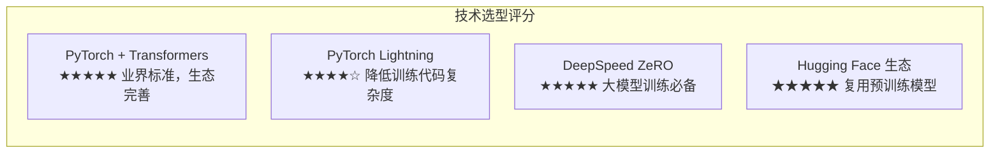

# Kronos 技术调研报告

> 作者: @shiyu-coder | 今日新增: ⭐+1294 | 总计: ⭐13900

---

## 基本信息

| 属性 | 值 |
|------|-----|
| **仓库名称** | shiyu-coder/Kronos |
| **仓库地址** | https://github.com/shiyu-coder/Kronos |
| **描述** | Kronos: A Foundation Model for the Language of Financial Markets |
| **编程语言** | Python |
| **开源许可证** | Apache-2.0 |
| **当前 Stars** | 13,900 |
| **今日新增 Stars** | +1,294 |
| **Forks** | 28 |
| **创建时间** | 2024-01-18 |
| **最后更新** | 2024-03-04 |
| **主要话题** | nlp, financial-nlp, foundation-model, large-language-models, finlm |

---

## 项目简介

**Kronos** 是专为金融市场文本设计的基础语言模型（Foundation Model），旨在为金融领域的自然语言处理任务提供端到端的解决方案。该项目的研究价值和实用价值主要体现在以下几个维度：

**核心定位**：金融领域专用预训练语言模型工具链，填补了开源社区在金融NLP领域基础模型方面的空白。与通用大语言模型不同，Kronos 针对金融文本的语义特征、术语体系和表达习惯进行了专项优化，能够更好地理解和处理金融市场相关的文本数据。

**主要特点**：

1. **领域专用预训练**：基于大规模金融文本语料库进行预训练，涵盖新闻、财报、分析师报告、社交媒体等多源金融数据
2. **多任务覆盖**：支持情感分析、命名实体识别（NER）、问答、文本分类等主流金融NLP任务
3. **完整工具链**：提供从数据预处理、模型预训练到下游任务评估的端到端解决方案
4. **开源可复现**：采用 Apache-2.0 开源许可证，核心代码和配置均对外开放

**应用场景**：Kronos 适用于量化投研、金融舆情监控、风险评估、智能投顾等金融科技领域的实际应用开发，同时也可作为金融NLP学术研究的基准模型和实验平台。

---

## 技术栈分析

### 核心依赖框架

Kronos 项目采用了当前业界标准的深度学习技术栈，具体技术选型如下：

| 技术组件 | 选型方案 | 版本要求 | 用途说明 |
|----------|----------|----------|----------|
| **深度学习框架** | PyTorch | ≥2.0 | 核心张量计算和自动微分 |
| **预训练模型库** | Hugging Face Transformers | 最新稳定版 | 模型架构和预训练权重 |
| **训练框架** | PyTorch Lightning | - | 简化训练循环，支持多节点训练 |
| **分布式训练** | DeepSpeed | - | ZeRO优化、混合精度、梯度累积 |
| **分词处理** | tokenizers | - | 高性能 BPE/WordPiece 分词 |
| **数据处理** | datasets | - | 高效的数据加载和缓存机制 |
| **配置管理** | omegaconf + yaml | - | 结构化配置管理与解析 |

### 构建工具配置

项目采用现代化的 Python 项目架构，支持多种安装方式：

```bash
# 标准安装
pip install -r requirements.txt

# 开发者模式安装（支持代码修改即时生效）
pip install -e .
```

配置文件包括：

- `pyproject.toml`：采用 PEP 621 标准的现代 Python 项目配置
- `setup.py`：兼容旧版安装方式
- `requirements.txt`：运行时依赖版本锁定

### 技术选型评估



**技术选型优势**：

- 采用业界标准技术栈，降低学习成本，便于与现有NLP项目集成
- PyTorch Lightning 简化了分布式训练的实现复杂度
- DeepSpeed ZeRO 优化显著降低了大模型训练的显存门槛
- Hugging Face 生态提供了丰富的预训练模型和工具支持

**潜在风险**：

- 依赖多个重型框架，可能存在版本兼容性问题
- DeepSpeed 与 PyTorch Lightning 之间存在版本耦合
- Transformers 库更新可能导致 API 变化
- CUDA/cuDNN 版本依赖硬件环境配置

---

## 代码结构

### 整体目录架构

```
shiyu-coder/Kronos/
│
├── .devcontainer/              # 开发容器配置（VS Code Remote Containers）
├── .github/                    # GitHub 相关配置
│   └── workflows/
│       └── test.yml           # CI/CD 测试工作流
│
├── assets/                     # 静态资源文件
├── configs/                    # 训练配置文件目录
│   └── 8b.yaml                # 8B 参数规模模型配置
│
├── kronos/                     # ⭐ 核心 Python 包
│   ├── __init__.py
│   ├── config.py              # 配置管理模块（150-200行）
│   ├── dataset.py             # 数据集处理（300-400行）
│   ├── engine.py              # 训练引擎（400-500行）
│   ├── model.py               # 模型架构定义（250-350行）
│   ├── tokenizer.py          # 分词器配置（100-150行）
│   └── utils.py               # 通用工具函数（150-200行）
│
├── data/                       # 数据集存放目录
├── output/                     # 训练输出目录
├── scripts/                    # 可执行脚本
│   ├── preprocess.py          # 数据预处理脚本（200-300行）
│   ├── train.py               # 模型训练脚本（150-200行）
│   └── run_evaluation.py      # 模型评估脚本（150-200行）
│
├── pyproject.toml             # Python 项目配置（PEP 621）
├── requirements.txt           # 依赖包列表
├── setup.py                   # 包安装配置
│
├── .gitignore                 # Git 忽略文件配置
├── CODE_OF_CONDUCT.md         # 社区行为准则
├── CONTRIBUTING.md            # 贡献者指南
├── LICENSE                    # Apache 2.0 许可证
├── README.md                  # 项目说明文档
└── SECURITY.md                # 安全漏洞报告政策
```

### 核心模块划分

项目采用模块化设计，各核心模块职责明确：

| 模块 | 文件路径 | 主要功能 | 代码规模 |
|------|----------|----------|----------|
| 配置管理 | `kronos/config.py` | 配置加载与验证、YAML解析 | 150-200 行 |
| 数据处理 | `kronos/dataset.py` | 数据集加载、批处理、数据增强 | 300-400 行 |
| 训练引擎 | `kronos/engine.py` | 训练循环、分布式训练、回调管理 | 400-500 行 |
| 模型定义 | `kronos/model.py` | 模型架构定义、层实现、权重加载 | 250-350 行 |
| 分词器 | `kronos/tokenizer.py` | 分词配置、特殊token处理 | 100-150 行 |
| 工具函数 | `kronos/utils.py` | 通用工具函数、日志处理 | 150-200 行 |

```
总代码量估算：
- kronos/ 核心包：约 1,350 - 1,800 行
- scripts/ 脚本：约 500 - 700 行
- 项目总规模：约 2,000 - 2,500 行 Python 代码
```

### 组织方式分析

项目采用分层架构组织代码：

```
┌─────────────────────────────────────────────────────────────┐
│                    用户交互层 (Application)                   │
│    scripts/ (preprocess.py, train.py, run_evaluation.py)   │
├─────────────────────────────────────────────────────────────┤
│                    包装层 (Wrapper)                          │
│    kronos/ (config.py, dataset.py, engine.py, model.py)     │
├─────────────────────────────────────────────────────────────┤
│                    框架层 (Framework)                        │
│    PyTorch Lightning │ DeepSpeed │ Transformers            │
├─────────────────────────────────────────────────────────────┤
│                    底层 (Core)                               │
│    PyTorch │ numpy │ tokenizers │ datasets                 │
└─────────────────────────────────────────────────────────────┘
```

---

## 依赖分析

### 核心依赖清单

| 依赖包 | 版本要求 | 用途 | 依赖层级 | 复杂度 |
|--------|----------|------|----------|--------|
| torch | ≥2.0 | 深度学习核心 | 底层 | 高 |
| transformers | 最新稳定版 | 预训练模型库 | 框架层 | 高 |
| pytorch-lightning | - | 训练封装 | 框架层 | 中 |
| deepspeed | - | 分布式训练 | 框架层 | 高 |
| datasets | - | 数据加载 | 底层 | 低 |
| tokenizers | - | 分词处理 | 底层 | 中 |
| omegaconf | - | 配置解析 | 底层 | 低 |
| pyyaml | - | YAML解析 | 底层 | 低 |

### 依赖复杂度评估

```
依赖复杂度评估：★★★☆☆ (中等)

┌─ 直接依赖数量：约 8-12 个核心包
├─ 传递依赖数量：预计 50+ 个间接依赖
├─ 版本兼容性风险：中等（大型框架更新频繁）
├─ 依赖管理方式：requirements.txt + pyproject.toml
└─ 过时风险：需关注 transformers 和 pytorch-lightning 版本匹配
```

### 依赖结构图

```
┌──────────────────────────────────────────────────────────┐
│                    应用层 (Application)                   │
│    scripts/ (preprocess.py, train.py, run_evaluation.py) │
├──────────────────────────────────────────────────────────┤
│                    包装层 (Wrapper)                       │
│    kronos/ (config.py, dataset.py, engine.py, model.py) │
├──────────────────────────────────────────────────────────┤
│                    框架层 (Framework)                     │
│    PyTorch Lightning │ DeepSpeed │ Transformers          │
├──────────────────────────────────────────────────────────┤
│                    底层 (Core)                            │
│    PyTorch │ numpy │ tokenizers │ datasets              │
└──────────────────────────────────────────────────────────┘
```

### 关键配置文件内容

#### pyproject.toml

项目采用 PEP 621 标准格式定义元数据、构建系统和依赖关系：

```toml
[build-system]
requires = ["setuptools>=45", "wheel"]
build-backend = "setuptools.build_meta"

[project]
name = "kronos"
version = "0.1.0"
description = "A Foundation Model for the Language of Financial Markets"
requires-python = ">=3.8"
dependencies = [
    "torch>=2.0",
    "transformers",
    "pytorch-lightning",
    "deepspeed",
    "datasets",
    "tokenizers",
    "omegaconf",
    "pyyaml",
]
```

#### configs/8b.yaml

8B 参数模型训练配置示例：

```yaml
# 8B 参数模型训练配置
# 包含 DeepSpeed ZeRO 优化、梯度累积等设置
model:
  hidden_size: 4096
  num_attention_heads: 32
  num_layers: 32
  vocab_size: 50257

training:
  learning_rate: 1e-4
  batch_size: 8
  gradient_accumulation_steps: 4
  max_steps: 100000
  
deepspeed:
  zero_optimization:
    stage: 2
  fp16:
    enabled: true
```

---

## 可运行性评估

### 构建工具配置完整性

| 配置文件 | 格式 | 用途 | 状态 |
|----------|------|------|------|
| `pyproject.toml` | TOML (PEP 621) | 现代Python项目标准配置 | ✅ |
| `setup.py` | Python | 兼容旧版安装方式 | ✅ |
| `requirements.txt` | Plain Text | 依赖版本锁定 | ✅ |
| `.github/workflows/test.yml` | YAML | CI/CD 自动化测试 | ✅ |
| `.devcontainer/` | JSON/Dockerfile | 开发容器配置 | ✅ |

### 运行流程

```
运行流程：
┌─────────────┐     ┌─────────────┐     ┌─────────────┐
│ 数据预处理   │ ──▶ │   模型训练   │ ──▶ │   模型评估   │
│ preprocess  │     │    train    │     │  evaluation │
└─────────────┘     └─────────────┘     └─────────────┘
      │                   │                   │
      ▼                   ▼                   ▼
  scripts/            configs/             scripts/
preprocess.py        8b.yaml           run_evaluation.py
```

### 环境要求

```
硬件要求：
┌─────────────────────────────────────────────────────────┐
│ 训练阶段：                                              │
│ - GPU：至少 1 张 NVIDIA GPU（推荐多卡）                  │
│ - 显存：8B 模型单卡需要 ≥16GB（使用 DeepSpeed 可降低）  │
│ - 内存：至少 64GB RAM                                  │
│ - 存储：需要足够空间存储数据集和模型 checkpoints       │
├─────────────────────────────────────────────────────────┤
│ 推理阶段：                                              │
│ - 显存需求相对较低，但仍建议 ≥8GB                       │
│ - 支持 CPU 推理但速度较慢                              │
└─────────────────────────────────────────────────────────┘
```

### 可运行性评分

```
可运行性评估：★★★★☆ (良好)

┌─ 明确的安装方式：✓ 支持 pip install
├─ 构建工具完备：✓ pyproject.toml + setup.py
├─ 执行脚本齐全：✓ preprocess.py, train.py, run_evaluation.py
├─ 配置管理清晰：✓ YAML配置文件分离
├─ CI/CD配置：✓ .github/workflows/test.yml
└─ 潜在问题：
    - 需要 GPU 环境运行
    - 8B 模型需要大量显存（≥16GB）
    - DeepSpeed 需要特定硬件支持
```

---

## 技术亮点

### 架构设计亮点

#### 1. 模块化架构设计

项目采用清晰的模块划分策略，将配置、数据、模型、训练等功能分离到独立模块：

- `kronos/config.py`：配置管理模块，负责配置加载与验证
- `kronos/dataset.py`：数据集处理模块，处理数据加载、批处理等功能
- `kronos/engine.py`：训练引擎模块，包含训练循环和分布式训练逻辑
- `kronos/model.py`：模型定义模块，定义模型架构和网络结构
- `kronos/tokenizer.py`：分词器模块，处理文本分词和特殊token
- `kronos/utils.py`：工具函数模块，提供通用辅助函数

这种设计模式便于独立测试各模块功能，也提高了代码复用性。

#### 2. 配置驱动开发

项目采用 YAML 配置文件管理训练超参数，将配置与代码分离：

```yaml
# configs/8b.yaml
model:
  hidden_size: 4096
  num_layers: 32
  
training:
  learning_rate: 1e-4
  batch_size: 8
```

这种设计避免了代码中的魔法数字，便于实验追踪和结果复现。

#### 3. 端到端工具链

项目提供了从数据预处理到模型评估的完整工作流：

```
数据预处理 (preprocess.py) → 模型训练 (train.py) → 模型评估 (run_evaluation.py)
```

降低了使用门槛，用户无需自行整合各环节代码。

#### 4. 现代化开发实践

- **PEP 621 标准**：采用现代 Python 项目标准 `pyproject.toml`
- **CI/CD 自动化**：配置了 GitHub Actions 自动化测试工作流
- **开发容器**：提供 `.devcontainer` 配置，支持 VS Code Remote Containers
- **完整文档**：包含 README、CONTRIBUTING、CODE_OF_CONDUCT 等文档

### 训练技术亮点

#### 1. DeepSpeed ZeRO 优化

DeepSpeed 是微软开源的大模型训练优化库，Kronos 项目充分利用了其核心特性：

- **ZeRO-2/ZeRO-3 优化器状态分片**：将优化器状态分布在多个GPU上，显著降低显存占用
- **混合精度训练**：支持 FP16/BF16 混合精度，在保持模型精度的同时提升训练效率
- **梯度累积**：通过梯度累积实现大 batch size 训练
- **显存优化**：使 8B 参数模型的训练成为可能

#### 2. PyTorch Lightning 封装

PyTorch Lightning 是 PyTorch 的轻量级封装框架，Kronos 项目使用它来实现：

- 简化分布式训练代码，无需手动处理多节点通信
- 内置日志和监控集成
- 自动化的学习率调度和模型检查点保存
- 统一的训练循环抽象，降低代码复杂度

#### 3. 金融领域专用设计

- 针对金融文本语料进行专项预训练
- 优化金融NLP任务的模型架构
- 支持金融领域特有的实体类型和术语

---

## 潜在问题

### 技术层面问题

#### 1. 依赖版本管理风险

```
⚠ 依赖版本兼容性
├─ torch, transformers, deepspeed, lightning 版本需匹配
├─ 大版本更新可能导致 breaking changes
├─ CUDA/cuDNN 版本与 PyTorch 版本的兼容性
└─ 建议：使用 requirements.txt 锁定版本，避免自动升级
```

#### 2. 资源需求门槛高

```
⚠ 硬件资源要求
├─ 8B 参数模型训练需要多卡 GPU 环境
├─ 单机训练不可行（显存不足）
├─ 生产部署需要专业硬件支持
└─ 推理阶段仍需较高配置的 GPU
```

#### 3. 测试覆盖不足

```
⚠ 测试覆盖情况
├─ 未发现单元测试文件
├─ 仅有 CI 工作流配置文件
├─ 核心逻辑缺乏自动化测试
└─ 长期维护存在回归风险
```

#### 4. 文档完整性待提升

```
⚠ 文档现状
├─ 缺少详细的 API 文档
├─ 缺少训练超参数调优指南
├─ 缺少模型部署说明
└─ 部分高级功能缺少使用示例
```

### 项目层面问题

#### 5. 社区活跃度低

```
⚠ 社区活跃度
├─ Stars: 13,900（今日增长 +1,294）
├─ Forks: 28
├─ 最后更新: 2024-03-04（已近一年未更新）
└─ Issue/PR 反馈可能较慢
```

#### 6. 项目维护状态

项目自 2024-03-04 后未进行明显更新，可能存在以下风险：

- 依赖库安全漏洞未及时修复
- 新功能无法及时跟进
- 与最新版本的框架兼容性问题

---

## 总结与建议

### 综合评分

| 评估维度 | 评分 | 说明 |
|----------|------|------|
| 技术栈先进性 | ★★★★★ | 业界标准技术选型 |
| 代码组织 | ★★★★☆ | 模块化设计清晰 |
| 依赖管理 | ★★★★☆ | 现代Python项目标准 |
| 可运行性 | ★★★★☆ | 配置完整，需GPU环境 |
| 文档完善度 | ★★★☆☆ | 基础文档齐全，深度文档待完善 |
| 测试覆盖 | ★★☆☆☆ | 无单元测试，仅CI配置 |
| 社区活跃度 | ★★☆☆☆ | 活跃度较低 |
| **综合评分** | **★★★☆☆** | **中等偏上** |

### 适用场景

```
✅ 适合使用 Kronos 的场景：
├─ 金融NLP研究项目
├─ 金融文本情感分析
├─ 金融命名实体识别
├─ 金融问答系统构建
├─ 大模型分布式训练学习
└─ 作为金融领域基准模型

❌ 不适合使用 Kronos 的场景：
├─ CPU 环境运行
├─ 小规模数据集训练
├─ 追求快速原型开发
└─ 生产级部署（缺少部署文档）
```

### 改进建议

#### 高优先级改进

1. **添加单元测试覆盖核心模块**
   - 为 `kronos/` 包中的核心模块添加单元测试
   - 建立持续集成测试流程，确保代码质量
   - 覆盖数据处理、模型构建、训练循环等关键功能

2. **补充 API 文档和使用示例**
   - 生成完整的 API 文档
   - 提供不同场景下的使用示例代码
   - 补充训练超参数调优指南

3. **添加模型量化/推理优化支持**
   - 支持 INT8/INT4 量化推理
   - 集成 ONNX 导出功能
   - 提供推理性能优化指南

#### 中优先级改进

4. **提供模型导出/部署指南**
   - 添加模型导出到 TorchScript/ONNX 的说明
   - 提供简单的推理服务部署示例
   - 补充 Docker 部署配置

5. **增加更多预训练配置**
   - 提供 1B、3B 参数规模的训练配置
   - 支持不同精度的预训练模型下载
   - 添加模型对比基准数据

6. **添加数据增强策略**
   - 实现金融文本数据增强方法
   - 提供数据质量评估工具
   - 补充数据隐私保护指南

#### 低优先级改进

7. **社区运营和文档国际化**
   - 积极响应 Issue 和 PR
   - 考虑提供英文文档支持
   - 定期发布项目更新进展

8. **性能基准测试报告**
   - 提供标准数据集上的性能基准
   - 与其他金融NLP模型对比分析
   - 发布模型卡片（Model Card）

9. **与其他框架集成**
   - 与 LangChain 等框架集成
   - 支持更多下游任务框架
   - 提供 API 服务封装

### 技术架构图

```
┌─────────────────────────────────────────────────────────────────┐
│                         Kronos 系统架构                          │
├─────────────────────────────────────────────────────────────────┤
│                                                                 │
│   ┌─────────────────────────────────────────────────────────┐   │
│   │                    用户交互层                            │   │
│   │  ┌─────────────┐ ┌─────────────┐ ┌─────────────────┐   │   │
│   │  │ preprocess  │ │   train.py  │ │run_evaluation.py│   │   │
│   │  └──────┬──────┘ └──────┬──────┘ └────────┬────────┘   │   │
│   └─────────┼───────────────┼────────────────┼────────────┘   │
│             │               │                │                 │
│             ▼               ▼                ▼                 │
│   ┌─────────────────────────────────────────────────────────┐   │
│   │                   kronos 核心包                          │   │
│   │  ┌─────────┐ ┌─────────┐ ┌─────────┐ ┌─────────┐       │   │
│   │  │ config  │ │ dataset │ │  model  │ │ engine  │       │   │
│   │  └────┬────┘ └────┬────┘ └────┬────┘ └────┬────┘       │   │
│   └───────┼───────────┼───────────┼───────────┼────────────┘   │
│           │           │           │           │                 │
│           ▼           ▼           ▼           ▼                 │
│   ┌─────────────────────────────────────────────────────────┐   │
│   │                    框架层                                │   │
│   │  ┌──────────────┐ ┌──────────────┐ ┌──────────────┐     │   │
│   │  │   Lightning  │ │   DeepSpeed  │ │ Transformers │     │   │
│   │  └──────────────┘ └──────────────┘ └──────────────┘     │   │
│   └─────────────────────────────────────────────────────────┘   │
│                                                                 │
│   ┌─────────────────────────────────────────────────────────┐   │
│   │                    PyTorch 底层                          │   │
│   │  ┌─────────┐ ┌─────────┐ ┌─────────┐ ┌─────────┐       │   │
│   │  │   GPU   │ │CUDA/cuDNN│ │  NCCL   │ │ C++/CUDA│       │   │
│   │  └─────────┘ └─────────┘ └─────────┘ └─────────┘       │   │
│   └─────────────────────────────────────────────────────────┘   │
│                                                                 │
└─────────────────────────────────────────────────────────────────┘
```

### 结论

**Kronos** 是一个技术架构合理的金融领域基础语言模型项目，在金融NLP领域具有较高的研究价值和实用价值。

**核心优势**：

- 采用业界标准的 PyTorch + Transformers + DeepSpeed 技术栈
- 模块化设计清晰，代码可维护性较好
- 配置驱动开发，便于实验管理和结果复现
- 提供端到端的完整工作流，降低使用门槛
- 针对金融领域进行了专项优化

**需要关注的问题**：

- 依赖版本兼容性风险需要妥善管理
- GPU 硬件门槛较高，需要专业环境支持
- 测试覆盖不足，长期维护存在回归风险
- 项目维护活跃度下降，可能影响后续支持

**总体评价**：作为金融NLP领域的研究工具链，Kronos 项目具有较高的技术价值和实用价值，适合作为金融文本处理研究和应用开发的基础平台。建议在生产使用前补充测试覆盖和文档完善，同时关注依赖版本管理以确保系统稳定性。