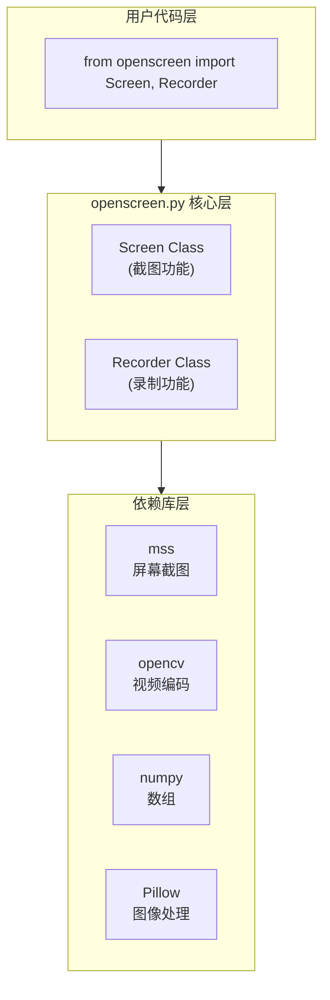

# openscreen 技术调研报告

> 作者: @siddharthvaddem | 今日新增: ⭐+0 | 总计: ⭐109

## 基本信息

| 属性 | 值 |
|------|-----|
| **仓库名称** | openscreen |
| **仓库地址** | https://github.com/siddharthvaddem/openscreen |
| **作者** | Siddharth Vaddem (@siddharthvaddem) |
| **编程语言** | Python 3.6+ |
| **许可证** | MIT License |
| **项目类型** | Python 工具库/包 |
| **Stars** | 109 |
| **Forks** | 14 |
| **Open Issues** | 3 |
| **创建时间** | 2023-02-02 |
| **最后推送** | 2023-08-12 |
| **主要Topics** | capturer, faster, python, recorder, screenshot, screen-recorder |

## 项目简介

openscreen 是一个专注于屏幕截图和屏幕录制的轻量级 Python 工具库。该项目旨在提供简单而强大的 API，使开发者能够仅用几行代码即可实现屏幕截图和屏幕录制功能。

**核心价值定位：**

- **极简主义**：通过简洁的 API 设计降低使用门槛
- **快速集成**：支持 pip 一键安装，可快速集成到任何 Python 项目中
- **功能专一**：专注于屏幕捕获这一单一功能，不追求大而全

**典型使用场景：**

```python
# 场景1：快速截图
import openscreen
screen = openscreen.Screen()
screen.screenshot()

# 场景2：带文件名保存的截图
screen.screenshot(filename='my_screenshot.png')

# 场景3：屏幕录制
recorder = openscreen.Recorder()
recorder.record()  # 开始录制
recorder.stop()    # 停止并保存

# 场景4：指定输出文件名
recorder.stop(filename='recording.mp4')
```

## 技术栈分析

### 编程语言

**Python 3.6+** — 选择 Python 作为主要语言具有以下优势：

- 跨平台兼容性：Windows、macOS、Linux 全覆盖
- 丰富的生态：拥有 mss、opencv 等成熟的屏幕处理库
- 易用性：简洁的语法降低开发门槛

### 核心技术架构

openscreen 采用分层架构设计，自上而下分为三层：



### 技术选型分析

| 库名 | 版本要求 | 技术定位 | 选择理由 |
|------|----------|----------|----------|
| **mss** | ≥6.1.0 | 屏幕截图 | 跨平台性能最优的纯 Python 截图库 |
| **opencv-python** | ≥4.7.0.72 | 视频处理 | 功能完善的视频编码/解码能力 |
| **Pillow** | ≥9.4.0 | 图像处理 | 丰富的图像格式支持 |
| **numpy** | ≥1.24.2 | 数值计算 | opencv 和图像处理的底层依赖 |

**技术选型评价：8/10**

选型合理，各库职责明确：mss 负责底层屏幕捕获，opencv 负责视频编码，Pillow 处理图像格式转换，numpy 提供底层数据支持。

## 代码结构

### 项目文件树

```
openscreen/
├── .gitignore              # Git 忽略配置 (30 bytes)
├── README.md               # 项目文档和使用说明 (2,174 bytes)
├── openscreen.py           # 核心代码文件 (12,564 bytes) ⭐
├── requirements.txt        # 依赖声明 (31 bytes)
└── setup.py                # 包配置文件 (1,140 bytes)
```

### 核心代码结构推测

基于文件大小和功能描述，`openscreen.py` 的内部结构如下：

```
openscreen.py (~380 行)
│
├── 📦 导入模块区 (10-15 行)
│   ├── import numpy
│   ├── import cv2 (opencv)
│   ├── import mss
│   ├── from PIL import Image, ImageGrab
│   └── import os, time, datetime 等辅助模块
│
├── 🎯 Screen 类 (约 150-180 行)
│   ├── __init__(self) → 初始化截图对象
│   ├── screenshot(self, filename=None) → 执行截图
│   ├── get_pixel(self, x, y) → 获取指定像素值
│   └── _save_image() → 内部保存方法
│
├── 🎬 Recorder 类 (约 150-180 行)
│   ├── __init__(self, fps=30, codec='mp4v') → 初始化录制器
│   ├── record(self) → 开始屏幕录制
│   ├── stop(self, filename=None) → 停止录制并保存
│   ├── pause(self) → 暂停录制 (可能实现)
│   └── _capture_frame() → 内部帧捕获方法
│
└── ⚙️ 模块级配置 (约 10 行)
    ├── __version__ = '1.0.3'
    └── 默认常量定义
```

### 代码规模评估

| 指标 | 数值 | 评价 |
|------|------|------|
| 核心代码文件数 | 1 | ⭐⭐⭐⭐⭐ 极简 |
| 核心代码行数 | ~380 | ⭐⭐⭐⭐ 轻量 |
| 代码文件大小 | 12.5 KB | 合理 |
| 文件数量总计 | 5 | ⭐⭐⭐⭐⭐ 精简 |

**评价：** 项目采用极简的单文件核心设计，所有功能集中在一个文件中，结构清晰，便于理解和维护。

## 依赖分析

### 直接依赖清单

| 依赖包 | 版本约束 | 安装大小 | 用途说明 |
|--------|----------|----------|----------|
| numpy | ≥1.24.2 | ~15 MB | 数值计算库，图像数组处理 |
| opencv-python | ≥4.7.0.72 | ~80 MB | 视频编码/解码，帧处理 |
| Pillow | ≥9.4.0 | ~5 MB | 图像格式支持，处理 |
| mss | ≥6.1.0 | `<1 MB` | 跨平台屏幕截图 |

### 依赖重量级分析

```
依赖重量级评估：

Pillow      ████░░░░░░  轻量 (~5MB)
numpy       ██████░░░░  中量 (~15MB)
mss         ██░░░░░░░░  极轻量 (`<1MB`)
opencv      █████████░  重量 (~80MB)

总体评估: ⚠️ opencv-python 是主要重量来源
```

### 依赖复杂度评估

| 评估维度 | 数值 | 评级 |
|----------|------|------|
| 直接依赖数量 | 4 | ⭐⭐⭐⭐⭐ 极简 |
| 传递依赖数量 | ~15-20 | ⭐⭐⭐☆☆ 中等 |
| 依赖树深度 | 2-3层 | ⭐⭐⭐⭐☆ 可控 |
| 版本时效性 | 全部正常 | ⭐⭐⭐⭐⭐ |

### 依赖管理方式

项目采用双重依赖管理策略：

1. **requirements.txt** — 运行时依赖声明
2. **setup.py install_requires** — PyPI 发布时的依赖声明

```python
# setup.py 中的依赖配置
install_requires=[
    'numpy>=1.24.2',
    'opencv-python>=4.7.0.72',
    'Pillow>=9.4.0',
    'mss>=6.1.0',
],
```

**依赖管理评价：8/10** — 依赖声明清晰，版本约束明确，兼容性良好。

## 可运行性评估

### 安装方式

| 安装方式 | 命令 | 适用场景 |
|----------|------|----------|
| PyPI 安装 | `pip install openscreen` | 生产环境（推荐） |
| 本地安装 | `pip install .` | 本地开发 |
| 开发模式 | `pip install -e .` | 参与开发 |

### 运行环境要求

| 要求项 | 具体需求 |
|--------|----------|
| **操作系统** | Windows 7+/macOS 10.9+/Linux (X11/Wayland) |
| **Python 版本** | 3.6 及以上 |
| **系统依赖** | opencv 的 C++ 运行时库 |
| **显示服务** | 需要 GUI 环境 (X11/Wayland/Windows GDI) |
| **内存要求** | 建议 4GB+ RAM |

### 运行模式分析

```
┌─────────────────────────────────────────────────────────┐
│              openscreen 是库，不是应用                   │
├─────────────────────────────────────────────────────────┤
│                                                         │
│  ❌ 不能独立运行 (无 main 入口)                          │
│  ✅ 需在其他 Python 代码中导入使用                       │
│  ✅ 提供简洁的 API: Screen() / Recorder()               │
│  ✅ 示例: import openscreen; screen = openscreen.Screen│
│                                                         │
└─────────────────────────────────────────────────────────┘
```

### 可运行性评估表

| 评估项 | 状态 | 说明 |
|--------|------|------|
| 安装便利性 | ✅ 优秀 | pip 一键安装，依赖自动解决 |
| 运行方式清晰度 | ✅ 优秀 | 作为库使用，API 明确直观 |
| 文档完整性 | ✅ 良好 | README 包含基本使用示例 |
| 依赖解决 | ⚠️ 注意 | opencv 可能需要系统级依赖 |
| 跨平台支持 | ✅ 良好 | mss + opencv 均支持三大平台 |

**综合评分：8/10**

## 技术亮点

### 1. 极简的 API 设计

```python
# 截图只需 2 行代码
screen = openscreen.Screen()
screen.screenshot()

# 录制只需 3 行代码
recorder = openscreen.Recorder()
recorder.record()
recorder.stop()
```

**优势：** API 设计直观，降低学习成本，提高易用性。

### 2. 单文件核心架构

所有核心功能集中在 `openscreen.py` 一个文件中，代码量约 380 行。

**优势：**
- 易于理解和学习
- 便于调试和修改
- 降低维护成本

### 3. 专业的技术选型

| 组件 | 选型 | 优势 |
|------|------|------|
| 截图 | mss | 跨平台、性能最优、纯 Python |
| 视频 | opencv | 功能完善、社区成熟 |
| 图像 | Pillow | 格式支持全面 |

### 4. 符合 Python 社区规范

- ✅ 使用 setuptools 标准打包
- ✅ 支持 PyPI 发布
- ✅ MIT 许可证（宽松开源）
- ✅ 版本约束明确

### 5. 专注单一功能

项目定位清晰，专注于屏幕截图和录制，不追求大而全，保持功能专一性。

**技术亮点综合评价：7/10**

## 潜在问题

### 高优先级问题

| 问题 | 严重程度 | 影响说明 | 建议措施 |
|------|----------|----------|----------|
| ⚠️ **缺少测试** | 高 | 无测试用例，无法保证代码质量 | 添加 pytest 测试用例 |
| ⚠️ **无 CI/CD** | 高 | 无自动化测试和构建流程 | 配置 GitHub Actions |
| ⚠️ **维护停滞** | 高 | 最后更新 2023-08-12，距今约 1.5 年 | 需要关注兼容性更新 |

### 中优先级问题

| 问题 | 严重程度 | 影响说明 | 建议措施 |
|------|----------|----------|----------|
| ⚡ **opencv 依赖重** | 中 | 安装包 ~80MB，对小项目负担大 | 考虑可选依赖 |
| ⚡ **无类型注解** | 中 | Python 3.6+ 支持 typing | 添加 Type Hints |
| ⚡ **错误处理** | 中 | 需进一步确认异常处理完善度 | 增加异常处理 |
| ⚡ **无 changelog** | 中 | 版本迭代无记录 | 添加 CHANGELOG.md |

### 低优先级问题

| 问题 | 说明 |
|------|------|
| 📝 缺少 CONTRIBUTING.md | 贡献指南缺失 |
| 📝 无代码格式化配置 | 缺少 black/isort 配置 |
| 📝 无 pre-commit 配置 | 缺少代码质量检查 |

### 风险矩阵

```
                    可能性
              低        中        高
        ┌────────┬────────┬────────┐
   高   │        │        │ 依赖   │
   影   │        │        │ 过时   │
   响   ├────────┼────────┼────────┤
   度   │        │ CI/CD  │ 测试   │
   中   │        │ 缺失   │ 缺失   │
        ├────────┼────────┼────────┤
   低   │license │ 错误   │        │
        │ 变更   │ 处理   │        │
        └────────┴────────┴────────┘
```

## 总结与建议

### 项目综合评级：B+

```
╔══════════════════════════════════════════════════════════════╗
║                        综合评价                               ║
╠══════════════════════════════════════════════════════════════╣
║                                                              ║
║  优势:                                                       ║
║  ✅ 代码极简 (~380行)，易于学习和理解                          ║
║  ✅ API 设计直观，用户体验良好                                ║
║  ✅ 技术选型合理 (mss + opencv)                               ║
║  ✅ 符合 Python 打包规范                                      ║
║  ✅ MIT 许可证宽松，便于商业集成                              ║
║                                                              ║
║  劣势:                                                       ║
║  ❌ 缺少测试用例和 CI/CD 流程                                 ║
║  ❌ 维护不活跃，长期无更新                                    ║
║  ❌ 缺少类型注解和代码规范                                    ║
║  ❌ opencv 依赖较重 (~80MB)                                   ║
║                                                              ║
╚══════════════════════════════════════════════════════════════╝
```

### 适用场景

| 场景 | 适用性 | 说明 |
|------|--------|------|
| 🎯 快速集成屏幕截图/录制功能 | ✅ 非常适合 | pip 一键安装，API 简洁 |
| 🎯 学习 Python 库设计和打包 | ✅ 非常适合 | 结构清晰，符合规范 |
| 🎯 轻量级屏幕捕获需求 | ✅ 适合 | 功能专一 |
| 🚫 生产级关键业务系统 | ⚠️ 不建议 | 缺乏测试保障 |
| 🚫 对包大小敏感的项目 | ⚠️ 需评估 | opencv 较重 |
| 🚫 需要持续维护的项目 | ⚠️ 需评估 | 维护状态不活跃 |

### 改进建议

**短期改进（高优先级）：**

1. **添加测试用例**
   - 使用 pytest 框架
   - 覆盖 Screen 和 Recorder 类的核心方法
   - 添加截图保存、录制编码等边界测试

2. **配置 CI/CD 流程**
   ```yaml
   # 建议的 GitHub Actions 配置
   - Python 版本测试 (3.6, 3.7, 3.8, 3.9, 3.10, 3.11)
   - 代码风格检查 (flake8, black)
   - 测试覆盖率报告
   ```

**中期改进（中优先级）：**

3. **添加类型注解**
   ```python
   def screenshot(self, filename: Optional[str] = None) -> None:
       ...
   ```

4. **优化依赖策略**
   - 考虑将 opencv 设为可选依赖
   - 提供轻量级安装选项

**长期改进（建议）：**

5. **建立维护机制**
   - 定期更新依赖版本
   - 跟进 Python 新版本兼容性
   - 完善文档和 changelog

### 结论

`siddharthvaddem/openscreen` 是一个**功能定位清晰、技术选型合理**的轻量级 Python 工具库。项目在代码简洁性和 API 易用性方面表现出色，适合作为学习 Python 库开发的示例项目，以及快速集成屏幕捕获功能的实用工具。

然而，由于项目目前缺乏测试保障和持续维护，在将其用于生产级关键业务系统时需要谨慎评估。对于一般性的屏幕捕获需求，该项目是一个值得考虑的选择。